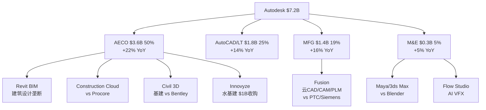

# ADSK Shared Context — Phase间传递文件
> **创建**: Phase 0 (2026-03-25) | **更新**: 每Phase完成后

---

## 核心身份

**Autodesk (ADSK)** — AEC+MFG设计软件垄断者 | $7.2B Rev | $51B MCap | 56%国际收入
- **AECO**(50%): Revit BIM+AutoCAD+Civil 3D+ACC建设云 — BIM mandate驱动, +22%
- **AutoCAD/LT**(25%): CAD drafting — 成熟cash cow, +14%
- **MFG**(19%): Fusion CAD/CAM/PLM — 第二曲线, +16%, 面临PTC/Siemens竞争
- **M&E**(5%): Maya/3ds Max/Flow Studio — 低增速(+5%), AI VFX机会

---

## Reverse DCF锚 (P1叙事约束)

| 维度 | Standard FCF | Owner Economics |
|------|-------------|----------------|
| 隐含5Y CAGR | **10.9%** | **18.4%** |
| vs FY2027 Guidance | 低1.6pp(温和悲观) | 高5.9pp(苛刻) |
| vs 有机历史 | 接近低端(10-12%) | 远超历史 |

**P1叙事约束**: 标准FCF角度"温和悲观",但Owner角度"苛刻"。Bull case需要证明: (1)SBC收敛加速, 或(2)增速超guidance, 或(3)WACC应该更低。不能直接claim"显著低估"。

---

## P0对标锚 (铁律H)

**最相似可比: PTC (增速12% vs ADSK有机~12%, CAD/PLM竞争, Fwd PE 22x vs 19x)**

| 维度 | ADSK | PTC | 含义 |
|------|------|-----|------|
| 有机增速 | ~12-13% | ~12% | 几乎相同 |
| Non-GAAP OPM | 38% | 32% | ADSK盈利能力更强 |
| FCF Margin | 33% | 25% | ADSK现金转化更优 |
| Fwd PE | 19x | 22x | ADSK估值更低(-14%) |
| SBC/Rev | 10.9% | 14% | ADSK SBC更低 |
| 国际占比 | 56% | 40% | ADSK FX风险更高 |

**约束声明**: ADSK在盈利能力和现金转化上优于PTC,但估值更低(19x vs 22x)。差距可能来自: (1)FX风险溢价, (2)SEC调查残留折价, (3)计费转型不确定性。如果这些因素消退→ADSK有3-4x PE扩张空间(~$30-40/股)。

---

## 9个核心问题 (CQ) + P0初步方向

| CQ | 问题 | P0初步判断 | 置信度 |
|----|------|-----------|--------|
| CQ1 | 计费转型真实影响 | 有机增速12-13%(扣除追赶), FY2027 guidance一致 | 65% |
| CQ2 | AI净影响 | 分裂: Neural CAD增强Fusion/Revit, 但可能蚕食AutoCAD低端 | 40% |
| CQ3 | 定价权可持续性 | Flex 2.7x溢价=低端扩展不蚕食; 但NRR仅100-110%=高端扩展有限 | 50% |
| CQ4 | 双引擎质量差异 | AECO(+22%)明显强于AutoCAD(+14%)/M&E(+5%) | 70% |
| CQ5 | SBC与真实盈利 | SBC/Rev 10.9%在收敛(FY2027<10%), 但Owner FCF Yield仅3.4% | 60% |
| CQ6 | 护城河迁移 | DWG 40年锁定仍在, APS平台早期, 迁移进度~15-20% | 45% |
| CQ7 | 竞争格局 | AECO稳固(Revit), MFG弱(Fusion vs PTC/Siemens), 基建弱(vs Bentley) | 55% |
| CQ8 | Reverse DCF估值 | 标准=温和悲观, Owner=苛刻, 总体偏中性 | 60% |
| CQ9 | 管理层质量 | 2024 SEC调查(已结案)+CEO 0买8卖+$2B收购待审计 | 35% |

---

## 关键数据异常 (Phase 1必须调查)

1. **ETR异常**: FY2026 29.9% vs FY2025 19.7% — FDII/GILTI选择, FY2027预计~20%正常化
2. **重组$216M**: 16%员工裁员 — 是one-time还是业务压力信号?
3. **NRR范围披露**: 只给100-110%/above 110%范围,不给精确数字 — 透明度问题
4. **Non-current DR暴降**: $1,377M→$287M — 多年合同几乎全部转为年度
5. **S&M FY2026反弹**: S&M/Rev从32.6%→32.9%(+0.3pp) — 重组费膨胀还是效率恶化?
6. **CEO零买入**: 5年8次卖出0次买入 — 无conviction信号

---

## Mermaid: 业务结构

---

## Phase 0 Checklist

- [x] Reverse DCF完成(Python验证)
- [x] P0对标完成(PTC最相似, ADBE/CRM/NOW/DDOG SaaS维度)
- [x] 7个P0阻断项全部resolved
- [x] 9个CQ定义+P0初步方向
- [x] shared_context创建
- [ ] Phase 0.5 CQ路由(需要用户确认)
- [ ] Phase 0.75 核心矛盾结晶
- [ ] preflight_gate.sh
