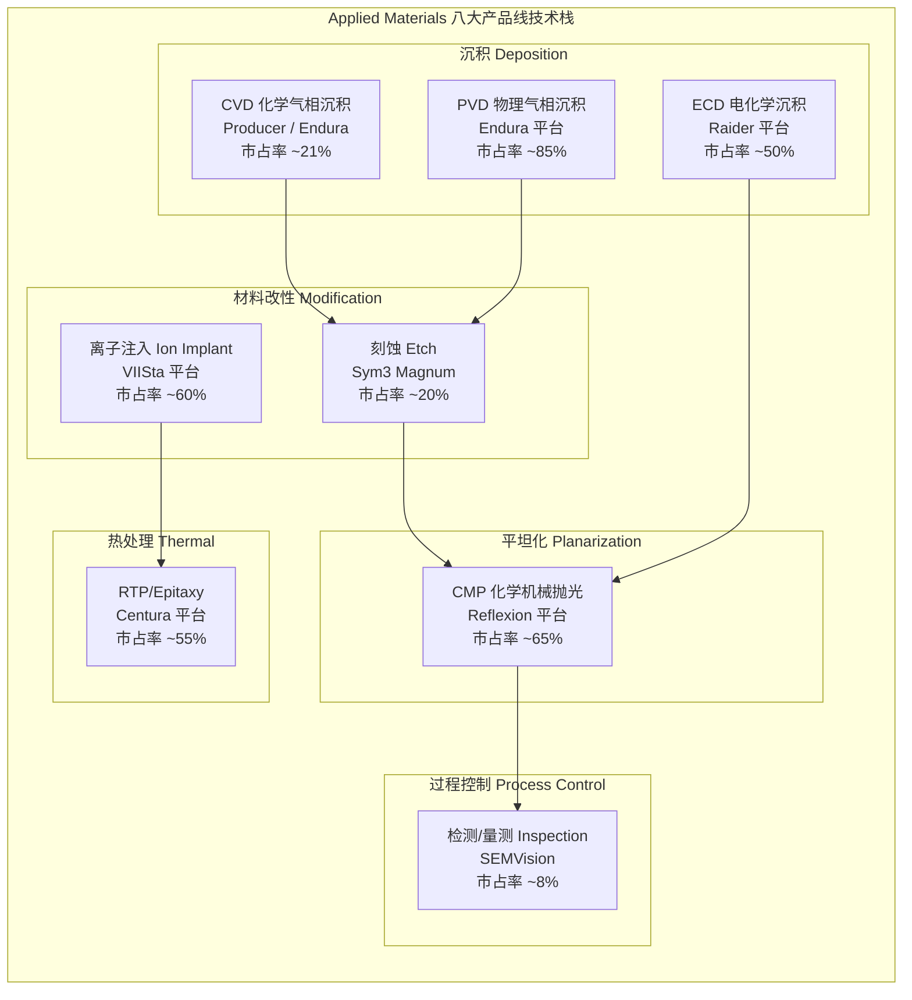
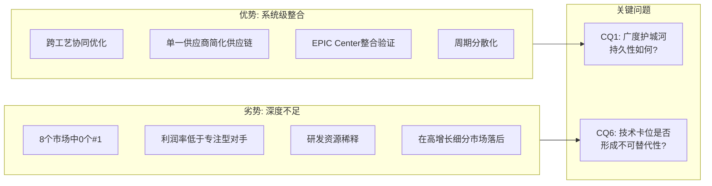
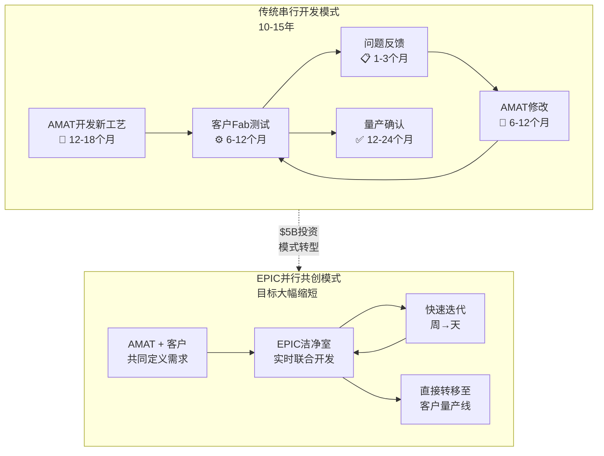
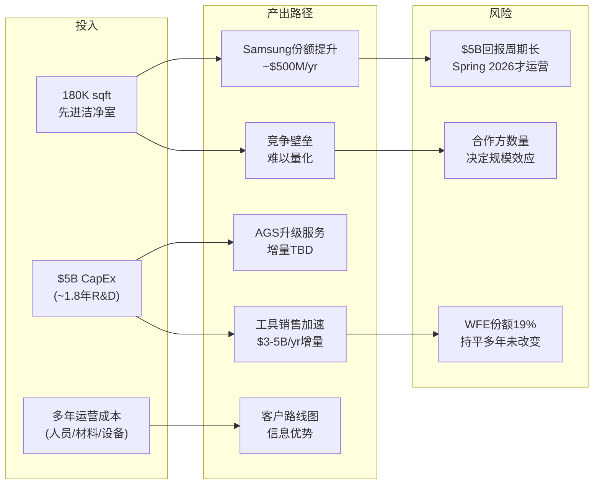
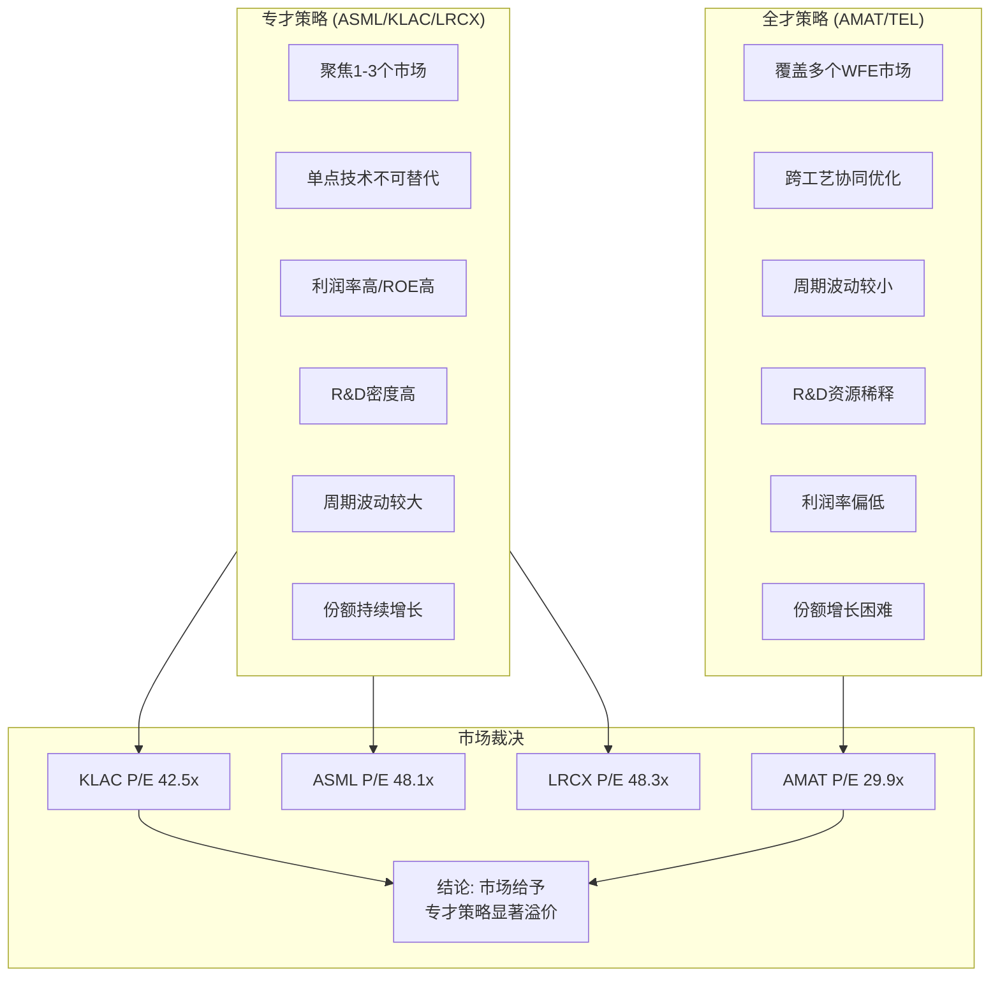

# Ch3: 技术架构 — 八大产品线深度解析

Applied Materials是全球半导体设备行业中产品线最为广泛的公司，横跨CVD、PVD、ECD、刻蚀、离子注入、检测、CMP及RTP/Epitaxy八大核心工艺领域。这种"全产品线"战略使AMAT在整个晶圆制造流程中拥有独特的系统级视角，但也意味着在任何单一细分市场中，AMAT都面临着深度专注型竞争者的强力挑战。理解这八条产品线的技术原理、市场地位与竞争格局，是评估AMAT长期投资价值的第一步。

## 3.1 八大产品线技术栈全景



## 3.2 逐一深剖：八大产品线

### (1) CVD 化学气相沉积 — 沉积领域的核心战场

**技术原理**: CVD通过化学反应将气态前驱体转化为固态薄膜沉积在晶圆表面，是制造介质层、阻挡层及图案化膜层的核心工艺。随着节点缩小，原子层沉积(ALD)作为CVD的极端精细版本正在快速增长。

**AMAT市场地位**: AMAT在CVD/PVD设备领域合计持有约21%的全球份额 [DM-COMP-001]，其Producer平台是300mm CVD的主力产品。2024年，AMAT推出Producer XP Pioneer CVD图案化薄膜系统，已被领先DRAM制造商采用。AMAT的CVD产品SAM(Serviceable Addressable Market)从2013年的约$1.5B增长至2023年的超过$8B，份额从约10%提升至超过30%。

**核心产品**: Producer平台(大批量CVD/ALD)、Endura平台(集成CVD+PVD)

**主要竞争者**: Lam Research(通过收购Novellus获得CVD能力，ALTUS ALD平台在金属钼沉积领域领先)、Tokyo Electron(积极进入ALD市场)、ASM International(ALD纯粹玩家，技术深度极强)

**竞争评估**: CVD是一个碎片化市场，AMAT在传统CVD中保持稳固地位，但在高增长的ALD子领域面临Lam和ASM International的激烈竞争。Mizuho分析师特别指出，Plasma CVD是AMAT面临份额压力的关键领域之一，中国Naura也在>28nm节点获取份额。

### (2) PVD 物理气相沉积 — AMAT的绝对统治领域

**技术原理**: PVD通过物理方法(主要是溅射)将靶材原子转移到晶圆表面，是金属互连、阻挡层和种子层制造的关键工艺。

**AMAT市场地位**: PVD是AMAT最强势的单一产品线。Endura平台拥有超过25年的技术积累，被称为"半导体行业历史上最成功的金属化系统"，在PVD领域保持约85%的市场份额，近乎垄断。

**核心产品**: Endura平台(多代演进，覆盖Cu/Al/W/Mo等多种金属溅射)

**主要竞争者**: Naura(中国，过去五年从1%增长至约10%份额，年增2-5pp)、Ulvac(日本，聚焦特定应用)

**竞争评估**: PVD是AMAT利润率最高的产品线，但也是最受中国竞争威胁的领域。Redburn-Atlantic在降级报告中特别指出，PVD作为AMAT最大利润贡献者，正在流失份额给Naura。Mizuho估计AMAT每年在PVD领域丢失2-4个百分点 [DM-COMP-001]。值得注意的是，Naura的份额增长目前集中在>28nm成熟节点，先进节点的PVD技术壁垒(如原子级精度的阻挡层/衬底层)仍然极高。

### (3) ECD 电化学沉积 — 先进封装的关键工艺

**技术原理**: ECD利用电化学反应在晶圆表面沉积金属(主要是铜)，是双大马士革铜互连工艺的核心步骤，也是先进封装(TSV、微凸点、RDL)的关键工艺。

**AMAT市场地位**: Raider平台是ECD领域的两大主力之一，与Lam Research的3D SABRE平台(源自Novellus收购)形成双寡头格局，AMAT持有约50%份额。

**核心产品**: Raider ECD平台(支持150mm-300mm，覆盖Cu/Au/Ni/Sn等多种金属)

**主要竞争者**: Lam Research(3D SABRE平台，在先进封装ECD领域竞争力略强)

**竞争评估**: 随着先进封装(2.5D/3D、混合键合)市场快速扩张，ECD的重要性正在提升。AMAT在传统互连ECD中保持强势，但Lam在先进封装ECD细分市场的技术领先值得关注。

### (4) 刻蚀 Etch — 从弱势走向强势的关键突破

**技术原理**: 刻蚀利用等离子体化学反应选择性去除材料，是将光刻图案转移到晶圆功能层的核心工艺。分为导体刻蚀(conductor etch)和介质刻蚀(dielectric etch)两大类。

**AMAT市场地位**: 在整体刻蚀市场中，AMAT排名第三(约20%份额)，落后于Lam Research(约45-50%)和Tokyo Electron(约25%)。但Sym3 Magnum平台在特定细分市场取得了重大突破——CY2024刻蚀收入超过$1.2B [DM-COMP-003]，在EUV图案化刻蚀领域成为DRAM应用中最广泛采用的技术。

**核心产品**: Sym3 Y Magnum(导体刻蚀，EUV图案化)、Sym3 Z Magnum(2026年新推出，面向GAA导体刻蚀)

**主要竞争者**: Lam Research(刻蚀领域绝对霸主，特别是在NAND高深宽比刻蚀中无人能及)、Tokyo Electron(低温刻蚀技术可能颠覆NAND通道刻蚀市场)、AMEC(中国，在>28nm导体刻蚀领域获取份额)

**竞争评估**: 刻蚀是AMAT增长最快的产品线之一。Sym3 Magnum在EUV图案化导体刻蚀中的突破性进展，使AMAT的图案化SAM从2013年的$1.5B/10%份额扩张至2023年的$8B/30%+份额。然而，Mizuho指出AMAT在>28nm导体刻蚀领域(约占总收入的一部分)面临中国AMEC的份额侵蚀。刻蚀市场的结构性特点是Lam的深度护城河极难撼动——特别是在sub-3nm逻辑和高层NAND中，Lam的原子层刻蚀(ALE)精度无人能及。

### (5) 离子注入 Ion Implant — 隐形冠军

**技术原理**: 离子注入将带电离子高速射入晶圆以改变半导体材料的电学特性(掺杂)，是晶体管制造中控制阈值电压和导电性的核心工艺。

**AMAT市场地位**: VIISta平台使AMAT在离子注入市场保持约60%的领先份额——2023年份额增长超过50%。这是AMAT除PVD外最强势的产品线。

**核心产品**: VIISta平台(覆盖高电流/中电流/高能量全系列)、VIISta CS(化合物半导体专用，SiC离子注入领先)

**主要竞争者**: Axcelis Technologies(唯一主要竞争者，在高能量注入领域曾威胁AMAT，但近年份额回落)

**竞争评估**: 离子注入是一个约$1.7B的"小"市场(2024年全球约$16.8亿)，但AMAT凭借60%+的份额获得稳定现金流。值得关注的是SiC功率半导体的增长为VIISta CS创造了增量机会。

### (6) 检测/量测 Inspection — KLA统治下的艰难突围

**技术原理**: 检测与量测系统在制造过程中实时监测晶圆缺陷、关键尺寸和膜层特性，是良率管控的核心。分为光学检测和电子束(e-beam)检测两大技术路线。

**AMAT市场地位**: 在整体过程控制市场中，AMAT份额从2010年的约13%下降至2024年的约8%以下，与KLA(约63%份额)的差距持续扩大。然而，AMAT在e-beam缺陷复查(defect review)领域保持竞争力，2025年推出SEMVision H20系统(冷场发射技术，分辨率提升50%，成像速度提升10倍)。

**核心产品**: SEMVision(e-beam缺陷复查)、PROVision(e-beam晶圆检测)——e-beam收入目标CY2026翻倍至>$1B [DM-COMP-005]

**主要竞争者**: KLA(绝对霸主，光学检测份额>80%，整体过程控制>63%)、ASML(e-beam检测领域击败AMAT)

**竞争评估**: 检测是AMAT最弱势的产品线之一。KLA在过程控制领域的护城河极其深厚——光学检测>80%份额、软件生态锁定、先进封装检测扩张。AMAT选择差异化路线，押注e-beam检测(vs KLA的光学主导)，目标是在先进节点中e-beam需求增长的趋势中获取增量。但Seeking Alpha的分析指出，AMAT曾大力宣传的e-beam检测战略实际上份额在流失给KLA的光学方案。

### (7) CMP 化学机械抛光 — 隐性利润贡献者

**技术原理**: CMP通过化学反应与机械研磨的结合实现晶圆表面的全局平坦化，是多层互连制造中每一层金属化后的必经步骤。

**AMAT市场地位**: Reflexion平台使AMAT在CMP领域连续七年保持行业领导地位，份额约65%。CMP是一个相对稳定的市场，AMAT的先发优势和工艺积累形成了较强的客户粘性。

**核心产品**: Reflexion LK/GT系列(300mm单晶圆CMP)

**主要竞争者**: Ebara(日本，CMP第二大供应商)、Lam Research(通过收购进入CMP)

**竞争评估**: CMP是AMAT的"稳定器"——市场规模约$7B(2025年)，增长温和但稳定。AMAT的65%份额意味着年贡献约$4.5B收入(含耗材/服务)，是AGS部门高利润率的重要来源之一。

### (8) RTP/Epitaxy 快速热处理与外延 — 基础但不可或缺

**技术原理**: RTP通过快速加热/冷却实现退火、氧化和硅化物形成；Epitaxy在晶圆表面生长高质量单晶硅层，是晶体管沟道制造的第一步。两者共同构成晶圆热处理的基石。

**AMAT市场地位**: Centura平台是RTP和Epitaxy领域的领导者，份额约55%。Centura Xtera Epi已被领先Foundry/Logic客户采用，为GAA晶体管提供关键的外延层。

**核心产品**: Centura Radiance(RTP)、Centura Xtera Epi(先进外延)、Centura RP Epi(PMOS/NMOS外延)

**主要竞争者**: ASM International(Epitaxy领域的强劲对手)、Kokusai Electric(批式热处理)、Tokyo Electron

**竞争评估**: RTP/Epitaxy是AMAT受益于GAA转型的关键产品线——GAA晶体管需要更多外延生长步骤和更精密的热处理控制。随着GAA收入从$2.5B翻倍至$5B [DM-COMP-004]，Centura平台的工具含量(tool intensity per wafer)将显著提升。

## 3.3 "全才"战略的结构性评估



AMAT在八大市场的综合份额约19% [DM-COMP-001]，多年持平。这个数字背后隐藏着一个关键矛盾：

**"广度溢价"论点(Bull)**: 半导体制造的复杂度正在结构性提升——每个新节点需要更多工艺步骤，GAA+3D封装增加每晶圆工具含量。AMAT的全产品线覆盖使其能够提供跨工艺的协同优化方案(如CVD+Etch+CMP的集成流程)，这是任何单一产品线供应商无法复制的。CEO退休时提出的"1/3-1/3-1/3"框架(材料工程、光刻、先进封装各占1/3)暗示材料工程的相对重要性正在上升，而AMAT恰恰是材料工程的旗舰。

**"广度折价"论点(Bear)**: AMAT在8个市场中没有任何一个排名第一——PVD虽然份额最高(~85%)但正在被Naura侵蚀；其余市场中CVD/Etch排第二三位，检测远落后于KLA。研发费用$3.57B [DM-RD-001]分散在8条产品线上，平均每条产品线仅约$4.5亿——相比之下，KLA将$1.28B全部投入过程控制，ASML将$4.66B几乎全部投入光刻。这种研发资源的稀释可能解释了AMAT为何在高增长的ALD(被ASM/Lam蚕食)和光学检测(被KLA统治)领域增长乏力。

**关联CQ1(广度护城河持久性)**: AMAT的广度护城河并非不可侵蚀。Mizuho指出约60%的收入位于份额正在下降的细分市场(PVD/Plasma CVD/28nm+导体刻蚀)。如果中国竞争者在成熟节点的份额侵蚀速度超预期，广度护城河的价值将被重新定价。但另一方面，在先进节点(GAA/BSPDN/HBM)，工艺复杂度的非线性增长为AMAT的系统级整合能力创造了结构性需求。

**关联CQ6(技术卡位)**: AMAT的真正技术卡位不在单一产品线，而在"材料工程"这个概念层面——随着光刻微缩接近物理极限，材料创新(新沟道材料、新互连金属如钼替代钨、新介质材料)成为延续摩尔定律的关键路径。AMAT的八大产品线恰好覆盖了材料创新所需的全部工具链。这也是EPIC Center $5B投资背后的核心逻辑。

---

# Ch4: EPIC Center — $5B创新平台深度分析

## 4.1 战略定位：为什么AMAT需要投$5B？

Applied Materials的EPIC(Equipment and Process Innovation and Commercialization) Center代表了一个清晰的战略赌注：当WFE份额在19%持平多年 [DM-COMP-001]、ASML已取代AMAT成为全球第一大设备供应商 [DM-COMP-002]时，AMAT选择用$5B [DM-EPIC-001]投资重新定义竞争规则——从"卖设备"转向"卖创新周期加速"。

理解这一战略，需要首先理解半导体行业面临的核心瓶颈：

**传统芯片开发周期**：从基础研究到量产商业化通常需要10-15年 [DM-EPIC-003]。这个漫长的周期意味着（a）研发投入的回收期极长，（b）许多创新在量产前就因良率问题而被放弃，（c）芯片制造商、设备制造商和材料供应商之间的协作效率极低。

**AMAT的诊断**：问题不在于"缺少创新"，而在于"创新的商业化速度太慢"。根本原因是传统的"串行开发模式"——设备商开发新工艺→芯片制造商在自己的Fab中测试→发现问题反馈给设备商→设备商修改→再测试……这个循环每次需要数月。

**EPIC的解决方案**：将这个串行循环压缩为"并行共创模式"——芯片制造商的工程师直接进驻EPIC Center的180,000平方英尺先进洁净室 [DM-EPIC-001]，与AMAT的工程师肩并肩在同一条产线上同时开发工艺。这将每次迭代的周期从"数月"压缩到"数周甚至数天"。



## 4.2 Samsung作为首位Founding Partner的战略意义

2026年2月11日，Samsung Electronics成为EPIC Center的首位founding member [DM-EPIC-002]。这一公告的战略分量远超表面：

**为什么Samsung是最理想的首位合作伙伴**：

1. **全品类覆盖**：Samsung同时是全球领先的Logic Foundry(仅次于TSMC)、DRAM制造商(与SK Hynix、Micron三分天下)和NAND Flash制造商。这意味着在EPIC Center开发的技术可以跨Logic/DRAM/NAND三大应用场景验证——这是TSMC(纯Logic)或SK Hynix(纯Memory)无法提供的广度。

2. **GAA追赶紧迫性**：Samsung的3nm GAA工艺(SF3E)良率问题是公开的行业共识，导致多个客户(包括高通)转向TSMC。Samsung对GAA工艺的改进有极强的紧迫感，这使得它愿意投入更多资源参与EPIC Center的共同开发，特别是在AMAT擅长的材料工程领域(如GAA纳米片平滑化、背面供电蚀刻)。

3. **DRAM技术竞争**：DRAM在Semi Systems中的占比已达创纪录的34% [DM-SEG-005]。Samsung需要在下一代DRAM架构(如3D DRAM)中保持技术领先，而EPIC Center正是探索"未来内存架构"的核心平台。

4. **信号效应**：Samsung的加入为EPIC Center的可信度背书，将有助于吸引更多Tier 1芯片制造商(推测TSMC、Intel、SK Hynix是下一批潜在合作方)。

**对AMAT的直接收益**：Samsung的加入意味着AMAT可以在EPIC Center中验证其产品在Samsung产线上的表现，大幅缩短从"样品验证"到"批量订单"的转化周期。历史上，AMAT在Samsung的GAA产线中的份额低于TSMC——EPIC Center的协作可能改变这一格局。

## 4.3 技术焦点与开发目标

EPIC Center的研发项目聚焦五大前沿技术方向，每一项都对应AMAT现有产品线的增量机会：

### (a) 原子级沉积/刻蚀/图案化

目标是开发能在原子尺度精确控制材料添加和去除的工艺——这是2nm及以下节点的核心技术需求。涉及AMAT的CVD/ALD(Producer/Spectral)、PVD(Endura)和Etch(Sym3 Magnum)三大产品线。

新产品案例：2026年2月10日，AMAT发布Viva纯自由基处理系统(平滑GAA硅纳米片)、Sym3 Z Magnum导体刻蚀系统(面向GAA)和Spectral ALD系统(以钼替代钨作为晶体管接触材料)。这些产品的共同特点是"材料创新驱动"——不是做更小的光刻图案，而是用更好的材料实现更优的器件性能。

### (b) 未来内存架构

随着DRAM微缩接近极限(目前主流为10nm级DRAM)，3D DRAM成为下一代架构方向。EPIC Center为探索3D DRAM的材料和工艺提供平台——这也是Samsung作为DRAM领导者加入的核心动机。

### (c) 先进3D集成(异构集成/先进封装)

2.5D/3D封装(如HBM堆叠、chiplet互连)对AMAT的ECD(Raider平台)、PVD(Endura)和CVD产品创造了增量需求。AMAT在2024年11月的能效计算峰会上宣布了专门针对先进封装的新协作模式。

### (d) 背面供电网络(BSPDN)

BSPDN是2nm及以下节点的关键架构创新——将供电网络从晶圆正面移至背面，为正面的晶体管留出更多空间。TSMC的A16工艺(计划2026年下半年量产)采用其Super Power Rail技术实现BSPDN。BSPDN需要大量新增工艺步骤(背面减薄、TSV形成、背面金属化)，几乎涉及AMAT全部八大产品线——这是"广度溢价"论点的最强证据之一。

### (e) 下一代晶体管材料

从硅到高迁移率沟道材料(如SiGe、III-V族)的过渡，需要全新的外延(Centura Xtera)、注入(VIISta)和热处理工艺链。AMAT在化合物半导体(SiC/GaN)领域已有布局——VIISta CS平台是SiC离子注入的领先方案，服务功率半导体制造。EPIC Center将这些分散的能力整合为系统性的材料创新平台。

### 技术焦点与AMAT产品线映射

| 技术方向 | 涉及AMAT产品线 | 增量SAM估计 | 时间窗口 |
|----------|----------------|-------------|----------|
| 原子级沉积/刻蚀 | CVD(Producer/Spectral) + Etch(Sym3) + PVD(Endura) | $3-5B | 2026-2028 |
| 3D DRAM | CVD + Etch + CMP + RTP | $2-3B | 2028-2030 |
| 先进3D封装 | ECD(Raider) + PVD + CVD + CMP + Inspection | $2-4B | 2025-2027 |
| BSPDN | 全八大产品线 | $1-2B | 2026-2028 |
| 新材料(Mo/SiGe) | PVD(Endura) + CVD(Spectral) + RTP(Centura) | $1-2B | 2027-2030 |

EPIC Center的技术聚焦精确对应了AMAT"全产品线"战略的核心价值——上述五大方向中，三个需要跨3条以上产品线的协同，一个(BSPDN)需要全部八大产品线配合。这是单一产品线竞争者(如KLA、ASML)无法在EPIC模式中复制的结构性优势。

## 4.4 ROI分析：$5B投入的回报路径

$5B是AMAT约1.8年的FY2025 R&D支出($3.57B/年) [DM-RD-001]，也相当于市值的约1.8% [DM-MKT-002]。这是一笔巨额但并非不可承受的投资。关键问题是：回报路径是什么？

**直接收入回报模型**：

1. **工具销售加速**：通过缩短客户验证周期，AMAT新产品从发布到大规模采用的时间可能从传统的3-5年压缩至1-3年。如果这使AMAT在GAA($2.5B→$5B翻倍 [DM-COMP-004])、BSPDN和HBM相关产品的渗透速度提升1-2年，增量收入可达$3-5B/年。

2. **份额提升**：EPIC Center的"锁定效应"——合作开发的工艺通常会深度绑定AMAT设备。如果EPIC帮助AMAT在Samsung的GAA产线中提升5个百分点的份额，按Samsung年WFE采购约$10B计算，增量约$500M/年。

3. **服务/AGS升级**：EPIC Center开发的新工艺将带动AGS($6.39B [DM-SEG-002])的升级服务需求，包括存量设备的软件升级和硬件改装。

**间接战略回报**：

4. **竞争壁垒**：任何竞争者都难以复制$5B规模的共创平台。TEL虽然宣布了$10B+的五年R&D+CapEx计划，但没有对标EPIC模式的设施。ASML的High NA EUV本质上是设备销售模式，不是协作创新模式。

5. **客户关系深化**：合作开发创造了设备商与芯片制造商之间前所未有的信息对称——AMAT将深入了解客户未来2-3代的技术路线图，使产品开发更加精准。



**ROI的关键不确定性**：

- **时间风险**：EPIC Center计划Spring 2026运营 [DM-EPIC-004]，从运营到产生可量化的收入贡献可能需要2-3年(2028-2029)。在此期间，$5B的折旧和运营成本将压制利润率。
- **规模效应取决于合作方数量**：Samsung是第一家，但EPIC Center的价值随合作方数量非线性增长(网络效应)。如果TSMC和Intel不加入(或延迟加入)，回报可能大打折扣。
- **历史教训**：WFE份额19%持平多年 [DM-COMP-001]的事实表明，AMAT过去的R&D投入($3.1-3.6B/年 [DM-RD-001][DM-RD-002][DM-RD-003])并未有效转化为份额增长。EPIC Center是否能打破这一模式？

**关联CQ4(创新溢价)**: EPIC Center的本质是将AMAT从"设备供应商"升级为"创新基础设施提供商"。如果成功，AMAT应享有超越纯设备销售的估值溢价——类似ASML因EUV垄断而获得的"技术基础设施溢价"。但与ASML不同，EPIC Center不是垄断性的技术壁垒(任何竞争者理论上都可以建类似设施)，其壁垒在于生态系统锁定(network effect)——谁先聚集最多的Tier 1合作方，谁就建立了不可逆的信息优势。Samsung的加入是第一块关键拼图，但远非最后一块。

---

# Ch5: 产品线宽度-深度矩阵 — AMAT vs 同业五维对比

## 5.1 五维对比框架构建

为系统性评估AMAT的"全才"策略与竞争对手的"专才"策略，我们构建五维度量化对比框架，覆盖AMAT、Lam Research (LRCX)、KLA (KLAC)、ASML和Tokyo Electron (TEL)五大WFE供应商。

### 维度定义与评分标准(0-10分)

| 维度 | 定义 | 10分标准 | 数据来源 |
|------|------|----------|----------|
| **产品线宽度** | 参与的独立WFE市场数量 | ≥8个独立市场 | 公司年报 |
| **单一市场深度** | 最强单一市场的份额×技术领先度 | ≥80%份额+无可替代技术 | 行业研报 |
| **利润率** | Gross Margin × Operating Margin综合 | GM>55% + OPM>40% | [DM-PEER-002] |
| **周期防御性** | 收入下行周期中的最大回撤幅度 | 下行周期跌幅<15% | 历史财务 |
| **创新投入效率** | R&D/Revenue + R&D/Gross Profit综合 | R&D>14%Rev + 高转化率 | [DM-RD-001]等 |

### 五大公司评分

| 维度 | AMAT | LRCX | KLAC | ASML | TEL |
|------|------|------|------|------|-----|
| 产品线宽度 | **9** | 4 | 2 | 1 | 7 |
| 单一市场深度 | 6 | 8 | 9 | **10** | 5 |
| 利润率 | 5 | 7 | **10** | 8 | 4 |
| 周期防御性 | **7** | 4 | 8 | 6 | 3 |
| 创新投入效率 | 5 | 6 | 8 | **9** | 4 |
| **总分** | **32** | **29** | **37** | **34** | **23** |

```mermaid
radar
    title 五大WFE供应商五维对比雷达图
    axis "产品线宽度", "单一市场深度", "利润率", "周期防御性", "创新投入效率"
    AMAT [9, 6, 5, 7, 5]
    LRCX [4, 8, 7, 4, 6]
    KLAC [2, 9, 10, 8, 8]
    ASML [1, 10, 8, 6, 9]
    TEL [7, 5, 4, 3, 4]
```

## 5.2 逐维度深度分析

### 维度一：产品线宽度 — AMAT 9分 vs 同业

AMAT覆盖8大独立WFE市场(CVD/PVD/ECD/Etch/Ion Implant/Inspection/CMP/RTP-Epi)，是Big 5中产品线最广的公司，评分9分。

**TEL(7分)** 覆盖Coater/Developer(光刻配套)、Etch、CVD/ALD、热处理、清洗、Wafer Prober等6-7个市场，宽度仅次于AMAT。但TEL在每个市场的深度均不及AMAT的最强领域(PVD/Ion Implant/CMP)。

**LRCX(4分)** 聚焦Etch + Deposition(CVD/ALD/ECD) + Clean三大领域。通过收购Novellus(2012)获得沉积能力后，Lam的产品宽度有所扩展，但仍远低于AMAT。

**KLAC(2分)** 几乎纯粹的过程控制(Inspection + Metrology)公司。产品线极窄，但深度无与伦比。

**ASML(1分)** 只做光刻。EUV + DUV两大产品系列，SAM极窄但绝对垄断。

### 维度二：单一市场深度 — ASML 10分 vs AMAT 6分

**ASML(10分)**: EUV光刻100%份额，整体光刻>90%。这是半导体行业中唯一真正的"不可替代"。没有ASML的EUV光刻机，先进节点芯片无法制造。

**KLAC(9分)**: 过程控制63%份额且持续增长(2010年50%→2024年63%)。光学检测>80%。KLA的护城河不仅是设备，更是30+年积累的缺陷数据库和软件生态。

**LRCX(8分)**: 刻蚀45-50%份额，特别是在NAND高深宽比刻蚀中的技术领先度几乎无法被追赶。Lam的"原子层刻蚀"精度在sub-3nm节点无人能及。

**AMAT(6分)**: PVD约85%份额是AMAT最强的单点。但PVD正在被Naura侵蚀(1%→10%)，且PVD市场规模相对较小(全球约$21B含非半导体应用)。如果只看半导体PVD，AMAT的绝对收入贡献有限。其余产品线(CVD ~21%, Etch ~20%, Inspection ~8%)的深度明显不足。

**TEL(5分)**: TEL在Coater/Developer领域份额最高(约90%，仅次于ASML在光刻中的地位)，但Coater/Developer的技术壁垒和利润率远低于EUV光刻。

### 维度三：利润率 — KLA 10分 vs AMAT 5分

| 指标 | AMAT | LRCX | KLAC | ASML | TEL |
|------|------|------|------|------|-----|
| Gross Margin | 48.7% [DM-PRF-001] | ~47% | ~62% | ~51% | ~44% |
| Operating Margin | 29.2% [DM-PRF-002] | 32.0% [DM-PEER-002] | 43.1% [DM-PEER-002] | 34.6% [DM-PEER-002] | ~27% |
| ROE | 38.9% [DM-PEER-003] | 65.6% [DM-PEER-003] | 100.7% [DM-PEER-003] | 50.5% [DM-PEER-003] | ~25% |

**KLA(10分)**: 43.1%的Operating Margin和100.7%的ROE在Big 5中遥遥领先。过程控制的本质是"软件+光学"——一旦开发完成，边际成本极低，且客户粘性极高(转换成本巨大)。

**AMAT(5分)**: 29.2%的Operating Margin在Big 5中排名倒数第二(仅高于TEL)。这直接反映了"全才策略"的利润率代价——8条产品线意味着8套研发团队、8套制造供应链和8套销售/服务团队。Semi Systems Non-GAAP Gross Margin 54.5% [DM-PRF-008]显示设备本身的利润率并不低，但高额研发费用(12.6%的Revenue [DM-RD-001])拉低了整体利润率。

**核心问题**: AMAT的R&D费用$3.57B [DM-RD-001]虽然绝对值高于KLA($1.28B)和LRCX($2.0B)，但分摊到8条产品线后，每条线平均仅约$4.5亿。而KLA的$1.28B全部集中在过程控制，LRCX的$2.0B集中在2-3条产品线——专注型公司的研发密度远高于AMAT。这解释了为何AMAT在新兴细分市场(ALD、光学检测)增长乏力。

### 维度四：周期防御性 — AMAT 7分的分散化效果

半导体设备行业是典型的强周期行业。评估各公司在下行周期中的抗跌能力：

| 指标 | AMAT | LRCX | KLAC | ASML | TEL |
|------|------|------|------|------|-----|
| FY2023→2024收入变化 | +2.5% | -14.5% | -2.7% | +29.5% | 约-5% |
| FY2019→2020收入变化(疫情) | +18.4% | +22.7% | +3.7% | -5.6% | 约+10% |
| 2019下行周期最大收入回撤 | -12.7% | -22.1% | -3.8% | -16.3% | 约-18% |

**AMAT(7分)**: 8条产品线的分散化确实提供了周期防御性。FY2022→FY2023 AMAT收入增长2.8%($25.79B→$26.52B [DM-REV-002][DM-REV-003])，而同期LRCX收入下降14.5%。AMAT的收入波动性显著低于LRCX和TEL。

**KLAC(8分)**: 过程控制是"刚性需求"——无论上行还是下行周期，芯片制造商都需要检测和量测。KLA在下行周期中的收入回撤最小。

**LRCX(4分)**: 刻蚀和沉积设备采购与资本开支高度正相关。当WFE下行时，LRCX收入波动最大。

**ASML(6分)**: EUV的垄断地位使ASML有较强的定价权，但EUV订单的"大单"特性导致季度波动较大。

**分散化效果量化**: AMAT的8产品线理论上应大幅平滑周期波动，但实际效果有限——因为所有8条产品线都服务于半导体制造，终端需求(WFE总额)是共同的宏观驱动因素。产品线之间的相关性远高于独立行业之间。AMAT的真正周期防御来自AGS服务部门($6.39B [DM-SEG-002]，占总收入22%)——服务收入相对稳定，不随设备采购周期大幅波动。

### 维度五：创新投入效率 — ASML 9分 vs AMAT 5分

| 指标 | AMAT | LRCX | KLAC | ASML | TEL |
|------|------|------|------|------|-----|
| R&D/Revenue | 12.6% [DM-RD-001] | 11.8% | 13.0% | 14-15% | 6.1% |
| R&D/Gross Profit | ~25.9% | ~25.1% | ~21.0% | ~28.4% | ~13.9% |
| 份额变化(5Y) | 持平19% | 略降 | +10pp | +4pp | 持平 |

**ASML(9分)**: $4.66B的R&D投入几乎全部聚焦光刻，产出了High NA EUV(每台售价$350M+)等划时代产品。R&D转化效率极高——份额从2022年的17%增长至2024年的24%。

**KLAC(8分)**: $1.28B的R&D在过程控制领域产出了持续的份额增长(50%→63%)。R&D/Gross Profit仅21%，是效率最高的投入。

**AMAT(5分)**: $3.57B的R&D是Big 5中绝对值最高的之一(仅次于ASML)，但过去5年WFE份额持平在19%。$3.57B的R&D分散在8条产品线上未能转化为份额增长——这是AMAT估值折价的核心原因之一。

**TEL(4分)**: R&D仅占Revenue 6.1%，是Big 5中最低的。但TEL宣布了五年$10B+ R&D+CapEx计划，未来可能改善。

## 5.3 核心命题："全才" vs "专才" — 哪个长期更有价值？



**市场已经给出了明确裁决**：AMAT的P/E TTM 29.9x [DM-MKT-003] vs LRCX 48.3x / KLAC 42.5x / ASML 48.1x [DM-PEER-001]。AMAT是Big 4中估值最低的，估值折价幅度达30-40%。

**为什么市场给"全才"打折？**

1. **不可替代性差异**: ASML的EUV光刻机没有替代品，KLA的光学检测生态没有替代品，LRCX的高深宽比刻蚀没有替代品。AMAT的任何单一产品线都有替代方案——PVD有Naura/Ulvac，CVD有Lam/TEL，Etch有Lam/TEL，检测有KLA/ASML。

2. **利润率天花板**: 广度策略天然压制利润率。AMAT的Operating Margin 29.2% [DM-PRF-002]比KLA低14个百分点。即使AMAT的收入增长与同业持平，利润增长也会落后。

3. **R&D效率信号**: 5年份额持平 + $3.57B/年R&D → 市场判断AMAT的研发投入效率低于专注型对手。

**为什么"全才"策略可能在长期被低估？**

1. **结构性复杂度税**: CEO退休时的"1/3-1/3-1/3"框架暗示——随着光刻微缩接近物理极限，材料工程和先进封装的相对重要性正在上升。每个新节点需要更多工艺步骤(GAA比FinFET多30%+工艺步骤)，每晶圆工具含量(tool intensity)提升对全产品线供应商有利。

2. **BSPDN/3D集成的系统级需求**: 背面供电和3D堆叠需要沉积+刻蚀+CMP+ECD+检测的全链条协同优化。单一产品线供应商需要与其他供应商协调，而AMAT可以在内部完成跨工艺优化——EPIC Center正是为此而建。

3. **AGS复利**: 8条产品线意味着最大的装机量(installed base)，AGS服务收入($6.39B [DM-SEG-002])是稳定的高利润现金流。随着装机量年复一年增长，AGS的复利效应将越来越显著。

4. **估值折价可能过度**: 29.9x P/E vs 同业42-48x [DM-PEER-001]意味着市场已经充分定价了"全才折价"和中国风险。如果AMAT的广度在GAA/BSPDN时代确实创造了结构性需求增长，当前估值可能存在修正空间。

## 5.4 分散化效应量化分析

AMAT的8条产品线在周期中的表现并非完全同步。以下分析各产品线的周期特性：

| 产品线 | 周期敏感度 | WFE上行弹性 | WFE下行防御 | 份额趋势 |
|--------|-----------|-------------|-------------|---------|
| PVD | 中 | 中 | 强(必需工艺) | 下降(Naura) |
| CVD | 高 | 强 | 弱 | 持平 |
| Etch | 高 | 强 | 弱 | 上升(Sym3) |
| Ion Implant | 低 | 弱 | 强 | 稳定(60%) |
| CMP | 低-中 | 中 | 强 | 稳定(65%) |
| RTP/Epi | 中 | 中 | 中 | 稳定 |
| Inspection | 中 | 中 | 中 | 下降(vs KLA) |
| ECD | 中-高 | 强(封装增长) | 弱 | 稳定 |
| **AGS服务** | **低** | **弱** | **极强** | **上升** |

分散化的真正价值不在于产品线之间的低相关性(它们的相关性实际上很高，因为同一宏观周期驱动)，而在于**成长型产品线**(Etch/ECD)与**衰退型产品线**(PVD份额/Inspection份额)的此消彼长——Etch的Sym3 Magnum从$0增长至>$1.2B [DM-COMP-003]部分对冲了PVD在成熟节点的份额流失。

**关联CQ1(广度护城河持久性)**: AMAT的广度护城河并非静态的——它在持续进化。旧护城河(PVD垄断)正在被侵蚀，新护城河(Etch/GAA/BSPDN系统级整合)正在形成。关键判断在于：新护城河的形成速度是否能够超过旧护城河的衰退速度？如果EPIC Center成功加速了新工艺的商业化(特别是在Samsung的GAA产线中)，答案可能是肯定的。但如果中国竞争者在成熟节点的份额侵蚀速度超预期(Naura年增2-5pp)，且先进节点的工具含量增长不及管理层指引，广度护城河的净值可能逐年递减。

FY2025 Semi Systems收入约$20.80B [DM-SEG-001]中，约67%来自Foundry/Logic [DM-SEG-006]，34%来自DRAM [DM-SEG-005](有部分重叠因统计口径)，约7%来自NAND [DM-SEG-007]。Foundry/Logic的强势主要受益于GAA扩产——GAA收入从$2.5B翻倍至$5B [DM-COMP-004]是未来两年收入增长的最大驱动力。DRAM在Semi Systems中达到创纪录34%的占比 [DM-SEG-005]反映了HBM对AMAT工具的强劲需求(HBM堆叠需要大量TSV/ECD/CMP工艺)。

**最终评估**: AMAT的"全才"策略在当前技术转折点(GAA/BSPDN/HBM)具有结构性优势，但这种优势是否能转化为WFE份额增长(从持平多年的19% [DM-COMP-001])仍是未验证的假设。市场给予的30-40%估值折价 [DM-PEER-001]可能过度反映了"全才折价"和中国风险，但也可能恰如其分地定价了AMAT低于同业的利润率 [DM-PEER-002]和R&D效率。这一估值差距何时收窄，取决于三个可观测指标：(1) WFE份额是否从19%向上突破，(2) Operating Margin是否从29%向32%+提升，(3) EPIC Center的第二、第三个founding member何时宣布。
