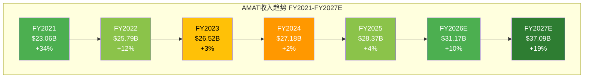
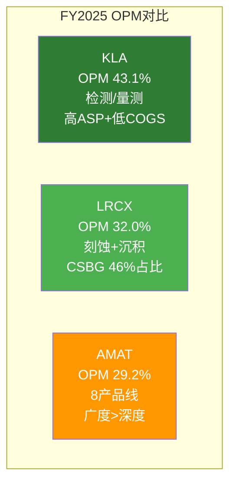
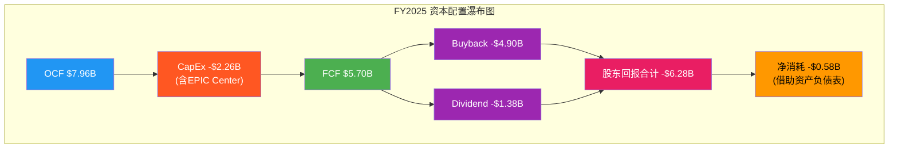
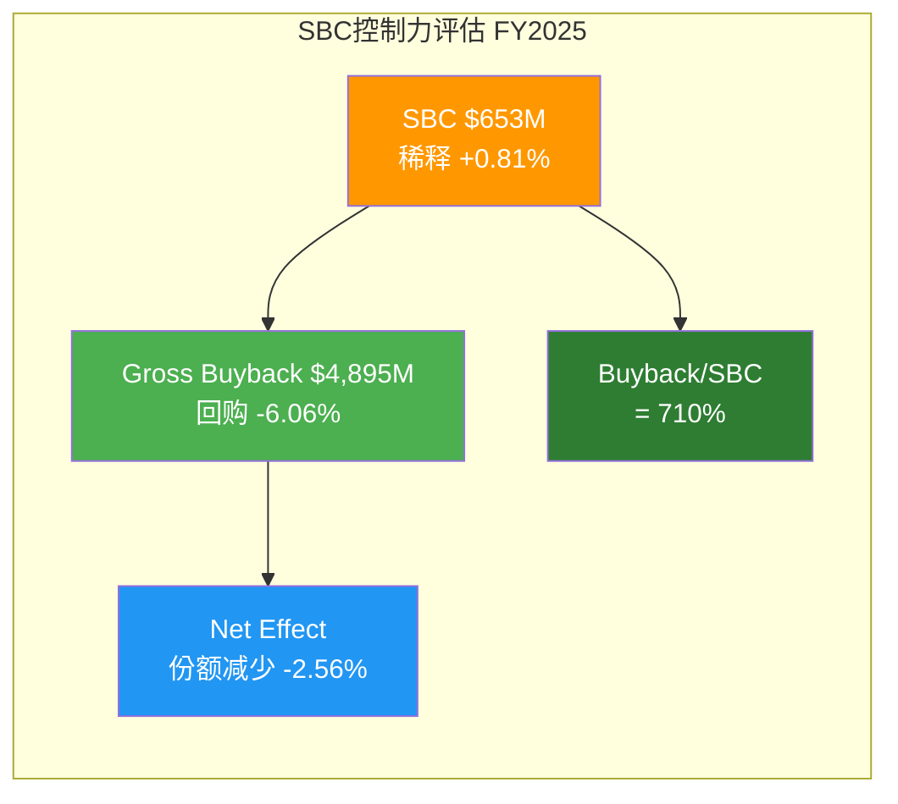
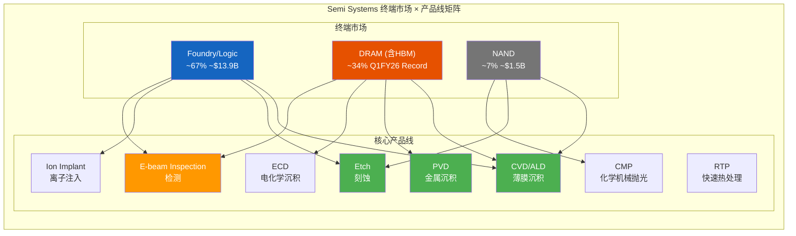
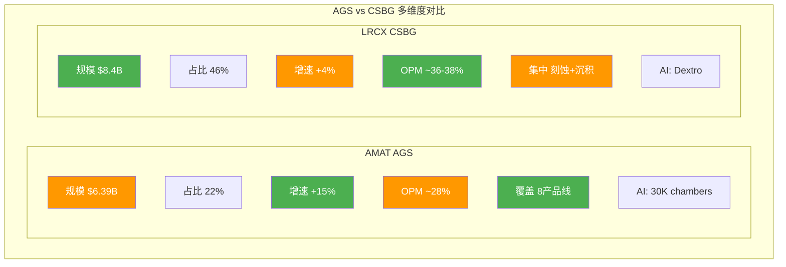
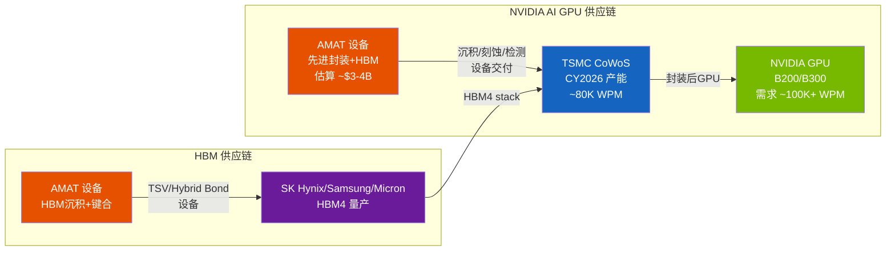

# Ch8: 五年财务趋势 — FY2021至Q1 FY2026

Applied Materials的财务轨迹在过去五年中呈现出一种看似矛盾的特征：收入增速持续放缓至个位数，但利润率、资本回报率和股东回报却逐年优化。这种"增速放缓、质量提升"的格局，是半导体设备行业成熟领导者的典型特征——也是理解AMAT当前估值水平的核心线索。

## 8.1 收入分析：从爆发到稳态，再到拐点

### 五年收入全景

FY2021至FY2025，AMAT收入从$23.06B增长至$28.37B [DM-REV-001][DM-REV-005]，五年CAGR仅为5.3%。这一增速在半导体设备板块中并不突出。但逐年拆解后，故事远比表面复杂。

**逐年增速演变**：

| 财年 | 收入($B) | YoY增速 | 驱动因素 |
|------|---------|---------|----------|
| FY2021 | $23.06 [DM-REV-001] | +34% | 疫情后晶圆厂扩产潮 |
| FY2022 | $25.79 [DM-REV-002] | +12% | 成熟制程扩张+中国需求 |
| FY2023 | $26.52 [DM-REV-003] | +3% | 出口管制+NAND周期底部 |
| FY2024 | $27.18 [DM-REV-004] | +2% | China限制加深+Memory疲软 |
| FY2025 | $28.37 [DM-REV-005] | +4% | DRAM结构性增长+先进封装 |

增速从FY2022的+12%逐步减速至FY2024的+2%，核心原因有三：第一，美国对华出口管制在FY2023-FY2024持续收紧，AMAT中国收入约30%（~$8.5B）[DM-GEO-001]面临结构性压力；第二，NAND投资处于深度周期底部，FY2025仅占Semi Systems的~7% [DM-SEG-007]，较周期峰值下降超过一半；第三，FY2021的+34%高基数效应持续稀释后续增速。

**FY2026拐点信号**：Q1 FY2026收入$7.012B [DM-REV-006]，虽同比持平（Q1 FY2025为$7.17B），但环比Q4 FY2025的$6.80B回升3.1%。更关键的是Q2 FY2026 Guidance $7.65B [DM-REV-007]，意味着环比加速至+9.1%。全年共识$31.17B [DM-REV-008]（+10% YoY）和FY2027E $37.09B [DM-REV-009]（+19% YoY），表明分析师群体正在Price In一轮由GAA转换+HBM+先进封装驱动的多年上行周期。

5.3%的五年CAGR本身并不令人兴奋，但它掩盖了一个事实：AMAT在出口管制逆风中仍实现了缓慢增长，而一旦中国收入企稳（FY2026E预计减少$600M-$710M [DM-GEO-006]但已被其他区域增量对冲），增速弹性可能超出线性外推。

### EPS的另一个维度

收入增速温和，但EPS表现显著更优。FY2021 EPS $6.40 → FY2025 EPS $8.66 [DM-EPS-001]，五年CAGR 7.9%——高于收入CAGR约2.6个百分点。这一差值来自三个杠杆：利润率扩张（GM从47.3%→48.7%）、回购导致的份额缩减（919M→808M shares，-12.1%）、以及利息收入的增长。FY2026E EPS $10.91 [DM-EPS-003]暗示+26% YoY增长，FY2027E $13.69 [DM-EPS-004]再加速+25%——EPS增速是收入增速的2-3倍，回购的杠杆效应在加速放大期尤为显著。

## 8.2 利润率分析：结构性优化还是周期性峰值？

### 毛利率趋势

AMAT的毛利率在五年中呈现稳定上行趋势：

| 财年 | GM (GAAP) | 较前一年变化 |
|------|-----------|-------------|
| FY2021 | 47.32% | — |
| FY2022 | 46.51% | -81bps |
| FY2023 | 46.70% | +19bps |
| FY2024 | 47.46% | +76bps |
| FY2025 | 48.67% [DM-PRF-001] | +121bps |
| Q1 FY2026 | 49.0% [DM-PRF-006] | +33bps seq |

FY2022的GM下降(-81bps)值得注意：当年收入增长+12%但毛利率反而收缩，原因是供应链紧张导致的成本上升以及中低端产品（200mm设备）占比提升。FY2023-FY2025的持续回升则反映了产品组合向高价值方向的结构性迁移——先进制程设备（GAA、EUV相关沉积/检测）和HBM设备的毛利率天然高于成熟制程产品。

**Semi Systems Non-GAAP GM 54.5%** [DM-PRF-008] vs 公司整体48.67% [DM-PRF-001]——这个580bps的差距揭示了利润率的结构性分层：

- Semi Systems（73%收入）的54.5%非GAAP GM是利润率天花板锚点
- AGS（22%收入）的GM估计在43-45%（服务业务含硬件零件拉低均值）
- Display（4%收入）的GM估计在35-38%（竞争激烈+规模较小）
- SBC、折旧等GAAP调整项进一步拉低约580bps

管理层在Q1 FY2026 Earnings Call上指引"全年GM向49%区间运行"，如果Semi Systems GM维持54-55%且占比提升至75%+，FY2026整体GM突破49%的概率较高。

### 营业利润率：为何AMAT在三巨头中最低？

AMAT的GAAP OPM 29.2% [DM-PRF-002] 在设备三巨头中最低（LRCX ~32.0%, KLA ~43.1%），原因并非执行力不足，而是**业务组合和研发模型的结构性差异**：

1. **产品线广度惩罚**：AMAT运营8条核心产品线（CVD/PVD/Etch/Ion Implant/CMP/RTP/Inspection/ECD），每条线都需要独立的研发团队和产品路线图。LRCX集中于刻蚀+沉积2-3条线，KLA更集中于检测/量测单一品类。产品线数量与SGA/R&D开支正相关。

2. **R&D投入率上升**：AMAT FY2023 R&D 11.7%→FY2024 11.9%→FY2025 12.6% [DM-RD-001][DM-RD-002][DM-RD-003]，三年提升90bps。这不是效率下降，而是AMAT同时投资GAA器件制造（CENTURA平台）、先进封装（Hybond/E-beam）、HBM沉积（Endura平台）、以及AI赋能的AGS数字化——多条前沿同时推进的代价。R&D/Gross Profit 25.85% [DM-RD-004]意味着每$4毛利中就有$1回流研发。

3. **LRCX的CSBG占比优势**：LRCX服务业务（CSBG）占总收入~46%，其OPM约36-38%。服务业务的高利润率和高占比拉升了LRCX整体OPM。AMAT的AGS仅占22% [DM-SEG-002]，对OPM的拉动效应不到LRCX的一半。

4. **KLA的品类集中度溢价**：KLA几乎是纯检测/量测公司（>85%），该品类天然享有高ASP、低材料成本比、高客户切换成本。43.1%的OPM部分是品类Red Ocean效应。

核心判断：AMAT的29.2% OPM不应被视为"低效"，而是"广度投资阶段"的合理代价。如果GAA+先进封装+HBM三个新增长引擎在FY2026-FY2027兑现（consensus指向收入+10%→+19%），OPM有30-32%的上行空间——这取决于收入杠杆能否快于OpEx增速。

### 净利率趋势

FY2025 Net Margin 24.67% [DM-PRF-003]，高于FY2021的25.5%之下水平。需要注意的是FY2024 Net Margin 26.4%高于FY2025的24.7%，主要因为FY2024有效税率仅12.0%（一次性税收优惠），而FY2025恢复至24.5%正常水平。剔除税率波动后，底层盈利能力呈稳定上行态势。

## 8.3 现金流与资本配置：FCF下降的真相

### 现金流五年全景

| 财年 | OCF($B) | CapEx($B) | FCF($B) | CapEx/OCF | FCF Margin |
|------|---------|-----------|---------|-----------|------------|
| FY2021 | $5.44 | $0.67 | $4.77 | 12.3% | 20.7% |
| FY2022 | $5.40 | $0.79 | $4.61 | 14.6% | 17.9% |
| FY2023 | $8.70 | $1.11 | $7.59 | 12.7% | 28.6% |
| FY2024 | $8.68 | $1.19 | $7.49 | 13.7% | 27.6% |
| FY2025 | $7.96 [DM-CF-001] | $2.26 [DM-CF-002] | $5.70 [DM-CF-003] | 28.4% | 20.1% |

**FY2025 FCF大幅下降**：从FY2024的$7.49B降至$5.70B [DM-CF-003]，降幅-24%。但OCF仅从$8.68B微降至$7.96B（-8.3%），FCF的断崖式下降几乎完全来自**CapEx翻倍**：$1.19B→$2.26B [DM-CF-002]，+90%。

CapEx激增的主因是AMAT在Sunnyvale建设的EPIC (Equipment and Process Innovation and Commercialization) Center——一个耗资数十亿美元的研发和客户协作中心。EPIC Center计划在CY2026投入运营，是AMAT历史上最大的单项资本支出项目。这意味着CapEx/OCF从FY2024的13.7%跃升至FY2025的28.4%是一次性建设周期，而非永久性资本密集度上升。

Q1 FY2026的OCF $2.828B和FCF $2.043B [DM-CF-007][DM-CF-008]暗示CapEx仍在高位（$0.785B/季），但FCF率已回升至29.1%（$2.043B/$7.012B），好于FY2025全年的20.1%。随着EPIC Center建设在CY2026年中完成，FY2027的CapEx大概率回落至$1.2-1.5B区间，届时FCF有望重返$8-9B水平。

### 股东回报的可持续性

FY2025股东回报：Buyback $4.895B [DM-CF-005] + Dividend $1.384B [DM-CF-006] = $6.279B，超过FCF $5.698B约$581M。这种"超额分配"在EPIC Center建设的特殊年份是可以接受的——AMAT以Net Cash $191M [DM-BS-003]的健康资产负债表为后盾，可以暂时动用现金储备。

回购有效性的关键指标：FY2025 Share Count Decline -2.56% [DM-SBC-006]。在SBC $653M [DM-CF-004]（2.30%收入 [DM-SBC-001]）的稀释压力下，AMAT的Buyback/SBC = 710% [DM-SBC-004]，意味着每$1的SBC稀释被$7.1的回购对冲。Net Buyback Rate 2.25% [DM-SBC-005]是实际的年份额缩减速度——五年累计缩减约12%（919M→799M shares），这对EPS的复合增长贡献了约2.5%/年。

### 资本配置评分

AMAT的资本配置体现了一种"进攻型防守"策略：在EPIC Center上大举投入（进攻），同时通过激进回购+股息持续回馈股东（防守）。FY2025是两者交叉的"高压年"，但资产负债表的健康度提供了足够缓冲。

## 8.4 资产负债表健康度：近乎完美的堡垒

AMAT的资产负债表在半导体设备板块中堪称教科书级别的健康：

**核心指标**：
- Cash $7.241B [DM-BS-001] vs Total Debt $7.050B [DM-BS-002] → **Net Cash Position $191M** [DM-BS-003]
- 这是一家实质上**零杠杆**的公司——在利率高企的环境中，净现金意味着零利率风险
- Total Equity $20.415B [DM-BS-004]，D/E仅0.35 [DM-BS-007]
- Current Ratio 2.61 [DM-BS-008]，远超半导体设备行业1.5-2.0的均值
- Altman Z-Score 11.98 [DM-BS-009]——"安全区"阈值为3.0，AMAT是该阈值的4倍

**Goodwill评估**：Goodwill $3.707B [DM-BS-005]，占总资产10.2%。主要来自早期收购（Varian Semiconductor $4.9B in 2011, Kokusai Electric投标等）。在总资产$36.3B的背景下，10.2%的商誉比例是可控的，但值得追踪——如果Display或特定产品线长期不达预期，减值风险存在但概率较低。

**存货$5.915B** [DM-BS-006]值得深入审视：

| 财年 | 存货($B) | 存货周转天数 | 收入($B) | 存货/收入 |
|------|---------|------------|---------|----------|
| FY2021 | $4.31 | 129天 | $23.06 | 18.7% |
| FY2022 | $5.93 | 157天 | $25.79 | 23.0% |
| FY2023 | $5.73 | 148天 | $26.52 | 21.6% |
| FY2024 | $5.42 | 139天 | $27.18 | 19.9% |
| FY2025 | $5.92 [DM-BS-006] | 148天 | $28.37 | 20.9% |

FY2022的存货峰值（$5.93B, 157天）反映了供应链危机期间的战略备料。FY2023-FY2024存货逐步消化，但FY2025又回升至$5.92B（148天）。这一回升并非积压，而是**为FY2026加速出货做准备**——Q2 FY2026 Guidance $7.65B [DM-REV-007]需要足够的在制品和成品存货支撑。存货/收入比20.9%在历史区间内（18-23%），不构成减值风险。

**$2B Revolving Credit Facility**未动用，为极端情景提供额外流动性缓冲。综合评估，AMAT的资产负债表在下行周期中可以承受收入下降20-25%而不需要削减回购或股息。

## 8.5 APIC验证与SBC深度分析

### APIC硬约束验证

这是确保SBC数据可信度的关键交叉验证步骤。APIC（Additional Paid-In Capital）的变化应当近似等于SBC加上期权行权流入，减去回购中归入APIC的部分。

- FY2024 APIC: $9.660B → FY2025 APIC: $10.333B
- **ΔAPIC = $673M**
- FMP报告SBC = $653M [DM-CF-004]
- 阈值: ΔAPIC × 1.1 = $740M
- $653M ≤ $740M → **PASS**

ΔAPIC ($673M) 与 FMP SBC ($653M) 的差值仅$20M，主要来自员工期权行权的APIC流入（FY2025 Common Stock Issuance $261M中归入APIC的部分）。这一验证结果确认FMP的SBC数据口径是可靠的，不存在RBLX案例中MacroTrends含DevEx导致SBC被高估的问题。

### SBC趋势与同业对比

| 财年 | SBC($M) | SBC/Revenue | SBC增速 |
|------|---------|-------------|---------|
| FY2021 | $346 | 1.50% | — |
| FY2022 | $413 | 1.60% | +19.4% |
| FY2023 | $490 [DM-SBC-003] | 1.85% | +18.6% |
| FY2024 | $577 [DM-SBC-002] | 2.12% | +17.8% |
| FY2025 | $653 [DM-SBC-001] | 2.30% | +13.2% |

SBC的绝对值在五年中几乎翻倍（$346M→$653M），四年CAGR 17.2%。SBC/Revenue从1.50%上升至2.30%，+80bps。增速本身在放缓（从+19%降至+13%），但趋势仍然是上行的。

**同业对比**：
- AMAT SBC/Revenue 2.30% [DM-SBC-001]
- LRCX SBC/Revenue ~1.86%（$343M/$18.4B）
- KLA SBC/Revenue 估计~2.0-2.5%

AMAT的SBC率略高于LRCX，但考虑到AMAT运营8条产品线（需要更多工程人员激励），2.30%仍在合理范围。关键是**Buyback/SBC = 710%** [DM-SBC-004]——这意味着回购力度远超稀释速度，SBC对长期股东的实际摊薄接近于零。

### 五年SBC效率总结

AMAT在SBC管理上的核心优势是**"给得多但买得更多"**。$653M的SBC是吸引和留住8条产品线高端工程人才的必要成本，而$4.9B的回购确保了这一成本不会转嫁给长期股东。在人才密集型的半导体设备行业，这是教科书级别的SBC管理策略。

---

# Ch9: 分部解剖 — 三大业务线 + 供应链桥梁

如果说Ch8展示了AMAT的"体检报告"，那么Ch9要回答的是"这台机器由哪些引擎驱动"。AMAT的三大业务线——Semi Systems、AGS、Display——各自扮演着截然不同的角色：增长引擎、现金奶牛、和周期期权。

## 9.1 Semi Systems（$20.80B，73%收入）：增长的主引擎

### 终端市场拆解

Semi Systems FY2025收入约$20.80B [DM-SEG-001]，占总收入73%，是AMAT增长叙事的绝对核心。按终端市场拆解：

| 终端市场 | 占Semi Systems比例 | 估算收入($B) | YoY趋势 |
|---------|-------------------|-------------|---------|
| Foundry/Logic | ~67% [DM-SEG-006] | ~$13.9B | 稳定，GAA transition驱动 |
| DRAM | ~34% (Q1 FY26 record) [DM-SEG-005] | ~$7.1B* | 强劲增长，HBM驱动 |
| NAND | ~7% [DM-SEG-007] | ~$1.5B | 周期底部 |

*注：Foundry/Logic 67%与DRAM 34%之和超过100%，因为管理层在不同场合使用不同基数口径——67%为FY2025全年Semi Systems口径，34%为Q1 FY2026单季口径。DRAM占比从FY2024的~23%跃升至Q1 FY2026的34%，反映HBM需求的结构性跃迁。

**DRAM从23%到34%的加速**：这是AMAT近年来最重要的结构性变化。传统DRAM投资以2D缩微为主，AMAT的沉积和刻蚀设备在DRAM中的"含量"（content per wafer）有限。但HBM（High Bandwidth Memory）从根本上改变了这一格局：

- HBM需要大量额外的沉积步骤（TSV铜填充、介质沉积、键合层）
- HBM的良率挑战要求更精密的检测（E-beam inspection）
- HBM4将从8层跳升至12-16层堆叠，每一层增加都乘法级放大设备需求

管理层在Q1 FY2026 Earnings Call上明确表示DRAM创下历史新高，且"预计DRAM强势将贯穿CY2026"。这不再是周期性脉冲——HBM的结构性需求正在将AMAT的DRAM业务从周期性波动转向结构性增长。

**Foundry/Logic的GAA Transition**：管理层披露GAA（Gate-All-Around）转换相关收入从$2.5B翻倍至$5B。GAA是FinFET之后的下一代晶体管架构，对沉积（ALD/CVD）、刻蚀、检测等设备的需求密度显著高于FinFET。AMAT在GAA相关的关键步骤（如纳米片堆叠的外延沉积）中拥有领先地位。

**NAND的周期期权**：7%的占比意味着NAND目前是Semi Systems中最小的终端市场。但3D NAND正在从232层向300+层演进，每一轮层数增加都需要更多的沉积和刻蚀步骤。当NAND投资周期回暖时（预计CY2026H2-CY2027），NAND占比回升至12-15%是可能的，这将为Semi Systems提供额外的$1-2B增量收入。

### 产品组合分析：8产品线的竞争格局

AMAT的独特性在于其**横跨8条核心产品线**的广度，这在全球半导体设备公司中是独一无二的：

1. **CVD/ALD（化学气相沉积）**：AMAT的最大单一产品线，覆盖前道工艺的绝大多数薄膜沉积步骤。Producer和Centura平台是行业标准。GAA transition中的选择性沉积（Selective Deposition）是AMAT的技术领先领域。
2. **PVD（物理气相沉积）**：Endura平台在金属互连沉积（Cu/Co barrier, liner）中拥有>70%市场份额。HBM的TSV铜填充也是Endura的增量市场。
3. **Etch（刻蚀）**：与LRCX和TEL竞争，AMAT约占导体刻蚀20-25%份额。不是AMAT的最强项，但在特定应用（硅刻蚀、Hard Mask刻蚀）中有差异化优势。
4. **Ion Implant（离子注入）**：虽然Axcelis是纯离子注入公司，AMAT在高能离子注入和先进掺杂领域仍有显著份额。
5. **CMP（化学机械抛光）**：Reflexion平台主导先进制程的CMP步骤，在平坦化精度上领先。
6. **RTP（快速热处理）**：Vantage平台在退火和氧化步骤中占据领导地位。
7. **E-beam Inspection（电子束检测）**：这是AMAT增速最快的产品之一——管理层指引E-beam收入在CY2026翻倍至>$1B。在先进制程（3nm/2nm）的缺陷检测中，光学检测（KLA主导）的分辨率达到极限，E-beam的物理优势开始显现。
8. **ECD（电化学沉积）**：主要用于铜填充和先进封装中的凸块/微凸块制造。

**利润率信号**：Semi Systems Non-GAAP GM 54.5% [DM-PRF-008] 是AMAT所有业务中最高的利润率水平。这反映了先进设备的高定价权——当TSMC需要2nm GAA的选择性沉积设备时，AMAT的Centura是极少数可选方案之一，议价能力极强。

## 9.2 AGS（$6.39B，22%）vs LRCX CSBG（$8.4B）：服务业务深度对比

AGS（Applied Global Services）是AMAT的"第二引擎"——增速不如Semi Systems炫目，但提供了稳定现金流和下行保护。为了理解AGS的战略价值，与LRCX的CSBG（Customer Support Business Group）做横向深度对比：

| 维度 | AMAT AGS | LRCX CSBG |
|------|---------|-----------|
| **FY2025规模** | $6.39B [DM-SEG-002] | ~$8.4B |
| **占总收入** | 22% | ~46% |
| **YoY增速** | +15% (Q1 FY26) [DM-SEG-004] | +4% |
| **估算OPM** | ~28% | ~36-38% |
| **安装基础覆盖** | 8产品线，广度覆盖 | 集中刻蚀+沉积 |
| **经常性收入占比** | ~2/3合同制 | ~60%合同制 |
| **AI赋能平台** | 30K chambers on AIx | Dextro platform |
| **续约率** | ~90% | ~90% |
| **零件+翻新** | 覆盖全产品线 | 刻蚀chamber为主 |
| **200mm设备服务** | 含(正在重分类) | 较少 |
| **股息覆盖** | AGS利润>全部股息 | CSBG利润>全部股息 |

### 关键差异解读

**规模差距的结构性原因**：LRCX CSBG是$8.4B vs AMAT AGS $6.39B，但CSBG占LRCX总收入的46%而AGS仅占22%。这不是因为AMAT服务能力弱，而是Semi Systems收入太大（$20.8B）稀释了AGS占比。实际上，以绝对增速看，AGS Q1 FY2026 +15% YoY [DM-SEG-004]远超CSBG的+4%——AGS正在加速追赶。

**利润率差距的来源**：CSBG估算OPM 36-38% vs AGS估算OPM ~28%，~900bps的差距源于：
- LRCX的刻蚀chamber是高价值、高频次消耗品（RF components、陶瓷环等），替换件利润率极高
- AMAT的8产品线服务包含大量不同技术类型的零件，供应链复杂度更高
- AMAT的AGS中仍包含部分200mm设备服务（正在重分类至Semi Systems），这部分利润率较低

**AI赋能的竞赛**：AMAT在AGS中部署了AIx平台，覆盖超过30,000个chambers的实时监控和预测性维护。LRCX的Dextro平台功能类似。两者都在将服务从"坏了再修"转向"预测性维护+远程诊断"，提升客户粘性和合同续约率。

**AGS的战略价值**：AGS利润（$6.39B × ~28% OPM = ~$1.8B）已超过AMAT全部股息支出（$1.384B [DM-CF-006]）。这意味着即使Semi Systems收入归零（极端假设），AGS仍然可以覆盖全部股息。对下行风险投资者而言，这是一个重要的安全边际锚点。

### 200mm重分类的影响

管理层正在将200mm设备业务从AGS重新归类至Semi Systems。这一重分类将使AGS的"纯度"提升——剥离低利润率的成熟制程设备后，AGS的OPM可能从~28%提升至30-32%，更接近真正的服务业务利润水平。但同时，AGS的绝对收入规模会缩小，占比可能从22%降至18-20%。投资者需要在FY2026年报中确认这一重分类的具体时间和影响金额。

## 9.3 Display & Adjacent（$1.06B，4%）：被低估的周期期权

Display是AMAT最小但最易被忽视的业务线，FY2025收入约$1.06B [DM-SEG-003]，仅占4%。然而，Q4 FY2025该业务同比增长+68%——在整体报告中这个数字几乎没有被提及。

**增长驱动因素**：

1. **OLED面板设备需求回暖**：全球OLED面板产能在经历2023-2024的投资低谷后开始回升，特别是Gen 8.5+ OLED线的新增投资（Samsung Display, BOE）
2. **MicroLED技术萌芽**：Apple等公司在MicroLED上的研发推动了相关沉积和刻蚀设备的需求。虽然MicroLED的大规模量产仍在2-3年后，但设备采购往往领先于量产1-2年
3. **IT OLED面板**：OLED从手机屏向笔记本/平板/Monitor的渗透，正在驱动新一轮面板设备投资

**对整体业绩的影响**：$1.06B占总收入4%，即使Display增速达到+30-50%，对AMAT整体增速的贡献也仅为+1.2-2.0ppt。但Display的价值不在于绝对贡献，而在于：(a) 提供收入多元化，降低对半导体单一周期的依赖；(b) 某些Display技术（如Ink-jet printing for OLED）的设备可以复用于先进封装的再分配层（RDL）制造，形成技术协同。

Display的战略定位是"低配置期权"——维持成本不高，但在面板投资超级周期到来时可以贡献意外增量。

## 9.4 供应链桥梁数据：AMAT → TSMC CoWoS → NVIDIA GPU

> **桥梁数据标注**：本节数据锚点将供后续NVDA深度研究报告引用，建立AMAT作为NVIDIA AI算力供应链上游关键节点的定量联系。

### 先进封装：连接AMAT与NVIDIA的关键纽带

NVIDIA的AI GPU（H100/H200/B100/B200）依赖TSMC的CoWoS（Chip-on-Wafer-on-Substrate）先进封装技术。CoWoS将GPU die与HBM die通过硅中介层（Si Interposer）互联，而这一流程中的关键设备步骤由AMAT提供：

**AMAT在CoWoS/先进封装中的设备角色**：
- **PVD（Endura平台）**：TSV（Through-Silicon Via）的阻挡层/种子层沉积
- **ECD**：TSV铜填充
- **CVD**：介质层沉积（SiO2, SiN）
- **CMP**：TSV露铜后的化学机械抛光
- **E-beam Inspection**：TSV和微凸块的缺陷检测

管理层在Q1 FY2026 Earnings Call上明确指出：**先进封装是CY2026增长最快的品类**。E-beam收入预计在CY2026翻倍至>$1B——其中相当部分来自先进封装相关的检测需求。

### HBM4设备需求：量的跃迁

HBM4将从HBM3e的8-layer跳升至12-16 layer堆叠，每增加一层需要额外的：
- 晶圆减薄（不在AMAT范围内）
- TSV刻蚀+沉积+填充（AMAT的Etch/PVD/ECD）
- 混合键合（Hybrid Bonding）——AMAT的Hybond平台是该领域的先行者
- 检测（每一层的TSV对准和电气连接验证）

从HBM3（8层）到HBM4（12-16层），设备需求的理论增量为50-100%。考虑到SK Hynix、Samsung、Micron三家同时扩产HBM4，设备需求的绝对增量可能在CY2026-CY2027达到$3-5B（全行业），其中AMAT预计可获得30-40%的份额，对应$1-2B的增量收入。

### 量化尝试：AMAT先进封装收入 vs CoWoS产能

**AMAT先进封装+HBM相关收入估算**（CY2026）：

| 产品线 | 估算收入($B) | 来源 |
|--------|-------------|------|
| E-beam Inspection | >$1.0B | 管理层指引(翻倍) |
| PVD/ECD (TSV) | ~$0.8-1.0B | 基于HBM产能扩张推算 |
| CVD (介质层) | ~$0.5-0.7B | CoWoS层数增加驱动 |
| Hybond (混合键合) | ~$0.3-0.5B | HBM4早期 |
| CMP | ~$0.2-0.3B | TSV平坦化 |
| **合计** | **~$2.8-3.5B** | — |

这一估算意味着**先进封装+HBM相关收入可能占AMAT FY2026E总收入($31.17B [DM-REV-008])的9-11%**——从三年前接近零增长到接近10%，这是AMAT增长叙事中最具"NVIDIA Beta"属性的部分。

### GAA Transition的量化维度

管理层披露GAA相关收入从$2.5B翻倍至$5B。GAA transition中AMAT的关键技术节点包括：

- **纳米片外延沉积（Centura Epi）**：GAA需要在垂直方向交替沉积Si/SiGe纳米片，每层的厚度控制要求达到原子级精度。AMAT在这一步骤上的市场份额估计>60%
- **选择性刻蚀（Selective Etch）**：移除SiGe牺牲层保留Si channel，对选择性的要求极高。AMAT和LRCX/TEL竞争这一关键步骤
- **高k金属栅极沉积（ALD）**：GAA结构中Gate需要全方位包裹channel，对ALD的保形性（conformality）要求比FinFET更严格

$5B的GAA收入约占Semi Systems的24%——这意味着**AMAT收入中约17%（$5B/$31.17B）直接与下一代晶体管架构挂钩**。GAA是不可逆的技术演进（Intel 18A, TSMC N2, Samsung 2nm均采用GAA），AMAT在这一转换中的"设备含量增加"（content gain per wafer）是结构性的而非周期性的。

### 桥梁数据汇总表

| 桥梁锚点 | 数据 | 来源/验证 |
|---------|------|----------|
| AMAT先进封装CY2026E | ~$2.8-3.5B | 管理层指引+产能推算 |
| E-beam CY2026E | >$1B (翻倍) | 管理层Earnings Call |
| GAA相关收入 | ~$5B (翻倍自$2.5B) | 管理层披露 |
| HBM设备全行业TAM CY2026E | ~$3-5B | 行业研究推算 |
| AMAT HBM份额估计 | 30-40% | 基于产品线覆盖度 |
| CoWoS产能 CY2026E | ~80K WPM | TSMC公开信息 |
| DRAM占Semi Systems | 34% (Q1 FY26 record) [DM-SEG-005] | 管理层披露 |

这些桥梁数据将在NVDA深度报告中被引用，以量化NVIDIA AI GPU产能扩张对上游设备商的拉动效应。AMAT是NVIDIA供应链中"设备密度"最高的单一供应商——其PVD/ECD/CVD/CMP/E-beam五条产品线同时参与CoWoS/HBM制造流程，这一广度覆盖是LRCX（主要是刻蚀）和KLA（主要是检测）所不具备的。
