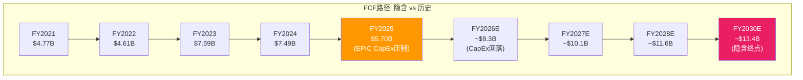
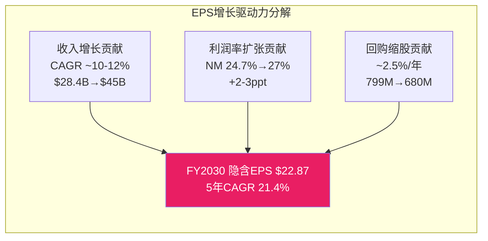
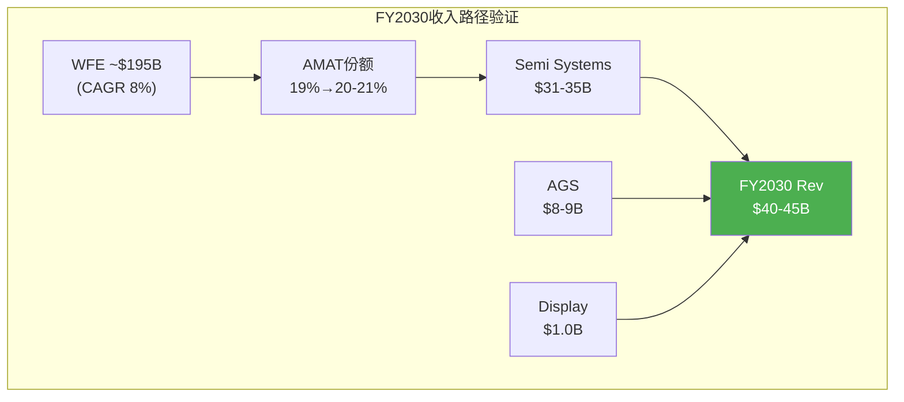
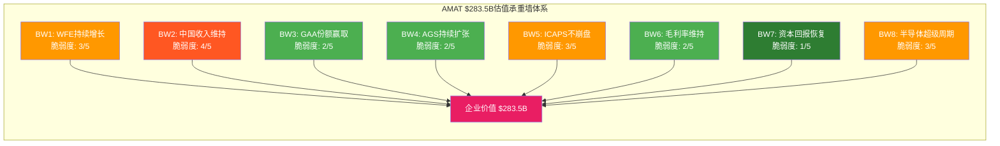
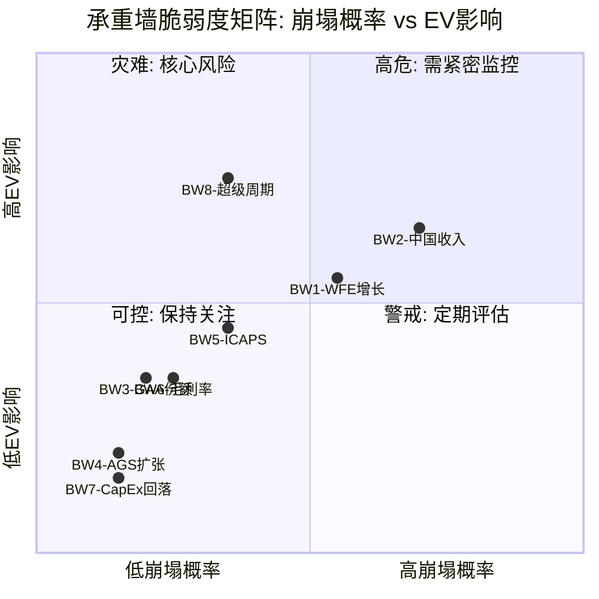
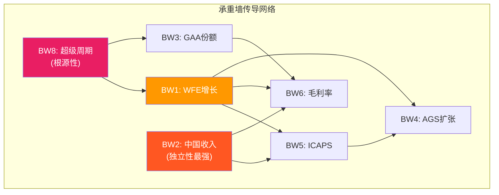

# Ch10: Reverse DCF — 市场隐含假设反推

当前$283.5B的市值 [DM-MKT-002] 为Applied Materials定价的不仅仅是一家设备公司的现有盈利能力，而是一整套关于半导体设备行业未来五到十年发展轨迹的复合假设。Reverse DCF的目的不是给出"正确的"目标价，而是系统性地拆解市场在今天这个价格上究竟在赌什么——哪些假设合理，哪些假设乐观，哪些假设已经隐含了接近完美执行的预期。

## 10.1 FCF Reverse DCF：市场隐含的自由现金流增长路径

### 10.1.1 基准参数设定

反推计算的起点是三个锚定变量：

**企业价值 (EV)**：当前市值$283.5B [DM-MKT-002]，加上总债务$7.05B [DM-BS-002]，减去现金$7.24B [DM-BS-001]，得到EV约$283.3B。净债务几乎为零（-$191M [DM-BS-003]），因此EV与市值高度接近——这一特征意味着资本结构对估值的扭曲极小，反推结果直接映射股东价值。

**基准FCF**：FY2025 FCF $5.698B [DM-CF-003]，由OCF $7.958B [DM-CF-001] 减去CapEx $2.260B [DM-CF-002]。值得注意的是，FY2025 FCF受到EPIC Center建设推高CapEx的压制——FY2024 FCF为$7.487B（CapEx仅$1.190B），FY2023 FCF为$7.594B（CapEx $1.106B）。如果以"正常化CapEx"（~$1.2-1.5B）计算，FY2025正常化FCF约为$6.5-6.8B。

**WACC假设**：AMAT的Beta约为1.3-1.4（半导体设备板块典型值），结合当前10年期美国国债收益率约4.3%和6%的股权风险溢价，CAPM隐含权益成本约12-13%。但考虑到AMAT近乎零净债务的资本结构 [DM-BS-003]，WACC本质上等于权益成本。为保守起见，我们使用9.5%和10.5%两个WACC情景进行对照。

### 10.1.2 反推计算：市场隐含FCF CAGR

使用标准两阶段DCF框架（5年显性增长期 + 终值），反推市场隐含的FCF增长率：

**情景矩阵：隐含FCF 5年CAGR**

| 终值增长率 | WACC 9.5% | WACC 10.0% | WACC 10.5% |
|-----------|-----------|------------|------------|
| g = 2.0% | 18.7% | 20.3% | 21.9% |
| g = 2.5% | 17.2% | 18.8% | 20.4% |
| g = 3.0% | 15.6% | 17.2% | 18.9% |

**核心结论**：在WACC 10% + 终值增长2.5%的中性假设下，市场隐含AMAT的FCF需从FY2025的$5.70B增长至FY2030的约$13.4B，对应5年CAGR约18.8%。

这一增速意味着什么？

- FY2021-FY2025的实际FCF CAGR仅约4.5%（$4.77B→$5.70B），但这受到了FY2025 CapEx翻倍（$2.26B vs FY2021 $0.67B [DM-CF-002]）的严重压制
- 若以OCF计算，FY2021-FY2025 CAGR约为10.0%（$5.44B→$7.96B [DM-CF-001]），更真实地反映盈利增长
- 隐含的18.8% FCF CAGR要求OCF增速约15%+（假设CapEx从EPIC峰值回落至$1.5B/年）

### 10.1.3 隐含FCF路径 vs Consensus对标

Consensus估算：FY2026E Revenue $31.17B [DM-REV-008]，假设30%左右的净利率（趋势改善方向）和15%左右的CapEx/Revenue（从EPIC峰值回落），隐含FY2026E FCF约$7.5-8.5B。这一水平对应FY2025→FY2026 FCF增长32-49%，核心驱动力不是利润率跳跃，而是CapEx从$2.26B的异常高位回落。

隐含的$13.4B FY2030 FCF需要：收入从$28.37B增长至$42-45B（对应Revenue CAGR约10%，与Consensus的FY2025-FY2027E CAGR 14.3%大致外推一致但略低）；净利率维持25-27%（当前24.67% [DM-PRF-003]基础上温和扩张）；CapEx稳定在Revenue的4-5%（$1.7-2.2B，即EPIC完工后回归正常）。

### 10.1.4 终值倍数含义

在WACC 10% + g 2.5%的中性假设下，终值隐含的退出FCF倍数为：

$$终值倍数 = \frac{1 + g}{WACC - g} = \frac{1.025}{0.10 - 0.025} = 13.7x$$

当前FY2025的P/FCF为$283.5B / $5.70B = 49.7x [DM-MKT-002][DM-CF-003]——远高于终值隐含的13.7x。这意味着市场定价中约64%的价值来自增长期（1-5年），只有36%来自终值。对比典型成熟公司（终值占比60-70%），AMAT的估值结构显然是"增长驱动"而非"价值驱动"型——投资者本质上在为未来五年的FCF加速买单。

## 10.2 EPS Reverse DCF：盈利增长隐含路径

### 10.2.1 当前估值锚点

TTM P/E 29.9x [DM-MKT-003]，FY2025 EPS $8.66 [DM-EPS-001]。Forward P/E基于FY2026E consensus $10.91 [DM-EPS-003] 为32.5x [DM-MKT-005]，FY2027E $13.69 [DM-EPS-004] 为25.9x [DM-MKT-006]。

半导体设备板块同行P/E对比 [DM-PEER-001]：LRCX 48.3x，KLAC 42.5x，ASML 48.1x。AMAT的29.9x是板块最低的，这一折价反映市场对三个因素的定价：(1) 中国收入风险敞口最高（30% vs ASML ~29%，LRCX ~32%）[DM-GEO-001]；(2) 利润率低于KLAC（AMAT OPM 29.2% vs KLAC 43.1%）[DM-PEER-002]；(3) 产品线广度策略被视为"稀释"而非"协同"。

### 10.2.2 反推：5年后P/E回归下的隐含EPS增长率

假设投资者在5年后以25x P/E退出（接近AMAT长期历史均值，也接近当前FY2027E Forward P/E 25.9x），且要求10%的年化回报率（典型股权回报目标）：

$$目标股价_{FY2030} = \$354.91 \times (1.10)^5 = \$571.65$$

$$隐含EPS_{FY2030} = \$571.65 / 25x = \$22.87$$

$$隐含EPS\ CAGR\ (FY2025→FY2030) = (\$22.87 / \$8.66)^{1/5} - 1 = 21.4\%$$

这一隐含EPS增速的检验点：

| 财年 | Consensus EPS | 隐含路径(21.4% CAGR) | 差值 |
|------|--------------|-------------------|------|
| FY2025 | $8.66 [DM-EPS-001] | $8.66 | 基准 |
| FY2026E | $10.91 [DM-EPS-003] | $10.51 | +$0.40 |
| FY2027E | $13.69 [DM-EPS-004] | $12.76 | +$0.93 |
| FY2028E | $14.27* | $15.49 | -$1.22 |
| FY2029E | $15.23* | $18.80 | -$3.57 |
| FY2030E | (无覆盖) | $22.87 | — |

*FMP estimates数据：FY2028E $15.23（8位分析师）[FMP estimates]，FY2029E $14.27（3位分析师）[FMP estimates]。注意FY2029E样本量仅3人，可靠性低。

**关键发现**：FY2026-2027E的consensus与21.4%匀速增长路径基本吻合，但FY2028E开始分化——consensus隐含增速放缓至~11%（$13.69→$15.23），而维持当前估值所需的增速为~21%。这意味着：要么市场认为P/E在FY2028-2030会维持在30x+（而非回归25x），要么市场预期consensus的远端估算过于保守。

### 10.2.3 回购加速器效应

AMAT的回购力度是EPS增长的重要放大器。FY2025回购$4.895B [DM-CF-005]，消灭了约2.56%的流通股 [DM-SBC-005]。如果未来五年回购维持在$4-5B/年的水平（FCF回升后可能更高），累计可消灭12-15%的股份。这意味着：

- 净利润仅需增长约8-10% CAGR，配合回购缩股，即可实现EPS ~21% CAGR的前两年
- 但FY2028-2030如果收入增速回落至高单位数，回购只能贡献2-3个百分点的EPS增速，无法弥合差距

## 10.3 Revenue Reverse DCF：隐含收入规模

### 10.3.1 P/S倍数法反推

FY2021-FY2025的EV/Sales均值约为5.0x（范围3.1x-6.5x） [FMP key-metrics]。当前EV/Sales为$283.3B / $28.37B = 10.0x——显著高于历史均值。

如果假设5年后EV/Sales回归7-8x（给予AI超级周期溢价但不持续10x+），隐含FY2030收入：

| 退出EV/Sales | 隐含FY2030 Revenue | 隐含Rev CAGR |
|-------------|-------------------|-------------|
| 7.0x | $40.5B | 7.4% |
| 8.0x | $35.4B | 4.5% |
| 9.0x | $31.5B | 2.1% |
| 10.0x (持平) | $28.3B | -0.1% |

在7-8x的退出倍数下，隐含Revenue CAGR为4.5-7.4%——看起来并不苛刻。但问题在于：当前10.0x的P/S本身就已经是AMAT历史最高区间（仅FY2021泡沫期短暂触及5.5x [FMP key-metrics]）。如果未来收入增速达到consensus的10-15% CAGR，而P/S回归到6-7x的长期合理水平，估值可能面临20-30%的下行压力。

### 10.3.2 WFE框架验证

从WFE市场角度验证收入合理性：

- WFE 2025E ~$133B → 2026E ~$145B → 2027E ~$156B [DM-MACRO-005]
- 假设WFE CAGR ~8%（2025-2030），FY2030 WFE约$195B
- AMAT份额维持19% [DM-COMP-001]：隐含FY2030收入$37.1B（含AGS和Display）
- AMAT份额提升至21%：隐含FY2030收入$41.0B
- 加入AGS增长（$6.4B→$9.0B，CAGR ~7%）[DM-SEG-002] 和Display（维持$1.0B），Semi Systems需要达到$31-33B

WFE框架验证结果：$40-45B的FY2030收入在WFE 8% CAGR + AMAT份额温和提升（1-2ppt）的假设下是可达到的，对应Revenue CAGR约7-10%。这一区间与FCF Reverse DCF反推的收入假设（$42-45B）高度一致。

## 10.4 隐含假设检验表

综合三种Reverse DCF方法的反推结果，市场当前$283.5B定价隐含了以下核心假设：

| # | 隐含假设 | 具体数值 | 合理性评估 | 依据 |
|---|---------|---------|-----------|------|
| 1 | **FCF 5年CAGR ~19%** | $5.7B→$13.4B | **乐观** | 历史CAGR仅4.5%（受CapEx扭曲）；OCF CAGR 10%更真实，加CapEx回落后可达14-16% |
| 2 | **收入CAGR ~10%** | $28.4B→$42-45B | **合理偏乐观** | FY2026-27E CAGR 14.3%有GAA/HBM支撑 [DM-COMP-004]，但FY2028+放缓至高单位数是历史常态 |
| 3 | **净利率维持/扩张** | 24.7%→26-27% | **合理** | Mix shift向先进制程（Non-GAAP GM 54.5% [DM-PRF-008]）；AGS占比提升 [DM-SEG-002]；SBC可控2.3% [DM-SBC-001] |
| 4 | **CapEx从EPIC峰值回落** | $2.26B→$1.3-1.5B | **合理** | EPIC 2026春季投运 [DM-EPIC-004]后，正常CapEx约Revenue 4-5% |
| 5 | **回购维持$4-5B/年** | 年缩股~2.5% | **合理** | FY2025 $4.9B [DM-CF-005]；管理层有$25B+ 授权；FCF恢复后有余力 |
| 6 | **WFE持续增长8%+** | $133B→$195B | **合理偏乐观** | AI/HBM结构性需求支撑 [DM-MACRO-004]，但WFE历史上有显著周期性 |
| 7 | **P/E维持28-32x** | 不回归20x周期低点 | **激进** | 同行LRCX/KLAC/ASML P/E 42-48x使AMAT看起来便宜 [DM-PEER-001]，但板块整体估值处于历史高位 |

**总体评估**：市场定价隐含的增长假设并非不可实现，但要求多个乐观假设同时成立——GAA翻倍兑现 [DM-COMP-004]、WFE持续扩张 [DM-MACRO-005]、中国收入企稳、EPIC Center降本、且估值倍数不回归均值。如果其中任何两个假设同时转向不利，当前估值将面临15-25%的下行风险。

---

# Ch11: 承重墙脆弱度表

$283.5B的估值大厦 [DM-MKT-002] 不是建立在单一假设上，而是由一组相互关联的"承重墙"共同支撑。每一面承重墙都代表一个市场隐含的核心假设——一旦崩塌，不仅自身支撑的价值消失，还可能通过传导效应动摇其他承重墙。本章的目标是识别这八面承重墙，量化每一面的脆弱度，并映射它们之间的传导关系。

## 11.1 八大承重墙全景

## 11.2 逐墙分析

### BW1: WFE持续增长 — 行业Beta的基础

**假设内容**：全球WFE市场从2025E ~$133B持续扩张至2026E ~$145B、2027E ~$156B [DM-MACRO-005]，5年CAGR维持6-8%。

**脆弱度评分：3/5**

**崩塌场景**：WFE市场经历类似2019年（-$52B→$47B，-9%）或2009年（-$21B→$15B，-30%）的周期性下行。触发因素可能包括：(1) 全球经济衰退导致终端需求萎缩；(2) 晶圆厂产能过剩信号（utilization rates降至80%以下）；(3) AI芯片投资回报率未达预期，hyperscaler大幅削减CapEx。

**崩塌时EV影响**：-$45B至-$70B。WFE下降10%对应AMAT收入减少~$3B（全产品线均受冲击），按P/S 8x计算影响$24B；但更重要的是估值倍数压缩——P/E可能从30x回落至18-20x（2019年周期底部水平），额外创造$40-50B市值蒸发。

**崩塌概率**：25-30%（未来3年内出现一次显著下行）。WFE历史上呈现3-4年周期性，当前处于上行阶段但已持续2年以上。

**保护因素**：AI驱动的结构性需求（HBM、先进封装、GAA转换）正在拉长周期 [DM-MACRO-004]；成熟制程去库存已在FY2024完成；DRAM正处于技术升级周期而非纯扩产周期 [DM-SEG-005]。

### BW2: 中国收入维持 — 地缘政治的达摩克利斯之剑

**假设内容**：中国贡献AMAT约30%收入（~$8.5B）[DM-GEO-001]，出口管制导致FY2026E减少$600-710M [DM-GEO-006]后，剩余~$7.8-7.9B维持稳定，中长期中国收入占比稳定在23-25%。

**脆弱度评分：4/5（最脆弱）**

**崩塌场景**：美国政府进一步收紧出口管制，将限制范围从先进制程（<14nm）扩大至成熟制程设备（28nm+），或实施全面禁运。这将直接威胁AMAT在中国的成熟制程和ICAPS业务——当前AMAT中国收入中，约60-70%来自成熟制程设备，而非受限的先进逻辑/存储设备。

具体路径：(1) 中美台海冲突升级触发全面制裁；(2) 中国国产替代加速超预期（中芯国际、北方华创自主设备份额从当前~15-20%提升至40%+）；(3) 已有的$253M罚款 [DM-EXPORT-001] 引发美国国内政治压力要求更严格执法。

**崩塌时EV影响**：-$35B至-$60B。极端场景下失去全部中国收入$8.5B，按6x P/S直接影响$51B。更现实的"收紧但不禁运"场景：额外失去$2-3B收入，EV影响$15-25B。中间传导效应：中国收入大幅下降会压低毛利率（中国ICAPS订单利润率较高），并迫使AMAT提高其他区域的竞争性定价。

**崩塌概率**：20-25%（全面禁运），40-50%（进一步收紧）。FY2025 $253M罚款表明合规风险已经部分materialized。

**保护因素**：AMAT已主动进行1,400人裁员 [DM-EXPORT-004]以预适应；公司建立了$2.0B循环信贷额度 [DM-EXPORT-003]作为流动性缓冲；其他区域（台湾从15%增至24% [DM-GEO-002]）正在部分替代中国收入；管理层指引已纳入$600-710M减量。

### BW3: GAA份额赢取 — 技术卡位的关键窗口

**假设内容**：AMAT的GAA相关收入从CY2024 $2.5B翻倍至CY2025E $5.0B [DM-COMP-004]，并在CY2026-2028随着3nm/2nm量产持续增长至$8-10B。

**脆弱度评分：2/5（较坚固）**

**崩塌场景**：GAA技术路线出现延迟或替代方案（如CFET提前上量取代nanosheet），AMAT在关键沉积/刻蚀步骤中丢失份额给TEL或Lam。或者，GAA采用速度慢于预期——Intel Foundry的18A延期可能减少一个主要GAA需求来源。

**崩塌时EV影响**：-$15B至-$25B。如果GAA收入从$5B增长预期被削减50%（$2.5B增量损失），按10x P/S影响$25B。但GAA技术路线被完全替代的概率极低。

**崩塌概率**：10-15%（收入低于预期30%+），5%以下（技术路线根本性变化）。

**保护因素**：GAA转换是不可逆的技术趋势，台积电、三星、Intel三家同时推进；AMAT在PVD（85%份额）、ECD（50%份额）和CMP（65%份额）三个GAA关键步骤中占据主导地位；EPIC Center将进一步强化材料创新协作 [DM-EPIC-001]；Sym3 Magnum etch收入已突破$1.2B [DM-COMP-003]验证了刻蚀领域的份额赢取。

### BW4: AGS持续扩张 — 稳定器与增长引擎

**假设内容**：Applied Global Services (AGS) 从FY2025 $6.39B [DM-SEG-002] 持续增长至FY2030 $8-9B，维持22-24%的收入占比，提供高毛利率的经常性收入。

**脆弱度评分：2/5（较坚固）**

**崩塌场景**：(1) 全球安装基数增长放缓（新设备出货量长期低迷）；(2) 第三方服务商（如Brooks Automation）抢占售后市场份额；(3) 客户内部维护能力提升，减少对OEM服务依赖。

**崩塌时EV影响**：-$10B至-$18B。AGS增长停滞（$6.4B→$7.0B而非$9.0B）意味着$2B增量损失，按8x P/S影响$16B。但AGS是最不可能出现大幅萎缩的业务线。

**崩塌概率**：5-10%。AGS收入与安装基数高度相关，而AMAT的全球安装基数在过去5年持续扩大。Q1 FY2026 AGS $1.56B（+15% YoY）[DM-SEG-004]显示增长动能依然强劲。

**保护因素**：AMAT全球安装基数超过50,000台系统；长期服务合同（Multi-Year Service Agreement）占比持续提升；服务利润率高于公司平均（估计55%+）；用户粘性极高——更换OEM服务商需要重新认证工艺配方。

### BW5: ICAPS不崩盘 — 成熟制程设备的中国悬崖

**假设内容**：成熟节点（IoT, Communications, Auto, Power, Sensors）设备需求持续增长，中国国产替代率在成熟制程设备领域保持在40%以下，AMAT的ICAPS业务维持FY2025水平或温和增长。

**脆弱度评分：3/5**

**崩塌场景**：中国国产设备厂商（北方华创、中微公司、拓荆科技）在28nm及以上成熟制程的多个工艺步骤中实现突破，国产替代率从当前~15-20%快速提升至40-50%。这一情景在CVD、刻蚀等AMAT份额相对较低（~20%）的领域更可能率先发生。同时，如果出口管制未进一步收紧，中国客户可能利用现有设备产能和国产替代设备，减少对AMAT的新增采购。

**崩塌时EV影响**：-$20B至-$35B。ICAPS收入（估计Semi Systems的30-35%，即$6-7B）如果下降20%（$1.3-1.4B损失），按8x P/S影响$10-11B。但如果中国ICAPS需求同时大幅萎缩+国产替代加速（双重打击），损失可能扩大至$2.5-3B，影响$20-25B。再加上估值倍数压缩效应，总影响可达$35B。

**崩塌概率**：15-20%（国产替代达到40%+的时间点在3-5年内）。中国国产替代在刻蚀和CVD领域的进展速度确实在加速（中微公司2024年刻蚀设备收入同比增长约40%），但在PVD、离子注入、CMP等AMAT占据绝对主导的领域，国产替代仍面临技术壁垒。

**保护因素**：AMAT在PVD（85%）、离子注入（60%）、CMP（65%）等关键领域的份额壁垒极高；成熟制程设备的技术复杂度虽低于先进制程，但客户更换设备供应商的转换成本（工艺认证、良率验证）仍然显著；电动车、工业IoT等终端需求正在结构性增长。

### BW6: 毛利率维持/扩张 — Mix Shift的双刃剑

**假设内容**：公司毛利率从FY2025的48.67% [DM-PRF-001] 温和提升至50%+，驱动力是产品组合向先进制程（更高ASP和利润率）和AGS（高利润率服务）倾斜。

**脆弱度评分：2/5（较坚固）**

**崩塌场景**：(1) 先进制程设备价格战——如果TEL、Lam在EUV配套沉积/刻蚀领域发起价格攻势，AMAT被迫降价保份额；(2) 产品组合恶化——NAND投资恢复但以低ASP的传统NAND（非HBM/3D NAND高层数）为主，拉低整体mix；(3) 成本端压力——供应链通胀、稀土材料成本上升、新工厂（EPIC Center）折旧开始摊销。

**崩塌时EV影响**：-$15B至-$25B。毛利率每下降1个百分点，净利润减少约$2.5B（$28B收入基准），按P/E 30x影响$7.5B市值。毛利率从48.7%下降至46%（-2.7ppt）将影响约$20B。

**崩塌概率**：10-15%。AMAT的毛利率在FY2021-FY2025波动范围极窄（46.5%-48.7% [FMP ratios]），显示出强大的定价能力和成本控制。Q1 FY2026毛利率进一步升至49.0% [DM-PRF-006]，趋势向上。

**保护因素**：先进制程设备ASP持续上升（GAA设备单价高于FinFET 30-50%）；AGS占比提升带来mix改善 [DM-SEG-002]；AMAT在PVD等垄断领域拥有强定价权；Semi Systems Non-GAAP毛利率已达54.5% [DM-PRF-008]，表明先进产品线利润率远高于公司平均。

### BW7: 资本回报恢复 — EPIC Center后的CapEx正常化

**假设内容**：FY2025 CapEx $2.26B [DM-CF-002]（EPIC Center建设峰值）在FY2026-2027回落至$1.3-1.5B（Revenue 4-5%），释放$0.8-1.0B的额外FCF。

**脆弱度评分：1/5（最坚固）**

**崩塌场景**：(1) EPIC Center需要追加投资（超预算，从$5B升至$7B+）[DM-EPIC-001]；(2) 管理层决定在亚洲（如印度、马来西亚）建设新的制造/研发设施以应对地缘政治风险，CapEx维持高位；(3) 竞争压力要求加速研发基础设施投资。

**崩塌时EV影响**：-$5B至-$10B。CapEx维持在$2.2B（而非回落至$1.4B）意味着FCF每年减少$0.8B。按P/FCF 30x，影响$24B——但这一情景需要CapEx持续高位多年才会被市场重新定价，短期影响有限。更现实的影响是$5-10B。

**崩塌概率**：5-10%。EPIC Center $5B投资计划明确 [DM-EPIC-001]，Spring 2026投运 [DM-EPIC-004]，追加大规模投资的可能性较低。FY2024 CapEx $1.19B和FY2023 $1.11B显示"正常"CapEx约$1.1-1.2B。

**保护因素**：EPIC Center建设进度可控（Samsung已成为founding member [DM-EPIC-002]）；管理层在FY2025 earnings call中明确表示EPIC是阶段性投资而非持续性支出；即使CapEx不回落，$7.9B的OCF [DM-CF-001] 足以覆盖$2.2B CapEx + $4.9B回购 + $1.4B股息，不需要增加杠杆。

### BW8: 半导体超级周期 — AI驱动的设备支出远超历史

**假设内容**：AI驱动的半导体需求正在创造一个结构性超级周期，设备支出增速将持续超越历史平均水平。Hyperscaler CapEx 2026E ~$600B+ [DM-MACRO-004]，半导体市场2026E ~$975B [DM-MACRO-003]，这些终端需求最终转化为WFE的持续扩张。

**脆弱度评分：3/5**

**崩塌场景**：AI投资回报率未达预期——如果Large Language Model的商业化收入（广告优化、企业SaaS、代码生成等）无法证明数百亿美元的GPU/TPU/ASIC投入合理，hyperscaler可能在CY2027-2028大幅削减CapEx。这将通过"AI CapEx→先进芯片需求→设备采购"的传导链直接冲击AMAT。历史上，2000年dot-com泡沫和2008年金融危机都曾导致WFE在1-2年内暴跌30-50%。

**崩塌时EV影响**：-$50B至-$85B。这是最具毁灭性的承重墙崩塌场景。如果"超级周期"叙事被证伪，AMAT不仅面临收入减少（-15-25%），还将经历估值倍数大幅压缩（P/E从30x→15-18x）。FY2019周期底部AMAT市值仅$35-45B；即使考虑到基本面已质变（收入翻倍），周期底部市值仍可能回到$120-150B。

**崩塌概率**：15-20%（AI超级周期在3-5年内出现显著逆转）。当前hyperscaler CapEx增速（+36% YoY）[DM-MACRO-004]确实接近历史极端水平，但与dot-com时代不同的是，当前AI投资正在产生真实的收入回报（Meta广告ROAS提升、Google搜索质量改善等）。

**保护因素**：AI并非唯一驱动力——HBM、先进封装、GAA转换都有独立于AI投资周期的结构性需求；成熟制程需求（汽车、工业IoT）提供周期缓冲；AMAT的产品多样性意味着即使某一终端需求萎缩，其他领域可以部分对冲。

## 11.3 承重墙脆弱度矩阵

## 11.4 承重墙传导关系

承重墙之间并非独立存在。一面承重墙的崩塌往往会通过因果链传导至其他承重墙，形成连锁反应。

**关键传导路径**：

1. **BW8→BW1→BW5→BW4（超级周期坍塌链）**：如果AI超级周期叙事被证伪，WFE增长停滞，ICAPS需求首先受冲击（成熟制程扩产计划被搁置），进而安装基数增长放缓拖累AGS。这条链影响了4面承重墙，是最具系统性风险的传导路径。

2. **BW2→BW5→BW6（中国禁运链）**：出口管制全面升级不仅直接削减中国收入，还会打击成熟制程ICAPS订单（中国是ICAPS最大客户），并因产能利用率下降压低毛利率。

3. **BW3→BW6（GAA→利润率传导）**：如果GAA份额赢取失败，AMAT被迫在先进制程领域打价格战保份额，直接压低毛利率。

**最危险的双重崩塌组合**：BW2 + BW8（中国禁运 + 超级周期逆转）——这两面承重墙分别具有最高脆弱度和最大EV影响，且它们的传导路径几乎覆盖了所有其他承重墙。如果同时崩塌，EV影响不是简单相加（$45B + $67B = $112B），而是因传导效应和估值倍数双重压缩而放大至$130-150B——意味着市值可能跌至$130-150B区间（当前的47-53%）。

## 11.5 承重墙汇总表

| 承重墙 | 脆弱度 | 崩塌概率 | EV影响 | 保护因素数量 | 传导影响 |
|--------|--------|---------|--------|-------------|---------|
| BW1: WFE持续增长 | 3/5 | 25-30% | -$45-70B | 3 | 传导至BW4,BW5,BW6 |
| BW2: 中国收入维持 | **4/5** | 20-50% | -$35-60B | 4 | 传导至BW5,BW6 |
| BW3: GAA份额赢取 | 2/5 | 10-15% | -$15-25B | 4 | 传导至BW6 |
| BW4: AGS持续扩张 | 2/5 | 5-10% | -$10-18B | 4 | 被BW1,BW5传导 |
| BW5: ICAPS不崩盘 | 3/5 | 15-20% | -$20-35B | 3 | 传导至BW4 |
| BW6: 毛利率维持 | 2/5 | 10-15% | -$15-25B | 4 | 被BW2,BW3,BW5传导 |
| BW7: 资本回报恢复 | **1/5** | 5-10% | -$5-10B | 3 | 独立性强 |
| BW8: 超级周期 | 3/5 | 15-20% | **-$50-85B** | 3 | 根源性传导至BW1,BW3 |

**概率加权EV风险**：将每面承重墙的崩塌概率中值乘以EV影响中值求和（忽略传导效应重叠）：

$$\sum P_i \times \Delta EV_i = 0.275 \times 57.5 + 0.35 \times 47.5 + 0.125 \times 20 + 0.075 \times 14 + 0.175 \times 27.5 + 0.125 \times 20 + 0.075 \times 7.5 + 0.175 \times 67.5 = \$64.8B$$

这一$64.8B的概率加权风险约为当前EV的22.9%——与Ch10中"任何两个假设同时转向不利将导致15-25%下行"的结论高度吻合。需要强调的是，这一计算假设各承重墙崩塌相互独立，实际上由于传导效应的存在，真实的尾部风险（多墙同时崩塌）远大于简单线性叠加——但相应地，所有承重墙同时崩塌的概率也极低（<3%）。

**投资者核心监控清单**：(1) 每季度WFE预测更新（SEMI/VLSI/Gartner）；(2) 美国商务部出口管制政策变化；(3) 台积电/三星/Intel GAA量产进度；(4) Hyperscaler CapEx指引（Meta/Google/Microsoft/Amazon 季报）；(5) 中国国产设备厂商季度收入增速（北方华创、中微公司）。
