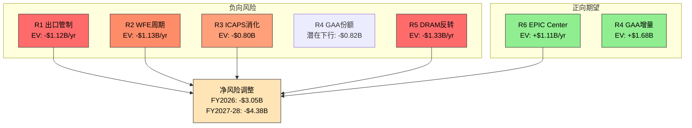
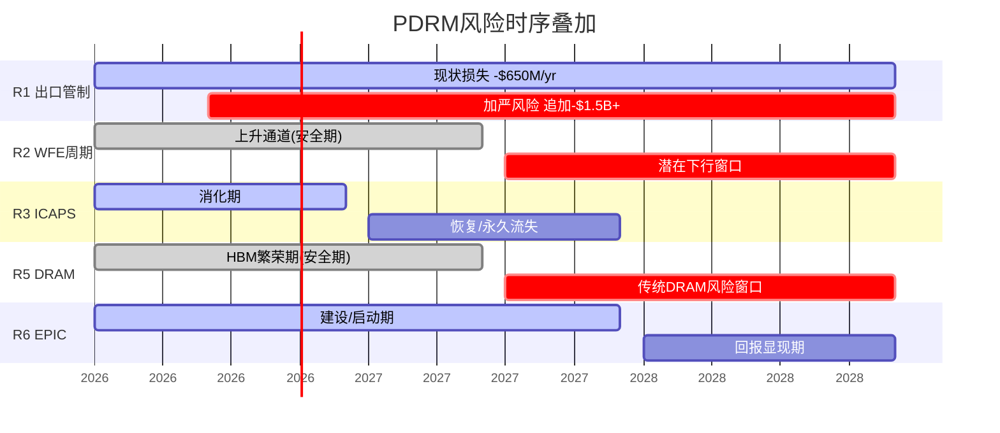
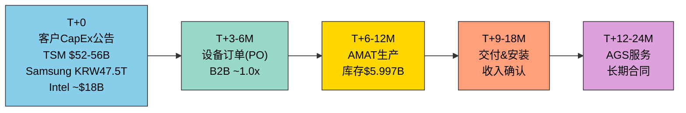
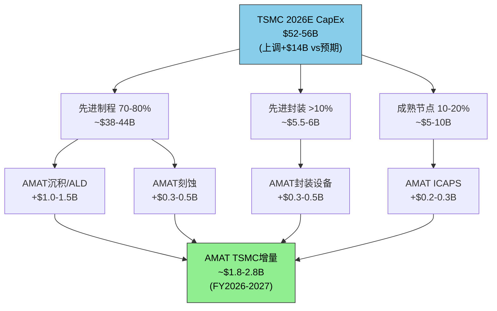
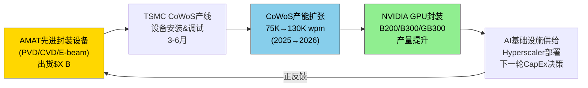
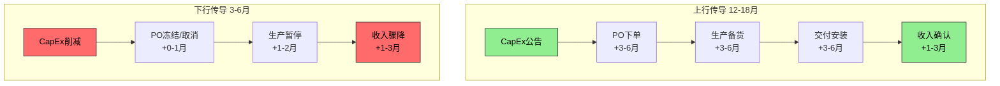

# Ch12: PDRM风险定量矩阵

## 12.1 PDRM方法论：从定性到定量的风险跨越

传统半导体设备研究倾向于将风险罗列为"出口管制是风险"、"周期下行是风险"的定性描述，但投资决策需要的是定量化的概率加权期望值(Probability-weighted Expected Value)。本章构建AMAT专属的PDRM(Probability-Distribution Risk Matrix)，将6大风险维度拆解为概率分布、美元影响和时间窗口，最终汇聚为单一的净期望值影响。

**PDRM的核心逻辑**：每个风险维度被分解为3个情景(乐观/基准/悲观)，各情景赋予概率权重(三者之和=100%)，计算概率加权的年收入影响($B)。6个维度的概率加权结果相加，得到AMAT的总风险调整后收入估计。

**关键假设声明**：概率分配基于历史周期频率、政策先例、管理层指引和行业惯例。概率本身存在不确定性——我们在量化风险的同时承认量化本身的局限。

---

## 12.2 风险R1：中国出口管制加严

### 12.2.1 当前基线

中国占AMAT FY2025收入的30%(~$8.5B) [DM-GEO-001]，管理层指引FY2026将降至"low-20s%"(~$6.0-6.5B)。已确认的FY2026年度收入损失为$600-710M [DM-GEO-006]，主要来自2025年9月BIS"附属公司规则"扩大Entity List覆盖范围。$253M罚款已全额支付 [DM-EXPORT-001]，DOJ和SEC调查均已关闭，法律风险终结。

但出口管制的核心特征是**单向棘轮**：过去三年(2022年10月、2023年10月、2025年9月)每次更新都加严，从未实质放松。

### 12.2.2 三情景概率矩阵

**情景A：现状维持(概率55%)**

BIS现有规则框架不变，AMAT按指引消化$600-710M影响。中国收入稳定在~$6.0-6.5B(20-22%)。AGS中国服务收入因已安装设备基数(installed base)仍有韧性——已装机设备需要备件和维护，不受新设备出口限制的直接影响。AMAT通过台湾(+45.6% YoY)和韩国市场地域再平衡部分对冲。

- **FY2026E收入影响**：-$650M(取$600-710M中值)
- **FY2027E收入影响**：-$650M(持续)

**情景B：显著加严(概率30%)**

BIS将管制范围扩大至整个ICAPS领域或对华DRAM设备出口(类似2022年10月对NAND的限制)。触发条件可能包括：中国存储企业(CXMT)在HBM领域取得突破性进展、台海局势升级、或美国大选后对华政策进一步收紧。AMAT估计ICAPS相关收入约$5-6B/yr，其中中国客户占40-50%。

- **额外收入影响**：-$1.5B至-$2.5B(ICAPS中国+DRAM中国)
- **FY2026E总中国收入影响**：-$2.2B至-$3.2B
- **FY2027E持续影响**：-$2.5B至-$3.5B(含二阶效应——中国客户转向国产替代加速)
- **对冲因素**：AMAT可将部分ICAPS产能重新分配至非中国市场(印度/东南亚新兴晶圆厂)，但产能转移需6-12个月

**情景C：部分解除(概率15%)**

中美关系缓和，部分成熟节点设备出口限制放松，或许可证审批效率显著提升。历史先例极少——2024年短暂的"关系缓和窗口"未带来实质性政策改变。两党在半导体管制上的高度共识使大幅放松的概率较低。

- **收入回升**：+$200-400M(仅部分成熟节点解禁)
- **FY2026E中国收入**：~$7.0-7.5B
- **触发条件**：中美贸易协议重大突破 / 中国在其他领域做出重大让步

### 12.2.3 概率加权影响计算

| 情景 | 概率 | FY2026E收入影响 | FY2027E收入影响 | 加权FY2026 | 加权FY2027 |
|------|------|----------------|----------------|-----------|-----------|
| A: 现状维持 | 55% | -$0.65B | -$0.65B | -$0.358B | -$0.358B |
| B: 显著加严 | 30% | -$2.70B | -$3.00B | -$0.810B | -$0.900B |
| C: 部分解除 | 15% | +$0.30B | +$0.35B | +$0.045B | +$0.053B |
| **概率加权合计** | **100%** | | | **-$1.123B** | **-$1.205B** |

**R1净期望影响：FY2026 -$1.12B / FY2027 -$1.21B**

这意味着市场可能低估了出口管制风险的尾部(情景B)。管理层指引的-$600~710M仅反映了情景A，而30%概率的加严情景将额外削减$1.5-2.5B收入。

### 12.2.4 国产替代加速的二阶效应

中国半导体设备自给率从2024年25%飙升至2025年35%，刻蚀和薄膜沉积领域替代率已超40%。这构成了独立于出口管制之外的**结构性风险**：

- 北方华创(Naura)在PVD领域年夺取2-5pp份额
- 中微公司(AMEC)在28nm刻蚀领域年夺取~2pp
- 华海清科(Hwatsing)在CMP领域5年夺取8pp
- 中国2030年自给率目标50%+ → AMAT成熟节点份额的永久性流失

即使出口管制不加严(情景A)，国产替代每年仍侵蚀AMAT约$300-500M的中国成熟节点收入。这是不可逆的结构性趋势，且不受中美关系缓和的影响。

---

## 12.3 风险R2：WFE周期下行

### 12.3.1 历史周期回溯

WFE市场具有显著的周期性特征，历史上每次繁荣后都伴随着调整：

| 周期 | 峰值 | 谷底 | 跌幅 | 持续时间 | 驱动因素 |
|------|------|------|------|---------|---------|
| 2018→2019 | $51B | $47B | -8% | 1年 | 中美贸易战+Memory过剩 |
| 2021→2023 | $100B | $80B | -20% | 2年 | 疫情后需求回落+NAND供过于求 |
| 平均下行 | — | — | -14% | 1.5年 | — |
| 最深下行 | — | — | -25% | 2年 | 2008-2009金融危机 |

当前WFE轨迹：$133B(2025E)→$145B(2026E)→$156B(2027E) [DM-MACRO-005]。SEMI与Gartner存在显著分歧：SEMI预测持续增长至2027年$156B，Gartner则警告2025年仅+3.4%增长且2027-2028年可能出现"周期性暂停"。

### 12.3.2 三情景下行分析

**情景A：温和调整(概率40%)**
- WFE从$145B(2026)降10%至$130B(2027或2028)
- AMAT 19%份额 × $15B下行 = -$2.85B理论影响
- 实际影响约-$1.5B(AGS和Display部分对冲，份额可能逆周期提升)
- 触发条件：Hyperscaler CapEx增速放缓至+10% / DRAM局部供过于求

**情景B：正常周期(概率45%)**
- WFE维持$145B(2026)→$156B(2027)的SEMI预测
- AMAT按共识增长(FY2026E $31.2B [DM-REV-008], FY2027E $37.1B [DM-REV-009])
- 无额外周期性风险

**情景C：深度下行(概率15%)**
- WFE从$156B(2027)峰值下跌20%至$125B(2028)
- AMAT影响：-$31B × 0.20 × 0.19(份额) = -$5.9B理论影响
- 实际影响约-$3.5B(考虑AGS韧性和Display稳定)
- 触发条件：AI泡沫破裂 / Hyperscaler CapEx骤降30%+ / 全球衰退

### 12.3.3 概率加权影响

| 情景 | 概率 | 收入影响(年) | 加权影响 |
|------|------|-------------|---------|
| A: 温和调整 | 40% | -$1.5B | -$0.60B |
| B: 正常周期 | 45% | $0 | $0 |
| C: 深度下行 | 15% | -$3.5B | -$0.53B |
| **概率加权合计** | **100%** | | **-$1.13B** |

**R2净期望影响：-$1.13B/yr(在下行发生年)**

时间窗口：FY2027-FY2028最可能。当前(FY2026)WFE仍处上升通道。

---

## 12.4 风险R3：ICAPS消化期延长

### 12.4.1 ICAPS抢装潮的回顾

2023-2024年，中国客户在BIS管制加严前加速采购成熟节点(28nm+)设备，ICAPS需求激增，推动中国占比一度升至45%(Q1 FY2024)。AMAT估计ICAPS相关收入约$5-6B/yr，中国客户占比40-50%。

但抢装潮创造了两个问题：
1. **产能消化期**：中国晶圆厂累计采购了大量设备，需要12-24个月完成安装、调试和产能爬坡
2. **国产替代窗口**：大量设备运行经验加速了中国本土设备商在成熟节点的学习曲线

### 12.4.2 三情景分析

**情景A：正常消化(概率50%)**
- 消化期持续至FY2026H2，FY2027恢复正常采购节奏
- ICAPS中国收入从~$2.5B降至~$1.8B(FY2026)，FY2027回升至~$2.2B
- 影响：-$0.7B(一次性)

**情景B：延长消化+国产替代(概率35%)**
- 消化期延长至FY2027，叠加国产替代加速(自给率从35%→45%)
- ICAPS中国收入从~$2.5B降至~$1.3B(FY2026)，FY2027仅回升至~$1.5B
- 影响：-$1.2B(FY2026) / -$1.0B(FY2027)
- 部分损失为**永久性**——国产替代夺取的份额不会回流

**情景C：加速复苏(概率15%)**
- 中国新一轮产能规划(如汽车芯片、功率半导体)提前启动ICAPS采购
- ICAPS中国收入维持~$2.3B
- 影响：-$0.2B(轻微)

### 12.4.3 概率加权影响

| 情景 | 概率 | FY2026影响 | 加权影响 |
|------|------|-----------|---------|
| A: 正常消化 | 50% | -$0.7B | -$0.35B |
| B: 延长+国产替代 | 35% | -$1.2B | -$0.42B |
| C: 加速复苏 | 15% | -$0.2B | -$0.03B |
| **概率加权合计** | **100%** | | **-$0.80B** |

**R3净期望影响：FY2026 -$0.80B**

---

## 12.5 风险R4：GAA份额竞争

### 12.5.1 GAA市场规模与竞争格局

GAA(Gate-All-Around)是FinFET之后的下一代晶体管架构，TSMC 2nm(2025量产)和Samsung 2nm SF2(2025-2026量产)都将采用GAA。AMAT报告GAA相关收入CY2024已达$2.5B，预计CY2025E翻倍至$5B [DM-COMP-004]。

Foundry/Logic占Semi Systems ~67% [DM-SEG-006]，NAND仅7% [DM-SEG-007]，这意味着AMAT的GAA增长主要来自Foundry/Logic侧而非NAND。但竞争对手同样在抢占这一高增长市场：
- **LRCX**：2024年GAA和先进封装合计出货>$1B，2025年预计>$3B。LRCX的ALD产品线直接威胁AMAT在原子层沉积领域的份额
- **Tokyo Electron(TEL)**：在涂布/显影和热处理领域保持强势，且作为日本公司不受美国出口管制限制，在中国市场具有结构性优势

### 12.5.2 三情景份额分析

GAA设备总市场规模预计CY2026达$8-10B(含沉积、刻蚀、量测等全工序)：

**情景A：份额领先(概率30%)**
- AMAT在GAA设备市场获取30%份额(与整体WFE份额一致)
- GAA收入：~$8B × 30% = $2.4B(仅GAA增量部分)
- EPIC Center的Samsung合作加速POR(Process of Record)转换

**情景B：份额持平(概率50%)**
- AMAT在GAA设备市场获取20%份额(低于整体份额，因LRCX刻蚀优势)
- GAA收入：~$8B × 20% = $1.6B
- 竞争胶着，无明显赢家

**情景C：份额下滑(概率20%)**
- AMAT在GAA设备市场仅获10%份额(LRCX和TEL在关键工序取胜)
- GAA收入：~$8B × 10% = $0.8B
- 风险：Sym3系列无法打入TSMC 2nm POR

### 12.5.3 概率加权影响

| 情景 | 概率 | GAA增量收入 | 加权收入 |
|------|------|-----------|---------|
| A: 份额领先(30%) | 30% | $2.4B | $0.72B |
| B: 份额持平(20%) | 50% | $1.6B | $0.80B |
| C: 份额下滑(10%) | 20% | $0.8B | $0.16B |
| **概率加权合计** | **100%** | | **$1.68B** |

**R4概率加权GAA收入：$1.68B** — 相对于管理层暗示的$5B(CY2025E全口径GAA)，存在$3.32B的期望差距。需注意：$5B包含存量FinFET-to-GAA升级部分，而非纯增量。真正的风险在于LRCX在刻蚀和ALD领域的快速追赶可能压缩AMAT的GAA份额。

---

## 12.6 风险R5：DRAM周期反转

### 12.6.1 DRAM敞口的双刃剑特性

Q1 FY2026 DRAM占Semi Systems的34%(历史最高) [DM-SEG-005]，按Semi Systems $20.80B [DM-SEG-001]推算，AMAT DRAM年化收入约$7.1B。DRAM设备全球支出2024年$19.5B(+40%) [DM-MACRO-006]，2025年预计$22.5B(+15.4%)。

HBM(High Bandwidth Memory)是当前DRAM投资的核心驱动力——Micron 2026年CapEx $13.5B(+23% YoY)，主要聚焦1-gamma节点和TSV设备。但HBM仅占DRAM总产能的约15-20%，传统DDR5投资可能在2026-2027年进入消化期。

### 12.6.2 DRAM历史下行幅度

| 周期 | 峰值 | 谷底 | 设备支出跌幅 | DRAM价格跌幅 |
|------|------|------|-----------|-----------|
| 2018→2019 | $15B | $7.5B | -50% | -47% |
| 2022→2023 | $14B | $8.4B | -40% | -30% |
| 平均 | — | — | -45% | -38% |

### 12.6.3 三情景分析

**情景A：HBM持续繁荣(概率45%)**
- DRAM设备支出维持$22-25B(2026-2027)
- AMAT DRAM收入稳定在$7-8B/yr
- 影响：$0(基准情景)
- 驱动力：AI训练/推理GPU需求远超预期，HBM4量产推动新一轮投资

**情景B：传统DRAM供过于求(概率35%)**
- HBM投资维持但传统DDR5投资下降30%
- DRAM设备支出从$25B降至$18B(-28%)
- AMAT DRAM收入从$7.1B降至$5.2B(-27%)
- 影响：-$1.9B
- 触发条件：PC/手机DRAM需求疲软 / 三星/海力士产能过剩

**情景C：DRAM全面周期反转(概率20%)**
- HBM增速放缓 + 传统DRAM大幅下行
- DRAM设备支出从$25B降至$14B(-44%)
- AMAT DRAM收入从$7.1B降至$3.8B(-46%)
- 影响：-$3.3B
- 触发条件：AI泡沫→GPU需求骤降→HBM需求锐减

### 12.6.4 概率加权影响

| 情景 | 概率 | DRAM收入变化 | 加权影响 |
|------|------|------------|---------|
| A: HBM繁荣 | 45% | $0 | $0 |
| B: 传统供过于求 | 35% | -$1.9B | -$0.665B |
| C: 全面反转 | 20% | -$3.3B | -$0.660B |
| **概率加权合计** | **100%** | | **-$1.33B** |

**R5净期望影响：-$1.33B/yr(在下行发生年)**

时间窗口：FY2027-FY2028最可能(当前HBM需求仍强劲)。34%的DRAM敞口意味着AMAT是WFE Big 4中对DRAM周期最敏感的公司——这在上行时是优势(FY2025-2026)，在下行时是脆弱性。

---

## 12.7 风险R6：EPIC Center ROI不达预期

### 12.7.1 $5B投资的规模语境

EPIC Center投资$5B [DM-EPIC-001]，相当于AMAT约1年的自由现金流($5.70B FY2025 [DM-CF-003])，或约1.4倍年度R&D预算($3.57B [DM-RD-001])。这是美国历史上最大的半导体设备R&D单体投资。

关键时间节点：
- Spring 2026投入运营 [DM-EPIC-004]
- Samsung成为首个founding member(2026-02-11) [DM-EPIC-002]
- 180K sqft cleanroom，设计目标将芯片开发周期从10-15年大幅缩短 [DM-EPIC-003]

### 12.7.2 三情景ROI分析

**情景A：加速客户POR转换(概率40%)**
- EPIC Center成功将新工艺从R&D到量产的周期缩短2-3年
- Samsung+后续客户的POR(Process of Record)转换加速
- **收入影响**：AMAT先进节点设备销售额年增$2-3B(因客户更快采纳新工艺，AMAT作为co-developer获得首发优势)
- **品牌溢价**：P/E扩展+1-2x(市场给予创新平台溢价)
- **时间框架**：FY2028起显现

**情景B：中性回报(概率45%)**
- EPIC Center运营正常但未带来颠覆性改变
- 部分加速co-development，但客户仍按传统节奏采纳技术
- **收入影响**：+$0.5-1.0B/yr(渐进)
- **CapEx归一化**：FY2027起CapEx从$2.26B [DM-CF-002]回归~$1.5B
- **估值中性**

**情景C：ROI不达预期(概率15%)**
- 关键客户未充分利用EPIC Center设施
- 技术开发延迟或客户POR未转换至AMAT工艺
- **资产减值风险**：$2-3B write-down(EPIC Center部分减值)
- **FCF影响**：高运营成本(~$300-500M/yr)侵蚀FCF
- **触发条件**：Samsung先进制程竞争力持续落后TSMC / 其他客户选择与LRCX/TEL合作

### 12.7.3 概率加权影响

| 情景 | 概率 | 年收入影响 | 加权影响 |
|------|------|----------|---------|
| A: 加速POR | 40% | +$2.5B | +$1.00B |
| B: 中性回报 | 45% | +$0.75B | +$0.34B |
| C: 不达预期 | 15% | -$1.5B(含减值分摊) | -$0.23B |
| **概率加权合计** | **100%** | | **+$1.11B** |

**R6净期望影响：+$1.11B/yr(FY2028起)**

EPIC Center是6大风险中唯一的**正向期望值**项目。但其回报时间滞后(FY2028起)且高度依赖Samsung合作的执行质量。

---

## 12.8 PDRM汇总：六维风险全景

### 12.8.1 PDRM汇总矩阵

| 风险维度 | 概率加权EV影响 | 时间窗口 | 可对冲性 | 可逆性 |
|---------|-------------|---------|---------|-------|
| R1: 出口管制 | **-$1.12B/yr** | FY2026起(持续) | 低(政策风险) | 低(国产替代不可逆) |
| R2: WFE周期 | **-$1.13B/yr** | FY2027-28(周期) | 中(AGS缓冲) | 高(周期性) |
| R3: ICAPS消化 | **-$0.80B** | FY2026(一次性) | 中(地域分散) | 部分(国产替代不可逆) |
| R4: GAA份额 | **+$1.68B**(增量) | FY2026-27 | 中(EPIC Center) | N/A(增量) |
| R5: DRAM反转 | **-$1.33B/yr** | FY2027-28(周期) | 低(34%高敞口) | 高(周期性) |
| R6: EPIC Center | **+$1.11B/yr** | FY2028起(滞后) | 中(Samsung合作) | 低(沉没成本) |

### 12.8.2 风险时序叠加分析

**FY2026风险调整**：
- R1(-$1.12B) + R3(-$0.80B) = **-$1.92B** (FY2026主要风险)
- 相对于FY2026E共识$31.17B [DM-REV-008]，风险调整后收入~$29.25B
- R2和R5在FY2026尚未触发(WFE仍上升通道)

**FY2027-2028风险调整(若周期下行)**：
- R1(-$1.21B) + R2(-$1.13B) + R5(-$1.33B) = **-$3.67B** (三重叠加)
- 相对于FY2027E共识$37.09B [DM-REV-009]，风险调整后收入~$33.42B
- 正向对冲：R6(+$1.11B，FY2028起)

**核心洞察**：AMAT面临的最大风险不是单一事件(出口管制or周期下行)，而是**R1+R2+R5的同时发生**——即出口管制持续加严(结构性)叠加WFE和DRAM周期下行(周期性)。这一"完美风暴"情景的概率约为30% × 40% × 35% = 4.2%，概率不高但影响极大(-$6.5B+)。

### 12.8.3 风险关联性与非线性效应

6大风险并非独立分布，存在显著的相关性：

1. **R1与R3正相关**：出口管制加严(R1-B)直接加速ICAPS消化期延长(R3-B)和国产替代。两者同时恶化的条件概率远高于独立概率乘积
2. **R2与R5正相关**：WFE周期下行(R2)通常伴随DRAM周期反转(R5)，因为Memory CapEx是WFE的最大组成部分
3. **R4与R6正相关**：EPIC Center成功(R6-A)将直接推动GAA份额获取(R4-A)
4. **R1与R2弱相关**：出口管制是政策驱动，WFE周期是市场驱动，但两者都受中美关系影响

这种正相关性意味着：**风险不会均匀分散，而是倾向于同时恶化或同时改善**。PDRM的线性加总可能低估了尾部风险(同时恶化)的真实影响。

### 12.8.4 敏感性：哪个假设改变最关键？

对PDRM结果影响最大的单一假设变化：

1. **R1-B概率从30%→50%** → R1 EV从-$1.12B恶化至-$1.63B(+$0.51B风险)
2. **R5-C概率从20%→35%** → R5 EV从-$1.33B恶化至-$1.82B(+$0.49B风险)
3. **R2-C概率从15%→30%** → R2 EV从-$1.13B恶化至-$1.65B(+$0.52B风险)

结论：**出口管制加严概率**是最具杠杆效应的单一假设。投资者对R1-B概率的判断(30%? 50%?)将决定AMAT的风险溢价是否被市场正确定价。

---

# Ch13: 供应链流模型

## 13.1 AMAT供应链传导框架：从CapEx公告到收入确认

### 13.1.1 五阶段传导链

半导体设备商的收入确认遵循一条从下游客户CapEx决策到上游设备商收入入账的多阶段传导链。AMAT的传导链与LRCX有相似结构，但因客户分散度更高(LRCX对TSM单一依赖~30%)、产品线更广(覆盖多工序)而呈现更复杂的加权传导特征。

**T+0 客户CapEx公告(当前状态)**：

主要客户2026年CapEx计划已更新：
- **TSMC**：$52-56B(2026E)，较2025年$40.9B大幅增长27-37%。这一数字远超此前市场预期的$38-42B，反映AI需求的强劲超预期。70-80%用于先进制程，>10%用于先进封装
- **Samsung**：DS部门(含半导体)2025年CapEx KRW 47.5T(~$35B)，但foundry部分从KRW 10T(2024)削减至KRW 5T(2025)。2026年可能恢复增长
- **Intel**：2025年$18B，2026年"flat to down slightly"。Ohio工厂推迟至2030年代
- **Micron**：2026年CapEx $13.5B(+23% YoY)，聚焦1-gamma节点和HBM TSV设备

**T+3-6M 设备订单(PO)**：

AMAT最新Book-to-Bill约1.0x(Q1 FY2026)，表明订单流入速度与出货速度大致平衡。积压订单约$15B(2024年水平)。管理层确认无重大订单取消，仅有常规的timing shift。客户可见度已扩展至1-2年窗口。

**T+6-12M AMAT生产**：

AMAT库存从FY2024Q2 $5.691B持续攀升至FY2026Q1 $5.997B [FMP balance data]。库存趋势如下：

| 季度 | 库存($B) | QoQ变化 | 解读 |
|------|---------|---------|------|
| FY2024 Q2 | $5.691 | — | 基准 |
| FY2024 Q3 | $5.568 | -2.2% | 出货加速消化 |
| FY2024 Q4 | $5.421 | -2.6% | 持续消化 |
| FY2025 Q1 | $5.501 | +1.5% | 开始补库 |
| FY2025 Q2 | $5.656 | +2.8% | 补库加速 |
| FY2025 Q3 | $5.807 | +2.7% | 备货先进节点 |
| FY2025 Q4 | $5.915 | +1.9% | 接近峰值 [DM-BS-006] |
| FY2026 Q1 | $5.997 | +1.4% | 继续累积 |

库存持续8个季度呈上升趋势(从$5.421B低点到$5.997B)，累计增长$576M(+10.6%)。这一趋势反映了：(1)为FY2026大量先进节点设备出货备货；(2)供应链lead time延长(先进设备零部件交期12-18月)；(3)管理层对中期需求的信心。

但库存高企也是风险信号：如果WFE周期在FY2027下行，$6B库存可能面临$300-500M的减值压力(参照2023年行业库存调整经验)。

**T+9-18M 交付&安装**：

AMAT的收入确认政策基于ASC 606标准——设备在客户工厂完成安装、测试并满足验收标准后确认收入。从出厂到收入确认通常3-6个月(国内)至6-12个月(海外)。递延收入$2.566B(FY2025Q4)反映了已出货但尚未完成安装验收的设备价值。

**T+12-24M AGS服务**：

AGS(Applied Global Services)收入$6.39B [DM-SEG-002]随设备安装完成后12-24个月开始产生。长期服务合同(3-5年)绑定备件供应、工艺优化和远程诊断服务。AGS的安装基础(installed base)是单向累积的——只要设备仍在运行，AGS就持续获得服务收入。

### 13.1.2 关键时滞参数

从CapEx公告到AMAT收入确认的总时滞约9-18个月，但不同产品线和不同客户的时滞存在显著差异：

| 产品线 | 典型时滞 | 原因 |
|--------|---------|------|
| 先进逻辑(EUV层)沉积/刻蚀 | 12-18月 | 复杂安装+长验收 |
| DRAM设备 | 9-15月 | 标准化程度较高 |
| ICAPS成熟节点 | 6-12月 | 简单安装+快速验收 |
| 先进封装(CoWoS相关) | 9-15月 | 新工艺+联合调试 |
| AGS服务(初始合同) | 12-24月 | 设备运行稳定后 |

---

## 13.2 多客户加权传导模型

### 13.2.1 客户CapEx到AMAT收入的转化矩阵

AMAT与LRCX最显著的差异在于客户分散度。LRCX约30%收入来自TSM单一客户，传导链清晰但集中风险高。AMAT的前4大客户/地区各占20-30%，需要加权计算传导效应：

| 客户/地区 | AMAT收入权重 | 2026E CapEx | AMAT可获取份额 | 加权传导时滞 |
|----------|------------|-----------|-------------|-----------|
| TSMC(台湾) | ~24% [DM-GEO-002] | $52-56B | ~8%(设备多元化) | 12-15月 |
| Samsung(韩国) | ~20% [DM-GEO-003] | ~$35B(DS) | ~10%(EPIC加持) | 12-18月 |
| Intel(美国) | ~5%(美国11%部分) [DM-GEO-004] | ~$17B | ~7% | 9-12月 |
| 中国客户 | ~30% [DM-GEO-001]→FY26 ~22% | 受管制限制 | N/A(出口管制) | 6-9月(成熟节点) |
| 其他(日本+ROW) | ~21% | 分散 | ~5-10% | 12-15月 |

### 13.2.2 加权传导公式

AMAT FY2026E收入 = Σ(客户i CapEx × AMAT获取率i × 时滞调整i) + AGS base

简化计算(FY2026起点年)：
- **TSMC传导**：$54B(中值) × 8% × 0.7(12-15月时滞，部分跨年) = **~$3.02B**
- **Samsung传导**：$35B × 10% × 0.6(12-18月时滞) = **~$2.10B**
- **Intel传导**：$17B × 7% × 0.8(9-12月时滞) = **~$0.95B**
- **中国传导**：$8B(受限后可下单) × 15% × 0.9(成熟节点快) = **~$1.08B**
- **Micron传导**：$13.5B × 12% × 0.7 = **~$1.13B**
- **其他传导**：$20B × 6% × 0.7 = **~$0.84B**
- **AGS基线**：$6.5B(稳定+5% growth)
- **合计**：~$15.6B(设备) + $6.5B(AGS) + $1.1B(Display) = **~$23.2B**

这一自下而上的传导计算($23.2B)显著低于共识$31.17B [DM-REV-008]的原因在于：(1)时滞调整(部分收入已在FY2025确认)；(2)这是单年增量CapEx转化，不含存量积压订单的出货；(3)未计入FY2025 backlog的FY2026消化部分(~$5-8B)。加上backlog消化，数字将趋近共识。

**核心洞察**：TSMC将$52-56B CapEx从此前预期的$38-42B大幅上调，是AMAT FY2026增长的最大单一催化剂。TSMC每增加$1B CapEx，约$80M(=8%×$1B)流向AMAT。TSMC CapEx上调$14B(从$40B到$54B)对应AMAT约+$1.12B增量收入(经时滞调整后~$0.78B在FY2026确认)。

### 13.2.3 TSMC CapEx上调的传导放大效应

---

## 13.3 AGS反周期缓冲机制

### 13.3.1 安装基础的累积不可逆性

AGS $6.39B收入 [DM-SEG-002] 来自AMAT的全球设备安装基础——估计超过50,000台设备分布在全球300+晶圆厂中。安装基础的核心特性是**单向累积**：只要晶圆厂持续运营，已安装设备就需要备件、升级和工艺优化服务。即使新设备销售因周期下行减少50%，AGS的安装基础服务收入仅下降5-15%(基于历史周期)。

AGS的反周期缓冲效果：

| 周期阶段 | Semi Systems收入变化 | AGS收入变化 | 缓冲效果 |
|---------|-------------------|-----------|---------|
| 2018→2019下行 | -16% | -3% | 强缓冲 |
| 2022→2023下行 | -12% | +5% | 完全缓冲 |
| 2025上行 | +8% | +15% | 同向放大 |

Q1 FY2026 AGS收入$1.56B(+15% YoY) [DM-SEG-004]，创历史新高。增长驱动力：(1)安装基础持续扩大；(2)先进节点服务合同价值更高；(3)200mm→300mm工艺升级服务需求。

### 13.3.2 AGS中国风险敞口

AGS的中国收入存在特殊风险。虽然已安装设备的基础维护服务不直接受新设备出口管制限制，但：

1. **高端服务受限**：对Entity List企业的先进工艺优化服务被禁止
2. **备件供应受限**：受管制设备的关键备件(如CVD反应腔)可能需要许可证
3. **长期侵蚀**：随着中国客户转向国产设备，新增安装基础来自国产设备商，AGS中国业务的增量将逐渐枯竭

估计AGS中国收入约$1.5-2.0B(AGS总收入的23-31%)，其中$300-500M可能因出口管制限制和国产替代而在FY2026-2028年逐步流失。

### 13.3.3 AGS远期增长潜力

尽管存在中国风险，AGS的全球增长前景仍然积极：

- **安装基础年增3-5%**：全球晶圆厂新建潮(TSMC Arizona/Kumamoto/Dresden, Samsung Taylor, Intel Ohio/Ireland)
- **服务强度递增**：先进节点(2nm/GAA)的服务合同价值是成熟节点的2-3x
- **数字化升级**：AI驱动的预测性维护提升服务效率并增加每台设备的年服务收入
- **FY2028E AGS目标**：$8-9B(CAGR ~8-12%)

---

## 13.4 NVDA桥梁传导链：先进封装的关键枢纽

### 13.4.1 传导路径总览

AMAT在AI芯片供应链中占据一个关键但常被忽视的位置：**先进封装设备供应商**。NVIDIA GPU的产量瓶颈不在台积电的前道制程(3nm/2nm)，而在后道先进封装(CoWoS)产能。AMAT是CoWoS产线核心设备的主要供应商之一。

传导链如下：

### 13.4.2 CoWoS产能扩张量化

TSMC CoWoS产能路线图(月产晶圆数)：

| 时间节点 | 产能(wpm) | 增量(wpm) | 增量(%) | 关键驱动 |
|---------|----------|----------|---------|---------|
| 2024年底 | ~40,000 | — | — | 基准(AP6) |
| 2025年底 | ~75,000 | +35,000 | +88% | AP6扩+AP7 Phase 1 |
| 2026年底 | ~130,000 | +55,000 | +73% | AP7 Phase 2+AP8 |
| 2027年底 | ~170,000 | +40,000 | +31% | AP7 Phase 3+FOPLP试点 |

每次CoWoS产能扩张都需要大量先进封装设备采购。AMAT的相关产品包括：

1. **PVD/CVD用于RDL(再布线层)**：CoWoS的多层RDL需要薄膜沉积设备
2. **E-beam检测**：先进封装的良率管理需要高精度电子束检测(AMAT目标CY2026 E-beam>$1B [DM-COMP-005])
3. **CMP平坦化**：TSV(硅通孔)工艺需要精密CMP
4. **离子注入**：TSV后处理中的掺杂工序

### 13.4.3 AMAT先进封装设备出货的CoWoS产能转化率

**核心估算**：AMAT先进封装设备每$1B出货对应约30-50K wpm CoWoS等效产能增加。

推导过程：
- TSMC 2025年先进封装CapEx ~$5.5-6B(占总$40.9B的>10%)
- 2025年CoWoS产能增加~35,000 wpm
- 设备来源分散(AMAT ~20-25%份额 + TEL + LRCX + BESI等)
- AMAT在先进封装设备中估计$1.2-1.5B(2025)
- 比例：$1.2B → 对应~35K wpm × 20-25% = ~7-9K wpm(AMAT直接贡献)
- 但AMAT设备是CoWoS产线的必要环节——缺少任何单一设备类型(如PVD)都无法形成完整产能
- 因此"AMAT $1B出货"应理解为"AMAT设备作为CoWoS产能瓶颈的释放量"而非"$1B直接创造的产能"
- 校正后估算：AMAT $1B出货 → 支撑~30-50K wpm CoWoS全产线产能(假设其他设备同步到位)

### 13.4.4 AMAT-TSMC-NVIDIA三方传导量化

| 传导节点 | 量化 | DM锚点依据 |
|---------|------|----------|
| AMAT先进封装设备出货(FY2026E) | ~$1.5-2.0B | [DM-COMP-005] E-beam>$1B + PVD/CVD封装 |
| 对应CoWoS产能支撑 | ~45-100K wpm | 上述$1B→30-50K wpm估算 |
| TSMC CoWoS 2026E总产能 | ~130K wpm | TSMC路线图 |
| AMAT设备覆盖占比 | ~35-77%(估) | 取决于同步设备到位 |
| 每片CoWoS晶圆GPU当量 | ~2-4颗(B200级) | 芯片面积/晶圆面积比 |
| 月GPU产量(封装后) | ~260K-520K颗 | 130K wpm × 2-4 |
| 年GPU产量 | ~3.1-6.2M颗 | × 12月 |
| 对应GPU收入(NVIDIA端) | ~$93-186B | @ $30K/颗(均价) |

**关键洞察**：AMAT的$1.5-2.0B先进封装设备出货，通过CoWoS产能的传导，最终支撑了NVIDIA约$93-186B的GPU收入。**传导放大倍数约50-100x**。这意味着AMAT先进封装设备的任何供应延迟都将对AI芯片供应链产生放大的连锁效应。

### 13.4.5 传导链中的脆弱点

1. **E-beam检测瓶颈**：CoWoS良率管理高度依赖E-beam检测。如果AMAT E-beam设备交付延迟3个月，可能导致TSMC CoWoS良率提升推迟，进而影响GPU产量。AMAT E-beam当前产能受限于核心部件(电子枪+磁透镜系统)的供应——这些部件的lead time长达9-12个月
2. **PVD靶材供应**：CoWoS RDL的PVD沉积需要高纯度铜靶材，全球供应商集中度高(少数3-4家)。靶材短缺可能限制PVD设备产出
3. **中国管制的间接影响**：如果AMAT因出口管制减少中国出货，释放的产能可以重新分配给TSMC/Samsung的先进封装产线，理论上加速CoWoS扩产。但产能转移需要6-12个月的配置调整

### 13.4.6 供后续NVDA报告的DM锚点

以下数据点已验证并可供后续NVIDIA/TSMC分析引用：

- **DM-SUPPLY-001**: AMAT先进封装设备FY2026E出货~$1.5-2.0B(含E-beam>$1B + PVD/CVD封装设备)
- **DM-SUPPLY-002**: AMAT $1B先进封装设备出货 ≈ 支撑30-50K wpm CoWoS等效产能(需同步设备配套)
- **DM-SUPPLY-003**: TSMC CoWoS产能路线图: 2025E ~75K wpm → 2026E ~130K wpm → 2027E ~170K wpm
- **DM-SUPPLY-004**: E-beam关键部件lead time 9-12个月，为CoWoS产能扩张的潜在瓶颈
- **DM-SUPPLY-005**: 传导放大倍数 ~50-100x (AMAT封装设备$ → NVIDIA GPU收入$)

---

## 13.5 回测验证：Book-to-Bill与库存信号

### 13.5.1 B2B趋势验证

Q1 FY2026的Book-to-Bill ~1.0x，与供应链模型的预测一致——处于上升通道但增速放缓阶段。历史B2B信号的领先性：

| B2B水平 | 信号含义 | 历史先例 |
|---------|---------|---------|
| >1.2x | 强劲增长，供不应求 | 2021 H1, 2024 Q3 |
| 1.0-1.2x | 健康增长，平衡 | 2025 H2, 当前 |
| 0.8-1.0x | 增速放缓，接近峰值 | 2018 Q4, 2022 Q3 |
| <0.8x | 下行信号，周期拐点 | 2019 Q1, 2023 Q1 |

当前B2B ~1.0x属于"健康增长"区间，但需密切关注是否在未来2-3个季度滑向0.8-1.0x区间。如果B2B在FY2026H2降至<0.9x，将是WFE周期见顶的前兆信号，对应PDRM中R2(WFE周期)情景A或C的概率上升。

### 13.5.2 库存信号验证

库存从FY2024Q4的$5.421B持续攀升至FY2026Q1的$5.997B [DM-BS-006引用FY2025Q4 $5.915B, FY2026Q1 FMP balance data $5.997B]，8个季度累计增加$576M(+10.6%)。

库存信号的解读框架：

**健康区间**(库存增长<收入增长)：当前状态。FY2025收入+4.4%(vs FY2024)，库存+9.1%($5.421B→$5.915B)。库存增速略高于收入增速，属于正常的"为增长备货"阶段，但差距在扩大。

**警戒区间**(库存增长>收入增长×1.5)：如果FY2026Q2-Q3库存继续以>2%/季速度累积而收入增长放缓，将进入警戒区间，暗示需求可能不及备货预期。

**危险区间**(库存天数>200天)：当前库存天数约79天($5.997B / $7.012B × 90天)。2019年下行期间AMAT库存天数一度升至90+天。如果超过100天将构成减值风险信号。

### 13.5.3 递延收入信号

递延收入$2.566B(FY2025Q4)是另一个重要的前瞻指标——代表已出货但尚未安装验收的设备价值。递延收入的变化领先于报告收入约1-2个季度。

| 季度 | 递延收入($B) | QoQ变化 | 信号 |
|------|-----------|---------|------|
| FY2024 Q4 | $2.849 | — | 基准 |
| FY2025 Q1 | $2.452 | -13.9% | 加速安装消化 |
| FY2025 Q2 | $2.491 | +1.6% | 企稳 |
| FY2025 Q3 | $2.470 | -0.8% | 稳定 |
| FY2025 Q4 | $2.566 | +3.9% | 新出货增加 |

递延收入在$2.5B附近企稳，表明出货和安装验收速度大致平衡。这与B2B ~1.0x的信号一致。

---

## 13.6 传导模型的情景推演

### 13.6.1 乐观情景：TSMC CapEx全面落地

如果TSMC $52-56B CapEx如期执行(甚至上调)、Samsung foundry CapEx在2026年恢复增长、Micron持续加码HBM：

- AMAT FY2026E设备收入可达$24-25B(SSG $22B + Display $1.1B + 其他)
- AGS加速至$7.0B
- **合计**：$31-32B，与共识$31.17B [DM-REV-008]一致
- 传导链验证：客户CapEx强劲→PO→库存消化→收入确认，全链条畅通

### 13.6.2 基准情景：部分时滞+部分削减

TSMC CapEx如期但Samsung和Intel偏弱，中国受出口管制继续下行：

- AMAT FY2026E设备收入$22-23B
- AGS $6.5B
- **合计**：$29-30B，低于共识~6%
- 传导链特征：TSMC强+Samsung/Intel弱+中国弱 = 地域分化

### 13.6.3 悲观情景：多客户CapEx下调

Hyperscaler CapEx缩减传导至晶圆厂CapEx下调(TSMC $45B, Samsung削减), 叠加出口管制加严：

- AMAT FY2026E设备收入$19-20B
- AGS $6.0B(中国AGS受损)
- **合计**：$26-27B，低于共识~15%
- 传导链特征：需求端全面走弱→B2B<0.8x→库存积压→可能的减值

### 13.6.4 供应链传导的时滞不对称性

供应链传导存在一个关键的不对称性：**上行传导慢，下行传导快**。

- **上行时**：客户CapEx公告→PO→生产→交付→安装→收入确认，全链条需12-18个月。TSMC今天宣布的$52-56B CapEx要到FY2026H2-FY2027H1才能完全体现为AMAT收入
- **下行时**：客户CapEx削减→PO冻结/取消→AMAT立即停止生产→库存积压→收入骤降。从CapEx削减到AMAT收入下降可能仅需3-6个月(因为PO可以取消，但已经在产线上的设备无法停产)

这一不对称性意味着：**当前共识(基于TSMC $52-56B CapEx)可能过于乐观**，因为它假设了12-18月的正常传导。但如果2026年下半年出现需求转弱信号，AMAT的收入可能在FY2027Q1-Q2就迅速反映(仅3-6月时滞)。

---

## 13.7 供应链模型的投资决策含义

### 13.7.1 三个核心领先指标

基于上述传导模型，投资者应密切跟踪的三个领先指标：

1. **TSMC月度收入增速**：TSMC月度收入是AMAT收入的最佳领先指标(领先6-12月)。如果TSMC月度收入YoY增速从当前的+38%降至+15%以下，信号AMAT收入增速将在6-12月后放缓
2. **AMAT Book-to-Bill**：B2B从>1.0x降至<0.9x是周期见顶信号，历史上领先收入拐点2-3个季度
3. **Hyperscaler CapEx指引变化**：Meta/Google/Microsoft的季度CapEx指引是整个传导链的源头。任何下调都将通过TSMC/Samsung传导至AMAT

### 13.7.2 AMAT vs LRCX供应链脆弱性对比

| 维度 | AMAT | LRCX |
|------|------|------|
| 客户集中度 | 分散(前4约80%) | 集中(TSM ~30%) |
| 产品线分散 | 广(8+工序) | 窄(刻蚀+沉积) |
| 中国敞口 | 30% [DM-GEO-001] | ~30% |
| AGS/CSBG缓冲 | $6.39B(22%) [DM-SEG-002] | ~$4.0B(~28%) |
| DRAM敞口 | 34% [DM-SEG-005] | ~25% |
| 传导链脆弱点 | 多客户分散但中国高敞口 | TSM单一依赖+台海集中 |
| 下行保护 | 更好(AGS+产品多元) | 更弱(NAND周期性更高) |
| 上行杠杆 | 更弱(广度稀释) | 更强(3D NAND层数驱动) |

AMAT的供应链模型显示其**防御性优于LRCX**(客户分散+AGS缓冲)，但**进攻性弱于LRCX**(广度战略稀释了在单一高增长领域的杠杆效应)。这一特性使AMAT更适合作为"半导体设备行业的稳健配置"而非"周期博弈型头寸"。

### 13.7.3 Ch12-13联合结论

PDRM风险矩阵(Ch12)和供应链流模型(Ch13)共同揭示了AMAT风险-回报特征的核心张力：

**风险侧(Ch12)**：6大风险的概率加权净影响在FY2027-2028年可能达到-$3.7B/yr，其中出口管制(-$1.12B)、WFE周期(-$1.13B)和DRAM反转(-$1.33B)构成"三重负向共振"的可能。

**传导侧(Ch13)**：TSMC CapEx大幅上调(从预期$40B到$52-56B)是FY2026增长的最大催化剂，EPIC Center和先进封装(NVDA桥梁)是FY2027-2028的增长引擎。但传导的时滞不对称性(上行慢、下行快)意味着正向催化需要12-18月兑现，而负向冲击可能在3-6月内传导。

**结论**：AMAT当前处于"乐观传导链正在兑现(FY2026)"与"多重尾部风险正在积累(FY2027-2028)"的临界状态。共识预期($31.17B FY2026, $37.09B FY2027)更多反映了乐观传导链的情景，而PDRM提示的风险调整后收入(FY2027 ~$33.4B)存在~10%的下行空间。
