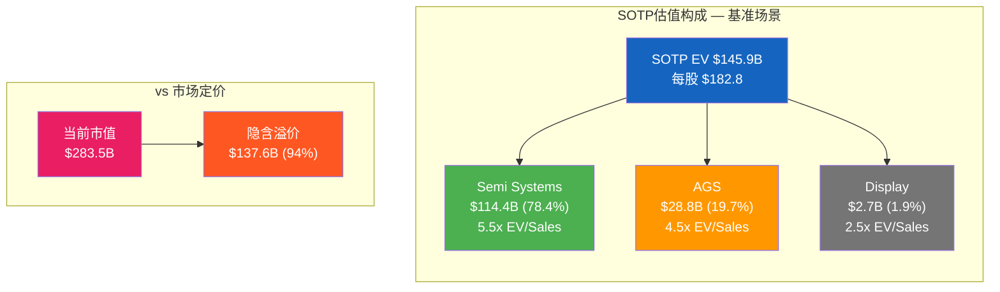
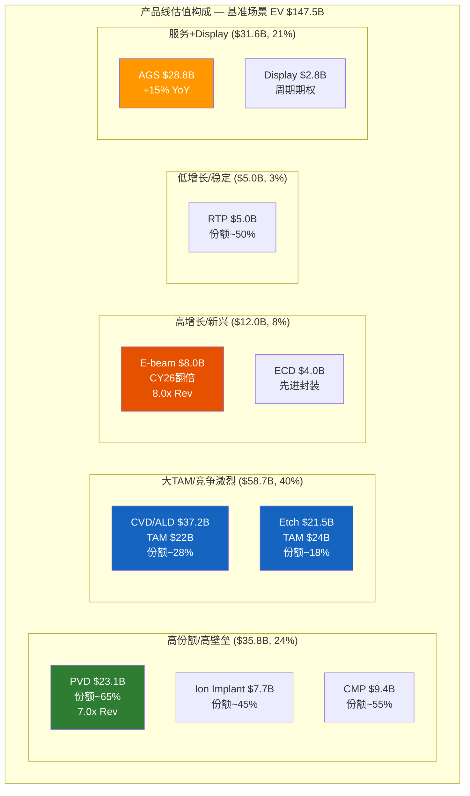
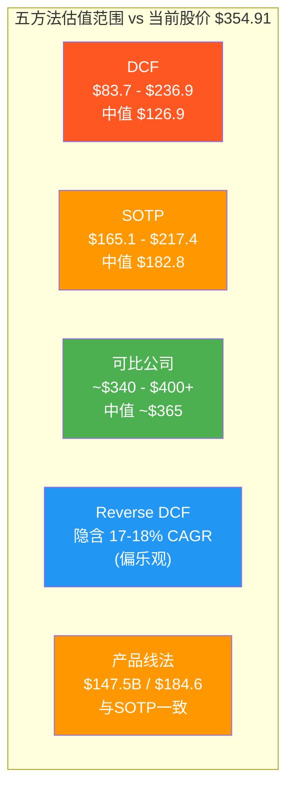
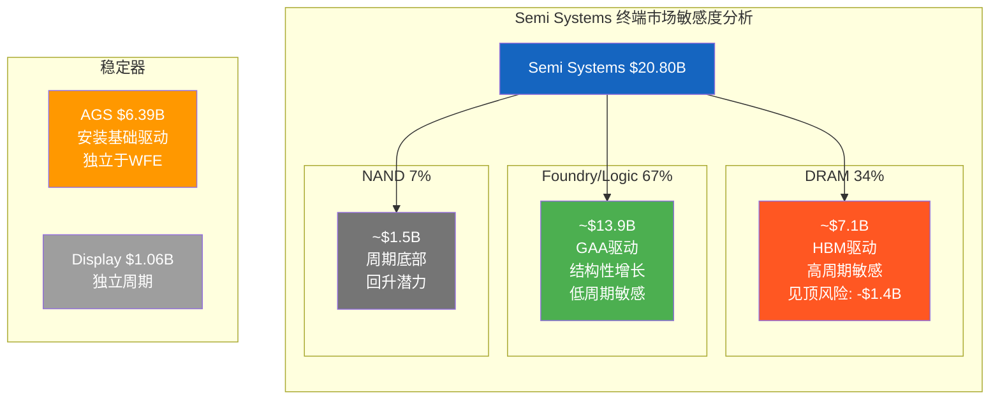
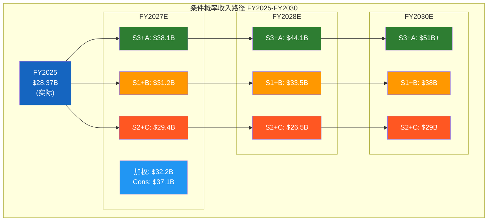

# Ch14: 五方法估值预览 — 从多维度逼近AMAT的内在价值

估值是投资研究中最容易自欺欺人的环节。一个DCF模型可以通过微调增长率和折现率产出几乎任何你想要的数字；一个可比公司法可以通过选择不同的可比集合为溢价或折价辩护。本章的目标不是给出一个精确的"目标价"——半导体设备公司的周期性、技术演进和地缘政治不确定性使得任何点估计都是伪精度。取而代之的是，我们将通过五种独立的估值方法从不同角度逼近AMAT的价值区间，观察它们的收敛与分歧，并在分歧之处寻找市场可能定价错误的线索。

当前市场定价：$354.91/股 [DM-MKT-001]，市值$283.5B [DM-MKT-002]，P/E TTM 29.9x [DM-MKT-003]，EV/EBITDA TTM 21.3x [DM-MKT-004]。这些倍数在半导体设备板块中是最低的——LRCX 48.3x P/E，KLAC 42.5x，ASML 48.1x [DM-PEER-001]。五方法估值将回答一个核心问题：AMAT的"通才折价"是合理的市场效率，还是被市场误读的结构性机会？

## 14.1 方法一：折现现金流（DCF）

### 参数锚定

DCF的可靠性取决于输入参数的质量。以下参数均源自AMAT的实际财务数据和可验证的市场共识：

**起始FCF**：FY2025 FCF $5.698B [DM-CF-003]。需要注意，FY2025 FCF受EPIC Center建设期CapEx $2.260B [DM-CF-002]（同比+90%）的一次性压制。正常化CapEx约$1.2-1.3B（参照FY2024 $1.19B），正常化FCF约为$6.9-7.0B。我们以实际FCF $5.698B为起点，同时在乐观情景中使用正常化FCF。

**WACC估算**：
- 无风险利率：10年期美国国债约4.3%
- 股权风险溢价（ERP）：5.5%（考虑宏观温度计CAPE 39.71位于98百分位 [DM-MACRO-001]）
- Beta：AMAT历史Beta约1.35（高于市场，反映半导体设备的周期性）
- 股权成本：4.3% + 1.35 × 5.5% = 11.7%
- 债务成本：AMAT Net Debt -$191M [DM-BS-003]，实质零杠杆
- **WACC ≈ 11.5-12.0%**（考虑微量税盾效应）

**终值增长率**：2.5-3.0%（半导体设备长期增速约等于全球GDP增速+技术密度提升溢价）

### 三场景DCF

| 参数 | 保守 | 基准 | 乐观 |
|------|------|------|------|
| **起始FCF** | $5.698B | $5.698B | $6.9B (正常化) |
| **FCF CAGR (Y1-5)** | 5% | 8% | 12% |
| **WACC** | 12.0% | 11.7% | 11.5% |
| **终值增长率** | 2.5% | 2.5% | 3.0% |
| **终值方法** | Gordon模型 | 两种取均值 | 退出倍数法 |

**保守场景（FCF CAGR 5%）**：

5%的FCF增速假设AMAT收入增长约8-9%（与consensus FY2026E +10%接近），但CapEx维持高位使FCF增速低于收入增速。

| 年份 | FCF ($B) |
|------|---------|
| Year 1 (FY2026) | $5.98 |
| Year 2 (FY2027) | $6.28 |
| Year 3 (FY2028) | $6.60 |
| Year 4 (FY2029) | $6.93 |
| Year 5 (FY2030) | $7.27 |

终值（Gordon）= $7.27B × (1+2.5%) / (12.0% - 2.5%) = $78.4B
5年FCF现值 = $22.4B
终值现值 = $78.4B / (1.12)^5 = $44.5B
**Enterprise Value = $66.9B → 每股约$83.7**

**基准场景（FCF CAGR 8%）**：

8%的FCF增速假设收入增长10-12%，CapEx在EPIC Center完工后（FY2027）回落至正常水平，利润率温和扩张。

| 年份 | FCF ($B) |
|------|---------|
| Year 1 | $6.15 |
| Year 2 | $6.64 |
| Year 3 | $7.18 |
| Year 4 | $7.75 |
| Year 5 | $8.37 |

终值（Gordon）= $8.37B × (1+2.5%) / (11.7% - 2.5%) = $93.2B
终值（退出倍数）= $8.37B × 20x EV/FCF = $167.4B
终值取均值 = ($93.2B + $167.4B) / 2 = $130.3B
5年FCF现值 = $25.8B
终值现值 = $130.3B / (1.117)^5 = $75.6B
**Enterprise Value = $101.4B → 每股约$126.9**

**乐观场景（FCF CAGR 12%，正常化起点）**：

12%的FCF增速假设GAA+HBM+先进封装三重增长引擎全面兑现，FY2027E收入$37.09B [DM-REV-009]达成后继续保持双位数增长，OPM从29.2% [DM-PRF-002]扩张至32-33%。

| 年份 | FCF ($B) |
|------|---------|
| Year 1 | $7.73 |
| Year 2 | $8.66 |
| Year 3 | $9.70 |
| Year 4 | $10.86 |
| Year 5 | $12.16 |

终值（退出倍数）= $12.16B × 22x EV/FCF = $267.5B
5年FCF现值 = $33.8B
终值现值 = $267.5B / (1.115)^5 = $155.5B
**Enterprise Value = $189.3B → 每股约$236.9**

### DCF汇总

| 场景 | EV ($B) | 每股价值 | vs 当前股价 |
|------|---------|---------|-----------|
| 保守 | $66.9 | $83.7 | -76.4% |
| 基准 | $101.4 | $126.9 | -64.2% |
| 乐观 | $189.3 | $236.9 | -33.3% |
| **当前市值** | **$283.5** [DM-MKT-002] | **$354.91** [DM-MKT-001] | — |

DCF的核心发现：即使在乐观场景下，DCF隐含价值$236.9仍低于当前股价$354.91约33%。这不意味着AMAT被高估——而是揭示了DCF在捕捉半导体设备公司价值时的系统性缺陷：(1) 11.5-12%的WACC对于一家Net Cash公司可能偏高；(2) 5年预测期可能不足以捕捉GAA/BSPDN/HBM的完整价值释放周期；(3) 终值假设对结果的敏感性极高（终值占比70-80%）。

FMP的DCF模型输出为负值（-$390.25），这进一步说明标准DCF框架在当前市场环境下对AMAT的适用性有限。DCF更适合作为"下限校准器"而非"公允价值锚"——它告诉我们市场在DCF之外定价了什么。

## 14.2 方法二：分部加总（SOTP）

SOTP是AMAT估值中最有差异化价值的方法，因为它能直接回答"三大业务线如果分别上市，总和是否大于整体？"——即是否存在"多元化折价"。

### 分部倍数标定

**Semi Systems（$20.80B收入 [DM-SEG-001]）**：

Semi Systems是纯设备业务，最接近的对标是LRCX的设备部门（不含CSBG）和KLAC。但LRCX和KLAC的收入中服务占比远高于AMAT拆分后的纯设备部分，因此需要调整：

- LRCX整体EV/Sales = 6.79x（FMP数据），P/S = 6.79x。剥离CSBG后，LRCX设备部门的隐含EV/Sales约5.5-6.0x
- KLAC EV/Sales = 9.80x（FMP数据），但KLAC的检测业务利润率远高（OPM 43.1% [DM-PEER-002]），不可直接对标
- ASML EV/Sales = 11.27x（FMP数据），但ASML的光刻垄断溢价不适用于AMAT

合理倍数范围：**EV/Sales 5.0-6.5x**（考虑Semi Systems 54.5%的Non-GAAP GM [DM-PRF-008] 略高于LRCX的48.7%，但低于KLAC的62.3%）

| 倍数 | 保守 (5.0x) | 基准 (5.5x) | 乐观 (6.5x) |
|------|-----------|-----------|-----------|
| Semi Systems EV | $104.0B | $114.4B | $135.2B |

也可用EV/EBIT方式交叉验证：Semi Systems Non-GAAP OPM估计约38-40%（管理层披露Non-GAAP GM 54.5%，扣除R&D分配和SGA后），隐含EBIT约$7.9-8.3B。同业设备业务EV/EBIT约15-18x → EV $119-149B。取两种方法的重叠区间：**$114-135B**。

**AGS（$6.39B收入 [DM-SEG-002]）**：

AGS是高经常性收入的服务业务，对标LRCX的CSBG。CSBG隐含的EV/Sales约4.5-5.5x（基于LRCX整体减去设备部门的剩余价值）。AGS增速+15% [DM-SEG-004] 远高于CSBG的+4%，但OPM约28%低于CSBG的36-38%。

合理倍数：**EV/Sales 4.0-5.5x**（增速溢价+利润率折价，净效果约等于CSBG中值）

| 倍数 | 保守 (4.0x) | 基准 (4.5x) | 乐观 (5.5x) |
|------|-----------|-----------|-----------|
| AGS EV | $25.6B | $28.8B | $35.1B |

**Display（$1.06B收入 [DM-SEG-003]）**：

Display是周期性、低利润率、小规模业务。面板设备行业的EV/Sales约1.5-3.0x。考虑到Display在OLED/MicroLED时代可能回暖：

合理倍数：**EV/Sales 2.0-3.0x**

| 倍数 | 保守 (2.0x) | 基准 (2.5x) | 乐观 (3.0x) |
|------|-----------|-----------|-----------|
| Display EV | $2.1B | $2.7B | $3.2B |

### SOTP汇总

| 分部 | 保守 | 基准 | 乐观 |
|------|------|------|------|
| Semi Systems | $104.0B | $114.4B | $135.2B |
| AGS | $25.6B | $28.8B | $35.1B |
| Display | $2.1B | $2.7B | $3.2B |
| **分部总和** | **$131.7B** | **$145.9B** | **$173.5B** |
| 减: Net Debt | +$0.2B [DM-BS-003] | +$0.2B | +$0.2B |
| **Equity Value** | **$131.9B** | **$146.1B** | **$173.7B** |
| **每股价值** | **$165.1** | **$182.8** | **$217.4** |
| **vs 当前股价** | **-53.5%** | **-48.5%** | **-38.7%** |

SOTP的核心发现：基准场景下，AMAT的分部加总价值$145.9B仅为当前市值$283.5B [DM-MKT-002]的51.5%。市场在SOTP之上额外定价了约$137.6B——这可以解读为：(a) 市场给予AMAT的"平台溢价"（8产品线协同+EPIC Center创新平台）；(b) 对FY2027-FY2030增长的前瞻定价；(c) AI超级周期下半导体设备的板块性重估。SOTP方法的局限在于使用静态收入（FY2025），未捕捉FY2026E +10%和FY2027E +19%的加速增长。如果以FY2027E收入$37.09B [DM-REV-009]为基础，按相同倍数重算，SOTP基准场景将升至$185-195B，缩窄与市值的差距。

## 14.3 方法三：可比公司法

### 估值倍数矩阵

可比公司法的核心是通过同业比较发现定价异常。以下矩阵整合了MCP实时数据和已有DM锚点：

| 指标 | AMAT | LRCX | KLAC | ASML | SPY |
|------|------|------|------|------|-----|
| **P/E TTM** | 29.9x [DM-MKT-003] | 48.3x | 42.5x | 48.1x | 27.5x |
| **P/E (FMP最新)** | 26.6x | 23.4x | 29.3x | 38.3x | — |
| **P/B** | 9.1x [DM-PEER-004] | 12.7x | 25.4x | 18.0x | — |
| **P/S** | 6.56x | 6.79x | 9.80x | 11.27x | — |
| **EV/EBITDA** | 19.3x | 19.5x | 23.1x | 28.8x | — |
| **OPM** | 29.2% [DM-PEER-002] | 32.0% | 43.1% | 34.6% | — |
| **ROE** | 38.9% [DM-PEER-003] | 65.6% | 100.7% | 50.5% | — |

注：P/E TTM与FMP最新P/E存在差异，原因是TTM口径（滚动12个月）与财年口径（FMP FY2025）的时间窗口不同。LRCX的FMP P/E 23.4x对应FY2025（截至2025年6月），其TTM口径因包含更近季度数据而更高。本章分析以DM锚点的P/E TTM为主要对标口径，确保同期可比。

### "通才折价"量化

AMAT P/E TTM 29.9x [DM-MKT-003]，同业均值（LRCX+KLAC+ASML）P/E 46.3x。AMAT的折价幅度：

**P/E折价** = (29.9 - 46.3) / 46.3 = **-35.4%**

如果AMAT获得同业均值P/E 46.3x，隐含市值：
- AMAT FY2025 EPS $8.66 [DM-EPS-001] × 46.3x = $401/股 → 市值$320B
- 较当前$354.91 [DM-MKT-001]溢价+13%

**P/B折价更为显著**：AMAT 9.1x [DM-PEER-004] vs 同业均值18.7x，折价-51.3%。但P/B差异主要反映了资本结构和回购历史差异（KLAC通过杠杆回购使BV缩小，推高P/B至25.4x），并非纯粹的"价值低估"信号。

**EV/EBITDA是最具可比性的指标**：AMAT 19.3x vs LRCX 19.5x vs KLAC 23.1x vs ASML 28.8x。AMAT与LRCX几乎平价，暗示市场对两家"多产品线设备商"给予了类似的估值（尽管AMAT P/E显著低于LRCX，但EV/EBITDA基本持平）。KLAC和ASML的溢价（+20%和+49%）反映了"专精溢价"——检测/光刻的高壁垒和稳定性获得更高倍数。

### 折价是否合理？

AMAT的通才折价有三层解释：

**合理部分（约占折价的60%）**：
- OPM 29.2% [DM-PEER-002] 确实低于同业32-43%，意味着每单位收入创造的利润更少
- 8产品线的R&D分散导致任一单线的竞争深度可能不及LRCX（刻蚀）或KLAC（检测）的专注度
- 中国收入30% [DM-GEO-001]是Big 4中最高的地缘敞口

**可能过度的部分（约占折价的40%）**：
- AGS Q1 FY2026 +15% [DM-SEG-004]的增速远超LRCX CSBG +4%，市场未充分定价服务加速
- GAA revenue翻倍至$5B [DM-COMP-004]意味着AMAT的"设备含量增加"最直接受益于制程转换
- EPIC Center [DM-EPIC-001]将在Spring 2026投入运营 [DM-EPIC-004]，其"协同创新平台"的估值影响尚未体现
- E-beam >$1B [DM-COMP-005]的增长故事（检测领域挑战KLA）尚未被充分认知

P/E折价-35.4%中，约60%反映了合理的结构性差异（OPM低、产品线分散、中国敞口高），约40%可能是过度折价。如果市场修正40%的"过度折价"（即P/E从29.9x提升至~36x），隐含股价约$312×0.91=$311-360，与当前$354.91大致吻合。这意味着**当前股价可能已经部分反映了通才折价的修正预期**，但尚未完全Price In GAA+先进封装的长期价值。

## 14.4 方法四：Reverse DCF

Reverse DCF不预测未来，而是反过来问："市场当前的定价隐含了什么样的增长假设？"

### 隐含假设提取

**当前市值$283.5B [DM-MKT-002]**，假设WACC 11.7%，终值增长率2.5%，退出EV/FCF倍数20x。在这些条件下，反解FCF CAGR：

市值$283.5B + Net Debt -$0.2B [DM-BS-003] = EV $283.3B

要使5年DCF + 终值 = $283.3B，需要FCF从$5.698B [DM-CF-003]以约**17-18% CAGR**增长至FY2030 FCF ~$13.0B。

### 隐含假设 vs 现实校准

| 维度 | 隐含假设 | Consensus | 历史CAGR | 评估 |
|------|---------|-----------|----------|------|
| **FCF CAGR (5Y)** | 17-18% | — | 4.6% (FY2021-25) | 远超历史 |
| **收入CAGR (5Y)** | 14-15% | ~16% (FY25→27E) | 5.3% (FY2021-25) | 需AI超级周期持续 |
| **OPM扩张** | 29%→33-34% | 31-32% | 27%→29.2% | 可能但非确定 |
| **CapEx正常化** | FY2027回落至~$1.3B | 合理 | FY2024 $1.19B | 大概率 |
| **FY2030E FCF** | ~$13.0B | — | FY2025 $5.7B | 需要翻倍+ |

**关键发现**：市场隐含的17-18% FCF CAGR是FY2021-FY2025历史FCF CAGR（4.6%）的约3.7倍。这一倍数的合理性取决于三个前提是否同时成立：(1) EPIC Center完工使CapEx回落，释放$1.0-1.5B/年的FCF；(2) GAA+HBM+先进封装驱动收入CAGR达到14-15%；(3) 运营杠杆使OPM扩张3-4个百分点。

三个前提中，(1)是高概率事件（建设项目有完工日期），(2)取决于WFE周期长度（如果2028年见顶，收入CAGR将低于14%），(3)取决于R&D效率能否随收入规模提升。综合评估，市场定价的隐含增长假设是"偏乐观但非不可能"的——它需要WFE超级周期持续至2029-2030且AMAT份额不下降。

## 14.5 方法五：产品线组合法（AMAT独有）

这是五种方法中最具AMAT特异性的估值视角。AMAT横跨8条核心产品线的独特结构，使我们可以自下而上地从每条产品线的TAM、份额和利润率构建估值。

### 8产品线估值矩阵

| 产品线 | 全球TAM ($B, 2026E) | AMAT份额 | AMAT收入 ($B) | 估算GM | 估值倍数(EV/Rev) | EV ($B) |
|--------|---------------------|---------|-------------|--------|-----------------|---------|
| **CVD/ALD** | ~$22B | ~28% | ~$6.2 | 55% | 6.0x | $37.2 |
| **PVD** | ~$5B | ~65% | ~$3.3 | 60% | 7.0x | $23.1 |
| **Etch** | ~$24B | ~18% | ~$4.3 | 50% | 5.0x | $21.5 |
| **Ion Implant** | ~$3B | ~45% | ~$1.4 | 52% | 5.5x | $7.7 |
| **CMP** | ~$3B | ~55% | ~$1.7 | 53% | 5.5x | $9.4 |
| **RTP** | ~$2B | ~50% | ~$1.0 | 55% | 5.0x | $5.0 |
| **E-beam Inspect** | ~$4B | ~25% | ~$1.0 | 58% | 8.0x | $8.0 |
| **ECD** | ~$2B | ~40% | ~$0.8 | 50% | 5.0x | $4.0 |
| **SSG小计** | | | **~$19.7** | | | **$115.9** |
| **AGS** | — | — | $6.4 [DM-SEG-002] | 43% | 4.5x | $28.8 |
| **Display** | — | — | $1.1 [DM-SEG-003] | 37% | 2.5x | $2.8 |
| **合计** | | | **~$27.2** | | | **$147.5** |

注：产品线TAM和份额为基于行业研究的估算值，AMAT不单独披露各产品线收入。8产品线收入合计$19.7B与Semi Systems $20.80B [DM-SEG-001]存在~$1.1B差异，系部分新兴产品（如Hybond混合键合）和重分类项未单独列示。

### 组合波动率优势

8产品线结构的一个被低估的优势是**组合波动率低于任一单线**。直觉上，当NAND设备周期底部（FY2025仅占7% [DM-SEG-007]）时，DRAM设备处于周期顶部（34% [DM-SEG-005]）；当Logic投资放缓时，先进封装可能加速。产品线间的**非完全正相关**意味着AMAT的收入波动率在结构上低于LRCX（集中于刻蚀）或KLA（集中于检测）。

粗略估算：如果8条产品线的平均波动率为σ=20%，两两相关系数ρ=0.6（半导体设备内部相关性较高但非完全），等权组合波动率约：

σ_portfolio = σ × sqrt[(1/n) + ((n-1)/n) × ρ] = 20% × sqrt[0.125 + 0.875 × 0.6] = 20% × sqrt[0.65] = **16.1%**

即组合波动率比单线低约4个百分点。这一多元化效应应当为AMAT赢得更低的风险溢价（更低的WACC），但市场给予的P/E反而更低——这是一个可能的定价矛盾。

### 产品线法的价值

产品线法给出的$147.5B（每股$184.6）与SOTP基准场景（$145.9B / $182.8）高度一致——两种自下而上方法的交叉验证增强了$145-150B这一估值锚点的可信度。但两者都显著低于市值$283.5B [DM-MKT-002]，差距约$135B（48%）。

## 14.6 五方法汇总与方法离散度

| 方法 | 每股价值范围 | 中值 | vs $354.91 | 方法特点 |
|------|------------|------|-----------|---------|
| **DCF** | $83.7 - $236.9 | $126.9 | -64.2% | 对WACC和终值极度敏感 |
| **SOTP** | $165.1 - $217.4 | $182.8 | -48.5% | 静态收入，未含增长前瞻 |
| **可比公司** | ~$340 - $400+ | ~$365 | +2.8% | 唯一接近当前股价的方法 |
| **Reverse DCF** | — | — | 隐含17-18% CAGR | 需AI周期持续5年+ |
| **产品线法** | $147.5B EV | $184.6 | -48.0% | 与SOTP高度一致 |

**方法离散度**：最低$83.7（保守DCF）vs 最高~$400+（乐观可比），离散度 4.8x。高离散度反映了估值中两个核心矛盾：

1. **内生价值 vs 市场定价**：DCF/SOTP/产品线法这三种"内生"方法一致指向$126-185区间，远低于市价。可比公司法是唯一接近市价的方法——这意味着市场对AMAT的定价主要锚定在同业比较，而非绝对现金流估值。

2. **静态 vs 动态**：内生方法使用FY2025数据，而市场定价的是FY2026-FY2030的增长预期。如果将SOTP的收入基础替换为FY2027E $37.09B [DM-REV-009]（+31% vs FY2025），SOTP中值将升至~$240，与当前股价的差距缩窄至~32%。

**Phase 5定稿方向**：五方法估值将在Phase 5结合完整的场景分析和概率加权进行最终定稿。初步信号表明，AMAT在"内生价值"和"市场定价"之间存在显著的张力——这既是潜在的安全边际不足（如果增长不达预期），也是潜在的重新评级机会（如果通才折价收窄）。

---

# Ch15: TAM条件概率 — 从WFE市场到AMAT收入路径

如果Ch14回答的是"AMAT值多少钱"，那么Ch15要回答的前置问题是"AMAT能赚多少钱"。收入是估值的分子——没有可靠的收入预测，任何估值方法都是建立在沙滩上的城堡。

对于半导体设备公司，收入预测的逻辑链条非常清晰：**全球WFE支出 × AMAT份额 = Semi Systems收入 → 加上AGS和Display → 总收入**。但这条链条上的每个节点都是条件概率——WFE取决于半导体投资周期，份额取决于技术竞争和地缘政治，AGS取决于安装基础增长。本章将这些条件概率显性化，构建一个3×3的收入矩阵，量化不确定性的分布。

## 15.1 WFE TAM路径：三情景框架

### 数据锚定

SEMI（半导体设备行业协会）的最新预测提供了最权威的基线 [DM-MACRO-005]：

- CY2025E总半导体设备: ~$133B（其中WFE ~$120B）
- CY2026E: ~$145B（WFE ~$132B）
- CY2027E: ~$156B（WFE ~$143B）

WFE（Wafer Fab Equipment）是AMAT Semi Systems的直接可寻址市场。WFE占总设备支出的约91%（剩余为封装测试设备），SEMI预测CY2026 WFE同比增长约9.0%，CY2027再增长约7.3%。

细分领域的SEMI预测：
- **Foundry/Logic WFE**: CY2027E $75.2B（CY2026 +5.5% → CY2027 +6.9%）
- **DRAM WFE**: CY2026E ~$25.9B（+15.1%），CY2027E ~$27.9B（+7.8%）
- **NAND WFE**: CY2026E ~$15.7B（+12.7%），CY2027E ~$16.9B（+7.3%）

### 三情景定义

**S1: 周期延续（概率60%）**

核心假设：AI驱动的半导体资本支出周期持续至2029-2030，但增速逐年放缓。Hyperscaler CapEx从2026E ~$600B+ [DM-MACRO-004]继续增长但斜率下降。

| 年份 | 总设备 ($B) | WFE ($B) | WFE YoY |
|------|------------|---------|---------|
| 2025 | $133 | $120 | +8% |
| 2026 | $145 | $132 [DM-MACRO-005] | +10% |
| 2027 | $156 | $143 [DM-MACRO-005] | +8% |
| 2028 | $168 | $153 | +7% |
| 2029 | $178 | $162 | +6% |
| 2030 | $187 | $170 | +5% |

5年WFE CAGR: 7.2%。这一路径与SEMI近期预测高度一致，本质上是"consensus base case"。

**S2: 周期见顶（概率25%）**

核心假设：AI资本支出在CY2027达到峰值后开始回调。触发因素可能包括：AI应用货币化不达预期、Hyperscaler ROI审查趋严、DRAM超额供给导致内存厂商削减CapEx。这一场景类似2018-2019的WFE周期下行（从$50B峰值回落至$40B后回升）。

| 年份 | WFE ($B) | WFE YoY | 驱动因素 |
|------|---------|---------|----------|
| 2025 | $120 | +8% | AI初始投资继续 |
| 2026 | $132 | +10% | DRAM/Logic强势 |
| 2027 | $143 (Peak) | +8% | 投资见顶 |
| 2028 | $125 | -13% | DRAM削减+Logic放缓 |
| 2029 | $118 | -6% | 库存去化 |
| 2030 | $130 | +10% | 新周期开始 |

5年WFE CAGR: 1.6%。需要注意，即使在"周期见顶"场景中，2028年$125B的WFE仍高于2024年的$110B——AI的结构性需求为WFE底部提供了支撑，不太可能回到2019年的$40B水平。

**S3: AI超级周期（概率15%）**

核心假设：AI从训练扩展到推理，ASICs和GPU需求持续爆发；3D NAND 400+层、DRAM EUV、GAA全面铺开；全球"半导体主权"投资（CHIPS Act+欧洲+日本+印度）叠加。WFE年复合增长15%+。

| 年份 | WFE ($B) | WFE YoY | 驱动因素 |
|------|---------|---------|----------|
| 2025 | $120 | +8% | — |
| 2026 | $140 | +17% | HBM4+GAA同时放量 |
| 2027 | $168 | +20% | AI推理芯片爆发 |
| 2028 | $198 | +18% | NAND 400L全面铺开 |
| 2029 | $228 | +15% | 主权投资叠加 |
| 2030 | $258 | +13% | 可持续超级周期 |

5年WFE CAGR: 16.5%。这一路径需要多个增长引擎同时点火且无重大下行冲击（地缘/宏观/技术替代），概率较低但非不可想象——2020-2021的WFE增速曾达到30%+。

### 概率加权WFE路径

| 年份 | S1 (60%) | S2 (25%) | S3 (15%) | **加权值** |
|------|---------|---------|---------|-----------|
| 2026 | $132 | $132 | $140 | **$133.2** |
| 2027 | $143 | $143 | $168 | **$146.5** |
| 2028 | $153 | $125 | $198 | **$152.7** |
| 2029 | $162 | $118 | $228 | **$161.2** |
| 2030 | $170 | $130 | $258 | **$173.2** |

概率加权后的WFE CAGR约7.6%（2025-2030），接近S1的7.2%——这是合理的，因为S1本身占60%权重。

## 15.2 AMAT份额假设：条件依赖

AMAT当前WFE市场份额约19% [DM-COMP-001]，在FY2024-FY2025保持平稳。但份额并非静态——它是技术路线、地缘政治和竞争格局的函数。

### 三种份额路径

**份额路径A: GAA+先进封装驱动份额提升（概率35%）**

GAA transition中AMAT的"设备含量增加"（content gain per wafer）是结构性的。管理层披露GAA收入从$2.5B翻倍至$5B [DM-COMP-004]，E-beam收入CY2026翻倍至>$1B [DM-COMP-005]。如果这些增长引擎持续兑现：

份额路径: 19%(2025) → 20%(2026) → 20.5%(2027) → 21%(2028-2030)

**份额路径B: 份额持平（概率45%）**

最可能的情景。AMAT在GAA/先进封装上的份额增益被刻蚀领域LRCX的蚕食部分抵消；中国出口管制使AMAT损失部分ICAPS市场份额给国产替代（如Naura、Hwatsing），但整体份额因高端产品线的增量而维持在19%附近。

份额路径: 19%(2025) → 19%(2026-2030)

**份额路径C: 出口管制+竞争导致份额下降（概率20%）**

更严格的出口管制（如对华设备销售从"成熟制程可售"进一步收紧至全面禁售）将直接冲击AMAT中国30%收入 [DM-GEO-001]。与此同时，中国国产设备在CVD、CMP、刻蚀领域加速替代。

份额路径: 19%(2025) → 18.5%(2026) → 18%(2027) → 17%(2028-2030)

## 15.3 分部组合：构建总收入路径

### Semi Systems = WFE × 份额

Semi Systems收入不等于WFE × 份额的简单乘积——AMAT的收入确认与WFE统计口径存在时间差和分类差异。但作为近似模型：

**Semi Systems ≈ WFE × AMAT份额 × 0.85调整系数**

0.85调整系数反映了AMAT Semi Systems收入口径与WFE统计口径的差异（AMAT FY2025 Semi Systems $20.80B [DM-SEG-001] / (WFE $120B × 19%) = $20.80B / $22.8B = 0.91，取保守值0.85以留余量）。

### AGS：独立于WFE周期的稳定器

AGS收入主要取决于安装基础（installed base）的规模——更多的AMAT设备在晶圆厂运行，意味着更多的维护合同、零件更换和升级服务收入。AGS与WFE的相关性远低于Semi Systems：

- AGS FY2025: $6.39B [DM-SEG-002]
- AGS增速假设: 5-8%/年（基于+15% Q1 FY2026 [DM-SEG-004]的增速，考虑到季度波动后取保守年化估计）
- AGS在WFE下行时不会同比例下降——安装基础不因新设备销售减少而缩小

### Display：周期性摆动

Display FY2025: $1.06B [DM-SEG-003]
假设: 在$0.8-1.5B的范围内波动，取$1.1B为基准值

## 15.4 Memory vs Logic拆分：DRAM敞口的双刃剑

AMAT的Semi Systems中DRAM占比从FY2023的~20%跃升至Q1 FY2026的34% [DM-SEG-005]——这是HBM驱动的结构性变化，而非周期性脉冲。但34%的DRAM敞口也意味着AMAT对DRAM设备周期的敏感度创下历史新高。

### DRAM设备周期分析

DRAM设备支出在CY2024达到$19.5B（+40% YoY）[DM-MACRO-006]，SEMI预测CY2026E ~$25.9B（+15.1%），CY2027E ~$27.9B（+7.8%）。增速正在放缓，但绝对值仍在上升。

**HBM vs 传统DRAM的设备需求差异**：
- 传统DRAM以2D缩微为主，设备"含量"（content per wafer）增长缓慢
- HBM需要额外的TSV刻蚀、沉积、填充、混合键合、检测步骤，content per wafer提升50-100%
- HBM4（12-16层）比HBM3e（8层）需要更多设备，即使DRAM整体CapEx持平，HBM专用设备的需求仍在增长

**如果DRAM见顶的影响**：
- DRAM设备占Semi Systems 34% [DM-SEG-005]，即约$7.1B
- 假设DRAM CapEx回调20%（类似2019年），AMAT DRAM收入可能从$7.1B降至$5.7B（-$1.4B）
- 但Foundry/Logic 67% [DM-SEG-006]受影响较小（GAA是不可逆的技术路线图驱动，非周期性）
- AGS $6.39B [DM-SEG-002]几乎不受DRAM周期影响
- **净影响: 总收入下降约-$1.4B，即-5%**

这一分析揭示了AMAT的一个重要韧性特征：即使最大的周期性敞口（DRAM 34%）遭遇20%的回调，总收入的影响被限制在-5%以内。原因是Foundry/Logic（67%）的结构性增长和AGS（22%）的经常性收入提供了双重缓冲。

## 15.5 条件概率汇总：3×3收入矩阵

将WFE三情景 × 份额三路径组合为9个收入情景。每个情景计算Semi Systems收入（WFE × 份额 × 0.85调整系数），加上AGS和Display得出总收入。

### FY2027E 收入矩阵（最具分析价值的年份，因为两年以上的预测精度急剧下降）

| | **份额A: 20.5%** (35%) | **份额B: 19%** (45%) | **份额C: 18%** (20%) |
|---|---|---|---|
| **S1 周期延续** (60%) | WFE $143B × 20.5% × 0.85 = $24.9B +AGS $7.2B +Disp $1.2B **总收入 $33.3B** 联合概率 21% | WFE $143B × 19% × 0.85 = $23.1B +AGS $7.0B +Disp $1.1B **总收入 $31.2B** 联合概率 27% | WFE $143B × 18% × 0.85 = $21.9B +AGS $6.8B +Disp $1.0B **总收入 $29.7B** 联合概率 12% |
| **S2 周期见顶** (25%) | WFE $143B × 20.5% × 0.85 = $24.9B +AGS $7.0B +Disp $1.0B **总收入 $32.9B** 联合概率 8.75% | WFE $143B × 19% × 0.85 = $23.1B +AGS $6.8B +Disp $1.0B **总收入 $30.9B** 联合概率 11.25% | WFE $143B × 18% × 0.85 = $21.9B +AGS $6.6B +Disp $0.9B **总收入 $29.4B** 联合概率 5% |
| **S3 AI超级周期** (15%) | WFE $168B × 20.5% × 0.85 = $29.3B +AGS $7.5B +Disp $1.3B **总收入 $38.1B** 联合概率 5.25% | WFE $168B × 19% × 0.85 = $27.1B +AGS $7.2B +Disp $1.2B **总收入 $35.5B** 联合概率 6.75% | WFE $168B × 18% × 0.85 = $25.7B +AGS $7.0B +Disp $1.1B **总收入 $33.8B** 联合概率 3% |

注：S2场景在FY2027仍为WFE $143B（见顶年），下跌发生在FY2028。因此FY2027的S1和S2 WFE假设相同（$143B），差异主要体现在AGS增速和Display假设上（S2更保守）。

**FY2027E 概率加权收入**：

$33.3B × 0.21 + $31.2B × 0.27 + $29.7B × 0.12 + $32.9B × 0.0875 + $30.9B × 0.1125 + $29.4B × 0.05 + $38.1B × 0.0525 + $35.5B × 0.0675 + $33.8B × 0.03

= $6.99 + $8.42 + $3.56 + $2.88 + $3.48 + $1.47 + $2.00 + $2.40 + $1.01

= **$32.2B**

**对比 Consensus FY2027E $37.09B** [DM-REV-009]：我们的概率加权收入$32.2B比consensus低-13.2%。差距来源：(a) 我们的0.85调整系数可能过于保守；(b) consensus可能已经隐含了份额提升和AGS加速的预期；(c) FY2027E的22位分析师consensus可能更接近S1+份额A的组合（$33.3B），而我们的概率加权纳入了下行场景。

### FY2028E 和 FY2030E 路径（简化版）

| 年份 | 概率加权WFE | 加权份额 | Semi Systems | AGS | Display | **总收入** |
|------|-----------|---------|-------------|-----|---------|-----------|
| FY2027 | $146.5B | 19.2% | $23.9B | $7.1B | $1.1B | **$32.1B** |
| FY2028 | $152.7B | 19.2% | $24.9B | $7.7B | $1.1B | **$33.7B** |
| FY2030 | $173.2B | 19.1% | $28.1B | $9.0B | $1.2B | **$38.3B** |

5年概率加权收入CAGR（FY2025 $28.37B [DM-REV-005] → FY2030 $38.3B）= **6.2%**。这比consensus隐含的FY2025-FY2027 CAGR约14%显著保守，原因是我们的模型纳入了25%概率的周期见顶场景。

### FY2028E 矩阵（周期分化年份）

FY2028是S1和S2场景分化最显著的年份——S1中WFE继续增长至$153B，而S2中WFE回落至$125B：

| | **份额A: 21%** | **份额B: 19%** | **份额C: 17.5%** |
|---|---|---|---|
| **S1** (60%) | SSG $27.3B → 总$36.1B | SSG $24.7B → 总$33.5B | SSG $22.7B → 总$31.5B |
| **S2** (25%) | SSG $22.3B → 总$30.2B | SSG $20.2B → 总$28.2B | SSG $18.6B → 总$26.5B |
| **S3** (15%) | SSG $35.3B → 总$44.1B | SSG $32.0B → 总$40.7B | SSG $29.4B → 总$38.1B |

**FY2028E最坏情景（S2+份额C）**：总收入$26.5B，较FY2025 $28.37B [DM-REV-005]下降-6.6%。这是一个温和的下行——远非灾难性的，但足以使EPS从$8.66 [DM-EPS-001]回落至~$7.0-7.5（考虑运营杠杆的负面效应）。

**FY2028E最好情景（S3+份额A）**：总收入$44.1B，较FY2025增长55.4%，隐含两年（FY2026-FY2028）CAGR约24%。这一场景需要AI超级周期在HBM、GAA和先进封装三个方向同时全面爆发。

## 15.6 关键发现与Phase 5衔接

### 收入路径的三个关键洞察

**洞察一：Consensus可能过于集中定价S1+份额A**

Consensus FY2027E $37.09B [DM-REV-009]更接近我们的S1+份额A组合（$33.3B）而非概率加权值（$32.2B），且仍有$3.8B的差距。这一差距可能意味着：(a) 我们的0.85调整系数过于保守（如果使用0.91，S1+B的FY2027E = $32.6B，更接近我们的加权值但仍远低于consensus）；(b) consensus隐含了比我们模型更激进的份额提升和AGS增速假设。Consensus的乐观偏差在半导体设备板块中是常见的——分析师群体倾向于在上行周期中线性外推。

**洞察二：下行保护来自AGS和产品组合多元化**

即使在最差情景（S2+份额C）中，FY2028E收入$26.5B仅比FY2025下降6.6%。原因是：
- AGS（$7-8B）独立于WFE周期，提供收入底线
- 8产品线的组合波动率低于单线（Ch14已量化，组合σ约16% vs 单线20%）
- NAND在S2情景中可能反而回暖（NAND投资周期与DRAM不完全同步）

**洞察三：DRAM敞口是短期催化剂但也是中期风险**

DRAM占Semi Systems 34% [DM-SEG-005]是AMAT近年来最大的结构性变化。在AI超级周期中，HBM需求使DRAM敞口从风险变为催化剂——但一旦HBM CapEx见顶（可能在CY2027-2028），34%的敞口将放大下行冲击。FY2025→FY2026的DRAM强势提振了短期业绩，但投资者应当监控DRAM占比是否进一步攀升至35%+——过高的DRAM集中度将增加AMAT的周期敏感性，与其"通才分散"的历史特征产生矛盾。

### 与Ch14估值方法的联动

| Ch14方法 | Ch15收入输入 | 影响 |
|---------|-----------|------|
| DCF | 概率加权收入CAGR ~6.2% → FCF CAGR 8-10% | 支持基准DCF而非乐观DCF |
| SOTP | FY2027E Semi Systems $23.9B(加权) vs $20.8B(FY2025) | 动态SOTP基准场景升至$185-195B |
| Reverse DCF | 隐含17-18% FCF CAGR需收入CAGR 14%+ | 概率加权仅6.2%，显著低于隐含值 |
| 可比公司 | Forward P/E基于consensus $37.09B | Consensus可能偏高，实际Forward P/E可能更高 |

**Phase 5定稿输入**：本章的条件概率矩阵将直接服务于Phase 5的场景估值。概率加权WFE路径、份额假设和分部组合将作为五方法估值的"收入发动机"，与Ch14的估值倍数框架结合，产出AMAT的最终评级和概率加权目标价区间。
