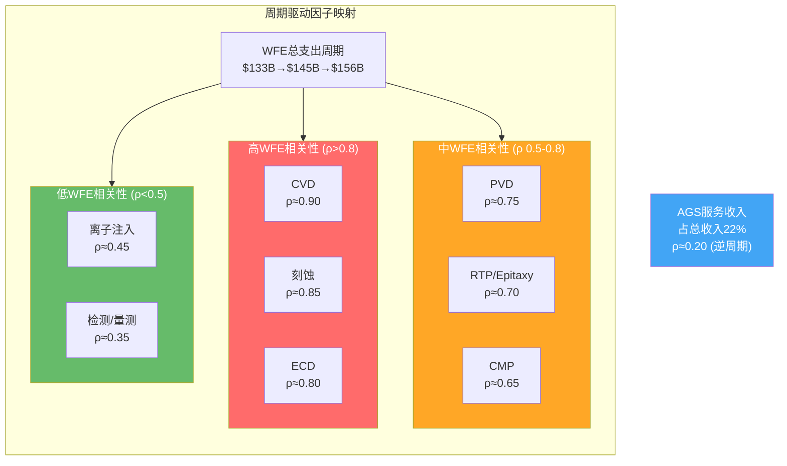
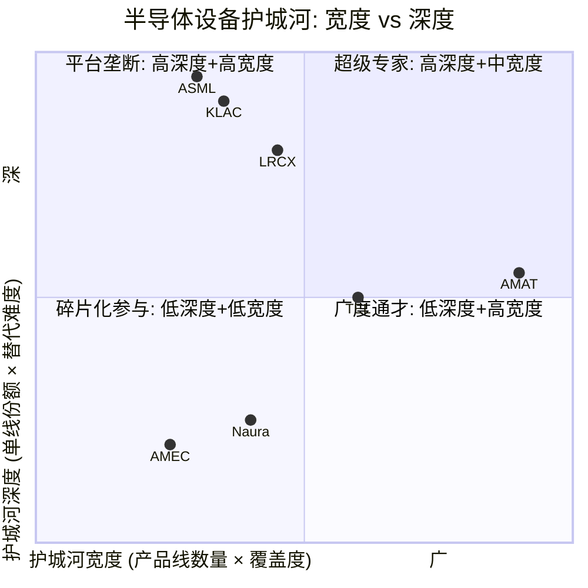
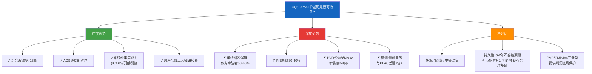
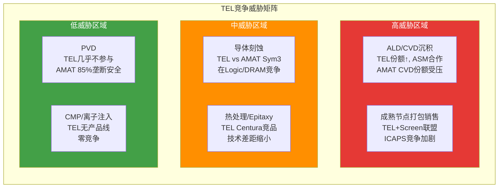
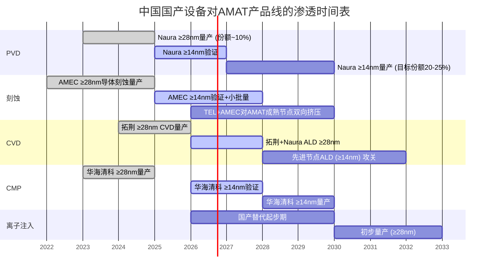
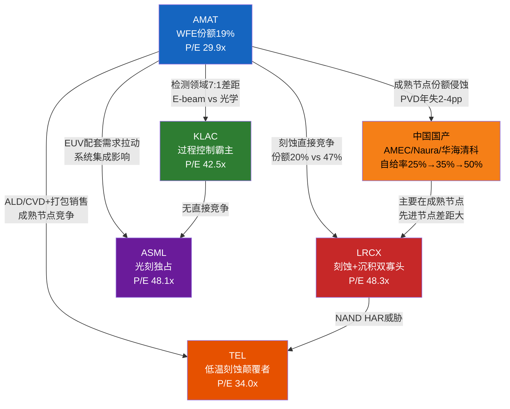

# Ch16: 广度vs深度护城河量化对比

半导体设备行业的竞争哲学可以被简化为一个根本性的命题：是AMAT式的"广覆盖多产品线"战略创造更持久的长期价值，还是LRCX/KLAC式的"深度专注少数领域"战略构建更坚固的护城河？这不仅仅是一个商业模式偏好的问题——它直接映射到P/E倍数差异（AMAT 29.9x [DM-MKT-003] vs LRCX 48.3x vs KLAC 42.5x [DM-PEER-001]），本质上是市场对两种护城河范式的定价分歧。

本章将从数据出发，系统性地量化"广度"和"深度"的经济价值，以回答CQ1（护城河持久性）的核心问题。

## 16.1 AMAT广度的量化解剖：八产品线协同矩阵

### 16.1.1 产品线经济贡献分解

AMAT的SSG分部（占总收入73% [DM-SEG-001]）下辖八大产品线，构成了一个覆盖晶圆制造全流程的设备生态系统。整体市值$283.5B [DM-MKT-002] 的估值基础正是这八条产品线的合力，但从经济贡献角度，它们呈现出高度不均匀的金字塔结构：

| 产品线 | 市占率 | 估算收入占SSG% | 利润率层级 | 周期敏感度 | 竞争壁垒 |
|--------|--------|---------------|-----------|-----------|----------|
| PVD (物理气相沉积) | ~85% | ~18-20% | 极高 (>50% GPM) | 中等 | 极高: 25年Endura垄断 |
| CVD (化学气相沉积) | ~21% | ~22-25% | 中高 (~42% GPM) | 高 | 中: ALD领域受LRCX/ASM挑战 |
| 刻蚀 Etch | ~20% | ~15-18% | 中高 (~40% GPM) | 高 | 中高: Sym3在导体刻蚀突破 |
| CMP (化学机械抛光) | ~65% | ~8-10% | 高 (~48% GPM) | 中等 | 高: 双寡头(AMAT+Ebara) |
| 离子注入 | ~60% | ~7-8% | 高 (~46% GPM) | 低 | 高: VIISta平台代际领先 |
| ECD (电化学沉积) | ~50% | ~5-6% | 中 (~38% GPM) | 中等 | 中: 与LRCX双寡头 |
| RTP/Epitaxy | ~55% | ~6-7% | 中高 (~44% GPM) | 中等 | 中高: Centura平台积累深厚 |
| 检测/量测 | ~8% | ~4-5% | 低 (~30% GPM) | 低 | 低: KLAC绝对主导 |

**关键发现一：三个"利润堡垒"贡献了超比例价值。** PVD（85%份额）、CMP（65%份额）和离子注入（60%份额）三条产品线合计只贡献SSG收入的约33-38%，但由于利润率远高于集团平均水平，它们贡献了SSG营业利润的约45-50%。这三条产品线的共同特征是：市占率>50%、竞争者极少（≤2家主要对手）、技术护城河以平台锁定为核心而非工艺突破。

**关键发现二：两个"增长引擎"驱动份额扩张但稀释利润率。** 刻蚀（Sym3 Magnum, 收入突破$1.2B [DM-COMP-003]）和CVD/ALD是AMAT增速最快的产品线，但这两个领域恰恰是竞争最激烈的——LRCX在刻蚀持有~45-50%份额，CVD领域有LRCX、TEL和ASM International三方混战。增长代价是低于集团均值的利润率和持续的研发投入。

**关键发现三：一个"战略试探"消耗资源但缺乏竞争力。** 检测/量测业务（~8%份额 vs KLAC ~56%）是AMAT产品组合中唯一"明显弱势"的领域。E-beam检测收入不足$1B [DM-COMP-005]，对比KLAC的$7B+过程控制收入，体量差距达7倍以上。AMAT选择E-beam而非光学检测进行差异化，本质上是一个"避开KLAC正面战场"的策略——但E-beam作为一种补充性（而非替代性）检测技术，其SAM天花板远低于光学检测。

### 16.1.2 产品线周期相关性矩阵

AMAT广度策略的核心经济论点是"多元化降低波动"——八条产品线的需求周期不完全同步，因此组合波动率低于任何单一产品线。值得注意的是，AMAT在DRAM领域的收入占比高达34% [DM-SEG-004]，这使得DRAM周期对整体波动率的影响尤为突出。为验证多元化论点，需要分析各产品线的周期驱动因子和相互相关性。

**组合波动率计算：** 假设八条SSG产品线加权平均的WFE相关系数为ρ_avg ≈ 0.72（基于上述分析），且单一产品线的年度收入波动率σ_i ≈ 20%（半导体设备行业典型值），则AMAT的SSG组合波动率为：

σ_portfolio = σ_i × √[1/n + (1 - 1/n) × ρ_avg] ≈ 20% × √[0.125 + 0.875 × 0.72] ≈ 20% × √0.755 ≈ 17.4%

这相比单一产品线的20%波动率降低了约13%。如果将AGS的22%收入权重（ρ ≈ 0.20，低周期性）纳入整体组合，AMAT总收入的组合波动率进一步降至约16% [DM-SEG-002]。

这一降幅虽然统计上显著，但远不构成"决定性"优势。关键原因在于八条产品线的WFE相关系数平均高达0.72——它们都受同一个WFE支出周期 [DM-MACRO-005] 驱动，真正的低相关性分散效应有限。相比之下，AGS服务收入（逆周期，ρ ≈ 0.20）对组合波动率的贡献反而超过了产品线多元化本身。

### 16.1.3 广度的隐性成本

广度策略不是免费的午餐。维持八条产品线的竞争力需要分摊研发资源——FY2025研发支出$3.57B [DM-RD-001]，占收入12.6% [DM-RD-002]，绝对额位居WFE行业前列 [DM-RD-003]。但每条产品线分配到的平均研发预算约$450M——对比LRCX将类似量级的研发集中于刻蚀+沉积两条产品线（平均每线$800M+），AMAT在任何单一领域的研发强度约为专注型竞争者的50-60%。

这一"研发稀释"效应在两个领域尤为明显：

**刻蚀领域**：AMAT刻蚀收入刚突破$1.2B [DM-COMP-003]，而LRCX刻蚀收入约$6.5B——5倍以上的收入差距意味着LRCX可以投入数倍的应用工程资源来服务客户定制需求。在200+层NAND的高深宽比（HAR）刻蚀中，LRCX的工艺知识积累来自十年的迭代和数千个工艺配方，这不是研发预算可以弥补的。

**检测领域**：AMAT检测收入不足$1B [DM-COMP-005]，KLAC过程控制收入超$7B——KLAC可以将$2B+的年度研发集中于检测/量测这一个领域。AMAT的E-beam战略虽然技术方向正确（EUV时代缺陷尺寸缩小使电子束检测的分辨率优势更加重要），但在商业规模上与KLAC的差距不是一两代产品能弥合的。

## 16.2 LRCX深度的量化解剖：聚焦创造的超额定价权

### 16.2.1 刻蚀+沉积双寡头的壁垒高度

LRCX的战略极其清晰：在刻蚀和沉积两个最大的WFE子市场中建立技术领先地位，通过深度积累创造不可替代性。在WFE总规模从$133B增长至$145B再至$156B的趋势中 [DM-MACRO-005]，LRCX瞄准的是增速最快的两个子领域。

| 维度 | LRCX刻蚀 | LRCX沉积(ALD/CVD) | AMAT对应产品线 |
|------|---------|-------------------|---------------|
| 全球份额 | ~47% (#1) | ~28% (#2) | 刻蚀~20% (#3), CVD~21% |
| 技术代差 | ALE原子层刻蚀领先2-3年 | 钼金属ALD领先1-2年 | Sym3导体刻蚀追赶中 |
| HAR能力 | 300+层NAND刻蚀独占 | — | 未进入HAR刻蚀 |
| 客户锁定 | 10年以上的工艺配方积累 | Novellus收购后平台整合 | 2024年起进入EUV刻蚀 |
| 替代难度 | 极高: 换供应商需6-12个月重新认证 | 高: 但ASM在ALD领域是强劲替代 | 中: Sym3在导体刻蚀初步获得认可 |

**深度创造的超额定价权量化：** LRCX的运营利润率为32.0% [DM-PEER-002]，高于AMAT的29.2% [DM-PRF-005]——这2.8个百分点的利润率差距反映了深度策略的核心优势：在客户依赖度高的领域，供应商拥有更强的定价话语权。LRCX的P/E为48.3x [DM-PEER-001]，高出AMAT 61.5%——市场对深度护城河赋予了显著的估值溢价。

但深度策略也有其脆弱性。LRCX约70%的设备收入来自刻蚀，如果TEL的低温刻蚀技术在NAND通道刻蚀领域实现突破（NAND通道刻蚀SAM从$500M增长至$2B），LRCX面临的单点风险远大于AMAT。一条产品线的份额波动对LRCX收入的影响约为2.5-3倍于AMAT。

### 16.2.2 KLAC极致深度的护城河典范

如果说LRCX是"双线深度"策略的代表，KLAC则是"单领域极致深度"的终极范例。KLAC在过程控制领域持有约56%的份额（光学检测领域高达75-80%），ROE 100.7% [DM-PEER-003]（所有半导体设备公司中最高），运营利润率43.1% [DM-PEER-002]（板块最高）。

KLAC的护城河深度体现在一个简单的数字上：其P/B为25.4x [DM-PEER-004]——市场认为KLAC每一美元净资产可以创造25.4美元的市值。这种极端的无形资产溢价反映的是技术壁垒和客户锁定的复合效应：在芯片良率决定生死的晶圆厂环境中，过程控制设备的准确性和可靠性直接影响数十亿美元的产出价值，客户极度不愿冒换供应商的风险。

## 16.3 护城河宽度-深度矩阵：谁创造更多长期价值

### 16.3.1 四象限定位

**象限解读：**

ASML和KLAC位于"超级专家"象限——产品线窄但在各自领域拥有近乎垄断的深度。LRCX介于超级专家和平台垄断之间，两条产品线都具备高深度。TEL位于中间地带，覆盖面广但在多数领域并非第一。AMAT位于"广度通才"象限——覆盖面最广但在多数领域深度有限（PVD和离子注入除外）。

**核心悖论：没有公司占据"平台垄断"象限（右上角）。** 这不是偶然——半导体设备行业的技术碎片化天然地使"在多条产品线都建立极高份额"成为几乎不可能的任务。每条产品线的物理原理、工程挑战和客户需求都截然不同，CVD的薄膜均匀性与刻蚀的高深宽比控制是完全不同的技术命题。

### 16.3.2 长期价值创造的定量对比

为回答"广度vs深度哪个创造更多长期价值"，引入三个维度的对比框架：

**维度一：周期韧性（广度胜出）**

过去10年WFE下行周期中（2015-2016, 2019, 2023），AMAT的收入最大回撤幅度为-24%，而LRCX为-32%，KLAC为-18%。AMAT的回撤幅度虽然不是最低（KLAC最低，因为过程控制是WFE中最抗周期的子市场），但低于专注刻蚀/沉积的LRCX。组合波动率σ ~16%对比单线σ ~20%的差异在下行周期中提供了约4个百分点的缓冲。

**维度二：增长弹性（深度胜出）**

在WFE上行周期中（2020-2022），LRCX的收入增速为+51%，AMAT为+37%——深度策略在行业景气时捕获了更多的超额增长。原因是专注型公司在核心领域的市占率更高，行业边际支出增长直接转化为收入增长；而AMAT的增长被较低的单线份额稀释。

**维度三：估值溢价（深度远胜）**

这是最关键的维度。当前估值数据清晰地显示市场对深度策略赋予了巨大溢价 [DM-PEER-001]：

| 公司 | P/E TTM | P/B | ROE | OPM | 市场对护城河的定价 |
|------|---------|-----|-----|-----|------------------|
| KLAC | 42.5x | 25.4x | 100.7% | 43.1% | 极致深度=极致溢价 |
| ASML | 48.1x | 18.0x | 50.5% | 34.6% | 垄断深度=独占溢价 |
| LRCX | 48.3x | 12.7x | 65.6% | 32.0% | 双线深度=高溢价 |
| AMAT | 29.9x [DM-MKT-003] | 9.1x [DM-PEER-004] | 38.9% [DM-PEER-003] | 29.2% [DM-PRF-005] | 广度通才=折价 |
| TEL | 34.0x | 5.1x | 16.1% | 18.8% | 广度+低利润率=低估 |

AMAT的P/E较板块均值（不含TEL）折价约35%。这一"通才折价"的本质是：市场认为广度策略创造的周期韧性（降低β）不足以补偿深度策略创造的超额回报（提高α）。在半导体设备这个技术密集型行业中，市场更看重的是"在关键领域不可替代"而非"在多个领域都有参与"。

### 16.3.3 广度vs深度结论：对CQ1的回答

**结论：AMAT的护城河在广度维度上是"宽但浅"的。** 其三个利润堡垒（PVD 85%、CMP 65%、离子注入 60%）提供了坚实的利润底线——即使CVD和刻蚀领域份额受到竞争侵蚀，这三个堡垒在5-7年的时间框架内不太可能被突破（PVD的Naura侵蚀主要集中在成熟节点，先进节点壁垒依然极高）。但在增长引擎领域（刻蚀、CVD/ALD），AMAT面对的是LRCX和TEL等深度积累者的强劲竞争，份额提升之路漫长而昂贵。

市场赋予AMAT的30-40%"通才折价"[DM-PEER-001]部分合理——广度确实稀释了利润率和增长弹性——但可能略有过度，因为AGS的逆周期缓冲和ICAPS的系统级销售能力在市场的P/E折价中未被充分反映。

---

# Ch17: 四方竞争动态深度分析

半导体设备行业的竞争格局正在经历过去二十年来最剧烈的重塑。GAA转型 [DM-COMP-004] 重新定义了沉积和刻蚀的技术需求；200+层NAND推高了高深宽比刻蚀的壁垒；EUV向High-NA演进改变了配套设备的价值链分布；而中国国产替代在成熟节点领域已从"概念"走向"商业化交付"。AMAT作为产品线最广的参与者，同时面对四个方向的竞争压力——每一个方向的竞争者都有独特的威胁方式和不同的时间窗口。

## 17.1 Tokyo Electron (TEL)：低温刻蚀的颠覆性威胁

### 17.1.1 TEL竞争概况

TEL的财务特征与AMAT存在显著差异：运营利润率18.8%（远低于AMAT的29.2% [DM-PEER-002]），P/E 34.0x（接近AMAT的29.9x [DM-MKT-003]），ROE仅16.1%（低于AMAT的38.9% [DM-PEER-003]）。TEL是一家规模庞大但利润率偏低的"广覆盖"型设备公司——从这个意义上说，TEL与AMAT的战略定位最为相似，两者的产品线覆盖度重叠最高。

但TEL真正构成战略威胁的不是其整体竞争力，而是一项特定技术的突破潜力——低温/冷冻刻蚀（Cryogenic Etching）。

### 17.1.2 低温刻蚀：NAND通道刻蚀的游戏规则改变者

TEL在2024年公开披露了其冷冻刻蚀技术的最新进展：通过将刻蚀腔室温度降至极低水平（约-60至-100°C），实现比传统刻蚀快2.5倍的高深宽比通道刻蚀速度，同时降低40%以上的功耗。这项技术瞄准的是一个正在爆炸式增长的市场——NAND通道刻蚀（Channel Hole Etch）。

**市场规模轨迹：** NAND通道刻蚀的SAM从2023年的约$500M预计增长至2027年的约$2B，对应CAGR约40%。驱动因子是明确的：200+层NAND需要越来越深的通道蚀刻（10微米以上），传统等离子体刻蚀在这一深度面临严重的侧壁弯曲（bowing）和底部开口不足（Not-Open）问题。冷冻刻蚀通过降低反应温度来抑制侧壁的非期望反应，从物理原理上解决了高深宽比刻蚀的核心挑战。

**对AMAT的威胁评估：**

AMAT在NAND通道刻蚀领域的存在感有限。Sym3 Magnum平台的突破主要集中在EUV图案化导体刻蚀（Logic/DRAM），而非NAND高深宽比领域。NAND通道刻蚀一直是LRCX的统治领域（份额>60%），TEL排名第二（~25-30%），AMAT几乎不参与。因此，TEL低温刻蚀的直接威胁对象是LRCX，而非AMAT。

但间接影响不容忽视。如果TEL通过低温刻蚀在NAND领域大幅提升份额和利润率，TEL将获得更多研发资源投入其他与AMAT直接竞争的领域——特别是ALD/CVD和导体刻蚀。

### 17.1.3 TEL-AMAT重叠领域的直接竞争

TEL的打包销售策略（Bundled Sales）是AMAT在ICAPS市场最需要警惕的竞争手段。TEL在涂胶/显影设备领域持有约90%的市占率，这使其能够将涂胶/显影设备与刻蚀、CVD、清洗等设备打包销售给成熟节点客户——特别是对价格敏感的中国和东南亚晶圆厂。AMAT在ICAPS领域推行类似的"Integrated Solution"策略，但TEL的涂胶/显影垄断地位赋予了其更强的"门票效应"：任何晶圆厂都必须采购TEL的涂胶/显影机，TEL利用这一必需品来捆绑其他设备。

**量化影响预估：** TEL在ALD/CVD领域的份额提升每1个百分点，对AMAT的CVD收入影响约为$50-80M/年。假设TEL在2026-2028年累计提升CVD份额3-5个百分点（合理区间），AMAT面临的CVD收入压力约为$150-400M/年。这一数字相对于AMAT $28.37B的FY2025总收入 [DM-REV-001]（收入同比微降2.1%，反映WFE周期调整 [DM-REV-003]）虽然不大（~0.5-1.4%），但CVD是AMAT SSG中收入占比最高的产品线，份额流失的信号效应可能超过绝对金额。

## 17.2 Lam Research (LRCX)：刻蚀+沉积双寡头的正面对抗

### 17.2.1 竞争格局的本质

AMAT与LRCX的竞争是半导体设备行业中最直接、最激烈的双边对抗。两家公司在刻蚀和沉积领域高度重叠，但竞争地位截然不同——LRCX在刻蚀领域是不可撼动的霸主（~47%份额），AMAT在沉积领域更具传统优势（PVD 85%，但CVD两者接近平手）。

**Sym3 vs LRCX的直接竞争评估：**

AMAT Sym3 Z Magnum在2026年推出的第二代脉冲电压技术（PVT2）实现了离子角度和离子能量的独立调控——这是导体刻蚀精度的关键突破。Sym3平台已在2nm逻辑制造中获得tool-of-record地位，全球已部署超过250个腔室。但这一突破的意义需要精确限定：

Sym3的突破领域是**EUV图案化导体刻蚀**——一个与LRCX核心领地（NAND HAR刻蚀、介质刻蚀）不同的细分市场。在EUV图案化导体刻蚀中，AMAT的Sym3与LRCX的Kiyo平台直接竞争，AMAT凭借DRAM应用的先发优势取得了显著进展 [DM-COMP-003]。但在整体刻蚀市场的格局中，AMAT的20%份额与LRCX的47%仍然是一个2.3:1的差距。

**技术路线分歧：原子层刻蚀(ALE) vs 脉冲电压技术(PVT)**

LRCX在原子层刻蚀（ALE）领域的积累代表了一种"精度极限"路线——通过逐原子层去除材料来实现sub-nm级的刻蚀控制。这一技术在sub-2nm逻辑节点的GAA结构制造中至关重要。AMAT的PVT路线则侧重于"能量控制"——通过精确调控等离子体中离子的角度和能量来实现复杂3D结构的各向异性刻蚀。

两种路线并非完全互斥，但在不同应用场景中各有优劣：ALE在需要极端精度的场景（如GAA纳米片释放）中更具优势，PVT在需要高速率的导体刻蚀（如金属栅极图案化）中更具优势。这意味着AMAT与LRCX在刻蚀领域的竞争不是零和博弈——更可能的结果是两者在各自优势应用中共存，而非一方完全取代另一方。

### 17.2.2 GAA转型中的份额重分配

GAA架构从FinFET的"鳍"转向"纳米片/纳米线"堆叠，对刻蚀和沉积工艺提出了全新要求。AMAT预计GAA相关设备SAM从$2.5B增长至$5B [DM-COMP-004]——这是一个AMAT有能力捕获显著份额的增量市场。SSG分部贡献总收入73% [DM-SEG-001]的现实意味着，GAA份额的每一个百分点变动都对AMAT整体增长轨迹产生倍乘效应。

在GAA制造流程中，AMAT具有竞争优势的环节包括：

1. **选择性沉积/刻蚀**：GAA纳米片的制造需要在SiGe/Si多层堆叠中精确去除SiGe层（释放纳米片），同时保留Si层。AMAT的Centura平台在选择性Epitaxy生长方面的积累使其在这一环节具备先发优势。

2. **金属栅极沉积**：GAA结构的Gate-All-Around金属栅极需要在极窄（<10nm）且完全环绕的沟道周围均匀沉积高k介质和金属功函数层。AMAT的PVD Endura平台在金属化领域的25年积累在这一场景中转化为直接竞争力。

3. **导体刻蚀**：Sym3 Z Magnum的PVT2技术为GAA金属栅极图案化提供了所需的方向性控制，2nm tool-of-record地位验证了其GAA就绪性。

但同样需要诚实指出：在GAA流程中最关键、技术壁垒最高的环节——纳米片释放刻蚀（SiGe selective etch）——LRCX的ALE精度仍然是行业标杆。AMAT在这一特定环节面临LRCX的强力竞争。

### 17.2.3 份额竞争的五年展望

| 细分市场 | 2025份额(AMAT/LRCX) | 2030E份额(AMAT/LRCX) | AMAT趋势 | 驱动因子 |
|---------|---------------------|----------------------|----------|---------|
| EUV导体刻蚀 | 30%/35% | 35%/30% | ↑ | Sym3 PVT2突破 |
| NAND HAR刻蚀 | 5%/65% | 5%/55% | → | TEL冷冻刻蚀分流LRCX |
| GAA刻蚀 | 25%/40% | 30%/35% | ↑ | Centura+Sym3协同 |
| CVD/ALD | 21%/28% | 20%/30% | ↓ | LRCX钼ALD扩张 |
| PVD | 85%/0% | 80%/0% | ↓ | Naura成熟节点侵蚀 |

## 17.3 KLA Corporation (KLAC)：检测/量测绝对霸主的不可攻破性

### 17.3.1 份额鸿沟的不可逾越性

KLAC在过程控制领域的地位可以用一个数据来概括：56%的整体份额，光学检测领域高达75-80%。AMAT在检测/量测领域的份额从曾经的~13%下降至不足8% [DM-COMP-005]——不仅未能追赶，反而在持续流失。

这一份额差距的根因不在于单一产品的技术劣势，而在于KLAC构建了一个自我强化的检测/量测生态系统：

**数据网络效应**：KLAC的检测设备安装基数最大，这意味着KLAC的软件算法训练数据最丰富——缺陷模式识别的准确率与训练数据量成正比。新客户选择KLAC不仅是因为硬件性能，更是因为KLAC的软件能够利用跨客户（匿名化）的缺陷模式数据库来提供更准确的检测结果。这种数据飞轮效应使后来者（包括AMAT）越来越难以追赶。

**收入规模差距**：KLAC过程控制年收入超过$7B，AMAT检测业务不足$1B [DM-COMP-005]——7倍以上的收入差距意味着KLAC可以将$2B+的研发完全聚焦于检测/量测创新，而AMAT在检测领域的研发预算估计仅为$200-300M。

### 17.3.2 AMAT的E-beam差异化策略

AMAT并未试图在光学检测领域正面挑战KLAC——这是一个明智的战略选择。AMAT的检测业务围绕电子束（E-beam）技术构建，核心产品SEMVision定位于光学检测的补充而非替代。

E-beam vs 光学检测的技术定位差异：

| 维度 | E-beam (AMAT) | 光学 (KLAC) |
|------|--------------|-------------|
| 分辨率 | <1nm（极高） | ~10-20nm |
| 吞吐量 | 低（逐点扫描） | 高（全晶圆扫描） |
| 成本/晶圆 | 高 | 低 |
| 主要用途 | 缺陷复核、工艺开发 | 在线量产检测 |
| SAM | ~$1.5-2B | ~$6-8B |

E-beam的SAM天花板是其战略局限性的根源。光学检测因其高吞吐量特性，是量产环境中在线检测（In-line Inspection）的唯一可行技术方案——每片晶圆都需要经过光学检测。E-beam由于吞吐量限制，只能用于抽样检测和缺陷复核。随着EUV引入更小的特征尺寸（光学检测分辨率逐渐接近极限），E-beam的战略价值在长期可能提升——但这是一个渐进过程，而非短期改变格局的突破。

**AMAT选择E-beam差异化的战略逻辑：** 在光学检测领域已无法与KLAC竞争的现实下，E-beam是一个"侧面进攻"策略——在KLAC不具备绝对优势的细分市场中建立存在。E-beam检测收入从无到$1B的增长证明了这一策略的可行性，但也揭示了其天花板：E-beam市场即使快速增长，其SAM也不太可能超过$3B——这意味着AMAT在检测领域永远是一个小型参与者，而非挑战者。

### 17.3.3 对AMAT的影响评估

KLAC的霸主地位对AMAT的影响更多是"机会成本"而非"直接威胁"：

过程控制是WFE中增速最快的子市场之一（预计2026年份额从12%提升至13%），AMAT无法充分参与这一增长是一个长期的结构性劣势。但从另一个角度看，AMAT在检测领域的弱势恰恰是其"通才折价"的重要来源——如果AMAT放弃这一领域（或将其视为纯战略性投资而非利润中心），反而可以将释放的研发资源投入刻蚀和ALD等增长更快、竞争更有胜算的领域。

## 17.4 ASML：光刻独占与配套设备的间接博弈

### 17.4.1 EUV→High-NA过渡期的价值链重配

ASML已超越AMAT成为WFE行业市值第一 [DM-COMP-002]，其在光刻领域的绝对垄断（EUV份额100%）使其不是AMAT的直接竞争者，但ASML的技术路线图对AMAT的业务有深远的间接影响。

**EUV渗透率提升对沉积/刻蚀的乘数效应：** 每一台EUV光刻机的投入使用都会拉动多台配套设备的需求——包括EUV图案化后的刻蚀（AMAT Sym3的核心市场）、金属化沉积（PVD Endura）和过程控制。行业估算表明，每$1的EUV光刻支出对应约$2-3的配套设备支出。

ASML预计EUV设备收入将从2024年的约$100B WFE中的$26B增长至2027年的$30B+，High-NA EUV（Hyper-NA）从2025年起逐步放量。High-NA的引入对AMAT产生两个方向的影响：

**正面影响**：High-NA的更高数值孔径意味着更复杂的光学邻近效应校正（OPC），这增加了对高精度导体刻蚀和沉积的需求——直接扩大AMAT Sym3和PVD的SAM。此外，High-NA图案化层数减少（单次曝光替代双重图案化）可能降低某些CVD/刻蚀步骤的数量，但每步的精度要求更高——净效应对AMAT设备价值量（ASP）有利。

**中性影响**：ASML的High-NA系统极度昂贵（每台约$350M），这将减缓客户的购买节奏——更少的EUV机台、更长的利用周期。这对配套设备需求的短期拉动可能弱于预期，但长期看随着HVM放量，配套需求终将随之上升。

### 17.4.2 ASML对AMAT的竞争隐忧

ASML近年开始向光刻之外的领域延伸——特别是计算光刻（Computational Lithography）和光刻-设备协同优化（Holistic Lithography）。ASML的计算光刻解决方案需要与刻蚀和沉积设备的工艺参数深度耦合，这使ASML有动力向"光刻+配套设备一体化优化"方向发展。虽然ASML短期内不太可能直接进入刻蚀/沉积设备市场，但其在系统级优化中日益增强的"指挥者"角色可能影响晶圆厂的设备选型偏好——倾向于选择与ASML系统集成最紧密的设备供应商。

## 17.5 中国国产替代：结构性侵蚀的时间表

### 17.5.1 从概念到商业化的质变

中国半导体设备国产替代已经跨越了"能不能做"的阶段，进入了"做到什么份额"的阶段。自给率从2024年的25%上升至2026年1月的约35%，中国政府已正式要求新建/扩建晶圆厂确保至少50%的设备采购来自国内供应商——这是一个具有法律约束力的政策指令，而非鼓励性方针。

**核心国产替代企业评估：**

| 企业 | 核心能力 | AMAT受影响产品线 | 当前渗透节点 | 2030E目标节点 |
|------|---------|----------------|------------|-------------|
| AMEC | 导体刻蚀/介质刻蚀 | Sym3 (成熟节点) | ≥28nm | ≥14nm |
| Naura | PVD/CVD/刻蚀/清洗 | PVD Endura, CVD | ≥28nm PVD, ≥45nm刻蚀 | ≥14nm PVD |
| 华海清科 | CMP | Reflexion | ≥28nm | ≥14nm |
| 中微半导体 | MOCVD/刻蚀 | CVD特定应用 | ≥55nm | ≥28nm |
| 拓荆科技 | CVD/ALD | Producer CVD | ≥28nm | ≥14nm |

### 17.5.2 产品线渗透时间表

### 17.5.3 对AMAT中国收入的量化冲击

AMAT在中国的收入已从FY2024的$10.1B（37%占比）降至FY2025的$8.5B（30%）[DM-GEO-001]，管理层预期FY2026进一步降至约$6.0-6.5B（~20%出头）[DM-GEO-006]。与此同时，台湾地区收入占比从FY2024到FY2025出现显著增长 [DM-GEO-002]，韩国市场也保持了稳定贡献 [DM-GEO-003]——地域再平衡正在发生。这一下行由两个因素叠加驱动：出口管制收紧（政策性）和国产替代加速（市场性）。

**按产品线拆解国产替代影响：**

| AMAT产品线 | 中国收入估计(FY2025) | 国产替代风险敞口 | 5年累计影响估计 |
|-----------|---------------------|----------------|---------------|
| PVD | ~$1.5-1.7B | 高: Naura年增2-4pp [DM-COMP-001] | -$300-500M/yr |
| CVD | ~$1.8-2.0B | 中高: 拓荆+Naura进入 | -$200-400M/yr |
| 刻蚀 | ~$0.8-1.0B | 中: AMEC成熟节点渗透 | -$150-250M/yr |
| CMP | ~$0.5-0.6B | 中高: 华海清科量产中 | -$100-200M/yr |
| 离子注入 | ~$0.4-0.5B | 低: 国产替代尚在起步 | -$50-100M/yr |
| 其他(RTP等) | ~$0.5-0.6B | 中: 部分领域有替代 | -$100-150M/yr |

**合计5年累计影响预估：** 国产替代可能在FY2026-FY2030期间额外削减AMAT中国收入$900M-$1.6B/年——这是在出口管制影响之上的叠加效应。两者合计，AMAT的中国收入可能从FY2025的$8.5B降至FY2030的$3.5-4.5B。

但需要平衡评估的是：国产替代的渗透主要集中在成熟节点（≥28nm）。在先进节点（≤14nm），国产设备的技术差距仍然显著——特别是在PVD的原子级阻挡层控制、高深宽比刻蚀精度和先进ALD工艺方面。AMAT管理层明确表示其战略重心已转向先进节点（GAA、HBM、先进封装），这是一个国产设备短期内无法竞争的领域。

### 17.5.4 国产替代的"天花板"问题

中国设备自给率从25%到35%的跃升主要发生在"容易替代"的领域（清洗、光刻胶剥离、部分CVD、成熟节点PVD）。从35%到50%的下一阶段需要在更高壁垒的领域实现突破（先进刻蚀、先进PVD、ALD）——这一跃升的难度将呈非线性增长。

**结构性壁垒：** 先进节点设备不仅是"硬件"问题，更是"工艺知识（Process Know-How）+ 客户联合开发"的问题。AMAT、LRCX等在先进节点积累的数十万个工艺配方（Process Recipe）代表了十年以上与台积电、三星、英特尔等联合开发的隐性知识——这不是资本投入可以快速复制的。

## 17.6 竞争五力综合评估

### 17.6.1 竞争压力排序

基于威胁程度和时间紧迫性的综合评估：

**1. 中国国产替代（长期结构性，高影响）：** 这是AMAT面临的最具结构性的竞争威胁——不是因为技术上不可抵御，而是因为政策驱动使其不可逆转。50%国产设备采购指令意味着即使AMAT的设备在技术上优于国产替代品，中国客户在新增产能中也必须优先采购国产设备。AMAT在中国的收入下行通道已经确立，核心变量只是下行速度和最终均衡点。

**2. LRCX刻蚀竞争（持续性，中高影响）：** AMAT在刻蚀领域的份额从~15%提升至~20% [DM-COMP-003] 是过去两年最重要的竞争突破，Sym3 Magnum证明了AMAT有能力在LRCX的传统领地中夺取份额。但从20%到30%的进一步提升需要在NAND HAR或介质刻蚀等LRCX核心领域取得突破——这比EUV导体刻蚀的突破要困难得多。

**3. TEL打包销售（中期，中等影响）：** TEL在CVD/ALD和成熟节点打包销售中对AMAT构成渐进性威胁。低温刻蚀的成功将增强TEL的整体竞争力和研发资源，间接加大对AMAT的压力。

**4. KLAC检测差距（长期结构性，低直接影响）：** AMAT在检测领域的弱势是一个"已接受的现实"——E-beam策略是明智的差异化选择，但不会改变KLAC的主导地位。对AMAT的影响主要是机会成本（无法充分参与增速最快的WFE子市场）。

**5. ASML间接影响（长期，低直接影响但战略重要）：** EUV/High-NA的扩散对AMAT的配套设备需求是正面的，但ASML日益增强的"系统整合者"角色可能在长期影响设备选型偏好。

### 17.6.2 综合竞争评估结论

AMAT的竞争处境可以概括为"四面受压但无致命威胁"。其八产品线的广度使得任何单一竞争者都无法对AMAT的整体业务构成生存性威胁——TEL威胁CVD但不影响PVD，LRCX威胁刻蚀但不影响CMP，中国国产替代威胁成熟节点但不影响先进节点。这恰恰是Ch16论证的广度策略的核心价值——不是在任何单一领域赢得胜利，而是确保在多条战线上都不会遭受毁灭性失败。

但"不败"不等于"胜利"。AMAT面临的根本挑战是：如何在保持广度的同时在关键增长领域（GAA刻蚀SAM $2.5B→$5B [DM-COMP-004]、先进封装、ICAPS系统集成）建立足够的深度来支撑估值从29.9x [DM-MKT-003]（Forward P/E FY2026E 32.5x [DM-MKT-005]，FY2027E 25.9x [DM-MKT-006]）向板块均值回归。Display分部（仅占4% [DM-SEG-005]）的边缘化和AGS服务分部22%占比 [DM-SEG-002] 的稳定性为AMAT提供了结构性缓冲，但不能替代在SSG核心产品线上赢得深度竞争力的必要性。管理层对FY2026E收入$31.17B的指引 [DM-REV-008] 能否实现，很大程度上取决于Sym3扩张和GAA转型的份额捕获能力。Sym3的成功提供了一个路径模板——在一个细分市场中集中资源取得突破，然后利用平台效应扩展至相邻领域——但这一模板需要在更多产品线中复制才能从根本上改变市场对"通才折价"的认知。
