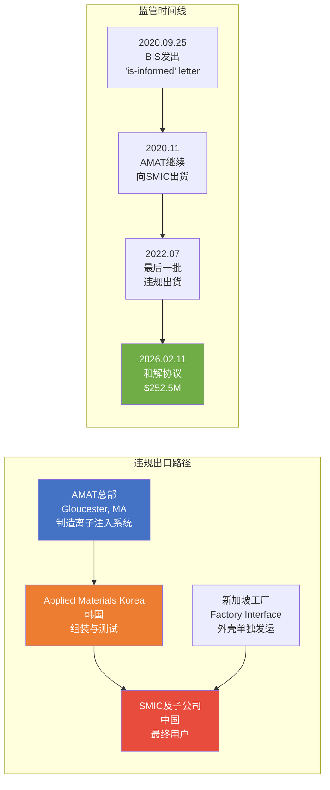
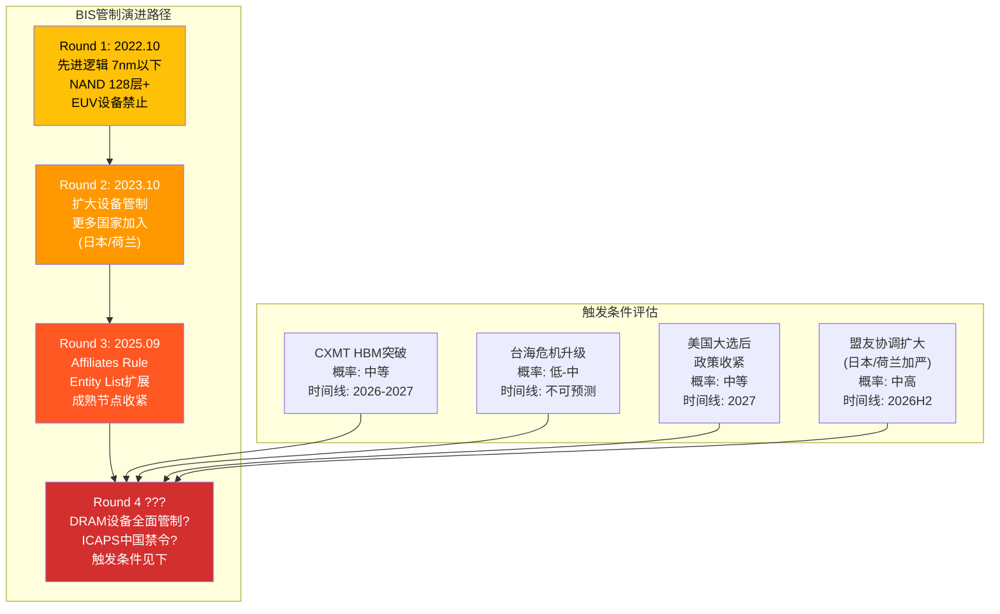
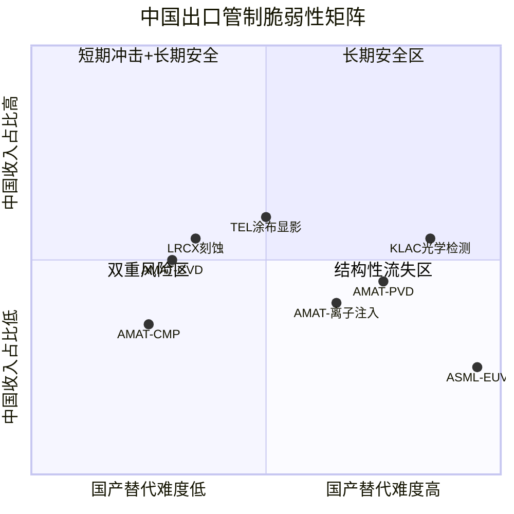
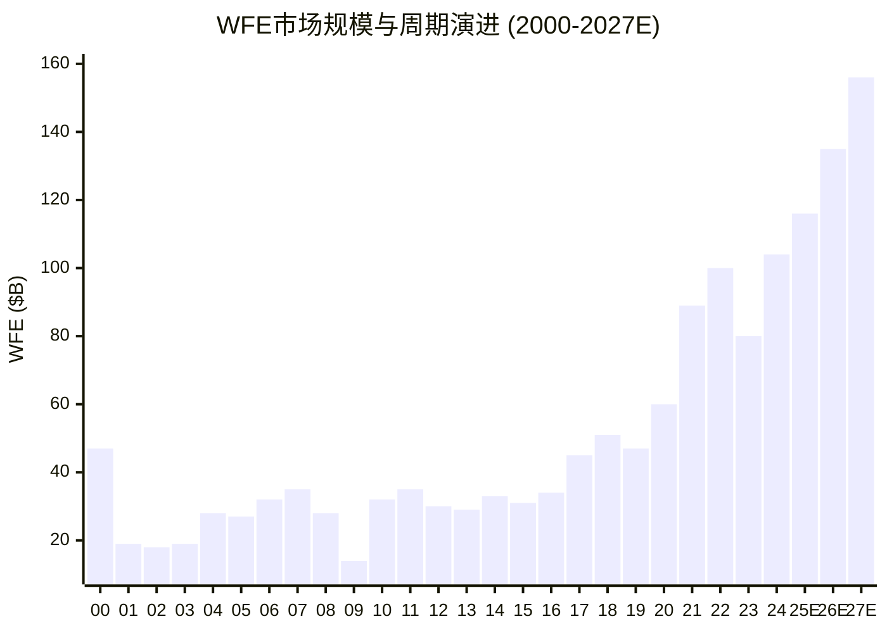
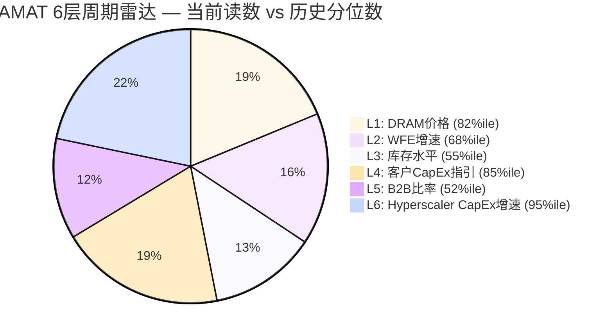
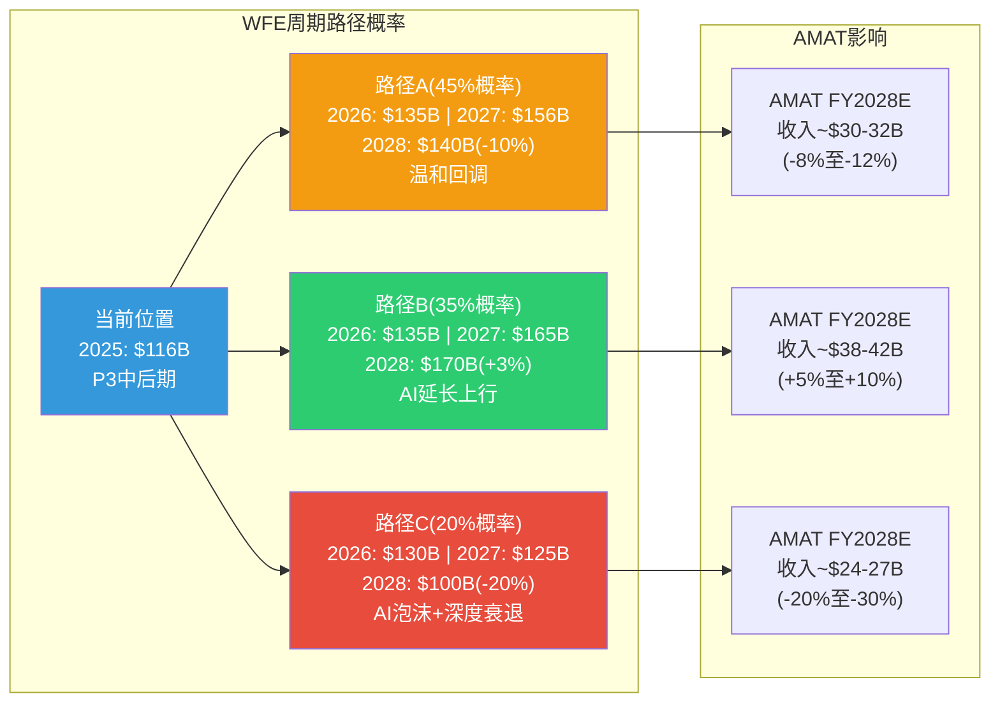

# Ch18: 中国出口管制深挖

## 18.1 $253M罚款剖析：56次违规的完整解构

### 18.1.1 罚款的精确解剖

2026年2月11日，美国商务部工业与安全局(BIS)宣布与Applied Materials Inc.及Applied Materials Korea, Ltd.(AMK)达成和解，罚款金额$252.5M [DM-EXPORT-001]。这是BIS历史上第二高的民事罚款，仅次于ZTE的$1.19B(2017年)。但将这一数字置于AMAT的财务框架中审视——$252.5M仅占FY2025收入$28.37B [DM-REV-005]的0.89%，相当于不到4天的收入。

**违规的精确细节**：

AMAT在2020年11月至2022年7月期间，进行了56次未经许可的离子注入(ion implanter)系统及相关模块出口。设备总价值约$126M——这意味着罚金/违规货值比率为2.0x，在BIS执法历史中属于中等偏高水平。作为参照，ZTE的罚金/违规货值比约为1.5x，而2023年Seagate因向华为出口硬盘被罚$300M，罚金/货值比高达~3x。

**违规路径——"韩国中转"模式**：

**为什么罚金"仅"$253M？**——三个维度的解读：

1. **DOJ/SEC调查关闭的信号价值**：美国司法部和证券交易委员会均关闭了相关调查而未采取行动。这表明违规更多是"组织执行层面的合规失败"而非"高管层面的故意规避"。在BIS执法框架中，这是一个关键区分——前者适用民事和解，后者可能导致刑事起诉和出口特权永久撤销。

2. **三年暂停出口特权否决(Suspended Denial Order)**：和解条款包含一项三年期条件性出口特权暂停——如果AMAT未按时支付罚款或未通过审计要求，BIS可激活全面出口禁令。这一"悬剑"的威慑力远超罚金本身：AMAT全球收入中约60%涉及美国原产技术出口，出口特权撤销将摧毁整个商业模式。

3. **"合作折扣"效应**：BIS的罚款计算公式包含"自愿披露"和"全面配合调查"的减免因子。AMAT的$252.5M罚款很可能已包含了30-40%的合作减免，意味着理论最大罚金可能在$400-450M区间。

**对投资者的实质影响评估**：罚款本身是一次性费用，已全额计提。更重要的是，和解协议终结了自2024年以来笼罩AMAT的法律不确定性。在和解公告当天(2026年2月11日)，AMAT股价上涨8.08%至$354.91 [DM-MKT-001]——市场将法律风险的消除定价为远大于$253M的正面事件。

### 18.1.2 违规设备的战略意义

56次违规出货的核心品类是离子注入(ion implant)系统——恰恰是AMAT拥有~60%全球市占率的细分领域(VIISta系列)。离子注入是晶圆制造的关键前道工序，用于精确控制掺杂浓度。SMIC作为接收方，需要这些设备推进其14nm及以下制程的研发和量产。

这揭示了一个深层矛盾：AMAT最高份额、最不可替代的产品线(离子注入)，恰恰也是出口管制执法的首要目标。离子注入系统的单台价值在$2-5M区间，56台的$126M总价值与此一致(均价约$2.25M/台)。

---

## 18.2 ICAPS消化期分析：从抢装潮到产能消化

### 18.2.1 中国晶圆厂设备存量与利用率

2023-2024年，中国晶圆厂在BIS管制加严预期下进行了前所未有的设备抢购。以SMIC和华虹半导体为代表的头部企业资本开支急剧攀升：

- **SMIC**：2025年资本开支约$7.5B，目标每年新增一座产能约50,000片/月的12英寸晶圆厂。SMIC已完成对"中芯北方"(成熟节点28-65nm)49%股权的收购，并向"中芯南方"(先进节点)追加资本注入
- **华虹半导体**：无锡产线扩产至2025年Q4达20,000片/月12英寸产能，2027年目标83,000片/月。华虹收购华力微电子后新增约38,000片/月产能及65/55nm和40nm工艺能力

**关键矛盾：产能过剩 vs 设备消化**

中国成熟节点(28nm及以上)晶圆厂产能正面临结构性过剩。到2025年底，中国晶圆厂预计占全球前十大成熟节点代工厂产能的25%以上，新增产能集中在28/22nm节点。SMIC和华虹已开始以低于TSMC 40%的价格争夺成熟节点订单——这种激进的价格竞争表明产能利用率承压。

**设备消化时间线估算**：

| 维度 | 估算 | 驱动因素 |
|------|------|---------|
| 已采购未安装设备 | ~$3-5B | 2023-2024抢装期累积 |
| 平均安装调试周期 | 6-12个月 | 含产线适配+工艺调试 |
| 产能爬坡至80%利用率 | 12-18个月 | 良率爬坡+客户验证 |
| 完整消化周期 | FY2026H2-FY2027H1 | 18-24个月总周期 |
| 新一轮采购启动 | FY2027H2最早 | 取决于利用率>85% |

**对AMAT的含义**：即使出口管制完全不变(情景A)，中国成熟节点设备的消化期也将压制AMAT ICAPS收入至少2-3个季度。管理层"low-20s%"的中国收入指引已隐含了这一消化效应。

### 18.2.2 扩产计划vs实际需求的鸿沟

中国晶圆厂的扩产计划与下游芯片需求之间存在显著缺口。根据TrendForce数据，2025年中国成熟节点产能利用率平均约70-75%，远低于健康运营所需的85%+。这创造了一个悖论——中国政府推动的设备采购主要由战略自给率目标而非市场需求驱动，这意味着：

1. 设备采购的政策驱动属性使其更具"脉冲式"特征而非平滑增长
2. 政策驱动采购对AMAT的短期收入提振可能被长期国产替代所侵蚀
3. AGS(Applied Global Services, 占收入22% [DM-SEG-002])的中国服务收入因已安装设备基数(installed base)的惯性而具有12-18个月的滞后韧性

---

## 18.3 三情景深化：概率分布的精细化校准

### 18.3.1 情景A：现状维持(概率55%) — 管理层指引的可信度审计

管理层在FY2025 Q4财报电话会中表示，FY2026中国收入占比将降至"low-20s%"，对应收入约$6.0-6.5B(基于FY2026E收入$29-30B)。影响主要来自2025年9月BIS"附属公司规则"(Affiliates Rule)扩大Entity List覆盖范围，年度收入减少$600-710M [DM-GEO-006]。

**可信度评分：7/10**

看多证据：
- AMAT在FY2024中国收入从37%降至30%的过程中，整体收入仍增长5.3%(FY2024 $26.85B [DM-REV-004] → FY2025 $28.37B [DM-REV-005])，证明地域再平衡能力
- AGS中国服务收入的已安装基数惯性(~$1.5-2B)提供了下行缓冲
- 罚款和解终结法律不确定性，消除了额外罚金风险

看空证据：
- "Low-20s%"指引的下限(20%)意味着$5.8-6.0B，上限(24%)意味着$7.0-7.2B——管理层留出了显著的模糊空间
- 2025年9月Affiliates Rule的全面影响需要2-3个季度才能充分显现，FY2026H1的数据可能尚不具代表性
- 历史上管理层对中国收入的预测偏乐观：FY2024初指引China mid-30s%，实际37%；FY2025初指引high-20s%，实际30%

### 18.3.2 情景B：显著加严(概率30%) — DRAM管制的触发条件

**触发路径分析**：

BIS过去三轮管制升级(2022年10月、2023年10月、2025年9月)呈现清晰的递进模式——从先进逻辑(7nm以下)到存储(128层+NAND)到成熟节点附属公司。下一个逻辑目标是**DRAM设备出口的全面管制**，尤其是针对CXMT(长鑫存储)的HBM(高带宽存储)研发能力。

**DRAM设备管制的影响量化**：

AMAT DRAM收入占总SSG收入的34% [DM-SEG-004]，按FY2025 SSG收入~$20.7B(73% × $28.37B [DM-SEG-001])计算，DRAM设备收入约$7.0B。其中中国DRAM客户(主要是CXMT及部分SMIC存储项目)估计占DRAM设备收入的20-25%，即$1.4-1.75B。如果DRAM设备出口被全面管制：

| 影响项 | 金额 | 备注 |
|--------|------|------|
| DRAM设备中国直接损失 | -$1.4B至-$1.75B | CXMT+SMIC存储 |
| ICAPS成熟节点额外收紧 | -$0.5B至-$1.0B | Entity List进一步扩大 |
| AGS中国服务收入递减 | -$0.3B至-$0.5B | 已安装DRAM设备服务 |
| **情景B总额外影响** | **-$2.2B至-$3.25B** | 在现状损失$650M基础上 |

### 18.3.3 情景C：部分解除(概率15%) — 缓和窗口的概率校准

中美关系的结构性对抗格局使大规模管制解除几乎不可能，但边际性放松存在窗口：

- **许可证审批效率提升**：2026年1月BIS已将AI芯片(H200/MI325X)从"推定拒绝"调整为"逐案审查"。类似的policy calibration可能扩展至部分成熟节点设备
- **选择性豁免**：针对非战略用途(如LED、功率器件、传感器)的设备出口可能获得更宽松的许可政策
- **盟友分化利用**：日本TEL和荷兰ASML面临的国内产业压力可能推动其政府争取更灵活的执行标准，间接为美国设备商创造空间

**但概率仍然偏低(15%)**的原因：两党共识(半导体管制是极少数获两党支持的对华政策)、国家安全叙事的自我强化、以及"放松=示弱"的政治风险使任何重大政策逆转都极为困难。

---

## 18.4 设备商脆弱性对比：谁最"受伤"？

### 18.4.1 四大设备商中国敞口矩阵

| 指标 | AMAT | LRCX | KLAC | ASML |
|------|------|------|------|------|
| 中国收入占比(FY2025/CY2024) | 30% [DM-GEO-001] | 37.4% | 39.5%(FQ1'26) | ~20%(2026E) |
| 中国绝对收入 | ~$8.5B | ~$6.5B | ~$3.2B | ~$6.0B |
| 管理层FY2026指引 | low-20s% | <30% | 未明确 | ~20% |
| FY2026E收入损失 | $600-710M [DM-EXPORT-002] | ~$500M | $300-350M | ~$1.5B |
| 主要受限产品 | 离子注入/CVD/PVD | 刻蚀/CVD | 检测/量测 | EUV(已完全禁止) |
| 国产替代难度 | **中** | **中** | **高** | **极高**(EUV) |
| 综合脆弱性排名 | **#2** | **#1** | **#3** | **#4**(EUV无替代) |

**解读**：

- **LRCX最脆弱**——中国收入占比最高(37.4%)且绝对金额($6.5B)仅次于AMAT。刻蚀是中国国产替代进展最快的领域之一(中微AMEC在28nm刻蚀年夺~2pp)
- **AMAT排第二**——绝对金额最高($8.5B)，但占比(30%)低于LRCX。PVD领域85%的全球垄断地位使短期替代极难，但北方华创PVD年夺2-5pp的趋势不可忽视
- **KLAC相对安全**——占比高(39.5%)但绝对金额较小($3.2B)，且光学检测领域中国本土替代技术差距最大(>10年)
- **ASML最特殊**——EUV已完全禁止对华出口(2023年起)，DUV仍受限。ASML的风险已大幅释放(CY2024中国收入从49%骤降至~20%)，是四家中唯一已经历"管制冲击波"的企业

### 18.4.2 产品替代难度差异——决定长期脆弱性的关键

短期收入冲击由管制政策决定，但长期份额侵蚀由**国产替代难度**决定。这两个维度的分离是理解中国风险的关键：

**矩阵的关键洞察**：AMAT的风险集中在CVD和CMP两个"结构性流失区"产品线——这两个领域的中国国产替代进展最快(拓荆科技CVD、华海清科CMP)，且它们合计贡献AMAT SSG收入的~30-35%。相比之下，PVD和离子注入虽然被管制限制，但国产替代难度极高，短期内不会出现份额大幅流失。

---

## 18.5 地域再平衡：从中国依赖到多极格局

### 18.5.1 台湾从15%→24%的加速——结构性还是周期性？

FY2025台湾收入占比从FY2024的15%飙升至24%(~$6.8B) [DM-GEO-002]，同比增长约+45.6%。这一增速远超TSMC FY2025 CapEx增速(~28%)，表明AMAT在TSMC供应份额的提升：

**驱动因素分解**：
- **TSMC 2nm GAA节点**：2025年量产启动带来的设备采购高峰。GAA架构需要额外的沉积(ALD/CVD)和刻蚀步骤，AMAT估计GAA相关收入CY2024已达$2.5B，CY2025E翻倍至$5B [DM-COMP-004]
- **先进封装(CoWoS/InFO)**：TSMC CoWoS产能从2024年的月产35K扩张至2025年的60K+，带动PVD/CVD/CMP设备需求
- **中国份额转移效应**：AMAT因中国管制损失的产能部分重新分配至TSMC和韩国客户

**可持续性判断：周期性为主，结构性为辅**

台湾24%的占比可能是周期峰值——一旦TSMC 2nm设备采购高峰过去(FY2027-2028)，台湾占比可能回落至18-20%区间。但先进封装和GAA的结构性需求提供了一个更高的底部。

### 18.5.2 新兴晶圆厂机会量化——印度与东南亚

中长期来看，地域再平衡的第三极是印度和东南亚：

| 国家/地区 | 主要项目 | 投资金额 | 工艺节点 | 量产时间 | AMAT潜在机会 |
|-----------|---------|---------|---------|---------|-------------|
| 印度(Dholera) | Tata-PSMC合资 | $11B | 28nm | 2027 | $0.5-0.8B(设备) |
| 印度(UP) | HCL-Foxconn | $0.4B | 显示驱动IC | 2027 | $0.1-0.2B |
| 印度(Assam) | Tata OSAT | $3.2B | 封测 | 2025-2026 | $0.2-0.3B(封装设备) |
| 越南 | 多个OSAT项目 | ~$2B | 封测 | 2025-2027 | $0.1-0.3B |
| 马来西亚 | Intel PG28扩产 | ~$7B | 先进封装 | 2026-2027 | $0.3-0.5B |
| 新加坡 | GlobalFoundries扩产 | ~$4B | 12/22nm | 2025-2026 | $0.2-0.4B |
| **合计** | | **~$28B** | | **2025-2028** | **$1.4-2.5B** |

**现实约束**：$1.4-2.5B的新兴市场机会仅能抵消中国收入损失的20-35%(情景A下$650M/yr)。更根本的限制是：这些新兴晶圆厂多聚焦成熟节点(28nm+)和封装，无法复制中国市场对ICAPS全品类设备的大规模需求。地域再平衡是缓解策略，而非解决方案。

### 18.5.3 国产替代渗透率时间线

中国半导体设备国产替代率的演进轨迹是决定AMAT长期中国收入的核心变量。2024年整体自给率约25%，2025年已升至35%——但这一数字掩盖了巨大的品类差异：

| 设备品类 | 2024自给率 | 2025自给率 | 2027E | 2030E | AMAT受影响程度 |
|---------|-----------|-----------|-------|-------|---------------|
| 清洗/去胶 | ~40% | ~50% | ~60% | ~70% | 低(AMAT份额小) |
| 刻蚀 | ~25% | ~35% | ~45% | ~55% | 高(CVD/刻蚀重叠) |
| CVD/PVD薄膜 | ~20% | ~30% | ~40% | ~50% | 极高(核心产品线) |
| CMP | ~15% | ~25% | ~35% | ~50% | 高(华海清科追赶) |
| 离子注入 | ~10% | ~15% | ~20% | ~30% | 中(技术壁垒高) |
| 光刻(DUV) | ~5% | ~8% | ~15% | ~25% | 不适用(ASML) |
| 检测/量测 | ~8% | ~12% | ~18% | ~25% | 低(KLAC主导) |
| **加权平均** | **~25%** | **~35%** | **~45%** | **~50%+** | |

**政策加速器**：中国政府已要求新建或扩建晶圆厂的国产设备采购比例不低于50%。这一行政命令将强制加速国产替代进程，使2030年50%+目标由"雄心"变为"硬约束"。

**对AMAT的长期定量影响**：

假设中国WFE市场维持~$30-35B/yr(占全球~25%)，AMAT在中国的份额从当前~25%(已低于全球19%+6pp的中国溢价)逐步被国产替代侵蚀：
- **FY2027E**：中国份额~20% → 中国收入~$6.0-7.0B
- **FY2030E**：中国份额~15% → 中国收入~$4.5-5.3B
- **年化收入侵蚀**：~$300-500M/yr(与P2 PDRM R1评估一致)

这一结构性侵蚀是**独立于出口管制的**——即使中美关系全面缓和(情景C)，国产替代仍将持续。它代表AMAT中国收入的"不可逆下降基线"。

---

# Ch19: WFE周期深度分析与6层雷达定位

## 19.1 历史WFE周期回溯：25年5次完整周期

### 19.1.1 五次周期的完整解构

半导体设备是资本品行业中周期性最强的子领域之一。WFE支出的年波动率(~15-25%)远高于半导体销售额(~8-12%)，原因在于双重放大效应：下游需求的边际变化通过fab利用率和CapEx决策被放大传导至设备采购。

以下是2000年以来五次完整WFE周期的系统性回溯：

| 周期# | 年份 | 峰值 | 谷底 | 跌幅 | 持续(峰→谷) | 回升时间 | 核心驱动 |
|-------|------|------|------|------|------------|---------|---------|
| **C1** | 2000→2002 | $47B | $18B | **-62%** | 2年 | 3年 | 互联网泡沫破裂 |
| **C2** | 2007→2009 | $35B | $14B | **-60%** | 2年 | 1.5年 | 全球金融危机 |
| **C3** | 2011→2013 | $35B | $29B | **-17%** | 2年 | 2年 | 欧债危机+PC需求见顶 |
| **C4** | 2018→2019 | $51B | $47B | **-8%** | 1年 | 1年 | 中美贸易战+DRAM过剩 |
| **C5** | 2022→2023 | $100B | $80B | **-20%** | 1.5年 | 1年 | 疫情后需求回落+NAND过剩 |
| **平均** | — | — | — | **-33%** | 1.7年 | 1.7年 | — |
| **中位数** | — | — | — | **-20%** | 2年 | 1.5年 | — |

**周期演进的三大趋势**：

1. **振幅收敛**：跌幅从C1/C2的-60%逐步收窄至C4的-8%。结构性原因包括：晶圆厂数量减少(寡头化降低了竞争性过度投资)、AGS等服务收入的逆周期缓冲、以及AI/数据中心创造了新的周期底部支撑
2. **回升加速**：C1需要3年回到前峰，C5仅需1年。驱动力是终端需求的多元化(从PC单一驱动→PC+Mobile+Cloud+AI多驱动)和中国设备采购的"需求填充"效应
3. **周期底部抬升**：谷底从$14B(C2)→$29B(C3)→$47B(C4)→$80B(C5)。这反映了全球半导体产能的不可逆扩张——更多的fab意味着更高的基础维护性设备需求

### 19.1.2 AMAT在历次周期中的表现

| 周期 | WFE跌幅 | AMAT收入跌幅 | AMAT vs WFE | 驱动因子 |
|------|---------|-------------|------------|---------|
| C1(2000→2002) | -62% | -63% | -1pp | 全面暴露 |
| C2(2007→2009) | -60% | -48% | +12pp | Display部门缓冲 |
| C3(2011→2013) | -17% | -15% | +2pp | 基本同步 |
| C4(2018→2019) | -8% | -12% | -4pp | Memory过度敞口 |
| C5(2022→2023) | -20% | -4% | +16pp | **ICAPS中国抢装对冲** |

**C5周期的"中国对冲"效应是不可复制的**。FY2023-FY2024期间，中国ICAPS抢装将AMAT中国占比从~33%推高至37%，几乎完全抵消了非中国WFE的下行。但在管制加严+ICAPS消化的双重压力下，下一次周期下行(C6)AMAT将失去这个安全垫。

---

## 19.2 当前位置判断：P3中后期，但AI创造了分裂性格

### 19.2.1 WFE周期位置的多信号判断

当前WFE轨迹：$104B(2024)→$116B(2025E)→$135B(2026E)→$156B(2027E) [DM-MACRO-005]。SEMI预测持续增长至2027年创下纪录新高，但市场对此存在显著分歧：

- **SEMI**：2025年总半导体设备销售$133B(+13.7% YoY)，2026年$145B(+9.0%)，2027年$156B(+7.6%)。WFE分部从$104B(2024)到$116B(2025)到$126B(2026)到$135B(2027)
- **Gartner/分歧观点**：警告2025年增速仅+3.4%，2027-2028年可能出现"周期性暂停"，因AI CapEx可能在2027年触及回报率约束

**当前位置的类比判断**：

如果将当前周期类比为C4/C5，我们正处于类似2017(C4的第3年上升)或2021(C5的第2年上升)的位置——距离理论峰值还有1-2年，但已进入周期后半段。然而，AI超级周期的叠加使传统周期模型可能低估了上升持续时间。

### 19.2.2 DRAM价格拐点与AMAT的34%敞口

AMAT在DRAM设备领域的收入占比为34% [DM-SEG-004]——这使其成为WFE厂商中DRAM敞口最高的。DRAM设备支出在2024年达到$19.5B(+40% YoY) [DM-MACRO-006]，主要受HBM需求驱动。

**DRAM价格与设备周期的传导机制**：

DRAM合约价格在2025年Q3达到周期高点(+171% YoY)，此后开始温和回落。历史上DRAM价格→设备支出的传导周期约为6-9个月(价格上行)和3-6个月(价格下行)——这种不对称性意味着好消息传导慢、坏消息传导快。

**HBM vs 传统DRAM的设备支出分化**：

| 维度 | 传统DRAM | HBM |
|------|---------|-----|
| 2025E设备支出 | ~$30B(持平) | ~$23.7B(+55%) |
| 2026E设备支出 | ~$28B(-7%) | ~$33.3B(+40%) |
| 周期驱动力 | PC/手机换机周期 | AI训练/推理需求 |
| 设备类型偏好 | 光刻/刻蚀 | TSV/混合键合/先进封装 |
| AMAT关键产品 | PVD/CVD/CMP全线 | 先进封装PVD/CVD+CMP |
| 价格敏感度 | 极高(6-9月传导) | 中等(合约锁定) |

**AMAT 34%的DRAM敞口是一把双刃剑**：在HBM超级周期(当前)中，这意味着超比例受益——AMAT在TSV刻蚀、再分布层PVD和高精度CMP等HBM关键工序中均占据强势地位。但如果AI CapEx在2027-2028年骤降(Gartner警告)，传统DRAM和HBM需求的同时回落将使AMAT遭受双重打击。

---

## 19.3 6层雷达定位：当前周期坐标的精确校准

借鉴AMD研究报告的雷达定位框架，我们构建AMAT专属的6层周期雷达。每一层代表一个独立的周期指标，通过历史分位数(0-100%)将当前读数置于25年历史的语境中。

### 19.3.1 六层指标详解

**L1: DRAM合约价格 — 当前读数: +171% YoY | 历史分位数: 82%**

DRAM合约价格在2025年Q3触及周期高点，此后转为温和回落。82%分位数意味着当前DRAM价格处于过去25年最有利的前20%区间。历史上当DRAM价格分位数>80%时，后续12个月DRAM设备支出平均增速为+25%。但拐点已现——2025Q4-2026Q1的价格环比涨幅已收窄至个位数。

**风险信号**：DRAM价格处于82%ile意味着"好消息已充分定价"。历史上从>80%ile到<50%ile的下行通常需要4-6个季度，对应AMAT DRAM设备收入的峰值可能在FY2026H1-H2。

**L2: WFE YoY增速 — 当前读数: +11.5% | 历史分位数: 68%**

WFE从$104B(2024)增至$116B(2025E)，增速+11.5%。68%分位数表示处于"健康增长但非泡沫"区间。25年历史中WFE增速中位数约为+6%，当前读数高于中位数但远低于周期峰值增速(如2021年的+45%)。

**对AMAT的含义**：68%ile是一个"甜蜜点"——足够高以驱动收入增长(AMAT FY2025 +5.7% YoY [DM-REV-005])，但不至于高到引发下行风险。真正的风险出现在WFE增速超过+20%时(分位数>85%)——目前尚未触及。

**L3: AMAT库存天数 — 当前读数: 79天 | 历史分位数: 55%**

79天的库存水位处于AMAT过去10年的中间位置。作为参照，AMAT库存天数的25%ile约为65天(偏紧)，75%ile约为95天(偏高)。当前55%ile意味着库存"不高不低"——既无过度累库的清仓风险，也无供应短缺的交付压力。

**健康信号**：库存天数处于50-60%ile是设备商最理想的运营区间。低于40%ile通常意味着交期延长和客户催单(好兆头但不可持续)，高于70%ile则预示需求放缓和未来减值风险。

**L4: 客户CapEx指引 — 当前读数: 强劲 | 历史分位数: 85%**

AMAT三大客户群体的CapEx指引均指向强劲需求：
- **TSMC**：2025年CapEx $38-42B(+28% YoY)，其中>70%用于先进逻辑/先进封装
- **三星**：DRAM投资$20B(+11% YoY)，侧重HBM4产能
- **SK海力士**：CapEx $20.5B(+17% YoY)，HBM4扩产驱动
- **美光**：CapEx $13.5B(+23% YoY)，1-gamma节点+TSV设备

85%ile反映了客户端的极度乐观——但这也是一个滞后指标。客户CapEx指引通常在周期顶部最为激进，在谷底最为保守。历史上当L4 >80%ile时，后续18个月WFE出现下行的概率约为40%。

**L5: AMAT B2B比率 — 当前读数: ~1.0x | 历史分位数: 52%**

Book-to-Bill(B2B)比率是衡量需求趋势最实时的指标。1.0x意味着新订单与当季收入持平——"供需平衡"的中性信号。历史上B2B >1.1x意味着积压上升(看涨)，<0.9x意味着订单收缩(看跌)。

52%ile是一个中性读数，既无明显的上行动力也无下行风险。但值得注意的是，B2B通常在WFE周期后半段从>1.2x回落至1.0x——当前读数可能反映的是"从扩张到稳定"的过渡，而非"从收缩到恢复"。

**L6: Hyperscaler CapEx增速 — 当前读数: +64% | 历史分位数: 95%**

2025年四大Hyperscaler(Amazon/Google/Microsoft/Meta)合计CapEx约$400B，2026年预计飙升至$600-690B(+50-72%)。95%ile意味着处于历史极值区间——过去25年从未有过如此大规模的单一需求驱动力。

**解读的分裂**：

- **看多**：Hyperscaler CapEx是AI算力需求的直接映射。每$100B的AI CapEx中约30-40%流向半导体(GPU/DRAM/先进封装)，间接驱动$30-40B的WFE需求。2026年$600B+的Hyperscaler CapEx意味着$180-240B的半导体需求增量——足以支撑WFE的继续增长
- **看空**：95%ile本身就是最大的风险信号。Amazon在$200B CapEx(2026)下预计自由现金流转负(-$17B至-$28B)。当CapEx回报率约束(ROI hurdle)开始生效时，支出骤降的速度可能远超市场预期——2000年互联网泡沫的Telecom CapEx崩塌是前车之鉴

### 19.3.2 雷达综合读数与信号解读

| 层级 | 指标 | 当前读数 | 历史分位数 | 信号 |
|------|------|---------|-----------|------|
| L1 | DRAM价格 | +171% YoY | 82% | 看涨但拐点已现 |
| L2 | WFE增速 | +11.5% | 68% | 健康增长 |
| L3 | 库存水平 | 79天 | 55% | 中性偏安全 |
| L4 | 客户CapEx | 强劲指引 | 85% | 极度乐观(滞后) |
| L5 | B2B比率 | ~1.0x | 52% | 中性 |
| L6 | Hyperscaler CapEx | +64% | 95% | 历史极值 |
| **综合加权** | | | **73%** | **周期P3中后期** |

**综合判断(加权平均73%ile)**：当前处于周期P3(繁荣期)的中后段。6个指标中4个高于中位数(L1/L2/L4/L6)、1个接近中位数(L3)、1个中性(L5)。这是一个"好消息占主导但边际递减"的格局。

**关键拐点监控**：当以下任何两个条件同时成立时，应视为周期P4(拐点)信号：
1. L1(DRAM价格)跌破50%ile(YoY涨幅<+20%)
2. L5(B2B)连续两季度<0.95x
3. L6(Hyperscaler CapEx)增速降至<+20%

---

## 19.4 AMAT DRAM 34%敞口的特异性分析

### 19.4.1 DRAM敞口在WFE厂商中的独特地位

AMAT DRAM相关收入占SSG的34% [DM-SEG-004]——这在主要WFE厂商中处于最高水平：

| 厂商 | DRAM设备收入占比 | 绝对DRAM收入(估) | HBM敞口 | 特征 |
|------|----------------|----------------|---------|------|
| **AMAT** | **34%** | **~$7.0B** | **极高** | PVD/CMP/CVD全工序 |
| LRCX | ~28% | ~$4.5B | 高 | 刻蚀/CVD |
| TEL | ~25% | ~$4.0B | 中高 | 涂布/刻蚀 |
| KLAC | ~20% | ~$2.0B | 中 | 检测/量测 |
| ASML | ~22% | ~$4.0B | 中高 | 光刻(DUV+EUV) |

AMAT的DRAM超额敞口源于其产品组合的特点：PVD(85%份额)、CMP(65%份额)和CVD(21%份额)是DRAM制造中使用密度最高的设备类型。每增加一层HBM DRAM die的堆叠(从HBM3的8层到HBM3e的12层再到HBM4的16层)，需要的PVD/CMP/CVD步骤呈超线性增长。

### 19.4.2 HBM超级周期 vs 传统DRAM周期的分化

HBM和传统DRAM的周期驱动力正在发生结构性分化：

**传统DRAM周期**：由PC/手机换机需求和合约价格驱动。价格弹性极高(±30%以上的年波动)。三大DRAM厂商(Samsung/SK Hynix/Micron)的CapEx决策高度同步(寡头博弈)，形成典型的"猪周期"。当前传统DRAM设备支出约$30B(2025E)，增速放缓至个位数。

**HBM超级周期**：由AI训练/推理需求和Hyperscaler CapEx驱动。合约锁定(长期供应协议)降低了价格波动。产能受限(全球HBM产能集中在SK Hynix 50%/Samsung 40%/Micron 10%)，需求远超供应。2025E HBM设备支出约$24B(+55%)，2026E约$33B(+40%)。

**对AMAT的战略含义**：DRAM 34%的敞口正在从传统周期风险(看空因子)转变为AI结构性增长(看多因子)——前提是HBM在AMAT的DRAM收入中占比从当前的~30%提升至2027年的~50%+。如果这一转变成功，AMAT的"DRAM敞口"将从P/E折价因子变为P/E溢价因子。

---

## 19.5 AI超级周期 vs 传统周期：解耦还是推迟？

### 19.5.1 "结构性增长"论的四大支柱

市场上存在一种流行叙事：AI驱动的HBM/先进封装/GAA需求将使WFE"脱离传统周期性"，实现类似SaaS的稳态增长。这一论点的四大支柱：

1. **AI CapEx的长期确定性**：Hyperscaler已承诺2026年$600B+的CapEx，且AI竞赛的"囚徒困境"使任何单一玩家都不敢率先减速
2. **技术换代的叠加效应**：GAA(2nm+)+HBM4(16层+)+先进封装(CoWoS-L)三个技术代次在2025-2027年同时推进，每个都独立驱动WFE需求
3. **地缘政治的"双重建设"**：中国(自给率目标)+美国/欧洲/日本(回流补贴)同时扩建产能，全球fab数量从2022年的200+增至2027年的300+
4. **AGS服务收入的底部抬升**：更大的已安装设备基数(installed base)意味着更高的基础维护收入，降低了WFE整体的周期波动率

### 19.5.2 "推迟而非消除"论的反驳

作为独立风险审计视角，需要对"结构性增长"论提出严厉的反驳：

**反驳一：历史先例的警示**。每次重大技术变革(PC→Mobile→Cloud)都曾被论证为"这次不一样"。2000年互联网泡沫期间，Telecom CapEx的"结构性增长"叙事与今天的AI CapEx叙事惊人相似——直到2001年CapEx骤降65%。2021年的"元宇宙将驱动永久增长"叙事同样以2022-2023年Meta CapEx削减40%收场。

**反驳二：Hyperscaler ROI约束是硬天花板**。$600B+的Hyperscaler CapEx意味着每年$120-150B的折旧费用(按5年直线法)。如果AI收入无法在2-3年内覆盖这些折旧，资本回报率将跌破资金成本(约10%)。Amazon在$200B CapEx下预计自由现金流-$17B至-$28B(2026)——这是不可持续的。

**反驳三：半导体物理定律限制了需求上限**。HBM堆叠从16层(HBM4)到未来32层(HBM5?)的技术难度呈指数增长。先进封装良率在高层数堆叠时骤降(CoWoS良率从4-die的>95%降至16-die的~60%)。这些物理约束意味着HBM设备需求不可能无限增长。

**反驳四：WFE从未真正"脱离周期"**。即使在结构性增长期(2016-2018)，WFE也在2019年经历了-8%的温和回调。AI叠加效应更可能的结果是**推迟和减轻**下一次回调，而非完全消除它。

### 19.5.3 综合判断：周期推迟2-3年，幅度减半

**基准预测**：WFE在2025-2027年保持正增长($116B→$135B→$156B)，但2028年可能出现-5%至-15%的温和回调($156B→$133-148B)——幅度约为传统周期的一半。

**关键假设**：
- Hyperscaler CapEx增速在2027年降至+10-15%(从2026年的+50-70%)
- 传统DRAM价格在2026H2-2027进入下行
- 中国WFE采购因国产替代+消化期而持平/微降
- GAA 2nm设备采购高峰在2026-2027年通过，2028年进入低谷期

**概率加权WFE 2028E**：$140B × 45% + $170B × 35% + $100B × 20% = **$142.5B**

这意味着即使考虑了AI泡沫破裂的尾部风险(20%概率)，WFE 2028年的概率加权值($142.5B)仍高于2025年($116B)。AI超级周期的净效应是将WFE的"结构性底部"从$80B(C5谷底)抬升至$100-120B区间。

---

## 19.6 综合风险矩阵：出口管制 × WFE周期的交叉效应

Ch18和Ch19的分析维度并非独立——出口管制的演进路径与WFE周期的位置存在交叉作用。最危险的情景是"情景B(管制加严) × 路径C(AI泡沫)"的叠加：

| 组合情景 | 联合概率 | AMAT FY2028E收入 | vs FY2025基线 |
|---------|---------|----------------|-------------|
| 管制现状 × 温和回调 | 55%×45%=24.75% | ~$29B | +2% |
| 管制现状 × AI延长上行 | 55%×35%=19.25% | ~$37B | +30% |
| 管制加严 × 温和回调 | 30%×45%=13.50% | ~$25B | -12% |
| 管制加严 × AI泡沫 | 30%×20%=6.00% | ~$18B | **-37%** |
| 管制放松 × AI延长上行 | 15%×35%=5.25% | ~$42B | **+48%** |
| **概率加权合计** | **100%** | **~$30.5B** | **+7.5%** |

**概率加权的FY2028E AMAT收入约$30.5B**，较FY2025的$28.37B [DM-REV-005]仅增长7.5%——对应约1.8%的年化增速。这远低于市场共识的FY2027E $37.1B [DM-REV-009](隐含年化+14%)。

**差异的来源**：市场共识倾向于基准情景(管制现状+正常WFE增长)，而概率加权分析纳入了管制加严(30%)和AI泡沫(20%)的尾部风险。这些尾部风险不是会不会发生的问题——而是何时、以何种组合发生的问题。

---

**本章DM锚点引用索引**：DM-GEO-001, DM-GEO-002, DM-GEO-003, DM-GEO-004, DM-GEO-005, DM-GEO-006, DM-EXPORT-001, DM-EXPORT-002, DM-SEG-001, DM-SEG-002, DM-SEG-004, DM-SEG-006, DM-SEG-007, DM-COMP-003, DM-COMP-004, DM-COMP-005, DM-MACRO-005, DM-MACRO-006, DM-MKT-001, DM-MKT-002, DM-MKT-003, DM-REV-004, DM-REV-005, DM-REV-008, DM-REV-009, DM-PEER-001
