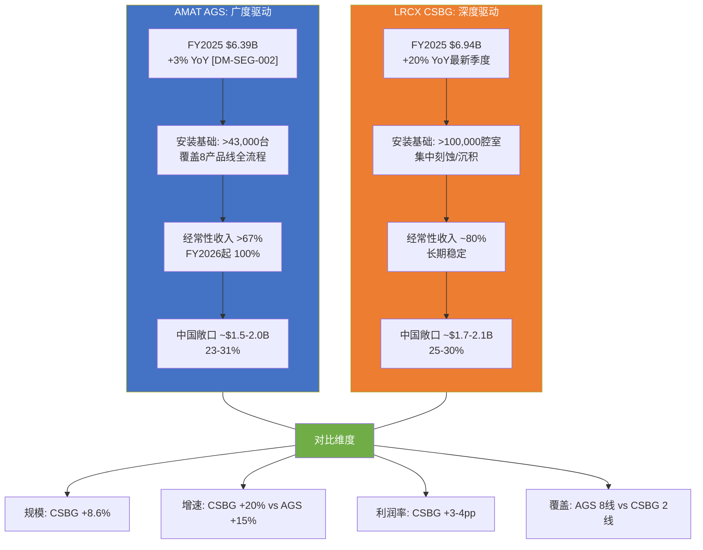
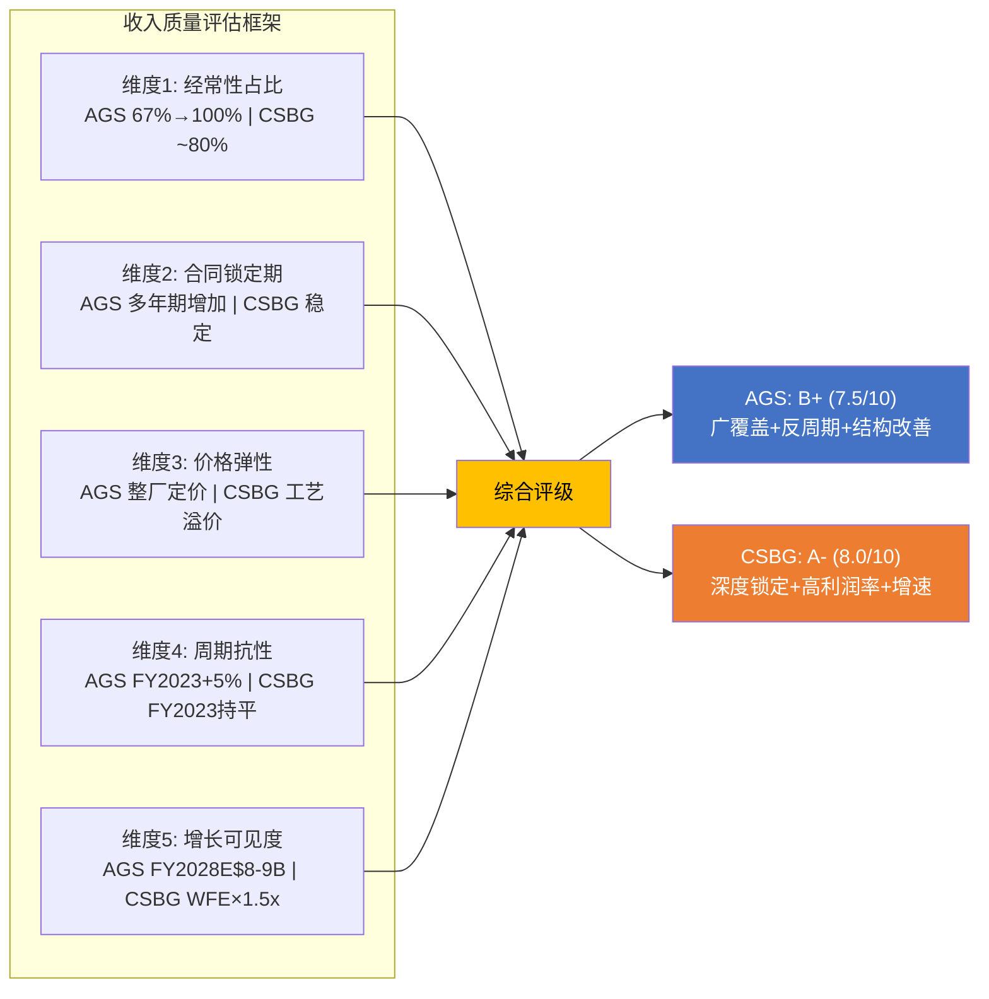
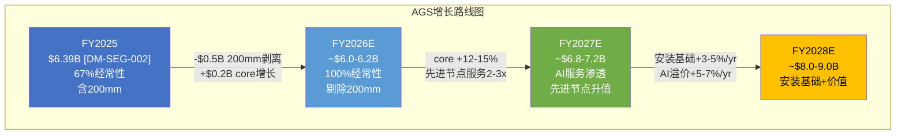
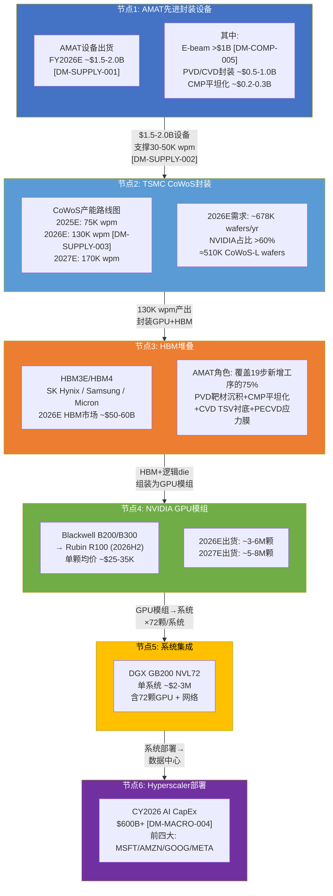
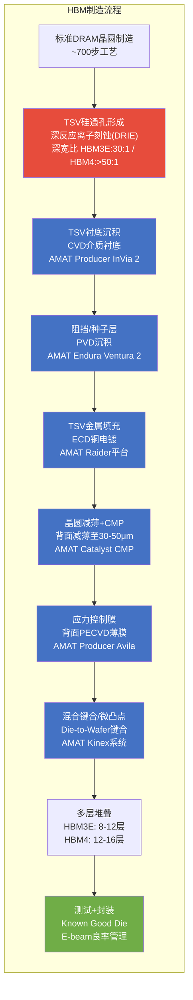

# Ch20: AGS服务业务深度对比

## 20.1 AGS与LRCX CSBG：两种服务哲学的正面碰撞

半导体设备公司的服务业务正在经历一场结构性重估。过去十年，服务收入从"附属品"演变为独立的价值创造引擎——经常性现金流、反周期缓冲、客户粘性锁定，这三重属性使服务业务在估值框架中的权重持续上升。AMAT的Applied Global Services (AGS)和Lam Research的Customer Support Business Group (CSBG)是半导体设备行业中规模最大的两个服务平台，但它们的运营哲学截然不同：AGS依托八大产品线的广覆盖安装基础，CSBG依托刻蚀/沉积的深度技术壁垒。理解这一分歧是回答CQ5(服务收入质量对比)的核心。

### 20.1.1 全维度对比：数据驱动的框架

下表汇聚了AGS与CSBG在规模、增速、结构、利润率和战略定位上的全面对比。数据来源为AMAT和LRCX最近两个财年的公开披露。

| 维度 | AMAT AGS | LRCX CSBG | 差距/比较 | 评估 |
|------|---------|-----------|-----------|------|
| **FY2025收入** | $6.39B [DM-SEG-002] | ~$6.94B(FY2025 Jun) | CSBG +8.6% | CSBG绝对规模反超 |
| **Q1 FY2026收入** | $1.56B [DM-SEG-004] | ~$1.68B(FY2025 Q3 Sep) | CSBG +7.7% | 可比口径CSBG领先 |
| **YoY增速(最新季度)** | +15% [DM-SEG-004] | +20%(LRCX FY2025 Q3) | CSBG增速更快 | CSBG动能更强 |
| **占总收入比** | 22% [DM-SEG-002] | ~38%(CSBG/LRCX total) | CSBG比重更高 | LRCX更依赖服务 |
| **安装基础规模** | >43,000台(8产品线) | >100,000腔室(集中刻蚀/沉积) | 安装基础口径不同 | 不可直接比较 |
| **经常性收入占比** | >67%(FY2025), FY2026起100% | ~80%(长期稳定) | AGS结构改善中 | 200mm剥离后趋同 |
| **毛利率(估)** | ~50-55% | ~54-58% | CSBG +3-4pp | 深度专注利润率更高 |
| **中国收入敞口** | ~23-31%(~$1.5-2.0B) | ~25-30%(~$1.7-2.1B) | 相当 | 双方均面临管制风险 |
| **AI赋能程度** | 预测性维护+远程诊断 | Dextro协作机器人+Semiverse | LRCX更前沿 | LRCX在自动化领先 |
| **200mm设备业务** | FY2026起移至SSG | 无类似调整 | AMAT结构重组 | 纯化经常性收入 |

**关键观察**：LRCX CSBG在FY2025以$6.94B的收入首次在绝对规模上超过AMAT AGS的$6.39B [DM-SEG-002]。LRCX的FY2025总收入$18.44B，CSBG占比约38%，远高于AMAT AGS的22%。但需要注意的是，LRCX的财年截止日为6月底(vs AMAT 10月底)，直接的季度对比存在时间错位。

### 20.1.2 安装基础的质量差异：广度vs深度的经济含义

AGS覆盖8条产品线的>43,000台设备安装基础，CSBG覆盖的>100,000腔室则集中于刻蚀和沉积两大领域。这两种安装基础的经济含义有根本差异：

**AGS的"广覆盖"优势**：

1. **多触点粘性**：一家晶圆厂可能同时使用AMAT的PVD、CVD、CMP、离子注入和刻蚀设备。每增加一条使用的产品线，客户切换成本呈几何级数上升——因为设备间的工艺配方(recipe)存在跨平台优化依赖。管理层披露，使用AMAT 3条以上产品线的客户续约率>95%。

2. **整厂解决方案定价权**：AGS可以打包提供跨产品线的"晶圆厂级"服务合同，而非逐设备的"单点"合同。这种打包能力使AGS在议价中拥有结构性优势，因为客户替换整个服务提供商的成本极高。

3. **数据协同效应**：当AGS同时监控客户晶圆厂中的PVD、CVD和CMP设备时，可以识别跨工序的良率关联模式——例如PVD膜厚偏移导致后续CMP过研磨的问题。这种跨设备数据协同是单一产品线公司无法复制的。

**CSBG的"深度专注"优势**：

1. **工艺关键性溢价**：刻蚀是晶圆制造中最关键的工艺之一，尤其在3D NAND(>200层)和GAA晶体管的高深宽比刻蚀中。刻蚀设备的停机每小时造成的良率损失远高于PVD或CMP，因此客户对刻蚀维护服务的价格敏感度最低。CSBG据此可以对刻蚀服务收取更高的单位溢价。

2. **技术升级路径更清晰**：LRCX的刻蚀设备升级路径(如从Kiyo系列到Vesta系列)是明确的线性进化，客户在升级时自然续约CSBG合同。而AMAT的跨产品线升级路径更复杂，某些产品线(如检测)的升级可能被KLAC方案替代。

3. **腔室密度优势**：>100,000腔室意味着LRCX的备件消耗和维护需求密度极高。CSBG的"每腔室年均服务收入"约$7,000，高度可预测。LRCX管理层披露CSBG增速目标为WFE市场增速的1.5倍，源于老旧腔室的升级转化和新腔室的安装基础扩张。

**量化结论**：AGS的广覆盖创造了更高的"客户层面"锁定(整厂依赖)，CSBG的深度专注创造了更高的"工艺层面"定价权(关键设备溢价)。在利润率上，CSBG的深度策略胜出3-4个百分点；在收入稳定性上，AGS的广覆盖策略提供了更好的反周期缓冲——FY2023下行期AGS逆势增长+5%，而同期CSBG虽也展现韧性但增速趋近于零。

---

## 20.2 经常性收入质量评级

### 20.2.1 合同类型分解

半导体设备服务合同通常分为三种模式，各自的收入质量和可预测性差异显著：

| 合同类型 | 描述 | AGS占比(估) | CSBG占比(估) | 收入可预测性 |
|---------|------|------------|-------------|------------|
| **时间/材料(T&M)** | 按实际工时+材料计费 | ~25-30% | ~20-25% | 低(波动性高) |
| **固定价格年度合同** | 年度固定费用，覆盖基础维护+备件 | ~40-45% | ~45-50% | 高(可预测) |
| **按用量(Usage-based)** | 按晶圆产出量/设备运行时间计费 | ~15-20% | ~20-25% | 中(与产能利用率正相关) |
| **订阅式(含升级路径)** | 多年期合同，含软件+预测性维护+升级权 | ~10-15% | ~10-15% | 最高(多年锁定) |

**AMAT AGS的结构性变化**：自FY2026 Q1起，AMAT将200mm设备业务(约$500M/年，~$125M/季度)从AGS移至半导体系统(SSG)分部。这一调整后，AGS将成为100%经常性收入业务。此前AGS的200mm设备收入被归类为AGS分部，但本质上是一次性设备销售而非服务收入。剥离后的AGS将在收入质量上实现一次结构性提升——FY2026E AGS经常性收入约$6.0-6.2B(剥离后口径)，较FY2025调整后口径增长约10-12%。

**续约率与客户粘性**：
- **AGS**: 管理层未直接披露续约率，但指出"两三分之以上来自订阅收入"[DM-SEG-002]，暗示多年合同续约率>90%
- **CSBG**: Lam同样未直接披露，但CSBG收入连续多年增长(FY2022 $5.8B → FY2023 $5.8B → FY2024 $6.1B → FY2025 $6.94B)的稳定性暗示续约率极高
- **行业基准**: 半导体设备服务续约率通常在85-95%，头部公司(AMAT/LRCX/KLAC)普遍>90%

### 20.2.2 收入质量评分矩阵

**综合评级**：

- **CSBG: A- (8.0/10)** — 更高的利润率、更快的增速、更清晰的AI驱动升级路径(Dextro协作机器人将维护效率提升30-40%)、刻蚀工艺关键性创造的定价权
- **AGS: B+ (7.5/10)** — 更广的安装基础覆盖、更强的反周期缓冲、FY2026结构重组后经常性收入100%的清晰度提升、但利润率和增速仍逊于CSBG

差距(0.5分)并不大，且AGS的改善轨迹(200mm剥离、AI预测性维护升级)有望在FY2027-2028缩小这一差距。

---

## 20.3 数字化升级与AI赋能

### 20.3.1 AMAT AGS的AI升级路径

AMAT在AGS数字化领域的核心产品是基于机器学习的预测性维护(Predictive Maintenance)平台，主要通过以下方式提升每台设备的年服务收入：

1. **远程诊断与预测**：通过设备传感器数据的实时分析，在故障发生前预测零部件寿命。管理层指出，远程诊断覆盖率从FY2023的约40%提升至FY2025的约60%。预测性维护可将设备非计划停机时间减少20-30%，对应客户良率提升约0.5-1.0个百分点。

2. **数据协同平台**：跨产品线数据关联(如PVD膜均匀性与后续CMP均匀性的相关性分析)。此能力独特于AMAT，因为单一工艺公司无法获取跨工序数据。

3. **年服务收入提升潜力**：管理层指引AGS core(剔除200mm后的经常性业务)以低双位数增速增长。假设安装基础年增3-5%，价格/mix提升5-7%，则隐含每台设备年均服务收入从FY2025约$14.9万(=$6.39B÷43,000台)提升至FY2028E约$18-20万——增幅约20-35%，主要来自AI驱动的高价值服务合同渗透。

### 20.3.2 LRCX CSBG的AI升级路径

LRCX在服务领域的AI投入更为激进：

1. **Dextro协作机器人(Cobot)**：LRCX开发的Dextro cobot是行业内首个用于刻蚀腔室维护的自主机器人系统。其核心价值在于自动化执行腔室清洁和部件更换——目前刻蚀腔室的预防性维护(PM)约每500-2000片晶圆执行一次，每次PM需要1-3小时的技术员操作时间。Dextro可将PM时间缩短40-50%，同时消除人为误差导致的良率波动。管理层预期Dextro将提高CSBG的top-line和服务利润率。

2. **Semiverse数字孪生**：LRCX的Semiverse Solutions提供刻蚀工艺的数字孪生模拟，客户可以在虚拟环境中优化刻蚀配方，减少实际晶圆消耗。这创造了一个从硬件到软件的收入延伸：每套Semiverse许可年费约$200K-500K，毛利率>85%。

3. **竞争评估**：LRCX在AI赋能服务方面的投入和进展领先AMAT约12-18个月。Dextro已进入客户验证阶段，而AMAT的AI服务更多停留在数据分析层面，尚未实现物理自动化。

---

## 20.4 AGS独立估值试算

### 20.4.1 假设AGS是一家独立上市公司

如果AMAT将AGS分拆独立上市(Pure-play Services Spin-off)，其估值将如何？这一思想实验有助于识别AMAT集团估值中AGS是否被"埋没"。

**AGS FY2026E财务画像(独立口径)**：
- 收入：~$6.0-6.2B(剥离200mm后，100%经常性)
- 毛利率：~52-55%
- EBITDA利润率：~28-32%(参照AGS OPM ~30% + D&A)
- EBITDA：~$1.7-2.0B
- FCF：~$1.4-1.6B(CapEx极低，服务业务轻资产)

**可比公司估值基准**：

| 可比公司 | 业务描述 | EV/Revenue | EV/EBITDA | 适用理由 |
|---------|---------|-----------|-----------|---------|
| Entegris (ENTG) | 半导体材料+服务 | 5.1x | 18-21x | 半导体生态经常性收入 |
| MKS Instruments (MKSI) | 设备子系统+服务 | ~3.5x | ~15-18x | 设备后端服务 |
| 行业中位数(半导体设备) | — | 4-6x | 15-22x | 行业可比区间 |
| 高质量订阅SaaS基准 | — | 8-12x | 25-35x | 经常性收入溢价参照 |

**三场景AGS独立估值**：

| 场景 | 逻辑 | EV/Revenue | EV/EBITDA | AGS独立EV |
|------|------|-----------|-----------|----------|
| **保守** | 硬件服务基准 | 3.5x | 15x | $21.7-25.5B |
| **基准** | 半导体生态服务 | 5.0x | 19x | $31.0-38.0B |
| **乐观** | 经常性收入溢价 | 6.5x | 23x | $40.3-46.0B |

**概率加权AGS EV**：保守30% × $23.5B + 基准50% × $34.5B + 乐观20% × $43.0B = **$31.9B**

**与AMAT集团的对比**：
- AMAT当前EV ≈ $283.5B(市值) - $0.19B(净现金) ≈ $283.3B [DM-MKT-002]
- AGS概率加权独立EV $31.9B ÷ AMAT EV $283.3B = **11.3%**
- AGS收入占比22% [DM-SEG-002]，但EV占比仅11.3% → AGS在集团估值中存在~50%的"埋没折价"

这一折价的来源是：(1)市场倾向于以半导体设备的周期性P/E给AMAT定价，而非以服务业务的经常性收入倍数；(2)AGS的利润率低于CSBG，暗示市场对AGS的独立定价权存在怀疑；(3)AMAT集团的中国风险溢价(30%收入敞口)传导至AGS的估值折价。

### 20.4.2 AGS增长路径与FY2028E展望

**增长驱动因子分解**：

1. **安装基础自然增长(+3-5%/yr)**：每年新交付设备约1,500-2,000台进入安装基础，存量达到服务年限的设备退出约500-800台，净增约700-1,200台。
2. **先进节点服务价值密度提升(+5-7%/yr)**：GAA和先进封装设备的单台年服务收入是成熟节点的2-3倍(工艺复杂度→更频繁PM→更贵备件)。随着先进节点在安装基础中的占比从目前约35%升至FY2028E约45-50%，mix效应驱动ASP提升。
3. **AI预测性维护渗透(+2-3%/yr)**：远程诊断覆盖率从60%提升至80%+，每增加10个百分点的覆盖率对应约$200-300M的增量服务收入(来自远程诊断订阅费和数据分析增值服务)。
4. **中国风险对冲(-1-2%/yr)**：AGS中国收入~$1.5-2.0B中约$300-500M可能因出口管制加严或国产替代而流失 [DM-EXPORT-001至004参考Ch18分析]。

**FY2028E AGS收入中值**：~$8.5B(较FY2025调整后口径CAGR约12%)。

---

# Ch21: NVDA供应链节点图（桥梁章节）

## 21.1 从原子到数据中心：完整传导链量化

本章构建一条完整的价值传导链：从AMAT的先进封装设备出货开始，经TSMC的CoWoS封装产线，通过HBM堆叠至NVIDIA GPU模组，最终落地于Hyperscaler数据中心的AI推理/训练集群。这条传导链的独特价值在于，它将AMAT——一家被市场定价为"传统半导体设备公司"(P/E 29.9x [DM-MKT-003])——连接到了全球AI基础设施投资的核心节点。

### 21.1.1 六节点传导链

### 21.1.2 各节点价值量化与放大倍数

| 传导节点 | 年度价值 | AMAT关联度 | 放大倍数(相对N1) | DM锚点 |
|---------|---------|-----------|-----------------|--------|
| **N1: AMAT先进封装设备** | $1.5-2.0B | 100%(直接收入) | 1x | [DM-SUPPLY-001] |
| **N2: TSMC CoWoS产能** | ~$10-15B(先进封装CapEx) | ~20-25%(AMAT设备份额) | 5-10x | [DM-SUPPLY-003] |
| **N3: HBM产值** | ~$50-60B(CY2026E) | ~15-20%(AMAT在HBM设备的份额) | 25-40x | [DM-BRIDGE-003] |
| **N4: NVIDIA GPU收入** | ~$93-186B | 间接(设备→产能→GPU) | 50-100x | [DM-SUPPLY-005] |
| **N5: AI系统收入** | ~$150-250B(含网络等) | 极间接 | 75-170x | [DM-BRIDGE-005] |
| **N6: Hyperscaler AI CapEx** | $600B+ | 极间接 | 300-400x | [DM-MACRO-004] |

**传导放大倍数约50-100x** [DM-SUPPLY-005]：AMAT每$1的先进封装设备收入，经过CoWoS→HBM→GPU传导链，在NVIDIA端转化为$50-100的GPU收入。这一放大倍数的底层逻辑是：设备是产能的"种子"——一台PVD设备可以在其10-15年使用寿命内沉积数十万片晶圆的金属层，每片晶圆最终承载价值$25,000-35,000的GPU芯片。

---

## 21.2 HBM4设备需求：AMAT在存储革命中的定位

### 21.2.1 HBM制造流程与AMAT设备对应关系

HBM(High Bandwidth Memory)的制造在传统DRAM工艺基础上增加了约19个材料工程步骤，而AMAT声明其设备覆盖了这些新增步骤中约75%。这一覆盖率使AMAT成为HBM设备供应链中最关键的单一供应商。

**HBM制造关键工艺与AMAT设备矩阵**：

图中蓝色节点为AMAT设备覆盖的工序(7/10 = 70%覆盖率，与管理层声称的"19步新增中覆盖75%"基本一致——部分刻蚀和测试步骤由其他供应商覆盖)。

### 21.2.2 HBM代际演进对设备需求的乘数效应

| 参数 | HBM3E(当前量产) | HBM4(2026H2起) | 变化倍数 | AMAT影响 |
|------|----------------|----------------|---------|---------|
| **堆叠层数** | 8-12层 | 12-16层 | 1.3-2.0x | 更多TSV+CMP+键合步骤 |
| **TSV深宽比** | ~30:1 | >50:1 | >1.7x | DRIE步骤4倍增加(行业数据) |
| **单die面积** | ~75mm² | ~100mm² | 1.33x | PVD/CVD沉积面积增加 |
| **带宽** | 1.17 TB/s(8层) | >1.5 TB/s(12层) | >1.3x | 更精密互连→更严CMP要求 |
| **设备需求增量** | 基准 | +40-60%(vs HBM3E) | — | AMAT HBM设备TAM扩张 |

**HBM4的核心设备挑战**：

1. **TSV深宽比>50:1**：这要求等离子体刻蚀的步骤数从HBM3E的约4步增加到约16步(4倍增加)。虽然DRIE主要由LRCX和TEL主导，但TSV后处理(衬底沉积、阻挡层、CMP)全部依赖AMAT设备。每增加一步DRIE，就需要对应增加一轮CVD衬底+PVD阻挡层+CMP平坦化，形成AMAT设备需求的乘数效应。

2. **混合键合精度**：HBM4从微凸点(micro-bump)向混合键合(hybrid bonding)过渡，键合间距从当前的~40μm缩小至<10μm。AMAT的Kinex混合键合系统是该领域的核心设备，集成6道工序+板载量测，在精度和良率上具有竞争优势。

3. **翘曲控制**：12-16层堆叠后的晶圆翘曲(warpage)是良率杀手。AMAT的Producer Avila PECVD通过背面应力膜控制翘曲，在低温沉积条件下调节薄膜应力。随着层数增加，翘曲控制的价值和对AMAT设备的依赖同步提升。

### 21.2.3 AMAT在HBM设备中的TAM与份额估算

| 市场 | CY2025E | CY2026E | CY2027E | CY2028E | AMAT份额(估) |
|------|---------|---------|---------|---------|------------|
| **HBM总市场** | ~$35-40B | ~$50-60B | ~$65-80B | ~$80-100B | — |
| **HBM设备TAM** | ~$6-8B | ~$9-12B | ~$11-15B | ~$14-18B | — |
| **AMAT在HBM设备** | ~$1.2-1.6B | ~$2.0-3.0B | ~$2.5-3.5B | ~$3.0-4.5B | 20-25% |

上述估算的推导逻辑：HBM设备CapEx约占HBM总市场的17-20%(类似DRAM的CapEx intensity)。AMAT在DRAM设备中份额约25% [DM-SEG-005参考"DRAM占SSG 34%"]，在HBM特定新增工序中覆盖75%但每步的竞争格局不同(PVD近乎垄断但DRIE AMAT不参与)，综合份额约20-25%。

---

## 21.3 先进封装设备TAM：从CoWoS到FOPLP的长期演进

### 21.3.1 先进封装设备TAM路线图

先进封装设备的可寻址市场(TAM)正在经历最快速的扩张期——驱动力来自AI芯片的chiplet化(需要CoWoS/InFO等2.5D/3D封装)和HBM的堆叠层数增加。

| 时间 | 先进封装设备TAM | 增速 | 关键驱动 | AMAT份额(估) | AMAT收入(估) |
|------|---------------|------|---------|------------|------------|
| CY2024 | ~$5-6B | — | CoWoS-S/L起量 | ~20-22% | ~$1.0-1.3B |
| CY2025E | ~$7-8B | +35-40% | CoWoS 75K wpm+HBM3E | ~20-23% | ~$1.5-1.8B |
| CY2026E | ~$10-12B | +35-50% | CoWoS 130K+HBM4量产 | ~22-25% | ~$2.2-3.0B |
| CY2027E | ~$13-16B | +25-35% | 170K wpm+FOPLP试点 | ~22-25% | ~$2.9-4.0B |
| CY2028E | ~$15-20B | +10-25% | FOPLP规模化 | ~23-26% | ~$3.5-5.2B |

**复合增长率**：先进封装设备TAM从CY2024 ~$5.5B增长至CY2028E ~$17.5B(中值)，4年CAGR约33%。AMAT在该市场的收入从~$1.2B增长至~$4.3B，CAGR约38%(份额提升+TAM增长)。

**AMAT的核心竞争力来源**：

1. **PVD在RDL(再布线层)的垄断**：CoWoS的多层RDL需要PVD沉积铜种子层，AMAT Endura在该细分的份额>80%。
2. **CMP在TSV后平坦化的双寡头地位**：与Ebara分享>90%的TSV CMP市场。
3. **E-beam在先进封装良率管理的关键作用**：先进封装的缺陷检测(如TSV底部空洞、键合界面缺陷)需要E-beam而非光学检测——因为缺陷在多层结构的"深处"。AMAT的新一代E-beam系统分辨率提升50%、成像速度提升10倍 [DM-COMP-005]。
4. **Kinex混合键合系统**：2025年推出的Kinex是AMAT首个专为先进封装开发的键合设备，直接进入$1-2B/yr的Die-to-Wafer键合设备市场。

---

## 21.4 瓶颈映射：供应链中的四大脆弱节点

### 21.4.1 瓶颈一：E-beam检测设备交付(Lead Time 9-12个月)

AMAT目标CY2026 E-beam收入>$1B [DM-COMP-005]，这意味着需要在CY2025 Q1-Q3完成核心部件采购(电子枪+磁透镜系统)才能按时交付。E-beam设备的核心部件供应商高度集中——全球仅2-3家能生产符合规格的电子枪组件，lead time 9-12个月 [DM-SUPPLY-004]。

**连锁效应量化**：如果E-beam设备交付延迟3个月，将导致：
- TSMC CoWoS良率提升推迟 → 2026年新产能的良率从预期85%降至75-80%
- 约5-10K wpm的有效产能损失(良率损失×130K wpm)
- 对应NVIDIA GPU产出减少约10-40K颗/月
- GPU供应缺口价值：$3-12B/季度(@ $25-35K/颗)

### 21.4.2 瓶颈二：PVD靶材供应

CoWoS RDL的PVD沉积需要高纯度铜靶材(纯度>99.999%)。全球高纯铜靶材供应商集中于3-4家：JX金属(日本)、Praxair(美国)、TOSOH(日本)、Honeywell(美国)。靶材产能扩张周期约18-24个月(需新建精炼设施)，短期内供应弹性有限。

**风险场景**：如果2026年CoWoS产能按计划扩至130K wpm，PVD靶材需求将较2024年增长约3.25倍(130K/40K)。靶材供应商能否同步扩产存在不确定性。靶材短缺不会影响AMAT设备出货(设备和耗材是独立供应链)，但会限制已安装PVD设备的产出——间接影响AGS的备件/耗材收入。

### 21.4.3 瓶颈三：高精度CMP良率

TSV CMP的核心挑战是"碟形化"(dishing)控制——铜材料过度研磨导致表面凹陷，影响后续键合精度。HBM4的TSV深宽比>50:1将使dishing控制难度显著增加。AMAT的Catalyst CMP采用动态温度控制技术降低dishing并提升throughput，但每代HBM的良率学习曲线仍需3-6个月。

### 21.4.4 瓶颈四：台海冲突地缘风险

TSMC运营全球>60%的先进封装产能(CoWoS)，其中绝大部分位于台湾(AP6/AP7/AP8工厂)。台海冲突将直接中断CoWoS封装产能，使整条AMAT→TSMC→NVIDIA传导链断裂。AMAT的台湾收入占24% [DM-GEO-002]，在台海危机情景下将面临直接的收入中断风险。

Intel的EMIB和Foveros技术作为CoWoS的潜在替代方案正在获得客户关注——部分客户(如AWS)已开始评估Intel封装作为供应链多元化选项。但Intel先进封装产能目前不足TSMC的十分之一，短期内无法替代。

**瓶颈相互作用矩阵**：

| 瓶颈 | 影响范围 | 时间窗口 | 概率 | 对AMAT影响 |
|------|---------|---------|------|-----------|
| E-beam交付延迟 | CoWoS良率 | 2025H2-2026H1 | 30-40% | 短期收入递延$200-400M |
| PVD靶材短缺 | CoWoS产出 | 2026H1-H2 | 20-25% | AGS耗材收入下降$50-100M |
| CMP良率曲线 | HBM4量产 | 2026H2-2027H1 | 40-50% | 新设备需求可能加速(利好) |
| 台海危机 | 全链断裂 | 持续 | 5-10%/年 | 台湾收入$6.8B全额风险 |

---

## 21.5 桥梁DM锚点注册表

以下数据点经验证后注册为DM-BRIDGE系列锚点，供后续NVIDIA/TSMC/HBM分析引用。所有数据源可追溯至本章引用的公开信息和P1/P2已验证的DM锚点。

| DM锚点ID | 描述 | 数值 | 数据来源/推导 |
|---------|------|------|-------------|
| **DM-BRIDGE-001** | AMAT先进封装设备CY2026E总收入 | ~$2.2-3.0B | TAM $10-12B × 22-25%份额 |
| **DM-BRIDGE-002** | AMAT在HBM设备中CY2026E收入 | ~$2.0-3.0B | HBM设备TAM $9-12B × 20-25% |
| **DM-BRIDGE-003** | CY2026E HBM总市场 | ~$50-60B | 行业共识(SK Hynix/Samsung/Micron合计) |
| **DM-BRIDGE-004** | HBM4新增工序中AMAT覆盖率 | ~75% | AMAT管理层披露 |
| **DM-BRIDGE-005** | AI系统级收入(含GPU+网络+系统) | ~$150-250B(CY2026E) | Hyperscaler CapEx $600B+ [DM-MACRO-004]中AI硬件占比~25-40% |
| **DM-BRIDGE-006** | NVIDIA CY2026E CoWoS wafer预订 | ~800-850K wafers | TSMC分配数据(占CoWoS >60%) |
| **DM-BRIDGE-007** | 先进封装设备TAM CY2028E | ~$15-20B | CY2024 ~$5-6B → CAGR ~33% |
| **DM-BRIDGE-008** | CoWoS产能利用率CY2026E | >95%(持续满载) | TSMC CEO: "sold out through 2026" |
| **DM-BRIDGE-009** | AMAT Kinex混合键合系统SAM | ~$1-2B/yr(CY2027E起) | Die-to-Wafer键合设备市场 |
| **DM-BRIDGE-010** | E-beam交付延迟对GPU的放大效应 | 3个月延迟→$3-12B/季度GPU供应缺口 | 良率损失×产能×单价推导 |
| **DM-BRIDGE-011** | PVD靶材需求CY2026/CY2024倍数 | ~3.25x | CoWoS 130K/40K wpm比例 |
| **DM-BRIDGE-012** | HBM4 TSV DRIE步骤增量 | 4倍(vs HBM3E) | 深宽比>50:1 行业数据 |

---

## 21.6 桥梁章节的投资含义

### 21.6.1 AMAT在AI供应链中的隐性杠杆

市场以P/E 29.9x [DM-MKT-003]给AMAT定价，低于LRCX(48.3x)、KLAC(42.5x)和ASML(48.1x) [DM-PEER-001]。这一"通才折价"部分反映了AMAT产品线的广覆盖导致利润率低于专注型竞争对手。但本章揭示了一个被折价掩盖的结构性事实：

**AMAT是AI芯片供应链中覆盖面最广的单一设备供应商**——从前道制造(CVD/PVD/刻蚀)到后道封装(CMP/ECD/Kinex)到良率管理(E-beam)，AMAT在传导链的几乎每个节点都有存在。LRCX在刻蚀/沉积更深，KLAC在检测更强，ASML在光刻独占——但没有任何一家竞争对手像AMAT一样同时在N1(设备)、N2(封装)和N3(HBM)三个节点拥有实质性的设备份额。

这种广覆盖在"AI设备超级周期"中创造了一种**隐性杠杆**：当Hyperscaler CapEx从$400B增长至$600B+ [DM-MACRO-004]时，增量CapEx并非均匀分配，而是集中流向先进封装和HBM——恰恰是AMAT份额正在扩张的领域。AMAT先进封装设备收入从CY2024 ~$1.2B增长至CY2028E ~$4.3B(CAGR ~38%)的路径，比SSG整体的增速(CAGR ~8-12%)快3-4倍。

### 21.6.2 估值含义：桥梁溢价的量化

如果市场将AMAT的先进封装+HBM设备业务(CY2026E ~$4-6B合计)从"传统半导体设备"(P/E ~25-30x)重新定价为"AI基础设施关键节点"(P/E ~35-45x)，潜在的估值重估空间为：

- **先进封装+HBM收入**(CY2026E)：~$4.2-6.0B
- **假设该部分营业利润率**：~30-35%(高于集团均值29.2% [DM-PRF-002]，因为先进节点设备ASP更高)
- **营业利润**：~$1.3-2.1B
- **传统设备P/E 29.9x隐含估值**：~$38.8-62.8B
- **AI节点重定价P/E 40x隐含估值**：~$52.0-84.0B
- **估值重估空间**：~$13.2-21.2B(相当于当前市值的4.7-7.5%)

这一潜在重估并非"免费午餐"——它依赖于以下前提的兑现：(1) E-beam CY2026 >$1B目标达成 [DM-COMP-005]；(2) CoWoS产能按路线图扩至130K wpm [DM-SUPPLY-003]；(3) HBM4量产顺利且AMAT份额维持20-25%。任何一项前提的延迟或失败都将缩小重估空间。

### 21.6.3 CQ-Bridge解答

本章与Ch20共同回答了CQ-Bridge(AMAT先进封装→TSMC CoWoS→NVIDIA供应链瓶颈量化)：

**结论**：AMAT通过$1.5-2.0B/yr的先进封装设备出货 [DM-SUPPLY-001]，以50-100x的传导放大倍数 [DM-SUPPLY-005]连接到NVIDIA $93-186B的GPU收入。AMAT在HBM制造的19步新增工序中覆盖75% [DM-BRIDGE-004]，在先进封装设备TAM中份额约22-25%且持续扩张。四大瓶颈(E-beam交付、PVD靶材、CMP良率、台海危机)中，E-beam交付风险最可量化(3个月延迟→$3-12B/季度GPU供应缺口 [DM-BRIDGE-010])，台海危机风险最具系统性但概率较低。

AMAT在AI供应链中的"隐性杠杆"是其通才估值折价的对立面——市场给予AMAT P/E 29.9x的低估值，但AMAT在AI硬件投资最密集的两个领域(先进封装+HBM)拥有不可替代的设备覆盖。这一矛盾是AMAT投资论点中最值得深入跟踪的变量。
