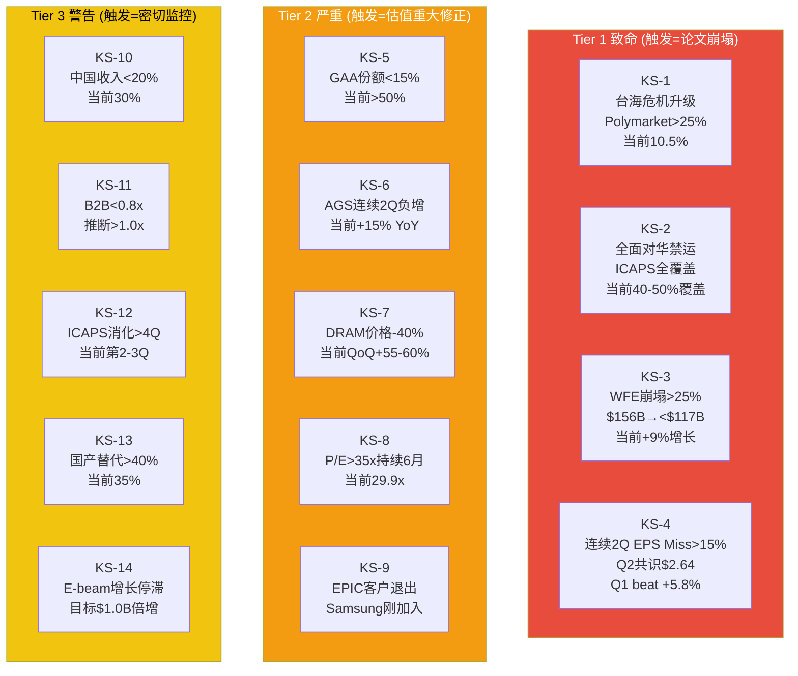
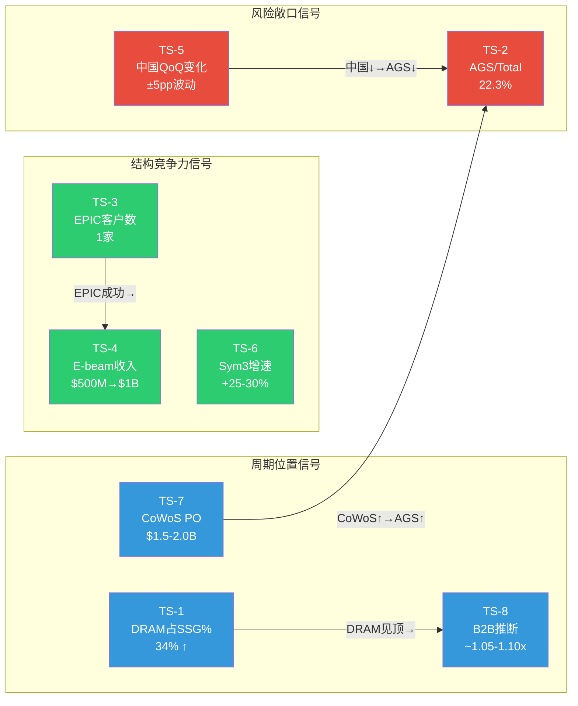
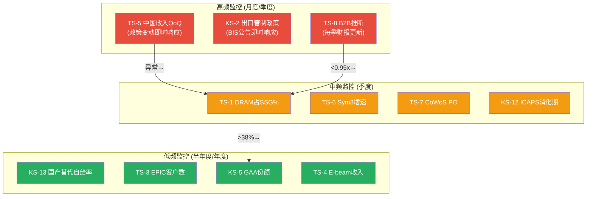

# Ch25: Kill Switch注册表

## 25.1 KS方法论：从风险清单到行动触发器

Kill Switch(KS)不是传统风险清单的重新包装。风险清单告诉投资者"什么可能出错"，而KS告诉投资者"出错到什么程度时必须行动"。每个KS的核心是一个可观测、可量化、有明确阈值的触发条件——当读数穿越阈值时，投资论文的某个承重墙发生结构性损坏，需要立即重新评估仓位。

KS按冲击层级分为三个Tier：Tier 1(致命)触发意味着投资论文根基崩塌，需要在数日内完全退出或重建框架；Tier 2(严重)触发意味着估值假设需要重大修正，通常对应15-30%的公允价值下移；Tier 3(警告)触发意味着论文的某个次级假设正在恶化，需要提高监控频率并准备应急方案。

本注册表的KS设计遵循三个原则：(1)阈值必须可从公开数据源验证，禁止"感觉性"判断；(2)每个KS必须关联至少一个CQ和一个Bear Case论点，确保与研究框架双向锚定；(3)同一事件不设重复KS——如果一个触发条件可以通过多个路径影响论文，只保留影响最直接的路径。

---

## 25.2 Tier 1: 致命级Kill Switch (触发=论文崩塌)

### KS-1: 台海危机军事升级

| 字段 | 内容 |
|------|------|
| **触发条件** | 台海冲突升级至军事封锁或实际武装冲突，导致TSMC先进制程产能中断≥30天 |
| **具体阈值** | Polymarket"Will China invade Taiwan by end of 2026"概率突破25%，或RAND冲突概率指数突破20% |
| **当前状态** | Polymarket 2026年底前概率10.5%（$8.86M交易量）；军事冲突概率15.5%（含非全面冲突级别对抗） |
| **当前距离** | 距25%阈值还有14.5个百分点，当前处于安全区间。但预测市场对尾部事件存在系统性低估倾向 |
| **论文含义** | AMAT台湾直接收入$6.8B(24%)[DM-GEO-002]中断+全球WFE暴跌至$100-110B+P/E压缩至15-18x。市值冲击-60%至-72%（BS-1），从$283.5B[DM-MKT-002]降至$80-110B |
| **CQ关联** | CQ3(中国出口管制)、CQ-B(NVDA桥梁——TSMC CoWoS供应链中断直接切断传导链) |
| **Bear#关联** | BS-1(台海危机致TSMC中断)、BW4(地缘政治承重墙) |
| **数据源** | Polymarket实时概率、RAND台海冲突概率模型、美国国防部年度中国军事报告 |
| **紧迫性** | **中** — 当前概率处于历史低位，但尾部风险的特征是突然跳变而非渐进攀升 |

### KS-2: 全面对华半导体设备禁运

| 字段 | 内容 |
|------|------|
| **触发条件** | BIS将出口管制从"实体清单+技术节点限制"升级为全面禁止向中国出口所有半导体制造设备（含成熟节点ICAPS），即"全面脱钩"场景 |
| **具体阈值** | Entity List覆盖全部ICAPS客户类别，或BIS发布全面"推定否决"(presumption of denial)政策涵盖中国所有28nm及以上晶圆厂 |
| **当前状态** | 当前管制覆盖先进逻辑≤14nm、部分DRAM/NAND设备、附属公司扩展。ICAPS成熟节点仍可出口但需许可证审查[DM-EXPORT-001] |
| **当前距离** | 当前管制范围约覆盖中国SAM的40-50%，距"全面禁运"仍有50-60%的SAM缺口。AMAT管理层指引FY2026中国收入"low-20s%"隐含现有管制不进一步加严 |
| **论文含义** | 中国收入$8.5B(30%)[DM-GEO-001]完全消失，AGS中国服务收入12-18月内耗尽。收入从$28.37B[DM-REV-005]骤降至$20-21B。即使P/E维持25x，市值仅$130-140B。冲击幅度-50%至-55%（BS-2） |
| **CQ关联** | CQ3(出口管制长期影响)——从渐进下行跳变为断崖式归零 |
| **Bear#关联** | BS-2(全面对华设备禁运)、R1-情景B(显著加严，当前概率30%) |
| **数据源** | BIS Federal Register公告、美国商务部出口管制政策声明、国会法案追踪(CHIPS Act修订动态) |
| **紧迫性** | **高** — 美国政治周期驱动，FY2026H2-FY2027H1是政策变动最大风险窗口。出口管制具有"单向棘轮"特征：过去三年(2022.10/2023.10/2025.09)每次更新均加严 |

### KS-3: WFE单年崩塌>25%

| 字段 | 内容 |
|------|------|
| **触发条件** | 全球WFE年度支出从峰值水平单年下跌超过25%，标志WFE超级周期终结 |
| **具体阈值** | WFE从CY2027E峰值$156B[DM-MACRO-005]降至$117B以下（即-25%），或SEMI季度报告中连续两个季度预测下调合计>20% |
| **当前状态** | SEMI最新预测：CY2025 $133B→CY2026 $145B(+9%)→CY2027 $156B(+7.6%)。Morgan Stanley上调CY2026 WFE预测至$128.3B(+10%增长)。当前处于确认上行趋势阶段 |
| **当前距离** | 当前WFE年度增速+9%至+10%，距-25%有35个百分点的反向距离。历史先例：2009年WFE -53%、2019年-25%、2023年-3%。-25%级别崩塌约每10-12年出现一次 |
| **论文含义** | WFE -25%→AMAT收入影响系数~1.2x("上慢下快"不对称性)[DM-MACRO-006]→收入降至$20-22B。P/E从29.9x[DM-MKT-003]压缩至20-22x，市值降至$130-160B。冲击幅度-40%至-55%（BS-3覆盖>30%场景） |
| **CQ关联** | CQ2(DRAM 34%敞口——Memory周期下行放大WFE冲击)、CQ7(CapEx翻倍期间FCF进一步受压) |
| **Bear#关联** | BS-3(WFE崩塌>30%)、BW1(WFE周期承重墙) |
| **数据源** | SEMI季度WFE报告(semi.org)、各设备公司季度财报(ASML/LRCX/TEL为领先指标)、Gartner/IDC半导体CapEx预测 |
| **紧迫性** | **低** — 当前WFE处于上行通道(六层雷达73%ile[DM-MACRO-005])，结构性需求(GAA+HBM+先进封装)提供多重支撑。但P3→P4拐点历史上在峰值后6-12个月出现 |

### KS-4: AMAT连续2季度EPS Miss>15%

| 字段 | 内容 |
|------|------|
| **触发条件** | AMAT连续两个财季报告Non-GAAP EPS低于共识预期超过15%，暗示公司特异性执行问题（而非纯行业周期） |
| **具体阈值** | Q2 FY2026 EPS共识$2.64→miss至<$2.24，且Q3 FY2026再次miss>15% |
| **当前状态** | Q1 FY2026 EPS $2.38 beat共识$2.25(+5.8%)。管理层Q2指引$2.64(non-GAAP)高于华尔街此前预期。近8个季度中AMAT 7次beat EPS、1次slight miss |
| **当前距离** | 当前处于持续beat周期中，距连续miss阈值需要从beat转为两次深度miss——概率极低但不可忽视。历史上AMAT最近的连续miss是FY2019 Q2-Q3(中美贸易战冲击) |
| **论文含义** | 连续深度miss暴露公司特异性问题：可能是EPIC Center成本失控(CQ4)、中国收入断崖(CQ3)、或市场份额流失(CQ1)。市场将从"周期调整"切换至"结构性衰退"定价，P/E可能从29.9x[DM-MKT-003]骤降至18-22x |
| **CQ关联** | CQ1(广度护城河——份额是否正在流失)、CQ4(EPIC Center——$5B投入是否拖累利润率) |
| **Bear#关联** | BW5(执行力承重墙)、BW7(利润率承重墙) |
| **数据源** | AMAT季度财报(ir.appliedmaterials.com)、Bloomberg/FactSet EPS共识追踪 |
| **紧迫性** | **低** — Q1 FY2026刚录得beat，管理层Q2指引强劲。但需持续监控——2026H2 WFE增速放缓时miss概率会结构性上升 |

---

## 25.3 Tier 2: 严重级Kill Switch (触发=估值重大修正)

### KS-5: GAA份额跌至<15%

| 字段 | 内容 |
|------|------|
| **触发条件** | AMAT在GAA(Gate-All-Around)关键工艺步骤中的份额从当前预估的>50%降至<15%，意味着技术转型红利完全被竞对截获 |
| **具体阈值** | GAA相关季度收入<$500M(对应CY2026E $2.0B→$500M的跌幅)，或LRCX/TEL在GAA刻蚀+沉积步骤的份额报告中显示AMAT被挤出前两名 |
| **当前状态** | AMAT披露GAA收入从$2.5B倍增至$5.0B(CY2025E)[DM-COMP-004]，预估GAA+背面供电相关份额>50%。Xtera外延新品专为2nm GAA设计 |
| **当前距离** | 当前份额>50%，距<15%阈值有极大缓冲。但需注意：>50%份额系管理层披露的聚合数据，未经第三方独立验证。LRCX在ALD/钼沉积、TEL在GAA刻蚀的追赶进展需要逐季跟踪 |
| **论文含义** | GAA是AMAT唯一可能实质性提升WFE份额(从19%[DM-COMP-001]突破20%+)的技术转折点。份额丧失意味着"广度=无法在任何关键转折点获胜"的悲观叙事成立，通才折价从30-40%扩大至50%+ |
| **CQ关联** | CQ6(GAA/先进封装技术卡位)、CQ1(广度vs深度护城河) |
| **Bear#关联** | BW3(技术转型承重墙，脆弱度2/5) |
| **数据源** | AMAT季度财报(GAA收入披露)、Yole Group设备份额报告(年度)、TechInsights拆机分析(验证实际采购) |
| **紧迫性** | **低** — 当前处于GAA份额扩张期，$2.5B→$5.0B倍增轨迹良好。CY2026 $3.5B中间验证点是关键里程碑 |

### KS-6: AGS收入连续2季度负增长

| 字段 | 内容 |
|------|------|
| **触发条件** | Applied Global Services(AGS)收入连续两个季度同比负增长，暗示安装基础(installed base)萎缩或客户续约率下降 |
| **具体阈值** | AGS季度收入<$1.45B(对应Q1 FY2026 $1.56B的-7%下滑)连续两季度 |
| **当前状态** | Q1 FY2026 AGS收入$1.56B，同比+15%，创历史新高。FY2025全年$6.39B[DM-SEG-002]。AGS经常性收入占比>67%，续约率>90% |
| **当前距离** | 当前AGS处于加速增长期(+15% YoY)，距负增长阈值需要从+15%反转至负值——极端情景。但中国AGS $300-500M/yr风险在出口管制加严时可能突然兑现 |
| **论文含义** | AGS是AMAT最确定的结构性资产(CQ5置信度75%)。负增长暗示：(1)中国installed base被国产替代设备取代且不再需要AMAT服务；(2)全球晶圆厂利用率深度低迷导致服务支出削减。AGS独立估值$19-26B[DM-SEG-002]的锚定假设(12%+ CAGR)失效 |
| **CQ关联** | CQ5(AGS服务收入质量——市场低估的最确定资产是否出现裂痕) |
| **Bear#关联** | BW6(服务收入承重墙)、R7(国产替代侵蚀installed base) |
| **数据源** | AMAT季度财报AGS分部数据、10-Q分部利润率披露 |
| **紧迫性** | **低** — AGS +15%增速处于历史高位区间，200mm业务迁移至SSG后AGS纯化为经常性收入进一步增强韧性 |

### KS-7: DRAM价格从峰值下跌>40%

| 字段 | 内容 |
|------|------|
| **触发条件** | DRAM合约均价(ASP)从周期峰值下跌超过40%，触发存储器厂商CapEx大幅削减，直接冲击AMAT 34%的DRAM敞口 |
| **具体阈值** | DRAMeXchange DDR5 8Gb合约价从峰值$4.5-5.0降至<$2.7(即-40%)，或HBM3E 8Hi合约价从~$15-18降至<$9 |
| **当前状态** | 2026Q1 DRAM合约价全面上涨：DDR5 8Gb QoQ +55-60%，Server DRAM QoQ +60%+。HBM供不应求，三星预警记忆体短缺将贯穿2026年。当前处于强劲上行周期 |
| **当前距离** | 当前处于价格上行加速期，距峰值下跌40%需要先见顶再深度回调。TrendForce/IDC预测2026全年DRAM价格正增长，回调最早在CY2027出现。距触发至少12-18个月 |
| **论文含义** | DRAM占SSG 34%[DM-SEG-005]是AMAT所有终端市场中最大敞口。-40%价格崩塌将触发SK Hynix/Samsung/Micron的CapEx削减30-50%，AMAT DRAM收入从$7.1B降至$4-5B，损失$2-3B。"34%双刃剑"从杠杆变为纯风险 |
| **CQ关联** | CQ2(DRAM 34%敞口——从杠杆到脆弱性的转折点在哪里) |
| **Bear#关联** | BS-5(DRAM深度崩塌>50%)、BW2(存储周期承重墙) |
| **数据源** | TrendForce DRAMeXchange月度价格报告、各存储厂商季度财报CapEx指引、SEMI Memory设备支出季度数据 |
| **紧迫性** | **低** — 当前DRAM价格处于上行加速期，HBM结构性需求提供2-3年支撑。但历史上DRAM周期的振幅(σ>25%)是所有子行业最大 |

### KS-8: P/E TTM突破35x持续6个月

| 字段 | 内容 |
|------|------|
| **触发条件** | AMAT P/E TTM突破35x并持续≥6个月，标志估值进入泡沫化区间——超越历史95%分位，隐含市场定价中已包含"一切顺利"的最乐观路径 |
| **具体阈值** | P/E TTM >35x持续至少一个完整季度(6个月)，且Forward P/E >30x同步确认 |
| **当前状态** | P/E TTM 29.9x[DM-MKT-003]，Forward P/E FY2026E 32.5x / FY2027E 25.9x[DM-MKT-006]。当前处于历史70-75%分位 |
| **当前距离** | 距35x阈值有5.1x的缓冲(约17%上升空间)。若EPS保持$11.87不变，股价需升至$415+才触发。若EPS增长至$13+(FY2027E共识)，则需$455+ |
| **论文含义** | 35x+的P/E对AMAT这样19%份额五年持平[DM-COMP-001]的"通才型"设备公司而言是极端定价。LRCX/KLAC的42-48x[DM-PEER-001]有深度护城河支撑(单品类50%+份额)，AMAT的广度策略不支持同等倍数。泡沫化估值的回归均值风险将使每$1下行幅度放大 |
| **CQ关联** | CQ1(通才折价——35x+意味着市场认为折价完全不合理) |
| **Bear#关联** | RT-7(DCF对高增长半导体设备的系统性低估可能使30x合理，但35x+仍然过度) |
| **数据源** | Bloomberg/FactSet P/E追踪、AMAT 10-K TTM EPS计算 |
| **紧迫性** | **低** — 当前29.9x处于合理区间上缘，距泡沫阈值有充足缓冲 |

### KS-9: EPIC Center关键客户退出

| 字段 | 内容 |
|------|------|
| **触发条件** | Samsung Electronics退出EPIC Center合作框架，或EPIC Center在运营满12个月后仍未新增第二个founding member |
| **具体阈值** | Samsung公开宣布终止或降级EPIC合作，或2027年春季(运营满一年)仍仅Samsung一家founding member |
| **当前状态** | Samsung于2026年2月11日宣布加入EPIC Center成为首个founding member[DM-EPIC-002]。EPIC Center预计2026年春季正式运营[DM-EPIC-004]，拥有180,000平方英尺洁净室空间[DM-EPIC-001] |
| **当前距离** | Samsung刚加入一个月，合作处于初始阶段。EPIC Center尚未正式运营，退出风险目前较低。但Samsung自身面临代工良率问题和CapEx压力，长期承诺存在不确定性 |
| **论文含义** | EPIC Center的$5B投资[DM-EPIC-001]如果仅Samsung一家客户支撑，将沦为低ROI的沉没成本(BS-4概率18%[DM-EPIC-004])。TSMC和Intel的缺席意味着EPIC无法形成"行业标准制定者"的网络效应——回退至AMAT单方R&D中心，$5B成本/收益比大幅恶化 |
| **CQ关联** | CQ4(EPIC Center创新溢价——置信度仅45%，已被红队最大幅下调-10pp) |
| **Bear#关联** | BS-4(EPIC Center投资失败)、BW8(超级周期承重墙) |
| **数据源** | AMAT季度财报管理层评论、行业新闻(Samsung/TSMC/Intel合作公告)、EPIC Center官网更新 |
| **紧迫性** | **中** — Spring 2026运营后12个月(至2027年春)是客户扩展的关键验证窗口 |

---

## 25.4 Tier 3: 警告级Kill Switch (触发=密切监控)

### KS-10: 中国收入跌至<20%

| 字段 | 内容 |
|------|------|
| **触发条件** | AMAT中国收入占比降至<20%，低于管理层FY2026指引的"low-20s%"下限 |
| **具体阈值** | 单季度中国收入占比<18%，或全年低于20%(即<$5.6B基于FY2025E $28B+收入) |
| **当前状态** | FY2025全年30%($8.5B)[DM-GEO-001]，Q4 FY2025 25%，Q1 FY2026 30%($2.1B季度波动)。管理层指引FY2026"low-20s%"(~$6.0-6.5B) |
| **当前距离** | 距<20%阈值需从当前30%再降10pp。FY2026指引low-20s%已隐含显著下降，若出口管制加严(R1-情景B概率30%)或ICAPS消化加速则可能突破 |
| **论文含义** | <20%意味着出口管制+国产替代的双重压力超出管理层预期。PDRM R1-R7中的中国相关风险的概率权重需要从55%/30%/15%重新分配至40%/40%/20%，加严情景概率上升 |
| **CQ关联** | CQ3(出口管制影响加速) |
| **Bear#关联** | R1-情景B(显著加严)、R7(国产替代) |
| **数据源** | AMAT季度财报地理分部披露、SEMI China设备市场月度报告 |
| **紧迫性** | **中** — FY2026H2将提供关键数据点(2-3个季度读数)，管理层指引是否能兑现的验证窗口 |

### KS-11: B2B比率降至<0.8x

| 字段 | 内容 |
|------|------|
| **触发条件** | AMAT Book-to-Bill(B2B)比率降至<0.8x，标志新订单速度显著落后于出货速度，是WFE周期拐点的领先信号 |
| **具体阈值** | 单季度B2B<0.8x，或连续两季度B2B<0.9x |
| **当前状态** | AMAT不单独披露B2B比率(自2019年起停止)，但通过管理层评论推断：Q2 FY2026指引$7.65B(+9.1% QoQ)暗示B2B仍>1.0x。管理层表示客户订单能见度超过1年，部分达2年 |
| **当前距离** | 推断B2B仍处于1.0-1.1x的健康区间。客户2年能见度暗示backlog充足。但B2B从>1.0x反转至<0.8x通常只需2-3个季度(参考2019年贸易战期间AMAT经历) |
| **论文含义** | B2B<0.8x是WFE周期P3→P4转折的经典先行信号。确认后AMAT收入增速将在2-3个季度后从正转负。当前WFE处于P3中后期(73%ile)[DM-MACRO-005]，B2B下穿将强化周期见顶判断 |
| **CQ关联** | CQ2(DRAM周期位置)、CQ7(CapEx翻倍期间的FCF恢复路径依赖收入持续增长) |
| **Bear#关联** | BW1(WFE周期承重墙) |
| **数据源** | AMAT季度财报管理层评论(间接推断)、北美半导体设备B2B指数(SEMI月度发布)、ASML季度订单数据(作为领先指标) |
| **紧迫性** | **低** — 当前B2B推断>1.0x，客户能见度强劲。但需建立季度跟踪机制 |

### KS-12: ICAPS消化期>4个季度

| 字段 | 内容 |
|------|------|
| **触发条件** | 中国ICAPS(IoT/Communications/Automotive/Power/Sensors)设备消化期超过4个季度(12个月)，暗示2023-2024年抢装设备的产能利用率长期低迷 |
| **具体阈值** | 中国28nm+晶圆厂利用率<70%持续4季度，或AMAT ICAPS相关收入连续4季度同比下降>10% |
| **当前状态** | ICAPS消化期已进入第2-3个季度(始于2025H1)。中国晶圆厂利用率从2024年峰值85-90%回落至2025Q4约75-80%。AMAT管理层确认ICAPS需求"正常化"但尚未称之为"消化期" |
| **当前距离** | 距4季度阈值还有1-2个季度。如果CY2026H1中国利用率未回升至80%+，消化期将确认超过4季度 |
| **论文含义** | >4季度消化期意味着中国ICAPS抢装产能存在结构性过剩(而非周期性调整)。AMAT在中国成熟节点的TAM将永久性缩小——不仅因为出口管制，还因为已安装产能足以满足3-5年需求，新增设备采购将大幅延后 |
| **CQ关联** | CQ3(中国收入——ICAPS消化叠加管制构成双重打击) |
| **Bear#关联** | R7(国产替代加速——消化期内中国厂商加速导入国产设备) |
| **数据源** | SEMI China晶圆厂利用率月度报告、中国半导体行业协会(CSIA)季度统计、SMIC/华虹财报利用率披露 |
| **紧迫性** | **中** — CY2026H1是关键观测窗口，2个季度内将决定消化期是否突破4季度阈值 |

### KS-13: 国产替代设备自给率>40%

| 字段 | 内容 |
|------|------|
| **触发条件** | 中国半导体设备国产自给率从当前35%突破40%，在AMAT核心领域(PVD/CMP/离子注入)出现实质性份额流失 |
| **具体阈值** | 整体自给率>40%，且AMAT三大利润堡垒领域(PVD/CMP/离子注入)的中国国产替代率合计突破25% |
| **当前状态** | 中国半导体设备自给率2024年25%→2025年35%(超越政府30%目标)。刻蚀和薄膜沉积领域替代率已超40%。PVD领域北方华创(Naura)年夺取2-5pp，CMP领域华海清科(Hwatsing)5年夺取8pp |
| **当前距离** | 距整体40%还有5pp，按当前10pp/yr增速约需6-12个月。但AMAT利润堡垒领域(PVD 85%/CMP 65%/离子注入 60%份额)的国产替代进展慢于刻蚀/CVD——因为这些领域的技术壁垒更高。合计25%替代率距离较远 |
| **论文含义** | 40%+自给率意味着中国市场的结构性萎缩已从"渐进"进入"加速"阶段。年侵蚀量从$300-500M升至$500-800M。更深层影响：如果PVD/CMP/离子注入也开始被替代，AMAT的"利润堡垒"假设(贡献45-50%的SSG营业利润)将松动 |
| **CQ关联** | CQ3(出口管制——国产替代是独立于管制的结构性风险) |
| **Bear#关联** | R7(国产替代自给率加速)、BW4(地缘政治承重墙) |
| **数据源** | TrendForce中国半导体设备报告(季度)、CSIA年度自给率统计、北方华创/中微公司/华海清科财报(市占率披露) |
| **紧迫性** | **中** — 整体自给率距40%仅5pp，但AMAT利润堡垒领域的替代进展较慢，需分品类追踪 |

### KS-14: E-beam收入增长停滞

| 字段 | 内容 |
|------|------|
| **触发条件** | E-beam检测业务收入增速连续两季度低于10% YoY，或年度收入未达CY2026 $1.0B倍增目标的70%(即<$700M) |
| **具体阈值** | E-beam季度收入<$175M(即$700M年化)，或管理层下调E-beam收入倍增目标 |
| **当前状态** | E-beam FY2025收入约$500M，管理层目标CY2026倍增至$1.0B[DM-COMP-005]。CFE(冷场发射)E-beam技术在先进节点检测中需求增长强劲 |
| **当前距离** | 需从$500M增长至$1.0B(+100%)，Q1 FY2026数据尚未单独披露。$1.0B目标极具野心——需每季度$250M(vs当前约$125M/季)。距<$175M阈值有~$50M的缓冲(在当前增速保持条件下) |
| **论文含义** | E-beam是AMAT在检测/量测领域(整体份额仅8% vs KLAC 56%)的唯一差异化切入点。增长停滞意味着AMAT在过程控制领域的战略性"侧翼进攻"失败，进一步固化"什么都做但检测做不好"的市场认知 |
| **CQ关联** | CQ6(技术卡位——E-beam是GAA/先进封装复杂度提升的受益者) |
| **Bear#关联** | BW3(技术转型承重墙) |
| **数据源** | AMAT季度财报管理层评论(E-beam收入通常在Q&A环节披露)、KLAC季度报告(作为过程控制TAM参照) |
| **紧迫性** | **低** — E-beam处于倍增增长轨道，CY2026全年数据将提供最终验证 |

---

## 25.5 KS注册表汇总

| # | 层级 | 触发条件 | 阈值 | 当前状态 | 紧迫性 | CQ |
|---|------|---------|------|---------|--------|------|
| KS-1 | Tier 1 | 台海冲突升级 | Polymarket>25% | 10.5% | 中 | CQ3,CQ-B |
| KS-2 | Tier 1 | 全面对华禁运 | ICAPS全覆盖 | 40-50%覆盖 | 高 | CQ3 |
| KS-3 | Tier 1 | WFE崩塌>25% | <$117B | $145B(+9%) | 低 | CQ2,CQ7 |
| KS-4 | Tier 1 | 连续2Q EPS Miss | >15% miss | +5.8% beat | 低 | CQ1,CQ4 |
| KS-5 | Tier 2 | GAA份额下滑 | <15% | >50% | 低 | CQ6,CQ1 |
| KS-6 | Tier 2 | AGS负增长 | 连续2Q YoY<0% | +15% YoY | 低 | CQ5 |
| KS-7 | Tier 2 | DRAM价格崩塌 | 峰值-40% | QoQ+55-60% | 低 | CQ2 |
| KS-8 | Tier 2 | 估值泡沫 | P/E>35x持续6月 | 29.9x | 低 | CQ1 |
| KS-9 | Tier 2 | EPIC客户退出 | Samsung退出 | 2026.02加入 | 中 | CQ4 |
| KS-10 | Tier 3 | 中国收入过低 | <20% | 30% | 中 | CQ3 |
| KS-11 | Tier 3 | B2B转弱 | <0.8x | 推断>1.0x | 低 | CQ2 |
| KS-12 | Tier 3 | ICAPS消化延长 | >4季度 | 第2-3Q | 中 | CQ3 |
| KS-13 | Tier 3 | 国产替代加速 | >40%自给率 | 35% | 中 | CQ3 |
| KS-14 | Tier 3 | E-beam增长停滞 | <$700M CY2026 | $500M FY2025 | 低 | CQ6 |

**最高紧迫性KS**: KS-2(全面禁运，紧迫性"高")是唯一需要立即建立政策监控机制的触发器。美国出口管制的"单向棘轮"特征意味着每次BIS公告都可能使当前概率分配跳变。

**最接近触发的KS**: KS-13(国产替代自给率>40%)距阈值仅5pp，按当前增速6-12个月内可能触发。但对AMAT利润堡垒领域的影响仍有缓冲。

---

# Ch26: Tracking Signals注册表

## 26.1 TS方法论：从KS到TS的分工

KS回答"什么时候必须行动"，TS回答"论文的健康状况如何"。两者的核心差异在于：KS有二元触发点（是/否），TS是连续性监控信号（方向+强度）。TS的价值在于提供早期预警——在KS触发之前，TS的趋势变化往往已经暗示了论文的边际恶化或改善。

本注册表的TS设计通过了**特异性测试**：每个TS如果将"AMAT"替换为"LRCX"或"KLAC"或"ASML"后仍然完全适用，则删除。最终保留的8个TS均反映AMAT特有的商业模式特征、竞争定位或风险敞口——在同业中不可互换。

---

## 26.2 AMAT特异性追踪信号

### TS-1: DRAM占SSG收入比例

| 字段 | 内容 |
|------|------|
| **追踪什么** | DRAM设备收入占Semi Systems Group(SSG)总收入的百分比，季度追踪 |
| **为什么重要** | 验证CQ2核心假设：DRAM 34%[DM-SEG-005]的创纪录敞口是HBM驱动的暂时性高位还是结构性上移。如果DRAM占比持续>30%，AMAT的周期波动性将结构性高于历史水平(均值22-25%)。如果回落至25%以下，说明HBM CapEx峰值已过，DRAM杠杆从正面转为中性 |
| **当前读数** | Q1 FY2026: 34%(创历史新高)。方向：↑上升中(从FY2021~22%→FY2024~28%→Q1 FY2026 34%)。HBM需求是主要驱动——AMAT覆盖HBM 19步新增工序的75% |
| **关键阈值** | >38%=过度集中风险告警(DRAM单品类超过SSG的三分之一以上)；<25%=HBM CapEx峰值已过的确认信号；持续30-35%=新常态(需重估周期风险框架) |
| **数据源** | AMAT季度财报(SSG分部按终端市场拆分，管理层通常在Q&A环节披露DRAM占比)、SEMI Memory设备支出季度数据 |
| **CQ关联** | CQ2(DRAM敞口风险/收益)——此TS是CQ2置信度(当前60%)的核心读数源 |

**特异性验证**：LRCX的DRAM敞口约25-28%(低于AMAT)，KLAC的DRAM敞口约20%(远低于AMAT)，ASML对DRAM的敞口约30%但通过EUV聚焦于先进DRAM节点。34%的创纪录DRAM占比是AMAT独有的风险/收益特征——没有其他主要设备公司在DRAM的暴露程度如此之高且仍在上升。

### TS-2: AGS/Total Revenue比率

| 字段 | 内容 |
|------|------|
| **追踪什么** | Applied Global Services(AGS)收入占AMAT总收入的百分比，季度追踪 |
| **为什么重要** | 验证CQ5核心假设：AGS占比上升=AMAT抗周期能力增强。AGS的反周期特性(2022→2023 SSG -12%但AGS +5%)使得AGS占比每提升1pp，AMAT的整体收入波动率约下降0.3-0.5pp。这是"广度策略"从纯设备多元化扩展至"设备+服务"双轨抗周期的关键指标 |
| **当前读数** | Q1 FY2026: $1.56B/$7.01B = 22.3%[DM-SEG-002]。方向：→持平(FY2023~23%→FY2024~22%→FY2025~22.5%→Q1 FY2026~22.3%)。200mm业务从AGS移至SSG后纯化为经常性收入，但分母(SSG)增速更快使占比难以上升 |
| **关键阈值** | >25%=服务收入结构性增强(支持更高估值倍数)；<20%=AGS增速落后于设备周期(反周期价值减弱)；持续22-23%=现状维持(AGS估值锚定$19-26B不变) |
| **数据源** | AMAT季度财报AGS分部数据、10-Q详细分部利润率(AGS GAAP/Non-GAAP分别披露) |
| **CQ关联** | CQ5(AGS服务收入质量)——此TS直接追踪AGS独立估值$19-26B的基础假设(增速和占比) |

**特异性验证**：LRCX CSBG占比约38%(远高于AMAT的22%)，KLAC服务占比约35%。AMAT的22%是主要设备公司中最低的——这既是风险(下行保护较弱)也是机会(占比提升空间最大)。监控这一比率的意义对AMAT独特，因为只有AMAT同时面临"最大的设备多元化"和"最低的服务占比"这一独特组合。

### TS-3: EPIC Center客户签约数

| 字段 | 内容 |
|------|------|
| **追踪什么** | EPIC Center founding member和active partner的累计数量，及每个合作的具体技术方向(GAA/HBM/先进封装/钼互连/其他) |
| **为什么重要** | 验证CQ4核心假设：EPIC Center是创新溢价还是沉没成本。客户签约数直接映射EPIC的网络效应强度——1家(仅Samsung)=高风险的单客户R&D中心；3-5家(含TSMC和/或Intel)=行业标准制定者；>5家=材料创新生态系统。Spring 2026投入运营后，客户扩展速度是EPIC $5B投资[DM-EPIC-001]的最直接ROI验证指标 |
| **当前读数** | 1家(Samsung，2026年2月11日加入)[DM-EPIC-002]。方向：→刚启动(基数为零→1)。EPIC Center尚未正式运营，更多客户预计在运营后6-12个月内陆续公布 |
| **关键阈值** | ≥3家(含1家非Samsung的Tier-1客户)=EPIC网络效应初步形成，CQ4置信度可上调至55-60%；仅1家持续>12个月=EPIC失败概率从18%上升至30%+；TSMC加入=EPIC确认为行业标准平台(对AMAT估值正面冲击+5-10%) |
| **数据源** | AMAT新闻稿/投资者日公告、EPIC Center官网(appliedmaterials.com/epic)、半导体行业会议(IEDM/SEMICON)合作披露 |
| **CQ关联** | CQ4(EPIC Center创新溢价——当前置信度仅45%，是所有CQ中最低之一) |

**特异性验证**：LRCX/KLAC/ASML均无类似的多客户共享R&D中心模式。ASML的High-NA EUV联合开发与Intel/TSMC的合作虽然类似但是设备导向而非材料创新导向。EPIC Center是AMAT独有的战略资产(或负担)，此TS对其他公司完全不适用。

### TS-4: E-beam季度收入趋势

| 字段 | 内容 |
|------|------|
| **追踪什么** | E-beam检测(含SEMVision和冷场发射CFE产品)的季度收入及YoY增速 |
| **为什么重要** | 验证CQ6核心假设中的差异化能力：E-beam是AMAT在KLAC主导的过程控制领域(KLAC 56% vs AMAT 8%)的唯一可信突破点。管理层目标CY2026收入倍增至$1.0B[DM-COMP-005]——如果实现，E-beam将从"战略试探"升级为有意义的收入贡献者($1B = SSG的约5%)。如果增长停滞，则确认AMAT在检测领域的结构性劣势不可逆转 |
| **当前读数** | FY2025约$500M(估算)，管理层表述"CFE E-beam技术业务CY2026收入翻倍至超过$10亿"。季度级数据未单独披露，推算Q1 FY2026约$150-175M(基于均匀分布，实际可能前低后高)[DM-COMP-005] |
| **关键阈值** | 季度>$250M=倍增轨迹on-track；季度<$150M=倍增目标面临下调风险；CY2026全年>$800M=虽未达$1B但增速确认差异化能力 |
| **数据源** | AMAT季度财报Q&A(管理层通常在分析师提问中披露E-beam进展)、TechInsights过程控制市场报告(年度) |
| **CQ关联** | CQ6(GAA/先进封装技术卡位——E-beam需求随工艺复杂度提升) |

**特异性验证**：KLAC不从事E-beam检测(其核心是光学检测)。LRCX/ASML同样不在E-beam领域竞争。E-beam检测是AMAT独有的产品线，此TS对同业完全不适用。

### TS-5: 中国收入季度环比变化

| 字段 | 内容 |
|------|------|
| **追踪什么** | AMAT中国收入的季度环比(QoQ)变化率，区分管制影响(突变)和需求自然回落(渐变) |
| **为什么重要** | 验证CQ3核心假设中的下行路径形态：渐进可控(每季度-2~3pp)还是阶梯式断崖(某季度因新管制-10pp+)。中国收入从30%[DM-GEO-001]向"low-20s%"的路径形态直接影响PDRM R1的概率权重分配。环比数据比年度数据更早暴露出口管制新规的实际冲击 |
| **当前读数** | Q4 FY2025: 25%(季度低点) → Q1 FY2026: 30%(季度反弹，可能含ICAPS订单释放)。环比波动较大(±5pp)，需至少3-4个季度数据才能判断趋势。管理层指引FY2026全年"low-20s%"暗示后续季度将低于30% |
| **关键阈值** | 单季度QoQ下降>8pp=出口管制新规已实质冲击(需立即重评CQ3)；连续3季度QoQ下降>2pp=结构性下行确认；QoQ上升=管制影响小于预期或地域再平衡有效 |
| **数据源** | AMAT季度财报地理分部披露(10-Q, Form 8-K)、SEMI China月度设备出货数据(高频领先指标) |
| **CQ关联** | CQ3(出口管制影响——50%置信度是所有CQ中最低之一，需高频数据迭代更新) |

**特异性验证**：LRCX的中国收入占比约25%(低于AMAT的30%)，KLAC约20%，ASML约27%。AMAT的中国敞口是四大设备公司中最高的，且同时面临$253M罚款和解后三年"悬剑"条款的额外风险[DM-EXPORT-001]。中国收入环比变化对AMAT的投资论文边际影响大于任何同业。

### TS-6: Sym3 Magnum季度收入增速

| 字段 | 内容 |
|------|------|
| **追踪什么** | Sym3 Magnum导体刻蚀平台的季度收入及YoY增速，作为AMAT在LRCX主导的刻蚀领域(LRCX ~45-50% vs AMAT ~20%)份额突破的直接验证 |
| **为什么重要** | 验证CQ1核心假设中的"广度→深度突破"可能性：Sym3是AMAT八大产品线中唯一在竞对核心领域实现显著份额提升的案例(收入突破$1.2B[DM-COMP-003])。如果Sym3增速持续>20%，说明"系统级整合"在刻蚀领域确实创造了差异化价值。如果增速回落至<10%，则Sym3更像一次性项目导入而非持续份额提升 |
| **当前读数** | FY2025 Sym3收入约$1.2B[DM-COMP-003]，同比增速约+25-30%(基于管理层评论推算)。Sym3 Magnum定位于导体刻蚀(而非LRCX主导的介质刻蚀)，在2nm GAA节点新增的金属刻蚀步骤中具有天然优势 |
| **关键阈值** | YoY >25%=份额扩张加速(AMAT刻蚀份额从20%向22-23%迈进)；YoY 10-15%=随行业增长但无份额提升；YoY <10%=增长动能衰竭(确认LRCX刻蚀护城河不可突破) |
| **数据源** | AMAT季度财报管理层评论(Sym3/刻蚀相关收入通常在分析师Q&A披露)、Yole Group年度刻蚀设备份额报告 |
| **CQ关联** | CQ1(广度vs深度护城河)——Sym3是"广度策略偶有深度突破"的最佳案例，其增速趋势决定通才折价能否从30-40%收窄至20-25% |

**特异性验证**：LRCX是刻蚀领域的绝对龙头(~45-50%份额)，追踪LRCX刻蚀增速是追踪行业。追踪AMAT Sym3是追踪"挑战者能否蚕食龙头"——这个问题只对AMAT有意义，因为TEL/Hitachi的刻蚀份额变化不构成对LRCX的结构性威胁。

### TS-7: CoWoS设备采购订单(TSMC)

| 字段 | 内容 |
|------|------|
| **追踪什么** | TSMC先进封装(CoWoS/InFO)产能扩建中AMAT设备的PO(采购订单)节奏和规模，作为NVDA桥梁(CQ-B)价值量化的直接领先指标 |
| **为什么重要** | 验证CQ-B核心假设：AMAT先进封装设备$1.5-2.0B的收入通过CoWoS→HBM→GPU传导链产生50-100倍的价值放大[DM-SUPPLY-005]。CoWoS PO是整个传导链的第一环——TSMC扩产节奏直接决定AMAT先进封装设备需求。CY2026H2 CoWoS AP7 Phase 2扩产是关键催化剂 |
| **当前读数** | TSMC CY2025 CoWoS产能约35-40K WPM(wafers per month)，CY2026目标50-60K WPM(+40-50%)。AMAT在CoWoS所需的PVD(金属种子层)、CVD(介质层)、CMP(平坦化)步骤中合计覆盖率约60-70%。间接推算AMAT先进封装设备年化PO约$1.5-2.0B |
| **关键阈值** | TSMC CoWoS扩产>计划(>60K WPM by CY2026E)=AMAT先进封装收入加速至$2.5B+；扩产按计划=维持$1.5-2.0B；扩产放缓(<45K WPM)=NVDA桥梁价值缩水(传导链每环均受压) |
| **数据源** | TSMC季度财报CapEx指引(先进封装占比披露)、供应链调查(DigiTimes/TrendForce月度CoWoS追踪)、AMAT管理层评论(先进封装收入增速) |
| **CQ关联** | CQ-B(NVDA桥梁——AMAT在AI芯片供应链的战略位置) |

**特异性验证**：LRCX在CoWoS中的参与度较低(主要在电镀步骤)，KLAC在封装检测中的参与度有限，ASML不直接参与后道封装。AMAT覆盖CoWoS工艺步骤60-70%的广度是独有的——这使得CoWoS PO追踪对AMAT的边际价值远高于任何同业。

### TS-8: AMAT季度B2B比率(推断)

| 字段 | 内容 |
|------|------|
| **追踪什么** | AMAT Book-to-Bill比率的季度推断值，基于管理层收入指引、backlog评论和订单能见度描述进行间接估算(AMAT自2019年起不再直接披露B2B) |
| **为什么重要** | 验证CQ2核心假设中的周期位置：B2B是WFE周期最敏感的领先指标(领先收入拐点约2-3个季度)。当前WFE处于P3中后期(73%ile)[DM-MACRO-005]，B2B的趋势方向将决定P3是否延长(GAA+HBM支撑)还是即将进入P4下行。AMAT不披露B2B使此信号需要从多个间接源推断，增加了监控成本但不降低信号价值 |
| **当前读数** | 推断B2B >1.0x。依据：(1)Q2 FY2026指引$7.65B(+9.1% QoQ)暗示订单流入健康；(2)管理层表述"客户能见度超过1年，部分达2年"；(3)AMAT预期CY2026半导体设备业务增长>20%。综合判断B2B约1.05-1.10x |
| **关键阈值** | <0.95x持续2季度=WFE拐点早期信号(提高KS-3触发概率)；<0.8x=周期下行确认(KS-11触发)；>1.15x=超级周期需求加速(支持CY2027 WFE $156B预测) |
| **数据源** | AMAT季度财报管理层评论(间接推断)、北美半导体设备B2B月度指数(SEMI发布)、ASML季度订单数据(直接披露B2B，作为行业级参照)、TEL季度订单数据 |
| **CQ关联** | CQ2(DRAM敞口——B2B下行时DRAM 34%敞口将放大周期冲击) |

**特异性验证**：ASML/LRCX/TEL均直接披露订单数据或B2B比率。AMAT是唯一不披露B2B的主要设备公司——这使得"推断B2B"成为AMAT特有的分析挑战。此TS的独特价值在于建立了一个系统性的间接推断框架，将分散的管理层评论转化为可追踪的单一指标。

---

## 26.3 TS注册表汇总

| # | 追踪指标 | 当前读数 | 趋势 | CQ关联 | 验证假设 |
|---|---------|---------|------|--------|---------|
| TS-1 | DRAM占SSG% | 34% | ↑上升 | CQ2 | DRAM敞口是杠杆还是脆弱性 |
| TS-2 | AGS/Total Revenue | 22.3% | →持平 | CQ5 | 服务占比能否结构性提升 |
| TS-3 | EPIC客户签约数 | 1(Samsung) | →起步 | CQ4 | EPIC是创新平台还是沉没成本 |
| TS-4 | E-beam季度收入 | ~$125-150M/Q | ↑增长 | CQ6 | 检测领域差异化能否持续 |
| TS-5 | 中国收入QoQ变化 | ±5pp波动 | ↓下行趋势 | CQ3 | 出口管制影响是渐进还是断崖 |
| TS-6 | Sym3增速 | +25-30% YoY | ↑增长 | CQ1 | 刻蚀份额突破是否持续 |
| TS-7 | CoWoS PO(TSMC) | $1.5-2.0B/yr | ↑扩张 | CQ-B | NVDA桥梁价值能否量化 |
| TS-8 | B2B推断值 | ~1.05-1.10x | →健康 | CQ2 | WFE周期位置(P3是否延长) |

---

## 26.4 投资日历：关键催化剂与验证时点

下表汇集了KS和TS监控所需的关键日期。投资者应在每个日期前后检视相关KS/TS的读数变化。

| 日期 | 事件 | 关联KS/TS | 预期影响 |
|------|------|-----------|---------|
| **2026年春季(3-5月)** | EPIC Center正式运营[DM-EPIC-004] | KS-9, TS-3 | 运营后客户扩展速度是CQ4置信度的决定性变量 |
| **2026年5月中旬(预估)** | Q2 FY2026财报(季度截止4月底) | KS-4, TS-1/2/4/5/6/8 | Q2指引$7.65B/EPS $2.64的兑现是论文健康度的综合验证 |
| **2026年Q2-Q3** | SEMI WFE季度预测更新 | KS-3, KS-11, TS-8 | CY2026 $145B预测是否上调或下调将直接影响WFE周期判断 |
| **2026年H2** | TSMC CoWoS AP7 Phase 2扩产 | TS-7, KS-3 | CoWoS产能从50K→60K+ WPM将验证先进封装需求斜率 |
| **2026年H2(不定期)** | BIS出口管制政策审查 | KS-2, KS-10, TS-5 | 美国政策周期中的高风险窗口。每次BIS公告均需即时重评CQ3 |
| **2026年8月中旬(预估)** | Q3 FY2026财报 | 全部TS | 管理层CY2026"+20%增长"目标的中期验证 |
| **2026年11月中旬(预估)** | Q4 FY2026/FY2026全年财报 | 全部KS/TS | FY2026全年数据将提供中国收入占比(KS-10)、AGS增速(KS-6)、E-beam收入(KS-14)的年度确认 |
| **2027年春季** | EPIC Center运营满一年 | KS-9, TS-3 | 客户数是否≥3的关键判断窗口 |
| **CY2027(全年)** | WFE $156B峰值预测验证年 | KS-3, KS-11, TS-8 | CY2027是SEMI预测的WFE峰值年——是否见顶还是超越将决定下一轮周期定位 |

**监控优先级矩阵**：

---

## 26.5 KS-TS-CQ交叉锚定矩阵

本矩阵展示Kill Switch、Tracking Signals和Core Questions之间的双向锚定关系，确保监控体系无盲区。

| CQ | 权重 | P4置信度 | 关联KS | 关联TS | 首个验证时点 |
|------|------|---------|--------|--------|------------|
| CQ1: 广度vs深度护城河 | 20% | 65% | KS-5, KS-8 | TS-6(Sym3) | Q2 FY2026 |
| CQ2: DRAM 34%敞口 | 15% | 60% | KS-3, KS-7, KS-11 | TS-1, TS-8 | Q2 FY2026 |
| CQ3: 中国出口管制 | 15% | 50% | KS-2, KS-10, KS-12, KS-13 | TS-5 | 持续(BIS公告驱动) |
| CQ4: EPIC Center | 10% | 45% | KS-9 | TS-3 | 2026年春季 |
| CQ5: AGS服务收入 | 15% | 75% | KS-6 | TS-2 | Q2 FY2026 |
| CQ6: GAA/先进封装卡位 | 10% | 60% | KS-5, KS-14 | TS-4, TS-6 | CY2026H2 |
| CQ7: CapEx与FCF | 10% | 80% | KS-4 | — | Q4 FY2026 |
| CQ-B: NVDA桥梁 | 5% | 55% | KS-1 | TS-7 | CY2026H2 |

**关键观察**：CQ3(出口管制)拥有最多的KS关联(4个)和最低的置信度(50%)，反映了出口管制政策的高不确定性和多路径冲击特征。CQ7(CapEx/FCF)是唯一没有TS关联的CQ——因为CapEx正常化路径是所有CQ中最确定的(置信度80%)，不需要高频跟踪。CQ4(EPIC Center)拥有最低的置信度(45%)但最少的KS关联(仅1个)——这并非因为风险小，而是因为EPIC的成败是一个"全有或全无"的二元事件，中间状态的监控信号有限。
