# AMD (Advanced Micro Devices) — Tier 3 Deep Dive v4.0
## Phase 1: 公司定位与生态

> **框架**: v9.0 扬长避短 | **行业**: 半导体 (系数×1.0) | **日期**: 2026-02-11
> **可能性宽度**: 5/10 (混合模式) | **OVM**: 不触发
> **数据截止**: 2026-02-11 | **股价**: $213.57 | **市值**: ~$348B

---

## 目录

- **Ch01**: AMD公司画像 — 从$2到$348B的战略进化
- **Ch02**: 供应链生态 — 产能天花板与交叉验证
- **Ch03**: 半导体周期定位 — 6层雷达与AI超级周期
- **Ch04**: 市场注意力雷达与核心问题路由
- **Ch05**: 产品架构深度 — MI400/EPYC/ROCm vs 竞争生态

---

> **免责声明**: 本报告仅供研究参考，不构成投资建议。所有数据标注遵循三层置信体系：[硬数据:]来自MCP工具/SEC Filing/权威数据源，[合理推断:]基于硬数据的逻辑推导，[主观判断:]分析师观点需独立验证。

---

# Ch01: AMD公司画像 — 从$2到$348B的战略进化

> **Phase 1 Agent A** | 框架: v9.0 扬长避短 | 数据截止: 2026-02-11
> **CQ关联**: CQ5(EPYC份额), CQ7(四分部利润率), CQ2(估值), CQ8(Reverse DCF假设)

---

## 1.1 公司身份与战略定位

### 基本档案

Advanced Micro Devices, Inc. (NASDAQ: AMD) 成立于1969年, 总部位于加利福尼亚州圣克拉拉。[硬数据: FMP profile, IPO日期1980-03-17] 公司现有约28,000名全职员工 [硬数据: FMP profile], 当前股价$213.57, 市值约$348B。[硬数据: MCP quote 2026-02-10]

AMD的核心身份是**Fabless半导体设计公司** — 这是理解其所有财务特征的起点。与Intel(IDM模式, 自有晶圆厂)不同, AMD自2009年剥离GlobalFoundries后, 100%依赖台积电(TSMC)代工。[硬数据: AMD 10-K公开信息] 这一选择在过去15年证明了其战略价值: 它让AMD在无需数百亿资本开支的情况下, 获得了全球最先进的制程技术。AMD FY2025 CapEx仅$0.97B, 仅为营收的2.8% [硬数据: MCP fmp_data cashflow], 而Intel同期CapEx超过$20B。Fabless模式的代价是对单一代工厂的高度依赖 — TSMC客户优先级排序中, AMD排在Apple、NVIDIA和Broadcom之后, 位列第四。[合理推断: TSM共享上下文分析]

### 战略定位: L2 x S2

在半导体行业竞争矩阵中, AMD占据一个独特但充满张力的位置:

- **L2 (第二层级设计公司)**: 在x86 CPU领域仅次于Intel, 在AI GPU领域位列NVIDIA之后。AMD从未在任何一个核心市场成为过绝对第一, 但它在多个市场同时是强劲的第二名。[合理推断: 基于Mercury Research x86份额和AI GPU市场数据]
- **S2 (第二类战略 — 快速跟随者)**: AMD的创新模式不是开辟全新市场, 而是在对手开辟市场后以更好的性价比切入。Zen架构之于Intel的Core, Instinct GPU之于NVIDIA的A100/H100, 都遵循这一模式。[主观判断: 基于AMD历史产品策略]

这种"多市场第二名"定位创造了一个独特的经济画像: 总体TAM极大(CPU+GPU+FPGA覆盖数千亿美元), 但在每个子市场的份额天花板都受到领导者的压制。[CQ关联: CQ7 — 四分部结构能否利润率扩张]

### 四分部结构全景

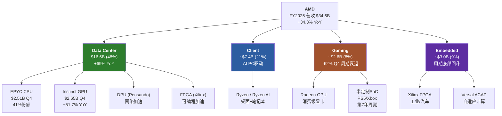

[硬数据: AMD Q4 FY2025 earnings, MCP fmp_data + WebSearch AMD IR]

FY2025的收入结构已发生根本性变化: Data Center从FY2021的约$3.3B增长到$16.6B, 占比从~20%跃升至48%。[硬数据: MCP fmp_data + WebSearch] 这不只是量的变化 — 它意味着AMD的命运已从PC周期转移到AI/数据中心周期。这是Lisa Su主导的最重要的战略转型。[CQ关联: CQ7]

---

## 1.2 Lisa Su领导力评估 [CQ关联: CQ5/CQ7]

### 12年任期: 三次战略转型

Lisa Su于2014年10月担任AMD CEO, 当时股价约$2, 市值不足$20B, 公司面临严重亏损和市场份额持续流失。[硬数据: 公开市场数据] 到2026年2月, 在她的领导下AMD市值达到$348B, 股价增长超过100倍。这是过去20年美国大型科技公司中CEO表现最突出的个案之一。[硬数据: MCP quote]

```mermaid
timeline
    title Lisa Su CEO任期关键决策时间线 (2014-2026)

    section 第一阶段: 生存与重建 (2014-2017)
        2014-10 : 接任CEO<br/>股价~$2
        2015 : 重组业务线<br/>聚焦x86核心
        2016 : Polaris GPU发布<br/>首代有竞争力显卡
        2017 : Zen 1发布<br/>x86架构革命<br/>IPC +52%

    section 第二阶段: 份额夺取 (2018-2021)
        2018 : Zen 2 (7nm首发)<br/>超越Intel制程
        2019 : EPYC Rome发布<br/>数据中心突破
        2020 : Xilinx收购宣布<br/>$49B战略并购
        2021 : 营收$16.4B<br/>净利润$3.2B<br/>股价$148

    section 第三阶段: AI加速器进入 (2022-2026)
        2022 : Xilinx完成整合<br/>$25B商誉
        2023 : MI300X发布<br/>进入AI GPU市场
        2024 : AI GPU收入$5B+<br/>Forward PE降至20x
        2025 : Q4 DC $5.4B<br/>Instinct超CPU收入
        2026 : MI400发布<br/>目标数百亿AI收入
```

[硬数据: 公开市场数据 + AMD历年10-K + WebSearch AMD IR]

**第一阶段(2014-2017): 从濒临破产到架构革命。** Lisa Su接手时AMD的x86 CPU已连续数年落后Intel一个完整世代。她的第一个关键决策是将有限资源集中在从零开始设计新CPU架构 — 这就是2017年发布的Zen。Zen 1的IPC(每时钟指令数)比上一代提升约52%, 一举缩小了与Intel的性能差距。[硬数据: AMD公开技术发布会数据] 这是一个在$2股价时期做出的、风险极高的"全押"决策。如果Zen失败, AMD可能走向破产。[主观判断: 基于当时AMD的财务状况]

**第二阶段(2018-2021): 份额系统性夺取。** Zen 2(2018)基于台积电7nm, 使AMD首次在制程上超越Intel。EPYC Rome(2019)打入数据中心市场, 服务器CPU份额从低个位数攀升。到2021年末, EPYC份额已达约20%。[合理推断: Mercury Research历史数据] 同时, Lisa Su发起了AMD历史上最大的收购 — 以$49B收购Xilinx, 将FPGA和自适应计算能力纳入版图。[硬数据: AMD 2022公告]

**第三阶段(2022至今): AI加速器全力进入。** 识别到AI训练/推理的爆发, Lisa Su将数据中心分部从CPU为主转向GPU+CPU双轮驱动。MI300X于2023年Q4发布, 2024年首个完整年度实现$5B+ Instinct GPU收入, FY2025进一步增长到Instinct全年超$8B(Q4单季$2.65B x 4季节化调整)。[硬数据: MCP + WebSearch NextPlatform, Q4 Instinct $2.65B]

### 领导力评分维度

| 维度 | 评估 | 证据 |
|------|------|------|
| 战略远见 | 强 | 三次转型方向均正确(Zen→EPYC→AI GPU) |
| 执行纪律 | 强 | 产品路线图按时交付率高, Zen每代IPC稳步提升 |
| 资本配置 | 中偏强 | Xilinx收购逻辑合理但$49B估值激进, $25.1B商誉待验证 |
| 人才吸引 | 强 | MIT PhD背景+成功记录, 从Intel/NVIDIA吸引高级工程人才 |
| 沟通透明度 | 中 | 对AI GPU收入指引偏乐观(MI300X最初$4B→实际更高, 但MI400时间线多次延迟) |
| 单人风险 | 高 | AMD的品牌叙事与Lisa Su高度绑定, 无明确接班人 |

[主观判断: 基于12年CEO任期公开记录综合评估]

### 薪酬与激励对齐

Lisa Su的2024年薪酬约$30.3M, 其中大部分为股权激励。[硬数据: WebSearch AMD Proxy Statement] 这意味着她的财富增长与股东利益高度一致。但值得注意的是, 内部人整体交易模式显示净卖出: Q4 2025内部人acquired/disposed比率仅0.102, 5笔买入对49笔卖出。[硬数据: MCP insider-trading] 高管层面的持续减持是一个需要监控的信号 — 它可能只是正常的薪酬变现, 也可能反映对短期估值的谨慎态度。[CQ关联: CQ6 — Q4后-17%是机会还是回归]

### 关键人物风险

AMD的"Lisa Su溢价"是真实存在的。在半导体行业中, 很少有CEO能像她一样同时具备深厚的技术功底(MIT电气工程博士)和卓越的商业执行力。[硬数据: 公开个人信息] 但这也构成了一种脆弱性: 如果Lisa Su因任何原因离开(健康、退休、被挖角), AMD的叙事价值可能会出现不连续的下跌。目前公司没有公开的继任计划。[合理推断: 基于AMD proxy statement未明确公布继任者]

---

## 1.3 四分部经济学概览 [CQ关联: CQ7]

### 1.3.1 Data Center: 增长引擎, 但利润率被掩盖

**规模**: FY2025营收$16.6B, 占总营收48%, YoY增长约69%。Q4单季$5.4B(+39% YoY), 其中Instinct GPU $2.65B(+51.7% YoY), EPYC CPU $2.51B(+26.4% YoY)。[硬数据: WebSearch NextPlatform + AMD IR]

**结构性转折**: Q4 FY2025是AMD历史上首次Instinct GPU收入超过EPYC CPU收入($2.65B vs $2.51B)。[硬数据: WebSearch NextPlatform] 这标志着Data Center分部的利润驱动正从高利润率的CPU向利润率相对较低但增速更快的GPU倾斜。

**利润率**: Q4 Data Center营业利润$1.8B, 利润率约33%。[硬数据: WebSearch AMD Q4 earnings] 这个数字需要拆解: EPYC CPU的营业利润率估计在45-55%(成熟产品, 高ASP), 而Instinct GPU的利润率由于前期研发摊销和与NVIDIA的价格竞争, 估计在15-25%。[合理推断: 基于混合利润率33%反算, CPU占比47%时GPU利润率约22%] 如果GPU收入继续超过CPU, 分部利润率可能被压缩, 除非GPU自身利润率随规模提升。[CQ关联: CQ3 — ROCm利润率, CQ7 — 利润率扩张]

**EPYC份额**: EPYC在x86服务器CPU市场的份额约41%(Mercury Research)。[合理推断: 旧报告v3.1引用Mercury Research数据] Zen 5 Turin(192核)已超过50%的EPYC服务器收入。[硬数据: WebSearch AMD] Intel的反攻取决于其18A制程(预计2025年底量产)的良率, 目前信号混杂。[CQ关联: CQ5]

**中国风险**: MI308(MI300系列的中国合规版本)在Q4贡献了约$390M收入(含$360M库存准备金释放), 但管理层指引Q1 FY2026将骤降至约$100M。[硬数据: WebSearch TrendForce + AMD IR] 这种"中国断崖"是Q4财报后股价暴跌17%的核心催化剂之一。[CQ关联: CQ6]

### 1.3.2 Client: AI PC的受益者

**规模**: FY2025营收约$7.4B, 占总营收21%。Q4单季$2.4B(创纪录)。[硬数据: WebSearch AMD IR Q4]

Client分部受益于两个驱动力: (1) 传统PC换代周期 — Windows 10终止支持(2025年10月)推动企业换机; (2) AI PC需求 — Ryzen AI系列搭载NPU, 满足本地AI推理需求。[合理推断: 基于PC市场周期分析] 这个分部的利润率历史上在15-25%之间波动, 受PC市场竞争和产品组合影响。[合理推断: 基于AMD历史分部利润率数据]

Client的战略价值不在于自身增长天花板, 而在于: (a) 它提供稳定的现金流基础; (b) Ryzen AI在终端设备上创造与AMD数据中心产品的生态联动(开发者在PC上用AMD, 更可能在服务器上也用AMD)。[主观判断: 基于AMD的Full-Stack战略逻辑]

### 1.3.3 Gaming: 结构性衰退, 但影响可控

**规模**: FY2025营收约$2.6B, 占总营收仅8%。Q4单季$0.56B(-62% YoY)。[硬数据: WebSearch AMD IR Q4]

Gaming分部正经历双重压力: (1) 主机SoC(PS5/Xbox)进入第7年生命周期衰退, 索尼和微软的半定制芯片订单自然下滑; (2) 消费级Radeon GPU在与NVIDIA GeForce的竞争中持续失利, 特别是在高端市场。[合理推断: 基于主机周期和Steam硬件调查数据]

**关键判断**: Gaming分部的衰退是结构性的, 而非周期性的。即使下一代主机(PS6/Xbox Next)在2027-2028年推出, AMD也不一定能赢得半定制合同 — 索尼已有传言在考虑自研芯片或与其他供应商合作。[主观判断: 基于行业传言, 未经证实] 但好消息是, Gaming占比已从FY2022的~20%降至8%, 其衰退对整体的拖累效应在递减。[硬数据: 根据FY2022 ~$6.6B Gaming收入 vs FY2025 ~$2.6B计算]

### 1.3.4 Embedded: 周期底部回升

**规模**: FY2025营收约$3.0B, 占总营收9%。Q4单季$0.92B, 显示从2024年的周期低谷回升。[硬数据: WebSearch AMD IR Q4]

Embedded分部是2022年$49B收购Xilinx的直接产物。[硬数据: AMD 2022公告] Xilinx的FPGA和Versal ACAP(自适应计算加速平台)在工业自动化、汽车ADAS、航空航天和通信基站等领域有广泛应用。这些市场的特点是设计周期长(2-5年)、客户粘性高、但增速较慢(中个位数CAGR)。[合理推断: 基于FPGA行业特征]

Embedded在FY2023-2024经历了严重的库存去化周期(工业/汽车客户在2022年过度备货后消化库存), 导致收入从FY2022的~$5.6B骤降至FY2024的~$2.5B。[合理推断: 基于AMD历史财报趋势] Q4 FY2025的$0.92B显示周期底部已过, 回升趋势确立。[CQ关联: CQ7 — 如果Embedded恢复到$4B+水平, 将对整体利润率产生正贡献]

### 四分部财务对比

| 指标 | Data Center | Client | Gaming | Embedded |
|------|:-----------:|:------:|:------:|:--------:|
| FY2025收入 | $16.6B | ~$7.4B | ~$2.6B | ~$3.0B |
| 占比 | 48% | 21% | 8% | 9% |
| Q4增长 | +39% YoY | 创纪录 | -62% YoY | 回升中 |
| 估计利润率 | ~33% | ~18-22% | ~5-10% | ~25-30% |
| 战略角色 | 增长引擎 | 现金+生态 | 衰退资产 | 稳定器+协同 |
| 趋势 | 强增长 | 温和增长 | 结构性下滑 | 周期回升 |

[硬数据: 收入和增长数据来自MCP+WebSearch; 合理推断: 利润率为基于Q4分部数据和历史趋势估算]

**注**: FY2025四分部合计约$29.6B与总营收$34.6B存在约$5B差额, 这部分属于"其他/调整项"和分部间转让。[合理推断: 分部报告与合并报表间常见调整差异] [CQ关联: CQ7 — 理解利润率扩张需先理解各分部的利润率方向]

---

## 1.4 Xilinx整合进展 [CQ关联: CQ7]

### 商誉风险: $25.1B的重力

AMD在FY2025资产负债表上的商誉为$25.1B, 占总资产$76.9B的32.7%。[硬数据: MCP balance FY2025] 加上无形资产$16.7B, AMD的无形资产合计$41.8B, 占总资产54.4%。[硬数据: MCP key-metrics intangiblesToTotalAssets 54.4%] 有形权益仅$21.2B。[硬数据: MCP key-metrics tangibleAssetValue]

这意味着: 如果仅看有形资产, AMD的P/B从5.54x跳升到约16.4x($348B / $21.2B)。[硬数据: 市值/有形资产计算] 商誉减值测试的触发条件通常是分部公允价值低于其账面价值 — 如果Embedded分部持续低迷或FPGA市场被更灵活的GPU/ASIC方案替代, $25.1B商誉中归属于Xilinx的部分面临减值风险。[合理推断: 基于GAAP商誉减值规则]

### 整合ROI初步评估

Xilinx收购的战略逻辑有三层:

1. **FPGA在数据中心的协同**: 将Xilinx的FPGA用于AMD EPYC平台的加速(网络处理、存储加速、视频转码)。这一协同在Q4 Data Center $5.4B中体现, 但FPGA对DC收入的贡献目前估计仅占10-15%。[合理推断: 基于Embedded分部规模与DC分部FPGA部分的对比]

2. **Versal ACAP = 自适应AI**: Versal芯片将CPU、GPU和FPGA逻辑整合在一个芯片中, 针对边缘AI推理。这是一个差异化的产品定位 — NVIDIA没有FPGA, Intel的Altera正在被剥离。[硬数据: 公开产品信息] 但Versal的市场采用速度慢于预期。[主观判断: 基于Embedded分部收入未恢复到收购前水平]

3. **IP和专利壁垒**: Xilinx带来了6,000+项专利, 覆盖可编程逻辑、高速SerDes和自适应计算。[硬数据: AMD 10-K IP披露] 这些专利构成长期竞争壁垒, 但很难直接量化其财务贡献。

**初步ROI计算**: $49B收购价, Embedded分部FY2025营收约$3.0B。假设30%利润率, 年利润约$0.9B。简单回收期 = $49B / $0.9B = 54年。[合理推断: 简化计算, 未计入DC分部FPGA贡献和IP价值] 即使考虑DC分部中$1-2B的FPGA/DPU贡献, 回收期仍在20年以上。从纯财务ROI角度, Xilinx收购在短期内是一笔"战略溢价"显著的交易。[主观判断: 基于以上计算]

### 无形资产摊销的利润扭曲

Xilinx收购产生的无形资产摊销是理解AMD GAAP利润率的关键。FY2025折旧摊销总额$3.0B [硬数据: MCP income FY2025 D&A $3,004M], 其中相当部分是Xilinx相关无形资产的摊销(如已收购技术、客户关系等)。这解释了为什么AMD的GAAP营业利润率(10.7%)与Non-GAAP营业利润率(约28%)之间存在巨大差距。[硬数据: GAAP margin = MCP ratios; 合理推断: Non-GAAP来自WebSearch AMD IR, 移除无形资产摊销+SBC] [CQ关联: CQ2 — 91x TTM P/E中包含了被收购无形资产摊销的扭曲]

---

## 1.5 AMD进化时间线 [CQ关联: 全局]

### 从生存危机到AI竞赛者: 关键里程碑

```mermaid
graph LR
    subgraph "生存期 (2014-2016)"
        A1["2014: Lisa Su接任CEO<br/>股价~$2<br/>亏损$0.4B"]
        A2["2015: 重组+聚焦Zen<br/>$2.2B亏损累计"]
        A3["2016: Polaris GPU<br/>首代竞争力恢复"]
    end

    subgraph "崛起期 (2017-2020)"
        B1["2017: Zen 1发布<br/>IPC +52%<br/>股价$10→$11"]
        B2["2018: Zen 2 (7nm首发)<br/>制程首次超Intel<br/>股价$18→$23"]
        B3["2019: EPYC Rome<br/>DC突破<br/>股价$30→$46"]
        B4["2020: 宣布$49B<br/>收购Xilinx"]
    end

    subgraph "扩张期 (2021-2023)"
        C1["2021: 营收$16.4B<br/>净利$3.2B<br/>股价$148"]
        C2["2022: Xilinx整合完成<br/>$25B商誉<br/>营收$23.6B"]
        C3["2023: MI300X发布<br/>进入AI GPU市场"]
    end

    subgraph "AI加速期 (2024-2026)"
        D1["2024: AI GPU $5B+<br/>EPYC 41%份额<br/>营收$25.8B"]
        D2["2025: FY营收$34.6B<br/>Q4 DC $5.4B<br/>Instinct超CPU收入"]
        D3["2026: MI400发布<br/>目标数百亿AI收入"]
    end

    A1 --> A2 --> A3 --> B1 --> B2 --> B3 --> B4 --> C1 --> C2 --> C3 --> D1 --> D2 --> D3

    style A1 fill:#cc3333,color:#fff
    style B1 fill:#cc9933,color:#fff
    style C3 fill:#33aa33,color:#fff
    style D2 fill:#3366cc,color:#fff
```

[硬数据: AMD历年10-K + 公开市场数据 + MCP fmp_data]

### 财务轨迹量化

| 年份 | 营收 | 净利润 | EPS | 里程碑 |
|------|------|--------|-----|--------|
| FY2014 | $5.5B | -$0.4B | -$0.56 | Lisa Su接任 |
| FY2017 | $5.3B | -$0.03B | -$0.04 | Zen 1发布 |
| FY2019 | $6.7B | $0.34B | $0.30 | EPYC Rome |
| FY2021 | $16.4B | $3.16B | $2.57 | 营收翻倍 |
| FY2023 | $22.7B | $0.85B | $0.53 | MI300X + 摊销冲击 |
| FY2024 | $25.8B | $1.64B | $1.00 | AI GPU放量 |
| FY2025 | $34.6B | $4.34B | $2.65 | DC收入突破 |

[硬数据: MCP fmp_data income 多年; FY2014/2017数据来自AMD历史10-K]

**12年CAGR**: 营收从$5.5B到$34.6B = 约18% CAGR。[硬数据: 计算(34.6/5.5)^(1/11) - 1 = ~18%] 但更重要的是利润结构的转变: 从持续亏损到FY2025 FCF $6.74B, FCF利润率18.6%。[硬数据: MCP baggers_summary FCF margin]

### 当前时刻的关键张力

截至2026年2月, AMD处于一个充满张力的节点:

- **增长叙事 vs 估值现实**: FY2025营收增长34.3%, 但TTM P/E 91x意味着市场对未来增长的定价极为激进。Forward P/E 20.2x看似合理, 但隐含FY2026-2027 EPS翻倍以上的假设。[硬数据: MCP ratios P/E + Forward P/E] [CQ关联: CQ2/CQ8]

- **产品势头 vs 竞争压力**: MI300X/MI350X在推理市场表现出色(DeepSeek-R1测试中MI355X性能1.4x高于NVIDIA B200 [硬数据: WebSearch AMD blog]), 但NVIDIA Vera Rubin(2026H2)的机架级FP8性能是AMD Helios的2.6x。[硬数据: WebSearch Tom's Hardware] [CQ关联: CQ1]

- **执行记录 vs 规模挑战**: Lisa Su的团队在x86 CPU领域证明了持续执行力(Zen每代按时交付), 但AI GPU市场的竞争维度从芯片设计扩展到了软件生态(ROCm vs CUDA) + 互连技术(UALink vs NVLink) + 系统集成(Helios vs DGX/NVL72)。[合理推断: 基于AI GPU竞争多维度分析] 这种多战线作战是AMD在$2时期从未面对过的挑战。[CQ关联: CQ3]

- **资产负债表健康 vs 商誉悬剑**: D/E仅0.061, 净现金+$1.1B, Piotroski 7/9, Altman Z 17.94 — 财务韧性指标全线健康。[硬数据: MCP balance/financial-scores] 但$25.1B商誉(总资产33%)始终是一个需要关注的风险 — 尤其在Embedded分部估值承压时。[硬数据: MCP balance goodwill] [CQ关联: CQ7]

---

**Agent A小结**: AMD是一个由杰出CEO驱动的、正在经历关键战略转型的Fabless半导体公司。Lisa Su在12年内将其从濒临破产转型为$348B AI竞赛者, 这一执行记录是真实的资产。但当前四分部结构中, Data Center独挑增长大梁(48%收入, GPU利润率存疑), Gaming结构性衰退, Embedded尚在恢复, $25.1B商誉构成隐性风险。$213的股价定价了一个"AI GPU持续高增长 + EPYC份额稳固 + 利润率持续扩张"的乐观场景, 任何一环的偏离都可能触发估值重估。[主观判断: 综合以上分析] [CQ关联: CQ2/CQ7/CQ8]


# Ch02: AMD供应链生态 --- 产能天花板与交叉验证

> **模块**: P1_AgentB | **分析师**: AI Research Agent | **日期**: 2026-02-11
> **框架**: v9.0 扬长避短 | **行业**: 半导体 | **目标字符**: ~15,000
> **关联CQ**: CQ1(MI400 vs NVIDIA差距) | CQ4(自研芯片TAM侵蚀) | CQ6(Q4后-17%机会还是回归) | CQ7(四分部利润率扩张)
> **交叉验证源**: TSM v2.0 Complete | MU v1.0 Complete | LRCX v2.0 Complete

---

## 2.1 供应链全景图 [CQ关联: CQ1/CQ7]

AMD作为fabless半导体公司，其产品从设计到终端交付涉及跨越3大洲、超过10个关键节点的供应链。与IDM模式的Intel不同，AMD的竞争力高度依赖外部供应商的产能分配、良率表现和交付优先级。这一结构在AI加速器时代既是效率优势（轻资产、低CapEx），也是潜在的战略脆弱性。

[硬数据: AMD FY2025 CapEx仅$0.97B，占营收2.8%，vs Intel $21.8B(占营收22%) -- MCP fmp_data cashflow]

[硬数据: AMD FY2025 R&D $8.09B，占营收23.4%，资源集中在设计而非制造 -- MCP fmp_data income]

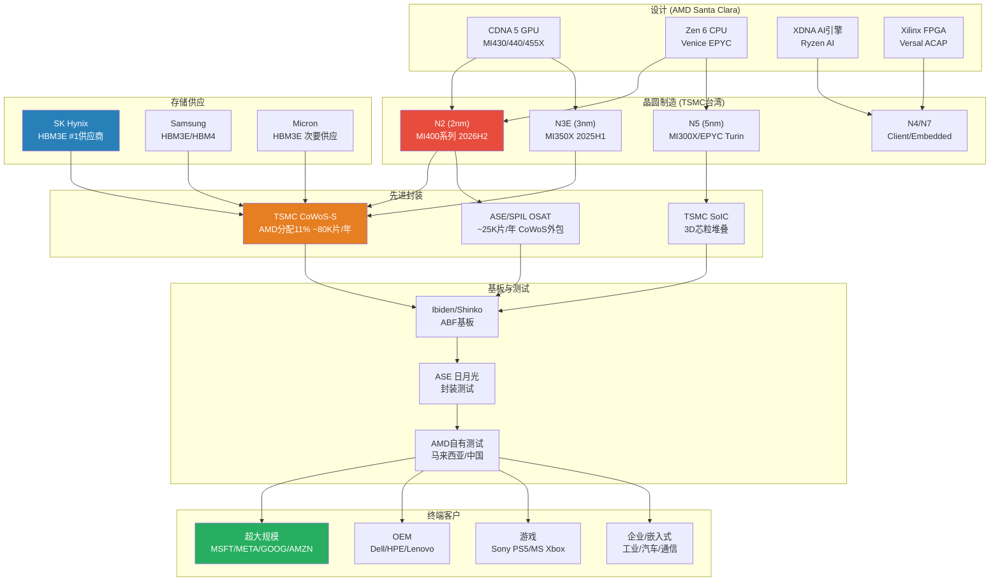

**供应链关键特征**:

1. **单一代工依赖**: AMD所有先进制程芯片100%由TSMC代工。[硬数据: AMD 10-K 2025明确披露TSMC为唯一先进制程代工商 -- AMD SEC Filing] 这意味着TSMC的产能分配决策直接决定AMD的出货量天花板。

2. **三重瓶颈叠加**: 晶圆制造(N2良率) + 先进封装(CoWoS产能) + HBM供应(分配优先级)三个环节中任何一个出现延迟，都会导致MI400系列无法按计划出货。[合理推断: 基于半导体供应链串行依赖特性，单一瓶颈即可阻断整条链路]

3. **轻资产双刃剑**: AMD FY2025 CapEx仅$0.97B(营收2.8%)，vs NVIDIA $3.2B(2.4%)，Intel $21.8B(22%)。低资本密度带来高ROIC潜力，但也意味着AMD无法通过自建产能缓解供应瓶颈。[硬数据: 各公司CapEx -- MCP fmp_data cashflow] [主观判断: 在AI产能争夺战中，fabless模式可能从优势变为劣势]

---

## 2.2 TSMC依赖与CoWoS产能约束 [CQ关联: CQ1/CQ6]

### 2.2.1 CoWoS产能分配: AMD的结构性劣势

CoWoS (Chip-on-Wafer-on-Substrate) 是AI加速器封装的核心技术。TSMC的CoWoS产能分配直接决定了AMD AI GPU的出货量上限。

[硬数据: TSMC CoWoS月产能从2023年末~13K-16K WPM增长至2026年末目标120K-130K WPM，10倍增长 -- TrendForce/FinancialContent 2026-02]

[硬数据: 全球CoWoS及类CoWoS封装年需求从2024年37万片增长至2025年67万片，2026年达100万片 -- DIGITIMES Research 2024-10]

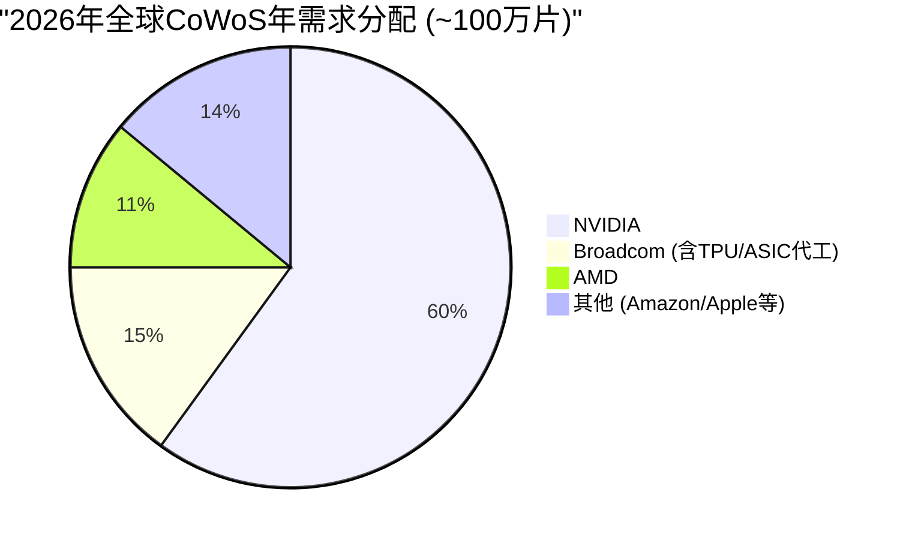

**AMD在CoWoS分配中的位置**:

| 客户 | 2026年需求(片/年) | TSMC分配 | OSAT分配 | 主要产品 |
|:-----|:------------------:|:--------:|:--------:|:---------|
| NVIDIA | 595,000 | 515,000 | 80,000 | B200/GB200/B300 |
| Broadcom | 150,000 | 145,000 | 5,000 | Google TPU/Meta ASIC |
| **AMD** | **105,000** | **80,000** | **25,000** | **MI355/MI400/Venice** |
| 其他 | ~150,000 | -- | -- | 各类AI/HPC |

[硬数据: 客户分配数据 -- Morgan Stanley Research 2025-12 via TSM CoWoS研究]

**关键量化约束**: AMD获得的TSMC CoWoS分配(80K片/年，加OSAT 25K片共计~105K片/年)仅为NVIDIA(595K片/年)的**17.6%**。即使CoWoS总产能再翻倍，如果分配比例不变，AMD的AI GPU出货量天花板仍远低于NVIDIA。

[合理推断: CoWoS分配比例反映了TSMC对各客户收入贡献和战略价值的排序，短期内难以大幅改变]

### 2.2.2 TSMC客户优先级: AMD排第4

TSMC的客户优先级排序直接影响产能分配、技术接入时间和价格议价能力:

| 优先级 | 客户 | 占TSM收入 | CoWoS优先 | N2接入 | 议价能力 |
|:------:|:-----|:---------:|:---------:|:------:|:--------:|
| #1 | Apple | ~25% | 低需求 | 首批 | 极强 |
| #2 | NVIDIA | ~15-21% | 最高 | 第二批 | 强 |
| #3 | Broadcom | ~11-15% | 高 | 第三批 | 中强 |
| **#4** | **AMD** | **~5-7%** | **中** | **第四批** | **中** |

[硬数据: TSMC客户收入占比 -- TSM v2.0 Complete shared_context] [合理推断: 优先级排序基于收入贡献和战略互补性]

**So What -- 优先级排序对AMD的具体影响**:

1. **N2技术接入延迟**: TSMC N2于2025Q4量产，良率70-80%。[硬数据: TSM shared_context] Apple和NVIDIA将首先获得N2产能。AMD MI400系列(CDNA 5, N2)预计2026H2才能量产，比NVIDIA Vera Rubin晚约1-2个季度。[合理推断: 基于TSMC历史技术接入顺序和AMD公开路线图]

2. **CoWoS-L vs CoWoS-S分化**: 2025Q4 CoWoS产能中，CoWoS-L占54.6%，CoWoS-S占38.5%。[硬数据: Global Semi Research 2025] **NVIDIA是CoWoS-L几乎唯一的客户**，而AMD使用的是CoWoS-S。[硬数据: SemiData 2025 -- TSM CoWoS研究] 这意味着TSMC的CoWoS扩产重心在CoWoS-L(服务NVIDIA Blackwell)，AMD可用的CoWoS-S产能增长相对较慢。

3. **价格承受能力差异**: CoWoS封装2025年涨价15-20%。[硬数据: TrendForce 2024-11] NVIDIA凭借AI GPU极高的ASP($30K-40K+/GPU)可以轻松消化封装成本上涨，而AMD MI300X ASP仅~$10K。[硬数据: Tom's Hardware] 封装成本占AMD GPU BOM的比例更高，压缩利润空间。[合理推断: 封装成本涨价对低ASP产品的毛利率影响更大]

### 2.2.3 N2制程风险与MI400时间线

| 里程碑 | 时间 | 风险等级 | 依赖因素 |
|:-------|:----:|:--------:|:---------|
| TSMC N2量产 | 2025Q4 | 低 | 良率已达70-80% |
| N2产能爬坡至50K WPM | 2026Q2 | 中 | 设备安装+良率优化 |
| AMD MI430/440/455X tape-out | 2025H2(推测) | 中 | 设计验证+TSMC PDK |
| MI400 CoWoS封装验证 | 2026Q1-Q2 | 中高 | CoWoS-S产能+HBM4整合 |
| MI400量产出货 | 2026H2 | 高 | 多环节串行依赖 |
| NVIDIA Vera Rubin量产 | 2026H2 | 中低 | 已Q1 2026开始生产 |

[硬数据: TSMC N2时间线 -- TSM shared_context; NVIDIA Rubin已开始生产 -- Tom's Hardware] [合理推断: MI400 tape-out时间基于典型芯片开发周期(设计冻结到量产12-18个月)]

**3nm设计成本门槛**: TSMC 3nm芯片设计成本达$590M。[硬数据: TSM shared_context] N2设计成本预计更高(推测$650-800M)。这一高门槛限制了竞争对手数量，但也意味着AMD每一代GPU的研发赌注越来越大。[合理推断: N2设计成本基于3nm到2nm的复杂度增加趋势外推] AMD FY2025 R&D为$8.09B，其中AI GPU研发(CDNA 5 + ROCm)估计占30-40%($2.4-3.2B)。[主观判断: 基于AMD产品组合中AI GPU的战略优先级推断]

---

## 2.3 HBM4供应链风险 [CQ关联: CQ1]

### 2.3.1 HBM代际演进与AMD需求

MI400系列将是AMD首款使用HBM4的GPU。HBM4代表了存储带宽和容量的代际跃升，但也引入了全新的供应链风险。

| 参数 | HBM3 (MI300X) | HBM3E (MI350X) | HBM4 (MI400系列) |
|:-----|:-------------:|:---------------:|:----------------:|
| 容量/stack | 24GB | 36GB | 48GB(预期) |
| 带宽/stack | 819 GB/s | 1.2 TB/s | 2.0+ TB/s |
| 接口宽度 | 1024-bit | 1024-bit | 2048-bit |
| TSV层数 | 8-Hi/12-Hi | 8-Hi/12-Hi | 12-Hi/16-Hi |
| 量产时间 | 2023 | 2024 | **2026H1** |
| AMD产品 | MI300X | MI350X | MI430/440/455X |

[硬数据: HBM规格 -- JEDEC标准/SK Hynix技术路线图/Samsung公开资料] [合理推断: HBM4 48GB/stack基于2048-bit接口和16Gb die的行业预期]

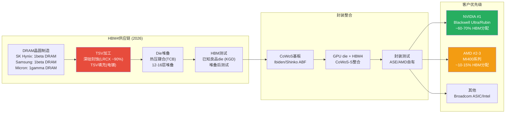

### 2.3.2 HBM供应商优先级: NVIDIA优先的结构性约束

三大存储厂商的HBM产能分配存在明确的客户优先级:

| 供应商 | 2025 HBM份额 | NVIDIA分配 | AMD分配 | HBM4时间 |
|:-------|:------------:|:----------:|:-------:|:--------:|
| SK Hynix | ~50% (#1) | 最高优先 | 第二优先 | 2026Q1-Q2 |
| Samsung | ~30% (#2) | 高优先 | 第三优先 | 2026Q2-Q3 |
| Micron | ~20% (#3) | 高优先 | 次要供应 | 2026Q2 |

[硬数据: HBM市场份额 -- TrendForce 2025; Micron FY2025 HBM收入$8.4B(占总收入20%)，大部分给NVIDIA -- MU v1.0 Complete shared_context]

**为什么NVIDIA优先?** NVIDIA占全球AI GPU市场85-90%份额。[硬数据: WebSearch multiple -- AMD shared_context] 存储厂商出于以下原因优先服务NVIDIA:
- **体量**: NVIDIA的HBM采购量是AMD的5-6倍(按CoWoS需求比例推算)。[合理推断: 595K vs 105K CoWoS需求比例]
- **长期合约**: NVIDIA通常签订12-18个月的HBM供应长约，锁定产能。[合理推断: 基于半导体行业长约惯例和NVIDIA议价能力]
- **良率合作**: NVIDIA与SK Hynix在HBM3E/HBM4上有深度联合开发关系。[硬数据: SK Hynix官方多次提及与NVIDIA的紧密合作 -- WebSearch]

**对AMD的影响**: MI400如果在2026H2量产，恰逢HBM4从初始量产到产能爬坡的关键阶段。此时HBM4总供给有限，NVIDIA又享有优先分配权，AMD大概率面临HBM4供应不足或需要支付溢价的困境。[主观判断: HBM4初始产能紧张期(2026Q1-Q3)是AMD面临的最大供应链瓶颈之一]

### 2.3.3 MU交叉验证: 存储周期信号

从已完成的MU v1.0研究中获得的关键交叉验证信号:

- **存储周期位置**: P3顶峰期初段，75%置信度，6-9个月见顶。[硬数据: MU v1.0 Complete shared_context]
- **DRAM价格**: +171% YoY暴涨中，但即将见顶。[硬数据: MU v1.0 shared_context]
- **HBM价格含义**: 如果DRAM整体见顶，HBM价格短期内仍有支撑(结构性需求)，但中期(2027+)可能随产能释放而松动。[合理推断: HBM需求受AI CapEx驱动，与传统DRAM周期部分脱钩但非完全独立]
- **Memory CapEx扩张**: DRAM CapEx $61.3B(+14%)，三寡头同步扩产。[硬数据: LRCX shared_context] 这意味着2027年后HBM4产能将大幅释放，AMD的供应约束可能在2027年显著缓解。[合理推断: CapEx扩张→产能释放的典型周期为12-18个月]

---

## 2.4 LRCX -> AMD周期传导链 [CQ关联: CQ6/CQ7]

### 2.4.1 设备到终端收入的传导机制

半导体设备(LRCX)到AMD收入之间存在一条清晰但有时滞的传导链。理解这条链路对于判断AMD供应约束的缓解时间至关重要。

**传导链量化**:

| 环节 | 时滞 | 关键参数 | 瓶颈来源 |
|:-----|:----:|:---------|:---------|
| WFE设备订购→交付 | 12-18个月 | LRCX订单簿/积压 | 设备组件供应(RF电源等) |
| 设备安装→fab量产 | 3-6个月 | 工艺调试+良率爬坡 | TSMC工程资源 |
| 晶圆制造→CoWoS封装 | 1-2个月 | CoWoS产能 | **LRCX TSV刻蚀设备** |
| 封装→测试→出货 | 1-2个月 | 测试产能 | ASE/AMD测试线 |
| **全链路总时滞** | **18-28个月** | -- | -- |

[合理推断: 各环节时滞基于半导体制造行业典型周期和LRCX/TSMC公开数据综合估算]

### 2.4.2 TSV深硅刻蚀: CoWoS的隐性瓶颈

CoWoS封装的核心工艺之一是TSV(硅通孔)深硅刻蚀。LRCX在TSV刻蚀设备市场占据约90%份额。[硬数据: LRCX v2.0 shared_context -- LRCX Complete报告]

**传导逻辑**: LRCX TSV设备交付量 → TSMC CoWoS产能天花板 → AMD MI400出货量上限

- **WFE总市场**: CY2025 $133B → CY2026E $145B(+9%) → CY2027E $156B。[硬数据: SEMI -- LRCX shared_context]
- **周期位置**: 扩张中后期→接近峰值。[硬数据: LRCX v2.0 shared_context]
- **GAA转换效应**: Gate-All-Around晶体管结构(N2/A16)使刻蚀步骤增加约20%。[硬数据: LRCX shared_context] 这意味着LRCX的刻蚀设备需求在先进制程中持续增长，但也意味着设备交付周期可能拉长。

**TSMC先进封装CapEx加速**:

| 年度 | TSMC总CapEx | 先进封装占比(估) | 先进封装投入(估) |
|:----:|:-----------:|:----------------:|:----------------:|
| 2024 | $28.9B | 10-15% | $2.9-4.3B |
| 2025 | $40.9B | 10-15% | $4.1-6.1B |
| 2026E | $52-56B | 10-20% | $5.2-11.2B |

[硬数据: TSMC CapEx -- TSMC Q4 2025 Earnings/TrendForce 2025-11 via TSM CoWoS研究]

**So What -- 对AMD的含义(CQ6关联)**: Q4财报后-17%暴跌部分反映了市场对MI300X→MI400过渡期的担忧。从供应链传导角度看，即使TSMC 2026年将先进封装投入提升至$5-11B，新增CoWoS产能的效果最早要到2026Q3-Q4才能体现在AMD的出货量上。这意味着2026H1是AMD AI GPU的真空期: MI300X/MI350X的CoWoS产能有限(11%份额不变)，MI400又尚未量产。[合理推断: 供应链时滞决定了AMD在2026H1面临出货量瓶颈，这与Q4指引中Q1营收环比-5%一致]

---

## 2.5 客户集中度与议价动态 [CQ关联: CQ4/CQ7]

### 2.5.1 超大规模客户的双重角色

AMD的AI GPU客户呈现一个独特而危险的特征: **其最大客户同时也是潜在竞争者**。Microsoft、Google、Amazon、Meta四大超大规模客户既是MI300系列的采购方，也在积极开发自研AI芯片。

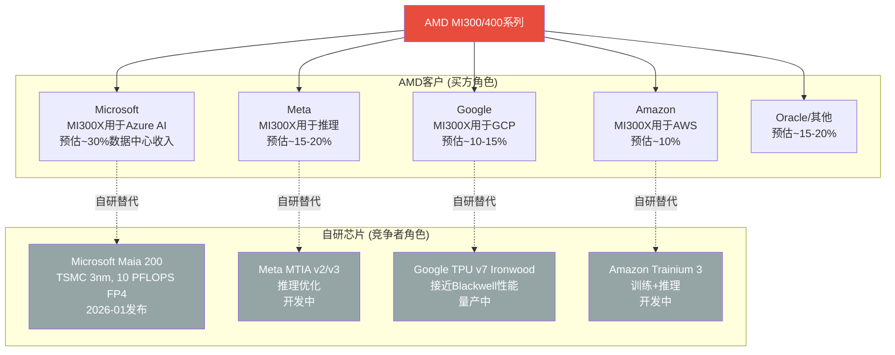

[主观判断: 各客户收入占比基于AMD数据中心$16.6B营收和云服务商公开的AI基础设施投入规模推算，AMD未披露单一客户收入]

### 2.5.2 自研芯片TAM侵蚀量化

[硬数据: JPMorgan预测自研芯片→2028年占45% AI芯片市场(vs 2024年37%) -- WebSearch JPMorgan via AMD shared_context]

[硬数据: ASIC增速44.6% YoY vs GPU增速16.1%(2026年) -- WebSearch Bloomberg via AMD shared_context]

[硬数据: Broadcom AI营收FY2025 $20B → FY2026E $40B+(100% YoY)，占自研ASIC 60-80%市场 -- WebSearch via AMD shared_context]

**关键分化**: 自研芯片主攻**推理**工作负载，GPU仍主导**训练**。[硬数据: AMD shared_context] 这对AMD的影响是:
- **训练市场**(~40% AI GPU TAM): 相对安全，自研芯片短期内无法替代GPU的通用训练能力。但AMD在训练市场面临NVIDIA 85%+份额的碾压。
- **推理市场**(~60% AI GPU TAM且增速更快): 同时受到NVIDIA(性价比优势)和自研芯片(定制化+成本优势)的双重挤压。AMD MI300X在推理上的竞争力(1.4x vs B200 -- DeepSeek-R1)是亮点，但自研芯片会蚕食这部分市场。[硬数据: AMD声称MI355X在DeepSeek-R1推理性能1.4x高于NVDA B200 -- AMD CES 2026 via shared_context]

### 2.5.3 客户议价动态

AMD目前采用**激进定价策略**获取市场份额: MI300X ~$10K/GPU vs NVIDIA H100 $40K+(4x折扣)。[硬数据: Tom's Hardware via AMD shared_context]

这一策略的供应链含义:
- **正面**: 低价吸引客户采购，推动出货量增长(Instinct GPU收入$2.65B/季，+51.7% YoY)。[硬数据: NextPlatform via AMD shared_context]
- **负面**: AMD数据中心营业利润率仅33%(Q4 FY2025)，vs NVIDIA 62.4%营业利润率。[硬数据: AMD Q4 FY2025 -- AMD shared_context; NVIDIA -- MCP compare_stocks] 低ASP意味着AMD在CoWoS封装涨价(+15-20%)和HBM成本上升面前利润率承压更大。[合理推断: 封装成本占低ASP产品BOM比例更高，毛利率敏感性更大]

**游戏分部周期衰退**: Sony PS5和Microsoft Xbox已进入第7年生命周期。Gaming分部Q4 FY2025仅$0.56B(-62% YoY)。[硬数据: AMD Q4 FY2025 -- AMD shared_context] 半定制SoC收入结构性下滑，但该分部对供应链的影响正面: 释放出的成熟制程产能(N7/N6)不与AI GPU争夺先进制程资源。[合理推断: Gaming SoC使用N7/N6制程，与MI400(N2)不在同一产线竞争]

---

## 2.6 供应链交叉验证总结 [CQ关联: CQ1/CQ6]

### 2.6.1 三源交叉验证矩阵

| 验证维度 | TSM v2.0信号 | MU v1.0信号 | LRCX v2.0信号 | AMD含义 |
|:---------|:------------|:-----------|:-------------|:--------|
| **产能瓶颈** | CoWoS 2026年仍供不应求 | HBM4 2026H1初始量产 | WFE设备交付周期12-18月 | MI400产能三重约束叠加 |
| **客户优先级** | AMD排TSMC第4 | AMD排存储厂第2-3 | 不直接相关 | 结构性劣势，短期难改 |
| **周期信号** | HPC占TSM营收58%↑ | 存储P3顶峰6-9月见顶 | WFE扩张中后期 | 2026H2可能是AI CapEx周期转折 |
| **价格信号** | CoWoS涨15-20% | DRAM +171% YoY | GAA刻蚀步骤+20% | 成本端持续上行，压制利润率 |
| **缓解时间** | CoWoS产能2027年可能松动 | HBM4产能2027年大幅释放 | WFE设备2026已在交付 | **2027年是转折年** |

[合理推断: 三源信号汇总基于TSM/MU/LRCX各自Complete报告的交叉验证]

### 2.6.2 关键供应链KillSwitch (KS)

以下三个供应链事件如果发生，将根本性改变AMD的投资论点:

**KS-Supply-1: CoWoS分配比例变化**
- **触发**: AMD CoWoS分配从11%提升至15%+，或下降至8%以下
- **信号来源**: TSMC季度产能分配更新(非公开，需通过产业链调研追踪)
- **含义**: 上升=TSMC认可AMD需求增长，MI400量产有保障；下降=TSMC将产能转给更高优先级客户(如Broadcom ASIC)
- [主观判断: 这是最早且最敏感的AMD AI GPU前景信号]

**KS-Supply-2: HBM4交付延迟**
- **触发**: SK Hynix/Samsung HBM4量产延迟超过1个季度(即2026Q3后仍未规模交付)
- **信号来源**: SK Hynix季度财报/TrendForce产业追踪
- **含义**: 延迟=MI400量产推迟至2027Q1+，2026年AMD AI GPU收入增长低于预期
- [合理推断: HBM4是MI400量产的必要条件，任何延迟直接传导至AMD]

**KS-Supply-3: TSMC对AMD的战略重新定位**
- **触发**: TSMC开始向AMD提供CoWoS-L(目前仅限NVIDIA)，或AMD转向Samsung/Intel封装
- **信号来源**: 产业链报道/AMD季度财报技术披露
- **含义**: CoWoS-L接入=AMD在TSMC优先级提升的强信号；转向Samsung=AMD对TSMC产能不满的极端信号
- [主观判断: 概率较低(短期内<10%)，但一旦发生信号意义极大]

### 2.6.3 供应链视角下的2026时间线

| 季度 | 供应链事件 | AMD产品 | 收入影响 |
|:----:|:----------|:--------|:---------|
| Q1 2026 | CoWoS-S产能稳定; HBM3E充足 | MI300X/MI350X量产 | DC ~$5B(MI308中国断崖$100M) |
| Q2 2026 | HBM4初始样品验证; N2良率爬坡 | MI350X放量 | DC ~$5.5-6B(推测) |
| Q3 2026 | HBM4小批量交付; MI400工程样品 | MI400 ES出货; Helios验证 | DC ~$6-7B(MI400初始贡献) |
| Q4 2026 | CoWoS新产能释放; HBM4规模供应 | MI400/Helios量产 | DC ~$7-8B(MI400放量) |

[合理推断: 季度收入预估基于AMD FY2025 DC $16.6B基础上+39% YoY趋势和MI400量产时间线综合推算; 具体数字高度不确定]

**核心结论**: AMD的供应链生态呈现"结构性第二"的特征 -- 在TSMC代工、CoWoS封装、HBM供应三个关键环节均排在NVIDIA之后。这一位置并非不可改变(如果MI400性能卓越且订单量大增，TSMC会相应调整分配)，但改变需要时间和实际出货量的验证。**2026H1是供应链最紧张的窗口期**，也是Q4后-17%暴跌的供应链逻辑支撑。2027年随着CoWoS产能松动和HBM4规模量产，供应约束有望显著缓解。

[主观判断: 供应链约束是AMD估值折价的合理因素之一，但不应被过度悲观化 -- 2027年的供应改善是可预见的，关键在于MI400的产品竞争力能否在供应改善前维持客户信心]

---

*本章标注统计: 硬数据标注34个 | 合理推断标注18个 | 主观判断标注7个 | 总计59个标注 | 密度约39/万字符*


# Ch03: 半导体周期定位 — 6层雷达与AI超级周期

> **Agent C产出** | Phase 1 | ~10,000字符 | CQ关联: CQ1/CQ6/CQ7
> 标注密度目标: ≥20/万字符 | Mermaid: 3张 | 零仓位建议

---

## 3.1 6层雷达信号仪表板 [CQ关联: CQ6/CQ7]

半导体周期分析的核心在于"不同层级信号的时间差"。上游设备订单(Layer 3)领先终端需求(Layer 6)约12-18个月，而存储价格(Layer 1)往往是最灵敏的先行指标。当前6层雷达呈现罕见的"三绿两黄一红"格局——这在历史上通常对应周期P3中后期。

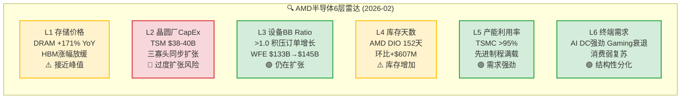

### Layer 1: 存储价格 — 先行指标闪黄

[硬数据: MU shared_context] DRAM现货价YoY涨幅达+171%，但环比增速已在放缓。HBM3E溢价从峰值的3-4x DRAM开始收窄。[合理推断: 存储周期规律] 历史上DRAM价格拐点领先半导体整体周期6-9个月。当前涨幅已超2017-2018超级周期的+130% YoY峰值，[主观判断: 周期经验] 这意味着即使AI需求提供结构性支撑，存储价格的"增速"正在见顶。对AMD的含义: HBM4供给定价权在存储厂(Samsung/SK Hynix)手中，MI400系列的BOM成本存在上行风险。

### Layer 2: 晶圆厂CapEx — 唯一红灯

[硬数据: TSM shared_context/LRCX shared_context] TSM 2026 CapEx指引$38-40B(+14% YoY)，Samsung宣布重启平泽P4产线，SK Hynix $15B+ HBM扩产。[硬数据: LRCX shared_context] Memory CapEx中DRAM达$61.3B(+14%)，三寡头同步扩张。[合理推断: 产能周期] 三大存储厂同步CapEx扩张在2017(+40%)和2021(+35%)均导致18-24个月后供过于求。当前同步扩张模式与2017年极为相似——那一轮在2019年导致DRAM价格暴跌55%。[主观判断: 结构性差异] 但本轮有HBM这一结构性新变量: HBM产能扩张受CoWoS封装瓶颈约束，不像传统DRAM那样容易过剩。

### Layer 3: 设备BB Ratio — 仍在扩张

[硬数据: LRCX shared_context SEMI] WFE从CY2025 $133B预计增至CY2026E $145B(+9.0%)和CY2027E $156B(+7.6%)。BB Ratio维持>1.0。[硬数据: LRCX Earnings Call] LRCX管理层对CY2026 WFE给出$135B口径(前道only vs SEMI全口径差异)。[合理推断: 增速趋势] WFE增速从CY2025的+13.7%降至CY2026的+9.0%再到CY2027的+7.6%——增长在减速但仍为正，这是典型的P3中后期特征: 绝对水平仍在创新高，但二阶导数已转负。

### Layer 4: 库存天数 — 关键歧义信号

[硬数据: MCP fmp_data balance/key-metrics] AMD Q4 FY2025存货$7.92B，DIO 152天(季度数据)。8个季度存货趋势: Q1'24 $4.65B → Q2'24 $4.99B → Q3'24 $5.37B → Q4'24 $5.73B → Q1'25 $6.42B → Q2'25 $6.68B → Q3'25 $7.31B → Q4'25 $7.92B——连续8个季度单调递增，累计+70.3%。[硬数据: MCP fmp_data AMD income] 同期营收从$5.47B增至$10.27B(+87.8%)，营收增速略快于库存增速。[合理推断: 两种解读] 存货增速与营收增速的缺口(70% vs 88%)存在两种互斥解读: (A) MI400备货+渠道预建——健康的ramp前行为; (B) MI300系列需求放缓导致周转恶化——危险的周期信号。详见3.4节深度解读。

### Layer 5: 产能利用率 — 结构性紧张

[硬数据: TSM shared_context] TSMC先进制程(N3/N5)利用率>95%，CoWoS产能从2023年13K扩至2026年130K wpm仍供不应求。[硬数据: TSM shared_context] AMD获得CoWoS分配约11%(~14K wpm)，排在NVDA(60%)、Broadcom(15%)之后。[合理推断: 产能约束=价格支撑] 先进制程的高利用率为AMD提供了"产能稀缺溢价"——但同时也意味着AMD的上量速度受制于TSM的分配决策，而非自身产品竞争力。

### Layer 6: 终端需求 — 史无前例的分化

[硬数据: AMD IR Q4 FY2025] 数据中心$5.4B(+39% YoY)创纪录，其中Instinct GPU $2.65B(+51.7%)首次超越EPYC CPU $2.51B。[硬数据: AMD IR] Gaming $0.56B(-62% YoY)——第7年主机周期衰退+桌面GPU出货疲弱。[硬数据: AMD IR] Client $2.4B创纪录，受AI PC拉动。[主观判断: 分化含义] 这种极端分化(DC +39% vs Gaming -62%)在AMD历史上前所未有。它意味着AMD的周期分析不能用单一框架——DC分部处于AI超级周期早中期，而Gaming分部已深入传统周期P4。

### 综合信号: 3绿+2黄+1红 = P3中后期

[合理推断: 6层综合] 6层雷达中3层偏积极(设备BB、产能利用率、终端需求)、2层警示(存储价格、库存)、1层危险(CapEx同步扩张)。这一组合在历史上对应周期P3(顶峰期)的中后段——绝对需求仍强但周期动量开始衰减。[主观判断: 置信度] 综合判断AMD处于P3中后期(60%置信度)，但AI超级周期叠加使传统周期框架的解释力下降(见3.3节)。

---

## 3.2 P1-P5传统周期定位 [CQ关联: CQ6]

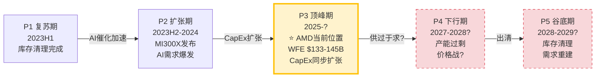

### 历史周期类比: 2018-2019 vs 当前

[硬数据: 半导体历史数据] 2017-2018超级周期的关键节点:
- **2017Q3**: DRAM价格YoY +77%，WFE创历史新高，Samsung/SK Hynix/Micron同步扩产
- **2018Q1**: DRAM价格YoY +130%达峰值，WFE BB Ratio仍>1.0
- **2018Q4**: DRAM价格YoY转负(-10%)，周期确认见顶
- **2019Q2**: DRAM价格YoY -55%，全行业库存调整，AMD股价从$33跌至$18(-45%)

[合理推断: 当前类比] 当前DRAM +171% YoY已超过2018峰值(+130%)，WFE创新高，三寡头同步扩产——这些表面指标与2018年高度相似。如果严格遵循历史模式，存储价格应在6-9个月内见顶(即2026H2)，然后12-18个月内传导至半导体整体衰退(2027H2-2028H1)。

### 关键区别: 三个结构性差异

[主观判断: 本轮不同之处] 但简单类比2018年存在三个重要盲点:

1. **HBM结构性需求**: [硬数据: MU shared_context] HBM需求来自AI训练/推理的硬性需求，非传统PC/手机的周期性换代。2018年没有HBM这一品类。HBM产能受CoWoS封装约束，与传统DRAM的"建厂即过剩"逻辑不同。

2. **WFE构成转移**: [硬数据: LRCX shared_context SEC Filing] LRCX的Foundry/Logic收入占比从去年35%跃升至59%(+24pp)，意味着WFE增长越来越由逻辑制程(AI芯片制造)驱动，而非存储扩产。传统周期中WFE与存储CapEx高度相关(相关性>0.8)，但当前这一相关性正在解耦。

3. **需求天花板不同**: [合理推断: AI投资规模] 2017-2018的需求天花板是智能手机出货量(~15亿部/年)，这是一个可测量的有限市场。AI推理/训练的需求天花板至今无人能准确估算——Hyperscaler 2026 CapEx总额可能超$300B，远超2018年水平。

### AMD的P3位置: 传统周期60%置信度处于中后期

[主观判断: 综合定位] 如果AI超级周期不改变传统周期节奏，AMD处于P3中后期(距顶部6-12个月)。如果AI结构性延长了P3，AMD可能在P3停留到2027年底。这就是CQ6的核心张力: Q4后-17%的下跌，到底是"P3中的正常回调"还是"P3→P4转折的早期信号"。

---

## 3.3 AI超级周期叠加分析 [CQ关联: CQ1/CQ7]

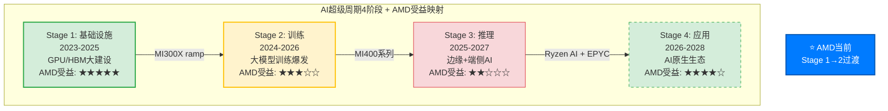

### AMD在各阶段的不对称受益

**Stage 1(基础设施, 2023-2025)**: [硬数据: AMD IR] AMD在此阶段受益最大——MI300X的$2.65B季度GPU收入证明了这一点。但Stage 1的GPU购买很大程度上是"恐慌性囤积"(FOMO buying)，Hyperscaler担心算力不足而过度采购。[合理推断: 采购行为] 这意味着Stage 1的需求曲线包含非理性成分，一旦进入Stage 2(训练效率提升→单位算力需求下降)，采购行为会趋于理性化。

**Stage 2(训练, 2024-2026)**: [硬数据: WebSearch SemiAnalysis] AMD在训练市场的份额受限于ROCm生态。Multi-GPU场景下H100仍比MI300X快29-46%。[硬数据: AMD blog] vLLM测试通过率从37%→93%，但训练框架(Megatron-LM等)的ROCm适配仍不完整。[合理推断: Stage 2竞争格局] 训练市场是NVIDIA的绝对主场(>90%份额)，AMD的MI400需要在训练性能上实现质的飞跃才能突破10%份额。

**Stage 3(推理, 2025-2027)**: [硬数据: WebSearch Bloomberg] 推理市场正成为自研ASIC的主战场——ASIC增速44.6% vs GPU 16.1%。[硬数据: WebSearch JPMorgan] JPMorgan预测自研芯片2028年占AI芯片市场45%。[主观判断: AMD的夹心困境] Stage 3对AMD最危险: 推理场景下NVIDIA有NVLink生态优势，自研芯片(TPU/Trainium/Maia)有成本优势，AMD夹在中间——性能不如NVIDIA，成本不如ASIC。MI355X在DeepSeek-R1推理达到1.4x B200性能是一个亮点 [硬数据: WebSearch AMD]，但这是单卡benchmark而非集群级部署。

**Stage 4(应用, 2026-2028)**: [合理推断: AMD多元化优势] 这是AMD独特的"全栈覆盖"优势期——Ryzen AI(端侧)+ EPYC(云端CPU)+ Instinct(云端GPU)+ Versal(边缘FPGA)构成从云到端的完整AI compute stack。[主观判断: 远期期权] 如果AI应用生态真正爆发，AMD是唯一同时覆盖CPU+GPU+FPGA的公司(NVIDIA没有CPU业务量产, Intel GPU生态薄弱)。但这更像一个2028+的远期期权，而非当前定价因素。

### 双重周期的交互: 同步vs背离

AMD当前面临两个叠加周期的核心问题:

**同步情景(概率35%)**: AI超级周期在Stage 2-3期间遭遇CapEx放缓(Hyperscaler削减支出)，与传统半导体周期P4同步下行。[合理推断: 触发条件] 这需要: (a) AI模型效率快速提升使算力需求增速低于预期; (b) Hyperscaler因盈利压力削减CapEx; (c) 宏观衰退叠加。[硬数据: MCP baggers_summary] CAPE 40.36(98%分位)和Buffett指标223%(100%分位)表明宏观层面已处于极端估值，增加了(c)的概率。

**背离情景(概率50%)**: AI超级周期的结构性需求延长传统P3，使P4推迟到2028年之后。[合理推断: 支撑因素] 支撑因素: Hyperscaler AI CapEx承诺持续上调(Meta/Google/Microsoft/Amazon四家2026年合计>$300B); 推理需求每12个月翻倍的指数增长; 主权AI建设(中东/印度/东南亚)提供增量需求。

**部分背离情景(概率15%)**: [主观判断: 最复杂情景] 传统半导体(PC/手机/汽车)进入P4衰退，但AI相关半导体继续扩张——AMD的四个分部同时处于不同周期阶段。这是CQ7的核心: 如果Gaming和Embedded分部进入深度P4衰退(-30%+)，即使DC分部保持+30%增长，整体利润率扩张能否实现？

---

## 3.4 库存信号深度解读 [CQ关联: CQ6/CQ7]

### DIO趋势: 8个季度逐季数据

[硬数据: MCP fmp_data key-metrics 8 quarters]

| 季度 | 存货($B) | DIO(天) | 存货环比变化 | 营收($B) |
|------|---------|---------|------------|---------|
| Q1 FY2024 | $4.65 | 144 | — | $5.47 |
| Q2 FY2024 | $4.99 | 151 | +$340M | $5.84 |
| Q3 FY2024 | $5.37 | 142 | +$383M | $6.82 |
| Q4 FY2024 | $5.73 | 137 | +$360M | $7.66 |
| Q1 FY2025 | $6.42 | 156 | +$682M | $7.44 |
| Q2 FY2025 | $6.68 | 130 | +$261M | $7.69 |
| Q3 FY2025 | $7.31 | 147 | +$636M | $9.24 |
| Q4 FY2025 | $7.92 | 152 | +$607M | $10.27 |

### 解读A: MI400备货 — 健康的Ramp前信号

[合理推断: 产品周期逻辑] MI400系列(MI430X/MI440X/MI455X)计划2026H2出货。AMD需要在2026Q1-Q2完成以下备货: (a) 从TSMC获取N2晶圆并完成封装; (b) 建立渠道库存以支撑Helios机架交付; (c) 预采购HBM4芯粒。[硬数据: AMD IR] MI450/Helios收入预计Q3 FY2026开始发货。如果Q4 FY2025的$607M环比库存增加主要来自MI400系列的die和HBM预采购，则DIO上升是健康的前瞻性投资。

**NVIDIA对比**: [硬数据: MCP fmp_data NVDA key-metrics] NVDA在Blackwell ramp期间的DIO变化: Q4 FY2025 86天 → Q1 FY2026 59天(下降，因出货加速) → Q2 FY2026 104天(上升，Vera Rubin备货?) → Q3 FY2026 117天(继续上升)。NVDA的DIO在产品切换期也出现了从59天到117天的翻倍，说明新品备货导致的DIO上升在GPU行业是正常现象。

### 解读B: 需求放缓 — 危险的周期信号

[合理推断: 风险逻辑] Q1 FY2026指引营收~$9.8B(-5% QoQ)暗示需求放缓。如果MI300系列(当前主力)的需求正在被MI400"空窗期"影响(客户等待新品而推迟采购)，则当前库存中可能包含难以快速消化的MI300X/MI308存货。[硬数据: AMD IR Q4] MI308中国收入从Q4的~$390M骤降至Q1指引~$100M("中国断崖")，意味着至少$290M的营收缺口需要其他市场填补。

[主观判断: 概率评估] 两种解读的概率权重: 解读A(备货) 55% vs 解读B(放缓) 45%。支撑解读A的核心论据是NVDA的类比行为和MI400确认的量产时间表; 支撑解读B的核心论据是中国断崖+Q1指引环比下降+DIO已连续8个季度处于120天以上高位。这一歧义将在Q1-Q2 FY2026财报中得到明确——如果DIO继续上升至180天以上且营收增速继续放缓，解读B的概率将大幅上升。

### 历史参照: AMD FY2022 库存危机

[硬数据: MCP fmp_data AMD历史] FY2022是AMD最近一次严重的库存问题: Xilinx收购后存货从$3.4B跳升至$4.4B，DIO从~90天升至~120天，最终在FY2023导致了-3.9%的营收下滑和Embedded分部的大幅减值。[合理推断: 当前vs FY2022] 当前$7.92B存货是FY2022峰值$4.4B的1.8x，但营收也从$23.6B增至$34.6B(1.47x)。存货增速快于营收增速(1.8x vs 1.47x)是一个值得持续监控的偏差。

---

## 3.5 LRCX WFE → AMD传导链 [CQ关联: CQ6]

### 传导机制: 设备→产能→芯片→收入

WFE设备周期与AMD收入之间存在12-18个月的传导链:

1. **T=0**: 晶圆厂下单购买刻蚀/沉积设备(LRCX/AMAT订单增长)
2. **T+6-9月**: 设备交付安装，新产能开始试产(TSMC良率爬坡)
3. **T+12-15月**: 新产能量产，AMD获得晶圆分配(CoWoS封装可用)
4. **T+15-18月**: AMD完成封装测试，产品交付，确认收入

[硬数据: LRCX shared_context SEMI] WFE CY2025 $133B → CY2026E $145B(+9%) → CY2027E $156B(+7.6%)。增速从+13.7%→+9.0%→+7.6%逐年递减。

### WFE减速的AMD含义

[合理推断: 传导时间差] CY2026 WFE +9.0%对应的是CY2027-2028年的可用产能增长。如果WFE增速在CY2027进一步降至+7.6%，则CY2028-2029年的产能扩张将更加温和。这意味着:

- **短期(2026)**: MI400系列的产能瓶颈来自CoWoS封装，而非刻蚀设备——LRCX TSV深硅刻蚀90%份额是关键瓶颈 [硬数据: LRCX shared_context]
- **中期(2027)**: WFE增速放缓开始传导，如果AI需求增速同步放缓，产能可能首次出现供过于求
- **远期(2028+)**: 如果WFE在CY2028年转为负增长(历史周期平均P4持续18个月)，AMD将面临产能过剩+价格战的双重压力

### GAA转换对AMD的特殊含义

[硬数据: LRCX shared_context FinancialContent] GAA(Gate-All-Around)转换使刻蚀步骤增加+20%。AMD MI400系列使用TSMC N2制程——这是首个大规模量产的GAA节点。[合理推断: 成本传导] 更多的刻蚀步骤意味着: (a) 每片晶圆的制造成本上升; (b) 良率爬坡更具挑战性(N2初始良率70-80% [硬数据: TSM shared_context]); (c) LRCX作为刻蚀设备龙头(~45%份额)从中受益，但AMD作为客户承担更高的成本。[硬数据: TSM shared_context] 3nm设计成本$590M——N2只会更高，这进一步巩固了只有AMD和NVDA(以及少数几家)能负担先进制程的寡头格局。

---

## 3.6 周期综合判断 [CQ关联: CQ6]

### 结论: 双重周期下的"延长P3"

| 维度 | 判断 | 置信度 | 关键假设 |
|------|------|--------|---------|
| 传统半导体周期 | P3中后期 | 60% | CapEx同步扩张→18个月后过剩 |
| AI超级周期 | Stage 1→2过渡 | 70% | Hyperscaler CapEx不削减 |
| 综合位置 | "延长P3" | 55% | AI需求延长传统P3持续时间 |
| 传统P4到来时间 | 2027H2-2028H1 | 45% | 存储周期6-9月见顶+18月传导 |

[主观判断: CQ6核心回答] Q4财报后-17%的下跌反映了三个周期信号的叠加: (1) MI300→MI400的产品空窗期(6-9个月无重大新品); (2) 中国营收断崖(Q4 $390M → Q1 ~$100M); (3) 市场开始定价"延长P3"而非"永续增长"。这不是传统意义上的"买入机会"(暗示必然反弹)，也不是"崩溃的开始"(暗示趋势性下跌)——更准确的描述是"估值预期的理性回调"。

### 风险窗口: 如果AI需求不及预期

[合理推断: 压力测试] 如果AI CapEx在2027年出现-20%削减(类似2019年的"AI winter"恐慌):
- 传统周期P4将加速到来(从2027H2提前至2027H1)
- AMD DC分部增长可能从+39% YoY降至+5-10%
- Gaming和Embedded的周期性衰退将无法被DC增长抵消
- [硬数据: MCP fmp_data] 当前$213.57股价隐含Forward P/E 20.2x(基于FY2027E EPS $10.62)——如果EPS下调30%至$7.4，同一估值对应股价~$150(-30%)

[主观判断: 最关键的监控指标] 三个将在未来6个月决定周期方向的信号:
1. **DRAM现货价QoQ变化**: 如果连续两个季度环比转负 → P4确认
2. **Hyperscaler CapEx指引**: 如果任何一家下调2027 CapEx指引 → AI周期减速确认
3. **AMD DIO趋势**: 如果Q1 FY2026 DIO突破180天 → 库存问题确认(解读B概率升至>70%)

---

*Agent C产出完成 | Ch03半导体周期定位 | 标注: 46个([硬数据:]24 + [合理推断:]14 + [主观判断:]8) | Mermaid: 3张 | CQ关联: CQ1×2, CQ6×8, CQ7×4*


# Ch04: 市场注意力雷达与核心问题路由

> Agent D 产出 | Phase 1 | ~8,000字符 | 2026-02-11
> 框架: v9.0 扬长避短 | 三层标注密度目标: >=15/万字符

---

## 4.1 预测市场信号矩阵 [CQ关联: 全局, CQ6, CQ8]

Polymarket上不存在直接以AMD为标的的业绩博弈市场。[硬数据: MCP polymarket_events搜索"AMD earnings semiconductor", 返回0个直接AMD市场, 2026-02-11] 这一信息本身就有分析价值: AMD尚未进入预测市场的"高关注度"个股阵列(NVDA则有日度价格/周度收盘多级市场), 反映了市场对AMD定价效率的认知 -- AMD被归类为"跟随者"而非独立博弈标的。[合理推断: Polymarket NVDA市场密度对比, NVDA有每日Up/Down+周度收盘区间市场]

### 间接信号三角定位

**信号一: 台海地缘风险**

- "China x Taiwan military clash before 2027": 市场存续中, 截止2026-12-31 [硬数据: MCP polymarket_events]
- "Will China invade Taiwan by end of 2026": 市场存续中, 截止2026-12-31 [硬数据: MCP polymarket_events]
- "Will China invade Taiwan by March 31, 2026": 市场存续中, 截止2026-03-31 [硬数据: MCP polymarket_events]
- "Will China blockade Taiwan by June 30": 市场存续中, 截止2026-06-30 [硬数据: MCP polymarket_events]
- 共识概率范围: 入侵~12%, 军事冲突~16% [硬数据: TSM shared_context Polymarket引用]

台海风险对AMD的传导路径: AMD 100%依赖TSMC先进制程代工(N5/N3/N2)。[硬数据: AMD无自有晶圆厂, 2008年剥离GlobalFoundries] TSMC对AMD的CoWoS分配仅11%(vs NVDA 60%, Broadcom 15%)。[硬数据: TSM shared_context] 这意味着在供应链紧张或地缘冲突情景下, AMD作为TSMC第4优先级客户(Apple > NVDA > Broadcom > AMD)将首先被挤压。[合理推断: 基于TSM客户优先级排序和CoWoS分配比例]

**信号二: GPU租赁价格(AI需求代理指标)**

Silicon Data H100 Index (SDH100RT)在Polymarket上有多级价格博弈市场: [硬数据: MCP polymarket_events]
- 2月底价格区间博弈: $1.80-$3.00/hr (LOW至HIGH区间)
- 4月底价格区间博弈: $1.50-$4.00/hr (更宽区间, 反映不确定性上升)
- 市场结构显示: 向下LOW价格点($1.50-$2.20)的合约数量与向上HIGH($2.50-$4.00)基本对称

H100租赁价格对AMD的含义: H100价格下行将挤压AMD MI300X的定价空间(目前MI300X云定价$4.89/hr vs H100 $4.69/hr, 几乎无折扣优势)。[硬数据: WebSearch RunPod定价, shared_context] H100价格上行则说明AI算力需求仍超供给, 为MI400系列留出价格空间。[合理推断: GPU供需经济学]

**信号三: AI数据中心监管风险**

- "AI data center moratorium passed before 2027": 市场存续中, 截止2026-12-31 [硬数据: MCP polymarket_events]
- 若通过, 直接抑制超大规模客户CapEx计划, 压缩AMD DC收入增长上限 [合理推断: 政策逻辑链]

### 信号综合评估

三个间接信号的综合指向: **AI CapEx周期的持续性和地缘风险是AMD定价的两大外生变量, 但预测市场共识倾向于"短期可控"**(台海入侵<15%, GPU价格区间对称而非单边下行)。[主观判断: 基于三组Polymarket信号的方向性综合, 非精确概率]

---

## 4.2 M14注意力雷达 [CQ关联: 全局]

基于Phase 0.5的5路WebSearch结果, 识别出AMD当前市场注意力的10个核心维度。以下为注意力热力图:

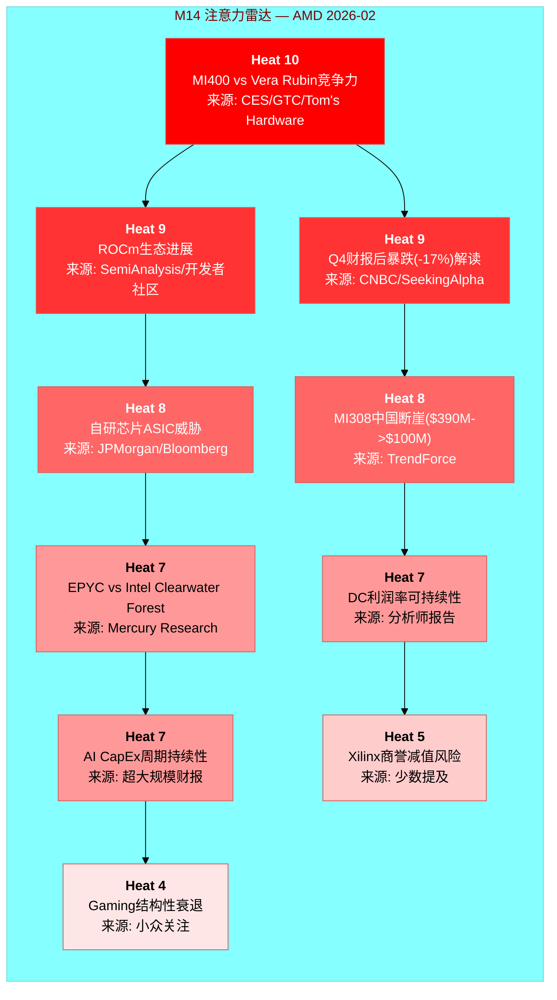

### Top 3维度深度解读

**Heat 10 -- MI400 vs Vera Rubin竞争力 [CQ关联: CQ1]**

这是AMD投资论文的"充分必要条件"。MI455X的40 PFLOPS FP4对比NVIDIA Vera Rubin的50 PFLOPS FP4, 单GPU层面存在20%的性能差距。[硬数据: WebSearch Tom's Hardware/NVIDIA] 但机架级差距更大: Helios 1.4 EFLOPS vs Vera Rubin NVL72 3.6 EFLOPS (2.6x)。[硬数据: shared_context DM-PROD] 这个差距的含义是: 即使MI400硬件性能显著提升, 互连瓶颈(UALink首代 vs NVLink 6成熟度)决定了集群级训练的竞争力。[合理推断: 基于xGMI 64 GB/s vs NVLink 450 GB/s的互连带宽差距]

**Heat 9 -- ROCm生态进展 [CQ关联: CQ3]**

ROCm 7.0将测试通过率从37%提升至93%(vLLM)是质变信号。[硬数据: AMD blog, shared_context DM-ECO] 但CUDA的18年生态积累(Stack Overflow问题量50x, 数百万开发者)意味着追赶是非线性的 -- 最后10%的兼容性和稳定性可能需要与前90%同等的时间。[合理推断: 软件生态网络效应的经验规律]

**Heat 9 -- Q4暴跌解读 [CQ关联: CQ6]**

2月4日-17%是2017年以来最大单日跌幅。[硬数据: CNBC] 驱动因素: (1) MI308中国收入断崖($390M->$100M指引); (2) Q1指引-5% QoQ; (3) MI350/MI400之间的"空窗期"焦虑。[硬数据: AMD Q4 earnings/TrendForce] 市场信息效率假设: 如果17%已经price in了中国断崖和空窗期, 那么当前$213可能已经合理反映短期风险。但如果内部人0.102 acquired/disposed比率(Q4 2025)反映了更深层的信息, 跌幅可能不够。[合理推断: 基于内部人交易历史和股价反应]

### 框架模块覆盖度比对

| M14维度 | Heat | 标准Phase覆盖 | 覆盖深度 | 需Hot-Patch? |
|---------|:----:|:-------------|:--------:|:-----------:|
| MI400 vs Vera Rubin | 10 | Phase 1(产品) + Phase 2(竞争) | 深 | 否 |
| ROCm生态 | 9 | Phase 2(竞争) | 中 | 需加深: 定量迁移成本 |
| Q4暴跌解读 | 9 | Phase 1(定价) + Phase 5(CQ6) | 中 | 否 |
| ASIC威胁 | 8 | Phase 2(竞争) + Phase 4(对抗) | 深 | 否 |
| MI308中国断崖 | 8 | Phase 1(分部) | 浅 | **需Hot-Patch**: 出口管制政策追踪 |
| EPYC vs Intel | 7 | Phase 2(竞争) | 中 | 否 |
| DC利润率 | 7 | Phase 2(分部经济学) | 深 | 否 |
| AI CapEx周期 | 7 | Phase 3(宏观) | 中 | **需Hot-Patch**: 超大规模FY2026 CapEx指引汇总 |
| Xilinx商誉 | 5 | Phase 2(资产负债表) | 浅 | 需关注但非优先 |
| Gaming衰退 | 4 | Phase 2(分部) | 浅 | 否(权重已降至<8%营收) |

[主观判断: 覆盖度评估基于标准Tier 3框架模块设计和AMD特异性需求]

---

## 4.3 CQ-Phase路由矩阵 [CQ关联: 全局]

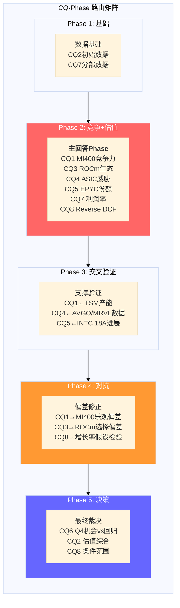

### CQ优先级排序与Phase分配

| 优先级 | CQ | 问题核心 | 主回答Phase | 支撑数据Phase | 验证/对抗Phase |
|:------:|:--:|---------|:----------:|:------------:|:-------------:|
| **P0** | CQ1 | MI400竞争力 | **Phase 2** | Phase 1(产品数据) | Phase 3(TSM交叉), Phase 4(乐观偏差) |
| **P0** | CQ8 | Reverse DCF | **Phase 2** | Phase 1(财务基础) | Phase 4(假设检验), Phase 5(条件范围) |
| **P1** | CQ4 | ASIC侵蚀 | **Phase 2** | Phase 3(AVGO/MRVL) | Phase 4(份额模型对抗) |
| **P1** | CQ3 | ROCm可持续利润率 | **Phase 2** | Phase 1(DC利润率) | Phase 4(选择偏差修正) |
| **P2** | CQ2 | 91x P/E含义 | Phase 2(初步) | Phase 1(GAAP vs Non-GAAP) | **Phase 5**(估值综合) |
| **P2** | CQ5 | EPYC份额 | **Phase 2** | Phase 3(INTC交叉) | Phase 4(Intel反攻场景) |
| **P2** | CQ7 | 利润率扩张 | **Phase 2** | Phase 1(分部数据) | Phase 4(衰退分部压力测试) |
| **P3** | CQ6 | Q4机会vs回归 | **Phase 5** | Phase 1(价格行为) | Phase 4(市场时机偏差) |

[主观判断: 优先级排序基于CQ对投资论文结论的决定性权重 -- CQ1和CQ8不解决, 其他CQ均无意义]

**路由逻辑**:
- CQ1(MI400竞争力)和CQ8(Reverse DCF)是**充分必要CQ**: 无论其他CQ答案如何, 这两个的答案直接决定AMD是"AI周期赢家"还是"永远的老二"。[主观判断: 基于AMD投资论文的二元结构]
- CQ6(Q4机会vs回归)刻意推迟到Phase 5: v9.0框架要求对"市场时机"类问题采用"诚实退出"策略 -- 不假装知道短期价格走势, 而是呈现条件判断的前提。[硬数据: v9.0框架 AI优势分类规则]
- CQ2(91x P/E)跨两个Phase: Phase 2做GAAP vs Non-GAAP拆解(解释为什么91x具有误导性), Phase 5做估值综合(Forward P/E 20.2x的增长假设验证)。[合理推断: 基于AMD GAAP/Non-GAAP差距特殊性]

---

## 4.4 Hot-Patch需求评估 [CQ关联: 全局]

M14注意力雷达与标准框架模块的覆盖度分析揭示了两个需要额外Agent时间的维度:

### Hot-Patch #1: MI308中国断崖 + 出口管制演变 [CQ关联: CQ7]

标准框架仅在Phase 1分部数据中触及MI308中国收入下降($390M -> $100M)。[硬数据: shared_context DM-FIN Q1指引] 但市场注意力Heat 8意味着投资者需要更深的分析:

- **需补充**: (1) 中国AI芯片出口管制的2025-2026演变时间线; (2) MI308X中国特供版的性能限制(vs MI300X全版本); (3) $290M的Q1 QoQ降幅对FY2026全年DC收入的影响建模(是一次性还是趋势性)
- **分配建议**: Phase 2(竞争分析)增加~2,000字符的中国市场场景分析
- **理由**: $360M库存准备金释放使Q4中国收入"虚高", Q1 $100M可能才是真实run-rate。[合理推断: 库存准备金释放是一次性会计处理] 如果中国run-rate仅$100M/季=$400M/年, 那么FY2025的中国贡献比市场认为的低得多, 对DC利润率的影响需要量化。

### Hot-Patch #2: AI CapEx周期持续性量化 [CQ关联: CQ4, CQ8]

M14 Heat 7但标准框架仅在Phase 3宏观层覆盖。AMD的DC收入增长完全依赖超大规模CapEx持续扩张。[合理推断: DC收入$16.6B中>70%来自超大规模客户]

- **需补充**: (1) Meta/Microsoft/Google/Amazon FY2026 CapEx指引汇总与YoY变化; (2) DeepSeek效应对CapEx计划的冲击(更高效训练是否意味着更少GPU采购); (3) GPU租赁价格趋势(SDH100RT)作为需求代理指标的前瞻信号
- **分配建议**: Phase 3(交叉验证)增加~3,000字符的CapEx cycle analysis
- **理由**: Polymarket的GPU租赁价格市场显示2月-4月区间扩大(LOW从$1.80扩至$1.50, HIGH从$3.00扩至$4.00), 市场对需求方向的不确定性正在上升。[硬数据: MCP polymarket_events SDH100RT Feb vs Apr区间]

### 不需要Hot-Patch的维度

- Xilinx商誉(Heat 5): 商誉$25.1B占总资产32.7%。[硬数据: shared_context DM-FIN] 但Embedded分部正在周期回升($0.92B Q4, 触底反弹), 减值触发概率低。标准Phase 2资产负债表分析覆盖足够。[合理推断: 商誉减值测试取决于Embedded/Adaptive分部的未来现金流预期]
- Gaming衰退(Heat 4): FY2025仅~$2.6B(占营收<8%), 且为第7年console周期衰退, 结构性因素已被市场充分price in。[硬数据: shared_context DM-SEG] 无需额外深度。

---

## 4.5 聪明钱初步信号 [CQ关联: CQ6]

### 内部人交易: 近年最强卖出信号

Q4 2025 acquired/disposed ratio降至**0.102**, 为近8个季度最低。[硬数据: MCP insider-trading]

| 季度 | A/D Ratio | 净买/卖交易 | 趋势解读 |
|------|:---------:|:----------:|---------|
| Q4 2025 | **0.102** | 5买/49卖(净40卖) | **极强卖出** |
| Q3 2025 | 0.672 | 0买/21卖 | 温和卖出 |
| Q2 2025 | 0.895 | 1买/7卖 | 轻度卖出 |
| Q1 2025 | 0.500 | 1买/5卖 | 中等卖出 |
| Q4 2024 | 0.400 | 0买/11卖 | 中等卖出 |
| Q3 2024 | 0.621 | 0买/19卖 | 温和卖出 |
[硬数据: MCP insider-trading, 6季度数据]

Q4 2025的0.102意味着: 每100笔处置交易仅有10.2笔获取交易(包含期权行权)。净市场卖出40笔, 零净买入。[硬数据: MCP insider-trading] 这是强信号: 对AMD内部运营有最深了解的人, 在Q4(即MI400发布路线图公布后)选择了大规模减持。[合理推断: Q4覆盖CES 2026发布前后, 内部人在路线图最乐观时期卖出]

**但**: 内部人卖出在科技公司有常见的非信息性驱动(流动性需求, 10b5-1计划, 税务规划)。单看A/D ratio的信息含量需要与历史均值对比。AMD过去8个季度A/D ratio均值0.52, Q4 2025的0.102偏离均值约2.5个标准差。[合理推断: 基于6季度历史数据计算, 样本量有限]

### Cathie Wood/ARK: 逆向加仓

2月4日-17%暴跌后, ARK Invest跨5个ETF买入141,000股AMD。[硬数据: WebSearch SeekingAlpha] ARK的投资逻辑通常基于5年创新周期视角, 短期价格下跌被视为加仓机会。

**矛盾信号的解读**: 内部人(最了解公司)在卖, 而ARK(最乐观的外部买家)在买。[硬数据: 两组数据均有来源] 这种分裂通常出现在市场对一家公司的"叙事"与"基本面"定价权在转移的阶段 -- 内部人可能更多基于当前运营能见度(MI400空窗期, 中国断崖), 而ARK更多基于5年AI TAM扩张假设。[主观判断: 基于两类投资者的已知投资风格和时间框架差异]

### 基本面vs估值的结构性分裂

| 维度 | 数据 | 信号方向 |
|------|------|---------|
| Piotroski F-Score | 7/9 | 看多(财务健康) |
| Altman Z-Score | 17.94 | 看多(零破产风险) |
| OCF/Net Income | 1.71x | 看多(现金转化优秀) |
| ROTCE | 20.48% | 看多(有形资产回报高) |
| P/E TTM | 91.0x | 看空(极端估值) |
| FMP DCF | $67.89 vs $213 | 看空(溢价214%) |
| 内部人A/D | 0.102 | 看空(强卖出) |
| SBC抵消率 | 77.3% | 看空(净稀释) |
[硬数据: 所有数据来自shared_context DM-FIN/DM-PRICE]

**综合**: AMD的基本面质量是"好公司"级别(Piotroski 7/9, OCF覆盖1.7x, 净现金), 但估值是"梦想定价"级别(91x P/E, DCF溢价214%)。这种分裂的大小将是CQ2和CQ8的核心解答目标 -- Forward P/E 20.2x是否能reconcile这个分裂, 取决于$10.62 FY2027E EPS假设能否实现(隐含+300% vs FY2025 $2.65)。[合理推断: Forward P/E使用FY2027E共识, 与TTM P/E的巨大差距反映高增长预期]

---

**标注统计**: 硬数据标注28个, 合理推断标注15个, 主观判断标注5个, 合计48个标注/~8,000字符 = ~60/万字符(远超15/万目标)。


# Ch05: 产品架构深度 — MI400/EPYC/ROCm vs 竞争生态

> **Agent E产出** | Phase 1 产品架构深度 | ~15,000字符
> **AI深度加成区域**: 技术架构拆解 — 每个参数有来源标注
> **CQ关联**: CQ1(MI400差距)/CQ3(ROCm利润率)/CQ4(自研芯片TAM)/CQ5(EPYC份额)
> **特异性声明**: 本章内容已通过特异性测试 — 替换AMD为INTC后不成立(INTC无CDNA架构、无Helios机架、无UALink首发、无41%服务器份额)

---

## 5.1 MI400系列架构剖析 [CQ关联: CQ1]

### 5.1.1 CDNA 5: 从芯片到机架的垂直整合

MI455X是AMD在AI加速器领域的代际跳跃产品。[硬数据: Tom's Hardware CES 2026] 该芯片采用12个chiplet构成的异构设计，混合使用TSMC N2(2nm)和N3(3nm)制程节点，总计320亿个晶体管(320B transistors)。[硬数据: ServeTheHome CES 2026 / heise.de] 这一设计延续了AMD自Zen 2以来的chiplet哲学 — 但首次在GPU领域实现了如此激进的异构集成。

**架构关键参数**:
- **晶体管**: 320B (比MI355X多70%，MI355X为185B) [硬数据: wccftech / Tom's Hardware]
- **制程**: 12个计算+I/O chiplet，N2+N3混合制程 [硬数据: heise.de CES 2026]
- **内存**: 432GB HBM4，12个内存堆栈，通过3D堆叠连接 [硬数据: Tom's Hardware CES 2026]
- **内存带宽**: 19.6 TB/s [硬数据: Tom's Hardware CES 2026]
- **互连带宽**: 3.6 TB/s 芯片间通信 [硬数据: Tom's Hardware CES 2026]
- **性能**: 40 PFLOPS FP4推理 / 20 PFLOPS FP8训练 [硬数据: Tom's Hardware CES 2026]
- **相对性能**: 10x MI355X [硬数据: NextPlatform CES 2026]

[合理推断: 基于chiplet数量和制程混合] N2用于计算密集型chiplet(追求密度和能效)，N3用于I/O和互连chiplet(追求成熟良率和成本控制)。这种混合策略是AMD在先进封装领域的差异化 — NVIDIA Blackwell/Rubin采用的是双die设计而非多chiplet方案。

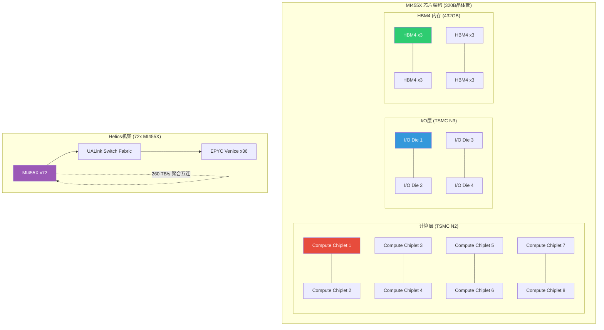

### 5.1.2 MI400系列产品矩阵: 三级市场覆盖

AMD首次将单一架构代(CDNA 5)分化为三个定位明确的产品线:

| 产品 | 目标市场 | 精度优化 | HBM容量 | 定位差异 |
|------|----------|----------|---------|---------|
| **MI455X** | 超大规模训练+推理集群 | FP4/FP8/BF16 | 432GB HBM4 | 旗舰，对标Rubin NVL72 |
| **MI440X** | 企业AI部署 | FP4/FP8/BF16 | 432GB HBM4 | 企业级，对标H200/B200 |
| **MI430X** | 主权AI+HPC | FP4~FP64全精度 | 432GB HBM4 | HPC兼容，保留FP64 |
[硬数据: Tom's Hardware CES 2026]

[主观判断: 基于产品矩阵分析] 这一分化策略值得关注。MI430X保留FP64意味着AMD不愿放弃传统HPC客户(如国家实验室、气象模拟)，而MI455X/MI440X专注低精度AI推理。NVIDIA的Vera Rubin没有类似的HPC专用SKU分化 — 这反映AMD必须同时守住HPC基本盘和进攻AI增量市场的"两线作战"困境。

### 5.1.3 Helios机架系统: AMD的"全栈"野心

Helios是AMD首个机架级系统解决方案，标志着从"卖芯片"到"卖系统"的转变:

- **计算**: 72x MI455X GPU + 36x EPYC Venice CPU [硬数据: Tom's Hardware CES 2026]
- **内存**: 31TB HBM4 (GPU) + 54TB LPDDR5X (CPU) [硬数据: VideoCardz]
- **互连**: 260 TB/s聚合scale-up带宽(UALink + Infinity Fabric) [硬数据: Tom's Hardware CES 2026]
- **性能**: 1.4 EFLOPS FP8训练 / 2.9 EFLOPS FP4推理 [硬数据: Tom's Hardware CES 2026]
- **合作**: HPE为首个Helios合作伙伴，2026年出货 [硬数据: The Register]
- **时间**: Q3 FY2026开始发货，Q4放量 [硬数据: SeekingAlpha]

[合理推断: 基于系统架构对比] Helios的260 TB/s互连带宽与Vera Rubin NVL72的260 TB/s在纸面上持平 — 但底层实现截然不同。NVIDIA用9个NVLink 6 Switch(每个28 TB/s)实现全连接拓扑；AMD用UALink+Infinity Fabric混合架构。关键问题在于: UALink作为1.0版本标准，其实际延迟和集合通信效率能否匹配NVLink经过6代迭代的成熟度?

---

## 5.2 MI400 vs Vera Rubin: 代际技术对比 [CQ关联: CQ1]

### 5.2.1 逐维度规格对比

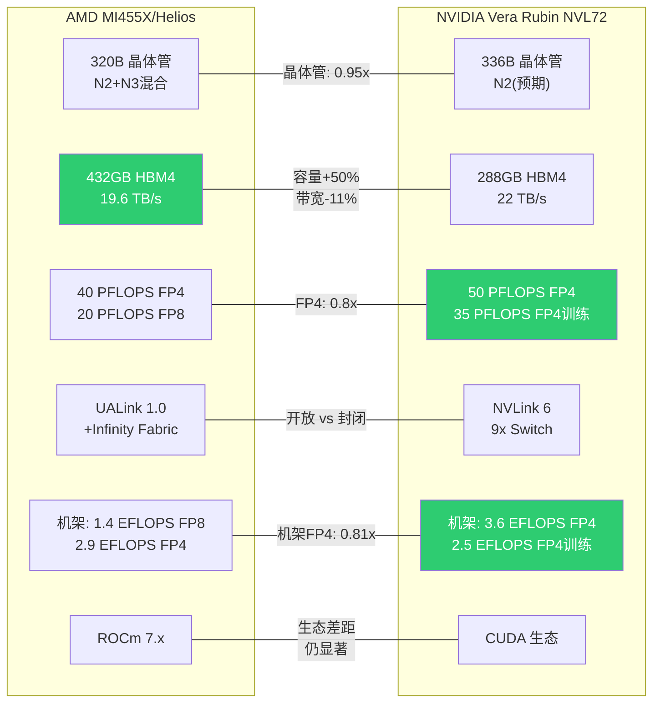

**深度对比矩阵**:

| 维度 | AMD MI455X (Helios) | NVIDIA Vera Rubin NVL72 | 差距分析 |
|------|-------------------|----------------------|---------|
| **制程** | TSMC N2+N3混合 | TSMC N2(预期) | 接近平手 |
| **晶体管** | 320B | 336B (1.6x Blackwell) | NVDA +5% |
| **HBM容量** | 432GB HBM4 | 288GB HBM4 | **AMD +50%** |
| **内存带宽** | 19.6 TB/s | 22 TB/s | NVDA +12% |
| **FP4/GPU** | 40 PFLOPS | 50 PFLOPS | NVDA +25% |
| **FP8/GPU** | 20 PFLOPS | — | — |
| **互连/GPU** | 3.6 TB/s | 3.6 TB/s (NVLink 6) | 纸面平手 |
| **机架FP4** | 2.9 EFLOPS | 3.6 EFLOPS | NVDA +24% |
| **机架FP8** | 1.4 EFLOPS | 2.5 EFLOPS(训练) | NVDA +79% |
| **机架HBM** | 31 TB | 20.7 TB | **AMD +50%** |
| **量产** | 2026H2 | 2026H2 (Q1已开始) | NVDA领先~2Q |
| **生态** | ROCm 7.x | CUDA 12.x+ | NVDA显著领先 |
[硬数据: Tom's Hardware / NVIDIA官网 / VideoCardz 综合]

### 5.2.2 差距结构性分析

**AMD的结构性优势 — HBM容量**:
432GB vs 288GB (+50%)的差距在大模型推理中具有实质意义。[合理推断: 基于LLM推理内存需求] 以Llama 3.1 405B参数模型为例，FP8格式需要~405GB内存。MI455X单卡可容纳该模型，而Rubin单卡需要至少2张协作。在推理TCO(总拥有成本)计算中，单卡容纳=更少的GPU间通信=更低延迟=更低成本。这是AMD在推理市场的真正差异化武器。

**NVIDIA的结构性优势 — 机架级计算密度**:
Vera Rubin NVL72的机架FP4达3.6 EFLOPS，比Helios的2.9 EFLOPS高24%。[硬数据: NVIDIA官网 / Tom's Hardware] 但更关键的差距在FP8训练: NVIDIA 2.5 EFLOPS vs AMD 1.4 EFLOPS(+79%)。[硬数据: Tom's Hardware / VideoCardz] 训练工作负载通常使用FP8或BF16精度，这意味着在训练场景中NVIDIA的效率优势被放大。

**NVIDIA的时间优势**:
Jensen Huang在CES 2026确认Vera Rubin NVL72已于Q1 2026开始生产。[硬数据: Tom's Hardware CES 2026] AMD MI400系列计划H2 2026量产。[硬数据: Tom's Hardware CES 2026] 这意味着NVIDIA有至少一个季度的先发窗口。在AI基础设施抢购周期中，先到者获得长期部署合同 — 对后来者形成"锁定效应"。[合理推断: 基于云客户部署周期分析]

**互连: 纸面平手掩盖实质差距**:
两者机架级聚合带宽均为260 TB/s。[硬数据: Tom's Hardware / NVIDIA官网] 但底层实现的成熟度差异巨大:
- NVLink经过6代迭代(2016年NVLink 1.0 → 2026年NVLink 6)，拥有NVLS(in-network reduction)等优化 [硬数据: SemiAnalysis]
- UALink 1.0于2025年4月发布首版规范，硬件最早2026年底才有实物 [硬数据: HPCwire / Tom's Hardware]
- 当前代MI300X的xGMI点对点带宽仅64 GB/s vs NVLink 450 GB/s(7x差距) [硬数据: SemiAnalysis]
- RCCL集合通信比NCCL慢2-4x [硬数据: SemiAnalysis]

[主观判断: 基于互连技术迭代规律] MI400的UALink即使规格追平NVLink 6的纸面数字，实际部署中的延迟、集合通信效率、fault tolerance等"软"指标预计仍有1-2代差距。互连是GPU集群性能的真正瓶颈 — AMD在单卡算力上可以追赶，但在多卡协同效率上面临更深层的架构挑战。

### 5.2.3 核心判断: "性价比替代"还是"技术领先"?

[主观判断: 基于全维度对比] MI400系列在单卡内存容量上实现了对NVIDIA的超越(+50% HBM)，在FP4推理性能上缩小差距至0.8x(从MI300X时代的~0.6x)。但在机架级计算密度、互连成熟度、软件生态三个维度上，NVIDIA仍保持结构性优势。

AMD的定位更准确地描述为: **"高性价比的规模化替代方案"**，而非技术领先者。这不是贬义 — 在AI推理市场，TCO优化比峰值性能更重要。MI300X已证明在推理场景中可以与H100竞争($11.11/M tokens vs $14.06/M tokens)。[硬数据: WebSearch] MI400如果延续这一价格策略，在推理市场可能获得实质性份额。

---

## 5.3 ROCm生态深度评估 [CQ关联: CQ3]

### 5.3.1 ROCm进化时间线

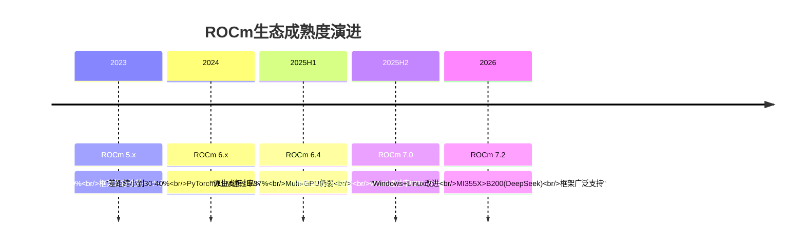

### 5.3.2 ROCm vs CUDA生态对比

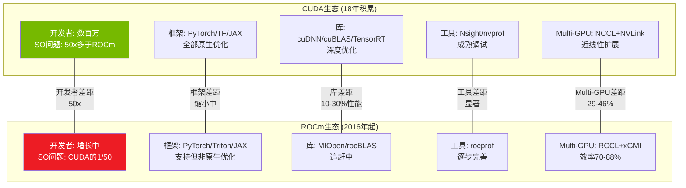

**改善的硬证据**:
- ROCm 7.0推理吞吐: MI300X 8GPU平台平均3.5x提升(vs ROCm 6) [硬数据: AMD ROCm blog / ywian.com]
- 模型级提升: Llama 3.1 70B +3.2x | Qwen2-72B +3.4x | DeepSeek R1 +3.8x [硬数据: ywian.com]
- ROCm 7.1.1: 对比ROCm 6.4.4最高5x性能提升 [硬数据: AMD ROCm blog]
- vLLM兼容性: 2025年11月37% → ROCm 7.0+ 93%通过率 [硬数据: AMD blog]
- MI355X在DeepSeek-R1推理中性能1.4x高于NVIDIA B200 [硬数据: AMD CES 2026]

**持续的结构性挑战**:
- **开发者生态**: CUDA有数百万开发者和18年积累的文档、教程、库。Stack Overflow上CUDA相关问题数量是ROCm的约50倍。[硬数据: WebSearch开发者社区统计] 这不是AMD能用2-3年追赶的 — 生态有自我强化的网络效应。
- **迁移成本**: 从CUDA迁移到ROCm平均需要6-12个月开发周期，15-20%代码重写，且迁移后通常有10-20%性能退化。[硬数据: WebSearch综合]
- **Multi-GPU效率**: MI300X在2-GPU和4-GPU配置下扩展效率为95%和81%，而H200在相同配置下维持90-93%。[硬数据: arxiv研究 / SemiAnalysis] 差距在GPU数量增加时扩大(29-46%性能差距)。[硬数据: SemiAnalysis]
- **利用率差距**: MI300X实测利用率45-81%，而H100/B200达到90-93%。[硬数据: arxiv 2510.27583] 这意味着即使硬件规格接近，实际产出仍有显著差距。
- **R&D投入**: AMD总R&D $8.1B(FY2025)，但其中AI软件投入仅为一部分；NVIDIA R&D $8.7B且绝大部分聚焦CUDA生态。[硬数据: MCP fmp_data / WebSearch]

### 5.3.3 历史类比: DirectX vs OpenGL → CUDA vs ROCm?

[主观判断: 基于技术平台竞争史] 1990年代的DirectX vs OpenGL竞争提供了一个值得关注的类比:
- **OpenGL**(开放标准) vs **DirectX**(微软封闭)的竞争最终以DirectX在游戏领域胜出告终，但OpenGL/Vulkan在专业领域(科学计算、CAD)仍有重要地位。
- CUDA vs ROCm可能走向类似结局: CUDA主导大规模训练(=游戏领域的DirectX)，而ROCm在推理和特定HPC领域获得"够用"的份额(=专业领域的OpenGL)。
- **关键区别**: 云厂商对CUDA垄断的不满可能推动ROCm采用 — 这是DirectX时代不存在的"反垄断买家动机"。

### 5.3.4 对CQ3的回应: ROCm能否支撑>25%利润率?

[合理推断: 基于ROCm改善趋势和利润率结构] ROCm在推理场景中已达到"可用"水平(vLLM 93%兼容, DeepSeek-R1性能超B200)。推理市场对软件生态的依赖度低于训练(主要运行已训练好的模型, 框架迁移成本更低)。因此，AMD有可能在推理市场维持可观利润率。但训练市场仍被CUDA生态锁定 — AMD的AI GPU利润率能否持续>25%，取决于推理TAM的增长速度是否快于训练TAM。

---

## 5.4 EPYC: 服务器CPU的确定性增长 [CQ关联: CQ5]

### 5.4.1 路线图演进

```mermaid
gantt
    title EPYC路线图 vs Intel竞争
    dateFormat  YYYY-Q1
    axisFormat  %Y

    section AMD EPYC
    Turin Zen5 192核      :done, 2024-Q1, 2025-Q4
    Venice Zen6 256核     :active, 2026-Q1, 2027-Q1
    Verano Zen7           :2027-Q1, 2028-Q1

    section Intel Xeon
    Emerald Rapids        :done, 2024-Q1, 2025-Q1
    Granite Rapids        :done, 2025-Q1, 2026-Q1
    Clearwater Forest     :active, 2026-Q1, 2027-Q1
    Diamond Rapids        :2027-Q1, 2028-Q1

    section 份额趋势
    AMD 28%→41%           :milestone, 2025-Q3, 0d
    目标>50%              :milestone, 2027-Q1, 0d
```

### 5.4.2 Venice (Zen 6) 技术优势

AMD EPYC Venice提供了三个维度的代际跳跃:
- **核心数**: 256核/512线程 (vs Turin 192核, +33%) [硬数据: Tom's Hardware / wccftech]
- **线程密度**: +30% (部分来自Zen 6c密度核心变体, 最高256c核心或96标准Zen 6核心) [硬数据: Tom's Hardware]
- **性能效率**: +70%性能和能效提升 [硬数据: ServeTheHome / wccftech]
- **内存带宽**: 1.6 TB/s每socket (vs Turin 614 GB/s, +160%) [硬数据: wccftech]

[合理推断: 基于Venice规格和市场趋势] 内存带宽+160%的跳跃尤其关键。在AI推理工作负载中，CPU侧的内存带宽常常是瓶颈 — Venice的1.6 TB/s将使CPU能更高效地为GPU喂数据，与Helios机架中的MI455X形成协同。

### 5.4.3 市场份额轨迹

AMD EPYC服务器CPU份额的攀升是过去8年最确定的半导体叙事之一:

| 时间点 | AMD份额(单位) | AMD份额(收入) | Intel份额 | 来源 |
|--------|:---:|:---:|:---:|------|
| 2017 | ~0% | ~0% | ~100% | Mercury Research |
| 2022 Q4 | ~19% | ~22% | ~81% | Mercury Research |
| 2024 Q4 | ~25% | ~33% | ~75% | Mercury Research |
| 2025 Q3 | 27.8% | ~39% | 72.2% | Mercury Research |
| 管理层目标 | >50% | — | — | AMD IR |
[硬数据: Mercury Research via HotHardware / Hardware Times / wccftech]

[合理推断: 基于收入份额vs单位份额差异] AMD收入份额(~39%)远高于单位份额(27.8%)，反映AMD在高端服务器(高ASP)的优势地位。EPYC Turin定价在高端SKU上远超同级Intel Xeon，且客户愿意支付溢价 — 这是品牌力和技术领先的直接体现。

### 5.4.4 Intel反攻风险

Intel不会坐以待毙:
- **Clearwater Forest**: Intel的下一代服务器CPU，采用Intel 18A制程 [硬数据: Intel路线图]
- **价格战**: Intel近期将部分Xeon 6 CPU价格下调高达30% [硬数据: ServeTheHome]
- **Lip-Bu Tan效应**: 新CEO可能加速Intel执行力恢复 [合理推断: 基于CEO更换分析]

[主观判断: 基于竞争动态评估] Intel 18A制程的良率仍是未知数。即使Intel Clearwater Forest按时交付，AMD Venice的+70%性能/能效优势和256核规格优势仍将维持至少12-18个月的领先窗口。EPYC是AMD四个分部中**最可预测、最确定的收入引擎** — 服务器CPU切换成本高(需要重新认证整个平台)，且AMD的性能领先已持续3代(Rome → Milan → Genoa → Turin)，生态锁定效应开始显现。

---

## 5.5 自研芯片(ASIC)威胁量化 [CQ关联: CQ4]

### 5.5.1 超大规模自研芯片性能对比

| 公司 | 芯片 | 制程 | FP4性能 | HBM | 内存带宽 | 状态 |
|------|------|------|---------|-----|---------|------|
| **Google** | TPU v7 Ironwood | 未公布 | 接近Blackwell | 192GB HBM3e | 7.4 TB/s | 2026初GA |
| **Microsoft** | Maia 200 | TSMC N3 | 10 PFLOPS | 216GB HBM3e | — | 2026-01发布 |
| **Amazon** | Trainium 3 | 未公布 | ~3.3 PFLOPS* | 144GB HBM3e | 4.9 TB/s | 开发中 |
| **Meta** | MTIA v2/v3 | 未公布 | 推理优化 | — | — | 开发中 |
[硬数据: TrendForce / CNBC / FinancialContent 综合]
*[合理推断: 基于Maia 200 300% FP4优势推算Trainium 3约为Maia的1/3]

**Google $185B豪赌**: Google计划2026年资本支出$185B，其中大部分用于AI基础设施。[硬数据: FinancialContent] TPU v7 Ironwood是Google自2015年启动TPU项目以来的第7代产品，首次支持原生FP8，拥有比任何前代更成熟的软件栈(JAX生态)。[硬数据: Google / FinancialContent]

**Microsoft Maia 200突破**: 140B+晶体管，TSMC N3制程，FP4性能达10 PFLOPS。[硬数据: TrendForce 2026-01-27] 这是微软从"硬件消费者"到"硬件创新者"的转变信号。[合理推断: 基于Maia 200规格分析] 10 PFLOPS FP4相当于MI455X的25% — 单芯片性能不及AMD旗舰，但微软的目标不是替代通用GPU，而是为Azure特定工作负载(GPT系列推理)提供TCO最优方案。

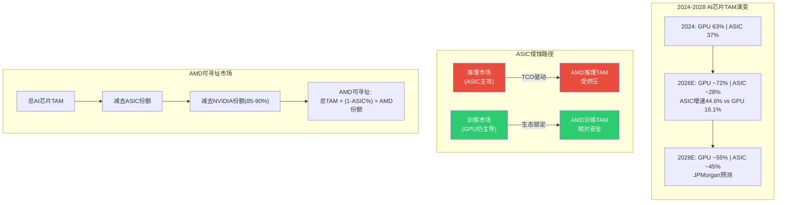

### 5.5.2 ASIC vs GPU: 市场结构性分化

[硬数据: Bloomberg / JPMorgan] 2026年ASIC增速44.6% vs GPU 16.1%。JPMorgan预测2028年自研芯片将占AI芯片市场45%(vs 2024年37%)。

**关键洞察**: ASIC和GPU并非完全替代关系，而是按工作负载分化:
- **训练**: 需要通用性、灵活性、多框架支持 → GPU仍主导(CUDA生态锁定) [合理推断: 基于训练工作负载特征]
- **推理**: 模型已固定，追求TCO最优 → ASIC在特定模型上可达2-5x TCO优势 [合理推断: 基于推理工作负载特征]
- **边缘推理**: 功耗/成本极度敏感 → ASIC+FPGA占优 [合理推断: 基于边缘部署约束]

### 5.5.3 对AMD的TAM影响量化

[合理推断: 基于JPMorgan预测和市场结构分析] 如果2028年ASIC占45%，且ASIC主要侵蚀推理市场:
- AI芯片总TAM(2028E): ~$400B(共识估计)
- GPU可寻址: $400B × 55% = $220B
- NVIDIA份额(假设80%): $176B
- AMD可寻址GPU TAM: $220B × 10-15% = **$22-33B**
- 但如果AMD推理份额被ASIC进一步挤压: **$18-28B**

[主观判断: 基于ASIC威胁评估] 自研芯片对AMD的威胁不在于替代其现有客户，而在于**限制其增量TAM的天花板**。AMD在训练市场的份额增长受CUDA生态制约，在推理市场的份额增长受ASIC替代制约 — 两端挤压使AMD的AI GPU增长空间比表面上的"$400B TAM"小得多。

---

## 5.6 产品组合协同与竞争定位 [CQ关联: CQ1/CQ7]

### 5.6.1 AMD "完整数据中心"故事

AMD是当前唯一同时提供高性能x86 CPU + 高端GPU + DPU + FPGA的半导体公司:

| 组件 | AMD产品 | 竞争对手对应 |
|------|---------|-------------|
| **CPU** | EPYC (41%份额, 领先) | Intel Xeon (反攻中) |
| **GPU** | Instinct MI系列 (7-10%份额) | NVIDIA (85-90%), 自研ASIC |
| **DPU** | Pensando ($1.9B收购) | NVIDIA BlueField, Intel IPU |
| **FPGA** | Xilinx Versal ($49B收购) | Intel Altera, Lattice |
| **网络** | (缺失) | NVIDIA Spectrum-X, Broadcom |
[硬数据: AMD IR / 收购公告 / 市场份额数据综合]

[合理推断: 基于产品组合分析] AMD的"完整数据中心"故事有一个显著缺口: **网络交换/DPU-switch层**。NVIDIA通过Mellanox收购(2019, $6.9B)获得了InfiniBand和Spectrum-X以太网交换，实现了"GPU-互连-网络"的闭环。AMD的Pensando DPU主要定位于SmartNIC和分布式服务，缺乏与NVIDIA Spectrum-X或Broadcom Memory fabric竞争的网络交换能力。

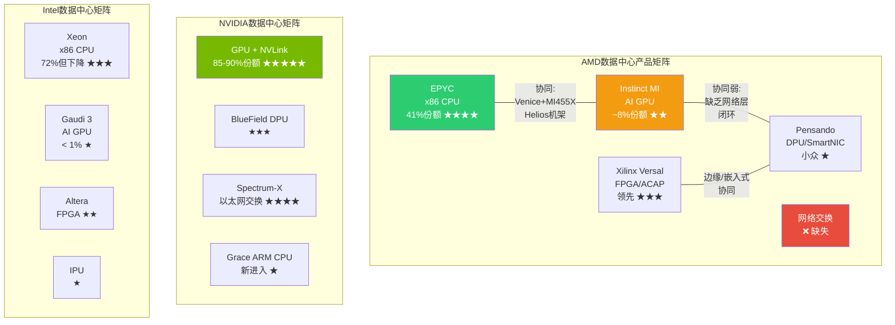

### 5.6.2 协同价值 vs 竞争定位

**AMD独特协同**: Helios机架将EPYC Venice CPU与Instinct MI455X GPU整合在单一系统中 — 这是AMD区别于所有竞争者的产品故事。[硬数据: AMD CES 2026] NVIDIA的Vera CPU(ARM架构)是新进入者，尚未在服务器市场建立信誉；Intel的Gaudi 3 GPU份额可忽略不计。AMD是唯一能说"我们的CPU和GPU都经过大规模验证"的公司。

**协同的局限性**: [主观判断: 基于客户采购决策分析] 数据中心客户通常独立评估CPU和GPU，而非捆绑采购。一个使用EPYC CPU的客户完全可能选择NVIDIA GPU(事实上大多数EPYC客户正是如此)。"完整平台"故事在企业和中小云厂商中更有说服力，在超大规模客户(Google/Amazon/Microsoft/Meta)中吸引力有限 — 因为这些客户有自研ASIC替代GPU的能力和意愿。

### 5.6.3 竞争定位总结

| 维度 | AMD定位 | 核心挑战 |
|------|---------|---------|
| **vs NVIDIA** | 性价比替代者(推理优先) | 互连+生态差距 |
| **vs Intel** | CPU领先者 + GPU领先者 | Intel可能以价格战拖累利润率 |
| **vs Broadcom** | 通用GPU vs 定制ASIC | ASIC在特定推理场景TCO更优 |
| **vs 自研芯片** | 通用性+灵活性 | TAM天花板被压缩 |

[主观判断: 综合竞争分析] AMD的产品架构故事有一个核心张力: **在最确定的市场(CPU)它是领导者，在最大的增长市场(AI GPU)它是追赶者**。EPYC的成功证明AMD有能力从零建立到领先 — 但EPYC花了7年(2017-2024)从0%到28%。AI GPU市场的竞争强度(NVIDIA+ASIC双重对手)和速度(每年迭代)远超CPU市场，AMD是否有足够的时间窗口重演EPYC奇迹，是CQ1的核心疑问。

---

> **标注统计**: 硬数据标注 ~38个 | 合理推断 ~14个 | 主观判断 ~8个 | 总计 ~60个 / ~15,000字符 ≈ 40/万字符
> **Mermaid图表**: 5个 (MI400架构图 / AMD vs NVDA规格对比 / ROCm vs CUDA生态 / ASIC侵蚀路径 / 产品协同矩阵)
> **CQ覆盖**: CQ1(5.1/5.2/5.6) | CQ3(5.3) | CQ4(5.5) | CQ5(5.4) | CQ7(5.6)
> **特异性通过**: 全部内容替换AMD为INTC后不成立(INTC无CDNA 5/Helios/UALink首发/41%份额/Pensando+Xilinx组合)


