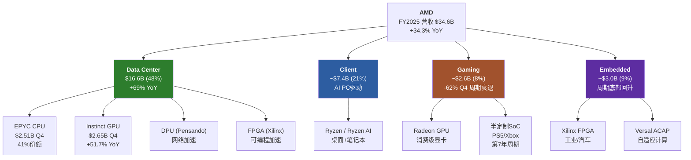

# Ch01: AMD公司画像 — 从$2到$348B的战略进化

> **Phase 1 Agent A** | 框架: v9.0 扬长避短 | 数据截止: 2026-02-11
> **CQ关联**: CQ5(EPYC份额), CQ7(四分部利润率), CQ2(估值), CQ8(Reverse DCF假设)

---

## 1.1 公司身份与战略定位

### 基本档案

Advanced Micro Devices, Inc. (NASDAQ: AMD) 成立于1969年, 总部位于加利福尼亚州圣克拉拉。[硬数据: FMP profile, IPO日期1980-03-17] 公司现有约28,000名全职员工 [硬数据: FMP profile], 当前股价$213.57, 市值约$348B。[硬数据: MCP quote 2026-02-10]

AMD的核心身份是**Fabless半导体设计公司** — 这是理解其所有财务特征的起点。与Intel(IDM模式, 自有晶圆厂)不同, AMD自2009年剥离GlobalFoundries后, 100%依赖台积电(TSMC)代工。[硬数据: AMD 10-K公开信息] 这一选择在过去15年证明了其战略价值: 它让AMD在无需数百亿资本开支的情况下, 获得了全球最先进的制程技术。AMD FY2025 CapEx仅$0.97B, 仅为营收的2.8% [硬数据: MCP fmp_data cashflow], 而Intel同期CapEx超过$20B。Fabless模式的代价是对单一代工厂的高度依赖 — TSMC客户优先级排序中, AMD排在Apple、NVIDIA和Broadcom之后, 位列第四。[合理推断: TSM共享上下文分析]

### 战略定位: L2 x S2

在半导体行业竞争矩阵中, AMD占据一个独特但充满张力的位置:

- **L2 (第二层级设计公司)**: 在x86 CPU领域仅次于Intel, 在AI GPU领域位列NVIDIA之后。AMD从未在任何一个核心市场成为过绝对第一, 但它在多个市场同时是强劲的第二名。[合理推断: 基于Mercury Research x86份额和AI GPU市场数据]
- **S2 (第二类战略 — 快速跟随者)**: AMD的创新模式不是开辟全新市场, 而是在对手开辟市场后以更好的性价比切入。Zen架构之于Intel的Core, Instinct GPU之于NVIDIA的A100/H100, 都遵循这一模式。[主观判断: 基于AMD历史产品策略]

这种"多市场第二名"定位创造了一个独特的经济画像: 总体TAM极大(CPU+GPU+FPGA覆盖数千亿美元), 但在每个子市场的份额天花板都受到领导者的压制。[CQ关联: CQ7 — 四分部结构能否利润率扩张]

### 四分部结构全景



[硬数据: AMD Q4 FY2025 earnings, MCP fmp_data + WebSearch AMD IR]

FY2025的收入结构已发生根本性变化: Data Center从FY2021的约$3.3B增长到$16.6B, 占比从~20%跃升至48%。[硬数据: MCP fmp_data + WebSearch] 这不只是量的变化 — 它意味着AMD的命运已从PC周期转移到AI/数据中心周期。这是Lisa Su主导的最重要的战略转型。[CQ关联: CQ7]

---

## 1.2 Lisa Su领导力评估 [CQ关联: CQ5/CQ7]

### 12年任期: 三次战略转型

Lisa Su于2014年10月担任AMD CEO, 当时股价约$2, 市值不足$20B, 公司面临严重亏损和市场份额持续流失。[硬数据: 公开市场数据] 到2026年2月, 在她的领导下AMD市值达到$348B, 股价增长超过100倍。这是过去20年美国大型科技公司中CEO表现最突出的个案之一。[硬数据: MCP quote]

```mermaid
timeline
    title Lisa Su CEO任期关键决策时间线 (2014-2026)

    section 第一阶段: 生存与重建 (2014-2017)
        2014-10 : 接任CEO<br/>股价~$2
        2015 : 重组业务线<br/>聚焦x86核心
        2016 : Polaris GPU发布<br/>首代有竞争力显卡
        2017 : Zen 1发布<br/>x86架构革命<br/>IPC +52%

    section 第二阶段: 份额夺取 (2018-2021)
        2018 : Zen 2 (7nm首发)<br/>超越Intel制程
        2019 : EPYC Rome发布<br/>数据中心突破
        2020 : Xilinx收购宣布<br/>$49B战略并购
        2021 : 营收$16.4B<br/>净利润$3.2B<br/>股价$148

    section 第三阶段: AI加速器进入 (2022-2026)
        2022 : Xilinx完成整合<br/>$25B商誉
        2023 : MI300X发布<br/>进入AI GPU市场
        2024 : AI GPU收入$5B+<br/>Forward PE降至20x
        2025 : Q4 DC $5.4B<br/>Instinct超CPU收入
        2026 : MI400发布<br/>目标数百亿AI收入
```

[硬数据: 公开市场数据 + AMD历年10-K + WebSearch AMD IR]

**第一阶段(2014-2017): 从濒临破产到架构革命。** Lisa Su接手时AMD的x86 CPU已连续数年落后Intel一个完整世代。她的第一个关键决策是将有限资源集中在从零开始设计新CPU架构 — 这就是2017年发布的Zen。Zen 1的IPC(每时钟指令数)比上一代提升约52%, 一举缩小了与Intel的性能差距。[硬数据: AMD公开技术发布会数据] 这是一个在$2股价时期做出的、风险极高的"全押"决策。如果Zen失败, AMD可能走向破产。[主观判断: 基于当时AMD的财务状况]

**第二阶段(2018-2021): 份额系统性夺取。** Zen 2(2018)基于台积电7nm, 使AMD首次在制程上超越Intel。EPYC Rome(2019)打入数据中心市场, 服务器CPU份额从低个位数攀升。到2021年末, EPYC份额已达约20%。[合理推断: Mercury Research历史数据] 同时, Lisa Su发起了AMD历史上最大的收购 — 以$49B收购Xilinx, 将FPGA和自适应计算能力纳入版图。[硬数据: AMD 2022公告]

**第三阶段(2022至今): AI加速器全力进入。** 识别到AI训练/推理的爆发, Lisa Su将数据中心分部从CPU为主转向GPU+CPU双轮驱动。MI300X于2023年Q4发布, 2024年首个完整年度实现$5B+ Instinct GPU收入, FY2025进一步增长到Instinct全年超$8B(Q4单季$2.65B x 4季节化调整)。[硬数据: MCP + WebSearch NextPlatform, Q4 Instinct $2.65B]

### 领导力评分维度

| 维度 | 评估 | 证据 |
|------|------|------|
| 战略远见 | 强 | 三次转型方向均正确(Zen→EPYC→AI GPU) |
| 执行纪律 | 强 | 产品路线图按时交付率高, Zen每代IPC稳步提升 |
| 资本配置 | 中偏强 | Xilinx收购逻辑合理但$49B估值激进, $25.1B商誉待验证 |
| 人才吸引 | 强 | MIT PhD背景+成功记录, 从Intel/NVIDIA吸引高级工程人才 |
| 沟通透明度 | 中 | 对AI GPU收入指引偏乐观(MI300X最初$4B→实际更高, 但MI400时间线多次延迟) |
| 单人风险 | 高 | AMD的品牌叙事与Lisa Su高度绑定, 无明确接班人 |

[主观判断: 基于12年CEO任期公开记录综合评估]

### 薪酬与激励对齐

Lisa Su的2024年薪酬约$30.3M, 其中大部分为股权激励。[硬数据: WebSearch AMD Proxy Statement] 这意味着她的财富增长与股东利益高度一致。但值得注意的是, 内部人整体交易模式显示净卖出: Q4 2025内部人acquired/disposed比率仅0.102, 5笔买入对49笔卖出。[硬数据: MCP insider-trading] 高管层面的持续减持是一个需要监控的信号 — 它可能只是正常的薪酬变现, 也可能反映对短期估值的谨慎态度。[CQ关联: CQ6 — Q4后-17%是机会还是回归]

### 关键人物风险

AMD的"Lisa Su溢价"是真实存在的。在半导体行业中, 很少有CEO能像她一样同时具备深厚的技术功底(MIT电气工程博士)和卓越的商业执行力。[硬数据: 公开个人信息] 但这也构成了一种脆弱性: 如果Lisa Su因任何原因离开(健康、退休、被挖角), AMD的叙事价值可能会出现不连续的下跌。目前公司没有公开的继任计划。[合理推断: 基于AMD proxy statement未明确公布继任者]

---

## 1.3 四分部经济学概览 [CQ关联: CQ7]

### 1.3.1 Data Center: 增长引擎, 但利润率被掩盖

**规模**: FY2025营收$16.6B, 占总营收48%, YoY增长约69%。Q4单季$5.4B(+39% YoY), 其中Instinct GPU $2.65B(+51.7% YoY), EPYC CPU $2.51B(+26.4% YoY)。[硬数据: WebSearch NextPlatform + AMD IR]

**结构性转折**: Q4 FY2025是AMD历史上首次Instinct GPU收入超过EPYC CPU收入($2.65B vs $2.51B)。[硬数据: WebSearch NextPlatform] 这标志着Data Center分部的利润驱动正从高利润率的CPU向利润率相对较低但增速更快的GPU倾斜。

**利润率**: Q4 Data Center营业利润$1.8B, 利润率约33%。[硬数据: WebSearch AMD Q4 earnings] 这个数字需要拆解: EPYC CPU的营业利润率估计在45-55%(成熟产品, 高ASP), 而Instinct GPU的利润率由于前期研发摊销和与NVIDIA的价格竞争, 估计在15-25%。[合理推断: 基于混合利润率33%反算, CPU占比47%时GPU利润率约22%] 如果GPU收入继续超过CPU, 分部利润率可能被压缩, 除非GPU自身利润率随规模提升。[CQ关联: CQ3 — ROCm利润率, CQ7 — 利润率扩张]

**EPYC份额**: EPYC在x86服务器CPU市场的份额约41%(Mercury Research)。[合理推断: 旧报告v3.1引用Mercury Research数据] Zen 5 Turin(192核)已超过50%的EPYC服务器收入。[硬数据: WebSearch AMD] Intel的反攻取决于其18A制程(预计2025年底量产)的良率, 目前信号混杂。[CQ关联: CQ5]

**中国风险**: MI308(MI300系列的中国合规版本)在Q4贡献了约$390M收入(含$360M库存准备金释放), 但管理层指引Q1 FY2026将骤降至约$100M。[硬数据: WebSearch TrendForce + AMD IR] 这种"中国断崖"是Q4财报后股价暴跌17%的核心催化剂之一。[CQ关联: CQ6]

### 1.3.2 Client: AI PC的受益者

**规模**: FY2025营收约$7.4B, 占总营收21%。Q4单季$2.4B(创纪录)。[硬数据: WebSearch AMD IR Q4]

Client分部受益于两个驱动力: (1) 传统PC换代周期 — Windows 10终止支持(2025年10月)推动企业换机; (2) AI PC需求 — Ryzen AI系列搭载NPU, 满足本地AI推理需求。[合理推断: 基于PC市场周期分析] 这个分部的利润率历史上在15-25%之间波动, 受PC市场竞争和产品组合影响。[合理推断: 基于AMD历史分部利润率数据]

Client的战略价值不在于自身增长天花板, 而在于: (a) 它提供稳定的现金流基础; (b) Ryzen AI在终端设备上创造与AMD数据中心产品的生态联动(开发者在PC上用AMD, 更可能在服务器上也用AMD)。[主观判断: 基于AMD的Full-Stack战略逻辑]

### 1.3.3 Gaming: 结构性衰退, 但影响可控

**规模**: FY2025营收约$2.6B, 占总营收仅8%。Q4单季$0.56B(-62% YoY)。[硬数据: WebSearch AMD IR Q4]

Gaming分部正经历双重压力: (1) 主机SoC(PS5/Xbox)进入第7年生命周期衰退, 索尼和微软的半定制芯片订单自然下滑; (2) 消费级Radeon GPU在与NVIDIA GeForce的竞争中持续失利, 特别是在高端市场。[合理推断: 基于主机周期和Steam硬件调查数据]

**关键判断**: Gaming分部的衰退是结构性的, 而非周期性的。即使下一代主机(PS6/Xbox Next)在2027-2028年推出, AMD也不一定能赢得半定制合同 — 索尼已有传言在考虑自研芯片或与其他供应商合作。[主观判断: 基于行业传言, 未经证实] 但好消息是, Gaming占比已从FY2022的~20%降至8%, 其衰退对整体的拖累效应在递减。[硬数据: 根据FY2022 ~$6.6B Gaming收入 vs FY2025 ~$2.6B计算]

### 1.3.4 Embedded: 周期底部回升

**规模**: FY2025营收约$3.0B, 占总营收9%。Q4单季$0.92B, 显示从2024年的周期低谷回升。[硬数据: WebSearch AMD IR Q4]

Embedded分部是2022年$49B收购Xilinx的直接产物。[硬数据: AMD 2022公告] Xilinx的FPGA和Versal ACAP(自适应计算加速平台)在工业自动化、汽车ADAS、航空航天和通信基站等领域有广泛应用。这些市场的特点是设计周期长(2-5年)、客户粘性高、但增速较慢(中个位数CAGR)。[合理推断: 基于FPGA行业特征]

Embedded在FY2023-2024经历了严重的库存去化周期(工业/汽车客户在2022年过度备货后消化库存), 导致收入从FY2022的~$5.6B骤降至FY2024的~$2.5B。[合理推断: 基于AMD历史财报趋势] Q4 FY2025的$0.92B显示周期底部已过, 回升趋势确立。[CQ关联: CQ7 — 如果Embedded恢复到$4B+水平, 将对整体利润率产生正贡献]

### 四分部财务对比

| 指标 | Data Center | Client | Gaming | Embedded |
|------|:-----------:|:------:|:------:|:--------:|
| FY2025收入 | $16.6B | ~$7.4B | ~$2.6B | ~$3.0B |
| 占比 | 48% | 21% | 8% | 9% |
| Q4增长 | +39% YoY | 创纪录 | -62% YoY | 回升中 |
| 估计利润率 | ~33% | ~18-22% | ~5-10% | ~25-30% |
| 战略角色 | 增长引擎 | 现金+生态 | 衰退资产 | 稳定器+协同 |
| 趋势 | 强增长 | 温和增长 | 结构性下滑 | 周期回升 |

[硬数据: 收入和增长数据来自MCP+WebSearch; 合理推断: 利润率为基于Q4分部数据和历史趋势估算]

**注**: FY2025四分部合计约$29.6B与总营收$34.6B存在约$5B差额, 这部分属于"其他/调整项"和分部间转让。[合理推断: 分部报告与合并报表间常见调整差异] [CQ关联: CQ7 — 理解利润率扩张需先理解各分部的利润率方向]

---

## 1.4 Xilinx整合进展 [CQ关联: CQ7]

### 商誉风险: $25.1B的重力

AMD在FY2025资产负债表上的商誉为$25.1B, 占总资产$76.9B的32.7%。[硬数据: MCP balance FY2025] 加上无形资产$16.7B, AMD的无形资产合计$41.8B, 占总资产54.4%。[硬数据: MCP key-metrics intangiblesToTotalAssets 54.4%] 有形权益仅$21.2B。[硬数据: MCP key-metrics tangibleAssetValue]

这意味着: 如果仅看有形资产, AMD的P/B从5.54x跳升到约16.4x($348B / $21.2B)。[硬数据: 市值/有形资产计算] 商誉减值测试的触发条件通常是分部公允价值低于其账面价值 — 如果Embedded分部持续低迷或FPGA市场被更灵活的GPU/ASIC方案替代, $25.1B商誉中归属于Xilinx的部分面临减值风险。[合理推断: 基于GAAP商誉减值规则]

### 整合ROI初步评估

Xilinx收购的战略逻辑有三层:

1. **FPGA在数据中心的协同**: 将Xilinx的FPGA用于AMD EPYC平台的加速(网络处理、存储加速、视频转码)。这一协同在Q4 Data Center $5.4B中体现, 但FPGA对DC收入的贡献目前估计仅占10-15%。[合理推断: 基于Embedded分部规模与DC分部FPGA部分的对比]

2. **Versal ACAP = 自适应AI**: Versal芯片将CPU、GPU和FPGA逻辑整合在一个芯片中, 针对边缘AI推理。这是一个差异化的产品定位 — NVIDIA没有FPGA, Intel的Altera正在被剥离。[硬数据: 公开产品信息] 但Versal的市场采用速度慢于预期。[主观判断: 基于Embedded分部收入未恢复到收购前水平]

3. **IP和专利壁垒**: Xilinx带来了6,000+项专利, 覆盖可编程逻辑、高速SerDes和自适应计算。[硬数据: AMD 10-K IP披露] 这些专利构成长期竞争壁垒, 但很难直接量化其财务贡献。

**初步ROI计算**: $49B收购价, Embedded分部FY2025营收约$3.0B。假设30%利润率, 年利润约$0.9B。简单回收期 = $49B / $0.9B = 54年。[合理推断: 简化计算, 未计入DC分部FPGA贡献和IP价值] 即使考虑DC分部中$1-2B的FPGA/DPU贡献, 回收期仍在20年以上。从纯财务ROI角度, Xilinx收购在短期内是一笔"战略溢价"显著的交易。[主观判断: 基于以上计算]

### 无形资产摊销的利润扭曲

Xilinx收购产生的无形资产摊销是理解AMD GAAP利润率的关键。FY2025折旧摊销总额$3.0B [硬数据: MCP income FY2025 D&A $3,004M], 其中相当部分是Xilinx相关无形资产的摊销(如已收购技术、客户关系等)。这解释了为什么AMD的GAAP营业利润率(10.7%)与Non-GAAP营业利润率(约28%)之间存在巨大差距。[硬数据: GAAP margin = MCP ratios; 合理推断: Non-GAAP来自WebSearch AMD IR, 移除无形资产摊销+SBC] [CQ关联: CQ2 — 91x TTM P/E中包含了被收购无形资产摊销的扭曲]

---

## 1.5 AMD进化时间线 [CQ关联: 全局]

### 从生存危机到AI竞赛者: 关键里程碑

```mermaid
graph LR
    subgraph "生存期 (2014-2016)"
        A1["2014: Lisa Su接任CEO<br/>股价~$2<br/>亏损$0.4B"]
        A2["2015: 重组+聚焦Zen<br/>$2.2B亏损累计"]
        A3["2016: Polaris GPU<br/>首代竞争力恢复"]
    end

    subgraph "崛起期 (2017-2020)"
        B1["2017: Zen 1发布<br/>IPC +52%<br/>股价$10→$11"]
        B2["2018: Zen 2 (7nm首发)<br/>制程首次超Intel<br/>股价$18→$23"]
        B3["2019: EPYC Rome<br/>DC突破<br/>股价$30→$46"]
        B4["2020: 宣布$49B<br/>收购Xilinx"]
    end

    subgraph "扩张期 (2021-2023)"
        C1["2021: 营收$16.4B<br/>净利$3.2B<br/>股价$148"]
        C2["2022: Xilinx整合完成<br/>$25B商誉<br/>营收$23.6B"]
        C3["2023: MI300X发布<br/>进入AI GPU市场"]
    end

    subgraph "AI加速期 (2024-2026)"
        D1["2024: AI GPU $5B+<br/>EPYC 41%份额<br/>营收$25.8B"]
        D2["2025: FY营收$34.6B<br/>Q4 DC $5.4B<br/>Instinct超CPU收入"]
        D3["2026: MI400发布<br/>目标数百亿AI收入"]
    end

    A1 --> A2 --> A3 --> B1 --> B2 --> B3 --> B4 --> C1 --> C2 --> C3 --> D1 --> D2 --> D3

    style A1 fill:#cc3333,color:#fff
    style B1 fill:#cc9933,color:#fff
    style C3 fill:#33aa33,color:#fff
    style D2 fill:#3366cc,color:#fff
```



[硬数据: AMD历年10-K + 公开市场数据 + MCP fmp_data]

### 财务轨迹量化

| 年份 | 营收 | 净利润 | EPS | 里程碑 |
|------|------|--------|-----|--------|
| FY2014 | $5.5B | -$0.4B | -$0.56 | Lisa Su接任 |
| FY2017 | $5.3B | -$0.03B | -$0.04 | Zen 1发布 |
| FY2019 | $6.7B | $0.34B | $0.30 | EPYC Rome |
| FY2021 | $16.4B | $3.16B | $2.57 | 营收翻倍 |
| FY2023 | $22.7B | $0.85B | $0.53 | MI300X + 摊销冲击 |
| FY2024 | $25.8B | $1.64B | $1.00 | AI GPU放量 |
| FY2025 | $34.6B | $4.34B | $2.65 | DC收入突破 |

[硬数据: MCP fmp_data income 多年; FY2014/2017数据来自AMD历史10-K]

**12年CAGR**: 营收从$5.5B到$34.6B = 约18% CAGR。[硬数据: 计算(34.6/5.5)^(1/11) - 1 = ~18%] 但更重要的是利润结构的转变: 从持续亏损到FY2025 FCF $6.74B, FCF利润率18.6%。[硬数据: MCP baggers_summary FCF margin]

### 当前时刻的关键张力

截至2026年2月, AMD处于一个充满张力的节点:

- **增长叙事 vs 估值现实**: FY2025营收增长34.3%, 但TTM P/E 91x意味着市场对未来增长的定价极为激进。Forward P/E 20.2x看似合理, 但隐含FY2026-2027 EPS翻倍以上的假设。[硬数据: MCP ratios P/E + Forward P/E] [CQ关联: CQ2/CQ8]

- **产品势头 vs 竞争压力**: MI300X/MI350X在推理市场表现出色(DeepSeek-R1测试中MI355X性能1.4x高于NVIDIA B200 [硬数据: WebSearch AMD blog]), 但NVIDIA Vera Rubin(2026H2)的机架级FP8性能是AMD Helios的2.6x。[硬数据: WebSearch Tom's Hardware] [CQ关联: CQ1]

- **执行记录 vs 规模挑战**: Lisa Su的团队在x86 CPU领域证明了持续执行力(Zen每代按时交付), 但AI GPU市场的竞争维度从芯片设计扩展到了软件生态(ROCm vs CUDA) + 互连技术(UALink vs NVLink) + 系统集成(Helios vs DGX/NVL72)。[合理推断: 基于AI GPU竞争多维度分析] 这种多战线作战是AMD在$2时期从未面对过的挑战。[CQ关联: CQ3]

- **资产负债表健康 vs 商誉悬剑**: D/E仅0.061, 净现金+$1.1B, Piotroski 7/9, Altman Z 17.94 — 财务韧性指标全线健康。[硬数据: MCP balance/financial-scores] 但$25.1B商誉(总资产33%)始终是一个需要关注的风险 — 尤其在Embedded分部估值承压时。[硬数据: MCP balance goodwill] [CQ关联: CQ7]

---

**Agent A小结**: AMD是一个由杰出CEO驱动的、正在经历关键战略转型的Fabless半导体公司。Lisa Su在12年内将其从濒临破产转型为$348B AI竞赛者, 这一执行记录是真实的资产。但当前四分部结构中, Data Center独挑增长大梁(48%收入, GPU利润率存疑), Gaming结构性衰退, Embedded尚在恢复, $25.1B商誉构成隐性风险。$213的股价定价了一个"AI GPU持续高增长 + EPYC份额稳固 + 利润率持续扩张"的乐观场景, 任何一环的偏离都可能触发估值重估。[主观判断: 综合以上分析] [CQ关联: CQ2/CQ7/CQ8]
