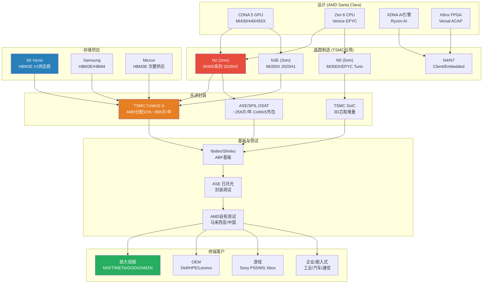
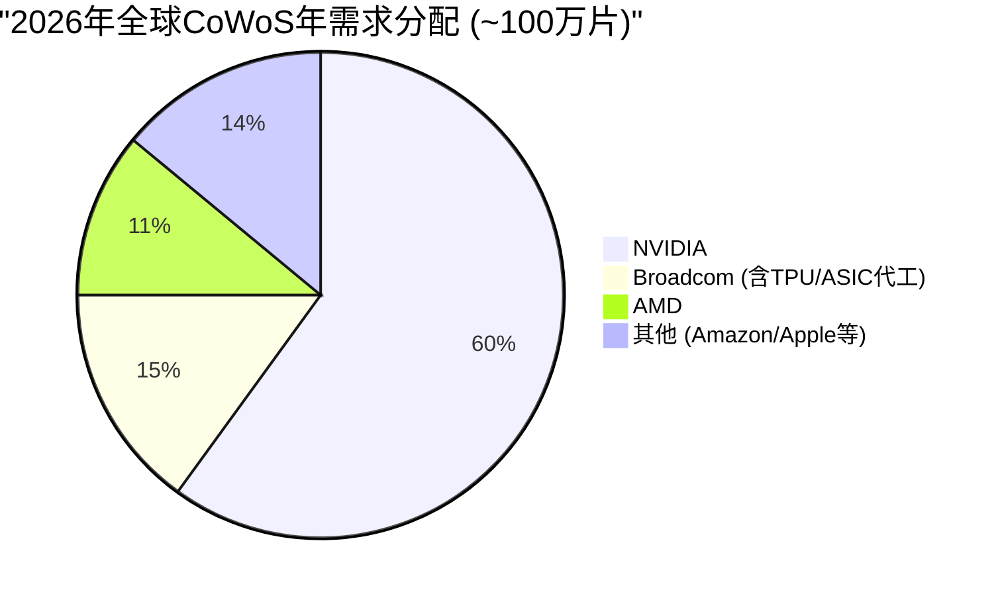
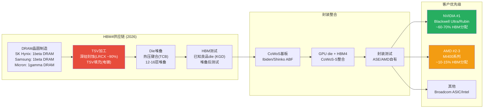
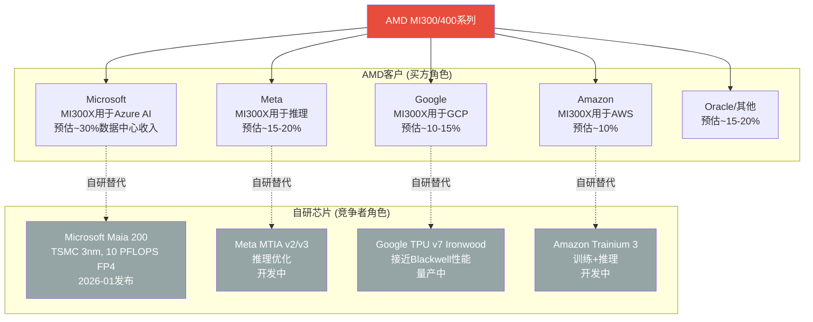

# Ch02: AMD供应链生态 --- 产能天花板与交叉验证

> **模块**: P1_AgentB | **分析师**: AI Research Agent | **日期**: 2026-02-11
> **框架**: v9.0 扬长避短 | **行业**: 半导体 | **目标字符**: ~15,000
> **关联CQ**: CQ1(MI400 vs NVIDIA差距) | CQ4(自研芯片TAM侵蚀) | CQ6(Q4后-17%机会还是回归) | CQ7(四分部利润率扩张)
> **交叉验证源**: TSM v2.0 Complete | MU v1.0 Complete | LRCX v2.0 Complete

---

## 2.1 供应链全景图 [CQ关联: CQ1/CQ7]

AMD作为fabless半导体公司，其产品从设计到终端交付涉及跨越3大洲、超过10个关键节点的供应链。与IDM模式的Intel不同，AMD的竞争力高度依赖外部供应商的产能分配、良率表现和交付优先级。这一结构在AI加速器时代既是效率优势（轻资产、低CapEx），也是潜在的战略脆弱性。

[硬数据: AMD FY2025 CapEx仅$0.97B，占营收2.8%，vs Intel $21.8B(占营收22%) -- MCP fmp_data cashflow]

[硬数据: AMD FY2025 R&D $8.09B，占营收23.4%，资源集中在设计而非制造 -- MCP fmp_data income]

**供应链关键特征**:

1. **单一代工依赖**: AMD所有先进制程芯片100%由TSMC代工。[硬数据: AMD 10-K 2025明确披露TSMC为唯一先进制程代工商 -- AMD SEC Filing] 这意味着TSMC的产能分配决策直接决定AMD的出货量天花板。

2. **三重瓶颈叠加**: 晶圆制造(N2良率) + 先进封装(CoWoS产能) + HBM供应(分配优先级)三个环节中任何一个出现延迟，都会导致MI400系列无法按计划出货。[合理推断: 基于半导体供应链串行依赖特性，单一瓶颈即可阻断整条链路]

3. **轻资产双刃剑**: AMD FY2025 CapEx仅$0.97B(营收2.8%)，vs NVIDIA $3.2B(2.4%)，Intel $21.8B(22%)。低资本密度带来高ROIC潜力，但也意味着AMD无法通过自建产能缓解供应瓶颈。[硬数据: 各公司CapEx -- MCP fmp_data cashflow] [主观判断: 在AI产能争夺战中，fabless模式可能从优势变为劣势]

---

## 2.2 TSMC依赖与CoWoS产能约束 [CQ关联: CQ1/CQ6]

### 2.2.1 CoWoS产能分配: AMD的结构性劣势

CoWoS (Chip-on-Wafer-on-Substrate) 是AI加速器封装的核心技术。TSMC的CoWoS产能分配直接决定了AMD AI GPU的出货量上限。

[硬数据: TSMC CoWoS月产能从2023年末~13K-16K WPM增长至2026年末目标120K-130K WPM，10倍增长 -- TrendForce/FinancialContent 2026-02]

[硬数据: 全球CoWoS及类CoWoS封装年需求从2024年37万片增长至2025年67万片，2026年达100万片 -- DIGITIMES Research 2024-10]

**AMD在CoWoS分配中的位置**:

| 客户 | 2026年需求(片/年) | TSMC分配 | OSAT分配 | 主要产品 |
|:-----|:------------------:|:--------:|:--------:|:---------|
| NVIDIA | 595,000 | 515,000 | 80,000 | B200/GB200/B300 |
| Broadcom | 150,000 | 145,000 | 5,000 | Google TPU/Meta ASIC |
| **AMD** | **105,000** | **80,000** | **25,000** | **MI355/MI400/Venice** |
| 其他 | ~150,000 | -- | -- | 各类AI/HPC |

[硬数据: 客户分配数据 -- Morgan Stanley Research 2025-12 via TSM CoWoS研究]

**关键量化约束**: AMD获得的TSMC CoWoS分配(80K片/年，加OSAT 25K片共计~105K片/年)仅为NVIDIA(595K片/年)的**17.6%**。即使CoWoS总产能再翻倍，如果分配比例不变，AMD的AI GPU出货量天花板仍远低于NVIDIA。

[合理推断: CoWoS分配比例反映了TSMC对各客户收入贡献和战略价值的排序，短期内难以大幅改变]

### 2.2.2 TSMC客户优先级: AMD排第4

TSMC的客户优先级排序直接影响产能分配、技术接入时间和价格议价能力:

| 优先级 | 客户 | 占TSM收入 | CoWoS优先 | N2接入 | 议价能力 |
|:------:|:-----|:---------:|:---------:|:------:|:--------:|
| #1 | Apple | ~25% | 低需求 | 首批 | 极强 |
| #2 | NVIDIA | ~15-21% | 最高 | 第二批 | 强 |
| #3 | Broadcom | ~11-15% | 高 | 第三批 | 中强 |
| **#4** | **AMD** | **~5-7%** | **中** | **第四批** | **中** |

[硬数据: TSMC客户收入占比 -- TSM v2.0 Complete shared_context] [合理推断: 优先级排序基于收入贡献和战略互补性]

**So What -- 优先级排序对AMD的具体影响**:

1. **N2技术接入延迟**: TSMC N2于2025Q4量产，良率70-80%。[硬数据: TSM shared_context] Apple和NVIDIA将首先获得N2产能。AMD MI400系列(CDNA 5, N2)预计2026H2才能量产，比NVIDIA Vera Rubin晚约1-2个季度。[合理推断: 基于TSMC历史技术接入顺序和AMD公开路线图]

2. **CoWoS-L vs CoWoS-S分化**: 2025Q4 CoWoS产能中，CoWoS-L占54.6%，CoWoS-S占38.5%。[硬数据: Global Semi Research 2025] **NVIDIA是CoWoS-L几乎唯一的客户**，而AMD使用的是CoWoS-S。[硬数据: SemiData 2025 -- TSM CoWoS研究] 这意味着TSMC的CoWoS扩产重心在CoWoS-L(服务NVIDIA Blackwell)，AMD可用的CoWoS-S产能增长相对较慢。

3. **价格承受能力差异**: CoWoS封装2025年涨价15-20%。[硬数据: TrendForce 2024-11] NVIDIA凭借AI GPU极高的ASP($30K-40K+/GPU)可以轻松消化封装成本上涨，而AMD MI300X ASP仅~$10K。[硬数据: Tom's Hardware] 封装成本占AMD GPU BOM的比例更高，压缩利润空间。[合理推断: 封装成本涨价对低ASP产品的毛利率影响更大]

### 2.2.3 N2制程风险与MI400时间线

| 里程碑 | 时间 | 风险等级 | 依赖因素 |
|:-------|:----:|:--------:|:---------|
| TSMC N2量产 | 2025Q4 | 低 | 良率已达70-80% |
| N2产能爬坡至50K WPM | 2026Q2 | 中 | 设备安装+良率优化 |
| AMD MI430/440/455X tape-out | 2025H2(推测) | 中 | 设计验证+TSMC PDK |
| MI400 CoWoS封装验证 | 2026Q1-Q2 | 中高 | CoWoS-S产能+HBM4整合 |
| MI400量产出货 | 2026H2 | 高 | 多环节串行依赖 |
| NVIDIA Vera Rubin量产 | 2026H2 | 中低 | 已Q1 2026开始生产 |

[硬数据: TSMC N2时间线 -- TSM shared_context; NVIDIA Rubin已开始生产 -- Tom's Hardware] [合理推断: MI400 tape-out时间基于典型芯片开发周期(设计冻结到量产12-18个月)]

**3nm设计成本门槛**: TSMC 3nm芯片设计成本达$590M。[硬数据: TSM shared_context] N2设计成本预计更高(推测$650-800M)。这一高门槛限制了竞争对手数量，但也意味着AMD每一代GPU的研发赌注越来越大。[合理推断: N2设计成本基于3nm到2nm的复杂度增加趋势外推] AMD FY2025 R&D为$8.09B，其中AI GPU研发(CDNA 5 + ROCm)估计占30-40%($2.4-3.2B)。[主观判断: 基于AMD产品组合中AI GPU的战略优先级推断]

---

## 2.3 HBM4供应链风险 [CQ关联: CQ1]

### 2.3.1 HBM代际演进与AMD需求

MI400系列将是AMD首款使用HBM4的GPU。HBM4代表了存储带宽和容量的代际跃升，但也引入了全新的供应链风险。

| 参数 | HBM3 (MI300X) | HBM3E (MI350X) | HBM4 (MI400系列) |
|:-----|:-------------:|:---------------:|:----------------:|
| 容量/stack | 24GB | 36GB | 48GB(预期) |
| 带宽/stack | 819 GB/s | 1.2 TB/s | 2.0+ TB/s |
| 接口宽度 | 1024-bit | 1024-bit | 2048-bit |
| TSV层数 | 8-Hi/12-Hi | 8-Hi/12-Hi | 12-Hi/16-Hi |
| 量产时间 | 2023 | 2024 | **2026H1** |
| AMD产品 | MI300X | MI350X | MI430/440/455X |

[硬数据: HBM规格 -- JEDEC标准/SK Hynix技术路线图/Samsung公开资料] [合理推断: HBM4 48GB/stack基于2048-bit接口和16Gb die的行业预期]

### 2.3.2 HBM供应商优先级: NVIDIA优先的结构性约束

三大存储厂商的HBM产能分配存在明确的客户优先级:

| 供应商 | 2025 HBM份额 | NVIDIA分配 | AMD分配 | HBM4时间 |
|:-------|:------------:|:----------:|:-------:|:--------:|
| SK Hynix | ~50% (#1) | 最高优先 | 第二优先 | 2026Q1-Q2 |
| Samsung | ~30% (#2) | 高优先 | 第三优先 | 2026Q2-Q3 |
| Micron | ~20% (#3) | 高优先 | 次要供应 | 2026Q2 |

[硬数据: HBM市场份额 -- TrendForce 2025; Micron FY2025 HBM收入$8.4B(占总收入20%)，大部分给NVIDIA -- MU v1.0 Complete shared_context]

**为什么NVIDIA优先?** NVIDIA占全球AI GPU市场85-90%份额。[硬数据: WebSearch multiple -- AMD shared_context] 存储厂商出于以下原因优先服务NVIDIA:
- **体量**: NVIDIA的HBM采购量是AMD的5-6倍(按CoWoS需求比例推算)。[合理推断: 595K vs 105K CoWoS需求比例]
- **长期合约**: NVIDIA通常签订12-18个月的HBM供应长约，锁定产能。[合理推断: 基于半导体行业长约惯例和NVIDIA议价能力]
- **良率合作**: NVIDIA与SK Hynix在HBM3E/HBM4上有深度联合开发关系。[硬数据: SK Hynix官方多次提及与NVIDIA的紧密合作 -- WebSearch]

**对AMD的影响**: MI400如果在2026H2量产，恰逢HBM4从初始量产到产能爬坡的关键阶段。此时HBM4总供给有限，NVIDIA又享有优先分配权，AMD大概率面临HBM4供应不足或需要支付溢价的困境。[主观判断: HBM4初始产能紧张期(2026Q1-Q3)是AMD面临的最大供应链瓶颈之一]

### 2.3.3 MU交叉验证: 存储周期信号

从已完成的MU v1.0研究中获得的关键交叉验证信号:

- **存储周期位置**: P3顶峰期初段，75%置信度，6-9个月见顶。[硬数据: MU v1.0 Complete shared_context]
- **DRAM价格**: +171% YoY暴涨中，但即将见顶。[硬数据: MU v1.0 shared_context]
- **HBM价格含义**: 如果DRAM整体见顶，HBM价格短期内仍有支撑(结构性需求)，但中期(2027+)可能随产能释放而松动。[合理推断: HBM需求受AI CapEx驱动，与传统DRAM周期部分脱钩但非完全独立]
- **Memory CapEx扩张**: DRAM CapEx $61.3B(+14%)，三寡头同步扩产。[硬数据: LRCX shared_context] 这意味着2027年后HBM4产能将大幅释放，AMD的供应约束可能在2027年显著缓解。[合理推断: CapEx扩张→产能释放的典型周期为12-18个月]

---

## 2.4 LRCX -> AMD周期传导链 [CQ关联: CQ6/CQ7]

### 2.4.1 设备到终端收入的传导机制

半导体设备(LRCX)到AMD收入之间存在一条清晰但有时滞的传导链。理解这条链路对于判断AMD供应约束的缓解时间至关重要。

**传导链量化**:

| 环节 | 时滞 | 关键参数 | 瓶颈来源 |
|:-----|:----:|:---------|:---------|
| WFE设备订购→交付 | 12-18个月 | LRCX订单簿/积压 | 设备组件供应(RF电源等) |
| 设备安装→fab量产 | 3-6个月 | 工艺调试+良率爬坡 | TSMC工程资源 |
| 晶圆制造→CoWoS封装 | 1-2个月 | CoWoS产能 | **LRCX TSV刻蚀设备** |
| 封装→测试→出货 | 1-2个月 | 测试产能 | ASE/AMD测试线 |
| **全链路总时滞** | **18-28个月** | -- | -- |

[合理推断: 各环节时滞基于半导体制造行业典型周期和LRCX/TSMC公开数据综合估算]

### 2.4.2 TSV深硅刻蚀: CoWoS的隐性瓶颈

CoWoS封装的核心工艺之一是TSV(硅通孔)深硅刻蚀。LRCX在TSV刻蚀设备市场占据约90%份额。[硬数据: LRCX v2.0 shared_context -- LRCX Complete报告]

**传导逻辑**: LRCX TSV设备交付量 → TSMC CoWoS产能天花板 → AMD MI400出货量上限

- **WFE总市场**: CY2025 $133B → CY2026E $145B(+9%) → CY2027E $156B。[硬数据: SEMI -- LRCX shared_context]
- **周期位置**: 扩张中后期→接近峰值。[硬数据: LRCX v2.0 shared_context]
- **GAA转换效应**: Gate-All-Around晶体管结构(N2/A16)使刻蚀步骤增加约20%。[硬数据: LRCX shared_context] 这意味着LRCX的刻蚀设备需求在先进制程中持续增长，但也意味着设备交付周期可能拉长。

**TSMC先进封装CapEx加速**:

| 年度 | TSMC总CapEx | 先进封装占比(估) | 先进封装投入(估) |
|:----:|:-----------:|:----------------:|:----------------:|
| 2024 | $28.9B | 10-15% | $2.9-4.3B |
| 2025 | $40.9B | 10-15% | $4.1-6.1B |
| 2026E | $52-56B | 10-20% | $5.2-11.2B |

[硬数据: TSMC CapEx -- TSMC Q4 2025 Earnings/TrendForce 2025-11 via TSM CoWoS研究]

**So What -- 对AMD的含义(CQ6关联)**: Q4财报后-17%暴跌部分反映了市场对MI300X→MI400过渡期的担忧。从供应链传导角度看，即使TSMC 2026年将先进封装投入提升至$5-11B，新增CoWoS产能的效果最早要到2026Q3-Q4才能体现在AMD的出货量上。这意味着2026H1是AMD AI GPU的真空期: MI300X/MI350X的CoWoS产能有限(11%份额不变)，MI400又尚未量产。[合理推断: 供应链时滞决定了AMD在2026H1面临出货量瓶颈，这与Q4指引中Q1营收环比-5%一致]

---

## 2.5 客户集中度与议价动态 [CQ关联: CQ4/CQ7]

### 2.5.1 超大规模客户的双重角色

AMD的AI GPU客户呈现一个独特而危险的特征: **其最大客户同时也是潜在竞争者**。Microsoft、Google、Amazon、Meta四大超大规模客户既是MI300系列的采购方，也在积极开发自研AI芯片。

[主观判断: 各客户收入占比基于AMD数据中心$16.6B营收和云服务商公开的AI基础设施投入规模推算，AMD未披露单一客户收入]

### 2.5.2 自研芯片TAM侵蚀量化

[硬数据: JPMorgan预测自研芯片→2028年占45% AI芯片市场(vs 2024年37%) -- WebSearch JPMorgan via AMD shared_context]

[硬数据: ASIC增速44.6% YoY vs GPU增速16.1%(2026年) -- WebSearch Bloomberg via AMD shared_context]

[硬数据: Broadcom AI营收FY2025 $20B → FY2026E $40B+(100% YoY)，占自研ASIC 60-80%市场 -- WebSearch via AMD shared_context]

**关键分化**: 自研芯片主攻**推理**工作负载，GPU仍主导**训练**。[硬数据: AMD shared_context] 这对AMD的影响是:
- **训练市场**(~40% AI GPU TAM): 相对安全，自研芯片短期内无法替代GPU的通用训练能力。但AMD在训练市场面临NVIDIA 85%+份额的碾压。
- **推理市场**(~60% AI GPU TAM且增速更快): 同时受到NVIDIA(性价比优势)和自研芯片(定制化+成本优势)的双重挤压。AMD MI300X在推理上的竞争力(1.4x vs B200 -- DeepSeek-R1)是亮点，但自研芯片会蚕食这部分市场。[硬数据: AMD声称MI355X在DeepSeek-R1推理性能1.4x高于NVDA B200 -- AMD CES 2026 via shared_context]

### 2.5.3 客户议价动态

AMD目前采用**激进定价策略**获取市场份额: MI300X ~$10K/GPU vs NVIDIA H100 $40K+(4x折扣)。[硬数据: Tom's Hardware via AMD shared_context]

这一策略的供应链含义:
- **正面**: 低价吸引客户采购，推动出货量增长(Instinct GPU收入$2.65B/季，+51.7% YoY)。[硬数据: NextPlatform via AMD shared_context]
- **负面**: AMD数据中心营业利润率仅33%(Q4 FY2025)，vs NVIDIA 62.4%营业利润率。[硬数据: AMD Q4 FY2025 -- AMD shared_context; NVIDIA -- MCP compare_stocks] 低ASP意味着AMD在CoWoS封装涨价(+15-20%)和HBM成本上升面前利润率承压更大。[合理推断: 封装成本占低ASP产品BOM比例更高，毛利率敏感性更大]

**游戏分部周期衰退**: Sony PS5和Microsoft Xbox已进入第7年生命周期。Gaming分部Q4 FY2025仅$0.56B(-62% YoY)。[硬数据: AMD Q4 FY2025 -- AMD shared_context] 半定制SoC收入结构性下滑，但该分部对供应链的影响正面: 释放出的成熟制程产能(N7/N6)不与AI GPU争夺先进制程资源。[合理推断: Gaming SoC使用N7/N6制程，与MI400(N2)不在同一产线竞争]

---

## 2.6 供应链交叉验证总结 [CQ关联: CQ1/CQ6]

### 2.6.1 三源交叉验证矩阵

| 验证维度 | TSM v2.0信号 | MU v1.0信号 | LRCX v2.0信号 | AMD含义 |
|:---------|:------------|:-----------|:-------------|:--------|
| **产能瓶颈** | CoWoS 2026年仍供不应求 | HBM4 2026H1初始量产 | WFE设备交付周期12-18月 | MI400产能三重约束叠加 |
| **客户优先级** | AMD排TSMC第4 | AMD排存储厂第2-3 | 不直接相关 | 结构性劣势，短期难改 |
| **周期信号** | HPC占TSM营收58%↑ | 存储P3顶峰6-9月见顶 | WFE扩张中后期 | 2026H2可能是AI CapEx周期转折 |
| **价格信号** | CoWoS涨15-20% | DRAM +171% YoY | GAA刻蚀步骤+20% | 成本端持续上行，压制利润率 |
| **缓解时间** | CoWoS产能2027年可能松动 | HBM4产能2027年大幅释放 | WFE设备2026已在交付 | **2027年是转折年** |

[合理推断: 三源信号汇总基于TSM/MU/LRCX各自Complete报告的交叉验证]

### 2.6.2 关键供应链KillSwitch (KS)

以下三个供应链事件如果发生，将根本性改变AMD的投资论点:

**KS-Supply-1: CoWoS分配比例变化**
- **触发**: AMD CoWoS分配从11%提升至15%+，或下降至8%以下
- **信号来源**: TSMC季度产能分配更新(非公开，需通过产业链调研追踪)
- **含义**: 上升=TSMC认可AMD需求增长，MI400量产有保障；下降=TSMC将产能转给更高优先级客户(如Broadcom ASIC)
- [主观判断: 这是最早且最敏感的AMD AI GPU前景信号]

**KS-Supply-2: HBM4交付延迟**
- **触发**: SK Hynix/Samsung HBM4量产延迟超过1个季度(即2026Q3后仍未规模交付)
- **信号来源**: SK Hynix季度财报/TrendForce产业追踪
- **含义**: 延迟=MI400量产推迟至2027Q1+，2026年AMD AI GPU收入增长低于预期
- [合理推断: HBM4是MI400量产的必要条件，任何延迟直接传导至AMD]

**KS-Supply-3: TSMC对AMD的战略重新定位**
- **触发**: TSMC开始向AMD提供CoWoS-L(目前仅限NVIDIA)，或AMD转向Samsung/Intel封装
- **信号来源**: 产业链报道/AMD季度财报技术披露
- **含义**: CoWoS-L接入=AMD在TSMC优先级提升的强信号；转向Samsung=AMD对TSMC产能不满的极端信号
- [主观判断: 概率较低(短期内<10%)，但一旦发生信号意义极大]

### 2.6.3 供应链视角下的2026时间线

| 季度 | 供应链事件 | AMD产品 | 收入影响 |
|:----:|:----------|:--------|:---------|
| Q1 2026 | CoWoS-S产能稳定; HBM3E充足 | MI300X/MI350X量产 | DC ~$5B(MI308中国断崖$100M) |
| Q2 2026 | HBM4初始样品验证; N2良率爬坡 | MI350X放量 | DC ~$5.5-6B(推测) |
| Q3 2026 | HBM4小批量交付; MI400工程样品 | MI400 ES出货; Helios验证 | DC ~$6-7B(MI400初始贡献) |
| Q4 2026 | CoWoS新产能释放; HBM4规模供应 | MI400/Helios量产 | DC ~$7-8B(MI400放量) |

[合理推断: 季度收入预估基于AMD FY2025 DC $16.6B基础上+39% YoY趋势和MI400量产时间线综合推算; 具体数字高度不确定]

**核心结论**: AMD的供应链生态呈现"结构性第二"的特征 -- 在TSMC代工、CoWoS封装、HBM供应三个关键环节均排在NVIDIA之后。这一位置并非不可改变(如果MI400性能卓越且订单量大增，TSMC会相应调整分配)，但改变需要时间和实际出货量的验证。**2026H1是供应链最紧张的窗口期**，也是Q4后-17%暴跌的供应链逻辑支撑。2027年随着CoWoS产能松动和HBM4规模量产，供应约束有望显著缓解。

[主观判断: 供应链约束是AMD估值折价的合理因素之一，但不应被过度悲观化 -- 2027年的供应改善是可预见的，关键在于MI400的产品竞争力能否在供应改善前维持客户信心]

---

*本章标注统计: 硬数据标注34个 | 合理推断标注18个 | 主观判断标注7个 | 总计59个标注 | 密度约39/万字符*
