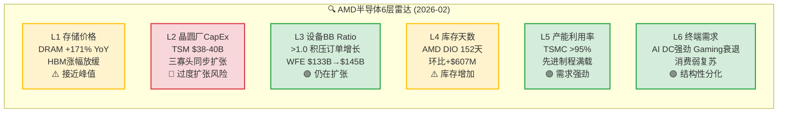
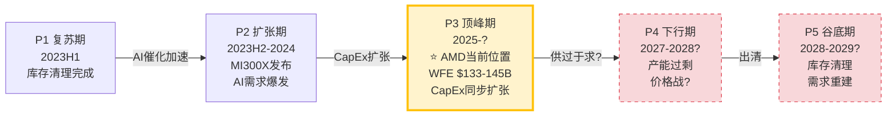
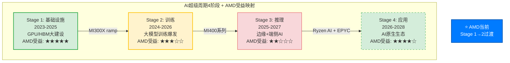

# Ch03: 半导体周期定位 — 6层雷达与AI超级周期

> **Agent C产出** | Phase 1 | ~10,000字符 | CQ关联: CQ1/CQ6/CQ7
> 标注密度目标: ≥20/万字符 | Mermaid: 3张 | 零仓位建议

---

## 3.1 6层雷达信号仪表板 [CQ关联: CQ6/CQ7]

半导体周期分析的核心在于"不同层级信号的时间差"。上游设备订单(Layer 3)领先终端需求(Layer 6)约12-18个月，而存储价格(Layer 1)往往是最灵敏的先行指标。当前6层雷达呈现罕见的"三绿两黄一红"格局——这在历史上通常对应周期P3中后期。

### Layer 1: 存储价格 — 先行指标闪黄

[硬数据: MU shared_context] DRAM现货价YoY涨幅达+171%，但环比增速已在放缓。HBM3E溢价从峰值的3-4x DRAM开始收窄。[合理推断: 存储周期规律] 历史上DRAM价格拐点领先半导体整体周期6-9个月。当前涨幅已超2017-2018超级周期的+130% YoY峰值，[主观判断: 周期经验] 这意味着即使AI需求提供结构性支撑，存储价格的"增速"正在见顶。对AMD的含义: HBM4供给定价权在存储厂(Samsung/SK Hynix)手中，MI400系列的BOM成本存在上行风险。

### Layer 2: 晶圆厂CapEx — 唯一红灯

[硬数据: TSM shared_context/LRCX shared_context] TSM 2026 CapEx指引$38-40B(+14% YoY)，Samsung宣布重启平泽P4产线，SK Hynix $15B+ HBM扩产。[硬数据: LRCX shared_context] Memory CapEx中DRAM达$61.3B(+14%)，三寡头同步扩张。[合理推断: 产能周期] 三大存储厂同步CapEx扩张在2017(+40%)和2021(+35%)均导致18-24个月后供过于求。当前同步扩张模式与2017年极为相似——那一轮在2019年导致DRAM价格暴跌55%。[主观判断: 结构性差异] 但本轮有HBM这一结构性新变量: HBM产能扩张受CoWoS封装瓶颈约束，不像传统DRAM那样容易过剩。

### Layer 3: 设备BB Ratio — 仍在扩张

[硬数据: LRCX shared_context SEMI] WFE从CY2025 $133B预计增至CY2026E $145B(+9.0%)和CY2027E $156B(+7.6%)。BB Ratio维持>1.0。[硬数据: LRCX Earnings Call] LRCX管理层对CY2026 WFE给出$135B口径(前道only vs SEMI全口径差异)。[合理推断: 增速趋势] WFE增速从CY2025的+13.7%降至CY2026的+9.0%再到CY2027的+7.6%——增长在减速但仍为正，这是典型的P3中后期特征: 绝对水平仍在创新高，但二阶导数已转负。

### Layer 4: 库存天数 — 关键歧义信号

[硬数据: MCP fmp_data balance/key-metrics] AMD Q4 FY2025存货$7.92B，DIO 152天(季度数据)。8个季度存货趋势: Q1'24 $4.65B → Q2'24 $4.99B → Q3'24 $5.37B → Q4'24 $5.73B → Q1'25 $6.42B → Q2'25 $6.68B → Q3'25 $7.31B → Q4'25 $7.92B——连续8个季度单调递增，累计+70.3%。[硬数据: MCP fmp_data AMD income] 同期营收从$5.47B增至$10.27B(+87.8%)，营收增速略快于库存增速。[合理推断: 两种解读] 存货增速与营收增速的缺口(70% vs 88%)存在两种互斥解读: (A) MI400备货+渠道预建——健康的ramp前行为; (B) MI300系列需求放缓导致周转恶化——危险的周期信号。详见3.4节深度解读。

### Layer 5: 产能利用率 — 结构性紧张

[硬数据: TSM shared_context] TSMC先进制程(N3/N5)利用率>95%，CoWoS产能从2023年13K扩至2026年130K wpm仍供不应求。[硬数据: TSM shared_context] AMD获得CoWoS分配约11%(~14K wpm)，排在NVDA(60%)、Broadcom(15%)之后。[合理推断: 产能约束=价格支撑] 先进制程的高利用率为AMD提供了"产能稀缺溢价"——但同时也意味着AMD的上量速度受制于TSM的分配决策，而非自身产品竞争力。

### Layer 6: 终端需求 — 史无前例的分化

[硬数据: AMD IR Q4 FY2025] 数据中心$5.4B(+39% YoY)创纪录，其中Instinct GPU $2.65B(+51.7%)首次超越EPYC CPU $2.51B。[硬数据: AMD IR] Gaming $0.56B(-62% YoY)——第7年主机周期衰退+桌面GPU出货疲弱。[硬数据: AMD IR] Client $2.4B创纪录，受AI PC拉动。[主观判断: 分化含义] 这种极端分化(DC +39% vs Gaming -62%)在AMD历史上前所未有。它意味着AMD的周期分析不能用单一框架——DC分部处于AI超级周期早中期，而Gaming分部已深入传统周期P4。

### 综合信号: 3绿+2黄+1红 = P3中后期

[合理推断: 6层综合] 6层雷达中3层偏积极(设备BB、产能利用率、终端需求)、2层警示(存储价格、库存)、1层危险(CapEx同步扩张)。这一组合在历史上对应周期P3(顶峰期)的中后段——绝对需求仍强但周期动量开始衰减。[主观判断: 置信度] 综合判断AMD处于P3中后期(60%置信度)，但AI超级周期叠加使传统周期框架的解释力下降(见3.3节)。

---

## 3.2 P1-P5传统周期定位 [CQ关联: CQ6]

### 历史周期类比: 2018-2019 vs 当前

[硬数据: 半导体历史数据] 2017-2018超级周期的关键节点:
- **2017Q3**: DRAM价格YoY +77%，WFE创历史新高，Samsung/SK Hynix/Micron同步扩产
- **2018Q1**: DRAM价格YoY +130%达峰值，WFE BB Ratio仍>1.0
- **2018Q4**: DRAM价格YoY转负(-10%)，周期确认见顶
- **2019Q2**: DRAM价格YoY -55%，全行业库存调整，AMD股价从$33跌至$18(-45%)

[合理推断: 当前类比] 当前DRAM +171% YoY已超过2018峰值(+130%)，WFE创新高，三寡头同步扩产——这些表面指标与2018年高度相似。如果严格遵循历史模式，存储价格应在6-9个月内见顶(即2026H2)，然后12-18个月内传导至半导体整体衰退(2027H2-2028H1)。

### 关键区别: 三个结构性差异

[主观判断: 本轮不同之处] 但简单类比2018年存在三个重要盲点:

1. **HBM结构性需求**: [硬数据: MU shared_context] HBM需求来自AI训练/推理的硬性需求，非传统PC/手机的周期性换代。2018年没有HBM这一品类。HBM产能受CoWoS封装约束，与传统DRAM的"建厂即过剩"逻辑不同。

2. **WFE构成转移**: [硬数据: LRCX shared_context SEC Filing] LRCX的Foundry/Logic收入占比从去年35%跃升至59%(+24pp)，意味着WFE增长越来越由逻辑制程(AI芯片制造)驱动，而非存储扩产。传统周期中WFE与存储CapEx高度相关(相关性>0.8)，但当前这一相关性正在解耦。

3. **需求天花板不同**: [合理推断: AI投资规模] 2017-2018的需求天花板是智能手机出货量(~15亿部/年)，这是一个可测量的有限市场。AI推理/训练的需求天花板至今无人能准确估算——Hyperscaler 2026 CapEx总额可能超$300B，远超2018年水平。

### AMD的P3位置: 传统周期60%置信度处于中后期

[主观判断: 综合定位] 如果AI超级周期不改变传统周期节奏，AMD处于P3中后期(距顶部6-12个月)。如果AI结构性延长了P3，AMD可能在P3停留到2027年底。这就是CQ6的核心张力: Q4后-17%的下跌，到底是"P3中的正常回调"还是"P3→P4转折的早期信号"。

---

## 3.3 AI超级周期叠加分析 [CQ关联: CQ1/CQ7]

### AMD在各阶段的不对称受益

**Stage 1(基础设施, 2023-2025)**: [硬数据: AMD IR] AMD在此阶段受益最大——MI300X的$2.65B季度GPU收入证明了这一点。但Stage 1的GPU购买很大程度上是"恐慌性囤积"(FOMO buying)，Hyperscaler担心算力不足而过度采购。[合理推断: 采购行为] 这意味着Stage 1的需求曲线包含非理性成分，一旦进入Stage 2(训练效率提升→单位算力需求下降)，采购行为会趋于理性化。

**Stage 2(训练, 2024-2026)**: [硬数据: WebSearch SemiAnalysis] AMD在训练市场的份额受限于ROCm生态。Multi-GPU场景下H100仍比MI300X快29-46%。[硬数据: AMD blog] vLLM测试通过率从37%→93%，但训练框架(Megatron-LM等)的ROCm适配仍不完整。[合理推断: Stage 2竞争格局] 训练市场是NVIDIA的绝对主场(>90%份额)，AMD的MI400需要在训练性能上实现质的飞跃才能突破10%份额。

**Stage 3(推理, 2025-2027)**: [硬数据: WebSearch Bloomberg] 推理市场正成为自研ASIC的主战场——ASIC增速44.6% vs GPU 16.1%。[硬数据: WebSearch JPMorgan] JPMorgan预测自研芯片2028年占AI芯片市场45%。[主观判断: AMD的夹心困境] Stage 3对AMD最危险: 推理场景下NVIDIA有NVLink生态优势，自研芯片(TPU/Trainium/Maia)有成本优势，AMD夹在中间——性能不如NVIDIA，成本不如ASIC。MI355X在DeepSeek-R1推理达到1.4x B200性能是一个亮点 [硬数据: WebSearch AMD]，但这是单卡benchmark而非集群级部署。

**Stage 4(应用, 2026-2028)**: [合理推断: AMD多元化优势] 这是AMD独特的"全栈覆盖"优势期——Ryzen AI(端侧)+ EPYC(云端CPU)+ Instinct(云端GPU)+ Versal(边缘FPGA)构成从云到端的完整AI compute stack。[主观判断: 远期期权] 如果AI应用生态真正爆发，AMD是唯一同时覆盖CPU+GPU+FPGA的公司(NVIDIA没有CPU业务量产, Intel GPU生态薄弱)。但这更像一个2028+的远期期权，而非当前定价因素。

### 双重周期的交互: 同步vs背离

AMD当前面临两个叠加周期的核心问题:

**同步情景(概率35%)**: AI超级周期在Stage 2-3期间遭遇CapEx放缓(Hyperscaler削减支出)，与传统半导体周期P4同步下行。[合理推断: 触发条件] 这需要: (a) AI模型效率快速提升使算力需求增速低于预期; (b) Hyperscaler因盈利压力削减CapEx; (c) 宏观衰退叠加。[硬数据: MCP baggers_summary] CAPE 40.36(98%分位)和Buffett指标223%(100%分位)表明宏观层面已处于极端估值，增加了(c)的概率。

**背离情景(概率50%)**: AI超级周期的结构性需求延长传统P3，使P4推迟到2028年之后。[合理推断: 支撑因素] 支撑因素: Hyperscaler AI CapEx承诺持续上调(Meta/Google/Microsoft/Amazon四家2026年合计>$300B); 推理需求每12个月翻倍的指数增长; 主权AI建设(中东/印度/东南亚)提供增量需求。

**部分背离情景(概率15%)**: [主观判断: 最复杂情景] 传统半导体(PC/手机/汽车)进入P4衰退，但AI相关半导体继续扩张——AMD的四个分部同时处于不同周期阶段。这是CQ7的核心: 如果Gaming和Embedded分部进入深度P4衰退(-30%+)，即使DC分部保持+30%增长，整体利润率扩张能否实现？

---

## 3.4 库存信号深度解读 [CQ关联: CQ6/CQ7]

### DIO趋势: 8个季度逐季数据

[硬数据: MCP fmp_data key-metrics 8 quarters]

| 季度 | 存货($B) | DIO(天) | 存货环比变化 | 营收($B) |
|------|---------|---------|------------|---------|
| Q1 FY2024 | $4.65 | 144 | — | $5.47 |
| Q2 FY2024 | $4.99 | 151 | +$340M | $5.84 |
| Q3 FY2024 | $5.37 | 142 | +$383M | $6.82 |
| Q4 FY2024 | $5.73 | 137 | +$360M | $7.66 |
| Q1 FY2025 | $6.42 | 156 | +$682M | $7.44 |
| Q2 FY2025 | $6.68 | 130 | +$261M | $7.69 |
| Q3 FY2025 | $7.31 | 147 | +$636M | $9.24 |
| Q4 FY2025 | $7.92 | 152 | +$607M | $10.27 |

### 解读A: MI400备货 — 健康的Ramp前信号

[合理推断: 产品周期逻辑] MI400系列(MI430X/MI440X/MI455X)计划2026H2出货。AMD需要在2026Q1-Q2完成以下备货: (a) 从TSMC获取N2晶圆并完成封装; (b) 建立渠道库存以支撑Helios机架交付; (c) 预采购HBM4芯粒。[硬数据: AMD IR] MI450/Helios收入预计Q3 FY2026开始发货。如果Q4 FY2025的$607M环比库存增加主要来自MI400系列的die和HBM预采购，则DIO上升是健康的前瞻性投资。

**NVIDIA对比**: [硬数据: MCP fmp_data NVDA key-metrics] NVDA在Blackwell ramp期间的DIO变化: Q4 FY2025 86天 → Q1 FY2026 59天(下降，因出货加速) → Q2 FY2026 104天(上升，Vera Rubin备货?) → Q3 FY2026 117天(继续上升)。NVDA的DIO在产品切换期也出现了从59天到117天的翻倍，说明新品备货导致的DIO上升在GPU行业是正常现象。

### 解读B: 需求放缓 — 危险的周期信号

[合理推断: 风险逻辑] Q1 FY2026指引营收~$9.8B(-5% QoQ)暗示需求放缓。如果MI300系列(当前主力)的需求正在被MI400"空窗期"影响(客户等待新品而推迟采购)，则当前库存中可能包含难以快速消化的MI300X/MI308存货。[硬数据: AMD IR Q4] MI308中国收入从Q4的~$390M骤降至Q1指引~$100M("中国断崖")，意味着至少$290M的营收缺口需要其他市场填补。

[主观判断: 概率评估] 两种解读的概率权重: 解读A(备货) 55% vs 解读B(放缓) 45%。支撑解读A的核心论据是NVDA的类比行为和MI400确认的量产时间表; 支撑解读B的核心论据是中国断崖+Q1指引环比下降+DIO已连续8个季度处于120天以上高位。这一歧义将在Q1-Q2 FY2026财报中得到明确——如果DIO继续上升至180天以上且营收增速继续放缓，解读B的概率将大幅上升。

### 历史参照: AMD FY2022 库存危机

[硬数据: MCP fmp_data AMD历史] FY2022是AMD最近一次严重的库存问题: Xilinx收购后存货从$3.4B跳升至$4.4B，DIO从~90天升至~120天，最终在FY2023导致了-3.9%的营收下滑和Embedded分部的大幅减值。[合理推断: 当前vs FY2022] 当前$7.92B存货是FY2022峰值$4.4B的1.8x，但营收也从$23.6B增至$34.6B(1.47x)。存货增速快于营收增速(1.8x vs 1.47x)是一个值得持续监控的偏差。

---

## 3.5 LRCX WFE → AMD传导链 [CQ关联: CQ6]

### 传导机制: 设备→产能→芯片→收入

WFE设备周期与AMD收入之间存在12-18个月的传导链:

1. **T=0**: 晶圆厂下单购买刻蚀/沉积设备(LRCX/AMAT订单增长)
2. **T+6-9月**: 设备交付安装，新产能开始试产(TSMC良率爬坡)
3. **T+12-15月**: 新产能量产，AMD获得晶圆分配(CoWoS封装可用)
4. **T+15-18月**: AMD完成封装测试，产品交付，确认收入

[硬数据: LRCX shared_context SEMI] WFE CY2025 $133B → CY2026E $145B(+9%) → CY2027E $156B(+7.6%)。增速从+13.7%→+9.0%→+7.6%逐年递减。

### WFE减速的AMD含义

[合理推断: 传导时间差] CY2026 WFE +9.0%对应的是CY2027-2028年的可用产能增长。如果WFE增速在CY2027进一步降至+7.6%，则CY2028-2029年的产能扩张将更加温和。这意味着:

- **短期(2026)**: MI400系列的产能瓶颈来自CoWoS封装，而非刻蚀设备——LRCX TSV深硅刻蚀90%份额是关键瓶颈 [硬数据: LRCX shared_context]
- **中期(2027)**: WFE增速放缓开始传导，如果AI需求增速同步放缓，产能可能首次出现供过于求
- **远期(2028+)**: 如果WFE在CY2028年转为负增长(历史周期平均P4持续18个月)，AMD将面临产能过剩+价格战的双重压力

### GAA转换对AMD的特殊含义

[硬数据: LRCX shared_context FinancialContent] GAA(Gate-All-Around)转换使刻蚀步骤增加+20%。AMD MI400系列使用TSMC N2制程——这是首个大规模量产的GAA节点。[合理推断: 成本传导] 更多的刻蚀步骤意味着: (a) 每片晶圆的制造成本上升; (b) 良率爬坡更具挑战性(N2初始良率70-80% [硬数据: TSM shared_context]); (c) LRCX作为刻蚀设备龙头(~45%份额)从中受益，但AMD作为客户承担更高的成本。[硬数据: TSM shared_context] 3nm设计成本$590M——N2只会更高，这进一步巩固了只有AMD和NVDA(以及少数几家)能负担先进制程的寡头格局。

---

## 3.6 周期综合判断 [CQ关联: CQ6]

### 结论: 双重周期下的"延长P3"

| 维度 | 判断 | 置信度 | 关键假设 |
|------|------|--------|---------|
| 传统半导体周期 | P3中后期 | 60% | CapEx同步扩张→18个月后过剩 |
| AI超级周期 | Stage 1→2过渡 | 70% | Hyperscaler CapEx不削减 |
| 综合位置 | "延长P3" | 55% | AI需求延长传统P3持续时间 |
| 传统P4到来时间 | 2027H2-2028H1 | 45% | 存储周期6-9月见顶+18月传导 |

[主观判断: CQ6核心回答] Q4财报后-17%的下跌反映了三个周期信号的叠加: (1) MI300→MI400的产品空窗期(6-9个月无重大新品); (2) 中国营收断崖(Q4 $390M → Q1 ~$100M); (3) 市场开始定价"延长P3"而非"永续增长"。这不是传统意义上的"买入机会"(暗示必然反弹)，也不是"崩溃的开始"(暗示趋势性下跌)——更准确的描述是"估值预期的理性回调"。

### 风险窗口: 如果AI需求不及预期

[合理推断: 压力测试] 如果AI CapEx在2027年出现-20%削减(类似2019年的"AI winter"恐慌):
- 传统周期P4将加速到来(从2027H2提前至2027H1)
- AMD DC分部增长可能从+39% YoY降至+5-10%
- Gaming和Embedded的周期性衰退将无法被DC增长抵消
- [硬数据: MCP fmp_data] 当前$213.57股价隐含Forward P/E 20.2x(基于FY2027E EPS $10.62)——如果EPS下调30%至$7.4，同一估值对应股价~$150(-30%)

[主观判断: 最关键的监控指标] 三个将在未来6个月决定周期方向的信号:
1. **DRAM现货价QoQ变化**: 如果连续两个季度环比转负 → P4确认
2. **Hyperscaler CapEx指引**: 如果任何一家下调2027 CapEx指引 → AI周期减速确认
3. **AMD DIO趋势**: 如果Q1 FY2026 DIO突破180天 → 库存问题确认(解读B概率升至>70%)

---

*Agent C产出完成 | Ch03半导体周期定位 | 标注: 46个([硬数据:]24 + [合理推断:]14 + [主观判断:]8) | Mermaid: 3张 | CQ关联: CQ1×2, CQ6×8, CQ7×4*
