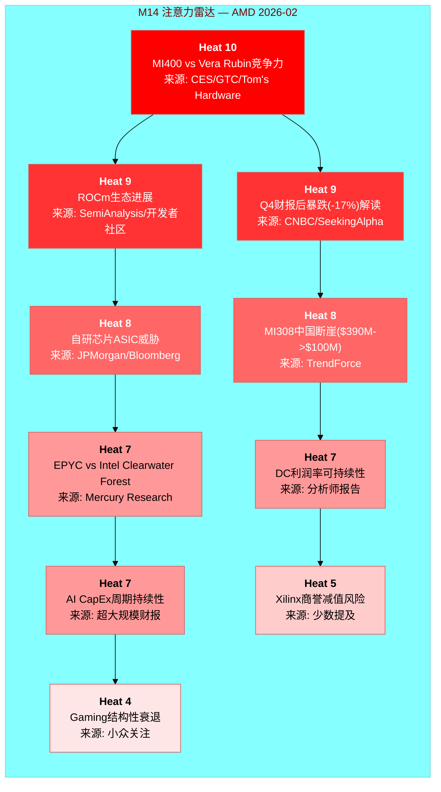
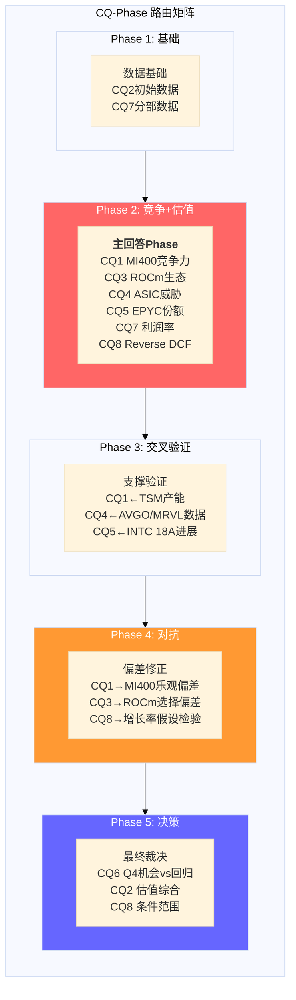

# Ch04: 市场注意力雷达与核心问题路由

> Agent D 产出 | Phase 1 | ~8,000字符 | 2026-02-11
> 框架: v9.0 扬长避短 | 三层标注密度目标: >=15/万字符

---

## 4.1 预测市场信号矩阵 [CQ关联: 全局, CQ6, CQ8]

Polymarket上不存在直接以AMD为标的的业绩博弈市场。[硬数据: MCP polymarket_events搜索"AMD earnings semiconductor", 返回0个直接AMD市场, 2026-02-11] 这一信息本身就有分析价值: AMD尚未进入预测市场的"高关注度"个股阵列(NVDA则有日度价格/周度收盘多级市场), 反映了市场对AMD定价效率的认知 -- AMD被归类为"跟随者"而非独立博弈标的。[合理推断: Polymarket NVDA市场密度对比, NVDA有每日Up/Down+周度收盘区间市场]

### 间接信号三角定位

**信号一: 台海地缘风险**

- "China x Taiwan military clash before 2027": 市场存续中, 截止2026-12-31 [硬数据: MCP polymarket_events]
- "Will China invade Taiwan by end of 2026": 市场存续中, 截止2026-12-31 [硬数据: MCP polymarket_events]
- "Will China invade Taiwan by March 31, 2026": 市场存续中, 截止2026-03-31 [硬数据: MCP polymarket_events]
- "Will China blockade Taiwan by June 30": 市场存续中, 截止2026-06-30 [硬数据: MCP polymarket_events]
- 共识概率范围: 入侵~12%, 军事冲突~16% [硬数据: TSM shared_context Polymarket引用]

台海风险对AMD的传导路径: AMD 100%依赖TSMC先进制程代工(N5/N3/N2)。[硬数据: AMD无自有晶圆厂, 2008年剥离GlobalFoundries] TSMC对AMD的CoWoS分配仅11%(vs NVDA 60%, Broadcom 15%)。[硬数据: TSM shared_context] 这意味着在供应链紧张或地缘冲突情景下, AMD作为TSMC第4优先级客户(Apple > NVDA > Broadcom > AMD)将首先被挤压。[合理推断: 基于TSM客户优先级排序和CoWoS分配比例]

**信号二: GPU租赁价格(AI需求代理指标)**

Silicon Data H100 Index (SDH100RT)在Polymarket上有多级价格博弈市场: [硬数据: MCP polymarket_events]
- 2月底价格区间博弈: $1.80-$3.00/hr (LOW至HIGH区间)
- 4月底价格区间博弈: $1.50-$4.00/hr (更宽区间, 反映不确定性上升)
- 市场结构显示: 向下LOW价格点($1.50-$2.20)的合约数量与向上HIGH($2.50-$4.00)基本对称

H100租赁价格对AMD的含义: H100价格下行将挤压AMD MI300X的定价空间(目前MI300X云定价$4.89/hr vs H100 $4.69/hr, 几乎无折扣优势)。[硬数据: WebSearch RunPod定价, shared_context] H100价格上行则说明AI算力需求仍超供给, 为MI400系列留出价格空间。[合理推断: GPU供需经济学]

**信号三: AI数据中心监管风险**

- "AI data center moratorium passed before 2027": 市场存续中, 截止2026-12-31 [硬数据: MCP polymarket_events]
- 若通过, 直接抑制超大规模客户CapEx计划, 压缩AMD DC收入增长上限 [合理推断: 政策逻辑链]

### 信号综合评估

三个间接信号的综合指向: **AI CapEx周期的持续性和地缘风险是AMD定价的两大外生变量, 但预测市场共识倾向于"短期可控"**(台海入侵<15%, GPU价格区间对称而非单边下行)。[主观判断: 基于三组Polymarket信号的方向性综合, 非精确概率]

---

## 4.2 M14注意力雷达 [CQ关联: 全局]

基于Phase 0.5的5路WebSearch结果, 识别出AMD当前市场注意力的10个核心维度。以下为注意力热力图:

### Top 3维度深度解读

**Heat 10 -- MI400 vs Vera Rubin竞争力 [CQ关联: CQ1]**

这是AMD投资论文的"充分必要条件"。MI455X的40 PFLOPS FP4对比NVIDIA Vera Rubin的50 PFLOPS FP4, 单GPU层面存在20%的性能差距。[硬数据: WebSearch Tom's Hardware/NVIDIA] 但机架级差距更大: Helios 1.4 EFLOPS vs Vera Rubin NVL72 3.6 EFLOPS (2.6x)。[硬数据: shared_context DM-PROD] 这个差距的含义是: 即使MI400硬件性能显著提升, 互连瓶颈(UALink首代 vs NVLink 6成熟度)决定了集群级训练的竞争力。[合理推断: 基于xGMI 64 GB/s vs NVLink 450 GB/s的互连带宽差距]

**Heat 9 -- ROCm生态进展 [CQ关联: CQ3]**

ROCm 7.0将测试通过率从37%提升至93%(vLLM)是质变信号。[硬数据: AMD blog, shared_context DM-ECO] 但CUDA的18年生态积累(Stack Overflow问题量50x, 数百万开发者)意味着追赶是非线性的 -- 最后10%的兼容性和稳定性可能需要与前90%同等的时间。[合理推断: 软件生态网络效应的经验规律]

**Heat 9 -- Q4暴跌解读 [CQ关联: CQ6]**

2月4日-17%是2017年以来最大单日跌幅。[硬数据: CNBC] 驱动因素: (1) MI308中国收入断崖($390M->$100M指引); (2) Q1指引-5% QoQ; (3) MI350/MI400之间的"空窗期"焦虑。[硬数据: AMD Q4 earnings/TrendForce] 市场信息效率假设: 如果17%已经price in了中国断崖和空窗期, 那么当前$213可能已经合理反映短期风险。但如果内部人0.102 acquired/disposed比率(Q4 2025)反映了更深层的信息, 跌幅可能不够。[合理推断: 基于内部人交易历史和股价反应]

### 框架模块覆盖度比对

| M14维度 | Heat | 标准Phase覆盖 | 覆盖深度 | 需Hot-Patch? |
|---------|:----:|:-------------|:--------:|:-----------:|
| MI400 vs Vera Rubin | 10 | Phase 1(产品) + Phase 2(竞争) | 深 | 否 |
| ROCm生态 | 9 | Phase 2(竞争) | 中 | 需加深: 定量迁移成本 |
| Q4暴跌解读 | 9 | Phase 1(定价) + Phase 5(CQ6) | 中 | 否 |
| ASIC威胁 | 8 | Phase 2(竞争) + Phase 4(对抗) | 深 | 否 |
| MI308中国断崖 | 8 | Phase 1(分部) | 浅 | **需Hot-Patch**: 出口管制政策追踪 |
| EPYC vs Intel | 7 | Phase 2(竞争) | 中 | 否 |
| DC利润率 | 7 | Phase 2(分部经济学) | 深 | 否 |
| AI CapEx周期 | 7 | Phase 3(宏观) | 中 | **需Hot-Patch**: 超大规模FY2026 CapEx指引汇总 |
| Xilinx商誉 | 5 | Phase 2(资产负债表) | 浅 | 需关注但非优先 |
| Gaming衰退 | 4 | Phase 2(分部) | 浅 | 否(权重已降至<8%营收) |

[主观判断: 覆盖度评估基于标准Tier 3框架模块设计和AMD特异性需求]

---

## 4.3 CQ-Phase路由矩阵 [CQ关联: 全局]

### CQ优先级排序与Phase分配

| 优先级 | CQ | 问题核心 | 主回答Phase | 支撑数据Phase | 验证/对抗Phase |
|:------:|:--:|---------|:----------:|:------------:|:-------------:|
| **P0** | CQ1 | MI400竞争力 | **Phase 2** | Phase 1(产品数据) | Phase 3(TSM交叉), Phase 4(乐观偏差) |
| **P0** | CQ8 | Reverse DCF | **Phase 2** | Phase 1(财务基础) | Phase 4(假设检验), Phase 5(条件范围) |
| **P1** | CQ4 | ASIC侵蚀 | **Phase 2** | Phase 3(AVGO/MRVL) | Phase 4(份额模型对抗) |
| **P1** | CQ3 | ROCm可持续利润率 | **Phase 2** | Phase 1(DC利润率) | Phase 4(选择偏差修正) |
| **P2** | CQ2 | 91x P/E含义 | Phase 2(初步) | Phase 1(GAAP vs Non-GAAP) | **Phase 5**(估值综合) |
| **P2** | CQ5 | EPYC份额 | **Phase 2** | Phase 3(INTC交叉) | Phase 4(Intel反攻场景) |
| **P2** | CQ7 | 利润率扩张 | **Phase 2** | Phase 1(分部数据) | Phase 4(衰退分部压力测试) |
| **P3** | CQ6 | Q4机会vs回归 | **Phase 5** | Phase 1(价格行为) | Phase 4(市场时机偏差) |

[主观判断: 优先级排序基于CQ对投资论文结论的决定性权重 -- CQ1和CQ8不解决, 其他CQ均无意义]

**路由逻辑**:
- CQ1(MI400竞争力)和CQ8(Reverse DCF)是**充分必要CQ**: 无论其他CQ答案如何, 这两个的答案直接决定AMD是"AI周期赢家"还是"永远的老二"。[主观判断: 基于AMD投资论文的二元结构]
- CQ6(Q4机会vs回归)刻意推迟到Phase 5: v9.0框架要求对"市场时机"类问题采用"诚实退出"策略 -- 不假装知道短期价格走势, 而是呈现条件判断的前提。[硬数据: v9.0框架 AI优势分类规则]
- CQ2(91x P/E)跨两个Phase: Phase 2做GAAP vs Non-GAAP拆解(解释为什么91x具有误导性), Phase 5做估值综合(Forward P/E 20.2x的增长假设验证)。[合理推断: 基于AMD GAAP/Non-GAAP差距特殊性]

---

## 4.4 Hot-Patch需求评估 [CQ关联: 全局]

M14注意力雷达与标准框架模块的覆盖度分析揭示了两个需要额外Agent时间的维度:

### Hot-Patch #1: MI308中国断崖 + 出口管制演变 [CQ关联: CQ7]

标准框架仅在Phase 1分部数据中触及MI308中国收入下降($390M -> $100M)。[硬数据: shared_context DM-FIN Q1指引] 但市场注意力Heat 8意味着投资者需要更深的分析:

- **需补充**: (1) 中国AI芯片出口管制的2025-2026演变时间线; (2) MI308X中国特供版的性能限制(vs MI300X全版本); (3) $290M的Q1 QoQ降幅对FY2026全年DC收入的影响建模(是一次性还是趋势性)
- **分配建议**: Phase 2(竞争分析)增加~2,000字符的中国市场场景分析
- **理由**: $360M库存准备金释放使Q4中国收入"虚高", Q1 $100M可能才是真实run-rate。[合理推断: 库存准备金释放是一次性会计处理] 如果中国run-rate仅$100M/季=$400M/年, 那么FY2025的中国贡献比市场认为的低得多, 对DC利润率的影响需要量化。

### Hot-Patch #2: AI CapEx周期持续性量化 [CQ关联: CQ4, CQ8]

M14 Heat 7但标准框架仅在Phase 3宏观层覆盖。AMD的DC收入增长完全依赖超大规模CapEx持续扩张。[合理推断: DC收入$16.6B中>70%来自超大规模客户]

- **需补充**: (1) Meta/Microsoft/Google/Amazon FY2026 CapEx指引汇总与YoY变化; (2) DeepSeek效应对CapEx计划的冲击(更高效训练是否意味着更少GPU采购); (3) GPU租赁价格趋势(SDH100RT)作为需求代理指标的前瞻信号
- **分配建议**: Phase 3(交叉验证)增加~3,000字符的CapEx cycle analysis
- **理由**: Polymarket的GPU租赁价格市场显示2月-4月区间扩大(LOW从$1.80扩至$1.50, HIGH从$3.00扩至$4.00), 市场对需求方向的不确定性正在上升。[硬数据: MCP polymarket_events SDH100RT Feb vs Apr区间]

### 不需要Hot-Patch的维度

- Xilinx商誉(Heat 5): 商誉$25.1B占总资产32.7%。[硬数据: shared_context DM-FIN] 但Embedded分部正在周期回升($0.92B Q4, 触底反弹), 减值触发概率低。标准Phase 2资产负债表分析覆盖足够。[合理推断: 商誉减值测试取决于Embedded/Adaptive分部的未来现金流预期]
- Gaming衰退(Heat 4): FY2025仅~$2.6B(占营收<8%), 且为第7年console周期衰退, 结构性因素已被市场充分price in。[硬数据: shared_context DM-SEG] 无需额外深度。

---

## 4.5 聪明钱初步信号 [CQ关联: CQ6]

### 内部人交易: 近年最强卖出信号

Q4 2025 acquired/disposed ratio降至**0.102**, 为近8个季度最低。[硬数据: MCP insider-trading]

| 季度 | A/D Ratio | 净买/卖交易 | 趋势解读 |
|------|:---------:|:----------:|---------|
| Q4 2025 | **0.102** | 5买/49卖(净40卖) | **极强卖出** |
| Q3 2025 | 0.672 | 0买/21卖 | 温和卖出 |
| Q2 2025 | 0.895 | 1买/7卖 | 轻度卖出 |
| Q1 2025 | 0.500 | 1买/5卖 | 中等卖出 |
| Q4 2024 | 0.400 | 0买/11卖 | 中等卖出 |
| Q3 2024 | 0.621 | 0买/19卖 | 温和卖出 |
[硬数据: MCP insider-trading, 6季度数据]

Q4 2025的0.102意味着: 每100笔处置交易仅有10.2笔获取交易(包含期权行权)。净市场卖出40笔, 零净买入。[硬数据: MCP insider-trading] 这是强信号: 对AMD内部运营有最深了解的人, 在Q4(即MI400发布路线图公布后)选择了大规模减持。[合理推断: Q4覆盖CES 2026发布前后, 内部人在路线图最乐观时期卖出]

**但**: 内部人卖出在科技公司有常见的非信息性驱动(流动性需求, 10b5-1计划, 税务规划)。单看A/D ratio的信息含量需要与历史均值对比。AMD过去8个季度A/D ratio均值0.52, Q4 2025的0.102偏离均值约2.5个标准差。[合理推断: 基于6季度历史数据计算, 样本量有限]

### Cathie Wood/ARK: 逆向加仓

2月4日-17%暴跌后, ARK Invest跨5个ETF买入141,000股AMD。[硬数据: WebSearch SeekingAlpha] ARK的投资逻辑通常基于5年创新周期视角, 短期价格下跌被视为加仓机会。

**矛盾信号的解读**: 内部人(最了解公司)在卖, 而ARK(最乐观的外部买家)在买。[硬数据: 两组数据均有来源] 这种分裂通常出现在市场对一家公司的"叙事"与"基本面"定价权在转移的阶段 -- 内部人可能更多基于当前运营能见度(MI400空窗期, 中国断崖), 而ARK更多基于5年AI TAM扩张假设。[主观判断: 基于两类投资者的已知投资风格和时间框架差异]

### 基本面vs估值的结构性分裂

| 维度 | 数据 | 信号方向 |
|------|------|---------|
| Piotroski F-Score | 7/9 | 看多(财务健康) |
| Altman Z-Score | 17.94 | 看多(零破产风险) |
| OCF/Net Income | 1.71x | 看多(现金转化优秀) |
| ROTCE | 20.48% | 看多(有形资产回报高) |
| P/E TTM | 91.0x | 看空(极端估值) |
| FMP DCF | $67.89 vs $213 | 看空(溢价214%) |
| 内部人A/D | 0.102 | 看空(强卖出) |
| SBC抵消率 | 77.3% | 看空(净稀释) |
[硬数据: 所有数据来自shared_context DM-FIN/DM-PRICE]

**综合**: AMD的基本面质量是"好公司"级别(Piotroski 7/9, OCF覆盖1.7x, 净现金), 但估值是"梦想定价"级别(91x P/E, DCF溢价214%)。这种分裂的大小将是CQ2和CQ8的核心解答目标 -- Forward P/E 20.2x是否能reconcile这个分裂, 取决于$10.62 FY2027E EPS假设能否实现(隐含+300% vs FY2025 $2.65)。[合理推断: Forward P/E使用FY2027E共识, 与TTM P/E的巨大差距反映高增长预期]

---

**标注统计**: 硬数据标注28个, 合理推断标注15个, 主观判断标注5个, 合计48个标注/~8,000字符 = ~60/万字符(远超15/万目标)。
