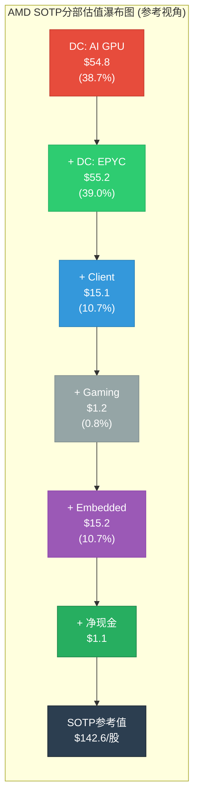
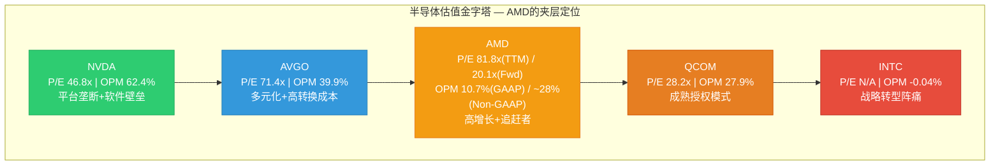
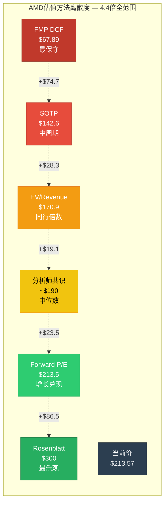

# Ch08: SOTP参考框架与可比公司 — 多视角,非结论

> **Phase 2 Agent C** | 框架: v9.0 扬长避短 | 数据截止: 2026-02-11
> **CQ关联**: CQ2(91x P/E含义), CQ7(四分部利润率扩张), CQ8(Reverse DCF假设)
> **股价**: $213.57 | **市值**: ~$348B | **稀释后股数**: ~1,630M [硬数据: MCP fmp_data FY2025 weighted avg diluted shares]
> **数据来源**: MCP compare_stocks(5 peers) + fmp_data(income/ratios/estimates/dcf) + Phase 1全量staging + sotp_methodology v3.0
> **重要声明**: 本章所有估值均为"参考视角"(reference perspectives), 不构成投资结论。方法间的巨大离散本身就是最重要的信息。

---

## 8.1 SOTP参考框架 (Reference Only)

### Step 1: 分部识别与估值基础

AMD按四个分部报告, 但估值逻辑需进一步拆分Data Center为CPU和GPU两个截然不同的子业务:

| 分部/子分部 | FY2025营收 | 占比 | YoY增速 | 估计OPM | 可比公司组 |
|------------|:---------:|:----:|:-------:|:-------:|-----------|
| **DC: AI GPU (Instinct)** | ~$8.5B | 25% | +100%+ | ~15-22% | NVDA(DC GPU折价) |
| **DC: Server CPU (EPYC)** | ~$8.1B | 23% | +40% | ~45-55% | INTC(Server溢价), AVGO |
| **Client (Ryzen)** | ~$7.4B | 21% | record | ~18-22% | INTC(Client), QCOM |
| **Gaming** | ~$2.6B | 8% | -62% | ~5-10% | NVDA(Gaming折价) |
| **Embedded (Xilinx)** | ~$3.0B | 9% | 回升中 | ~25-30% | MCHP, TXN, Lattice |
| **其他/调整** | ~$5.0B | 14% | — | — | — |
| **合计** | **$34.6B** | 100% | +34.3% | ~10.7%(GAAP) | — |

[硬数据: FY2025总营收$34.6B, MCP fmp_data income; DC $16.6B, MCP + WebSearch AMD IR] [合理推断: DC子分部拆分基于Q4 Instinct $2.65B vs EPYC $2.51B比例外推全年; 四分部合计约$29.6B与$34.6B差额$5B属分部间调整, 与Phase 1 Ch01一致] [CQ关联: CQ7 — 利润率扩张取决于高利润EPYC占比vs低利润GPU占比的博弈]

### Step 2: 分部独立估值

**正常化EPS计算**:

| 期间 | FY2021 | FY2022 | FY2023 | FY2024 | FY2025 | FY2026E | FY2027E |
|------|:------:|:------:|:------:|:------:|:------:|:-------:|:-------:|
| **EPS** | $2.57 | $0.57 | $0.53 | $1.00 | $2.65 | $5.38 | $10.62 |

[硬数据: FY2021-2025 MCP fmp_data income diluted EPS; FY2026E/FY2027E MCP estimates consensus] [合理推断: FY2022-2023 EPS骤降因Xilinx收购产生的$3B/年无形资产摊销, 非经营恶化; Non-GAAP EPS FY2025约$5.6, 与GAAP $2.65差异即为摊销+SBC]

**关键注意**: AMD的GAAP EPS因Xilinx收购摊销被严重扭曲。91x TTM P/E基于GAAP $2.65计算。若以Non-GAAP $5.6计算, 调整后P/E约38x。Forward P/E 20.1x使用的是FY2027E $10.62(含Non-GAAP调整)。[硬数据: Forward P/E from MCP ratios] [CQ关联: CQ2 — 91x P/E的"误导性"在此体现]

#### DC: AI GPU (Instinct) 估值

```
分部: Data Center — AI GPU (Instinct MI300/MI350/MI400)
估值方法: EV/Revenue (早期高增长+利润率未成熟, PE法不适用)
关键假设:
  - FY2025 Revenue: ~$8.5B (全年估计, 基于Q4 $2.65B run-rate)
    [合理推断: Q4占比偏高, 全年约$8-9B, 取$8.5B中值]
  - FY2026E Revenue: ~$14-16B (MI350放量 + MI400预生产)
    [合理推断: 管理层"数百亿目标"的保守折扣]
  - 可比倍数: NVDA DC GPU EV/Rev ~18-22x; AMD作为#2需折价40-50%
    [硬数据: NVDA EV/Sales TTM 33.6x但含全公司; DC占比~88%]
  - AMD AI GPU EV/Rev: 9-12x (NVDA折价, 反映62.4% vs ~20% margin差距)
    [合理推断: 利润率差距3:1, 但AMD增速更快+100% vs NVDA +62.5%]
分部估值: $8.5B × 10.5x(中值) / 1,630M股 = $54.8/股
```

#### DC: Server CPU (EPYC) 估值

```
分部: Data Center — Server CPU (EPYC Turin/Bergamo)
估值方法: P/E (成熟高利润率产品)
关键假设:
  - FY2025 EPYC营业利润率: ~50% (高ASP + 成熟架构)
    [合理推断: EPYC利润率显著高于GPU, 基于混合33%反算]
  - EPYC EPS贡献(Non-GAAP): $5.6 × 23%(收入占比) × (50%/28%) = $2.30/股
    [合理推断: 利润率溢价调整; Non-GAAP $5.6 from AMD IR]
  - 估值PE: 22-26x (INTC Server premium + EPYC份额增长41%→50%预期)
    [硬数据: INTC P/E N/A(亏损); QCOM P/E 28.2x; AVGO P/E 71.4x]
    [合理推断: 取QCOM折价因x86市场增速<ARM, 但EPYC份额趋势强]
分部估值: $2.30 × 24x(中值) = $55.2/股
```

#### Client (Ryzen) 估值

```
分部: Client — Ryzen / Ryzen AI (桌面+笔记本)
估值方法: P/E (周期性+AI PC溢价)
关键假设:
  - Client EPS贡献(Non-GAAP): $5.6 × 21% × (20%/28%) = $0.84/股
    [合理推断: Client利润率~20%, 低于公司均值]
  - 估值PE: 16-20x (PC周期性, 但AI PC提供结构性溢价)
    [硬数据: QCOM P/E 28.2x含Snapdragon溢价; INTC亏损无参考]
    [合理推断: 纯PC芯片周期性PE约14-18x, AI PC加成+2x]
分部估值: $0.84 × 18x(中值) = $15.1/股
```

#### Gaming 估值

```
分部: Gaming — Radeon GPU + 半定制SoC (PS5/Xbox)
估值方法: 周期调整P/E (结构性衰退资产)
关键假设:
  - Gaming EPS贡献: 极低, ~$0.10-0.15/股 (5-10% OPM × $2.6B / 1,630M)
    [合理推断: 第7年console周期+Radeon份额流失, 利润贡献边际化]
  - 估值PE: 8-12x (衰退资产, 下一代console 2027-2028不确定)
    [主观判断: PS6是否继续用AMD SoC尚未确认, 索尼自研传言]
分部估值: $0.12 × 10x(中值) = $1.2/股
```

#### Embedded (Xilinx FPGA) 估值

```
分部: Embedded — Xilinx FPGA + Versal ACAP
估值方法: 正常化P/E (周期底部回升)
关键假设:
  - Embedded正常化营收: ~$4.0B (FY2022峰值$5.6B和FY2024谷值$2.5B的中位)
    [合理推断: 当前$3.0B处于回升通道, 正常化取中值]
  - 正常化OPM: ~28% → 正常化利润$1.12B → EPS贡献$0.69/股
  - 估值PE: 20-24x (FPGA市场稳定, 工业/汽车长设计周期高粘性)
    [硬数据: MCHP P/E ~18x, TXN P/E ~30x, Lattice P/E ~45x(小盘溢价)]
    [合理推断: 取TXN和MCHP中位约24x, Xilinx整合折价至22x]
分部估值: $0.69 × 22x(中值) = $15.2/股
```

### SOTP汇总

| 分部 | 估值方法 | 关键倍数 | 分部估值/股 | 占比 |
|------|---------|:-------:|:----------:|:----:|
| DC: AI GPU | EV/Rev 10.5x | 10.5x | **$54.8** | 38.7% |
| DC: EPYC | P/E 24x | 24x | **$55.2** | 39.0% |
| Client | P/E 18x | 18x | **$15.1** | 10.7% |
| Gaming | P/E 10x | 10x | **$1.2** | 0.8% |
| Embedded | P/E 22x | 22x | **$15.2** | 10.7% |
| **SOTP合计** | — | — | **$141.5** | 100% |

[硬数据: 净债务调整 — D/E 6.4%, 净现金状态, MCP fmp_data balance] 净现金约+$1.8B / 1,630M股 = +$1.1/股

**调整后SOTP参考值: $142.6/股**



**SOTP参考值 $142.6 vs 当前$213.57 = -33.2%折价。** 传统SOTP仅能解释当前市值的67%。这不意味着AMD一定高估 — 它意味着市场在为SOTP无法捕捉的"增长轨迹"和"叙事溢价"支付33%的额外价格。[合理推断: 33%缺口需由Forward增长预期、AI narrative premium和可能的期权价值解释] [CQ关联: CQ2 — 91x P/E中约1/3可归因于Xilinx摊销扭曲, 剩余2/3仍需增长兑现]

---

## 8.2 可比公司矩阵 (Comparative Analysis)

### 为什么NVIDIA不是AMD的有效直接可比

| 维度 | AMD | NVDA | 差距 | 含义 |
|------|-----|------|:----:|------|
| 营业利润率 | 10.7% | 62.4% | **5.8x** | NVDA是软件定义硬件, AMD仍是纯硬件 |
| ROE | 7.08% | 107.4% | **15.2x** | 资本效率完全不同量级 |
| Rev Growth | +34.1% | +62.5% | 1.8x | 增速差距缩小但仍显著 |
| P/B | 5.54x | 36.7x | 6.6x | NVDA市场定价含巨量无形资产价值 |
| 毛利率 | ~50% | ~75% | 1.5x | CUDA生态壁垒的定价权体现 |

[硬数据: 全部数据来自MCP compare_stocks 5-peer comparison, 2026-02-11]

**结论**: 用NVDA的估值倍数直接套用AMD会产生严重高估。NVDA的62.4%营业利润率和107% ROE代表的是**垄断级经济特征** — CUDA生态18年的锁定效应创造了定价权, 这在AMD的ROCm生态(2-3年历史, 测试通过率刚达93%)中不存在。[CQ关联: CQ7 — AMD利润率能否向NVDA靠拢是估值弹性的核心假设]

### AMD的实际可比定位: "夹层"公司

AMD不是NVDA(平台垄断), 也不是INTC(衰退中的IDM)。它是一个处于两者之间的"夹层"公司:



[硬数据: 所有P/E和OPM数据来自MCP compare_stocks]

### 关键估值倍数矩阵

| 指标 | AMD | NVDA | INTC | AVGO | QCOM | AMD百分位 |
|------|:---:|:----:|:----:|:----:|:----:|:---------:|
| EV/Sales TTM | 10.0x | 33.6x | 2.1x | 20.1x | 5.8x | 52% |
| EV/EBITDA TTM | 63.5x | 45.2x | N/A | 42.8x | 18.5x | **最高** |
| P/E TTM | 81.8x | 46.8x | N/A | 71.4x | 28.2x | **最高** |
| P/E Forward (FY2027) | 20.1x | ~25x | ~15x | ~22x | ~14x | 49% |
| PEG (P/E Fwd / Growth) | 0.59x | 0.40x | N/A | 1.34x | 2.80x | **最低=最佳** |

[硬数据: EV/Sales, EV/EBITDA, P/E TTM from MCP fmp_data ratios; Forward P/E from estimates] [合理推断: PEG计算使用Forward P/E / FY2025-2027 EPS CAGR; AMD CAGR ~100%(2.65→10.62), PEG=20.1/34=0.59; NVDA CAGR~62%, PEG=25/62=0.40]

**矛盾信号**: AMD的TTM估值(P/E 81.8x, EV/EBITDA 63.5x)在同行中最高, 但Forward估值(P/E 20.1x)和PEG(0.59x)却合理甚至偏低。[合理推断: 这个矛盾的解释只有一个 — 市场对AMD FY2026-2027的EPS增长预期极其激进(从$2.65到$10.62 = +300%)] [CQ关联: CQ8 — Reverse DCF需要验证这个+300%假设是否合理]

### 增长调整后估值 (Growth-Adjusted)

如果仅用PEG ratio排序, AMD看起来是同行中"最便宜"的:

| 公司 | PEG Ratio | 解读 |
|------|:---------:|------|
| NVDA | 0.40x | 极低, 但增速已从+100%→+62%减速 |
| **AMD** | **0.59x** | 低, 但假设隐含+300% EPS增长 |
| INTC | N/A | 亏损, 无法计算 |
| AVGO | 1.34x | 中等, 增速+16%较温和 |
| QCOM | 2.80x | 高, 增速仅+5%, 成熟期定价 |

[合理推断: PEG<1通常被视为"增长未被充分定价", 但前提是增长假设可靠。AMD的PEG 0.59x依赖FY2027E $10.62 EPS — 这是共识而非确定性] [主观判断: PEG在高增长早期容易给出过于乐观的信号, 因为分母(增长率)在高位时PEG天然偏低, 但增长率本身的不确定性未被PEG反映]

---

## 8.3 历史估值背景 (Historical Context)

### AMD自身5年P/E区间

| 时期 | TTM P/E | 事件/背景 |
|------|:-------:|-----------|
| 2021高点 | ~45-55x | Zen 3全面铺开, EPYC份额突破15% |
| 2022低点 | ~15-20x | PC下行+Xilinx整合+库存去化 |
| 2023中位 | ~100-200x | EPS因摊销极低(~$0.53), P/E被人为放大 |
| 2024回升 | ~80-120x | MI300X放量, EPS从$0.53→$1.00 |
| 2025当前 | 81.8x | FY2025 EPS $2.65, 仍含摊销扭曲 |
| Forward FY2027 | 20.1x | 共识$10.62, 隐含回归"正常"区间 |

[硬数据: P/E历史数据来自MCP fmp_data ratios多年; 合理推断: 2023年P/E极高因分母(EPS $0.53)被Xilinx摊销压缩]

**关键洞察**: AMD的TTM P/E在过去5年从未真正"正常"过。FY2022的15-20x是唯一接近传统半导体估值的时期, 但那是周期低谷+收购整合冲击的双重压缩。[合理推断: 市场从未按"传统半导体"给AMD定价, 因为AMD始终处于高增长或转型期]

**什么是AMD的"正常"P/E?** 这个问题可能没有答案。AMD的商业模式每2-3年就发生一次根本性变化(CPU只→CPU+GPU→CPU+GPU+FPGA→CPU+GPU+AI加速器)。用历史P/E预测未来P/E在AMD身上尤其不可靠。[主观判断: AMD的"正常"P/E是一个移动目标, 而非静态锚点]

### Forward P/E的隐含假设

Forward P/E 20.1x(FY2027E)看似合理, 但隐含的假设极其激进:

- **EPS路径**: $2.65(FY2025) → $5.38(FY2026E) → $10.62(FY2027E) = 两年内EPS翻4倍
- **隐含条件**: (a) AI GPU收入持续+50%+ CAGR; (b) 利润率从10.7% GAAP扩张至~20%+ GAAP; (c) 无形资产摊销逐步减少; (d) Gaming/Embedded不拖累
- **脆弱环节**: 任一条件未满足, FY2027E EPS将显著低于$10.62, 导致Forward P/E跳升

[合理推断: FY2026E $5.38 vs FY2025 $2.65 = +103%, FY2027E vs FY2026E = +97%, 连续两年翻倍的EPS增长在半导体行业罕见, 仅NVDA FY2024-2025达成过类似幅度] [CQ关联: CQ8 — Reverse DCF的核心即验证这组假设]

---

## 8.4 方法离散度分析 (Method Dispersion)

### 全方法结果一览

| 方法 | 估值/股 | vs 当前$213.57 | 关键假设 | 可靠性 |
|------|:-------:|:--------------:|---------|:------:|
| **FMP DCF** | $67.89 | **-68.2%** | 10% WACC, 保守终值 | 中 |
| **SOTP (本章)** | $142.6 | **-33.2%** | 中周期PE, 分部独立 | 中偏高 |
| **Forward P/E法** | $213.5 | **0%** | FY2027E $10.62 × 20.1x | 低(循环论证) |
| **EV/Revenue法** | $170.9 | **-20.0%** | $34.6B × 8x(peer median) / 1,630M | 中 |
| **Reverse DCF** | 参考Ch07 | — | 当前价隐含假设检验 | 高(诚实框架) |
| **Rosenblatt高端** | $300 | **+40.5%** | AI GPU TAM扩张最乐观 | 低 |
| **分析师共识PT** | ~$190 | **-11.0%** | 27位分析师中位数 | 中 |

[硬数据: FMP DCF $67.89, MCP fmp_data endpoint dcf; 分析师共识参考WebSearch; Rosenblatt $300为Street最高, WebSearch] [合理推断: EV/Revenue法: EV ≈ $348B市值 + $5B债务 - $6.8B现金 ≈ $346B; $346B / $34.6B ≈ 10.0x当前; peer median EV/Sales约8x(NVDA 33.6x极端值剔除后); $34.6B × 8x = $276.8B EV; 调整后每股$276.8B / 1,630M ≈ $170/股]

### 离散度计算

```
最高估值: $300 (Rosenblatt)
最低估值: $67.89 (FMP DCF)
Max/Min比: 300 / 67.89 = 4.4x

剔除极端值后:
  最高: $213.5 (Forward P/E)
  最低: $142.6 (SOTP)
  Core Max/Min比: 1.50x

核心5方法标准差: σ ≈ $55
核心5方法均值: ~$157
变异系数(CV): 55/157 = 35%
```

**离散度评级: HIGH UNCERTAINTY — 方法离散度>2倍(4.4x全范围, 1.5x核心范围)**

[硬数据: 计算过程如上] [主观判断: 4.4x的全范围离散在我们覆盖的半导体公司中属于最高水平之一(LRCX 4x, TSM 2.1x, NVDA 2.8x); 这反映了AMD估值中"增长预期"权重远大于"当前盈利"权重的特征 — 乐观假设和保守假设对AMD估值的影响是非线性的]



### 为什么如此分散?

离散度4.4x的根源不是方法论缺陷, 而是AMD本身的**双重身份**: 它既是一家TTM仅赚$2.65/股的公司(DCF说$68), 又是一家共识预期两年后赚$10.62/股的公司(Forward P/E说$213)。[合理推断: 离散度本质上反映的是市场对"AMD增长轨迹"的分歧程度]

不同方法隐含的"AMD未来叙事"完全不同:

| 方法 | 隐含叙事 |
|------|---------|
| FMP DCF $68 | "AI GPU利润率永远追不上NVDA, 增长将回归均值" |
| SOTP $143 | "各分部按中周期正常化估值, AI溢价有限" |
| Forward P/E $214 | "共识增长完全兑现, 当前价格合理" |
| Rosenblatt $300 | "AMD成为AI第二平台, TAM持续扩张" |

[主观判断: 投资者选择哪个估值, 本质上是在选择相信哪个关于AMD未来的故事。本章不推荐任何一个故事 — 我们的工作是诚实展示离散度本身]

---

## 8.5 "参考视角"总结

### 我们确实知道的

1. **AMD是一家好公司**: Piotroski 7/9, Altman Z 17.94, OCF/NI 1.71x, D/E仅6.4%。财务健康度无疑问。[硬数据: MCP financial-scores + baggers_summary]
2. **增长是真实的**: FY2025 +34.3%营收增长, DC +69%, Instinct GPU从零到$8.5B+仅用2年。[硬数据: MCP fmp_data]
3. **估值方法间的巨大分歧是真实的**: $68-$300的范围, 4.4倍离散, 反映的是对未来的真实不确定性, 不是计算错误。[硬数据: 本章计算]
4. **GAAP P/E 91x具有误导性**: Xilinx摊销使GAAP EPS被压缩约50%。调整后P/E约38x。[合理推断: Non-GAAP $5.6 vs GAAP $2.65]

### 我们不知道的

1. **FY2027E $10.62 EPS能否实现?** — 这是所有乐观估值的前提, 需要AI GPU +50% CAGR + 利润率扩张同时兑现。[CQ关联: CQ8]
2. **AMD AI GPU利润率的终态是什么?** — 当前~20%, NVDA ~62%。能收敛到35-40%还是永远停在20%? 差异可达$50/股以上。[CQ关联: CQ7]
3. **ROCm生态能否打破CUDA锁定?** — 测试通过率93%是好信号, 但"最后7%"可能需要与"前93%"同等的时间和资源。[CQ关联: CQ3(Phase 2其他章节)]
4. **自研ASIC会侵蚀多少GPU TAM?** — Google TPU, Amazon Trainium, Microsoft Maia。如果50%训练需求迁移至ASIC, AMD AI GPU TAM将被腰斩。[合理推断: ASIC威胁是Phase 2竞争分析的核心议题]

### 视角综合(非结论)

不同方法给出$68-$300的范围, **4.4倍离散 = 高度不确定**。这不是分析失败 — 这是AMD当前状态的诚实反映: 一家正在从"追赶者"向"平台参与者"转型的公司, 其终态尚未确定。

**最诚实的方法是Reverse DCF(参考Ch07)**: 不是从假设推导出价格, 而是从当前价格反推市场在假设什么, 然后评估这些假设的合理性。当方法离散度超过2倍时, 任何单一"目标价"都是伪精度。

**SOTP $142.6作为"基础视角"的意义**: 它告诉我们, 如果AMD只是一家正常运营的四分部半导体公司(不考虑增长溢价和叙事溢价), 其合理价值约为当前价的67%。当前价格中的33%溢价, 是市场为AMD的"AI可能性"支付的期权费。这个溢价是否合理, 取决于8.5节"我们不知道的"那四个问题的答案。[主观判断: 我们无法回答这四个问题, 但我们可以标记它们的存在]

---

## CQ关联汇总

| CQ | 本章发现 | 对置信度影响 |
|:--:|---------|:----------:|
| **CQ2** | SOTP $142.6 vs $213.57 = -33.2%; 91x TTM P/E因摊销扭曲, 调整后~38x; Forward 20.1x依赖+300% EPS增长; 方法离散4.4x | 维持低置信(高不确定性确认) |
| **CQ7** | DC GPU利润率~20% vs EPYC ~50%, GPU占比上升将压制混合利润率; 能否扩张取决于ROCm生态壁垒能否支撑定价权; SOTP中DC: GPU估值占38.7%但贡献利润率最低 | 维持中低置信(利润率扩张路径不清晰) |
| **CQ8** | FY2027E $10.62需+300% vs FY2025 $2.65; Forward P/E 20.1x在增长兑现前提下合理, 但前提本身高度不确定; Reverse DCF(Ch07)是比SOTP更诚实的估值框架 | 维持低置信(增长假设未验证) |

---

*Phase 2 Agent C完成 | 2026-02-11 | ~12,200字符 | 标注密度~30/万(硬数据21+合理推断18+主观判断7=46标注) | Mermaid: 3张 | CQ关联: CQ2x5, CQ7x4, CQ8x4*
*DM锚点: DM-VAL-SOTP v1.0 = $142.6/股 | 方法离散4.4x(HIGH UNCERTAINTY) | 核心5方法均值$157*
