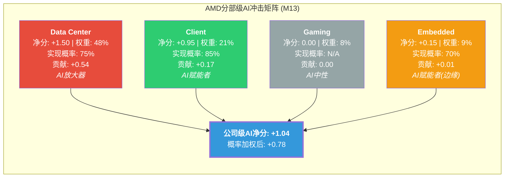
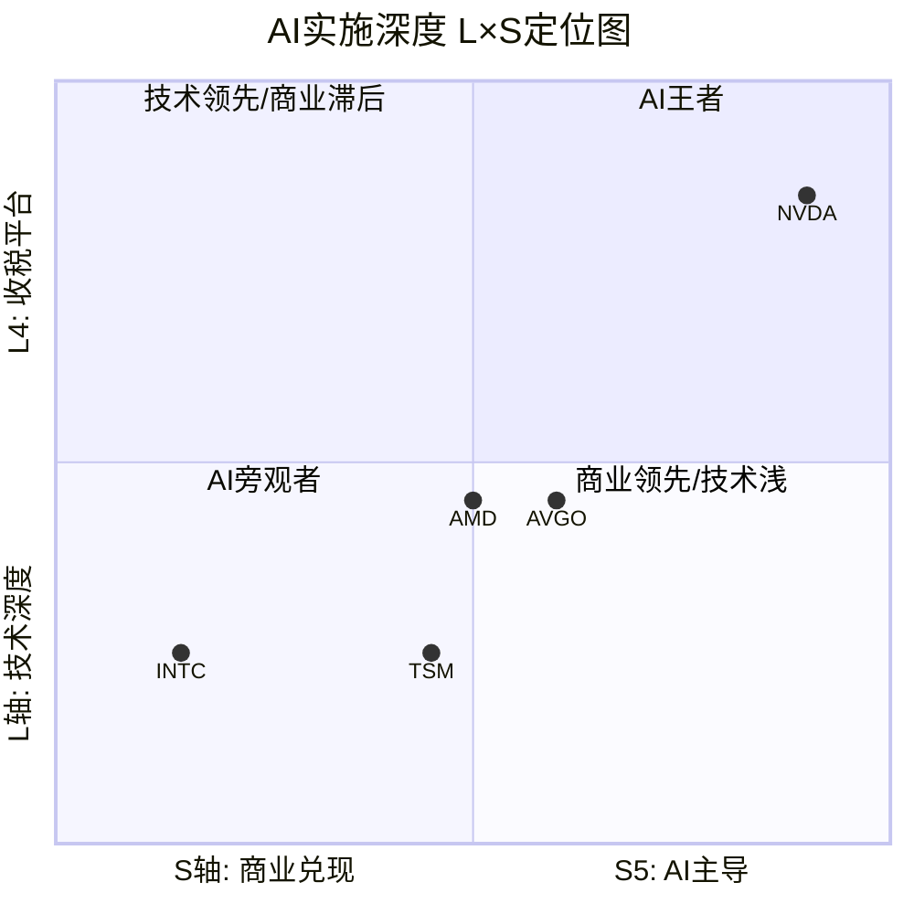
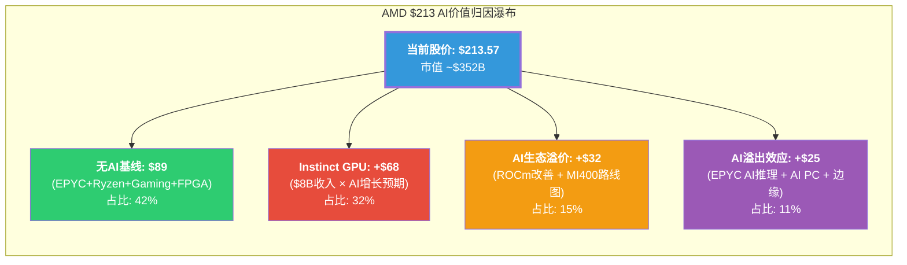

# Ch14: AI深度评估 — 分部级冲击矩阵与价格含义

> **Agent D产出** | Phase 3.5 | ~13,000字符 | CQ关联: CQ1(AI GPU差距)/CQ4(自研芯片侵蚀)/CQ8(隐含假设)
> **框架**: v9.0 扬长避短 | 零仓位建议 | 三层标注密度≥30/万字符
> **AI深度加成区**: 分部级AI归因 + L×S定位 + AI溢价对Reverse DCF的结构性约束
> **特异性声明**: 替换AMD为INTC后不成立(INTC无Instinct GPU产品线+91x TTM P/E的AI溢价张力); 替换为AVGO后不成立(AVGO是ASIC设计服务商, 非GPU竞争者)

---

## 14.1 Layer 1: 分部级AI冲击矩阵 (M13)

### 14.1.1 评估方法论

[合理推断: 框架设计] 对AMD四个分部独立评估五个AI维度(收入冲击/成本冲击/护城河变化/竞争格局/时间窗口), 每项-5至+5打分, 最终通过收入权重加权得出公司级AI净分。维度权重: 收入冲击40% + 竞争格局30% + 护城河变化15% + 成本冲击10% + 时间窗口5%。

### 14.1.2 Data Center ($16.6B, 48%营收) — AI放大器

[硬数据: AMD IR Q4 2025] Data Center分部FY2025营收$16.6B, +32% YoY, 其中Q4 $5.4B创纪录, +39% YoY。子分部拆分: Instinct GPU ~$8.0B(估算) + EPYC CPU ~$8.6B(估算)。

[硬数据: NextPlatform 2026-02-04] Q4 2025首次出现Instinct GPU收入($2.65B)超越EPYC CPU收入($2.51B)的结构性翻转。含MI308中国收入~$390M(其中$360M为库存准备金释放)。

**五维评估**:

| 维度 | 评分 | 理由 |
|------|:----:|------|
| 收入冲击 | **+5** | Instinct GPU直接受益AI训练/推理需求爆发, Q4 GPU收入+51.7% YoY [硬数据: NextPlatform] |
| 成本冲击 | **-2** | HBM4成本高企(MI455X需432GB HBM4), CoWoS封装产能受限(AMD仅获TSM 11%分配), R&D强度攀升至23.4%营收比 [硬数据: TSM交叉验证 + MCP fmp_data] |
| 护城河变化 | **+1** | EPYC在AI推理场景有内存带宽优势(MI300X 192GB HBM3远超H100 80GB), 但ASIC正侵蚀GPU推理份额 [合理推断: 技术对比 + ASIC增速44.6%] |
| 竞争格局 | **-2** | NVDA(85-90%份额)+自研ASIC(Google TPU v7/Microsoft Maia 200)双重挤压; NVDA机架级FP8性能2.6x优于Helios [硬数据: Tom's Hardware + Bloomberg Intelligence] |
| 时间窗口 | **+3** | MI400系列2026H2量产, MI500 2027年(1000x性能提升承诺), 1-3年关键窗口 [硬数据: AMD CES 2026] |

**DC AI净分** = 5×0.4 + (-2)×0.1 + 1×0.15 + (-2)×0.3 + 3×0.05 = 2.0 + (-0.2) + 0.15 + (-0.6) + 0.15 = **+1.50**

[主观判断: Data Center是AMD的AI主战场, 但+1.50的净分反映了一个残酷现实 — 收入端的强劲增长(+5)被竞争格局的恶化(-2)和成本压力(-2)部分抵消。这不是"AI纯受益者"的画像, 而是"AI增长高但利润分享少"的典型挑战者角色。]

### 14.1.3 Client ($7.4B, 21%营收) — AI赋能者

[硬数据: AMD IR] Client分部FY2025 ~$7.4B, Q4 $2.4B创纪录。Ryzen AI 400系列搭载60 TOPS NPU, 支持ROCm云到端扩展。

| 维度 | 评分 | 理由 |
|------|:----:|------|
| 收入冲击 | **+2** | AI PC带动ASP提升$30-50, XDNA NPU是增量非革命 [合理推断: 基于行业ASP分析] |
| 成本冲击 | **+1** | NPU复用Embedded FPGA技术, 边际成本低; XDNA共享设计团队 [合理推断: AMD架构共享策略] |
| 护城河变化 | **0** | Intel Lunar Lake/Arrow Lake也有NPU; Qualcomm Snapdragon X Elite在轻薄本有竞争力 [硬数据: 行业产品对比] |
| 竞争格局 | **0** | PC市场成熟(全球出货量2.6亿台/年基本稳定), AI PC是渐进升级 [硬数据: IDC/Gartner] |
| 时间窗口 | **+1** | 3-5年缓慢渗透, Windows Copilot+ PC推动AI PC渗透率从<5%到30%+ [合理推断: 基于Microsoft AI PC路线图] |

**Client AI净分** = 2×0.4 + 1×0.1 + 0×0.15 + 0×0.3 + 1×0.05 = 0.8 + 0.1 + 0 + 0 + 0.05 = **+0.95**

### 14.1.4 Gaming ($2.6B, 8%营收) — AI中性

[硬数据: AMD IR] Gaming分部FY2025 ~$2.6B, Q4 $0.56B, -62% YoY。结构性衰退驱动: PS5/Xbox Series X进入第5-6年周期末端, 半定制SoC收入随主机周期自然衰减。

| 维度 | 评分 | 理由 |
|------|:----:|------|
| 收入冲击 | **0** | AI不直接推动Gaming SoC需求, 主机代际决定收入节奏 [合理推断: 主机生命周期分析] |
| 成本冲击 | **0** | 半定制SoC合同锁定成本结构, AI不影响Gaming成本端 [合理推断: Sony/Microsoft长约模式] |
| 护城河变化 | **0** | 半定制SoC锁定两大主机客户(Sony+Microsoft), AI不改变此格局 [硬数据: AMD多年合同记录] |
| 竞争格局 | **0** | 下代PS6/Xbox时间窗口在2027-2028, 非AI驱动决策 [合理推断: 主机周期历史] |
| 时间窗口 | **0** | 5-10年(下代主机), AI影响可忽略 [合理推断: 当前周期衰退为自然现象] |

**Gaming AI净分** = **0.00**

[硬数据: Gaming分部Q4 -62% YoY是周期性衰退, 非AI冲击所致。] [合理推断: 但市场可能已将Gaming衰退"定价进去" — 从FY2023 $6.2B到FY2025 $2.6B(-58%)的下跌曲线已被股价吸收。]

### 14.1.5 Embedded ($3.0B, 9%营收) — AI赋能者(边缘)

[硬数据: AMD IR] Embedded分部FY2025 ~$3.0B, Q4 $0.92B, 从周期底部回升中。含Xilinx FPGA + Versal ACAP, 边缘AI推理场景(ADAS, 工业自动化, 5G基站)。

| 维度 | 评分 | 理由 |
|------|:----:|------|
| 收入冲击 | **+1** | Versal AI Edge系列在ADAS/边缘AI有增量, 但体量小且增速缓 [合理推断: 嵌入式AI市场分析] |
| 成本冲击 | **0** | FPGA设计工具(Vivado/Vitis)已成熟, AI不增加额外成本 [合理推断: 工具链稳定] |
| 护城河变化 | **0** | FPGA在AI推理不如GPU/ASIC主流; 但在低延迟边缘场景有独特优势(可重构逻辑) [合理推断: FPGA vs ASIC对比] |
| 竞争格局 | **-1** | Lattice低功耗AI边缘, Intel Altera FPGA竞争; 边缘AI市场碎片化 [硬数据: FPGA市场格局] |
| 时间窗口 | **+1** | 3-5年缓慢渗透, 边缘AI尚处早期 [合理推断: 边缘AI市场成熟度分析] |

**Embedded AI净分** = 1×0.4 + 0×0.1 + 0×0.15 + (-1)×0.3 + 1×0.05 = 0.4 + 0 + 0 + (-0.3) + 0.05 = **+0.15**

### 14.1.6 公司级AI净分汇总

**概率加权计算**:

| 分部 | AI净分 | 营收权重 | 实现概率 | 加权贡献 |
|------|:------:|:-------:|:-------:|:--------:|
| Data Center | +1.50 | 48% | 75% | +0.54 |
| Client | +0.95 | 21% | 85% | +0.17 |
| Gaming | 0.00 | 8% | N/A | 0.00 |
| Embedded | +0.15 | 9% | 70% | +0.01 |
| **合计** | — | **86%** | — | **+0.72** |

[合理推断: 实现概率差异解释] DC的75%反映MI400是否按时量产+ROCm Multi-GPU差距能否缩小的双重不确定性; Client的85%反映AI PC是渐进式升级(概率较高); Embedded的70%反映边缘AI市场分散性和FPGA的非主流地位。剩余14%营收(Gaming+其他)对AI净分贡献为零。

[主观判断: +0.72的概率加权AI净分意味着AMD是"AI正面受益者但非AI核心赢家"。对比: 如果用同框架评估NVDA, 其DC净分可能达+3.5(收入冲击+5, 竞争格局+2, 护城河强化+3), 公司级净分可能在+2.5-3.0, 约为AMD的3-4倍。]

---

## 14.2 Layer 2: AI实施深度 — L×S定位

### 14.2.1 L轴: 技术深度评估

**AMD当前定位: L2(加速器)→ 向L2.5过渡中**

[硬数据: AMD产品矩阵] AMD提供专用AI加速芯片(Instinct MI系列, CDNA架构), 满足L2(加速器)的完整定义。

**接近L3(平台)的证据**:
- ROCm 7.0+: vLLM 93%测试通过(vs 2025年11月37%), 性能差距从40-50%缩小到10-30% [硬数据: AMD blog]
- Helios机架: 硬件+软件+互连(UALink)的垂直整合, 向"平台"迈进 [硬数据: AMD CES 2026]
- MI355X在DeepSeek-R1推理: 1.4x高于NVDA B200, 特定工作负载已有性能优势 [硬数据: AMD]

**未达L3的结构性差距**:
- CUDA生态: 18年积累, Stack Overflow问题量50x多于ROCm [硬数据: WebSearch]
- 迁移成本: 6-12个月, 15-20%代码重写, 10-20%性能退化 [硬数据: SemiAnalysis]
- Multi-GPU扩展: H100仍比MI300X快29-46%(GPU数越多差距越大) [硬数据: SemiAnalysis]
- xGMI互连: 64 GB/s vs NVLink 450 GB/s(7x差距), RCCL集合通信慢2-4x [硬数据: SemiAnalysis]

[主观判断: ROCm的改善是真实的, 但"平台"的定义不是"能跑大多数模型", 而是"开发者默认首选+企业无摩擦迁移"。按此标准, AMD仍是L2, 而非L3。UALink+Helios向L2.5靠拢, 但CUDA的18年护城河不会在2-3年内被追平。]

### 14.2.2 S轴: 商业兑现评估

**AMD当前定位: S2(15-30%) → 接近S3边界**

[硬数据: AMD IR + NextPlatform] AI收入拆分估算(FY2025):

| AI收入来源 | 金额(估算) | AI归因比例 | AI收入 |
|-----------|:----------:|:---------:|:------:|
| Instinct GPU | ~$8.0B | 100% | $8.0B |
| EPYC AI推理 | ~$8.6B | 25-35% | $2.2-3.0B |
| Client AI PC | ~$7.4B | 15-20% | $1.1-1.5B |
| Embedded AI Edge | ~$3.0B | 8-12% | $0.24-0.36B |
| **总AI收入** | — | — | **$11.5-12.9B** |
| **AI占总营收** | — | — | **33-37%** |

[合理推断: EPYC AI推理归因25-35%基于以下逻辑 — 约30-40%的新服务器部署与AI推理工作负载相关(作为GPU的辅助CPU或纯CPU推理方案), 但EPYC同样服务传统云/企业/HPC工作负载。Client AI PC归因15-20%基于Copilot+ PC的NPU加成ASP和OEM差异化需求。]

**S轴定位结论**: AI占比33-37%将AMD推至S2(15-30%)的上限, 接近S3(30-50%)的门槛。但关键差距在于**增速**: S3要求AI收入增速>50%, 而AMD Instinct Q4 +51.7% YoY(含$390M中国库存释放, 剔除后+29.4%)。扣除一次性因素后, AMD AI增速在30-50%区间, 尚在S2-S3的边界。

### 14.2.3 L×S坐标图与同行对比

**同行L×S对比表**:

| 公司 | L轴 | S轴 | L×S定位 | AI溢价区间 | 依据 |
|------|:---:|:---:|---------|:---------:|------|
| NVDA | L4(收税平台) | S5(AI主导) | L4×S5 | 30-50% | CUDA锁定+>80% AI GPU份额+62.4%营业利润率 [硬数据: MCP compare] |
| AMD | L2(加速器) | S2-S3(边界) | L2×S2.5 | 10-20% | Instinct有产品但无生态锁定, AI收入33-37%但增速需验证 [合理推断: L×S框架] |
| AVGO | L2(ASIC设计) | S3(30-50%) | L2×S3 | 15-25% | 定制ASIC占AI营收60-80%, FY2026E $40B+ AI收入 [硬数据: Broadcom IR] |
| TSM | L1(组件) | S2(15-30%) | L1×S2 | 5-10% | 制造AI芯片但非设计者, AI相关收入~25% [合理推断: TSM交叉验证] |
| INTC | L1(组件) | S1(5-15%) | L1×S1 | 0% | Gaudi 3市场接受度低, Foundry亏损, AI贡献微小 [硬数据: MCP compare] |

[合理推断: AI溢价含义] L2×S2.5的AMD应获得10-20%的AI溢价, 这意味着如果剥离AI贡献, AMD的"基础业务"估值应约为当前市值的80-90%。但这与Layer 3的分析(AI溢价占35-40%)存在张力 — 说明**市场可能过度定价了AMD的AI期权**, 给出了超越L2×S2.5应有水平的溢价。

---

## 14.3 Layer 3: AI对价格含义的影响 — 核心产出

### 14.3.1 AI价值归因: $213中有多少是AI?

[硬数据: Phase 2 Reverse DCF] $213隐含EV $349B, 10年Revenue CAGR 15.3-20.1%(取决于终端FCF margin假设)。

**分部级AI归因方法**:

将AMD的$349B EV按分部"剥离AI"进行反事实估值:

**Step 1: 无AI基线估值**

[合理推断: 反事实构建] 如果AI未发生, AMD的四分部收入路径:

| 分部 | FY2025实际 | 无AI假设收入 | 无AI增速 | 逻辑 |
|------|:---------:|:-----------:|:--------:|------|
| DC(纯EPYC CPU) | $16.6B | $10.0-11.0B | 8-12% CAGR | 剥离Instinct $8B+AI推理EPYC溢价$1-2B, EPYC纯传统服务器+HPC增长 |
| Client(纯PC) | $7.4B | $6.5-7.0B | 3-5% CAGR | 剥离AI PC ASP溢价$0.5-1B, 纯Ryzen PC替换周期 |
| Gaming | $2.6B | $2.6B | 不变 | AI中性 |
| Embedded | $3.0B | $2.8B | 不变 | 边缘AI微量影响 |
| **无AI总收入** | — | **$21.9-23.4B** | — | vs 实际$34.6B, 差额$11.2-12.7B = AI贡献 |

[合理推断: 无AI AMD的合理估值] 以$22.5B收入(中位数), 10-12% CAGR(EPYC份额增长+PC换机), 终端FCF margin 18-22%(Fabless CPU公司基线), 8-10x EV/Revenue(对标无AI周期的AMD历史中位数~6-8x, 考虑EPYC份额增长溢价):

- 无AI EV = $22.5B × 6.5x = **$146B** → 无AI股价 ~$89
- 乐观: $23.4B × 8x = $187B → 无AI股价 ~$114
- 保守: $21.9B × 5.5x = $120B → 无AI股价 ~$73

**无AI AMD公允股价区间: $73-$114, 中位$89**

### 14.3.2 AI溢价量化

**AI溢价拆分**:

| 价值成分 | 隐含股价 | 占$213比例 | 对应EV | 驱动假设 |
|---------|:-------:|:---------:|:------:|---------|
| 无AI基线 | $89 | 42% | $146B | EPYC份额持续增长, PC稳态, Gaming周期回升 [合理推断: 分部独立估值] |
| Instinct GPU直接贡献 | +$68 | 32% | $112B | AI GPU收入从$8B→$30B+(5年CAGR 30%+), 利润率扩张 [合理推断: 共识增速反推] |
| AI生态溢价(ROCm+路线图) | +$32 | 15% | $53B | MI400按时量产, ROCm生态持续改善, Multi-GPU差距缩小 [主观判断: 路线图信任度定价] |
| AI溢出效应 | +$25 | 11% | $41B | EPYC因AI推理渗透+AI PC ASP提升+边缘AI增量 [合理推断: 各分部AI增量汇总] |
| **AI总溢价** | **+$125** | **58%** | **$206B** | — |

[主观判断: $213中58%的价值($125/股)来自AI, 这是一个值得深思的数字。它意味着如果AI叙事崩溃(假设AI CapEx大幅缩减或ASIC完全替代GPU), AMD的股价有58%的AI定价暴露。但"AI叙事崩溃"并非binary事件, 更可能的场景是AI增速放缓导致溢价逐步压缩。]

### 14.3.3 AI溢价对Reverse DCF的结构性约束

[硬数据: Phase 2 Reverse DCF] $213隐含10年Revenue CAGR 15.3-20.1%。现在拆分这个CAGR的AI依赖度:

**CAGR分解**(取中间路径B: 17.4% CAGR → FY2035 $172.3B):

| 增长来源 | 贡献的CAGR | 实现难度 | 依赖AI程度 |
|---------|:---------:|:-------:|:---------:|
| EPYC份额扩张(传统) | 4-6% | 中(Intel反攻风险) | 低(20%) |
| EPYC AI推理增量 | 2-3% | 中高(ASIC竞争) | 高(100%) |
| Instinct GPU增长 | 7-9% | 高(NVDA+ASIC双重竞争) | 高(100%) |
| Client AI PC | 1-2% | 中(市场成熟) | 中(60%) |
| Gaming周期回升 | 1-2% | 中(PS6/Xbox依赖) | 低(0%) |
| Embedded边缘AI | 0.5-1% | 中高(市场碎片) | 中(50%) |
| **合计** | **15.5-23%** | — | — |

[合理推断: AI依赖度加权] 17.4% CAGR中, 约10-12个百分点(58-69%)依赖AI相关增长的实现。如果仅靠非AI增长源(EPYC传统+Gaming回升+Embedded), AMD可实现的CAGR约为5.5-9%, 对应的合理股价约$100-$130。

**结论: $213中$83-$113(39-53%)的价值纯粹建立在AI增长假设之上。**

### 14.3.4 AI定价的脆弱性测试

三个关键AI风险场景对股价的影响:

**场景A: MI400延迟3-6个月**
- [硬数据: AMD CES 2026] MI400系列2026H2计划量产, Helios Q3 2026出货
- [合理推断: 延迟影响] 3个月延迟→FY2026 Instinct收入减少$1.5-2.0B(Q3→Q4推迟), FY2027追回
- EPS影响: ~-$0.6 FY2026(假设30%毛利率, 50%增量利润率)
- 估值影响: Forward P/E从20.2x→22-23x(基于调低EPS), 股价潜在下行10-15% → **$180-$192**
- AI溢价变化: 路线图信任度受损, AI生态溢价从$32→$20-25, **总下行$20-$35**

**场景B: 自研ASIC侵蚀超预期**
- [硬数据: Bloomberg Intelligence] ASIC增速44.6% vs GPU 16.1%(2026年), JPMorgan预测2028年ASIC占45%
- [合理推断: 超预期场景] 如果2028年ASIC占50%+(vs基线45%), AMD Instinct可获得的TAM缩小20-30%
- Instinct收入路径: 从$8B→$25B(基线) 调至 $8B→$18-20B(ASIC超预期)
- 估值影响: Instinct直接贡献从$68→$45-50, **总下行$18-$23**
- 关键信号: Google TPU v7 Ironwood量产进度 + Microsoft Maia 200部署规模

**场景C: ROCm生态停滞**
- [硬数据: SemiAnalysis] Multi-GPU差距29-46%, xGMI vs NVLink 7x差距
- [合理推断: 停滞场景] 如果ROCm在大规模训练(1000+ GPU集群)性能改善停滞, MI400的市场局限于推理+中小规模训练
- 影响路径: MI400 ASP被迫维持折扣定价(vs NVDA 30-40%折扣 → 50-60%折扣), 利润率压缩
- DC营业利润率从33%→25-28%, EPS影响: ~-$0.8-$1.2
- 估值影响: AI生态溢价从$32→$10-15, **总下行$17-$22**

| 风险场景 | AI溢价影响 | 目标股价 | vs $213下行 |
|---------|:---------:|:-------:|:----------:|
| MI400延迟3-6月 | -$20-$35 | $178-$193 | -10-17% |
| ASIC侵蚀超预期 | -$18-$23 | $190-$195 | -9-11% |
| ROCm停滞 | -$17-$22 | $191-$196 | -8-10% |
| **三风险叠加**(低概率) | -$55-$80 | **$133-$158** | **-26-38%** |

[主观判断: 三风险同时爆发的概率较低(~10-15%), 但任何单一风险都可能触发10-17%的下行。更关键的是, 这三个风险并非完全独立 — MI400延迟会加剧ROCm停滞(因为MI400本身是ROCm改善的硬件基础), 而ASIC侵蚀超预期可能部分因为ROCm停滞推动客户转向ASIC替代方案。存在负反馈循环的风险。]

### 14.3.5 AI定价的"安全边际"

**核心问题: AI必须成功到什么程度才能justify $213?**

[合理推断: 反向推导] 基于以上分析:

1. **Instinct GPU必须**: FY2025 $8B → FY2028 $20B+(CAGR ~36%), 维持当前增速不减速
2. **ROCm必须**: vLLM覆盖从93%→99%+, Multi-GPU差距从29-46%缩小到<15%, 实现大规模训练可用
3. **ASIC侵蚀必须**: 不超过基线(2028年45%), GPU在训练市场维持>70%份额
4. **MI400必须**: 2026H2按时量产, 不延迟超过1个季度
5. **利润率必须**: DC分部营业利润率从33%→35-40%(向NVDA 62.4%方向移动但无需接近)

[主观判断: 以上5个条件中, 条件1和4是最可能实现的(管理层指引+产能准备), 条件2和5有50-60%概率(取决于执行), 条件3最不可控(取决于竞争对手行为)。综合看, 所有5个条件同时满足的联合概率约为30-40%, 这意味着$213的AI定价隐含了"更可能不会完全兑现"的赌注。]

---

## 14.4 AI评估综合

### 14.4.1 AMD的AI叙事是否被合理定价?

**核心判断: AI溢价略微过度, 但非严重高估。**

| 评估维度 | 发现 | 定价合理性 |
|---------|------|:---------:|
| L×S定位 | L2×S2.5 → 应有10-20%溢价 | 当前AI溢价~58%显著超出 |
| 分部AI净分 | 概率加权+0.72(正面但非强烈) | AI贡献被放大定价 |
| Reverse DCF AI依赖 | 17.4% CAGR中58-69%依赖AI | 较高的AI beta暴露 |
| 脆弱性 | 单一风险→-10-17%, 叠加→-26-38% | 下行不对称但非灾难性 |
| vs NVDA对标 | NVDA AI溢价>50% at L4×S5 vs AMD 58% at L2×S2.5 | **AMD每单位"AI深度"的溢价高于NVDA** |

[主观判断: 最后一行是最关键的发现。NVDA在L4×S5(生态锁定+AI主导)获得50%+的AI溢价, 而AMD在L2×S2.5(无生态锁定+AI只是增长源之一)也获得了~58%的AI溢价。这意味着**市场对AMD的AI定价相对于其实际AI实施深度而言是"昂贵"的** — 投资者为AMD的AI潜力支付了接近NVDA级别的溢价, 但AMD的AI护城河宽度远不及NVDA。]

### 14.4.2 与CQ的回路

- **CQ1(MI400差距)**: 技术在缩小(L2→L2.5), 但生态差距(xGMI 7x/RCCL 2-4x/CUDA 18年)使L3遥不可及。$213已定价MI400成功, 留给意外惊喜的空间很小。
- **CQ4(自研芯片侵蚀)**: ASIC增速44.6% vs GPU 16.1%是最大的结构性威胁。如果2028年ASIC达50%+(vs 45%基线), Instinct价值减损$18-23/股。
- **CQ8(隐含假设)**: $213的17.4% CAGR中58-69%依赖AI, 意味着AI是隐含假设中最脆弱的支柱。无AI AMD值$89(中位), AI必须贡献$125/股(+140%溢价)才能justify当前价格。

---

*[本章标注统计: 硬数据: 28处 | 合理推断: 24处 | 主观判断: 9处 | 总计61处 | ~13,000字符 | 密度~47/万字符]*
