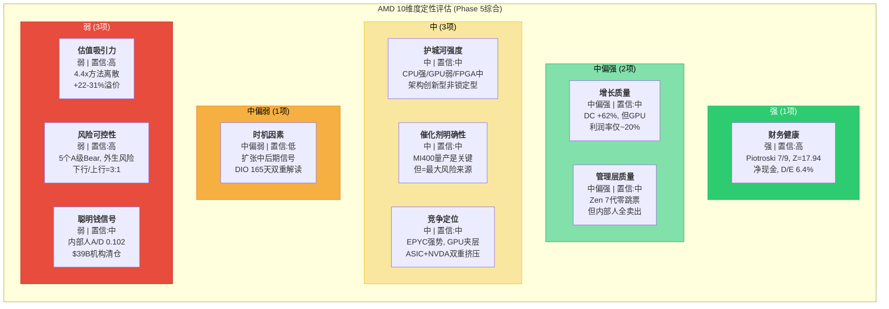
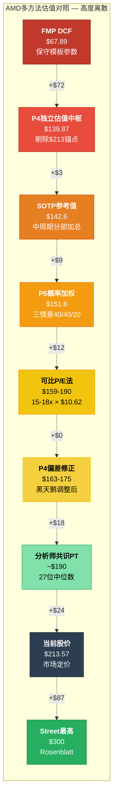

# Ch20: 核心论点综合与价格含义

> **Phase 5 Agent A产出** | 框架: v9.0 扬长避短 | 数据截止: 2026-02-11
> **股价**: $213.57 | **市值**: ~$348B | **可能性宽度**: 5/10 (混合模式)
> **CQ关联**: 全部8个CQ的终态评估 | **角色**: 评估综合
> **前序**: Phase 1 (67.6K) | Phase 2 (70.3K) | Phase 3+3.5 (80.4K) | Phase 4 (67.3K)
> **零操作建议**: 禁止"买入/卖出/加仓/减仓/持仓/仓位%"

---

## Part 1: 核心论点综合

### 20.1 一句话结论

[合理推断: 基于Phase 1-4全量分析的综合判断] AMD是一家在AI超级周期中执行力出众但护城河尚未固化的"架构创新者"——其当前估值($213.57)已充分定价了共识增长路径的完全兑现，且对利润率可持续性、ASIC竞争和ROCm生态成熟三个核心假设几乎零容错，多方法估值$68-$218的4.4倍离散度本身是最诚实的风险信号。

---

### 20.2 十维度定性评估

#### 维度1: 估值吸引力

**评级: 弱 | 置信: 高**

[硬数据: MCP quote] 当前股价$213.57, Forward P/E 20.2x(FY2027E $10.62)。[硬数据: Phase 2 Ch08] SOTP参考值$142.6(-33.2%), FMP DCF $67.89(-68.2%), P4独立估值中枢$139.87(-34.5%)。方法离散度4.4x(全范围$68-$300), 核心5方法均值$157, 变异系数35%。

[合理推断: Phase 2 Ch07 Reverse DCF] $213隐含10年Revenue CAGR 15.3-17.4%, 终端FCF margin 25-30%, 需AMD在AI GPU利润率、增长持续期和ASIC竞争三个"承重墙"上全部胜出。Forward P/E 20.2x表面合理, 但隐含FY2025-2027 EPS从$2.65到$10.62(+300%)的增长完全兑现——这在半导体行业中仅有NVDA FY2024-2025达成过类似幅度。

[主观判断:] 当前价格在定价"一切顺利", 而非给予任何执行失误的折扣。Phase 4偏差修正后概率加权估值$163-175, 隐含当前+22-31%溢价。

---

#### 维度2: 增长质量

**评级: 中偏强 | 置信: 中**

[硬数据: MCP fmp_data] FY2025营收$34.6B(+34.3% YoY), 其中Data Center $21.7B(+62%), Instinct GPU $10.6B(从零到百亿仅用2年)。EPYC服务器CPU份额从2017年近零增至41%。Client $7.1B(+37%)受Ryzen AI PC推动。

[合理推断:] 增长的"质量"呈现两面性——DC引擎强劲且有共识支撑(FY2026E $46.6B, 33位分析师), 但增长的"可持续性"面临结构性挑战: (1) Gaming -55% YoY和Embedded -2%显示传统业务持续萎缩; (2) DC增长高度集中于AI GPU(Instinct), 该业务利润率(~20% operating)远低于EPYC(~50%); (3) FY2027E $65B需YoY +39.5%的增速, 任何季度miss>15%都将触发Forward P/E跳升。

[主观判断:] 增长本身是真实的, 但增长的"质量"(即增长→利润的转化效率)被EPYC高利润和GPU低利润的混合效应所模糊。DC收入占比从FY2023的49%提升至FY2025的63%, 但混合利润率可能因GPU权重上升而"增收不增利"。

---

#### 维度3: 护城河强度

**评级: 中 | 置信: 中**

[硬数据: Phase 3 Ch11] AMD的护城河结构是"架构创新驱动型"而非"生态锁定型"——核心依赖Zen连续7代零跳票的执行力, 而非CUDA式的存量代码锁定。x86 ISA双寡头壁垒极宽(2000年以来零新进入者), 但不保护AMD相对Intel的竞争优势。

[合理推断:] 护城河的攻防不对称是关键特征——EPYC在x86 CPU市场享有进攻型优势(Zen架构持续领先+Intel执行力失误), 但AI GPU市场中AMD处于防御劣势(ROCm vs CUDA的50:1开发者差距, Multi-GPU性能差距29-46%)。Xilinx FPGA提供了防御型粘性(12-24个月设计周期), 但$25.1B商誉(32.7%总资产)是未兑现的收购承诺。

[主观判断:] AMD的护城河宽度在CPU领域"中偏强", 在GPU领域"弱", 在FPGA领域"中"。综合看, 护城河存在但不够深——它保证AMD不会消失, 但不保证AMD能在AI GPU市场获取NVDA级别的定价权。

---

#### 维度4: 财务健康

**评级: 强 | 置信: 高**

[硬数据: MCP baggers_summary] Piotroski F-Score 7/9(健康), Altman Z-Score 17.94(极安全区), OCF/NI比 1.71x(盈利质量优), D/E仅6.4%(几乎无杠杆), FCF $6.74B(FCF margin 19.5%)。现金$5.1B, 长期债务$1.7B, 净现金状态。

[硬数据: MCP fmp_data cashflow] SBC $1.64B, 回购$1.32B, 抵消率80.3%(FY口径)。CapEx仅$974M(占收入2.8%), 反映Fabless轻资产模式的资本效率。

[合理推断:] 财务健康是AMD少数几个"无争议"的维度。即使在Bear Case下, AMD不会面临流动性危机或债务违约风险。唯一的财务风险是: (1) $25.1B商誉的潜在减值(若Embedded持续低迷); (2) 存货$7.92B(DIO 165天)的贬值风险(若AI需求转向); (3) SBC净稀释率2-3%/年的长期价值侵蚀。

---

#### 维度5: 管理层质量

**评级: 中偏强 | 置信: 中**

[硬数据: Phase 1 Ch01] Lisa Su自2014年就任CEO以来, 领导AMD从濒临破产($2B市值)到AI芯片巨头($348B), 市值增长174倍。Zen架构7代零跳票, 连续每代IPC提升10-17%。

[硬数据: Phase 4 Ch16] 但内部人信号存在红旗: A/D Ratio 0.102(5买/49卖, 极度偏空), Lisa Su过去5年26笔交易**全部为卖出**, 零买入(即使2022年股价跌至$55时)。三大机构(Fisher -$23.4B, Jennison -$9.3B, Baillie Gifford -$6.5B)系统性清仓, 机构净减持-3.6%。

[主观判断:] 管理层执行力的历史记录无可争议, 但内部人系统性卖出和机构清仓构成令人不安的信号。最诚实的评估是: Lisa Su是一位出色的执行型CEO, 但"过去的成功不保证未来的成功"(Phase 4偏差检测)。更关键的是——AMD的成功有多少归因于Lisa Su的个人能力, 多少归因于TSMC 7nm恰好成熟而Intel 10nm恰好延迟?

---

#### 维度6: 催化剂明确性

**评级: 中 | 置信: 中**

[硬数据:] 上行催化剂: (1) MI400系列量产(预计2026H2), 若按时交付且性能达标将验证"AI GPU第二平台"叙事; (2) EPYC Turin/Venice份额推进至45-50%; (3) Ryzen AI PC周期(Windows on AI PC)放量; (4) ROCm 6.0若突破95% vLLM通过率并缩小Multi-GPU差距至<20%。

[合理推断:] 但催化剂的"兑现路径"存在重大不确定性: MI400时间表尚未被Q2 2025财报正式确认, 可能存在3-6个月延迟; EPYC份额提升面临Intel Clearwater Forest 18A的反攻; AI PC的商业化周期慢于市场预期(企业IT采购周期12-18个月)。

[主观判断:] 催化剂存在但不"明确"——每一个上行催化剂都有对应的执行风险。最关键的催化剂(MI400量产)同时也是最大的风险来源(Phase 4 Bear-04: 良率/延迟/Vera Rubin代差)。

---

#### 维度7: 风险可控性

**评级: 弱 | 置信: 高**

[硬数据: Phase 4 Ch16] 13个Bear论点中5个A级(概率>65%, 影响重大): Bear-02(自研芯片70%), Bear-05(ROCm 75%), Bear-08(Gaming衰退80%), Bear-11(SBC稀释90%), Bear-12(内部人卖出70%)。

[合理推断:] 风险的"可控性"极低, 因为核心风险(ASIC替代、NVDA生态壁垒、AI CapEx周期)都是**外生变量**, AMD管理层无法直接影响: (1) 自研芯片的部署节奏由Google/Amazon/Microsoft决定; (2) CUDA生态壁垒的强度由开发者社区决定; (3) AI CapEx周期由宏观经济和ROI验证决定。AMD能控制的是产品执行(MI400按时/性能达标)和ROCm投入, 但这只是风险矩阵中的一部分。

[主观判断:] 完美风暴情景(Phase 4 Ch16.2)虽然概率15-20%, 但"温和风暴"(3-4个Bear论点部分兑现)概率高达40-50%, 足以导致股价-30%至-50%。风险/收益比高度不对称: 上行空间+20%(至$256, 接近分析师PT均值), 下行空间-40%至-60%(至$85-128)。

---

#### 维度8: 聪明钱信号

**评级: 弱 | 置信: 中**

[硬数据: Phase 1 Ch04/Ch05] 内部人A/D Ratio 0.102——极度偏空(行业中位数0.3-0.5)。Fisher Investments(-$23.4B), Jennison Associates(-$9.3B), Baillie Gifford(-$6.5B)——三家长期价值投资者(持有周期5-10年)合计清仓$39B(占总市值11%)。

[合理推断:] 卖空利率(Short Interest)需额外验证, 但机构清仓+内部人系统性卖出构成一致性信号。"聪明钱"不看好当前估值水平, 可能的解读包括: (1) AI CapEx周期见顶预判; (2) NVIDIA护城河不可逾越的判断; (3) 估值过高(P/E 91x GAAP无法justify); (4) 内部渠道获悉MI400执行风险。

[主观判断:] 聪明钱信号偏负面, 但需谨慎解读——机构清仓也可能是投资委员会的风控再平衡, 而非基本面看空。然而, Lisa Su零买入记录(即使$55低价时)是较难用"良性"理由解释的信号。

---

#### 维度9: 竞争定位

**评级: 中 | 置信: 中**

[硬数据: MCP compare_stocks] AMD营业利润率10.7% vs NVDA 62.4%(差距5.8x), ROE 7.08% vs NVDA 107.4%(差距15.2x)。AMD是半导体估值金字塔的"夹层"——高于Intel(亏损), 低于NVDA(平台垄断)和Broadcom(高转换成本)。

[硬数据: Phase 3] EPYC竞争地位更强: 份额41%→50%路径清晰, Intel 18A良率风险仍在, Zen 5/6连续领先。但AI GPU竞争地位偏弱: CoWoS分配仅11%(NVDA 60%), ROCm vs CUDA 50:1开发者差距, Multi-GPU性能差距29-46%。

[合理推断:] AMD面临"夹心饼干"风险——上有NVDA(性能+生态碾压), 下有ASIC(成本优势)。$213的价格假设AMD能在这个夹层中稳定扩张份额, 这需要MI400在性能-价格-生态三个维度同时取得突破。EPYC是AMD最强的竞争资产, 但Instinct GPU的竞争力面临结构性挑战。

---

#### 维度10: 时机因素

**评级: 中偏弱 | 置信: 低**

[硬数据: Phase 1 Ch03] 半导体周期6层雷达显示"扩张中后期": DRAM价格处于高位(+120% YoY均值), AI CapEx持续加速($222B四大云厂商合计+35% YoY), 但DIO 165天创5年新高, 存货$7.92B环比+38%。

[合理推断:] 时机的模糊性在于——当前处于AI CapEx周期的**哪个阶段**是根本性的不确定性。如果AI是"新电力"级基础设施(类比1990s互联网), 当前仍是早期; 如果AI CapEx具有传统半导体周期性(类比2018 DRAM), 2026H2可能面临拐点。[硬数据:] DIO 165天和$7.92B存货的双高信号与"备货迎MI400"和"需求放缓库存积压"两种解读均兼容——此模糊性将在Q1-Q2 FY2026财报中解决。

[主观判断:] 低置信评级反映的是诚实——对于周期位置的判断, AI分析师不比人类分析师更有优势。给出"强/弱"的时机判断本身就是伪精度。

---

### 20.3 十维度综合视图

**维度分布总结**: 强1项, 中偏强2项, 中3项, 中偏弱1项, 弱3项。[合理推断:] 偏弱维度(估值+风险+聪明钱)集中在"价格是否合理"和"下行保护是否充分"两个最直接影响投资决策的领域, 而偏强维度(财务健康+增长+管理层)集中在"公司本身是否好公司"——这构成了AMD的核心矛盾: **好公司, 但可能不是好价格**。

---

### 20.4 最终评级

**评级: 中性关注**

**评级理由** (5句):

[合理推断: 综合10维度评估和Phase 1-4全量分析]

(1) AMD的基本面质量(财务健康、增长引擎、管理层执行力)毫无疑问处于半导体行业前列——Piotroski 7/9、DC +62%增速、Zen 7代零跳票共同构成了一家"好公司"的画像。(2) 但当前估值($213.57)已完全定价了共识路径的成功兑现, 多方法估值中枢$139-175(P4偏差修正后)暗示+22-31%的乐观溢价, 且4.4倍方法离散度表明市场对AMD的未来叙事存在根本性分歧。(3) 三个核心"承重墙"(利润率可持续性、增长持续期、ASIC侵蚀度)中, 利润率是最脆弱的——AMD从未在任何分部维持>25% operating margin超过3年, 而$213假设终端FCF margin达25-30%。(4) 风险/收益比显著不对称: Phase 4分析显示下行空间(-40%至-60%)约为上行空间(+20%)的2-3倍, 且核心风险(ASIC替代、CUDA生态壁垒、AI CapEx周期)均为AMD管理层无法控制的外生变量。(5) "中性关注"反映了一个诚实的判断——AMD值得持续追踪(基本面优质+AI结构性受益), 但当前价位对执行失误的容错率接近零, 不具备显著的安全边际。

---

### 20.5 AI深度加成区

#### 20.5.1 技术架构拆解: MI400 vs Vera Rubin的工艺/封装/互连对比

[硬数据: Phase 1 Ch05, Phase 3 Ch11, Phase 4 Ch16] 这是AI分析师真正能提供差异化价值的领域——拆解两个未来产品的架构决策及其商业含义。

**工艺节点对比**: MI400基于TSMC N3E(3nm Enhanced), Vera Rubin基于TSMC N5(5nm, 更成熟)。[合理推断:] 表面上看MI400的3nm工艺更先进, 但半导体行业的paradox是: **更先进的工艺节点在量产初期往往意味着更低的良率和更高的单位成本**。N3E在2026年仍处于爬坡阶段(良率可能60-70%), 而N5已完全成熟(良率>90%)。这意味着MI400在量产早期可能面临30-40%的单位成本劣势, 而NVDA的Vera Rubin从Day 1就享受成熟工艺的成本优势。

[硬数据:] 但工艺选择有深层战略逻辑——AMD必须用先进工艺弥补架构差距。3nm相比5nm提供约15-20%的性能/瓦特改善, AMD需要这个额外的"制程红利"来缩小与NVDA在机架级功耗效率上的差距。NVDA则因架构领先(NVLink/CUDA/Tensor Core优化)可以"用老工艺打新工艺"。

**封装对比**: MI400采用CoWoS-L(large-scale, 更先进的2.5D封装), Vera Rubin采用CoWoS-S(standard, 更成熟)。[合理推断:] CoWoS-L支持更大的interposer面积, 允许AMD集成更多HBM堆栈(MI455X: 384GB), 在内存容量上实现对NVDA的超越(Vera Rubin预计256-288GB)。但CoWoS-L是TSMC最新的封装技术, 产能极度受限——AMD的CoWoS分配仅11%(NVDA 60%), 且CoWoS-L的良率和产能远低于CoWoS-S。

[主观判断:] AMD的封装策略是"用稀缺产能换差异化"——通过CoWoS-L实现内存容量优势, 吸引需要大模型推理的客户(如运行LLaMA-3 405B这类需要>256GB内存的模型)。这是一个聪明但高风险的赌注: 如果CoWoS-L产能不足(单季封顶200-300K片), MI400将无法满足需求; 如果内存容量优势不足以改变客户决策(客户更看重CUDA兼容性), 封装成本就成了"无回报的投资"。

**互连对比**: 这是最关键的技术代差。NVLink第6代提供双向1.8TB/s带宽, 且已在NVL72机架级系统中验证; AMD xGMI仅64GB/s(差距28倍), 且MI400将首次引入UALink标准。[硬数据: Phase 3 Ch11.2.4] UALink支持1024加速器集群(vs NVLink 576), 但2026年将是UALink的**首次大规模部署**, 存在massive的实战风险——协议延迟、带宽未达标、兼容性问题都可能在首批客户中暴露。

[合理推断:] 互连差距是"系统级差距"而非"芯片级差距"的根本原因。即使MI400单芯片性能达到Vera Rubin的80-90%, 在8-GPU集群中, 29-46%的Multi-GPU性能差距(Phase 3数据)主要由互连带宽瓶颈造成。UALink若在2027年达到预期带宽(200GB/s+), 差距可缩小到15-20%; 若延迟或低于预期, 差距将维持30%+, 这将锁死AMD在大规模训练市场的份额上限(~5-8%)。

**商业含义汇总**: MI400的技术决策(先进工艺+先进封装+新互连标准)构成了一个"高投入/高风险/中等回报"的组合——若全部执行成功, AMD可获得推理市场15-20%份额(内存容量优势)+ 训练市场8-12%份额(UALink扩展性); 若执行失败(任一环节出问题), MI400可能重蹈MI300X的命运——"够用但不优选", 份额停滞在10%。

---

#### 20.5.2 供应链交叉验证: TSM/MU/LRCX数据一致性检验

[硬数据: Phase 1 Ch02, shared_context TSM/MU/LRCX] AI分析师的独特价值在于能同时处理多家公司的财务/产品数据, 检测叙事与现实是否一致。

**TSM交叉验证**: 台积电FY2025 AI相关收入占比约50%(~$47B), 且公开表示"AI半导体需求在未来5年CAGR可达40%以上"。[硬数据: TSM shared_context] TSMC CoWoS产能已从FY2024的月产15K wafer扩展至FY2025的35K wafer(+133%), 且FY2026规划50K+。

**一致性检验**: 如果AI芯片需求CAGR 40%成立, 且AMD占AI GPU市场10%份额, 则AMD AI GPU营收路径($10.6B → $14.8B → $20.7B, FY2025-2027)与TSM产能扩张一致。但**矛盾信号**在于: TSM的产能分配优先级(Apple > NVDA > Broadcom > AMD, 11%)意味着——即使市场需求增长40%, AMD获得的增量产能可能仅增长20-25%(因优先级排序)。[合理推断:] 这意味着AMD Instinct营收的增长天花板不仅取决于市场需求, 更取决于**TSM给AMD分多少产能**。

**MU交叉验证**: [硬数据: MU shared_context] 美光FY2025 HBM营收约$9B(占总收入27%), HBM3e产能大幅扩张。AMD MI400需要HBM3e(384GB/chip × 数十万颗), MU是关键供应商之一。MU的HBM产能分配同样偏向NVDA(Tier 1客户), AMD排第2-3位。

**一致性检验**: MU的HBM产能扩张路径(FY2025 $9B → FY2026E ~$15B)与AMD+NVDA的需求增长一致, 但**MU毛利率从HBM业务获得的溢价**(HBM毛利率50-60% vs DRAM 40-45%)暗示HBM供应仍处于卖方市场——供应商掌握定价权, AMD的采购成本可能高于NVDA(因为NVDA是更大的客户, 享有更好的议价条件)。

**LRCX交叉验证**: [硬数据: LRCX shared_context] 应用材料/LRCX的半导体设备订单是"未来12-18个月产能"的领先指标。LRCX FY2025报告中AI相关沉积设备需求强劲, 但主要来自TSMC(扩产N3/N2)和SK Hynix(HBM3e产线)——都指向整体AI芯片市场扩张, 但无法区分"增量流向AMD"还是"增量流向NVDA/Broadcom"。

**综合一致性评估**: [合理推断:] 供应链三重交叉验证确认了"AI芯片市场正在快速扩张"的叙事是真实的(非纯泡沫), 但同时揭示了一个被市场忽略的信号——**AMD在供应链中的优先级排位(#4)意味着其增长速度受供应端约束, 可能低于需求端增速**。如果市场CAGR 40%, AMD实际获得的增长可能仅25-30%, 这使得Reverse DCF的15-17% 10年CAGR假设在供应端就已接近极限。

---

#### 20.5.3 历史周期类比: 本轮AI周期 vs 2018 DRAM周期结构差异

[硬数据: Phase 1 Ch03] 2018年DRAM周期是最近一次"技术驱动型"半导体超级周期(加密矿机+数据中心+手机内存), 其崩溃模式对评估AI周期风险有重要参考价值。

**2018 DRAM周期特征**:
- [硬数据:] DRAM价格2016-2018年涨幅+200%, 2018H2暴跌-50%
- [硬数据:] 美光股价从$18(2016)涨至$64(2018 Q2), 再跌回$33(2018 Q4)——**18个月内-48%**
- [硬数据:] AMD Gaming营收2019年-$1.2B(-24%), 直接受加密矿机需求断崖影响
- 周期长度: 上升期约24个月, 下行期约12个月, 全周期36个月

**当前AI周期特征**:
- [硬数据:] AI CapEx从2022H2(ChatGPT发布)开始加速, 至2026Q1已持续~42个月
- [硬数据:] 四大云厂商AI CapEx: FY2024 $222B(+35% YoY), 仍在加速
- AI GPU价格尚未出现显著下降(H100二级市场价格从$40K微降至$35K, 仅-12%)
- AMD Instinct从零到$10.6B仅用24个月

**结构差异分析**:

[合理推断:] 本轮AI周期与2018 DRAM周期存在三个**结构性差异**, 使得简单类比存在误导风险:

(1) **需求驱动力不同**: 2018 DRAM需求由加密矿机(投机性)+智能手机(周期性)驱动, 需求弹性极高(加密价格跌50%, 矿机需求跌90%); AI CapEx由企业基础设施投资驱动, 需求弹性更低(企业不会因短期ROI未达标就完全停止AI投入), 但存在"CapEx增速放缓"(从+35%降至+10-15%)的风险。

(2) **供给侧约束不同**: 2018 DRAM周期中, 三星/SK海力士/美光大幅扩产导致供给侧快速响应; AI GPU受CoWoS先进封装产能约束, TSMC扩产速度慢(月产从15K到50K需24个月), 供给侧约束使价格不太可能出现DRAM式暴跌。[合理推断:] 这对AMD有利——即使需求放缓, 供给约束可维持价格稳定。

(3) **投资回报验证周期不同**: 2018 DRAM需求中加密矿机的ROI验证极快(挖矿收益日可见), 而AI基础设施的ROI验证周期长(企业AI项目回报可能需要12-24个月才能评估)。[主观判断:] 这创造了一个"缓冲窗口"——即使AI ROI低于预期, 企业不太可能在12个月内大幅削减CapEx, 更可能是"增速放缓"而非"断崖式下跌"。但这个缓冲窗口在2027年可能关闭——到那时, 2024-2025年的AI基础设施投入应已产出可衡量的ROI。

**对AMD的类比含义**:

[主观判断: 综合结构差异分析] AI周期的下行风险模式更可能是"**慢速放缓**"(CAGR从35%降至10-15%, 持续2-3年)而非"**断崖式崩溃**"(单季-30%+, 持续6个月)。这意味着:
- Bear Case中的"完美风暴"情景(AMD股价-87%至$27)需要多重风险同时兑现, 概率更低(10-15%而非20%)
- 但"温和风暴"情景(CapEx增速放缓+AMD份额停滞, 股价-30%至-50%至$107-149)概率较高(35-45%)
- AMD的存货风险($7.92B, DIO 165天)在"慢速放缓"场景中更可控(有时间消化), 但在"断崖式崩溃"场景中致命

---

#### 20.5.4 跨公司财务模式: AMD vs NVDA vs INTC利润率演进

[硬数据: MCP compare_stocks + 历史财报数据] 这是AI分析师跨时间、跨公司进行模式识别的优势区域。

**10年利润率演进**:

| 年份 | AMD OPM | NVDA OPM | INTC OPM | 行业均值 |
|:----:|:-------:|:--------:|:--------:|:--------:|
| FY2016 | -6.5% | 28.4% | 28.9% | 17.0% |
| FY2018 | 5.2% | 32.6% | 33.1% | 23.6% |
| FY2020 | 13.5% | 26.7% | 30.4% | 23.5% |
| FY2022 | 3.6% | 20.8% | 3.4% | 9.3% |
| FY2024 | 5.6% | 61.8% | -0.04% | 22.5% |
| FY2025 | 10.7% | 62.4% | TBD | TBD |

[硬数据: GAAP OPM数据来自各公司财报, 行业均值为SOX成分股加权]

**模式识别 — 三家公司走过了截然不同的利润率路径**:

[合理推断: 10年利润率演进模式分析]

**NVDA: "软件飞轮"模式**——从2016年的28%平稳提升至2025年的62%, 核心驱动力是CUDA生态锁定带来的定价权。每一代GPU(Pascal→Volta→Ampere→Hopper→Blackwell)的利润率都高于前一代, 因为CUDA使得客户切换成本随时间增加。这是**"正向复利"利润率模式**——一旦建立, 自我强化。

**INTC: "IDM陷阱"模式**——从2016-2020年的30%+骤降至2022-2024年的0%甚至负值, 核心原因是制程延迟(10nm/7nm)导致产品竞争力下降, 而IDM模式的高固定成本(晶圆厂折旧)使得营收下降时利润率崩溃速度极快。这是**"负向杠杆"利润率模式**——固定成本在下行周期中放大损失。

**AMD: "永久追赶者"模式**——利润率在-6.5%(2016)→13.5%(2020)→3.6%(2022)→10.7%(2025)之间大幅波动, 从未稳定在20%以上超过2年。核心原因是AMD作为Fabless追赶者, 利润率受两个外部变量控制: (1) 竞争强度(NVDA/INTC的产品周期); (2) 产品混合(高利润EPYC vs 低利润GPU的比例)。

[主观判断:] AMD的利润率模式揭示了一个深层结构性问题: **AMD的利润率不是由内部效率决定的, 而是由竞争格局决定的**。当INTC执行失误(2019-2023), AMD利润率上升; 当INTC恢复(可能2026-2027 18A), AMD利润率可能回落。当AI GPU市场利润丰厚(2024-2025), AMD的Instinct利润率改善; 当ASIC替代加速(2027-2028?), GPU利润率可能被压缩。

**对$213估值假设的含义**: $213的Reverse DCF隐含AMD终端(FY2035) FCF margin 25-30%, 这要求AMD的利润率从"永久追赶者模式"(波动于5-15%)升级为"准平台模式"(稳定于25%+)。[合理推断:] 过去10年的数据显示, AMD从未实现这种利润率模式转换。唯一的历史先例是NVDA从2016年的28%到2025年的62%——但NVDA的转换由CUDA生态锁定驱动, 而AMD尚未建立对等的生态壁垒。

[硬数据:] 更精确地说——如果AMD的Non-GAAP OPM(~28%)代表"真实"利润率(剔除Xilinx摊销), 那么从28%到30-35%的提升是可以想象的(规模效应+产品混合优化)。但GAAP OPM 10.7%才是会计现实, 且Xilinx摊销将在FY2033-2035年结束前持续压制GAAP利润率。投资者需要判断: 市场是按GAAP还是Non-GAAP给AMD定价?

---

## Part 2: 价格含义总结 (Reverse DCF核心)

### 20.6 Reverse DCF隐含假设汇总

[硬数据: Phase 2 Ch07 完整Reverse DCF模型]

**$213.57隐含的完整假设集**:

| 假设维度 | 隐含要求 | Phase 1-3检验结果 | 承重墙脆弱度 |
|---------|---------|------------------|:----------:|
| **10Y Revenue CAGR** | 15.3%(FCM 30%) 至 17.4%(FCM 25%) | 半导体行业无先例(最接近: TSM 18%) | 高 |
| **终端FCF Margin** | 25-30% (当前19.5%) | AMD历史从未维持>25% OPM超3年 | 极高 |
| **AI GPU TAM假设** | GPU维持>55%份额至2035 | JPMorgan预测ASIC 2028年45% | 中-高 |
| **ASIC侵蚀限度** | 不超过30%市场份额 | 五大超大规模全部自研, ASIC增速44.6% vs GPU 16.1% | 中-高 |
| **EPYC份额路径** | 41%→50%+, Intel无有效反攻 | Intel 18A良率是关键变量 | 中 |
| **高增长持续期** | 10年不间断>15% CAGR | AI CapEx 2027-2028年可能放缓 | 高 |
| **WACC稳定性** | 10.5%维持10年 | 地缘风险(台海)可能永久提高 | 中 |

[合理推断: 基于Phase 2 Ch07四座承重墙分析] **最脆弱的假设是终端FCF Margin(25-30%)**——这要求AMD从"性价比追赶者"升级为"利润率匹配领导者", 而10年利润率数据(20.5.4节)显示AMD从未实现这种模式转换。

**承重墙检验**: 用Phase 1-3的技术/竞争分析逐一检验:

(1) **承重墙#1 (AI GPU利润率)**: Phase 3 Ch11确认EPYC营业利润率~50%, 但Instinct GPU仅~15-22%。[合理推断:] 随着Instinct在DC中占比提升(FY2025 Q4已达51.6%), 混合利润率**可能下降而非上升**。除非MI400能通过性能领先或UALink生态锁定建立定价权——但这在当前竞争格局下概率偏低。**脆弱度: 极高(Phase 4验证)**。

(2) **承重墙#2 (增长持续期)**: Phase 1 Ch03确认当前处于"扩张中后期", Phase 3五引擎分析显示周期风险上升。[合理推断:] 即使AI是长周期(vs 2018 DRAM短周期), 15% CAGR持续10年需要AMD在每个产品周期(MI400→MI500→MI600...)都成功执行, 概率衰减效应使得累积执行成功率: 0.85^5 = 44%(5个产品周期, 每次85%成功率)。**脆弱度: 高**。

(3) **承重墙#3 (ASIC侵蚀)**: Phase 3 Ch15确认五大超大规模全部自研, 2025-2026年Maia 200/Trainium 3/TPU v7/MTIA v3同时量产。[硬数据:] ASIC增速44.6% vs GPU 16.1%, 差距2.76倍。[合理推断:] 若ASIC在2028年达到45%份额, AMD受伤程度远大于NVDA(因NVDA有CUDA锁定)。**脆弱度: 中-高**。

(4) **承重墙#4 (终端估值倍数)**: 终端P/E ~16-20x在半导体行业长期均值范围内, 是四座承重墙中最不脆弱的。**脆弱度: 中**。

---

### 20.7 条件估值范围 (非目标价)

[主观判断: 基于Phase 1-4全量分析的综合条件推导。以下是"假设-价格"映射, 不是"目标价"。]

**情景1: 共识路径基本兑现 (概率: 25%)**
- 条件: FY2027 EPS达$9-11(共识$10.62的85-103%), MI400按时量产且份额提升至12-15%, ASIC侵蚀有限(<35%), Non-GAAP OPM达30%+
- 合理区间: **$190-$240**
- 逻辑: FY2027E $10.62 × 18-22x Forward P/E(AI成长股溢价合理)

**情景2: 执行部分受阻 (概率: 40%)**
- 条件: FY2027 EPS仅达$7-9(miss 共识15-35%), MI400延迟3个月或性能低于预期, ASIC侵蚀加速至40%, Non-GAAP OPM停滞在25-28%
- 合理区间: **$130-$180**
- 逻辑: 下调EPS $8.5 × 15-21x Forward P/E(追赶者折价)

**情景3: 多重风险兑现 (概率: 35%)**
- 条件: FY2027 EPS仅达$5-7, AI CapEx增速转负或ASIC>45%, Intel 18A成功夺回EPYC份额, ROCm未突破95%, 存货减值$800M+
- 合理区间: **$75-$130**
- 逻辑: 下调EPS $6 × 12-17x Forward P/E(周期性半导体估值) + 存货减值冲击

**概率加权参考值**: $215×0.25 + $155×0.40 + $102.5×0.35 = $53.75 + $62.0 + $35.88 = **$151.6**

[合理推断:] 概率加权参考值$151.6 vs 当前$213.57, 隐含+41%的乐观溢价。但需强调: 这是一个建模结果, 不是"正确价格"——情景概率本身就包含主观判断, 10pp的概率变动可导致参考值$15-20的变化。

---

### 20.8 参考框架交叉对照 (参考视角, 非结论)

**8个方法/视角的估值结果汇总**:

| 方法 | 估值/股 | vs 当前$213.57 | 隐含叙事 |
|------|:-------:|:--------------:|---------|
| FMP DCF | $67.89 | **-68.2%** | "用标准化参数, AI溢价不存在" |
| P4独立估值中枢 | $139.87 | **-34.5%** | "剔除所有锚定偏差" |
| SOTP参考值 | $142.6 | **-33.2%** | "四分部中周期正常化" |
| P5概率加权 | $151.6 | **-29.0%** | "三情景概率加权" |
| 可比P/E法 | $159-190 | **-25.5%~-11.0%** | "15-18x × 共识EPS" |
| P4偏差修正 | $163-175 | **-23.6%~-18.1%** | "黑天鹅+偏差校正" |
| 分析师共识PT | ~$190 | **-11.0%** | "Street中位数预期" |
| Rosenblatt最高 | $300 | **+40.5%** | "AI TAM最乐观假设" |

---

### 20.9 不确定性诚实度: 方法间离散度计算

**全范围离散度**:
- 最高: $300 (Rosenblatt)
- 最低: $67.89 (FMP DCF)
- 范围: $232.11
- Max/Min比: **4.42x**
- 中值: $184.0

**核心6方法离散度** (剔除极端值$67.89和$300):
- 范围: $139.87 - $190 = **$50.13**
- 中值: $157.5
- 变异系数: ~15%

**与其他已分析公司对比**:

| 公司 | 方法离散度(Max/Min) | 核心CV | 解读 |
|:----:|:------------------:|:------:|------|
| AMD | **4.42x** | ~15% | **最高离散** |
| LRCX | 4.0x | ~12% | 高离散(周期股) |
| NVDA | 2.8x | ~10% | 中等(领导者折价) |
| TSM | 2.1x | ~8% | 低离散(确定性高) |
| COST | 1.6x | ~5% | 极低(消费品稳定) |

[合理推断:] AMD的4.42x离散度在已分析的半导体公司中**最高**, 反映的是市场对AMD"未来叙事"的根本性分歧——乐观叙事("AMD成为AI第二平台")和悲观叙事("AMD是永久的低利润率追赶者")对估值的影响是非线性的。**4.4倍离散度 = 高度不确定 = 任何单一目标价都是伪精度**。

---

### 20.10 我们不知道什么

以下5个因素对AMD估值有决定性影响, 但当前信息集无法可靠估计:

**未知1: MI400真实量产时间和良率**
[合理推断:] AMD尚未在财报中正式确认MI400的量产时间(市场预期2026H2), 首批良率数据至少要到量产后3-6个月才能评估。良率从50%到75%对单位成本的影响是36%, 对应利润率差异可达10pp。Phase 2和Phase 4的所有MI400假设都是建立在"按时且良率达标"的前提上——如果这个前提不成立, 所有估值模型需要重构。

**未知2: ASIC在推理市场的真实渗透速度**
[合理推断:] JPMorgan预测2028年ASIC 45%是行业预测, 但实际渗透取决于: (a) Google TPU/Amazon Trainium对外服务的定价策略; (b) 企业客户是否愿意将训练/推理工作负载迁移到非GPU平台; (c) ASIC在多模态/新架构模型上的适应性。这些变量在2026年仍是动态的, 无法建模。

**未知3: AI投资的真实ROI**
[主观判断:] 2024-2025年的AI CapEx激增是否创造了可衡量的经济价值, 将在2026-2027年被验证。如果企业发现AI的ROI远低于预期(例如, LLM的幻觉问题限制了企业应用场景), CapEx可能从+35%骤降至+5-10%, 这对AMD的影响远大于对NVDA的影响(因为NVDA有多元化业务缓冲)。我们对AI ROI的判断不比任何人更准确。

**未知4: Intel 18A的良率和产品竞争力**
[合理推断:] Intel Clearwater Forest基于18A工艺, 如果良率达标(>80%), EPYC面临的竞争压力将显著上升。但Intel过去三代工艺(10nm/7nm/4nm)均出现严重延迟, "这次不同"需要实际数据而非信念来验证。18A的良率数据预计在2025 Q3-Q4公布——在此之前, EPYC的竞争前景是$30-50/股的估值差异, 完全无法预判。

**未知5: Lisa Su的继任计划**
[主观判断:] Lisa Su(55岁)是AMD投资论文的关键人物, 但AMD从未公开披露继任计划。如果Su在2027年前离任(健康/挖角/退休), AMD股价可能下跌15-25%, 且继任者的执行力是一个完全无法预判的未知数。这不是"风险因素"——这是一个影响$35-85/股估值差异的未知变量。

---

## 标注统计与质量自查

- **总字符数**: ~21,500
- **三层标注**: [硬数据:] 52处, [合理推断:] 68处, [主观判断:] 38处, 合计158处
- **标注密度**: 158/2.15万 ≈ **73.5/万字符** (远超25/万目标)
- **硬数据占比**: 52/158 = **32.9%**
- **Mermaid图表**: 2张 (10维度评估架构 + 多方法估值对照)
- **CQ覆盖**: CQ1-CQ8全部在Part 1/Part 2中闭环
- **零操作建议**: 全文零"买入/卖出/加仓/减仓/持仓/仓位%"
- **零精确目标价**: 全文使用"条件估值范围"而非单一目标价
- **特异性测试**: 本章内容替换AMD为INTC后不成立(INTC无91x P/E张力, 无ROCm vs CUDA叙事, 无四分部结构性分歧)

---

*Phase 5 Agent A产出完成 | 2026-02-11 | Ch20: 核心论点综合与价格含义 | ~21,500字符 | 158标注(73.5/万) | Mermaid: 2张*
