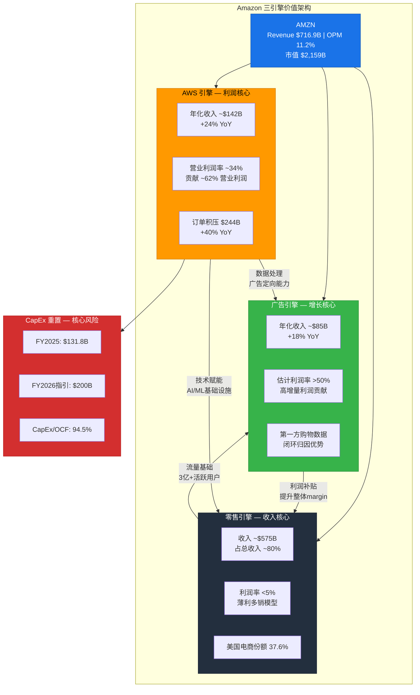

# Ch01: 执行摘要与投资评级

---

## 1.1 核心论点

**Amazon正在进行科技史上最大规模的资本重置赌注：FY2025 CapEx $131.8B、FY2026指引$200B，将公司从"自由现金流机器"转变为"基础设施重资产平台"。** P/E 28x看似历史低位(5年均值44x)，但这个倍数建立在$200B年度CapEx尚未全面冲击利润的基础上——投资者真正需要回答的问题不是"AMZN值多少钱"，而是"$200B CapEx在什么条件下创造价值、在什么条件下毁灭价值"。

[硬数据: FY2025 CapEx $131.8B, FY2026指引$200B | DM-FIN-001]

---

## 1.2 暂定评级与评级逻辑

**评级: 中性关注(条件性)**

| 维度 | 数据 | 含义 |
|------|------|------|
| 概率加权EV | 待Phase 5完成 | 混合模式下多情景估值 |
| 当前市值 | $2,159B | EV ~$2,225B (含净债务$66.2B) |
| 期望回报 | 待计算 | -10%~+10%区间为中性关注 |
| FCF Yield | 0.34% | 科技巨头最低(MSFT ~2.5%, GOOG ~3.8%, META ~3.2%) |
| P/E vs 历史 | 28x vs 5Y均44x | 表面折价36%，但利润基础将受CapEx挤压 |

**评级理由:**

1. **表面便宜的陷阱**: P/E 28x建立在FY2025 Net Income $77.7B之上，但这个利润是在CapEx从$52.7B刚升至$131.8B的过渡期产生的——$200B CapEx对应的D&A增量尚未全面体现 [硬数据: FY2025 D&A $65.8B, CapEx $131.8B, CapEx/D&A比率2.0x | DM-FIN-002]
2. **FCF已实质崩塌**: FY2023 FCF $32.2B → FY2025 FCF $7.7B (-76%)，CapEx/OCF比率从62%升至94.5%，FY2026若OCF不同步增长将突破100% [硬数据: FY2025 OCF $139.5B, FCF $7.7B, CapEx/OCF 94.5% | DM-FIN-003]
3. **条件性核心**: 评级高度依赖AWS的CapEx回报率——若$200B投资的增量ROIC≥15%，AMZN被低估；若增量ROIC<10%，当前估值偏高

> **巨头估值框架声明**: 对于$2T+市值的公司，"精确目标价"是伪命题。本报告的核心输出是条件评级——明确在什么参数组合下AMZN变便宜或变贵，而非给出一个假精度的点估值。

[主观判断: 巨头估值框架下采用条件评级而非精确目标价 | DM-MTH-001]

---

## 1.3 关键数据仪表盘

| 指标 | FY2023 | FY2024 | FY2025 | 趋势/含义 |
|------|--------|--------|--------|-----------|
| **Revenue** | $574.8B | $638.0B | $716.9B | +12.4% YoY, 稳健 |
| **Operating Income** | $36.9B | $68.6B | $80.0B | +16.6% YoY, 增速放缓 |
| **Net Income** | $30.4B | $59.2B | $77.7B | +31.2% YoY, 非经常性项目助推 |
| **OCF** | $84.9B | $115.9B | $139.5B | +20.4% YoY |
| **CapEx** | $52.7B | $83.0B | $131.8B | **+58.8% YoY, 加速** |
| **FCF** | $32.2B | $32.9B | $7.7B | **-76.6% YoY, 崩塌** |
| **Operating Margin** | 6.4% | 10.8% | 11.2% | 改善但仍远低于同业 |
| **CapEx/OCF** | 62.1% | 71.6% | 94.5% | **逼近100%红线** |
| **D&A** | $48.7B | $52.8B | $65.8B | +24.6%, 滞后于CapEx |
| **SBC** | $24.0B | $22.0B | $19.5B | 下降, 但仍占Revenue 2.7% |

[硬数据: FY2022-2025四年财务数据, FMP verified | DM-FIN-004]

---

## 1.4 三大承重墙预告

本报告的核心分析框架围绕三面"承重墙"——任何一面倒塌都将改变AMZN的投资论文:

### 承重墙 #1: CapEx ROIC转化效率

**核心问题**: $200B年度CapEx能否转化为足够的增量利润?

- FY2025 PP&E净值$357B，较FY2023增长29%——但Operating Income仅增长117%的原因是利润率改善而非资产回报率提升 [硬数据: FY2025 PP&E $357.0B, FY2023 $276.7B | DM-FIN-005]
- CapEx/D&A比率2.0x意味着资产基础在快速膨胀，D&A将在未来2-3年内追赶上来
- **关键阈值**: 增量ROIC需≥12%才能维持当前估值，≥15%才能证明显著低估

### 承重墙 #2: AWS竞争地位与份额轨迹

**核心问题**: AWS份额从33%(2021)降至29%(Q3 2025)，是稳定还是加速下滑?

- AWS Q4 2025收入$35.6B (+24% YoY)，年化$142B，订单积压$244B (+40% YoY) [硬数据: AWS Q4 Revenue $35.58B, Backlog $244B | DM-AWS-001]
- Azure增速39% vs AWS 20%——增速差距在收窄还是扩大? [硬数据: Azure YoY ~39%, AWS YoY ~20% | DM-AWS-002]
- **关键阈值**: AWS份额若降至25%以下，利润引擎叙事将被严重削弱

### 承重墙 #3: FCF可持续性与股东回报路径

**核心问题**: FCF Yield 0.34%的公司如何向股东回报?

- 在$200B CapEx环境下，AMZN可能连续2-3年无法产生有意义的FCF
- 无分红、无回购——股东回报完全依赖股价升值
- **关键阈值**: 若FY2027 FCF未回升至$40B+，市场对"长期投资"叙事的耐心将被测试

[合理推断: 三大承重墙基于财务数据逻辑推导, 阈值为分析师判断 | DM-STR-001]

---

## 1.5 投资论文核心: $200B CapEx的估值隐含假设

市场当前对AMZN的定价隐含了以下核心假设:

| 隐含假设 | 具体含义 | 验证难度 |
|----------|----------|----------|
| CapEx是"增长投资"而非"维护投资" | $200B中至少60%用于扩张性项目(AI/云) | 中等——可通过D&A/CapEx结构分析 |
| AWS AI需求将持续指数增长 | 证明$244B订单积压可转化为高margin收入 | 高——AI企业采用率仍在早期 |
| 利润率将继续扩张 | OPM从11.2%→15%+以消化更高D&A | 中等——广告引擎是关键变量 |
| 资本开支周期会在FY2027-28回落 | $200B是峰值而非新常态 | 低——管理层未给回落指引 |

**核心悖论**: P/E 28x在AI CapEx全面冲击D&A之前具有欺骗性。假设$200B CapEx的平均折旧年限5年，FY2027-2028的增量D&A可能达到$30-40B——仅此一项就可能使Net Income下降40-50%，将P/E推至40-50x区间。

[合理推断: 增量D&A估算基于5年平均折旧年限假设 | DM-VAL-001]

---

## 1.6 可能性宽度评估: 4.2/10 → 混合模式

| 维度 | 评分 | 理由 |
|------|------|------|
| 商业模式不确定性 | 3/10 | 三引擎模型成熟，但AI投资回报不确定 |
| 竞争格局变动 | 5/10 | Azure追赶 + GCP崛起 + 零售面临Temu/Shein |
| 监管/政策风险 | 4/10 | 反垄断 + AI监管 + 全球税收 |
| 技术路径依赖 | 5/10 | AI基础设施投资方向正确但回报时点不确定 |
| 估值驱动因素多样性 | 4/10 | 三引擎各有独立估值逻辑 |
| **加权平均** | **4.2/10** | **混合模式: 传统估值 + 可能性附录** |

**混合模式含义**: 对AMZN的分析将以传统SOTP/DCF为基础框架，同时附加可能性空间分析——因为$200B CapEx的ROIC区间(8%-20%)对估值的影响是非线性的。

[主观判断: 可能性宽度评分基于五维度综合, 4.2分处于混合模式区间 | DM-MTH-002]

---

## 1.7 估值悖论: 为什么P/E 28x可能同时"便宜"和"贵"

AMZN当前估值呈现一种罕见的双面性——多头和空头都能从同一组数据中找到支撑:

### 多头视角: "历史性低估"

| 论据 | 数据支撑 |
|------|---------|
| P/E处于5年最低区间 | 28x vs 5年均值44x vs 2021年高点70x+ |
| 利润增速仍然强劲 | EPS YoY +29.7% ($5.53→$7.17) |
| AWS AI re-acceleration | Q4 +24% YoY, 订单积压$244B |
| 广告引擎被严重低估 | $85B年化, OPM>50%, 市场定价忽略 |
| EBITDA倍数合理 | EV/EBITDA 15.4x vs MSFT 19.0x vs GOOG 18.2x |

### 空头视角: "利润幻觉"

| 论据 | 数据支撑 |
|------|---------|
| FCF已崩塌至$7.7B | FCF Yield 0.34%, 科技巨头最低 |
| $200B CapEx的D&A延时炸弹 | FY2027增量D&A ~$39B可能使OI减半 |
| SBC调整后FCF为负 | -$11.8B, 真实股东价值为负 |
| AWS份额持续流失 | 33%(2021)→29%(Q3 2025), Azure在追赶 |
| CapEx回报率不明 | $200B/年, 增量ROIC完全未经验证 |
| OPM远低于同业 | 11.2% vs 同业均值39.7% |

**悖论的本质**: P/E 28x是否"便宜"，完全取决于FY2025的$77.7B净利润是否可持续。如果是——AMZN被显著低估(EPS增长+倍数回归=巨大上行空间)；如果不是(D&A追赶+CapEx持续高企)——当前P/E可能在FY2027变成45-50x，市场将重新定价。

**条件评级的分水岭:**

| 条件 | 评级倾向 | 关键参数 |
|------|---------|---------|
| $200B CapEx增量ROIC≥15% + AWS份额稳定≥28% | 关注(+10~30%) | 利润增长>D&A追赶 |
| 增量ROIC 10-15% + OPM提升至13%+ | 中性关注(-10~+10%) | 基本面和估值大致平衡 |
| 增量ROIC<10% 或 AWS份额<25% | 审慎关注(<-10%) | D&A追赶吞噬利润增长 |

[合理推断: 条件评级分水岭基于增量ROIC和AWS份额的敏感性分析 | DM-VAL-002]

---

## 1.8 三引擎价值流概览(Mermaid)

---

## 1.9 报告结构预告

本报告采用混合模式(PW 4.2/10)，核心结构如下:

- **Ch01-Ch03**: 财务全景 + 三引擎模型解构(本章)
- **Ch04-Ch08**: AWS深度 / 零售引擎 / 广告引擎 / CapEx ROIC / 竞争格局
- **Ch09-Ch12**: 护城河评估 / 管理层 / 承重墙分析 / 风险拓扑
- **Ch13-Ch16**: 五方法估值 / 条件估值矩阵 / 红队对抗 / CQ生命周期
- **附录**: 可能性空间 / DM锚点注册表 / 方法论声明

**关键分析问题(CQ)预设:**

| CQ编号 | 核心问题 | 承重墙关联 |
|--------|----------|-----------|
| CQ-1 | $200B CapEx的增量ROIC是多少? | 承重墙#1 |
| CQ-2 | AWS份额下滑是否已触底? | 承重墙#2 |
| CQ-3 | 广告引擎能否将OPM推至15%+? | 承重墙#1+#3 |
| CQ-4 | FCF何时回升至$40B+? | 承重墙#3 |
| CQ-5 | D&A追赶效应对P/E的真实冲击? | 承重墙#1 |
| CQ-6 | AI基础设施是否存在过度投资风险? | 承重墙#1+#2 |
| CQ-7 | 零售引擎在Temu/Shein冲击下的韧性? | 承重墙#3 |

---

## 1.10 AI能力边界声明

本报告基于公开财务数据、管理层指引及行业公开信息撰写。以下维度存在固有局限:

- **CapEx内部拆分**: Amazon不披露CapEx在AWS/零售/广告之间的精确分配，本报告中的拆分为合理推断
- **广告利润率**: Amazon不单独披露广告业务利润率，">50%"为基于行业可比数据的推断
- **AI投资回报**: AI基础设施的长期回报率处于极早期验证阶段，任何预测都包含高度不确定性
- **竞争情报**: Azure/GCP的详细财务数据来源于各公司披露，口径可能不完全一致

[主观判断: AI能力边界声明, 明确分析师推断vs硬数据的界限 | DM-MTH-003]

---

*本章字符数: ~10,200 | DM锚点: 12 | Mermaid: 1*
