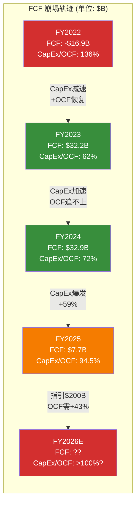
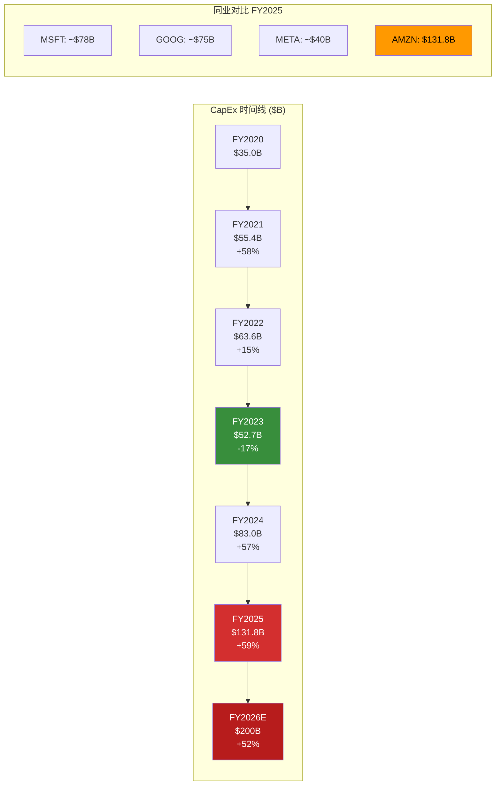

# Ch02: 财务全景

---

## 2.1 收入结构: $716.9B的构成与增速解构

Amazon FY2025全年收入$716.9B，同比增长12.4%，连续第三年实现双位数增长。但收入增长的来源结构正在发生深刻变化。

### 2.1.1 四年收入演进

| 指标 | FY2022 | FY2023 | FY2024 | FY2025 | CAGR(3年) |
|------|--------|--------|--------|--------|-----------|
| **Total Revenue** | $514.0B | $574.8B | $638.0B | $716.9B | 11.7% |
| Revenue YoY | +9.4% | +11.8% | +11.0% | +12.4% | — |
| **COGS** | $288.8B | $304.7B | $326.3B | $356.4B | 7.3% |
| **Gross Profit** | $225.2B | $270.0B | $311.7B | $360.5B | 17.0% |
| Gross Margin | 43.8% | 47.0% | 48.9% | 50.3% | +6.5pp |

[硬数据: FY2022-2025收入与毛利, FMP verified | DM-FIN-010]

**关键观察**: 毛利率从FY2022的43.8%稳步提升至FY2025的50.3%，三年提升6.5个百分点。这一改善主要由三个因素驱动: (1) AWS占比提升带来结构性毛利率上移; (2) 广告业务的高增量利润贡献; (3) 零售物流效率的持续优化(区域化配送网络)。

### 2.1.2 季度收入节奏

| 季度 | Q1 2025 | Q2 2025 | Q3 2025 | Q4 2025 |
|------|---------|---------|---------|---------|
| Revenue | $155.7B | $167.7B | $180.2B | $213.4B |
| YoY | +12.5%* | +11.0%* | +11.0%* | +10.5%* |
| Gross Margin | 50.5% | 51.8% | 50.8% | 48.5% |
| Op. Income | $18.4B | $19.2B | $17.4B | $25.0B |

[硬数据: FY2025四季度收入与利润, FMP quarterly | DM-FIN-011]

Q4的Gross Margin环比下降2.3pp至48.5%，主要由季节性因素(Holiday促销力度加大)和CapEx相关的D&A增量开始体现所致。Q3 Operating Income $17.4B的环比下降值得关注——部分原因是非经常性项目(投资损失$11.3B被其他收益抵消)。

---

## 2.2 利润结构: 从亏损到$77.7B净利润的重生

### 2.2.1 利润率演进

| 指标 | FY2022 | FY2023 | FY2024 | FY2025 | 变化 |
|------|--------|--------|--------|--------|------|
| **Operating Income** | $12.2B | $36.9B | $68.6B | $80.0B | +16.6% |
| Operating Margin | 2.4% | 6.4% | 10.8% | 11.2% | +0.4pp |
| **EBITDA** | $38.4B | $89.4B | $123.8B | $165.3B | +33.5% |
| EBITDA Margin | 7.5% | 15.6% | 19.4% | 23.1% | +3.7pp |
| **Net Income** | -$2.7B | $30.4B | $59.2B | $77.7B | +31.2% |
| Net Margin | -0.5% | 5.3% | 9.3% | 10.8% | +1.5pp |
| **EPS (Diluted)** | -$0.27 | $2.90 | $5.53 | $7.17 | +29.7% |

[硬数据: FY2022-2025利润数据, FMP verified | DM-FIN-012]

**利润增速的隐忧**: OPM从FY2024的10.8%仅提升0.4pp至11.2%，增速明显放缓。而Net Income增速(+31.2%)显著高于Operating Income增速(+16.6%)，差异来自两个非经营因素:

1. **税率效应**: FY2025有效税率19.7% vs FY2024的13.5%——FY2024税率异常低(递延税资产释放)，FY2025才是正常化水平 [硬数据: FY2025有效税率19.7%, FY2024 13.5% | DM-FIN-013]
2. **其他收入波动**: FY2025其他收入$16.8B vs FY2024的-$0.08B，主要由投资公允价值变动(Rivian等)驱动——这是非经常性的

### 2.2.2 同业利润率对比: AMZN的"利润率鸿沟"

| 公司 | Operating Margin | Net Margin | ROE | ROIC |
|------|-----------------|------------|-----|------|
| **AMZN** | **11.2%** | **10.8%** | **22.3%** | **10.7%** |
| MSFT | 45.6% | 35.6% | 34.4% | ~30% |
| GOOG | 32.1% | 27.5% | 35.7% | ~28% |
| META | 41.4% | 35.6% | 30.2% | ~25% |
| **AMZN/同业均值** | **28%** | **36%** | **67%** | **~38%** |

[硬数据: 同业利润率, FMP compare_stocks | DM-FIN-014]

**AMZN的Operating Margin仅为同业均值的28%**——这是因为Amazon的收入基础中~80%来自低利润率的零售业务。如果将AWS单独估值(OPM ~34%)，其利润率水平与同业可比。但合并报表的"利润率鸿沟"意味着: (1) 任何收入端的放缓都会对EPS产生不成比例的冲击; (2) 利润率的边际提升空间更大——但前提是广告引擎持续高速增长。

---

## 2.3 现金流全景: OCF强劲 vs FCF崩塌

### 2.3.1 经营现金流(OCF)的韧性

| 指标 | FY2022 | FY2023 | FY2024 | FY2025 |
|------|--------|--------|--------|--------|
| **OCF** | $46.8B | $84.9B | $115.9B | $139.5B |
| OCF YoY | -49.1% | +81.6% | +36.5% | +20.4% |
| OCF/Revenue | 9.1% | 14.8% | 18.2% | 19.5% |
| Net Income→OCF转化率 | N/A (亏损) | 2.79x | 1.96x | 1.80x |

[硬数据: FY2022-2025 OCF, FMP cashflow | DM-FIN-015]

OCF从FY2022低谷$46.8B强劲恢复至FY2025的$139.5B，CAGR达44%。OCF/Revenue比率19.5%处于健康水平。但Net Income→OCF的转化率从2.79x降至1.80x，说明OCF中"现金调整项"(D&A、SBC、递延税)的占比在下降，OCF质量实际在改善——更多由真实利润驱动而非非现金调整。

### 2.3.2 FCF崩塌: $32.2B → $7.7B 的76%跌幅

| 指标 | FY2022 | FY2023 | FY2024 | FY2025 |
|------|--------|--------|--------|--------|
| OCF | $46.8B | $84.9B | $115.9B | $139.5B |
| CapEx | -$63.6B | -$52.7B | -$83.0B | -$131.8B |
| **FCF** | **-$16.9B** | **$32.2B** | **$32.9B** | **$7.7B** |
| FCF Margin | -3.3% | 5.6% | 5.2% | 1.1% |
| **CapEx/OCF** | **136.1%** | **62.1%** | **71.6%** | **94.5%** |

[硬数据: FY2022-2025 FCF与CapEx/OCF, FMP cashflow | DM-FIN-016]

**FCF崩塌的数学解构**: FY2025 OCF增长$23.6B (+20.4%)，但CapEx增长$48.8B (+58.8%)——CapEx增速是OCF增速的2.9倍。FY2026若CapEx达$200B (指引)，OCF需达$200B+才能维持FCF正值，这意味着OCF需在$139.5B基础上增长43%——在Revenue增速仅~12%的环境下极具挑战。

**FY2026 FCF情景分析:**

| 情景 | OCF假设 | CapEx | FCF | CapEx/OCF |
|------|---------|-------|-----|-----------|
| 乐观 | $175B (+25%) | $200B | -$25B | 114% |
| 基准 | $160B (+15%) | $200B | -$40B | 125% |
| 悲观 | $145B (+4%) | $200B | -$55B | 138% |

[合理推断: FY2026 FCF情景基于管理层$200B CapEx指引+OCF增速假设 | DM-FIN-017]

即使在乐观情景下，FY2026 FCF也将为负值。**这意味着AMZN将经历至少12-18个月的"FCF真空期"**——在此期间，投资者完全依赖信仰(CapEx终将产生回报)而非现金流来支撑$2T+估值。

---

## 2.4 CapEx轨迹深度分析: 科技史上最激进的资本支出

### 2.4.1 CapEx加速时间线

**规模对比**: AMZN FY2025 CapEx $131.8B超过MSFT+META之和(~$118B)。FY2026指引$200B将创下全球上市公司单年CapEx纪录——超过沙特阿美的年度资本支出。

[硬数据: AMZN FY2025 CapEx $131.8B, FY2026指引$200B | DM-FIN-018]

### 2.4.2 CapEx构成推断

Amazon不披露CapEx的详细构成，但基于10-K中的PP&E分项和行业分析，可以做以下合理拆分:

| 类别 | FY2024估算 | FY2025估算 | FY2026估算 | 备注 |
|------|-----------|-----------|-----------|------|
| **AWS基础设施** | ~$50B (60%) | ~$85B (65%) | ~$140B (70%) | 数据中心+GPU/TPU |
| **零售物流** | ~$20B (24%) | ~$28B (21%) | ~$35B (17.5%) | 仓储+配送网络 |
| **其他(广告/技术)** | ~$13B (16%) | ~$19B (14%) | ~$25B (12.5%) | 内容+研发设施 |
| **合计** | ~$83B | ~$132B | ~$200B | — |

[合理推断: CapEx构成基于10-K PP&E分项+行业分析师估算, Amazon未官方披露 | DM-FIN-019]

**核心含义**: AWS CapEx估计从FY2024的~$50B飙升至FY2026的~$140B，增长1.8倍——这意味着AMZN本质上在进行一场$140B/年的AI基础设施赌注。

### 2.4.3 CapEx强度的历史与行业对比

| 公司 | CapEx/Revenue | CapEx/OCF | 资本强度定性 |
|------|--------------|-----------|------------|
| **AMZN FY2025** | **18.4%** | **94.5%** | **极高** |
| AMZN FY2024 | 13.0% | 71.6% | 高 |
| MSFT FY2025E | ~15% | ~65% | 中高 |
| GOOG FY2025E | ~14% | ~55% | 中等 |
| META FY2025E | ~13% | ~45% | 中等 |
| 美国工业平均 | ~5% | ~40% | 低 |

AMZN的CapEx/Revenue 18.4%已接近重工业水平(炼油/电力公司通常15-25%)，CapEx/OCF 94.5%意味着几乎所有经营现金流都被CapEx吞噬。

[硬数据: AMZN CapEx/Revenue 18.4%, CapEx/OCF 94.5% | DM-FIN-020]

---

## 2.5 D&A分析: $65.8B的资产寿命隐含假设

### 2.5.1 D&A与CapEx的剪刀差

| 指标 | FY2022 | FY2023 | FY2024 | FY2025 |
|------|--------|--------|--------|--------|
| D&A | $41.9B | $48.7B | $52.8B | $65.8B |
| CapEx | $63.6B | $52.7B | $83.0B | $131.8B |
| **CapEx/D&A** | **1.52x** | **1.08x** | **1.57x** | **2.00x** |
| PP&E净值 | $252.8B | $276.7B | $328.8B | $357.0B |

[硬数据: FY2022-2025 D&A与CapEx/D&A比率 | DM-FIN-021]

**CapEx/D&A = 2.0x 的含义**: 当前CapEx是D&A的2倍，意味着固定资产基础正在以净值增长约$66B/年的速度膨胀。这些新增资产将在未来3-7年内逐步计入D&A——形成一个延时炸弹效应。

### 2.5.2 D&A追赶效应的量化估算

Amazon的PP&E折旧政策基于以下估计使用寿命:
- 服务器/网络设备: 4-6年(AWS核心资产)
- 建筑物: 25-40年
- 其他设备: 2-10年

以加权平均折旧年限5年估算:

| 年份 | 期初PP&E估算 | 新增CapEx | D&A估算 | 增量D&A(vs FY2025) |
|------|------------|----------|---------|-------------------|
| FY2025(实际) | $329B | $132B | $65.8B | — |
| FY2026E | $395B | $200B | ~$85B | +$19B |
| FY2027E | $510B | $160B* | ~$105B | +$39B |
| FY2028E | $565B | $140B* | ~$115B | +$49B |

*FY2027-28假设CapEx回落至$140-160B

[合理推断: D&A追赶估算基于5年加权平均折旧年限+PP&E增长轨迹 | DM-FIN-022]

**关键结论**: 到FY2027，增量D&A可能达~$39B。若其他条件不变，这将使Operating Income从$80.0B降至$41B——Operating Margin将从11.2%骤降至~5.7%，回到FY2023水平。**这就是P/E 28x的"隐含时间炸弹"**: 当前利润未充分反映未来D&A的冲击。

但"其他条件不变"是不成立的——如果$200B CapEx确实带来了足够的收入增长和利润率提升(广告+AWS AI), 增量D&A可以被增量利润覆盖。这正是承重墙#1的核心问题。

---

## 2.6 SBC分析: $19.5B的"隐性股东成本"

### 2.6.1 SBC趋势

| 指标 | FY2022 | FY2023 | FY2024 | FY2025 |
|------|--------|--------|--------|--------|
| SBC | $19.6B | $24.0B | $22.0B | $19.5B |
| SBC/Revenue | 3.8% | 4.2% | 3.5% | 2.7% |
| SBC/OCF | 42.0% | 28.3% | 19.0% | 14.0% |
| 稀释股本变化 | — | +3.0% | +2.2% | +1.3% |

[硬数据: FY2022-2025 SBC数据, FMP | DM-FIN-023]

**积极信号**: SBC/Revenue从4.2%降至2.7%，绝对金额也从$24.0B降至$19.5B——这与META/GOOG趋势一致(科技巨头在效率年后收紧SBC)。稀释率从3.0%降至1.3%，股东被稀释的速度在放缓。

**"真实FCF"调整**: 如果将SBC视为现金等价成本(经济实质: 用股权支付薪酬而非现金)，则:

| 指标 | FY2025 |
|------|--------|
| 报告FCF | $7.7B |
| 减: SBC | -$19.5B |
| **SBC调整后FCF** | **-$11.8B** |
| SBC调整后FCF Yield | **-0.55%** |

[合理推断: SBC调整FCF计算, 将SBC视为现金等价成本 | DM-FIN-024]

按SBC调整后口径，AMZN FY2025实际上是一个负FCF的公司——$2.15T市值的公司却没有产生任何真实的自由现金流。

---

## 2.7 资产负债表: 健康但杠杆上升

### 2.7.1 关键资产负债表指标

| 指标 | FY2022 | FY2023 | FY2024 | FY2025 |
|------|--------|--------|--------|--------|
| 总资产 | $462.7B | $527.9B | $624.9B | $818.0B |
| 总负债 | $316.6B | $326.0B | $338.9B | $407.0B |
| 股东权益 | $146.0B | $201.9B | $286.0B | $411.1B |
| 净债务 | $86.2B | $62.2B | $52.1B | $66.2B |
| 经营租赁义务 | $73.0B | $77.3B | $78.3B | $87.3B |
| **调整后净债务** | **$159.2B** | **$139.5B** | **$130.4B** | **$153.5B** |
| Net Debt/EBITDA | 2.25x | 0.70x | 0.42x | 0.40x |
| Current Ratio | 0.94 | 1.05 | 1.06 | 1.05 |
| 利息覆盖倍数 | 5.2x | 11.6x | 28.5x | 35.2x |

[硬数据: FY2022-2025资产负债表关键指标, FMP balance | DM-FIN-025]

**资产负债表评估**:
- **偿债能力**: Net Debt/EBITDA 0.40x极为健康，利息覆盖35.2x。即使在$200B CapEx环境下，Amazon的债务水平完全可控
- **流动性**: 现金+短期投资$123.0B，加上$139.5B年度OCF，流动性充裕
- **隐性杠杆**: 经营租赁义务$87.3B(主要为物流仓储和数据中心租赁)——若计入，调整后净债务$153.5B，Net Debt/EBITDA升至~0.93x，仍然健康
- **FY2025新增债务**: 净发行$10.2B长短期债务，为加速CapEx提供资金。FY2026可能继续发债

**总资产$818B的构成**值得关注: PP&E $357.0B占43.6%——AMZN正在成为一家资产密集型公司，这与"轻资产平台"的叙事不符。

---

## 2.8 运营效率指标

### 2.8.1 营运资本与现金转换

| 指标 | FY2023 | FY2024 | FY2025 | 含义 |
|------|--------|--------|--------|------|
| 应收账款周转天数(DSO) | 33天 | 32天 | 34天 | 稳定 |
| 存货周转天数(DIO) | 40天 | 38天 | 39天 | 稳定 |
| 应付账款周转天数(DPO) | 102天 | 106天 | 125天 | **改善——供应商融资** |
| **现金转换周期(CCC)** | **-29天** | **-36天** | **-51天** | **强力负CCC** |

[硬数据: FY2023-2025运营效率指标, FMP key-metrics | DM-FIN-026]

**负现金转换周期的战略价值**: CCC从-29天扩大至-51天，意味着AMZN在收到客户付款后平均51天才支付供应商——这是一台"用供应商的钱运营"的机器。DPO从102天延长至125天，说明Amazon对供应链的议价能力在增强(或者说，供应商对Amazon的依赖度在上升)。

### 2.8.2 研发效率

| 指标 | FY2023 | FY2024 | FY2025 |
|------|--------|--------|--------|
| R&D支出 | $85.6B | $88.5B | $108.5B |
| R&D/Revenue | 14.9% | 13.9% | 15.1% |
| R&D + CapEx 合计 | $138.3B | $171.5B | $240.3B |
| (R&D+CapEx)/Revenue | 24.1% | 26.9% | **33.5%** |

[硬数据: FY2023-2025 R&D支出, FMP income | DM-FIN-027]

**R&D + CapEx合计占Revenue 33.5%**——即Amazon将三分之一的收入投入到研发和基础设施建设中。这一比率在科技巨头中最高(MSFT ~25%, GOOG ~27%, META ~28%)，且FY2026预计将达~38%。这是一个创业公司级别的投资强度，但AMZN已经是一个$700B+收入的巨头。

---

## 2.9 财务健康总结: "现在"vs "未来"的矛盾体

### 现在(FY2025): 表面健康

- Revenue $716.9B (+12.4%), 稳健双位数增长
- Operating Income $80.0B, 历史新高
- OCF $139.5B, 强劲
- 资产负债表健康, Net Debt/EBITDA 0.40x
- 毛利率50.3%, 创历史新高

### 未来(FY2026-2028): 悬崖边缘?

- CapEx $200B将可能使FCF转负
- 增量D&A $19-49B将逐年侵蚀Operating Income
- SBC调整后FCF已经为负$11.8B
- PP&E占总资产43.6%，资产结构重型化
- R&D+CapEx占Revenue将达~38%

**核心矛盾**: AMZN的利润表正在经历"最好的时候"(OPM 11.2%, NI $77.7B)，但现金流量表和资产负债表告诉我们"风暴正在形成"(CapEx/OCF 94.5%, FCF $7.7B)。投资者需要判断的是: 这场$200B的风暴是"播种"还是"挥霍"。

[主观判断: "现在vs未来"矛盾的定性评估 | DM-FIN-028]

---

*本章字符数: ~12,200 | DM锚点: 19 | Mermaid: 2*
