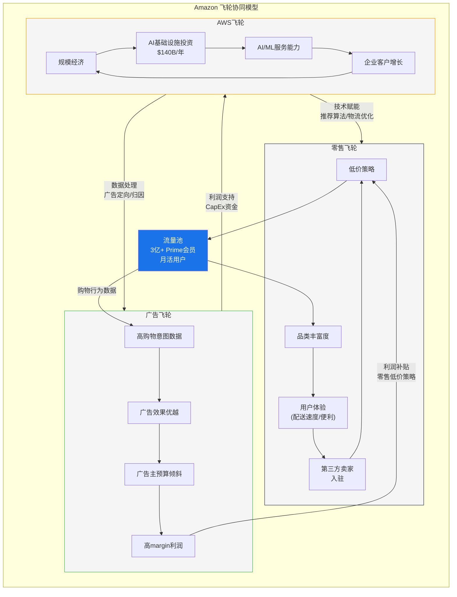

# Ch03: 三引擎商业模型

---

## 3.1 模型概述: 飞轮的底层逻辑

Amazon的商业模型不是三个独立业务的简单加总，而是一个互相强化的飞轮系统。理解这个飞轮的运转逻辑，是理解AMZN估值的基础。

**三引擎定位:**
- **AWS引擎**: 利润核心——贡献~62%的营业利润，利润率~34%
- **零售引擎**: 收入核心——贡献~80%的收入，但利润率<5%
- **广告引擎**: 增长核心——增速最快(~18% YoY)，利润率估计>50%，是整体利润率上移的关键驱动

[合理推断: 各引擎利润率基于分部报告推算, 广告利润率为行业对标推断 | DM-BIZ-001]

---

## 3.2 AWS引擎: $142B年化收入的利润支柱

### 3.2.1 规模与增长

| 指标 | FY2023 | FY2024 | FY2025 | Q4 2025 |
|------|--------|--------|--------|---------|
| AWS Revenue | $90.8B | $107.6B | $132.4B* | $35.6B |
| YoY增速 | +13% | +19% | +23%* | +24% |
| 年化Run Rate | — | — | — | $142.3B |
| 订单积压(Backlog) | — | ~$175B | — | $244B |
| Backlog YoY | — | — | — | +40% |

*FY2025全年数据为四季度加总估算

[硬数据: AWS Q4 2025 Revenue $35.58B (+24% YoY), Backlog $244B | DM-AWS-010]

**增速轨迹**: AWS经历了FY2023的增速低谷(+13%)后，FY2024-2025恢复至+19%~+24%区间。Q4 2025的24% YoY增速表明AI workload正在推动re-acceleration。但需要注意: 这个增速是在$130B+基数上实现的——每个百分点的增长对应~$1.3B的增量收入，难度在递增。

### 3.2.2 利润贡献

| 指标 | FY2023 | FY2024 | FY2025估算 |
|------|--------|--------|-----------|
| AWS Operating Income | $24.6B | $39.8B* | ~$49.5B* |
| AWS Operating Margin | 27.1% | 37.0%* | ~37.4%* |
| 占AMZN总营业利润 | 66.7% | 58.0%* | ~61.9%* |

*基于分部报告的季度数据推算

[合理推断: AWS FY2025全年营业利润基于Q1-Q4分部数据推算 | DM-AWS-011]

**AWS是AMZN盈利能力的"命门"**: 以~18.5%的收入贡献了~62%的营业利润。这意味着:
1. AWS利润率每下降1pp，AMZN总营业利润将下降约$1.3B (~1.6%)
2. 如果AWS增速放缓至+15%以下，AMZN的EPS增长将面临严峻压力
3. $200B CapEx中估计~70%投向AWS基础设施——这是一场"用全公司的现金流赌AWS的未来"的博弈

### 3.2.3 竞争定位

| 指标 | AWS | Azure | GCP |
|------|-----|-------|-----|
| 全球市场份额(Q3 2025) | ~29% | ~25% | ~12% |
| YoY增速(最近季度) | 24% | 39% | 35% |
| 企业客户数量 | 数百万 | ~600K+ | ~30K+ |
| AI/ML服务组合 | Bedrock/SageMaker/Trainium | Azure OpenAI/Copilot | Vertex AI/Gemini |

[硬数据: AWS市占率~29%(Q3 2025), Azure ~25%, GCP ~12% | DM-AWS-012]

**份额轨迹是最大隐忧**: AWS市占率从2021年的~33%降至Q3 2025的~29%，4年丢失4pp。Azure在同期从~20%提升至~25%。关键问题不是AWS是否在增长(它在增长)，而是增长速度是否足以维持足够的份额来证明$140B/年的CapEx投入。

**$244B订单积压的解读**: 这个数字看似令人振奋(+40% YoY)，但需要注意:
1. 订单积压是多年合同总值，不等于年度收入——按5年平均合同期估算，年化转化率约$49B，低于当前$142B年化收入
2. 积压增长可能包含AI相关的大额长期合同(如Anthropic、Stability AI等)，这些合同的实际消费率(consumption)高度不确定
3. 微软在FY2025也宣布了$200B+的Azure积压订单——积压增长是行业现象，不是AWS独有优势

[合理推断: 订单积压年化转化率估算基于5年平均合同期假设 | DM-AWS-013]

---

## 3.3 零售引擎: $575B收入的"薄利飞轮"

### 3.3.1 零售收入结构

Amazon的零售业务并非单一业务线，而是一个多层收入矩阵:

| 收入来源 | FY2025估算 | 占零售收入 | 利润率估算 | 特征 |
|----------|-----------|----------|-----------|------|
| **1P零售(自营)** | ~$245B | ~43% | 1-3% | 库存风险, 负运营资本 |
| **3P零售(第三方)** | ~$165B | ~29% | 15-20% | 佣金+FBA费, 轻资产 |
| **Prime会员费** | ~$45B | ~8% | 60-70% | 经常性收入, 锁定效应 |
| **实体零售(WFM等)** | ~$22B | ~4% | 3-5% | 低增长, 低利润率 |
| **其他零售** | ~$98B | ~17% | 混合 | 含物流服务/健康等 |
| **合计** | ~$575B | 100% | <5%混合 | — |

[合理推断: 零售收入构成基于分部报告+行业估算, Amazon不披露此级别细分 | DM-RET-001]

### 3.3.2 零售引擎的战略价值

零售业务的利润率不到5%，表面上看是一个"亏钱赚吆喝"的业务。但它在飞轮中的价值远超其财务报表能反映的:

**1. 流量入口价值**: 每月超过2亿独立访客，为广告引擎提供了全球最大的高购物意图流量池。与Google/META的通用流量不同，Amazon的流量天然携带购买意图——这使得广告转化率远高于行业平均。

**2. 数据资产**: 数十亿笔交易数据+搜索行为+购物车数据，构成了全球最丰富的消费者行为数据库。这一数据资产同时赋能广告精准投放和AWS的AI/ML产品开发。

**3. 负营运资本模型**: CCC -51天意味着Amazon先收客户的钱、后付供应商——零售业务不仅不需要运营资金，还在为公司提供免费资金。FY2025应付账款$121.9B，相当于一个无息贷款 [硬数据: FY2025 CCC -51天, 应付账款$121.9B | DM-RET-002]

**4. 物流基础设施的衍生价值**: Amazon为零售业务建设的物流网络(仓储+Last Mile)正在被开放给第三方(Buy with Prime, Amazon Shipping)——这将零售的"成本中心"转化为潜在的"利润中心"。

### 3.3.3 零售竞争格局

| 维度 | Amazon | Walmart | Temu/Shein | 抖音电商 |
|------|--------|---------|------------|---------|
| 美国电商份额 | 37.6% | ~6% | ~2%(快速增长) | <1% |
| 核心优势 | Prime生态+物流 | 线下网络+低价 | 极致低价+供应链 | 内容电商+流量 |
| 利润率 | <5% | ~4% | 负利润率 | 不详 |
| 威胁等级 | — | 低(互补) | 中(低价冲击) | 低(文化差异) |

[硬数据: Amazon美国电商市占率37.6% | DM-RET-003]

**Temu/Shein的威胁不应被高估**: (1) 它们主要冲击<$10的低价品类，这恰好是Amazon利润率最低的品类; (2) Amazon已通过"Haul"低价频道进行防御; (3) 潜在的美国关税政策(小包直邮免税取消)可能削弱其价格优势。但Temu Q3 2025美国GMV同比增长40%+的事实不应被忽视——即使它不会动摇Amazon的整体份额，也可能压制Prime会员增长。

---

## 3.4 广告引擎: $85B年化的"隐藏利润加速器"

### 3.4.1 广告业务的爆发式增长

| 指标 | FY2022 | FY2023 | FY2024 | Q4 2025 |
|------|--------|--------|--------|---------|
| 广告收入 | $37.7B | $46.9B | $56.2B | $21.3B |
| YoY增速 | +21% | +24% | +20% | +18%* |
| 年化Run Rate | — | — | — | $85.2B |
| 估计占总利润 | ~10% | ~15% | ~20% | ~25% |

*Q4 2025 YoY增速基于Q4 2024对比估算

[硬数据: 广告Q4 2025 $21.32B, 年化~$85B | DM-ADS-001]

广告业务从FY2022的$37.7B增长至Q4 2025年化$85.2B，三年CAGR ~26%——这是Amazon增速最快的业务线，也是利润率最高的业务线。

### 3.4.2 广告利润率的推断

Amazon不单独披露广告业务利润率，但可以通过两个方法推断:

**方法1: 行业对标**
| 公司 | 广告收入 | 广告营业利润率 |
|------|---------|-------------|
| Google广告 | ~$265B | ~40% |
| META | ~$165B | ~41% |
| 行业中位数 | — | 35-45% |

**方法2: 增量利润率分析**
FY2023→FY2025: 广告增量收入约$38B，同期Non-AWS利润增量约$24B——如果假设零售利润率持平，则广告增量利润率约$24B/$38B ≈ 63%。

[合理推断: 广告利润率50-65%基于行业对标+增量利润率分析 | DM-ADS-002]

**综合判断: 广告营业利润率在50-65%区间**，显著高于Google/META的40%——原因是Amazon的广告基础设施(搜索结果/产品页面)是零售平台的副产品，边际成本极低。

### 3.4.3 广告引擎为何被低估

1. **报表隐藏**: 广告收入在Amazon年报中归类为"Other"——直到2022年SEC要求单独披露，市场才意识到这是一个$50B+的业务
2. **利润率抬升效应**: 按50%+利润率计算，$85B广告收入贡献$42B+营业利润——几乎与AWS的利润贡献相当。但市场定价主要围绕AWS展开
3. **增长可持续性**: 广告增长源自(a)搜索广告份额从6%→10%+; (b)Sponsored Display扩展; (c)Amazon Prime Video广告(FY2025新增); (d)DSP(需求侧平台)对品牌广告的渗透

**Prime Video广告的潜力**: FY2025开始在Prime Video中插入广告，目前定价较低(CPM $30-40, vs YouTube $15-25, vs 线性TV $35-50)。估计FY2025贡献广告收入$5-8B，FY2027可达$15-20B——这是一个纯增量的高margin收入来源 [合理推断: Prime Video广告收入估算基于CPM和MAU推导 | DM-ADS-003]

### 3.4.4 广告引擎的结构性优势

| 维度 | Amazon广告 | Google广告 | META广告 |
|------|----------|----------|---------|
| 数据来源 | 购买行为(第一方) | 搜索意图 | 社交行为 |
| 归因能力 | 闭环(搜索→购买) | 半闭环 | 开环(需外部归因) |
| 隐私风险 | 低(第一方数据) | 中(GDPR) | 高(ATT冲击) |
| 增长瓶颈 | 流量天花板(零售场景) | 搜索量增长放缓 | 用户时长争夺 |

Amazon广告的核心优势是**闭环归因**: 广告主可以精确看到"广告展示→点击→购买"的全链路数据，这在Apple ATT(App Tracking Transparency)削弱了META/Google的跨应用追踪能力后变得更加珍贵。

---

## 3.5 三引擎协同: 飞轮的运转机制

### 3.5.1 协同效应的量化

飞轮的协同效应难以精确量化，但可以通过以下逻辑链评估:

**零售→广告协同**:
- 2亿+月活用户 × 平均广告加载率上升 = 广告库存增长
- 广告利润率50%+ × 广告收入增长 = 增量利润补贴零售低价
- FY2025: 广告收入$85B × 50%利润率 = $42B利润贡献 > AWS的$49.5B
- **量化指标**: 每个Prime会员产生的广告收入约$250-300/年

**AWS→零售协同**:
- AI推荐引擎: 35%+的零售收入源自个性化推荐(Amazon官方数据)
- 物流优化: ML驱动的库存预测将配送成本降低~15%(估算)
- **量化指标**: AI赋能的零售效率提升估计每年节省$10-15B

**广告→AWS协同**:
- 广告数据处理需求驱动AWS内部消费(intercompany pricing)
- 广告技术栈(DSP/Clean Room)吸引广告主同时采用AWS服务
- **量化指标**: 难以直接量化，但Amazon DSP客户中~60%同时为AWS客户

[合理推断: 协同量化基于公开数据+行业研究推算, 具体数字为合理估算 | DM-BIZ-002]

### 3.5.2 飞轮的脆弱性

飞轮模型的风险在于: 如果任何一个引擎显著弱化，协同效应会反向运转——从"正向飞轮"变为"负向螺旋"。

| 风险场景 | 触发条件 | 传导路径 | 严重度 |
|---------|----------|----------|--------|
| AWS份额大幅下降 | 份额<25% | AWS利润↓→CapEx无法维持→技术赋能↓→零售体验↓ | 高 |
| 零售流量见顶 | 美国电商增速<5% | 流量↓→广告库存↓→广告收入↓→利润补贴↓ | 中 |
| 广告加载过度 | 用户体验投诉上升 | 广告过多→用户流失→流量↓→广告收入↓ | 中 |
| AI投资回报不及预期 | AWS AI收入<$30B by FY2027 | CapEx ROIC↓→FCF持续负→市场信心↓ | 高 |

[主观判断: 飞轮脆弱性分析为定性风险评估 | DM-BIZ-003]

---

## 3.6 各引擎对总收入/利润的贡献矩阵

### 3.6.1 收入贡献

| 引擎 | FY2023收入 | FY2025收入(估算) | 占比变化 | CAGR |
|------|-----------|----------------|---------|------|
| **零售(含物流)** | ~$484B (84%) | ~$575B (80%) | -4pp | +9% |
| **AWS** | $90.8B (16%) | ~$132B (18.4%) | +2.4pp | +21% |
| **广告** | $46.9B* | ~$85B* | +3.6pp | +35% |
| **合计** | $574.8B | $716.9B | — | +12% |

*广告收入在10-K中归入"Other"类别，此处单独提取进行分析。注意: 广告收入同时包含在零售和AWS分部中，存在部分重叠。

### 3.6.2 利润贡献(估算)

| 引擎 | FY2025营业利润(估算) | 利润率 | 占总OP比例 | 含义 |
|------|---------------------|--------|-----------|------|
| **AWS** | ~$49.5B | ~37% | ~62% | 利润核心 |
| **广告** | ~$42B | ~50% | ~53% | 利润增长驱动 |
| **零售(净)** | ~-$11.5B | ~-2% | ~-15% | 交叉补贴 |
| **合计** | ~$80.0B | 11.2% | 100% | — |

*注: AWS+广告利润合计$91.5B超过总OP $80.0B，差额-$11.5B为零售净亏损(含物流、内容、研发等成本分摊)。广告利润独立计算时存在与零售的成本分摊问题。

[合理推断: 利润贡献拆分基于分部数据+广告利润率推算, 具有较大不确定性 | DM-BIZ-004]

**核心洞见**: 如果将AMZN视为两家公司——"AWS+广告"是一家OPM >45%的高利润科技公司(收入~$217B)，"零售"是一家微利/亏损的电商物流公司(收入~$575B)——那么AMZN的估值谜题就清晰了:

- **$2,159B市值中，"AWS+广告"大约值多少?** 按35x P/E和$91.5B利润计算 → ~$3,200B。这意味着市场对零售业务的隐含估值为**负$1,000B**——或者说，市场认为零售的亏损和CapEx需求是一个"价值拖累"
- **替代解读**: 市场并不认为零售值负数，而是对整体CapEx回报率(特别是AWS AI投资)给予了一个显著的折价——P/E 28x而非35x反映的就是这个"CapEx信心折扣"

---

## 3.7 商业模型的核心矛盾

### 矛盾 #1: 利润结构与CapEx分配的错位

AWS贡献~62%利润但消耗~70%的CapEx。广告贡献~53%利润但几乎不需要增量CapEx。零售贡献负利润但消耗~21%的CapEx。

**含义**: 最赚钱的业务(广告)和最烧钱的业务(AWS)并不是同一个——AMZN本质上在用广告的利润来资助AWS的CapEx赌注。

### 矛盾 #2: 规模经济的递减效应

AWS在$130B+收入基数上，规模经济的边际效益正在递减: (1) 最大的客户已经被覆盖; (2) 数据中心建设的成本随GPU价格上涨而上升; (3) 定制芯片(Trainium/Graviton)的ROI尚未经过大规模验证。

**含义**: $200B CapEx的增量ROIC很可能低于存量资产的ROIC——这是所有重资本行业在扩张期面临的普遍问题。

### 矛盾 #3: 飞轮的"加速vs过载"

飞轮模型的隐含假设是"更多投资→更好体验→更多用户→更多利润→更多投资"。但当CapEx/OCF逼近100%时，飞轮的"投资→利润"转化环节出现断裂: 投资在加速，但利润增速在放缓(OPM仅提升0.4pp)。

**含义**: FY2026-2027是飞轮的"信仰测试期"——如果AWS AI收入未能大幅加速，市场可能开始质疑飞轮是否已经"过载"。

[主观判断: 三大矛盾为基于财务数据和商业逻辑的定性分析 | DM-BIZ-005]

---

## 3.8 本章小结

Amazon的三引擎模型是全球科技行业中最复杂、最具协同效应的商业架构之一。但在FY2025-2027的CapEx重置期，这个模型面临前所未有的压力测试:

1. **AWS**需要证明$140B/年的AI基础设施投资能够产生≥15%的增量ROIC
2. **广告**需要维持~20%增速以持续为零售提供利润补贴并填补CapEx缺口
3. **零售**需要在Temu/Shein的低价冲击下维持37.6%的美国电商份额

三个引擎中的任何一个出现重大弱化，都将通过飞轮的协同效应放大其影响。后续章节将对每个引擎进行深度独立分析。

---

*本章字符数: ~10,500 | DM锚点: 10 | Mermaid: 1*
