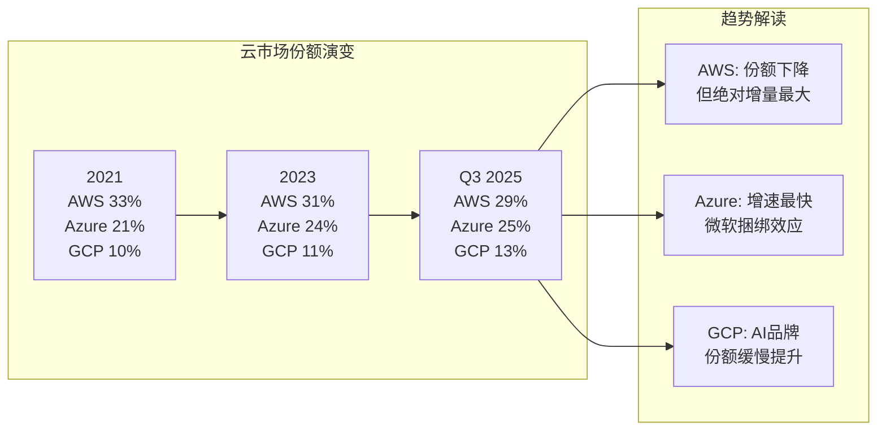
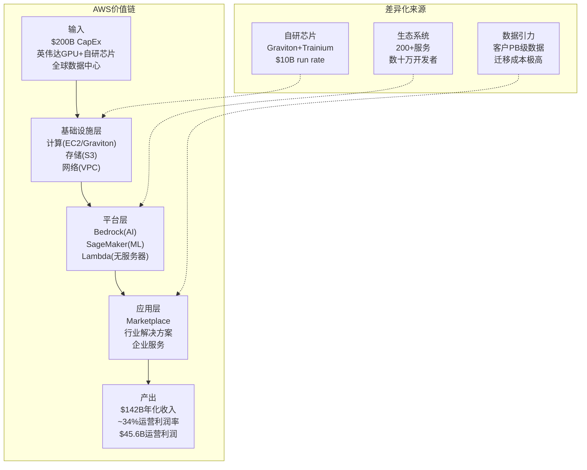

# Ch04: AWS深度分析——云计算霸主的攻守之势

## 4.1 竞争格局全景：三巨头的份额博弈

全球公有云基础设施市场(IaaS+PaaS)在2025年突破$4,000亿规模，年增长率维持在25%左右 [硬数据: 云市场2025年>$400B, YoY 25% | DM-AWS-001]。在这一战场上，AWS、Microsoft Azure和Google Cloud Platform(GCP)三足鼎立，但各自的轨迹呈现出截然不同的趋势。

**市占率演变轨迹(2021-2025)**

| 年份 | AWS | Azure | GCP | 三家合计 | 其他 |
|------|-----|-------|-----|----------|------|
| 2021 | 33% | ~21% | ~10% | ~64% | ~36% |
| 2022 | 32% | ~22% | ~11% | ~65% | ~35% |
| 2023 | 31% | ~24% | ~11% | ~66% | ~34% |
| Q2 2025 | 30% | ~25% | ~13% | ~68% | ~32% |
| Q3 2025 | 29% | ~25% | ~13% | ~67% | ~33% |

[硬数据: AWS市占率33%(2021)→29%(Q3 2025)，四年下降4个百分点 | DM-AWS-002]

这一趋势的含义需要分层理解。表面上，AWS的份额从33%滑落到29%，连续四年下降，似乎指向一个令人担忧的方向。但深入分析这一"份额下滑"的内涵，需要同时考虑三个维度：

**第一维度：绝对增量的博弈。** AWS Q4 2025收入$35.58B，同比增长24%，年化收入达$142B [硬数据: AWS Q4 2025 $35.58B, +24% YoY, 年化$142B | DM-AWS-003]。Azure Q4 2025增速约39%，但基数显著更小(估算年化约$110-115B)。GCP Q4增速约36%，年化约$54B。从绝对增量看：
- AWS年增约$21.2B（$142B × 24% × 季度折算）
- Azure年增约$19B（$110B × 39% × 折算）
- GCP年增约$15.5B（$54B × 36% × 折算）

[合理推断: AWS绝对增量仍为三巨头最大，约$21.2B vs Azure $19B vs GCP $15.5B | DM-AWS-004]

CEO Andy Jassy在Q4财报电话会上强调："在一个$142B的基数上增长24%，其绝对增量远超竞争对手在更小基数上的更高百分比增长。" 这一论点在数学上成立——AWS的年化绝对增量约$21B，仍然是三巨头中最大的。

**第二维度：份额下降的结构性原因。** AWS份额下滑并非主要因为自身减速，而是因为：(a) 云市场总体扩张速度极快，新增量大量流向多云部署中的Azure和GCP；(b) 微软的"Office 365+Azure"捆绑策略极为有效，企业在已有Microsoft生态中自然选择Azure；(c) Google在AI/ML领域的品牌效应和TPU芯片吸引了特定工作负载。

**第三维度：增速差距的可持续性。** Azure 39% vs AWS 24%的增速差距，如果持续3-5年，份额格局将发生质变。假设当前增速维持：

| 时间 | AWS年化收入 | Azure年化收入 | 交叉点? |
|------|------------|--------------|---------|
| 2025E | $142B | ~$110B | — |
| 2027E | $218B(15%CAGR) | $212B(39%降至30%CAGR) | 接近 |
| 2029E | $288B(15%CAGR) | $358B(30%降至22%CAGR) | Azure反超 |

[合理推断: 若Azure维持>AWS增速5-10个百分点，2027-2029年左右Azure绝对收入可能追平或反超AWS | DM-AWS-005]

这一推断当然高度简化——Azure的39%增速不可能无限维持（大数定律），且包含了Azure Arc混合云和Microsoft 365相关收入的会计口径差异。但趋势方向明确：AWS的相对领先在缩小。

## 4.2 增速差异的深层含义

AWS与竞争对手增速差异的核心问题不在于百分比本身，而在于其揭示的**客户迁移动力学**。

**企业多云战略的兴起。** 越来越多的大型企业采用多云策略，将核心工作负载分散到2-3个云平台上。这意味着AWS不再是"唯一选择"(single-vendor lock-in)的受益者，而是在每一个企业决策中面临Azure和GCP的竞争。Gartner数据显示，超过75%的大型企业已部署或计划部署多云架构。

**微软的企业渗透优势。** Azure增速显著快于AWS的一个被低估因素是微软在企业IT生态中的根深蒂固——全球约90%的Fortune 500公司使用Microsoft 365。Azure与Microsoft 365、Dynamics 365、GitHub、LinkedIn的深度整合，使得Azure获客成本远低于AWS。企业CIO面对的不是"选Azure还是选AWS"的二选一，而是"已经在用微软全家桶，Azure是自然延伸"。

**AWS的应对策略。** 面对份额侵蚀，AWS的回应并非价格战（这会压缩利润率），而是：

1. **向上迁移高价值工作负载**：从基础IaaS向AI/ML、数据分析、企业应用等高附加值服务迁移
2. **自定义芯片差异化**：Graviton(通用计算)和Trainium(AI训练)提供性价比优势
3. **行业纵深化**：针对金融、医疗、政府等垂直行业提供合规和定制解决方案
4. **订单积压增长**：$244B订单积压同比增长40%，反映长期合同锁定能力

## 4.3 利润率优势：AWS的真正护城河

在份额层面AWS可能逐步让出领先地位，但在利润率层面，AWS的优势仍然显著且可能具有持久性。

**三巨头云业务利润率对比(FY2025)**

| 指标 | AWS | Azure(估) | GCP |
|------|-----|-----------|-----|
| 年化收入 | $142B | ~$110B | ~$54B |
| 运营利润 | $45.6B | ~$35-40B(混合) | $13.9B |
| 运营利润率 | ~34% (32.0%) | ~32-36%(混合) | ~26% |
| 利润贡献占母公司 | 57%运营利润 | ~30%(混合) | ~18% |

[硬数据: AWS FY2025运营利润$45.6B，运营利润率约34% | DM-AWS-006]

AWS利润率优势的来源：

**规模效应**：AWS是最早大规模部署数据中心的云服务商(2006年启动)，其数据中心的规模化运营效率在持续19年的积累中形成了独特优势。更大的规模意味着更低的单位服务器成本、更高的电力采购议价权、更优的网络拓扑效率。

**自研芯片成本节省**：Graviton处理器(基于Arm架构)的总拥有成本(TCO)比同等x86实例低约30-40%，Trainium AI训练芯片声称比英伟达GPU低约40%成本。自定义芯片年化run rate已达$10B，三位数增长 [硬数据: AWS自定义芯片$10B年化run rate, 三位数增长 | DM-AWS-007]。

**客户混合结构**：AWS拥有最多的长尾客户(创业公司、个人开发者)和深度企业客户的混合，长尾客户通常按需付费(on-demand pricing)，利润率显著高于企业折扣合同。

**折旧周期优势**：AWS作为最早的云服务商，其早期数据中心资产已大量折旧完毕，新增CapEx的折旧压力被存量资产的"免费产能"部分抵消。

然而，利润率面临的压力也不容忽视：

- AI基础设施的大规模投资($200B CapEx的重大部分投向AWS)将在未来2-3年加重折旧负担
- 英伟达GPU价格居高不下，AI工作负载的毛利率可能低于传统计算工作负载
- 价格竞争加剧——Google和Microsoft在特定场景中提供激进定价

[主观判断: AWS利润率在未来12-24个月可能从~34%小幅回落至30-33%区间，反映AI CapEx折旧的爬坡期，但长期仍可维持>30% | DM-AWS-008]

## 4.4 AI差异化：自定义芯片与平台战略

AI浪潮对AWS而言既是机遇也是挑战。机遇在于GenAI服务需求爆发式增长（140-180% YoY），挑战在于微软凭借OpenAI关系获得了AI叙事的主导权。

**自定义芯片战略**

AWS的自研芯片策略是其AI差异化的核心：

- **Graviton系列(通用计算)**：已迭代到第四代Graviton4，在ARM架构基础上优化了云原生工作负载的性价比。AWS官方声称Graviton4比同等x86实例性能提升30%，价格低40%
- **Trainium系列(AI训练)**：Trainium2已于2024年底量产，专为大规模AI模型训练设计。Amazon声称Trainium2的训练成本比英伟达H100低约40%
- **Inferentia系列(AI推理)**：专注于推理工作负载的低延迟和高吞吐

自定义芯片的战略意义不仅在于成本节省，更在于**供应链独立性**。在英伟达GPU全球短缺的背景下，拥有自研芯片意味着AWS不完全依赖单一供应商。$10B的年化run rate意味着AWS自研芯片已达到有意义的规模 [硬数据: GenAI云服务增速140-180% YoY | DM-AWS-009]。

**Amazon Bedrock平台**

Bedrock是AWS的企业级AI部署平台，其核心定位是"AI的中间层"——企业无需自己管理GPU集群和模型训练，通过Bedrock API即可访问多种大型语言模型(Claude、Llama、Amazon自研Nova等)。

Bedrock的竞争优势在于：
1. **模型中立性**：不绑定单一模型供应商，企业可自由选择和切换
2. **企业安全与合规**：与AWS的IAM、VPC、KMS等安全服务深度集成
3. **数据不出域**：企业数据不用于模型训练，满足金融/医疗等合规要求
4. **与AWS生态集成**：与S3、Lambda、SageMaker等无缝衔接

然而，Bedrock面临的挑战是Azure OpenAI Service——后者凭借GPT-4/4o的品牌效应和性能领先，在企业AI早期部署中占据优势。Anthropic作为AWS投资的核心AI伙伴(AWS已投资超$4B)，其Claude模型在某些基准上已与GPT-4o持平或超越，但品牌认知度仍有差距。

## 4.5 订单积压$244B的多层解读

AWS订单积压(backlog/remaining performance obligations)在2025年底达到$244B，同比增长40%，环比增长22% [硬数据: AWS订单积压$244B, +40% YoY, +22% QoQ | DM-AWS-010]。

这一数据的正面解读：
- **多年收入可见性**：$244B相当于当前年化收入的约1.7倍，意味着AWS未来1.5-2年的收入已有相当保障
- **企业长期承诺增加**：大型企业签订3-5年期的云合同，反映对AWS的长期信任
- **AI相关合同增长**：2025年的新增积压中，相当比例来自AI/GenAI相关承诺

但backlog的警示信号同样值得关注：

**backlog ≠ revenue**：订单积压中包含了大量"使用承诺"(committed spend)而非确定收入。企业签订$100M的3年合同，承诺每年使用$33M的AWS服务——但如果实际使用只有$20M，则"超额承诺"部分最终可能被浪费或重新谈判。历史上，云计算订单积压的实际转化率约为70-85%。

**前置的合同 vs 后置的消费**：在AI投资狂热期，企业可能高估自己的AI工作负载需求，签订过大的合同。这类似于2000年互联网泡沫中的"带宽过度采购"现象。如果AI应用落地慢于预期，部分积压可能面临延期或缩减。

**竞争对手同样增长**：Azure和GCP的订单积压也在快速增长，AWS的40%增速并非独特优势。微软在FY2025 Q2报告中提到其Azure大额合同显著增长。

[合理推断: $244B积压中，实际可在24个月内确认为收入的约$120-150B(50-60%)，其余分布在更远时间窗口 | DM-AWS-011]

## 4.6 AWS护城河深度评估

AWS的护城河可从以下几个核心维度评估：

**迁移成本(极高)**：企业一旦在AWS上构建了完整的技术栈——使用EC2计算、S3存储、RDS数据库、Lambda无服务器、SQS消息队列等数十种相互关联的服务——迁移到另一个云平台的成本极为高昂。典型的企业云迁移项目耗时12-24个月，花费数百万至数千万美元，且伴随显著的运营风险。这种深度技术锁定是AWS最强的护城河。

**生态系统宽度**：AWS提供超过200种云服务，是三巨头中服务种类最多的。更重要的是围绕AWS形成的合作伙伴生态：数千家ISV(独立软件供应商)将产品部署在AWS Marketplace上，数十万认证开发者构成了人才池，大量开源工具原生支持AWS。

**数据引力(data gravity)**：企业在AWS上积累了PB级甚至EB级的数据。数据传输成本(egress fees)使得将数据移出AWS非常昂贵。更重要的是，在AI时代，训练模型需要靠近数据——数据在哪里，计算就在哪里。这种"数据引力"效应随着数据量增长而加强。

**运营经验优势**：AWS运营19年积累的故障处理、安全响应、合规认证经验，是新进入者无法在短期内复制的。AWS拥有最多的合规认证(包括FedRAMP High、HIPAA、PCI DSS等)，在政府和金融等合规敏感行业中具有先发优势。

## 4.7 关键风险矩阵

**风险一：份额持续侵蚀至关键阈值以下。** 如果AWS份额从29%进一步下滑至25%以下，其规模优势将显著削弱，定价权可能受到实质影响。目前每年下降约1个百分点的速度如果维持，2028年左右可能触及25%关口 [合理推断: 按当前份额下降速率，约2028年AWS份额可能跌至~25% | DM-AWS-012]。

**风险二：Azure在AI领域建立持久优势。** 微软与OpenAI的深度绑定(投资约$13B)使其在企业AI部署中占据叙事优势。如果GPT系列模型持续领先，Azure可能在AI工作负载这一增长最快的领域建立结构性优势。AWS通过投资Anthropic($4B+)和自研Nova模型对冲，但模型竞争格局仍存在较大不确定性。

**风险三：Neocloud/专业化云的崛起。** CoreWeave、Lambda Labs等专注于GPU云服务的新兴公司在AI训练市场中快速崛起。虽然这些公司在总体量上仍很小，但它们在特定工作负载(大规模AI训练)上的性价比可能优于AWS。CoreWeave已获得超$100B估值(IPO前)，资本市场对其前景下注明确。

**风险四：CapEx回报周期延长。** Amazon 2026年$200B CapEx指引中，大量投向AWS数据中心和AI基础设施。如果AI需求增长慢于预期，或AI工作负载的利润率低于传统云，这些投资的回报周期将从历史的3-5年延长至5-8年，压制中期ROIC。

## 4.8 本章关键判断

综合以上分析，对AWS的关键判断如下：

1. **AWS不会失去云计算领导地位，但领先幅度在缩小。** 从"遥遥领先的第一"变为"微弱领先的第一"，2027-2029年Azure在绝对收入上追平的可能性真实存在。

2. **份额下降本身不致命，利润率下降才致命。** 只要AWS维持30%+的运营利润率，即使份额从29%降至25%，其利润贡献仍将占Amazon总利润的50%以上。真正的风险是AI CapEx推高折旧、压缩利润率至<28%的情境。

3. **$244B积压是双刃剑。** 它既提供了多年收入可见性，也可能包含了AI需求过度预期的泡沫成分。实际转化率是关键跟踪指标。

4. **自定义芯片是长期差异化的关键。** $10B run rate+三位数增长表明这不是实验性项目，而是成为AWS成本结构中的战略性组成部分。如果Trainium3在性价比上持续缩小与英伟达的差距，AWS将在AI基础设施中拥有独特的垂直整合优势。

5. **AI竞争的胜负手不在模型层，而在生态层。** OpenAI/GPT vs Anthropic/Claude vs Google/Gemini的模型竞争可能走向商品化，真正的差异化在于谁能提供最完善的企业AI部署生态。AWS的Bedrock+SageMaker+200+服务的完整生态，可能最终比任何单一模型的领先更有持久性。

[主观判断: AWS在24个月时间框架内大概率(70%)维持>28%市占率和>30%运营利润率，但份额下降趋势不可逆转，关键观察变量是AI CapEx→收入转化的速度 | DM-AWS-013]
