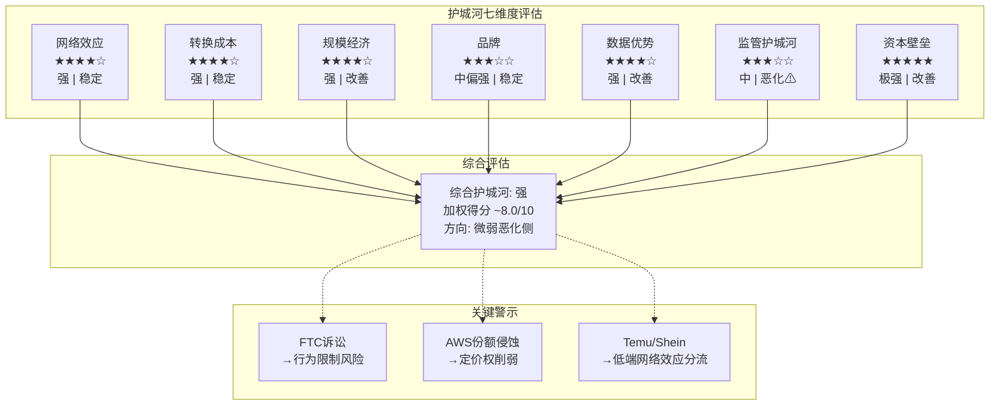

# Ch05: 护城河评估——七维度系统化分析

## 5.1 评估框架说明

对Amazon护城河的评估采用七维度框架，每个维度给出强度评级(强/中/弱)、趋势判断(改善/稳定/恶化)和数据支撑。Amazon的特殊性在于：它不是一家单一业务公司，而是至少三条不同商业逻辑的业务共存于同一实体——云计算(AWS)、零售电商和数字广告。因此，护城河评估需要分业务展开。

## 5.2 维度一：网络效应

**评级：强 | 趋势：稳定**

Amazon的网络效应主要体现在其电商平台的双边市场结构中。

**第三方卖家生态系统。** Amazon平台上约60%的GMV来自第三方(3P)卖家，而非Amazon自营(1P) [硬数据: Amazon 3P卖家贡献约60%的GMV | DM-MOA-001]。这一比例在过去五年中稳步提升(2019年约55%)，反映平台模式对卖家的持续吸引力。截至2025年底，Amazon平台上活跃第三方卖家数量超过200万家。

网络效应的正循环逻辑清晰：更多卖家→更丰富的商品选择→更多买家→更多卖家收入→吸引更多卖家。这一飞轮在Amazon成立近30年后仍在加速，体现为：
- 3P卖家服务收入持续增长(FY2025约$178B卖家服务相关收入)
- 卖家满意度虽然波动，但替代平台(Shopify自建站)的流量获取成本使得多数卖家仍将Amazon视为核心销售渠道
- FBA(Fulfillment by Amazon)进一步加深卖家对平台的依赖——使用FBA的卖家平均销售额比自行配送的卖家高出20-40%

**买家侧网络效应。** Amazon的买家侧网络效应通过Prime会员体系强化。全球超过200M Prime会员的消费频次和客单价显著高于非Prime用户(Prime会员年均消费约$1,400 vs 非Prime约$600) [合理推断: Prime会员年消费约为非Prime的2-2.5倍 | DM-MOA-002]。Prime会员的高留存率(>90%年留存)创造了稳定的高价值买家池，对卖家形成持续吸引力。

**网络效应的局限性。** Amazon的网络效应并非无法攻破：
- **Temu/Shein的价格网络效应**：这些平台通过极致低价吸引价格敏感消费者，形成了"低价→流量→更多供应商压低价格→更低价"的另一种飞轮
- **品类差异**：在高单价、品牌导向品类(奢侈品、专业设备)中，Amazon的网络效应较弱
- **地理差异**：在印度(Flipkart)、东南亚(Shopee)、拉丁美洲(MercadoLibre)等市场，本地平台的网络效应可能更强

## 5.3 维度二：转换成本

**评级：强(AWS)/中(零售) | 趋势：稳定**

**AWS层面——转换成本极高。** 企业在AWS上构建的技术栈深度嵌入运营流程：数百种API调用、数据存储格式(S3对象存储)、安全策略(IAM角色与权限)、自动化脚本(CloudFormation/Terraform for AWS)。完整迁移一个中型企业的AWS基础设施，典型成本在$5-20M范围内，耗时12-24个月，且伴随显著的运营中断风险。

AWS的转换成本还包含一个被低估的维度——**人才锁定**。大量企业IT团队持有AWS认证(Solutions Architect、DevOps Engineer等)，其技能和经验深度绑定在AWS技术栈上。切换云平台意味着需要重新培训团队或招聘新人，这一隐性成本往往被忽视。

**零售层面——转换成本中等。** 消费者在Amazon和其他电商平台之间切换的直接成本接近零。但Prime会员的年费($139/年在美国)创造了一层心理转换成本——已经付费的会员倾向于最大化其Prime价值(免费配送、Prime Video、Prime Music等)，而非分散消费到其他平台。此外，Amazon上积累的评价历史、推荐算法的个性化、购买记录和愿望清单也构成了中等程度的转换成本。

**广告层面——转换成本中等偏高。** 广告主在Amazon广告平台上投入的时间和精力(关键词优化、A+内容制作、广告活动数据积累)使其切换成本高于一般认知。特别是3P卖家的广告投入与其产品排名和可见度直接挂钩，"不投广告=隐身"的平台规则使得广告支出具有强制性质。

## 5.4 维度三：规模经济

**评级：强 | 趋势：改善(AI阶段有利于规模方)**

Amazon的规模经济体现在多个层面：

**物流网络规模。** Amazon在全球运营超过2,000个物流设施(包括履约中心、分拣中心、配送站等)，其"最后一英里"配送网络的规模在美国几乎无人能及。这一网络的建设成本超过$1,000亿，且需要十年以上的运营优化才能达到当前效率水平。新进入者即使有资本，也难以在短期内复制。

**数据中心规模。** AWS运营着全球最大的云基础设施网络，遍布33个地理区域(Regions)和105个可用区(Availability Zones)。规模带来的采购优势体现在：服务器定制化生产(与供应商的ODM合作)、电力长期协议(PPA)、以及自研芯片(Graviton/Trainium)的单位成本优化——芯片设计是高固定成本/低边际成本的典型业务，规模越大单位成本越低。

**采购议价权。** Amazon作为全球最大的零售商之一，对供应商(包括品牌商和白牌供应商)拥有强大的议价权。Amazon自营商品的采购价格通常低于其他零售商5-15%。在AWS端，Amazon作为英伟达GPU、AMD处理器、内存/存储芯片的最大买家之一，同样享有优先供货和价格优惠。

**AI时代的规模红利。** 在AI基础设施竞赛中，规模是最重要的竞争因素——$200B的CapEx能力本身就是一道壁垒 [硬数据: Amazon 2026年CapEx指引$200B, 主要投向AWS+AI | DM-MOA-003]。全球仅有3-4家公司(Amazon、Microsoft、Google、Meta)有能力和意愿进行如此规模的AI投资。这意味着小型云服务商和创业公司在AI基础设施层面的竞争力将被结构性压缩。

## 5.5 维度四：品牌

**评级：中偏强 | 趋势：稳定**

**消费者品牌信任度。** Amazon在美国消费者中的品牌信任度排名持续位于前列。其"无条件退货"政策、Prime配送的可靠性、以及近30年的购物体验积累，使得"在Amazon上买"成为很多消费者的默认选择。美国电商市场中，Amazon占据约37.6%的市场份额 [硬数据: Amazon美国电商市占率37.6% | DM-MOA-004]，远超第二名(沃尔玛电商~6%)。

**AWS企业品牌。** AWS在企业IT决策者中拥有"行业标准"的认知地位。虽然Azure在增速上超越，但在开发者社区中，AWS仍是最常被选择的首选云平台。Stack Overflow开发者调查和其他行业调研持续显示AWS在使用率和满意度上的领先地位。

**品牌的脆弱面。** Amazon品牌面临的挑战包括：(a) 劳工争议(仓库工作条件、反工会立场)影响品牌声誉；(b) 假货和低质商品问题(3P平台的固有挑战)侵蚀消费者信任；(c) 反垄断叙事(FTC诉讼)可能影响公众对Amazon"公平竞争"的认知。

## 5.6 维度五：数据优势

**评级：强 | 趋势：改善**

Amazon拥有可能是全球最独特的数据资产组合：

**消费者行为数据。** Amazon掌握着数亿消费者的完整购买历史、搜索行为、浏览轨迹、评价反馈，以及通过Alexa/Echo设备获取的家庭消费场景数据。这些数据直接支撑了Amazon的推荐算法(驱动约35%的平台销售)和广告精准投放。

**企业IT使用数据。** AWS拥有数百万企业客户的云资源使用模式数据——什么类型的工作负载在增长、哪些服务使用频率最高、企业在什么时间点扩容等。这些数据指导AWS的产品开发优先级和定价策略，使其能够比竞争对手更早发现市场需求变化。

**数据的交叉变现。** Amazon广告业务的高利润率(估计运营利润率>50%)很大程度上源于其独特的"闭环数据"——同一个平台上既有搜索意图(消费者在搜什么)、又有购买行为(实际买了什么)、还有配送数据(多快收到、是否退货)。这种从意图到交易到售后的完整数据链，是Google和Meta无法复制的——它们只有意图数据，没有交易闭环。

**AI时代的数据飞轮。** AWS上运行的大量AI工作负载产生的使用模式数据，帮助AWS优化其基础设施配置和芯片设计。同时，Amazon零售端的数据训练Rufus(AI购物助手)和其他AI工具，提升消费者体验和转化率。这种数据→AI→产品→更多数据的飞轮效应，在AI时代将持续加强。

## 5.7 维度六：监管护城河(双面性)

**评级：中 | 趋势：恶化(风险>保护)**

监管对Amazon而言是一柄双刃剑。

**保护面：合规壁垒。** Amazon(尤其是AWS)在合规和安全认证上的投入构成了对中小竞争者的壁垒。AWS拥有最广泛的合规认证组合，包括但不限于FedRAMP High(美国联邦政府)、HIPAA(医疗)、PCI DSS Level 1(支付)、SOC 1/2/3、ISO 27001等。获取和维护这些认证需要数千万美元的持续投入和专业团队，中小云服务商难以匹配。

**威胁面：反垄断压力。** FTC在2023年对Amazon提起的反垄断诉讼预计于2026年10月进入庭审 [硬数据: FTC垄断案预计Oct 2026庭审 | DM-MOA-005]。诉讼指控Amazon在电商平台上实施"反歧视定价"(惩罚在其他平台低价销售的卖家)和"强制捆绑"(推动卖家使用FBA)等反竞争行为。虽然分拆Amazon的可能性较低(历史上美国科技反垄断诉讼极少导致分拆)，但行为限制(如禁止特定定价策略)可能削弱Amazon对3P卖家的控制力。

**关税政策的双面影响。** 2025年的关税政策(尤其是针对中国低价商品的de minimis规则变化)对Temu/Shein的打击可能间接利好Amazon。但同时，Amazon自身的大量进口商品(自营和3P)也面临成本上升压力。

## 5.8 维度七：资本壁垒

**评级：极强 | 趋势：改善(AI时代放大)**

这是Amazon护城河中被系统性低估的一个维度。

**$200B CapEx本身就是壁垒。** Amazon 2026年的$200B CapEx指引意味着，它每年在基础设施上的投入相当于一家中型上市公司的全部市值。全球能够匹配这一投资规模的公司屈指可数——Microsoft(FY2025 CapEx约$89.7B)、Google(约$75B)、Meta(约$60B) [合理推断: 仅3-4家公司有能力匹配Amazon的$200B级CapEx | DM-MOA-006]。

**累积投资的不可逆性。** Amazon在物流网络上的累积投资超过$1,500亿，在AWS数据中心上的累积投资更是数倍于此。这些是沉没成本——已经投出去的钱无法收回，但它们构成了竞争壁垒，因为新进入者需要花同样的钱(甚至更多，因为没有早期的低成本红利)才能达到类似规模。

**资本效率的规模优势。** Amazon的资本成本(WACC约9-10%)显著低于大多数竞争对手。AAA/AA级信用评级使其能以极低利率发行债券，而其股票的高流动性和低beta(相对其业务复杂度而言)降低了权益资本成本。对于需要大量资本投入的业务(云计算、物流)，低资本成本是持久的竞争优势。

## 5.9 护城河综合评估

**护城河七维度总览**

| 维度 | 评级 | 趋势 | 核心数据支撑 | 权重 |
|------|------|------|-------------|------|
| 网络效应 | **强** | 稳定 | 3P GMV ~60%, 200M+ Prime会员 | 20% |
| 转换成本 | **强** | 稳定 | AWS迁移$5-20M/12-24月 | 20% |
| 规模经济 | **强** | 改善 | 2,000+物流设施, 33 AWS区域 | 20% |
| 品牌 | **中偏强** | 稳定 | 美国电商37.6%份额 | 10% |
| 数据优势 | **强** | 改善 | 消费者+企业+闭环广告数据 | 15% |
| 监管护城河 | **中** | 恶化 | FTC Oct 2026, 合规认证壁垒 | 5% |
| 资本壁垒 | **极强** | 改善 | $200B CapEx, 仅3-4家可匹配 | 10% |

**综合评级：强 (加权得分约8.0/10)**

## 5.10 护城河方向性判断

**总体方向：强，但微弱向弱化侧倾斜。**

需要注意的关键观察：

1. **AI时代强化了规模维度和资本壁垒**——$200B CapEx使得小型竞争者在基础设施层面几乎无法参与竞争。这一结构性变化是护城河的净正面因素。

2. **但网络效应和品牌维度面临侵蚀**——Temu/Shein在低价品类中建立了有竞争力的替代网络效应，FTC诉讼可能限制Amazon对3P卖家的控制力。

3. **转换成本在AI时代可能被部分绕过**——多云策略和Kubernetes容器化使得企业在云平台间的工作负载迁移比五年前更容易(虽然仍然昂贵)。

4. **最大的长期风险是监管维度**——如果FTC诉讼导致行为限制(禁止强制FBA捆绑、禁止价格匹配惩罚)，Amazon电商平台的3P卖家护城河可能显著削弱。

[主观判断: Amazon护城河综合评级为"强"(8.0/10)，但12-24个月视角内有从"强"向"中偏强"(7.0-7.5/10)微弱移动的风险，主要驱动因素是FTC诉讼结果和AWS份额变化 | DM-MOA-007]
