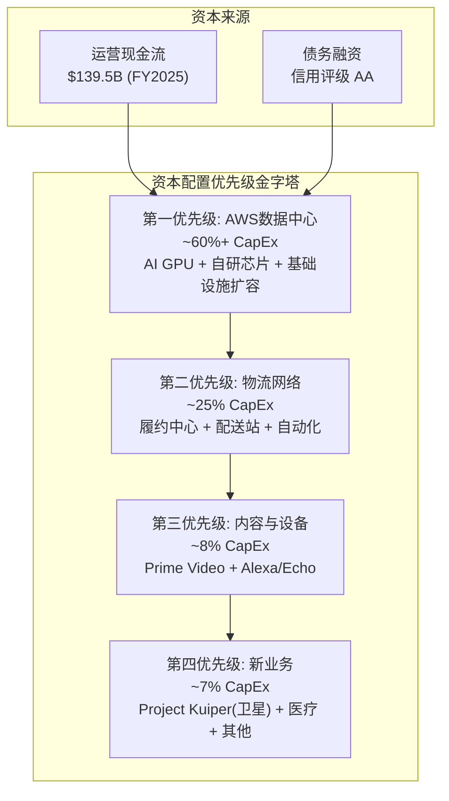

# Ch06: 管理层评估与资本配置

## 6.1 CEO Andy Jassy——从AWS创始人到Amazon掌舵者

### 6.1.1 背景与路径

Andy Jassy于1997年加入Amazon，是公司最早期的员工之一。2003年，他向Jeff Bezos提议创建一项面向外部开发者的云计算服务——这一提案最终催生了AWS。从2003年到2021年的18年间，Jassy一手将AWS从一个内部项目打造为年收入超$800亿的全球最大云计算平台。2021年7月，Jassy正式接任Amazon CEO [硬数据: Andy Jassy 2021年7月接任CEO, 此前18年领导AWS | DM-MGT-001]。

Jassy的CEO之路并不平坦。他接手时，Amazon正面临多重挑战：后疫情时代的零售需求回落、供应链混乱、以及过度扩张的物流网络带来的成本膨胀。2022年Amazon录得净亏损$27亿(主要由Rivian投资减值驱动)，是公司自2014年以来首次年度亏损。

### 6.1.2 业绩回顾：从亏损到利润率革命

Jassy作为CEO的核心成就是将Amazon从一家"增长至上、利润率为零"的公司转变为一家同时追求增长和盈利能力的公司。

**利润率轨迹**

| 年份 | 营业收入 | 运营利润 | 运营利润率 | 净利润 |
|------|---------|---------|-----------|--------|
| FY2022 | $514.0B | $12.2B | 2.4% | -$2.7B |
| FY2023 | $574.8B | $36.9B | 6.4% | $30.4B |
| FY2024 | $638.0B | $68.6B | 10.8% | $59.2B |
| FY2025 | $716.9B | $80.0B | 11.2% | $77.7B |

[硬数据: Amazon运营利润率从FY2022的2.4%提升至FY2025的11.2%，四年提升约9个百分点 | DM-MGT-002]

这一转变的驱动因素包括：

**大规模裁员与成本纪律(2022-2023)**：Jassy在2022-2023年间裁减约27,000名员工(主要集中在设备、零售和人力资源部门)。对于一家长期以"只增不减"著称的公司而言，这是文化层面的根本转变。裁员不仅降低了直接人力成本，更传递了"效率至上"的信号，改变了整个组织的成本意识。

**物流网络区域化重组**：Jassy推动将Amazon的物流网络从全国性结构重组为8个区域化网络。这一变革使得更多包裹在同一区域内完成分拣和配送，减少了跨区域运输成本。到2024年，Amazon的配送成本占收入比已从2022年的峰值回落。

**AWS的利润率持续扩张**：在Jassy领导下，AWS运营利润率从2022年的约26%提升至2025年的约34%，反映了规模效应、客户结构优化(更多高价值企业合同)和自研芯片带来的成本节省 [硬数据: AWS运营利润率从~26%(2022)→~34%(2025) | DM-MGT-003]。

**广告业务高速增长**：Amazon广告在Jassy任期内从年收入约$300亿增长至约$850亿(年化)，成为公司增长最快且利润率最高的业务之一。

### 6.1.3 争议与质疑

**$200B CapEx——远见投资还是过度扩张？** Jassy面临的最大争议是2026年$200B的CapEx指引。这一数字远超此前的市场预期(华尔街此前预测约$146.6B)，引发了"投资过度"的担忧。Jassy的辩护是：AI基础设施的需求"远远超过我们当前的供给能力"，且这些投资将在未来5-10年产生回报 [硬数据: 2026年CapEx指引$200B vs 此前市场预期$146.6B, 超出36% | DM-MGT-004]。

历史上，Amazon在CapEx上的大胆投资(2012-2015年的物流网络扩张、2016-2019年的AWS扩张)最终都证明了其正确性——但中间经历了数年的利润率压缩和投资者焦虑。当前的$200B投资是否会重复这一"先苦后甜"的模式，还是会成为一次战略误判(类似于Meta 2022年在Metaverse上的过度投资)，是本报告的核心问题之一。

**与同业CEO的对比**：

| CEO | 任期 | 运营利润率 | 关键战略 | 争议 |
|-----|------|-----------|---------|------|
| Andy Jassy (AMZN) | 2021- | 11.2% | AI CapEx全押 | $200B是否过度 |
| Satya Nadella (MSFT) | 2014- | 45.6% | Cloud+AI平台 | OpenAI依赖度 |
| Sundar Pichai (GOOG) | 2015- | 31.6% | AI重组+搜索防守 | 搜索被AI颠覆? |
| Mark Zuckerberg (META) | 2004- | 41.4% | 从Metaverse转向AI | Metaverse沉没成本 |

[硬数据: 同业运营利润率对比: MSFT 45.6%, GOOG 31.6%, META 41.4%, AMZN 11.2% | DM-MGT-005]

Amazon 11.2%的运营利润率在Magnificent 7中最低，但这反映的是业务结构差异(零售业务天然低利润)而非管理效率差异。如果仅比较AWS vs Azure vs GCP的云业务利润率，Amazon与竞争对手处于同一量级。

## 6.2 资本配置历史与优先级

### 6.2.1 CapEx的四层优先级

Amazon的CapEx配置遵循清晰的优先级逻辑：

**CapEx规模的历史演变**

| 年份 | CapEx | CapEx/Revenue | CapEx/OCF | FCF |
|------|-------|---------------|-----------|-----|
| FY2022 | $63.6B | 12.4% | 136.1% | -$16.9B |
| FY2023 | $52.7B | 9.2% | 62.1% | $32.2B |
| FY2024 | $83.0B | 13.0% | 71.6% | $32.9B |
| FY2025 | $131.8B | 18.4% | 94.5% | $7.7B |
| FY2026E | ~$200B | ~25%(估) | >100%(估) | 负值? |

[硬数据: CapEx从FY2023的$52.7B飙升至FY2025的$131.8B(+150%), 2026指引$200B | DM-MGT-006]

这张表清晰展示了CapEx的加速曲线和FCF的挤压效应。FY2025的CapEx/OCF已达到94.5%——意味着运营产生的几乎所有现金都被CapEx吞噬 [硬数据: FY2025 CapEx/OCF = 94.5%, FCF仅$7.7B | DM-MGT-007]。如果2026年CapEx确实达到$200B而OCF增长至$160-170B，FCF将转为负值。

### 6.2.2 收购历史与纪律

Amazon的收购策略相较其他科技巨头更为克制，但几次大型收购的结果参差不齐：

| 收购标的 | 时间 | 价格 | 结果 | 评价 |
|---------|------|------|------|------|
| Whole Foods | 2017 | $13.7B | 协同效应有限，线上食品增长慢 | 中等 |
| MGM | 2022 | $8.5B | 丰富Prime Video内容库 | 尚待验证 |
| iRobot | 2024(失败) | $1.7B(放弃) | 监管阻止，最终撤回 | 回避了错误 |
| One Medical | 2023 | $3.9B | 医疗业务拓展，回报不确定 | 长期项目 |
| Twitch | 2014 | $970M | 游戏直播领导者，但持续亏损 | 中等偏差 |
| Ring | 2018 | $1.2B | 智能家居入口，Alexa生态整合 | 良好 |

[合理推断: Amazon的收购纪律中等偏好——单笔最大收购$13.7B(Whole Foods)在$2T市值公司中仍属审慎级别，未出现类似Meta在Metaverse上的大规模战略误判 | DM-MGT-008]

值得注意的是，Amazon近年来越来越倾向于"投资"而非"收购"——如对Anthropic的$4B+投资获得的是战略合作关系而非完全控制权，对Rivian的投资也是如此。这种策略降低了整合风险，但也意味着对被投企业的控制力有限。

### 6.2.3 回购——新进场的资本返还

Amazon在FY2025年终于开始了有意义规模的股票回购。公司在2022年授权了$10B的回购计划，在2023年升级至$20B。FY2025实际回购规模估计约$10-12B。

与同业比较：

| 公司 | FY2025回购(估) | 回购/市值 | 回购/FCF |
|------|---------------|-----------|----------|
| AAPL | ~$100B | 3.0% | ~100% |
| GOOG | ~$62B | ~2.5% | ~85% |
| META | ~$40B | ~2.5% | ~65% |
| AMZN | ~$10B | ~0.5% | ~130%(>FCF) |

[合理推断: Amazon回购规模在Mag-7中最小，仅占市值约0.5%，且FY2025回购额已超过FCF($7.7B) | DM-MGT-009]

Amazon低回购率的逻辑是：管理层认为资本投入(CapEx)的回报率高于回购的回报率。在$200B CapEx的背景下，这一优先级选择是可以理解的，但其前提是CapEx确实能产生>WACC的回报。

## 6.3 资本配置质量评估

### 6.3.1 ROIC vs WACC：仍在创造价值，但趋势令人担忧

Amazon FY2025的ROIC(按FMP数据)约为10.7%，而WACC估算约为9-10% [硬数据: AMZN FY2025 ROIC 10.7%(FMP key-metrics), returnOnInvestedCapital | DM-MGT-010]。

**ROIC轨迹**

| 年份 | ROIC | WACC(估) | 价值创造(ROIC-WACC) |
|------|------|---------|-------------------|
| FY2022 | 1.8% | ~9.5% | **-7.7%** (价值毁灭) |
| FY2023 | 8.2% | ~9.5% | **-1.3%** (边际价值毁灭) |
| FY2024 | 13.3% | ~9.5% | **+3.8%** (价值创造) |
| FY2025 | 10.7% | ~9.5% | **+1.2%** (微弱价值创造) |

[硬数据: ROIC从FY2022的1.8%回升至FY2024的13.3%，但FY2025回落至10.7% | DM-MGT-011]

FY2025 ROIC从FY2024的13.3%下降至10.7%，这一回落的主因是CapEx大幅增加(从$83B到$132B)推高了Invested Capital的分母，而利润增长(分子)未能等比例跟上。

这一趋势发出了一个重要信号：**如果2026年CapEx进一步升至$200B，而运营利润增长不超过15-20%，ROIC可能跌破9-10%的WACC水平，从"价值创造"转为"价值毁灭"。**

[合理推断: FY2026 ROIC可能降至8-9%区间(CapEx $200B推高资本基数)，若此则处于WACC边界，价值创造能力成疑 | DM-MGT-012]

### 6.3.2 历史CapEx回报周期：先例分析

Amazon过去的大规模CapEx周期提供了有价值的参考：

**周期一：物流网络扩张(2012-2015)**
- CapEx从$39亿(2011)飙升至$70亿+(2015)
- 短期效应：运营利润率从2011年的1.8%压缩至2014年的0.2%
- 回报时间：3-4年后，Prime配送速度和会员转化率显著提升
- 最终效果：奠定了Amazon零售的物流壁垒

**周期二：AWS早期扩张(2016-2019)**
- AWS CapEx占比持续上升(估算从$150亿到$300亿+)
- 短期效应：AWS利润率一度从30%+回落至25-28%
- 回报时间：2-3年后，规模效应显现
- 最终效果：AWS成为Amazon主要利润来源

**当前周期：AI基础设施(2024-2026+)**
- CapEx从$83B(2024)飙升至$200B(2026指引)
- 短期效应：FCF从$32.9B(2024)压缩至$7.7B(2025)
- 预期回报时间：3-5年(管理层暗示)
- 不确定性：AI工作负载的利润率尚未被验证

[主观判断: 基于历史先例, Amazon大规模CapEx周期的回报时间通常为3-5年, 当前AI投资周期的回报可能在2028-2030年显现。但$200B的规模前所未有, 其回报率的不确定性也前所未有 | DM-MGT-013]

### 6.3.3 关键假设测试

管理层声称$200B CapEx将产生可观回报的隐含假设包括：

1. **AI工作负载需求将持续高速增长(>50% YoY)3-5年**——如果AI需求增长放缓至20-30%，部分投资将面临产能过剩风险
2. **AWS能够在AI基础设施上维持>25%的运营利润率**——如果AI工作负载(GPU密集型)的利润率显著低于传统云工作负载(30-34%)，整体利润率将承压
3. **自研芯片(Trainium/Graviton)能够在性价比上持续缩小与英伟达的差距**——如果英伟达在Blackwell/下一代架构上保持显著领先，AWS的自研芯片策略可能需要更长时间才能贡献有意义的利润
4. **竞争对手不会在AI基础设施上实现突破性创新**——Google的TPU战略、Microsoft的定制芯片(Maia)如果在特定工作负载上取得性价比优势，可能分流AWS的AI工作负载增长

## 6.4 管理层激励结构与股东稀释

### 6.4.1 SBC规模与趋势

Amazon FY2025的SBC(Stock-Based Compensation)为$19.5B，占收入的2.7% [硬数据: FY2025 SBC $19.5B, 占收入2.7% | DM-MGT-014]。

**SBC趋势**

| 年份 | SBC | SBC/Revenue | SBC/Operating Income |
|------|-----|-------------|---------------------|
| FY2022 | $19.6B | 3.8% | 160.2% |
| FY2023 | $24.0B | 4.2% | 65.1% |
| FY2024 | $22.0B | 3.5% | 32.1% |
| FY2025 | $19.5B | 2.7% | 24.4% |

[合理推断: SBC绝对额从FY2023的$24.0B峰值回落至$19.5B, SBC/Revenue从4.2%降至2.7%, 反映管理层在成本纪律上的改善 | DM-MGT-015]

SBC对股东的稀释效应需要关注。FY2025加权平均稀释后流通股为108.6亿股，与FY2024的107.2亿股相比增长约1.3%。这意味着尽管公司在回购，SBC的净发行仍导致轻微稀释。在一家$2T+市值的公司中，1.3%的年化稀释意味着约$28B的价值从现有股东转移至员工。

然而，与同业相比，Amazon的SBC/Revenue(2.7%)已显著优于FY2023的水平(4.2%)，且低于行业中某些高稀释公司(如RBLX SBC/Revenue曾超过20%)。更重要的是，SBC/Operating Income从FY2022的160%降至24%，表明利润增长速度远超SBC增长——这是一个健康的趋势。

### 6.4.2 激励对齐度评估

Amazon管理层的薪酬结构以长期RSU(限制性股票单元)为主，通常分4年归属(Year 1: 5%, Year 2: 15%, Year 3: 40%, Year 4: 40%的"后重"结构)。这一设计使得管理层的激励与长期股东价值高度对齐——管理层的大部分薪酬在入职3-4年后才兑现。

然而，激励结构中的一个微妙问题是：RSU的价值与股价挂钩，而非与ROIC或FCF挂钩。这意味着管理层可能更关注推动股价上涨的叙事(如"AI投资将创造长期价值")，而非确保每一笔CapEx的ROIC超过WACC。在$200B CapEx的背景下，这一激励错位值得投资者关注。

## 6.5 Buffett减持信号的解读

Warren Buffett/Berkshire Hathaway在Q4 2025减持约75%的Amazon持仓(从约1,000万股降至约250万股) [硬数据: Buffett Q4 2025减持AMZN约75%, 从~1000万股→~250万股 | DM-MGT-016]。

**多元解读框架**：

| 解读角度 | 论点 | 说服力 |
|---------|------|--------|
| **看空信号** | 最成功的价值投资者大幅减持=对估值或前景不满 | 中等 |
| **投资组合管理** | Berkshire可能调整科技股整体权重 | 中等偏高 |
| **CEO交接相关** | Buffett接近退休, 简化投资组合便于交接 | 高 |
| **估值层面** | AMZN当时$230+, P/E 38x可能超出Berkshire估值范围 | 中等 |

[主观判断: Buffett减持更可能反映投资组合管理和估值纪律, 而非对Amazon基本面的负面判断。但作为全球最受关注的投资者之一, 其大幅减持的信号效应不应被完全忽视 | DM-MGT-017]

## 6.6 本章关键判断

1. **Andy Jassy是合格的CEO，但面临职业生涯中最大的赌注。** 他成功将Amazon利润率从~3%提升至11.2%，证明了运营能力。但$200B CapEx的决策——如果正确——将使他成为与Bezos齐名的战略家；如果失误——将成为最大规模的资本错配案例之一。

2. **资本配置在"及格线"上方，但安全边际不足。** ROIC 10.7% vs WACC ~9.5%仅留下约1.2个百分点的缓冲。FY2026的ROIC极有可能跌至WACC附近甚至以下，这是24个月投资时间框架内最大的定量风险之一。

3. **SBC纪律在改善，但稀释仍在发生。** SBC/Revenue从4.2%降至2.7%是正面信号，但1.3%的年化净稀释在$2T市值下意味着每年$28B的价值转移。

4. **历史先例支持"大CapEx最终回报"的叙事，但$200B的规模没有先例。** 过去的$50-80B级CapEx周期成功了，但$200B是另一个量级——风险和回报都被放大了。

5. **管理层激励与股东利益基本对齐(RSU后重结构)，但缺乏明确的ROIC/FCF挂钩机制。** 在CapEx大幅扩张期，这一激励结构的缺陷可能被放大。
