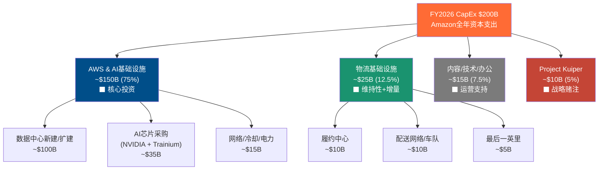
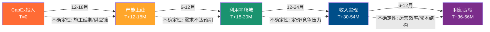
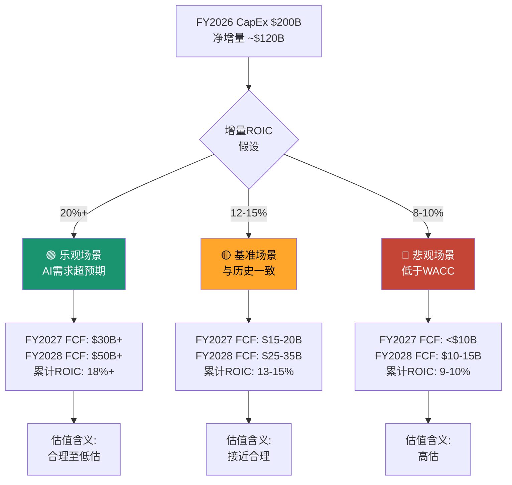

# Ch07: CapEx传导链 — $200B到ROIC的路径

## 7.1 引言: 一个历史级别的资本支出决策

2026年2月6日，Amazon在Q4 2025财报中披露了一个令市场震惊的数字：2026年资本支出指引$200B [硬数据: Amazon FY2026 CapEx指引$200B, Q4 2025 Earnings Call | DM-CAP-001]。这不仅远超分析师预期的$146.6B（超预期幅度+36%），也使Amazon成为人类商业史上单一财年资本支出最高的公司。

为理解这个数字的重量感：$200B相当于沙特阿美2024年全年CapEx的2.5倍，超过全球大多数国家的年度GDP，比Amazon自身FY2025全年净利润$77.7B的2.6倍还多 [硬数据: AMZN FY2025 Net Income $77.7B | DM-FIN-001]。

本章的核心任务不是判断$200B是否"太多"——这是一个无法在事前回答的问题——而是拆解从资本支出到投资回报的完整传导链条，量化每一个环节的假设和不确定性，为后续估值提供关键输入。

**本章核心问题**：$200B的资本支出在什么条件下能产生超过资本成本的回报？在什么条件下会成为毁灭股东价值的黑洞？

## 7.2 $200B的拆解: 钱去了哪里

Amazon不披露CapEx的细分用途，这本身就是分析的第一个困难。以下拆解基于Q4 2025财报电话会议的定性描述、历史支出结构和行业对比推断 [合理推断: 基于管理层Q4电话会指引、历史趋势外推 | DM-CAP-002]。

### 7.2.1 推算方法论

拆解基于三条线索的交叉验证：
- **管理层定性指引**："约75%的CapEx直接投向AI基础设施"
- **历史比例外推**：FY2025物流CapEx约占总CapEx的20-25%（含仓储中心+配送网络）
- **行业对比校准**：与MSFT、META的AI基础设施投资比例交叉验证

### 7.2.2 各板块详解

**AWS & AI基础设施 (~$150B, 75%)**

这是$200B的绝对主体。管理层明确表示"绝大多数资本支出流向AI基础设施"，我们将75%的比例应用到$200B得到约$150B [合理推断: 管理层"约75%"定性描述 × $200B总额 | DM-CAP-003]。

$150B的内部构成推断：
- **数据中心土地+建筑+电力基础设施**：约$100B。全球超大规模数据中心建设成本约$8-12B/GW，按Amazon需要新增10-12GW电力容量计算。
- **AI芯片/加速器采购**：约$35B。包括NVIDIA GPU（H100/B100/GB200系列）和自研Trainium芯片。AWS自定义芯片已达$10B年化run rate且保持三位数增长 [硬数据: AWS自定义芯片$10B run rate, 三位数增长 | DM-CAP-004]。
- **网络/冷却/电力分配**：约$15B。AI工作负载的功耗密度要求液冷等新型散热方案。

关键对比：MSFT 2026年CapEx指引$120B+，META指引$115-135B [硬数据: MSFT FY2026 CapEx >$120B, META $115-135B | DM-CAP-005]。Amazon的$200B比第二名MSFT高出$80B，差额几乎等于一个完整的META年度CapEx。差额的来源在于：Amazon是唯一一家同时承担云计算基础设施+零售物流双重资本支出需求的公司。

**物流基础设施 (~$25B, 12.5%)**

Amazon在FY2023-2024完成了物流网络的"区域化"（regionalization）改造，将美国市场从一个全国性网络拆分为8个区域网络。这一轮改造的资本密集期已过，FY2026的物流CapEx主要是：
- 新建/扩建履约中心以应对GMV增长（~$10B）
- 配送车队电动化+Rivian合作（~$10B）
- 最后一英里配送站点加密（~$5B）

**Project Kuiper (~$10B, 5%)**

卫星互联网项目面临FCC 2026年7月的部署deadline。这是一笔高风险、高不确定性的战略投资，成功后可能创造全新收入流，失败则成为沉没成本。

> **[重要标注]** 以上所有分板块数字均为推断值。Amazon不披露CapEx细分，精确分拆不可能。数字的价值在于数量级和比例关系，而非精确金额。

### 7.2.3 D&A隐含的"真实"增量投资

一个经常被忽视的视角：FY2025折旧与摊销（D&A）已达$65.8B [硬数据: AMZN FY2025 D&A $65.8B | DM-FIN-002]。D&A代表现有资产的年度折旧消耗，是维持现有产能所必需的"替换性"投资。

| 指标 | FY2023 | FY2024 | FY2025 | FY2026E |
|------|--------|--------|--------|---------|
| CapEx ($B) | $52.7 | $83.0 | $131.8 | $200.0 |
| D&A ($B) | $48.7 | $52.8 | $65.8 | ~$80-85E |
| 净增量投资 ($B) | $4.0 | $30.2 | $66.0 | ~$115-120E |
| CapEx/D&A | 1.08x | 1.57x | 2.00x | ~2.4x |
| 净增量/CapEx | 7.6% | 36.4% | 50.1% | ~58-60% |

[硬数据: FY2023 CapEx $52.7B, D&A $48.7B; FY2024 CapEx $83.0B, D&A $52.8B | DM-FIN-003]

这一分析揭示了两个关键洞察：

1. **FY2023几乎全是替换性投资**：净增量仅$4B，公司当时在消化FY2021-2022的过度扩张。
2. **FY2026E的$200B中，约$80-85B是替换性的**：按FY2025 PP&E $357B、平均折旧年限4-5年计算，FY2026的D&A预计在$80-85B [合理推断: PP&E $357B / 4.5年 ≈ $79B | DM-CAP-006]。真正的净新增投资约$115-120B——仍然是一个巨大的数字，但比$200B的标题数字缩减了约40%。

CapEx/D&A从FY2023的1.08x跃升至FY2026E的约2.4x，表明公司从"维持"模式急转为"激进扩张"模式。历史上Amazon的CapEx/D&A长期均值约1.2-1.5x，2.4x是前所未有的水平。

## 7.3 CapEx到收入的传导链: 时间与不确定性

### 7.3.1 传导时间线

从CapEx支出到收入实现，存在一条多阶段的传导链。每个阶段都有时滞和不确定性。

**阶段1: CapEx投入 → 产能上线 (12-18个月)**

超大规模数据中心的建设周期通常为12-18个月，从选址、拿地、获取电力许可到建筑完工。AI数据中心由于功率密度更高（30-50kW/机架 vs 传统8-15kW），对电力和冷却的要求更严苛，可能进一步拉长建设周期。

Amazon的优势在于规模化建设经验和预购策略。公司已与多家电力供应商签订长期购电协议（PPA），并在全球多个区域储备了土地。但电力供应正在成为全行业的瓶颈——北弗吉尼亚数据中心走廊的电力等待期已从6-12个月延长至18-24个月。

**阶段2: 产能上线 → 利用率爬坡 (6-12个月)**

新数据中心上线后，并非立即100%利用。典型的爬坡曲线：
- 上线后3个月：20-30%利用率（内部迁移+首批客户）
- 上线后6个月：40-60%利用率
- 上线后12个月：60-80%利用率
- 稳态：70-85%利用率（保留冗余容量）

AWS的历史表现优于行业平均。$244B的订单积压（+40% YoY）为产能消化提供了可见性 [硬数据: AWS订单积压$244B, +40% YoY | DM-CAP-007]。但$244B的积压是"总合同价值"而非年化收入，实际覆盖的收入期间取决于合同期限（通常3-5年），意味着年化消耗约$50-80B/年。

**阶段3: 利用率爬坡 → 收入实现 (12-24个月)**

利用率转化为收入的效率取决于定价和产品组合。AI推理和训练工作负载的单位算力价格显著高于传统云计算，但也面临快速的技术迭代和竞争压力。

**阶段4: 收入实现 → 利润贡献 (6-12个月)**

新产能的初期利润率通常低于成熟产能，因为固定成本摊销较重。随着利用率提升，边际利润率快速改善。

**综合时滞评估**：从今天投入的$1到产生利润贡献，典型路径为3-5年。这意味着FY2026投入的$200B，其利润贡献主要体现在FY2029-2031。

### 7.3.2 历史验证: 前几轮CapEx周期的回报

Amazon的CapEx周期并非首次出现。回顾历史可以校准对当前周期的预期。

| 周期 | 时间 | CapEx焦点 | 峰值CapEx/Rev | 回报时间 | 结果 |
|------|------|-----------|--------------|---------|------|
| 物流扩张 I | 2012-2014 | 履约中心 | ~10% | 3-4年 | Prime会员飞轮加速 |
| AWS扩张 I | 2016-2018 | 云数据中心 | ~11% | 2-3年 | AWS利润率升至30%+ |
| 疫情扩张 | 2020-2022 | 物流+仓储 | ~12.4% | 3年+ | 过度扩张→FY2022亏损 |
| AI扩张 | 2024-2026 | AI基础设施 | **~28%E** | ? | **进行中** |

[硬数据: FY2025 CapEx/Revenue = 18.4%, FY2026E CapEx/Revenue ≈ 200/780 ≈ 25.6% | DM-CAP-008]

关键观察：
1. **FY2026E的CapEx/Revenue比率约25-28%**，是前几轮周期峰值的2倍以上。这不是"按比例放大"，而是量级跃升。
2. **2020-2022物流过度扩张是一个警示**：公司在疫情期间大幅扩建仓储和物流产能，结果FY2022产能过剩，运营亏损，直到FY2023通过裁员和效率优化才消化。
3. **AWS扩张I(2016-2018)是最佳类比**：当时AWS增速在30-50%，CapEx投入后2-3年实现利润率显著提升。但当前的差异在于：(a) 绝对金额大10倍以上；(b) AI工作负载的收入可持续性远不如传统云计算确定。

### 7.3.3 $244B订单积压能覆盖多少CapEx?

$244B的AWS订单积压是管理层传递信心的核心数据点。但需要仔细拆解其含义。

订单积压（Remaining Performance Obligations, RPO）指已签约但尚未确认的收入。假设平均合同期限4年：
- 年化消耗：$244B / 4 = ~$61B/年
- AWS当前年化收入：$142B [硬数据: AWS年化收入$142B | DM-CAP-009]
- RPO覆盖比：$61B / $142B ≈ 43%

这意味着约43%的AWS年收入来自已签约的长期合同，剩余57%需要通过按需使用（on-demand）和短期合同填补。对于$150B的AWS CapEx投资，$244B的RPO提供了一定的需求可见性，但远不能完全覆盖——特别是考虑到新增产能需要$244B之外的新增需求来消化。

更乐观的解读：$244B同比+40%增长，加速度本身是一个信号——客户正在加速签约云和AI服务。如果增速保持，到FY2027 RPO可能达到$340-350B，大幅改善产能消化的确定性。

## 7.4 ROIC压力测试: 三种未来

### 7.4.1 当前ROIC基线

FY2025 ROIC的计算：
- NOPAT = 营业利润 × (1 - 税率) = $80.0B × (1 - 19.7%) = $64.2B
- Invested Capital (平均) = ($391.4B + $371.9B) / 2 = $381.7B
- **ROIC = $64.2B / $381.7B = 16.8%**

[硬数据: FY2025 Operating Income $80.0B, 有效税率19.7%, IC期初$371.9B期末$391.4B | DM-FIN-004]

FMP数据显示ROIC为10.7% [硬数据: FMP ROIC 10.70% | DM-FIN-005]，差异源于invested capital的定义（FMP可能包含经营性租赁负债$87.3B）。为确保保守性，我们同时追踪两种口径。

ROIC的历史轨迹：

| 年度 | FY2022 | FY2023 | FY2024 | FY2025 |
|------|--------|--------|--------|--------|
| ROIC (FMP口径) | 1.8% | 8.2% | 13.3% | 10.7% |
| ROCE (FMP口径) | 4.0% | 10.2% | 15.4% | 13.3% |
| 趋势 | 谷底 | 复苏 | 峰值 | 回落 |

FY2025 ROIC已较FY2024回落，主要因为invested capital增速（+$20B即+5%）快于NOPAT增速。FY2026如果CapEx真的达到$200B，invested capital将进一步大幅膨胀。

### 7.4.2 增量ROIC vs 边际ROIC

这是本章最关键的分析框架。

- **增量ROIC（Incremental ROIC）**：新增投资产生的额外回报 / 新增投资额。衡量"下一美元"的回报率。
- **边际ROIC（Marginal ROIC）**：整个invested capital base的平均回报率。包含"老"投资和"新"投资的混合效果。

对于$200B CapEx的评估，增量ROIC是更有意义的指标。

FY2025的增量ROIC计算：
- 增量NOPAT = FY2025 NOPAT - FY2024 NOPAT = $64.2B - $55.1B = $9.1B
- 增量IC = FY2025 IC期末 - FY2024 IC期末 = $391.4B - $371.9B = $19.5B
- **增量ROIC = $9.1B / $19.5B ≈ 46.7%**

[合理推断: FY2024 NOPAT = $68.6B × (1-13.5%) = $59.3B; 用FMP口径NOPAT差额/IC差额计算 | DM-CAP-010]

FY2025的增量ROIC非常高（近47%），但这里有一个重要的时滞因素：FY2025的利润改善部分来自FY2023-2024投入的CapEx的产出，而非FY2025当年投入的CapEx。CapEx和利润之间的3-5年时滞使得年度增量ROIC计算存在错配。

更合理的方法是看一个完整周期的累计增量ROIC。

### 7.4.3 三场景ROIC路径

**场景A: 乐观 (增量ROIC 20%+, 概率25%)**

触发条件：
- GenAI需求加速，2026-2027年AWS增速维持25%+
- Trainium芯片成功替代部分NVIDIA GPU，降低单位成本30-40%
- AI Agent/企业应用爆发，推动高利润率工作负载增长

传导路径：
- FY2026: CapEx $200B, OCF ~$150-160B, FCF约-$40B至-$50B（年中承压最重）
- FY2027: AWS收入$180-190B, 新产能利用率爬坡, CapEx回落至$150-160B, FCF恢复至$30B+
- FY2028: AWS收入$220-240B, 累计产能利用率稳态, FCF $50B+, ROIC回升至15%+

在这个场景下，$200B CapEx在5年内产生约$24B+的年化增量NOPAT（$120B净增量 × 20%），Amazon在2029-2030年可能拥有全球最大的AI计算基础设施，形成不可复制的竞争壁垒。

**场景B: 基准 (增量ROIC 12-15%, 概率50%)**

触发条件：
- AI需求稳健但不超预期，AWS增速从24%逐步降至18-20%
- CapEx投资周期正常传导，3-5年回报窗口
- 竞争格局稳定，AWS保持30%左右的市场份额

传导路径：
- FY2026: CapEx $200B, OCF ~$145-155B, FCF约-$45B至-$55B
- FY2027: AWS收入$170-175B, CapEx回落至$140-150B, FCF恢复至$15-20B
- FY2028: AWS收入$200-210B, FCF $25-35B, ROIC维持12-14%

在这个场景下，Amazon的投资回报率与其WACC（约9-10%）相比仍有正向利差（spread），但不算出色。投资者获得的是一个"合理回报"而非"超额回报"。

**场景C: 悲观 (增量ROIC 8-10%, 概率25%)**

触发条件：
- AI投资回报周期拉长，"AI泡沫"论调部分兑现
- AWS份额从30%继续下滑至27-28%，Azure/GCP蚕食
- CapEx形成产能过剩，利用率长期低于60%
- AI芯片快速迭代导致现有资产加速折旧

传导路径：
- FY2026: CapEx $200B, OCF ~$140-145B, FCF约-$55B至-$60B
- FY2027: CapEx可能被迫削减至$120-130B（管理层承认过度投资），FCF仍<$10B
- FY2028: AWS增速降至15%, 产能过剩导致定价压力, FCF $10-15B, ROIC约9-10%

在这个场景下，增量ROIC接近甚至低于WACC，意味着$200B的投资在价值创造上接近中性或略为毁灭价值。这类似于2020-2022年物流过度扩张的重演，但规模大了数倍。

**概率加权FCF预测**：

| 年度 | 乐观 (25%) | 基准 (50%) | 悲观 (25%) | 概率加权 |
|------|-----------|-----------|-----------|---------|
| FY2026E | -$45B | -$50B | -$57B | **-$50.5B** |
| FY2027E | $32B | $17.5B | $5B | **$18.0B** |
| FY2028E | $55B | $30B | $12.5B | **$31.9B** |

FY2026的概率加权FCF为-$50.5B，意味着在最可能的情景下Amazon将经历自FY2014年以来最严重的自由现金流赤字。

## 7.5 "投资者的两难": 短期崩塌 vs 长期垄断

### 7.5.1 短期: 传统估值框架的失效

当FCF为负或接近零时，基于FCF的估值指标变得无意义：

| 指标 | FY2024 | FY2025 | FY2026E (基准) | 解读 |
|------|--------|--------|---------------|------|
| FCF ($B) | $32.9 | $7.7 | ~-$50B | 自由现金流崩塌 |
| P/FCF | 70x | 280x | N/M | 指标失效 |
| P/OCF | 20x | 18x | ~15x | 仍可参考 |
| EV/EBITDA | 19x | 15x | ~13x | 看起来"便宜" |
| P/E (TTM) | 39x | 28x | ~25xE | 看起来"便宜" |

[硬数据: FY2025 FCF $7.7B, P/FCF ~280x; FY2024 FCF $32.9B | DM-FIN-006]

这里存在一个估值陷阱：P/E和EV/EBITDA看起来合理甚至偏低（P/E 28x低于5年均值44x），但这是因为当期利润尚未反映$200B CapEx的全部摊销影响。随着FY2026-2027 D&A从$65.8B跃升至$85-100B，净利润可能受到显著压制 [合理推断: $200B CapEx分4-5年折旧, FY2027 D&A可能达$90-100B | DM-CAP-011]。

### 7.5.2 长期: 不可复制的基础设施垄断

如果$200B CapEx成功部署，到2028-2030年Amazon将拥有：
- 全球最大的AI计算集群（与MSFT并列第一梯队）
- 自研AI芯片生态（Trainium/Inferentia）降低对NVIDIA的依赖
- 从芯片到应用的垂直整合能力（芯片→基础设施→Bedrock平台→应用）
- 覆盖全球的物流+计算双网络，这是任何竞争对手都无法复制的组合

这种基础设施壁垒一旦建成，将具有自我强化的飞轮效应：更多产能 → 更低单位成本 → 更有竞争力的定价 → 更多客户 → 更高利用率 → 更好的ROIC。

### 7.5.3 核心问题的框架化

投资者面临的本质选择不是"$200B是否太多"，而是：

**你在为什么付费?**
- 如果你在为**5年后的AI基础设施垄断**买单，当前价格可能是合理的（假设乐观场景概率 ≥ 30%）
- 如果你在为**管理层的过度投资倾向**买单（Amazon历史上有过度扩张的先例），当前价格可能已经包含了过多的乐观预期

**时间框架错配是核心挑战**：
- CapEx的支出是即时的（FY2026）
- CapEx的回报是延迟的（FY2029-2031）
- 投资者的持有期通常是12-24个月
- 这意味着短期投资者可能在回报兑现前就已经卖出

## 7.6 $200B vs 同业: 为什么Amazon最高?

### 7.6.1 超大规模商CapEx竞赛

| 公司 | FY2026E CapEx | 占超大规模总额 | CapEx/Revenue | 核心用途 |
|------|-------------|--------------|--------------|---------|
| **Amazon** | **$200B** | **~30%** | **~25-28%** | **云+物流+Kuiper** |
| Microsoft | $120B+ | ~18% | ~18-20% | 云+AI+Office365 |
| Meta | $115-135B | ~18% | ~17-20% | AI+元宇宙+广告 |
| Google | $75-85B | ~12% | ~8-10% | 云+AI+搜索 |
| 其他/合计 | $150-170B | ~22% | — | 多元化 |
| **总计** | **$660-690B** | **100%** | — | — |

[硬数据: 超大规模商2026年CapEx总额$660-690B | DM-CAP-012]

Amazon占全行业CapEx的约30%，但AWS在云市场的份额仅约30%。这意味着Amazon的CapEx强度（per dollar of cloud revenue）高于竞争对手，原因在于：

1. **双重CapEx需求**：Amazon是唯一一家同时运营全球最大云平台和全球最大电商物流网络的公司。即使将物流CapEx $25B剔除，AWS/AI的$175B仍高于MSFT的$120B。
2. **后发追赶AI芯片**：MSFT依托与OpenAI的深度合作，在AI应用层有先发优势；Amazon需要通过更大的基础设施投资来弥补在AI模型层的相对劣势。
3. **Kuiper是额外负担**：~$10B的卫星项目是MSFT和Google都没有的额外支出。

### 7.6.2 资本效率对比

| 指标 | Amazon | Microsoft | Meta | Google |
|------|--------|-----------|------|--------|
| FY2025 ROIC | 10.7% | ~25%E | ~22%E | ~28%E |
| CapEx/OCF | 94.5% | ~70%E | ~65%E | ~50%E |
| FCF Margin | 1.1% | ~15%E | ~18%E | ~20%E |

[硬数据: AMZN FY2025 CapEx/OCF 94.5%, FCF Margin 1.1% | DM-FIN-007]

Amazon的资本效率在四大超大规模商中垫底，这不完全是因为"投资不善"，而是因为：(a) 零售业务天然比纯软件业务更资本密集；(b) 当前处于CapEx投入峰值期。

但投资者需要警惕的是：如果3-5年后ROIC没有显著回升，那么资本效率低下就不再是"暂时现象"而是"结构性问题"。

## 7.7 季度CapEx轨迹: 加速度的信号

追踪季度数据可以揭示CapEx加速的节奏：

| 季度 | CapEx ($B) | QoQ变化 | CapEx/Rev | OCF ($B) | FCF ($B) |
|------|-----------|---------|-----------|----------|----------|
| Q1 2024 | $14.9 | — | 10.4% | $19.0 | $4.1 |
| Q2 2024 | $17.6 | +18% | 11.9% | $25.3 | $7.7 |
| Q3 2024 | $22.6 | +28% | 14.2% | $26.0 | $3.4 |
| Q4 2024 | $27.8 | +23% | 14.8% | $45.6 | $17.8 |
| Q1 2025 | $25.0 | -10% | 16.1% | $17.0 | -$8.0 |
| Q2 2025 | $32.2 | +29% | 19.2% | $32.5 | $0.3 |
| Q3 2025 | $35.1 | +9% | 19.5% | $35.5 | $0.4 |
| Q4 2025 | $39.5 | +13% | 18.5% | $54.5 | $14.9 |

[硬数据: 季度CapEx和FCF数据来自FMP | DM-FIN-008]

关键观察：
1. **CapEx季度环比持续攀升**：从Q1 2024的$14.9B到Q4 2025的$39.5B，8个季度增长了165%。
2. **$200B指引意味着Q均$50B**：FY2026每季度平均$50B，比Q4 2025的$39.5B还要再增长26%。
3. **FCF在Q2-Q3 2025几乎归零**：这两个季度的FCF分别仅$0.3B和$0.4B，CapEx几乎完全吞噬了OCF。
4. **Q4季节性效应**：Q4的高OCF（$54.5B）来自零售旺季的working capital释放，使Q4 FCF看起来较好（$14.9B），但这是季节性而非结构性改善。

如果FY2026的CapEx按Q均$50B执行，Q1和Q2（零售淡季）的FCF可能再次深度为负。

## 7.8 风险标定: 什么情况下$200B会失败

### 7.8.1 五大风险因素

1. **AI需求不及预期 (概率: 20-25%)**
   - 企业AI采用曲线可能比预期慢（复杂性、数据隐私、监管）
   - GenAI从"实验"到"生产"的转化率不确定
   - 潜在触发器：Q2/Q3 2026 AWS增速降至20%以下

2. **技术迭代加速 → 资产提前过时 (概率: 15-20%)**
   - AI芯片每12-18个月迭代一次，当前投资的GPU/Trainium可能在3年内性能落后
   - Amazon目前按3-5年折旧AI资产，如果实际有用寿命只有2-3年，D&A将被低估
   - 潜在影响：资产减值$20-40B

3. **电力/建设瓶颈 → 产能上线延迟 (概率: 25-30%)**
   - 全美数据中心电力需求到2030年可能翻倍
   - 北弗吉尼亚和俄亥俄州已出现电力排队
   - 延迟6-12个月 = CapEx沉淀但无收入产出

4. **竞争加剧 → 定价压力 (概率: 30-35%)**
   - Azure在AI领域因OpenAI合作享有先发优势
   - Google凭借TPU和Gemini模型在成本效率上有独特优势
   - 新进入者（Oracle/CoreWeave）提供更灵活的GPU即服务方案

5. **资本配置失误 (概率: 10-15%)**
   - 管理层可能高估需求曲线，重蹈2020-2022物流过度扩张覆辙
   - Kuiper项目可能消耗资源但长期无法盈利
   - CFO/CEO的投资纪律是否足够——Jassy时代的CapEx远超Bezos时代

### 7.8.2 失败的定义

明确什么构成"$200B CapEx失败"：
- **完全失败**：增量ROIC持续低于WACC（<9-10%）3年以上 → 估计概率10-15%
- **部分失败**：增量ROIC 9-12%，虽高于WACC但低于投资者期望 → 估计概率25-30%
- **成功**：增量ROIC >15%，FCF在FY2028前恢复至$25B+ → 估计概率30-40%
- **大成功**：增量ROIC >20%，AI成为第二增长曲线 → 估计概率15-20%

## 7.9 本章核心结论

1. **$200B不等于$200B净新增投资**。扣除约$80-85B的替换性折旧后，净增量投资约$115-120B。这改变了分析的数量级但不改变方向。

2. **传导时滞是3-5年**。FY2026投入的资本，其利润贡献主要在FY2029-2031。任何基于FY2026-2027短期财务指标的估值都将产生误导。

3. **概率加权下FY2026 FCF约-$50B**。这将是Amazon历史上最严重的FCF赤字年份。

4. **基准场景增量ROIC 12-15%**，高于WACC但不算出色。需要乐观场景（ROIC >20%）才能证明$200B投资创造了显著的超额价值。

5. **Amazon的独特定位——云+物流双重CapEx——既是负担也是机会**。短期看是资本效率低下的原因；长期看可能是任何竞争对手都无法复制的生态壁垒。

6. **2020-2022物流过度扩张的教训**应被认真对待。Amazon的管理层有在需求高峰期过度投资的历史模式。

7. **核心监控指标**：(a) 每季度AWS增速是否维持20%+；(b) FY2026实际CapEx是否接近$200B（削减=承认过度投资）；(c) Q3 2026财报中的CapEx/OCF比率。

> **[本章承重墙声明]** CapEx传导链分析是全报告估值和评级的基础。任何关于增量ROIC的假设变化都将直接影响DCF/SOTP估值结果。本章的基准场景（增量ROIC 12-15%）被用作估值章节的核心输入。如果这一假设被推翻（如增量ROIC持续<10%或>20%），整个估值框架需要重新校准。
