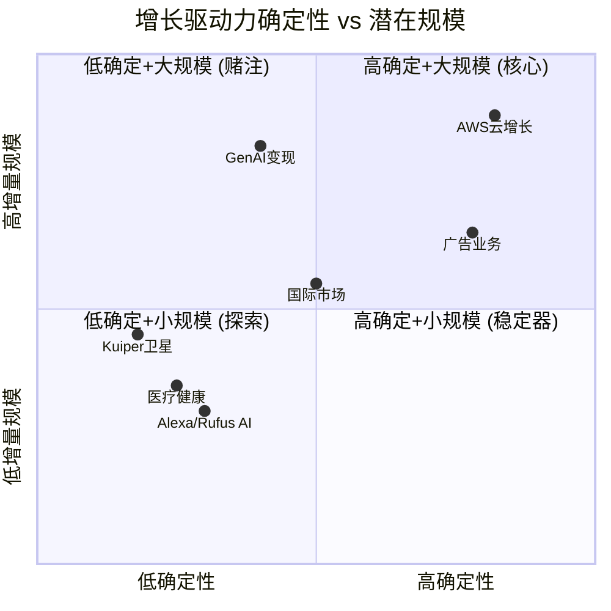

# Ch08: 增长驱动力与天花板

## 8.1 增长的结构性问题: $716B之后

Amazon在FY2025实现收入$716.9B，同比+12.4% [硬数据: FY2025 Revenue $716.9B, YoY +12.4% vs FY2024 $638.0B | DM-GRW-001]。在这个收入基数上，每1个百分点的增长等于$7.2B的增量收入——相当于一个中型SaaS公司的全年收入。

增速的长期趋势是向下的：

| 年度 | Revenue ($B) | YoY增速 | 增量收入 ($B) |
|------|-------------|---------|-------------|
| FY2021 | $469.8 | +22% | +$83.5 |
| FY2022 | $514.0 | +9% | +$44.2 |
| FY2023 | $574.8 | +12% | +$60.8 |
| FY2024 | $638.0 | +11% | +$63.2 |
| FY2025 | $716.9 | +12% | +$78.9 |
| FY2026E | ~$780-800B | +9-11% | +$63-83B |

[硬数据: 历史收入数据来自FMP年报 | DM-GRW-002]

FY2026 Q1指引为$173.5-178.5B [硬数据: Q1 2026指引$173.5-178.5B | DM-GRW-003]，中值$176B意味着Q1 YoY约+13%（vs Q1 2025 $155.7B）。全年增速可能在9-11%区间，取决于AWS加速度和零售是否维持韧性。

本章的核心任务是：识别哪些增长驱动力最确定、哪些最不确定，以及在什么增速水平上Amazon将稳态运行。

## 8.2 增长驱动力确定性分级

### 8.2.1 T1 高确定性驱动力

**AWS云增长**
- **当前规模**: 年化$142B, FY2025 Q4单季$32B+, YoY +24% [硬数据: AWS年化$142B, +24% YoY | DM-GRW-004]
- **确定性来源**: $244B订单积压(+40% YoY)提供3-4年的收入可见性 [硬数据: AWS RPO $244B, +40% YoY | DM-GRW-005]
- **增长逻辑**: 企业数字化转型+AI工作负载迁移。云市场整体年增长20-25%，GenAI云服务增速140-180% [硬数据: GenAI云服务增速140-180% YoY | DM-GRW-006]
- **利润贡献**: AWS运营利润$45.6B，利润率约34%，贡献公司约57%的营业利润 [硬数据: AWS运营利润$45.6B, 利润率~34% | DM-GRW-007]
- **风险**: 市场份额持续从33%(2021)滑落至约29%(Q3 2025)，Azure增速(39% YoY)持续快于AWS
- **FY2026E增量**: +$25-35B (增速22-25%区间)

AWS的增长确定性在所有驱动力中最高，因为：(a)订单积压提供了"已签约未实现"的收入保障；(b)企业IT预算向云端的结构性迁移仍处于中早期（全球IT支出中云占比仍不足15%）；(c)AI工作负载的训练和推理需求正在从"实验"向"生产"转化，这将推动更多计算资源消耗。

但需要注意一个重要的区分：AWS收入增长的确定性很高，但利润率的方向不确定。如果AI工作负载的毛利率低于传统云计算（因GPU/Trainium成本高），增收不增利是可能的。

**广告业务**
- **当前规模**: FY2025年化约$85B（Q4单季$21.3B × 4，含季节性调整） [硬数据: Q4 2025广告收入$21.32B | DM-GRW-008]
- **确定性来源**: Amazon拥有全球最大的电商购物意图数据集，广告转化率天然高于社交媒体和搜索引擎
- **增长逻辑**: (a)搜索广告在电商页面的持续渗透；(b)Prime Video广告于2024年初推出后正在规模化；(c)Sponsored Brands和DSP(Demand-Side Platform)的企业级采用
- **利润率**: 估计40-55%的运营利润率（Amazon不单独披露，行业对比推断）[合理推断: 基于Google/Meta广告业务利润率区间 | DM-GRW-009]
- **风险**: 过度广告化降低用户体验→购物转化率下降；隐私监管（GDPR扩展、FTC审查）
- **FY2026E增量**: +$12-18B (增速15-20%)

广告是Amazon最被低估的增长引擎。它几乎不需要额外CapEx（广告运行在现有电商平台上），利润率远高于零售甚至可能高于AWS，且竞争壁垒来自独特的购物意图数据——Google搜索广告知道你在找什么，Meta社交广告知道你喜欢什么，但Amazon广告知道你正在买什么。"正在买"的意图是距离交易最近的信号，转化率因此最高。

### 8.2.2 T2 中确定性驱动力

**AI/GenAI变现**
- **当前规模**: AWS自定义芯片$10B run rate（三位数增长）；Bedrock平台（GenAI服务）增速未单独披露 [硬数据: AWS自定义芯片$10B run rate, 三位数增长 | DM-GRW-010]
- **确定性来源**: AI投资已经发生（$200B CapEx），问题是变现效率而非是否投入
- **增长逻辑**: (a)Trainium芯片+Inferentia推理芯片降低客户AI成本；(b)Bedrock平台将多种基础模型（Anthropic Claude、Meta Llama、Stability AI等）整合为"AI超市"；(c)Amazon Q（企业级AI助手）面向B2B市场
- **不确定性**: (a)基础模型的竞争格局仍在快速变化（DeepSeek的低成本冲击）；(b)企业AI采用的真实ROI尚未被充分验证；(c)AWS在AI层的差异化（vs Azure OpenAI）仍待证明
- **FY2026E增量**: $15-30B范围极宽（取决于GenAI需求曲线）

AI/GenAI是规模最大但确定性最低的T2驱动力。它的潜在规模是巨大的（2030年全球AI市场预计$500B+），但从"潜力"到"收入"之间的路径仍不清晰。Amazon在AI领域的定位是"基础设施提供者"而非"模型创造者"——这降低了技术风险（不需要在模型层与OpenAI/Anthropic/Google竞争），但也限制了定价权（基础设施是相对商品化的）。

**国际市场扩张**
- **当前规模**: 国际零售收入约$130-140B（占总收入约19%）
- **确定性来源**: 印度（全球增长最快的电商市场）和东南亚（Shopee/Lazada竞争但TAM增长快）
- **增长逻辑**: (a)印度电商渗透率仅约7-8%（vs 美国~16%），增长空间巨大；(b)Prime会员在国际市场的渗透仍处早期
- **不确定性**: (a)国际市场持续亏损或微利；(b)本地竞争者（Flipkart/Reliance在印度，MercadoLibre在拉美）的本土化优势；(c)地缘政治风险（印度对外资电商的政策限制）
- **FY2026E增量**: +$10-15B (增速8-12%)

### 8.2.3 T3 低确定性驱动力

**Project Kuiper卫星互联网**
- **阶段**: 测试卫星已发射，商业服务尚未启动。FCC要求2026年7月前部署一定数量卫星
- **TAM**: 全球卫星互联网市场预计2030年$40-60B（SpaceX Starlink已占据先发优势）
- **投资额**: 估计$10B+ CapEx（Ch07中已纳入FY2026E分拆）
- **不确定性**: (a)Starlink已有超过400万用户的先发优势；(b)卫星制造和发射的技术风险；(c)收入实现可能在2028年之后
- **期望增量**: FY2026-2027近零收入贡献；2028+可能$2-5B/年

**医疗健康 (Amazon Pharmacy + One Medical)**
- **阶段**: Amazon Pharmacy提供处方药配送；One Medical提供线下诊所+远程医疗
- **TAM**: 美国医疗健康市场$4.7万亿，但Amazon可触达的部分（在线药房+初级保健）约$200-300B
- **投资额**: 2022年以$3.9B收购One Medical
- **不确定性**: (a)医疗行业监管极其复杂；(b)盈利路径不明（One Medical持续亏损）；(c)消费者对Amazon作为医疗服务提供商的信任度
- **期望增量**: FY2026E <$5B收入贡献，中期亏损

**Alexa AI + Rufus购物助手**
- **阶段**: Alexa正在向GenAI升级（"Alexa+"订阅服务，$19.99/月）；Rufus作为购物助手嵌入Amazon App
- **TAM**: 智能助手市场预计2028年$20-30B；AI购物助手尚无独立市场估算
- **不确定性**: (a)消费者为AI助手付费的意愿未被验证；(b)Alexa生态系统能否成功转型为收费模式；(c)Rufus对购物转化率的实际提升效果
- **期望增量**: FY2026E <$2B直接收入，间接通过提高购物转化率贡献更多

## 8.3 增长天花板分析

每个业务线都有其理论上的增长天花板（TAM ceiling）。评估当前渗透率与天花板的距离，可以判断增长空间的大小。

### 8.3.1 AWS: 远未到天花板

- **云市场TAM**: 2025年全球公有云市场超过$400B/年，预计2028年达$700B+ [硬数据: 云市场年度>$400B | DM-GRW-011]
- **AWS当前渗透率**: $142B / $400B ≈ 35%
- **天花板约束**: 市场份额不太可能超过35-40%（反垄断+客户多云策略限制单一供应商占比）
- **增长空间**: 如果云市场到2028年达$700B，AWS即使份额稳定在30%，收入也将达$210B（vs当前$142B，增长48%）

结论：AWS的增长不受TAM ceiling约束——云市场本身在快速扩张。主要约束来自份额（Azure持续蚕食）和定价（AI基础设施可能更商品化）。

### 8.3.2 美国电商: 接近饱和

- **美国电商市场**: 约$1.1万亿/年
- **Amazon美国电商市占率**: 37.6% [硬数据: Amazon美国电商市占率37.6% | DM-GRW-012]
- **历史峰值**: 约41.8%（2021年疫情期间），已回落
- **天花板约束**: (a)反垄断压力（FTC垄断案2026年10月开庭）；(b)Walmart/Target的电商反击；(c)Temu/Shein的低价冲击；(d)消费者对"一家独大"的抵触

结论：美国电商收入的增长将主要来自整体电商市场的增长（5-7%/年），而非份额提升。份额从37.6%再提升到40%+的难度极大。这意味着美国零售收入增速将稳定在中低个位数。

### 8.3.3 广告: 大增长空间

- **全球数字广告市场**: $800B+/年 [硬数据: 全球数字广告市场$800B+ | DM-GRW-013]
- **Amazon广告收入**: ~$85B（年化）
- **当前渗透率**: ~$85B / $800B ≈ 10.6%
- **天花板约束**: 广告收入最终受制于GMV（电商交易额）——广告take rate不可能无限提升，否则会伤害购物体验
- **对比**: Google广告约$250B，Meta广告约$160B。Amazon有空间增长至$120-150B（3-5年）

结论：广告是所有业务线中TAM ceiling最远的。即使保守估计，到FY2028广告收入达$120-130B（CAGR 12-15%）是合理的。

### 8.3.4 AI: TAM极大但极度不确定

- **AI市场TAM**: 2030年预计$500B+（但这一数字本身的方差极大，从$300B到$1T不等）
- **Amazon可触达部分**: AI基础设施+平台层（约占总TAM的30-40%）→ $150-200B
- **AWS在AI中的份额**: 当前估计20-25%（低于整体云份额30%，因Azure在AI有先发优势）
- **天花板约束**: (a)AI芯片供给（NVIDIA产能分配）；(b)自研芯片（Trainium）的竞争力；(c)模型层的竞争格局变化

结论：AI是理论天花板最高但实际路径最不确定的业务线。投资者在对$200B CapEx进行估值时，实际上是在对"AI TAM的实现概率"下注。

## 8.4 增速放缓的结构性因素

即使所有增长驱动力都按预期执行，Amazon的整体增速仍将结构性放缓。原因如下：

### 8.4.1 基数效应

| 假设收入增长率 | FY2026增量 | FY2028增量 | FY2030增量 |
|--------------|-----------|-----------|-----------|
| 15% | +$107B | +$142B | +$187B |
| 10% | +$72B | +$87B | +$105B |
| 7% | +$50B | +$57B | +$66B |
| 5% | +$36B | +$39B | +$43B |

在$716B基数上保持10%增长意味着每年新增$72B收入（≈一个Adobe或Salesforce的全部年收入）。保持15%增长则需每年新增$107B——几乎不可能持续。

### 8.4.2 业务组合变化

Amazon的收入组合正在从低利润率零售为主转向高利润率AWS+广告为主。这对利润增长有利，但对收入增长不利：

- **零售**(~65%收入): 增速5-8%，拉低整体增速
- **AWS**(~20%收入): 增速20-25%，但收入占比提升缓慢
- **广告**(~12%收入): 增速15-20%，高速但占比小

加权平均增速 ≈ 65%×6.5% + 20%×22.5% + 12%×17.5% + 3%×10% ≈ 4.2% + 4.5% + 2.1% + 0.3% ≈ **11.1%**

[合理推断: 基于各业务线占比×中值增速的加权计算 | DM-GRW-014]

这一加权计算暗示FY2026-2027的整体增速可能维持在10-12%，之后随着基数效应加大和零售增速进一步放缓，逐步降至8-10%。在FY2028-2030，7-9%的增速可能是新常态。

### 8.4.3 长期稳态增速预测

综合以上分析，Amazon的长期（FY2028+）收入增速大概率稳定在以下区间：

- **乐观**: 10-12%（AI驱动AWS超预期 + 广告持续高增长）
- **基准**: 7-9%（各业务线按趋势线增长）
- **悲观**: 4-6%（AI投资回报不及预期 + 零售份额下滑 + 宏观放缓）

对于一家市值$2.16万亿的公司 [硬数据: AMZN市值$2,159B | DM-GRW-015]，7-9%的收入增速加上利润率扩张（营业利润率从11.2%向13-15%爬升）仍然可以支撑合理的估值。但如果增速滑落至5%以下，当前估值将显得过于昂贵。

## 8.5 催化剂日历: 2026年关键事件

以下事件将在2026年推动对Amazon增长预期的再评估：

| 时间 | 事件 | 潜在影响 | 重要度 |
|------|------|---------|-------|
| **2026年2月** | Q4 2025财报已发布 | $200B CapEx指引引发市场重估 | ★★★★★ |
| **2026年4-5月** | Q1 2026财报 | 验证$200B执行节奏 + AWS增速趋势 | ★★★★☆ |
| **2026年5月** | Amazon Prime Day (春季) | 零售增速+广告收入晴雨表 | ★★★☆☆ |
| **2026年7月** | Project Kuiper FCC Deadline | 卫星部署里程碑 | ★★★☆☆ |
| **2026年7-8月** | Q2 2026财报 | CapEx实际执行(是否接近$50B/Q) + FCF深度 | ★★★★★ |
| **2026年10月** | FTC垄断案开庭 | 可能限制Amazon市场行为/强制分拆讨论 | ★★★★☆ |
| **2026年10-11月** | Q3 2026财报 | 三季度后CapEx累计进度 + AWS竞争格局 | ★★★★☆ |
| **2026年11-12月** | AWS re:Invent | AI产品发布+客户采用信号 | ★★★★☆ |
| **2026年12月** | 宏观环境(美联储利率) | 影响科技股估值倍数 | ★★★☆☆ |

**最关键的两个催化剂**：
1. **Q2 2026财报(2026年7-8月)**：这将是$200B CapEx指引发布后的第二个财报，市场将密切关注实际CapEx执行速度。如果H1 CapEx已超$90B（暗示全年$200B在轨道上），市场将重新评估FCF展望。
2. **FTC垄断案(2026年10月)**：这是悬在Amazon头上的最大监管达摩克利斯之剑。虽然强制分拆的概率很低（<10%），但行为约束（如限制自有品牌、强制开放物流网络）可能影响长期竞争策略。

## 8.6 增长驱动力的相互依赖

各增长驱动力之间并非独立，存在正反馈和负反馈循环：

**正反馈循环**：
- **AWS增长 → AI投资 → AI变现**: AWS的云收入为AI基础设施投资提供资金，AI基础设施反过来驱动AWS的增量收入
- **广告增长 → 零售利润率改善 → 更多投资空间**: 广告是近乎零边际成本的利润来源，每增长$1广告收入就贡献$0.4-0.55的营业利润
- **Prime会员增长 → 多业务交叉销售**: Prime会员同时使用电商+视频+音乐+药房，增加每用户ARPU

**负反馈循环**：
- **$200B CapEx → FCF枯竭 → 其他投资受限**: AI基础设施的优先级可能挤压物流升级、内容投资和新业务孵化的资金
- **广告加载率提升 → 用户体验下降 → 零售增速放缓**: 过度货币化购物体验的风险
- **国际扩张亏损 → 拖累整体利润率**: 国际市场每$1收入可能消耗$0.02-0.05的运营利润

## 8.7 增速敏感性: 什么增速水平才能支撑当前市值

当前市值$2,159B对应P/E约28x（TTM），EV/EBITDA约15x [硬数据: 市值$2,159B, P/E ~28x, EV/EBITDA ~15x | DM-GRW-016]。假设市场要求的长期回报率为10%（权益成本），我们可以逆向推算维持当前估值所需的增速条件：

**Reverse Growth Test**: 如果Amazon在FY2028实现15%的营业利润率（vs当前11.2%），需要多少收入才能支撑当前市值？

- 假设EV/EBIT稳态倍数20x（成熟科技公司中位数）
- 需要EBIT = $2,225B(EV) / 20 = $111B
- 在15%营业利润率下，需要收入$740B → 这低于当前$717B
- 在12%营业利润率下，需要收入$925B → FY2025到FY2028的CAGR约9%

这一简化计算的含义是：**如果Amazon能将营业利润率从11.2%提升至14-15%，即使收入增速仅5-7%，当前估值也是可支撑的**。利润率扩张的重要性可能超过收入增速。

利润率扩张的来源：
1. **广告高利润率混合效应**: 广告收入每增长$10B（利润率50%），整体营业利润率提升约0.5-0.7个百分点
2. **AWS规模效应**: 产能利用率提升推动固定成本摊薄，利润率从34%可向36-38%爬升
3. **零售效率改善**: 物流区域化完成后，单位配送成本持续下降
4. **SBC占比下降**: FY2025 SBC/Revenue约2.7%（$19.5B），低于FY2023的4.2%($24B)，趋势向好 [硬数据: FY2025 SBC $19.5B, SBC/Rev 2.7% | DM-GRW-017]

潜在风险：$200B CapEx的D&A将在FY2027-2028大幅上升（从$65.8B可能到$90-100B），这将对利润率构成反向压力。利润率能否扩张，取决于收入增长速度是否快于D&A增长速度——这又回到了Ch07的CapEx传导链问题。

## 8.8 本章核心结论

1. **AWS和广告是两大确定性增长支柱**。AWS的$244B订单积压+24%增速提供了最高的收入可见性；广告的TAM渗透率仅10.6%且利润率极高。两者合计可能贡献FY2026增量收入的60-70%。

2. **GenAI变现是最大的不确定性变量**。潜在规模巨大（$15-30B/年增量），但从"投资"到"收入"的传导链条长且充满假设。

3. **美国电商接近份额天花板**。37.6%的市占率已从峰值41.8%回落，未来增长主要依赖整体电商市场扩张（5-7%/年）而非份额提升。

4. **长期稳态增速大概率在7-9%**。加权各业务线增速，考虑基数效应，Amazon在FY2028+的收入增速将稳定在中高个位数。对于$2.16万亿市值而言，这需要利润率持续扩张才能支撑当前估值。

5. **2026年Q2财报和FTC案是两大关键催化剂**。前者验证$200B CapEx的执行和FCF影响，后者决定长期竞争策略的边界。

6. **增长驱动力之间的相互依赖意味着不能孤立评估**。AWS的成功支撑AI投资，广告的高利润补贴零售的薄利润，Prime会员的飞轮将所有业务粘合在一起。这种生态互依是Amazon最深的护城河，也是最大的分析挑战。

> **[与Ch07的关联]** Ch07的CapEx传导链分析主要聚焦于AWS/AI基础设施的投入-产出关系。本章扩展了分析视野，识别出广告业务作为"不需要CapEx的高利润增长引擎"的独特价值——它在$200B CapEx导致FCF崩塌的时期，提供了关键的利润缓冲。
