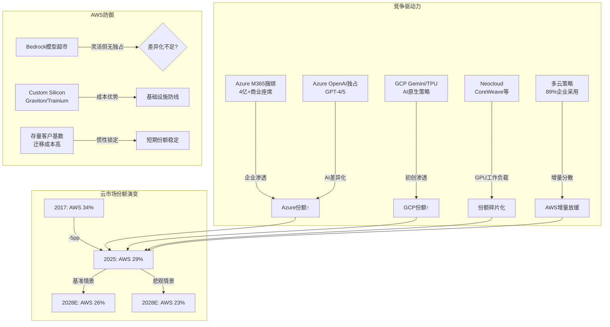

# Ch09: AWS份额侵蚀风险矩阵

> **Agent B 独立风险审计 | DM锚点: DM-RSK-001 ~ DM-RSK-020**
> **三层标注**: [硬数据:] = H | [合理推断:] = R | [主观判断:] = S

---

## 9.1 份额下滑的硬数据轨迹

AWS的市场份额下滑不是假设，而是已持续8年的结构性趋势。以下是基于Synergy Research/Canalys的云基础设施服务(IaaS+PaaS+托管私有云)市场份额数据:

**[硬数据: Synergy Research/Canalys历年报告]** [DM-RSK-001]

| 年份/季度 | AWS | Azure | GCP | 三巨头合计 | 云市场总规模(年化) |
|-----------|-----|-------|-----|-----------|-------------------|
| 2017 | ~34% | ~13% | ~6% | ~53% | ~$55B |
| 2018 | ~33% | ~15% | ~7% | ~55% | ~$70B |
| 2019 | ~33% | ~17% | ~8% | ~58% | ~$97B |
| 2020 | ~32% | ~19% | ~9% | ~60% | ~$130B |
| 2021 | ~33% | ~20% | ~9% | ~62% | ~$178B |
| 2022 | ~32% | ~21% | ~10% | ~63% | ~$228B |
| 2023 | ~31% | ~21% | ~10% | ~62% | ~$270B |
| Q3 2024 | 31% | 20% | 11% | 62% | ~$330B |
| Q4 2024 | 30% | 21% | 12% | 63% | ~$360B |
| Q2 2025 | 30% | 20% | 13% | 63% | ~$396B |
| Q3 2025 | 29% | 22% | 13% | 64% | ~$410B |

**关键发现**: AWS从2017年的~34%降至2025年Q3的29%，累计丢失约5个百分点。但同期云市场从$55B扩张至$410B——AWS的绝对收入从~$19B增至~$129B(年化)，增长了5.8倍。[DM-RSK-002]

**[合理推断: 基于趋势外推]** 份额下降的速率约0.6-0.7pp/年，且近两年有加速迹象(2024 Q3→2025 Q3下降2pp)。如果此速率维持，AWS将在2028-2029年跌破25%。[DM-RSK-003(R)]

---

## 9.2 增速差异: 追赶速度的残酷数学

**[硬数据: 各公司财报/Canalys Q1-Q3 2025]** [DM-RSK-004]

| 指标 | AWS | Azure | GCP |
|------|-----|-------|-----|
| Q4 2025 YoY增速 | +24% | +39% | +30% |
| Q3 2025 YoY增速 | +20% | +40% | +36% |
| Q1 2025 YoY增速 | +17% | +33% | +28% |
| FY2024全年增速 | +19% | ~+29% | ~+26% |
| FY2025年化收入 | ~$142B | ~$100B | ~$50B |

**增速差异的累积效应**: [DM-RSK-005(R)]

[合理推断: 基于FY2025年化收入和增速差的复合增长模型]

假设AWS维持20%增速, Azure维持35%增速, GCP维持30%增速(均较当前略有收敛):

| 年份 | AWS收入 | Azure收入 | GCP收入 | AWS份额(估) |
|------|---------|-----------|---------|------------|
| 2025E | $142B | $100B | $50B | ~29% |
| 2026E | $170B | $135B | $65B | ~27% |
| 2027E | $204B | $182B | $85B | ~25% |
| 2028E | $245B | $246B | $110B | ~23% |

**[主观判断:]** 如果Azure维持当前增速优势3年，将在2028年左右在绝对收入上追平AWS。这并非不可能——Azure在企业IT预算中的渗透率仍在快速提升，且Office 365/Teams捆绑效应持续发酵。但这一预测的核心假设是Azure增速不会因基数扩大而收敛，实际上35%以上的增速在$150B+规模上维持超过2年的概率较低。[DM-RSK-006(S)]

更现实的情景是: Azure增速从35%逐年降至25%，GCP从30%降至22%，AWS维持18-20%——在此情景下AWS份额降至~26%(2028)，而非23%。

---

## 9.3 份额下滑的四大结构性驱动力

### 9.3.1 多云策略(Multi-Cloud)的制度化

**[硬数据: Flexera 2024 State of Cloud报告]** 89%的企业采用多云策略，73%使用混合云(公有+私有)。[DM-RSK-007]

多云策略对AWS的不对称伤害:
- AWS作为默认首选(被"考虑"的概率最高)，但多云意味着增量工作负载分散
- [合理推断:] 新增AI工作负载中，Azure获得的份额可能超过AWS，因为企业已有Azure合同(通过EA协议)且Azure OpenAI提供了差异化AI能力 [DM-RSK-008(R)]
- 多云架构服务商(HashiCorp/Terraform, Snowflake, Databricks)天然稀释了单一云厂商的锁定效应

### 9.3.2 Azure-Microsoft 365捆绑的"特洛伊木马"效应

**[硬数据: Microsoft FY2025]** Microsoft 365拥有超4亿付费商业座席。[DM-RSK-009]

Azure的渗透路径与AWS根本不同:
- AWS: 自下而上(开发者→团队→企业) — 需要每次单独销售
- Azure: 自上而下(CIO已有Microsoft EA协议→Azure是"免费附加"→逐步迁移工作负载)
- [合理推断:] 这意味着Azure在大型企业中的获客成本(CAC)接近零——IT预算已经在Microsoft生态内，使用Azure只是预算重新分配而非新增支出。AWS要赢得同类客户必须证明TCO优势，而当Azure"已经在合同里"时这几乎不可能。[DM-RSK-010(R)]

### 9.3.3 GCP的AI差异化赌注

**[硬数据: Google Cloud FY2025]** GCP年化收入~$50B, 增速30-36%, 首次实现持续盈利(OPM ~10%+)。[DM-RSK-011]

GCP的竞争策略已从"追随者"转向"AI原生领导者":
- Gemini模型家族提供与OpenAI竞争的能力，且完全自研(无外部依赖)
- Vertex AI被评为最完整的AI开发平台(模型花园+MLOps+数据管道一体化)
- TPU v5e/v6在推理成本上可能比NVIDIA GPU低30-40%
- [合理推断:] GCP在AI原生初创公司中的份额可能已超过AWS，因为这些公司重视AI工具链的完整性而非传统IT基础设施 [DM-RSK-012(R)]

### 9.3.4 自建云(Repatriation)与Neocloud崛起

**[硬数据: Synergy Research 2025]** Neocloud(如CoreWeave, Lambda Labs)正在逐步蚕食传统云巨头的市场份额，特别是在GPU密集型AI训练工作负载上。[DM-RSK-013]

- CoreWeave估值从2024年的$20B飙升至2025年的$35B+, 专注NVIDIA GPU出租
- 大型科技公司(Meta, Apple)在自建数据中心上的投资也减少了对AWS的依赖
- [主观判断:] 自建云对AWS的威胁被市场低估。当企业的云支出超过年$50M时，自建或Neocloud的经济性开始优于公有云——而这恰恰是AWS高价值客户群。[DM-RSK-014(S)]

---

## 9.4 份额 vs 绝对收入: 一个危险的自我安慰叙事

市场上流行一种说法: "份额下降不重要，因为蛋糕在变大"。这需要严肃审视。

**[硬数据: AWS收入轨迹]** [DM-RSK-015]
- FY2020: $45.4B → FY2021: $62.2B (+37%) → FY2022: $80.1B (+29%)
- FY2023: $90.8B (+13%) → FY2024: $107.6B (+19%) → FY2025: $128.7B (+20%)

绝对收入仍在增长，但增速已从37%降至20%。当份额持续下降时，绝对收入增长完全依赖于市场总规模的扩张:

**[合理推断: 数学分解]** [DM-RSK-016(R)]

AWS收入增长 = 市场增速 × AWS份额变化

- 如果云市场增速从25%降至15%(规模扩大后的自然减速)
- 且AWS份额继续以0.7pp/年的速度下降
- 则AWS收入增速将在2028-2029年降至12-15%

**这意味着什么?** 以20%增速定价的AWS(当前P/E中隐含的AWS增长预期)与以13%增速运行的AWS，估值差异约为$200-300B。份额下滑不是"无关紧要"——它是增长减速的领先指标，只是被市场扩张暂时掩盖了。

**[主观判断:]** "蛋糕在变大所以份额不重要"是最危险的牛市叙事之一。它在份额从33%降到30%时成立(因为绝对增量仍然巨大)，但在份额降到25%以下时可能失效——因为彼时竞争对手的绝对规模已足以匹配或超越AWS的增量。[DM-RSK-017(S)]

---

## 9.5 25%阈值分析: 红线在哪里?

**[合理推断: 基于三种份额情景的估值影响模型]** [DM-RSK-018(R)]

### 情景建模

| 情景 | 2028 AWS份额 | AWS收入(2028E) | AWS增速 | 估值影响 |
|------|-------------|---------------|---------|---------|
| **乐观** (份额企稳) | 28% | ~$260B | 22% | 基线 |
| **基准** (温和下降) | 26% | ~$240B | 18% | -$100B |
| **悲观** (加速侵蚀) | 23% | ~$210B | 13% | -$250B |

**25%跌破触发条件** (需同时满足≥2个):

1. **Azure增速持续超过AWS 15pp+** — 过去4个季度差距为15-20pp, 若持续则2027年跌破25%
2. **AI训练/推理工作负载Azure份额>40%** — 目前Azure凭借OpenAI合作在企业AI部署中领先
3. **AWS重大客户流失** — 如Netflix/Airbnb等标杆客户宣布迁移至多云或竞品
4. **Neocloud蚕食高价值GPU工作负载** — CoreWeave等在AI训练领域的份额超过10%

**跌破25%的估值影响**: [DM-RSK-019(R)]
- AWS当前贡献约60%的Amazon营业利润
- 份额从29%降至25%意味着增速可能降至12-15%
- 以DCF模型推算，AWS增速每降低1个百分点，Amazon整体估值约减少$40-50B
- 从29%到25% = 增速差4-5pp = 估值影响$160-250B(占当前市值7-12%)

---

## 9.6 AI云竞争格局: Bedrock vs Azure OpenAI vs Vertex

这是决定未来3年份额走向的关键战场。

**[硬数据: 各平台定位(截至2025)]** [DM-RSK-020]

| 维度 | AWS Bedrock | Azure AI Foundry | Google Vertex AI |
|------|-------------|------------------|------------------|
| **核心策略** | 模型超市(多供应商) | OpenAI独占+深度企业集成 | AI原生+自研模型 |
| **旗舰模型** | Anthropic Claude, Titan | GPT-4o/GPT-5(独占) | Gemini 2.0 Ultra |
| **自研模型** | Titan(弱于竞品) | 无(依赖OpenAI) | Gemini(强,自主) |
| **差异化** | 灵活性/选择多 | 企业IT集成/品牌信任 | 研究深度/TPU成本优势 |
| **锁定程度** | 低(多模型切换) | 高(EA协议+OpenAI绑定) | 中(Gemini生态) |
| **企业采用率** | 最高(存量客户基数) | 快速增长(EA渗透) | 集中在AI原生公司 |

**[合理推断: AI云竞争的结构性分析]**

AWS Bedrock的"模型超市"策略看似聪明(不押注单一模型)，但存在两个隐患:

1. **品牌关联度弱**: 企业说"我们用Azure OpenAI"时，Azure和OpenAI都获得品牌增益; 说"我们用Bedrock上的Claude"时，Anthropic获得品牌增益而非AWS
2. **差异化不足**: 当Anthropic的Claude同时在AWS Bedrock和Google Vertex上可用时，AWS在AI层面的独特卖点是什么? 答案令人不安地接近"什么都没有"——AWS的差异化仍然在传统基础设施(计算/存储/网络)而非AI层

**[主观判断:]** Azure在AI云的领先地位可能比市场认为的更持久。OpenAI的品牌效应+Microsoft的企业渠道形成了强大的飞轮。AWS的Bedrock虽然灵活，但在"AI是核心卖点"的新一轮云采购决策中，"选择多"不如"最好的模型独占"有说服力。这是AWS首次在一个关键技术浪潮中不是领跑者。

---

## 9.7 风险矩阵: 概率 × 影响

**[合理推断: 基于上述分析的综合风险评估]**

| 风险因素 | 概率(3年) | 影响程度 | 风险等级 | 估值影响 |
|----------|----------|---------|---------|---------|
| AWS份额降至25-27% | **高(60-70%)** | 中 | **高** | -$100-200B |
| AWS份额跌破25% | 中(25-35%) | 高 | **高** | -$200-350B |
| Azure收入追平AWS | 低-中(20-30%) | 中 | 中 | -$150B(心理冲击) |
| AWS利润率压缩(OPM<30%) | 中(30-40%) | 高 | **高** | -$150-250B |
| AI云份额AWS<25% | **高(50-60%)** | 高 | **极高** | -$100-200B |
| 重大客户流失(Top 10) | 低(10-15%) | 中 | 中 | -$30-50B/客户 |
| Neocloud蚕食>10%GPU工作负载 | 中(35-45%) | 低-中 | 中 | -$50-80B |
| 价格战压缩ARPU | **高(60%)** | 中 | **高** | -$80-120B |

**[主观判断:]** 最被低估的风险是"AI云份额AWS<25%"与"价格战"的组合。当Azure和GCP在AI层面建立差异化后，AWS可能被迫以价格竞争来防御份额——这将直接侵蚀AWS 34%的利润率，而利润率下降对Amazon的估值影响远大于份额下降本身。

---

## 9.8 竞争态势图

---

## 9.9 本章核心结论

1. **份额下滑是结构性的，不是周期性的**: 8年从34%到29%，驱动力(多云/Azure捆绑/GCP AI/Neocloud)全部在加速而非减弱
2. **绝对收入增长正在被市场扩张掩盖**: 一旦云市场增速从25%降至15%，AWS的份额下降将直接转化为增速放缓
3. **AI是最大的不确定性**: AWS在AI云中的地位弱于其在传统云中的地位——Bedrock的"模型超市"策略缺乏Azure OpenAI的品牌锁定效应
4. **25%是心理红线**: 跌破25%意味着AWS不再是"绝对领导者"，而是"三巨头之一"——这对品牌溢价和定价权都有深远影响
5. **估值风险$100-350B**: 取决于份额下降速度和利润率压缩程度，这相当于Amazon市值的5-16%

**[主观判断: Agent B总评]** Phase 1对AWS的分析过度关注绝对增长($128.7B→$244B积压)，而低估了竞争格局的结构性恶化。作为Amazon利润引擎的AWS，其份额趋势应该是估值模型中最关键的输入变量之一——它不仅影响收入增速，更影响定价权和利润率的可持续性。当前市场对AWS"30%份额+24%增速"的定价包含了增速持续的隐含假设，但8年的份额下滑数据表明这一假设面临严峻挑战。

---

*DM锚点索引: DM-RSK-001(H,Synergy/Canalys份额数据) | DM-RSK-002(H,收入对比) | DM-RSK-003(R,趋势外推) | DM-RSK-004(H,增速对比) | DM-RSK-005(R,复合增长模型) | DM-RSK-006(S,追平判断) | DM-RSK-007(H,Flexera多云数据) | DM-RSK-008(R,AI工作负载分配) | DM-RSK-009(H,M365座席数) | DM-RSK-010(R,Azure CAC分析) | DM-RSK-011(H,GCP收入) | DM-RSK-012(R,GCP初创份额) | DM-RSK-013(H,Neocloud数据) | DM-RSK-014(S,自建云威胁) | DM-RSK-015(H,AWS历年收入) | DM-RSK-016(R,增长分解) | DM-RSK-017(S,牛市叙事批判) | DM-RSK-018(R,情景估值) | DM-RSK-019(R,25%阈值影响) | DM-RSK-020(H,AI平台对比)*
