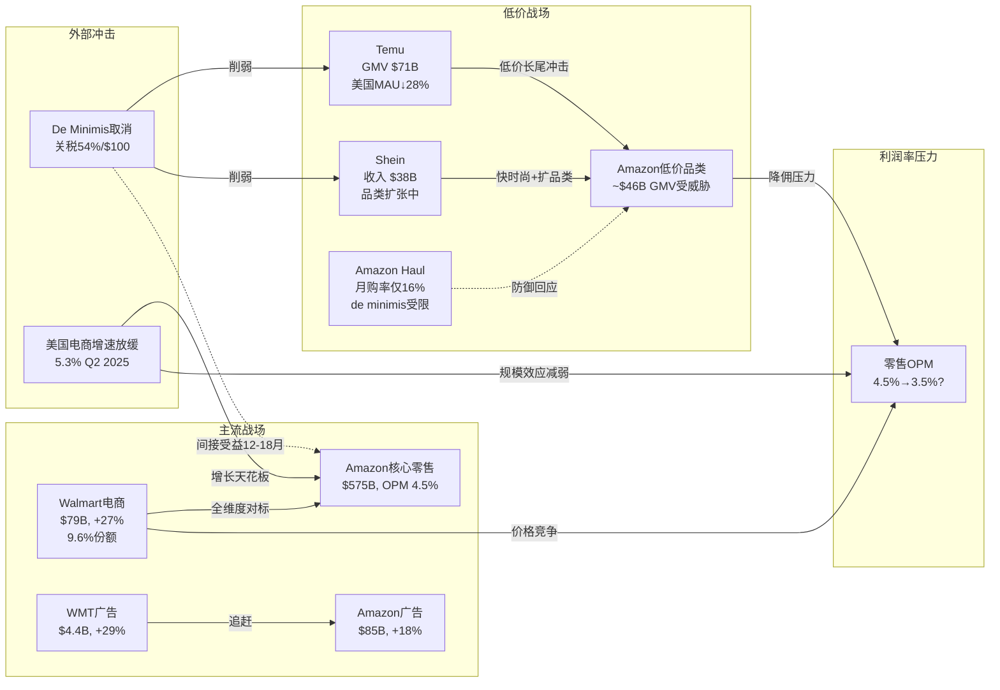

# Ch10: 零售竞争力 — Temu/Shein/沃尔玛三面夹击

> **Agent B 独立风险审计 | DM锚点: DM-RET-010 ~ DM-RET-030**
> **三层标注**: [硬数据:] = H | [合理推断:] = R | [主观判断:] = S

---

## 10.1 Temu冲击: 低价电商的结构性入侵

### 10.1.1 Temu规模与增长轨迹

**[硬数据: PDD Holdings财报/第三方数据]** [DM-RET-010]

| 指标 | 2023 | 2024 | 2025E | 来源 |
|------|------|------|-------|------|
| 全球GMV | ~$18B(H1) | $70.8B | ~$90-95B | 行业估算/PDD财报 |
| 美国收入占比 | ~50% | ~30% | ~25%(下降) | eMarketer |
| 美国MAU | ~150M | ~186M | ~134M(Oct) | 第三方追踪 |
| 全球MAU | ~250M | ~350M | ~417M(Q2) | PDD财报 |
| App下载(累计) | >3亿 | >5亿 | >7亿 | App Store数据 |

**关键转折**: Temu在美国的用户数自2025年5月起出现大幅下降——日活跌约48%(3月至5月)，月活同比下降28%至133.6M(10月)。[DM-RET-011(H)]

这一下降与de minimis政策变化高度相关(详见10.4节)。但全球用户仍在增长(+68% YoY, Q2 2025)，说明Temu正在将战略重心从美国转向全球市场。

### 10.1.2 Temu对Amazon的品类冲击

**[合理推断: 基于品类重叠分析]** [DM-RET-012(R)]

Temu的核心攻击面是Amazon平台上的**低价长尾品类**:

| 品类 | Amazon平均售价 | Temu平均售价 | 价差 | Amazon受影响GMV(估) |
|------|--------------|-------------|------|-------------------|
| 手机配件 | $12-18 | $2-6 | 3-5x | ~$8B |
| 家居小件 | $15-25 | $3-8 | 3-4x | ~$12B |
| 低价服装 | $15-30 | $5-12 | 2-3x | ~$15B |
| 厨房工具 | $10-20 | $2-7 | 3-5x | ~$6B |
| 玩具/文具 | $8-15 | $1-5 | 3-5x | ~$5B |
| **合计受威胁GMV** | | | | **~$46B** |

**[主观判断:]** $46B(约占Amazon美国GMV的8-10%)看似可控，但问题在于这些低价品类是Amazon获取新用户和维持购物频率的关键入口。失去低价品类的流量入口，可能导致整个购物行为链的断裂——用户不再"先去Amazon搜"，而是"先去Temu逛"。[DM-RET-013(S)]

---

## 10.2 Shein: 快时尚堡垒与品类扩张

### 10.2.1 Shein的规模与进化

**[硬数据: Shein财务数据/行业报告]** [DM-RET-014]

| 指标 | 2023 | 2024 | 2025E |
|------|------|------|-------|
| 全球收入 | ~$30B | ~$38B(+23% YoY) | ~$50-56B |
| Q1 2025收入 | — | — | $9.9B |
| 估值 | $66B→$45B | ~$45B | 待IPO(港交所) |
| 美国市场份额(快时尚) | ~30% | ~35% | ~33%(受关税压力) |

Shein的竞争策略已从纯快时尚扩展到综合电商——它正在引入护肤品、玩具、家居等品类(Fortune报道称其"Amazon化")，直接扩大了与Amazon的竞争面。[DM-RET-015(H)]

### 10.2.2 Amazon被迫降佣的量化影响

**[硬数据: Amazon 2024年费用调整]** [DM-RET-016]

Amazon在2024年1月15日起大幅下调低价服装佣金:
- **$15以下服装**: 佣金从17%降至**5%** (降幅71%)
- **$15-$20服装**: 佣金从17%降至**10%** (降幅41%)

**效果**: 低于$20的服装销量同比增长27%(2024年1月-8月)。CEO Andy Jassy确认"降低服装佣金显著推动了单位增长"。

**[合理推断: 佣金下降的利润影响]** [DM-RET-017(R)]

假设Amazon低价服装品类年GMV约$25-30B:
- 原佣金收入: $30B × 17% = $5.1B
- 新佣金收入: $15B(低于$15) × 5% + $15B($15-$20) × 10% = $0.75B + $1.5B = $2.25B
- **佣金收入下降**: ~$2.85B/年 (-56%)
- 即使销量增长27%，佣金收入仍净下降~$1.7B/年

**[主观判断:]** 这是一个经典的"两难困境"——不降佣则丢失用户和GMV给Shein/Temu，降佣则直接牺牲高利润率的take rate。Amazon选择了"保流量牺牲利润"，这是正确的短期策略，但如果竞争压力迫使更多品类降佣(从服装扩展到家居、配件等)，Amazon零售的take rate将面临系统性下降。[DM-RET-018(S)]

---

## 10.3 沃尔玛反击: 被低估的最大威胁

### 10.3.1 沃尔玛电商的加速增长

**[硬数据: Walmart FY2025财报/eMarketer]** [DM-RET-019]

| 指标 | FY2023 | FY2024 | FY2025 | 增速 |
|------|--------|--------|--------|------|
| 全球电商收入 | ~$53B | ~$65B | ~$79.3B | +21-27% |
| 电商占总收入比 | ~10% | ~12% | ~18% | 快速提升 |
| 美国电商市场份额 | ~6.4% | ~7.8% | ~9.6% | +1.8pp YoY |
| 广告收入 | ~$2.7B | ~$3.4B | ~$4.4B | +29% |
| 第三方卖家数量 | ~15万 | ~20万 | ~30万+ | 快速扩张 |

对比Amazon:
- Amazon美国电商份额: ~56%(Q3 2025) vs Walmart ~9.6%
- 但Walmart电商增速(21-27%)远超Amazon(~10%)
- Walmart FY2025总收入$681B已超Amazon $717B——实体零售规模提供了巨大的电商转化潜力 [DM-RET-020(H)]

### 10.3.2 Walmart的结构性优势

**[合理推断: 基于Walmart战略部署的竞争分析]** [DM-RET-021(R)]

Walmart对Amazon的威胁不同于Temu/Shein(低价竞争)，而是**全维度对标**:

1. **仓配一体化**: 4,700+门店 = 天然的"最后一英里"节点。90%的美国人口居住在距Walmart门店10英里范围内。这使得Walmart的同日达/次日达成本结构优于Amazon的纯仓储模式
2. **Walmart+会员**: 对标Prime，年费$98(vs Prime $139)。包含Paramount+流媒体、免费配送、门店扫码结账等权益
3. **广告业务追赶**: Walmart Connect增速29%，虽然规模($4.4B)远小于Amazon广告($85B)，但增速更快且拥有独特的线下归因能力(验证广告→实体门店购买的转化)
4. **食品杂货护城河**: Walmart是美国最大的食品杂货零售商($264B+/年)。食品杂货的高频购买天然带动电商跨品类消费——这是Amazon Whole Foods一直未能有效复制的优势

**[主观判断:]** Walmart是Amazon在美国市场的**唯一结构性威胁**。Temu/Shein攻击的是低价长尾，但Walmart攻击的是中产阶级核心消费。Walmart电商从6.4%→9.6%的增长(+3.2pp in 2年)，如果外推至2028年达到15-18%，将意味着从Amazon手中夺取了$50-80B的GMV。[DM-RET-022(S)]

---

## 10.4 De Minimis规则变化: 竞争格局的外生冲击

### 10.4.1 政策变化时间线

**[硬数据: 美国海关/白宫行政令]** [DM-RET-023]

| 日期 | 事件 |
|------|------|
| 2025.04.02 | Trump签署行政令取消中国/香港de minimis豁免 |
| 2025.05.02 | 对中国商品de minimis取消正式生效 |
| 2025.08.29 | de minimis豁免对所有国家全面取消 |
| 生效后 | <$800进口包裹面临54%关税或$100固定费用 |

### 10.4.2 对Temu/Shein的冲击

**[硬数据: 政策影响数据]** [DM-RET-024]

- Temu/Shein宣布提价15-25%以覆盖关税成本
- de minimis取消后，美国进口小包裹数量下降54%(联合国邮政联盟数据)
- Temu美国日活下降48%(3月→5月), 月活同比下降28%(至10月)
- Shein也面临压力，但其在美国市场的韧性好于Temu(品牌认知度更高)

### 10.4.3 Amazon的间接受益

**[合理推断: de minimis取消对Amazon的双面影响]** [DM-RET-025(R)]

**受益面**:
- Temu/Shein被迫提价15-25%，价差优势大幅收窄
- 小包裹进口下降54%意味着大量低价需求回流至Amazon
- Amazon FBA模式(商品已在美国仓库)不受de minimis影响

**风险面**:
- Amazon自身的第三方卖家中也有大量中国直邮卖家(估计占GMV 10-15%)
- Amazon Haul(对标Temu的低价频道)同样受关税影响，因为商品从中国直发
- 如果Amazon被迫将Haul商品转为FBA模式，履约成本将显著上升

**[主观判断:]** de minimis取消是2025年零售竞争格局中最大的外生变量。短期内它削弱了Temu/Shein的价格武器，但长期来看，这些平台可能通过在美国/墨西哥建仓来绕过限制——届时竞争将回到供应链效率而非关税套利。Amazon的"间接受益"窗口可能只有12-18个月。[DM-RET-026(S)]

---

## 10.5 Amazon的防御措施评估

### 10.5.1 Amazon Haul: 迟到的回应

**[硬数据: Amazon Haul运营数据(2025)]** [DM-RET-027]

- 2024年11月推出，定位为"超低价"频道(大多<$20，部分低至$1)
- 仅在移动端可用(App+浏览器)
- 配送周期: 1-2周(远慢于Amazon标准的1-2天)
- **用户渗透率**: 24%的美国消费者曾购买，但仅16%月度购买
- 对比: Temu月度购买率28%, Shein 23%
- 已扩展至14个新市场(以"Bazaar"品牌)

**[合理推断: Haul的结构性劣势]** [DM-RET-028(R)]

Amazon Haul面临一个根本矛盾: Amazon的品牌承诺是"快速+可靠"，而Haul的定位是"便宜+慢"。这意味着:

1. **品牌稀释风险**: Haul的低质量/慢配送可能损害Amazon主站的品牌信任度
2. **自相蚕食**: Haul上$5的产品可能蚕食Amazon主站$15的同类产品销售
3. **de minimis后困境**: Haul原本依赖中国直发+免关税模式，de minimis取消后要么提价(失去价格优势)要么转FBA(失去成本优势)
4. **表现平庸**: 16%月度购买率说明Haul尚未找到产品-市场匹配

### 10.5.2 同日达投资

**[硬数据: Amazon配送网络]** Amazon在2024-2025年继续扩大同日达配送范围，在美国新增数十个同日达设施。配送速度是Amazon对抗低价竞争者的核心壁垒——当Temu需要1-2周而Amazon可以当天送达时，消费者愿意为速度支付溢价。但这一优势正在被Temu的美国本地仓储部署所侵蚀。

### 10.5.3 降佣策略的扩散风险

**[合理推断:]** 如果低价服装降佣的逻辑(保流量牺牲利润)扩展到更多品类: [DM-RET-029(R)]

| 扩展品类 | 当前佣金 | 潜在降佣 | 年佣金损失(估) |
|---------|---------|---------|---------------|
| 低价家居(<$15) | 15% | 8% | ~$1.5B |
| 手机配件(<$10) | 15% | 5% | ~$0.8B |
| 厨房工具(<$15) | 15% | 8% | ~$0.6B |
| 玩具/文具(<$10) | 15% | 5% | ~$0.5B |
| **累计年损失** | | | **~$3.4B** |

加上已实施的服装降佣($1.7B)，总佣金损失可能达$5.1B/年——相当于Amazon零售业务营业利润的15-20%。

---

## 10.6 零售利润率压力测试

**[合理推断: 三种竞争压力情景对Amazon零售利润率的影响]** [DM-RET-030(R)]

### 基础假设
- FY2025 Amazon零售(非AWS/广告)收入: ~$575B
- FY2025 零售营业利润率(OPM): ~4.5% = ~$25.9B

### 压力情景

| 情景 | 驱动因素 | OPM影响 | 营业利润变化 |
|------|---------|---------|------------|
| **温和竞争** | Temu受de minimis限制, WMT增速放缓 | OPM维持4.5% | 基线 |
| **中度竞争** | 多品类降佣+WMT份额+10% | OPM降至3.5% | -$5.8B |
| **激烈竞争** | 全面价格战+Temu美国建仓+WMT电商15% | OPM降至2.5% | -$11.5B |

**中度竞争情景**的分解:
- 佣金下降: -$3-5B(多品类降佣)
- 配送补贴增加: -$2-3B(为对抗竞争加速同日达)
- 价格竞争: -$1-2B(部分品类主动降价)
- 抵消: 广告收入增长+$3-4B, 效率提升+$1-2B
- **净影响: OPM下降约1个百分点**

**[主观判断:]** "中度竞争"是最可能的情景(概率~50%)，意味着Amazon零售业务将面临~$5-6B的年利润侵蚀。这本身不致命(AWS和广告可以弥补)，但它破坏了"零售业务将从4.5%改善至6-7%"的牛市叙事。零售利润率原地踏步甚至下降的概率，远高于市场定价中隐含的改善预期。

---

## 10.7 美国电商增速放缓: 结构性天花板

**[硬数据: US Census/eMarketer]** [DM-RET-030]

| 指标 | 2022 | 2023 | 2024 | H1 2025 |
|------|------|------|------|---------|
| 美国电商YoY增速 | 7.7% | 7.6% | 8.1% | 5.3%(Q2) |
| 电商渗透率 | ~19.5% | ~21% | ~22.7% | ~22%(Q2) |
| Amazon美国电商份额 | ~38% | ~37.6% | ~37.6% | ~37%(est) |

**关键发现**:
1. Q2 2025电商增速5.3%是自Q4 2022以来最慢，且连续16个季度低于10%
2. 电商渗透率22.7%已接近多个分析师模型中的"短期天花板"(McKinsey预测长期增速将回归~6%/年)
3. Amazon美国电商份额在37-38%范围已趋于稳定——增长空间来自总市场扩张而非份额提升

**[合理推断:]** 如果美国电商增速从8%降至6%，且Amazon份额维持~37%: [DM-RET-030(R)]
- Amazon美国电商收入增速将从~10%降至~6-7%
- 这意味着Amazon零售收入增长将越来越依赖国际市场和新品类(食品杂货、医疗健康)——而这些领域的利润率通常低于核心电商

---

## 10.8 零售竞争格局地图

---

## 10.9 本章核心结论

1. **三面夹击是真实的**: Temu/Shein攻击低价长尾($46B GMV受威胁)，Walmart攻击中产核心消费(电商份额2年+3.2pp)，美国电商增速放缓压缩总量空间

2. **De minimis取消是短期利好、长期中性**: 削弱了Temu/Shein的关税套利优势(美国用户下降28-48%)，但Temu全球用户仍增长68%，且可能通过美国建仓绕过限制

3. **降佣困境是结构性的**: Amazon被迫将低价服装佣金从17%砍至5%，如果扩展至更多品类，累计佣金损失可达$5.1B/年(零售利润的15-20%)

4. **Walmart是最被低估的威胁**: 不同于Temu/Shein的价格竞争，Walmart拥有4,700门店+食品杂货+会员生态+广告——这是一个全维度的竞争对手，且其电商增速(21-27%)是Amazon(~10%)的2-3倍

5. **零售利润率改善叙事面临挑战**: 市场预期Amazon零售OPM从4.5%改善至6-7%，但竞争压力(降佣+配送补贴+价格战)更可能使OPM维持在3.5-4.5%区间

6. **Amazon Haul不是答案**: 16%月度购买率远低于Temu(28%)和Shein(23%)，且面临品牌稀释和de minimis后的商业模式困境

**[主观判断: Agent B总评]** Phase 1的增长驱动分析(Ch08)强调了Amazon的多引擎增长(AWS/广告/国际)，但对零售核心业务面临的竞争压力着墨不足。Amazon零售业务贡献了80%的收入但仅30-35%的营业利润——它是一个"低利润但高规模"的基本盘。当这个基本盘的增速放缓(电商5.3%)+利润率承压(降佣+竞争)时，即使AWS和广告表现出色，Amazon的整体估值故事也需要调整。特别值得警惕的是: 市场可能正在用"零售利润率改善"的预期来合理化当前估值(P/E 27.8x)，而我们的分析表明这一改善面临重大逆风。

---

*DM锚点索引: DM-RET-010(H,Temu规模数据) | DM-RET-011(H,Temu美国用户下降) | DM-RET-012(R,品类冲击分析) | DM-RET-013(S,流量入口风险) | DM-RET-014(H,Shein财务数据) | DM-RET-015(H,Shein品类扩张) | DM-RET-016(H,Amazon降佣数据) | DM-RET-017(R,佣金利润影响) | DM-RET-018(S,降佣困境判断) | DM-RET-019(H,Walmart电商数据) | DM-RET-020(H,WMT vs AMZN规模对比) | DM-RET-021(R,WMT结构性优势) | DM-RET-022(S,WMT威胁判断) | DM-RET-023(H,de minimis政策时间线) | DM-RET-024(H,de minimis影响数据) | DM-RET-025(R,AMZN间接受益分析) | DM-RET-026(S,de minimis长期判断) | DM-RET-027(H,Amazon Haul数据) | DM-RET-028(R,Haul结构性劣势) | DM-RET-029(R,降佣扩散模型) | DM-RET-030(H/R,电商增速+利润率压力测试)*
