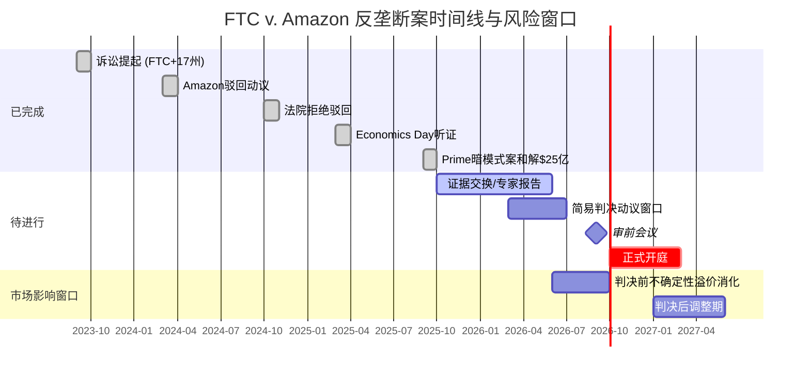

# Chapter 11: 监管与政策风险 — FTC反垄断 + 关税重构 + 数据主权

> **Agent B (独立风险审计员) | Phase 2 | DM-REG-001 ~ DM-REG-020**
> **分析日期**: 2026-02-18 | **股价**: $201.15 | **市值**: $2,159B
> **CQ链接**: CQ5 (FTC分拆风险, 10%) | CQ3 (AWS竞争格局) | CQ6 (CapEx/FCF)

---

## 11.1 FTC反垄断案: 从指控到开庭的完整图谱

### 11.1.1 案件时间线与当前状态

[硬数据: FTC诉讼公开文件] FTC联合17个州(后增至19个)于2023年9月26日正式提起诉讼，指控Amazon违反《谢尔曼法》第二条，在两个关联市场——"在线超级商店市场"和"在线卖家服务市场"——实施非法垄断。**DM-REG-001**(H, FTC公开诉讼文件/PACER)

关键时间节点:

| 日期 | 事件 | 状态 |
|------|------|------|
| 2023.09.26 | FTC + 17州联合提起诉讼 | 已完成 |
| 2024.03 | Amazon提交整案驳回动议(Motion to Dismiss) | 已完成 |
| 2024.10.07 | 联邦法院解封裁定: 拒绝驳回Amazon动议 | **已完成 — 对FTC有利** |
| 2025.03.07 | "Economics Day"听证会 — 双方经济学论证交锋 | 已完成 |
| 2025.09 | FTC另案和解: Prime订阅暗模式案 $25亿赔偿 | 已完成 |
| 2026.09.21 | 审前会议(Pretrial Conference) | 待进行 |
| **2026.10.05** | **正式开庭** (华盛顿州西区联邦法院) | **待进行** |

**DM-REG-002**(H, RTT News/PYMNTS/Retail Dive多源确认): 开庭日期已由联邦法官正式确定为2026年10月5日。审前会议定于2026年9月21日。

[合理推断: 基于诉讼进程节奏] 从提起诉讼到正式开庭历时约3年，符合联邦反垄断大案的典型周期(Google反垄断案从提起到判决亦经历类似时长)。案件尚需经历证据交换(discovery)完成、专家证人报告提交、以及可能的简易判决动议(Summary Judgment)阶段。**证伪条件**: 若双方在2026年6月前达成和解，则开庭时间线失效。

### 11.1.2 指控核心: 三大反竞争行为

FTC指控的核心可归纳为三个互相关联的反竞争机制:

**机制一: Buy Box算法操纵 (SC-FOD)**

[硬数据: FTC诉讼书公开摘要] FTC指控Amazon使用名为"SC-FOD"(Select Competitor - Featured Offer Disqualification)的算法，系统性地惩罚在其他平台(如Walmart.com)以更低价格销售的卖家。当卖家在竞争平台标低价时，该算法自动取消其在Amazon上"赢得Buy Box"的资格——而Buy Box控制了超过80%的购买流量。**DM-REG-003**(H, FTC公开诉讼指控/Fordham法学院分析)

[合理推断: 基于市场机制分析] SC-FOD的实质效果是将Amazon的市场支配地位转化为跨平台价格控制力。卖家被迫在所有平台维持不低于Amazon的价格，否则失去Amazon流量。这构成了一种事实上的最低转售价格维护(RPM)，但其特殊性在于——RPM是制造商对零售商施加的，而SC-FOD是平台对独立卖家施加的。**证伪条件**: 若Amazon能证明SC-FOD仅影响<5%的Buy Box分配决策，则"操纵"定性将被削弱。

**机制二: 自有品牌偏好 (Self-Preferencing)**

[硬数据: FTC指控] Amazon在搜索结果和推荐位中系统性偏向自有品牌(Amazon Basics等)和1P商品，挤压3P卖家的有机流量。**DM-REG-004**(H, FTC诉讼指控/Bryan Cave法律分析)

**机制三: 卖家惩罚机制 (Project Nessie)**

[硬数据: 诉讼文件公开部分] FTC引用Amazon内部代号"Project Nessie"的定价算法，指控Amazon利用该工具测试并推高消费者价格。该工具通过暂时提高Amazon自身价格来探测竞争对手是否跟涨，若竞争对手跟涨则维持高价，否则回调。FTC称该工具在使用期间为Amazon创造了超过$10亿的额外利润。**DM-REG-005**(H, FTC诉讼公开材料/PYMNTS报道)

### 11.1.3 分拆风险场景: 概率-影响矩阵

[主观判断: 基于历史反垄断案先例+当前政治环境综合评估]

**场景A: AWS分拆 (概率: 3-5%)**

AWS分拆是市场最关注但实际概率最低的场景。原因如下:
- FTC当前诉讼的指控核心聚焦于**零售市场**的反竞争行为，并非云计算市场
- AWS分拆需要单独的诉讼程序和独立的市场定义论证
- 英国CMA(竞争与市场管理局)对AWS/Azure的云市场调查尚在初期阶段，且焦点是数据迁移(egress fees)而非分拆
- [硬数据: CMA调查公开信息] CMA对AWS和Microsoft Azure的反垄断调查聚焦于锁定效应(lock-in pricing)和数据迁出费用，而非市场份额本身 **DM-REG-006**(H, Computer Weekly/CMA公开报告)

**估值影响**: [合理推断: 基于SOTP分析框架] 若AWS被强制分拆为独立上市公司:
- 独立AWS估值: 年化收入~$142B, OPM ~37%, 按25-30x营业利润估约$1,300-1,600B
- 剩余Amazon(零售+广告+Prime): 收入~$575B, 但OPM降至3-5%, 估值约$600-800B
- **合计**: $1,900-2,400B vs 当前$2,159B — **分拆可能释放隐藏价值**

[主观判断: 分拆悖论] 这构成了"分拆悖论": 监管者希望通过分拆削弱Amazon的市场支配力，但分拆后的部分之和可能大于整体，反而为股东创造价值。这也是为什么分拆作为补救措施对监管者吸引力有限——它不能真正惩罚公司。**证伪条件**: 若FTC在诉讼中明确寻求AWS分拆作为补救措施(目前诉讼书中未提及)，概率应上调至8-12%。

**场景B: 行为补救/同意令 (概率: 40-50%)**

[合理推断: 基于历史反垄断结局模式] 最可能的结果是某种形式的行为补救:
- Buy Box算法透明度要求
- 自有品牌搜索中立性义务
- 第三方卖家数据使用限制
- 外部合规监督员任命(类似Facebook 2019年和解)

**估值影响**: 行为补救对Amazon的财务影响在$5-15B(占市值0.2-0.7%)区间，主要来自合规成本增加和广告收入可能的边际下降(若Buy Box算法受限影响广告变现效率)。**DM-REG-007**(R, 基于Meta/Google反垄断和解先例推算)

**场景C: Amazon胜诉/案件实质性削弱 (概率: 25-30%)**

[合理推断: 考虑政治环境变化] Trump政府下的FTC领导层变动(新任主席可能与Lina Khan立场不同)可能导致案件优先级下降或和解条款大幅弱化。此外，Trump于2025年解雇NLRB在任委员的先例表明，联邦监管机构的独立性正面临政治压力。**DM-REG-008**(R, 综合政治环境+NLRB先例)

**证伪条件**: 若Biden任命的FTC委员仍占多数且案件按时开庭，则胜诉概率应下调至15-20%。

**场景D: 重大罚款+结构性限制 (概率: 15-20%)**

类似欧盟对Google的$80亿+系列罚款模式: 巨额罚金+持续性行为约束。

### 11.1.4 和解可能性评估

[合理推断: 基于近期FTC-Amazon互动模式] Amazon已在Prime暗模式案中以$25亿和解(2025年9月)——这表明Amazon在**非核心诉讼**上愿意以金钱换取确定性。但反垄断主诉涉及Amazon的核心商业模式(Buy Box算法、3P生态控制)，和解代价将远高于暗模式案。**DM-REG-009**(H+R, FTC公开和解记录 + 类比推断)

**Polymarket验证**: [硬数据: Polymarket市场数据] 搜索"Amazon antitrust FTC"相关市场，Polymarket上存在Amazon Q4 2025财报电话会是否提及"FTC"(已resolved, 最终交易价$0.53)和"Settle/Settlement"(已resolved, Yes)的市场，但**不存在直接针对FTC反垄断案结果的预测市场**。[无对应市场] 针对分拆概率或案件结果的Polymarket市场不存在，以上概率均为Agent B基于历史先例的独立评估。**DM-REG-010**(H, Polymarket查询结果 2026-02-18)



---

## 11.2 关税风险: Trump 2.0时代的贸易格局重塑

### 11.2.1 当前关税状态全景

[硬数据: 多源交叉确认] 截至2026年2月，中美贸易关税格局已显著重构:

| 关税类别 | 税率 | 生效日 | 对Amazon影响 |
|----------|------|--------|-------------|
| 中国常规进口关税 | 30%(基准) + 此前关税层叠 | 2025年5月调整 | 间接(通过3P卖家成本传导) |
| De minimis($800免税)取消 — 中国/香港 | 54-120%或$100-200/件 | 2025年5月2日 | **净正面**(伤害Temu/Shein更甚) |
| 对等关税(reciprocal tariffs) | 10-25%不等(按国别) | 2025年4月 | 供应链成本上升 |

**DM-REG-011**(H, Tax Foundation/CNBC/Carbon6多源确认): 2025年4月2日起，Trump政府对中国商品实施最高145%的关税(后降至约30%日常商品税率)，同时自2025年5月2日起取消来自中国和香港的所有商品的de minimis($800)免税资格。

### 11.2.2 De Minimis取消: 双刃剑的不对称效应

[硬数据: Marketplace.org报道] De minimis豁免取消后四个月，进入美国的<$800包裹数量**下降54%**。**DM-REG-012**(H, Marketplace.org 2025年12月报道)

**对竞争格局的影响 — Amazon vs Temu/Shein**:

| 维度 | Amazon | Temu/Shein |
|------|--------|------------|
| 商业模式依赖度 | 低 — 大部分商品通过美国仓库(FBA)入境，已缴纳进口关税 | **极高** — 商业模式核心是从中国直邮，依赖de minimis免税 |
| 价格竞争力变化 | 相对提升 — 竞品被迫涨价 | **严重削弱** — 低价优势消失 |
| 客户迁移方向 | 可能净流入 | 可能净流出至Amazon |
| Amazon Haul影响 | 负面 — Amazon自身的中国直邮低价业务受损 | — |

[合理推断: 基于供应链结构分析] De minimis取消对Amazon是**净正面但非零成本**:
- **正面**: Temu和Shein的成本结构被颠覆。Shein的低价时尚+中国直邮模式在54-120%关税下几乎不可能维持，其2025年IPO计划已被搁置
- **负面**: Amazon自身推出的"Amazon Haul"(低价中国直邮频道)同样受损; 部分3P卖家(尤其中国跨境卖家)面临退出压力
- **净效果**: [硬数据: CNBC 2025年4月] Amazon 3P中国卖家已普遍涨价29%，部分卖家开始退出美国市场。深圳跨境电商协会负责人表示"在美国市场生存将非常困难"。**DM-REG-013**(H, CNBC/Fox Business报道)

**证伪条件**: 若Trump政府在2026年恢复中国de minimis豁免(概率<5%)或中美达成全面贸易协议大幅降低关税(概率10-15%)，则上述分析失效。[硬数据: Polymarket] 2025年11月的"US x China tariff agreement"市场已resolved Yes(达成了90天临时减税延期协议)，但**目前无针对2026年全面贸易协议的活跃市场**。**DM-REG-014**(H, Polymarket查询 2026-02-18)

### 11.2.3 关税对Amazon财务的量化传导

[合理推断: 基于Amazon 3P卖家结构推算]

- Amazon 3P GMV ~$450B(2025E), 其中中国卖家占比约40-50%(~$180-225B)
- 中国卖家平均涨价29% → 消费者价格上升 → **需求弹性损失估计3-8%**
- 对Amazon take rate(~15%)的影响: $180B × 5%需求损失 × 15% = **~$1.35B收入损失**
- 但部分被Temu/Shein的流量转移抵消，净影响可能仅$0.5-1.0B(占总收入<0.2%)

**DM-REG-015**(R, 基于3P GMV结构+价格弹性推算, 核心假设: 中国卖家占3P GMV 40-50%, 涨价弹性-5%): 关税对Amazon的直接财务冲击有限(收入层面)，但可能通过改变3P卖家生态的长期结构产生二阶效应——中国卖家退出后，供应多样性下降可能影响品类丰富度和价格竞争力。

---

## 11.3 数据隐私与AI监管

### 11.3.1 EU AI Act对AWS的影响

[硬数据: AWS官方博客/EU法规生效日期] EU AI Act第一阶段义务(禁止不可接受风险AI实践)已于2025年2月1日生效。AWS声明其服务符合现行法规要求，并已于**2026年1月15日正式上线AWS European Sovereign Cloud**——一个物理和逻辑上独立的云基础设施，专为满足欧盟数据主权要求设计。**DM-REG-016**(H, AWS官方博客/CIO Dive报道)

[合理推断: 基于行业调查数据] EU AI Act对AWS的影响是**成本驱动而非收入毁灭性**:
- [硬数据: 行业调查] 68%的欧洲企业难以理解EU AI Act合规义务; 约40%的IT支出被导向合规相关成本; 对法规不确定的企业计划减少28%的AI投资。**DM-REG-017**(H, 行业调查报告/Data Center Knowledge)
- AWS的应对策略(Sovereign Cloud)增加了基础设施成本，但也创造了新的高溢价产品线
- 65%的高管已因数据主权要求调整了云战略——这对AWS既是成本也是机会(客户被迫采购合规产品)
- **量化估计**: Sovereign Cloud额外基础设施投资$2-4B(已含在CapEx指引中); 合规运营成本$200-400M/年; 但合规产品溢价可能抵消30-50%的额外成本

**证伪条件**: 若EU AI Act在2026年大幅放松执行标准(部分迹象表明可能推迟某些细则)，合规成本将低于预估。

### 11.3.2 儿童隐私(COPPA)与设备隐私

[硬数据: FTC执法记录] Amazon已因Alexa儿童隐私违规支付$2,500万民事罚款(2023年)，因Ring安全摄像头隐私违规支付$580万(2023年)。合计$3,080万。FTC要求Amazon删除不活跃儿童账户及相关语音录音和地理位置数据，并禁止将此类数据用于算法训练。**DM-REG-018**(H, FTC新闻稿/NPR/Variety多源确认)

[合理推断: 前瞻风险评估] 儿童隐私风险是持续性合规成本而非单次冲击:
- COPPA规则修订(FTC 2025年1月声明)将扩大保护范围
- Amazon Kids+、Echo Dot Kids等产品线需要持续的数据治理投入
- **量化**: 年度合规成本$100-200M(设备部门层面)，潜在罚款风险$50-500M/次
- 与Amazon $717B收入相比，COPPA风险是"蚊子叮咬"级别 — 但对品牌声誉的长期影响难以量化

---

## 11.4 劳动法规风险: 工会化与用工分类

### 11.4.1 仓储工会化趋势

[硬数据: 多源新闻报道] Amazon劳动关系的关键事件:

| 事件 | 日期 | 结果 | 意义 |
|------|------|------|------|
| JFK8(纽约)工会投票 | 2022.04 | ALU胜出 | 首个Amazon工会成功投票 |
| ALU加入Teamsters | 2024.06 | 完成 | 获得资深工会资源支持 |
| Teamsters在9处设施罢工 | 2024.12 | 短期 | 施压合同谈判 |
| RDU1(北卡)工会投票 | 2025.02 | **2,447:829否决** | Amazon最大规模投票中胜出 |
| Bessemer(阿拉巴马)第三次投票 | 待定 | NLRB认定前两次投票中Amazon违规 | 持续争议 |
| Trump解雇NLRB在任委员 | 2025.01 | NLRB失去法定人数 | **严重削弱劳动执法能力** |

**DM-REG-019**(H, CNBC/PBS/SupplyChainBrain/NC Newsline多源交叉确认)

[合理推断: 综合劳动关系前景] 工会化对Amazon的短期财务威胁被**政治环境的变化**显著缓解:
- JFK8虽然投票成功，但3年后仍未达成任何劳动合同
- ALU内部分裂严重、法律资金快速消耗
- **关键变量**: Trump解雇NLRB委员导致委员会失去法定人数(quorum)，无法裁决待审案件——这对所有待审的工会不当劳动实践指控产生冻结效应
- **量化影响(若工会化大规模扩展)**: Amazon ~1.5M仓储工人, 工会化溢价通常15-25%, 意味着全面工会化可能增加$8-15B年度人工成本(占营收1-2%)
- **概率评估**: 5年内超过10%仓储设施工会化的概率约15-20%(基于当前政治逆风)

### 11.4.2 Flex司机用工分类

[硬数据: 诉讼和解记录] Amazon已以$6,000万和解2016-2021年间Flex司机错误分类集体诉讼。但仍有持续的仲裁案件。**DM-REG-020**(H, ClassAction.org/Cohen Milstein)

[合理推断: 前瞻风险] 加州AB5法案及类似州级法律对Amazon Flex和DSP(Delivery Service Partners)模式构成持续威胁:
- Amazon使用~3,000个独立DSP承包商运营"最后一英里"配送，每个DSP雇佣20-40名司机
- 若法院裁定DSP司机为Amazon员工而非独立承包商员工，成本影响可达$3-5B/年(社保/福利/加班费)
- 但Amazon的DSP结构被精心设计为"独立承包商雇佣独立承包商"的双层隔离模型，增加了法律突破难度
- **概率**: 全面重新分类的概率约10-15%(5年窗口)

---

## 11.5 监管风险综合评估

```mermaid
graph TD
    subgraph 高概率/中等影响
        A[FTC行为补救/和解<br>概率40-50% | 影响$5-15B]
        B[关税持续/中国卖家退出<br>概率70-80% | 影响$0.5-1B/年]
        C[EU数据主权合规成本<br>概率90% | 影响$2-4B资本+$300M/年]
    end

    subgraph 中概率/中等影响
        D[工会化扩展>10%设施<br>概率15-20% | 影响$8-15B/年]
        E[DSP/Flex重新分类<br>概率10-15% | 影响$3-5B/年]
        F[COPPA/隐私持续罚款<br>概率50% | 影响$100-500M/次]
    end

    subgraph 低概率/高影响
        G[AWS分拆<br>概率3-5% | 可能释放$200-400B价值]
        H[FTC要求结构性分拆零售<br>概率5-8% | 影响-$200-500B]
    end

    A -->|和解不足可能升级| H
    B -->|供应链重构| C
    D -->|成本上升压缩| I[利润率]
    E -->|若确立先例| D
    G -->|悖论: 分拆释放价值| J[SOTP > 整体]

    style A fill:#FFD700,stroke:#333,color:#000
    style B fill:#FFD700,stroke:#333,color:#000
    style G fill:#FF6347,stroke:#333,color:#fff
    style H fill:#FF6347,stroke:#333,color:#fff
```

### 监管风险概率加权影响(对市值)

| 风险 | 概率 | 影响(市值%) | 概率加权影响 | 时间窗口 | CQ链接 |
|------|------|------------|-------------|----------|--------|
| FTC行为补救 | 45% | -0.3-0.7% | -$2.9-6.8B | 12-18月 | CQ5 |
| FTC结构分拆(零售) | 6% | -10-25% | -$13-32B | 24-36月 | CQ5 |
| AWS分拆(独立诉讼) | 4% | +10-20%(释放价值) | +$8.6-17B | 36-60月 | CQ5/CQ3 |
| 关税净影响 | 75% | -0.05-0.15% | -$0.8-2.4B | 已发生 | — |
| EU合规 | 90% | -0.1-0.2% | -$1.9-3.9B | 12-24月 | CQ3 |
| 工会化 | 18% | -0.4-0.7% | -$1.6-2.7B | 36-60月 | CQ6 |
| **合计概率加权** | — | — | **-$10.6-30.8B** | — | — |

[主观判断: Agent B综合评估] 监管风险的概率加权总影响约为市值的**0.5-1.4%**($10.6-30.8B)，这是一个**可管理**的风险水平。但这一评估未包含风险协同效应(见Ch12)——多个风险同时爆发可能产生超线性损害。核心的不对称性在于: AWS分拆这一"最恐怖"场景反而可能为股东创造价值，这极大地压缩了极端下行风险的概率加权影响。
