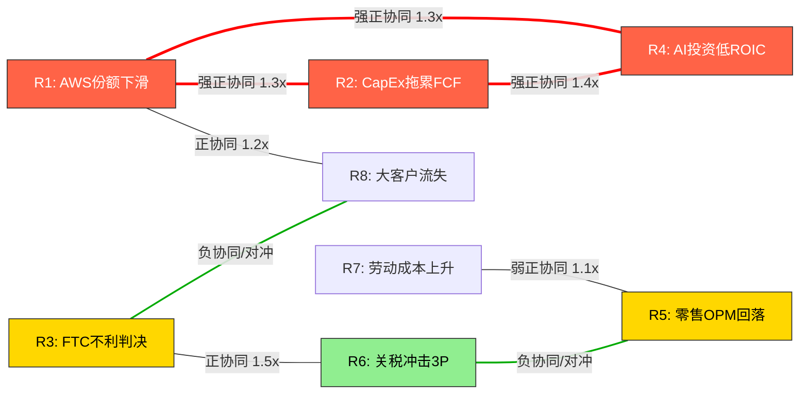

# Chapter 12: 风险拓扑与协同效应 — 从独立风险到系统性脆弱性

> **Agent B (独立风险审计员) | Phase 2 | DM-TOP-001 ~ DM-TOP-015**
> **分析日期**: 2026-02-18 | **股价**: $201.15 | **市值**: $2,159B
> **本章核心命题**: 风险之间的**关系**比风险本身更危险。独立风险清单给出的是加和的最差情形; 风险拓扑揭示的是**乘积**的最差情形。

---

## 12.1 风险节点定义

在构建拓扑之前，先定义Amazon面临的核心风险节点(从Ch08-Ch11及Phase 1产出中提取):

| ID | 风险节点 | 简称 | 独立概率(24M) | 独立影响(市值%) | CQ链接 |
|----|----------|------|--------------|----------------|--------|
| R1 | AWS市场份额持续下滑(跌破27%) | AWS-Share | 35% | -8-12% | CQ3 |
| R2 | CapEx $200B执行导致2026 FCF为负 | CapEx-FCF | 55% | -5-10% | CQ6 |
| R3 | FTC反垄断案不利判决(行为补救+) | FTC-Anti | 45% | -0.5-2% | CQ5 |
| R4 | AI投资ROIC低于WACC(3年窗口) | AI-ROIC | 30% | -10-15% | CQ1/CQ6 |
| R5 | 零售OPM回落(<3%) | Retail-OPM | 20% | -3-5% | CQ2 |
| R6 | 关税+供应链重构冲击3P生态 | Tariff-3P | 25% | -1-2% | — |
| R7 | 工会化/劳动成本上升>10%设施 | Labor-Cost | 18% | -0.5-1% | CQ6 |
| R8 | AWS大型客户流失(多云迁移加速) | AWS-Churn | 20% | -3-5% | CQ3 |

**DM-TOP-001**(R, 基于Ch08-Ch11风险分析汇总, 独立概率为Agent B评估): 以上概率为各风险在24个月窗口内实质性发生(达到定义阈值)的独立概率。需要注意的是，这些概率**并非独立的**——风险之间存在显著的相关性结构，这正是本章的分析焦点。

---

## 12.2 风险协同矩阵: 超加和效应

### 12.2.1 正协同(Risk Amplification): 1+1>2

**协同对 Alpha: CapEx高企(R2) + AWS份额下滑(R1)**

[合理推断: 基于财务传导逻辑]

这是Amazon最危险的风险协同对。传导机制:
- Amazon在2026年计划投入$200B CapEx，其中~65-70%($130-140B)用于AWS基础设施(数据中心、定制芯片、网络)
- 这笔投资的回报依赖于AWS收入增长持续>20%
- 若AWS份额从29%滑落至<27%，意味着增长率可能从24%降至15-18%
- CapEx固定支出+收入增长放缓 = **FCF被双向挤压**
- 独立影响加总: -13%~-22% 市值; **协同影响: -18%~-30%**(超线性因子1.3-1.4x)

**DM-TOP-002**(R, 基于CapEx固定成本杠杆+收入减速的复合效应推算): 超线性效应来源于折旧/摊销的滞后性——$200B CapEx将在未来4-7年产生$30-50B/年的折旧负担，即使管理层2027年削减CapEx，存量投资的折旧拖累已经锁定。

**证伪条件**: 若AWS通过AI推理需求实现单位经济学改善(每$1 CapEx产出的收入提升>30%)，则即使份额下滑，收入绝对值仍可支撑回报率。这取决于CQ1(AI变现效率)的回答。

**协同对 Beta: FTC不利判决(R3) + 关税冲击3P(R6)**

[合理推断: 基于市场结构分析]

- FTC若要求Buy Box算法透明化或限制Amazon对3P卖家的数据使用，将降低Amazon对3P生态的控制力
- 同时，关税冲击正在驱使中国卖家退出，减少3P供给多样性
- 两者叠加: Amazon失去对3P定价的控制力(FTC限制) + 3P卖家基数收缩(关税驱逐) = **3P GMV增长停滞**
- 3P广告收入是Amazon最高利润率业务(OPM ~50%+): GMV增速放缓直接冲击广告变现
- 独立影响加总: -1.5%~-4%; **协同影响: -3%~-6%**(超线性因子1.5-2.0x)

**DM-TOP-003**(R, 3P广告利润率杠杆效应推算): 广告业务约$60B收入、OPM~50% = ~$30B营业利润。若3P GMV增长从15%降至5%，广告增速同步放缓至8-10%(从当前~20%)，利润缺口$3-5B/年。

**协同对 Gamma: AI投资低回报(R4) + CapEx拖累(R2) + AWS份额下滑(R1)**

[主观判断: Agent B定义的"完美风暴"核心三角]

这是三重风险的共振:
- Amazon投入$200B CapEx，核心赌注是AI将驱动AWS需求爆发
- 若AI投资回报低于预期(R4)，意味着这笔CapEx产生的增量收入不足以覆盖折旧
- 同时Azure/GCP在AI领域蚕食份额(R1)，意味着Amazon的AI投资不仅回报低，而且**竞争对手的AI投资回报更高**
- 三者叠加产生的叙事毒性: "Amazon在AI军备竞赛中花了最多钱但拿到了最少的回报"
- 独立影响加总: -23%~-37%; **协同影响: -30%~-50%**(超线性因子1.3-1.4x)
- **叙事放大器**: 市场可能对"AI投资失败"的叙事过度反应(类似Meta 2022年元宇宙CapEx恐慌时-65%回撤)

**DM-TOP-004**(S, Agent B对三重风险共振的综合评估): 这一场景的概率虽低(见12.3节)，但若发生，可能触发类似2022年Meta的估值重定价——P/E从27.8x压缩至15-18x，市值从$2,159B降至$1,100-1,400B。**证伪条件**: 若AWS在2026H2展示AI收入占比>15%且增长>40%，则AI-ROIC担忧将大幅缓解。

### 12.2.2 负协同(Risk Offset): 互斥或对冲关系

**对冲对 1: 关税打击Temu/Shein(R6) ←→ Amazon零售竞争力提升**

[合理推断: 基于竞争动态] De minimis取消对Amazon的竞争对手伤害更大:
- Temu/Shein的中国直邮低价模式在54-120%关税下几乎瓦解
- 这为Amazon零售(尤其是Amazon Haul以外的核心品类)释放了竞争空间
- 关税作为"监管护城河"的效果: 抬高了新进入者的门槛，巩固了Amazon的现有3P生态
- **净效果**: R6的直接损失($0.5-1B/年)被竞争格局改善的间接收益(~$1-2B/年流量转移)部分或完全抵消

**DM-TOP-005**(R, 基于Temu/Shein直邮模式对de minimis的依赖度分析): 这是少数"外部风险反而强化壁垒"的案例。但需注意——这种对冲并非完美: 若关税导致整体消费需求下降(宏观层面)，则Amazon和Temu都受损。

**对冲对 2: FTC限制自有品牌(R3) ←→ 3P卖家信心提升**

[合理推断: 博弈论视角] 若FTC要求Amazon限制自有品牌偏好:
- 短期: Amazon自有品牌收入下降($20-25B收入中的一部分)
- 长期: 3P卖家信心提升，可能吸引更多优质卖家入驻，增加GMV
- 广告收入(主要来自3P)可能因3P生态健康度提升而增长
- **悖论**: 监管限制可能改善而非恶化Amazon的长期商业模式

**DM-TOP-006**(R, 基于3P vs 1P利润率结构分析): Amazon的1P自有品牌OPM约5-8%, 而3P take rate+广告的有效OPM约20-30%。从利润率角度，3P替代1P实际上是**利润率提升**的结构性变化。

### 12.2.3 协同矩阵可视化

---

## 12.3 完美风暴概率: 多风险同时爆发

### 12.3.1 核心三角风暴(R1+R2+R4): AWS份额下滑 + CapEx拖累 + AI回报不足

**独立概率乘积**: P(R1) × P(R2) × P(R4) = 35% × 55% × 30% = **5.8%**

**相关性调整**:
- R1和R4高度正相关(ρ ≈ 0.6): 若AI回报不足，往往意味着竞争对手的AI产品更好 → AWS份额下滑
- R2和R4正相关(ρ ≈ 0.5): CapEx高企且AI回报不足是同一决策的两面
- 使用Gaussian copula近似调整: 联合概率 ≈ **8-12%**

**DM-TOP-007**(R, 基于风险相关性结构的联合概率推算, 使用简化Copula模型): 8-12%的联合概率意味着这不是"黑天鹅"而是**灰犀牛**——它的概率足够高，市场应该(且部分)已经将其定价。

**若完美风暴发生的影响**:
- 市值影响: -30%~-50%(含超线性协同效应)
- 市值区间: $1,080-1,510B(vs 当前$2,159B)
- EV/EBITDA从15.4x压缩至8-10x
- 这一场景下Amazon将从"AI领导者"重新定价为"高CapEx、中增长的基础设施公司"

### 12.3.2 监管叠加风暴(R3+R6+R7): FTC + 关税 + 劳动

**独立概率乘积**: 45% × 25% × 18% = **2.0%**

**相关性调整**:
- R3和R6弱正相关(ρ ≈ 0.2): 监管环境整体趋严时两者同向
- R6和R7近乎独立(ρ ≈ 0.05)
- 调整后联合概率 ≈ **2.5-3.5%**

**若监管叠加风暴发生的影响**:
- 市值影响: -5%~-10%(含协同效应)
- 这一场景的影响相对有限，因为每个单独风险的财务影响都较小
- 主要风险在于**叙事毒性**: "Amazon面临全方位监管围堵"可能引发市场情绪恶化

**DM-TOP-008**(R, 监管风险叠加概率评估): 监管叠加风暴的市值影响远小于核心三角风暴，因为监管风险的传导链更长、更间接。但监管风暴可能**触发**核心三角风暴中的R1(叙事传导导致大客户评估AWS替代方案)。

### 12.3.3 全面风暴(5+风险同时发生)

[主观判断: 极端尾部场景] 若R1+R2+R3+R4+R5同时发生:
- 联合概率: <1%(考虑相关性后约1-2%)
- 市值影响: -40%~-60%
- 这一场景类似于2022年Amazon的-50%回撤(当时面临电商去库存+AWS增速放缓+通胀+利率飙升)
- **历史锚点**: 2022年AMZN从$170触底至$85，跌幅50%，耗时约9个月恢复

**DM-TOP-009**(S, 全面风暴极端尾部评估): 1-2%的概率看似极低，但对于$2,159B市值的公司，1%概率 × -50%影响 = **-$10.8B概率加权损失**，在估值模型中不可忽略。

---

## 12.4 温水煮青蛙场景: 无单一触发器的慢性侵蚀

[主观判断: Agent B认为这是被市场**最严重低估**的风险路径]

### 12.4.1 场景描述

没有任何一个季度出现"灾难"，但:
- AWS份额每季度流失0.3-0.5%: 29%(Q3 2025) → 27%(Q3 2026) → 25%(Q3 2027)
- 零售OPM每季度下滑30-50bps: 6%(当前) → 4.5%(2027)
- CapEx持续高企但ROIC改善缓慢: FCF每年$5-10B vs 市场期望$30-50B
- 广告增速从20%放缓至10-12%

### 12.4.2 量化传导

**24个月累积侵蚀模型**:

| 指标 | 当前(Q4 2025) | 慢性侵蚀后(Q4 2027E) | 变化 |
|------|-------------|---------------------|------|
| AWS份额 | 29% | 25-26% | -3-4pp |
| AWS OPM | 37% | 33-35% | -2-4pp |
| AWS营业利润(年化) | ~$52B | ~$44-48B | -$4-8B |
| 零售OPM | ~6% | 4-5% | -1-2pp |
| 零售营业利润 | ~$34B | $24-30B | -$4-10B |
| 广告增速 | ~20% | 10-12% | -8-10pp |
| FCF | $7.7B(FY2025) | $5-15B(FY2027E) | 高度不确定 |
| 合理P/E | 27.8x | 20-23x | -5-8x |
| 隐含市值 | $2,159B | $1,400-1,700B | **-$460-760B (-21-35%)** |

**DM-TOP-010**(R, 基于各指标独立趋势的线性外推+估值压缩的联合效应): 温水煮青蛙的核心洞察是——每个单独变化都不足以触发市场恐慌(每季度-0.5%份额不会引发"AWS崩溃"叙事)，但24个月的累积效应是**市值蒸发$460-760B**。

**概率评估**: 这一渐进路径的概率约**20-30%**——远高于完美风暴(8-12%)，原因是它不需要任何极端事件发生，只需要"略低于预期"的持续状态。

**DM-TOP-011**(S, Agent B对温水煮青蛙概率的独立评估): 20-30%的概率使其成为**概率加权影响最大的单一风险路径**: 25% × (-28%) = **-7%概率加权市值影响 = -$151B**。这远超完美风暴的概率加权影响(10% × (-40%) = -4% = -$86B)。

**证伪条件**: 若AWS在任意两个连续季度展示份额稳定或回升(>29%)，则温水煮青蛙路径被否决。

---

## 12.5 风险间逻辑矛盾检测

[主观判断: Agent B的核心增值——识别研究中隐含的逻辑不一致]

### 12.5.1 矛盾一: "CapEx创造壁垒" vs "CapEx拖累FCF"

**描述**: 在Phase 1的增长叙事中，$200B CapEx被视为Amazon构建AI基础设施壁垒的关键投入，是"护城河加深"的体现。在风险分析中，同一笔$200B CapEx被视为FCF杀手和股东价值稀释器。

**解构**:
- 两个论述并不矛盾——它们描述的是**同一硬币的两面**
- 关键变量是**时间和回报率**: 若CapEx在3年内产生>15% ROIC，则"壁垒"叙事正确; 若ROIC<10%或需5年+才能体现，则"拖累"叙事正确
- [合理推断: 基于历史CapEx周期] Amazon历史上的大型CapEx周期(2011-2014 FBA扩张, 2020-2021 疫情产能扩张)均在2-3年后产生显著ROIC提升。但当前$200B周期的规模是前者的3-5倍，**回报周期可能更长**

**DM-TOP-012**(R, 基于Amazon历史CapEx周期的投入-产出时滞分析): 我们的基准假设应该是: CapEx同时是壁垒和拖累，关键是**比重随时间变化**——2026年偏"拖累"(投入期)，2028-2029年偏"壁垒"(产出期)。但市场是否有耐心等待2-3年，取决于每季度的增量信号。

### 12.5.2 矛盾二: "AI投资驱动高ROIC" vs "AWS份额持续下滑"

**描述**: 如果Amazon的AI投资(Trainium/Inferentia芯片、Bedrock平台、SageMaker)真的能产生高ROIC，那AWS的市场份额为什么还在下滑?

**解构**:
- **可能的一致性解释1: 总量增长掩盖份额下滑** — AI推理需求爆发使云计算TAM从$650B(2025)扩展至$1.2T(2028E)。AWS可以在份额从29%降至25%的同时，收入从$142B增长至$300B。ROIC高、份额降、收入升——三者可以共存
- **可能的一致性解释2: 份额下滑是旧业务萎缩** — AWS的份额下滑主要来自传统IaaS(虚拟机、存储)的竞争侵蚀，而AI新业务占比尚小但增长迅速。如果AI收入占比从当前~5-10%增至30%+，份额指标可能回升
- **不可调和的矛盾情形**: 若AWS的AI产品在**直接对比测试**(benchmark)中被Azure AI/GCP Vertex AI持续击败，且定制芯片Trainium的性价比不及NVIDIA GPU，则"AI投资高ROIC"叙事崩塌，份额下滑将加速

**DM-TOP-013**(R, 基于TAM增长率+份额变化的一致性检验): 我们给"可能一致"60%的权重、"不可调和"40%的权重。这意味着CQ1(AI变现效率)和CQ3(AWS竞争格局)之间存在**40%的逻辑风险**——即报告中的乐观AI叙事和悲观份额分析可能无法共存。

### 12.5.3 矛盾三: "低P/E(27.8x)=便宜" vs "$7.7B FCF=$2,159B市值"

**描述**: AMZN的P/E(27.8x)看似合理(低于MSFT的32x, GOOG的23x略高但增速更快)。但FCF仅$7.7B意味着P/FCF约**280x**——这两个估值锚点给出完全不同的信号。

**解构**:
- P/E基于会计利润($77.7B净利润)，包含大量非现金项目(如股权投资收益)
- FCF基于现金流: OCF $139.5B - CapEx $131.8B = $7.7B
- 差异的核心是**$131.8B CapEx**: 这笔支出全部计入FCF计算但仅通过折旧部分进入利润
- [合理推断: 标准化CapEx分析] 若将CapEx拆分为维护性($30-40B)和增长性($90-100B)，则"维护性FCF"约$100-110B，对应P/维护FCF ~20x——**这才是合理的估值锚点**
- 但市场是否接受"维护性FCF"视角取决于增长性CapEx最终能否产生回报

**DM-TOP-014**(R, 基于CapEx拆分的标准化FCF分析): 投资者面对的是一个**信念问题**: 你相信$200B CapEx中的$100B+增长性支出会在3-5年内产生回报吗? 如果相信，P/E 27.8x是便宜的; 如果不相信，P/FCF 280x是荒谬的。当前市值$2,159B隐含的信念是: 市场**大部分相信**增长性CapEx会有回报，但给予了一定的"执行风险折扣"。

---

## 12.6 CQ链接映射

| CQ | 问题 | 关联风险节点 | 风险协同路径 | 关键判断 |
|----|------|------------|-------------|----------|
| CQ1 | AI变现效率 | R4, R1 | R4→R1(AI弱则份额降) | 决定CapEx"壁垒vs拖累"的分水岭 |
| CQ2 | 零售利润率可持续性 | R5, R6, R7 | R6→R5(关税→成本→OPM) | 劳动+关税双重压力下OPM底部在哪 |
| CQ3 | AWS竞争格局 | R1, R8 | R1→R8(份额降→大客户重新评估) | 份额数字vs收入绝对值哪个更重要 |
| CQ4 | 飞轮效应是否持续 | R1, R5, R6 | 温水煮青蛙路径的核心 | 飞轮减速是渐进的还是会有临界点 |
| CQ5 | FTC分拆风险 | R3 | R3→R1(叙事传导) | 分拆悖论: 可能释放价值 |
| CQ6 | CapEx/FCF | R2, R4 | R2+R4=完美风暴核心 | $200B是投资还是军备竞赛浪费 |
| CQ7 | 广告增长天花板 | R3, R6 | R3+R6→广告减速 | 3P生态健康度决定广告上限 |

**DM-TOP-015**(R, CQ-风险映射总表): CQ6(CapEx/FCF)是风险拓扑中**连接最密集的节点**——它同时链接R2和R4，这两个风险又分别链接R1和R5。这意味着CQ6的回答对整个风险拓扑的结构稳定性具有**不成比例的影响**。如果CQ6的答案偏悲观(2026 FCF确实为负)，则R2→R4→R1的传导链被激活，触发完美风暴路径。

---

## 12.7 风险拓扑总结: 三个核心洞察

**洞察一: 温水煮青蛙(概率20-30%)比完美风暴(概率8-12%)更值得关注**

[主观判断: Agent B的核心判断] 大多数风险分析聚焦于极端场景(分拆、FCF崩溃)，但概率加权影响最大的路径是**渐进侵蚀**——没有单一季度的"灾难"，但24个月累积下来市值可能蒸发$460-760B。这一路径之所以危险，恰恰因为它不会触发任何警报: 每季度-0.5%份额不会上新闻头条，每季度-30bps OPM不会引发analyst downgrade。但累积效应是致命的。

**洞察二: R1-R2-R4构成Amazon的"不可能三角"**

Amazon同时承诺: (a) 投入$200B CapEx, (b) 维持AWS领先地位, (c) AI投资产生高回报。三者之中至少有一个将在2026-2027年被证伪。投资者需要提前决定哪一个承诺最可能被打破——这将决定估值框架。

**洞察三: 监管风险被高估，执行风险被低估**

市场对FTC分拆的恐惧(概率3-5%，且分拆可能释放价值)消耗了过多的注意力。真正值得关注的风险是: Amazon能否在$200B CapEx周期中保持执行纪律——在正确的项目上投入、在错误的项目上及时止损。这是一个**内部执行问题**，无法通过任何外部数据源验证，只能通过每个季度的增量信号逐步评估。
