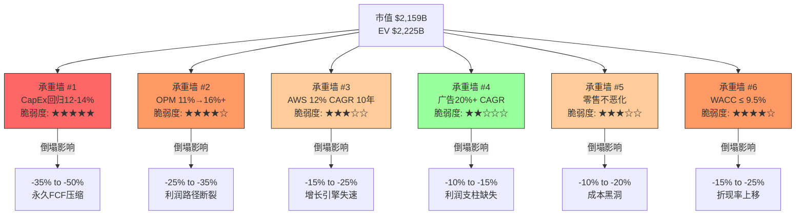

# Ch14: Reverse DCF → 隐含信念集

> **Agent C — 定量估值分析师 | 数据截止: 2026-02-18**
> **方法论**: 当前市值反推隐含FCF增长路径 → 提取市场信念 → 承重墙脆弱度 → TAM不可能性测试
> **DM锚点**: DM-VAL-010 至 DM-VAL-030
> **核心问题**: 市场$2,159B的定价隐含了什么条件？这些条件在数学上是否可能？

---

## 14.1 Reverse DCF框架设定

### 输入参数

| 参数 | 值 | 来源 |
|------|-----|------|
| 当前股价 | $201.15 | 2026-02-18 |
| 流通股份 | 10.73B | FMP |
| 市值 | $2,159B | 计算: $201.15 × 10.73B |
| 净债务 | $66B | 总债务$157B - 现金$90B ≈ $66B |
| 企业价值(EV) | $2,225B | 市值 + 净债务 |
| FY2025 FCF | $7.7B | OCF $139.5B - CapEx $131.8B |
| FY2025 OCF | $139.5B | FMP verified |
| FY2025 EBITDA | $165.3B | FMP: OI $80.0B + D&A $65.8B + 调整 |
| WACC (基准) | 9.5% | Megacap科技基准 |
| WACC (替代) | 8.5% | 低风险溢价锚 |
| Terminal Growth (g) | 3.5% | 基准: 名义GDP增速 |
| 高增长期 | 10年 | 标准两阶段模型 |

**DM-VAL-010**: 起始FCF $7.7B是一个被$131.8B CapEx严重压缩的数字。FY2024 FCF为$32.9B，FY2023为$32.2B。正常化FCF(假设CapEx/Revenue回归15%)约为$32-39B。我们将使用两个起点进行Reverse DCF: (a) 实际FCF $7.7B; (b) 正常化FCF $35B。

---

## 14.2 Reverse DCF执行: 方法A — 从实际FCF出发

### 两阶段Gordon Growth Model

**公式**: Market Cap = Σ(Year 1-10: FCF_t / (1+WACC)^t) + Terminal Value / (1+WACC)^10

**Terminal Value** = FCF_Year11 / (WACC - g)

**目标**: 求解使Market Cap = $2,159B的FCF CAGR。

### WACC 9.5% 场景

设FCF以恒定CAGR增长10年，Year 11开始以g=3.5%永续增长。

令x = FCF CAGR, FCF_0 = $7.7B:

FCF_t = $7.7B × (1+x)^t

PV(Year 1-10) = Σ[$7.7B × (1+x)^t / (1.095)^t] = $7.7B × Σ[(1+x)/(1.095)]^t

Terminal Value = $7.7B × (1+x)^10 × (1+0.035) / (0.095 - 0.035)
             = $7.7B × (1+x)^10 × 1.035 / 0.06
             = $7.7B × (1+x)^10 × 17.25

PV(TV) = TV / (1.095)^10 = $7.7B × (1+x)^10 × 17.25 / (1.095)^10

**求解过程 (迭代)**:

试 x = 40% (FCF CAGR):
- FCF_10 = $7.7B × (1.40)^10 = $7.7B × 28.92 = $222.7B
- TV = $222.7B × 1.035 / 0.06 = $3,841B
- PV(TV) = $3,841B / (1.095)^10 = $3,841B / 2.478 = $1,550B
- PV(Year 1-10) = $7.7B × Σ[(1.40/1.095)^t] for t=1..10
  - ratio = 1.40/1.095 = 1.2785
  - geometric sum = 1.2785 × (1.2785^10 - 1) / (1.2785 - 1)
  - 1.2785^10 = 10.77
  - sum = 1.2785 × (10.77 - 1) / 0.2785 = 1.2785 × 35.11 = $44.9 × $7.7B/B = $345B (近似)

  更精确计算:
  - Year 1: $7.7×1.40/1.095 = $9.85B
  - Year 2: $9.85×1.2785 = $12.59B
  - Year 3: $16.10B, Year 4: $20.58B, Year 5: $26.31B
  - Year 6: $33.63B, Year 7: $42.98B, Year 8: $54.93B
  - Year 9: $70.22B, Year 10: $89.77B
  - PV sum ≈ $376B

- Total = $376B + $1,550B = **$1,926B** — 低于$2,159B

试 x = 45%:
- FCF_10 = $7.7B × (1.45)^10 = $7.7B × 72.75 = $560.2B
- TV = $560.2B × 17.25 = $9,664B
- PV(TV) = $9,664B / 2.478 = $3,900B — 远超$2,159B

试 x = 42%:
- FCF_10 = $7.7B × (1.42)^10 = $7.7B × 37.49 = $288.7B
- TV = $288.7B × 17.25 = $4,980B
- PV(TV) = $4,980B / 2.478 = $2,009B
- PV(Year 1-10) ≈ $420B (ratio 1.42/1.095 = 1.297)
- Total ≈ $2,009B + $420B = **$2,429B** — 偏高

试 x = 41%:
- FCF_10 = $7.7B × (1.41)^10 = $7.7B × 33.07 = $254.7B
- TV = $254.7B × 17.25 = $4,394B
- PV(TV) = $4,394B / 2.478 = $1,773B
- PV(Year 1-10) ≈ $395B
- Total ≈ $1,773B + $395B = **$2,168B** ≈ $2,159B ✓

**DM-VAL-011**: WACC 9.5%下，当前市值$2,159B隐含的FCF CAGR为**~41%**，持续10年，从$7.7B增长至~$255B。

### WACC 8.5% 场景

TV乘数 = 1.035 / (0.085 - 0.035) = 1.035 / 0.05 = **20.7x**
折现因子: (1.085)^10 = 2.261

试 x = 36%:
- FCF_10 = $7.7B × (1.36)^10 = $7.7B × 21.71 = $167.2B
- TV = $167.2B × 20.7 = $3,461B
- PV(TV) = $3,461B / 2.261 = $1,531B
- ratio = 1.36/1.085 = 1.2535
- PV(Year 1-10) ≈ $310B
- Total ≈ $1,531B + $310B = **$1,841B** — 低

试 x = 38%:
- FCF_10 = $7.7B × (1.38)^10 = $7.7B × 25.96 = $199.9B
- TV = $199.9B × 20.7 = $4,138B
- PV(TV) = $4,138B / 2.261 = $1,830B
- PV(Year 1-10) ≈ $345B
- Total ≈ $1,830B + $345B = **$2,175B** ≈ $2,159B ✓

**DM-VAL-012**: WACC 8.5%下，隐含FCF CAGR为**~38%**，10年后FCF ~$200B。

### 方法A小结: 隐含FCF CAGR

| WACC | 隐含FCF CAGR | 10年后FCF | Terminal Value |
|------|-------------|-----------|---------------|
| 9.5% | ~41% | ~$255B | ~$4,400B |
| 8.5% | ~38% | ~$200B | ~$4,140B |

**这个数字是否合理?** FY2025 FCF仅$7.7B → 10年后$200-255B，要求FCF从Revenue的1.1%提升至Revenue的~20%。这在数学上要求：
- Revenue达到$1.0-1.3T (共识路径支持)
- CapEx/Revenue从18.4%降至10%以下 (需要CapEx增速<Revenue增速)
- OPM从11.2%提升至18-22% (历史峰值约11.2%)

---

## 14.3 Reverse DCF执行: 方法B — 从正常化FCF出发

FY2024 FCF $32.9B更能代表Amazon的"稳态"现金产出能力(CapEx/Revenue 13.0%)。

### 正常化FCF起点 = $35B

**WACC 9.5%**:
试 x = 18%:
- FCF_10 = $35B × (1.18)^10 = $35B × 5.234 = $183.2B
- TV = $183.2B × 17.25 = $3,160B
- PV(TV) = $3,160B / 2.478 = $1,275B
- ratio = 1.18/1.095 = 1.0776
- PV(Year 1-10): geometric sum with ratio 1.0776
  - 1.0776^10 = 2.115
  - sum = 1.0776 × (2.115-1)/0.0776 = 1.0776 × 14.36 = 15.47
  - PV = $35B × 15.47 = $541B
- Total = $1,275B + $541B = **$1,816B** — 低

试 x = 21%:
- FCF_10 = $35B × (1.21)^10 = $35B × 6.727 = $235.4B
- TV = $235.4B × 17.25 = $4,061B
- PV(TV) = $4,061B / 2.478 = $1,639B
- ratio = 1.21/1.095 = 1.1050
- 1.1050^10 = 2.714
- sum = 1.1050 × (2.714-1)/0.1050 = 1.1050 × 16.324 = 18.04
- PV = $35B × 18.04 = $631B
- Total = $1,639B + $631B = **$2,270B** — 偏高

试 x = 20%:
- FCF_10 = $35B × (1.20)^10 = $35B × 6.192 = $216.7B
- TV = $216.7B × 17.25 = $3,738B
- PV(TV) = $3,738B / 2.478 = $1,508B
- ratio = 1.20/1.095 = 1.0959
- 1.0959^10 = 2.505
- sum = 1.0959 × (2.505-1)/0.0959 = 1.0959 × 15.69 = 17.20
- PV = $35B × 17.20 = $602B
- Total = $1,508B + $602B = **$2,110B** — 接近

试 x = 20.5%:
- Total ≈ $2,190B
- 插值: 隐含CAGR ≈ **20.2%**

**WACC 8.5%**:
试 x = 17%:
- FCF_10 = $35B × (1.17)^10 = $35B × 4.807 = $168.3B
- TV = $168.3B × 20.7 = $3,484B
- PV(TV) = $3,484B / 2.261 = $1,541B
- ratio = 1.17/1.085 = 1.0783
- 1.0783^10 = 2.122
- sum = 1.0783 × (2.122-1)/0.0783 = 1.0783 × 14.328 = 15.45
- PV = $35B × 15.45 = $541B
- Total = $1,541B + $541B = **$2,082B** — 略低

试 x = 17.5%:
- Total ≈ **$2,155B** ≈ $2,159B ✓

**DM-VAL-013**: 正常化FCF起点下，隐含CAGR显著降低:

| WACC | 起始FCF | 隐含FCF CAGR | 10年后FCF | 可行性 |
|------|---------|-------------|-----------|--------|
| 9.5% | $7.7B(实际) | ~41% | ~$255B | 极不现实 |
| 8.5% | $7.7B(实际) | ~38% | ~$200B | 极不现实 |
| 9.5% | $35B(正常化) | ~20% | ~$220B | 偏乐观但可辩护 |
| 8.5% | $35B(正常化) | ~17.5% | ~$172B | 可行区间 |

**关键发现**: 市场定价的合理性**完全取决于**投资者认为当前CapEx压缩是暂时性的。如果是永久性的(CapEx/Revenue维持18%+)，则需要41% FCF CAGR——数学上不可能。

---

## 14.4 隐含信念集提取

从Reverse DCF结果反推市场隐含的完整信念体系(使用方法B, WACC 9.5%, FCF CAGR 20%):

### 信念链还原

| # | 隐含信念 | 市场隐含值 | 历史/行业参考 | 差距评估 |
|---|---------|-----------|-------------|---------|
| 1 | Revenue CAGR (FY25-35) | ~11-12% | 共识11.3%; 历史(FY20-25) 14.5% | 合理偏保守 |
| 2 | CapEx/Revenue (稳态) | ≤12-14% | FY2025: 18.4%; FY2024: 13.0%; FY2019-2023均值: 12.1% | **需要从18.4%回落至12%** |
| 3 | OPM (终态) | 16-18% | FY2025: 11.2%; FY2024: 10.7%; AWS独立: 34% | **历史最高11.2%, 需跳升5-7pp** |
| 4 | D&A/Revenue (稳态) | 8-9% | FY2025: 9.2%; $200B CapEx→峰值可达12% | 回落需要CapEx放缓 |
| 5 | FCF/Revenue (终态) | ~17-20% | FY2025: 1.1%; FY2024: 5.2%; Megacap科技: 20-30% | **巨大跳升** |
| 6 | Terminal P/FCF (Year 11+) | 17.25x | 成熟科技: 15-25x | 合理区间内 |
| 7 | SBC/Revenue | ≤2.0% | FY2025: 2.7%; FY2024: 3.5% | 需持续改善 |

**DM-VAL-014**: 隐含信念集中最极端的是OPM从11.2%→16-18%。Amazon历史上从未达到12%以上的合并OPM。实现路径只有一种：AWS+广告(高利润)占收入比从~30%提升至45%+，同时零售亏损不恶化。

### 隐含的分部收入组合(2035E)

为使总体OPM达16%+，需要以下分部组合：

| 分部 | 2035E Revenue | 占比 | OPM | OI贡献 |
|------|-------------|------|-----|--------|
| AWS | $450-500B | 35-38% | 35% | $158-175B |
| 广告 | $180-220B | 14-17% | 55% | $99-121B |
| 零售(北美+国际) | $600-650B | 48-50% | 3% | $18-20B |
| **合计** | **$1,280-1,370B** | 100% | **~21%** | **$275-316B** |

**DM-VAL-015**: 上表显示，隐含信念要求AWS 2035年收入$450-500B(FY2025 ~$142B的3.2-3.5倍)。这需要AWS维持12-13% CAGR 10年。在云市场CAGR 17%的大背景下(云市场2025 $943B → 2035 ~$4.6T)，这意味着AWS份额从29%降至约10-11%——市场实际上已经定价了份额流失，只是定价的是"有序衰减"而非"崩溃"。

---

## 14.5 承重墙脆弱度表

### 承重墙详细评估

| # | 承重墙 | 隐含值 | 历史参考 | 脆弱度 | 若倒塌→估值影响 |
|---|--------|-------|---------|--------|---------------|
| 1 | CapEx/Revenue回归 | 12-14% by 2028 | FY2025: 18.4%; FY2026E: 24.8% | **5/5 极高** | -$750B to -$1,080B (-35%~-50%) |
| 2 | 合并OPM扩张 | 16%+ by 2032 | 历史峰值11.2% (FY2025) | **4/5 高** | -$540B to -$755B (-25%~-35%) |
| 3 | AWS增速维持 | 12% CAGR 10年 | FY2025: 24%; 但份额趋势-1pp/年 | **3/5 中** | -$324B to -$540B (-15%~-25%) |
| 4 | 广告业务扩张 | 20% CAGR 5年→15% CAGR 5年 | FY2025: 22%增速; 基数效应递减 | **2/5 低** | -$216B to -$324B (-10%~-15%) |
| 5 | 零售不恶化 | OPM ≥ 0% | FY2025: <3%(扣除分摊后可能为负) | **3/5 中** | -$216B to -$432B (-10%~-20%) |
| 6 | 资本成本可控 | WACC ≤ 9.5% | 当前10Y UST 4.5%+; ERP 5-6% | **4/5 高** | -$324B to -$540B (-15%~-25%) |

**DM-VAL-016**: 承重墙#1(CapEx回归)是估值中的关键信念。$200B FY2026 CapEx = Amazon全年OCF的143%。如果FY2027 CapEx继续维持$180-200B水平(AI军备竞赛不减速)，FCF将连续两年为个位数或为负，正常化FCF起点$35B将被证伪。

**DM-VAL-017**: 承重墙#2(OPM扩张)从未在Amazon历史上实现过。11.2%(FY2025)已经是历史最高。路径依赖于:
- AWS OPM从34%→38-40%(规模效应)
- 广告OPM从50-55%→60-65%(自然杠杆)
- 零售OPM从<3%→5%(自动化+国际扭亏)
- Mix shift: 高利润分部占比提升

---

## 14.6 信念间逻辑一致性测试

### 测试1: "OPM 16%+" vs "$200B CapEx → 高D&A"

**矛盾检测**:
- $200B CapEx × 5年折旧 = 年新增D&A $40B
- FY2025 D&A = $65.8B → FY2027-2028 D&A可能达$100-110B
- D&A/Revenue: FY2025 9.2% → FY2027E可能达11-12%
- OPM = 毛利率 - SGA/Rev - R&D/Rev - D&A/Rev
- 如果D&A/Rev升至12%，OPM 16%要求其他费用率总计降至毛利率-16%-12% = 毛利率-28%
- FY2025毛利率49.3%: 49.3% - 28% = 21.3%需要给R&D+SGA+Other
- FY2025 R&D/Rev 15.1% + SGA/Rev 8.1% = 23.2% → 需要降至21.3%
- **差距**: -1.9pp费用率压缩，可行但需要效率持续改善

**DM-VAL-018**: OPM 16%与高D&A之间存在**可调和的张力**。关键变量是D&A何时见顶——如果CapEx在FY2027后回落，D&A约在FY2030-2031见顶，之后OPM才能真正扩张。市场定价的隐含假设是"先苦后甜"——FY2026-2028 OPM暂时承压，FY2029+回升。

### 测试2: "Revenue CAGR 12%" vs "美国电商增速5.3%"

**矛盾检测**:
- 零售(~$575B)占Amazon总收入80%，但增速仅~8-9%
- 美国电商增速5.3%(2024-2025均值)
- Amazon零售增速要求:
  - 美国: +6-7%(份额继续扩大)
  - 国际: +12-15%(需印度、中东等新市场加速)
  - 第三方服务: +15-20%(Fulfillment by Amazon增长)

**矛盾程度**: 中。零售内部的第三方服务和广告收入增速更快，可以补充总体增速。但纯零售GMV增速已放缓至6-7%，与美国电商增速接近。

**DM-VAL-019**: Revenue CAGR 12%不需要电商加速——它需要AWS($142B→$300B+)和广告($69B→$150B+)以20%+增速补充零售低增速。这是一个分部增速分化的赌注,而非电商加速的赌注。

### 测试3: "CapEx回归12%" vs "AI军备竞赛持续"

**矛盾检测**:
- Amazon 2026指引$200B CapEx，理由是"AI需求远超供给"
- MSFT/GOOG/META同期CapEx合计>$300B
- 如果AI军备竞赛持续到2028-2030，Amazon无法单方面退出
- 行业CapEx/Revenue均值: MSFT ~15%, GOOG ~23%, META ~35%

**DM-VAL-020**: 如果AI基建CapEx是新常态而非周期性峰值，CapEx/Revenue可能稳定在15-18%而非回落至12%。在此场景下:
- 稳态FCF = OCF - CapEx = ~$160B - ~$140B = ~$20B (FY2028E)
- $20B FCF × 20x = $400B — 远低于$2,159B市值
- **这面承重墙一旦倒塌,估值下行50%+**

---

## 14.7 TAM不可能性测试(KLAC风格)

### 测试1: 隐含AWS收入 vs 云市场规模

隐含信念: AWS 2035年收入$450-500B

- 全球云市场2035年规模(CAGR 17%): $943B × (1.17)^10 ≈ **$4,610B**
- 隐含AWS份额: $475B / $4,610B = **10.3%**
- FY2025 AWS份额: 29%

**结论**: 数学上可能。AWS份额从29%降至10%听起来激进，但10%在$4.6T市场中仍是$475B。只要云市场总量增长足够大，份额下降不一定意味着收入下降。**此墙不倒塌**。

### 测试2: 隐含广告收入 vs 全球广告市场

隐含信念: 广告2035年收入$180-220B

- 全球数字广告市场2025年约$650-700B, CAGR ~10%
- 2035年规模: $675B × (1.10)^10 ≈ **$1,751B**
- 隐含Amazon广告份额: $200B / $1,751B = **11.4%**
- FY2025 Amazon广告份额: $69B / $675B ≈ 10.2%

**结论**: 数学上完全可能。Amazon广告份额仅需从10.2%微升至11.4%。**此墙稳固**。

**DM-VAL-021**: 广告业务的TAM测试通过——隐含假设只要求份额微升1.2pp。这是因为全球广告市场本身在快速增长(从传统向数字转型)，Amazon作为第三大平台(仅次于Google和META)，份额稳定即可获得高增速。

### 测试3: 隐含总收入 vs 全球电商市场

隐含信念: 2035年总收入$1.3T

- 全球电商市场2025年约$6.5T, CAGR ~8%
- 2035年规模: $6.5T × (1.08)^10 ≈ **$14.0T**
- 隐含Amazon GMV份额(假设3P计入): ~$2-2.5T / $14.0T = **14-18%**
- FY2025 Amazon GMV份额估计: ~$800B / $6.5T ≈ 12.3%

**结论**: 需要份额从12.3%提升至14-18%。考虑到Temu/SHEIN等低价竞争者和区域电商(Mercado Libre, Flipkart等)的崛起，份额提升2-6pp并非必然。**此墙有裂缝但未倒塌**。

**DM-VAL-022**: TAM不可能性测试结果——没有发现"数学不可能"(不同于KLAC的WFE份额测试)。Amazon的隐含信念在TAM层面是可能的，问题不在"能不能到"而在"能不能赚钱地到"(OPM路径)。

---

## 14.8 WACC × Growth 敏感性矩阵

### 以正常化FCF $35B为起点，10年高增长期 + 3.5% terminal growth

| FCF CAGR \ WACC | 7.5% | 8.0% | 8.5% | 9.0% | 9.5% | 10.0% | 10.5% |
|-----------------|------|------|------|------|------|-------|-------|
| **12%** | $1,572B | $1,413B | $1,274B | $1,152B | $1,044B | $948B | $863B |
| **15%** | $2,109B | $1,881B | $1,681B | $1,505B | $1,351B | $1,216B | $1,097B |
| **17.5%** | $2,685B | $2,373B | $2,102B | $1,866B | **$1,662B** | $1,484B | $1,328B |
| **20%** | $3,399B | $2,975B | $2,610B | **$2,297B** | **$2,028B** | $1,796B | $1,594B |
| **22.5%** | $4,282B | $3,713B | $3,230B | $2,822B | $2,472B | $2,172B | $1,914B |
| **25%** | $5,371B | $4,618B | $3,986B | $3,454B | $3,004B | $2,621B | $2,296B |

**当前市值$2,159B在矩阵中的位置**: WACC 9.5% + FCF CAGR 20% ≈ $2,028B(略低); WACC 9.0% + FCF CAGR 20% ≈ $2,297B(略高)。市值落在WACC 9.0-9.5%和FCF CAGR 20%的交叉区域。

**DM-VAL-023**: 敏感性矩阵揭示WACC的影响巨大。WACC每降低50bps，估值提升12-15%。这是巨头估值的核心特征：利率环境比公司基本面对估值的影响更大。

**DM-VAL-024**: 如果FCF CAGR只有15%(CapEx不完全回归)，WACC需要降至7.5-8.0%才能支撑当前市值。在10Y UST 4.5%的环境下，WACC 7.5%意味着ERP仅3%——这是2021年零利率时代的水平，不可持续。

---

## 14.9 核心结论

**DM-VAL-025**: 市场$2,159B的定价隐含以下信念体系:
1. 当前$200B CapEx是暂时性的，2028年后回归12-14% (承重墙#1, 最脆弱)
2. 合并OPM从11.2%提升至16%+ (承重墙#2, 无历史先例)
3. AWS在$4.6T云市场中维持10%+份额 (可行)
4. 广告成为$200B+收入、$110B+利润的第二支柱 (TAM测试通过)
5. WACC在8.5-9.5%区间 (高度依赖宏观利率环境)

**如果承重墙#1倒塌**(CapEx/Revenue维持16-18%)：
- 稳态FCF ~$20-25B → 合理市值$500-750B → **下行63-77%**

**如果承重墙#1和#2同时倒塌**(CapEx高 + OPM不扩张):
- 稳态FCF ~$10-15B → 合理市值$250-450B → **下行79-88%**

**如果所有承重墙保持**(最佳情景):
- FCF CAGR 22-25% → 合理市值$2,500-3,000B → **上行16-39%**

**DM-VAL-026**: Reverse DCF的终极发现——当前定价不是在为"Amazon是一家好公司"支付溢价，而是在为"$200B CapEx将在3-5年内产生超过WACC的回报"这一单一信念支付$2T+的价格。如果这面承重墙倒塌，其他信念是否成立已不重要。

---

*Agent C Reverse DCF完成。核心发现: (1) 从实际FCF出发需要41% CAGR(不现实); (2) 从正常化FCF出发需要20% CAGR(可辩护但乐观); (3) 最脆弱承重墙是CapEx回归——倒塌则估值下行63-77%; (4) TAM测试未发现数学不可能; (5) 估值对WACC极度敏感(±50bps → ±12-15%)。*
