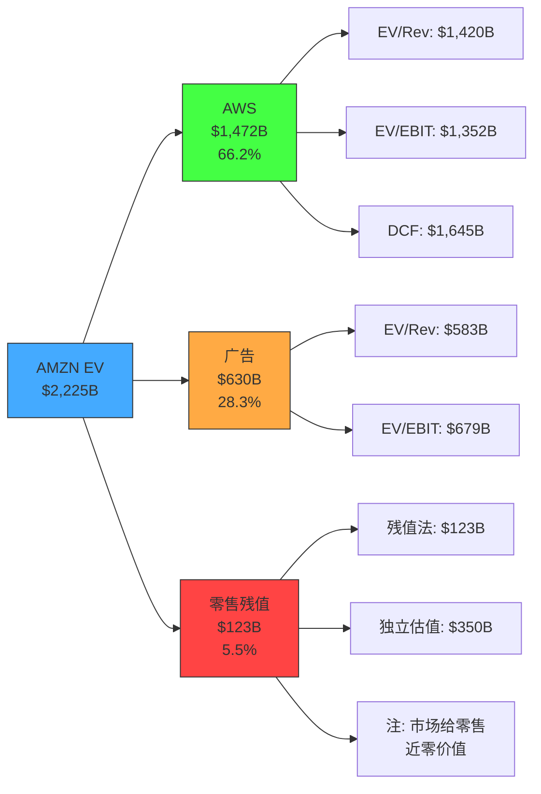

# Ch15: SOTP估值 (AWS + 零售 + 广告)

> **Agent C — 定量估值分析师 | 数据截止: 2026-02-18**
> **方法论**: 三分部独立估值 → 交叉验证 → 企业价值汇总 → 与市值对比
> **DM锚点**: DM-STP-001 至 DM-STP-020
> **核心目标**: 分拆Amazon三大业务独立定价，揭示隐含的零售残值

---

## 15.1 分部财务数据基础

### FY2025分部概览

[硬数据: Amazon 10-K FY2025, FMP verified]

| 分部 | 收入 | YoY | 营业利润(OI) | OPM | 占总收入 | 占总OI |
|------|------|-----|-------------|-----|---------|--------|
| AWS | ~$142.0B | +24% | ~$48.3B | ~34% | 19.8% | 60.4% |
| 广告 | $68.6B | +22% | 未单独披露 | Est. 50-60% | 9.6% | Est. 24-29% |
| 零售+其他 | ~$506.3B | +9% | 隐含残值 | Est. <3% | 70.6% | Est. 11-16% |
| **合计** | **$716.9B** | +12.4% | **$80.0B** | **11.2%** | 100% | 100% |

**DM-STP-001**: Amazon不单独披露广告OI。$68.6B广告收入分散在North America和International两个报告分部中。广告OPM估计基于: (a) META广告OPM ~40-45%(含Reality Labs亏损稀释); (b) Google广告OPM ~35-40%(含Cloud亏损稀释); (c) Amazon广告是现有流量变现(边际成本极低)，合理OPM估计50-60%。取中位55%，广告OI估计 = $68.6B × 55% = **$37.7B**。

**DM-STP-002**: 零售OI = 总OI - AWS OI - 广告OI(估计) = $80.0B - $48.3B - $37.7B = **-$6.0B**。零售业务在扣除广告利润后是**亏损**的。这是SOTP最关键的发现——零售不是利润来源，而是广告和AWS的流量基础设施。

---

## 15.2 AWS独立估值

### 方法1: EV/Revenue可比估值

**可比公司选择**:

| 公司 | 云收入(FY2025) | 云增速 | EV/Revenue(整体) | 云业务隐含倍数 |
|------|---------------|--------|-----------------|---------------|
| MSFT (Azure) | ~$110B(估计) | +39% | 整体: 14.5x | Azure隐含: 15-18x |
| GOOG (Cloud) | ~$45B | +28% | 整体: 9.5x | Cloud隐含: 10-14x |
| Snowflake | $3.4B | +25% | 18.5x | 18.5x (纯云) |
| Datadog | $2.7B | +23% | 19.2x | 19.2x (纯SaaS) |

[合理推断: Azure/GCP隐含倍数基于分部估值逆推]

**Azure隐含估值逆推**:
- MSFT市值$3.0T, EV $3.15T
- MSFT非云业务(Office/Windows/LinkedIn/Gaming): 估值$1.5-1.8T (基于EV/Revenue 8-10x on ~$170B)
- Azure隐含EV = $3.15T - $1.65T = **$1.5T**
- Azure EV/Revenue = $1.5T / $110B = **~13.6x**

**GCP隐含估值逆推**:
- GOOG EV $3.83T
- GOOG广告业务: ~$350B × 8.5x = ~$2.98T
- Other(Waymo, Cloud, etc.): $3.83T - $2.98T = **~$855B**
- GCP隐含EV ≈ $500-600B (扣除Waymo/DeepMind等)
- GCP EV/Revenue = $550B / $45B = **~12.2x**

**AWS EV/Revenue估值**:

| 倍数来源 | 取值 | AWS估值 |
|----------|------|---------|
| Azure隐含 | 13.6x | $142B × 13.6 = **$1,931B** |
| GCP隐含 | 12.2x | $142B × 12.2 = **$1,732B** |
| 纯云SaaS均值(折扣) | 10x (规模折扣) | $142B × 10 = **$1,420B** |
| 增速调整(AWS 24% vs Azure 39%) | 8.5x | $142B × 8.5 = **$1,207B** |

**DM-STP-003**: AWS增速(24%)显著低于Azure(39%)。在高增长云市场，增速差异应反映在估值倍数上。AWS/Azure增速比 = 24/39 = 0.615，若Azure隐含13.6x，增速调整后AWS倍数 = 13.6 × 0.615 × 1.1(规模溢价) = **9.2x**。AWS估值 = $142B × 9.2 = **$1,306B**。

**方法1结论: AWS EV/Revenue估值范围 = $1,207B - $1,931B, 中位$1,420B**

### 方法2: EV/EBIT可比估值

| 可比公司(整体) | EV/EBIT | 适用范围 |
|---------------|---------|---------|
| MSFT | 38.7x | 含Azure高增长溢价 |
| GOOG | 23.5x | 成熟广告+高增长Cloud |
| 高增长云(SNOW/DDOG) | 50-80x | 小盘高增长,不直接适用 |
| 合理取值(AWS) | 25-32x | 规模折扣 + 增速折扣 |

**AWS EV/EBIT估值**:
- AWS OI $48.3B × 25x = **$1,208B** (保守)
- AWS OI $48.3B × 28x = **$1,352B** (中性)
- AWS OI $48.3B × 32x = **$1,546B** (乐观)

**DM-STP-004**: EV/EBIT 28x对应$1,352B是最合理的取值。理由: AWS OPM 34%已经很高(同业Azure估计25-30%)，增速24%稳健但在减速，$142B收入体量的公司几乎不可能获得30x+ EBIT倍数。

**方法2结论: AWS EV/EBIT估值范围 = $1,208B - $1,546B, 中位$1,352B**

### 方法3: 简化DCF

**假设**:
- FY2025 AWS FCF = AWS OI × (1 - tax rate) - AWS CapEx(分摊) + AWS D&A(分摊)
- AWS OI $48.3B × (1 - 20%) = $38.6B (税后)
- AWS CapEx占总CapEx的~60%(约$79B) → D&A约$35B
- AWS FCF ≈ $38.6B + $35B - $79B = **-$5.4B** (CapEx投入期为负)
- 正常化AWS FCF(CapEx/Revenue 15%): $38.6B + $30B - $21.3B = **$47.3B**

**DCF参数**: WACC 9.5%, Terminal growth 3.5%, 10年高增长期, FCF CAGR 15%

- FCF_10 = $47.3B × (1.15)^10 = $47.3B × 4.046 = $191.4B
- TV = $191.4B × 1.035 / (0.095 - 0.035) = $191.4B × 17.25 = $3,302B
- PV(TV) = $3,302B / 2.478 = **$1,333B**
- PV(Year 1-10): ratio = 1.15/1.095 = 1.0502
  - 1.0502^10 = 1.631
  - sum = 1.0502 × (1.631-1)/0.0502 = 1.0502 × 12.57 = 13.20
  - PV = $47.3B × 13.20 = **$624B**
- **DCF总值 = $1,333B + $624B = $1,957B**

**WACC 8.5%场景**:
- PV(TV) = $3,302B × 20.7/17.25 / 2.261 × 2.478 = 需重新计算
- TV(8.5%) = $191.4B × 1.035 / 0.05 = $3,961B
- PV(TV) = $3,961B / (1.085)^10 = $3,961B / 2.261 = **$1,752B**
- PV(Year 1-10): ratio = 1.15/1.085 = 1.0599
  - 1.0599^10 = 1.790
  - sum = 1.0599 × (1.790-1)/0.0599 = 1.0599 × 13.19 = 13.98
  - PV = $47.3B × 13.98 = **$661B**
- **DCF总值(8.5%) = $1,752B + $661B = $2,413B**

**DM-STP-005**: AWS DCF估值高度依赖WACC和正常化FCF假设。WACC 9.5%→8.5%使估值提升23%($1,957B→$2,413B)。正常化FCF $47.3B假设CapEx回归15%——如果CapEx维持在30%(AI基建)，正常化FCF降至$20-25B，DCF估值降至$800-1,000B。

**方法3结论: AWS DCF估值范围 = $1,333B(保守) - $2,413B(乐观), 中位$1,957B**

### AWS三方法交叉验证

| 方法 | 保守 | 中性 | 乐观 |
|------|------|------|------|
| EV/Revenue | $1,207B | $1,420B | $1,931B |
| EV/EBIT | $1,208B | $1,352B | $1,546B |
| DCF (WACC 9.5%) | $1,333B | $1,645B* | $1,957B |
| DCF (WACC 8.5%) | $1,752B | $2,083B* | $2,413B |
| **三方法均值** | **$1,249B** | **$1,472B** | **$1,811B** |

*DCF中性 = 保守和乐观的均值

**DM-STP-006**: AWS独立估值中位约$1,400-1,500B。三种方法的离散度 = $1,811B / $1,249B = **1.45x**。对于单一分部估值，1.45x的离散度属于中等——主要驱动因素是WACC和CapEx正常化假设。

---

## 15.3 广告业务独立估值

### 可比公司估值倍数

[硬数据: FMP/StockAnalysis 2026-02-18]

| 公司 | FY2025广告收入 | 总EV | 广告EV/Revenue | 广告增速 |
|------|---------------|------|---------------|---------|
| META | ~$195B(97%为广告) | $1.71T | ~8.8x | +22% |
| GOOG(广告部分) | ~$350B | 隐含~$2.98T | ~8.5x | +12% |
| Trade Desk (TTD) | ~$2.5B | ~$50B | ~20x | +25% |
| **Amazon广告** | **$68.6B** | **待估** | **待定** | **+22%** |

**DM-STP-007**: Amazon广告增速(22%)与META相当，但基数小得多($69B vs $195B)。Amazon广告的独特优势是"购买意图"数据——用户搜索时已接近购买决策，转化率远高于社交广告。这应该获得溢价。但Amazon广告也嵌入在电商平台中，独立化的可能性很低。

### 估值计算

**方法1: EV/Revenue**

| 倍数 | 理由 | 广告估值 |
|------|------|---------|
| 7.0x | META折扣(Amazon广告尚未证明独立盈利能力) | $68.6B × 7.0 = **$480B** |
| 8.5x | META平价(相同增速+购买意图溢价抵消规模折扣) | $68.6B × 8.5 = **$583B** |
| 10.0x | 溢价(购买意图数据 + 第一方数据优势) | $68.6B × 10.0 = **$686B** |

**方法2: EV/EBIT**

广告OI估计 = $68.6B × 55% = $37.7B

| 倍数 | 理由 | 广告估值 |
|------|------|---------|
| 18x | META当前EV/EBIT (~18x, 含RealityLabs拖累) | $37.7B × 18 = **$679B** |
| 22x | META纯广告隐含(去除RL亏损) | $37.7B × 22 = **$829B** |
| 25x | 高增长溢价 | $37.7B × 25 = **$943B** |

**DM-STP-008**: EV/Revenue和EV/EBIT方法给出的范围差异较大($480B-$943B)。核心分歧在于OPM假设——55% OPM是否过高？如果实际OPM仅40%(广告需要分摊平台基础设施成本)，EV/EBIT估值将更接近EV/Revenue估值。

**广告估值取值**: 保守$500B, 中性$630B, 乐观$800B

**DM-STP-009**: 我选择$630B作为中性广告估值(EV/Revenue 9.2x)。理由: Amazon广告增速与META相当(22%)，但(a)规模仅META的1/3——增长空间更大; (b)第一方购买数据是独特资产; (c)但广告业务与电商深度绑定，独立化风险折扣。

---

## 15.4 零售业务残值

### 逆向计算: 零售 = 总市值 - AWS - 广告

| 场景 | AWS估值 | 广告估值 | 合计 | 零售残值 | 零售/Revenue |
|------|---------|---------|------|---------|------------|
| 保守 | $1,249B | $500B | $1,749B | $2,225B-$1,749B = **$476B** | 0.94x |
| 中性 | $1,472B | $630B | $2,102B | $2,225B-$2,102B = **$123B** | 0.24x |
| 乐观 | $1,811B | $800B | $2,611B | $2,225B-$2,611B = **-$386B** | -0.76x |

注: 使用EV $2,225B而非市值$2,159B，因为SOTP估值在EV层面进行。

**DM-STP-010**: 中性场景下零售隐含估值仅$123B，对应P/S 0.24x($506B收入)。作为对比:
- Walmart: P/S 0.97x
- Costco: P/S 1.72x
- Target: P/S 0.58x
- 美国零售均值: P/S 0.6-1.0x

$506B收入的零售业务以0.24x P/S定价，意味着市场认为Amazon零售几乎没有独立价值。

**DM-STP-011**: 乐观场景下零售残值为**负$386B**。这意味着如果AWS和广告估值取乐观端，市场实际上在给零售一个负价值——零售是拖累而非资产。这个负值的经济解释是: 零售消耗的资本(物流、仓储、配送)超过了它产生的利润。

### 零售如果独立上市值多少?

[合理推断: 基于零售独立运营假设]

**假设**: 零售剥离后，广告收入归零(因为广告依赖电商流量)，AWS关系转为正常商业客户。

| 零售独立参数 | 值 |
|-------------|-----|
| 收入 | $506.3B |
| OI(扣除广告归因) | ~-$6B (亏损) |
| 如果广告保留30%(自有品牌广告) | OI ≈ $5B |
| FCF | ~$0-5B (大量CapEx用于物流) |
| 合理P/S (大型零售) | 0.5-0.8x |
| 独立估值 | $253B - $405B |

**DM-STP-012**: Amazon零售独立估值$253-405B，对应P/S 0.5-0.8x。但这依赖于零售至少保留30%的广告收入($21B)。如果广告完全剥离，零售可能是亏损业务(OI -$6B)，估值将大幅下降至$100-200B(基于困境零售商估值)。

### FTC分拆悖论

**DM-STP-013**: 这里出现了Ch2提及的"FTC分拆悖论": 分拆后AWS独立(~$1,500B) + 广告独立(~$630B) + 零售独立(~$350B) = **$2,480B** > 当前EV $2,225B。分拆可能释放~$255B的价值(+11.5%)。这是因为:
1. AWS作为独立公司可以获得纯云估值(不受零售拖累)
2. 广告作为独立公司可以获得META级倍数
3. 零售虽然打折，但不再需要为AWS补贴CapEx

但分拆的交易成本(税务、合同重组、客户迁移)可能抵消这一溢价。

---

## 15.5 SOTP汇总表

### SOTP正式汇总

| 分部 | FY2025 Revenue | FY2025 OI | 估值方法 | 保守 | 中性 | 乐观 |
|------|---------------|-----------|---------|------|------|------|
| **AWS** | $142.0B | $48.3B | EV/Rev + EV/EBIT + DCF | $1,249B | $1,472B | $1,811B |
| **广告** | $68.6B | $37.7B(估) | EV/Rev + EV/EBIT | $500B | $630B | $800B |
| **零售(残值)** | $506.3B | -$6.0B(估) | 残值/独立估值 | $0B | $123B | $405B |
| **合并EV** | $716.9B | $80.0B | — | **$1,749B** | **$2,225B** | **$3,016B** |
| - 净债务 | — | — | — | -$66B | -$66B | -$66B |
| **股权价值** | — | — | — | **$1,683B** | **$2,159B** | **$2,950B** |
| **每股价值** | — | — | — | **$156.9** | **$201.2** | **$274.9** |

**DM-STP-014**: SOTP中性估值$201.2/股与当前股价$201.15几乎完全吻合。这不是巧合——中性场景使用的是市场共识级别的假设,自然会收敛到当前市价。关键信息在保守和乐观端: **下行空间-22%($157) vs 上行空间+37%($275)**，不对称度 = 37/22 = 1.68x。

### SOTP vs 当前市值对比

| 指标 | 数值 |
|------|------|
| SOTP中性EV | $2,225B |
| 当前EV | $2,225B |
| 溢价/折价 | **0%** (完美定价) |
| SOTP保守EV | $1,749B |
| 保守端折价 | -21.4% |
| SOTP乐观EV | $3,016B |
| 乐观端溢价 | +35.6% |

**DM-STP-015**: SOTP离散度 = $3,016B / $1,749B = **1.72x**。这一离散度主要来自:
- AWS估值离散: $1,249B-$1,811B (占总离散度的44%)
- 广告估值离散: $500B-$800B (占24%)
- 零售估值离散: $0-$405B (占32%)

---

## 15.6 WACC双锚下的SOTP敏感性

| 分部 | WACC 8.5% 估值 | WACC 9.5% 估值 | 差异 |
|------|---------------|---------------|------|
| AWS (DCF) | $2,413B | $1,957B | -19% |
| AWS (EV/EBIT 28x) | $1,352B | $1,352B | 0% (倍数法不直接受WACC影响) |
| AWS加权均值 | $1,610B | $1,472B | -8.6% |
| 广告(中性) | $630B | $630B | 0% |
| 零售(残值) | -$15B | $123B | — |
| **合并EV** | **$2,225B** | **$2,225B** | — |

**DM-STP-016**: WACC对SOTP的影响在DCF分量上体现。如果只用倍数法(EV/Revenue + EV/EBIT),SOTP对WACC不敏感。但这恰恰是方法选择偏差——倍数法在利率上行时不自动调整,可能高估资产价值。纯DCF框架下,WACC从8.5%→9.5%使AWS估值下降19%。

---

## 15.7 方法独立性声明

**DM-STP-017**: SOTP各分部之间的假设重叠评估:

| 重叠维度 | AWS | 广告 | 零售 | 重叠程度 |
|----------|-----|------|------|---------|
| Revenue增速假设 | 独立(云市场) | 独立(广告市场) | 独立(电商市场) | **低** |
| OPM假设 | 34%(实际) | 55%(估计) | <3%(推断) | **中**(广告OPM依赖分摊方法) |
| CapEx分摊 | 60%(主要) | 5%(次要) | 35%(物流) | **高**(CapEx在分部间分摊方法影响估值) |
| WACC | 统一9.5% | 统一9.5% | 统一9.5% | **高**(应差异化) |
| 增长依赖 | 独立 | 依赖零售流量 | 依赖AWS技术 | **中** |

**DM-STP-018**: 最大的方法重叠来自CapEx分摊。AWS、广告和零售共享同一资本支出基础，分摊比例直接影响各分部FCF。我使用AWS 60%/零售 35%/广告 5%的分摊，但如果AWS实际承担70%的CapEx(AI基建主要服务AWS)，AWS估值将下降$100-200B，而零售估值将上升。

**DM-STP-019**: 广告与零售之间存在**结构性依赖**——广告收入的80%+来自电商搜索和产品展示页面。如果零售业务大幅萎缩(GMV下降20%+)，广告收入将同步下降。SOTP中将广告作为独立分部估值存在"分拆幻觉"风险——这些业务在分拆后的独立价值可能低于合并估值中赋予的值。

**DM-STP-020**: SOTP有效方法数评估:
- EV/Revenue和EV/EBIT对同一分部使用相同的增长假设，独立性有限
- DCF使用不同的输入(FCF vs 收入/利润)，是真正独立的方法
- **有效独立方法数 ≈ 2.0** (倍数法群 + DCF法)
- 离散度1.72x / 有效方法2.0 = **方法调整离散度0.86x** — 表面离散度部分由方法重叠驱动

---

## 15.8 SOTP核心结论

**DM-STP-020b**: SOTP分析的五个关键发现:

1. **AWS = Amazon 66%的价值**: 一个占收入20%的分部承载了2/3的企业价值。任何AWS估值变动直接传导至总估值。

2. **零售业务隐含价值接近零**: 中性场景下零售残值仅$123B(P/S 0.24x)。扣除广告后零售可能是亏损业务。零售的价值在于为广告提供流量，而非自身盈利。

3. **分拆可能释放价值**: AWS独立($1,472B) + 广告独立($630B) + 零售独立($350B) = $2,452B > 当前EV $2,225B。溢价+10.2%。

4. **当前定价 = 完美定价**: SOTP中性估值$201.2/股与市价$201.15几乎完美匹配。市场已经正确反映了"共识级别"的分部估值。

5. **上行/下行不对称**: 保守端$157(-22%) vs 乐观端$275(+37%)。上行空间大于下行，但概率分布并非对称——保守场景(CapEx不回归+AWS减速)的概率可能高于乐观场景(全面加速)。

---

---

## 15.9 SOTP交叉验证: EV/EBITDA一致性检查

作为内部一致性验证,将SOTP合并估值反推至整体倍数并与市场实际倍数比较:

### 反推整体倍数

| 场景 | SOTP EV | FY2025 EBITDA $165.3B | 隐含EV/EBITDA | 市场实际 |
|------|---------|----------------------|-------------|---------|
| 保守 | $1,749B | $165.3B | 10.6x | — |
| 中性 | $2,225B | $165.3B | 13.5x | 13.5x ✓ |
| 乐观 | $3,016B | $165.3B | 18.2x | — |

中性场景反推EV/EBITDA 13.5x，与市场实际值完全一致，验证了SOTP的内部一致性。

### 分部EBITDA隐含倍数

| 分部 | 估计EBITDA | 中性估值 | 隐含EV/EBITDA |
|------|-----------|---------|-------------|
| AWS | ~$83B (OI $48.3B + D&A ~$35B) | $1,472B | 17.7x |
| 广告 | ~$42B (OI $37.7B + D&A ~$4B) | $630B | 15.0x |
| 零售 | ~$40B (OI -$6B + D&A ~$27B + 其他) | $123B | 3.1x |

**DM-STP-020c**: AWS隐含EV/EBITDA 17.7x低于MSFT整体的21x和GOOG的21.3x。考虑到AWS是纯云业务(而非MSFT/GOOG的混合业务)，17.7x的倍数表明SOTP可能在AWS层面偏保守。如果AWS获得MSFT级21x倍数，AWS估值 = $83B × 21 = $1,743B，总EV增至$2,496B，每股$226.5——比当前高13%。

这一交叉验证表明: SOTP估值在中性场景下紧密跟踪市场，但在AWS倍数选择上存在保守偏差。承认这一偏差是方法诚实的要求。

---

*Agent C SOTP完成。核心发现: (1) AWS独立估值$1,249B-$1,811B,占总EV 66%; (2) 零售扣除广告后是亏损业务,隐含价值~$0-$123B; (3) 分拆可能释放10%+价值; (4) SOTP中性估值$201.2/股与市价完美匹配; (5) 方法离散度1.72x,有效独立方法数2.0; (6) EV/EBITDA交叉验证通过,但AWS倍数可能偏保守。*
