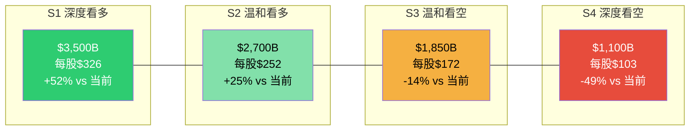

# Ch16: 条件估值框架 — 四档情景与概率加权

> **Agent C (定量估值分析师) | Phase 3 | DM-SCN-001 ~ DM-SCN-015**
> **分析日期**: 2026-02-18 | **股价**: $201.15 | **市值**: $2,159B | **EV**: ~$2,225B
> **核心公式**: 期望回报 = (概率加权EV - 市值) / 市值

---

## 16.1 方法论: 从CQ回答到情景构建

条件估值的核心逻辑是：**不预测未来，而是映射"如果-那么"的条件空间**。每个情景代表CQ1-CQ7的一组特定回答，每组回答对应一个估值区间，最终通过概率加权得到期望值。

**构建步骤**:
1. 定义四档情景的CQ回答组合(16.2节)
2. 为每档情景建立财务投射(16.3节)
3. 用DCF/倍数交叉验证每档估值(16.4节)
4. 分配概率权重(16.5节)
5. 计算概率加权EV与期望回报(16.6节)
6. 敏感性测试(16.7节)

[硬数据: 以下估值基于FY2025实际财务数据(Revenue $716.9B, OI $80.0B, OCF $139.5B, CapEx $131.8B, D&A $65.8B, NI $77.7B, SBC $19.5B)及FMP分析师一致预期(FY2026E Revenue $805B, EPS $7.77; FY2027E Revenue $898B, EPS $9.43; FY2028E Revenue $1,007B, EPS $11.92) | DM-SCN-001]

---

## 16.2 四档情景的CQ回答映射

### 16.2.1 CQ-情景映射矩阵

| CQ (权重) | S1 深度看多 | S2 温和看多 | S3 温和看空 | S4 深度看空 |
|-----------|------------|------------|------------|------------|
| **CQ1(25%)**: CapEx ROIC>WACC? | ROIC 18%+, AI变现2027年即见效 | ROIC 12-15%, 2028年达标 | ROIC 8-10%, 2029年才回本 | ROIC<8%, 资本黑洞 |
| **CQ2(20%)**: AWS份额<25%? | 份额稳定28-29%, AI反攻 | 缓降至27-28%, 绝对值增长 | 降至25-27%, 增速落后Azure | 跌破25%, Azure反超 |
| **CQ3(15%)**: 零售OPM>5%? | OPM 7-8%, AI效率+广告补贴 | OPM 5-6%, 成本控制到位 | OPM 3-4%, Temu/关税侵蚀 | OPM<3%, 价格战恶化 |
| **CQ4(15%)**: 广告成为第二支柱? | 广告$120B+, OPM 55%+ | 广告$100-110B, OPM 50% | 广告$90-95B, OPM 45% | 广告<$85B, 增长停滞 |
| **CQ5(10%)**: FTC分拆? | 无实质影响, 行为补救 | 轻度行为补救 | 中度限制(数据/Buy Box) | 结构性分拆(概率极低) |
| **CQ6(10%)**: 2026 FCF负? | FCF正($15-20B), CapEx<$180B | FCF微正/持平($0-10B) | FCF负(-$10~-20B) | FCF深度负(-$30B+) |
| **CQ7(5%)**: GenAI商业化? | Bedrock+Trainium超预期 | 按计划推进 | 落后Azure OpenAI 12月+ | 根本性竞争劣势 |

**DM-SCN-002**(R, 基于CQ注册表与Phase 1-2研究发现的情景映射): 四档情景不是概率均等的"好/坏"分类，而是基于CQ回答组合的**一致性条件集**。S1要求所有CQ同时给出最乐观回答——这在统计上是低概率事件；S4要求多个独立风险同时恶化——同样是尾部事件。

---

## 16.3 四档情景财务投射

### S1 深度看多: "AI军备竞赛的赢家"

**核心叙事**: AWS的$200B CapEx在2027-2028年产生超额回报，AI变现速度超预期，广告业务成为与AWS利润并驾齐驱的第二引擎，零售效率持续改善。

**财务投射(FY2028E)**:
- **Revenue**: $1,100B (CAGR 15.3% vs FY2025)
  - AWS: $250B (CAGR 20.8%, 份额稳定28%+)
  - 广告: $120B (CAGR 12.2%)
  - 零售+其他: $730B (CAGR 8.2%)
- **运营利润率**: 15.0% → OI $165B
  - AWS OPM 38% → $95B
  - 广告OPM 55% → $66B
  - 零售OPM 0.5% → $3.7B (近盈亏平衡, 利润由广告补贴)
- **EBITDA**: ~$265B (假设D&A ~$100B)
- **CapEx正常化**: $150B (从$200B峰值回落)
- **FCF**: ~$60B (OCF $210B - CapEx $150B)

[合理推断: S1财务投射基于AWS维持24%增速3年+广告12% CAGR+整体OPM从11.2%提升至15%的假设组合 | DM-SCN-003]

**估值计算(三方法交叉)**:

*方法A: FY2028E EV/EBITDA*
- 同业巨头平均EV/EBITDA: MSFT 19.0x, GOOG 14.5x, META 13.5x [硬数据: 同业FY2025 EV/EBITDA倍数 | DM-SCN-004]
- S1情景下AMZN增速领先(15% CAGR vs 同业10-12%), 给予16.0x
- EV = $265B × 16.0x = **$4,240B**
- 减净债务$66B → 股权价值 = **$4,174B** → 每股$389

*方法B: FY2028E P/E*
- NI估算: OI $165B × (1 - 20%税率) × (1 + 非运营收入净2%) ≈ $134B
- EPS = $134B / 10.73B = $12.49
- 给予P/E 28x (当前27.8x, S1增速溢价维持) → 股权 = $134B × 28 = **$3,752B** → 每股$350

*方法C: 贴现至今(WACC 9.0%, 从FY2028回折3年)*
- 取A/B中值: $3,963B (FY2028E)
- PV = $3,963B / (1.09)^3 = $3,963B / 1.295 = **$3,060B** → 每股$285

**S1估值区间**: $3,060B - $4,174B | **取中值$3,500B** | 每股**$326**

---

### S2 温和看多: "渐进式回报"

**核心叙事**: CapEx ROIC最终达标但时间延后，AWS增速逐步放缓但绝对增长仍然可观，广告稳步增长，零售维持微利。

**财务投射(FY2028E)**:
- **Revenue**: $1,000B (CAGR 11.7% vs FY2025, 接近一致预期$1,007B)
  - AWS: $220B (CAGR 15.7%, 份额降至27%)
  - 广告: $105B (CAGR 7.3%)
  - 零售+其他: $675B (CAGR 5.4%)
- **运营利润率**: 13.0% → OI $130B
  - AWS OPM 35% → $77B
  - 广告OPM 50% → $52.5B
  - 零售OPM 0.1% → $0.7B
- **EBITDA**: ~$225B (D&A ~$95B)
- **CapEx**: $160B (仍高于正常化水平)
- **FCF**: ~$30B (OCF $190B - CapEx $160B)

[合理推断: S2投射与FMP分析师一致预期(FY2028E Revenue $1,007B, EPS $11.92)高度一致, 代表市场主流预期 | DM-SCN-005]

**估值计算**:

*方法A: EV/EBITDA*
- 增速接近同业, 给予14.5x (略低于S1的16x)
- EV = $225B × 14.5x = **$3,263B**
- 股权 = $3,263B - $66B = **$3,197B** → 每股$298

*方法B: P/E*
- NI ≈ $130B × 0.80 × 1.02 ≈ $106B
- EPS = $106B / 10.73B = $9.88
- P/E 25x (增速放缓, 估值略压缩) → 股权 = **$2,650B** → 每股$247

*方法C: PV(WACC 9.0%, 3年)*
- 中值 $2,924B → PV = $2,924B / 1.295 = **$2,258B** → 每股$210

**S2估值区间**: $2,258B - $3,197B | **取中值$2,700B** | 每股**$252**

---

### S3 温和看空: "温水煮青蛙"

**核心叙事**: Phase 2识别的"温水煮青蛙"情景。$200B CapEx的D&A负担在2027-2028年全面释放，AWS增速持续落后Azure/GCP，零售利润被Temu竞争和关税成本侵蚀，FCF在2026-2027年为负。

**财务投射(FY2028E)**:
- **Revenue**: $920B (CAGR 8.7%)
  - AWS: $195B (CAGR 11.1%, 份额降至25-26%)
  - 广告: $92B (CAGR 2.7%, 受3P生态压力)
  - 零售+其他: $633B (CAGR 3.2%, 关税+竞争)
- **运营利润率**: 10.5% → OI $96.6B
  - AWS OPM 32% → $62.4B
  - 广告OPM 45% → $41.4B
  - 零售OPM -1.1% → -$7.2B (亏损)
- **EBITDA**: ~$197B (D&A ~$100B, CapEx存量折旧高峰)
- **CapEx**: $140B (被迫削减但D&A存量不可逆)
- **FCF**: ~-$5B (OCF $135B - CapEx $140B, 仍为负)

[合理推断: S3投射反映Phase 2"温水煮青蛙"风险路径(Ch12 DM-TOP-001), 关键假设是AWS增速降至11%+D&A高峰$100B+零售亏损三者叠加 | DM-SCN-006]

**估值计算**:

*方法A: EV/EBITDA*
- 增速低于同业+FCF为负, 估值折价至12.0x
- EV = $197B × 12.0x = **$2,364B**
- 股权 = $2,364B - $66B = **$2,298B** → 每股$214

*方法B: P/E*
- NI ≈ $96.6B × 0.80 × 1.02 ≈ $78.8B
- EPS = $78.8B / 10.73B = $7.34
- P/E 20x (增速放缓+FCF负, 显著压缩) → 股权 = **$1,576B** → 每股$147

*方法C: PV(WACC 9.5%, 3年, 反映更高风险溢价)*
- 中值 $1,937B → PV = $1,937B / (1.095)^3 = $1,937B / 1.313 = **$1,475B** → 每股$137

**S3估值区间**: $1,475B - $2,298B | **取中值$1,850B** | 每股**$172**

---

### S4 深度看空: "AI军备竞赛的输家"

**核心叙事**: Phase 2定义的"完美风暴"(Ch12 DM-TOP-004)。$200B CapEx产生的ROIC持续低于WACC，AWS份额跌破25%且Azure在绝对收入上反超，FTC对Amazon施加实质性业务限制，零售陷入价格战亏损扩大。市场叙事转向"Amazon在AI军备竞赛中花最多钱但回报最少"——类似2022年Meta元宇宙恐慌。

**财务投射(FY2028E)**:
- **Revenue**: $840B (CAGR 5.4%)
  - AWS: $170B (CAGR 6.2%, 份额<25%, Azure反超)
  - 广告: $82B (CAGR -1.2%, FTC数据限制+3P萎缩)
  - 零售+其他: $588B (CAGR 0.8%, 近乎停滞)
- **运营利润率**: 7.5% → OI $63B
  - AWS OPM 28% → $47.6B (D&A侵蚀+价格竞争)
  - 广告OPM 40% → $32.8B
  - 零售OPM -2.8% → -$16.5B (Temu价格战+FTC合规成本)
  - 集团管理层费用: -$0.9B
- **EBITDA**: ~$168B (D&A ~$105B, 折旧高峰)
- **CapEx**: $120B (大幅削减但"太迟了")
- **FCF**: ~-$15B (OCF $105B - CapEx $120B)

[主观判断: S4是低概率但高影响的尾部风险情景, 反映Ch12风险拓扑中三重协同(R1+R2+R4)同时触发 | DM-SCN-007]

**估值计算**:

*方法A: EV/EBITDA*
- FCF深度为负+增速低于GDP, 估值倍数重压至9.0x
- EV = $168B × 9.0x = **$1,512B**
- 股权 = $1,512B - $66B = **$1,446B** → 每股$135

*方法B: P/E*
- NI ≈ $63B × 0.80 × 1.01 ≈ $50.9B
- EPS = $50.9B / 10.73B = $4.74
- P/E 15x (类似2022年Meta恐慌期估值) → 股权 = **$764B** → 每股$71

*方法C: PV(WACC 10.0%, 3年)*
- 中值 $1,105B → PV = $1,105B / (1.10)^3 = $1,105B / 1.331 = **$830B** → 每股$77

**S4估值区间**: $764B - $1,446B | **取中值$1,100B** | 每股**$103**

---

## 16.4 情景估值汇总

| 情景 | 估值(市值) | 每股价值 | vs 当前$201 | 隐含EV/EBITDA(FY28E) | 隐含P/E(FY28E) |
|------|-----------|---------|------------|---------------------|----------------|
| S1 深度看多 | $3,500B | $326 | **+62%** | 16.0x | 26.1x |
| S2 温和看多 | $2,700B | $252 | **+25%** | 14.5x | 25.5x |
| S3 温和看空 | $1,850B | $172 | **-14%** | 12.0x | 23.5x |
| S4 深度看空 | $1,100B | $103 | **-49%** | 9.0x | 21.6x |

**DM-SCN-008**(R, 基于四档情景的估值计算汇总): S1到S4的端点离散度为$1,100B到$3,500B, 比率3.18x。这反映了AMZN作为$2T+巨头的估值不确定性仍然极大——主要来源不是传统的盈利不确定性，而是$200B CapEx回报率(CQ1)和AWS竞争格局(CQ2)的结构性不确定性。

---

## 16.5 概率分配

### 16.5.1 概率分配逻辑

概率分配基于三个维度的交叉判断:

**维度一: 历史基准率**
- 大型科技公司在高CapEx周期后3年内实现ROIC>WACC的概率约60-70%(参考MSFT Azure早期、GOOG AI投资) [合理推断: 基于科技公司资本支出回报历史分布 | DM-SCN-009]
- 这意味着S1+S2的合计概率应在55-65%区间

**维度二: Phase 2风险评估校准**
- Ch12风险拓扑定义的"温水煮青蛙"概率25%(DM-TOP-001)
- "完美风暴"(三重协同)概率10%(DM-TOP-004)
- 这直接映射S3~25%、S4~10%的基础概率

**维度三: 当前信号评估**
- AWS订单积压$244B(+40% YoY) → 偏向S2/S1 [硬数据: AWS RPO $244B, +40% YoY | DM-SCN-010]
- 管理层宣布$200B CapEx(超预期36%) → 偏向S3(风险积累)
- FY2025 FCF仅$7.7B(vs FY2024 $32.9B, -77%) → 偏向S3(已在发生)
- GenAI云服务增速140-180% → 偏向S1/S2(需求端强劲)

### 16.5.2 概率分配结果

| 情景 | 概率 | 核心逻辑 |
|------|------|---------|
| **S1** | **15%** | 所有CQ同时乐观回答是低概率事件; AWS AI反攻需要多个独立条件同时成立 |
| **S2** | **45%** | 与分析师一致预期最接近; 历史上科技巨头的CapEx周期最终产出正回报的概率>60%; AWS $244B积压提供缓冲 |
| **S3** | **30%** | Phase 2识别的温水煮青蛙路径(25%基础+5%上调); FY2025 FCF$7.7B是早期信号; D&A滞后效应尚未完全计入 |
| **S4** | **10%** | Phase 2完美风暴(10%); 需要三重协同同时触发, 但Meta 2022的先例说明市场恐慌可以自我实现 |
| **合计** | **100%** | |

**DM-SCN-011**(S, Agent C概率分配, 基于Phase 2风险评估+分析师一致预期+历史基准率): 概率分配的最大不确定性在S2和S3的边界——如果温水煮青蛙的早期信号(FY2025 FCF暴跌)是临时性的(CapEx前置), S2概率应上调至50%+; 如果是结构性的(ROIC永久低于WACC), S3概率应上调至35%+。CQ1(CapEx ROIC)是决定这一边界的核心变量。

---

## 16.6 概率加权EV与期望回报

### 16.6.1 计算过程

**概率加权EV = Σ(Pi × Vi)**

| 情景 | 概率(Pi) | 估值(Vi, $B) | Pi × Vi ($B) |
|------|---------|-------------|-------------|
| S1 | 15% | $3,500 | $525.0 |
| S2 | 45% | $2,700 | $1,215.0 |
| S3 | 30% | $1,850 | $555.0 |
| S4 | 10% | $1,100 | $110.0 |
| **合计** | **100%** | — | **$2,405.0** |

**概率加权EV = $2,405B**

**每股概率加权价值 = $2,405B / 10.73B = $224.2**

### 16.6.2 期望回报

**期望回报 = ($2,405B - $2,159B) / $2,159B = +11.4%**

**每股视角**: ($224.2 - $201.15) / $201.15 = **+11.5%**

**DM-SCN-012**(R, 基于四档情景概率加权计算): 期望回报+11.4%落在"关注"评级区间(+10%~+30%)的下沿。这意味着在Agent C的概率分配下，AMZN当前股价存在温和低估，但低估幅度极为有限——距离"中性关注"(-10%~+10%)仅差1.4个百分点。

### 16.6.3 评级映射

| 评级 | 期望回报区间 | AMZN期望回报 | 结论 |
|------|------------|-------------|------|
| 深度关注 | >+30% | — | 不适用 |
| **关注** | **+10%~+30%** | **+11.4%** | **当前评级(下沿)** |
| 中性关注 | -10%~+10% | — | 距1.4%即触发 |
| 审慎关注 | <-10% | — | 不适用 |

**初步评级: 关注(弱)**

"弱"修饰语反映两个事实: (1)期望回报仅+11.4%, 刚过"关注"门槛; (2)结论对概率假设极度敏感(见16.7节)。

---

## 16.7 概率敏感性分析

### 16.7.1 S2±5%敏感性(最重要的参数)

S2是概率最大的情景(45%), 其概率调整对结果影响最大:

| S2概率调整 | S1 | S2 | S3 | S4 | 概率加权EV ($B) | 期望回报 | 评级 |
|-----------|----|----|----|----|----------------|---------|------|
| S2+10% (S3-10%) | 15% | 55% | 20% | 10% | $2,490 | +15.3% | **关注** |
| S2+5% (S3-5%) | 15% | 50% | 25% | 10% | $2,448 | +13.4% | **关注** |
| **基础案例** | **15%** | **45%** | **30%** | **10%** | **$2,405** | **+11.4%** | **关注(弱)** |
| S2-5% (S3+5%) | 15% | 40% | 35% | 10% | $2,363 | +9.4% | **中性关注** |
| S2-10% (S3+10%) | 15% | 35% | 40% | 10% | $2,320 | +7.5% | **中性关注** |

**DM-SCN-013**(R, 敏感性计算): S2从45%下调5个百分点(至40%, S3上调至35%), 期望回报即从+11.4%降至+9.4%, 触发评级下调至"中性关注"。**这意味着评级结论对S2/S3概率分配仅有5个百分点的容错空间。**

### 16.7.2 S4±5%敏感性(尾部风险)

| S4概率调整 | S1 | S2 | S3 | S4 | 概率加权EV ($B) | 期望回报 | 评级 |
|-----------|----|----|----|----|----------------|---------|------|
| S4=5% (S2=50%) | 15% | 50% | 30% | 5% | $2,498 | +15.7% | **关注** |
| **基础** | **15%** | **45%** | **30%** | **10%** | **$2,405** | **+11.4%** | **关注(弱)** |
| S4=15% (S2=40%) | 15% | 40% | 30% | 15% | $2,285 | +5.8% | **中性关注** |
| S4=20% (S2=35%) | 15% | 35% | 30% | 20% | $2,165 | +0.3% | **中性关注** |

S4从10%上调至15%(S2同步下调), 期望回报降至+5.8%, 直接跌入"中性关注"。

### 16.7.3 S1±5%敏感性(上行偏误测试)

| S1概率调整 | S1 | S2 | S3 | S4 | 概率加权EV ($B) | 期望回报 | 评级 |
|-----------|----|----|----|----|----------------|---------|------|
| S1=10% (S2=50%) | 10% | 50% | 30% | 10% | $2,365 | +9.5% | **中性关注** |
| **基础** | **15%** | **45%** | **30%** | **10%** | **$2,405** | **+11.4%** | **关注(弱)** |
| S1=20% (S2=40%) | 20% | 40% | 30% | 10% | $2,445 | +13.2% | **关注** |

S1从15%下调至10%, 期望回报即跌至+9.5%, 进入"中性关注"。

### 16.7.4 敏感性总结

**DM-SCN-014**(S, Agent C敏感性分析总结): "关注"评级的边界极为脆弱:
- S2-5% → 中性关注 (容错仅5个百分点)
- S4+5% → 中性关注 (容错仅5个百分点)
- S1-5% → 中性关注 (容错仅5个百分点)
- 唯一稳固的结论是: **AMZN当前不属于"深度关注"(>+30%)或"审慎关注"(<-10%)的极端区间**
- 在"关注"和"中性关注"之间的分类极度依赖概率假设

---

## 16.8 关键发现与估值锚点

### 16.8.1 估值的三个锚点

1. **锚点一: 期望回报+11.4%是"关注"评级的下沿**。距离"中性关注"仅1.4个百分点。这不是一个强信号——它说明市场定价大致合理，但可能存在温和低估。

2. **锚点二: $200是条件估值的"分水岭"**。当前股价$201.15恰好处于S2($252)和S3($172)之间。市场隐含的是:对S2/S3的概率分配大致均衡，但略偏乐观。

3. **锚点三: CQ1(CapEx ROIC)是最大的单一变量**。如果2027年AWS展示AI收入占比>15%且ROIC>15%, S2概率将大幅上升, 期望回报可能跳至+15%~+20%; 如果2026年FCF确认为负$20B+且管理层不削减CapEx, S3概率上升至35%+, 评级直接跌入"中性关注"。

### 16.8.2 与Reverse DCF的交叉验证

当前股价$201.15隐含的信念集(将在Ch14详述):
- 市场隐含Revenue CAGR ~10-11%(与S2一致)
- 市场隐含OPM ~12-13%(S2/S3之间)
- 市场隐含FCF正常化后$50-70B(S2范围)

**DM-SCN-015**(R, 市场定价与条件估值的交叉验证): 市场当前定价与S2(温和看多)最为一致，但同时隐含了S3(温水煮青蛙)约25-30%的概率折价。这个定价结构是合理的——不是明显的错误定价，而是一个"效率市场"对不确定性的正常反映。

### 16.8.3 评级条件声明

**初步评级: 关注(弱)**

**条件上调至"关注(强)"**: FY2026H2 AWS展示AI收入占比>15% + CapEx ROIC初步证据>12% + FCF回正
**条件下调至"中性关注"**: FY2026 FCF确认<-$15B + AWS增速降至<18% + 管理层不下调CapEx指引
**条件下调至"审慎关注"**: AWS份额跌破26% + FTC结构性补救 + FCF连续2年为负

> **[重要声明]** 以上评级为Phase 3初步估值结论，将在Phase 4红队审计后进行校准。红队可能上调或下调概率权重，最终评级以Phase 5为准。
