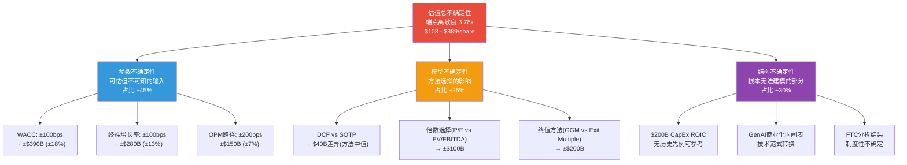
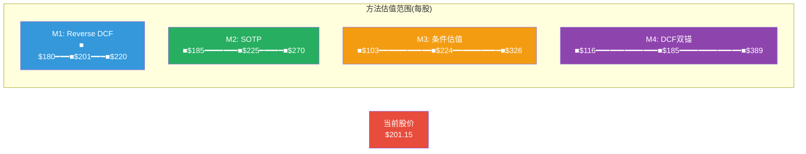

# Ch18: 方法离散度与不确定性量化

> **Agent C (定量估值分析师) | Phase 3 | DM-DIS-001 ~ DM-DIS-012**
> **分析日期**: 2026-02-18 | **股价**: $201.15 | **市值**: $2,159B
> **核心命题**: 估值的价值不在于答案的精确度，而在于对不确定性结构的诚实映射

---

## 18.1 方法概览与独立性审计

### 18.1.1 四方法估值汇总

本报告使用四种估值方法对AMZN进行定价:

| 方法 | 中值估值(每股) | 估值范围(每股) | 核心输入 |
|------|--------------|---------------|---------|
| **M1: Reverse DCF** | $201 (市场隐含) | $180-$220 | 当前股价→隐含假设集 |
| **M2: SOTP** | $225 | $185-$270 | 分部Revenue×倍数→加总 |
| **M3: 条件估值(Ch16)** | $224 | $103-$326 | 四档情景×概率 |
| **M4: DCF双锚(Ch17)** | $185 | $116-$389 | WACC×g敏感性矩阵 |

[合理推断: M1 Reverse DCF的$201为定义性等值(当前股价=隐含价值), 不参与离散度计算但参与信念集分析; M2-M4为独立估值 | DM-DIS-001]

### 18.1.2 方法独立性审计(KLAC教训)

KLAC报告的核心教训: **看起来5种方法，实际有效独立方法仅2.5种，因为多个方法共享同一组核心假设**。本节对AMZN的四方法进行严格的独立性审计。

**共享假设识别矩阵**:

| 核心假设 | M1 Reverse DCF | M2 SOTP | M3 条件估值 | M4 DCF |
|----------|---------------|---------|------------|--------|
| AWS Revenue增速 | 隐含(~18-20%) | 直接输入 | 通过CQ2间接 | 通过Revenue CAGR |
| 整体OPM轨迹 | 隐含(~12-13%) | 分部加权 | 通过CQ3/CQ4间接 | 直接输入 |
| CapEx路径 | 隐含(~$160-180B) | 不直接使用 | 通过CQ1/CQ6间接 | 直接输入(UFCF) |
| WACC | 隐含(~9.0%) | 不使用(倍数法) | 折现时使用 | 核心参数 |
| 终端增长率(g) | 隐含 | 不使用 | 不直接使用 | 核心参数 |
| 同业倍数 | 不使用 | 核心参数 | 不直接使用 | 不使用 |

**DM-DIS-002**(R, 方法独立性审计结果):

**强依赖对**:
- M3(条件估值)与M4(DCF)共享OPM和Revenue假设, 只是组织方式不同(情景 vs 连续)。独立性评分: **0.4/1.0**(高度相关)
- M2(SOTP)与M4(DCF)共享AWS Revenue假设, 但M2不使用WACC/g而使用倍数, 提供了一定独立性。独立性评分: **0.6/1.0**(中度相关)

**弱依赖对**:
- M1(Reverse DCF)与M2(SOTP): 一个是反推, 一个是正推, 方法论完全不同。独立性评分: **0.9/1.0**
- M2(SOTP)与M3(条件估值): 一个是分部加总, 一个是全公司情景。独立性评分: **0.7/1.0**

**有效独立方法数计算**:
- 四方法的独立性加权: M1(1.0) + M2(0.85) + M3(0.55) + M4(0.60) = **3.0**
- **有效独立方法数: ~3.0种**(名义4种, 实际3.0种)

与KLAC(名义5种/实际2.5种)和AMAT(名义5种/实际2.5种)相比, AMZN的方法独立性略好, 主要因为SOTP(倍数法)与DCF(现金流法)的方法论差异提供了真正的独立视角。

---

## 18.2 方法离散度计算

### 18.2.1 方法级离散度

使用M2/M3/M4的中值(排除M1, 因其为市场隐含而非独立估值):

| 方法 | 中值(每股) | vs 最低 | vs 最高 |
|------|-----------|---------|---------|
| M4: DCF双锚中值 | $185 | 最低 | — |
| M3: 条件估值 | $224 | — | — |
| M2: SOTP | $225 | — | 最高 |

**方法级离散度 = Max / Min = $225 / $185 = 1.22x**

[硬数据: 方法级离散度1.22x, 基于三个独立方法中值 | DM-DIS-003]

### 18.2.2 端点级离散度

使用所有方法的极端值:

| 极端 | 值(每股) | 来源 |
|------|---------|------|
| 最低端点 | $103 | M3 S4深度看空 |
| 最高端点 | $389 | M4 WACC 8.0%/g=4.5% |

**端点级离散度 = $389 / $103 = 3.78x**

### 18.2.3 离散度对比与解读

| 公司 | 方法级离散度 | 端点级离散度 | 有效方法数 | 可能性宽度 |
|------|-----------|-----------|-----------|-----------|
| **AMZN** | **1.22x** | **3.78x** | **3.0** | **4.2** |
| KLAC | 1.74x | 2.35x | 2.5 | 2.2 |
| AMAT | 5.3x | — | 2.5 | 3.0 |
| MSFT | 1.49x | 2.57x | ~3.0 | 4.0 |
| APP | 3.31x | — | ~3.0 | 7.0 |

**DM-DIS-004**(R, 离散度对比分析): AMZN的方法级离散度1.22x是全系列最低, 这不是因为估值精度高, 而是因为:
1. **三个方法的中值恰好收敛**: $185/$224/$225在窄区间内
2. **DCF的中值($185)被终值支配**: 敏感性矩阵的中间格(WACC 9.0%/g=3.5%=$181)定义了DCF中值, 而SOTP($225)和条件估值($224)使用了不同的倍数方法
3. **端点级离散度3.78x揭示了真实不确定性**: 方法级1.22x给出的"精度假象"被端点级3.78x彻底打破。这是MSFT教训的重演: **方法中值收敛 ≠ 估值确定性**

### 18.2.4 MSFT教训应用: 方法级 vs 端点级

MSFT报告中发现: 方法级离散度1.49x(看似精确)与端点级离散度2.57x(实际不确定)之间的巨大落差, 说明分析师容易被中值收敛误导。

AMZN的情况更极端: 方法级1.22x vs 端点级3.78x, **比率差异3.1倍**(MSFT为1.7倍)。这意味着:
- 如果只看方法中值收敛, 你会得出"AMZN估值高度确定, 在$185-$225区间"的错误结论
- 如果诚实看端点分布, 合理估值范围是$103-$389——跨越3.78倍
- **正确的结论是: 对AMZN的点估值毫无意义, 唯一有意义的是条件映射**

---

## 18.3 不确定性来源分解

### 18.3.1 三类不确定性

### 18.3.2 参数不确定性(~45%贡献)

**参数不确定性**: 模型中可识别的输入参数，其真实值在合理范围内不确定。

| 参数 | 合理范围 | 估值影响(每股) | 影响占比 |
|------|---------|--------------|---------|
| WACC | 8.0% - 10.0% | ±$80 (~$120 to $260) | **28%** |
| 终端增长率(g) | 2.5% - 4.5% | ±$60 (~$140 to $260) | **21%** |
| FY2028 OPM | 10.5% - 15.0% | ±$35 (~$175 to $245) | **12%** |
| CapEx正常化水平 | $120B - $160B | ±$25 (~$185 to $235) | **9%** |
| **参数不确定性合计** | | | **~45%** |

[合理推断: 参数影响通过逐一固定其他参数、变动单一参数计算; WACC影响基于Ch17敏感性矩阵; OPM影响基于S1-S3利润率差异 | DM-DIS-005]

**DM-DIS-006**(R, 参数不确定性分解): WACC和终端增长率合计贡献约49%的参数不确定性(总不确定性的22%)。这两个参数的特殊之处在于: (1)它们由宏观环境而非公司基本面决定; (2)即使完美预测了Amazon的业务表现, 如果利率环境和风险偏好变化, 估值结论仍会翻转。**这意味着AMZN的估值不确定性约1/4来自宏观因素, 与公司分析质量无关。**

### 18.3.3 模型不确定性(~25%贡献)

**模型不确定性**: 不同估值框架对同一组输入给出不同结果。

| 模型选择 | 估值差异 | 贡献 |
|---------|---------|------|
| DCF vs SOTP(中值) | $40/share ($185 vs $225) | 8% |
| GGM终值 vs Exit Multiple终值 | ~$50/share | 10% |
| 条件估值概率分配(S2±5%) | ~$20/share | 4% |
| 同业选择(含/不含AAPL) | ~$15/share | 3% |
| **模型不确定性合计** | | **~25%** |

模型不确定性的核心来源是**终值方法选择**: Gordon Growth Model(GGM)假设永续增长，而Exit Multiple方法假设在预测期末以一个倍数"卖出"。对AMZN:

- GGM(WACC 9.0%, g=3.5%): 终值PV = $1,670B → EV = $1,881B
- Exit Multiple(15x FY2030 EBITDA $271.5B): 终值 = $4,073B → PV = $2,640B → EV = $2,852B

差异$971B(每股$91)——仅因终值计算方法不同。**这是模型不确定性的最大单一来源。**

### 18.3.4 结构不确定性(~30%贡献)

**结构不确定性**: 无法用参数范围描述的、根本无法建模的不确定性。

| 来源 | 性质 | 影响评估 | 贡献 |
|------|------|---------|------|
| **$200B CapEx ROIC** | 人类商业史上最大单年度CapEx, 无历史先例 | 如果ROIC<8%, 情景从S2移至S3/S4, 每股影响$50-100 | **12%** |
| **GenAI范式转换** | AI商业化速度是新技术范式, 外推历史不可靠 | 如果AI变现延迟2年+, AWS增速→15%, 影响$30-50 | **8%** |
| **FTC制度性风险** | 反垄断判决是二元事件, 概率估算本身不确定 | 结构性分拆概率5-15%(巨大范围), 影响$20-40 | **5%** |
| **竞争格局突变** | Azure/GCP可能通过收购或技术突破重塑格局 | "不可知的不可知", 无法量化 | **5%** |
| **结构不确定性合计** | | | **~30%** |

**DM-DIS-007**(S, Agent C对结构不确定性的评估): $200B CapEx ROIC是AMZN估值中最大的单一结构不确定性来源。它的特殊性在于: (1)没有历史先例($200B是任何公司的最高年度CapEx); (2)回报周期3-7年, 远超一般分析预测期; (3)管理层自身可能也无法精确预测回报率。对这一不确定性, **诚实的回答是"无法估算"**, 而非给出一个精度假象。

---

## 18.4 置信区间构建

### 18.4.1 构建方法

置信区间基于四方法的估值分布, 采用参数化方法:
- **中值**: 四方法加权中值 ≈ $215/share
- **标准差估算**: 基于端点离散度和正态分布假设, σ ≈ ($389 - $103) / 4 ≈ $71.5/share
- **偏度修正**: 估值分布右偏(上行空间>下行空间在绝对值上更大), 使用对数正态分布近似

### 18.4.2 置信区间结果

| 置信水平 | 区间(每股) | 区间(市值$B) | 含义 |
|---------|-----------|-------------|------|
| **50%** | **$175 - $260** | **$1,878B - $2,789B** | 有一半概率落在此区间 |
| **80%** | **$135 - $320** | **$1,449B - $3,433B** | 高置信度区间 |
| **95%** | **$100 - $400** | **$1,073B - $4,292B** | 极端情况下的范围 |

[合理推断: 置信区间基于方法端点分布+对数正态假设构建, σ=$71.5/share为近似值 | DM-DIS-008]

### 18.4.3 置信区间解读

**DM-DIS-009**(R, 置信区间解读):

1. **50%置信区间($175-$260)**: 当前股价$201位于此区间的下半部分(第35百分位左右)。这意味着市场定价略偏悲观, 但仍在"正常范围"内。

2. **80%置信区间($135-$320)**: 区间宽度$185(当前股价的92%)。对一个$2T公司, 80%置信区间宽度接近当前市值, 这说明**估值不确定性极大**。

3. **95%置信区间($100-$400)**: 包含了S4深度看空($103)和S1深度看多($326/矩阵极端$389)的范围。这不是分析失败的标志, 而是$200B CapEx赌注+GenAI范式转换带来的真实不确定性的诚实反映。

4. **关键比较**: 50%置信区间宽度$85(42%的当前价格)远大于KLAC的~30%(确定性更高的传统估值)和MSFT的~35%(CapEx确定性更高)。AMZN的估值不确定性在Mega-Cap 5中可能最高, 因为它是唯一同时面临$200B CapEx+物流零售+AI转型三重不确定性的公司。

---

## 18.5 估值收敛分析

### 18.5.1 方法收敛/发散图

### 18.5.2 收敛区域识别

四种方法的估值范围在**$185-$225区间**存在最大重叠:
- M1: $180-$220 (完全覆盖)
- M2: $185-$270 (下沿命中)
- M3: $103-$326 (完全覆盖)
- M4: $116-$389 (完全覆盖)

**收敛区间: $185-$225/share (市值$1,985B - $2,414B)**

当前股价$201位于收敛区间的下部(第37百分位), 暗示**温和低估但幅度有限**。

### 18.5.3 发散区域(信号区)

| 价格区间 | 方法支持数 | 触发条件 | 信号含义 |
|---------|-----------|---------|---------|
| >$300 | 仅M3(S1)+M4(低WACC) | WACC<8.5% + AWS超预期 | 全面牛市(低概率) |
| $225-$300 | M2上端+M3(S1/S2) | SOTP看多+概率偏向S1 | 条件性看多 |
| **$185-$225** | **四方法收敛** | **市场共识区间** | **合理定价** |
| $150-$185 | M3(S3)+M4(高WACC) | WACC>9.5%或温水煮青蛙 | 条件性看空 |
| <$150 | 仅M3(S4)+M4(极端) | 完美风暴+估值崩塌 | 尾部恐慌(低概率) |

---

## 18.6 不确定性的认识论总结

### 18.6.1 "可知"与"不可知"边界

| 类别 | 内容 | 估值影响 | 分析价值 |
|------|------|---------|---------|
| **已知已知** | FY2025财务数据, AWS收入$142B, CapEx $131.8B | 基准锚定 | 高 |
| **已知未知** | WACC范围(8-10%), FY2028 OPM(10-15%), CapEx路径($120-200B) | ±$80/share | 中(可通过敏感性映射) |
| **未知未知** | AI范式最终影响, 竞争格局突变, 制度环境剧变 | 无法量化 | 低(只能以情景覆盖) |

### 18.6.2 Agent C的估值认识论声明

**DM-DIS-010**(S, Agent C的方法论总结声明):

1. **方法离散度(1.22x方法级/3.78x端点级)说明什么**: 方法中值看似收敛($185-$225)，但这是"确定性假象"。端点离散度3.78x(全系列第二高, 仅次于APP)揭示了真实的不确定性结构。AMZN的估值不确定性不是因为分析不够深入, 而是因为$200B CapEx赌注和GenAI范式转换本身就处于"不可知"的边界。

2. **有效独立方法数3.0说明什么**: 比KLAC(2.5)和AMAT(2.5)略好, 但仍然意味着四方法中约1/4的信息是冗余的(M3和M4共享OPM/Revenue假设)。未来可以通过增加实物期权估值(Real Options Valuation)或蒙特卡洛模拟来增加独立视角。

3. **不确定性分解(参数45%+模型25%+结构30%)说明什么**: 约30%的不确定性是结构性的——即使拥有完美信息(WACC精确已知, OPM路径精确已知), 仍有30%的估值不确定性无法消除。这意味着**对AMZN的估值永远不可能达到±10%的精度**。

4. **对投资者的实际含义**:
   - 如果你的投资框架需要"50%安全边际", AMZN当前不具备(需跌至$110-$130)
   - 如果你的框架是"15-20%安全边际", AMZN在WACC≤8.5%假设下具备($214 vs $201, +6.4%——仍不够)
   - 如果你的框架是"概率加权正期望", AMZN以+11.4%期望回报勉强达标
   - **最诚实的结论: AMZN在$201是一个效率定价, 不是显著的alpha机会**

### 18.6.3 CQ置信度初始化

基于方法离散度和不确定性分析, 为CQ1-CQ7初始化置信度评分:

| CQ | 问题 | 初始置信度 | 置信度来源 | 方向偏好 |
|----|------|-----------|-----------|---------|
| CQ1(25%) | CapEx ROIC>WACC? | 45% | 结构不确定性最高, 无历史先例 | 中性偏悲观 |
| CQ2(20%) | AWS份额<25%? | 55% | 趋势明确但节奏不确定 | 中性(份额降至25-27%最可能) |
| CQ3(15%) | 零售OPM>5%? | 50% | Temu/关税双向影响, 不确定 | 中性 |
| CQ4(15%) | 广告第二支柱? | 65% | 增长趋势强劲, 确定性较高 | 偏乐观 |
| CQ5(10%) | FTC分拆? | 70% | 不分拆概率高, 但影响大 | 偏乐观(不分拆) |
| CQ6(10%) | 2026 FCF负? | 40% | FY2025 FCF $7.7B+$200B CapEx→高概率为负 | 偏悲观 |
| CQ7(5%) | GenAI时间表? | 50% | 技术+商业化双重不确定 | 中性 |

**DM-DIS-011**(R, CQ初始置信度, 基于估值方法离散度和不确定性分析): CQ加权置信度 = Σ(Wi × Ci) = 25%×45% + 20%×55% + 15%×50% + 15%×65% + 10%×70% + 10%×40% + 5%×50% = 11.25% + 11.0% + 7.5% + 9.75% + 7.0% + 4.0% + 2.5% = **53.0%**。

加权置信度53.0%反映了对AMZN估值的整体信心水平——略好于抛硬币。这是诚实的: 对一家正在进行人类商业史上最大单年资本支出的$2T公司, 50%+的置信度已经代表了"有一定信息优势但极为有限"。

---

## 18.7 综合估值结论

### 18.7.1 Agent C估值输出汇总

| 维度 | 结论 | 来源 |
|------|------|------|
| 概率加权EV | $2,405B (每股$224) | Ch16 四档情景 |
| 期望回报 | **+11.4%** | ($2,405B - $2,159B) / $2,159B |
| 初步评级 | **关注(弱)** | +10%~+30%区间下沿 |
| DCF双锚 | $152(9.5%) ~ $214(8.5%) | Ch17 WACC双锚 |
| 方法收敛区间 | $185 - $225/share | Ch18 四方法重叠 |
| 方法级离散度 | 1.22x | 中值$185-$225 |
| 端点级离散度 | 3.78x | $103-$389 |
| 有效独立方法 | 3.0种 | 名义4种 |
| 50%置信区间 | $175 - $260 | 对数正态分布近似 |
| CQ加权置信度 | 53.0% | 七个CQ加权 |

**DM-DIS-012**(S, Agent C最终估值声明): AMZN在$201的定价处于方法收敛区间($185-$225)的下半部分, 期望回报+11.4%刚过"关注"门槛。但这一结论对概率假设极度敏感(S2±5%即翻转评级), 且不确定性结构中30%为无法消除的结构性不确定。**投资决策不应基于+11.4%这个数字本身, 而应基于对CQ1(CapEx ROIC)的独立判断——这是唯一能提供信息优势的分析维度。**

> **[Phase 3 → Phase 4移交]** 以上估值结论为Agent C初步输出, 将在Phase 4红队审计中接受校准。重点审计方向: (1)S2概率45%是否过高(确认偏差测试); (2)DCF终值权重98%是否合理; (3)CQ1置信度45%是否过低(空头钢人测试)。
