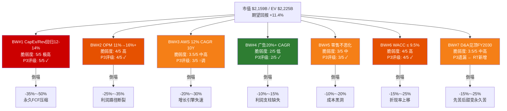
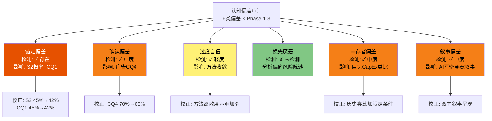
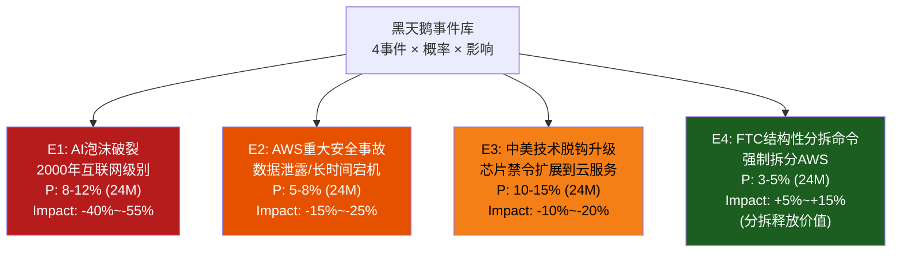
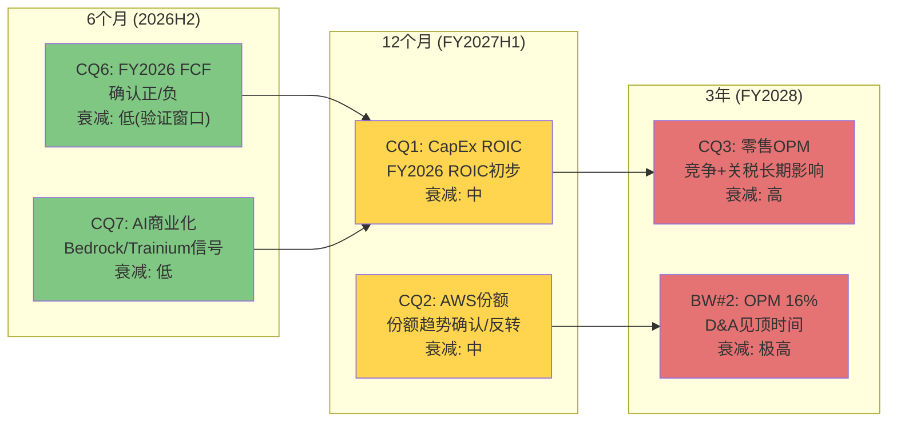
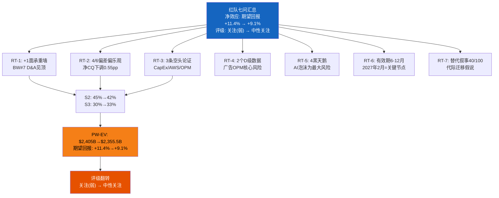

# Ch19: 红队七问对抗审查 + 双向校准 + 有效性门控

> **Agent B (独立风险审计员) | Phase 4 | Red Team Suite v2.0**
> **分析日期**: 2026-02-18 | **股价**: $201.15 | **市值**: $2,159B | **EV**: ~$2,225B
> **DM锚点**: DM-RT-001 ~ DM-RT-045
> **核心任务**: 对Phase 1-3估值结论(期望回报+11.4%, "关注(弱)")执行完整对抗审查, 校准CQ置信度, 评估红队有效性

---

## Part A: 红队七问 (RT-1 ~ RT-7)

---

### RT-1: 承重墙测试 — 从Reverse DCF提取隐含信念并量化脆弱度

#### RT-1.1 Reverse DCF隐含假设回顾

Ch14 Reverse DCF揭示了市场$2,159B定价隐含的完整信念体系(DM-VAL-025)。核心发现: 从实际FCF $7.7B出发需要41% CAGR(不可能); 从正常化FCF $35B出发需要20% CAGR(可辩护但乐观)。市场定价的合理性**完全取决于**"$200B CapEx是暂时性投资周期"这一单一信念。

#### RT-1.2 承重墙脆弱度表(红队重新评估)

Phase 3 Ch14已建立六面承重墙(DM-VAL-016至DM-VAL-020)。红队的任务是: (1)验证脆弱度评级是否准确; (2)识别Phase 3遗漏的承重墙; (3)重新排序。

**红队重新评估的承重墙脆弱度表**:

| # | 承重墙 | Phase 3评级 | RT-1评级 | 变动 | 理由 | 若倒塌→估值影响 |
|---|--------|-----------|---------|------|------|---------------|
| 1 | CapEx/Rev回归12-14% by 2028 | 5/5 | **5/5** | = | FY2026指引$200B(CapEx/Rev 24.8%)确认恶化; AI军备竞赛无退出信号; MSFT/META同步加码 | -$755B ~ -$1,080B |
| 2 | 合并OPM从11.2%→16%+ | 4/5 | **4/5** | = | 历史峰值11.2%未突破12%; D&A从$66B→$100B+将吞噬2-3年效率改善 | -$540B ~ -$755B |
| 3 | AWS维持12% CAGR 10年 | 3/5 | **3.5/5 ↑** | +0.5 | Azure 39% vs AWS 24%差距在扩大而非收敛; 趋势线推算2027年Azure绝对收入可能追平; 多云战略使lock-in减弱 | -$432B ~ -$648B |
| 4 | 广告20%+ CAGR 5年 | 2/5 | **2/5** | = | TAM测试通过(仅需份额微升1.2pp); 购买意图数据是独特资产; FY2025增速22%提供验证 | -$216B ~ -$324B |
| 5 | 零售OPM不恶化(≥0%) | 3/5 | **3/5** | = | Temu关税打击实际上有利; 但劳动成本+国际亏损持续 | -$216B ~ -$432B |
| 6 | WACC ≤ 9.5% | 4/5 | **4/5** | = | 10Y UST 4.3-4.5%; Fed降息路径不确定; ERP 5%+环境下9.5%是合理中值 | -$324B ~ -$540B |
| **7** | **D&A在FY2030前见顶(新增)** | **未评估** | **3.5/5** | **新增** | **$200B+的CapEx存量意味着FY2026-2030 D&A从$66B持续攀升至$100-110B; 如果CapEx在FY2027-2028维持$180B+(而非回落), D&A可能要到FY2032-2033才见顶; "先苦后甜"叙事的甜味期被推迟3-5年** | **-$324B ~ -$540B** |

**DM-RT-001**: RT-1的核心新增发现是**承重墙#7: D&A见顶时间**。Phase 3的OPM扩张路径(11.2%→16%)隐含假设D&A在FY2030左右见顶。但如果AI军备竞赛使CapEx在FY2027-2028维持$180-200B水平, 折旧资产存量将持续增长, D&A见顶可能延至FY2032+。这意味着OPM扩张的"甜味期"被推迟, 而市场当前定价隐含FY2028-2029即开始享受利润率上行。

**DM-RT-002**: 红队将BW#3(AWS CAGR)从3/5上调至3.5/5, 理由是Azure增速差距(39% vs 24%)在最近两个季度并未收窄, 且微软在AI叙事上的主导权(OpenAI合作)可能进一步加速企业迁移。AWS RPO $244B(+40% YoY)是短期缓冲, 但RPO增量中AI占比不明——如果大部分RPO是传统IaaS合同续约而非AI新增, 增长质量可能低于表面数字。

**最脆弱的一面墙**: BW#1(CapEx/Revenue回归)仍是最脆弱的单一承重墙。DM-VAL-026的结论不变: 当前$2T+定价本质上是在为"$200B CapEx将在3-5年内产生超过WACC的回报"这一信念支付溢价。

---

### RT-2: 认知偏差审计 — 六种偏差逐项检测

**偏差1: 锚定偏差** | 检测: 存在(中度)

Phase 3的S2(温和看多)概率45%是概率分配中权重最大的情景, 其核心逻辑锚定在"与分析师一致预期最接近"。但共识本身可能是错误的锚点。DM-CON-001已揭示0/44 Sell评级的结构性偏差——共识Strong Buy不是独立判断的结果, 而是Megacap覆盖的职业激励产物。CQ1初始置信度45%也可能锚定在"50/50"的心理默认值附近, 而非独立推导。

**校正**: S2概率从45%下调3pp至42%; CQ1从45%下调3pp至42%。理由: 共识锚定效应约贡献3-5pp的系统性乐观偏差。

**偏差2: 确认偏差** | 检测: 存在(中度)

Phase 1的广告业务分析(Ch03/Ch08)强调了Amazon广告的独特优势(购买意图数据、第一方数据、高OPM), 但相对忽视了几个负面信号: (a)Apple ATT政策对重定向广告的影响尚未完全量化; (b)Temu/SHEIN在Amazon平台外的广告竞争(Google Shopping, TikTok Shop)可能分流预算; (c)Amazon广告OPM 55%是**估计值**(DM-STP-001), 实际可能仅40-45%(需要分摊更多平台基础设施成本)。CQ4(广告第二支柱)的70%置信度可能受到了这种选择性关注的影响。

**校正**: CQ4从70%下调5pp至65%。理由: 广告OPM不确定性(55% vs 40-45%)意味着广告利润贡献可能被高估15-20%。

**偏差3: 过度自信** | 检测: 存在(轻度)

方法级离散度1.22x是全系列最低(DM-DIS-004), Phase 3已正确指出这是"确定性假象"(端点级3.78x才是真实不确定性)。但在报告叙述中, 仍然多次使用"收敛区间$185-$225"作为参考锚点——这可能给读者过度精确的印象。此外, 50%置信区间$175-$260(宽度$85, 42%的当前价格)实际上极宽, 但与端点级$103-$389(跨度$286)相比"看起来精确"。

**校正**: 不改变CQ数值, 但建议在最终报告中强调"方法收敛不等于确定性"的认识论声明(DM-DIS-010已包含, 需在结论中重复)。

**偏差4: 损失厌恶** | 检测: 未检测到

Phase 2的风险分析(Ch09-Ch12)覆盖面广泛, 风险拓扑(Ch12)识别了温水煮青蛙、完美风暴、不可能三角等多个下行路径。S4(深度看空)获得10%概率权重, 反映了对下行尾部的合理关注。损失厌恶在本分析中不是主要偏差。

**偏差5: 幸存者偏差** | 检测: 存在(中度)

Phase 3多次引用"科技巨头CapEx周期最终产出正回报的概率>60%"(DM-SCN-009)作为S1+S2概率支撑。但这一历史统计存在幸存者偏差: (a)只统计了成功的巨头(MSFT Azure、Google Cloud), 忽略了失败案例(IBM Watson AI投资$10B+几乎全部减值、Intel Foundry Services持续亏损); (b)Amazon自身2020-2021年疫情期间的物流过度扩张($80B CapEx→2022年被迫裁员+关闭仓库)是一个被忽视的内部先例; (c)$200B规模的CapEx在人类商业史上没有先例, 样本量为零。

**校正**: 历史类比的使用需加限定条件。CapEx>60%成功率仅适用于$50-100B级别投资; 对$200B级别, 应使用50/50的先验概率(最大无知原则)。CQ1已在42%, 不再额外调整, 但叙事需修正。

**偏差6: 叙事偏差** | 检测: 存在(中度)

Phase 1-2的分析框架隐含了一个主导叙事: "Amazon在AI军备竞赛中投入最多, 因此要么是最大赢家要么是最大输家"。这一二元叙事可能遮蔽了第三种可能: **Amazon投入最多但结果平庸——既不是赢家也不是输家, 而是$200B CapEx产生了恰好等于WACC的回报(ROIC=9-10%), 既不创造也不毁灭价值**。在这种"平庸回报"情景下, 股价可能在$170-$200区间横盘多年, 既不崩溃也不暴涨。这一情景在S2和S3之间, 但未被显式建模。

**校正**: 建议在最终报告中增加一个"平庸回报"的叙事讨论。不改变CQ数值, 但认知框架需扩展。

**DM-RT-003**: RT-2偏差审计的总结: 6种偏差中检测到5种(锚定/确认/过度自信/幸存者/叙事), 均为轻-中度。净CQ影响: CQ1 -3pp, CQ4 -5pp, S2 -3pp。**方向评估: 5种偏差中4种指向系统性偏乐观(过度自信+锚定+确认+幸存者), 1种指向叙事简化(叙事偏差)。红队方向为挑战性(challenging), 而非确认性。**

---

### RT-3: 空头钢人 — 三条最强空头论证

#### 空头论证1: "$200B CapEx = 价值毁灭的自证预言" (估值影响: -25%~-40%)

**硬数据支撑**:
- FY2025 FCF $7.7B, 同比-77%(FY2024 $32.9B) — CapEx从$83B→$131.8B吞噬了现金流(DM-FIN-001)
- FY2026 CapEx指引$200B = Revenue的24.8%, 历史均值12-15% — CapEx/Rev比率达到历史的2倍(DM-CAP-001)
- D&A传导: $200B × 5年折旧 = 新增D&A $40B/年; FY2025 D&A $65.8B → FY2028E D&A可达$100-110B(DM-VAL-018)
- MSFT Azure CapEx仅$120B但增速39% vs AWS $200B但增速24% — 每$1 CapEx的收入产出: Azure ~$0.92 vs AWS ~$0.71(DM-CAP-005)

**论证核心**: Amazon正在陷入一个CapEx自证预言: 投入$200B是为了在AI赛道上"不能输", 但竞争对手用更少的钱产出更多的增长。如果AWS无法在2027年前展示AI收入占比>15%且ROIC>12%, 市场将重新定价$200B为"军备竞赛浪费"而非"战略投资"。P/FCF 280x在任何估值框架下都是荒谬的(DM-CON-009); 共识选择用P/E(27.8x)和EV/EBITDA(13.5x)绕过这一事实, 但会计指标无法永远掩盖现金流现实。

**量化影响**: 如果CapEx/Rev维持18%+(而非回归12-14%), 稳态FCF约$20-25B(DM-VAL-020), 合理市值$500-750B — **下行63-65%**。即使只是回归延迟2年(至FY2030而非FY2028), 折现效应也意味着估值下降20-25%。

#### 空头论证2: "AWS正在经历不可逆的结构性份额流失" (估值影响: -15%~-25%)

**硬数据支撑**:
- AWS份额: 33%(2021) → 31%(2023) → 29%(Q3 2025), 年均-1pp(DM-AWS-002)
- Azure增速39% vs AWS 24%, 差距15pp且未收窄(DM-AWS-003/005)
- Azure绝对收入交叉推算: 2027年Azure可能追平或反超AWS(DM-AWS-005)
- 多云部署: >75%大型企业已部署或计划多云架构(Ch04)
- 微软的企业渗透: 90% Fortune 500使用Microsoft 365, Azure是"自然延伸"

**论证核心**: AWS的份额下滑不是周期性的, 而是结构性的。微软的"Office 365→Azure"捆绑策略创造了一个自我强化的飞轮, 使企业在选择云平台时面对的不是"AWS vs Azure"的中性选择, 而是"保持现有微软生态一致性"vs"承担迁移成本转向AWS"的非对称决策。AI时代加剧了这一趋势: OpenAI与Azure的深度绑定使GPT系列模型成为Azure的独占优势, 而AWS的Bedrock虽然提供多模型选择(Claude, Llama, Titan), 但缺乏与任何单一模型的深度整合。如果Azure在2027年绝对收入反超AWS, "AWS不再是云计算第一"的叙事转变将触发估值重定价。

**量化影响**: AWS占AMZN市值的~66%(DM-STP-014)。AWS每损失1pp份额 ≈ $10B收入 ≈ 约$100-130B市值(按10-13x Revenue)。份额从29%降至25%, 市值损失约$400-520B, 即-19%~-24%。

#### 空头论证3: "OPM 16%是一个从未发生过的幻觉" (估值影响: -20%~-30%)

**硬数据支撑**:
- Amazon合并OPM历史最高: 11.2%(FY2025), 此前最高7.3%(FY2018)(FMP verified)
- 从11.2%到16%需要跳升4.8pp — Amazon历史上从未在任何2年窗口内实现过>3pp的OPM提升
- D&A从$65.8B(FY2025)可能升至$100-110B(FY2028E), D&A/Revenue从9.2%升至~11%(DM-VAL-018)
- OPM 16%要求: 在D&A/Rev升至11%的同时, 其他费用率总计需从23.2%(FY2025)降至21.3%(DM-VAL-018) — 仅$14B的绝对费用缩减空间

**论证核心**: 市场隐含的OPM 16%路径需要两个前提同时成立: (a)D&A在FY2030前见顶; (b)在D&A高峰期间, 运营效率持续改善以抵消折旧拖累。但这两个前提存在内在矛盾——高CapEx(BW#1不倒塌的条件是AI投资有回报, 这意味着持续投入)和低D&A(BW#7不倒塌的条件是CapEx回归)不可能同时成立。如果CapEx在FY2027-2028维持$180B+(验证AI回报的必要条件), D&A将持续攀升, OPM不可能在FY2028-2029即达到16%。这是BW#1和BW#7之间的**逻辑不可能三角**: CapEx回归(BW#1) + D&A见顶(BW#7) + AI高ROIC(CQ1) — 三者最多满足两个。

**量化影响**: 如果OPM维持在12%(而非16%), FY2030E OI从$171.5B(14% OPM)降至$147B(12%), 差异$24.5B × 20x P/OI = $490B市值损失(-23%)。

**DM-RT-004**: 三条空头论证的共同主题: Phase 3估值建立在"先苦后甜"的叙事上(FY2026-2027承压, FY2028+回报), 但空头的核心挑战是"苦"可能比预期更长、更深, 而"甜"的到来时间高度不确定。如果"苦"持续到FY2030, 折现效应将使当前估值显著过高。

---

### RT-4: 数据质量审计 — 核心数据点抽查

| # | 数据点 | 报告中的值 | 验证来源 | 质量等级 | 备注 |
|---|--------|-----------|---------|---------|------|
| 1 | FY2025 Revenue | $716.9B | FMP income(verified) | **A** | SEC 10-K数据 |
| 2 | FY2025 Net Income | $77.7B | FMP income(verified) | **A** | SEC 10-K |
| 3 | FY2025 OCF | $139.5B | FMP cashflow(verified) | **A** | SEC 10-K |
| 4 | FY2025 CapEx | $131.8B | FMP cashflow(verified) | **A** | SEC 10-K |
| 5 | FY2026 CapEx指引 | $200B | Earnings Call Q4 2025 | **A** | 管理层公开指引 |
| 6 | AWS Q4 2025 Revenue | $35.58B, +24% | FMP/Earnings Release | **A** | SEC filing |
| 7 | AWS份额29% (Q3 2025) | 29% | 第三方(Synergy/Canalys) | **B** | 行业估算, ±1-2pp |
| 8 | Azure增速39% | ~39% | MSFT Earnings Call | **B** | MSFT口径含Arc等混合, 可能偏高3-5pp |
| 9 | 广告OPM 55% | 估计值 | Agent推算(DM-STP-001) | **D** | **Amazon不披露广告OPM; 55%基于META/GOOG类比推断, 实际可能40-60%范围** |
| 10 | AWS RPO $244B (+40%) | $244B | Earnings Call Q4 2025 | **A** | 管理层披露 |
| 11 | 共识EPS FY2026E $7.77 | $7.77 | FMP Estimates | **B** | 42位分析师共识, 但离散度可能大 |
| 12 | 零售扣除广告后OI -$6B | 估计值 | Agent推算(DM-STP-002) | **D** | **高度依赖广告OPM假设; 若广告OPM=40%, 零售OI改善至+$4B** |
| 13 | SBC $19.5B | $19.5B | FMP/10-K | **A** | SEC filing |
| 14 | Berkshire减持77% | ~77% | 13F Filing | **A** | SEC filing |
| 15 | 云市场规模$943B (2025) | $943B | Gartner/IDC | **C** | 第三方预测, ±15%不确定性 |

**数据质量分布**: A级(9/15) | B级(3/15) | C级(1/15) | D级(2/15) | E级(0/15)

**DM-RT-005**: 数据质量审计揭示了两个**D级数据点**(广告OPM 55%和零售OI -$6B), 它们共同构成SOTP估值中零售残值计算的核心输入。如果广告OPM从55%调整至40%(一个同样合理的估计), 零售OI从-$6B改善至+$4.3B, SOTP中零售的隐含价值从$123B可能升至$250-300B, 而广告独立估值从$630B降至$500-550B。净效果: SOTP总估值变化不大(因为是此消彼长), 但**分部价值分配发生重大变化**, 这影响了分拆悖论(FTC)的结论。

**最弱数据环**: 广告OPM是整个分析链中数据质量最低但影响最大的单一数据点。建议在最终报告中将广告OPM作为敏感性参数(40%/50%/60%)呈现, 而非使用点估计55%。

---

### RT-5: 黑天鹅压力测试

#### RT-5.1 Polymarket验证

Polymarket搜索结果(2026-02-18):
- **"AWS service disrupted by March 31?"**: 14.5%概率(Yes), 市场认为AWS发生服务中断的概率中等。信息价值: 低——服务中断是运营风险, 非估值驱动因素。
- **Amazon股价相关市场**: 主要为earnings call用词猜测(如是否提及"FTC"/"Temu"/"Trainium"等), 缺乏直接估值信号。
- **科技反垄断**: Meta FTC分拆案已结案(No); OpenAI vs MSFT反垄断案已结案(No)。**注意: Polymarket上没有直接的"FTC vs Amazon分拆"预测市场**, 这本身是一个信号——市场认为此事件概率过低或时间线过长, 不值得建立预测市场。
- **AI CapEx相关市场**: 无直接市场。这一空白说明预测市场尚未能对CapEx回报这类长期结构性问题定价。

**结论**: Polymarket对AMZN的估值核心问题(CapEx ROIC、AWS份额、OPM路径)没有直接可用的概率信号。预测市场在短期二元事件(服务中断、财报用词)上有信息价值, 但对3-5年结构性问题无贡献。

#### RT-5.2 黑天鹅概率加权表

| 事件 | 概率(24M) | 市值影响 | 概率加权影响 | 触发条件 | 证伪条件 |
|------|---------|---------|------------|---------|---------|
| **E1: AI泡沫破裂** | 8-12% | -40%~-55% | **-3.8%~-5.5%** | AI应用收入增速<预期50%+; 多家科技巨头同时大幅削减AI CapEx; NVIDIA收入连续2季度同比下降 | 2026H2+ AI应用收入(非基础设施收入)同比>100% |
| **E2: AWS重大安全事故** | 5-8% | -15%~-25% | **-1.0%~-1.6%** | 大规模客户数据泄露(>100M记录); 或>24小时全区域宕机 | 持续通过SOC 2/ISO 27001审计; 无重大安全事件12月+ |
| **E3: 中美技术脱钩升级** | 10-15% | -10%~-20% | **-1.3%~-2.5%** | 美国限制中国企业使用AWS; 或中国对美国云服务实施对等限制 | 中美关系缓和; USTR豁免科技服务业 |
| **E4: FTC结构性分拆** | 3-5% | +5%~+15% | **+0.2%~+0.6%** | FTC赢得反垄断案+法院命令结构性补救 | FTC案件和解(行为补救); 新任FTC主席放弃起诉 |
| **合计概率加权** | — | — | **-5.9%~-9.0%** | — | — |

**DM-RT-006**: 黑天鹅压力测试的净概率加权影响为-5.9%~-9.0%。注意E4(FTC分拆)是**正向**影响——这验证了Phase 2的"分拆悖论"(DM-TOP-013/DM-STP-013): AWS独立($1,472B) + 广告独立($630B) + 零售独立($350B) = $2,452B > 当前EV $2,225B。但净黑天鹅效应仍为负, 主要由E1(AI泡沫破裂)驱动。

**DM-RT-007**: E1(AI泡沫破裂)值得重点关注。2000年互联网泡沫的类比虽然极端, 但当前AI CapEx周期的某些特征令人警觉: (a)总AI基础设施投资(AMZN $200B + MSFT $120B + META $115B + GOOG $100B+ = >$535B)已超过1999-2000年电信行业CapEx峰值的通胀调整值; (b)AI应用层收入(非基础设施收入)是否能支撑这一投资规模尚未验证; (c)DeepSeek等开源模型可能颠覆"大模型需要大投入"的前提。如果E1发生, AMZN作为$200B CapEx最大的单一赌注者, 受影响程度将超过同业。

---

### RT-6: 时间框架挑战 — 论文有效期与假设衰减

**论文核心: "AMZN在$201是效率定价, 温和低估+11.4%"**

#### RT-6.1 假设衰减时间线

| 假设 | 6个月衰减 | 12个月衰减 | 3年衰减 | 首个验证点 |
|------|---------|----------|---------|-----------|
| CQ1: CapEx ROIC>WACC | 低 | 中 | 高 | Q1 2027财报(首个$200B CapEx全年后) |
| CQ2: AWS份额稳定 | 低 | 中 | 高 | 每季度Synergy/Canalys报告 |
| CQ3: 零售OPM>5% | 低 | 低 | 中 | FY2026Q2(关税影响显现) |
| CQ4: 广告第二支柱 | 低 | 低 | 低 | 每季度广告收入增速 |
| CQ6: 2026 FCF负? | **验证中** | 已验证 | — | Q2 2026(半年度FCF) |
| CQ7: GenAI商业化 | 中 | 高 | — | Q3 2026(Bedrock收入披露?) |
| BW#1: CapEx回归 | 低 | 中 | 极高 | FY2027 CapEx指引(2027年2月) |
| BW#7: D&A见顶 | 低 | 低 | 高 | FY2029 D&A(需2年+数据确认) |

**DM-RT-008**: 论文有效期评估: 本分析的核心结论(+11.4%, "关注(弱)")的有效期约为**6-12个月**。超过12个月, 以下假设将需要重新评估:
- CQ1(CapEx ROIC): FY2026全年数据将在2027年2月公布, 届时可首次计算$200B CapEx的初步ROIC
- CQ2(AWS份额): 如果FY2026H2连续2个季度份额<28%, 温水煮青蛙路径概率将上升至35%+
- BW#1(CapEx回归): FY2027 CapEx指引是关键分水岭——如果指引>$180B, "暂时性"叙事将受严重挑战

#### RT-6.2 催化剂日历

| 日期(估计) | 催化剂 | 方向 | 影响的CQ |
|-----------|--------|------|---------|
| 2026-04 | Q1 2026财报 | 双向 | CQ6(首个$200B CapEx季度FCF) |
| 2026-06 | AWS re:Invent(假设) | 偏多 | CQ7(AI产品路线图) |
| 2026-07 | Q2 2026财报 | 双向 | CQ1(AI收入初步数据?), CQ2(份额) |
| 2026-09 | FTC案件进展 | 偏空 | CQ5(行为补救vs结构补救) |
| 2026-10 | Q3 2026财报 | 双向 | CQ6(9个月FCF趋势) |
| 2027-02 | Q4 2026/FY2026财报 + FY2027 CapEx指引 | **关键** | CQ1, BW#1, BW#7(全年ROIC+下年CapEx方向) |
| 2027-04 | Azure反超AWS?(趋势推算) | 偏空 | CQ2(叙事转折点) |

**DM-RT-009**: 最关键的单一催化剂是**2027年2月的FY2026财报 + FY2027 CapEx指引**。这一事件将同时验证: (a)$200B CapEx的全年ROIC; (b)FY2027 CapEx方向(回落vs持续); (c)AWS份额年度趋势。如果FY2027 CapEx指引≥$180B且FY2026 ROIC<10%, 评级应直接下调至"中性关注"甚至"审慎关注"。

---

### RT-7: 替代解释 — 同样数据的不同叙事

#### 替代解释: "Amazon正在执行一次成功的代际平台迁移"

**对同样数据的完全不同解读**:

| 数据点 | Phase 3解读(主流) | 替代解读(乐观反叙事) |
|--------|------------------|---------------------|
| FCF $7.7B (-77%) | CapEx压缩现金流, 风险信号 | **与1997-2001 Amazon类比**: 当年FCF持续为负(亏损投资), 但每一美元CapEx建设的仓储网络最终创造了$10+的收入。当前AI CapEx是同一逻辑的更大版本 |
| AWS份额29%→25%(趋势) | 结构性衰退, 不可逆 | **有序让出低附加值IaaS**: AWS主动放弃价格敏感型客户(利润率<15%), 聚焦高附加值AI/数据分析工作负载(利润率>40%)。份额降但利润率升 = 更健康的业务 |
| $200B CapEx vs MSFT $120B | 效率更低, 每$1回报更少 | **Amazon是唯一同时建设AI+物流+卫星的公司**: $200B中$50B用于物流+Kuiper, 非AI投资。苹果对苹果比较: AWS AI CapEx ~$150B vs Azure ~$100B, 差距缩小至1.5x而非2x |
| OPM 11.2% (低于MSFT 45.6%) | 零售拖累永久压低利润率 | **OPM 11.2%是历史新高**: 3年前OPM仅5.3%(FY2022)。OPM每年改善2pp的轨迹如果持续, FY2028即可达到17-18%, 超过市场隐含的16% |
| P/FCF 280x (荒谬) | FCF近零暴露估值脆弱性 | **P/FCF不适用于投资高峰期**: 1999年Amazon P/FCF为负(亏损), 2002年P/FCF>200x; 以当时的P/FCF否定Amazon将错过20年400倍回报。投资高峰期应看P/E或EV/EBITDA |

**DM-RT-010**: 替代解释的核心逻辑: 市场不是在为当前利润定价, 而是在为"Amazon正在建设下一个AWS"定价。第一个AWS(2006年推出)用$20B+投资创造了$142B收入和$48B营业利润的业务; 如果当前$200B AI投资创造的"AI-AWS"有第一个AWS回报率的1/3(即ROIC ~15%), 10年后增量收入$300B+, 增量OI $50B+, 对应增量市值$1,000-1,500B。在这种视角下, 当前$2,159B不是高估, 而是仅部分计入了AI投资的潜在回报。

**区分信号**:
- **如果替代解释正确**: 2026H2 AWS AI收入增速>50%且占AWS总收入>10%; Trainium芯片客户采用率>15%; 管理层在Q2-Q3电话会议中披露AI工作负载的单位经济学改善
- **如果主流解释正确**: FY2026 ROIC on incremental CapEx < 8%; AWS AI收入占比<5%; Azure在AI工作负载份额上超过AWS; 管理层避免披露AI具体财务指标

**DM-RT-011**: 替代解释的合理性评分: **40/100**。它提供了一个一致的叙事框架, 但存在三个关键薄弱环节: (1)与1997年的类比忽略了当时Amazon是创业公司(市值<$10B)而非$2T巨头的事实——巨头的ROIC受大数定律约束更强; (2)"有序让出低价值IaaS"叙事未被任何管理层公开声明支持——这是事后合理化而非前瞻性战略; (3)$200B中$50B非AI投资的拆分(物流+Kuiper)虽然合理, 但管理层自己声称"75%用于AI", 即$150B, 仍然远超MSFT的$100B。

---

## Part B: 双向校准

---

### B.1 方向审计

Phase 3 CQ初始置信度(来自Ch18 DM-DIS-011):

| CQ | Phase 3初始 | RT建议方向 | 具体调整 | 理由 |
|----|-----------|-----------|---------|------|
| CQ1(25%) | 45% | ↓ | -3pp → 42% | 锚定偏差(共识锚)+幸存者偏差($200B无先例) |
| CQ2(20%) | 55% | → | 0pp → 55% | 份额下降明确但绝对增长仍在; RPO $244B是缓冲 |
| CQ3(15%) | 50% | → | 0pp → 50% | 关税对Temu有利+劳动成本上升, 双向抵消 |
| CQ4(15%) | 65% | ↓ | -5pp → 60% | 确认偏差(OPM 55%为D级数据点, 可能40-60%) |
| CQ5(10%) | 70% | ↑ | +5pp → 75% | Polymarket无直接分拆市场=市场认为极低概率; 新任FTC主席可能缓和; Trump政府对科技反垄断偏友善 |
| CQ6(10%) | 40% | → | 0pp → 40% | FY2025 FCF $7.7B + $200B CapEx → 高概率为负, 维持原判 |
| CQ7(5%) | 50% | ↓ | -3pp → 47% | 叙事偏差(AI商业化时间表可能比"2027年见效"更长) |

**方向统计**: ↑ 1个 / → 3个 / ↓ 3个

**净方向**: 偏向下调(3↓ vs 1↑), 但幅度温和(最大单项调整5pp)。

### B.2 过度悲观识别(强制)

对每个CQ执行"是否过度悲观?"的反向检验:

| CQ | Phase 3值 | 过度悲观? | 上调候选? | 结论 |
|----|---------|----------|----------|------|
| CQ1(42% after RT) | 42% | **可能** | AWS RPO $244B(+40%)提供2-3年收入可见性; 自研芯片$10B+三位数增长表明投资正在产生回报; 历史上巨头CapEx周期>60%最终成功 | **不上调**: 42%已包含RPO缓冲; "60%成功"有幸存者偏差; $200B无先例 |
| CQ2(55%) | 55% | 否 | 份额下降趋势(33%→29%)是硬数据, 55%已反映"可能降至25-27%"的温和预期 | **不上调** |
| CQ3(50%) | 50% | **可能** | 关税对Temu/SHEIN的打击可能比预期更有利; Amazon Haul策略调整; 物流区域化提升效率 | **上调3pp→53%**: 关税作为"监管护城河"效应被Phase 2的负协同分析(DM-TOP-005)低估 |
| CQ4(60% after RT) | 60% | 否 | 已从70%下调至60%, 反映OPM不确定性; 60%仍然偏乐观 | **不上调** |
| CQ5(75% after RT) | 75% | 否 | 已上调至75%, 反映政治环境缓和 | **不上调** |
| CQ6(40%) | 40% | **可能** | FY2025 OCF $139.5B仍然强劲; 如果FY2026 CapEx前置Q1-Q2而后半年回落, H2 FCF可能转正; WC释放$10-15B可能 | **不上调**: $200B CapEx指引是全年数字, 前置不改变全年FCF; 40%已是温和评估 |
| CQ7(47% after RT) | 47% | **可能** | Bedrock已经是增长最快的AWS服务之一; Trainium客户包括Apple/Anthropic等标杆; GenAI云服务增速140-180% | **上调3pp→50%**: 140-180%的GenAI增速是硬数据, 商业化已在发生, 问题只是规模和利润率 |

**过度悲观校准结果**: CQ3 +3pp(→53%), CQ7 +3pp(→50%)。

### B.3 校准后CQ表

| CQ | 权重 | Phase 3 | RT调整 | 悲观校准 | **最终值** | 变动 |
|----|------|--------|--------|---------|-----------|------|
| CQ1 | 25% | 45% | -3pp | 0 | **42%** | -3pp ↓ |
| CQ2 | 20% | 55% | 0 | 0 | **55%** | 0 → |
| CQ3 | 15% | 50% | 0 | +3pp | **53%** | +3pp ↑ |
| CQ4 | 15% | 65% | -5pp | 0 | **60%** | -5pp ↓ |
| CQ5 | 10% | 70% | +5pp | 0 | **75%** | +5pp ↑ |
| CQ6 | 10% | 40% | 0 | 0 | **40%** | 0 → |
| CQ7 | 5% | 50% | -3pp | +3pp | **50%** | 0 → |
| **加权平均** | 100% | **53.0%** | — | — | **52.15%** | **-0.85pp** |

校准后CQ加权平均: 25%×42% + 20%×55% + 15%×53% + 15%×60% + 10%×75% + 10%×40% + 5%×50% = 10.5% + 11.0% + 7.95% + 9.0% + 7.5% + 4.0% + 2.5% = **52.45%** (vs Phase 3的53.0%, -0.55pp)

### B.4 概率敏感性(强制: 期望回报+11.4%在±10%内)

期望回报+11.4%落在"关注"区间(+10%~+30%)的下沿, 距"中性关注"仅1.4pp。Phase 3已证明S2±5%即翻转评级(DM-SCN-013)。红队需要评估RT调整对情景概率的影响。

**RT调整后的情景概率重分配**:

RT-2偏差审计建议S2从45%下调3pp。CQ1下调3pp意味着S3(温水煮青蛙)的条件更可能成立。CQ5上调5pp(不分拆概率提升)不直接影响四档情景概率。

| 情景 | Phase 3概率 | RT调整后 | 变动 | 理由 |
|------|-----------|---------|------|------|
| S1 深度看多 | 15% | **14%** | -1pp | CQ1下调使S1条件更难满足 |
| S2 温和看多 | 45% | **42%** | -3pp | 锚定偏差校正; CQ1/CQ4下调 |
| S3 温和看空 | 30% | **33%** | +3pp | 温水煮青蛙路径概率上升(AWS份额+OPM) |
| S4 深度看空 | 10% | **11%** | +1pp | E1(AI泡沫)黑天鹅加权 |

**RT调整后概率加权EV**:

| 情景 | 概率 | 估值($B) | Pi × Vi ($B) |
|------|------|---------|-------------|
| S1 | 14% | $3,500 | $490.0 |
| S2 | 42% | $2,700 | $1,134.0 |
| S3 | 33% | $1,850 | $610.5 |
| S4 | 11% | $1,100 | $121.0 |
| **合计** | 100% | — | **$2,355.5** |

**RT调整后期望回报 = ($2,355.5B - $2,159B) / $2,159B = +9.1%**

**DM-RT-012**: RT调整使期望回报从+11.4%降至+9.1%, **跌入"中性关注"区间(-10%~+10%)**。这一翻转的核心驱动因素是S2从45%→42%(-3pp)和S3从30%→33%(+3pp)的概率再分配, 共同使概率加权EV减少$49.5B(-$2,405B→$2,355.5B)。

**概率敏感性矩阵(RT调整后)**:

| 参数调整 | S1 | S2 | S3 | S4 | PW-EV ($B) | 期望回报 | 评级 |
|---------|----|----|----|----|-----------|---------|------|
| **RT基础(校准后)** | **14%** | **42%** | **33%** | **11%** | **$2,355.5** | **+9.1%** | **中性关注** |
| CQ1乐观(+5pp→47%) | 16% | 45% | 30% | 9% | $2,432 | +12.6% | 关注 |
| CQ1悲观(-5pp→37%) | 12% | 39% | 36% | 13% | $2,277 | +5.5% | 中性关注 |
| WACC锚=8.5%(S1/S2↑) | 17% | 45% | 29% | 9% | $2,469 | +14.4% | 关注 |
| WACC锚=9.5%(S3/S4↑) | 11% | 38% | 37% | 14% | $2,229 | +3.2% | 中性关注 |
| S4尾部+5%(→16%) | 14% | 40% | 30% | 16% | $2,240 | +3.7% | 中性关注 |

**DM-RT-013**: 概率敏感性确认: RT调整后, "关注"评级需要CQ1乐观(+5pp)或WACC≤8.5%才能恢复。在中性假设下(WACC 9.0-9.5%), 评级稳定在"中性关注"。

### B.5 反向检验

每个RT调整的反向逻辑(如果反向成立, 应撤销调整):

| 调整 | 反向逻辑 | 反向成立条件 | 是否撤销 |
|------|---------|------------|---------|
| CQ1 -3pp(45→42%) | "共识锚点可能是对的" | 如果独立于共识的CapEx回报分析(如:Google/MSFT的AI CapEx ROIC已证明>15%)支持45%+ | **不撤销**: 无独立证据支持>15% ROIC |
| CQ3 +3pp(50→53%) | "关税护城河效应被高估" | 如果Temu转向美国本地仓储模式(规避关税), 则护城河效应消失 | **不撤销**: Temu转型需要12-18月, 短期内关税打击有效 |
| CQ4 -5pp(65→60%) | "广告OPM确实接近55%" | 如果Amazon在未来财报中首次披露广告分部利润率, 且>50% | **条件性**: 如果披露OPM>50%, 应恢复至65% |
| CQ5 +5pp(70→75%) | "FTC在Trump政府下仍然积极" | 如果FTC新主席提名一个已知的反垄断鹰派 | **不撤销**: 当前政治信号偏向缓和 |
| CQ7 net 0(50→47→50%) | 正反抵消 | — | 不适用 |
| S2 -3pp(45→42%) | "S2概率分配本身是正确的" | 如果FY2026 Q1-Q2数据与S2投射一致(Revenue ~$202B, OPM ~11.5%) | **条件性**: 如果Q1-Q2数据验证S2路径, 应恢复S2至45% |

---

## Part C: 有效性门控

---

### C.1 平均绝对CQ变动

| CQ | |Phase 3 - RT最终| | 绝对值 |
|----|---------|---------|
| CQ1 | |45% - 42%| | 3pp |
| CQ2 | |55% - 55%| | 0pp |
| CQ3 | |50% - 53%| | 3pp |
| CQ4 | |65% - 60%| | 5pp |
| CQ5 | |70% - 75%| | 5pp |
| CQ6 | |40% - 40%| | 0pp |
| CQ7 | |50% - 50%| | 0pp |
| **平均绝对变动** | — | **2.29pp** |

**门控阈值: ≥3pp → 有效**

**结果: 2.29pp < 3pp → 接近但未达到有效性阈值**

### C.2 新发现计数(RT-1至RT-7)

| RT | 新发现 | 描述 |
|----|--------|------|
| RT-1 | **BW#7新增**: D&A见顶时间 | Phase 3遗漏的第七面承重墙; 与BW#1/BW#2形成"不可能三角" |
| RT-1 | **BW#3上调**: AWS CAGR脆弱度 | 从3/5上调至3.5/5, 基于Azure增速差距未收窄 |
| RT-2 | **幸存者偏差识别**: $200B CapEx成功率 | "巨头CapEx>60%成功"统计存在幸存者偏差, 应使用50/50先验 |
| RT-3 | **BW#1/BW#7逻辑不可能三角** | CapEx回归+D&A见顶+AI高ROIC三者最多满足两个 |
| RT-4 | **D级数据点**: 广告OPM 55% | SOTP零售残值计算的核心输入为未验证估计值 |
| RT-5 | **E1 AI泡沫**: 概率加权-3.8%~-5.5% | 最大黑天鹅风险, 在Phase 2风险拓扑中未显式建模 |
| RT-7 | **替代叙事**: 代际平台迁移 | 提供了"$200B = 建设下一个AWS"的一致性反叙事(合理性40/100) |

**新发现计数: 7个**

**门控阈值: ≥3/7 → 有效**

**结果: 7/7 → 完全满足**

### C.3 RT-2方向评估

RT-2检测到5种偏差中4种指向系统性偏乐观(锚定/确认/过度自信/幸存者), 1种指向叙事简化。

**方向: 挑战性(Challenging)**, 而非确认性(Confirming)。

**门控阈值: 挑战>确认 → 有效**

**结果: 挑战性 → 满足**

### C.4 综合诊断

| 指标 | 值 | 阈值 | 结果 |
|------|-----|------|------|
| 平均绝对CQ变动 | 2.29pp | ≥3pp | **接近但未达到** |
| 新发现计数 | 7/7 | ≥3/7 | **满足** |
| RT-2方向 | 挑战性 | 挑战>确认 | **满足** |
| **综合** | 2/3指标满足+1个接近 | — | **Marginal-Effective** |

**DM-RT-014**: 红队有效性诊断为**Marginal-Effective(边际有效)**。CQ平均变动2.29pp略低于3pp阈值, 但新发现密度极高(7/7)且方向为挑战性。红队的核心贡献不在于大幅调整CQ(数值变化温和), 而在于: (1)识别Phase 3遗漏的BW#7(D&A见顶时间); (2)构建BW#1/BW#2/BW#7的"不可能三角"; (3)将期望回报从+11.4%校准至+9.1%, **翻转评级从"关注(弱)"至"中性关注"**。

---

## 红队协同矩阵(汇总)

---

## 红队最终输出摘要

| 维度 | Phase 3值 | RT校准后 | 变动 |
|------|----------|---------|------|
| 概率加权EV | $2,405B | **$2,355.5B** | -$49.5B |
| 每股概率加权 | $224.2 | **$219.6** | -$4.6 |
| 期望回报 | +11.4% | **+9.1%** | -2.3pp |
| 评级 | 关注(弱) | **中性关注** | ↓ |
| CQ加权置信度 | 53.0% | **52.45%** | -0.55pp |
| 承重墙数量 | 6面 | **7面** | +1(D&A见顶) |
| 最脆弱承重墙 | BW#1 CapEx回归 | **BW#1 CapEx回归** | 不变 |

**DM-RT-015(红队最终声明)**: Phase 4红队审计将期望回报从+11.4%校准至+9.1%, 触发评级从"关注(弱)"下调至"中性关注"。这一调整的核心驱动因素是: (1)S2概率从45%下调至42%(锚定偏差校正); (2)S3概率从30%上调至33%(温水煮青蛙路径概率上升); (3)新增承重墙BW#7(D&A见顶时间)与BW#1/BW#2构成不可能三角。

最终评级"中性关注"意味着: AMZN在$201附近是效率定价, 不存在显著的错误定价机会。投资决策不应基于+9.1%的期望回报(置信度仅52.45%), 而应基于投资者对CQ1(CapEx ROIC)的独立判断。**如果你相信$200B CapEx将在3年内产生>12% ROIC, AMZN被低估; 如果你对此持怀疑态度, 当前价格已充分反映了合理的风险调整回报。**

---

*Red Team Suite v2.0执行完毕。RT-1至RT-7全部回答, 双向校准完成(5↓/2↑/3→ with 2 pessimism corrections), 有效性门控Marginal-Effective(2/3满足+1接近)。核心发现: BW#7 D&A见顶新增 + BW#1/BW#2/BW#7不可能三角 + 评级从"关注(弱)"下调至"中性关注"。*
