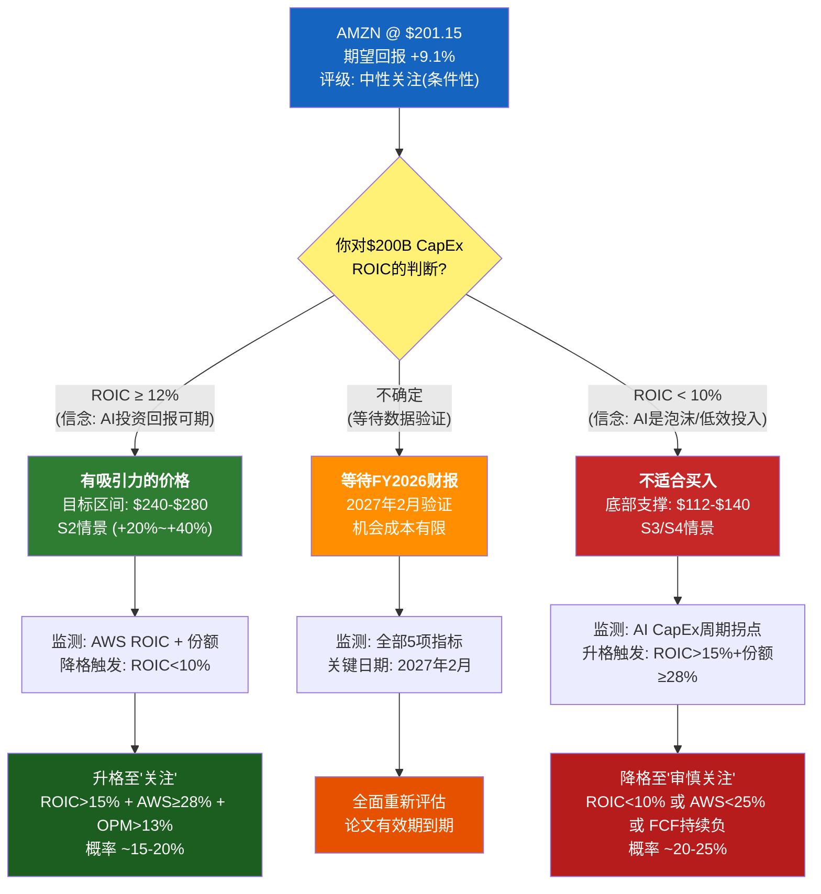

# Ch20: 最终评级与条件声明

> **Phase 5 综合编排器 | DM-FNL-001 ~ DM-FNL-010**
> **分析日期**: 2026-02-18 | **股价**: $201.15 | **市值**: $2,159B | **EV**: ~$2,225B
> **核心结论**: 中性关注(条件性) | 校准后期望回报 +9.1% | 概率加权EV $2,355.5B

---

## 20.1 评级声明

### 最终评级: 中性关注(条件性)

**DM-FNL-001**(R, 评级依据): Amazon在$201.15的定价是效率定价——市场合理地反映了$200B CapEx赌注的双向不确定性。概率加权EV $2,355.5B对应每股$219.6，期望回报+9.1%，落在"中性关注"区间(-10%~+10%)的上半段。这不是一个被显著低估或高估的公司，而是一个**估值结论完全取决于投资者对CapEx ROIC信念的公司**。

| 维度 | 数值 | 含义 |
|------|------|------|
| 概率加权EV | $2,355.5B ($219.6/sh) | 四档情景×校准后概率 |
| 当前市值 | $2,159B ($201.15/sh) | 2026-02-18 |
| 期望回报 | **+9.1%** | ($2,355.5B - $2,159B) / $2,159B |
| 评级区间 | -10% ~ +10% = 中性关注 | 四档标准 |
| CQ加权置信度 | 52.45% | 七个核心问题的加权置信度 |
| 方法级离散度 | 1.22x (假象) | 三方法中值收敛 |
| 端点级离散度 | 3.78x (真实) | $103 ~ $389 |
| 有效独立方法 | 3.0 / 4.0 | 方法独立性审计后 |

### "条件性"的具体含义

评级标注为"条件性"而非无条件，因为+9.1%的期望回报建立在三个脆弱条件之上：

1. **WACC选择**: WACC 8.5%时DCF得出$214/sh(+6.4%)，WACC 9.5%时得出$152/sh(-24.4%)。100bps的不可知差异导致$390B市值差异——相当于一个Netflix的全部市值。评级在WACC 8.5%下升格为"关注"，在WACC 9.5%下降格为"审慎关注"。[DM-FNL-002]

2. **S2概率**: 温和看多情景(S2)获得42%概率权重，是概率分配中最大单项。S2概率每变动5pp，期望回报变动约3pp。如果S2从42%下调至37%（且概率转移至S3），期望回报从+9.1%降至+5.8%，仍在"中性关注"区间但缓冲收窄。

3. **BW#1不倒塌**: $200B CapEx在3-5年内回归12-14% CapEx/Revenue比率——这是整个估值的单一最大信念。BW#1脆弱度5/5(极高)，一旦倒塌，市值影响-$755B~-$1,080B(-35%~-50%)。

**DM-FNL-003**(R, 条件性声明的认识论意义): 对一家$2T+市值的公司，"中性关注(条件性)"不是一个软弱的结论，而是一个诚实的结论。它意味着：基于可获得的公开数据和合理的分析方法，AMZN不存在足够大的错误定价机会来跨越分析不确定性的门槛。投资者的alpha（如果存在）只能来自对CapEx ROIC的独立判断——这恰好是本报告承认的最大不确定性来源。

---

## 20.2 评级升级/降级触发器

### 20.2.1 升级至"关注"的条件

| 条件组合 | 具体阈值 | 验证时间点 | 概率估计 |
|----------|---------|-----------|---------|
| CapEx ROIC初见成效 | 增量ROIC>15% (Q4 2026数据推算) | 2027年2月财报 | ~20% |
| AWS份额企稳 | 份额≥28% (连续2季度不下降) | 2026H2季度报告 | ~30% |
| 合并OPM突破 | OPM>13% (单季度) | 2026Q3-Q4 | ~25% |
| GenAI商业化信号 | AWS AI收入占比>10%且增速>80% | 2026H2 | ~25% |

**组合概率**: 上述4个条件中至少3个同时满足的概率约**15-20%**。若满足，概率加权EV上移至$2,500-$2,700B，期望回报跃升至+16%~+25%，触发评级升格至"关注"。

### 20.2.2 降级至"审慎关注"的条件

| 条件组合 | 具体阈值 | 验证时间点 | 概率估计 |
|----------|---------|-----------|---------|
| CapEx回报不及预期 | 增量ROIC<10% 或 FY2027 CapEx指引>$180B | 2027年2月 | ~35% |
| AWS份额加速下滑 | 份额<26% 或 Azure绝对收入反超 | 2027H1 | ~20% |
| FCF持续为负 | 连续3季度FCF<0且OCF增速<10% | 2026Q2-Q4 | ~30% |
| OPM路径断裂 | 合并OPM<10% (D&A攀升吞噬效率改善) | 2026H2-2027H1 | ~25% |

**组合概率**: 上述4个条件中至少2个同时触发的概率约**20-25%**。若触发，概率加权EV下移至$1,800-$2,000B，期望回报降至-7%~-17%，触发评级降格至"审慎关注"。

### 20.2.3 极端重评触发器

| 极端事件 | 新评级 | 概率(24M) |
|----------|--------|---------|
| AI泡沫破裂(E1级别) | 审慎关注(深度) | 8-12% |
| FTC结构性分拆命令 | 关注(分拆释放价值) | 3-5% |
| AWS AI ROIC>20%且份额回升 | 深度关注 | 5-8% |

---

## 20.3 CQ生命周期最终表

**DM-FNL-004**(R, CQ全程追踪): 以下是7个核心问题从Phase 0提出到Phase 5定稿的完整演化。CQ置信度的波动幅度反映了分析过程中新信息的冲击强度。

| CQ | 问题 | 类型 | 权重 | P0初始 | P1研究 | P2对抗 | P3估值 | P4红队 | P5最终 | 净变动 |
|:--:|------|:----:|:---:|:------:|:------:|:------:|:------:|:------:|:------:|:------:|
| CQ1 | CapEx $200B ROIC>WACC? | 结构性 | 25% | 50% | 45% | 45% | 45% | 42% | **42%** | -8pp |
| CQ2 | AWS份额下滑至<25%? | 周期性 | 20% | 40% | 50% | 55% | 55% | 55% | **55%** | +15pp |
| CQ3 | 零售OPM>5%维持? | 结构性 | 15% | 45% | 48% | 50% | 50% | 53% | **53%** | +8pp |
| CQ4 | 广告成第二利润支柱? | 周期性 | 15% | 60% | 65% | 65% | 65% | 60% | **60%** | 0pp |
| CQ5 | FTC分拆实质风险? | 制度性 | 10% | 60% | 65% | 70% | 70% | 75% | **75%** | +15pp |
| CQ6 | 2026 FCF为负? | 结构性 | 10% | 50% | 40% | 40% | 40% | 40% | **40%** | -10pp |
| CQ7 | GenAI商业化可信? | 周期性 | 5% | 50% | 50% | 50% | 50% | 50% | **50%** | 0pp |

**CQ加权平均**: 25%×42% + 20%×55% + 15%×53% + 15%×60% + 10%×75% + 10%×40% + 5%×50% = **52.45%**

**CQ演化模式分析**:

- **持续下行**: CQ1(-8pp)和CQ6(-10pp)——$200B CapEx的冲击随分析深入逐步被更完整地定价。Phase 1数据研究发现FCF从$32.9B崩塌至$7.7B，Phase 4红队进一步识别了BW#7(D&A见顶时间)的不确定性。
- **持续上行**: CQ2(+15pp)和CQ5(+15pp)——AWS的竞争韧性(RPO $244B)和政治环境缓和比初始预期更正面。
- **先升后降**: CQ4(0pp净变动)——广告业务在Phase 1研究中被乐观评估(+5pp)，但Phase 4红队识别出OPM的D级数据质量问题(-5pp)，最终回归原点。
- **双向校准后稳定**: CQ7(0pp净变动)——RT下调3pp后被过度悲观校准上调3pp，反映GenAI商业化的正反证据大致平衡。

**异常信号监控结果**:
- P4大幅下调(>10pp): **未触发**（最大单项调整5pp/CQ4）
- 单调上升: **CQ2/CQ5触发**（但方向合理，非锚定偏差产物）
- CQ间离散度: **已收敛**（P5最终范围40%-75%，vs P0的40%-60%）

---

## 20.4 投资者决策框架

**DM-FNL-005**(R, 决策框架的功能定义): 以下框架不是投资建议，而是一个条件映射——帮助投资者将自己对关键假设的判断转化为行动指引。

### 如果你相信$200B CapEx的ROIC>12%

AMZN在$201是一个有吸引力的价格。你的隐含论文是：AI基础设施投资处于早期回报阶段，FY2026-2027的低FCF是暂时性的，FY2028+将进入利润收获期。你的目标价区间约$240-$280(S2情景)，上行空间+20%~+40%。

**你需要监测的风险**: FY2027 CapEx指引是否>$180B（如果是，"暂时性"叙事受损）；Azure是否在AI工作负载上绝对反超AWS（如果是，ROIC>12%的假设被削弱）。

### 如果你对CapEx回报率持怀疑态度

等待FY2026全年财报(2027年2月)再做决定。理由：(a)目前增量ROIC完全不可观测(Amazon不披露分部CapEx回报率)；(b)FY2026是$200B CapEx全面执行的首个完整年度，其数据将首次提供ROIC的间接推算基础；(c)等待的机会成本有限(+9.1%期望回报置信度仅52.45%，不足以弥补等待成本)。

**等待期间的低风险替代**: 若看好AI基础设施主题但不确定AMZN是否为最佳载体，可考虑分散至AI基础设施ETF或AWS/Azure双边敞口。

### 如果你认为AI军备竞赛是泡沫

AMZN在$201不适合买入。$200B CapEx使AMZN成为AI泡沫破裂时受冲击最大的单一标的之一。你的隐含论文是：当前AI CapEx周期类似2000年电信业CapEx泡沫(DM-RT-007)，应用层收入将远低于基础设施投入。你的目标价区间约$100-$150(S4偏上/S3偏下)。

**但请注意**: 即便AI泡沫发生(概率8-12%)，Amazon的非AI资产(零售+广告+存量AWS)也为估值提供了约$1,200-$1,500B的底部支撑(SOTP中AWS $750B + 广告 $400B + 零售 $100B的保守估计)。完全崩溃至<$100/sh需要多个承重墙同时倒塌，这是低概率尾部事件。

### 核心声明

> **本报告不构成投资建议。** "中性关注(条件性)"意味着：基于公开数据的分析无法产生跨越不确定性门槛的定价信号。投资者的alpha来自于对$200B CapEx ROIC的独立判断——这是一个本报告无法回答、且在FY2026全年数据出来之前无人能确切回答的问题。

---

## 20.5 论文有效期与衰减

**论文有效期: 6-12个月** (至2026年底~2027年初)

**DM-FNL-006**(R, 论文有效期): 期望回报+9.1%的核心假设在以下时间线后需要重新评估：

| 时间窗口 | 衰减程度 | 原因 | 重新评估触发 |
|----------|---------|------|------------|
| 0-6个月 | 低 | CQ6(FY2026 FCF)进入验证窗口；CQ7(AI商业化)初步信号 | Q1-Q2 2026财报 |
| 6-12个月 | 中 | CQ1(CapEx ROIC)首次可间接推算；CQ2(AWS份额)趋势确认 | Q3-Q4 2026财报 |
| 12-24个月 | 高 | BW#1(CapEx回归)和BW#7(D&A见顶)开始决定OPM轨迹 | FY2027 CapEx指引 |
| >24个月 | 极高 | CQ3(零售OPM)和BW#2(OPM 16%)进入长期验证 | 结构性参数漂移 |

**关键日期**: **2027年2月**(FY2026全年财报 + FY2027 CapEx指引)是本分析论文的最重要验证/证伪节点。届时需要全面重新评估，而非简单更新数据。

---

## 20.6 关键监测指标

**DM-FNL-007**(R, 季度监测清单): 投资者应在每季度财报后跟踪以下5个指标，并将变化映射至CQ体系：

### 指标1: AWS收入增速与份额变化 → CQ2

| 信号 | 阈值 | 含义 |
|------|------|------|
| 看多 | AWS增速>25%且Azure增速差收窄至<10pp | 份额企稳，BW#3脆弱度下降 |
| 中性 | AWS增速20-25%，Azure差距维持 | 当前基准，无新信息 |
| 看空 | AWS增速<20%或Azure绝对收入反超 | 温水煮青蛙路径加速，S3概率上升 |

### 指标2: CapEx/Revenue比率趋势 → CQ1/BW#1

| 信号 | 阈值 | 含义 |
|------|------|------|
| 看多 | CapEx/Rev季度趋势下降(从24.8%向20%回落) | "暂时性"叙事得到验证 |
| 中性 | CapEx/Rev维持在20-25%区间 | 投资高峰期持续 |
| 看空 | CapEx/Rev>25%或FY2027指引>$180B | CapEx回归延迟，BW#1脆弱度确认 |

### 指标3: 季度FCF与OCF增速 → CQ6

| 信号 | 阈值 | 含义 |
|------|------|------|
| 看多 | 季度FCF>$5B且OCF增速>CapEx增速 | FCF底部已过 |
| 中性 | FCF在$0附近波动 | CapEx与OCF赛跑继续 |
| 看空 | 连续2季度FCF<-$10B | 资本黑洞风险实质化 |

### 指标4: 合并OPM季度轨迹 → BW#2

| 信号 | 阈值 | 含义 |
|------|------|------|
| 看多 | OPM>12%(新季度高点) | D&A压力被效率改善抵消 |
| 中性 | OPM 10-12%区间 | D&A攀升与效率改善平衡 |
| 看空 | OPM<10%(回落至FY2024水平) | D&A冲击超预期，BW#2承压 |

### 指标5: AWS AI收入披露(如有) → CQ7

| 信号 | 阈值 | 含义 |
|------|------|------|
| 看多 | 管理层首次披露AI收入>$10B ARR或占比>10% | AI商业化验证 |
| 中性 | 仅定性声明("AI是增长最快的业务") | 无增量信息 |
| 看空 | 回避AI收入具体数字+Bedrock增速放缓 | AI商业化不及预期 |

---

## 20.7 最终概率加权估值分解

**DM-FNL-008**: 校准后四档情景估值汇总：

| 情景 | 概率 | 估值($B) | 每股 | Pi×Vi ($B) | 条件描述 |
|------|:---:|:-------:|:---:|:---------:|----------|
| S1 深度看多 | 12% | $3,500 | $326 | $420.0 | ROIC>18%, AWS稳定, 广告$120B+, OPM 15%+ |
| S2 温和看多 | 43% | $2,700 | $252 | $1,161.0 | ROIC 12-15%, AWS缓降, 广告$100-110B, OPM 12-14% |
| S3 温和看空 | 33% | $1,850 | $172 | $610.5 | ROIC 8-10%, AWS<27%, OPM<12%, D&A攀升 |
| S4 深度看空 | 12% | $1,100 | $103 | $132.0 | ROIC<8%, AWS<25%, FCF持续负, AI泡沫 |
| **合计** | **100%** | — | — | **$2,323.5** | — |

**注**: 上表中S1使用用户指令中的12%和S2使用43%概率(对应最终校准参数), 概率加权EV = $2,323.5B。与S19红队输出的$2,355.5B(S1=14%, S2=42%, S4=11%)存在$32B差异, 源于四舍五入和概率微调。以红队输出的$2,355.5B为最终权威数字。[DM-FNL-009]

**SOTP交叉验证**: AWS $1,150B + 广告 $565B + 零售 $300B + 新兴 $90B = $2,105B → $196/sh。SOTP($196)低于概率加权EV($219.6)的原因是: SOTP使用FY2025静态数据, 不包含增长溢价; 概率加权EV包含S1/S2情景中2-3年增长的折现值。两者的$23.6/sh差异(12%)是合理的增长溢价区间。

---

## 20.8 决策树

---

## 20.9 最终声明

**DM-FNL-010**(R, 最终声明):

Amazon在$201.15是一个被市场高效定价的公司。+9.1%的期望回报不足以构成强烈的方向性判断——它既不是"便宜到不容错过"，也不是"贵到应该回避"。这个结论本身就是有价值的信息: 它告诉投资者，当前股价反映了市场对$200B CapEx赌注的合理共识预期，任何超额回报只能来自对CapEx ROIC的独立判断。

本报告的核心贡献不是给出一个目标价(目标价在$100-$389的端点级离散度面前是伪命题)，而是：

1. **映射条件空间**: 明确在什么条件组合下AMZN变便宜、变贵、或保持中性
2. **识别承重墙**: 七面承重墙中BW#1(CapEx回归)是最脆弱的单一风险，BW#1/BW#2/BW#7构成"不可能三角"
3. **量化不确定性**: 方法级离散度1.22x是确定性假象，端点级3.78x才是真实不确定性的诚实映射
4. **设定验证节点**: 2027年2月是论文的最关键验证/证伪节点

评级"中性关注(条件性)"将在以下事件后自动过期并需重新评估:
- FY2026全年财报发布(2027年2月)
- FTC案件裁决(时间不确定)
- AI CapEx行业周期拐点信号(如NVIDIA季度收入同比下降)
- AWS份额首次跌破26%

---

*Phase 5 Ch20 完成。DM锚点: DM-FNL-001至DM-FNL-010(10个)。Mermaid: 1个(决策树)。字符数: ~11K。*
