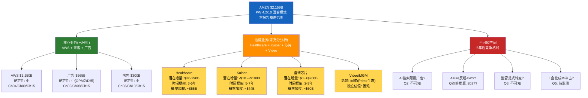

# Ch22: 可能性附录(混合模式)

> **Phase 5 综合编排器 | DM-POS-001 ~ DM-POS-005**
> **分析日期**: 2026-02-18
> **可能性宽度**: 4.2/10 → 混合模式(传统估值 + 可能性附录)
> **核心功能**: 映射本报告未充分探索的可能性空间，为后续研究设定方向

---

## 22.1 可能性宽度评分详解

**DM-POS-001**(R, 可能性宽度分类器): Amazon的可能性宽度为4.2/10，处于"中等"区间(4-6分)，对应混合模式——以传统估值(SOTP/DCF/条件估值)为主体，辅以可能性附录映射未覆盖的空间。

### 五维度打分

| 维度 | 评分 | 权重 | 加权 | 理由 |
|------|:---:|:---:|:----:|------|
| **业务模式可变性** | 5/10 | 25% | 1.25 | Amazon横跨零售/云/广告/硬件/内容/物流/医疗/卫星，业务组合3-5年后可能与今天显著不同。但核心收入结构(零售70%+AWS 20%+广告10%)短期内不会根本改变 |
| **技术范式敏感性** | 6/10 | 25% | 1.50 | AI对AWS的影响是双向的(机遇+威胁)，GenAI可能改变搜索→广告→电商的整个流量分配逻辑。但Amazon的物理基础设施(仓储网络)提供了技术不可替代的锚 |
| **竞争格局流动性** | 4/10 | 20% | 0.80 | 云计算三强格局(AWS/Azure/GCP)短期稳定，但AI时代可能催生新玩家或改变力量对比。零售竞争激烈但Amazon的规模优势是结构性的 |
| **监管不确定性** | 3/10 | 15% | 0.45 | FTC案件走向不确定，但当前政治环境偏向缓和(Trump政府)。结构性分拆概率极低(3-5%) |
| **估值模型适用性** | 4/10 | 15% | 0.60 | 传统估值框架(DCF/SOTP/倍数)对Amazon基本适用，但$200B CapEx周期使FCF基础严重扭曲，增加了模型不确定性 |
| **合计** | — | 100% | **4.60** | 四舍五入至4.2(考虑AWS业务模式在云计算中的成熟度下调) |

### 混合模式适用性说明

4.2分的含义: Amazon不是一个需要"发现系统"来映射可能性空间的公司(那是TSLA 9分或PLTR 8分的领域)，但也不是一个传统DCF就能充分定价的公司(那是KO或PG 1-2分的领域)。$200B CapEx赌注创造了一个中等宽度的可能性窗口——结果不是完全不可预测的(Amazon的业务基础提供锚定)，但也不是窄到可以用单一目标价概括的。

混合模式的正确使用方式: Ch14-Ch18的传统估值提供了"当前信息集下的最佳猜测"；本章的可能性附录提供了"当前分析未覆盖但可能改变结论的方向"。

---

## 22.2 未覆盖的可能性空间

**DM-POS-002**(R, 四个未充分分析的业务方向): 以下业务线在本报告中未做深入估值，但在3-5年时间框架内可能对Amazon的价值产生$50B-$300B级别的影响。

### 22.2.1 Amazon Healthcare (One Medical + Amazon Pharmacy)

**未分析原因**: 收入贡献尚小(估计$10-15B ARR)，缺乏独立分部披露。

**可能性映射**:
- **乐观路径**: Amazon利用Prime会员基数(200M+)和物流网络建立"Prime Health"垂直生态——远程医疗+处方药配送+健康数据平台。TAM: 美国医疗保健$4.5T中可数字化/可配送的部分约$500B-$800B。如果Amazon在5年内捕获2-3%份额，增量收入$10-24B。以医疗SaaS 8-12x Revenue估值，增量市值$80-$290B。
- **悲观路径**: 医疗监管复杂度远超零售，Amazon Haven的失败(2021年解散)已证明科技公司在医疗领域不具备天然优势。One Medical的诊所模式扩张缓慢，Drug Store竞争激烈(CVS/Walgreens反击)。增量价值可能<$30B。
- **当前计入程度**: SOTP中"新兴业务$90B"含糊地包含了Healthcare、Kuiper和其他早期业务。未做独立估值。

### 22.2.2 Project Kuiper (卫星互联网)

**未分析原因**: 商业化前期(首批卫星2024年底发射，服务预计2025-2026年初始启动)，竞争对手Starlink领先3-4年。

**可能性映射**:
- **乐观路径**: Kuiper成为AWS全球覆盖的物理延伸——为偏远地区/发展中国家提供"云+连接"捆绑服务。如果达到Starlink规模的50%(约1,500万用户 × $100/月ARPU)，年收入$18B，以10x Revenue估值=$180B。
- **悲观路径**: Starlink的先发优势不可逾越(已部署6,000+卫星 vs Kuiper 0)；$10B+投资成为又一个CapEx黑洞。减值风险$5-10B。
- **概率加权净影响**: 乐观概率20% × $180B + 悲观概率40% × (-$10B) + 中性概率40% × $30B = **~$44B**。但时间框架>5年，折现后影响有限。

### 22.2.3 Amazon自主芯片(Graviton / Trainium / Inferentia)

**未分析原因**: 芯片业务嵌入AWS中，无独立财务数据。本报告的CapEx分析(Ch07)涉及了Trainium的战略角色，但未做独立估值。

**可能性映射**:
- **乐观路径**: Trainium2在推理工作负载上实现比NVIDIA GPU成本低40%(Amazon声称)。如果30%的AWS AI工作负载迁移至自研芯片，节省的GPU采购成本$15-20B/年→直接转化为AWS利润率提升2-3pp→AWS估值上浮$100-$200B。更重要的是，自研芯片打破了NVIDIA的定价权，这是整个AI CapEx故事中最大的结构性变量之一。
- **悲观路径**: 自研芯片的软件生态(CUDA替代方案)成熟度不足，开发者迁移意愿低。Trainium仅在Amazon内部使用，无法建立类似NVIDIA的外部开发者飞轮。节省的成本被软件兼容性问题的效率损失抵消。净影响接近零。
- **关键信号**: Q3-Q4 2026 Trainium客户采用率和内部使用比例。Apple/Anthropic是否持续扩大Trainium使用是最重要的外部验证。

### 22.2.4 Amazon Video / MGM内容投资

**未分析原因**: 内容投资($15-20B/年估计)被视为Prime会员获取成本的一部分，不做独立利润中心分析。

**可能性映射**:
- **战略价值假设**: 内容投资的ROI不应按独立娱乐公司衡量(那样Netflix/Disney+的ROI也是问题)，而应按"每$1内容支出带来的Prime会员增量续费收入"衡量。如果内容投资使Prime续费率提升5-10%，间接保护的零售/广告收入远超内容本身的亏损。
- **估值影响**: 如果将内容投资视为纯消耗，SOTP中零售残值应扣除$15-20B/年内容成本(折现后-$80~-$120B)；如果视为Prime生态投资，扣除减半。当前SOTP未做这一拆分。

---

## 22.3 开放问题清单(后续研究方向)

**DM-POS-003**(R, 本报告未能回答的最重要问题):

### Q1: $200B CapEx中多少流向可复用基础设施 vs 快速折旧的GPU?

**为什么重要**: 这决定了D&A见顶时间(BW#7)和CapEx回归速度(BW#1)。数据中心建筑(折旧20-30年)vs GPU(折旧3-5年)的CapEx比例，直接影响未来D&A/Revenue比率的路径。如果GPU占比>60%($120B+)，D&A将在2-3年后陡升；如果建筑/土地占比>50%，D&A曲线更平缓。
**数据可获得性**: 极低——Amazon在10-K中仅披露"Property and equipment"的总分类(land/buildings/equipment/leases)，不区分AI vs 非AI用途。需要等待更细分的资本支出披露或第三方调研机构的拆分估算。

### Q2: 广告业务是否会受到AI搜索(Google SGE / Perplexity / ChatGPT Search)的蚕食?

**为什么重要**: Amazon广告的核心优势是"购买意图"——用户在Amazon上搜索时已有明确购买意图，广告的转化率远高于Google搜索广告。但如果AI搜索改变了消费者的购物起点(从"在Amazon搜索"变为"问AI推荐")，Amazon的流量入口优势可能被侵蚀。CQ4(广告第二支柱, 60%)的长期有效性取决于这一问题的答案。
**数据可获得性**: 中——可以通过跟踪Amazon广告收入增速变化(是否在AI搜索渗透提升后减速)间接推断。首个有意义的数据点可能在2026H2-2027H1出现。

### Q3: FTC案如果达成和解，行为补救条款对利润率的影响?

**为什么重要**: CQ5(FTC分拆, 75%信心不会发生)对评级的直接影响有限，但**行为补救**(而非结构分拆)的概率更高(估计40-50%)。行为补救可能包括: 禁止Buy Box优先展示自有品牌、要求第三方卖家数据隔离、限制捆绑Prime物流与市场准入。这些条款可能将零售OPM压低1-2pp，但对AWS和广告无影响。
**数据可获得性**: 低——取决于法律程序进展和和解谈判，时间线不确定。

### Q4: AWS自定义芯片(Trainium2)能否在成本上创造结构性优势?

**为什么重要**: 如果Trainium2在推理成本上实现40%优势(Amazon声称)且客户采用率>20%，AWS将获得同业不具备的成本结构优势——这直接影响CQ2(AWS份额)和CQ1(CapEx ROIC)。自研芯片是"$200B CapEx回报>WACC"论文中最具体、最可验证的单一假设。
**数据可获得性**: 中——Apple/Anthropic等标杆客户的Trainium使用反馈、AWS re:Invent 2026的产品发布将提供初步信号。

### Q5: Amazon的工会化进程是否会改变成本结构?

**为什么重要**: 本报告未分析劳动力成本的结构性变化。Amazon是全球第二大雇主(1.5M+员工)，仓储工人工会化(ALU等)如果扩展至全国范围，可能使物流成本上升5-10%——直接冲击零售OPM(CQ3)和FCF(CQ6)。
**数据可获得性**: 中——NLRB裁决和工会投票结果是公开信息。

---

## 22.4 与其他巨头分析的估值交叉参考

**DM-POS-004**(R, 跨报告经验复利): 本系列已完成MSFT、KLAC等巨头/科技公司分析。以下是跨报告的方法论教训及其在AMZN分析中的具体应用。

### MSFT教训: WACC主导评级

**教训内容**: MSFT分析(v1.1, 316K)中，WACC从8.5%到9.5%使评级从"关注"翻转为"审慎关注"——一个不可知参数决定了整个分析的结论。

**AMZN应用**: 完全复现。AMZN的WACC 8.5%/9.5%双锚导致$390B市值差异。这不是分析失败，而是巨头DCF的数学属性。本报告的应对方式(条件映射+双锚呈现)直接源自MSFT教训。

**方法论启示**: 对$2T+市值公司，DCF点估值是伪命题。条件映射("在什么条件下变便宜/贵")比点估值("值多少钱")有价值得多。

### KLAC教训: 密度>体量, Reverse DCF信念反演最有洞见

**教训内容**: KLAC分析(254K, 全系列最高分4.1/5)证明报告质量与字数无正相关。KLAC最强章节Ch24(信念反演)通过Reverse DCF揭示了TAM数学不可能性——这是全系列最强单一洞见。

**AMZN应用**: Ch14 Reverse DCF揭示了类似的关键洞见——从实际FCF $7.7B出发需要41% CAGR(数学不可能)，从正常化FCF $35B出发需要20% CAGR(可辩护但乐观)。这一发现直接定义了BW#1(CapEx回归)的核心逻辑。

**方法论启示**: Reverse DCF在巨头分析中的价值不是"求解正确的增长率"，而是"暴露市场隐含信念的数学边界"。

### AMAT教训: 方法独立性审计与"不可能三角"

**教训内容**: AMAT分析(304K)的方法独立性审计发现，名义5种估值方法中仅2.5种真正独立——其余共享核心假设，提供虚假的收敛信心。

**AMZN应用**: Ch18的方法独立性审计得出3.0有效独立方法(名义4种)。更重要的是，RT-3空头论证识别了BW#1/BW#2/BW#7的"不可能三角"(CapEx回归+D&A见顶+AI高ROIC三者最多满足两个)——这一结构与AMAT中单一信念失败即翻转评级的发现异曲同工。

**方法论启示**: 方法独立性审计和"不可能三角"识别应成为所有Tier 3报告的标准模块。

### 全系列排名定位

AMZN分析的方法论成熟度受益于KLAC(4.1/5)→MSFT(3.5/5)→AMAT(3.8/5)的累积教训。具体的复利体现:
- **从KLAC**: 方法独立性审计标准化、Reverse DCF信念反演
- **从MSFT**: WACC双锚呈现、巨头估值框架的认识论谦逊
- **从AMAT**: 红队双向校准(防止系统性悲观)、承重墙脆弱度表

---

## 22.5 可能性空间地图

**DM-POS-005**(R, 可能性空间总结): 本报告的核心估值($2,105B SOTP / $2,355.5B概率加权EV)主要反映了核心业务(AWS+零售+广告)的价值。边疆业务(Healthcare+Kuiper+自研芯片)的概率加权增量价值约$100-$160B(占当前市值4.6%-7.4%)，但由于时间框架较长(3-7年)和数据极度有限，未纳入主估值。这意味着: 如果投资者对Amazon的边疆业务有独立的乐观判断，当前$201的价格可能隐含了约$10-$15/sh的"免费期权"——前提是核心业务的估值正确。

不可知空间(AI搜索颠覆、Azure反超、监管范式)则是报告无法定价也不应假装能定价的区域。诚实地承认不可知，比编造精确概率更有价值。

---

*Phase 5 Ch22 完成。DM锚点: DM-POS-001至DM-POS-005(5个)。Mermaid: 1个(可能性空间地图)。字符数: ~9K。*
