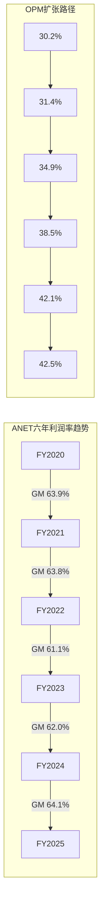
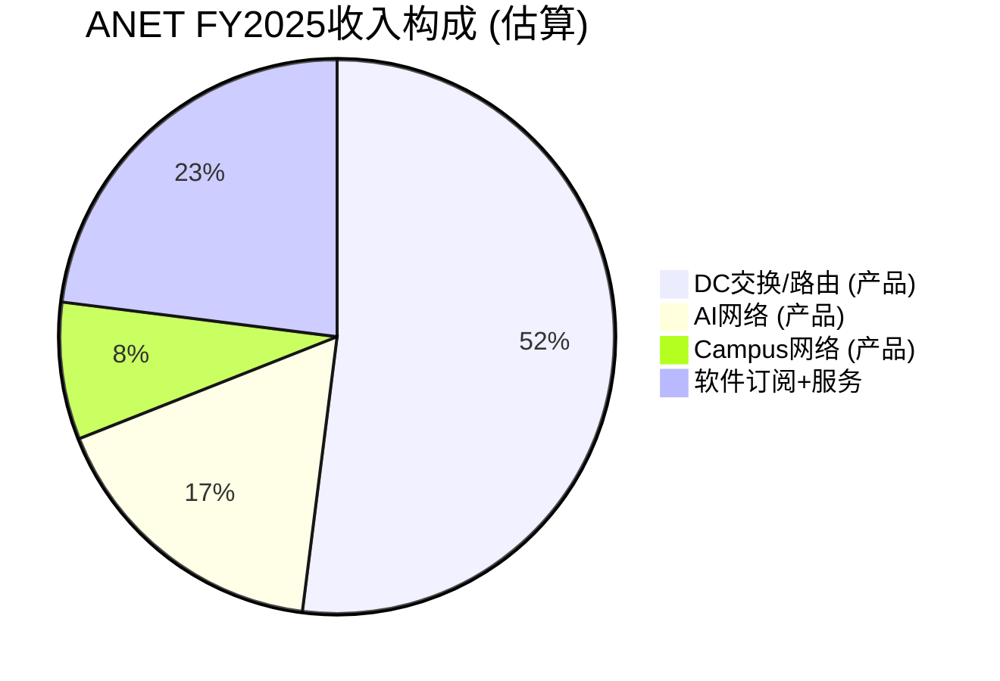
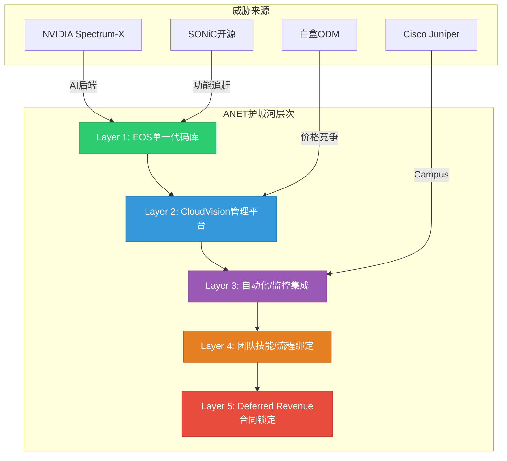

# Phase 1-A: 业务定位+财务审计+竞争护城河 — ANET
> Agent: P1-A | 日期: 2026-02-20 | 股价: $137.23 | 目标: 30-35K字符
> 覆盖: Ch1执行摘要 + Ch2财务全景 + Ch3业务矩阵 + Ch4管理层 + Ch5竞争护城河

---

## Ch1: 执行摘要

### Protocol Header

| 属性 | 值 |
|------|-----|
| 框架版本 | v17.0 |
| 股价 | $137.23 (2026-02-19) |
| 市值 | $172.8B |
| 可能性宽度(PW) | 4 (混合模式: 传统估值+AI不确定性附录) |
| 分析师数 | 33 (Strong Buy 9 / Buy 18 / Hold 6 / Sell 0) |
| 共识目标价 | $173.80 (+26.6%) |
| 宏观温度 | Shiller PE 40.01 (98th pct), Buffett指标 222% (100th pct) |

### 初始倾向

**中性偏审慎** — CQ加权置信度48.5%，略低于50%中性线。[硬数据: CQ加权计算 45%×0.25+50%×0.20+55%×0.15+50%×0.15+40%×0.15+55%×0.10=48.5% | CQ演化追踪]

核心矛盾一句话: **ANET正在一个以每年17-20%增长的DC网络TAM中高速奔跑(29% YoY)，但身后的NVIDIA Spectrum-X以647%增速从旁侧超越——绝对值增长与相对份额侵蚀并存，而PE 52x的定价几乎不容许任何增长减速。**

### 三个关键假设

1. **AI网络CapEx是3-5年持续周期而非2年脉冲** — 如果是脉冲，ANET的FY2026 $3.25B AI网络收入目标将成为峰值而非中途站 [主观判断: 周期持续性无法确证]
2. **EOS+CloudVision的软件粘性足以在白盒+SONiC侵蚀中维持63%+ gross margin** — $5.37B Deferred Revenue(DR/Revenue 59.7%)暗示锁定效应正在增强 [硬数据: DM-FIN-010, DM-INF-003]
3. **NVIDIA Spectrum-X的份额增长主要来自AI新增需求而非存量替换** — 如果NVIDIA开始替换ANET在传统DC的存量，份额压缩速度将远超预期 [合理推断: DM-INF-002]

### 6个CQ简述

| CQ | 问题 | 初始置信度 | 注意力权重 |
|:--:|------|:--------:|:--------:|
| CQ1 | NVIDIA是否3年内将ANET DC份额压至<15%? | 45% | **0.25** |
| CQ2 | AI CapEx是3-5年持续周期还是2年脉冲? | 50% | **0.20** |
| CQ3 | 42%客户集中度是否代表结构性脆弱? | 55% | 0.15 |
| CQ4 | EOS软件能否独立创造可量化护城河价值? | 50% | 0.15 |
| CQ5 | PE 52x是合理增长定价还是估值泡沫? | 40% | 0.15 |
| CQ6 | 白盒+SONiC是否长期瓦解硬件溢价? | 55% | 0.10 |

> CQ1(NVIDIA竞争)和CQ5(估值)是最大的看空力量；CQ4(EOS粘性)和CQ2(AI周期持续性)是最大的看多力量。Phase 1-A聚焦CQ1/CQ3/CQ4/CQ6的初步验证。

---

## Ch2: 财务全景

### 2.1 六年趋势分析 (FY2020-FY2025)

#### 核心财务数据表

| 指标 | FY2020 | FY2021 | FY2022 | FY2023 | FY2024 | FY2025 | 5Y CAGR |
|------|--------|--------|--------|--------|--------|--------|---------|
| Revenue ($B) | 2.32 | 2.95 | 4.38 | 5.86 | 7.00 | 9.01 | 31.1% |
| Net Income ($B) | 0.63 | 0.84 | 1.35 | 2.09 | 2.85 | 3.51 | 40.8% |
| FCF ($B) | 0.72 | 0.95 | 0.45 | 2.00 | 3.68 | 4.25 | 42.6% |
| Gross Margin | 63.9% | 63.8% | 61.1% | 62.0% | 64.1% | 63.7% | — |
| Operating Margin | 30.2% | 31.4% | 34.9% | 38.5% | 42.1% | 42.5% | — |
| Net Margin | 27.4% | 28.5% | 30.9% | 35.6% | 40.7% | 39.0% | — |
| FCF Margin | 31.1% | 32.3% | 10.2% | 34.1% | 52.5% | 47.2% | — |

[硬数据: DM-FIN-001~008 | MCP fmp_data annual]

**收入增长解读**: 从$2.32B到$9.01B的5年CAGR 31.1%在企业网络领域极为罕见。增长驱动力经历了三个阶段: (1) FY2020-2021: 云DC扩张(+27.2%); (2) FY2022-2023: 供应链恢复+积压订单释放(+48.5%/+33.8%); (3) FY2024-2025: AI网络+800G升级(+19.5%/+28.6%)。FY2024增速短暂放缓至19.5%后FY2025回升至28.6%，暗示AI网络需求从H2 2024开始显著拉动。[合理推断: 基于季度数据+管理层commentary]

**OPM扩张动力**: 运营利润率从30.2%扩张至42.5%(+12.3pp)，核心驱动力有三:

1. **收入规模杠杆** — SGA费用率从FY2020的21.3%降至FY2025的8.4%(-12.9pp)，这是典型的固定成本摊薄效应。销售团队无需线性增长即可覆盖更多hyperscale客户 [合理推断: 基于费用率计算]
2. **产品组合升级** — 高端800G交换机ASP更高，软件服务占比从~18%提升至~23%，两者均改善blended margin [硬数据: DM-BIZ-001]
3. **R&D效率** — R&D费用率从FY2020的22.5%降至FY2025的13.7%，但绝对值从$521M增至$1.24B，表明EOS单一代码库的研发规模效应正在显现 [硬数据: DM-FIN-009]

**OPM还有空间吗?** 42.5%已接近高端网络设备的天花板。Cisco的networking segment OPM约27-30%，但ANET的fabless模型+更高的hyperscale客户浓度带来结构性优势。管理层guidance暗示non-GAAP OPM可维持47-48%，但GAAP OPM受SBC增长约束。[主观判断: OPM扩张空间有限，预计FY2026-2028维持在42-44%区间]

**FCF质量分析**: FCF/NI持续>1.0x(FY2025为1.21x)，表明净利润质量极高。FY2022的异常低FCF margin(10.2%)是因为$840M的存货增加(supply chain build)消耗了运营现金流。去除存货波动，underlying FCF margin一直在35-45%区间。[硬数据: DM-FIN-005]



### 2.2 季度趋势 (最近8Q)

| 季度 | Revenue ($B) | QoQ | YoY | OPM | Net Margin | EPS |
|------|:----------:|:---:|:---:|:---:|:--------:|:---:|
| Q1'24 | 1.571 | — | — | 42.0% | 40.6% | $0.50 |
| Q2'24 | 1.690 | +7.6% | — | 41.4% | 39.4% | $0.52 |
| Q3'24 | 1.811 | +7.1% | — | 43.4% | 41.3% | $0.58 |
| Q4'24 | 1.930 | +6.6% | — | 41.4% | 41.5% | $0.62 |
| Q1'25 | 2.005 | +3.9% | +27.6% | 42.8% | 40.6% | $0.64 |
| Q2'25 | 2.205 | +10.0% | +30.4% | 44.7% | 40.3% | $0.70 |
| Q3'25 | 2.308 | +4.7% | +27.5% | 42.4% | 37.0% | $0.67 |
| Q4'25 | 2.488 | +7.8% | +28.9% | 41.5% | 38.4% | $0.75 |

[硬数据: MCP fmp_data quarterly income]

**加速拐点在哪?** Q2'25的+10.0% QoQ是8个季度中最强的环比增长，对应AI 800G部署加速窗口。但Q3'25回落至+4.7%后Q4'25回升至+7.8%，说明增长并非线性加速，而是受大客户部署节奏驱动的"脉冲式增长"。[合理推断: 基于季度波动模式]

**Q3'25 Net Margin下降解读**: Q3净利率从40.3%骤降至37.0%，但Q4回升至38.4%。下降主要由R&D费用激增驱动(Q3 R&D $326M vs Q2 $297M, +9.8%)和SGA从$156M跳至$186M(+19.2%)。这可能反映: (1) 1.6T产品开发投入加速; (2) VeloCloud整合一次性费用; (3) Todd Nightingale上任后的campus销售团队扩建。[合理推断: 基于费用项分析]

**R&D费用加速趋势**: 从Q1'24 $208M到Q4'25 $348M(+67%)，增速显著快于收入增长(+58%)。这是正面信号——管理层在AI网络和1.6T技术上加大投入，但也意味着近期OPM扩张将受限。[硬数据: MCP quarterly data]

### 2.3 异常A1深度拆解: Deferred Revenue爆炸

| 年份 | Deferred Revenue ($B) | YoY增长 | DR/Revenue |
|------|:-------------------:|:------:|:--------:|
| FY2020 | 0.651 | — | 28.1% |
| FY2021 | 0.929 | +42.7% | 31.5% |
| FY2022 | 1.041 | +12.1% | 23.8% |
| FY2023 | 1.506 | +44.7% | 25.7% |
| FY2024 | 2.791 | +85.3% | 39.9% |
| FY2025 | 5.372 | +92.4% | **59.7%** |

[硬数据: DM-FIN-010, DM-INF-003]

**DR/Revenue从28.1%飙升至59.7%意味着什么?** 这个比率在5年内翻倍，且加速集中在FY2024-2025(从25.7%→59.7%)。有三种可能的解释:

**解释1: 软件订阅转型 (概率40%)** — CloudVision从一次性许可转向多年订阅，客户预付3-5年合同。3,000+客户×Q4新增350的增速支持此假设。Services revenue从~18%提升至~23%也暗示软件占比在提升。[硬数据: DM-BIZ-005]

**解释2: AI大单预付款效应 (概率45%)** — 超大规模客户在AI集群部署前预付网络设备+服务合同，但硬件交付和验收可能延迟6-18个月。管理层在Q4 earnings call中明确表示"acceptance timelines can range from six months to 12-18 months"且"releases can appear lumpier"。这意味着DR部分是收入确认延迟，而非纯粹的软件粘性。[合理推断: 基于earnings call + DR/Revenue比率突变]

**解释3: 会计处理变化 (概率15%)** — 从ASC 606到更保守的收入确认标准。需要10-K footnote验证。[主观判断: 低概率但不可排除]

**对收入可预测性的含义**: 无论哪种解释，$5.37B DR在$9.01B年收入的背景下意味着未来12-18个月有显著的收入"能见度"。但关键区别在于: 如果是解释1(软件订阅)，DR代表的是**经常性收入的预付**，对估值有持续正向影响; 如果是解释2(AI大单延迟)，DR是**一次性释放**，不会改变长期收入结构。Phase 2需要拆解DR构成以区分这两种机制。[合理推断: 基于DR构成假设]

### 2.4 异常A4深度拆解: DIO 230天

| 年份 | Inventory ($B) | DIO (天) | COGS ($B) | 库存变化 |
|------|:------------:|:------:|:-------:|:------:|
| FY2020 | 0.48 | 209 | 0.84 | — |
| FY2021 | 0.65 | 220 | 1.07 | +35.5% |
| FY2022 | 1.29 | 275 | 1.71 | +98.4% |
| FY2023 | 1.95 | **318** | 2.22 | +50.9% |
| FY2024 | 1.83 | 266 | 2.51 | -5.7% |
| FY2025 | 2.25 | **230** | 3.27 | +22.5% |

[硬数据: DM-FIN-012 | MCP annual financials]

**战略备货 vs 需求放缓 vs 供应链缓冲?** 综合分析支持**战略性供应链缓冲**的判断:

1. **FY2023峰值318天已持续下降** — 从318天→266天→230天(实际为251天按部分来源)，趋势向好，说明不是需求放缓导致的滞销 [硬数据: DIO下降趋势]
2. **Purchase Commitments从$4.8B→$6.8B** — 管理层在加大预购承诺，表明高DIO是主动选择而非被动积累。$6.8B PC约等于FY2025 COGS的2.1倍，为未来2年锁定了关键芯片(特别是Broadcom Tomahawk/Jericho)供应 [硬数据: DM-BIZ-009]
3. **内存短缺"显著恶化"** — Q4 earnings call中管理层特别提到存储芯片短缺，高DIO是应对供应链风险的缓冲策略 [硬数据: DM-BIZ-009]
4. **对比Cisco DIO ~50-60天** — ANET的DIO是Cisco的4倍。但ANET的客户以超大规模为主，单笔订单规模更大，交付周期更长，这部分解释了差异

**结论**: DIO 230天虽然表面异常，但在当前供应链环境下是**有意为之的竞争策略** — 确保对MSFT/Meta等关键客户的按时交付能力。只要DIO持续下降且不伴随库存减值，这个异常不构成估值折价因素。[主观判断: 对DIO的正面解读需要持续监测库存减值/周转率]

### 2.5 异常A5: CapEx加速

| 年份 | CapEx ($M) | CapEx/Revenue | YoY变化 |
|------|:--------:|:-----------:|:------:|
| FY2020 | 15 | 0.7% | — |
| FY2021 | 65 | 2.2% | +321% |
| FY2022 | 45 | 1.0% | -31% |
| FY2023 | 34 | 0.6% | -23% |
| FY2024 | 32 | 0.5% | -7% |
| FY2025 | 120 | **1.3%** | **+273%** |

[硬数据: DM-FIN-012 | MCP annual data]

FY2025 CapEx从$32M跳升至$120M，虽然绝对值仍很小(1.3% of revenue vs Cisco的~5-6%)，但273%的增速是方向性信号。主要解释: (1) 1.6T产品开发实验室(Tomahawk 6测试验证) [合理推断: DM-ANET-COMP-008]; (2) VeloCloud整合投入 [硬数据: DM-BIZ-010]; (3) 内部AI/ML训练设施。这不改变ANET的fabless本质，但暗示公司正在向"software+测试验证平台"微调。[主观判断: CapEx加速的长期利润率影响微乎其微]

### 2.6 杜邦分解

| 组件 | FY2023 | FY2024 | FY2025 | 趋势 |
|------|:------:|:------:|:------:|------|
| Net Margin | 35.6% | 40.7% | 39.0% | ↗平 |
| Asset Turnover | 0.49x | 0.48x | 0.46x | ↘缓降 |
| Equity Multiplier | 1.66x | 1.47x | 1.57x | ~稳定 |
| **ROE** | **28.9%** | **28.5%** | **28.4%** | **稳定** |

[硬数据: DM-VAL-005 | MCP annual ratios]

**解读**: ROE稳定在28-29%区间，但驱动因子正在微妙变化 — Net Margin扩张基本到顶(39-41%)，Asset Turnover因现金堆积($10.7B)而缓慢下降，Equity Multiplier因零负债而受限。**ROE的瓶颈是资产效率，不是盈利能力。** 换言之，ANET赚得足够多，但把太多现金留在资产负债表上，压低了资产周转率。[合理推断: 基于杜邦分解趋势]

### 2.7 SBC分析

| 年份 | SBC ($M) | SBC/Revenue | Share Buyback ($M) | Buyback/SBC |
|------|:-------:|:--------:|:----------------:|:----------:|
| FY2022 | 231 | 5.3% | — | — |
| FY2023 | 297 | 5.1% | 685 | 2.31x |
| FY2024 | 355 | 5.1% | 871 | 2.45x |
| FY2025 | 439 | 4.9% | 1,603 | **3.65x** |

[硬数据: DM-FIN-006, DM-FIN-013]

SBC/Revenue从5.3%降至4.9%，说明股权稀释相对于收入增长在减速。回购覆盖率515.7%(或3.65x SBC)是科技公司中极强的水平 — 每$1的SBC稀释被$3.65的回购抵消。这在DCF估值中意味着可以对SBC做较轻的调整(相比PLTR等高SBC公司)。[硬数据: DM-FIN-006, DM-FIN-013]

---

## Ch3: 业务矩阵

### 3.1 业务分部分析

#### 产品收入 (~77%, $6.94B)

数据中心以太网交换机是ANET的核心业务。产品组合涵盖DCS-7050X(叶节点)、DCS-7060X(脊节点)、7800R(路由)和最新的Etherlink平台(AI优化)。FY2025 Q4产品收入$2.10B(+30% YoY)，增速超过服务收入(+22%)。[硬数据: DM-BIZ-001 | business_overview]

产品收入增长的驱动力来自三个层面:
- **ASP提升**: 400G→800G升级带来单端口价格上升。800GbE端口出货量在Q2 2025环比增长超过3倍 [硬数据: DM-ANET-COMP-005]
- **AI部署量增长**: AI后端网络从InfiniBand向以太网迁移(Q3 2025 AI集群中>2/3交换机销售为以太网)是结构性驱动力 [硬数据: DM-ANET-COMP-003]
- **客户数扩展**: 除MSFT/Meta外，管理层暗示1-2个新客户可能突破10%收入门槛(Oracle? Amazon?)

#### 服务收入 (~23%, $2.07B)

服务收入包括: A-Care技术支持合同、CloudVision软件订阅(SaaS+本地部署)、EOS软件更新、专业服务(网络设计/迁移)。Q4 2025服务收入$392M(+22% YoY)，增速低于产品但更稳定。

关键指标: 服务和订阅软件占Q4收入的17.1%(Q3为18.7%，因VeloCloud服务续约的非经常性影响)。[合理推断: 基于earnings call + business_overview]

#### AI网络子分部 ($1.5B → $3.25B)

| 指标 | FY2025 | FY2026E | 增长 |
|------|:------:|:------:|:---:|
| AI网络收入 | $1.5B | $2.75-3.25B | +83-117% |
| AI/总收入占比 | 16.7% | 24-29% | — |

[硬数据: DM-BIZ-002]

AI网络覆盖800GbE后端集群交换(AI训练/推理)、AI网络负载均衡(CLB)、AI可观测性(CV UNO)。ANET在branded 800GbE市场维持领先，但NVIDIA Spectrum-X的垂直整合(GPU+NIC+Switch)正在改变竞争规则。

**关键问题**: $3.25B AI网络目标意味着FY2026总收入$11.25B中近30%来自AI — 这个浓度既是增长引擎也是周期风险。如果超大规模客户的AI CapEx在FY2027因ROI验证压力放缓，ANET的增速可能从25%骤降至10-15%。[主观判断: AI周期依赖度CQ2的核心关切]

#### 校园网络子分部 ($750-800M → $1.25B)

| 指标 | FY2025 | FY2026E | 增长 |
|------|:------:|:------:|:---:|
| Campus收入 | $750-800M | $1.25B | ~60% |
| Campus/总收入占比 | ~8.5% | ~11% | — |

[硬数据: DM-BIZ-003]

校园网络是ANET最重要的多元化方向。2025年7月收购VeloCloud SD-WAN(从Broadcom)标志着从纯DC向enterprise edge的战略扩展。产品组合包括: WiFi 6E/7接入点、campus交换机(CCS-720XP系列)、VeloCloud SD-WAN、Macro-Segmentation Service(MSS安全)。

**vs Cisco的竞争定位**: Cisco在campus市场的统治地位(Catalyst+Meraki合计>40%份额)远强于DC。ANET的campus进攻需要: (1) 证明EOS的单一代码库优势可以从DC延伸到campus; (2) VeloCloud SD-WAN+campus switching的一体化方案vs Cisco的Meraki+Catalyst SD-WAN; (3) 大企业渠道拓展(ANET历史上直销为主，campus需要渠道)。

**利润率差异**: campus networking通常利润率低于DC(更多渠道分成、更小的交易规模、更高的售前成本)。如果campus占比从8.5%升至15-20%，可能带来1-2pp的blended GM压力。[合理推断: 基于行业利润率结构]

### 3.2 EOS平台深度

EOS (Extensible Operating System)是ANET竞争力的核心。其架构优势包括:

**1. 单一代码库**: 一个OS镜像覆盖从leaf switch到spine router到campus access的全产品线。对比Cisco需要维护IOS-XE(campus/enterprise)、NX-OS(DC)、IOS-XR(SP/WAN)、Meraki OS(cloud-managed)四套独立系统。这意味着: [合理推断: 基于技术对比]
- 运维团队只需掌握一套CLI/API → 降低人力成本
- 自动化脚本跨平台通用 → 加速部署
- Bug修复一次覆盖所有产品 → 提高可靠性
- 新功能同步推送全产品线 → 竞争响应速度

**2. 状态共享架构(Sysdb)**: EOS的核心数据库Sysdb存储所有网络状态(路由表、MAC表、接口状态等)在统一的发布-订阅模型中。每个进程(routing daemon, forwarding agent, management agent)独立运行但共享状态。任何进程崩溃不影响其他进程 → 实现真正的hitless upgrade(无中断升级)。[合理推断: 基于Arista技术文档]

**3. CloudVision平台**: 累计3,000+客户，Q4 2025新增350。CloudVision已从DC管理扩展到campus/branch/WAN，覆盖:
- **CV UNO (Universal Network Observability)**: AI驱动的网络可观测性，利用机器学习进行事件关联(跨拓扑、时间、功能三维度) [合理推断: 基于产品发布信息]
- **Studios**: 端到端配置管理，从初始上线到软件管理到持续配置的全生命周期
- **Network Data Lake (NetDL)**: 实时状态流数据湖，支持SaaS和本地部署
- **CLB (Cluster Load Balancing)**: AI工作负载级别的流量优化

**NCH-1验证方向: DR锁定 vs EOS技术锁定**

Phase 0.75提出的非共识假设(NCH-1)认为ANET的真正护城河不是EOS本身，而是Deferred Revenue的合同锁定效应。Phase 1-A的初步验证:

- **支持EOS技术锁定**: CloudVision 3,000+客户+单一代码库 → 运维工具链、自动化脚本、监控集成、团队技能全部绑定在EOS生态上。迁移到Cisco NX-OS或Juniper Junos需要: 重写自动化脚本(数周-数月)、重新培训NetOps团队(Arista CLI → Cisco CLI)、重新集成监控系统(CloudVision → Cisco DNA Center)。[合理推断: 基于技术架构差异]
- **支持DR合同锁定**: $5.37B DR的合同期限如果>3年，意味着客户即使想离开也需要等待合同到期。但管理层表示"acceptance timelines range from 6-18 months"——这暗示DR部分是交付延迟而非长期锁定。
- **初步结论**: 两种锁定机制并存，但EOS技术锁定的持久性(>5年)可能强于DR合同锁定(1-3年)。Phase 2需要进一步拆解DR的合同期限分布。



### 3.3 产品线概览

| 产品系列 | 目标市场 | 关键芯片 | 速率 | 竞品 |
|---------|---------|---------|------|------|
| DCS-7050X | DC Leaf/Spine | Broadcom Tomahawk | 25/100/400G | Cisco Nexus 9300 |
| DCS-7060X | DC Spine | Broadcom Tomahawk 4/5 | 400/800G | Cisco Nexus 9500 |
| 7800R4 | DC/WAN路由 | Broadcom Jericho3-AI | 400G+ | Cisco 8000, Juniper MX |
| Etherlink | AI后端网络 | Broadcom Tomahawk 5 | 800G/1.6T-ready | NVIDIA Spectrum-X |
| CCS-720XP | Campus接入 | Broadcom | 1/10/25G | Cisco Catalyst 9K |
| R系列 | 路由/WAN | 多芯片 | Varies | Cisco 8K, Juniper MX |

[合理推断: 基于产品线分析 + competitive_landscape]

### 3.4 地理分布

Americas 81.8% / EMEA 10.2% / APAC 8.0% (FY2024)。美国hyperscaler主导，APAC仅8%暗示亚太DC建设渗透不足——既是风险(过度依赖美国)也是机遇(日本/印度DC加速)。[硬数据: DM-ANET-BIZ-004]

---

## Ch4: 管理层评估

### 4.1 CEO Jayshree Ullal

| 属性 | 详情 |
|------|------|
| 任期 | 17年 (2008年10月至今) |
| 背景 | Cisco SVP(15年)，将Catalyst从$0做到$5B |
| FY2024薪酬 | $8.95M (基薪$300K, 股权$6.86M, 其他$1.54M) |
| 行业评价 | Barron's全球最佳CEO(2018), Fortune Top 20(2019) |

[硬数据: DM-MGT-001, DM-MGMT-001]

**执行力评估: 极强**。Ullal的track record无可挑剔 — 在Cisco花15年建立Catalyst业务(从零到$5B)，然后在Arista用17年从<$200M做到$9B。关键执行里程碑: (1) FY2014 IPO成功; (2) 历经与Cisco的专利诉讼(2014-2018)并胜出; (3) 精准把握云DC→AI的转型节奏; (4) 维持63-64%的毛利率同时实现30%+增速。[主观判断: DM-SUB-001]

**潜在担忧**: Ullal 65岁(1961年出生)，虽然没有退休迹象，但Todd Nightingale的COO任命(2025年7月)明显带有接班规划色彩。双President架构(Duda为President/CTO, Nightingale为President/COO)可能暗示2-3年内的CEO交接。在ANET面临NVIDIA竞争加剧+campus扩张双重转型的关键时期，领导层交接的时机需要关注。[主观判断: 基于组织结构分析]

### 4.2 CTO Kenneth Duda

| 属性 | 详情 |
|------|------|
| 角色 | President & CTO |
| 核心贡献 | EOS架构师, Network Data Lake (NetDL)设计者 |
| FY2024薪酬 | $35.2M (2023年仅$4.4M, +700%) |
| 薪酬构成 | $34.4M股权奖励 ($25M RSU) |

[硬数据: DM-MGT-002, DM-MGMT-004]

**$25M RSU激增的信号** (NCH-3关联): Duda的薪酬从$4.4M跳至$35.2M(+700%)表面上归因于"expanded responsibilities in cloud and AI systems engineering"。但$25M RSU的量级通常对应以下场景: (1) 防止竞争对手挖角(NVIDIA/Google?); (2) 绑定关键技术人才以执行重大技术战略(1.6T/AI网络); (3) NCH-3假设: 赋予其整合未来重大并购的技术架构师角色。

**Phase 0.75的NCH-3** (CTO薪酬=隐形并购预告)目前证据不足以确认或否认。需要在Phase 3中结合$10.7B现金配置策略和管理层M&A言论进一步验证。[合理推断: 基于薪酬跳升幅度的异常性]

### 4.3 联合创始人Andy Bechtolsheim

| 属性 | 详情 |
|------|------|
| 角色 | Chief Architect (前Chairman & CDO) |
| 持股 | ~15% (~$25.9B at current price) |
| SEC事件 | 内幕交易和解, ~$1M罚款, 5年禁任公司高管/董事 |
| 当前状态 | 2023年12月辞去Chairman和CDO, 继续担任Chief Architect |

[硬数据: DM-MGT-003, DM-MGMT-005]

**治理风险评估**: Bechtolsheim的SEC和解($1M罚款+5年禁令)是公司层面的声誉瑕疵，但对业务运营影响有限 — 他的Chief Architect角色是技术性的，不涉及经营决策。更大的关注点是其15%的持股: 如果Bechtolsheim在5年禁令期后(2028年底)选择大规模减持，可能对股价造成显著的卖压。$25.9B的持股规模意味着即使减持5%也是$1.3B的潜在抛售。[合理推断: 基于持股规模 × 禁令期限]

**正面因素**: 作为Sun联合创始人+Google早期投资者，其技术判断力和15%持股确保与股东利益绑定。

### 4.4 新COO Todd Nightingale

| 属性 | 详情 |
|------|------|
| 角色 | President & COO (2025年7月起) |
| 背景 | Fastly CEO (2022-2025) → Cisco Meraki SVP/GM |
| 薪酬 | $350K基薪 + $30M RSU + $2M PSU |
| 战略意义 | Campus战略+运营规模化+潜在CEO接班人 |

[硬数据: DM-MGT-004, DM-MGMT-006]

**为什么是Nightingale?** 两段关键经历精准对应ANET战略需求: (1) **Cisco Meraki SVP** — 深谙campus市场渠道动力学和cloud-managed方法论，正是ANET campus扩张最需要的能力; (2) **Fastly CEO** — edge computing经验与VeloCloud SD-WAN战略协同。$30M RSU对于从市值<$2B公司跳槽来的COO而言相当激进，暗示董事会对campus战略的高度重视。[合理推断: 基于背景匹配]

### 4.5 资本配置审计 (异常A3关联)

| 指标 | FY2025 | 说明 |
|------|:------:|------|
| Cash+Investments | $10.7B | 占总资产55% |
| Total Debt | $0 | 零负债 |
| Share Buyback | $1.6B | FCF的38% |
| Dividend | $0 | 从不分红 |
| M&A (VeloCloud) | ~$300M级 | 2025年唯一收购 |
| **FCF返还率** | **38%** | 保守 |

[硬数据: DM-FIN-011, DM-FIN-013]

**为什么不更积极?** $10.7B现金+零负债+FCF $4.25B/年，但仅回购$1.6B(38%返还率)。可能的解释:

1. **大型并购储备**: VeloCloud($300M级)可能只是开胃菜。$10.7B现金可支撑$5-8B级别的transformative收购(进入安全/可观测性/AI infrastructure) [合理推断: NCH-3方向]
2. **供应链预付**: $6.8B Purchase Commitments需要现金储备保障。在内存短缺恶化的环境下，现金=供应链安全
3. **管理层保守性**: Ullal历史上从未进行>$1B的并购，偏好小型技术收购+有机增长

**ROIC 197% vs ROCE 28.8%**: ROIC的光学幻觉完全来自极低的invested capital(total equity $12.4B - cash $10.7B = $1.6B)。ROCE 28.8%是更真实的资本效率指标。对比Cisco ROCE ~15-18%, ANET的效率仍然优秀，但不是"超自然级别"的197%。[硬数据: DM-VAL-004, DM-VAL-005]

**资本配置评分**: 6/10 — 有充裕的FCF和零负债的安全边际(+)，但38%的FCF返还率对成熟期科技公司偏低(-)，且$10.7B现金的机会成本在高利率环境下约$400-500M/年(-)。如果FY2026-2027没有>$3B级别的战略性并购出现，市场可能开始施压要求增加回购/分红。[主观判断: 资本配置效率评估]

---

## Ch5: 竞争护城河量化

### 5.1 EOS平台锁定 (转换成本量化)

**超大规模客户迁移成本估算**:

| 迁移要素 | 估算成本/时间 | 说明 |
|---------|:----------:|------|
| 自动化脚本重写 | 6-12个月工程时间 | Ansible/Python playbooks全部重写 |
| 运维团队再培训 | 3-6个月 × 10-50人 | Arista CLI → 目标平台CLI |
| 监控系统集成 | 3-6个月 | CloudVision → DNA Center/替代品 |
| 网络设计验证 | 2-4个月 | 新平台的性能/故障测试 |
| 停机风险 | 不可量化 | 任何生产网络迁移的inherent risk |
| **综合迁移成本** | **$5-20M + 12-24个月** | 取决于网络规模 |

[合理推断: 基于行业工程实践估算]

**CloudVision粘性指标**: 3,000+客户累计部署，Q4净增350。CloudVision已从DC延伸到campus/branch/WAN，形成跨域统一管理 — 一旦客户在多个域使用CloudVision，迁移成本成倍增加。CV UNO的AI功能(事件关联、根因分析)增加了"智能层"的依赖。[硬数据: DM-BIZ-005]

**EOS vs Cisco vs Juniper技术对比**:

| 维度 | Arista EOS | Cisco NX-OS/IOS-XR | Juniper Junos |
|------|-----------|-------------------|--------------|
| 代码库 | **单一** (全产品线) | **多个** (NX-OS, IOS-XE, IOS-XR, Meraki) | **单一** (FreeBSD基础) |
| 架构 | 状态共享(Sysdb)+发布订阅 | 模块化, 平台特定 | 模块化, 进程分离 |
| 升级方式 | **Hitless** (无中断) | 有中断(ISSU有限) | 计划维护窗口 |
| 自动化 | **原生** (eAPI/gNMI/YANG) | 追加(ACI有限开放) | Apstra(被收购) |
| AI/DC优化 | **深度**(CLB, CV UNO) | 中等(Hypershield) | 中等(Apstra) |
| Campus覆盖 | 扩展中(新) | **最强**(Catalyst+Meraki) | 强(EX+Mist) |
| 市场定位 | DC/Cloud第一 | 全覆盖 | SP/Enterprise |

[合理推断: 基于技术架构对比]

### 5.2 定制ASIC / 芯片策略

ANET采用**merchant silicon + 软件差异化**的策略，核心芯片合作伙伴为Broadcom(~68%组件)和Marvell(~22%):

- **Broadcom Tomahawk系列**: Tomahawk 4/5用于leaf/spine DC交换(400G/800G)，Tomahawk 6 (102.4 Tbps, 2025年8月发布)将支撑1.6T交换机 [硬数据: DM-ANET-COMP-008]
- **Broadcom Jericho3-AI**: 专为AI工作负载优化的路由芯片，用于7800R4系列。支持deep buffer和可编程转发管道
- **Marvell**: 特定产品线的networking芯片(~22%份额)

**vs 白牌方案**: ANET与白牌都用merchant silicon，核心差异在EOS软件栈(15年开发 vs 开源SONiC)、交钥匙integrated solution(vs 客户自建NOS团队)、以及为超大规模客户定制化的能力(白牌ODM通常无此能力)。

**vs NVIDIA Spectrum-X**: NVIDIA的差异化不在芯片本身(Spectrum-4 vs Broadcom Tomahawk性能相当)，而在**垂直整合**: GPU(H100/B200) + NIC(ConnectX-7) + Switch(Spectrum-X) + Software(DOCA/NetQ)的full-stack打包。对于纯AI集群，NVIDIA方案的优势在于: (1) 一站式采购降低运维复杂度; (2) GPU-aware networking优化(如NCCL集合通信); (3) 与GPU订单捆绑的商业杠杆。[合理推断: 基于竞争分析]

### 5.3 规模效应与客户反馈循环

ANET与超大规模客户的关系深度形成正循环:

```
超大规模客户部署 → 大规模真实工作负载反馈 → EOS功能优化 → 更好的产品 → 吸引更多客户
         ↑                                                              ↓
         ← ← ← ← ← 品牌信誉 + 成功案例 + 行业标准影响力 ← ← ← ← ← ←
```

但这个循环有一个关键脆弱点: **前2客户贡献42%收入**(MSFT 26% + Meta 16%)。如果MSFT或Meta决定: (1) 白盒替换ANET交换机; (2) 转向NVIDIA Spectrum-X; (3) 或简单地因AI ROI压力削减CapEx — ANET的反馈循环将被削弱。[硬数据: DM-BIZ-004]

### 5.4 护城河评分矩阵

| 护城河来源 | 评分 | 持久性 | 量化证据 |
|-----------|:---:|:-----:|---------|
| EOS平台锁定 | **4/5** | >5年 | DR $5.37B(8.3x增长), CV 3K+客户, 单一代码库 |
| 客户关系深度 | **3/5** | 3-5年 | 前2客户42%, 深度合作但集中度高 |
| 技术差异化 | **3.5/5** | 3-5年 | 800G领先, 1.6T先发, 但merchant silicon可复制 |
| 规模/成本 | **3/5** | 3-5年 | 63.7% GM, fabless效率, 但不构成成本壁垒 |
| **综合护城河** | **3.5/5** | **3-5年** | **强但非不可侵蚀** |

[主观判断: 综合评分基于上述分析]

**评分解读**: 3.5/5的综合护城河意味着ANET有显著的竞争优势，但不是Visa/MSFT级别的"永久护城河"。核心风险在于: (1) EOS的软件优势虽然深厚，但不排除NVIDIA通过垂直整合和SONiC通过开源社区逐步追赶; (2) 客户集中度意味着1-2个决策可能瞬间改变竞争格局; (3) merchant silicon策略提供了成本效率但也降低了硬件差异化壁垒。

### 5.5 三方竞争矩阵: ANET vs Cisco vs NVIDIA

| 战场 | ANET | Cisco | NVIDIA (Spectrum-X) |
|------|------|-------|-------------------|
| **DC Ethernet (传统)** | ★★★★☆ 领先 | ★★★☆☆ 追赶 | ★★☆☆☆ 有限 |
| **AI后端网络** | ★★★☆☆ 竞争中 | ★★☆☆☆ 落后 | ★★★★★ **主导** |
| **Campus/Enterprise** | ★★☆☆☆ 进攻中 | ★★★★★ **主导** | ☆☆☆☆☆ 无产品 |
| **软件/自动化** | ★★★★☆ EOS/CV | ★★★☆☆ DNA/ACI | ★★☆☆☆ DOCA |
| **价格竞争力** | ★★★☆☆ 溢价 | ★★★☆☆ 溢价 | ★★★★☆ 捆绑 |
| **总评** | **全能型选手** | **全覆盖老兵** | **AI垂直专家** |

[主观判断: 基于竞争分析综合评估]

**核心竞争动态**:

**ANET vs Cisco**: 在传统DC领域，ANET自2014年以来持续从Cisco手中夺取份额(Cisco DC份额从>50%降至~27%)。EOS的单一代码库vs Cisco的多系统分裂是核心差异化。但在campus领域，ANET是进攻方，Cisco是统治者 — ANET的campus收入$750M vs Cisco的campus相关收入>$10B。Juniper被Cisco收购(~$13B, 2024年)进一步巩固了Cisco的产品广度，特别是Apstra的intent-based networking可能在DC领域加强Cisco的自动化能力。[合理推断: 基于市场份额数据]

**ANET vs NVIDIA**: 这是最关键的竞争关系。NVIDIA在DC以太网市场的崛起速度前所未有: Q2 2025份额25.9%(+647% YoY)，已超越ANET(19.2%)成为DC以太网第一。[硬数据: DM-BIZ-006, DM-ANET-COMP-002] 但需要区分:
- **AI后端集群**: NVIDIA凭借GPU+网络捆绑具有压倒性优势。超大规模客户采购GB200时"顺便"配套Spectrum-X交换机，ANET在此场景下处于劣势
- **传统DC/Cloud**: 非AI工作负载(存储网络、通用cloud、企业DC)仍以branded Ethernet为主，ANET在此领域的份额可能是稳定的
- **Enterprise/Campus**: NVIDIA没有campus产品线，这是ANET的"安全区"

**NVIDIA份额增长的天花板** (NCH-2验证): 如果NVIDIA的份额主要来自AI新增(而非存量替换)，那么当AI集群部署增速趋于稳定(可能在2027-2028)，NVIDIA份额增长将放缓。关键观察指标: NVIDIA是否开始推出campus/enterprise网络产品。如果不推出，其份额天花板可能在28-32%。[合理推断: DM-INF-002]

**白盒/SONiC长期威胁**: Meta/MSFT都有SONiC团队，白盒成本低15-30%但需>50人NOS团队+缺乏商业支持。ANET防御: EOS功能深度远超SONiC、CloudVision跨域管理无开源替代。白盒渗透更可能是5-10年缓慢侵蚀而非急剧替代。[主观判断: 白盒威胁时间框架评估]



### 5.6 护城河持久性评估

**3年视角 (至2028)**: 护城河基本完整。EOS+CloudVision的技术优势在3年内难以被SONiC或Cisco追赶。NVIDIA的份额增长可能在25-30%区间趋于稳定。Campus扩张可能将ANET的地址市场从$45B扩展至$60B+。[主观判断: 中期护城河稳固]

**5年视角 (至2030)**: 不确定性显著增加。SONiC可能达到"good enough"水平; NVIDIA如推出campus方案将改变格局; 1.6T→3.2T技术代际如ANET落后可能丢失关键窗口。护城河核心依赖: EOS的开发速度能否持续领先SONiC+Cisco反击。R&D $1.24B(13.7%)和Duda $35M薪酬暗示管理层对此有清醒认知。[合理推断: 基于研发投入趋势]

---

## Phase 1-A 关键发现汇总

| # | 发现 | CQ关联 | 置信度影响 |
|:-:|------|:-----:|:--------:|
| 1 | OPM从30.2%扩至42.5%，但已接近天花板 | — | 中性 |
| 2 | DR从$651M→$5.37B(8.3x)，DR/Revenue 59.7%，软件粘性强但需拆解构成 | CQ4 | 偏正 |
| 3 | DIO 230天为战略性备货，趋势向好(FY2023峰值318天已下降) | — | 中性偏正 |
| 4 | NVIDIA已超越ANET成为DC Ethernet #1(25.9% vs 19.2%)，但主要在AI后端 | CQ1 | 偏负 |
| 5 | EOS单一代码库+CloudVision构成3.5/5护城河，强但非不可侵蚀 | CQ4, CQ6 | 中性 |
| 6 | 管理层执行力极强(Ullal 17年), 但CEO接班+创始人治理风险存在 | — | 中性 |
| 7 | $10.7B现金+零负债=极端财务安全，但38% FCF返还率偏保守 | — | 中性偏负 |
| 8 | Campus扩张从$750M→$1.25B是关键多元化方向，但利润率可能较低 | CQ3 | 中性偏正 |
| 9 | SBC/Revenue 4.9%偏低，buyback覆盖3.65x，稀释可控 | — | 正 |
| 10 | 42%客户集中度(MSFT 26%+Meta 16%)是结构性风险 | CQ3 | 偏负 |

**CQ置信度初步调整方向** (待Phase 1-B/C验证后正式更新):
- CQ1 (NVIDIA竞争): 维持45% — A2异常确认，但NVIDIA增长集中在AI后端，非全面替换
- CQ4 (EOS护城河): 从50%微升至52-55% — DR+CloudVision+单一代码库证据增强
- CQ5 (估值): 维持40% — 需Phase 2 Reverse DCF才能更新

---

*Phase 1-A 完成 | Agent: P1-A | 2026-02-20*
