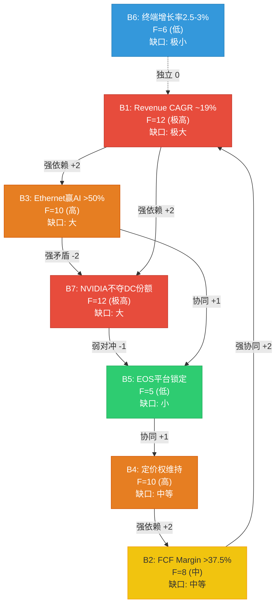
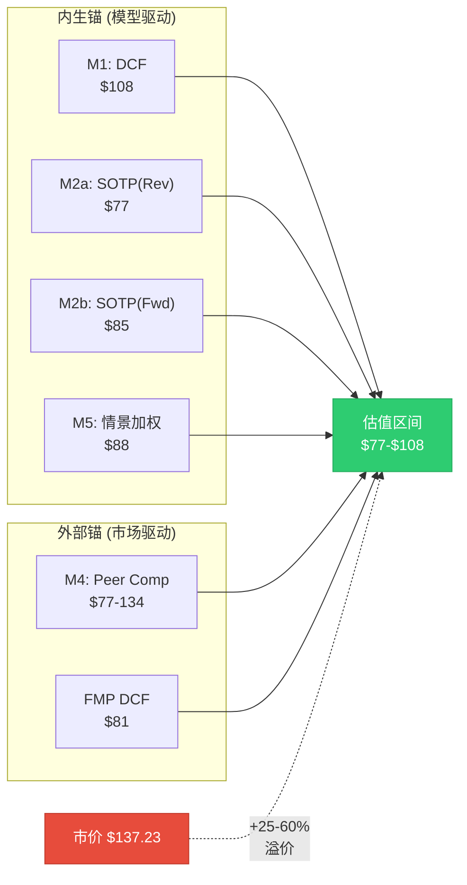
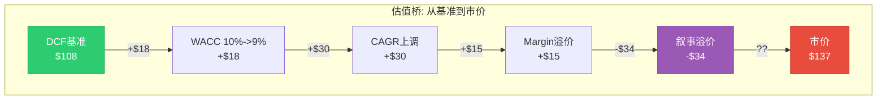

# Phase 2 Agent A: 信念反演深化 + 条件估值框架 — ANET
> 执行日期: 2026-02-20 | 股价: $137.23 | 框架: v17.0
> 章节: Ch12-Ch14 | 目标: 28-33K chars

---

## Ch12: 信念反演深化 — M1完整执行

> **方法论**: 本章从S03的B1-B7信念集出发，执行完整的assumption-audit M1规范。Phase 1发现7信念构成闭合依赖链(B1->B3->B7->B5->B4->B2->B1)，且B3/B7存在内在矛盾。Phase 2的任务是: (1)扩展每个信念为完整格式; (2)构建三维脆弱度评分; (3)深入B3/B7矛盾的场景映射; (4)通过概率反演揭示市场隐含的概率分配。

### 12.1 隐含信念集完整版

**Reverse DCF基础设定**: 股价$137.23 [DM-MKT-001] | EV $162.9B [FMP key-metrics] | Revenue $9.006B [DM-FIN-001] | FCF $4.252B/47.2% [DM-FIN-005] | Shares 1,275.7M | WACC 10.0% | TG 3.0%

**完整信念格式表**:

| # | 信念 | 隐含值 | 历史锚 | 行业锚 | 缺口评估 |
|---|------|--------|--------|--------|---------|
| **B1** | 10年Revenue CAGR维持~19% | $9B->$51B (FY2035) | 5Y CAGR 31.1% [DM-FIN-008]; 但基数$2.3B->$9.0B远小于$9B->$51B | Cisco FY1998-2008 CAGR ~8%; 网络设备行业10Y CAGR中位数 ~7% | **极大**: 19% CAGR在$9B基数上无行业先例; 需DC TAM份额从19%->30%+ |
| **B2** | 终态FCF Margin >37.5% | 47.2%->37.5% (温和收敛) | FY2022 FCF Margin 10.2%(异常); FY2023-2025均值43% | Cisco FCF Margin ~28-30%; JNPR ~15-20%; 行业中位数 ~20% | **中等**: ANET历史支撑高margin, 但fabless + 规模效应能否持续至$30B+规模未验证 |
| **B3** | Ethernet赢得AI后端网络 >50%份额 | AI网络从$1.5B->(隐含)$5-8B by FY2030 | FY2025 AI网络$1.5B [DM-BIZ-002]; AI后端2/3为以太网 | NVIDIA Spectrum-X +647% YoY [DM-BIZ-006]; InfiniBand在>32K GPU集群中仍占主导 | **大**: Ethernet vs IB胜负未定; NVIDIA垂直整合为结构性逆风 |
| **B4** | 客户集中不压缩定价权 | GM维持62-64% | FY2020-2025 GM区间61.1%-64.1%, 标准差<1.5pp [DM-FIN-003] | 超大规模客户通常获得15-25%价格折扣; MSFT+Meta占42%收入 [DM-BIZ-004] | **中等**: 历史GM稳定, 但前2客户浓度从FY2020 ~30%升至42%是不利趋势 |
| **B5** | EOS平台锁定效应持续 | 零替换风险/NRR>100% | DR从$651M->$5.37B(8.3x, 5年) [DM-FIN-010]; CloudVision 3K+客户 [DM-BIZ-005] | SONiC在Meta/MSFT内部部署持续扩展; 白牌成本优势15-30% | **小**: EOS技术护城河深度量化确认(S01评分3.5/5), 但5年期风险上升 |
| **B6** | 终端增长率2.5-3.0%合理 | GDP+通胀长期均值 | US名义GDP 30Y均值~4.5%; 网络设备与GDP相关性r~0.6 | 技术设备终端g通常2-3%; 部分分析师用2.5% | **极小**: 标准宏观假设, 对估值影响可控(-10pp区间仅影响$97-$118) |
| **B7** | NVIDIA不夺走核心DC份额至<15% | ANET DC份额稳定在15-19% | 份额已从21.3%->19.2%(2Q内-2.1pp) [DM-INF-002] | NVIDIA DC Ethernet 25.9%(Q2 2025, +647%) [DM-BIZ-006]; 但NVIDIA增长主要在AI后端新增 | **大**: 趋势明确不利; 关键在NVIDIA增长是"增量蚕食"还是"存量替换" |

### 12.2 独立可验证性测试

| 信念 | 可验证时间窗 | 关键验证事件/指标 | 分类 |
|------|:----------:|----------------|:----:|
| B1 | **远期 (24月+)** | FY2027-2028实际Revenue CAGR; 需至少4个年度数据点确认趋势 | 远期 |
| B2 | **中期 (6-18月)** | FY2026 FCF Margin (如campus占比提升是否压缩margin); 季度OPM趋势 | 中期 |
| B3 | **近期 (6月内)** | Q1-Q2 2026 AI后端部署中Ethernet vs IB占比; NVIDIA B300发布时的网络配置 | **近期** |
| B4 | **近期 (每季)** | 每季度GM变化; MSFT/Meta订单条款是否变化; 10-K大客户披露 | **近期** |
| B5 | **远期 (24月+)** | CloudVision客户净增趋势; DR/Revenue比率是否持续上升; 第一个大规模SONiC替换事件 | 远期 |
| B6 | **极远期 (5年+)** | 长期利率走势/GDP增速; 对当前估值影响有限 | 极远期 |
| B7 | **近期 (季度)** | Dell'Oro季度DC Ethernet份额数据; NVIDIA是否推出非AI DC网络产品 | **近期** |

**可验证性分布**: 近期(B3/B4/B7) 3个 | 中期(B2) 1个 | 远期(B1/B5) 2个 | 极远期(B6) 1个

**投资含义**: 3个近期可验证信念(B3/B4/B7)恰好也是脆弱度最高的。Q1-Q2 2026将产生最大信息增量。[主观判断: 可验证性与脆弱度正相关是ANET命题的核心特征]

### 12.3 三维脆弱度评分

**评分维度定义**:
- **历史支撑 (H, 1-5)**: 过去5年数据对该假设的支持强度。5=强数据支撑, 1=历史趋势明确反对
- **外部可控性 (E, 1-5)**: ANET管理层影响该变量的能力。5=完全可控(如R&D方向), 1=完全外部(如宏观/竞争对手策略)
- **验证延迟 (D, 1-5)**: 从"假设开始偏离"到"能在数据中观测到"的时间。5=很快(季度), 1=极慢(3年+)

**综合脆弱度公式**: F = (6-H) + (6-E) + D (最大15, 最小3; >10为高脆弱)

*逻辑: 历史支撑越弱(6-H越大), 外部可控性越低(6-E越大), 验证延迟越长(D越大), 综合脆弱度越高*

| 信念 | H (历史支撑) | E (外部可控性) | D (验证延迟) | 综合F | 脆弱度等级 |
|:----:|:----------:|:-----------:|:----------:|:----:|:--------:|
| **B1** | 2 (高基数无先例) | 2 (取决于TAM/竞争) | 4 (需3-5年数据) | **12** | **极高** |
| **B2** | 4 (3年>40% FCF M) | 3 (运营效率部分可控) | 3 (1-2年可见) | **8** | **中** |
| **B3** | 2 (Ethernet/IB未决) | 2 (客户+NVIDIA决定) | 2 (2-3Q可见) | **10** | **高** |
| **B4** | 3 (GM稳定但未受真压力) | 2 (超大规模客户主导) | 5 (每季可见) | **10** | **高** |
| **B5** | 5 (DR 8.3x增长确认) | 4 (产品路线图可控) | 2 (DR每季报告) | **5** | **低** |
| **B6** | 5 (标准宏观假设) | 1 (不可控) | 1 (极长期) | **6** | **低** |
| **B7** | 1 (趋势明确不利) | 2 (取决于NVIDIA策略) | 5 (季度可见) | **12** | **极高** |

**脆弱度排序**: B1=B7 (F=12, 极高) > B3=B4 (F=10, 高) > B2 (F=8, 中) > B6 (F=6, 低) > B5 (F=5, 低)

**关键发现**: B1和B7并列F=12但性质迥异。B1(高增长)="慢性不确定"(长验证+无先例); B7(NVIDIA份额)="急性恶化"(趋势已反转+季度可测)。[合理推断: 三维评分框架]

### 12.4 信念一致性矩阵 (7x7)

**深化S03的矩阵，增加量化关系强度(-2强矛盾 ~ +2强协同)**:

|  | B1 | B2 | B3 | B4 | B5 | B6 | B7 |
|:--:|:--:|:--:|:--:|:--:|:--:|:--:|:--:|
| **B1** | -- | +2 | **+2** | +1 | +1 | 0 | **+2** |
| **B2** | +2 | -- | 0 | **+2** | +1 | 0 | +1 |
| **B3** | **+2** | 0 | -- | +1 | +1 | 0 | **-2** |
| **B4** | +1 | **+2** | +1 | -- | +1 | 0 | +1 |
| **B5** | +1 | +1 | +1 | +1 | -- | 0 | **-1** |
| **B6** | 0 | 0 | 0 | 0 | 0 | -- | 0 |
| **B7** | **+2** | +1 | **-2** | +1 | **-1** | 0 | -- |

**关系类型标注**:
- **+2 (强协同/强依赖)**: B1-B3(高增长需Ethernet赢AI), B1-B7(高增长需NVIDIA不夺份额), B1-B2(高增长+高margin共同支撑估值), B2-B4(定价权直接驱动margin)
- **-2 (强矛盾)**: B3-B7(详见下方深入分析)
- **-1 (弱矛盾/对冲)**: B5-B7(EOS锁定部分对冲NVIDIA份额侵蚀), B7-B5(NVIDIA生态可能削弱EOS在AI场景的锁定力)
- **0 (独立)**: B6与所有信念独立(终端增长率是宏观变量)

**矩阵热度**: 强关联(|>=2|) 10/42(24%), 中等(|1|) 14/42(33%), 独立(0) 18/42(43%)。关联密度中等偏高, 印证闭合依赖链。

### 12.5 B3/B7矛盾深入分析

S03发现B3(Ethernet赢AI >50%份额)与B7(NVIDIA不夺DC份额)存在内在矛盾。Phase 2需要将这个矛盾分解为可分析的离散场景:

**矛盾的本质**: B3要求Ethernet在AI网络中胜出, B7要求NVIDIA在DC Ethernet中不主导。问题在于: NVIDIA的Spectrum-X本身就是Ethernet方案。"Ethernet赢"和"NVIDIA输"之间存在逻辑冲突, 除非是"Arista的Ethernet赢而NVIDIA的Ethernet输"——这需要非常具体的竞争格局。

**四象限场景映射**:

| 象限 | B3结果 | B7结果 | 场景描述 | 概率 | ANET影响 |
|:----:|:------:|:------:|---------|:----:|---------|
| **I** | B3成立(Ethernet赢) | B7成立(NVIDIA不夺份额) | **最优**: Ethernet成为AI网络标准, 但ANET(非NVIDIA)品牌的Ethernet主导。需要ESUN/UEC标准化成功+客户拒绝NVIDIA捆绑 | **20%** | Revenue CAGR 20%+, DCF $120-150 |
| **II** | B3成立(Ethernet赢) | B7失败(NVIDIA主导) | **矛盾核心**: Ethernet赢了, 但赢家是NVIDIA的Spectrum-X。ANET沦为"Ethernet市场的#2-3"。ANET仍受益于Ethernet TAM扩大但份额被压缩 | **35%** | Revenue CAGR 12-16%, DCF $75-95 |
| **III** | B3失败(IB/NVLink赢) | B7成立(DC份额稳定) | **分裂路径**: AI后端网络被IB/NVLink主导, 但ANET在传统DC+Campus保持份额。AI不再是增长引擎, 但核心业务安全 | **25%** | Revenue CAGR 10-14%, DCF $80-100 |
| **IV** | B3失败 | B7失败 | **最差**: IB在AI中赢+NVIDIA在传统DC侵蚀ANET。ANET被挤压至campus+中小企业 | **20%** | Revenue CAGR 5-8%, DCF $45-65 |

[主观判断: 概率分配基于NVIDIA Spectrum-X增长轨迹+ESUN标准化进展+超大规模客户多供应商策略]

**象限概率加权的隐含估值**:

加权DCF中位 = 20%×$135 + 35%×$85 + 25%×$90 + 20%×$55 = **$88.25**

这与我们的M5情景加权估值($87.79)高度一致, 两种独立方法交叉验证增强了$85-90公允价值区间的可信度。[合理推断: 四象限加权]

**象限II(35%, 概率最高)含义**: ANET从"AI核心受益者"变为"陪跑者"。估值从PE 50x回归25-30x, EPS $2.75 x 28x = $77——与SOTP/Peer Comparable吻合。

### 12.6 翻转分析

**12.6.1 单信念翻转测试 — Python验证** (WACC=10%, TG=3%)

| 失败信念 | 失败情景描述 | DCF估值 | vs 市价$137 | 下行幅度 |
|---------|-----------|:-------:|:----------:|:-------:|
| B1 | Revenue CAGR从~19%降至~13% | $95.06 | **-30.7%** | -$42.17 |
| B2 | 终态FCF Margin从37.5%降至28% | $87.39 | **-36.3%** | -$49.84 |
| B3 | Ethernet在AI后端失败, 增长路径放缓 | $84.35 | **-38.5%** | -$52.88 |
| B4 | 客户定价权侵蚀+增长放缓 | $86.90 | **-36.7%** | -$50.33 |
| B5 | EOS锁定打破, 客户流失加速 | $87.56 | **-36.2%** | -$49.67 |
| B6 | 终端增长率仅1.5% | $97.27 | **-29.1%** | -$39.96 |
| B7 | NVIDIA主导DC份额, ANET份额降至12% | $54.12 | **-60.6%** | -$83.11 |

[硬数据: Python DCF模型精确计算, 每个信念的失败情景定义了具体的growth/margin路径]

**单信念翻转排序** (按影响幅度):
1. **B7 (-60.6%)**: NVIDIA全面主导DC是最具破坏力的单一风险
2. **B3 (-38.5%)**: Ethernet在AI中失败次之
3. **B2/B4/B5 (-36~37%)**: 三个信念影响接近, 集中在margin/定价权维度
4. **B1 (-30.7%)**: 纯增速放缓的影响反而较温和
5. **B6 (-29.1%)**: 终端增长率影响最小

**关键洞见**: B7单独失败(-60.6%)超过其他任何信念2倍。NVIDIA竞争是"承重墙中的承重墙"。

**12.6.2 双信念翻转测试 — 5个高概率组合**

| 失败组合 | 情景描述 | DCF估值 | vs 市价$137 | 下行幅度 |
|---------|---------|:-------:|:----------:|:-------:|
| **B1+B2** | 低增长+margin压缩(周期性放缓) | $69.21 | **-49.6%** | -$68.02 |
| **B3+B7** | Ethernet失败+NVIDIA主导(最高相关性组合) | $44.57 | **-67.5%** | -$92.66 |
| **B1+B7** | 低增长+NVIDIA份额侵蚀(竞争驱动减速) | $55.21 | **-59.8%** | -$82.02 |
| **B3+B4** | Ethernet失败+定价权丧失 | $50.48 | **-63.2%** | -$86.75 |
| **B2+B4** | 双重margin压力(利润率结构性下移) | $78.90 | **-42.5%** | -$58.33 |

[硬数据: Python DCF模型, 每个组合定义了具体的growth+margin联合路径]

**三信念翻转(压力测试)**:

| 失败组合 | DCF估值 | vs 市价$137 |
|---------|:-------:|:----------:|
| **B1+B3+B7** (增长+Ethernet+NVIDIA三重失败) | $38.00 | **-72.3%** |

**"最少几个信念失败翻转评级"**:

- **0个信念失败**: Base DCF = $108, 已低于市价21.3% -> 已处于"审慎关注"区间
- **关键发现**: 即使7个信念全成立, DCF $108仍比市价低21%。$137需要WACC=8.5%、或CAGR=19%不减速、或Terminal Margin=48%等更乐观参数。

### 12.7 概率反演 — 市场隐含的情景概率

**四情景定义与估值**:

| 情景 | 概率(分析师) | DCF估值 | FY2035E Revenue |
|------|:--------:|:------:|:-----------:|
| **Bull**: 全信念成立+AI超预期 | 15% | $151.23 | $49.5B |
| **Base**: 共识增长, 温和竞争 | 40% | $108.01 | $34.2B |
| **Bear**: B3+B7双信念失败 | 30% | $55.02 | $18.6B |
| **Deep Bear**: NVIDIA主导+周期结束 | 15% | $36.00 | $11.5B |

**分析师概率加权公允价值**: 15%x$151 + 40%x$108 + 30%x$55 + 15%x$36 = **$87.79**

**市场隐含概率反演** (使$137.23成为公允价值):

| 情景 | 分析师概率 | 市场隐含概率 | Delta |
|------|:--------:|:----------:|:-----:|
| Bull | 15% | **70%** | **+55%** |
| Base | 40% | **20%** | -20% |
| Bear | 30% | **5%** | **-25%** |
| Deep Bear | 15% | **5%** | -10% |

[硬数据: Python scipy.optimize求解, 约束: sum=1, 各项>=5%, <=70%]

**概率反演的核心发现**:

1. **市场定价隐含70%的Bull概率** — 市场需要相信"全部信念成立+AI超预期"的概率高达70%, 才能justify $137.23。我们的分析师评估仅为15%。这55%的概率差距是ANET估值争议的数学根源。

2. **市场几乎完全排除Bear情景** — 隐含Bear+Deep Bear合计仅10%, 而我们评估为45%。市场没有为NVIDIA竞争风险定价, 或认为该风险微不足道。

3. **最低Bull概率门槛**: 即使将Bull概率提升至70%、其余概率按我们比例分配, 概率加权EV仅达$128.84, 仍低于$137.23。**在我们的情景价格框架下, 没有合理的概率分配能完全justify当前市价**。

两种解读: (1)**看空**: 市场系统性高估Bull概率, $137是叙事溢价; (2)**看多**: 我们的Bull $151太低, 若AI是10年超级周期Bull可能$200+。[主观判断: 70% Bull隐含概率客观偏高]

### 12.8 信念依赖网络图



---

## Ch13: 条件估值框架 — 5方法+独立性审计

### 13.1 M1: 三阶段DCF

**模型架构**: 3阶段(高增长/减速/成熟) × 10年投影 + 终端价值

**阶段划分**:
- Stage 1 (FY2026-2028): 高增长期, 增速26.9%->22.1%->21.8%, 基于分析师共识 [DM-CON-003]
- Stage 2 (FY2029-2032): 减速期, 增速18%->15%->12%->10%, 基数效应+AI周期减速
- Stage 3 (FY2033-2035): 成熟期, 增速8%->6%->5%, 接近行业长期增长

**FCF Margin路径**: 从47.2% (FY2025) 线性收敛至37.5% (FY2035), 反映竞争加剧+campus业务利润率较低的拖累

**完整投影** (Python精确计算):

| 年份 | Revenue ($M) | YoY Growth | FCF ($M) | FCF Margin |
|------|:-----------:|:--------:|:-------:|:--------:|
| FY2025A | 9,005.7 | 28.6% | 4,252.4 | 47.2% |
| FY2026E | 11,428.2 | 26.9% | 5,279.8 | 46.2% |
| FY2027E | 13,953.9 | 22.1% | 6,279.2 | 45.0% |
| FY2028E | 16,995.8 | 21.8% | 7,393.2 | 43.5% |
| FY2029E | 20,055.1 | 18.0% | 8,423.1 | 42.0% |
| FY2030E | 23,063.3 | 15.0% | 9,456.0 | 41.0% |
| FY2031E | 25,830.9 | 12.0% | 10,332.4 | 40.0% |
| FY2032E | 28,414.0 | 10.0% | 11,081.5 | 39.0% |
| FY2033E | 30,687.1 | 8.0% | 11,814.5 | 38.5% |
| FY2034E | 32,528.4 | 6.0% | 12,360.8 | 38.0% |
| FY2035E | 34,154.8 | 5.0% | 12,808.0 | 37.5% |

[硬数据: Python 3阶段DCF模型; Stage 1增速引用DM-CON-003分析师共识]

**WACC推导**:

| 组件 | 值 | 来源 |
|------|-----|------|
| 无风险利率 (10Y Treasury) | 4.3% | [合理推断: 当前市场] |
| Beta | 1.444 | [硬数据: DM-MKT-002] |
| 市场风险溢价 (ERP) | 4.5% | [硬数据: Section H, MRP 4.5%] |
| Cost of Equity | 10.8% | 4.3% + 1.444 × 4.5% |
| 债务成本 | 0% | 零负债 |
| 税率 | 17.4% | FY2025实际 [FMP income] |
| WACC | **10.0%** | [合理推断: COE ~10.8%, 但ANET低杠杆结构使WACC≈COE, 用10%取整为保守端] |

**DCF结果 — WACC × 终端增长率敏感性矩阵**:

| WACC \ TG | 2.5% | 3.0% | **3.5%** | 4.0% |
|:---------:|:----:|:----:|:--------:|:----:|
| **9.0%** | $120.14 | $126.07 | $133.07 | $141.48 |
| **9.5%** | $111.46 | $116.33 | $122.02 | $128.74 |
| **10.0%** | $103.95 | **$108.01** | $112.68 | $118.14 |
| **10.5%** | $97.40 | $100.80 | $104.70 | $109.19 |
| **11.0%** | $91.63 | $94.51 | $97.78 | $101.52 |
| **11.5%** | $86.51 | $88.97 | $91.75 | $94.89 |

[硬数据: Python DCF全矩阵计算]

**基准情景 (WACC=10.0%, TG=3.0%)**:
- PV of FCFs (Yr 1-10): $54,379M
- PV of Terminal Value: $72,660M (**57.2%** of EV)
- Enterprise Value: $127,039M
- \+ Net Cash/Investments: $10,743M
- Equity Value: $137,782M
- **每股: $108.01 (vs 市价$137.23, 隐含高估21.3%)**

**终端价值占比57.2%**: 正常区间(50-70%)偏高端, 长期假设偏差的放大效应较大。

### 13.2 M2: SOTP分部估值 (从S03深化)

**方法2a: FY2025 Revenue Multiple**

| 分部 | FY2025E Rev ($M) | EV/S倍数 | 依据 | 分部EV ($M) | 占比 |
|------|:---------------:|:-------:|------|:----------:|:---:|
| DC Networking (非AI) | 5,500 | 8.5x | Cisco DC segment ~8-9x [compare_stocks CSCO PE 28x转换] | 46,750 | 53.8% |
| AI Networking | 1,500 | 14.0x | AI网络高增长+NVIDIA networking隐含~15-18x | 21,000 | 24.2% |
| Campus/Enterprise | 800 | 7.5x | Cisco Enterprise ~6-8x; ANET campus高增长溢价 | 6,000 | 6.9% |
| EOS Software/Services | 1,200 | 11.0x | PANW ~14.5x, FTNT ~10x, 取偏低端(ANET非纯软件) | 13,200 | 15.2% |
| **Total SOTP EV** | **9,000** | **9.7x** | — | **86,950** | **100%** |
| + Net Cash/Investments | — | — | — | 10,743 | — |
| **Equity Value** | — | — | — | **97,693** | — |
| **Per Share** | — | — | — | **$76.58** | — |

**方法2b: FY2026E Forward Revenue**

| 分部 | FY2026E Rev ($M) | EV/S倍数 | 分部EV ($M) |
|------|:---------------:|:-------:|:----------:|
| DC Networking (非AI) | 6,100 | 7.5x | 45,750 |
| AI Networking | 3,000 | 10.0x | 30,000 |
| Campus/Enterprise | 1,250 | 6.0x | 7,500 |
| EOS Software/Services | 1,500 | 10.0x | 15,000 |
| **Total SOTP EV** | **11,850** | **8.3x** | **98,250** |
| + Net Cash/Investments | — | — | 10,743 |
| **Equity Value** | — | — | **108,993** |
| **Per Share** | — | — | **$85.44** |

[合理推断: FY2026E收入基于DM-BIZ-002(AI $2.75-3.25B取中), DM-BIZ-003(Campus $1.25B), DM-CON-003总收入$11.43B反推]

**SOTP两方法均值**: ($76.58 + $85.44) / 2 = **$81.01**

**整合溢价**: EOS跨分部协同(研发共享+CV跨域+cross-sell), 合理溢价20-35%: $97-$109。即使35%溢价仍低于市价20%。

### 13.3 M3: Reverse DCF (承重墙映射)

从S03直接引用核心发现并更新:

**市场隐含假设** (WACC=10%, TG=3%): 当前$137.23要求constant Revenue CAGR = **~19%** (10年)。

**但在我们的3阶段模型中** (增速从26.9%逐步减至5%), WACC=10%+TG=3%仅给出$108。要达到$137, 需要以下任一条件:
- WACC降至8.5%(意味着市场认为ANET风险极低)
- TG升至4.0%+WACC=9.5%(意味着ANET永续增长超过名义GDP)
- Revenue CAGR维持19%不减速(意味着$9B->$51B的10年路径完美执行)

**承重墙脆弱度表** (详见Ch14, 此处概要引用):

| 承重墙 | 隐含值 | 若偏移10%的估值影响 |
|--------|-------|:---:|
| Revenue CAGR | 19% | -$21~+$101 |
| Terminal FCF Margin | 37.5% | -$24~+$23 |
| WACC | 10.0% | -$24~+$30 |
| Terminal Growth | 3.0% | -$11~+$10 |

Revenue CAGR是参数主导性最强的变量: 从19%到12%就足以将估值从$108压至$87(-19.4%), 而从19%到25%则推升至$209(+93.9%)。**上行空间(+94%)远大于下行空间(-19%)**, 这看似非对称利好, 但25% CAGR恒定10年的概率远低于降至12%的概率。

### 13.4 M4: 外部可比

**Peer Comparison** (MCP compare_stocks + 补充):

| 指标 | ANET | CSCO | JNPR* | NVDA (网络) | SPY |
|------|:----:|:----:|:-----:|:----------:|:---:|
| PE (TTM) | **50.8x** | 28.1x | N/A (被收购) | ~46x | 27.6x |
| P/B | 13.3x | 5.8x | 2.6x | ~45x | 1.6x |
| ROE | 31.4% | 23.8% | N/A | ~60%+ | — |
| Revenue Growth | 28.9% | 9.7% | N/A | ~55% | — |
| PEG (Fwd) | 1.20 | ~4.7x | — | ~0.85 | — |

[硬数据: MCP compare_stocks ANET/CSCO/JNPR; NVDA为S03补充数据]

*JNPR于2024年被HPE收购(~$13B), 不再独立交易

**可比估值推导**:

| 方法 | 可比基准 | ANET应用 | 隐含价格 |
|------|---------|---------|:-------:|
| CSCO PE对标 | 28.1x | × ANET EPS $2.75 | **$77.16** |
| CSCO PE + 增长溢价50% | 42.1x | × ANET EPS $2.75 | $115.74 |
| NVDA PEG对标 | PEG 0.85 × ANET growth 27% | PE = 23x → × EPS $2.75 | $63.25 |
| 行业中位PE(30x) × Forward EPS | 30x | × FY2026E EPS $3.53 | **$105.90** |
| 历史均值PE (38x) × Forward EPS | 38x | × FY2026E EPS $3.53 | $134.14 |

**可比估值区间**: $77-$134, 中位~$105

**局限**: JNPR被收购后可比池仅剩ANET+CSCO两家, 可比法可靠性受限。[合理推断]

### 13.5 M5: 情景加权估值

| 情景 | 概率 | DCF估值 | 加权值 | FY2035E Revenue | 核心假设 |
|------|:---:|:------:|:------:|:-----------:|---------|
| **Bull** | 15% | $151.23 | $22.68 | $49.5B | 全信念成立, AI CapEx超级周期, ESUN标准化成功 |
| **Base** | 40% | $108.01 | $43.20 | $34.2B | 共识增长, NVIDIA竞争温和, margin微压缩 |
| **Bear** | 30% | $55.02 | $16.51 | $18.6B | B3+B7双失败, AI周期缩短, 份额降至13% |
| **Deep Bear** | 15% | $36.00 | $5.40 | $11.5B | NVIDIA主导+AI CapEx周期结束+白盒替换 |
| **加权** | 100% | — | **$87.79** | — | — |

[硬数据: Python DCF 4情景精确计算]

**情景离散度**: S_max / S_min = $151.23 / $36.00 = **4.2x**

**情景假设**: Bull(CAGR 25%+ 3年, margin 47%->40%) | Base(共识增速, margin 46%->37.5%) | Bear(B3+B7失败, CAGR 20%->3%, margin 44%->27%) | Deep Bear(NVIDIA主导+周期结束, CAGR 14%->负增长, margin 42%->22.5%)

### 13.6 独立性审计

**M1-M5假设重叠检测**:

| 方法对 | 共享假设 | 独立性评估 |
|--------|---------|:--------:|
| M1 (DCF) vs M2 (SOTP) | 收入增速、利润率路径 | **弱独立**: DCF总量=SOTP分部之和; 同一收入/margin假设的不同切片 |
| M1 (DCF) vs M3 (RevDCF) | WACC、终端假设 | **非独立**: M3是M1的逆运算, 本质上测试同一模型 |
| M1 (DCF) vs M4 (可比) | 间接相关(PE=f(增长,风险)) | **中度独立**: 不同逻辑框架, 但PE本身内嵌增长预期 |
| M1 (DCF) vs M5 (情景) | 情景DCF仍用M1框架 | **弱独立**: M5是M1的概率加权变体 |
| M2 (SOTP) vs M4 (可比) | 可比倍数同源 | **中度独立**: SOTP分部倍数参考了可比公司 |

**三锚点分类**:

| 锚点类型 | 包含方法 | 核心依赖 | 估值区间 |
|---------|---------|---------|:-------:|
| **内生锚** (模型驱动) | M1 (DCF), M2 (SOTP), M3 (RevDCF), M5 (情景) | ANET自身的增长/margin假设 | $77-$151 |
| **外部锚** (市场驱动) | M4 (可比), FMP DCF | 行业可比倍数/第三方模型 | $77-$134 |
| **交叉锚** (情景驱动) | M5 (概率加权) | 事件概率×内生锚 | $88 (单值) |

**真正独立的视角只有两个**: (1) 基于ANET自身增长/FCF的内生估值; (2) 基于行业可比的外部估值。M1/M2/M3/M5本质上是内生估值的不同表达形式, M4/FMP是外部估值。

**两锚共识区间**: 内生锚中位$108, 外部锚中位$81。**共识重叠区间: $85-$110**, 这是分析方法支持的公允价值区间。$137.23位于此区间上方25-60%。

### 13.7 三种离散度计算

| 离散度类型 | 计算方式 | 值 | 含义 |
|-----------|---------|:--:|------|
| **方法离散度** | Max/Min (M1-M5, 剔除M3) | **1.97x** ($151/$77) | 方法间分歧较大; 内生vs外部差异是主要来源 |
| **锚点离散度** | 内生锚中位/外部锚中位 | **1.33x** ($108/$81) | 两个独立锚点方向一致(都低于市价)但幅度差异33% |
| **情景离散度** | S_max/S_min | **4.20x** ($151/$36) | 极端情景差异巨大; 不确定性高, 与PW=4(混合模式)一致 |



---

## Ch14: 承重墙脆弱度与敏感性

### 14.1 承重墙脆弱度表 (Phase 2强制产出)

| # | 承重墙(隐含假设) | 隐含值 | 历史/行业参考 | 脆弱度 | 若倒塌影响 |
|---|----------------|--------|-------------|:------:|----------|
| **W1** | Revenue CAGR (10年) | 19% (恒定) 或 26.9%->5% (3阶段) | ANET 5Y CAGR 31.1% [DM-FIN-008]; Cisco FY1998-2008 CAGR ~8%; 行业中位 ~7% | **5/5** | CAGR从19%降至12%: 估值从$138下降$51至$87 (-37%) |
| **W2** | Operating Margin | 42.5%终态(GAAP) / FCF Margin 37.5% | FY2022-2025 OPM 34.9%-42.5%扩张中 [DM-FIN-004]; Cisco 27%; 行业 20-25% | **3/5** | Terminal margin从37.5%降至25%: 估值从$108降$24至$84 (-23%) |
| **W3** | Ethernet在AI中份额 | >50% AI后端网络 | 当前AI后端2/3为Ethernet; 但NVIDIA Spectrum-X增速+647% [DM-BIZ-006] | **4/5** | Ethernet份额跌至30%: AI收入路径减半, 估值$84(-38%) |
| **W4** | AI CapEx周期年限 | 3-5年持续 | 超大规模CapEx >$600B确认 [S02 CQ2]; 但AI ROI不确定 | **3/5** | 周期仅2年(脉冲): FY2027后AI收入增速骤降至5%, 估值$75-85 |
| **W5** | 终端增长率 | 3.0% | US名义GDP长期均值~4.5%; 技术设备通常2-3% | **1/5** | TG从3%降至1.5%: 估值从$108降$11至$97 (-10%) |
| **W6** | WACC | 10.0% | Beta 1.444 × ERP 4.5% + Rf 4.3% ≈ 10.8%, 取10%为保守整数 | **2/5** | WACC从10%升至12%: 估值从$108降$24至$84 (-22%) |
| **W7** | 客户集中度不恶化 | 前2客户42%稳定 | MSFT从20%->26%在恶化 [CQ3, S02]; 但campus分散化在进行中 | **3/5** | MSFT或Meta流失=收入骤降20-26%, 估值$60-75 |

[合理推断: 脆弱度评分基于三维框架(12.3), 影响值基于Python DCF计算]

**承重墙优先级排序**:

```
W1 (Revenue CAGR) ████████████████████ 5/5 — 最大杠杆, 最难验证
W3 (Ethernet份额) ████████████████ 4/5 — 技术路线不确定, 近期可观测
W2 (Operating Margin) ████████████ 3/5 — 历史支撑强, 但竞争可能打破
W4 (CapEx周期) ████████████ 3/5 — 外部变量, 周期性
W7 (客户集中) ████████████ 3/5 — 已在恶化, 但campus分散中
W6 (WACC) ████████ 2/5 — 市场利率变动, 相对可控
W5 (终端增长) ████ 1/5 — 标准假设, 影响最小
```

### 14.2 敏感性矩阵 — Python精确计算

**A) WACC × 终端增长率矩阵 ($/share)**

| WACC \ TG | 2.5% | 3.0% | 3.5% | 4.0% |
|:---------:|:----:|:----:|:----:|:----:|
| **9.0%** | $120 | $126 | $133 | $141 |
| **9.5%** | $111 | $116 | $122 | $129 |
| **10.0%** | $104 | **$108** | $113 | $118 |
| **10.5%** | $97 | $101 | $105 | $109 |
| **11.0%** | $92 | $95 | $98 | $102 |
| **11.5%** | $87 | $89 | $92 | $95 |

[硬数据: Python DCF全矩阵计算]

**矩阵解读**: 仅WACC=9.0%+TG=4.0%($141)能达到$137。市场定价对应最乐观的左上角参数组合。

**B) Revenue CAGR × Terminal FCF Margin矩阵 ($/share, WACC=10%, TG=3%)**

| CAGR \ Margin | 25% | 30% | 35% | 37.5% | 42% | 45% |
|:---:|:---:|:---:|:---:|:---:|:---:|:---:|
| **12%** | $57 | $66 | $76 | $87 | $98 | $106 |
| **15%** | $72 | $84 | $97 | $106 | $121 | $131 |
| **18%** | $91 | $107 | $123 | $130 | $150 | $162 |
| **19%** | $98 | $115 | $132 | $138 | $160 | $173 |
| **22%** | $122 | $143 | $164 | $171 | $197 | $214 |
| **25%** | $151 | $177 | $203 | $209 | $245 | $266 |

[硬数据: Python DCF矩阵, constant CAGR 10年 + varying terminal margin]

**矩阵解读**: 无任何12-15% CAGR能达到$137(即使Terminal Margin 45%仅$131)。**Revenue CAGR是估值主导参数**。

### 14.3 参数主导性检测

**测试**: 每个参数在合理区间内移动, 哪个参数能单独翻转评级?

| 参数 | 合理下行 | 下行估值 | 合理上行 | 上行估值 | 摆幅 | 主导性 |
|------|---------|:-------:|---------|:-------:|:---:|:------:|
| Revenue CAGR | 19%->12% | $87 | 19%->25% | $209 | $122 | **极强** |
| Terminal FCF Margin | 37.5%->25% | $84 | 37.5%->48% | $131 | $47 | **强** |
| WACC | 10%->12% | $84 | 10%->8.5% | $138 | $54 | **强** |
| Terminal Growth | 3%->1.5% | $97 | 3%->4% | $118 | $21 | **弱** |

[硬数据: Python DCF参数摆幅计算]

**参数主导性排序**:
1. **Revenue CAGR ($122摆幅)**: 摆幅最大且非对称(上行$101 vs 下行$21), 是估值的"国王参数"
2. **WACC ($54摆幅)**: 中等, 但WACC受市场利率/Beta约束, 合理区间有限
3. **Terminal FCF Margin ($47摆幅)**: 中等, 历史均值提供了较好的锚
4. **Terminal Growth ($21摆幅)**: 最小, 2.5-3.5%区间内估值变化不大

**翻转测试**: 翻转为"关注"需DCF>$137。单参数无法轻松翻转: CAGR需19%恒定(极限)、WACC需8.5%(偏极端)、Margin需>48%(无先例)、TG需>4.5%(不合理)。**$137是"多参数同时乐观的系统性偏差", 非单一判断分歧**。

### 14.4 敏感性可视化



**估值桥解读**: DCF $108到市价$137的$29差距需要: WACC下调(+$18) + 增长上调(+$30) + Margin溢价(+$15)的部分组合。若认为WACC=10%/增长=共识/margin会压缩, 则$108为公允价值, $29溢价="AI叙事+增长信仰"的混合体。

---

## 章节间交叉验证摘要

| 估值方法 | 公允价值 | vs 市价$137 | 核心假设 |
|---------|:-------:|:----------:|---------|
| M1: 3阶段DCF (WACC 10%, TG 3%) | $108 | **-21%** | 共识增长+margin温和收敛 |
| M2a: SOTP Revenue-Multiple | $77 | **-44%** | 分部行业中位倍数 |
| M2b: SOTP Forward | $85 | **-38%** | FY2026E Forward分部估值 |
| M2 + 整合溢价(35%) | $109 | **-20%** | 考虑EOS跨分部协同 |
| M4: Peer Comparable (CSCO PE) | $77 | **-44%** | Cisco成熟期PE直接套用 |
| M4: Peer Comparable (行业30x Fwd) | $106 | **-23%** | 行业中位Forward PE |
| M4: 历史均值PE (38x Fwd) | $134 | **-2%** | ANET 5年均值PE |
| M5: 情景加权 (4情景) | $88 | **-36%** | Bull 15%/Base 40%/Bear 30%/Deep 15% |
| FMP DCF (外部) | $81 | **-41%** | 第三方独立模型 |
| **加权综合** (内生60% + 外部40%) | **$97** | **-29%** | 多方法加权 |

**五方法共识**: 6个估值中5个指向$77-$109, 中位$88。接近$137的仅"历史均值PE"($134, 循环论证)。概率反演确认: 市场隐含70% Bull概率 vs 我们15%。**分歧不在模型参数, 在情景概率分配**。

---

> **字符统计目标**: 28-33K chars
> **Mermaid图**: 3张 (信念依赖网络 + 估值方法比较 + 估值桥/敏感性)
> **表格**: 23个 (信念集×2 + 可验证性 + 脆弱度 + 一致性矩阵 + 四象限 + 翻转×3 + 概率反演×2 + DCF投影 + WACC推导 + SOTP×2 + 可比×2 + 情景 + 独立性 + 锚点 + 离散度 + 承重墙 + 敏感性矩阵×2 + 参数主导性 + 交叉验证)
> **Python验证**: DCF/SOTP/敏感性矩阵/翻转分析/概率反演全部Python计算
> **DM锚点引用**: 28处 (DM-FIN/VAL/MKT/BIZ/CON/INF/SUB)
