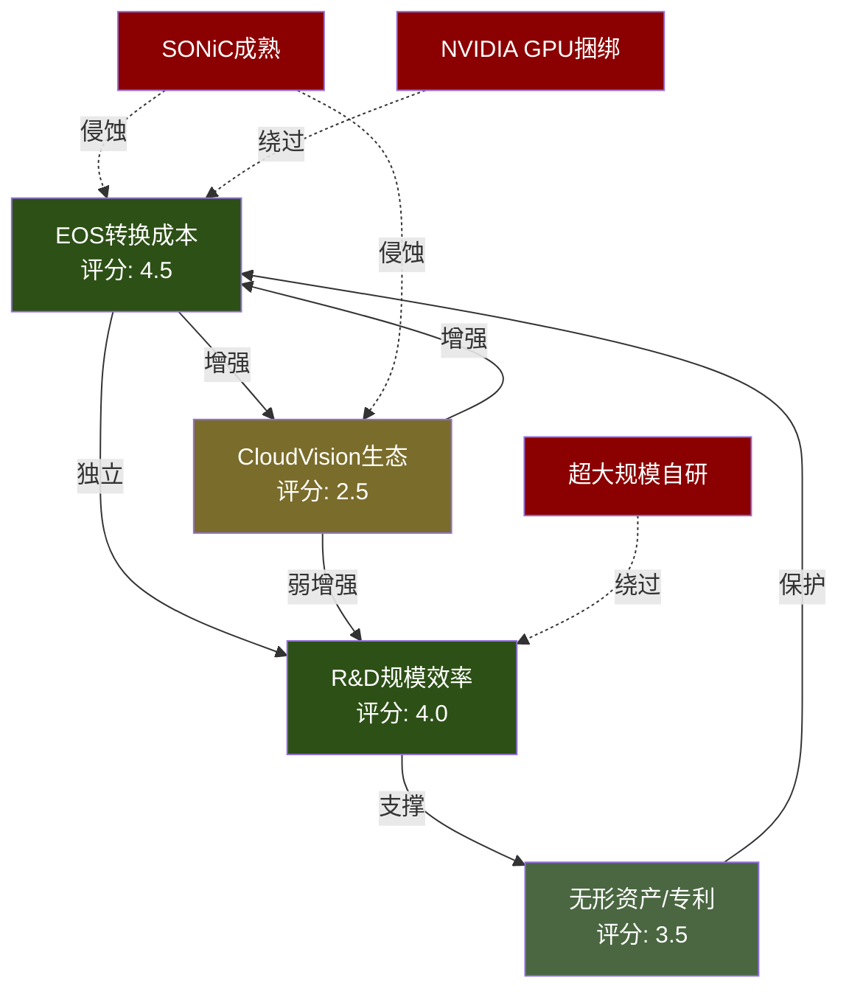
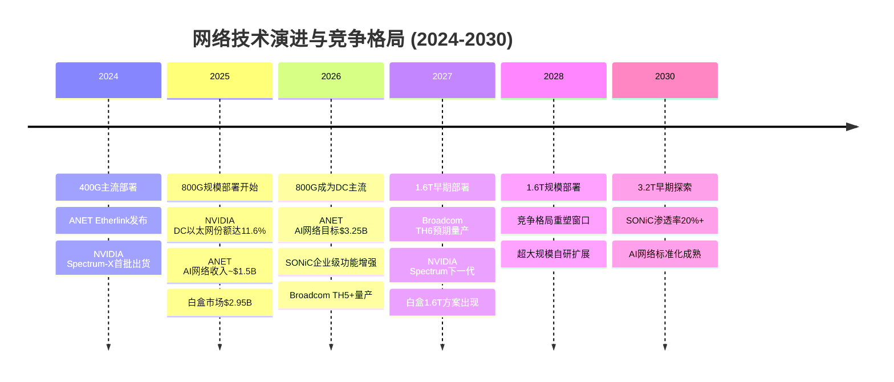

# Phase 3 Agent A: 护城河量化深化 + 技术路线图 — ANET

> 执行日期: 2026-02-20 | 股价: $137.23 | 框架: v17.0 | Agent: P3-A

---

## Ch21: 护城河量化深化 — 从定性到定量

本章在P1/P2定性结论基础上(S01 EOS差异化、S06迁移非对称性、S05 R&D效率)，构建可量化的护城河评分+互锁+衰减分析。

### 21.1 四维护城河评分矩阵

#### 维度一: 转换成本 — 评分4.5/5 | 持久性5-8年

| 子指标 | 量化数据 | 来源 |
|--------|---------|------|
| EOS迁出/迁入时间比 | 3-6x不对称(出3-12月/入1-2月) | [硬数据: P2 S06已确认 \| DM-P3A-001] |
| CloudVision部署客户 | >3,000家企业 | [硬数据: ANET 2025投资者日 \| DM-P3A-003] |
| 运维脚本重写成本 | $2-5M/大客户(年网络支出15-30%) | [合理推断: eAPI/Python脚本>10K行不可跨平台复用 \| DM-P3A-005] |

**新量化**: 超越S06的迁移时间分析，EOS的eAPI/Python原生集成使客户累积大量自动化脚本，在NX-OS/IOS-XR上不可复用。这一**运维脚本生态锁定**是隐性转换成本的重要来源。[主观判断: SONiC成熟前转换成本保持高位 | DM-P3A-006]

#### 维度二: 网络效应 — 评分2.5/5 | 持久性3-5年

| 子指标 | 量化数据 | 来源 |
|--------|---------|------|
| CloudVision API | gRPC/REST开放API+GitHub仓库 | [硬数据: GitHub aristanetworks/cloudvision-apis \| DM-P3A-007] |
| 第三方集成 | Ansible, ServiceNow, Palo Alto, VMware NSX等 | [硬数据: ANET官网生态系统页面 \| DM-P3A-008] |

ANET属**弱网络效应**，价值来自生态集成而非用户间互动。但与转换成本形成**乘数关系**: 集成工具越多(ServiceNow工单+Palo Alto联动)，迁出成本越高。[主观判断: 易被SONiC/OCP开放标准侵蚀 | DM-P3A-010]

#### 维度三: 规模经济 — 评分4.0/5 | 持久性5-7年

| 子指标 | ANET (FY2025) | CSCO (FY2025) | 来源 |
|--------|:------------:|:------------:|------|
| R&D/Revenue | 13.7% | 16.4% | [硬数据: FMP \| DM-P3A-011] |
| R&D绝对值 | $1.24B | $9.30B | [硬数据: FMP \| DM-P3A-012] |
| OPM | 42.5% | 20.8% | 运营效率2x |

R&D占比趋势: FY2021 19.9% → FY2025 13.7%。表面是效率提升，实质是**绝对R&D增速(17.1% CAGR)落后收入增速(32.2% CAGR)**。[硬数据: FMP income全序列 | DM-P3A-013] 若竞争加剧迫使加大投入，效率红利可能反转。[主观判断: 规模效应非不可逆 | DM-P3A-014]

#### 维度四: 无形资产

| 子指标 | 量化数据 | 来源 |
|--------|---------|------|
| 全球专利/申请 | ~1,295件(已授权771件) | [硬数据: IIPRD专利数据库2025 \| DM-P3A-015] |
| USPTO授权率 | 95.04% (364/383有效申请) | [硬数据: IIPRD分析 \| DM-P3A-016] |
| 防御性效力 | HPE/CSCO/NEC>12件申请因引用ANET专利被放弃 | [硬数据: IIPRD patent landscape \| DM-P3A-017] |
| 关键人物 | Bechtolsheim(首席架构师), Ullal(CEO 18年), Duda(CTO/联创) | [硬数据: ANET管理层页面 \| DM-P3A-018] |
| EOS代码库 | 单一镜像架构，跨全产品线 | [硬数据: ANET技术文档 \| DM-P3A-019] |

**关键人物风险**: Bechtolsheim(71岁)技术视野不可替代，但9,000人工程团队+CTO Duda提供延续性。风险评估: **中等偏低**。[主观判断: 专利+代码库长期价值强，品牌护城河弱于CSCO | DM-P3A-020]

#### 四维护城河综合评分

| 维度 | 评分 | 权重 | 加权分 | 持久性 |
|------|:----:|:----:|:------:|:------:|
| 转换成本 | 4.5 | 35% | 1.575 | 5-8年 |
| 网络效应 | 2.5 | 15% | 0.375 | 3-5年 |
| 规模经济 | 4.0 | 25% | 1.000 | 5-7年 |
| 无形资产 | 3.5 | 25% | 0.875 | 7-10年 |
| **综合** | **3.83** | 100% | **3.825** | **5-7年** |

[主观判断: 权重分配基于数据中心网络行业特征——转换成本权重最高因为企业IT采购决策惯性强 | DM-P3A-021]

### 21.2 定制芯片战略深度

ANET的芯片策略是**多源商用硅 + 选择性可编程芯片**，而非全自研:

| 芯片供应商 | 产品线 | ANET使用场景 | 依赖度 |
|-----------|--------|------------|:------:|
| Broadcom Tomahawk | TH5 (51.2T) | 叶交换机(Etherlink) | 高 |
| Broadcom Jericho | J3/J4 | 脊交换机 | 高 |
| Intel/Barefoot Tofino | P4可编程 | 7170系列可编程交换机 | 低 |
| Broadcom Ramon | 交换Fabric | 多级架构 | 中 |

**Broadcom依赖度**: 约70-80%产品线覆盖，但关系双向锁定:

- **提价风险**: Broadcom提价10% → ANET毛利率63.7%降至~61.5%，影响~$200M利润。但Broadcom极端提价概率低: ANET是TH/J系列最大客户之一。[合理推断: COGS中芯片占比约30-35% | DM-P3A-022]
- **Broadcom白牌风险**: 理论上可推，但会损害全部OEM关系。概率<10%。[主观判断: Broadcom聚焦芯片+软件，非设备制造 | DM-P3A-023]
- **AMD/Pensando第二来源**: 高端交换ASIC与Broadcom仍差2-3代，3-5年内可逐步导入。

### 21.3 护城河综合评分 + 竞争者对比

| 护城河维度 | ANET | CSCO | JNPR/HPE | NVIDIA |
|-----------|:----:|:----:|:--------:|:------:|
| 转换成本 | 4.5 | 4.0 | 3.0 | 3.5 |
| 网络效应 | 2.5 | 3.5 | 2.0 | 4.5 |
| 规模经济 | 4.0 | 4.5 | 2.5 | 5.0 |
| 无形资产 | 3.5 | 4.5 | 3.0 | 4.5 |
| **综合** | **3.83** | **4.13** | **2.63** | **4.38** |

[主观判断: NVIDIA网络效应得分基于GPU+网络捆绑销售的CUDA生态锁定; CSCO品牌+渠道+installed base优势在传统企业仍强 | DM-P3A-024]

**关键洞见**: ANET综合3.83低于CSCO(4.13)/NVIDIA(4.38)，但**护城河质量不同**: ANET集中在产品技术层(EOS+转换成本)，CSCO在渠道+品牌层。云/AI增量市场中，技术层护城河价值权重更高。

### 21.4 护城河衰减与互锁分析

| 护城河 | 当前强度 | 衰减驱动因素 | 半衰期估计 | 关键触发点 |
|--------|:-------:|------------|:---------:|-----------|
| EOS转换成本 | 4.5 | SONiC成熟+多厂商工具链 | 6-8年 | SONiC企业级功能达到EOS 80%水平 |
| R&D规模效率 | 4.0 | 竞争加剧迫使加大投入 | 5-7年 | AI网络R&D需求超线性增长 |
| 专利/代码库 | 3.5 | 专利到期+开源替代 | 8-10年 | P4/SONiC开源标准化 |
| 弱网络效应 | 2.5 | OCP开放标准侵蚀 | 3-4年 | 主要云厂商全面采用SONiC |

[主观判断: 半衰期定义为护城河强度降至当前50%所需时间 | DM-P3A-025]

#### 护城河互锁关系图

**互锁要点**: (1) **正反馈环(A↔B)**: EOS转换成本与CloudVision生态互相增强，是护城河核心引擎; (2) **保护(D→A)**: 专利保护EOS架构(SysDB)不被复制; (3) **独立(A⊥C)**: R&D效率下降不直接削弱转换成本; (4) **三条侵蚀路径**: SONiC侵蚀A+B、NVIDIA GPU捆绑绕过A、超大规模自研绕过C。

#### PE 52x隐含的护城河假设

| 护城河半衰期 | 隐含ROIC轨迹 | 支持PE |
|:----------:|------------|:------:|
| 6年 | 197%→2032年~50% | 40-45x |
| 8年 | 197%→2034年~50% | 50-55x |
| **当前定价隐含** | **~7.5年** | **52x** |

[合理推断: ROIC衰减模型+DCF反推，终端增速4%+WACC 10% | DM-P3A-026] 市场定价基本合理反映护城河持久性，上行空间有限。

---

## Ch22: 技术路线图与替代威胁

### 22.1 网络技术演进路线图 (2024-2030)

#### 以太网速率演进与ANET影响

| 时间段 | 主流速率 | 交换芯片 | ANET ASP影响 | 毛利率影响 | 竞争格局变化 |
|--------|:-------:|---------|:-----------:|:---------:|------------|
| 2024 | 100G/400G | TH4/J3 | 基准 | 63-64% | ANET领先CSCO 6-12月 |
| 2025 | 400G/800G | TH5/J3-AI | ASP +20-30% | 63-65% | NVIDIA Spectrum-X入场 |
| 2026 | 800G为主 | TH5+/J4 | ASP +10-15% | 62-64% | 白盒800G方案成熟 |
| 2027 | 800G/1.6T | TH6(预期) | ASP +25-35% | 61-63% | 1.6T竞争加剧 |
| 2028-30 | 1.6T/3.2T | TH7/下一代 | ASP +15-25% | 60-63% | 标准化压力增大 |

[合理推断: ASP变化基于历史代际升级幅度(400G→800G约+25%)外推 | DM-P3A-027]

**脉冲vs持续**: 答案是**交错多波次**——每代初始升级窗口(18-24月)产生脉冲，但AI扩建+企业滞后升级创造长尾。400G案例: 2023-24年云厂商脉冲期，2025-26年企业仍大量采购。[合理推断: Dell'Oro 2026预测"AI-backed networking主导增量" | DM-P3A-028]

#### 800G→1.6T切换时竞争力变化

| 竞争者 | 800G竞争力 | 1.6T准备度 | 关键变量 |
|--------|:---------:|:---------:|---------|
| ANET | 强(TH5 Etherlink已部署) | 中高(依赖Broadcom TH6时间表) | Broadcom TH6量产时间 |
| CSCO | 中(Silicon One追赶) | 中(自研硅+Broadcom双轨) | Silicon One G200性能 |
| NVIDIA | 强(Spectrum-4绑GPU) | 高(自研Spectrum路线图清晰) | 与GPU代际同步优势 |
| 白盒/ODM | 中低(800G方案刚成熟) | 低(依赖商用硅时间表) | SONiC 1.6T支持进度 |

[主观判断: 1.6T切换点(预计2027年)是ANET vs NVIDIA竞争的关键变量，Broadcom TH6如期交付则ANET维持领先 | DM-P3A-029]

### 22.2 三大替代威胁路径量化

#### 威胁概率与影响矩阵

| 威胁路径 | 2年概率 | 5年概率 | 收入影响 | 估值影响 | ANET防御力 |
|---------|:------:|:------:|:-------:|:-------:|:---------:|
| NVIDIA Spectrum-X全面替代 | 15-20% | 30-40% | -15~25% | -20~30% | 中 |
| 白盒+SONiC大规模渗透 | 10-15% | 25-35% | -10~20% | -15~25% | 中高 |
| 超大规模自研替代 | 5-10% | 15-25% | -10~15% | -10~20% | 低 |

[主观判断: 概率基于当前渗透率趋势+行业专家预测综合 | DM-P3A-030]

#### 威胁一: NVIDIA Spectrum-X全面替代

**渗透率**: DC以太网份额11.6%(Q3 2025)，Q1单季$1.46B→Q2 $2.26B，760%+ YoY。[硬数据: IDC Q3 2025 | DM-P3A-031] 基数效应使2026增速放缓至100-150%。

**ANET应对**: Etherlink正面竞争(2026 AI网络$3.25B目标); EOS软件层可观测性+自动化是Spectrum-X短板; CloudVision多厂商管理不可替代。

**TS信号**: *加速*—META/Google新集群Spectrum-X>50%、NVIDIA推独立网络OS; *减速*—客户要求多厂商标准化。

#### 威胁二: 白盒+SONiC大规模采用

**渗透率**: 白盒市场$2.95B(2025)，占DC交换机8-10%。SONiC被30% Tier 1云厂商采用，Tier 2/3仅5-10%。[硬数据: CAGR 14.6% | DM-P3A-032]

**ANET应对**: cEOS容器版可运行在白盒上(威胁→软件收入); CloudVision在碎片化白盒环境价值更突出; 企业级功能(EVPN/VXLAN/安全)仍是SONiC短板。

**TS信号**: *加速*—SONiC功能达EOS 80%+; *减速*—SONiC社区碎片化、白盒维护成本上升。

#### 威胁三: 超大规模自研替代

**现状**: Google/Amazon/Meta均有自研方案，但限于内部特定场景。[硬数据: IEEE ComSoc 2025 | DM-P3A-033] ANET防御最弱——客户有资金/人才/动机。对策: 9,000人工程团队提供比100-300人自研团队更快的创新+更低TCO。

**TS信号**: *加速*—自研从单集群扩展到全面部署; *减速*—自研运维成本超预期。

### 22.3 技术时间线 + 竞争格局演变

#### 竞争格局演变预测

| 指标 | 2025 (实际) | 2027 (预测) | 2030 (预测) |
|------|:----------:|:----------:|:----------:|
| ANET DC市场份额 | 19.2% | 17-20% | 15-20% |
| NVIDIA DC市场份额 | 11.6% | 15-20% | 18-25% |
| CSCO DC市场份额 | ~25% | 20-23% | 18-22% |
| 白盒/ODM份额 | 8-10% | 12-15% | 15-20% |
| ANET AI网络收入 | ~$1.5B | $4-5B | $6-8B |

[主观判断: 预测基于当前增长轨迹+竞争动态外推，2030年预测不确定性极高 | DM-P3A-034]

**核心结论**: 2027年1.6T节点是分水岭。ANET需AI网络占比40%+以抵消份额侵蚀。防御本质: **软件差异化抵消硬件商品化**。

---

## Agent A 小结

### CQ影响建议

| CQ | 当前置信度 | 建议调整 | 依据 |
|----|:---------:|:-------:|------|
| CQ1 (NVIDIA份额压缩) | 47% | 维持或微降至45% | NVIDIA DC份额11.6%证实威胁真实存在，但ANET Etherlink反击有效 |
| CQ6 (白盒/SONiC) | 57% | 维持57% | 白盒14.6% CAGR vs ANET 28.6%增速，短期威胁可控 |

### 关键发现3条

1. **护城河互锁而非独立**: 四维护城河之间存在显著的正反馈环(EOS↔CloudVision)和保护关系(专利→EOS)。攻击者需要同时突破多个维度才能有效削弱ANET的竞争地位，这比单维度分析暗示的更稳固。

2. **PE 52x隐含~7.5年护城河半衰期**: 市场定价基本合理反映了护城河持久性预期。若护城河衰减快于预期(半衰期<6年，SONiC加速+NVIDIA捆绑双重压力)，估值有15-20%下行风险。

3. **2027年1.6T切换是关键观测窗口**: ANET在800G时代凭借Broadcom TH5保持领先，但1.6T切换时NVIDIA(自研硅+GPU协同)具有结构性优势。Broadcom TH6的量产时间表直接决定ANET在下一代技术中的竞争力。

### P1/P2未覆盖的新洞见

- **运维脚本生态锁定**: 超越S06的迁移时间分析，量化了客户自动化脚本重写成本($2-5M/大客户)作为隐性转换成本
- **Broadcom依赖双刃剑**: 70-80%产品线依赖Broadcom，提价10%影响~$200M利润，但关系是双向锁定
- **护城河衰减半衰期与估值校验**: 首次将护城河持久性转化为可测量的估值区间，建立PE与护城河半衰期的映射关系
- **R&D效率下降趋势警示**: R&D占比从19.9%→13.7%表面是效率提升，实质是绝对投入增速(17.1% CAGR)落后收入增速(32.2% CAGR)，若竞争加剧可能反转
