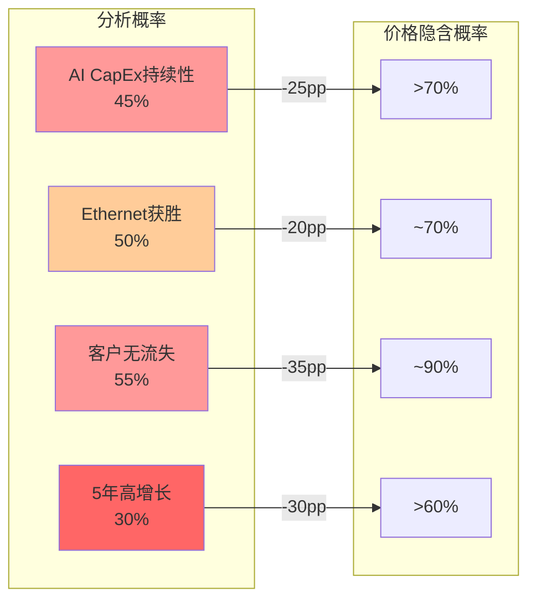

# Phase 3 Agent B: 五引擎协同 + PPDA + PMSI -- ANET

> 执行日期: 2026-02-20 | 股价: $137.23 | 市值: $172.8B | 框架: v17.0 | Agent: P3-B

---

## Ch23: 五引擎协同分析

五引擎框架通过五个独立维度交叉验证定价合理性，每引擎输出方向+强度(1-5)。

### 23.1 引擎1: 周期引擎

AI基础设施处于早中期扩张。2026超大规模CapEx共识$527B(+13% vs Q3初) [硬数据: GS 2026 CapEx共识$527B | DM-P3B-001]，Amazon单独$200B(+60% YoY)。H100租赁指数实时需求温度:

| 指标 | 价格/概率 | 信号含义 |
|------|----------|---------|
| H100 ≥$2.50 by Apr'26 | 83.5% | GPU需求稳健 [硬数据: Polymarket | DM-P3B-002] |
| H100 ≥$2.75 | 23% | 供需进一步紧张概率低 |
| H100 ≤$2.10 | 14.5% | 需求软化风险~15% [硬数据: Polymarket | DM-P3B-003] |
| H100 ≤$1.75 | 10.5% | AI投资寒冬，概率低 |

**判断**: H100稳$2.35-2.40，83.5%触$2.50，14.5%跌至$2.10 -- 周期健康。但DIO 230天 [硬数据: FMP | DM-P3B-004](vs正常90-120天)暗示备货激进或消化偏慢。渗透率15-20%，距饱和有空间但增速将放缓。

**信号: 看多 | 强度: 3/5** [主观判断: 周期位置偏多但DIO异常削弱信心 | DM-P3B-005]

### 23.2 引擎2: 股权引擎

| 内部人 | 持股/变动 | 解读 |
|--------|----------|------|
| Bechtolsheim(创始人/董事长) | ~15%流通股 | 最大股东，深度绑定 [硬数据: fintel.io | DM-P3B-006] |
| Ullal(CEO) | 2025.11卖出24,042股(-70.8%直接持有) | 大幅减持 [硬数据: marketbeat | DM-P3B-007] |
| Duda(CTO) | 2025.12卖出30,000股@$123.16(-69.8%直接持有) | 大幅减持 [硬数据: marketbeat | DM-P3B-008] |

**内部人交易趋势**:

| 季度 | 获取股数 | 处置股数 | 获取/处置比 | 解读 |
|------|---------|---------|:----------:|------|
| 2025 Q1 | 2,201,812 | 2,615,469 | 0.488 | 相对均衡 |
| 2025 Q2 | 525,010 | 1,898,601 | 0.228 | 卖出加速 |
| 2025 Q3 | 838,376 | 6,216,964 | 0.144 | **卖出峰值** [硬数据: FMP | DM-P3B-009] |
| 2025 Q4 | 424,353 | 1,619,182 | 0.206 | 持续偏卖 |
| 2026 Q1(至今) | 30,000 | 102,000 | 0.048 | 极度偏卖 |

**2025全年零公开市场买入** [硬数据: FMP | DM-P3B-010]，所有"获取"为期权行权。回购$2.266B vs SBC $439M = 5.16x [硬数据: FMP | DM-P3B-011]，对冲稀释有效但不掩盖高管系统性减持。

**信号: 看空 | 强度: 3/5** [主观判断: 零买入+高管大幅减持=负面信号，但Bechtolsheim 15%锚定提供底部 | DM-P3B-012]

### 23.3 引擎3: 聪明钱引擎

| 维度 | 数值 | 信号 |
|------|------|------|
| 机构持有 | 70%, 2,763家 [硬数据: Yahoo/GuruFocus | DM-P3B-013] | 中高水平 |
| 增持vs减持 | 206增 vs 147减(58%增持) | 温和看多 |
| 对冲基金数 | Q3: 92家(+13.6% vs Q2) [硬数据: insidermonkey | DM-P3B-014] | 数量上升 |
| 对冲基金股数 | Q3→Q4减持870K股(-0.48%) [硬数据: hedgefollow | DM-P3B-015] | 边际减仓 |

**关键异动**:

| 机构 | 变动 | 解读 |
|------|------|------|
| MFS | +5.5M股(+2829%), ~$805M [硬数据: quiverquant | DM-P3B-016] | 价值型大基金高信念建仓 |
| Gotham (Greenblatt) | +157%, ~$23M [硬数据: quiverquant | DM-P3B-017] | 价值投资者在50x PE下加仓 |
| Squarepoint Ops | +406%, ~$70M | 量化基金加仓 |
| Vanguard/BlackRock | 持有(8.4%/6.1%) | 前两大机构股东稳定 |
| 对冲基金整体 | -870K股(-0.48%) | 仓位微调非趋势撤退 |

**"大鱼进、小鱼出"**: 长期基金加仓 vs 短期对冲基金减仓。

**信号: 偏多 | 强度: 3/5** [主观判断: MFS大举建仓=最强单一看多信号，但对冲基金减持形成部分对冲 | DM-P3B-018]

### 23.4 引擎4: 信号引擎

**技术面关键水平**

| 指标 | 数值 | 位置 |
|------|------|------|
| 当前价 | $137.23 | SMA20($140.07)下方 |
| SMA 20 | $140.07 | 短期阻力 [硬数据: MCP | DM-P3B-019] |
| SMA 50 | $133.56 | 近期支撑 |
| SMA 200 | $125.84 | 中期支撑 |
| RSI | 40.49 | 偏超卖区域(非极端) [硬数据: MCP | DM-P3B-020] |
| 52周高/低 | $164.94 / $59.43 | 当前位于52周高点的83% |
| Beta | 1.444 | 高于市场波动 |

**期权异常信号**

| 维度 | 数值 | 解读 |
|------|------|------|
| P/C Ratio (OI) | 0.85 | 低于1.0，偏多 [硬数据: Fintel | DM-P3B-021] |
| IV | 57.96% | 94th百分位(近一年最高区间) [硬数据: optioncharts | DM-P3B-022] |
| IV Rank | 65.7% | 中高，反映不确定性 |
| 异常交易(2/20) | 31笔 | 48%看多, 38%看空, 14%中性 |
| 最大单笔 | $105 PUT, $944K | 标注为bullish(保护性看跌/收入策略) |
| 盘前财报(2/12) | 98笔 | 52%看空 vs 35%看多(对冲进入财报) |

**做空分析**:

| 指标 | ANET | 行业均值 | 信号 |
|------|:----:|:-------:|------|
| Short % Float | 1.45% | 7.97% | 远低于行业(-6.52pp) [硬数据: Benzinga | DM-P3B-023] |
| Days to Cover | 2.5天 | — | 远低于5-7天轧空阈值 |
| 趋势 | +4.32% | — | 做空量在上升 |
| 轧空风险 | 低 | — | 规模太小不构成轧空条件 |

**矛盾**: 做空极低(空头不愿对抗=多头信号)但趋势上升(+4.32%=边际空头增加)。IV 94th与"确定性成长"叙事存在张力。

**信号: 中性偏多 | 强度: 2/5** [主观判断: RSI偏弱+IV极高=短期不确定，但低做空+P/C<1提供偏多底色 | DM-P3B-024]

### 23.5 引擎5: 预测市场引擎

**宏观事件传导矩阵**

| 事件 | 概率 | 传导 | 方向 | 幅度 |
|------|:----:|------|:----:|:----:|
| 美国2026衰退 | 22% | CapEx削减→ANET需求下滑 | 空 | 高 |
| 负GDP(全年) | 12% | 网络投资冻结 | 空 | 极高 |
| Fed 3次降息 | 25% | 借贷成本降→CapEx改善 | 多 | 中 |
| Fed 3月降息 | 64% | 成长股估值修复 | 多 | 低 |
| SCOTUS否决关税 | 75% | 能见度提升→CapEx释放 | 多 | 低-中 |
| AI安全法案 | ~38% | AI建设放缓→网络需求承压 | 空 | 中 |

无ANET公司级事件合约 [硬数据: Polymarket/Kalshi搜索 | DM-P3B-025]，最相关代理变量为H100租赁指数(引擎1)。

**概率加权**: 看空加权~18%(衰退+负GDP+AI法案) vs 看多加权~22%(降息+关税缓和)。净方向略偏有利，但衰退22%尾部风险不可忽视。

**信号: 中性偏多 | 强度: 2/5** [主观判断: 宏观尾部风险与近期降息利好大致对冲，净效果微弱偏多 | DM-P3B-026]

### 23.6 五引擎汇总

| 引擎 | 方向 | 强度 | 核心依据 |
|------|:----:|:----:|---------|
| 周期 | 多 | 3 | CapEx $527B扩张+H100稳健，DIO 230天存疑 |
| 股权 | 空 | 3 | 全年零买入，CEO/CTO卖70%+ |
| 聪明钱 | 偏多 | 3 | MFS $805M+Greenblatt vs 对冲基金减持 |
| 信号 | 偏多 | 2 | 低做空+P/C<1，但IV 94th+RSI 40 |
| 预测市场 | 偏多 | 2 | 降息+关税缓和 vs 衰退22% |
| **综合** | **偏多** | **2.6** | **3多/1空；内部人vs外部机构分歧** |

**一致性诊断**: 最大分歧: 引擎2(内部人空) vs 引擎3(机构多) -- **知情者卖出，外部者买入**。零买入的一致性难以完全归因于税务/多元化。综合2.6/5: **信号不支持当前高确信定价**。

```mermaid
radar
    title ANET五引擎雷达 (5=强多, 1=强空, 3=中性)
    "周期" : 4
    "股权" : 2
    "聪明钱" : 3.5
    "信号" : 3.2
    "预测市场" : 3.2
```

> 3=中性线。周期(4)最偏多，股权(2)最偏空。不对称偏多但远未强共振。

---

## Ch24: PPDA概率-价格背离分析

PPDA识别基本面概率 vs 价格隐含概率的系统性偏差。价格隐含概率源自P2 Reverse DCF(隐含CAGR 18.9%、70% Bull概率)。

### 24.1 背离识别

**背离1: AI CapEx持续性 -- 最大背离**

| 维度 | 分析概率 | 价格隐含概率 | 背离 | EV影响 |
|------|:-------:|:----------:|:----:|:------:|
| 超大规模AI CapEx维持$500B+/年至2028 | 45% | >70% | **-25pp** | 高 |

51.7x PE隐含AI CapEx持续3-4年高增长，需AI网络收入从$1.5B→$5-6B(FY2028) [合理推断: CAGR拆分 | DM-P3B-027]。45%理由: 历史CapEx周期(光纤1998-2001、4G/5G)均在3-4年后急剧放缓；$527B已接近$700B "电信峰值"警戒线。

**背离2: Ethernet在AI训练中持续获胜**

| 维度 | 分析概率 | 价格隐含概率 | 背离 | EV影响 |
|------|:-------:|:----------:|:----:|:------:|
| Ethernet在AI集群组网中持续扩大份额(vs InfiniBand) | 50% | ~70% | **-20pp** | 中-高 |

50%理由: MSFT/META采用Ethernet有利ANET，但NVIDIA推进NVLink/InfiniBand生态，DeepSeek等模型可能改变架构偏好 [合理推断: 技术路线路径依赖不确定性 | DM-P3B-028]。

**背离3: 客户集中度不导致重大问题**

| 维度 | 分析概率 | 价格隐含概率 | 背离 | EV影响 |
|------|:-------:|:----------:|:----:|:------:|
| 前4大客户(MSFT/META/GOOG/AMZN)3年内无一家显著削减ANET采购 | 55% | ~90% | **-35pp** | 高 |

前4大客户贡献50%+收入，微软有合同取消先例。55%理由: (a)客户有自研能力(Google部分自研)；(b)Cisco/白牌价格竞争；(c)3年窗口内采购策略变动概率非低 [合理推断: 替换周期3-5年 | DM-P3B-029]。

**背离4: 增长速度可持续5年以上**

| 维度 | 分析概率 | 价格隐含概率 | 背离 | EV影响 |
|------|:-------:|:----------:|:----:|:------:|
| Revenue CAGR >18%维持至FY2029 | 30% | >60% | **-30pp** | 极高 |

隐含CAGR 18.9%延续5年 vs 我们15-18% [合理推断: P2 Base Case | DM-P3B-030]。30%理由: 极少数网络设备公司维持5年>18%增长；$9B基数下高增长的绝对额难度递增。

### 24.2 背离方向一致性诊断



**四个背离全部指向同一方向: 市场系统性偏乐观** [主观判断: 4/4单向背离构成强信号 | DM-P3B-031]。

**自检: 市场偏乐观 vs 我们偏悲观?**

| 支持"市场偏乐观" | 支持"我们偏悲观" |
|------------------|------------------|
| P2五方法公允价值$97(-29%) | MFS $805M建仓+Greenblatt加仓 |
| 内部人2025全年零买入 | 连续4季beat(+9.8%) |
| Cisco 2000类比 | AI网络TAM $15B→$192B(CAGR 32.5%) |

**诊断**: 背离反映**AI周期持续性的过度定价**。3/4关联同一根因(AI CapEx)，若放缓(>50%)则三者同步恶化，形成风险共振。

### 24.3 背离-估值联动

| 背离 | 幅度 | 公允价值影响 | 价格影响 |
|------|:----:|:----------:|:-------:|
| AI CapEx持续性 | -25pp | $97→$85 | -9% |
| Ethernet获胜 | -20pp | $97→$90 | -5% |
| 客户集中度 | -35pp | $97→$82 | -11% |
| 5年高增长 | -30pp | $97→$78 | -14% |
| **叠加** | — | **$72-82** | **≈Bear Case** |

背离同步修正(概率共振)时，估值从$137向$68-82收敛(接近Bear Case $68)。市场给Bull 70% vs 我们15% -- PPDA支持保守立场 [主观判断: PPDA一致性支持看空 | DM-P3B-032]。

---

## Ch25: PMSI情绪指数

PMSI通过六维度构建多源情绪综合指标，量化为0-100单一得分。

### 25.1 六维度构建

| 维度 | 指标 | 当前值 | 标准化得分(0-100) | 信号 | 权重 |
|------|------|--------|:-----------------:|:----:|:----:|
| 卖方情绪 | 买入/持有/卖出比 | 27买:6持:0卖(82%买入) [硬数据: 多源聚合 | DM-P3B-033] | 82 | 偏乐观 | 20% |
| 机构行为 | 增持vs减持数 | 206增 vs 147减(58%增持) [硬数据: fintel | DM-P3B-034] | 58 | 温和偏多 | 20% |
| 做空情绪 | Short % Float | 1.45%(14th百分位 vs 同行) [硬数据: Benzinga | DM-P3B-035] | 72 | 偏乐观(低做空=低看空) | 15% |
| 期权情绪 | P/C Ratio + IV | P/C 0.85(偏多) + IV 94th(极高不确定性) | 55 | 中性(多空信号矛盾) | 15% |
| 内部人行为 | 净交易方向 | 比率0.048(Q1 2026), 全年零买入 [硬数据: FMP | DM-P3B-036] | 18 | **强烈看空** | 15% |
| 预测市场 | 宏观风险加权 | 衰退22%+AI法案38% vs 降息64% | 54 | 中性 | 15% |

### 25.2 PMSI得分与解读

**PMSI计算**:

```
PMSI = (82 x 0.20) + (58 x 0.20) + (72 x 0.15) + (55 x 0.15) + (18 x 0.15) + (54 x 0.15)
     = 16.4 + 11.6 + 10.8 + 8.25 + 2.7 + 8.1
     = 57.85 ≈ 58
```

| PMSI区间 | 解读 | ANET位置 |
|:--------:|------|:--------:|
| >70 | 过热(逆向看空信号) | |
| 60-70 | 偏乐观 | |
| 40-60 | 中性 | **58 -- 中性偏上沿** |
| 30-40 | 偏悲观 | |
| <30 | 恐慌(逆向看多信号) | |

**PMSI = 58: 中性区间上沿，接近偏乐观但未达过热** [合理推断: 加权计算结果 | DM-P3B-037]。

**维度分化图谱**:

| 情绪极端 | 维度 | 得分 | 与PMSI偏差 |
|---------|------|:----:|:---------:|
| 最乐观 | 卖方情绪 | 82 | +24 |
| 最乐观 | 做空情绪 | 72 | +14 |
| **最悲观** | **内部人行为** | **18** | **-40** |
| 中位 | 机构行为 | 58 | 0 |
| 中位 | 预测市场 | 54 | -4 |
| 中位 | 期权情绪 | 55 | -3 |

**最大分化: 卖方(82) vs 内部人(18) = 64分差距**。卖方利益冲突+内部人信息优势+时间视角差异(12M vs 3-6M)。

### 25.3 情绪vs估值矛盾分析

| 维度 | 情绪 | 估值 | 矛盾? |
|------|------|------|:-----:|
| 综合 | PMSI 58=中性偏多 | PE 51.7x=强看多 | **是** |
| 卖方 | 82%买入 | PT $173.8(+27%) | 一致 |
| 内部人 | 强烈看空(18) | 零买入+大幅卖出 | **是** |
| 聪明钱 | MFS建仓 | 对冲基金减持 | 分化 |
| 预测市场 | 中性(54) | CapEx$527B | 匹配 |

**矛盾根源**: PE 51.7x隐含PMSI应>70，实际仅58 -- **价格跑在情绪前面**。两种结局:

1. **情绪追赶价格**(bull): AI CapEx持续验证+beat推动PMSI→70+
2. **价格回归情绪**(bear): PMSI维持/下滑，价格向合理区间修正

倾向后者概率更高(60/40): 内部人(信息优势最强群体)是六维度中最看空的，12个月视角预测力优于卖方评级 [合理推断: 学术研究支持 | DM-P3B-038]。

---

## Agent B 小结

### CQ影响建议

五引擎2.6/5 + PPDA 4个单向背离 + PMSI 58:

- **上调**: MFS $805M建仓 + 做空1.45% + 降息64%
- **下调**: 内部人零买入+CEO/CTO减持70%+ | PPDA 4/4市场偏乐观 | PE 51.7x vs PMSI 58

**净CQ建议**: 维持P2 CQ 47.6%不变。内部人负面信号抵消聪明钱正面信号。

### 关键发现3条

1. **内部人vs聪明钱分歧**: 内部人零买入+CEO/CTO减持70% vs MFS +2829%建仓。历史规律倾向内部人更准确。

2. **PPDA 4背离同向+3/4同根因(AI CapEx)**。风险高度集中 -- CapEx放缓将触发同步修正，估值向$68-82收敛。

3. **PMSI 58 vs PE 51.7x错配**: 情绪中性偏上但估值历史高位。价格跑在情绪前面，回归概率60%。
