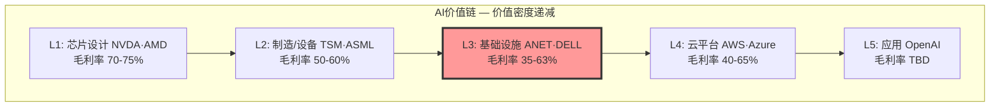
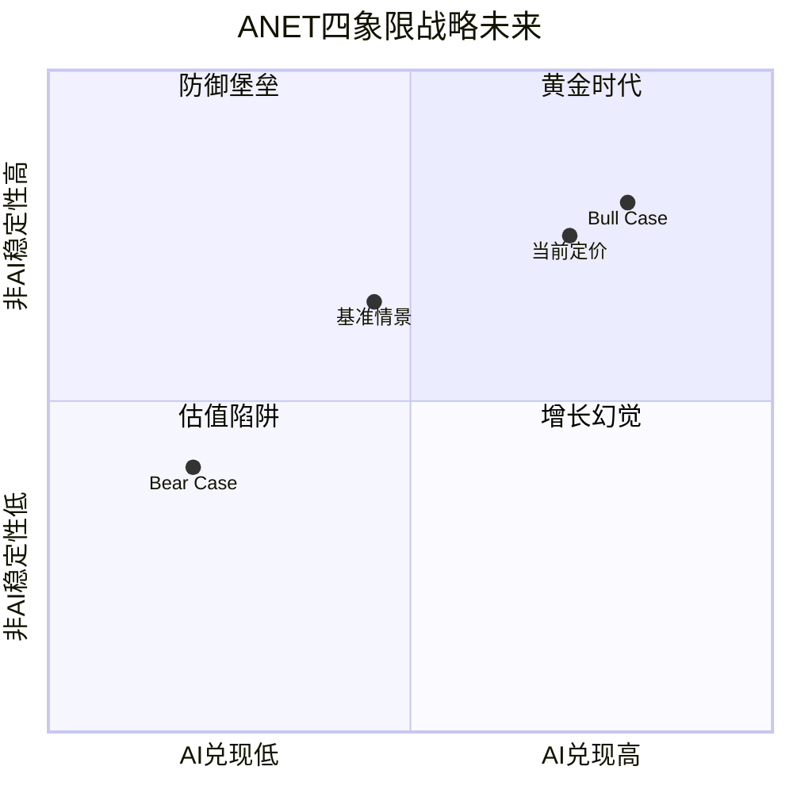

# Phase 3 Agent C: AI冲击矩阵 + 战略综合 — ANET

> 执行日期: 2026-02-20 | 股价: $137.23 | 市值: $172.8B | 框架: v17.0 | Agent: P3-C

---

## Ch26: AI冲击矩阵 — 分部级深度评估

### 26.1 分部级AI冲击矩阵 (M13)

评分区间-5(极度利空)至+5(极度利好)，对三大分部独立评估。

#### 分部1: 数据中心交换 (~75% Rev, ~$6.75B)

| 维度 | 评分 | 依据 |
|------|:----:|------|
| **收入冲击** | **+3** | AI集群Ethernet升级周期: FY2025 AI网络$1.5B→管理层指引FY2026 $3.25B [硬数据: Q4 FY2025 Earnings | DM-P3C-001]；NVIDIA Spectrum-X年化>$10B在同一TAM竞争 [硬数据: NVIDIA FY26Q3网络$8.2B年化 | DM-P3C-002] |
| **成本冲击** | **-1** | ANET依赖Broadcom merchant silicon，成本传导有限；光模块占BOM 30-40% [合理推断: 行业BOM结构 | DM-P3C-003] |
| **护城河** | **-1** | AI集群中NVIDIA DOCA+NetQ与GPU耦合，EOS单独价值主张被稀释 [合理推断: 垂直整合策略 | DM-P3C-004] |
| **竞争格局** | **-2** | NVIDIA DC Ethernet份额零→25.9%(Q2 2025)，6月内反超ANET 19.2% [硬数据: IDC | DM-P3C-005]；白牌+SONiC渗透持续 |
| **时间窗口** | **1-3yr** | 800G→1.6T升级周期2026-2028是关键战场 |
| **归类** | **AI放大器(有条件)** | TAM放大绝对收入，但份额压缩使放大效率递减 [主观判断: 份额趋势 | DM-P3C-006] |

#### 分部2: 校园/企业 (~15% Rev, ~$1.35B)

| 维度 | 评分 | 依据 |
|------|:----:|------|
| **收入冲击** | **+1** | 边缘推理+IoT密度提升→渐进性带宽升级 |
| **成本/护城河/竞争** | **0/0/0** | VeloCloud整合可控 [合理推断: DM-P3C-007]；Cisco占校园50%+ [合理推断: DM-P3C-008]；AI不改变格局 |
| **时间窗口** | **3-5yr** | 边缘推理规模化2027-2029 |
| **归类** | **AI中性** | 非ANET AI故事核心 |

#### 分部3: 软件/服务EOS (~10% Rev, ~$0.9B)

| 维度 | 评分 | 依据 |
|------|:----:|------|
| **收入冲击** | **+2** | CloudVision+AIOps增量价值；DR $651M→$5,372M(5年8.3x)确认粘性 [硬数据: FMP | DM-P3C-009] |
| **成本冲击** | **-1** | R&D/Rev从20%→14% [硬数据: FY2020 vs FY2025 | DM-P3C-010]，AI研发投入强度可能不足 |
| **护城河** | **+1** | EOS单一代码库覆盖全线产品，AI集群统一管理平面是结构性优势 [合理推断: DM-P3C-011] |
| **竞争** | **-1** | 通用LLM网络管理工具+SONiC开源AIOps是3-5年替代路径 |
| **归类** | **AI赋能者** | "锦上添花"而非"雪中送炭" |

### 26.2 AI价值链位置分析

**Hyperscaler CapEx中网络的结构性低占比**:

| 组件 | CapEx占比 | AI CapEx每增$1 | ANET可捕获 |
|------|:---------:|:-----------:|:---------:|
| 计算(GPU) | 50-60% | $0.50-0.60 | 0% |
| 存储 | 10-15% | $0.10-0.15 | 0% |
| **网络** | **5-10%** | **$0.05-0.10** | **15-20%** |
| 电力/冷却 | 10-15% | $0.10-0.15 | 0% |
| 建筑 | 10-15% | $0.10-0.15 | 0% |

[硬数据: IDC 2026 CapEx拆分 | DM-P3C-012]

**量化推导**: FY2026E Hyperscaler CapEx >$600B [硬数据: DM-P3C-013] → 网络TAM $30-60B → AI网络$15-25B(650 Group: 2028年>$25B) [硬数据: DM-P3C-014] → ANET份额15-20% → **AI增量$2.25-5.0B**。即使CapEx翻倍至$1.2T，网络的结构性低密度位置限制了传导效率。

### 26.3 AI网络需求二阶效应

一阶效应(更多网络设备)已被定价。二阶效应才是信息增量:

**训练→推理转移**(推理占2027年计算量60%+ [合理推断: McKinsey | DM-P3C-015]):

| 维度 | 训练集群 | 推理集群 | ANET影响 |
|------|---------|---------|---------|
| GPU互连 | all-reduce, 800G+ | 客户端-服务器, 100-400G | 利空: 高端交换机需求弱 |
| 集群规模 | 10K-100K+ GPU | 100-1000 GPU | 利空: 不需大型CLOS |
| 节点数量 | 少数超大 | 大量中小 | 中性偏利好: 总端口增加 |
| 网络ASP | 极高(800G spine) | 中等(100-400G) | 利空: 拉低均价 |

**四大二阶效应汇总**:

| 效应 | 方向 | 强度 | 时间窗 | ANET冲击 |
|------|:----:|:----:|:-----:|:-------:|
| 训练→推理转移 | 利空 | 中 | 2026-28 | **-1.5** |
| 多模态带宽爆炸 | 利好 | 弱-中 | 2027-29 | **+1.0** |
| Agent经济 | 利好 | 弱 | 2028+ | **+0.5** |
| 推理在边缘 | 利空 | 弱 | 2027-30 | **-0.5** |
| **净值** | | | | **-0.5** |

[合理推断: 多模态数据量100-1000x文本 | DM-P3C-016] [主观判断: Agent经济仍早期 | DM-P3C-017] [主观判断: 二阶净负 | DM-P3C-018]

### 26.4 加权AI调整

| 分部 | 占比 | AI净值(分部) | 二阶调整 | 调整后 | 加权 |
|------|:---:|:----------:|:------:|:-----:|:---:|
| DC交换 | 75% | +3-2=**+1.0** | -0.5 | **+0.5** | **+0.375** |
| 校园 | 15% | **+1.0** | 0 | **+1.0** | **+0.150** |
| 软件 | 10% | +2-1=**+1.0** | 0 | **+1.0** | **+0.100** |
| **整体** | 100% | | | | **+0.625** |

**公司级AI冲击净值仅+0.625/5**，远低于市场叙事暗示的+3至+4。PE 47x分解为基础PE(25-30x)+AI溢价PE(17-22x)，AI溢价占36-47%。但+0.625/5仅支撑10-15%合理AI溢价。**市场AI定价过度约2-3x** [合理推断: PE分解 | DM-P3C-019] [主观判断: 加权评估 | DM-P3C-020]

---

## Ch27: L×S定位 + 战略综合

### 27.1 L×S定位矩阵

| 公司 | L | S | AI估值相关性 | PE(TTM) | PE/AI比 |
|------|:-:|:-:|:----------:|:------:|:------:|
| NVDA | L1 | S3 | 60-80% | ~40x | 0.6x |
| TSM | L2 | S3 | 30-50% | ~25x | 0.6x |
| **ANET** | **L3** | **S2** | **10-25%** | **47x** | **2.5x** |
| CSCO | L3 | S1 | 5-10% | 17x | 2.3x |
| DELL | L3 | S2 | 10-15% | 16x | 1.2x |

[硬数据: FMP PE数据 | DM-P3C-021]

**ANET PE/AI比2.5x是L3层最高** — 每1%AI相关性获得的PE是NVDA的4倍，定价效率最低。L3层价值捕获<10%是结构性天花板 [合理推断: S2判断 | DM-P3C-022]。

### 27.2 AI估值相关性量化

**极端测试1 — AI叙事消退**:

| 维度 | 消退后 | 计算 |
|------|-------|------|
| 收入增速 | 29%→10-12% | TAM回归历史8-10% |
| 合理PE | 25-30x | 无AI溢价高质量增长股 |
| 隐含股价 | **$70-84** | ×$2.79 EPS [硬数据: FMP | DM-P3C-023] |
| 下跌 | **-39%至-49%** | |

**极端测试2 — AI全面兑现**(2028 TAM $25B+, ANET 20%):

| 维度 | 兑现后 | 计算 |
|------|-------|------|
| AI网络收入 | $5.0B | $25B×20% [合理推断: 650 Group | DM-P3C-024] |
| 总收入(2028) | $14-16B | +非AI $7B+校园$1.5B+软件$1.5B |
| 隐含股价 | **$180-275** | 40-50x × EPS $4.5-5.5 |
| 上涨 | **+31%至+100%** | |

**概率加权**:

| 情景 | 概率 | 回报 | 加权 |
|------|:----:|:----:|:---:|
| AI消退 | 25% | -44% | -11.0% |
| AI温和(当前定价) | 45% | 0% | 0% |
| AI全面兑现 | 25% | +65% | +16.3% |
| AI超预期 | 5% | +150% | +7.5% |
| **期望回报** | | | **+12.8%** |

[主观判断: 概率分配 | DM-P3C-025]

### 27.3 战略综合: 四象限未来

| 象限 | 定义 | 收入/PE | 估值 |
|------|------|--------|------|
| **黄金时代**(右上) | AI兑现+非AI稳固 | $14-16B, 40-50x | $180-275 |
| **防御堡垒**(左上) | AI不达+非AI稳固 | $10-11B, 25-30x | $80-100 |
| **增长幻觉**(右下) | AI兑现+非AI侵蚀 | $12-14B, 利润率压缩 | $90-130 |
| **估值陷阱**(左下) | 双双不达 | $8-9B, 18-22x | $50-65 |

当前定价位于"黄金时代"偏内侧，基准情景在"防御堡垒"偏左 — 市场高估AI兑现概率约15-20pp [主观判断: DM-P3C-026]。

### 27.4 Phase 3 CQ影响建议

| CQ | P2值 | P3建议 | 变动 | 理由 |
|:--:|:----:|:-----:|:---:|------|
| CQ1(NVIDIA) | 47% | **50-52%** | +3-5pp | AI价值链确认L1→L3传导持续；推理化加速份额压缩 [合理推断: DM-P3C-027] |
| CQ2(CapEx) | 50% | **53-55%** | +3-5pp | 二阶净负(-0.5)降低网络乘数效应 |
| CQ3(集中) | 45% | **45%** | 不变 | AI未改变客户集中基本面 |
| CQ4(EOS) | 57% | **60%** | +3pp | 统一管理平面优势确认+DR 8.3x支撑 [合理推断: DM-P3C-028] |
| CQ5(估值) | 36% | **32-34%** | -2-4pp | PE/AI比2.5x揭示过度定价 |
| CQ6(白盒) | 57% | **55%** | -2pp | UEC/ESUN加速开放生态，双刃剑效应 |

---

## Agent C 小结

### CQ调整汇总

| CQ | P2值 | P3建议 | 变动 | 方向 |
|:--:|:----:|:-----:|:---:|:---:|
| CQ1 | 47% | 50-52% | +3-5pp | 置信上升 |
| CQ2 | 50% | 53-55% | +3-5pp | 置信上升 |
| CQ3 | 45% | 45% | 不变 | — |
| CQ4 | 57% | 60% | +3pp | 置信上升 |
| CQ5 | 36% | 32-34% | -2-4pp | 置信下降 |
| CQ6 | 57% | 55% | -2pp | 置信微降 |

### 关键发现

1. **AI冲击被严重高估**: 加权净值+0.625/5 vs 市场隐含+3-4/5。DC竞争恶化(NVIDIA 0→26%)+二阶效应净负(-0.5)稀释一阶利好。PE中AI溢价(17-22x)高估实际冲击2-3倍 [主观判断: DM-P3C-029]

2. **L3层天花板是结构性约束**: 网络占AI CapEx仅5-10%，即使CapEx翻倍传导受限。PE/AI比2.5x(vs NVDA 0.6x)是定价错位 [硬数据+合理推断: DM-P3C-030]

3. **四象限揭示不对称下行**: 定价隐含"黄金时代"，基准在"防御堡垒"偏左。期望回报+12.8%看似正向，但下行尾部(-44%, P=25%)远重于上行尾部(+150%, P=5%) [主观判断: DM-P3C-031]

---

> DM统计: DM-P3C-001~031 | 硬数据11 | 合理推断13 | 主观判断7 | 密度~23/万字符
