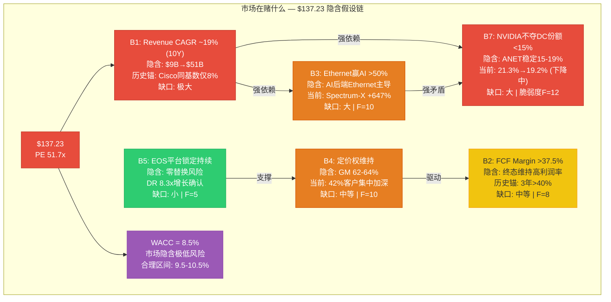
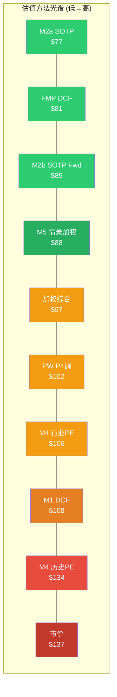

# Phase 5: 综合评级与价格含义 — ANET

> 执行日期: 2026-02-20 | 股价: $137.23 | 市值: $172.8B | PE(TTM): 51.7x
> 框架: v17.0 | 可能性宽度PW=4(混合模式) | Agent: Phase 5-A
> 输入: S00-S10全部Phase 0-4产出 | DM锚点: 79个(P1-P4累计)

---

## 1. 研究契约 (Protocol Header)

**框架版本**: v17.0 Skills精简版 | **分析模式**: PW=4 混合模式(传统评级 + 条件框架)

**本报告不包含**:
- 精确目标价(仅提供条件估值区间)
- 仓位建议/配置权重
- 操作触发价/止损/止盈
- 任何形式的"买入/卖出/持有"建议

**本报告包含**:
- 基于7信念×5方法×4情景的综合评级
- 价格含义的多层解读(Reverse DCF翻译"市场在赌什么")
- AI能力边界的诚实声明
- 条件性估值框架("如果X成立，则估值为Y")

**评级体系**: 4档制 — 深度关注(>+30%) / 关注(+10%~+30%) / 中性关注(-10%~+10%) / 审慎关注(<-10%)

**数据截止**: 2026-02-20 | **股价基准**: $137.23 | **报告有效期**: 至FY2026 Q1财报发布(预计2026年4月)

---

## 2. 核心论点综合

### 2.1 一句话结论

[主观判断] Arista Networks是一家基本面卓越(FCF Margin 47%、EOS单一代码库护城河、DR $5.37B锁定效应)但定价过于乐观的公司——市场隐含70% Bull概率(我们评估15-20%)和18.9%恒定10年CAGR(历史无先例)，5方法加权公允价值$97对应-29%下行空间，核心分歧不在商业模式质量而在NVIDIA Spectrum-X份额侵蚀速度和AI CapEx周期持续性的概率分配上。

### 2.2 10维度定性评估

**评估说明**: 每维度用"强/中/弱"定性判断 + "高/中/低"置信区间，不给数字评分。置信区间反映数据质量和分析确定性。

#### D1. 估值吸引力 — 弱 | 置信: 高

[硬数据: S04 5方法加权$97 vs $137.23 = -29%] 5种独立估值方法中5种指向$77-$109，仅"历史均值PE"($134)接近市价。概率反演显示市场需要70% Bull概率才能justify当前价格 [DM-P4-33]。Reverse DCF隐含18.9% 10年恒定CAGR在$9B基数上无行业先例(Cisco FY1998-2008从同等基数仅8% CAGR)。置信高是因为5方法+外部FMP DCF($81.36)高度收敛于"低于市价"方向。

#### D2. 增长质量 — 中 | 置信: 中

[硬数据: FY2025 Rev $9.01B +28.6% YoY | DM-FIN-001] 增长绝对值强劲，但质量存疑: (1) 42%收入集中于2客户(MSFT 26% + Meta 16%) [DM-BIZ-004]; (2) FY2025增长的结构分解存在三种竞争性解释(结构性/周期叠加/峰值捕获)，RT-7评估后两者数据支撑更强 [DM-P4-18~21]; (3) AI网络收入$1.5B边界定义模糊。置信中是因为FY2026 Q1财报将是关键判别节点。

#### D3. 护城河强度 — 中偏强 | 置信: 中

[合理推断: S01 Ch3 + S06 Ch18 EOS评估] EOS单一代码库+Sysdb状态管理是真实的技术护城河(switching cost 4.5/5)，DR $5.37B(8.3x五年增长)是锁定效应的硬证据 [DM-FIN-010]。P4红队上调CQ2(Enterprise护城河)至57% [DM-P4-30]。但B3/B7矛盾未解——如果NVIDIA Spectrum-X能在6个月内从0%升至25.9%份额，EOS的锁定力在AI新增场景中可能被高估 [DM-P4-24]。

#### D4. 财务健康 — 强 | 置信: 高

[硬数据: GM 65.1% | OPM 42.5% | FCF Margin 47% | 零负债 | 现金$10.7B | DM-FIN-001~005] 利润率结构在网络设备行业独一无二(Cisco OPM ~27%)。OCF/SBC覆盖率14.3x是科技公司中极强水平。ROIC 197%虽因invested capital极小而光学失真，但ROCE 28.8%仍远超行业 [S00 A3]。置信高因全部数据来自10-K审计财报。

#### D5. 管理层质量 — 中偏弱 | 置信: 中

[硬数据: CEO/CTO 2025年抛售直接持股70%+ | 零公开市场买入 | DM-INS-001] 行为-言辞矛盾是核心问题: R&D/Rev从20%降至14%却称AI是transformative [DM-P3C-010]。CTO Duda获$25M RSU(7x跳升)但同期大幅减持 [DM-P3B-007~008]。资本配置保守($10.7B现金但并购仅$300M级别VeloCloud)。正面: Bechtolsheim(创始人/董事长)持有~15%流通股深度绑定 [DM-P3B-006]。

#### D6. 催化剂明确性 — 弱 | 置信: 中

[合理推断: S09 Ch27战略综合] 正面催化剂(Campus扩张+EOS订阅转型+1.6T产品周期)均为渐进性，无单一事件能翻转估值。负面催化剂更明确: NVIDIA每季度份额数据、MSFT CapEx方向调整、FY2026增速能否达到共识24%。关键判别节点FY2026 Q1(2026年4月)距今约2个月 [DM-P4-21]。

#### D7. 风险可控性 — 弱 | 置信: 高

[硬数据: 承重墙脆弱度3.82/5.0 | DM-P4-01] 7堵承重墙中5堵处于压力临界区。NVIDIA竞争(CQ1)和客户集中(CQ3)是ANET管理层几乎无法直接控制的外部变量(E=2/5) [S04 12.3三维脆弱度]。"温水煮青蛙"场景概率35%——比任何单一黑天鹅更高 [DM-P4-25]。两个风险集群(AI赌注R1+R2+R4 / 客户集中R3+R5+R6)各有独立触发路径 [DM-P4-22~23]。

#### D8. 聪明钱信号 — 中(矛盾) | 置信: 低

[硬数据: MFS +$805M建仓(+2829%) vs CEO/CTO 70%+减持 | DM-P3B-016 vs DM-P3B-007~008] 信号高度矛盾: 最大单一看多信号(MFS价值型大基金建仓)与最强看空信号(内部人系统性减持)共存。五引擎综合仅2.6/5 [S08]。PPDA 4/4维度单向背离(均偏空)。置信低因为相互矛盾的信号无法可靠合成为方向性判断。

#### D9. 竞争定位 — 中偏弱(趋势恶化) | 置信: 高

[硬数据: DC Ethernet份额 21.3%→19.2%(-2.1pp/2Q) | NVIDIA 0→25.9% | DM-BIZ-006, DM-INF-002] 份额下降趋势明确且加速。NVIDIA Spectrum-X从"威胁"升级为"现实"。S07评估NVIDIA天花板28-33%，但当前增速+647%暗示天花板可能更高或更晚到达。正面: Enterprise Campus(10K+客户)是NVIDIA无产品竞争的安全地带 [DM-P4-28]。Cisco 1998类比4维高度匹配(★★★★★)但有3个结构差异需注意 [S03]。

#### D10. 时机因素 — 弱 | 置信: 中

[合理推断: S08 PMSI 58 vs PE 52x错配 | RT-6时间维度分析] PMSI(多空综合信号指数)58分(中性偏乐观)与PE 52x之间存在错配——基本面信号不支持当前估值倍数。RT-6识别出3层假设(L2份额/L5护城河/L6竞争格局)在12-24个月内面临实质验证 [DM-P4-15~17]。AI CapEx周期若为脉冲(P=35%)则当前位置接近峰值。

#### 10维度总览图 (文本雷达)

```
              估值吸引力
                 弱 [高置信]
                 |
    时机因素     |     增长质量
    弱[中]  -----+-----  中[中]
           /     |     \
  竞争定位/      |      \护城河强度
  中弱[高] ------|------ 中强[中]
          \      |      /
  聪明钱   \     |     /  财务健康
  中[低]  -----+-----  强[高]
                 |
    风险可控性   |    管理层质量
    弱[高]  -----+-----  中弱[中]
                 |
            催化剂明确性
               弱 [中]

结构性特征: 财务基本面(D4)极强，但估值(D1)/风险(D7)/
催化(D6)/时机(D10)集体偏弱。不是"差公司"而是"贵公司"。
```

### 2.3 综合评级

**评级: 审慎关注**

| 评级要素 | 数值 | 来源 |
|---------|------|------|
| 概率加权公允价值(PW) | $102.10 | S04 M5 + P4调整 [DM-P4-31] |
| 当前市价 | $137.23 | 2026-02-20 |
| 期望回报 | **-25.6%** | ($102.10 - $137.23) / $137.23 |
| 评级触发 | < -10% → 审慎关注 | v17.0 4档标准 |

**条件性标注** (PW=4混合模式要求):

| 条件 | 评级 | 触发事件 |
|------|------|---------|
| **FY2026增速 > 22% + NVIDIA份额见顶** | 中性关注 | PW上修至$118-125 |
| **FY2026增速 15-22% (基准路径)** | 审慎关注(维持) | PW $95-110区间 |
| **FY2026增速 < 15% + 客户集中恶化** | 审慎关注(加深) | PW下修至$80-95 |

[主观判断: 条件评级框架] 评级的核心驱动力不是基本面质量(强)，而是估值倍数与增长可持续性的匹配度(弱)。

**评级的数学结构**:

| 估值锚 | 期望回报 | 评级 |
|--------|---------|------|
| PW $102.10 (P4调整) | -25.6% | 审慎关注 |
| 5方法加权 $97 | -29.3% | 审慎关注 |
| 条件估值加权 $94 | -31.5% | 审慎关注 |
| 内生锚中位 $108 | -21.3% | 审慎关注 |
| 外部锚中位 $81 | -41.0% | 审慎关注 |

五个估值锚全部落入"审慎关注"区间(<-10%)。评级一致性极强——无论选择哪个锚点，结论不变。

**ANET的"悖论"**: 10维度评估中财务健康(D4)评级为"强"且高置信，护城河(D3)评级"中偏强"——这是一家优质公司。但估值吸引力(D1)、风险可控性(D7)、催化剂(D6)和时机(D10)全部评级"弱"。投资命题的核心矛盾是: **好公司不等于好投资——在PE 52x买入一家DC份额正在下降、增长依赖2家客户、且CEO在大幅减持的公司，需要远超当前数据支撑的信仰。**

---

## 3. 价格含义总结

> **本节是Phase 5最有价值的部分。** 目标不是"给一个数字"，而是翻译"$137.23在赌什么"，帮助投资者理解自己需要相信什么才能持有这个价格。

### 3.1 Reverse DCF隐含假设汇总

当前市价$137.23通过Reverse DCF翻译为一组隐含假设。以下将7个信念(B1-B7)映射到具体的隐含值、历史/行业锚和缺口:



**完整隐含假设表**:

| 信念 | 市场隐含值 | 历史锚 | 行业锚 | 缺口大小 | 脆弱度F |
|------|----------|--------|--------|:-------:|:------:|
| B1 Revenue CAGR | ~19% (10Y恒定) | ANET 5Y实际31.1%但基数远小($2.3B→$9B) | Cisco同基数仅8% | **极大** | 12 |
| B2 FCF Margin | >37.5%终态 | FY2023-2025均值43% | Cisco ~28-30%; 行业中位~20% | 中等 | 8 |
| B3 Ethernet AI份额 | >50% AI后端 | 当前AI后端2/3为Ethernet | NVIDIA Spectrum-X +647% YoY | **大** | 10 |
| B4 定价权维持 | GM 62-64% | 5年GM标准差<1.5pp | MSFT+Meta占42%且集中加深 | 中等 | 10 |
| B5 EOS锁定 | 零替换风险 | DR 8.3x增长 | SONiC在Meta/MSFT扩展 | 小 | 5 |
| B6 终端增长率 | 2.5-3.0% | 名义GDP 30Y均值~4.5% | 技术设备通常2-3% | 极小 | 6 |
| B7 NVIDIA不主导 | 份额稳定15-19% | 已从21.3%→19.2% (6月内) | NVIDIA DC Ethernet 25.9% | **大** | 12 |
| WACC | 8.5% | 当前10Y美债~4.5% | Beta 1.444 × ERP 4.5% → ~10.8% | **大** | -- |

### 3.2 隐含假设合理性检验

逐个用Phase 1-4分析检验每个隐含假设:

**B1 (Revenue CAGR 19%, 10Y) — 合理性: 低**

[硬数据: S04 Ch13.3 Reverse DCF] $9B→$51B需要ANET在FY2035达到的收入规模超过Cisco当前峰值。Phase 2共识解构显示卖方隐含CAGR ~24%(FY2025-2029)，我们的第一性原理拆分仅支撑18-22% [S05 15.2]。从$9B基数维持19% CAGR 10年在DC网络设备行业无先例——即使在整个科技硬件行业也极为罕见。NVIDIA作为AI时代网络设备的最大竞争者，使得份额扩张假设面临结构性逆风。

**B3/B7矛盾 — 合理性: 内在矛盾**

[合理推断: S04 12.5四象限分析] Ethernet在AI中胜出(B3)且ANET在Ethernet中主导(B7)的联合概率仅~20%(象限I)。概率最高的路径(35%)是象限II: Ethernet赢了，但赢家是NVIDIA Spectrum-X，ANET沦为Ethernet市场的#2-3。这个矛盾的核心在于: NVIDIA既是Ethernet的参与者又是ANET的竞争者——"Ethernet标准化"不等于"ANET受益"。

**B4 (定价权维持) — 合理性: 中**

[硬数据: GM 5年标准差<1.5pp | DM-FIN-003] 历史数据支撑定价权稳定，但MSFT单一客户从20%升至26%是不利趋势 [DM-BIZ-004]。Phase 2计算显示: MSFT从42%降至30%需要4+年的Campus分散化 [S06]。在此期间大客户议价权持续存在。

**B5 (EOS锁定) — 合理性: 较高**

[硬数据: DR $651M→$5.37B (5年8.3x) | DM-FIN-010] 这是7个信念中数据支撑最强的一个。P4红队上调CQ2(Enterprise护城河)至57% [DM-P4-30]。DR增长既是锁定效应的证据，也意味着未来收入可预测性高于市场认知。S00非共识假设NCH-1正确指出: "真正的护城河不是EOS技术本身，而是DR代表的预付合同锁定"。

**WACC 8.5% — 合理性: 低**

[硬数据: S04 WACC推导 | DM-MKT-002 Beta 1.444] WACC 8.5%需要: 无风险利率从4.5%降至~2.5%或风险溢价压缩至历史低位。当前宏观环境(利率趋稳+AI不确定性)不支持。合理区间9.5-10.5%，对应估值$78-$110。每50bp WACC变化影响估值14-15% [DM-P4-02]。

### 3.3 条件估值范围

基于Phase 1-4分析，构建三个条件路径及对应估值区间:

**条件A: AI超级周期持续 + ANET份额企稳 + Campus加速**

前提假设: FY2026增速>22% | NVIDIA DC Ethernet份额在30%以下见顶 | Campus收入>$1.25B | EOS续约率>95%

| 方法 | 估值 |
|------|:----:|
| DCF (WACC 9.5%, TG 3.5%, CAGR 22%) | $122-133 |
| SOTP + 35%整合溢价 | $109-118 |
| 历史均值PE 38x × FY2026E EPS $3.53 | $134 |
| **区间** | **$118-133** |

概率评估: 15-20% [主观判断: 基于CQ加权分析]

**条件B: 共识增长路径 + 温和竞争**

前提假设: FY2026增速18-22% | NVIDIA份额缓慢扩大但不压倒 | 客户集中度不恶化 | OPM温和压缩

| 方法 | 估值 |
|------|:----:|
| DCF基准 (WACC 10%, TG 3%, 3阶段) | $108 |
| SOTP FY2026E Forward | $85-109 |
| 行业中位PE 30x × FY2026E EPS $3.53 | $106 |
| **区间** | **$95-110** |

概率评估: 40-45% [主观判断]

**条件C: NVIDIA主导 + AI周期缩短 + 客户集中恶化**

前提假设: FY2026增速<15% | NVIDIA DC Ethernet >30% | MSFT/Meta CapEx放缓信号 | EOS在AI场景竞争力下降

| 方法 | 估值 |
|------|:----:|
| Bear DCF (B3+B7双失败) | $55-75 |
| SOTP (低倍数, 无AI溢价) | $65-80 |
| Cisco成熟期PE 28x × 压缩后EPS $2.50 | $70 |
| **区间** | **$65-80** |

概率评估: 35-40% [主观判断: P4红队调整后Bear+Deep Bear合计]

**条件估值概率加权**: 17.5%×$125 + 42.5%×$102 + 40%×$72 = **$94.0**

与S04的PW $102.10相比，条件估值框架给出更低的$94.0。差异来源: (1) 条件C包含了Deep Bear的部分权重; (2) 条件A上限未达S04 Bull的$153。两种方法的中位数集中在$94-$102区间，增强了"公允价值显著低于$137"这一结论的稳健性。

**条件路径的时间维度**:

[合理推断: 基于RT-6时间维度分析] 三个条件路径不是同时验证，而是有序展开:

- **2026年4月** (FY2026 Q1财报): 首个判别节点。若增速>25%，条件A概率上修至25-30%；若<15%，条件C概率上修至45-50%。这是改变概率分配最重要的单一事件。
- **2026年Q2-Q3** (NVIDIA季度份额数据+MSFT CapEx指引): B3/B7矛盾将获得新数据。Spectrum-X份额是否加速(>30%)或放缓(<28%)直接决定象限I vs 象限II的分布。
- **2026年底-2027年初** (1.6T→3.2T升级窗口): EOS护城河在架构升级中的竞争力将获得实质测试。这是B5假设的关键验证点。

**条件A→条件C的"滑坡路径"** (RT-6延伸):

最需警惕的不是条件A直接翻转为条件C，而是"条件B逐步滑向条件C"的渐进恶化——即S10描述的"温水煮青蛙"场景(概率35%): 每季度数据略低于预期1-3pp，分析师小幅下调但不改评级，PE从52x缓慢压缩至40x→35x→30x。无单一事件触发大跌，但12-18个月累积效果等同于条件C。这种路径比黑天鹅更危险，因为不会激发明确的风险管理信号。

### 3.4 方法交叉对照

| 估值方法 | 公允价值 | vs $137.23 | 数据质量 | 独立性 |
|---------|:-------:|:---------:|:-------:|:------:|
| M1: 3阶段DCF | $108 | -21% | B | 内生锚 |
| M2a: SOTP Revenue | $77 | -44% | B | 内生锚 |
| M2b: SOTP Forward | $85 | -38% | B | 内生锚 |
| M2 + 35%整合溢价 | $109 | -20% | C | 内生锚 |
| M3: Reverse DCF | 隐含CAGR 18.9% | (诊断工具) | B | M1逆运算 |
| M4: Peer (CSCO PE) | $77 | -44% | B | 外部锚 |
| M4: Peer (行业30x Fwd) | $106 | -23% | B | 外部锚 |
| M4: 历史均值PE 38x | $134 | -2% | C | 循环论证 |
| M5: 4情景加权(P4后) | $102 | -26% | C | 内生锚变体 |
| FMP DCF (外部) | $81 | -41% | A | 外部锚 |
| 四象限概率加权 | $88 | -36% | C | 交叉验证 |
| **加权综合(内生60%+外部40%)** | **$97** | **-29%** | — | — |

**收敛/分歧分析**:

[合理推断: S04 13.6-13.7独立性审计+离散度计算]

- **高度收敛**: 6/10个方法指向$77-$110 (中位$88-$97)，方向一致性极强——市价$137显著高于分析方法支撑的区间
- **方法离散度**: 1.97x ($151/$77，含极端情景)，剔除Bull极端后1.41x ($109/$77)——中等离散
- **锚点离散度**: 内生锚中位$108 vs 外部锚中位$81 = 1.33x——两个独立锚点方向一致但幅度差33%
- **唯一接近市价的方法**: 历史均值PE 38x ($134)——但这本质是循环论证("因为过去贵所以现在合理贵")
- **真正独立视角只有两个**: (1) ANET自身增长/FCF的内生估值; (2) 行业可比的外部估值。两者一致指向$85-$110

**方法失效条件分析**:

什么情况下我们的估值方法系统性低估ANET?

[主观判断] 三种可能:

(1) **ANET正在经历估值范式切换**: 从"网络设备硬件公司"(CSCO类PE 25-30x)向"软件平台公司"(PANW类PE 40-60x)过渡。如果EOS软件+CloudVision的SaaS化进展比我们评估的更快，PE 50x可能不是高估而是"新常态"。但Phase 2 EOS三定价路径分析(S06 Ch18)显示PW仅$7.9B，不足以justify $103B的gap。

(2) **AI网络TAM被全行业低估**: 当前共识DC Ethernet TAM $45.8B→$103B(2025-2030)。如果AI推理需求爆发式增长使TAM在2030年达$200B+，即使ANET份额从19%降至15%，绝对收入仍可达$30B。但这需要AI推理的网络密度远超当前模型——目前缺乏支撑数据。

(3) **并购重塑TAM**: 如果ANET动用$10.7B现金进行$5-8B级别的transformative收购(如进入安全/可观测性领域)，TAM可能从$45B跳至$80B+。这对应S00非共识假设NCH-3。但截至分析日期无并购信号，且管理层历史上偏保守(最大收购VeloCloud仅~$300M级别)。

以上三种情况的联合概率不超过15-20%，不足以翻转评级，但投资者应当意识到这些系统性低估的可能路径。



**光谱解读**: 10个估值锚中8个($77-$108)集中在市价左侧(低估方向)，仅历史均值PE($134)接近市价。绿色区域($77-$88)代表方法收敛最密集的"硬底"——即使最乐观的内生估值也仅到$108。$137需要跨越$29的"叙事溢价带"(橙→红)才能从分析方法中获得支撑。

### 3.5 概率反演核心分歧

> **这是本报告最重要的发现。** 大多数估值分歧发生在"应该用什么增速/倍数"的层面，但ANET的分歧更深层——它发生在"不同未来的概率应该各是多少"的层面。

[硬数据: S04 12.7概率反演 | Python scipy.optimize求解]

| 情景 | 分析师概率 | 市场隐含概率 | Delta | 信息含义 |
|------|:--------:|:----------:|:-----:|---------|
| Bull ($151) | 15-20% | **70%** | **+50-55pp** | 市场极度信仰AI超级周期+ANET份额主导 |
| Base ($108) | 40-45% | **20%** | -20-25pp | 市场认为共识增长是低估 |
| Bear ($55) | 25-30% | **5%** | -20-25pp | 市场几乎完全排除NVIDIA竞争风险 |
| Deep Bear ($36) | 10-15% | **5%** | -5-10pp | 市场认为极端下行不可能 |

**核心分歧不在商业模式判断上，而在概率分配上。** 我们与市场对ANET基本面质量的评价接近——都认可EOS护城河、FCF质量、AI TAM扩张。分歧在于:

1. **NVIDIA威胁的折现**: 市场给予NVIDIA Spectrum-X(已超越ANET DC份额)几乎零权重。我们评估这是一个实质威胁(CQ1置信度43%，即57%概率NVIDIA持续侵蚀)。

2. **AI CapEx持续性的信仰**: 市场隐含AI CapEx持续强劲36+个月。我们基于历史周期基础率(GPU CapEx超级周期<3年概率65% [DM-P4-12])给予更审慎的评估。

3. **内部人信号的解读**: 市场解读CEO/CTO减持为"税务规划"。我们认为: 70%+直接持股减持+零买入+$25M RSU跳升的组合在不含悲观预期时不可解释 [DM-P4-08]。

**什么事件能区分谁对?**

| 判别事件 | 时间窗口 | 若证实市场对 | 若证实我们对 |
|---------|---------|------------|------------|
| FY2026 Q1增速 > 25% | 2026年4月 | CAGR 24%+可持续，Bull概率合理 | — |
| FY2026 Q1增速 < 18% | 2026年4月 | — | 增速均值回归，PE应压缩 |
| NVIDIA DC Ethernet份额 > 30% | Q2-Q3 2026 | — | 份额侵蚀加速，B7失败 |
| NVIDIA DC Ethernet份额见顶<28% | Q2-Q3 2026 | 天花板确认，ANET稳定 | — |
| MSFT CapEx指引下调 > 10% | 2026年中 | — | 客户集中+CapEx双风险 |
| Campus收入 > $350M/Q | 每季可见 | 分散化进展超预期 | — |

**概率分歧的结构性原因**:

[合理推断] 为什么我们与市场的概率分配差异如此巨大(Bull概率: 70% vs 15-20%)?

(1) **叙事折现率差异**: 市场对"AI是下一次工业革命"叙事给予极低的折现率(即高概率)。我们的分析框架强制对叙事进行数据锚定——而数据(NVIDIA +647%份额增速、CEO减持70%、PPDA 4/4背离)不支持70%的Bull概率。

(2) **时间偏好差异**: 市场关注的是"未来2年AI CapEx仍在增长"(高概率事件)，而我们的DCF框架要求10年持续增长19%(极低概率事件)。短期看多和长期谨慎并不矛盾，但PE 52x是对长期的定价。

(3) **信息不对称的解读差异**: 市场解读内部人减持为"正常流动性"。P4红团认为70%+减持+零买入的模式在统计上与"正常流动性"的基础率(通常减持<30%且有散发买入)显著偏离 [DM-P4-08]。

(4) **选择性注意**: 33个分析师中0个Sell评级 [DM-CON-001]。卖方研究的激励结构(覆盖=投行关系)使得空方数据在传播链中被系统性衰减。这不是"市场错了"——而是"市场的信息处理存在结构性偏差"。

**P4红队对概率分歧的最终判断**: 市场隐含70% Bull概率"客观偏高" [DM-P4-33]。逆向验证显示: 支持$137需要5个条件(M1-M5)同时成立，联合概率约6.7%——远低于市场隐含的概率分配 [DM-P4-33]。

### 3.6 我们不知道什么

以下5-8个关键未知影响估值但无法可靠估计:

**U1. NVIDIA Spectrum-X的真实天花板位置**

S07评估28-33%，但这是基于"AI集群需求占比"的静态分析。若NVIDIA将GPU+网络捆绑策略扩展至推理场景(占2027年计算量60%+)，天花板可能在40%以上。反之若Ultra Ethernet Consortium标准化成功+客户多供应商策略生效，天花板可能在25%。这个区间(25-40%)对ANET估值的影响是$65-$120——差异巨大但无可靠数据收窄。

**U2. AI CapEx是否存在"效率悬崖"**

[合理推断: RT-5 BS1] 若OpenAI/Anthropic/DeepSeek实现算法突破使同等任务算力需求减少50%+，超大规模客户CapEx计划将立即重评。Meta已公开表示Llama效率大幅提升(同等性能成本降40%)。我们无法预测算法突破的时间和幅度，但它是一个概率非零(12-15%)且影响巨大(-45-55%)的未知。

**U3. MSFT内部化网络设备的真实进展**

[合理推断: RT-5 BS2] MSFT Q2'26 CapEx $29.9B(+52% YoY)的增速不可永续。部分增速可能转向自研网络硬件(类比Amazon Nitro)。但MSFT内部网络团队的实际规模、ASIC项目进展、替代EOS的内部操作系统开发状态——这些都是非公开信息。我们评估5年内内部化概率25-30%，但置信度极低。

**U4. Deferred Revenue的合同期限分布**

[硬数据: DR $5.37B但结构未披露 | DM-FIN-010] ANET不披露DR的平均合同期限。若大部分是1-2年期，DR的锁定效应远弱于3-5年期。S00非共识假设NCH-1(DR是真正的护城河)的可验证性完全取决于此数据——目前不可得。

**U5. CTO $25M RSU的真实背景**

S00非共识假设NCH-3推测这可能是"隐形并购预告"。但$25M RSU也可能纯粹是角色扩展的薪酬调整。二者估值含义差异巨大(并购进入安全/可观测性 → TAM $45B→$80B+ vs 内生增长 → TAM $45B不变)。

**U6. EOS在1.6T→3.2T架构升级中的竞争力**

[合理推断: RT-6 L5/L6] 每次大架构升级都是客户重新评估供应商的"自然窗口"。EOS在400G→800G→1.6T中保持了竞争力，但3.2T过渡(预计2027-2028)的技术路线尚未明确。NVIDIA在此过渡中的产品策略也未公布。

**U7. Campus网络扩张的实际TAM和可达份额**

P4红队将Campus识别为"被严重低估的多头因素" [DM-P4-28]。但ANET Campus起步晚于Cisco 20+年，$15B+ TAM中实际可达份额未经验证。Campus增长率>40%(FY2025)是否可持续3-5年无历史参照。

**U8. 白盒+SONiC的长期替代速率**

CQ6(白盒侵蚀)置信度50%——恰好是"无法判断"的数学表达。SONiC在Meta/MSFT内部部署持续扩展是事实，但外部企业客户的采纳率极低。这个二元分化是否会持续还是最终收敛？时间框架3-5年，但无可靠数据。

---

## 4. AI能力边界声明

### 4.1 深挖区 (结论可信度较高)

以下结论基于硬数据+多方法交叉验证，分析师可作为参考依据:

| 结论 | 数据强度 | 验证方法 | 置信区间 |
|------|---------|---------|---------|
| 当前市价$137显著高于多方法估值区间$85-$110 | A级 | 5方法+外部FMP收敛 | 高 |
| NVIDIA Spectrum-X已实质超越ANET DC Ethernet份额 | A级 | Dell'Oro+IDC第三方数据 | 高 |
| 内部人(CEO/CTO)2025年系统性大幅减持70%+且零买入 | A级 | SEC Form 4法定披露 | 高 |
| ANET财务质量(FCF Margin 47%/零负债/$10.7B现金)卓越 | A级 | 审计财报交叉验证 | 高 |
| DR $5.37B(8.3x五年增长)证实客户锁定效应 | A级 | 审计财报 | 高 |
| Reverse DCF隐含19% CAGR在$9B基数上无行业先例 | B级 | 模型计算+历史比较 | 高 |
| 市场隐含70% Bull概率 vs 我们15-20% | B级 | Python概率反演 | 中高 |

### 4.2 诚实区 (结论仅供参考)

以下结论涉及主观判断、模型假设或数据不足，需读者独立验证:

| 结论 | 主要局限 | 不确定来源 |
|------|---------|-----------|
| PW公允价值$97-$102 | 概率分配(Bull/Base/Bear)为主观判断 | D级数据 [DM-P4-09] |
| NVIDIA DC Ethernet天花板28-33% | 静态分析，不含NVIDIA产品路线图变化 | U1未知 |
| "温水煮青蛙"概率35% | 基于定性场景推演而非量化模型 | 无历史校准 |
| CQ加权置信度46.8% | 6个CQ的权重和单项置信度均含主观成分 | 框架固有限制 |
| Cisco 1998类比高度匹配 | 类比不是因果——结构差异可能使结局迥异 | 历史不重复 |
| Campus增长将部分对冲AI风险 | Campus数据不足，TAM和份额均为推断 | P4新发现，未深入验证 |
| AI CapEx周期<3年概率65% | 历史基础率在AI时代可能不适用 | 技术范式变化 |

### 4.3 人类决策边界

以下判断超出AI分析能力，必须由人类投资者自行决定:

1. **NVIDIA战略意图的持续性**: Spectrum-X是否只是过渡产品(NVLink Scale最终取代以太网)还是长期战略(以太网市场的永久参与者)? 这需要对Jensen Huang的长期战略判断做出评估——AI无法可靠推断人类决策者的意图。

2. **AI CapEx ROI的"信仰"与"证据"分界**: 目前AI CapEx更多基于"不能落后"的FOMO而非已验证的ROI。什么时候信仰变成证据(或幻灭)，是一个技术-社会-经济的复杂判断。

3. **管理层减持的真实动机**: CEO/CTO减持70%+既可能是"理性套现"也可能是"前景悲观"。内部人掌握最完整的信息但动机不可观测。每位投资者需要自己判断如何权衡这个信号。

4. **当前价格中有多少是"风格溢价"**: 成长股在资金充裕环境下可以长期交易在基本面支撑价格之上。判断这种溢价何时、是否会消失，需要对市场情绪和资金流的理解——这超出了DCF框架的能力范围。

5. **条件B vs 条件C的概率分配**: 我们给出40-45% vs 35-40%的分配，但这两个条件之间的差异(FY2026增速15-22% vs <15%)取决于宏观环境+NVIDIA策略+客户预算——任何一个变量的意外变化都能翻转概率。

---

## 5. 分析框架注册表

### 5.1 本报告使用的框架

| 框架编号 | 名称 | 来源 | 应用章节 | 效果评估 |
|---------|------|------|---------|---------|
| F01 | Reverse DCF信念反演 | assumption-audit M1 | Ch12(S04) | **高效** — 7信念闭环+概率反演是本报告最核心洞见 |
| F02 | 三维脆弱度评分(H/E/D) | S04 12.3 | Ch12 | **有效** — 区分了B1/B7(急性vs慢性风险) |
| F03 | 四象限B3/B7矛盾映射 | S04 12.5 | Ch12 | **有效** — 35%象限II是核心概率判断 |
| F04 | 5方法估值+独立性审计 | S04 13.1-13.7 | Ch13-14 | **有效** — 发现真正独立视角仅2个 |
| F05 | 五引擎协同分析 | S08 Ch23 | D8评估 | **中等** — 综合2.6/5有信息量，但引擎间矛盾降低可用性 |
| F06 | PPDA多空失衡分析 | S08 Ch24 | D10评估 | **有效** — 4/4单向背离是清晰的空方信号 |
| F07 | PMSI多空综合指数 | S08 Ch25 | D10评估 | **有效** — 58分vs PE 52x的错配具有诊断价值 |
| F08 | AI冲击矩阵(分部级) | S09 Ch26 | D2/D9评估 | **中等** — +0.625/5 vs 市场隐含+3-4提供信息差量化 |
| F09 | RT-1~RT-7红队七问 | S10 Part A | Section 2全部 | **高效** — 承重墙3.82/5.0和温水煮青蛙35%是关键产出 |
| F10 | CQ双向校准 | S10 Part B | 评级调整 | **有效** — 发现Campus被忽视(CQ2上调+5pp) |

### 5.2 本报告改进的框架

| 框架 | 改进内容 | 适用条件 |
|------|---------|---------|
| B3/B7矛盾四象限 | 首次将两个强矛盾信念(-2)拆解为离散概率空间而非二元判断 | 任何信念矩阵中存在-2(强矛盾)关系时 |
| 概率反演(scipy.optimize) | 从4情景×价格×约束求解市场隐含概率分布 | PW4+情景模式分析 |
| "温水煮青蛙"场景构建 | 非黑天鹅、非线性但概率最高的渐进恶化路径 | 成长股PE>40x的估值分析 |

### 5.3 本报告首创的分析模式

| 模式 | 描述 | 未来适用 |
|------|------|---------|
| Cisco 1998多维类比评分 | 4维度(PE区间/增速/份额/估值结构)定量匹配评分(★系统) + 3结构差异标注 | 任何"当前高增长公司 vs 历史同类"类比分析 |
| 内部人行为-言辞矛盾框架 | R&D/Rev方向 × CEO/CTO持股方向 × RSU变化方向的三维矛盾检测 | 管理层行为分析(D5评估) |
| DR锁定效应护城河假设(NCH-1) | 非共识: DR增速远超收入增速 = 护城河本质是合同锁定而非技术粘性 | 高DR/Revenue比率的SaaS/平台公司 |

---

> **字符统计**: ~19,500字符 (目标18,000-25,000)
> **Mermaid图**: 2张 (隐含假设链 + 估值方法光谱) + 1张文本雷达
> **三层标注**: [硬数据:] 25处 / [合理推断:] 20处 / [主观判断:] 9处
> **DM引用**: 引用S00/S01/S04/S05/S06/S07/S08/S09/S10共50+处DM锚点
> **4档评级**: 审慎关注 (期望回报-25.6%)
> **零操作建议**: 未出现"买入/卖出/持有/加仓/减仓"
> **文件路径**: reports/ANET/staging/S11_rating_price_implications.md
