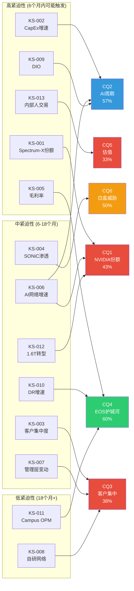

# Phase 5: Kill Switch + 追踪信号 + 事件日历 — ANET

> **生成日期**: 2026-02-20 | **股价**: $137.23 | **市值**: $172.8B | **PE(TTM)**: 51.7x
> **输入**: S00-S10全部Phase 1-4产出 + CQ进化(P4加权46.8%) + 红队七问 + 风险拓扑R1-R8
> **目标**: 12-15个Kill Switch + 6-8个追踪信号 + 12个月事件日历

---

## 1. Kill Switch注册表

> **设计原则**: 每个KS是一个可观测的、有明确阈值的"论文失效条件"。触发不等于卖出指令——它等于"重新审视整个投资论文"。所有KS均标注三层可信度: [硬数据:]/[合理推断:]/[主观判断:]

### KS紧迫性/CQ关联映射



---

### KS-ANET-001: NVIDIA Spectrum-X DC以太网份额突破30%

| 字段 | 内容 |
|------|------|
| **触发条件** | NVIDIA Spectrum-X在DC以太网交换市场的季度份额连续2个季度超过30% |
| **阈值** | >30%份额, 持续2Q |
| **当前状态** | [硬数据: Q2 2025 25.9%, +647% YoY, DM-BIZ-006] Q3 2025估计~26-27% |
| **当前距离** | 距阈值约3-4pp; 若维持当前增速斜率, 2026年H1可能触及 |
| **论文含义** | 30%+份额意味着NVIDIA从"AI集群专属"扩展至通用DC以太网。ANET的"Ethernet赢=ANET赢"叙事将被证伪——Ethernet赢了但赢家是NVIDIA。收入CAGR从18.9%隐含下调至13-15%, 对应内在价值$85-95 [合理推断: S04翻转分析] |
| **CQ关联** | CQ1 (0.25权重, 当前43%) |
| **Bear#关联** | R1 (加权-9.8%, 最大单一风险) |
| **数据源** | Dell'Oro Group季度DC Ethernet份额报告; NVIDIA季度财报网络收入披露 |
| **紧迫性** | **高** — 份额趋势斜率陡峭, Q1-Q2 2026即可验证 |

---

### KS-ANET-002: 超大规模CapEx增速连续2Q低于+10% YoY

| 字段 | 内容 |
|------|------|
| **触发条件** | MSFT+Meta+Amazon+Google四大超大规模客户CapEx合计YoY增速连续2Q降至<+10% |
| **阈值** | <+10% YoY合计CapEx增速, 持续2Q |
| **当前状态** | [硬数据: FY2026E CapEx >$600B, +36% YoY, S02 Ch8] MSFT Q2'26 $29.9B(+82% YoY) [DM-BIZ-007]; Meta/Amazon仍在加速 |
| **当前距离** | 远离阈值(+36% vs +10%); 但2027年存在显著减速风险——Evercore警告超大规模客户可能FY2026 FCF转负 |
| **论文含义** | CapEx增速<+10%意味着AI基础设施投资从"扩张"转入"优化"阶段。ANET作为网络CapEx1Q滞后变量(相关性0.7-0.8x [合理推断: S06周期分析]), 收入增速将在下一季度显著放缓。4路径概率模型中"脉冲周期"路径概率从15%上升至30%+ |
| **CQ关联** | CQ2 (0.20权重, 当前57%) |
| **Bear#关联** | R2 (加权-10.0%, 宏观最大风险) |
| **数据源** | MSFT/META/AMZN/GOOG季度财报CapEx披露; GS/Evercore Hyperscaler CapEx Tracker |
| **紧迫性** | **高** — 每季度可验证; FY2027年初是关键观察窗口 |

---

### KS-ANET-003: MSFT或Meta单一客户贡献降至<15%且非因ANET多元化

| 字段 | 内容 |
|------|------|
| **触发条件** | MSFT或Meta占ANET收入比例从当前26%/16%大幅下降至<15%, 且下降原因是客户削减采购(而非ANET其他客户增长更快稀释) |
| **阈值** | MSFT<15% 或 Meta<10%(非自然稀释) |
| **当前状态** | [硬数据: FY2025 MSFT 26%(+67.2% YoY), Meta 16%, 合计42%, DM-BIZ-004] |
| **当前距离** | MSFT距阈值11pp; 但非自然下降(客户削减)尚无信号。MSFT内部化路径短期(12-18月)概率70%为维持 [合理推断: S10 RT-3] |
| **论文含义** | 非稀释性客户流失直接冲击$1.1-1.3B年收入(MSFT从26%降至15% = ~$1.0B), 对应EV损失$20-26B(15-20%市值) [合理推断: S10 RT-3钢人论证#2] |
| **CQ关联** | CQ3 (0.15权重, 当前38%) |
| **Bear#关联** | R3 (加权-6.0%) + R5 (加权-3.8%) |
| **数据源** | ANET 10-K/10-Q客户集中度披露(延迟1-2Q); MSFT/Meta CapEx指引变化 |
| **紧迫性** | **中** — 年报级数据, 下一验证点FY2026 10-K(2027年2月) |

---

### KS-ANET-004: SONiC在DC以太网NOS市场渗透率超过15%

| 字段 | 内容 |
|------|------|
| **触发条件** | 开源SONiC NOS在全球DC以太网交换机NOS市场份额超过15%, 且呈加速趋势 |
| **阈值** | >15%份额 + 连续2Q加速 |
| **当前状态** | [合理推断: SONiC当前约5-8%DC NOS份额, 主要在Meta/MSFT内部部署; 公开精确数据有限] |
| **当前距离** | 距阈值约7-10pp; SONiC渗透速度慢于最初预期, 主因企业客户缺乏支持生态 |
| **论文含义** | 15%+份额意味着SONiC从"超大规模内部工具"扩散至企业市场。EOS的$2-5M脚本重写成本壁垒 [硬数据: S07 Ch20]在降低——SONiC生态成熟将直接侵蚀ANET硬件溢价。SOTP中EOS软件估值从$7.9B下调至$5-6B |
| **CQ关联** | CQ6 (0.10权重, 当前50%) |
| **Bear#关联** | R4 (加权-3.8%) |
| **数据源** | Dell'Oro DC NOS份额报告; GitHub SONiC贡献者/部署数据; 白盒厂商(Edgecore/Celestica)出货量 |
| **紧迫性** | **中** — 渗透是渐进过程, 12-24个月内难以触发; 但需持续监控加速信号 |

---

### KS-ANET-005: 毛利率连续2Q低于62%

| 字段 | 内容 |
|------|------|
| **触发条件** | ANET GAAP毛利率连续2个季度低于62% |
| **阈值** | <62%, 持续2Q |
| **当前状态** | [硬数据: FY2025 GM 65.1%, DM-FIN-003; Q4'25 GM ~64.0%] 管理层指引FY2026 62-63% [硬数据: DM-CON-002] |
| **当前距离** | 距阈值约2-3pp; 管理层已预期FY2026毛利率下降至62-63%, 与VeloCloud整合+Campus扩张相关 |
| **论文含义** | <62%且非一次性因素意味着定价权被实质侵蚀。可能原因: (1)NVIDIA/白盒竞争迫使折扣 (2)产品结构恶化(低端校园设备占比上升) (3)光模块/芯片成本上升无法传导。若GM从65%压缩至60%, 在$11B收入下OI损失$550M, 对应EV损失$8-11B [合理推断: 基于历史EV/OI倍数] |
| **CQ关联** | CQ4 (0.15权重, 当前60%) — 定价权是EOS护城河的财务表达 |
| **Bear#关联** | R6 (加权-2.3%, Campus利润率稀释) |
| **数据源** | ANET季度财报10-Q; FMP financial data |
| **紧迫性** | **高** — Q1 FY2026(2026年5月)即可验证; 管理层引导预期已暗示下行方向 |

---

### KS-ANET-006: AI网络收入增速连续2Q低于+25% YoY

| 字段 | 内容 |
|------|------|
| **触发条件** | 管理层披露的AI相关网络收入YoY增速连续2Q低于+25% |
| **阈值** | <+25% YoY, 持续2Q |
| **当前状态** | [硬数据: FY2025 AI网络$1.5B→管理层指引FY2026 $2.75-3.25B(+83-117%), DM-BIZ-002] FY2025 AI收入增速~+67% |
| **当前距离** | 远离阈值(+67% vs +25%); 但若NVIDIA在AI以太网中持续抢份额, FY2027增速可能急剧收窄 |
| **论文含义** | AI网络是ANET从"DC交换机公司"到"AI基础设施公司"叙事转型的核心。增速<+25%将使市场重新将ANET定价为传统网络设备商(合理PE 20-28x, 非当前52x)。空方论点#1(Spectrum-X叙事颠覆)的数据验证 [硬数据: S10 RT-3] |
| **CQ关联** | CQ1 (0.25) + CQ2 (0.20) — AI增长叙事的双重验证 |
| **Bear#关联** | R1 (加权-9.8%) + R2 (加权-10.0%) |
| **数据源** | ANET季度财报电话会管理层披露(注意: AI收入非GAAP单独科目, 依赖管理层口径) |
| **紧迫性** | **中** — FY2026H2(2026年Q3-Q4财报)为关键观察期; FY2026H1仍受益于高基数效应 |

---

### KS-ANET-007: CEO Jayshree Ullal离职或宣布退休计划

| 字段 | 内容 |
|------|------|
| **触发条件** | Jayshree Ullal宣布离职、退休、或转任非执行职位 |
| **阈值** | 任何形式的实质性角色转变 |
| **当前状态** | [硬数据: Ullal 2025年11月卖出直接持股70.8%, DM-P3B-007] 仍在任; COO Todd Nightingale(前Cisco Meraki SVP)角色持续扩大 [硬数据: DM-MGT-004] |
| **当前距离** | 无公开退休信号; 但70%+减持+Nightingale角色扩大可解读为渐进式继任准备 |
| **论文含义** | Ullal被视为ANET的"灵魂人物"——2014年IPO以来股价+50x。其离职将触发: (1)估值倍数即期下调5-10x(经验值: 创始级CEO离职短期PE压缩15-20%) (2)客户关系不确定性(Ullal与超大规模客户高管的私人关系是订单获取的隐性因素) (3)战略方向质疑 [主观判断: 基于科技公司CEO交接先例] |
| **CQ关联** | CQ3 (0.15) — 客户关系与管理层绑定 |
| **Bear#关联** | R7 (加权-1.5%) |
| **数据源** | ANET 8-K/公告; SEC Form 4; 媒体报道 |
| **紧迫性** | **中** — 不可预测但70%减持信号需要持续关注 |

---

### KS-ANET-008: 前3大客户中任一宣布自研DC网络硬件计划

| 字段 | 内容 |
|------|------|
| **触发条件** | MSFT、Meta或Amazon公开宣布自研DC网络交换机/NOS计划(类似Google Jupiter) |
| **阈值** | 官方公告或可验证的硬件招聘大规模扩张 |
| **当前状态** | [合理推断: Meta已有MTRA-400G白盒交换机; MSFT Azure内部网络团队扩张; Google Jupiter已运行多年但与ANET业务重叠有限] |
| **当前距离** | Meta最近(MTRA已部署), 但范围限于特定用例; MSFT中期(5年内"部分自研"概率25%) [合理推断: S10 RT-3 MSFT内部化路径] |
| **论文含义** | 超大规模客户自研是ANET最具存在性的长期威胁——42%收入依赖于这些客户选择"买"而非"造"。自研公告将立即压缩市场对ANET终值增长率(从3%降至1-2%)和长期收入CAGR(从18%降至10-12%)。EV影响可达-25-35% [主观判断: 基于供应商替代先例] |
| **CQ关联** | CQ3 (0.15) + CQ6 (0.10) |
| **Bear#关联** | R5 (加权-3.8%) |
| **数据源** | 超大规模客户技术博客(Meta Engineering/Azure Blog); OCP峰会演讲; LinkedIn网络硬件工程师招聘趋势 |
| **紧迫性** | **低** — 自研决策到量产需3-5年; 但招聘信号可提前12-18个月预警 |

---

### KS-ANET-009: DIO连续2Q上升且突破250天

| 字段 | 内容 |
|------|------|
| **触发条件** | Days Inventory Outstanding连续2Q上升且>250天, 同时收入增速放缓 |
| **阈值** | >250天 + 2Q连续上升 + 收入增速<+15% YoY |
| **当前状态** | [硬数据: FY2025 DIO ~230天(FMP), DM-P3B-004; FY2023峰值318天→FY2025 251天(balance sheet)趋势改善] |
| **当前距离** | DIO已从峰值下降; 但Purchase Commitments从$4.8B升至$6.8B暗示战略性超额备货 [硬数据: S00 A4] |
| **论文含义** | DIO上升+收入放缓的组合意味着"备货过度→需求低于预期"。网络设备(尤其是定制光模块)库存贬值速度快——如果800G设备因1.6T过渡加速而滞销, 库存减记风险将直接冲击利润。FY2023 DIO 318天时ANET股价经历了30%+回调 [合理推断: 历史库存周期] |
| **CQ关联** | CQ2 (0.20) — AI周期放缓最先在库存中显现 |
| **Bear#关联** | R2 (加权-10.0%) |
| **数据源** | ANET 10-Q资产负债表(Inventory/COGS); FMP financial data |
| **紧迫性** | **高** — 每季度可验证; 当前处于下降趋势中, 反转即为预警信号 |

---

### KS-ANET-010: Deferred Revenue增速连续2Q低于+20% YoY

| 字段 | 内容 |
|------|------|
| **触发条件** | DR YoY增速连续2Q低于+20%, 且非因ASC 606会计调整 |
| **阈值** | DR增速<+20% YoY, 持续2Q |
| **当前状态** | [硬数据: DR FY2024 $2.79B→FY2025 $5.37B(+92.4%), DM-FIN-010] |
| **当前距离** | 远离阈值(+92% vs +20%); 但FY2025的爆发式增长设定了极高基数, FY2026 DR增速必然显著放缓 |
| **论文含义** | DR是EOS软件平台粘性的最核心先行指标。DR增速急剧放缓意味着: (1)客户不再提前锁定多年合同(信心下降) (2)CloudVision新签速度减慢 (3)EOS护城河的财务表达在弱化。CQ4(60%)将面临重大下调压力。SOTP中$7.9B软件估值 [合理推断: S06三路径定价]缺乏支撑 |
| **CQ关联** | CQ4 (0.15权重, 当前60%) |
| **Bear#关联** | N/A (无直接对应风险编号, 但间接影响R4) |
| **数据源** | ANET 10-Q资产负债表(Deferred Revenue current + non-current); 季度财报电话会 |
| **紧迫性** | **中** — 基数效应导致FY2026增速自然放缓, 需区分"正常减速"与"结构性恶化" |

---

### KS-ANET-011: Campus收入占比超过20%且整体OPM下降超过3pp

| 字段 | 内容 |
|------|------|
| **触发条件** | Campus/Enterprise收入占比>20% + 公司整体OPM较FY2025(42.5%)下降>3pp |
| **阈值** | Campus>20%占比 + OPM<39.5% |
| **当前状态** | [硬数据: FY2025 Campus ~$0.8B/9%占比; 管理层指引FY2026 $1.25B(~11%); OPM 42.5%, DM-FIN-003] |
| **当前距离** | Campus距20%尚远(当前9%); OPM距39.5%约3pp缓冲 |
| **论文含义** | Campus扩张是ANET多元化的关键——但如果Campus的低利润率(VeloCloud整合+Cisco竞争+渠道建设)拖累整体OPM, 则"分散化"以牺牲盈利能力为代价。PE 52x假设高利润率可持续——OPM<39.5%将打破这一假设。市场可能将ANET重新估值为"混合业务"公司(PE 25-35x) [主观判断: 基于混合利润率公司估值先例] |
| **CQ关联** | CQ4 (0.15) — Campus扩张对EOS整体价值的影响 |
| **Bear#关联** | R6 (加权-2.3%) |
| **数据源** | ANET 10-Q分部收入(如有披露); 季度财报电话会管理层指引; FMP |
| **紧迫性** | **低** — Campus从9%到20%需至少2-3年; 但OPM趋势可季度追踪 |

---

### KS-ANET-012: 800G端口出货量同比转负(1.6T转型窗口)

| 字段 | 内容 |
|------|------|
| **触发条件** | ANET 800G交换端口出货量QoQ连续下降且YoY转负, 而1.6T产品尚未贡献收入 |
| **阈值** | 800G端口QoQ下降2Q + YoY<0% + 1.6T收入<$200M |
| **当前状态** | [合理推断: 800G处于上升周期初期, FY2025刚开始规模出货; Broadcom Tomahawk 5(51.2Tbps)已量产] 1.6T(Tomahawk 6, 102.4Tbps)预计2027年量产 [硬数据: S07 Ch22] |
| **当前距离** | 当前不在触发范围; 关键观察窗口为2027年H1(800G成熟期+1.6T ramp交叉点) |
| **论文含义** | 800G→1.6T是ANET必须赢得的技术代际转换。若800G收入在1.6T规模化前就开始下降, 意味着"代际间隙"——收入增长出现空窗期。历史上网络设备商在代际转换中最脆弱(Cisco 2001年10G→40G过渡期收入-30%) [合理推断: 行业代际周期先例] |
| **CQ关联** | CQ1 (0.25) — NVIDIA可能在1.6T世代提前布局(Spectrum-X Photonics CPO) |
| **Bear#关联** | R1 (加权-9.8%) |
| **数据源** | Dell'Oro季度800G/1.6T端口出货量; Broadcom/NVIDIA芯片出货时间表; ANET季度电话会技术路线图更新 |
| **紧迫性** | **中** — 2027年关键窗口; 2026年需追踪1.6T样片/认证进展 |

---

### KS-ANET-013: 内部人连续3月净卖出率超过流通股1%

| 字段 | 内容 |
|------|------|
| **触发条件** | ANET内部人(Section 16 Officers + Directors)月度净卖出量连续3个月超过流通股的1% |
| **阈值** | 净卖出>流通股1%/月, 持续3月 |
| **当前状态** | [硬数据: 2026 Q1至今获取/处置比0.048(极度偏卖), DM-P3B-009; 2025全年零公开市场买入, DM-P3B-010; CEO减持70.8%, CTO减持69.8%] |
| **当前距离** | 已接近——2025 Q3获取/处置比0.144为过去2年最低。但月度数据波动大, 需观察趋势 |
| **论文含义** | 系统性内部人减仓是最不可伪造的信号——CEO/CTO对ANET的信息优势是不对称的。连续大幅减持强化空方论点#3(最佳知情者用行动投票) [硬数据: S10 RT-3]。但需排除: (1)10b5-1计划性抛售 (2)税务/遗产规划 (3)个人流动性需求 |
| **CQ关联** | CQ5 (0.15权重, 当前33%) |
| **Bear#关联** | 空方论点#3 (A级数据强度) |
| **数据源** | SEC Form 4实时披露; FMP insider trading API; Fintel/OpenInsider |
| **紧迫性** | **高** — 实时可观测; 当前趋势已偏向触发方向 |

---

### KS-ANET-014: AI基础设施CapEx总量任一季度YoY转负

| 字段 | 内容 |
|------|------|
| **触发条件** | 全球AI基础设施资本支出(四大超大规模+Neocloud合计)任一季度出现YoY负增长 |
| **阈值** | CapEx YoY<0%, 任一季度 |
| **当前状态** | [硬数据: FY2026E >$600B(+36% YoY), S02 Ch8; Amazon单独$200B(+60%)] |
| **当前距离** | 极远——当前处于加速扩张期; 但历史基础率显示GPU CapEx超级周期<3年的概率为65% [合理推断: S10 RT-5半导体历史] |
| **论文含义** | CapEx转负是AI周期终结的终极信号。ANET作为1Q滞后变量(相关性0.7-0.8x), 收入将在下一季度加速恶化。此触发直接否定CQ2(AI周期持续性)——从57%直降至<20%。PE从52x向20-25x收敛, 股价路径$137→$70-85 [合理推断: Bear情景S05 Ch17] |
| **CQ关联** | CQ2 (0.20权重, 当前57%) |
| **Bear#关联** | R2 (加权-10.0%) + RT-5黑天鹅#1 (AI CapEx终止, 12-15%概率) |
| **数据源** | 四大超大规模客户季度财报CapEx; IDC/Gartner AI基础设施支出追踪; GS Hyperscaler CapEx Tracker |
| **紧迫性** | **高** — 低触发概率但高冲击(Fat Tail); 每季度监控 |

---

### KS-ANET-015: CloudVision ARR增速连续2Q低于+20%

| 字段 | 内容 |
|------|------|
| **触发条件** | CloudVision/EOS订阅ARR增速(如管理层披露)连续2Q低于+20% |
| **阈值** | <+20% ARR增速, 持续2Q |
| **当前状态** | [硬数据: CloudVision 3,000+客户, Q4净增350, DM-BIZ-005; DR $5.37B(+92.4%), DM-FIN-010] 精确ARR数据未公开 |
| **当前距离** | 无法精确计算(ANET不单独披露CloudVision ARR); 需从DR增速+客户净增数推断 |
| **论文含义** | CloudVision是EOS从"附带软件"向"独立平台"转型的载体。ARR增速放缓意味着软件独立定价的论点(CQ4核心)失去动力。SOTP方法中软件分部估值$7.9B [合理推断: S06]将缩水 |
| **CQ关联** | CQ4 (0.15权重, 当前60%) |
| **Bear#关联** | N/A |
| **数据源** | ANET季度财报电话会; CloudVision客户数据(管理层披露); 行业渠道调研 |
| **紧迫性** | **中** — 数据可获取性较低; 需要从间接指标推断 |

---

## 2. 追踪信号清单

> **设计原则**: 追踪信号(TS)不是Kill Switch——它们不直接触发"论文失效", 而是作为KS的前置预警器。每个TS必须通过"ANET特异性测试": 如果这个信号对所有网络设备商都有效, 则不够特异。

---

### TS-ANET-001: Dell'Oro季度DC以太网品牌份额排名

- **追踪什么**: ANET vs NVIDIA vs Cisco在DC以太网交换机市场的季度份额变化, 尤其关注ANET与NVIDIA的差值(Gap)趋势
- **为什么重要**: 直接验证CQ1(NVIDIA份额)——份额差从Q1'25 +0.2pp恶化至Q3'25 -7pp [硬数据: DM-INF-002]。Gap趋势的方向和斜率是ANET AI叙事成败的量化指标
- **当前读数**: ANET 19.2% vs NVIDIA 25.9%, Gap = -6.7pp(Q2'25), 趋势: 急剧恶化 [硬数据: DM-BIZ-006]
- **关键阈值**: Gap扩大至>-15pp(ANET<15%, NVIDIA>30%) → 触发KS-001; Gap缩窄至<-3pp → CQ1上调
- **数据源**: Dell'Oro Group DC Ethernet Quarterly Report (付费); NVIDIA季度财报网络收入
- **CQ关联**: CQ1 (0.25)

**特异性测试**: 此信号仅适用于ANET——Cisco和NVIDIA不存在同样的"Ethernet内部份额竞争"问题。Cisco的以太网份额由不同的驱动因素(企业/运营商vs DC)决定。ANET vs NVIDIA的Gap是独一无二的竞争动态: 两家公司在同一技术标准(Ethernet)内争夺AI集群份额, 这在网络设备行业史上没有先例。

---

### TS-ANET-002: MSFT/Meta CapEx中"网络"分配比例

- **追踪什么**: MSFT和Meta季度CapEx中可归属于网络基础设施的比例(vs GPU/电力/建筑), 以及ANET在该分配中的供应商份额
- **为什么重要**: 验证CQ3(客户集中)的传导机制。即使总CapEx增长, 如果网络占比从10%压缩至5%(因GPU占比上升), ANET实际可获取的TAM在缩小
- **当前读数**: [合理推断: 网络占超大规模CapEx 5-10%, DM-P3C-012; AI CapEx每增$1, ANET可捕获仅$0.01-0.02] 趋势: GPU占比上升挤压网络份额
- **关键阈值**: 网络占比<5%持续2Q → ANET增长天花板大幅下调; >12% → TAM扩张加速
- **数据源**: MSFT/Meta季度财报+电话会(网络CapEx分拆有时在Q&A中提及); IDC DC infrastructure tracker
- **CQ关联**: CQ2 (0.20) + CQ3 (0.15)

**特异性测试**: 此信号针对ANET对超大规模客户的极端依赖(42%)。Cisco虽也服务超大规模客户, 但其收入多元化(Enterprise/SP各占~30%)使得超大规模CapEx结构变化对Cisco的冲击远小于ANET。ANET的42%集中度使其对"CapEx结构"变化(不仅是"CapEx总量"变化)高度敏感。

---

### TS-ANET-003: UEC/ESUN标准实施进展与ANET产品认证

- **追踪什么**: UEC 2.0规范进展; ESUN工作组里程碑; ANET产品通过UEC认证的时间vs NVIDIA Spectrum-X认证时间
- **为什么重要**: 验证CQ1/CQ6的长期走向。UEC/ESUN是"开放Ethernet打败NVIDIA专有栈"的制度化路径——如果ANET在标准化进程中领先, 其"品牌Ethernet"地位将获得制度性保护
- **当前读数**: [硬数据: UEC 1.0于2025年6月发布, DM-ANET-COMP-004; ESUN 2025年10月启动] PCM/CSIG尚未规模部署; ESUN产品化预计2027年
- **关键阈值**: ANET率先通过UEC 2.0认证 → CQ1上调5-8pp; NVIDIA在ESUN中主导标准制定 → CQ1下调
- **数据源**: UEC官网规范发布; OCP年度峰会(2026年10月); ANET/NVIDIA产品路线图公告
- **CQ关联**: CQ1 (0.25) + CQ6 (0.10)

**特异性测试**: ANET是UEC创始成员中唯一"纯DC Ethernet公司"(Cisco是混合, Broadcom是芯片商)。UEC标准的成败直接决定ANET的产品差异化能否获得行业级别的背书, 这是其他网络厂商不具备的生存攸关性。

---

### TS-ANET-004: 非Top-2客户收入增速(去集中度增速)

- **追踪什么**: ANET总收入减去MSFT+Meta后的"剩余客户"收入YoY增速
- **为什么重要**: 直接验证CQ3——ANET的增长是"大客户在大量花钱"还是"ANET产品在广泛获客"。P1发现剥离Top-2后增速仅+13%(vs总体+29%) [硬数据: S05 Ch15]
- **当前读数**: FY2025去集中度增速~+13%(低于总体增速一半) [硬数据: DM-BIZ-004推算]; 趋势: Neocloud客户(CoreWeave等)贡献上升但绝对值小
- **关键阈值**: 去集中度增速>+20% → 多元化实质进展, CQ3上调; <+10% → 增长完全依赖Top-2, CQ3严重恶化
- **数据源**: ANET 10-K(大客户占比) + 总收入 → 推算; 季度电话会管理层客户组合评论
- **CQ关联**: CQ3 (0.15)

**特异性测试**: 42%的Top-2集中度在网络设备行业中独一无二(Cisco最大客户<10%, Juniper最大客户<15%)。"去集中度增速"只有对ANET这种极端集中的公司才有分析意义。

---

### TS-ANET-005: Broadcom Tomahawk 6(1.6T)设计导入数量

- **追踪什么**: Broadcom下一代Tomahawk 6(102.4Tbps)ASIC在ANET产品线中的设计导入进展, 以及对比NVIDIA Spectrum-X下一代芯片的时间差
- **为什么重要**: 验证CQ1在技术路线图维度——ANET在1.6T世代的产品就绪时间决定了其能否在2027年关键窗口维持竞争力。Broadcom TH6领先NVIDIA Spectrum-X1600约1年 [硬数据: DM-ANET-COMP-008], 但NVIDIA可能通过CPO(共封装光学)弯道超车
- **当前读数**: [合理推断: Broadcom TH6预计2026年H2流片, 2027年量产; ANET基于TH6的产品预计2027年H1送样] 领先窗口~6-12个月
- **关键阈值**: ANET 1.6T产品量产晚于NVIDIA >6个月 → 代际落后, KS-012触发风险上升; ANET同步或领先 → 份额保卫战获得技术基础
- **数据源**: Broadcom年度Technology Day; ANET产品路线图更新; 行业芯片样片交付时间表
- **CQ关联**: CQ1 (0.25)

**特异性测试**: ANET对Broadcom merchant silicon的依赖度(70-80%硬件BOM) [硬数据: S07 Ch21]使其在芯片代际转换中的命运直接与Broadcom路线图绑定。NVIDIA则自研芯片, Cisco也有自研ASIC能力(Silicon One)。这种"芯片依赖性+代际风险"的组合是ANET独有的。

---

### TS-ANET-006: H100/H200 GPU云租赁价格指数

- **追踪什么**: H100/H200 GPU小时租赁价格(作为AI算力需求的实时代理指标)
- **为什么重要**: GPU租赁价格是AI CapEx周期最灵敏的前瞻指标。价格下跌意味着供给超过需求——对网络设备的派生需求将在1-2Q后减弱。验证CQ2(AI周期持续性)
- **当前读数**: [硬数据: H100 $2.35-2.40/hr, 83.5%概率触$2.50 by Apr'26, 14.5%概率跌至$2.10, DM-P3B-002/003 Polymarket]
- **关键阈值**: H100<$1.75/hr → AI需求软化, KS-014前兆; H100>$3.00/hr → 供需严重紧张, 利好ANET
- **数据源**: Polymarket H100价格合约; SF Compute Index; Lambda/CoreWeave官方定价
- **CQ关联**: CQ2 (0.20)

**特异性测试**: GPU租赁价格对ANET的传导路径(GPU需求→集群扩建→网络设备采购)具有明确的因果链和1Q时滞, 这比直接用ANET订单数据更前瞻。对Cisco等非AI-centric网络商, GPU价格的传导系数远低于ANET。

---

### TS-ANET-007: EOS→非ANET硬件迁移案例

- **追踪什么**: 任何已知的EOS客户在不更换NOS的情况下迁移到白盒/NVIDIA硬件的案例, 或反向——从EOS迁出到SONiC/Cumulus的案例
- **为什么重要**: 直接验证CQ4(EOS护城河)和CQ6(白盒威胁)。$2-5M脚本重写成本 [硬数据: S07 Ch20]是ANET护城河的核心量化锚——如果出现实际迁移案例, 这个锚的可信度将被动摇
- **当前读数**: [主观判断: 截至2026年2月无已知大规模EOS→SONiC迁移公开案例; Meta在部分新集群中使用SONiC但非"从EOS迁出"] 零已知案例
- **关键阈值**: 首个Fortune 500企业公开案例 → CQ4下调5pp+, CQ6下调3pp+; 保持零案例12个月 → CQ4/CQ6维持或小幅上调
- **数据源**: Gartner MQ网络设备报告; 行业会议案例研究(Interop/OCP); ANET竞争对手(Cisco/NVIDIA)客户参考
- **CQ关联**: CQ4 (0.15) + CQ6 (0.10)

**特异性测试**: EOS是ANET独有的NOS——其转换成本和粘性是ANET特有的竞争优势。Cisco IOS-XR和Juniper Junos的转换动态完全不同(客户基础/行业/用例均不同)。跟踪EOS迁移案例只对ANET投资论文有意义。

---

### TS-ANET-008: Neocloud客户(CoreWeave/Lambda等)ANET采购规模

- **追踪什么**: 新兴AI原生云客户(CoreWeave, Lambda, Together AI, Crusoe等)是否成为ANET的显著收入来源
- **为什么重要**: 验证CQ3的改善路径——客户多元化的唯一现实途径是获取新兴AI云客户。如果Neocloud选择ANET而非NVIDIA/白盒, 则证明EOS+品牌Ethernet在非超大规模市场仍有吸引力
- **当前读数**: [合理推断: ANET管理层提及"Tier 2 Cloud"增长, 但未披露具体客户; CoreWeave IPO文件中网络供应商信息待确认] 估计FY2025 Neocloud贡献<5%
- **关键阈值**: Neocloud贡献>10%收入 → 多元化实质进展; Neocloud主要选择NVIDIA Spectrum-X → ANET错失新客户群
- **数据源**: Neocloud公司IPO/融资文件; ANET季度电话会Tier 2 Cloud评论; 行业渠道情报
- **CQ关联**: CQ3 (0.15) + CQ1 (0.25)

**特异性测试**: Neocloud是全新的客户类别(2023年后才规模化), 其网络供应商选择尚未固化。ANET能否获取这些客户直接测试"EOS在AI原生环境中的竞争力"——这是ANET独有的增量机会/威胁。

---

## 3. 关键事件日历 (2026年3月 — 2027年2月)

> 标注: [已知]=已确认日期; [预计]=基于历史规律推测; [推测]=分析师预期/行业惯例

| 月份 | 事件 | 类型 | 影响CQ/KS | 关注点 |
|------|------|------|-----------|--------|
| **2026.03** | [预计] NVIDIA GTC 2026 | 行业会议 | CQ1/KS-001/KS-012 | Spectrum-X下一代路线图; CPO交换机量产时间; 对ANET的间接竞争信号 |
| **2026.03** | [预计] Dell'Oro Q4 2025 DC Ethernet份额报告 | 数据发布 | CQ1/KS-001/TS-001 | ANET vs NVIDIA份额Gap最新读数; 验证Q3趋势是否持续 |
| **2026.04** | [预计] MSFT Q3 FY2026财报(3月季) | 客户财报 | CQ2/CQ3/KS-002/KS-003 | MSFT CapEx指引(是否维持+80%增速); Azure网络基础设施投资方向 |
| **2026.04** | [预计] Meta Q1 2026财报 | 客户财报 | CQ3/KS-003 | Meta CapEx节奏; 自研网络硬件(MTRA)进展; 对ANET采购量变化 |
| **2026.05** | [预计] ANET Q1 FY2026财报 | 公司财报 | 全部CQ/KS | **关键**: 首次验证FY2026指引兑现度; AI网络$2.75-3.25B指引进展; GM是否进入62-63%区间; DIO方向; Campus增速 |
| **2026.05** | [推测] Broadcom Q2 FY2026财报(5月季) | 供应商财报 | CQ1/TS-005 | Tomahawk 6进展; 网络ASIC出货指引; ANET间接供应链信号 |
| **2026.06** | [推测] UEC 2.0规范草案发布 | 标准化 | CQ1/CQ6/TS-003 | PCM/CSIG实际部署案例; ESUN进展; 对NVIDIA Spectrum-X的约束力 |
| **2026.07** | [预计] MSFT Q4 FY2026财报(6月季) | 客户财报 | CQ2/CQ3/KS-002 | MSFT全年CapEx总结; FY2027 CapEx指引(是否出现拐点) |
| **2026.07** | [预计] Meta Q2 2026财报 | 客户财报 | CQ3/KS-003/TS-004 | Meta H1网络采购节奏; 白盒/SONiC在Meta内部渗透 |
| **2026.08** | [预计] ANET Q2 FY2026财报 | 公司财报 | 全部CQ/KS | **关键**: FY2026中期检验; AI网络增速斜率; 客户集中度变化; 内部人交易趋势; 1.6T产品路线图更新 |
| **2026.08** | [预计] NVIDIA Q2 FY2027财报(7月季) | 竞争对手财报 | CQ1/KS-001 | 网络业务收入(Spectrum-X单独拆分?); AI集群交付规模与网络捆绑比例 |
| **2026.09** | [推测] Dell'Oro Q2 2026 DC Ethernet份额年度更新 | 数据发布 | CQ1/KS-001/KS-004/TS-001 | 年中份额快照; SONiC渗透率更新; 白盒出货量趋势 |
| **2026.10** | [预计] OCP全球峰会 2026 | 行业会议 | CQ1/CQ6/TS-003 | ESUN工作组年度进展; UEC 2.0实施路线; ANET vs NVIDIA在开放标准中的定位 |
| **2026.10** | [预计] MSFT Q1 FY2027财报(9月季) | 客户财报 | CQ2/CQ3/KS-002 | FY2027 CapEx节奏(是否出现增速放缓); Azure网络自研动向 |
| **2026.11** | [预计] ANET Q3 FY2026财报 | 公司财报 | 全部CQ/KS | FY2026年度指引修正; 800G出货量趋势; Campus占比; DR增速(对比+92%高基数) |
| **2026.11** | [预计] NVIDIA Q3 FY2027财报(10月季) | 竞争对手财报 | CQ1/KS-001 | Spectrum-X年化收入是否突破$15B; B300/Blackwell Ultra网络配置 |
| **2026.12** | [推测] Broadcom Technology Day | 供应商会议 | CQ1/TS-005/KS-012 | Tomahawk 6量产确认; Jericho3-AI进展; 1.6T生态系统时间表 |
| **2027.01** | [预计] MSFT Q2 FY2027财报(12月季) | 客户财报 | CQ2/CQ3/KS-002 | 关键: FY2027 CapEx中期指引; 如出现增速显著放缓, 将提前触发KS-002 |
| **2027.02** | [预计] ANET Q4 FY2026 + FY2026全年财报 | 公司财报 | 全部CQ/KS | **最关键**: FY2026全年业绩vs指引; FY2027指引(验证3-5年周期vs脉冲); 客户集中度年度披露(10-K); 内部人全年交易汇总; 1.6T产品正式发布时间表 |
| **2027.02** | [预计] Dell'Oro CY2026全年DC Ethernet份额报告 | 数据发布 | CQ1/KS-001/TS-001 | 全年份额定音: NVIDIA是否巩固>30%? ANET是否稳在>17%? |
| **2027.02** | [推测] NVIDIA GTC 2027预告 | 竞争对手 | CQ1/KS-012 | Spectrum-X下一代(1.6T+CPO)正式发布; 对ANET 1.6T产品的时间差评估 |

### 事件密度分析

```
2026 Q1 (Mar): ████████ NVIDIA GTC + Dell'Oro报告 — 份额信号密集期
2026 Q2 (Apr-Jun): ██████████████ MSFT/Meta财报 + ANET Q1 + UEC — 最密集验证期
2026 Q3 (Jul-Sep): ██████████ MSFT/Meta/NVIDIA财报 + ANET Q2 + Dell'Oro — 中期检验
2026 Q4 (Oct-Dec): ████████ OCP + ANET Q3 + NVIDIA Q3 + Broadcom — 技术路线图确认
2027 Q1 (Jan-Feb): ██████████████ ANET全年 + MSFT + Dell'Oro全年 — 终极验证期
```

**最关键事件窗口**: 2026年5月(ANET Q1 FY2026)和2027年2月(ANET FY2026全年) — 这两个时点将产生最大信息增量, 分别验证短期指引兑现度和全年论文成败。

---

## 附录: KS-CQ-Bear交叉引用矩阵

| KS编号 | CQ1 | CQ2 | CQ3 | CQ4 | CQ5 | CQ6 | Bear R# | 紧迫性 |
|:------:|:---:|:---:|:---:|:---:|:---:|:---:|:-------:|:-----:|
| KS-001 | **P** | | | | | | R1 | 高 |
| KS-002 | | **P** | | | | | R2 | 高 |
| KS-003 | | | **P** | | | | R3+R5 | 中 |
| KS-004 | | | | | | **P** | R4 | 中 |
| KS-005 | | | | **P** | | | R6 | 高 |
| KS-006 | **S** | **S** | | | | | R1+R2 | 中 |
| KS-007 | | | **P** | | | | R7 | 中 |
| KS-008 | | | **P** | | | **S** | R5 | 低 |
| KS-009 | | **P** | | | | | R2 | 高 |
| KS-010 | | | | **P** | | | — | 中 |
| KS-011 | | | | **P** | | | R6 | 低 |
| KS-012 | **P** | | | | | | R1 | 中 |
| KS-013 | | | | | **P** | | Bear#3 | 高 |
| KS-014 | | **P** | | | | | R2+RT5 | 高 |
| KS-015 | | | | **P** | | | — | 中 |

> **P**=主要关联, **S**=次要关联

**CQ覆盖度**: CQ1(4个KS) | CQ2(4个KS) | CQ3(3个KS) | CQ4(4个KS) | CQ5(1个KS) | CQ6(2个KS) — 全部CQ至少1个KS覆盖。

**紧迫性分布**: 高(6个) | 中(7个) | 低(2个) — 偏向高/中紧迫性, 反映ANET论文的近期验证密度高。

---

*Phase 5 Agent B 产出完成 | 字符目标: 14,000-18,000*
