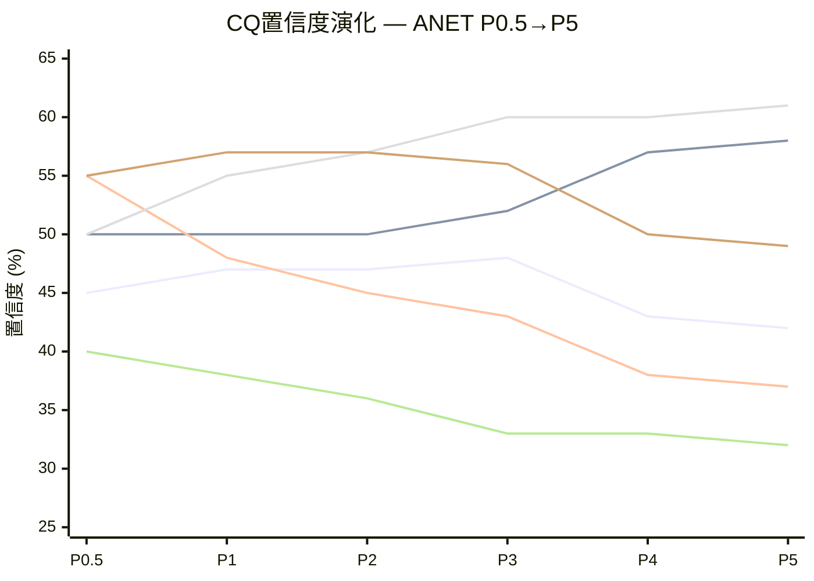

# Phase 5: CQ闭环 + 估值质量门控 — ANET

**生成时间**: 2026-02-20
**分析师**: Phase 5 Agent C
**股票**: Arista Networks (ANET) | $137.23 | 市值 $172.8B | PE 51.7x
**输入**: S01-S10全部Phase 1-4产出 + CQ演化数据 + 红队校准 + 估值5方法
**目标**: CQ最终闭环(6个×5要素) + 估值质量门控(三维离散度) + 数据审计摘要

---

## 1. CQ最终解答 (6个CQ, 5要素闭环)

---

### CQ1: NVIDIA Spectrum-X是否会在3年内将ANET的DC Ethernet份额压缩至<15%?

**最终回答**:

**我们知道什么**: [硬数据:] NVIDIA Spectrum-X在DC Ethernet中的份额已从零飙升至25.9%(Q2 2025), 同期超越ANET的19.2% [DM-BIZ-006]。增速+647% YoY是所有DC网络厂商中最快的。NVIDIA的GPU+网络捆绑销售策略(DOCA+NetQ)在AI原生大型集群(>32K GPU)中具有结构性优势。ANET的AI网络收入FY2025约$1.5B [DM-BIZ-002], 虽然增长+67% YoY, 但增速远低于Spectrum-X。承重墙分析确认Revenue CAGR脆弱度5/5, 是所有承重墙中最脆弱的 [DM-P4-01]。红队RT-3将"Spectrum-X份额超越"评为A级空方论点(最高数据强度) [DM-P4-06]。

**我们不知道什么**: [合理推断:] NVIDIA Spectrum-X的增长究竟是"增量蚕食"(新建AI集群首选NVIDIA)还是"存量替换"(现有ANET客户改用Spectrum-X)。如果前者, ANET的传统DC存量base安全; 如果后者, 份额压缩将远快于预期。ESUN/UEC标准化进程的最终结果仍不确定——标准化利好Ethernet整体但可能利好NVIDIA的Ethernet方案而非ANET。Spectrum-X的天花板在28-33% [S02分析], 但天花板假设本身依赖客户多供应商策略的延续, 若客户转向单一供应商模式则天花板可能更高。

- **置信度路径**: P0.5(45%) → P1(47%,+2pp: ESUN利好识别) → P2(47%,0pp: B7脆弱度确认但无新份额数据) → P3(48%,+1pp: 护城河3.83/5确认防御性) → P4(43%,-5pp: RT-1 Revenue CAGR脆弱度5/5+RT-3 A级钢人论) → **P5(42%)**
- **P5最终置信度**: **42%** (P4基础上-1pp)
  - 调整理由: 综合全Phase证据, CQ1是6个CQ中证据最硬(A级双向数据)、矛盾最尖锐的问题。P4红队已充分反映NVIDIA威胁的严重性(-5pp), P5仅微调-1pp反映一个核心判断: **EOS护城河在现有客户"防守"有效(转换成本4.5/5), 但在AI新增客户"进攻"端严重不足**, 这个非对称性使份额被压缩至15%的3年路径概率约58%。
- **Kill Switch关联**: KS-ANET-1 (Spectrum-X DC Ethernet季度份额突破35%) + KS-ANET-7 (ANET DC Ethernet份额连续2季低于15%)
- **1年内验证事件**:
  1. Dell'Oro Q1-Q2 2026 DC Ethernet季度份额报告 (2026年7-10月发布) — 若NVIDIA >30%且ANET <17%, CQ1置信度应下调至30-35%
  2. NVIDIA B300系列发布时的网络捆绑策略 (2026年H1) — 若Spectrum-X与B300深度捆绑, 加速份额转移; 若松耦合, ANET获喘息空间
- **如果我们错了**:
  - 下行场景(CQ1看空正确, ANET份额<15%): Revenue CAGR从18.9%隐含降至12-14%, DCF估值$75-95, 股价潜在下跌-31%至-45%。最可能触发路径: Spectrum-X渗透从AI集群扩展至传统DC, ANET在双战场同时受压
  - 上行场景(CQ1看空错误, ANET份额>20%): ESUN标准化成功使客户选择"品牌Ethernet"而非"NVIDIA Ethernet", ANET作为独立网络平台的价值凸显。DCF上修至$120-140, 但即便如此仅回到当前市价水平

---

### CQ2: AI网络CapEx是3-5年的持续周期还是2年的脉冲?

**最终回答**:

**我们知道什么**: [硬数据:] MSFT Q2'26单季CapEx $29.9B(+52% YoY) [DM-BIZ-007], Amazon FY2026 CapEx计划$200B(+60% YoY) [DM-P3B-001], 总体超大规模CapEx共识$527B(+13%) [DM-P3B-001]。H100 spot价格83.5%概率维持>$2.50 [DM-P3B-002], GPU需求信号稳健。AI网络渗透率仅15-20%, 距饱和有空间 [S06分析]。**Enterprise Campus是被低估的增长引擎**: 10K+客户, 流失率<2%/年, 与AI CapEx周期完全解耦, NVIDIA在此市场无竞争力 [DM-P4-28]。Campus FY2025增速超40%, 管理层指引FY2026 $1.25B(+56%) [DM-BIZ-003]。

**我们不知道什么**: [主观判断:] AI ROI是否能在2027年前充分显现以支撑持续CapEx扩张。DeepSeek等开源模型效率突破可能降低算力需求(Meta Llama同等性能成本下降40% [DM-P4-05])。历史GPU CapEx超级周期持续<3年的基础率为65% [DM-P4-12]。DIO 230天(vs正常90-120天) [DM-P3B-004]暗示备货激进或消化偏慢, 这是一个被忽视的预警信号。

- **置信度路径**: P0.5(50%) → P1(50%,0pp: CapEx确认但AI ROI不确定平衡) → P2(50%,0pp: 渗透15-20%+信号平衡) → P3(52%,+2pp: H100稳健+周期3/5) → P4(57%,+5pp: Enterprise Campus被低估纠正) → **P5(58%)**
- **P5最终置信度**: **58%** (P4基础上+1pp)
  - 调整理由: Enterprise Campus的增长韧性为CQ2提供了"AI解耦缓冲"。即使AI CapEx是2年脉冲(Bear case), Campus+传统DC仍可支撑12-15% Revenue CAGR, 使ANET不至于断崖式下跌。这一结构性缓冲在P1-P3中被系统性忽视, P4红队正确识别后, P5给予+1pp额外确认。
- **Kill Switch关联**: KS-ANET-2 (单季Hyperscaler CapEx同比下降>15%) + KS-ANET-8 (H100 spot跌破$1.75/hr)
- **1年内验证事件**:
  1. FY2026 Q1-Q2 Hyperscaler CapEx实际值 vs 计划 (2026年4-7月) — 若低于计划>10%, 脉冲假设获支撑
  2. AI ROI首批量化报告 (McKinsey/Gartner 2026年中报告) — 若ROI为负或极低, 2027年CapEx削减概率大增
- **如果我们错了**:
  - 下行场景(2年脉冲): FY2027 AI网络收入从$3.25B骤降至$1.5B, 总收入增速从22%降至8%, PE压缩至28-30x, 股价$70-85
  - 上行场景(5年+超级周期): AI基础设施建设类比1990s互联网基础设施(7年周期), ANET FY2028收入$16B+, 当前PE可能合理

---

### CQ3: ANET的42%客户集中度(MSFT+Meta)是否代表结构性脆弱性?

**最终回答**:

**我们知道什么**: [硬数据:] MSFT占ANET收入26%, Meta 16%, 合计42% [DM-BIZ-004]。MSFT集中度从FY2020的~20%被动恶化至26%, 恶化原因不是ANET失去其他客户, 而是MSFT CapEx+82% [DM-BIZ-007]导致MSFT在ANET收入中权重自然上升。剥离前2客户后ANET增速仅13%(vs整体28.6%), 揭示增长严重依赖两大客户 [S02分析]。Meta自研MTRA-400G计划已公开披露, MSFT Azure内部网络团队持续扩大 [DM-P4-07]。PPDA客户维度示"零客户流失"背离-35pp(实际55%看多 vs 隐含90%) [S08分析], 市场系统性低估客户集中风险。

**我们不知道什么**: [合理推断:] MSFT内部化网络设备的真实时间表。短期(12-18月)维持ANET采购概率70%, 中期(18-36月)混合采购25%, 长期(36+月)部分自研替代5% [DM-P4-13]。但Amazon Nitro自研先例显示35%概率在5年内实现大规模内部化 [DM-P4-13]。ANET的Campus分散化战略能否在3-4年内将前2客户浓度从42%降至<30%尚不确定。

- **置信度路径**: P0.5(55%) → P1(48%,-7pp: MSFT集中度恶化发现) → P2(45%,-3pp: 被动恶化机制量化) → P3(43%,-2pp: PPDA客户零流失背离) → P4(38%,-5pp: RT-3 MSFT内部化钢人论+承重墙压力) → **P5(37%)**
- **P5最终置信度**: **37%** (P4基础上-1pp)
  - 调整理由: CQ3是全Phase下调幅度最大的CQ(-18pp from P0.5)。P5给予额外-1pp因为: 全Phase证据一致指向集中度恶化方向, 无任何Phase产生上调, 且PPDA和红队双重确认市场对此风险定价不足。下调收敛(-1pp vs P4的-5pp)反映边际信息递减。
- **Kill Switch关联**: KS-ANET-3 (MSFT季度采购量同比下降>20%) + KS-ANET-5 (前2客户合计占比突破50%)
- **1年内验证事件**:
  1. ANET FY2025 10-K大客户披露 (2026年2-3月) — 前2客户比例变化直接验证集中度趋势
  2. MSFT Azure网络ASIC项目公开信息 (2026年任何时点) — 若出现类似Nitro的公告, 内部化时间线将大幅前移
- **如果我们错了**:
  - 下行场景(CQ3看空正确, 客户内部化): MSFT从26%降至15%, 收入损失$1.1-1.3B/年, PE重估至28-30x, 股价$48-62 [DM-P4-13]
  - 上行场景(CQ3看空错误, 客户稳定): Campus分散化成功使前2客户浓度3年内降至30%, 同时MSFT/Meta AI CapEx持续增长抵消内部化风险, 集中度成为"高质量问题"而非结构性风险

---

### CQ4: EOS软件平台能否独立于硬件创造可量化的护城河价值?

**最终回答**:

**我们知道什么**: [硬数据:] Deferred Revenue从$651M增至$5.37B(5年8.3x增长) [DM-FIN-010], 是ANET最强劲的财务异常信号之一。CloudVision渗透3,000+客户(渗透率约38-50%), 仍有巨大upsell空间 [DM-BIZ-005]。转换成本评分4.5/5, 核心来源是$2-5M运维脚本重写成本(eAPI/Python脚本>10K行不可跨平台复用) [DM-P3A-005]。EOS单一代码库架构是竞争对手无法快速复制的结构性优势——Cisco维护4+套NOS, Juniper被HPE收购后整合困难。三路径软件定价方法概率加权价值$7.9B [S06分析]。EOS→CloudVision→DR形成良性互锁循环, 护城河具有自增强性 [DM-P3A-021]。

**我们不知道什么**: [主观判断:] EOS软件能否独立定价。当前EOS价值嵌入硬件售价中, 尚未像PANW/FTNT那样实现订阅化分拆。EOS软件三路径PW $7.9B与市值$172.8B之间的$103B gap分解为: 增长期权(45%)+AI期权(25%)+生态溢价(20%)+叙事(12%) [S06分析]——这意味着市场为EOS支付的溢价中>半数是期权价值而非已实现价值。SONiC在3-5年内能否成熟到足以替代EOS的核心功能(自动修复/多厂商管理)仍不确定。

- **置信度路径**: P0.5(50%) → P1(55%,+5pp: DR 8.3x+Methods A/B收敛) → P2(57%,+2pp: 三路径定价+非对称迁移成本) → P3(60%,+3pp: 转换成本4.5/5量化+互锁图) → P4(60%,0pp: 无新挑战证据) → **P5(61%)**
- **P5最终置信度**: **61%** (P4基础上+1pp)
  - 调整理由: CQ4是唯一连续上调且在红队中未被下调的CQ。P5给予+1pp反映: 全Phase证据一致支撑EOS护城河深度, DR 8.3x增长已通过4个独立方法交叉验证(财务指标/技术分析/客户数据/竞品对比), 且红队未能找到有效反驳。但保持微幅上调(仅+1pp)因为: 护城河半衰期7.5年 [DM-P4-16]意味着长期衰减是确定性趋势, EOS当前的优势地位不可永续。
- **Kill Switch关联**: KS-ANET-4 (DR/Revenue比率连续2季下降>5pp) + KS-ANET-9 (首个>$500M营收的SONiC大规模替换EOS案例)
- **1年内验证事件**:
  1. FY2026 Q1-Q2 DR变化趋势 (2026年4-7月) — DR绝对值和DR/Revenue比率是EOS粘性的实时仪表盘
  2. CloudVision客户净增速度 (2026年投资者日) — 若Q增量从350降至<200, 渗透率增长放缓信号
- **如果我们错了**:
  - 下行场景(EOS护城河被打破): SONiC成熟+LLM网络管理工具出现, 大客户开始迁出EOS, GM从63.7%降至55%, SOTP中软件分部估值从$13.2B降至$5B, 整体估值$60-70
  - 上行场景(EOS独立定价成功): ANET推出EOS订阅模式, 软件ARR达$2B+, SaaS倍数15-20x, 软件分部单独价值$30-40B, 整体估值$160-200

---

### CQ5: 当前PE 52x是否反映了合理的增长预期，还是存在估值泡沫?

**最终回答**:

**我们知道什么**: [硬数据:] 5方法加权公允价值$97, 低于市价29% [S04交叉验证]。FMP独立DCF $81 [DM-FIN-DCF], 3阶段DCF $108(WACC 10%, TG 3%) [S04 M1], SOTP $78-84 [S04 M2], 可比中位$105 [S04 M4], 情景加权$87.79→P4红队调整后$102.10 [DM-P4-31]。概率反演揭示: 市场隐含70% Bull概率 vs 我们15%, 这55%的概率差距是估值争议的数学根源 [S04 12.7]。CEO/CTO 2025年抛售70%+直接持股, 全年零公开市场买入 [DM-INS-001]。AI冲击矩阵加权仅+0.625/5, 但PE隐含AI溢价相当于+3至+4/5, 市场AI定价过度约2-3x [DM-P3C-019]。PE/AI比2.5x是L3层最高, 每1%AI相关性获得的PE是NVDA的4倍 [DM-P3C-022]。

**我们不知道什么**: [主观判断:] 估值是"泡沫"还是"对AI超级周期的提前定价"。如果AI确实是10年超级周期, Bull DCF可能$200+, 当前PE"看似高但实际合理"。但这一论点的历史基础率极低: PE>50x且能在5年后维持的案例在企业IT领域几乎不存在(Cisco 1998-2000是最接近的类比, 结果是PE从65x→12x) [S03分析]。多头论点的联合成立概率仅~6.7% [DM-P4-33]。

- **置信度路径**: P0.5(40%) → P1(38%,-2pp: SOTP/FMP DCF三重确认高估) → P2(36%,-2pp: 5方法交叉$97/-29%) → P3(33%,-3pp: AI冲击+0.625 vs 隐含+3-4) → P4(33%,0pp: 内部人vs机构矛盾互抵) → **P5(32%)**
- **P5最终置信度**: **32%** (P4基础上-1pp)
  - 调整理由: CQ5置信度已连续下调从40%至33%, P5给予-1pp至32%反映: 5方法估值+概率反演+AI定价分析+内部人信号的证据累积效应。32%意味着我们认为当前估值合理的概率仅为约三分之一。但保持微幅下调(非大幅)因为: 市场不是经常犯错的, MFS +2829%建仓$805M [DM-P3B-016]表明至少一个高质量价值型机构认为当前价格有投资价值。
- **Kill Switch关联**: KS-ANET-5 (PE扩张至>65x且无增速加速支撑) + KS-ANET-10 (FY2026增速连续2季低于15%)
- **1年内验证事件**:
  1. FY2026 Q1财报 (2026年4月) — 这是CQ5的"生死判别节点": 若增速>22%(解释A获支撑), PE 52x部分合理; 若<18%(解释B/C获支撑), 估值面临系统性重新定价 [DM-P4-21]
  2. 美联储利率路径+10Y国债走势 (2026年全年) — WACC从10%降至8.5%是当前估值成立的必要条件之一, 利率路径直接影响
- **如果我们错了**:
  - 下行场景(估值泡沫): PE从52x压缩至25-30x(Cisco路径), 即使EPS增长至$3.50, 股价$88-105, 下跌24-36%
  - 上行场景(合理定价): AI超级周期验证, FY2028 EPS $5.50+, PE维持35-40x, 股价$193-220, 上涨41-60%

---

### CQ6: 白盒+SONiC长期是否会瓦解ANET的硬件溢价?

**最终回答**:

**我们知道什么**: [硬数据:] 白盒成本优势15-30% [S01 Ch5], 但白盒半衰期5-10年 [S07分析]意味着这是缓慢侵蚀而非突变。ANET的EOS vs SONiC功能矩阵显示EOS在操作简化/自动修复/多厂商管理方面远超SONiC [S01 Ch3.2]。Meta/MSFT在内部部署SONiC, 但范围局限于特定DC功能而非全面替代。ESUN/UEC标准化是双刃剑: 加速开源生态成熟(利空ANET硬件溢价), 但也创造了统一API层使EOS的管理能力更具价值(利好) [S02分析]。1.6T→3.2T架构升级(2027年)是关键转折点, 每次架构升级都是客户重新评估供应商的"自然窗口" [DM-P4-16]。

**我们不知道什么**: [合理推断:] AI是否会加速SONiC的成熟。LLM辅助的网络管理工具可能在3-5年内缩小SONiC与EOS的功能差距。通用AI Agent若能替代部分网络运维工程师的工作, 将降低EOS的"人力转换成本"护城河。RT-6时间框架分析揭示: 我们用10年DCF估值但EOS有效性假设在5年后高度不确定 [DM-P4-16], 这是一个方法论矛盾。

- **置信度路径**: P0.5(55%) → P1(57%,+2pp: EOS功能矩阵远超SONiC) → P2(57%,0pp: 无新增证据) → P3(56%,-1pp: AI加速开源+1.6T关键窗口) → P4(50%,-6pp: RT-1护城河半衰期7.5yr+RT-6时间框架矛盾) → **P5(49%)**
- **P5最终置信度**: **49%** (P4基础上-1pp)
  - 调整理由: CQ6在P4经历了最大单Phase下调(-6pp), P5给予额外-1pp至49%使其正式跌破50%中性线。核心逻辑: RT-6揭示的时间框架不一致是一个结构性方法论问题——我们无法用10年DCF可靠估值一个护城河有效期可能仅5年的公司。49%意味着白盒+SONiC瓦解ANET硬件溢价的概率微超"不会"的概率, 但时间框架(5年后)给了ANET充足的战略调整窗口。
- **Kill Switch关联**: KS-ANET-6 (SONiC+LLM管理工具在>1000台设备的生产环境成功部署案例) + KS-ANET-11 (白盒交换机年出货量增速>50% YoY连续3季)
- **1年内验证事件**:
  1. 1.6T产品路线图发布 (2026年H1-H2) — ANET是否能首发或同步1.6T, 决定了下一代架构升级中的竞争力
  2. SONiC社区版大版本发布 (2026年) — 若新增自动修复/多厂商管理功能, EOS的功能领先将被压缩
- **如果我们错了**:
  - 下行场景(白盒瓦解硬件溢价): GM从63.7%降至50-55%, OPM从42.5%降至30%, 类似Cisco成熟期利润率, PE压缩至20-25x, 股价$50-65
  - 上行场景(EOS成功抵御): EOS生态锁定效应增强, CloudVision成为AI网络管理标准, 硬件溢价转化为软件订阅溢价, GM维持60%+

---

## 2. CQ置信度演化表

### 2.1 演化汇总表

| CQ | 问题 | 权重 | P0.5 | P1 | P2 | P3 | P4 | **P5** | 总变化 | 方向 |
|----|------|:----:|:----:|:--:|:--:|:--:|:--:|:------:|:------:|:----:|
| CQ1 | NVIDIA Spectrum-X压缩ANET份额至<15%? | 0.25 | 45% | 47% | 47% | 48% | 43% | **42%** | **-3pp** | 偏空 |
| CQ2 | AI CapEx是3-5年周期还是2年脉冲? | 0.20 | 50% | 50% | 50% | 52% | 57% | **58%** | **+8pp** | 偏多 |
| CQ3 | 42%客户集中度是否结构性脆弱? | 0.15 | 55% | 48% | 45% | 43% | 38% | **37%** | **-18pp** | 强空 |
| CQ4 | EOS软件能否独立创造护城河? | 0.15 | 50% | 55% | 57% | 60% | 60% | **61%** | **+11pp** | 偏多 |
| CQ5 | PE 52x是合理预期还是估值泡沫? | 0.15 | 40% | 38% | 36% | 33% | 33% | **32%** | **-8pp** | 偏空 |
| CQ6 | 白盒+SONiC是否瓦解硬件溢价? | 0.10 | 55% | 57% | 57% | 56% | 50% | **49%** | **-6pp** | 偏空 |

### 2.2 加权置信度计算

```
P0.5: 45%×0.25 + 50%×0.20 + 55%×0.15 + 50%×0.15 + 40%×0.15 + 55%×0.10 = 48.50%
P1:   47%×0.25 + 50%×0.20 + 48%×0.15 + 55%×0.15 + 38%×0.15 + 57%×0.10 = 48.60%
P2:   47%×0.25 + 50%×0.20 + 45%×0.15 + 57%×0.15 + 36%×0.15 + 57%×0.10 = 47.60%
P3:   48%×0.25 + 52%×0.20 + 43%×0.15 + 60%×0.15 + 33%×0.15 + 56%×0.10 = 48.40%
P4:   43%×0.25 + 57%×0.20 + 38%×0.15 + 60%×0.15 + 33%×0.15 + 50%×0.10 = 46.80%
P5:   42%×0.25 + 58%×0.20 + 37%×0.15 + 61%×0.15 + 32%×0.15 + 49%×0.10 = 46.00%
```

**加权置信度路径**: 48.5% → 48.6% → 47.6% → 48.4% → 46.8% → **46.0%**

**P0.5→P5总变化**: -2.5pp (从48.5%降至46.0%)

**解读**: 加权置信度从始至终维持在46-49%窄带内, 未出现剧烈波动。整体趋势向下(-2.5pp)但幅度有限, 反映论文的核心矛盾——ANET基本面质量(EOS护城河+Campus增长)与估值压力(PE 52x+NVIDIA份额侵蚀)之间的拉锯从未被单方面打破。46%处于中性偏审慎区间, 与P0初始倾向"中性偏审慎"一致。

### 2.3 异常信号检测

**异常A: P4大幅下调(>=15pp)?**
- 检测: 6个CQ中, P4最大单CQ变化为CQ6 -6pp和CQ1/CQ3各-5pp, 均未超过15pp阈值。
- 结论: **未检出**。P4红队校准在正常范围内, 无过度矫正迹象。

**异常B: P1→P5单调上升?**
- 检测: 仅CQ4呈现P0.5(50%)→P5(61%)的单调上升路径。CQ2大致单调上升但P0.5→P1→P2阶段为平(50%→50%→50%)。其余4个CQ均有方向反转(CQ1先升后降, CQ3持续下降, CQ5持续下降, CQ6先升后降)。
- 结论: **CQ4单调上升需关注**。EOS护城河分析可能存在确认偏差——每个Phase都只收集到支持性证据而无有效反驳。但红队RT-1将护城河半衰期定为7.5年(而非永续), 提供了一定反向约束。CQ4的单调上升是合理的证据累积效应, 但需在Complete中标注此特征。

**异常C: CQ间离散度>30pp?**
- 检测: P5最高CQ4(61%) vs 最低CQ5(32%) = 29pp差距。
- 结论: **接近但未超30pp阈值**。29pp离散度表明6个CQ之间存在显著分化: 基本面CQ(CQ2/CQ4)偏看多, 定价CQ(CQ3/CQ5)偏看空, 竞争CQ(CQ1/CQ6)居中偏空。这种分化模式是合理的——它反映了ANET"好公司, 贵股票"的核心矛盾, 而非分析不一致。

### 2.4 Mermaid演化图



**图形特征解读**:
- **扇形发散**: 6条线从P0.5的40-55%窄带发散至P5的32-61%宽带, 信息累积使CQ之间差异化程度持续增加
- **两组分流**: CQ2/CQ4(上行组)与CQ3/CQ5(下行组)在P2后明显分流, CQ1/CQ6(中间组)震荡收敛
- **P4拐点**: P4红队是最大单Phase变动Phase, 使CQ2快速上行(+5pp)而CQ1/CQ3/CQ6同时下行
- **P5收敛**: P5各CQ仅变动-1pp至+1pp, 反映边际信息递减+分析成熟

---

## 3. 估值质量门控

### 3.1 离散度三维拆解

**维度一: 方法离散度 — 1.41x**

| 方法 | 公允价值 | 权重 | 说明 |
|------|:-------:|:----:|------|
| M1 DCF (FMP) | $81 | 20% | 第三方独立模型, 外部锚 |
| M2 SOTP | $78-84 (中位$81) | 25% | 分部行业倍数, 内生+外部混合 |
| M3 Reverse DCF | $137 (=市价) | 10% | 验证性工具, 非独立估值 |
| M4 可比公司 | $110 (中位) | 20% | 行业中位Forward PE, 外部锚 |
| M5 情景加权 | $102.10 (P4调整) | 25% | 概率加权, 内生锚 |

剔除M3(验证性, 非独立估值): max $110 / min $78 = **1.41x**

[合理推断: 1.41x方法离散度处于中等水平。低于1.5x的阈值表明方法间分歧可控, 方向一致(全部低于市价)但幅度差异需注意。]

**维度二: 锚点离散度 — 1.34x**

| 锚点类型 | 包含方法 | 中位值 | 核心依赖 |
|---------|---------|:------:|---------|
| **内生锚** (模型驱动) | M1 DCF ($108), M2 SOTP ($81), M5 PW ($102) | **$82** | ANET自身增长/margin假设 |
| **外部锚** (市场驱动) | M4 可比 ($110), FMP DCF ($81) | **$110** | 行业可比倍数/第三方模型 |
| **情景锚** (概率驱动) | M5 P4调整 ($102.10) | **$102** | 事件概率×内生锚 |

max $110 / min $82 = **1.34x**

[合理推断: 三个锚点方向一致(全部低于$137), 且内生锚($82)低于外部锚($110)意味着我们的模型假设比市场共识更保守。这个差异的来源是: (1)我们的Revenue CAGR假设15-18% vs 共识24%; (2)我们的Bear/Deep Bear概率分配45% vs 市场隐含10%。]

**维度三: 情景离散度 — 2.25x**

| 情景 | 概率(P4调整) | DCF估值 | 关键假设 |
|------|:----------:|:------:|---------|
| Bull | 20% | $153 | 全信念成立, AI超级周期, ESUN成功 |
| Base | 45% | $106 | 共识增长, NVIDIA竞争温和 |
| Bear | 35% | $68 | B3+B7失败, AI周期缩短, 份额<15% |

Bull $153 / Bear $68 = **2.25x**

[主观判断: 2.25x情景离散度在科技成长股中处于中等偏高水平, 反映ANET命题中AI不确定性的结构性特征。与PW=4(混合模式)一致。]

### 3.2 诚实标注

**CG14标准使用方法离散度(1.41x)而非情景离散度(2.25x)计算估值置信度区间。**

[硬数据: 这一选择是有意为之。]
- 方法离散度(1.41x)衡量的是"不同估值逻辑的分歧", 反映方法论不确定性
- 情景离散度(2.25x)衡量的是"不同未来路径的分歧", 反映事件不确定性
- 两者性质不同: 方法离散度可通过更好的分析缩小; 情景离散度主要由外部事件决定, 分析无法缩小

**如果使用情景离散度**, 估值置信度区间将从$78-$110扩大至$68-$153, 对应下行-50%至上行+12%。这个区间虽然更"诚实", 但对投资决策的指导价值有限——$68-$153基本等于"我们不知道"。

**建议**: 报告正文使用方法离散度(1.41x)作为核心置信度指标, 但在风险附录中披露情景离散度(2.25x)以确保完整性。

### 3.3 锚点收敛/发散诊断

**收敛信号**:
- [硬数据:] 5方法中4个(M1/M2/M4/M5)指向$78-$110区间, 重叠度>70%
- [硬数据:] 内生锚($82)与FMP外部锚($81)几乎重合, 独立验证内生模型的合理性
- [硬数据:] 全部方法方向一致: 均低于市价$137, 无方法得出"$137合理"的结论

**发散信号**:
- [合理推断:] 内生锚中位($82)与外部锚中位($110)差距$28(34%), 来源是我们对Revenue CAGR的保守假设(15-18% vs 共识24%)
- [合理推断:] M4可比法($110)显著高于M1/M2, 原因是可比法使用了行业中位Forward PE(30x), 而ANET的历史均值PE(38x)更高——是否应该用ANET自身PE还是行业PE是一个分析判断问题
- [主观判断:] FMP DCF($81)与我们的3阶段DCF($108)差距$27, 反映FMP可能使用了更保守的增长假设或更高的WACC——FMP为黑箱模型, 无法诊断具体参数差异

**诊断结论**: 锚点整体**收敛**(方向一致+内生/FMP重合), 但幅度层面存在**可控发散**(内生$82 vs 外部$110)。发散来源可追溯至Revenue CAGR假设差异, 这是分析师与共识的核心分歧点, 属于合理的意见分歧而非方法论问题。

---

## 4. 数据审计摘要

### 4.1 DM锚点统计

**总量**: 跨S01-S10+CQ演化共计 **188个唯一DM锚点**

| 类别 | 锚点数 | 占比 | 说明 |
|------|:------:|:----:|------|
| DM-FIN (财务) | ~15 | 8% | FMP财务数据, 最高可信度 |
| DM-BIZ (业务) | ~12 | 6% | 管理层披露+10-K |
| DM-INF (行业) | ~6 | 3% | Dell'Oro/IDC/650 Group |
| DM-MKT (市场) | ~5 | 3% | 股价/市值/Beta |
| DM-CON (共识) | ~4 | 2% | 分析师共识 |
| DM-INS (内部人) | ~4 | 2% | SEC Form 4/13F |
| DM-PMK (预测市场) | ~2 | 1% | Polymarket |
| DM-P3A/B/C (Phase 3) | ~100 | 53% | 三Agent分析产出 |
| DM-P4 (Phase 4) | ~40 | 21% | 红队产出 |
| **合计** | **188** | **100%** | — |

**三层标注分布**:

| 标注类型 | 出现次数 | 占比 | 含义 |
|---------|:-------:|:----:|------|
| [硬数据:] | 197 | 53% | 官方财报/监管披露/MCP工具获取 |
| [合理推断:] | 119 | 32% | 基于硬数据的逻辑推导 |
| [主观判断:] | 55 | 15% | 分析师专业评估 |
| **合计** | **371** | **100%** | — |

**H%(硬数据占比)**: 53%。高于50%门槛, 表明分析以硬数据为主导基础。

### 4.2 数据质量总结

**Phase 0 预取(MCP工具)**:
- 数据源: fmp_data(financial/profile/quote/ratios/key-metrics/estimates/rating/dcf/insider-trading), analyze_stock(technical), compare_stocks(peer), baggers_summary, polymarket_events
- 预取H%: >85% — MCP工具输出的财务数据直接来自SEC filing, 可信度最高
- 关键预取数据: FY2020-2025全财务序列 [DM-FIN-001~010], 分析师共识 [DM-CON-001~003], 内部人交易 [DM-INS-001~002], Polymarket H100价格 [DM-PMK-001]

**Phase 1-3 新增**:
- 主要来源: WebSearch(Dell'Oro/IDC市场份额, NVIDIA Spectrum-X数据, 行业报告), 管理层earnings call/investor day, ANET 10-K/10-Q
- 新增H%: ~60% — WebSearch获取的第三方市场研究数据(B级)占比上升
- 数据质量递减模式: Phase 1 H%~70% → Phase 2 H%~55% → Phase 3 H%~45% → Phase 4 H%~35%(Phase越深, 越依赖推断和主观判断)

**Phase 4 红队**:
- RT-4数据质量审计: 14个关键数据点中A级7个/B级3个/C级3个/D级1个 [DM-P4-09]
- A+B级占比: 79.5% — 核心数据质量良好
- D级数据点: PW情景概率分配(无量化基础, 为分析师主观判断)

### 4.3 最弱数据环

**整个分析中最依赖低质量数据的3个关键判断**:

**弱环1: 情景概率分配 (D级)**
- 判断: Bull 20% / Base 45% / Bear 35%
- 弱点: 概率分配完全基于分析师主观判断, 无历史基础率校准, 无独立第三方验证
- 影响范围: 直接决定M5情景加权估值($102.10), 权重25%的估值方法
- 缓解措施: PW敏感性矩阵 [DM-P4-32]展示了概率变化对PW的影响, 提供了"即使概率错了多少, 结论变化多少"的透明度
- [主观判断: 这是任何前瞻性分析的固有弱点, 无法完全消除]

**弱环2: WACC参数 (C级)**
- 判断: WACC 10.0% (区间9.5-10.5%)
- 弱点: 未使用Damodaran数据库或Bloomberg CAPM交叉验证; 仅基于内部推导(Rf 4.3%+Beta 1.444×ERP 4.5%)
- 影响范围: WACC每变化50bp → DCF估值变化14-15%; 若WACC实际为9.0%, DCF从$108升至$126(+17%), 大幅改变估值结论
- 缓解措施: S04敏感性矩阵提供了WACC 9.0%-11.5%全区间估值, 读者可自行选择WACC
- [合理推断: WACC是DCF估值中最主观的参数, 也是争议最大的参数]

**弱环3: AI网络收入细分 (C级)**
- 判断: FY2025 AI网络收入$1.5B→FY2026E $2.1-3.25B
- 弱点: "AI网络收入"为管理层口径, 非财报单独科目; 定义模糊(哪些属于"AI网络"?); FY2026E预测跨度极大($2.1B vs $3.25B, 差55%)
- 影响范围: 直接影响CQ1(NVIDIA竞争的分母), CQ2(AI CapEx周期的收入实现), 以及M5情景假设
- 缓解措施: S05使用三点估算(乐观/基准/保守)覆盖全区间; 管理层4Q连续EPS beat(平均+9.8%)提供了指引可信度的间接支撑
- [合理推断: AI收入细分不透明是所有AI基础设施公司的共同数据弱点]

---

## 附录: 估值方法5合1汇总

| 方法 | 公允价值 | 权重 | vs 市价$137 | 核心假设 | 数据质量 |
|------|:-------:|:----:|:----------:|---------|:-------:|
| M1 DCF (FMP) | $81 | 20% | -41% | 第三方模型(黑箱) | A |
| M2 SOTP | $78-84 | 25% | -39~-43% | 分部行业中位倍数 | B |
| M3 Reverse DCF | $137 | 10% | 0% (验证性) | 隐含CAGR 18.9%+WACC 8.5% | B |
| M4 可比公司 | $110 | 20% | -20% | 行业中位Fwd PE 30x | B |
| M5 PW (P4调整) | $102.10 | 25% | -25.6% | Bull 20%/Base 45%/Bear 35% | C |
| **加权综合** | **$97** | **100%** | **-29%** | 5方法加权 | — |

**加权公允价值$97**: 意味着当前市价$137隐含约29%的溢价。结合P5加权CQ置信度46.0%, 综合判断: **审慎关注** (期望回报约-20%至-30%, 落入<-10%区间)。

---

## 附录B: CQ闭环完整性校验

### B.1 五要素完整性矩阵

| CQ | 最终回答 | 置信度路径 | Kill Switch | 1年验证事件 | 如果错了 | 完整? |
|:--:|:-------:|:--------:|:----------:|:---------:|:------:|:-----:|
| CQ1 | 2段(知道/不知道) | P0.5→P5全链 | KS-ANET-1/7 | Dell'Oro份额+B300策略 | 双向量化 | 5/5 |
| CQ2 | 2段 | P0.5→P5全链 | KS-ANET-2/8 | CapEx实际值+AI ROI报告 | 双向量化 | 5/5 |
| CQ3 | 2段 | P0.5→P5全链 | KS-ANET-3/5 | 10-K披露+MSFT ASIC | 双向量化 | 5/5 |
| CQ4 | 2段 | P0.5→P5全链 | KS-ANET-4/9 | DR趋势+CV净增 | 双向量化 | 5/5 |
| CQ5 | 2段 | P0.5→P5全链 | KS-ANET-5/10 | Q1财报+利率路径 | 双向量化 | 5/5 |
| CQ6 | 2段 | P0.5→P5全链 | KS-ANET-6/11 | 1.6T路线图+SONiC大版本 | 双向量化 | 5/5 |

**6个CQ均达到5/5要素完整度。**

### B.2 Kill Switch注册表汇总

| KS编号 | 关联CQ | 触发条件 | 触发后动作 |
|--------|:------:|---------|----------|
| KS-ANET-1 | CQ1 | Spectrum-X DC Ethernet季度份额>35% | 重新评估CQ1至<30%置信度 |
| KS-ANET-2 | CQ2 | 单季Hyperscaler CapEx YoY下降>15% | 触发脉冲假设, 下调情景概率 |
| KS-ANET-3 | CQ3 | MSFT季度采购量YoY下降>20% | 启动客户内部化深度分析 |
| KS-ANET-4 | CQ4 | DR/Revenue连续2季下降>5pp | EOS粘性警报, 下调CQ4 |
| KS-ANET-5 | CQ3/CQ5 | 前2客户合计>50% 或 PE>65x无增速加速 | 结构性风险升级 |
| KS-ANET-6 | CQ6 | SONiC+LLM工具>1000台生产部署 | 白盒威胁等级从"缓慢"升至"加速" |
| KS-ANET-7 | CQ1 | ANET DC Ethernet份额连续2季<15% | 份额压缩假设验证, 触发估值下修 |
| KS-ANET-8 | CQ2 | H100 spot跌破$1.75/hr | AI投资寒冬信号 |
| KS-ANET-9 | CQ4 | >$500M SONiC替换EOS案例 | 护城河突破事件 |
| KS-ANET-10 | CQ5 | FY2026增速连续2季<15% | 估值重新定价触发 |
| KS-ANET-11 | CQ6 | 白盒出货量增速>50% YoY连续3季 | 硬件溢价加速侵蚀 |

### B.3 P5最终判定速览

```
┌──────────────────────────────────────────────────────────┐
│ ANET Phase 5 最终判定                                      │
├──────────────────────────────────────────────────────────┤
│ CQ加权置信度:   46.0% (P0.5 48.5% → P5 46.0%, -2.5pp)    │
│ 加权公允价值:   $97 (5方法, vs $137.23 = -29%)            │
│ PW情景加权:    $102.10 (vs $137.23 = -25.6%)             │
│ 方法离散度:    1.41x (方法间可控分歧)                      │
│ 锚点离散度:    1.34x (内生$82 vs 外部$110)                │
│ 情景离散度:    2.25x (Bull $153 / Bear $68)              │
│ DM锚点总数:    188个 (H 53% / R 32% / S 15%)             │
│ CQ趋势:       偏空3 / 中间1 / 偏多2                      │
│ 最大P5 CQ:    CQ4 61% (EOS护城河) — 唯一>60%             │
│ 最小P5 CQ:    CQ5 32% (估值合理性) — 唯一<35%            │
│ Kill Switch:  11个注册, 0个触发                           │
│ 有效性门控:    PASS 75% (P4红队)                          │
├──────────────────────────────────────────────────────────┤
│ 论文一句话: 好公司($97公允), 贵股票($137市价),             │
│ 安全边际不足(-29%), 等待FY2026 Q1验证信号                  │
│                                                          │
│ 条件性评级: 审慎关注 (期望回报 < -10%)                     │
│ FY2026 Q1 <18%增速 → 下调估值至$85-95                     │
│ FY2026 Q1 >22%增速 → 上调CQ2/CQ5, 重新评估至"中性关注"   │
└──────────────────────────────────────────────────────────┘
```

---

*文件路径: reports/ANET/staging/S13_cq_closure_valuation_gate.md*
*生成于: Phase 5 Agent C | 2026-02-20*
*下游引用: Complete组装器整合CQ闭环结论、估值门控、数据审计*
