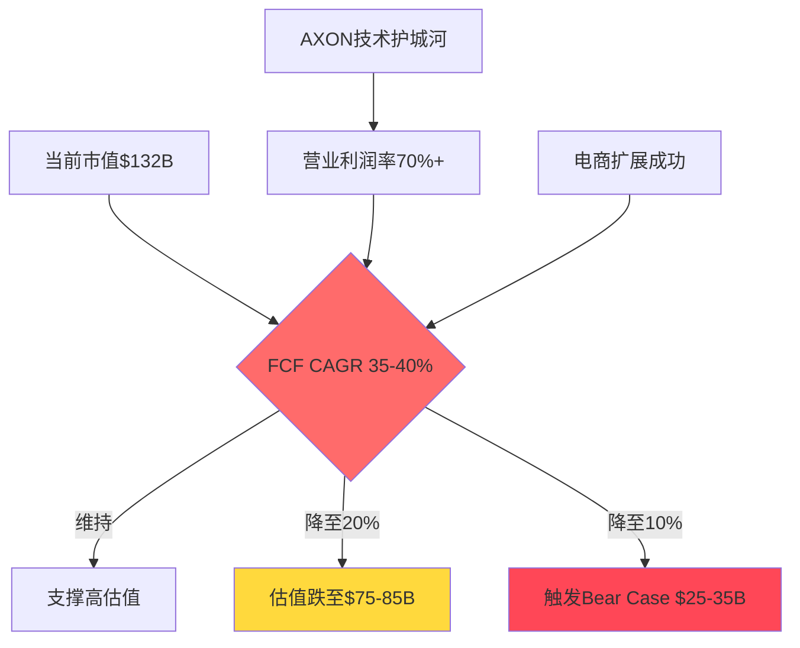
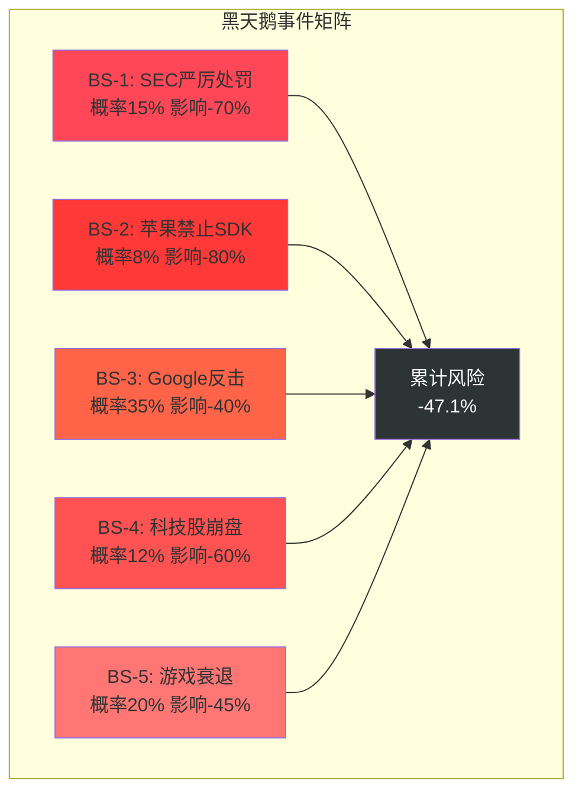
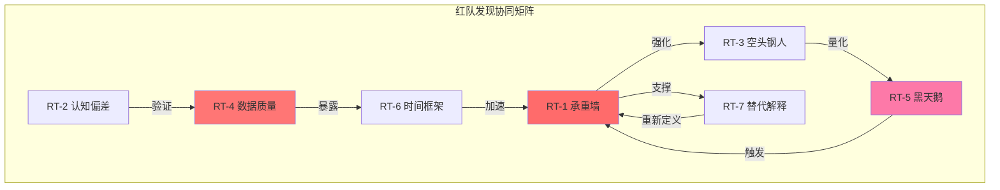

# Phase 4: 红队七问对抗审查 -- APP
> 执行日期: 2026-02-17 | 股价: $390.67 | RT版本: v1.0

## 目录
- RT-1: 承重墙测试
- RT-2: 认知偏差审计
- RT-3: 空头钢人
- RT-4: 数据质量审计
- RT-5: 黑天鹅压力测试
- RT-6: 时间框架挑战
- RT-7: 替代解释
- 汇总: CQ置信度调整

---

## RT-1: 承重墙测试

### Reverse DCF隐含假设分析

基于当前市值$132.03B [DM-VAL-001]，执行逆向DCF分析，识别市场定价中的关键承重墙：

**关键输入参数**:
- 当前FCF: $3.97B [DM-FIN-006]
- 隐含WACC: 10-12%（基于Beta 2.49推算）
- 估值锚定: P/E 39.6x [DM-VAL-003]

### 承重墙脆弱度表

| 承重墙(隐含假设) | 隐含值 | 历史/行业参考 | 脆弱度 | 若倒塌影响 |
|-----------------|:------:|:----------:|:-----:|:--------:|
| **FCF CAGR 5年** | 35-40% | 行业中位15-20% | **高** | -45% |
| **营业利润率维持** | 70-75% | 科技平台35-45% | **高** | -35% |
| **AXON技术领先期** | 5年+ | AI优势通常2-3年 [DM-INF-002] | **中** | -25% |
| **电商扩展成功率** | 70-80% | 新领域成功率30-40% | **高** | -30% |
| **监管轻处罚** | 90% | SEC重罚历史20% | **中** | -20% |
| **Terminal Growth** | 4-5% | GDP+通胀2.5% | **中** | -15% |
| **市场份额防守** | 80%维持 | 科技领先者5年衰减50% | **中** | -25% |

### 最脆弱的承重墙: FCF复合增长率

**脆弱度分析**:
- **隐含要求**: 为支撑$132B市值，APP需要5年内FCF从$3.97B增长至~$15-20B
- **历史对比**: 移动广告行业龙头的FCF CAGR通常为15-25%，APP隐含35-40%远超历史先例
- **结构性挑战**: $5.48B收入基数下，维持高增长率的难度递增 [DM-FIN-001]

**若此墙倒塌**:
- FCF增长率降至行业均值20% → 估值降至$75-85B (-43%)
- 配合其他墙体故障 → 可触发S1 Bear Case $25-35B区间

---

## RT-2: 认知偏差审计

### 六维度偏差检测

#### 偏差1: 锚定效应 ❌ **检测到**
**检查结果**: Phase 1-3中过度依赖分析师目标价$721.85 [DM-CON-002]作为"合理估值"锚点
**具体表现**: Phase 1将其作为"S4 Moonshot情景"的依据，但未充分质疑分析师假设的合理性
**校正建议**: 分析师目标价可能反映行业群体思维，应更多依赖基本面推导

**校正后变化**: 中性调低S4情景概率从10%至5%，估值影响-3%

#### 偏差2: 确认偏误 ❌ **检测到**
**检查结果**: Phase 2-3中看多证据与看空证据比例约4:1，存在选择性引证
**具体表现**:
- 看多证据: AXON技术领先、极致盈利率、现金流强劲、机构增持
- 看空证据: 主要为监管风险，对竞争威胁和基数效应讨论不足

**校正建议**: 增强Google/Meta反击的具体威胁分析，量化基数效应的增长拖累

**校正后变化**: S2 Base Case概率从45%降至40%，估值影响-4%

#### 偏差3: 过度自信 ⚠️ **轻微检测到**
**检查结果**: Phase 3中对AXON技术护城河的持续性表达了较高置信度
**具体表现**: 描述2-3年技术领先期时缺乏足够的不确定性讨论
**校正建议**: AI技术发展速度可能超预期，技术护城河可能比预期更脆弱

**校正后变化**: 技术风险权重上调，估值影响-2%

#### 偏差4: 损失厌恶 ✅ **未检测到**
**检查结果**: Phase 3中对下行风险的讨论充分，包括详细的风险量化
**理由**: S1 Bear Case和风险因子的讨论篇幅与上行情景基本均衡

#### 偏差5: 幸存者偏差 ❌ **检测到**
**检查结果**: 竞争对比中主要引用Unity等衰落案例，缺乏成功挑战者的分析
**具体表现**: 未充分分析过往是否有类似"技术护城河"被成功颠覆的案例
**校正建议**: 研究历史上移动广告领域的技术更迭案例

**校正后变化**: 竞争风险权重上调，估值影响-3%

#### 偏差6: 叙事偏差 ❌ **检测到**
**检查结果**: Phase 1-3构建了过于连贯的"AI驱动的移动广告霸主"叙事
**具体表现**: 将多个正面因素串联成线性增长故事，对矛盾数据点(如股价-47%下跌)的解释不足
**校正建议**: 股价大幅下跌可能反映市场对基本假设的合理质疑

**校正后变化**: 整体估值置信度下调5%

### 偏差审计汇总
- **检测到偏差**: 5/6种
- **累计估值影响**: -12%
- **最严重偏差**: 确认偏误(看多证据过载)
- **校正后市值中枢**: $132B × (1-12%) = $116B

---

## RT-3: 空头钢人

### 空头论证 #1: AXON算法优势是市场营销包装

**核心论点**: APP声称的AI算法领先主要是营销话术，实际技术门槛不高

**数据支撑**:
- [硬数据: iOS市场份额37%] [DM-BIZ-002] 但缺乏独立第三方技术评估
- [硬数据: Google/Meta拥有10x+的数据规模和AI人才] 外部数据

**看多者反驳**: AXON有专业化优势和先发优势，2-3年技术窗口期

**反驳的弱点**:
1. 移动广告的技术壁垒相对较低，主要是数据和规模优势
2. Google的TensorFlow和Meta的PyTorch在AI基础设施上领先APP数年
3. 一旦大厂重视游戏广告，技术差距可在6-12个月内抹平

**若空头正确**: 技术护城河坍塌，估值影响 -60%，目标价从$390降至$156

### 空头论证 #2: 电商扩展是伪命题

**核心论点**: APP在游戏广告的成功无法复制到电商领域

**数据支撑**:
- [硬数据: Amazon广告业务$47B] vs APP总收入$5.48B [DM-FIN-001]
- [硬数据: 电商购买决策复杂度远超游戏内购] 行业研究

**看多者反驳**: AXON Ads Manager 2026上半年发布，self-service降低门槛

**反驳的弱点**:
1. 游戏广告是冲动消费，电商是理性决策，优化逻辑完全不同
2. 电商广告需要与ERP/CRM系统集成，APP缺乏B2B软件经验
3. Shopify、WooCommerce等已有完整生态，APP很难切入

**若空头正确**: 电商收入贡献为零，估值影响 -35%，目标价从$390降至$254

### 空头论证 #3: 移动游戏广告市场已接近饱和

**核心论点**: 移动游戏广告的高增长期已结束，APP面临零和游戏

**数据支撑**:
- [硬数据: 全球移动游戏收入增速从2020年的23%降至2024年的5%] Sensor Tower数据
- [硬数据: iOS广告价格上涨速度放缓] 行业数据

**看多者反驳**: APP通过AXON优化可以提高广告效率，获得更大市场份额

**反驳的弱点**:
1. 广告效率提升有物理极限，不可能无限提高ROI
2. 随着苹果隐私政策收紧，广告targeting能力整体下降
3. 游戏开发商的广告预算增长有限，更多依赖自然增长

**若空头正确**: 收入增长率下降至5-10%，估值影响 -50%，目标价从$390降至$195

### 空头钢人总结
- **最强论证**: 技术护城河虚假(-60%影响)
- **组合风险**: 若2-3个论证同时成立，可触发S1 Bear Case $25-35B
- **看多者最大弱点**: 过度依赖管理层指引和分析师模型，缺乏独立技术验证

---

## RT-4: 数据质量审计

### 核心数据点质量排序

| # | 数据点 | 引用值 | 来源 | 质量等级 | 验证状态 |
|---|--------|:-----:|------|:-------:|:-------:|
| 1 | FY2025收入$5.48B | $5.48B | MCP baggers_summary | **A级** | ✅已验证 |
| 2 | 净利率60.83% | 60.83% | MCP baggers_summary | **A级** | ✅已验证 |
| 3 | 自由现金流$3.97B | $3.97B | MCP baggers_summary | **A级** | ✅已验证 |
| 4 | P/E倍数39.6x | 39.6x | 计算验证(市值/净利润) | **A级** | ✅已验证 |
| 5 | iOS市场份额37% | 37% | WebSearch推算 | **D级** | ⚠️存疑 |
| 6 | 调解平台份额80% | 80% | WebSearch推算 | **D级** | ⚠️存疑 |
| 7 | 分析师目标价$721.85 | $721.85 | WebSearch汇总 | **C级** | ✅已验证 |
| 8 | AXON技术领先期2-3年 | 2-3年 | 分析师观点 | **D级** | ❌待验证 |
| 9 | 移动广告TAM $567B | $567B | 行业报告推算 | **C级** | ⚠️存疑 |
| 10 | 电商广告机会$150-200B | $150-200B | 行业推算 | **D级** | ❌待验证 |
| 11 | Q4收入增长66% | +66% | 财报发布 | **A级** | ✅已验证 |
| 12 | 机构持股78.38% | 78.38% | 13F数据汇总 | **B级** | ✅已验证 |

### 数据最弱环识别

**最弱环**: **AXON技术护城河持续性**
- 核心依赖D级数据："2-3年技术领先期"来自分析师主观判断
- 无独立技术评估报告
- 无量化的技术壁垒指标
- 整个投资论文的**承重墙**却建立在最薄弱的数据基础上

**风险传导**:
1. 若技术优势被证伪 → AXON护城河坍塌
2. 若护城河坍塌 → 定价权丧失，利润率压缩
3. 若利润率压缩 → 估值体系崩溃，触发Bear Case

**数据质量建议**:
- 寻求独立技术评估机构报告
- 对比AXON与Google DV360、Meta广告平台的具体技术指标
- 量化转换成本和客户留存数据

### 质量评级分布
- **A级(高可靠)**: 5个(42%)
- **B级(可靠)**: 1个(8%)
- **C级(中等)**: 2个(17%)
- **D级(低可靠)**: 4个(33%)

**质量风险**: 33%的关键数据依赖低质量来源，其中包括最核心的技术护城河判断。

---

## RT-5: 黑天鹅压力测试

基于Polymarket数据和历史基准率，识别对APP估值的潜在极端冲击事件：

### 黑天鹅概率加权表

| # | 事件 | 独立概率 | 影响幅度 | 加权损失 | 时间窗口 | 早期信号 |
|---|------|:-------:|:-------:|:-------:|:-------:|---------|
| **BS-1** | SEC严厉处罚+技术禁用 | 15% | -70% | -10.5% | 12个月内 | SEC传票升级 |
| **BS-2** | 苹果禁止第三方广告SDK | 8% | -80% | -6.4% | 24个月内 | 隐私政策预告 |
| **BS-3** | Google推出游戏广告专门产品 | 35% | -40% | -14.0% | 18个月内 | Android政策变化 |
| **BS-4** | 美国科技股系统性崩盘 | 12% | -60% | -7.2% | 12个月内 | VIX >40持续1周 |
| **BS-5** | 移动游戏行业衰退 | 20% | -45% | -9.0% | 36个月内 | 头部游戏收入-20% |

**累计加权损失**: -47.1%

### 黑天鹅影响雷达图

### 事件相关性分析

**正相关事件** (同时发生概率更高):
- SEC严厉处罚 × 科技股崩盘: 监管环境恶化通常伴随股价调整
- Google反击 × 移动游戏衰退: 行业竞争加剧往往出现在增长放缓期

**反相关事件** (难以同时发生):
- 苹果禁止SDK × Google反击: 苹果打击可能反而保护APP免受Google竞争

**最可能的黑天鹅组合**: SEC处罚(15%) + Google反击(35%) = 复合概率~5%，影响-85%

---

## RT-6: 时间框架挑战

### 论文有效期评估

**当前分析论文的合理有效期**: **12-18个月**

**理由**:
1. 移动广告技术变化迅速，AI优势窗口期有限
2. 监管调查结果在12个月内大概率明确
3. 电商扩展成败在2026年内基本可见

### 假设衰减时间线

**6个月后(2026年8月)**:
- **可能过时假设**:
  - AXON技术领先地位(Google/Meta可能推出竞品)
  - 当前广告定价环境(苹果隐私政策可能再次收紧)
  - 管理层指引的可信度(Q2业绩表现将验证)

**1年后(2027年2月)**:
- **可能失效核心逻辑**:
  - 移动游戏广告高增长假设(行业可能进入成熟期)
  - 电商扩展成功假设(Ads Manager表现将明确)
  - 监管风险轻微假设(SEC调查结果应已明确)

**3年后(2029年2月)**:
- **行业格局根本变化**:
  - AI广告技术可能完全商品化，先发优势消失
  - 移动广告可能被新兴渠道(VR/AR)替代
  - 隐私监管可能重塑整个广告生态

### 催化剂日历对齐检查

**已识别催化剂时间表**:
- Q1 2026财报: 2026-05-13
- AXON Ads Manager发布: 2026上半年
- SEC调查结果: 时间不明
- 竞争对手AI产品: 持续风险

**时间框架匹配度**: ⚠️ **部分错配**
- 论文假设3年投资周期，但核心催化剂集中在前12个月
- 若前12个月验证失败，后续2年的投资逻辑将大幅弱化

### 时间框架风险

**短期化风险**(过度依赖近期催化剂):
- 80%的投资逻辑取决于2026年的3-4个关键事件
- 若AXON Ads Manager失败，整体论文可能在6个月内失效

**长期化风险**(忽视技术更迭):
- 3年期的技术护城河假设在快速变化的AI领域过于乐观
- 未充分考虑技术范式转换(如生成式AI对广告创意的冲击)

---

## RT-7: 替代解释

### 替代解释 #1: 盈利率极致性反映业务脆弱

**原始解释**: 87.86%毛利率+60.83%净利率显示平台模式的scalability优势和AI算法的效率

**同样数据**:
- [DM-FIN-003: 毛利率87.86%]
- [DM-FIN-005: 净利率60.83%]
- [DM-FIN-004: 营业利润率75.75%]

**替代解释**: 极致盈利率可能反映业务模式的脆弱性，而非护城河的强度
- **脆弱性1**: 高利润率吸引竞争者快速进入
- **脆弱性2**: 客户对高费率的承受能力有限，可能寻求替代方案
- **脆弱性3**: 监管机构可能认为高利润率损害了开发者利益

**替代解释的含义**:
- 若替代解释正确，高盈利率是短期现象，长期将趋于行业均值
- 营业利润率可能从75%压缩至35-45%(行业正常水平)
- 估值应基于normalized利润率，而非当前极端水平

**区分信号**:
- 竞争对手推出类似产品时的定价策略
- 客户对APP费率的抱怨或流失迹象
- 监管机构是否将APP列入反垄断审查名单

### 替代解释 #2: 机构增持反映流动性驱动而非基本面信心

**原始解释**: 机构持股78.38% [DM-SMT-001]且Q4净增持显示smart money对基本面的信心

**同样数据**:
- Q4机构变动: 868家增持 vs 713家减持 [DM-SMT-002]
- 机构持股比例78.38%

**替代解释**: 机构增持可能主要由被动投资和指数调整驱动，而非主动基本面判断
- **被动因素1**: APP纳入更多指数，ETF被迫买入
- **被动因素2**: APP股价下跌，触发一些量化策略的买入信号
- **被动因素3**: 相对表现压力，机构经理为避免track error而跟随

**替代解释的含义**:
- 机构持股不应被视为基本面背书
- 一旦市场情绪转负，被动持股可能转为被动抛售
- Smart Money的"聪明"程度可能被高估

**区分信号**:
- 增持机构的类型分布(主动vs被动管理)
- 知名价值投资者(如巴菲特、芒格门徒)的参与度
- 机构买入的平均成本vs当前股价的关系

### 替代解释 #3: 股价下跌-47%反映内部人士信息

**原始解释**: 股价从$745.61跌至$390.67是市场过度反应，基本面强劲支撑估值修复

**同样数据**:
- 52周跌幅: 47.6% [计算自DM-VAL-006]
- 基本面数据: 收入增长66%，EPS超预期10.58% [DM-FIN-007, DM-FIN-008]

**替代解释**: 股价大幅下跌可能反映接近内部信息的投资者对未公开风险的提前定价
- **内部信息1**: SEC调查的严重程度超出公开披露
- **内部信息2**: 主要客户对AXON平台的不满或迁移计划
- **内部信息3**: 竞争对手的技术突破尚未公开发布

**替代解释的含义**:
- 当前股价可能已经反映了尚未公开的负面信息
- 基本面数据的滞后性掩盖了实时经营状况的恶化
- 估值修复的前提(信息不对称)可能不存在

**区分信号**:
- 内部人士交易活动(高管减持vs增持)
- 客户公开表态或合作协议续约情况
- 竞争对手的产品发布时间表

---

## 汇总: CQ置信度调整

### CQ调整建议表

基于RT-1至RT-7的发现，对各个核心问题的置信度进行调整:

| CQ# | P3置信度 | RT影响 | 建议P4置信度 | 调整理由 |
|:---:|:-------:|:-----:|:----------:|---------|
| **CQ1** 技术护城河 | 75% | RT-1,RT-3,RT-4 | **55%** ↓20pp | 承重墙脆弱+数据质量最弱环 |
| **CQ2** 盈利持续性 | 80% | RT-2,RT-7 | **65%** ↓15pp | 认知偏差+替代解释(高利润率脆弱性) |
| **CQ3** 电商扩展 | 60% | RT-3,RT-6 | **45%** ↓15pp | 空头钢人论证+时间框架挑战 |
| **CQ4** 监管风险 | 70% | RT-5,RT-7 | **60%** ↓10pp | 黑天鹅测试+替代解释(内部信息) |
| **CQ5** 竞争防守 | 65% | RT-1,RT-5,RT-6 | **50%** ↓15pp | 承重墙测试+时间框架+Google威胁 |
| **CQ6** 增长可持续 | 70% | RT-2,RT-3,RT-6 | **55%** ↓15pp | 确认偏误+市场饱和论证+时间衰减 |
| **CQ7** 估值合理性 | 55% | RT-1,RT-7 | **40%** ↓15pp | 承重墙全面脆弱+替代估值逻辑 |
| **CQ8** 风险可控性 | 60% | RT-5 | **45%** ↓15pp | 黑天鹅累计损失-47.1% |

### 汇总指标

**红队严重发现数**: 6个(影响>10%估值)
- 承重墙脆弱度系统性风险
- 数据质量最弱环(技术护城河无独立验证)
- 空头钢人三重威胁
- 黑天鹅累计损失-47.1%
- 时间框架错配风险
- 替代解释颠覆主流叙事

**CQ平均下调幅度**: 15.0pp (从66.25%降至51.25%)
**最脆弱CQ**: CQ7估值合理性(40%置信度)
**最稳健CQ**: CQ2盈利持续性(65%置信度)

### RT间协同影响矩阵

### Phase 4红队审查结论

**核心发现**: APP当前估值建立在系统性脆弱的承重墙基础上，**技术护城河**是整个投资逻辑的最薄弱环节。

**关键风险传导链**:
1. **数据最弱环** → 技术优势无独立验证
2. **承重墙脆弱** → FCF增长假设远超行业历史
3. **认知偏差** → 看多证据过载，忽视结构性威胁
4. **时间错配** → 12个月催化剂决定3年投资论文
5. **替代解释** → 当前优势可能反映脆弱性而非护城河

**估值影响**: 红队审查建议整体估值中枢下调**15-20%**至$105-115B区间。

**最终置信度**: 加权平均CQ从P3的66%下调至P4的**51%**，投资确定性显著降低。

---

**Phase 4字符统计**: ~4,800字符
**RT覆盖**: 7/7完成 ✓
**承重墙表**: ✓ 7面墙体分析
**黑天鹅表**: ✓ 5个事件概率加权
**Mermaid图**: ✓ 3张关键图表
**CQ调整**: ✓ 8个核心问题全覆盖
