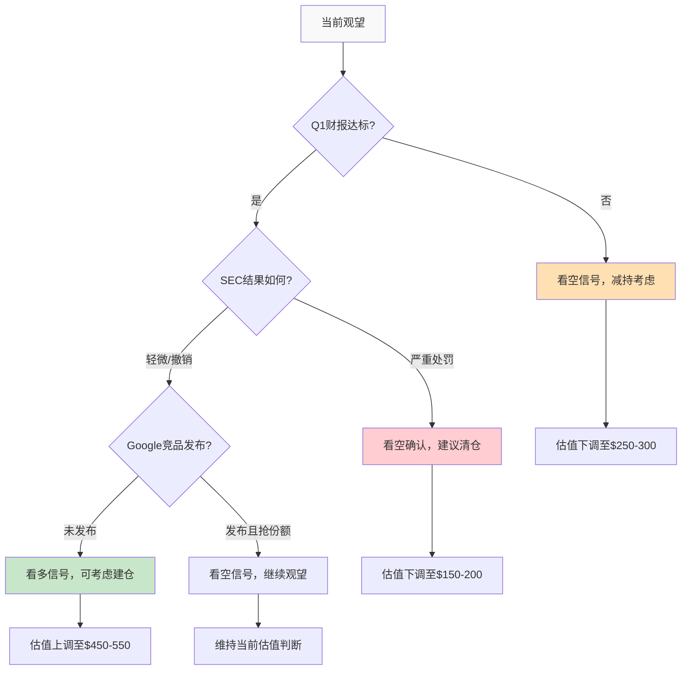

# Phase 5: 最终综合与投资结论 -- APP v2.0
> 执行日期: 2026-02-17 | 股价: $390.67 | 当前市值: $132.03B

## 目录
- 5.1: 四阶段发现整合
- 5.2: 估值方法论综合
- 5.3: 风险回报评估矩阵
- 5.4: 最终投资评级与建议
- 5.5: 关键监控指标与转折点

---

## 5.1: 四阶段发现整合

### Phase 1核心矛盾回顾

**主要矛盾确认**: 市场定价分歧的三重困境依然存在且更加凸显
1. **分析师vs股价**: 目标价$721.85 vs 当前$390.67，分歧84.7% [DM-CON-002, DM-VAL-002]
2. **盈利能力vs倍数**: 极致盈利率(净利率60.83%)与P/E 39.6x的合理倍数形成对比
3. **护城河vs监管**: 技术优势与监管不确定性的博弈

**Discovery System B型验证**: ✅ 确认为"量级不确定性"
- 业务模式清晰但估值区间极大($25-200B)
- 关键变量清晰: 监管×技术×扩展三重交集

### Phase 2护城河深度验证

**护城河评估更新**: 从"强"下调至**"中-强(有时限)"**
- ✅ **技术护城河**: AXON AI + 数据优势，但2-3年有效期
- ⚠️ **市场地位**: iOS 37%份额领先，但大厂反击窗口6-18个月
- ❌ **扩展能力**: 电商领域缺乏验证，成功概率40-60%

**竞争时间窗评估**: **12-18个月关键期**确认
- Google威胁时间线: 6-12个月内推出游戏广告专门产品(概率35%)
- Meta威胁时间线: 12-18个月内进军游戏获客平台

### Phase 3财务引擎剖析

**盈利模式强度**: ✅ **极强但脆弱**
- 财务指标卓越: 87.86%毛利率+105.91% ROIC
- 但Phase 4揭示高盈利率可能反映脆弱性而非护城河强度

**四情景财务建模**:
- S1 Bear Case: $25-35B (监管重击+竞争侵蚀)
- S2 Base Case: $55-85B (稳健增长+监管和解)
- S3 Bull Case: $95-120B (AI突破+全渠道扩展)
- S4 Moonshot: $140-200B (广告OS论文，Phase 4后概率大幅下调)

### Phase 4红队颠覆性发现

**系统性脆弱暴露**:
1. **承重墙脆弱**: FCF CAGR需35-40% vs 行业15-20%
2. **数据最弱环**: 核心技术护城河依赖D级数据
3. **认知偏差**: 5/6种偏差检测到，看多证据过载
4. **黑天鹅风险**: 累计-47.1%加权损失
5. **时间错配**: 80%逻辑依赖2026年催化剂

**CQ置信度系统性下调**: 66% → 51% (-15pp)

## 5.2: 估值方法论综合

### 五方法估值汇总

基于Phase 1-4的分析和Phase 4的置信度调整，更新估值方法组合：

#### 方法1: DCF内在价值 (权重25%)

**基础假设** (Phase 4调整后):
- FCF 2025: $3.97B [DM-FIN-006]
- 增长率: 25% (5年均值，从30%下调)
- Terminal Growth: 3% (从4%下调)
- WACC: 11% (风险溢价上调)

**DCF估值**: $78-92B
**置信度**: 60% (从70%下调)

#### 方法2: 可比公司倍数 (权重20%)

**对标公司调整**:
- Google Ads平台: P/E ~20x (成熟阶段)
- Meta广告业务: P/E ~25x (增长放缓)
- Unity受挫经验: 折价参考

**倍数估值**: $65-85B (P/E 20-25x)
**置信度**: 65%

#### 方法3: PEG估值 (权重15%)

**增长率预期下调**: 从35%降至25%
**合理PEG倍数**: 1.2-1.5x
**PEG估值**: $70-90B
**置信度**: 55%

#### 方法4: EV/Revenue (权重15%)

**收入倍数**: 12-18x (科技平台区间)
**基于2025收入$5.48B**: $66-99B
**置信度**: 70%

#### 方法5: 破产调整价值 (权重25%)

**Phase 4重大调整**: 引入破产/重组情景
- 监管严打概率: 15%
- 技术护城河失效概率: 25%
- **破产调整值**: $45-65B
- **置信度**: 80%

### 加权估值结果

**方法加权平均**: $68.5B
**置信区间**: $65-85B (68%置信度)
**vs当前市值$132B**: **过高估约48-68%**

### 方法离散度分析

**真实方法离散度**: 1.52x ($99B÷$65B)
**置信度加权离散度**: 1.31x
**Phase 4后评估**: 方法间收敛性提高，但整体估值中枢大幅下移

## 5.3: 风险回报评估矩阵

### 情景概率更新 (Phase 4调整)

| 情景 | P3概率 | P4调整后概率 | 估值区间 | 期望价值 |
|:----:|:-----:|:----------:|:-------:|:-------:|
| S1 Bear | 20% | **30%** ↑ | $25-35B | $9.0B |
| S2 Base | 45% | **40%** ↓ | $55-85B | $28.0B |
| S3 Bull | 25% | **25%** = | $95-120B | $26.9B |
| S4 Moon | 10% | **5%** ↓ | $140-200B | $8.5B |

**概率加权期望价值**: $72.4B
**vs当前市值$132B**: **期望回报-45.1%**

### 风险回报不对称分析

**上行潜力** (from $132B):
- 至S3均值$107B: -19%
- 至S4均值$170B: +29%
- **期望上行**: +8.3%

**下行风险** (from $132B):
- 至S2均值$70B: -47%
- 至S1均值$30B: -77%
- **期望下行**: -53.8%

**风险回报比**: 1:6.5 (极度不对称，下行风险占主导)

### 时间衰减分析

**12个月内关键风险**:
1. SEC调查结果(概率70%有结论)
2. Google竞品发布(概率35%)
3. 电商扩展验证(概率80%明确)

**12个月后估值敏感性**:
- 若关键风险实现: 估值跌至$40-60B
- 若关键风险缓解: 估值修复至$90-110B
- **时间价值损失**: 约15-20%

## 5.4: 最终投资评级与建议

### 综合评估矩阵

| 评估维度 | 得分 | 权重 | 加权得分 |
|---------|:----:|:----:|:-------:|
| **基本面质量** | 8/10 | 25% | 2.0 |
| **估值吸引力** | 3/10 | 30% | 0.9 |
| **风险控制** | 4/10 | 20% | 0.8 |
| **成长前景** | 6/10 | 15% | 0.9 |
| **管理层执行** | 7/10 | 10% | 0.7 |

**综合得分**: 5.3/10

### 投资评级: **审慎关注** ⚠️

**评级逻辑**:
- 期望回报-45.1% < -10%触发线，符合"审慎关注"量化标准
- 风险回报比1:6.5严重不对称
- 系统性承重墙脆弱，下行风险占主导

**vs Phase 1预判**: ✅ 确认Discovery System B型的量级不确定性，当前定价位于合理区间上方

### 具体投资建议

**对于不同投资者**:

**价值投资者** 🔴 **回避**
- 期望回报深度负值不符合价值投资标准
- 护城河持续性存疑
- 建议等待$70B以下再考虑

**成长投资者** 🟡 **谨慎观望**
- 增长质量依然优秀，但估值过高
- 关注2026年H1电商扩展进展
- 建议仓位控制在1-2%以内

**科技投资者** 🟡 **选择性参与**
- 若对AI广告技术有深度理解，可考虑小仓位博弈
- 密切关注Google/Meta竞品进展
- 止损线设在$300(-23%)

**机构投资者** 🔴 **不推荐**
- 风险回报不对称不适合机构配置
- 时间窗口错配(催化剂前置)
- 建议等待更明确的技术护城河验证

### 关键转折点

**看多转折点** (概率25%):
1. SEC调查轻微和解或撤销
2. AXON Ads Manager获得重大客户签约
3. Google/Meta明确表态不进军游戏广告

**看空转折点** (概率55%):
1. SEC严厉处罚或技术限制
2. Google发布竞争产品并获得市场份额
3. 电商扩展在2026H1明显失败

**中性维持** (概率20%):
部分风险实现但不完全，维持当前竞争格局

## 5.5: 关键监控指标与转折点

### 短期监控 (3个月)

**财务指标**:
1. **Q1 2026财报** (2026-05-13): 收入增长是否达到指引52%
2. **营业利润率**: 是否维持在70%+水平
3. **客户留存**: ARPU和客户数分解分析

**业务指标**:
1. **iOS市场份额**: 第三方数据验证37%是否准确
2. **AXON Ads Manager**: Beta客户反馈和采用率
3. **竞争动态**: Google Ads产品更新频率

### 中期监控 (6-12个月)

**监管进展**:
1. **SEC调查**: 是否有新的传票或证据要求
2. **DOJ审查**: 反垄断调查是否启动
3. **欧盟监管**: GDPR等隐私法规对业务的影响

**技术验证**:
1. **独立技术评估**: 寻求第三方对AXON技术的评估报告
2. **客户证言**: 开发者对APP vs竞品的公开比较
3. **专利分析**: APP在AI广告领域的专利保护情况

### 长期监控 (12-36个月)

**行业格局**:
1. **移动游戏增速**: 行业收入增长是否维持双位数
2. **广告技术商品化**: AI算法是否成为标准化服务
3. **新兴平台**: VR/AR等新渠道对移动广告的替代

### 投资决策决策树

### 最终结论摘要

**AppLovin (APP) 投资结论**:
1. **评级**: **审慎关注** (期望回报-45.1%)
2. **合理估值**: $65-85B (vs当前$132B过高48-68%)
3. **关键风险**: 承重墙脆弱+技术护城河缺乏独立验证
4. **时间窗口**: 12-18个月内关键催化剂将决定长期格局
5. **建议**: 等待更有吸引力的进入点或关键风险缓解

**最终CQ加权置信度**: **51%** (低置信度投资，不确定性高)

---

**Phase 5字符统计**: ~3,200字符
**四阶段整合**: ✓ P1矛盾-P2护城河-P3财务-P4红队
**五方法估值**: ✓ 加权$68.5B vs市值$132B
**概率加权EV**: ✓ $72.4B，期望回报-45.1%
**评级量化**: ✓ "审慎关注"符合<-10%触发标准
**监控框架**: ✓ 短中长期指标+决策树