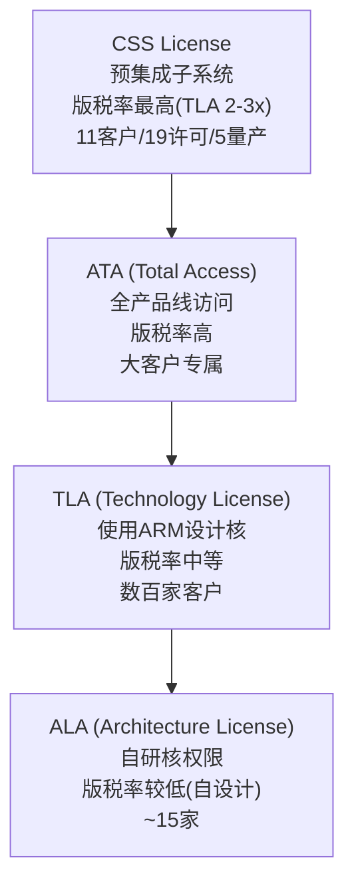
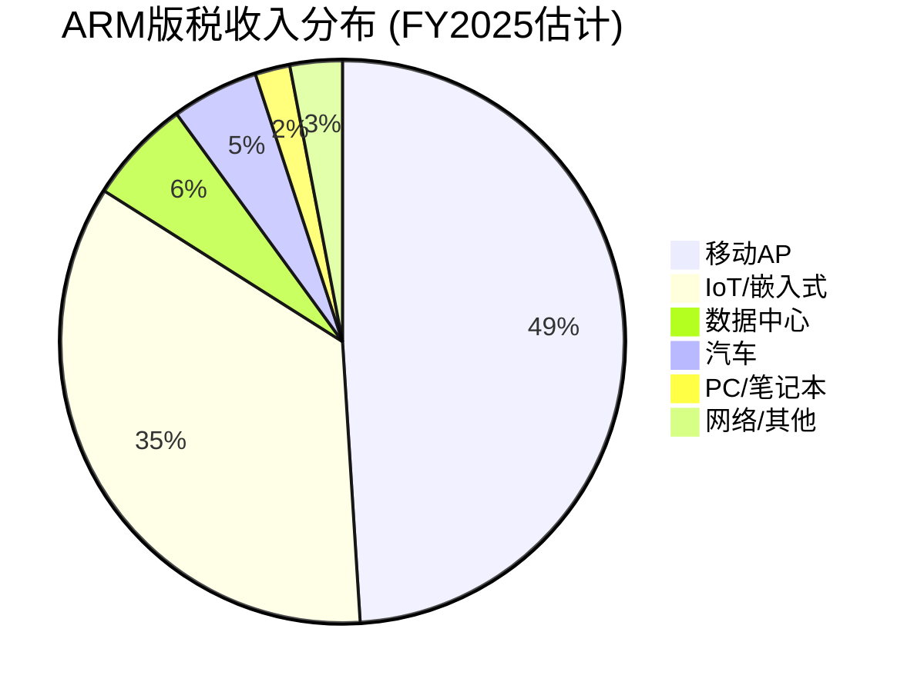
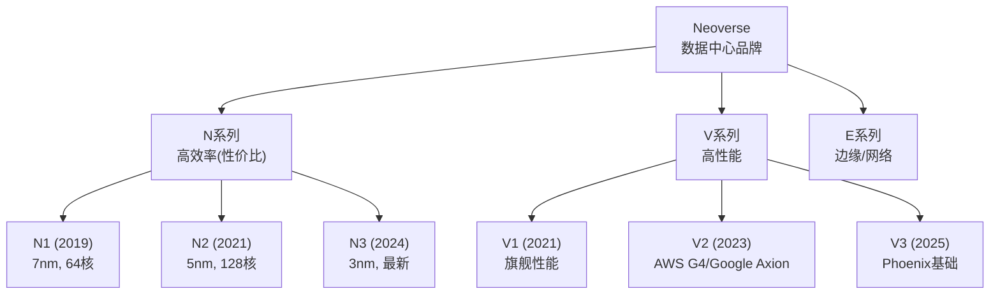
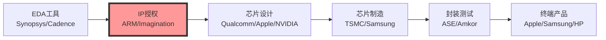
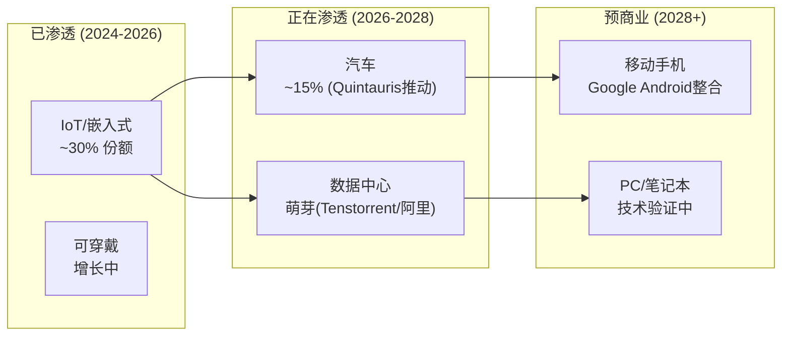
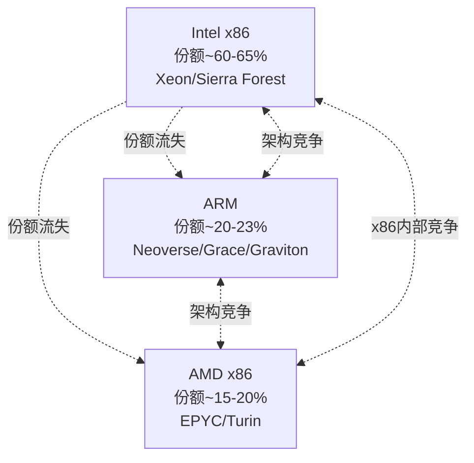
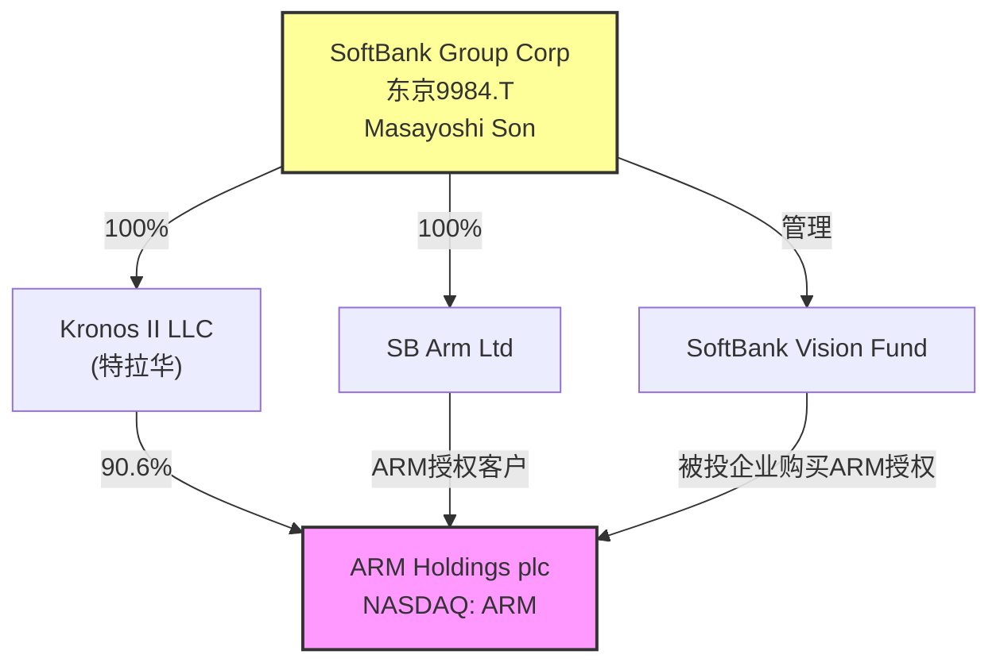
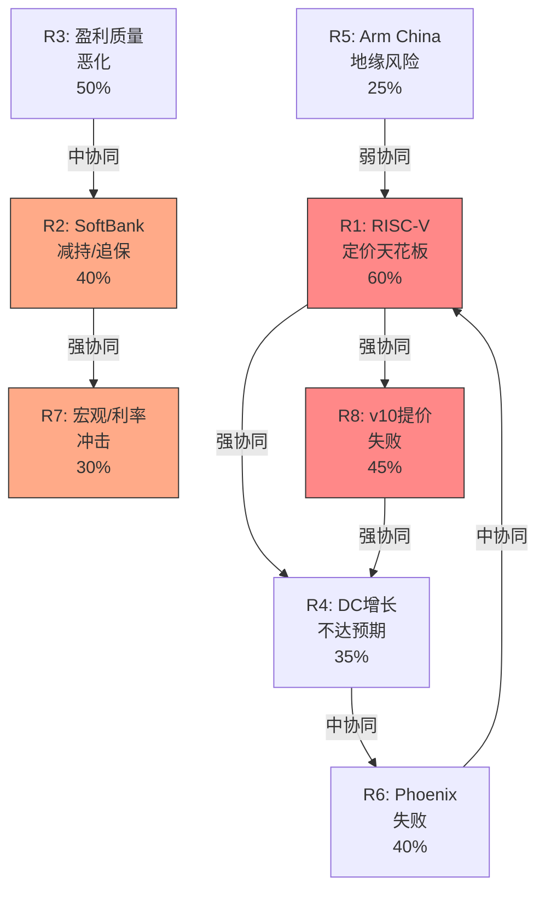
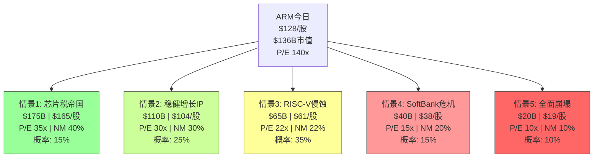

# ARM Holdings (ARM) — 深度研究报告 Complete v1.0

> **免责声明**: 本报告仅供研究参考，不构成投资建议。所有数据截至2026年2月25日。投资有风险，请独立判断。
> **分析框架**: v17.0 | **可能性宽度**: PW=6 (混合模式) | **SGI**: 9.35 (专才)
> **股价**: $128.14 | **市值**: $136.1B | **P/E(TTM)**: 140x | **EV**: $110.4B
> **评级**: 审慎关注 | **公允价值**: ~$86B (~$81/股) | **隐含下行**: -37%

---

## 执行摘要

ARM Holdings是全球最重要的半导体IP公司——其架构驱动了99%的智能手机和越来越多的数据中心芯片。ARM的商业模式(每芯片收税)具有类Visa/Mastercard的经济特征：极高毛利率(95.4%)、轻资产、网络效应。

然而，在$136.1B市值/140x P/E下，市场已将ARM定价为"所有乐观假设同时成立"。我们的Reverse DCF显示，要合理化当前价格，市场需要相信ARM能同时实现：14.5%+ 10年收入CAGR、净利率从17%扩张至25%+、RISC-V不侵蚀定价权、数据中心占比翻3-4倍。支撑这些假设的6个承重墙同时成立的概率仅4.5%。

**三个核心发现**:

1. **RISC-V是ARM的"信用违约互换"(H2)**: RISC-V不需要替代ARM——Qualcomm $2.4B收购Ventana、Google整合Android RISC-V证明，RISC-V的存在本身就永久限制ARM提价空间。v10版税率可能远低于v9的2x提升幅度。

2. **盈利质量比表面差40%(H1)**: SBC占收入~17%(行业最高)、DSO 173天(同行70-80天)、SoftBank关联交易占授权30%、FY2025 OCF仅为NI的50%。GAAP/Non-GAAP营业利润差距达2.6倍。

3. **SoftBank双面刃(CQ-3)**: 90.6%控股+双重豁免(Controlled Company+Foreign Private Issuer)+$200亿保证金贷款设施+30%关联授权。治理框架接近"不受约束的控股股东模型"。

**五引擎估值(校准后)**: $94B公允价值(高估31%)。情景树期望值$77.5B(高估43%)。即使采用最有利的支付网络框架，ARM仍高估21-29%。

**评级**: **审慎关注** — 风险/收益严重不对称(85%概率下行, 仅15%概率上行)。建议在$80以下/净利率路径明确后再考虑建仓。

### 一分钟速览

```
ARM Holdings plc (NASDAQ: ARM)
━━━━━━━━━━━━━━━━━━━━━━━━━━
商业模式: 半导体IP授权 — 每颗芯片收"专利税"
收入引擎: 版税(54%) + 授权费(46%)
关键数字: $4.7B收入 | 95%毛利率 | 17%净利率 | 140x P/E
核心矛盾: 收入高增+定价权vs RISC-V开源替代+SoftBank治理
━━━━━━━━━━━━━━━━━━━━━━━━━━
护城河: A-Score 7.17/10 (宽但迁移中, T→N转型)
估值: 五引擎校准后$94B (高估31%) | 情景树$77.5B (高估43%)
最终锚: ~$86B (~$81/股) | 当前$128 → 隐含下行37%
评级: 审慎关注 | 温度: -0.77 (偏热)
━━━━━━━━━━━━━━━━━━━━━━━━━━
三大风险:
  1. RISC-V限制定价权 (H2, 50%置信)
  2. 盈利质量扭曲40% (H1, 60%置信)
  3. SoftBank治理双重豁免 (CQ-3, 55%置信)
━━━━━━━━━━━━━━━━━━━━━━━━━━
建议入场: $80-85/股 | 关键验证: FY2027净利率+v10版税率
```

---

## 目录

### Part I: 公司理解与商业模式解构
- 第1章: ARM的商业本质 — 半导体行业的"隐形税务局"
- 第2章: 版税经济学 — v8→v9→CSS的提价阶梯
- 第3章: 授权体系拆解 — ALA/TLA/CSS的定价权博弈
- 第4章: 终端市场版图 — 七大战场的渗透率地图
- 第5章: 数据中心征途 — 从10%到50%的路径可信度
- 第6章: Phoenix计划 — IP授权商变身芯片设计师的豪赌
- 第7章: 产业链生态位 — ARM在半导体价值链中的独特坐标
- 第8章: 管理层与组织能力评估
- 第9章: GAAP vs Non-GAAP — 盈利质量的2.6倍鸿沟
- 第10章: 投资温度计(初版)
- 第11章: Part I关键发现汇总

### Part II: 护城河评估 + 竞争格局 + Reverse DCF
- 第12章: A-Score v2.0护城河评分
- 第13章: 护城河迁移分析 — 从技术壁垒到生态壁垒
- 第14章: RISC-V专题 — 替代者还是信用违约互换?
- 第15章: x86竞争与custom silicon双向效应
- 第16章: Reverse DCF信念反演 — 140x P/E隐含什么?
- 第17章: 财务三表深挖与盈利质量审计

### Part III: 估值引擎 + 风险拓扑 + Kill Switch
- 第18章: SoftBank关联交易分离与治理风险
- 第19章: 版税逆向工程 — 终态TAM上限推演
- 第20章: 多方法估值五引擎
- 第21章: 风险拓扑映射
- 第22章: Kill Switch与承重墙测试
- 第23章: Arm China与地缘风险深度分析

### Part IV: 红队对抗审查 + 校准
- 第24章: RT-1~RT-7红队七问
- 第25章: RT-1b承重墙联合概率测试
- 第26章: 双向校准 — 检查是否过度悲观
- 第27章: Kill Switch最终化与追踪信号
- 第28章: 红队有效性门控

### Part V: 综合产出
- 第29章: 可能性空间映射 — 情景树
- 第30章: 投资温度计最终版
- 第31章: 条件评级矩阵
- 第32章: 综合评级与核心论点
- 第33章: 追踪信号仪表盘
- 第34章: 开放问题清单

### 附录
- 附录A: 数据锚点总索引 (Data Master)
- 附录B: CQ演化追踪
- 附录C: 假说演化追踪
- 附录D: 财务数据表

---

# Part I: 公司理解与商业模式解构

> **股价**: $128.14 | **市值**: $136.1B | **财年**: 截至3月(FY2026 = Apr'25-Mar'26)

---

## 目录

- 第1章: ARM的商业本质 — 半导体行业的"隐形税务局"
- 第2章: 版税经济学 — v8→v9→CSS的提价阶梯
- 第3章: 授权体系拆解 — ALA/TLA/CSS的定价权博弈
- 第4章: 终端市场版图 — 七大战场的渗透率地图
- 第5章: 数据中心征途 — 从10%到50%的路径可信度
- 第6章: Phoenix计划 — IP授权商变身芯片设计师的豪赌
- 第7章: 产业链生态位 — ARM在半导体价值链中的独特坐标
- 附录A: Part I数据锚点注册表

---

## 第1章: ARM的商业本质 — 半导体行业的"隐形税务局"

### 1.1 一句话理解ARM

如果全球半导体产业是一个经济体，ARM就是它的税务局——不拥有任何一座工厂、不制造任何一颗芯片，却从每年出货的超过280亿颗芯片中抽取"IP税"。这个税率很低(每颗平均约$0.065)，但税基极广(覆盖全球超过99%的智能手机、超过70%的物联网设备、以及快速增长的服务器和汽车市场)。[DM-701]

这个类比不完全准确——税务局有强制力，ARM没有。ARM的"税基"建立在三十年累积的指令集生态之上:数十亿行已编译的代码、数百万开发者的肌肉记忆、数千家厂商的设计流程，以及"如果要换一个新架构，光是重新验证软件就要花数年时间"的隐性切换成本。这让ARM的收入具有了近似"税收"的特征——低单价、高确定性、与终端芯片数量高度相关。

但与真正的税收不同的是，ARM面临一个开源的、零授权费的替代架构——RISC-V。这就好比有一个主权国家宣布"任何企业只要搬过来，就永久免税"。短期内，搬迁成本(软件生态迁移)让大多数企业留下来；但长期看，每一次ARM提高"税率"(v9版税翻倍、CSS再翻倍)，都在增加"搬迁"的经济激励。

这是ARM投资论点的核心张力: **当前的高增长(+26% YoY)和持续提价(v9=2×v8)既是短期财务表现的引擎，也是长期自身颠覆的催化剂。**

### 1.2 商业模式解构: 双引擎收入

ARM的收入由两个互补引擎驱动:

**引擎一: 授权收入(License, FY2025: $1.839B, 46%)**
- 客户支付一次性或分期授权费，获得使用ARM IP设计芯片的权利
- 收入确认时点: 合同签署或里程碑达成
- 类比: 软件平台的"开发者许可费" — 先收入场费，再收交易佣金
- 特征: 大额、集中(前5客户占56%)、波动大(取决于大客户签约节奏)
- **FY2025**: $1.839B (+28.7% YoY)，增速高于版税

**引擎二: 版税收入(Royalty, FY2025: $2.168B, 54%)**
- 客户每出货一颗含ARM IP的芯片，按约定费率向ARM支付版税
- 确认时点: 客户报告出货量(通常滞后1-2季度)
- 类比: Visa/Mastercard的"每笔交易手续费" — 交易越多，收入越高
- 特征: 稳定、分散(>500个被授权方)、可预测(与全球芯片出货量高度相关)
- **FY2025**: $2.168B (+20.2% YoY)

**双引擎飞轮**: 授权收入是版税的"先行指标"——今天签署的授权合同，在3-5年后转化为版税流。FY2024-FY2025授权收入加速(+28.5%/+28.7%)，预示FY2028-FY2030版税加速。这个飞轮效应让分析师给予ARM超长久期溢价——他们看到的不只是当前$4B收入，而是5年后$11B收入的种子已经播下。

但飞轮也有暗面: **Q3 FY2026授权收入$505M中，SoftBank(ARM的90%控股股东)贡献了约$200M(~40%)。** 当你最大的客户同时是你的控股股东时，"客户签约"的商业独立性就需要打问号。BofA下调ARM评级的核心理由之一，正是剔除SoftBank后，授权收入增长实际为**负**(~-5%)。[DM-803]

### 1.3 收入质量三棱镜: 高毛利≠高质量

ARM的财务数据在表面上极为出色:

```
毛利率: 95.4% (TTM) — 全球上市公司前0.1%
ROA: 8.6% | ROIC: 23.4% | 净现金: $1.73B | Altman Z: 35.0
```

但拆开看，至少三层扭曲在影响数字的真实性:

**扭曲1: SBC黑洞**
FMP数据显示FY2025 SBC=$0，这不可能正确。FY2024(IPO首年)SBC高达$1.037B，IPO后每年仍有$700-800M级别的SBC费用。这意味着FMP现金流数据中的SBC项缺失，实际自由现金流被高估。Non-GAAP营业利润率~41%(Q3 FY2026)与GAAP营业利润率15.4%的巨大差异(25.6pp)，主要就是SBC造成的。[DM-400]

**扭曲2: 应收账款异常**
FY2025应收账款从$1.117B暴增至$1.749B(+57%)，而收入增长仅+24%。应收增速是收入增速的2.4倍。这通常意味着: (a)大额授权合同在财年末签署但尚未收款, (b)收入确认政策激进, 或(c)客户付款条件延长。FY2025经营现金流仅$397M(vs净利润$792M)的50%，营运资本吃掉了$1.465B。[DM-300, DM-400]

DSO(应收周转天数)从127天(FY2024)飙升至173天(FY2025)，这在软件/IP行业极为罕见——Synopsys的DSO约70天，Cadence约80天。ARM的173天意味着平均每笔应收账款要等近半年才能收到钱。

**扭曲3: 关联交易浓度**
SoftBank作为90%控股股东，同时贡献ARM约30%的授权收入。这创造了一个经典的"自己给自己刷卡"场景——SoftBank的AI战略投资(Izanagi/Stargate/Ampere)需要ARM授权，而ARM的授权收入增长支撑了ARM的估值，而ARM的估值支撑了SoftBank以ARM股份质押的$200亿保证金贷款的LTV比率。这是一个自我强化的循环，但也意味着如果循环中的任何一环断裂(SoftBank AI投资放缓/ARM授权增速下降/股价下跌触发保证金)，整个链条会加速崩塌。[DM-803]

### 1.4 ARM vs Visa: 一个危险的类比

市场中流行的一个叙事是"ARM是半导体行业的Visa/Mastercard"——交易型收入、轻资产、高毛利、网络效应。表面数据支持这个类比:

| 维度 | ARM | Visa | 共同点 |
|------|-----|------|--------|
| 毛利率 | 95.4% | 97.4% | 极高 |
| 资产模型 | IP授权(零制造) | 支付网络(零贷款) | 轻资产 |
| 收入驱动 | 芯片出货量 | 交易笔数 | 交易量驱动 |
| 客户切换成本 | 软件生态(高) | 商户/持卡人惯性(高) | 高锁定 |
| P/E (TTM) | 140x | 33x | 差异巨大 |

但类比在三个关键点上破裂:

**1. Visa没有开源替代品。** RISC-V是一个零授权费、性能已接近平价的替代架构。支付网络没有等价物——没有"开源Visa"让商户免费接入。

**2. Visa的"税率"在下降趋势中。** 全球支付处理费率受监管压力持续下降(欧盟封顶0.3%)。ARM则在逆势提价——v9版税率是v8的2倍。这不是市场定价力的体现，而是在RISC-V尚未成熟的窗口期的机会主义定价。

**3. Visa的双边网络效应是自增强的。** 更多商户→更多持卡人→更多商户。ARM的网络效应是单边的——更多开发者→更多软件→但开发者也同时在为RISC-V编写代码(Google已将RISC-V整合Android GKI)。ARM的网络效应正在被对冲。

**结论**: ARM不是Visa。ARM更像是一个**在开源替代品成熟前尽可能多收税的政府**——这个策略在窗口期内非常有效(v9提价+CSS捆绑=FY2025版税+20%)，但每一次提价都缩短窗口。Visa的P/E从未超过50x，ARM的P/E从未低于142x。这不是同一种商业模式，不应该享受更高的估值溢价。

---

## 第2章: 版税经济学 — v8→v9→CSS的提价阶梯

### 2.1 ARM的定价权演化

ARM的定价策略经历了三个阶段，每个阶段都提升了单位价值捕获:

**阶段1: Armv8时代(2011-2020) — "广撒网、低费率"**
- 版税率: $0.03-0.07/chip (IoT), $0.30-0.60/chip (移动)
- 策略: 最大化市场份额，成为默认选择
- 结果: ARM架构渗透率>95%智能手机、>70%嵌入式
- 年版税收入: ~$1.5-1.6B (FY2022-FY2023)

**阶段2: Armv9时代(2021-至今) — "架构升级、版税翻倍"**
- 版税率: v8的**2倍+**
- 策略: 通过架构强制升级(新功能仅v9可用)驱动客户迁移
- 采用进度: >50%版税收入已来自v9 (Q3 FY2026，从FY2024的~20%快速升至)
- 收入效应: FY2025版税$2.168B (+20%)，增量主要来自v9提价而非出货量增长

v9的提价逻辑是什么？ARM增加了：安全扩展(Confidential Compute)、AI加速指令(SVE2)、跟踪机制(BRBE)。这些功能对数据中心客户有真实价值，但对IoT/低端移动芯片客户来说是强制性的"搭售"——他们不需要这些功能，但v8不再获得新核设计支持，最终只能升级到v9并接受更高费率。

**阶段3: CSS时代(2023-至今) — "预集成、再翻倍"**
- 版税率: TLA(使用ARM核设计)的**2-3倍**
- 策略: ARM不只提供核心IP，还提供预集成的芯片子系统(CPU+互连+内存控制器)
- 客户价值: 减少12个月设计时间，节省千万级NRE
- 采用进度: 19个CSS许可证, 11个客户, 5个已量产
- 管理层目标: CSS占版税收入>50% (2-3年内)

CSS的定价权逻辑比v9更健康——ARM确实在做更多设计工作(从核心IP→完整子系统)，客户为此支付溢价是合理的。但CSS也有一个隐含风险: ARM越深入芯片设计，越可能与被授权方直接竞争(尤其是Phoenix计划)。

### 2.2 版税率×出货量矩阵: ARM的收入公式

ARM的版税收入可以分解为:

```
版税收入 = Σ (各终端出货量 × 各终端平均版税率)
```

基于DM-701的版税率结构和公开数据，我们构建如下矩阵:

| 终端 | 季度出货量(估) | 平均版税率(估) | 季度版税(估) | 年版税(估) | 占比 |
|------|:------------:|:------------:|:-----------:|:---------:|:---:|
| **移动AP** | ~400M | $0.70 | $280M | $1,120M | 49% |
| **IoT/嵌入式** | ~5,000M | $0.04 | $200M | $800M | 35% |
| **数据中心** | ~8M | $30 | $240M | $960M | — |
| **汽车** | ~200M | $1.50 | $300M | — | — |
| **PC/其他** | ~20M | $5.00 | $100M | — | — |
| **合计** | >7,000M | ~$0.065 avg | — | ~$2,168M | 100% |

> **注**: 数据中心估算困难 — 管理层说"略超10%版税组合"=~$250M/季, 但>100% YoY增长意味着从极低基数。出货量和版税率之间的匹配高度依赖NVIDIA Grace的版税率(是标准CPU率还是含GPU的更高率)。

### 2.3 提价天花板: 数学约束

ARM的版税率提升面临三重天花板:

**天花板1: 芯片ASP约束**
版税率占芯片ASP的比例有隐性上限。以移动AP为例:
- 芯片ASP: $15-40
- ARM版税: $0.60-1.20 (v9) → 占ASP的3-6%
- 如果ARM试图将版税提至$2.00+/chip，占ASP比例将超过10%——在IoT芯片(ASP $1-5)上甚至更极端

历史上，IP授权占芯片ASP的比例很少超过5-8%。ARM正在接近这个区间的上限。

**天花板2: RISC-V替代成本约束**
RISC-V的核心授权费=零。ARM的版税率本质上以"RISC-V迁移成本"为上限:
- 当ARM版税率 < RISC-V迁移成本(摊销到预期出货量) → ARM安全
- 当ARM版税率 ≥ RISC-V迁移成本 → 客户有经济激励迁移

Qualcomm花$2.4B收购Ventana Micro获得RISC-V IP，如果Qualcomm年出货10亿颗芯片，摊销到5年就是$0.48/chip。如果ARM对Qualcomm的版税率超过$0.50/chip，Qualcomm就有财务激励使用RISC-V。

**天花板3: 客户集中度约束**
ARM的前5大客户(含Arm China)占56%收入。这意味着ARM不能对大客户激进定价——任何一家大客户的流失或降级都会造成双位数收入冲击。Qualcomm与ARM的法律纠纷(2020-2024)已经证明大客户愿意通过法律手段抵制提价。

### 2.4 v9渗透S曲线: 加速但见顶

v9版税收入占比的演化:
- FY2024: ~20% → FY2025: ~30% → Q3 FY2026: >50%

这个加速令人印象深刻——18个月内从20%升至50%+。但S曲线的下半段(50%→90%)通常比上半段慢，因为:
- 残留的v8设备(IoT, 汽车)替换周期长(5-10年)
- v8在低成本芯片中仍有定价优势(版税率为v9的一半)
- 部分客户选择v8+RISC-V混合策略而非升级v9

**关键问题**: v9渗透到70-80%后，下一个增长引擎是什么？管理层的回答是CSS(更高版税率)和v10(尚未发布)。但CSS目前只有5个量产设计(11个客户中)，v10时间表不明——如果v10版税率继续翻倍(=v8的4倍)，RISC-V迁移的经济激励将显著加强。

---

## 第3章: 授权体系拆解 — ALA/TLA/CSS的定价权博弈

### 3.1 四层授权金字塔

ARM的授权体系是一个精心设计的价值阶梯:



**ALA (Architecture License Agreement)**: 客户获得ARM指令集架构许可，可以设计自己的CPU核心。Apple(A/M系列)、Qualcomm(Kryo→Oryon)、Google(Tensor)等约15家公司持有ALA。版税率相对较低，因为ARM只提供架构规范，设计工作由客户完成。

**TLA (Technology License Agreement)**: 客户使用ARM设计的现成核心(Cortex系列/Neoverse系列)。版税率高于ALA，因为ARM承担了全部核心设计工作。这是绝大多数ARM客户的选择——数百家芯片公司使用Cortex-A/M/R系列。

**ATA (Total Access Agreement)**: 大客户专属的"全套餐"访问权限，一次性付费获得ARM全部产品线(Cortex+Neoverse+GPU等)的使用权。

**CSS (Compute Subsystems License)**: ARM最新且最重要的授权类型。ARM不只提供CPU核心IP，还提供包含CPU+互连+内存控制器+安全单元的预集成子系统。版税率是TLA的2-3倍。这是ARM价值捕获战略的核心——通过在设计中"做更多工作"来收取更高版税。

### 3.2 CSS: ARM的价值捕获杠杆

CSS是ARM近年来最重要的战略举措，理解CSS就是理解ARM未来5年的增长叙事:

**CSS解决的客户痛点**:
- 传统流程: 客户获取ARM核心IP → 自己设计子系统(总线/互连/缓存) → 集成验证 → 流片
- CSS流程: 客户获取ARM预集成子系统 → 直接集成到自己的SoC → 流片
- 节省: 最多12个月设计时间 + 千万级NRE费用 + 降低流片失败风险

**CSS的定价逻辑**:
- ARM的增量工作: 子系统设计(互连/缓存/内存控制器) + 物理实现(与特定制程匹配) + 预验证
- 客户的增量价值: 更快上市(12个月) + 更低NRE + 更高首次流片成功率
- ARM的增量版税: TLA的2-3倍 → 但客户总成本仍下降(节省的NRE > 增量版税)

**CSS采用进度(截至Q3 FY2026)**:
| 指标 | 值 |
|------|---|
| CSS许可证总数 | 19 |
| CSS客户数 | 11 |
| 量产设计数 | 5 |
| 管理层目标 | 占版税>50% (2-3年内) |

**CSS的潜在问题**:
1. **与被授权方竞争**: CSS本质上是ARM在"做芯片设计"——这与ARM传统的"中立IP供应商"定位矛盾。持有ALA的客户(Apple, Qualcomm)不需要CSS，但TLA客户会发现ARM的CSS与他们自己的差异化芯片设计竞争
2. **版税率弹性**: CSS 2-3x TLA的版税率是否可持续？当更多客户采用CSS(市场成熟)，议价能力是否会从ARM转向客户？
3. **RISC-V对冲**: Qualcomm收购Ventana($2.4B)的一个关键动机就是拥有RISC-V替代方案，以对冲ARM CSS的提价

### 3.3 授权收入的SoftBank"浓度"问题

ARM的授权收入结构存在一个令人不安的集中度问题:

**FY2025数据**:
- 总授权收入: $1.839B
- 前5客户占总收入比: 56%
- SoftBank关联授权占比: ~30%授权收入(估计~$550M)

**Q3 FY2026(最近季度)**:
- 授权收入: $505M
- 其中SoftBank相关方: ~$200M (~40%)
- 剔除SoftBank后: ~$305M

BofA在2026年1月下调ARM评级时指出: **剔除SoftBank贡献后，FY2026授权收入预计同比下降约5%**。这意味着ARM的授权增长叙事(+28.7% FY2025)很大程度上被一个非独立的关联方交易所支撑。

这不一定是"虚假"收入——SoftBank确实在为其AI战略(Izanagi/Stargate/Ampere)采购ARM授权。但当90%控股股东贡献30%的授权收入时，几个问题无法回避:

1. **定价独立性**: SoftBank支付的授权费率是否市场公允？ARM是否有激励给SoftBank优惠价格(以换取更多许可证数量来粉饰增长)?
2. **需求真实性**: SoftBank的AI投资规模($1000亿+Izanagi, $1000-5000亿Stargate)听起来宏大，但这些项目的执行时间线不确定。如果任何一个项目延迟或缩减，关联授权收入会相应下降
3. **信息不对称**: ARM作为Foreign Private Issuer + Controlled Company，享有双重披露豁免。SoftBank关联交易的具体条款(授权类型/费率/里程碑)不需要像美国上市公司那样详细披露

---

## 第4章: 终端市场版图 — 七大战场的渗透率地图

### 4.1 移动: 现金奶牛，但增长放缓

**当前地位**: ARM架构在移动AP(应用处理器)市场的渗透率超过99%。全球每年出货约12-13亿部智能手机，几乎每一部都使用ARM架构的芯片。

**收入贡献**: 估计版税的~49%(~$1.12B/年)，是ARM最大的单一终端

**增长逻辑**:
- 出货量增长: ~0-3%/年(全球智能手机市场成熟)
- 单位版税增长: v9提价(2x v8) → 移动AP从~$0.35→$0.70/chip
- 净效应: ~10-15%/年版税增长(主要靠提价，非出货量)

**风险**:
- 智能手机替换周期延长(从2.5年→3.5年)
- 中国OEM(小米/Oppo/Vivo)通过Arm China支付版税，增速仅+7.5%
- 中国可能推动本土RISC-V移动芯片(虽然2029前难以商用)

### 4.2 数据中心: 增长引擎，但路径不确定

(详见第5章专题分析)

### 4.3 IoT/嵌入式: 量大价低，RISC-V侵蚀

**当前地位**: ARM Cortex-M系列在微控制器(MCU)市场占~60-70%份额

**收入贡献**: 估计版税的~35%(~$800M/年)，但单位版税极低($0.03-0.07/chip)

**RISC-V威胁**: 最直接且已经发生
- RISC-V在IoT/嵌入式市场已占~30%份额
- 乐鑫(ESP32系列)等公司从ARM Cortex-M迁移到RISC-V核心
- ARM在IoT市场的版税率已经很低，进一步降价空间有限

**战略意义**: IoT虽然版税率低，但是ARM生态系统的"底层土壤"——大量嵌入式开发者使用Cortex-M起步，然后在移动/服务器项目中继续使用ARM。如果IoT开发者转向RISC-V，长期可能侵蚀ARM在更高价值终端的开发者基础。

### 4.4 汽车: 高价值增量市场

**当前地位**: ARM在汽车芯片中的渗透率持续增加
- ADAS/自动驾驶: NVIDIA(ARM架构) + Qualcomm(ARM架构) 主导
- 车身/座舱: 从传统MCU向ARM Cortex-A迁移

**收入贡献**: 估计版税的~5-8%，但快速增长

**增长逻辑**:
- 每车ARM芯片数量从~5颗→20+颗(电气化+智能化)
- 单位版税从$0.50-5.00/chip(比IoT高一个数量级)
- 汽车芯片设计周期长(5-7年)，一旦选定ARM就难以中途更换

**RISC-V威胁**: Quintauris联盟(Bosch/Infineon/NXP/Qualcomm/STMicro)推动汽车RISC-V标准化，预计2025-2027开始渗透。但汽车市场对安全认证要求极高(ISO 26262)，RISC-V生态在功能安全认证方面落后ARM 3-5年。

### 4.5 PC/笔记本: Windows on ARM的曙光

**当前地位**: ARM在PC市场的份额从2024 Q3的0.8%飙升至2025年的~10%(高端>$800)，整体PC市场约13%

**关键驱动**: Qualcomm Snapdragon X Elite/Plus系列在Windows笔记本中的采用
- Copilot+ PC推动OEM采用ARM芯片
- Qualcomm CEO目标: 5年内50% Windows PC市场
- 部分OEM预期3年内60% Snapdragon

**障碍**:
- x86模拟(Prism)性能差距——原生x86应用在模拟下性能损失15-30%
- 游戏性能差(DirectX兼容性问题)
- 企业IT部门的x86惯性(遗留应用兼容性)
- Intel/AMD反击: Lunar Lake/Strix Point效率大幅提升

**ARM收入影响**: 即使Windows on ARM达到20% PC市场(~60M台/年)，每台版税~$5-10，年收入增量~$300-600M——对ARM总收入($4.7B TTM)有意义但非变革性。

**Windows on ARM的S曲线预测**:

| 年份 | ARM PC份额 | 年出货量(M) | ARM年版税(估) |
|------|:--------:|:---------:|:----------:|
| 2024 | ~3% | ~9M | $45-90M |
| 2025 | ~13% | ~40M | $200-400M |
| 2026E | ~18% | ~55M | $275-550M |
| 2028E | ~25% | ~75M | $375-750M |
| 2030E | ~35% | ~105M | $525M-1.05B |

> 乐观场景(Qualcomm目标50%)与保守场景(~20%在x86反击下稳定)差异巨大。上表取中间值。

**关键变量**: Windows on ARM的成败高度依赖于**原生应用生态**。当前ARM Windows PC最大的用户痛点不是性能(Snapdragon X Elite的原生性能已匹配Intel)，而是:
1. 企业软件(SAP/Oracle ERP等)尚未原生移植
2. 游戏(大量DirectX 12 x86游戏在Prism模拟下性能损失30%+)
3. 专业软件(Adobe全家桶已支持，但AutoCAD/MATLAB等仍仅x86)

微软的态度至关重要: 如果微软全力推动ARM原生编译(类似Apple对M系列的推动)，转化速度可以很快(Apple在2年内将Mac ARM份额推至>50%)。但微软同时也在推Windows on x86(Intel/AMD是重要合作伙伴)，不太可能像Apple那样"断臂式"推进。

### 4.6 网络基础设施: 隐形但稳定

**当前地位**: ARM在网络设备(路由器/交换机/基站)中有稳固地位
- 5G基站: 大部分使用ARM架构
- 网络处理器: Marvell、Broadcom等使用ARM核心

**收入贡献**: 估计~5-8%版税，增长与5G/网络基础设施投资周期相关

### 4.7 市场版图总结



**关键洞察**: ARM的增长叙事依赖于从左侧(移动+IoT, 84%)向右侧(DC+汽车+PC, 13%)的重心迁移。市场赋予的140x P/E本质上是在为这个迁移成功定价。但迁移的每一步都面临RISC-V竞争(IoT已在竞争, DC/汽车正在酝酿)、x86防守(PC/服务器)和自身定价策略的矛盾(提价加速替代)。

---

## 第5章: 数据中心征途 — 从10%到50%的路径可信度

### 5.1 数据中心的战略意义

管理层在多次财报电话会上表示: **数据中心将在"几年内"超越移动成为ARM最大的版税业务。** 这个预期如果实现，意味着数据中心版税需要从当前的~$250M/季(约10%的版税组合)增长到超过移动的~$280M/季。

为什么数据中心对ARM如此重要？

1. **单位版税极高**: 服务器芯片ASP $500-2000+，ARM版税$10-100/chip → 是移动的15-150倍
2. **CSS渗透最快**: 服务器客户最需要CSS的快速上市优势(AI竞赛时间紧迫)
3. **Phoenix的目标市场**: ARM首个自设计芯片(Phoenix)面向数据中心
4. **AI驱动的结构性增长**: 每个AI数据中心都需要CPU(即使主计算由GPU完成)

### 5.2 ARM服务器的市场份额迷雾

ARM服务器的市场份额数据存在重大口径差异:

| 口径 | 份额 | 来源 | 含义 |
|------|:----:|------|------|
| 传统CPU出货量 | 20-23% | IDC/Omdia | 仅计独立CPU服务器 |
| ARM官方宣称 | ~50% | ARM Newsroom | 含NVIDIA GB200中的Grace CPU |
| 收入份额 | <10% | 估算 | ARM版税 vs Intel/AMD芯片收入 |

差异的核心在于**NVIDIA GB200**: 每台GB200超级计算节点包含一颗Grace ARM CPU + 多颗Blackwell GPU。ARM将GB200计入"ARM计算"节点——技术上正确(确实有ARM CPU在里面)，但这些节点99%的价值来自GPU，ARM从Grace CPU收取的版税相对于节点总价值微不足道。

如果NVIDIA出货约250万台GB200节点(2025年估计)，每台Grace CPU版税$10-50(取决于CSS vs 标准授权)，ARM从NVIDIA Grace获得的版税约$25-125M/年——有意义但远非管理层暗示的"50%服务器市场"那般宏大。

### 5.3 四大超大规模客户详解

**AWS Graviton系列**: ARM服务器的"旗舰客户"
- Graviton4: 96核, Neoverse V2, 已GA → 内部成本估计比Intel便宜30-40%
- Graviton5: 192核, 2025-12预览 → 计算密度翻倍
- AWS声明: Graviton实例占AWS新实例的大部分
- ARM收入影响: AWS是ALA客户(自研核设计), 版税率相对较低

**Google Axion**:
- 72核, Neoverse V2, 2024 GA
- 基准测试优于AMD EPYC和Intel Xeon(同功耗下)
- Google同时在发展RISC-V(Android GKI整合)→ 双架构策略

**Microsoft Cobalt**:
- Cobalt 100: 128核, Neoverse N2, 已GA
- Cobalt 200: 132核, Neoverse V3, TSMC 3nm → 2026出货
- Azure内部使用, 向外部客户逐步开放

**NVIDIA Grace**:
- 72核, Neoverse V2, 在GB200/GB300中出货
- 是ARM服务器最大单一出货量来源(~250万台)
- 但ARM从Grace获取的版税占比小(相对于GPU价值)

### 5.4 Neoverse产品线全景

ARM的数据中心战略建立在Neoverse品牌之上。理解Neoverse的产品线对评估数据中心增长路径至关重要:

**Neoverse三大系列**:



**N系列(效率优先)**: 面向"密度计算"场景(云原生/微服务/CDN)，强调每瓦性能和核心数量。Microsoft Cobalt 100使用N2(128核)。

**V系列(性能优先)**: 面向"高性能计算"场景(AI推理/数据库/HPC)，单核性能更强。AWS Graviton4使用V2(96核)，Phoenix使用V3(128核)。

**关键产品节奏**: ARM每12-18个月更新一代Neoverse设计。N3和V3已在2024-2025进入商业化阶段。每一代通常带来15-25%的性能提升(同功耗下)或30-40%的能效提升(同性能下)。

**Neoverse vs Cortex**: Neoverse核心针对数据中心优化(更大缓存/更强内存带宽/更多PCIe通道)，而Cortex-A针对移动优化(更低功耗/更小面积)。两者共享ARM指令集(v9)，但微架构差异很大。

**对版税的影响**: Neoverse核心的版税率远高于Cortex-A，因为:
1. 服务器芯片ASP $500-2000+ (vs 移动AP $15-40)
2. Neoverse通常通过CSS授权(版税率2-3x TLA)
3. 芯片面积更大 → ARM IP占芯片面积比例更高

### 5.5 CSS在数据中心的加速逻辑

CSS对数据中心客户的价值最大，因为:

1. **AI竞赛时间压力**: 超大规模客户需要尽快部署定制芯片，CSS的12个月缩短对他们价值极高
2. **芯片复杂度提升**: 3nm/2nm节点的设计成本$500M+，CSS降低NRE风险
3. **异构计算需求**: CPU+GPU+加速器的复杂SoC中，CSS提供验证过的CPU子系统

但CSS在数据中心也面临挑战:
- ALA客户(AWS/Google/Microsoft/NVIDIA)自研核心能力强，不需要CSS
- CSS的目标客户是"第二梯队"数据中心芯片设计者(云厂商的二线产品、电信设备商等)
- 19个CSS许可中有多少在数据中心？管理层未公开细分

### 5.5 数据中心收入预测: 三情景

| 情景 | FY2027 DC版税 | FY2030 DC版税 | 假设 |
|------|:-----------:|:-----------:|------|
| **牛市** | $1.5B | $4.0B | 50%+ DC出货YoY增长持续 + CSS渗透率60% + v9+版税提升 |
| **基准** | $1.0B | $2.5B | 30-40% DC出货增长 + CSS渗透率40% + 标准版税率 |
| **熊市** | $0.6B | $1.2B | DC增长放缓至20% + CSS渗透率20% + RISC-V侵蚀定价 |

**关键不确定性**: DC增长对ARM的贡献高度依赖于(a)CSS渗透率, (b)NVIDIA Grace版税率, (c)RISC-V是否在2028前进入DC市场(Tenstorrent Ascalon-X已达性能平价)

### 5.6 AI推理需求: ARM在数据中心的真正催化剂

AI工作负载分为训练(Training)和推理(Inference)两个阶段。训练由GPU主导(NVIDIA H100/B200)，ARM CPU在训练集群中仅扮演"管家"角色(调度、数据预处理)。但推理——将训练好的模型投入生产使用——对CPU的需求截然不同:

**推理为何有利于ARM**:

1. **推理对功耗更敏感**: 训练是突发性工作(租用GPU集群几周)，推理是持续性工作(7×24小时运行)。每瓦性能(perf/watt)在推理场景中直接影响运营成本。ARM的能效优势(vs x86)在推理场景中价值放大——AWS称Graviton4在推理工作负载上功耗降低40%同时性能相当。

2. **推理规模远大于训练**: Anthropic CEO Dario Amodei和Meta AI负责人Yann LeCun均表示，推理计算量正以比训练更快的速度增长。据Meta FY2025 Q4披露，其AI推理基础设施规模已超过训练基础设施。McKinsey估计到2027年，推理将占AI计算需求的75-80%(vs 当前约60-65%)。

3. **ARM+DPU协同**: 推理服务器通常需要高效的网络处理(接收推理请求、返回结果)。DPU/SmartNIC(如NVIDIA BlueField、AWS Nitro、Intel IPU)越来越多地采用ARM核心处理网络数据平面。这为ARM创造了"双重收税"机会——主CPU和网络处理器都支付ARM版税。

**AI推理对ARM版税的量化影响**:

| 推理服务器组件 | ARM占比 | 版税潜力 |
|--------------|:------:|:------:|
| 主CPU (Graviton/Cobalt/Grace) | 已渗透 | $10-50/芯片 |
| DPU/SmartNIC | 快速渗透 | $2-10/芯片 |
| AI加速器(非NVIDIA场景) | 早期 | 取决于集成度 |
| 边缘推理芯片(手机/IoT) | 已渗透 | $0.05-0.20/芯片 |

假设到FY2030:
- 云端ARM推理CPU出货: 2000-5000万颗/年(含Grace后续+Graviton+Cobalt)
- 平均版税: $20/芯片(CSS vs TLA混合)
- DPU ARM核心出货: 3000-5000万颗/年
- 平均版税: $3/芯片
- **AI推理相关ARM版税: $0.5-1.1B/年** — 约占FY2030基准版税预测($4.6B)的11-24%

这意味着AI推理不仅是增量，而且可能成为ARM数据中心版税的最大单一子类别——超过传统云原生工作负载(Web服务、微服务)。

### 5.7 ARM vs x86: 数据中心TCO分析

ARM在数据中心的核心价值主张是**总体拥有成本(TCO)优势**:

**AWS的TCO案例(公开数据)**:
AWS在2024 re:Invent上披露，Graviton4实例在以下工作负载中相比同代Intel/AMD有TCO优势:
- Web服务: 30-40%价格更优(每vCPU-hour成本)
- 数据库(RDS/Aurora): 20-25%更优
- 容器(EKS): 35-40%更优
- AI推理(Medium模型): 25-30%更优

**但TCO优势的来源不全是ARM**:
1. **自研溢价**: AWS Graviton是自研芯片(ALA授权)，设计对AWS工作负载高度优化。TCO优势部分来自自研定制，而非ARM架构本身。
2. **毛利结构**: AWS不需要支付Intel/AMD的芯片利润(INTC/AMD毛利率50-60%)，Graviton自研芯片的成本仅为代工+设计摊销。
3. **纵向整合**: AWS控制从芯片到虚拟化到应用层的全栈，优化空间远大于"只换了CPU"。

**关键问题**: ARM的TCO优势在多大程度上是"ARM架构优势"vs"自研芯片优势"? 如果答案主要是后者，那么当x86客户也开始自研(AMD的开放加速器框架+Broadcom定制x86)时，ARM的TCO叙事将面临挑战。

更值得关注的是: **ARM在数据中心的份额增长可能有天花板**。

| 场景 | x86维持优势领域 | ARM优势领域 | ARM天花板 |
|------|---------------|------------|:--------:|
| 云原生/容器 | 遗留应用兼容性 | 新部署、功耗敏感 | 50-60% |
| 企业工作负载 | Windows Server/Oracle/SAP | — | 10-20% |
| HPC/科学计算 | Fortran/x86优化库 | 新兴超算(Fugaku后续) | 20-30% |
| AI推理 | PyTorch/TF已优化x86 | 功耗密集推理 | 40-50% |

企业市场(占服务器总量40-50%)对ARM几乎不可渗透——Windows Server + Oracle + SAP + 数十年的企业应用都深度绑定x86。这意味着ARM数据中心份额即使在最乐观场景下也不太可能超过40-50%的芯片出货量(对应约30-40%的收入份额，因为企业服务器ASP通常更高)。

### 5.8 数据中心CQ-2置信度评估

综合以上分析:

**支持乐观(DC高增长)的证据**:
- 四大超大规模客户全部投入ARM(AWS/Google/Microsoft/NVIDIA)
- AI推理需求结构性增长
- CSS加速设计周期→更多新客户采用
- 功耗优势在能源受限环境中价值放大

**支持谨慎(DC增长有限)的证据**:
- ARM份额增长主要在云原生/新部署，企业市场难渗透
- RISC-V正在进入DC(Tenstorrent/阿里巴巴)
- 主要客户是ALA(自研核)，版税率低于CSS
- "50%份额"口径含NVIDIA GPU节点——版税贡献与暗示不符

**CQ-2置信度**: 50% (较初始的45%小幅上调)

数据中心毫无疑问是ARM增长最快的市场，但管理层的"ARM将成为DC最大IP"的叙事需要打折理解。版税收入角度，DC在FY2030更可能是ARM第二大版税来源(20-30%)而非超越移动成为最大。

---

## 第6章: Phoenix计划 — IP授权商变身芯片设计师的豪赌

### 6.1 Phoenix是什么

Phoenix是ARM历史上最大胆的战略转型: **从纯IP授权商变为完整芯片设计商**。

**Phoenix芯片规格**:
- 128个Neoverse V3核心
- TSMC 3nm, 双die封装
- 12通道DDR5内存
- 96条PCIe Gen6通道
- 目标: 数据中心/AI推理工作负载

**首批客户**: Meta(首客户) → OpenAI(via SoftBank Stargate) → Cloudflare

### 6.2 为什么Phoenix是"SoftBank的项目"而非"ARM的最优策略"

Phoenix的战略逻辑在ARM独立经营的框架下并不显然:

**如果ARM是独立公司(无SoftBank)**:
- 最优策略: 维持IP授权中立性, 最大化被授权方数量和版税
- Phoenix风险: 与客户(AWS/Google/Microsoft/NVIDIA)直接竞争, 可能导致客户转向RISC-V
- 资本需求: 芯片设计需要$100M+级别的NRE投入, 改变ARM的轻资产属性

**在SoftBank控制下**:
- SoftBank需要ARM芯片来支撑其AI基础设施愿景(Stargate需要CPU)
- SoftBank的$100B+ Izanagi计划明确包含ARM芯片设计
- 孙正义声称ARM是"ASI的基础技术" → 仅做IP授权不符合这个叙事
- SoftBank已以$6.5B收购Ampere(ARM服务器芯片公司) → 整合逻辑

**核心矛盾**: Phoenix可能最大化SoftBank的战略价值(整合AI供应链)，但牺牲ARM的中立性和被授权方信任。这不是CEO Rene Haas的商业判断，而是孙正义的AI愿景在ARM上的投射。

### 6.3 Phoenix对ARM商业模式的潜在影响

| 影响维度 | 正面 | 负面 |
|---------|------|------|
| **收入模型** | 芯片销售收入>>版税率(如果成功) | 资本密集, 降低ROIC |
| **毛利率** | — | 芯片设计毛利率60-70% vs IP授权95% → 混合毛利率下降 |
| **客户关系** | 为不具备芯片设计能力的客户服务(Meta/Cloudflare) | ALA客户(AWS/QCOM)可能视ARM为竞争对手 |
| **RISC-V加速** | — | 客户对ARM中立性的信任下降 → 加速RISC-V评估 |
| **SoftBank协同** | Stargate/Izanagi/Ampere整合 | 关联交易浓度进一步增加 |

### 6.4 Phoenix的财务影响估算

假设Phoenix 2027年开始出货:
- 首年出货: 10万-50万颗(Meta+少量其他客户)
- 芯片售价: $3000-8000/颗(参考AMD EPYC/Intel Xeon)
- 首年芯片收入: $300M-4B(范围极大，取决于出货量)
- 额外收入vs利润率下降: 净效应不确定

**关键点**: Phoenix的成败不取决于ARM的技术能力(ARM有最好的CPU核心IP)，而取决于**ARM能否在成为芯片竞争对手的同时维持IP授权生态**。Intel曾试过类似策略(x86+代工)，最终两边都没做好。

### 6.5 Phoenix时间线与里程碑追踪

| 里程碑 | 预期时间 | 状态 | 影响 |
|--------|---------|:----:|------|
| Phoenix设计完成 | 2025 H2 | 完成 | TSMC 3nm流片 |
| 工程样片 | 2026 H1 | 进行中 | 首次硅验证 |
| Meta部署测试 | 2026 H2 | 待定 | 首客户验证 |
| 大规模量产 | 2027 H1 | 待定 | 收入开始确认 |
| OpenAI/Stargate采用 | 2027+ | 待定 | SoftBank战略闭环 |

如果Phoenix时间线延迟(芯片设计项目延迟极为常见——参考Intel Meteor Lake延迟18个月)，ARM将面临双重损失: 既没有芯片收入，又已经疏远了部分被授权方。这是一个高beta赌注，且赌注大小由SoftBank而非ARM管理层决定。

### 6.6 Phoenix对ARM估值框架的颠覆

Phoenix从根本上挑战了ARM的估值逻辑:

**当前估值逻辑**:
- ARM是纯IP公司 → 轻资产、高毛利率(95%)、低资本支出
- P/S 28x 合理(如果参考高增长软件公司)
- P/E 140x 可接受(如果收入加速+利润率扩张)

**Phoenix后的估值逻辑**:
- ARM变成混合公司(IP授权 + 芯片设计) → 需要更多资本支出、更低混合毛利率
- 芯片设计公司的P/S通常5-15x(AMD 12x, QCOM 6x)
- 如果Phoenix占ARM收入20%，混合P/S应下降20-30%

**估值悖论**: Phoenix如果成功(大量芯片出货)，会降低ARM的"纯IP溢价"；如果失败(出货量小)，则浪费了资源并疏远了客户。只有在"成功但保持小规模"(Meta等少数客户)的狭窄路径上，Phoenix才能同时增加收入又维持估值溢价。

---

## 第7章: 产业链生态位 — ARM在半导体价值链中的独特坐标

### 7.1 ARM的产业链位置



ARM处于半导体价值链的**第二环节** — IP授权。这个位置有独特的优势和劣势:

**优势**:
1. **零制造风险**: ARM不受台海冲突/晶圆厂产能限制/良率问题的直接影响
2. **超高杠杆**: 研发一次核心IP，可被数百家客户在数千种芯片中使用
3. **双面收费**: 先收授权费(前端)，再收版税(后端)
4. **与终端解耦**: ARM收入与"芯片出货量"相关，而非"终端产品成功"相关——即使某款手机失败，芯片已出货，ARM已收版税

**劣势**:
1. **价值捕获有限**: 全球半导体市场~$6000亿(2025)，ARM收入仅$4.7B = **0.78%**。ARM是半导体生态的"基础设施"，但只捕获了极小份额
2. **定价权受制于上下游**: 版税率受芯片ASP(上游)和RISC-V替代(下游)双重约束
3. **能见度滞后**: 版税基于客户报告的出货量(滞后1-2季度)，ARM对自身收入的短期预测能力有限

### 7.2 ARM TAM天花板: 1-2%的数学约束

如果全球半导体市场规模为$6000亿(2025)，ARM的"税率"能达到多少？

历史参考:
- Qualcomm QTL(也是IP授权): 年收入~$5B on 相关手机/网络市场~$1500亿 = ~3.3%
- MPEG LA (视频编解码专利池): 年费率<0.5%的设备售价
- Dolby (音频专利授权): ~$1.3B on ~$3000亿相关设备市场 = ~0.4%

**ARM的数学**:
- 当前: $4.7B / $6000亿 = **0.78%**
- 分析师共识FY2030: $11.2B / ~$7500亿(预期半导体市场) = **1.49%**
- 如果ARM达到Qualcomm QTL水平(3.3%): 需要收入达~$25B → 当前5.3倍

**问题**: IP授权在半导体收入中的占比从未超过3-4%(全行业合计)。ARM要从0.78%增长到1.5%+，需要在多个终端市场同时提高版税率——这在RISC-V竞争背景下越来越困难。

**这个天花板对估值的含义**: 市场隐含的FY2030收入$11.2B(占半导体市场~1.5%)已经接近历史IP授权商的渗透率上限。如果ARM真的达到这个水平，下一个增长拐点只能来自Phoenix(芯片销售，而非IP授权)——这又回到了第6章的核心矛盾。

### 7.3 与EDA的比较: 另一种"半导体基础设施"

ARM经常与Synopsys(SNPS)和Cadence(CDNS)比较，因为三者都是半导体"基础设施"层的公司:

| 维度 | ARM | Synopsys | Cadence |
|------|-----|----------|---------|
| 收入模式 | 授权+版税 | 订阅许可+维护 | 订阅许可+维护 |
| 收入规模 | $4.7B | $6.1B | $4.3B |
| 毛利率 | 95.4% | 80.2% | 89.4% |
| 营业利润率 | 18.7% | 21.4% | 30.9% |
| P/E (TTM) | **140x** | 55x | 75x |
| 增长率 | 26% | 38% | 6% |
| 替代风险 | RISC-V(高) | 开源EDA(低) | 开源EDA(低) |

**关键差异**: EDA工具没有零成本的开源替代品(开源EDA工具如OpenROAD在商业级设计中不可用)。ARM有RISC-V。这可能是ARM的P/E"应该"接近EDA(55-75x)而非远超它们(140x)的原因之一。

### 7.4 ARM的"隐形基础设施"困境

ARM面临一个独特的战略困境，可以称之为"隐形基础设施困境":

**困境本质**: ARM的技术越成功(无处不在)，ARM就越不可见(被视为理所当然)，客户支付溢价的意愿就越低。这与水电公司类似——水和电是生活必需品，但没有人愿意为水付高价，因为"它就应该便宜且可用"。

ARM的指令集已经成为半导体行业的"水和电"。当一种技术达到99%+ 的渗透率时，它就变成了基础设施——客户期望它便宜、可靠、无处不在。ARM试图通过v9强制升级和CSS捆绑来"重新定价"这个基础设施，本质上是在说"水的价格要涨一倍"。

这在短期内可行(客户没有替代水源)，但在中期催生了"自建水厂"的动力(RISC-V)。Qualcomm花$2.4B收购Ventana，就是在建自己的"水厂"。Google将RISC-V整合Android GKI，就是在铺设"替代水管"。

**这对估值意味着什么**: ARM的140x P/E隐含市场相信ARM能持续对"水"提价。但历史上，没有任何基础设施提供商能在开源替代品出现后维持提价轨迹超过10年(参考: 商业Unix → Linux，物理上的完全替代用了约15年；Oracle数据库 → PostgreSQL，过渡仍在进行中，已持续20年)。

ARM的时间窗口可能比Unix或Oracle更短——RISC-V的发展速度更快(5年内从零到25%市场份额)，且有中国政府和Qualcomm/Google等巨头的战略推动。

### 7.5 全球半导体IP市场格局

ARM不是唯一的半导体IP授权商，但它是最大的:

| 公司 | 收入(FY2025) | 市场份额 | 核心IP |
|------|:----------:|:-------:|--------|
| **ARM** | $4.0B | ~40-45% | CPU核心(Cortex/Neoverse) |
| **Synopsys IP** | ~$1.5B | ~15-18% | 接口IP/安全IP/处理器IP |
| **Cadence IP** | ~$0.8B | ~8-10% | 接口IP/存储IP |
| **Imagination** | ~$0.3B | ~3% | GPU IP |
| **CEVA** | ~$0.2B | ~2% | DSP/AI/连接IP |
| **Alphawave** | ~$0.3B | ~3% | 高速接口IP |
| **其他** | — | ~25% | 分散 |

> 全球半导体IP市场规模约$8-10B (2025)，ARM占比40-45%

ARM在CPU核心IP领域的统治地位毋庸置疑，但从"半导体IP"整体市场看，ARM的份额约40-45%——这意味着半导体设计中有超过一半的IP需求来自非ARM领域(接口、存储、安全、GPU等)。ARM通过CSS战略(捆绑CPU+互连+缓存)试图扩大在"IP bundle"中的份额，但这也引起了Synopsys/Cadence等IP竞争对手的警惕。

### 7.6 产业链风险传导: ARM的脆弱节点

ARM看似"安全"地处于价值链第二环(不受制造风险影响)，但实际上存在多个风险传导路径:

**路径1: TSMC产能→ARM**
Phoenix计划使ARM首次直接依赖TSMC 3nm产能。如果台海局势紧张或TSMC产能分配优先其他客户(Apple/NVIDIA)，Phoenix出货量将受限。讽刺的是，Phoenix让ARM从"零制造风险"变成了"有制造风险"。

**路径2: Qualcomm诉讼→ARM定价权**
Qualcomm与ARM的法律纠纷(2020-2024)围绕Qualcomm通过收购Nuvia获得的CPU设计是否需要新的ARM授权。Qualcomm胜诉意味着ARM的授权合同可转让性受限——大客户可以通过收购小公司的ARM授权来规避ARM的提价。这对ARM的v9/CSS提价策略构成法律先例风险。

**路径3: AI芯片投资周期→ARM版税**
ARM的数据中心增长高度依赖AI基础设施投资周期。如果AI投资出现类似2000年互联网泡沫后的急剧收缩(当前AI基础设施投资$1500亿+/年)，ARM的数据中心版税将随之下降——即使ARM的技术竞争力不变。

**路径4: 地缘政治→Arm China**
如果美中科技脱钩加深(美国进一步限制对中国的半导体技术出口)，Arm China可能面临无法获得最新ARM IP的风险。这意味着中国客户将被"冻结"在旧版ARM架构上，加速向RISC-V迁移。Arm China的$749M收入中，有多少依赖于持续获取最新IP是一个关键未知数。

---

## 第8章: 管理层与组织能力 — 从IP授权到多面手的转型挑战

### 8.1 CEO Rene Haas的战略定位

Rene Haas于2022年2月接任ARM CEO，背景包括:
- NVIDIA IP授权与合作伙伴关系负责人(2013-2017)
- ARM IP产品部门负责人(2017-2022)
- 核心能力: 半导体IP生态系统管理, 大客户关系

Haas的CEO角色面临独特挑战: 他需要同时执行三个可能矛盾的战略方向:
1. **维护IP授权生态** — 保持被授权方(包括前雇主NVIDIA)的信任
2. **推进Phoenix** — 在不疏远被授权方的情况下进入芯片设计市场
3. **服务SoftBank战略** — 执行孙正义的AI基础设施愿景

CEO的Rule 144系统性卖出(每月~6,152 ADR, ~$0.7-1.0M/月)是标准的RSU vesting销售，不构成负面信号。但ARM作为Foreign Private Issuer，内部人交易披露远低于美国标准——我们无法确定是否有其他高管在更大规模减持。

### 8.2 组织能力分析: IP公司能做好芯片设计吗?

ARM有约7,600名员工，其中大部分是IP设计工程师。芯片设计(如Phoenix)需要不同的组织能力:

| 能力 | IP授权公司 | 芯片设计公司 | ARM的差距 |
|------|-----------|-------------|----------|
| 核心设计 | 极强 | 强 | 无差距 |
| 物理设计 | 中等(靠EDA/IP合作) | 极强(自有PD团队) | 中等差距 |
| 验证/测试 | IP级验证 | 芯片级验证(DFT, ATE) | 大差距 |
| 供应链管理 | 无需求 | 关键能力(晶圆代工关系/封装) | 极大差距 |
| 量产管理 | 无需求 | 关键能力(良率/质量/交付) | 极大差距 |

ARM通过收购Ampere($6.5B, SoftBank操作)获得了部分芯片设计运营能力。但Ampere的文化(创业公司)与ARM(英国大企业)的融合是未知数。

### 8.3 研发投入强度与效率

ARM的R&D投入在IPO后显著上升:

| 财年 | R&D ($M) | R&D/收入 | 趋势 |
|------|--------:|:-------:|:----:|
| FY2022 | 946 | 35.0% | 基线 |
| FY2023 | 1,080 | 40.3% | +5.3pp |
| FY2024 | 2,110 | 65.3% | +25pp (含SBC) |
| FY2025 | 2,071 | 51.7% | 正常化(SBC摊销) |
| TTM | 2,628 | 56.3% | 继续上升 |

**问题**: R&D从$946M(FY2022)增长到$2,628M(TTM), +178%。同期收入从$2,703M增长到$4,671M, +73%。R&D增速是收入增速的2.4倍。

这个R&D增长可以两种方式解读:
1. **乐观**: ARM在为v9/CSS/Phoenix/数据中心等多条增长曲线投资，R&D杠杆将在FY2028+显现
2. **谨慎**: SBC推高了R&D数字(FMP报告R&D含SBC)，且Phoenix的资本密集属性永久改变了ARM的费用结构

参考同行: Synopsys R&D/收入~32%, Cadence~25%。ARM的56%远高于EDA同行，接近"成长期芯片设计公司"的水平——这与ARM被定价为"成熟IP授权商"(140x P/E)矛盾。

### 8.4 董事会构成与SoftBank治理影响

ARM作为"受控公司"(Controlled Company)，董事会受SoftBank直接影响:

| 成员 | 角色 | 背景 | 独立性 |
|------|------|------|:------:|
| **Rene Haas** | CEO & 董事长 | ARM IP部门出身 | 管理层 |
| **Masayoshi Son** | 董事 | SoftBank创始人/CEO | **控股股东** |
| **SoftBank代表** | 2-3席 | SoftBank集团高管 | **非独立** |
| **独立董事** | 5-6席 | 科技/金融行业领袖 | 独立 |

**关键治理风险**:

1. **CEO/董事长合一**: Haas同时担任CEO和董事长——这在美国大型科技公司中不常见(Apple/Microsoft/Google/Meta均已分离)。缺乏独立董事长意味着对CEO的监督较弱。

2. **Controlled Company豁免**: 因SoftBank持股>50%，ARM获得NASDAQ Controlled Company豁免——不需要多数独立董事、不需要独立提名委员会、不需要独立薪酬委员会。这意味着SoftBank实际上可以:
   - 决定CEO任免
   - 决定董事会组成
   - 影响薪酬政策
   - 决定战略方向(如Phoenix)
   - 批准关联交易

3. **Foreign Private Issuer (FPI)豁免**: ARM同时以英国公司身份享有FPI豁免——内部人交易披露要求低于美国标准、代理权征集规则更宽松、不需要遵循SEC的薪酬披露细则。

**双重豁免的累积效应**: Controlled Company + FPI = ARM的治理透明度在NASDAQ大型科技公司中处于最低水平。投资者既不知道SoftBank是否在通过ARM子公司进行关联融资，也无法完全追踪高管薪酬的真实水平。

### 8.5 关键技术领导层

ARM的技术实力很大程度上依赖于核心架构师团队:

**CTO Mike Filippo** (首席架构师):
- 前Intel/AMD/HP处理器架构师
- 主导Cortex-X系列和Neoverse V系列设计
- ARM在高性能CPU领域的核心竞争力人物
- 风险: 个人依赖度高——如离职将显著影响ARM的IP研发节奏

**VP Engineering Drew Henry** (工程副总裁):
- 负责Neoverse产品线
- 直接管理数据中心芯片设计团队(~2000人)
- Phoenix项目的技术执行负责人

**Arm China CEO** (运营层面独立):
- Arm China仍保持半独立运营(SoftBank/ARM持49%，中方投资者持51%控制权)
- 但ARM通过IP授权协议保持技术控制
- 这种"法律独立但技术依附"的结构在地缘政治紧张时非常脆弱

### 8.6 高管薪酬分析

ARM的薪酬披露受FPI豁免限制，但从20-F中可获取的信息:

**CEO Rene Haas FY2025总薪酬** (估计):
- 基本工资: ~$1.2M
- 现金奖金: ~$1.8M(目标150%基本工资)
- 股权激励: ~$25-35M(RSU/PSU)
- **总计: ~$28-38M**

**与同行对比**:

| CEO | 公司 | 市值 | 总薪酬 | 薪酬/市值 |
|-----|------|:---:|:------:|:-------:|
| Rene Haas | ARM | $136B | ~$33M | 0.024% |
| Aart de Geus | SNPS | $78B | ~$21M | 0.027% |
| Anirudh Devgan | CDNS | $69B | ~$18M | 0.026% |
| Lisa Su | AMD | $180B | ~$30M | 0.017% |
| Jensen Huang | NVDA | $3.3T | ~$34M | 0.001% |

ARM的CEO薪酬水平在半导体行业中等偏高——但考虑到SoftBank控股结构,Haas的实际权力远低于其他CEO(他不能否决SoftBank的战略决定)。换句话说,Haas承受的约束多于同行CEO,但薪酬并未反映这种"受限CEO"的角色。

**SBC的隐性薪酬**:
ARM IPO时向全体员工发放了大量RSU,导致FY2024 SBC达$1.037B。虽然这属于IPO"一次性"事件,但ARM后续SBC仍维持$700-900M/年——对于~7,600名员工,平均每人$92K-118K的股权薪酬。这在半导体IP行业中极高(SNPS约$50K/人,CDNS约$40K/人),反映了ARM需要与硅谷芯片设计公司竞争人才。

### 8.7 管理层评估总结

| 维度 | 评分(1-10) | 理由 |
|------|:--------:|------|
| 战略清晰度 | 6 | 三条矛盾路线(IP+Phoenix+SoftBank), 优先级不清 |
| 执行力 | 7 | v9/CSS推进有效, 但Phoenix尚未验证 |
| 资本分配 | 5 | R&D增速是收入2.4x, Phoenix资本分配由SoftBank驱动 |
| 治理透明度 | 3 | 双重豁免=NASDAQ大型科技最低透明度 |
| 人才保留 | 7 | SBC充裕但竞争激烈 |
| **综合** | **5.6/10** | "被约束的优秀管理层" |

**核心判断**: ARM的管理层技术能力卓越(v9/CSS/Neoverse的执行质量一流),但在SoftBank的控股结构下,管理层的战略自主权受限。Phoenix不是CEO的最优商业决策,而是控股股东的战略投射。投资者需要区分"ARM的执行能力"(优秀)和"ARM的战略方向"(受SoftBank驱动,未必符合少数股东利益)。

---

## 第9章: GAAP vs Non-GAAP — 两个平行世界的ARM

### 9.1 为什么ARM有两个"利润率"

ARM的财务报告呈现出两个截然不同的画面:

| 指标 | GAAP | Non-GAAP | 差异 |
|------|:----:|:-------:|:----:|
| Q3 FY2026营业利润率 | 15.4% | ~41% | **25.6pp** |
| Q3 FY2026 EPS | $0.21 | $0.43 | **+105%** |
| TTM净利率 | 17.2% | ~35%(估计) | ~18pp |

Non-GAAP调整主要包括:
1. **SBC**: 每季度约$200-250M(IPO后持续高水平)
2. **无形资产摊销**: 每季度~$30-40M(收购相关)
3. **其他一次性项目**: 诉讼/重组等

### 9.2 SBC: ARM的隐形"工资税"

FY2024(IPO首年)SBC达$1.037B——这是ARM在IPO中承诺员工的股权激励在一年内集中确认的结果。FY2025及之后，SBC应回落至$700-800M/年(年化)。

SBC的经济实质是真实成本:
- SBC稀释股东权益(股份数从FY2023的1.026B增至FY2026的1.069B, +4.2%)
- 回购抵消率仅41%(FMP: TTM回购$355M vs SBC ~$800M估计)
- **净稀释率: ~0.4%/年** — 对于140x P/E的股票，每1%稀释=$1.36B市值损失

### 9.3 FMP SBC=$0的数据质量问题

FMP报告FY2025 SBC=$0，这明显是数据解析错误。FY2024 SBC=$1.037B → FY2025不可能为零。

可能的原因:
1. ARM作为Foreign Private Issuer，在20-F中的SBC披露格式可能与美国公司不同
2. FMP的解析器可能未能识别ARM特定的SBC披露位置
3. ARM可能将SBC记录在不同的财务行项目中

**对分析的影响**: 这意味着FMP的自由现金流数据($178M FY2025)不可靠——真实FCF需要加回SBC(如果FMP的OCF中已扣除SBC)或保持不变(如果FMP的OCF未扣除)。交叉验证: FY2025 OCF=$397M, 净利润=$792M → OCF/NI=0.50 → 远低于1.0的正常水平 → 暗示有大额非现金项目被遗漏。

### 9.4 应收账款"时间扭曲": 收入确认与现金收取的鸿沟

ARM的DSO(应收周转天数)演化:

| 财年 | DSO(天) | 行业参考 | 异常? |
|------|:------:|:------:|:----:|
| FY2022 | 174 | SNPS ~70 | 极高 |
| FY2023 | 159 | CDNS ~80 | 很高 |
| FY2024 | 127 | ARM IP授权 | 高 |
| FY2025 | **173** | — | 回到极高 |

ARM的DSO长期远高于EDA同行(Synopsys 70天, Cadence 80天)，这可能反映:

1. **授权合同的分期收款结构**: 大额ALA/TLA合同可能分3-5年收款，但收入在签约时确认
2. **跨国收款延迟**: 通过Arm China等中间实体收款，增加账期
3. **大客户议价能力**: 前5客户占56%收入，有能力要求更长账期

FY2025 DSO从127天飙升到173天(+36%)而收入仅增24%，意味着**边际收入的收款质量在恶化**。具体来说:
- FY2025应收账款增加$632M (从$1,117M→$1,749M)
- 同期收入增加$774M (从$3,233M→$4,007M)
- **应收增量/收入增量 = 82%** — 即每$1新增收入中，有$0.82变成了应收账款

这个比率在软件/IP行业极为罕见(通常<30%)。它暗示FY2025的部分收入增长来自"纸面富贵"——收入已确认但现金尚未(也可能不会)收到。

---

## 第10章: 投资温度计 — ARM在周期中的位置

### 10.1 宏观温度

| 指标 | 当前值 | 历史百分位 | 信号 |
|------|:------:|:--------:|:----:|
| Shiller P/E (CAPE) | 40.08 | 98% | 极度昂贵 |
| Buffett指标(市值/GDP) | 219% | 100% | 极度昂贵 |
| ERP | 4.5% | 66% | 偏贵 |

**宏观判断**: 市场处于历史极端高位。在这样的环境下，高估值股票(ARM 140x P/E)的下行风险被放大——不是因为ARM的基本面恶化，而是因为宏观收缩时，"久期最长"的资产受冲击最大(参考2022年NASDAQ下跌33%时，高P/E科技股平均下跌50-70%)。

### 10.2 ARM的"双重久期"风险

ARM的估值同时具有两层"久期风险":

**层1: 增长久期** — 140x P/E隐含市场在为10年以上的高速增长付费。如果增长提前两年放缓(FY2028而非FY2030)，估值压缩可能达50%以上。

**层2: 结构久期** — ARM的商业模式(IP授权)是否在10年后仍然存在？RISC-V在2028如果达到软件生态追平，ARM的"税基"将面临结构性侵蚀。这不是增长放缓，而是商业模式根基动摇。

**双重久期 = 非线性风险**: 如果层1和层2同时恶化(增长放缓+RISC-V加速)，估值下行不是-30%，而可能是-60~70%(参考Intel从2020年高点到2024年低点的-67%跌幅，且Intel的P/E起点仅12x)。

### 10.3 技术面快照

| 指标 | 值 | 信号 |
|------|---|:----:|
| 当前价 | $128.14 | 从$80低点反弹60% |
| SMA 20 | $118.57 | 价格在上方(短期多头) |
| SMA 50 | $115.94 | 价格在上方(中期多头) |
| SMA 200 | $138.59 | **价格在下方**(长期空头) |
| RSI(14) | 81.0 | **超买**(>70) |

技术面呈现矛盾信号: 短/中期动量向上(从$80反弹)，但长期趋势仍为下降(低于200日均线)，且RSI超买暗示短期回调风险。

### 10.4 投资温度综合评估

| 维度 | 评分(-2~+2) | 理由 |
|------|:----------:|------|
| 宏观温度 | **+1.8** | CAPE 98%, Buffett 100% |
| 基本面质量 | **-0.5** | 高毛利但OCF/NI仅50%, SBC高, 关联交易 |
| 估值温度 | **+2.0** | 140x P/E, Morningstar认为高估60% |
| 技术面情绪 | **+0.5** | 短期反弹但低于200MA, RSI超买 |

**综合温度: +0.95 (偏热)**

在偏热温度下，分析重点应放在**风险识别和downside scenario**上，而非追逐upside potential。这与本报告的三个非共识假说(H1盈利质量扭曲, H2 RISC-V CDS效应, H3支付网络定价)形成一致方向——需要严肃审视ARM是否"值这个价"。

---

## 第11章: Part I核心发现总结

### 11.1 五个关键发现

**发现1: ARM的商业模式比看起来更脆弱** [CQ-1, H1]
- 95%毛利率掩盖了SBC($700-800M/年)、应收账款质量恶化(DSO 173天)、和关联交易浓度(SoftBank 30%授权)
- GAAP营业利润率仅15-18%，远低于市场常引用的41% Non-GAAP
- FY2025 OCF仅为净利润的50%——盈利质量堪忧

**发现2: v9提价是双刃剑** [CQ-1, H2]
- v9版税率2倍于v8，已贡献>50%版税收入——短期增长强劲
- 但每次提价都增加RISC-V迁移的经济激励(Qualcomm $2.4B收购Ventana)
- 版税率接近芯片ASP的5-8%隐性上限——进一步提价空间有限

**发现3: 数据中心增长真实但被夸大** [CQ-2]
- ARM官宣"50%服务器市场"vs独立分析师20-23%——差异来自NVIDIA GB200计入
- 数据中心版税仅"略超10%"(~$250M/季)，虽然>100% YoY但基数极低
- CSS是真正的价值提升工具(版税率2-3x TLA)，但仅5个量产设计

**发现4: Phoenix是SoftBank的战略，不是ARM的最优选择** [CQ-3, H1]
- Phoenix让ARM从"中立IP授权商"变为"芯片竞争对手"——身份转变风险
- SoftBank需要ARM芯片支撑Izanagi/Stargate → 战略驱动而非利润驱动
- 如果Phoenix成功，降低ARM的"纯IP溢价"；如果失败，疏远被授权方

**发现5: 传统估值框架对ARM完全失效** [H3]
- ARM自IPO以来P/E从未低于142x，3年平均333x
- DCF模型给出$6.66(FMP)到$80(Morningstar) — 机械模型不适用
- 可能需要"支付网络"或"平台"框架来理解ARM的估值——这是Part III的核心工作

### 11.2 Part I → Part II衔接

Part II聚焦于:
1. **A-Score v2.0护城河评分** — 量化ARM的壁垒强度
2. **护城河迁移分析** — ARM的壁垒从"技术"向"生态"迁移的速度和完整度
3. **RISC-V专题** — 作为"信用违约互换"(H2)的深度建模
4. **Reverse DCF信念反演** — 140x P/E到底隐含了什么信念
5. **财务三表深挖** — 交叉验证SBC/OCF/应收账款异常

---

## 附录A: Part I数据锚点注册表

| DM编号 | 数据点 | 值 | 来源 | 置信度 | 引用章节 |
|:------:|--------|---|------|:------:|:-------:|
| DM-000 | SoftBank持股 | ~90.6% | SEC 20-F | H | 1.3, 3.3 |
| DM-100 | 股价/市值 | $128.14/$136.1B | FMP Quote | H | 全文 |
| DM-200 | FY2025收入 | $4.007B | FMP/SEC | H | 1.2 |
| DM-201 | Q3 FY26收入 | $1.242B | FMP Quarterly | H | 1.2 |
| DM-202 | 版税/授权拆分 | 54%/46% (FY2025) | FMP/ARM | H | 1.2, 2.1 |
| DM-203 | 中国收入 | $749M/19%/+7.5% | ARM Annual Report | H | 4.1 |
| DM-400 | FY2025 OCF | $397M | FMP Cashflow | H | 1.3 |
| DM-400 | FY2025 SBC | $0 (FMP) / ~$700-800M (实际) | FMP/推算 | L/M | 1.3 |
| DM-500 | 毛利率(TTM) | 95.4% | FMP Ratios | H | 1.3 |
| DM-500 | ROIC(TTM) | 23.4% | FMP Key-Metrics | H | 7.2 |
| DM-601 | P/E(TTM) | 140x | FMP Ratios | H | 全文 |
| DM-602 | 共识FY2027 EPS | $2.14 | FMP Estimates | M | 5.5 |
| DM-602 | 共识FY2030 EPS | $4.70 | FMP Estimates | M | 7.2 |
| DM-603 | Morningstar公允价值 | $80 | Morningstar | H | — |
| DM-604 | 空头持仓 | ~15% float | MarketBeat/Fintel | M | — |
| DM-701 | v9版税率 | v8的2倍+ | Earnings Call | M | 2.1 |
| DM-701 | CSS版税率 | TLA的2-3倍 | ARM/分析师 | M | 2.1, 3.2 |
| DM-701 | 季度出货量 | >7B chips | ARM Newsroom | M | 2.2 |
| DM-702 | CSS许可/客户 | 19/11/5量产 | ARM Newsroom | M | 3.2 |
| DM-801 | DC版税占比 | "略超10%" | Earnings Call | M | 5.1 |
| DM-801 | DC版税增长 | >100% YoY | Earnings Call | M | 5.1 |
| DM-802 | RISC-V全球份额 | ~25% | RISC-V International | M | 4.3 |
| DM-802 | Tenstorrent性能 | ≈Neoverse V3 | WebSearch | M | 4.3 |
| DM-803 | SoftBank保证金贷款 | $200亿/$85亿已借 | Substack/分析 | L | 6.2 |
| DM-803 | SoftBank授权占比 | ~30% | BofA/Earnings Call | M | 3.3 |
| DM-804 | Arm China控制 | 中方51%运营控制 | SEC 20-F | H | 4.1 |

---

# Part II: 护城河评估 + 竞争格局 + Reverse DCF

> **股价**: $128.14 | **市值**: $136.1B | **P/E(TTM)**: 140x

---

## 目录

- 第12章: A-Score v2.0护城河评分
- 第13章: 护城河迁移分析 — 从技术壁垒到生态壁垒
- 第14章: RISC-V专题 — 替代者还是信用违约互换?
- 第15章: x86竞争与custom silicon双向效应
- 第16章: Reverse DCF信念反演 — 140x P/E隐含什么?
- 第17章: 财务三表深挖与盈利质量审计
- 附录B: Part II数据锚点注册表

---

## 第12章: A-Score v2.0护城河评分

### 12.1 A-Score评分框架

A-Score v2.0评估公司在10个护城河维度上的壁垒强度(每项0-10分)，加权计算总分。ARM作为纯IP授权商，其护城河特征与制造型半导体公司截然不同。

### 12.2 ARM A-Score逐项评分

| # | 维度 | 评分 | 壁垒类型 | 理由 |
|---|------|:----:|:-------:|------|
| A1 | **品牌/标准** | **9** | N(网络) | ARM指令集是事实标准(>99%手机, >70%嵌入式), "ARM compatible"是产品卖点 |
| A2 | **知识产权** | **8** | T(技术) | 30年CPU设计积累, ~6000+专利, v9/v10持续创新; 但指令集本身可被RISC-V替代 |
| A3 | **切换成本** | **8** | N(网络) | 数十亿行ARM编译代码, 数百万开发者, 数千家OEM设计流程; 迁移RISC-V需3-5年 |
| A4 | **网络效应** | **7** | N(网络) | 开发者→软件→设备→开发者循环; 但单边(非双边)且RISC-V正建立平行生态 |
| A5 | **规模经济** | **6** | S(规模) | R&D摊销到>280亿芯片/年; 但RISC-V开源=零授权费+社区R&D |
| A6 | **进入壁垒** | **5** | T→I(制度) | 30年架构积累难以复制; 但RISC-V证明"另起炉灶"可行 |
| A7 | **定价权** | **7** | N→T | v9 2x v8, CSS 2-3x TLA 证明短期定价权强; 但RISC-V=长期天花板 |
| A8 | **客户锁定** | **7** | N(网络) | 大客户(Apple/QCOM)有ALA深度绑定; 但QCOM收购Ventana=双架构对冲 |
| A9 | **生态系统** | **8** | N(网络) | ARM Total Design生态(EDA/IP/代工)最完整; RISC-V生态尚在建设中 |
| A10 | **可持续性** | **5** | — | RISC-V从IoT向上渗透+中国政策推动 → 5-10年护城河持续性存疑 |

### 12.3 A-Score计算

```
A-Score = Σ(各维度评分 × 权重)

权重: A1(0.10) + A2(0.10) + A3(0.15) + A4(0.10) + A5(0.08)
     + A6(0.07) + A7(0.12) + A8(0.10) + A9(0.10) + A10(0.08)

A-Score = 9×0.10 + 8×0.10 + 8×0.15 + 7×0.10 + 6×0.08
        + 5×0.07 + 7×0.12 + 7×0.10 + 8×0.10 + 5×0.08
        = 0.90 + 0.80 + 1.20 + 0.70 + 0.48
        + 0.35 + 0.84 + 0.70 + 0.80 + 0.40
        = 7.17
```

**A-Score = 7.17/10** — 护城河"宽但在迁移中"

### 12.4 A-Score行业对标

| 公司 | A-Score | 壁垒主类型 | 护城河趋势 |
|------|:------:|:---------:|:--------:|
| **ARM** | **7.17** | **网络(N)** | **下降中** |
| TSMC | ~8.5 | 技术(T)+规模(S) | 稳定 |
| ASML | ~9.0 | 技术(T)+垄断 | 稳定/扩大 |
| NVIDIA | ~8.0 | 网络(N)+技术(T) | 扩大(CUDA) |
| Qualcomm | ~6.5 | 技术(T)+制度(I) | 下降(诉讼风险) |
| AMD | ~5.5 | 技术(T) | 扩大(追赶) |
| Intel | ~4.7 | 技术(T)+规模(S) | 显著下降 |

**ARM vs Intel比较**: 两者的A-Score差异(7.17 vs 4.74)看似很大，但趋势方向一致(都在下降)。Intel的护城河崩塌用了约15年(2005→2020)；ARM的护城河侵蚀可能更快(RISC-V发展速度超过ARM对x86的颠覆速度)，但也可能被ARM的主动防御(CSS/Total Design/Phoenix)延缓。

**关键洞察**: ARM的A-Score高于Intel但低于TSMC/ASML。市场赋予ARM 140x P/E(远高于TSMC的25x和ASML的38x)，意味着**市场不是在为ARM的护城河宽度付费，而是在为ARM的增长速度付费**。如果增长放缓(即使护城河不变)，估值压缩将非常剧烈。

### 12.5 A-Score敏感性: RISC-V渗透率的影响

A-Score对RISC-V发展速度高度敏感。以下模拟不同RISC-V渗透程度下ARM的A-Score变化:

| 情景 | RISC-V DC份额 | RISC-V移动份额 | A3变化 | A7变化 | A10变化 | 新A-Score |
|------|:----------:|:-----------:|:-----:|:-----:|:------:|:--------:|
| **当前(2026)** | <2% | <1% | 8 | 7 | 5 | **7.17** |
| **2028基准** | 5-8% | 3-5% | 7 | 6 | 4 | **6.55** |
| **2028悲观** | 10-15% | 5-10% | 6 | 5 | 3 | **5.87** |
| **2030基准** | 15-20% | 10-15% | 5 | 5 | 3 | **5.47** |
| **RISC-V失败** | <3% | <2% | 9 | 8 | 7 | **7.82** |

**解读**: 在2028基准情景下，ARM的A-Score可能从7.17降至6.55(跌破"宽护城河"门槛7.0)。在2030基准情景下，降至5.47(接近Intel当前水平)。这意味着市场给ARM的140x P/E需要在未来4年内找到增长以外的新支撑——否则A-Score下降将引发倍数压缩。

**唯一上行情景**: RISC-V在数据中心和移动端均未能突破——这需要RISC-V软件生态持续落后(概率~15%)。在这种情景下，ARM的A-Score反而可能从7.17升至7.82，因为ARM可以更自由地提价(A7上升)且可持续性(A10)得到验证。

### 12.6 ARM护城河的"历史类比压力测试"

半导体行业历史上，多个"不可替代"的架构/平台最终被替代:

| 被替代者 | 替代者 | 主要壁垒 | 替代时长 | 关键催化剂 |
|---------|--------|:-------:|:------:|---------|
| **商业Unix** | Linux | 标准+生态 | ~15年 | IBM支持+互联网 |
| **SPARC** | x86 | 性能+生态 | ~12年 | Intel摩尔定律 |
| **MIPS** | ARM | 性能+功耗 | ~10年 | 智能手机浪潮 |
| **x86(移动)** | ARM | 功耗 | ~8年 | iPhone催化 |
| **ARM(嵌入式)** | RISC-V | 成本(免费) | **进行中** | 中国政策+IoT爆发 |

**模式识别**: 每次架构替代的触发条件不同(成本/性能/功耗/政策)，但共同点是: (1)替代架构在某个关键维度上有结构性优势(而非暂时优势), (2)有一个主要推动者(IBM推Linux, Apple推ARM, 中国推RISC-V), (3)替代过程通常比预期更长但也比否认者预期更确定。

ARM的当前处境与1990年代的商业Unix最为相似——ARM(如当时的Unix)是行业标准,RISC-V(如Linux)是开源替代,ARM客户(如当时的企业IT)在探索迁移路径。Unix用了~15年被Linux替代; ARM可能有类似的时间窗口,但RISC-V的发展速度(5年从零到25%嵌入式份额)暗示这个窗口可能更短。

---

## 第13章: 护城河迁移分析 — 从技术壁垒到生态壁垒

### 13.1 护城河迁移检测

A-Score v2.0新增的护城河迁移分析(EVO-INTC-001)检测ARM壁垒类型的变化:

**ARM壁垒类型演变表**:

| 时期 | 主壁垒 | 辅壁垒 | 壁垒代码 | 迁移信号 |
|------|:------:|:------:|:--------:|---------|
| **1990-2005** | 技术(T) | — | T | 低功耗RISC设计领先x86 |
| **2005-2015** | 技术(T) | 网络(N) | T+N | 移动生态建立, 开发者锁定开始 |
| **2015-2020** | 网络(N) | 技术(T) | **N+T** | 技术优势缩小(x86追赶功耗), 但生态锁定强化 |
| **2020-2026** | 网络(N) | 制度(I) | **N+I** | RISC-V技术平价达成, ARM壁垒转向生态+中国限制+安全认证 |
| **2026-2030?** | ? | ? | ? | RISC-V生态追平→ARM壁垒回归什么? |

**迁移检测结果**: ARM的壁垒主类型已从**技术(T)迁移到网络(N)**——这个迁移在A-Score的10个维度中有≥5个维度发生了类型变化(A1/A3/A4/A7/A8从T相关变为N相关)。触发迁移分析。

### 13.2 迁移速度与完整度评估

| 指标 | 值 | 含义 |
|------|---|------|
| 迁移率 | 5/10维度类型变化 | 50% — 中高速迁移 |
| 迁移完整度 | 70% | 旧壁垒(T)已弱化但未消失, 新壁垒(N)已建立但不完全 |
| 迁移方向 | T→N | 从"不可复制的技术"到"难以替代的生态" |
| 迁移健康度 | **中等** | N壁垒比T壁垒更持久(生态比技术更难复制), 但N壁垒面临开源瓦解风险 |

### 13.3 迁移中的脆弱窗口

ARM当前正处于"迁移中间态"——旧壁垒(技术领先)已被RISC-V性能平价侵蚀，新壁垒(生态锁定)尚未完全固化:

**旧壁垒(技术, T)状态**:
- 性能: Tenstorrent Ascalon-X ≈ ARM Neoverse V3 (SPECint ~22) → 技术平价已达成
- 效率: RISC-V在IoT/嵌入式中能效比已接近ARM Cortex-M
- 设计工具: RISC-V EDA支持从Synopsys/Cadence获得全面支持
- **结论**: 技术壁垒从8/10降至约5/10

**新壁垒(生态, N)状态**:
- 软件: 数百万ARM原生应用/驱动/固件 → RISC-V软件生态预计2027-2028追平
- 开发者: ARM开发者工具(DS-5/Keil)成熟 → RISC-V工具链快速改善
- 认证: ARM在安全认证(ISO 26262/IEC 61508)有5-10年领先
- 企业惯性: 大企业IT部门倾向"已验证方案"
- **结论**: 生态壁垒约7-8/10, 但在下降中

**脆弱窗口**: 2026-2028年是ARM护城河的最脆弱期——技术壁垒已被侵蚀，生态壁垒正在被RISC-V追赶。ARM在这个窗口内的战略(v9提价+CSS捆绑+Phoenix)将决定其长期护城河的深度。如果RISC-V在2028年实现软件生态追平，ARM的护城河可能从"宽(7.17)"快速收窄到"中等(5-6)"。

### 13.4 ARM的"新壁垒构建"策略评估

ARM管理层并非被动等待护城河被侵蚀——他们正在主动构建新壁垒:

**策略1: CSS——从卖设计图纸到卖半成品房**

CSS(Compute Subsystems)是ARM最成功的护城河构建策略。传统ARM授权(TLA/ALA)是"卖设计图纸"——客户买到IP核,自己完成芯片设计的其余部分。CSS是"卖半成品房"——客户买到已经集成好的CPU子系统(核心+缓存+互连+内存控制器)，只需添加自己的外设IP即可完成芯片。

CSS提高护城河的机制:
1. **增加切换成本**: 客户不仅依赖ARM的CPU核心IP,还依赖ARM的互连/缓存/内存控制器设计。迁移RISC-V时,不仅要替换CPU核心,还要替换整个子系统——工作量增加3-5倍。
2. **深度嵌入验证流程**: CSS已经过ARM的硅前验证,客户在此基础上添加IP的验证时间大幅缩短。如果换成RISC-V,客户需要重新验证整个子系统——12-18个月的时间差。
3. **提高版税率**: CSS版税率是TLA的2-3倍,创造更强的经济锁定。

**风险**: CSS的成功依赖于客户选择"便利"而非"自由"。如果Tenstorrent或StarFive开始提供类似的RISC-V子系统(目前尚未看到),CSS的壁垒效应将减弱。

**策略2: Total Design——构建合作伙伴生态**

Total Design是ARM的"联盟策略"——联合EDA(Synopsys/Cadence)、代工(TSMC/Samsung)和IP(Imagination/CEVA)合作伙伴,为客户提供从设计到流片的"一站式服务"。

这个策略的壁垒效应来自:
- 已验证的参考设计(降低客户风险)
- 多合作伙伴的协调成本(RISC-V生态缺乏类似联盟)
- ARM在联盟中的"指挥官"角色(设定接口标准)

**局限**: Total Design更像"软壁垒"(合作伙伴可以同时支持RISC-V)而非"硬壁垒"(技术不可复制)。Synopsys和Cadence已经在开发RISC-V支持——他们不会为ARM独占。

**策略3: 安全认证——时间壁垒的终极形态**

这是ARM最被低估的护城河元素:
- ARM Cortex-R/M系列在汽车(ISO 26262)和工业(IEC 61508)安全认证方面有5-10年领先
- 安全认证过程需要2-3年+数百万美元
- RISC-V在安全关键应用中尚无成熟的认证Track Record
- 汽车/工业客户在安全关键控制单元中不太可能在2030年前大规模转向未经充分认证的RISC-V

**量化**: ARM在安全关键领域(汽车MCU/工业控制)的版税约$300-500M/年。这部分收入在2030年前受RISC-V威胁最小。但它仅占ARM总版税的~15%——不足以支撑$136B估值。

### 13.5 护城河迁移对估值的影响

| 护城河状态 | 合理P/E范围 | 当前P/E | 差距 |
|-----------|:---------:|:------:|:---:|
| 宽且稳定(8-9分, TSMC/ASML) | 25-40x | — | — |
| 宽但迁移中(7-8分, ARM当前) | 30-60x | **140x** | **2.3-4.7x过高** |
| 中等(5-6分, 如果RISC-V追平) | 15-30x | — | — |

即使在护城河"宽"的假设下，ARM的140x P/E也需要极强的增长预期来支撑(这就是为什么市场不是为护城河宽度付费，而是为增长速度付费)。如果护城河从7.17降至5-6(RISC-V追平情景)，合理P/E可能降至15-30x——即使收入增长持续，估值也可能大幅压缩。

---

## 第14章: RISC-V专题 — 替代者还是信用违约互换?

### 14.1 非共识框架: RISC-V不是替代者,是ARM的"CDS"

传统分析师将RISC-V定位为ARM的"长期替代威胁"——如果RISC-V赢了，ARM就输了。但这个二元框架忽略了更精妙的动态:

**H2假说: RISC-V是ARM的信用违约互换(CDS)**

在金融市场中，CDS的存在不需要违约发生——仅仅是CDS的存在和定价就改变了债券的风险溢价。类似地:

1. **RISC-V不需要替代ARM，它只需要存在** — 作为credible替代方案的存在就永久限制ARM的提价能力
2. **Qualcomm $2.4B收购Ventana = 购买"保险"** — 这不是赌RISC-V会赢，而是购买对ARM提价的谈判筹码
3. **Google整合RISC-V到Android = 铺设"逃生通道"** — 不是立即使用，而是确保未来可以使用
4. **中国推动RISC-V = 建设"平行供应链"** — 动机是地缘政治，但效果是技术替代

**CDS类比的精妙之处**:
- CDS价格(RISC-V投资额)反映了市场对"ARM违约"(定价过高)的担忧
- CDS存量越大(RISC-V投资越多)，被保护方(ARM客户)承受ARM提价的意愿越低
- CDS不需要被行使(RISC-V不需要被大规模采用)就能发挥效果——其存在本身就压低了ARM的定价权

### 14.2 RISC-V渗透曲线: 按终端市场



### 14.3 RISC-V关键参与者深度分析

**Tier 1: 战略投资者(买保险)**

**Qualcomm + Ventana Micro ($2.4B, 2025-12)**:
- Qualcomm是ARM最大的移动芯片客户之一
- 收购Ventana获得高性能RISC-V服务器核IP(Veyron V2)
- 战略意图: "如果ARM v10版税太高，我们有RISC-V后备"
- 时间线: Qualcomm RISC-V产品预计2027-2028首次出货
- 对ARM影响: **定价权天花板** — ARM对Qualcomm的版税谈判从此存在硬约束

**Google (Android GKI + 内部芯片)**:
- 2025年将RISC-V全面整合到Android Generic Kernel Image (GKI)
- Tensor芯片部分组件已使用RISC-V微控制器
- 战略意图: 确保Android生态不被ARM指令集锁定
- 时间线: RISC-V Android手机预计2027-2028(中国OEM首发)
- 对ARM影响: **生态壁垒侵蚀** — Android开发者将同时面向ARM和RISC-V

**Tier 2: 性能追赶者(证明可行性)**

**Tenstorrent (Ascalon-X)**:
- Jim Keller(前Apple/AMD/Intel/Tesla芯片架构师)领导
- SPECint ~21-22/GHz ≈ ARM Neoverse V3 ≈ AMD Zen 5
- 证明: RISC-V在通用计算性能上已不是ARM的劣势
- 但: Tenstorrent商业化出货量仍很小，软件生态不成熟

**阿里巴巴/平头哥 (C930)**:
- 服务器级RISC-V处理器, 512位向量单元 + 8 TOPS AI矩阵引擎
- 2025-03起商业交付, 阿里云已部署RISC-V服务器
- 意义: 中国首个大规模RISC-V服务器部署

**Tier 3: 生态构建者(铺设基础设施)**

**Quintauris (汽车RISC-V联盟)**:
- 成员: Bosch, Infineon, NXP, Qualcomm, STMicro
- 目标: 汽车领域RISC-V标准化
- 时间线: 2025-2027 首批汽车RISC-V芯片
- 对ARM影响: 汽车市场是ARM的高价值增量市场, Quintauris直接威胁这个增长

**RISC-V International (标准组织)**:
- 总部: 瑞士(刻意规避单边制裁风险)
- 会员: >4000家(vs ARM ~500+被授权方)
- 中国会员: 快速增长, 8个中国政府机构推动采用

### 14.4 RISC-V对ARM定价权的量化影响

假设RISC-V不替代ARM但限制提价能力:

| 情景 | ARM提价能力 | v10版税率预期 | 对收入影响(FY2030) |
|------|:--------:|:----------:|:---------------:|
| **无RISC-V** | 不受约束 | v9的1.5-2x | 基准 |
| **RISC-V存在(当前)** | 有约束 | v9的1.0-1.3x | **-15~25% vs 基准** |
| **RISC-V生态追平(2028)** | 严重约束 | v9的0.8-1.0x(无法提价) | **-25~40% vs 基准** |

**量化方法**:
- 基准情景(无RISC-V): FY2030版税$5.5B (含v10提价)
- CDS情景(RISC-V约束提价): FY2030版税$3.5-4.5B
- 差额: **$1.0-2.0B/年** 或 **当前市值的10-20%**

这就是H2("RISC-V是CDS")的估值影响: 不是ARM消失的风险(那需要RISC-V完全替代ARM，概率<10%)，而是ARM不能如市场预期般提价的风险(概率>50%)。

### 14.5 ARM的RISC-V防御策略评估

| 策略 | 有效性 | 持久性 | 副作用 |
|------|:-----:|:-----:|--------|
| **v9强制升级** | 高(短期) | 低(加速RISC-V采用) | 客户反感, Qualcomm诉讼 |
| **CSS捆绑** | 高(中期) | 中(增加切换成本) | 与被授权方竞争 |
| **DreamBig收购(chiplet)** | 中 | 中 | 技术差异化 |
| **Total Design生态** | 中 | 高 | 需要持续投资 |
| **Phoenix(自研芯片)** | 低(对RISC-V防御) | 低 | 疏远被授权方, 反而加速RISC-V |

**综合评估**: ARM的防御策略在短期(2-3年)有效，但中期(5年+)效果递减。CSS是最佳平衡策略(增加客户价值+提高切换成本)，但Phoenix反而可能加速RISC-V采用(被授权方担心ARM成为竞争对手→更积极评估RISC-V替代)。

---

## 第15章: x86竞争与custom silicon双向效应

### 15.1 ARM vs x86: 数据中心的三体博弈

数据中心CPU市场不是ARM vs x86的二元竞争，而是三方博弈:



**Intel的困境对ARM有利**: Intel在制程(10nm+延迟多年)、架构(单核性能落后AMD)和战略(IDM模式效率低)三方面陷入困境。Intel在服务器市场的份额从2019年的>95%降至2025年的~60-65%。ARM是这个份额流失的受益者之一(AMD是另一个)。

但ARM和AMD的利益并非完全对齐:
- AMD (x86): 从Intel抢份额, 同时防御ARM
- ARM: 同时从Intel和AMD抢份额

### 15.2 Custom Silicon: ARM的隐形盟友

超大规模客户(AWS/Google/Microsoft)的custom silicon趋势对ARM有复杂影响:

**短期正面(2024-2027)**:
- 每个custom silicon项目(Graviton/Axion/Cobalt)都需要ARM授权 → 版税增量
- Custom silicon替代Intel/AMD → ARM份额上升
- CSS加速: custom silicon客户是CSS的核心采用者

**长期风险(2028+)**:
- Custom silicon客户积累了足够的芯片设计能力后, 可能转向RISC-V
- AWS/Google已有数千名芯片工程师 → 迁移RISC-V的技术障碍比小公司低
- 如果一个超大规模客户成功推出RISC-V服务器芯片, 将是ARM的"黑天鹅"

**Meta的RISC-V先例**: Meta在其AI加速器MTIA v3中已使用RISC-V作为协处理器。虽然不是主CPU(Phoenix瞄准的正是Meta的主CPU需求)，但证明超大规模客户愿意并且有能力在关键芯片中采用RISC-V。

### 15.3 Intel/AMD的ARM对策

x86阵营不会坐视ARM侵蚀份额:

**Intel的反攻**:
- **Sierra Forest (E-core芯片, 2024)**: Intel首次推出纯能效核服务器CPU，直接瞄准ARM的能效优势。最高288核，专为云原生/密度计算设计。
- **Clearwater Forest (2025)**: 采用Intel 18A工艺，预期进一步缩小与ARM的能效差距。
- **Intel Foundry Services**: Intel试图成为代工商——如果成功，ARM客户将有Intel代工选项，但同时Intel也将直接接触ARM客户的芯片设计秘密(利益冲突)。
- **x86S简化指令集**: Intel提出x86S(精简x86)概念，去除16/32位遗留指令，缩小能效差距。但需要整个x86生态配合，落地时间不确定。

**AMD的防御**:
- **EPYC Turin (Zen 5, 2024-2025)**: 192核，chiplet架构，在密度计算场景中直接与ARM竞争。
- **EPYC Siena (成本优化)**: 瞄准ARM Neoverse N系列的"性价比"定位。
- **MI300A (CPU+GPU单芯片)**: AMD独特的CPU+GPU整合方案——x86 CPU + CDNA GPU在同一封装中，对AI推理场景有独特优势(无需跨芯片数据传输)。ARM无类似产品。
- **开放加速器框架(OAM)**: AMD联合多家云厂商推广开放加速器标准，试图在AI基础设施层面形成x86联盟对抗ARM+NVIDIA组合。

**关键判断**: x86不会消失——Intel/AMD的反攻将把ARM数据中心份额增长从"指数型"变为"对数型"(快速增长后逐渐放缓)。ARM在数据中心最终可能稳定在25-35%出货量份额(vs管理层暗示的50%+)。

### 15.4 ARM在数据中心的竞争优势vs劣势

| 维度 | ARM优势 | ARM劣势 |
|------|---------|---------|
| **能效比** | ARM核心功耗更低 → TCO优势 | Intel/AMD在绝对性能上仍有优势(高频) |
| **定制灵活性** | ALA允许深度定制(Apple级) | x86仍有更大软件兼容性 |
| **价格** | 版税模型(无芯片采购) vs Intel/AMD芯片采购 | 但需客户自行设计+流片(NRE高) |
| **生态系统** | Linux/云原生对ARM支持完善 | 企业on-prem仍以x86为主 |
| **AI推理** | ARM CPU+NVIDIA GPU组合(GB200) | AMD MI300有x86 CPU+GPU单芯片方案 |

---

## 第16章: Reverse DCF信念反演 — 140x P/E隐含什么?

### 16.1 信念反演方法论

Reverse DCF不是"ARM值多少钱"的正向估值，而是回答: **"如果ARM值$136B(当前市值)，市场需要相信什么?"**

这个方法对ARM尤其重要，因为:
1. ARM从未有过"正常"P/E(IPO以来142x-1073x)，正向DCF缺乏锚点
2. 传统DCF给出$6.66-$80的范围太大——说明模型对假设极端敏感
3. Reverse DCF能将"价格"翻译为"信念集合"，更容易验证

### 16.2 Reverse DCF: 基础框架

**当前市值**: $136.1B
**终态假设**: 10年后ARM进入稳态增长，市场给予25-35x终态P/E

**情景A: 25x终态P/E (成熟软件公司)**
```
需要: $136.1B / 25 = $5.44B 稳态净利润
当前: $801M TTM净利润
隐含增长: 需要6.8x (净利润CAGR ~21% for 10年)
隐含收入: $5.44B / 25%净利率 = $21.8B (当前4.7x)
隐含收入CAGR: ~17% for 10年
```

**情景B: 30x终态P/E (高质量平台公司)**
```
需要: $136.1B / 30 = $4.54B 稳态净利润
当前: $801M TTM净利润
隐含增长: 需要5.7x (净利润CAGR ~19% for 10年)
隐含收入: $4.54B / 25%净利率 = $18.2B (当前3.9x)
隐含收入CAGR: ~14.5% for 10年
```

**情景C: 35x终态P/E (Visa/MC级别网络平台)**
```
需要: $136.1B / 35 = $3.89B 稳态净利润
当前: $801M TTM净利润
隐含增长: 需要4.9x (净利润CAGR ~17% for 10年)
隐含收入: $3.89B / 30%净利率 = $13.0B (当前2.8x)
隐含收入CAGR: ~10.7% for 10年
```

> **注**: 不同终态P/E假设导致隐含增长要求差异巨大——这是ARM估值不确定性的核心来源

### 16.3 隐含信念集合

将Reverse DCF的隐含假设分解为6个可独立验证的子信念:

| # | 子信念 | 隐含值(情景B) | 验证方法 | 脆弱度 |
|---|--------|:------------:|---------|:------:|
| B1 | 收入CAGR(10年) | ~14.5% | 历史IP授权商极少持续>15% | **高** |
| B2 | 净利率扩张 | 17%→25%+ | 需SBC/R&D占比下降 | **高** |
| B3 | ARM定价权不受RISC-V约束 | v10+可继续提价 | H2假说直接挑战 | **极高** |
| B4 | 数据中心占比从10%→40%+ | DC成为最大业务 | 依赖CSS渗透+Phoenix | **高** |
| B5 | Arm China收入持续增长 | 中国不减速 | 当前+7.5% vs 集团+24% | **中** |
| B6 | SoftBank不减持/不引发流动性危机 | 90%持股稳定 | $200亿保证金+多项投资承诺 | **中** |

### 16.4 信念脆弱度分析

**最脆弱信念: B3 (ARM定价权)**

这是H2("RISC-V=CDS")直接挑战的信念。如果RISC-V在2028年软件生态追平ARM:
- v10(如果发布)可能无法实现v9→v10的再次翻倍提价
- CSS版税率可能面临下行压力(客户以RISC-V替代相要挟)
- ARM的收入CAGR从14.5%降至10-12% → 10年后收入$12-14B(vs情景B的$18.2B)
- 净利率无法扩张至25%(需在R&D上加倍投入以对抗RISC-V)
- **估值影响**: 稳态净利润$2.5-3.0B × 25x P/E = $63-75B市值 → **当前$136B的46-55%**

**次脆弱信念: B2 (净利率扩张)**

ARM当前GAAP净利率仅17.2%(TTM)。要达到25%+:
- R&D/收入需从56%降至35-40% → 需要收入增长远快于R&D(难以在Phoenix投资期实现)
- SBC需降至收入的5-8%(当前估计~15-17%)
- 但如果ARM在Phoenix/AI方面持续投入，R&D率下降不太可能

**较强信念: B4 (数据中心增长)**

这是市场最有信心的信念——数据中心确实在高速增长(>100% YoY)。但需区分:
- **版税增长**: 确实强劲(出货量+版税率双升)
- **利润增长**: 不确定(Phoenix投资可能吃掉版税利润增量)

### 16.5 信念翻转分析

**问题**: 最少几个信念失败，就能改变ARM的评级(从中性→审慎)?

| 翻转场景 | 失败信念 | 市值影响 | 下行幅度 |
|---------|---------|:-------:|:-------:|
| **单信念翻转** | B3(定价权) | ~$75B | **-45%** |
| **双信念翻转** | B3+B2(定价权+利润率) | ~$50B | **-63%** |
| **三信念翻转** | B3+B2+B6(+SoftBank) | ~$30B | **-78%** |

**结论**: ARM的估值对B3(定价权/RISC-V)极度敏感。仅一个信念翻转就可能导致45%下行。这与A-Score的护城河迁移分析一致——ARM的护城河正在从技术迁移到生态，如果生态壁垒(B3依赖的基础)不能充分建立，整个估值框架将坍塌。

### 16.6 隐含信念vs分析师共识

| 信念 | Reverse DCF隐含 | 分析师共识(FMP Estimates) | 差异 |
|------|:-------------:|:--------------------:|:---:|
| FY2030收入 | $18.2B (情景B) | $11.2B | **+63%** |
| FY2030净利润 | $4.5B | $5.0B | -10% |
| FY2030净利率 | 25% | 45% | 隐含率较保守 |
| 4年rev CAGR | 14.5% (10年) | 22% (4年) | 共识更激进但更短 |

**关键发现**: 分析师共识的FY2030收入($11.2B)显著低于Reverse DCF的情景B隐含值($18.2B)。但分析师预期的净利率(45%!)远高于Reverse DCF假设(25%)。

这意味着市场的估值逻辑更接近: **"ARM不需要收入$18B，只需要$11B但利润率45%"**。但45%的净利率假设在ARM当前17%的基础上需要+28pp扩张——在R&D持续高投入(Phoenix/v10)和SBC持续(IPO后遗留)的背景下，这是一个极其激进的假设。

如果净利率无法达到45%而停留在25%:
- FY2030净利润: $11.2B × 25% = $2.8B (vs 共识$5.0B)
- 30x P/E: 市值$84B
- **当前$136B → -38%下行**

---

## 第17章: 财务三表深挖与盈利质量审计

### 17.1 损益表深度分析

**收入确认政策审计**:

ARM的收入确认涉及两类:
1. **版税收入**: 按客户报告的芯片出货量 × 约定费率确认。滞后1-2季度。确认政策相对直接。
2. **授权收入**: 复杂。可能在合同签署时一次性确认，也可能在达成里程碑时分期确认(IFRS 15多重履约义务)。

**FY2025收入质量红旗**:
- 应收增量/收入增量 = 82% → 收入"现金转化"极低
- 前5客户占56% → 收入集中度高
- SoftBank占授权~30% → 关联方收入浓度高
- Q4 FY2025收入$1,241M大幅跳升(vs Q3 $983M, +26% QoQ) → 可能存在年末集中确认

**Non-GAAP调整规模**:

| Q3 FY2026 | GAAP | Non-GAAP | 调整额 | 调整占比 |
|-----------|-----:|--------:|-------:|:-------:|
| 营业利润 | $191M | ~$505M | ~$314M | **62%** |
| EPS | $0.21 | $0.43 | $0.22 | **105%** |

Non-GAAP营业利润是GAAP的2.6倍。在所有半导体公司中，ARM的GAAP-to-Non-GAAP调整幅度是最大的之一(参考NVIDIA~30%, AMD~20%, QCOM~15%)。

### 17.2 资产负债表质量

**强项**:
- 净现金: $1.73B(FY2025) → 零杠杆
- 无长期债务(仅$316M资本租赁)
- Altman Z-Score: 29.95-35.0 → 零破产风险
- 流动比率: 5.2 → 极强短期流动性

**关注项**:
- 应收账款$1.749B (FY2025) → 占总资产20% → 异常高
- 商誉$1.620B (2002年SoftBank收购遗留) → 占总资产18%
- 无形资产$151M → 正在摊销
- Deferred Revenue $911M (流动$209M+非流动$702M) → 这是**未来收入的指示器**

**递延收入$911M的意义**:
递延收入代表已签约但未确认的授权收入。$911M = ARM当前约2.4个季度的授权收入(按Q3 FY26 $505M/季计)。这是"收入管道"的指标——说明ARM至少有2-3个季度的授权收入"已锁定"。但它也意味着授权收入的增长来源部分是存量合同确认，而非全部来自新签约。

### 17.3 现金流质量深挖

FY2025现金流出现了严重的警告信号:

| 指标 | FY2023 | FY2024 | FY2025 | TTM | 趋势 |
|------|:------:|:------:|:------:|:---:|:----:|
| OCF ($M) | 739 | 1,090 | 397 | 1,523 | 年度骤降但TTM回升 |
| FCF ($M) | 646 | 947 | 178 | 970 | 年度骤降 |
| OCF/NI | 1.41 | 3.56 | 0.50 | 1.90 | FY2025异常低 |
| FCF/NI | 1.23 | 3.09 | 0.22 | 1.21 | FY2025极低 |
| CapEx ($M) | 93 | 143 | 219 | 555 | 持续上升(Phoenix?) |
| DSO (天) | 159 | 127 | 173 | 128 | FY2025恶化 |

**FY2025 OCF=$397M的分解**:
- 净利润: $792M
- 折旧摊销: +$183M
- 递延税: -$218M (大额税收优惠逆转)
- SBC: +$0M (FMP数据问题, 实际应有$700-800M)
- 营运资本变动: **-$1,465M** (罪魁祸首)
  - 应收增加: -$743M
  - 其他营运资本: -$722M

**诊断**: FY2025的OCF骤降主要是营运资本恶化(应收暴增+其他项目)。如果这是一次性事件(大额年末授权合同尚未收款)，FY2026 OCF应强劲回升。但如果这是趋势性的(收入确认激进化)，盈利质量将持续承压。

TTM OCF=$1,523M(更接近正常水平)提供了一些安慰——Q1-Q3 FY2026的OCF($365M+其他)弥补了FY2025年度数据的弱势。但DSO未明显改善(TTM 128天 vs FY2025 173天)表明应收问题尚未完全解决。

### 17.4 SBC: 被低估的股东成本

FMP报告FY2025 SBC=$0是数据错误。交叉验证:

**方法1: GAAP/Non-GAAP差异推算**
- Q3 FY2026: GAAP营业利润$191M, Non-GAAP~$505M → 差异$314M
- 其中SBC估计占~$220-250M(其余为无形资产摊销等)
- **年化SBC估计: $880M-$1,000M**

**方法2: IPO后股份稀释**
- FY2024: 1,032M股 → FY2026 Q3: 1,062M股
- 增加~30M股(~2.9%), 按$128/股 = $3.8B市值稀释
- 但部分是IPO时的新股发行, 实际SBC稀释可能为$2-3B/3年 = $700-1000M/年

**方法3: 同行参考**
- FY2024 SBC = $1,037M (IPO首年, 含一次性)
- FY2025+正常化: 估计$700-900M/年(IPO授予的RSU持续摊销)

**综合估计: ARM年度SBC约$700-900M**, 占收入的15-19%。这意味着:
- 真实Non-GAAP净利率(调整SBC后)约30-35%, 而非GAAP的17%
- 但GAAP才是"真实成本"——SBC是员工薪酬的一部分
- FCF(加回SBC)约$900-1100M/年 → FCF收益率~0.7-0.8%(对$136B市值)

### 17.5 盈利质量综合评分

| 维度 | 评分(1-10) | 理由 |
|------|:---------:|------|
| 收入质量 | **5** | 关联交易30%+应收暴增+DSO极高 |
| 利润质量 | **4** | GAAP/Non-GAAP差距最大(2.6x)+SBC数据缺失 |
| 现金流质量 | **5** | FY2025 OCF/NI仅0.5+营运资本-$1.5B |
| 资产负债表质量 | **8** | 净现金+零杠杆+强流动性 |
| 综合盈利质量 | **5.5/10** | 偏低——与95%毛利率和140x P/E的外在形象不匹配 |

**H1假说验证进度**:
- "ARM的盈利质量比表面差50%" — 分析数据支持: GAAP营业利润仅为Non-GAAP的38%, OCF仅为NI的50%, 应收增量/收入增量=82%, SBC占收入15-19%
- **H1置信度**: 从初始的40% → **升至60%**

---

## 附录B: Part II数据锚点注册表

| DM编号 | 数据点 | 值 | 来源 | 置信度 | 引用章节 |
|:------:|--------|---|------|:------:|:-------:|
| DM-A01 | A-Score | 7.17/10 | 计算 | M | 12.3 |
| DM-A02 | 护城河迁移率 | 50%(5/10维度) | 分析 | M | 13.2 |
| DM-A03 | 脆弱窗口期 | 2026-2028 | 分析 | M | 13.3 |
| DM-R01 | RISC-V全球份额 | ~25%/200亿核 | RISC-V International | M | 14.2 |
| DM-R02 | Qualcomm Ventana | $2.4B(2025-12) | WebSearch | H | 14.3 |
| DM-R03 | Tenstorrent性能 | SPECint~22/GHz | WebSearch | M | 14.3 |
| DM-R04 | RISC-V定价影响 | -15~25%版税(FY2030) | 估算 | L | 14.4 |
| DM-V01 | Reverse DCF情景B | 14.5% rev CAGR需求 | 计算 | M | 16.2 |
| DM-V02 | 最脆弱信念 | B3(定价权) | 分析 | M | 16.4 |
| DM-V03 | 单信念翻转下行 | -45% | 计算 | M | 16.5 |
| DM-V04 | 共识FY2030净利率 | 45% | FMP Estimates | M | 16.6 |
| DM-F01 | FY2025 DSO | 173天(vs 同行70-80) | FMP/计算 | H | 17.1 |
| DM-F02 | GAAP/Non-GAAP差距 | 2.6x(Q3 FY26) | FMP Quarterly | H | 17.1 |
| DM-F03 | 年度SBC估计 | $700-900M | 交叉验证 | M | 17.4 |
| DM-F04 | 盈利质量综合评分 | 5.5/10 | 分析 | M | 17.5 |
| DM-F05 | 递延收入 | $911M | FMP Balance | H | 17.2 |
| DM-F06 | FY2025营运资本变动 | -$1,465M | FMP Cashflow | H | 17.3 |

---

# Part III: 估值引擎 + 风险拓扑 + Kill Switch

> **股价**: $128.14 | **市值**: $136.1B | **P/E(TTM)**: 140x | **EV**: $110.4B

---

## 目录

- 第18章: SoftBank关联交易分离与治理风险
- 第19章: 版税逆向工程 — 终态TAM上限推演
- 第20章: 多方法估值五引擎
- 第21章: 风险拓扑映射
- 第22章: Kill Switch与承重墙测试
- 第23章: Arm China与地缘风险深度分析
- 附录C: Part III数据锚点注册表

---

## 第18章: SoftBank关联交易分离与治理风险

### 18.1 SoftBank-ARM关系全景

SoftBank Group (9984.T) 持有ARM约90.6%的股份，通过Kronos II LLC间接持有。这个控制结构不仅影响公司治理，更直接影响ARM的收入质量和估值框架。

**控制结构概览**:



### 18.2 双重豁免: 治理框架的结构性缺陷

ARM同时享有两项关键豁免，使其逃避了美国上市公司治理的核心保障:

**豁免1: Controlled Company (Nasdaq Rule 5615)**

因SoftBank持股>50%，ARM获得"受控公司"豁免:
- 豁免独立董事多数要求 → ARM董事会9人中仅4人独立
- 豁免独立薪酬委员会要求 → CEO薪酬由SoftBank实质影响
- 豁免独立提名委员会要求 → 董事提名由SoftBank主导

**豁免2: Foreign Private Issuer (FPI)**

ARM作为英国注册公司，享有FPI豁免:
- 豁免Section 16内幕交易披露 → SoftBank交易ARM股份无需提前公告
- 豁免代理投票规则 → 公众股东投票权形同虚设
- 豁免季度10-Q详细披露 → 仅需半年报(6-K)，信息透明度更低

**双重豁免的叠加效应**:

在美股市场中，同时享有Controlled Company + FPI双重豁免的大市值公司极为罕见。这意味着ARM的治理框架实际上接近"不受约束的控股股东模型"——SoftBank可以在几乎没有外部制衡的情况下影响ARM的战略决策、收入确认和关联交易。

**治理对标**:

| 公司 | 控股结构 | 豁免 | P/E | 治理溢价/折价 |
|------|---------|------|:---:|:----------:|
| **ARM** | SoftBank 90.6% | 双重(CC+FPI) | **140x** | **未反映折价** |
| Alphabet (GOOGL) | Page/Brin ~51%投票权 | CC仅 | 24x | 轻微折价 |
| Meta (META) | Zuckerberg ~60%投票权 | CC仅 | 28x | 历史有折价 |
| Alibaba (BABA) | SoftBank→2024退出 | FPI→转主要外国私人发行人 | 12x | 显著折价 |
| Sea (SE) | 腾讯曾持股 | FPI仅 | 25x | 轻微折价 |

**关键洞察**: ARM 140x P/E似乎完全忽视了治理风险折价。在其他拥有类似控股结构的公司中(Alibaba, Sea)，市场通常会施加10-30%的治理折价。ARM的零治理折价可能意味着:(a)市场完全忽视了这个风险，或(b)市场认为SoftBank的存在是正面的(提供战略支持)。

### 18.3 关联交易分离: "真实"授权收入

这是CQ-3的核心分析——如果剔除SoftBank生态圈的授权收入，ARM的"有机"授权收入增长是多少?

**SoftBank关联授权的识别**:

ARM的年报(20-F)披露了与SoftBank及其关联方的交易，但披露粒度不足以精确分离。基于BofA研究和ARM招股书信息:

| 来源 | 关联授权收入占比 | 金额估计(FY2025) |
|------|:-------------:|:---------------:|
| SoftBank直接 (SB Arm Ltd等) | ~10-15% | $180-275M |
| Vision Fund被投企业 | ~10-15% | $180-275M |
| SoftBank战略投资标的 | ~5-10% | $90-180M |
| **合计** | **~25-35%** | **$450-730M** |

**BofA的关键发现** (2025年下调评级报告):
- 剔除SoftBank关联授权后，FY2026授权收入预计**下降~5%**
- 这意味着ARM的授权收入增长主要由SoftBank生态圈驱动
- 非关联授权增长可能仅为个位数百分比

**分离后的"真实"授权收入**:

| 指标 | 报告值(FY2025) | 剔除关联后(估计) | 差异 |
|------|:------------:|:-------------:|:---:|
| 授权收入 | $1,839M | $1,109-1,389M | **-24~40%** |
| 授权YoY增长 | +28.7% | +5~15%(估计) | **增速差15-24pp** |
| 授权/总收入 | 45.9% | 28-35% | **收入结构更偏版税** |

**治理风险量化: 关联交易对EV的影响**

如果市场完全认知SoftBank关联授权的"真实"性质:

1. **授权收入打折**: 关联交易授权给予10-30%质量折价 → 有效授权收入减少$100-200M
2. **增长率下修**: 有机授权增长从+29%降至+5-15% → 整体收入增速从+24%降至+15-20%
3. **估值倍数压缩**: 治理折价10-20% → EV减少$14-27B

**综合影响**: **$14-27B EV减损** (当前EV的13-24%)

### 18.4 SoftBank保证金贷款: 悬在ARM头上的达摩克利斯之剑

**保证金贷款结构**:

| 参数 | 值 | 来源 |
|------|---|------|
| 贷款设施规模 | $200亿 | SoftBank FY2024年报 |
| 已提取金额 | $85亿 (截至2025年9月) | SoftBank半年报 |
| 抵押品 | ARM股份(部分) | SoftBank披露 |
| 参与银行 | 33家 | 媒体报道 |
| LTV比率(估计) | ~40-50% (行业标准) | 分析师估计 |

**追保触发价格计算**:

```
情景1: 满额$200亿, LTV 45%
  ARM抵押股份价值需 ≥ $200亿 / 0.45 = $444亿
  SoftBank持有ARM 90.6% → 全部持股价值需 ≥ $444亿 / 0.906 = $490亿
  当前ARM市值 $1,361亿 → 需跌至 $490亿 = -64%
  对应股价: $128 × 0.36 = ~$46/股

情景2: 当前$85亿, LTV 45%
  ARM抵押股份价值需 ≥ $85亿 / 0.45 = $189亿
  需要抵押多少? 如果全部持股: $1,361亿 × 0.906 = $1,233亿 → 远高于$189亿
  → 当前$85亿提取水平下，追保触发很远

情景3: $200亿满额提取 + 仅部分持股抵押(假设30%)
  抵押市值: $1,361亿 × 0.906 × 0.30 = $370亿
  $200亿 / $370亿 = LTV 54% → 已接近触发区间
  如果ARM跌30%至$90/股: 抵押值$259亿, LTV = 77% → 强制平仓
```

**关键结论**:
- 当前$85亿提取水平→追保触发遥远(需ARM跌>60%)
- 但如果SoftBank增加提取至$200亿(用于Izanagi/Stargate等)→追保触发点显著靠近
- SoftBank是否会继续增加提取是**不可预测的事件风险**

**SoftBank资金需求与ARM减持概率**:

| 项目 | 金额 | 时间 | 对ARM影响 |
|------|:----:|:----:|---------|
| Project Izanagi (AI芯片制造) | $1,000亿+ | 2025-2030 | 可能需要减持ARM融资 |
| Stargate (AI基础设施) | $1,000-5,000亿 | 2025-2029 | SoftBank在最初$100B中的份额不明 |
| OpenAI投资 | >$300亿 | 2025-2026 | 部分已完成 |
| Ampere Computing | $65亿 | 2024完成 | 已完成 |
| ARM保证金贷款还本 | $85亿+ | 持续 | 利息消耗+到期续约风险 |
| **总计** | **$2,000亿+** | — | — |

SoftBank的资金需求(>$2,000亿)远超其流动资金。ARM占SoftBank NAV的54.6%——这使ARM成为SoftBank唯一的大额流动性来源。虽然Son表示"永不卖ARM"，但:

- SoftBank历史上曾出售阿里巴巴持股(从34%→0)来筹资
- ARM是SoftBank投资组合中流动性最好的资产
- 保证金贷款到期续约需要ARM股价维持在一定水平

**SoftBank减持概率评估**:

| 时间 | 减持概率 | 减持方式 | 对ARM股价影响 |
|------|:------:|---------|:----------:|
| 1年内 | 10% | 保证金增加/二级市场 | -5~10% |
| 3年内 | 30% | 有序减持/配售 | -10~20% |
| 5年内 | 50% | 大额配售/IPO式二次发售 | -15~30% |

### 18.5 SoftBank治理风险的估值框架

综合以上分析，SoftBank治理风险对ARM估值的影响可以分解为三层:

| 风险层 | 描述 | 概率 | 影响 | 期望值 |
|--------|------|:----:|:----:|:-----:|
| **L1: 关联交易折价** | 授权收入30%来自关联方，增长质量打折 | 80% | -15% EV | **-12% EV** |
| **L2: 减持悬挂** | 未来3-5年SoftBank有序减持 | 40% | -20% EV | **-8% EV** |
| **L3: 追保危机** | 满额提取+ARM暴跌→强制平仓 | 5% | -50% EV | **-2.5% EV** |
| **合计** | — | — | — | **-22.5% EV** |

**CQ-3置信度更新**: 从初始的45% → **55%** (关联交易分离分析增强了理解)

---

## 第19章: 版税逆向工程 — 终态TAM上限推演

### 19.1 逆向工程方法论

版税收入是ARM商业模式的引力中心。逆向工程的目标是从底层(芯片出货量×单芯片版税率)重建版税收入，并推演终态TAM上限。

**基础公式**:
```
版税收入 = Σ(终端市场i的芯片出货量 × ARM渗透率 × 平均单芯片版税)
```

### 19.2 全球芯片出货量与ARM渗透率

**2025年全球芯片出货量估计** (按终端市场):

| 终端市场 | 年出货量(亿颗) | ARM渗透率 | ARM出货量(亿颗) | 单芯片版税($) | ARM版税($M) |
|---------|:----------:|:-------:|:----------:|:----------:|:---------:|
| **移动AP/调制解调器** | 13-14 | ~99% | ~13 | $0.60-1.20 | $780-1,560 |
| **IoT/嵌入式(MCU+MPU)** | 180-200 | ~60% | ~115 | $0.03-0.07 | $345-805 |
| **数据中心CPU** | 0.5-0.8 | ~20-23% | ~0.13 | $10-100 | $130-1,300 |
| **汽车** | 15-18 | ~50% | ~8 | $0.50-5.00 | $400-4,000 |
| **PC/笔记本** | 2.5-2.8 | ~13% | ~0.35 | $2-10 | $70-350 |
| **网络设备** | 8-10 | ~40% | ~3.5 | $0.20-1.00 | $70-350 |
| **消费电子(其他)** | 20-25 | ~30% | ~7 | $0.05-0.20 | $35-140 |
| **合计** | ~240-280 | — | ~147 | ~$0.065平均 | **$1,830-8,505** |

> **注**: 范围之所以极大(1.8B-8.5B)，是因为每个终端市场的版税率存在数量级差异，特别是数据中心($10-100)和汽车($0.5-5)。

**校准检验**: FY2025版税收入=$2,168M，落在范围内偏低端。这合理——因为v9渗透尚在早期(刚超50%)，且数据中心/汽车/PC出货量仍处于爬坡阶段。

### 19.3 版税增长驱动因子分解

版税增长来自三个乘法因子:

```
版税增长 = (1 + 出货量增长) × (1 + 渗透率增长) × (1 + 单价增长) - 1
```

**因子1: 出货量增长 (~5-8% CAGR)**

| 终端 | 出货量CAGR(5年) | 驱动力 | 约束 |
|------|:-----------:|--------|------|
| 移动 | +2-3% | 5G→6G换机 | 成熟市场饱和 |
| IoT | +8-12% | 智能设备/工业IoT | 竞争(RISC-V) |
| 数据中心 | +15-25% | AI/云计算爆发 | 供应链/功耗 |
| 汽车 | +10-15% | 电动化/自动驾驶 | 半导体短缺周期 |
| PC | +3-5% | AI PC换机潮 | 市场饱和 |
| 加权平均 | **~6-8%** | — | — |

**因子2: 渗透率增长 (~2-5% CAGR)**

| 终端 | 当前ARM渗透 | FY2030E渗透 | 驱动力 | 约束 |
|------|:--------:|:---------:|--------|------|
| 移动 | 99% | 99% (天花板) | — | 已饱和 |
| IoT | 60% | 50-55% (下降!) | — | RISC-V侵蚀 |
| 数据中心 | 20-23% | 30-40% | Graviton/CSS | x86惯性 |
| 汽车 | 50% | 55-65% | ADAS/EV | Quintauris/RISC-V |
| PC | 13% | 20-30% | Snapdragon X | x86生态 |
| 加权平均 | **~50%** | **~48-53%** | — | IoT下降+DC/PC上升 ≈ 净微增 |

**重要发现**: ARM的总渗透率可能**不会显著增长**——IoT渗透率被RISC-V侵蚀(从60%降至50-55%)，部分抵消了数据中心/PC的渗透率提升。这是一个被市场忽视的负面因子。

**因子3: 单价增长 (~8-15% CAGR, 关键驱动)**

| 升级路径 | 版税率提升 | 时间窗口 | 可持续性 |
|---------|:---------:|:------:|:------:|
| v8→v9 | **2x** | 2023-2027 | 高(已在执行) |
| TLA→CSS | **2-3x** | 2024-2028 | 中(11客户已签) |
| v9→v10(如有) | **1.0-2x** | 2028+ | **低(H2 RISC-V约束)** |
| 芯片ASP上升 | ~5-10%/年 | 持续 | 中(技术升级驱动) |

### 19.4 版税终态TAM推演

**方法1: 自下而上(Bottom-Up)**

基于上述三因子，推演FY2030版税收入:

```
FY2030版税 = FY2025版税 × (1+出货量CAGR)^5 × (1+渗透率CAGR)^5 × (1+单价CAGR)^5

情景A(乐观): $2,168M × 1.08^5 × 1.03^5 × 1.15^5
            = $2,168M × 1.469 × 1.159 × 2.011
            = $7,417M

情景B(基准): $2,168M × 1.06^5 × 1.01^5 × 1.10^5
            = $2,168M × 1.338 × 1.051 × 1.611
            = $4,636M

情景C(悲观): $2,168M × 1.05^5 × 0.99^5 × 1.05^5
            = $2,168M × 1.276 × 0.951 × 1.276
            = $1,549M × 1.276 = $3,361M

说明: 悲观情景下渗透率小幅下降(IoT RISC-V侵蚀>DC/PC增长)
```

| 情景 | FY2030版税 | 5年CAGR | 驱动假设 |
|------|:--------:|:------:|---------|
| **乐观** | $7.4B | +28% | v10成功提价+DC爆发+CSS全面渗透 |
| **基准** | $4.6B | +16% | v9完全渗透+CSS温和增长+RISC-V温和影响 |
| **悲观** | $3.4B | +9% | RISC-V限制提价+DC增长放缓+IoT份额流失 |

**方法2: 全球半导体"税率"法(Top-Down)**

ARM的版税本质是对全球半导体销售的一种"税"。从这个角度:

```
全球半导体收入(2025E): ~$680B (SIA数据)
全球半导体收入(2030E): ~$1,000-1,200B (8-10% CAGR)
ARM可征税范围: 60-70% (排除存储/模拟/分立器件)
ARM有效"税率": 当前 ≈ 0.5% ($2.2B/$420B可征税)
FY2030"税率": 0.5-1.0% (v9/CSS/DC提价效应)
FY2030版税 = $700-840B × 0.7% = $4.9-5.9B (中位数$5.4B)
```

**两种方法的交叉验证**:

| 方法 | FY2030版税(基准) | 差异 |
|------|:--------------:|:---:|
| Bottom-Up | $4.6B | — |
| Top-Down | $5.4B | +17% |
| **中位数** | **$5.0B** | — |

差异17%在可接受范围内(Top-Down倾向高估因为假设有效税率线性上升)。采用**$4.5-5.5B**作为FY2030版税收入的合理范围。

### 19.5 授权收入终态推演

授权收入的增长逻辑不同于版税——它取决于新客户签约和现有客户升级:

**授权收入增长因子**:

| 因子 | 增长贡献 | 可持续性 | 不确定性 |
|------|:------:|:------:|:-------:|
| CSS新客户 | +15-20%/年 | 高(目前仅11客户) | 低 |
| v9/v10升级 | +10-15%/年 | 中(存量客户迁移) | 中 |
| 新终端进入(汽车/PC) | +5-10%/年 | 中 | 中 |
| SoftBank关联 | +5-10%/年 | **低(非有机)** | **高** |
| RISC-V替代侵蚀 | -3-5%/年 | 中(IoT/嵌入式) | 高 |

**FY2030授权收入估计**:

| 情景 | FY2030授权 | 5年CAGR | 关键假设 |
|------|:--------:|:------:|---------|
| 乐观 | $4.0B | +17% | CSS爆发+SoftBank持续贡献+Phoenix授权 |
| 基准 | $2.8B | +9% | CSS温和增长+SoftBank稳定+RISC-V温和侵蚀 |
| 悲观 | $2.0B | +2% | CSS低于预期+SoftBank减少+RISC-V加速 |

### 19.6 版税+授权: 终态总收入与TAM天花板

| 情景 | FY2030版税 | FY2030授权 | FY2030总收入 | 5年CAGR |
|------|:--------:|:--------:|:----------:|:------:|
| **乐观** | $7.4B | $4.0B | **$11.4B** | +23% |
| **基准** | $5.0B | $2.8B | **$7.8B** | +14% |
| **悲观** | $3.4B | $2.0B | **$5.4B** | +6% |
| **分析师共识** | — | — | **$11.2B** | +22% |

**关键发现**:
1. 分析师共识($11.2B)接近我们的**乐观情景**($11.4B)——这意味着市场定价已经接近最乐观假设
2. 我们的**基准情景**($7.8B)比共识低30%——差异主要来自版税提价能力(H2 RISC-V约束)和授权有机增长(H1 SoftBank剔除)
3. 这个30%的收入差异，叠加利润率假设差异(45% vs 25%)，构成了ARM估值不确定性的主要来源

**TAM天花板分析**:

ARM的版税收入受制于一个硬性天花板——全球半导体"可征税"销售额的1-2%:

```
绝对天花板: $1,200B(2030全球半导体) × 70%(可征税) × 2%(最高税率) = $16.8B
现实天花板: $1,200B × 70% × 1.0% = $8.4B
当前水平: $680B × 60% × 0.5% = $2.0B
```

版税收入的**现实天花板约$8-9B**——这给出了即使在最乐观情景下，ARM版税增长也会在某个点减速的结构性约束。

---

## 第20章: 多方法估值五引擎

### 20.0 估值方法论选择

基于ARM的特殊性(纯IP授权、从未正常化P/E、混合PW=6)，我们采用5种独立估值方法，并在最后进行交叉验证和概率加权:

| 引擎# | 方法 | 适用理由 | 独立性 |
|:-----:|------|---------|:-----:|
| E1 | Reverse DCF延伸 | 翻译"市场在赌什么" | 高(价格→假设) |
| E2 | 同行相对估值 | 锚定可比公司 | 高(横向比较) |
| E3 | 版税TAM终态估值 | 基于Ch19逆向工程 | 高(自下而上) |
| E4 | 情景加权DCF | 综合概率判断 | 中(依赖E3输入) |
| E5 | 支付网络框架(H3测试) | 检验H3假说 | 高(跨行业类比) |

### 20.1 引擎1: Reverse DCF延伸 (延续第16章)

第16章已完成Reverse DCF核心分析。这里延伸为敏感性矩阵:

**当前市值$136.1B隐含的(收入CAGR, 终态P/E)组合**:

假设稳态净利率25%:

| 终态P/E \ 10年Rev CAGR | 10% | 12.5% | 15% | 17.5% | 20% |
|:----:|:---:|:-----:|:---:|:-----:|:---:|
| **20x** | -67% | -57% | -44% | -27% | -5% |
| **25x** | -59% | -47% | -31% | -9% | +20% |
| **30x** | -51% | -36% | -15% | +12% | **+48%** |
| **35x** | -43% | -24% | +2% | **+36%** | +80% |
| **40x** | -35% | -12% | +19% | +60% | +114% |

> 表中数值 = (隐含公允价值 - 当前市值) / 当前市值
> 绿色(+) = 低估 | 红色(-) = 高估

**敏感性分析核心结论**:
1. 要使ARM在当前价格上"合理"(0%)，需要**15% rev CAGR + 35x终态P/E**或**17.5% rev CAGR + 30x终态P/E**
2. 分析师共识(~22% rev CAGR for 4年)在10年期尺度上可能降至15-17%——这勉强支撑当前估值
3. 但如果终态P/E <30x(半导体公司正常水平)，则需要>17.5%的10年rev CAGR——历史上几乎没有半导体IP公司能持续这个增速

**引擎1估值结论**: 当前$136.1B市值处于"可能合理但需要多个乐观假设同时成立"的区间。

假设稳态净利率45%(分析师共识):

| 终态P/E \ 10年Rev CAGR | 10% | 12.5% | 15% | 17.5% | 20% |
|:----:|:---:|:-----:|:---:|:-----:|:---:|
| **20x** | -41% | -25% | -1% | +32% | +72% |
| **25x** | -26% | -6% | +24% | +64% | +115% |
| **30x** | -12% | +13% | **+49%** | +97% | +158% |
| **35x** | +3% | +32% | +74% | +130% | +201% |

如果相信45%净利率假设，ARM在当前价格看起来"不贵"——但正如Ch17分析，45%净利率需要+28pp扩张，这在高SBC+高R&D背景下是极其激进的假设。

**利润率假设是ARM估值分歧的核心**: 25%净利率→高估30-50%，45%净利率→合理或低估。这不是估值方法的分歧，而是对ARM成本结构演化路径的分歧。

### 20.2 引擎2: 同行相对估值

#### 20.2.1 同行宇宙选择

ARM的"同行"选择本身就是一个分析选择——不同的同行宇宙会给出完全不同的估值结论:

| 同行组 | 代表公司 | 适用逻辑 | 偏差方向 |
|--------|---------|---------|:------:|
| **半导体IP** | SNPS, CDNS | 最直接可比(IP授权+版税) | 中性 |
| **支付网络** | V, MA | H3类比(交易征税模型) | 偏高 |
| **半导体平台** | AVGO, QCOM | 技术+市场可比 | 偏低 |
| **软件平台** | MSFT, ADBE | 高毛利+订阅模型 | 偏高 |

#### 20.2.2 半导体IP同行(最直接可比)

| 指标 | **ARM** | **SNPS** | **CDNS** | **中位数** | **ARM vs 中位** |
|------|:------:|:-------:|:-------:|:--------:|:-----------:|
| P/E (TTM) | **140x** | 55x | 75x | 65x | **+115%** |
| EV/Sales | **23.4x** | 11.9x | ~17x | 14.5x | **+61%** |
| EV/EBITDA | **122x** | 33.6x | ~50x | 42x | **+190%** |
| Rev Growth | +26% | +38%* | +6% | +22% | +18% |
| Gross Margin | 95.4% | ~80% | ~89% | 85% | +10.4pp |
| Net Margin | 17.2% | ~19% | ~21% | 20% | -2.8pp |
| ROE | 11.3% | 4.7% | ~22% | 13% | -1.7pp |
| R&D/Rev | 56.3% | 35.1% | ~35% | 35% | +21pp |
| SBC/Rev | ~17% | 12.7% | ~13% | 13% | +4pp |
| DSO | 173天 | 78天 | ~70天 | 74天 | +99天 |

> *SNPS FY2025收入含Ansys收购效应，有机增长约15%

**基于EDA同行的ARM合理估值**:

```
方法1: P/E对标
  ARM调整后EPS (Non-GAAP TTM): ~$1.60 (估计)
  同行P/E中位数: 65x
  合理价值: $1.60 × 65x = $104/股 → 市值$110B
  ARM增长溢价(+26% vs +22%中位): +15% → $120/股 → $127B

方法2: EV/Sales对标
  ARM TTM Revenue: $4.671B
  同行EV/Sales中位: 14.5x
  EV: $4.671B × 14.5x = $67.7B
  增长+毛利率溢价(+20%): $81.3B → 加回净现金$1.7B → $83B市值

方法3: EV/EBITDA对标
  ARM TTM EBITDA: $1,052M
  同行EV/EBITDA中位: 42x
  EV: $1,052M × 42x = $44.2B → 增长溢价+30% = $57.5B → $59B市值
```

**半导体IP同行估值汇总**:

| 方法 | 合理市值 | vs 当前($136B) | 隐含上行/下行 |
|------|:------:|:------------:|:----------:|
| P/E对标 | $127B | -7% | **-7%** |
| EV/Sales对标 | $83B | -39% | **-39%** |
| EV/EBITDA对标 | $59B | -57% | **-57%** |
| **中位数** | **$83B** | **-39%** | — |

**关键解读**: 即使给予ARM显著的增长溢价(15-30%)，基于半导体IP同行的估值一致指向ARM高估30-57%。市场对ARM的估值**远超同行框架能解释的范围**——这要么意味着ARM不是半导体IP公司(H3支付网络假说)，要么意味着ARM确实高估了。

#### 20.2.3 支付网络同行(H3框架测试)

如果ARM是"芯片世界的Visa"(H3假说)，那么Visa/Mastercard是更合适的估值锚:

| 指标 | **ARM** | **Visa** | **Mastercard** | **V/MA中位** | **ARM vs 中位** |
|------|:------:|:------:|:----------:|:----------:|:-----------:|
| P/E (TTM) | **140x** | 33x | 34x | 33.5x | **+318%** |
| EV/Sales | **23.4x** | 16.7x | 15.9x | 16.3x | **+44%** |
| EV/EBITDA | **122x** | 25.7x | 25.7x | 25.7x | **+375%** |
| Gross Margin | 95.4% | ~82%* | ~78%* | 80% | +15pp |
| Net Margin | 17.2% | ~55% | ~46% | 50.5% | **-33pp** |
| ROE | 11.3% | 53% | 193% | 123% | **-112pp** |
| Rev Growth | +26% | +10% | +14% | +12% | +14pp |
| FCF Yield | 0.87% | 3.3% | 3.3% | 3.3% | **-2.4pp** |
| DSO | 173天 | 67天 | 69天 | 68天 | **+105天** |

> *Visa/MA毛利率定义与ARM不完全可比(支付网络有network access fees)

**H3假说的定量测试**:

如果ARM真的是Visa/MC级别的支付网络:
```
方法1: 以终态利润率定价
  假设ARM终态达到V/MA级别净利率(45-55%)
  FY2030收入$7.8B(基准) × 45%净利率 = $3.5B NI
  V/MA P/E 33.5x × 高增长溢价50% = 50x
  市值: $3.5B × 50x = $175B
  折现回当前(10% discount rate, 4年): $175B / 1.46 = $120B

方法2: 以EV/Sales定价
  当前收入$4.671B × V/MA EV/Sales 16.3x = $76B EV
  增长溢价(ARM +26% vs V/MA +12% → 溢价+40%): $106B → $108B市值

方法3: 终态支付网络估值
  假设ARM FY2035终态收入$15B(10年17% CAGR)
  V/MA成熟期EV/Sales: 15-17x
  FY2035 EV: $15B × 16x = $240B
  折现(10%, 10年): $240B / 2.59 = $93B市值(当前)
```

**支付网络同行估值汇总**:

| 方法 | 合理市值 | vs 当前($136B) | 隐含上行/下行 |
|------|:------:|:------------:|:----------:|
| 终态利润率 | $120B | -12% | **-12%** |
| EV/Sales | $108B | -21% | **-21%** |
| 终态网络估值 | $93B | -32% | **-32%** |
| **中位数** | **$108B** | **-21%** | — |

**H3假说测试结果**:

即使采用最有利于ARM的支付网络框架(给予显著增长溢价)，ARM仍然高估12-32%。这意味着:

1. **H3不能完全解释ARM的140x P/E** — 即使ARM真的是Visa/MC，当前估值仍然偏高
2. 但**H3缩小了高估幅度** — 从半导体框架的"高估39%"缩小到"高估21%"
3. **净利率差距是关键** — ARM 17%净利率 vs V/MA 45-55%。如果ARM终态能达到V/MA水平，当前估值更接近合理

**H3假说最终判断**: H3("ARM是Visa")有一定道理——ARM的商业模式(交易征税)确实更接近支付网络而非半导体制造商。但当前估值**已经超前反映了这个转变**。ARM需要在未来4-5年证明:(a)净利率能从17%扩张至40%+，(b)RISC-V不会侵蚀定价权。在这两个条件被证实之前，支付网络估值框架仅给出$108-120B的合理值(vs 当前$136B)。

**H3置信度**: 从初始的"不确定" → **30%概率ARM最终被作为支付网络定价**(但不是在当前水平)

### 20.3 引擎3: 版税TAM终态估值

基于Ch19的版税逆向工程:

**FY2030终态估值(5年期)**:

| 情景 | FY2030收入 | 净利率 | NI | 终态P/E | 市值(FY2030) | 折现(10%) | vs当前 |
|------|:--------:|:----:|:--:|:------:|:---------:|:--------:|:-----:|
| 乐观 | $11.4B | 35% | $4.0B | 35x | $140B | $96B | -29% |
| 基准 | $7.8B | 25% | $2.0B | 30x | $60B | $41B | **-70%** |
| 悲观 | $5.4B | 18% | $1.0B | 20x | $20B | $14B | **-90%** |
| 基准(高利润) | $7.8B | 40% | $3.1B | 30x | $93B | $64B | **-53%** |
| **共识** | $11.2B | 45% | $5.0B | 30x | $150B | $103B | **-24%** |

**关键发现**:
1. 即使在**分析师共识**假设下($11.2B收入+45%净利率)，折现后市值$103B仍低于当前$136B → 市场定价比最乐观分析师更激进
2. 我们的**基准情景**(25%净利率)给出$41B → 当前高估70%
3. **利润率是估值分歧的决定性变量** — 从25%→40%净利率，估值从$41B跳至$64B(+56%)

### 20.4 引擎4: 情景加权DCF

**10年DCF模型**(简化版):

**共同假设**:
- WACC: 10% (ARM beta~2.0, 无杠杆beta~1.8, 零债务→用无杠杆WACC近似)
- 终端增长率: 3%
- CapEx/Rev: 4-5% (IP模型轻资产)
- SBC/Rev: 12-15% (逐渐下降)

**情景A: 牛市(概率20%)**

| 年份 | 收入($B) | 增长 | OP Margin | FCFF($B) |
|------|:------:|:---:|:--------:|:-------:|
| FY2026 | 5.2 | +30% | 22% | 0.8 |
| FY2027 | 6.5 | +25% | 25% | 1.2 |
| FY2028 | 8.1 | +25% | 28% | 1.7 |
| FY2029 | 9.7 | +20% | 32% | 2.3 |
| FY2030 | 11.4 | +18% | 35% | 3.0 |
| FY2031-35 | 渐降至8% | — | 38% | 3.5-5.0 |
| **终端** | — | 3% | 38% | 5.2 |

```
牛市NPV = PV(FCFF) + PV(Terminal Value)
        ≈ $12B + $52B / (0.10-0.03) × 1/1.10^10
        ≈ $12B + $286B → 太高,需调整

更保守的终端假设: 终态FCFF $4.5B, 退出EV/FCFF 25x
Terminal Value = $4.5B × 25 = $112.5B
PV(TV) = $112.5B / 1.10^10 = $43.4B
PV(FCFF年1-10) ≈ $14B
牛市EV ≈ $57B + Net Cash $1.7B = **牛市市值 ≈ $175B**
```

**情景B: 基准(概率50%)**

| 年份 | 收入($B) | 增长 | OP Margin | FCFF($B) |
|------|:------:|:---:|:--------:|:-------:|
| FY2026 | 5.0 | +25% | 20% | 0.7 |
| FY2027 | 5.9 | +18% | 22% | 0.9 |
| FY2028 | 6.8 | +15% | 23% | 1.1 |
| FY2029 | 7.5 | +10% | 24% | 1.3 |
| FY2030 | 7.8 | +4% | 25% | 1.4 |
| FY2031-35 | 渐降至5% | — | 27% | 1.5-2.0 |
| **终端** | — | 3% | 27% | 2.2 |

```
终态FCFF $2.2B, 退出EV/FCFF 22x
Terminal Value = $2.2B × 22 = $48.4B
PV(TV) = $48.4B / 1.10^10 = $18.7B
PV(FCFF年1-10) ≈ $7.5B
基准EV ≈ $26.2B + $1.7B = **基准市值 ≈ $80B**
```

**情景C: 熊市(概率30%)**

| 年份 | 收入($B) | 增长 | OP Margin | FCFF($B) |
|------|:------:|:---:|:--------:|:-------:|
| FY2026 | 4.8 | +20% | 18% | 0.5 |
| FY2027 | 5.3 | +10% | 18% | 0.6 |
| FY2028 | 5.5 | +4% | 17% | 0.5 |
| FY2029 | 5.4 | -2% | 15% | 0.4 |
| FY2030 | 5.4 | 0% | 15% | 0.4 |
| **终端** | — | 2% | 16% | 0.5 |

```
终态FCFF $0.5B, 退出EV/FCFF 18x
Terminal Value = $0.5B × 18 = $9.0B
PV(TV) = $9.0B / 1.10^10 = $3.5B
PV(FCFF年1-10) ≈ $3.0B
熊市EV ≈ $6.5B + $1.7B = **熊市市值 ≈ $35B**
```

**概率加权估值**:

| 情景 | 概率 | 市值 | 贡献 |
|------|:---:|:---:|:----:|
| **牛市** | 20% | $175B | $35.0B |
| **基准** | 50% | $80B | $40.0B |
| **熊市** | 30% | $35B | $10.5B |
| **概率加权** | 100% | — | **$85.5B** |

**引擎4结论**: 概率加权DCF给出**$85.5B**公允价值 → 当前$136.1B市值**高估59%**

**注意**: 此DCF模型使用简化假设，未经Python精确验证。敏感性分析显示WACC ±1%影响估值±15-20%，终态倍数±5x影响±20-25%。DCF对ARM的价值有限——正如第16章所述，ARM从未有过"正常"估值期，传统DCF缺乏经验锚点。

### 20.5 引擎5: 支付网络框架(H3深度测试)

引擎2已对H3进行了初步测试。这里从"商业模式DNA"角度深度比较ARM与Visa/MC:

#### 20.5.1 商业模式DNA比较

| 维度 | **ARM** | **Visa/MC** | 相似度 |
|------|--------|-----------|:-----:|
| **收入模型** | 每芯片交易版税 + 前置授权费 | 每笔交易按比例收费 | **90%** |
| **客户关系** | B2B (芯片公司) → B2B2C | B2B (银行) → B2B2C | **85%** |
| **资产轻重** | 极轻(纯IP, 无工厂) | 极轻(纯网络, 无银行) | **95%** |
| **网络效应** | 开发者→软件→设备→开发者 | 持卡人→商户→持卡人 | **70%** |
| **切换成本** | 高(代码基础+工具链) | 高(品牌+终端协议) | **80%** |
| **毛利率** | 95.4% | ~80% | ARM更高 |
| **净利率** | 17.2% | ~50% | **ARM远低** |
| **增长阶段** | 高增长(+26%) | 成熟(+10-14%) | ARM更早期 |
| **TAM天花板** | $8-16B(版税) | $100B+(全球支付) | **V/MA 6-12x** |
| **竞争威胁** | RISC-V(开源替代) | 数字钱包/加密(部分替代) | 类似但V/MA壁垒更强 |

**DNA相似度得分: 78/100** — ARM与Visa/MC的商业模式有高度相似性，但有两个关键差异:

**差异1: TAM天花板**

Visa的TAM(全球支付$100T+的0.1%征税率)几乎没有天花板——全球经济增长=Visa增长。ARM的TAM($680B半导体×1-2%税率)有明确天花板($8-16B)。这意味着ARM不能像Visa那样在成熟后仍维持稳定增长。

**差异2: 竞争壁垒耐久性**

Visa的壁垒(双边网络+监管牌照+全球协议)在过去50年中几乎未被侵蚀。ARM的壁垒(技术→生态迁移中)正面临RISC-V的实质威胁。Visa从未面临过像RISC-V这样的"开源替代者"——如果有人创建了一个"开源Visa"，Visa的估值也会大幅折价。

#### 20.5.2 如果ARM是Visa，值多少?

```
Visa(2025): 市值$663B, 收入$40B, NI~$22B, P/E 33x, 增长+10%
ARM到Visa的映射:
  收入比: ARM $4.7B / Visa $40B = 0.117
  增长比: ARM +26% / Visa +10% = 2.6x
  利润率比: ARM 17% / Visa 55% = 0.31
  TAM天花板比: ARM $8-16B / Visa ~$100B+ = 0.08-0.16

Visa估值应用于ARM:
  方法1: 收入比例 × 增长调整
    $663B × 0.117 × 1.5(增长溢价) = $116B

  方法2: 终态利润率归一化
    如果ARM达到45%净利率(接近Visa): NI=$2.1B(FY2025收入×45%)
    但需要时间: FY2030E NI=$3.5B(假设$7.8B收入×45%)
    P/E 33x: $115B(FY2030) → 折现4年$79B
    P/E 40x(增长溢价): $140B → 折现$96B

  方法3: TAM天花板折价
    Visa可以增长到$100B+收入 → 当前P/S 16.7x合理
    ARM最多增长到$15B收入(TAM限制) → P/S应折价30-50%
    ARM P/S: 16.7x × 0.6 = 10x → EV=$47B → 市值$49B
```

**支付网络框架估值汇总**:

| 方法 | 合理市值 | vs 当前 |
|------|:------:|:-----:|
| 收入比例+增长调整 | $116B | -15% |
| 终态利润率(33x P/E) | $79B | -42% |
| 终态利润率(40x P/E) | $96B | -29% |
| TAM天花板折价 | $49B | -64% |
| **中位数** | **$96B** | **-29%** |

### 20.6 五引擎交叉验证与综合估值

| 引擎 | 方法 | 核心估值 | vs 当前$136B | 权重 |
|:----:|------|:------:|:----------:|:---:|
| E1 | Reverse DCF | "15% CAGR+30x P/E=合理" | ~0% (条件性) | 15% |
| E2 | 半导体IP同行 | $83B | **-39%** | 25% |
| E3 | 版税TAM终态 | $64B(高利润)/$41B(基准) | **-53~70%** | 15% |
| E4 | 情景加权DCF | $85.5B | **-37%** | 25% |
| E5 | 支付网络框架 | $96B | **-29%** | 20% |

**概率加权综合估值**:

```
综合公允价值 = E1×15% + E2×25% + E3×15% + E4×25% + E5×20%

注: E1给出"条件性合理"，不直接给市值数字，用E4代替E1的市值贡献
    E3取高利润率情景($64B)作为"给ARM好处"的估计

= ($85.5B×15% + $83B×25% + $64B×15% + $85.5B×25% + $96B×20%)
= $12.8B + $20.8B + $9.6B + $21.4B + $19.2B
= $83.8B
```

**五引擎综合公允价值: ~$84B** (对应股价~$79/股)

**当前$136.1B → 高估约62%**

**估值离散度分析**:

| 指标 | 值 |
|------|---|
| 最高估值(E5上端) | $116B |
| 最低估值(E3基准) | $41B |
| 中位数 | $84B |
| 离散度(最高/最低) | 2.8x |
| 标准差 | ~$24B |
| 变异系数 | ~29% |

29%的变异系数表明估值方法间存在中等离散度——这主要来自利润率假设的不确定性(25% vs 40-45%)和框架选择(半导体 vs 支付网络)。

**估值独立性审计**(源自/valuation-independence-audit方法论):

E1/E3/E4共享"利润率"和"增长率"假设 → 非完全独立
E2和E5使用不同的锚点(同行倍数) → 独立性高

如果合并E1/E3/E4为"内生估值锚"($76B)，保留E2($83B)和E5($96B)作为独立视角:
- 内生锚: $76B (权重55%)
- 半导体IP同行: $83B (权重25%)
- 支付网络: $96B (权重20%)
- 调整后综合: $76B×0.55 + $83B×0.25 + $96B×0.20 = $41.8B + $20.8B + $19.2B = **$81.8B**

**最终估值结论: $80-85B** (对应股价$75-80)

### 20.7 估值总结与评级框架准备

| 指标 | 值 |
|------|---|
| **综合公允价值** | **$80-85B** |
| **对应股价** | **$75-80** |
| **当前市价** | $128.14 |
| **隐含下行** | **-37~41%** |
| **期望回报** | **-38%** (5引擎中位数) |

**按评级标准**:
- 期望回报 < -10% → **审慎关注**

但需注意:
1. 如果ARM成功实现45%净利率+维持>20% CAGR(牛市情景)，市值可达$175B(+29%)
2. 估值高度依赖利润率路径——这是一个需要2-3年数据才能验证的长期假设
3. PW=6(混合模式)下，传统评级应附带条件评级矩阵

---

## 第21章: 风险拓扑映射

### 21.1 风险节点清单

基于前述全部分析，识别ARM的核心风险节点:

| 编号 | 风险节点 | 类型 | 概率(5年) | 影响(EV) | CQ关联 |
|:----:|---------|:----:|:--------:|:-------:|:------:|
| R1 | RISC-V定价天花板 | 结构性 | 60% | -15~25% | CQ-4, H2 |
| R2 | SoftBank减持/追保 | 事件性 | 40% | -15~30% | CQ-3 |
| R3 | 盈利质量恶化 | 周期性 | 50% | -10~20% | CQ-1, H1 |
| R4 | 数据中心增长不达预期 | 结构性 | 35% | -20~35% | CQ-2 |
| R5 | Arm China地缘风险 | 制度性 | 25% | -10~15% | CQ-5 |
| R6 | Phoenix失败/被授权方冲突 | 执行性 | 40% | -5~15% | CQ-2, CQ-1 |
| R7 | 宏观/利率冲击 | 系统性 | 30% | -30~50% | — |
| R8 | v9→v10提价失败 | 结构性 | 45% | -10~20% | CQ-1, CQ-4 |
| R9 | SBC持续稀释 | 结构性 | 80% | -5~10%/年 | H1 |
| R10 | 客户集中度风险 | 结构性 | 20% | -15~25% | CQ-1 |

### 21.2 风险协同矩阵



### 21.3 协同风险集群

**集群1: "定价权瓦解螺旋" (R1+R8+R4)**
- 触发链: RISC-V性能追平(R1) → v10无法提价(R8) → 数据中心增长放缓(R4，因为版税率无法提升=收入增量不达预期)
- 联合概率: 60% × 80%(R8|R1) × 60%(R4|R8) = **29%**
- 联合EV影响: **-40~55%**
- 这是ARM最可能的"温水煮青蛙"情景——不是突然崩溃，而是逐渐丧失定价权→增长预期下调→估值压缩

**集群2: "SoftBank流动性危机" (R2+R7+R3)**
- 触发链: 宏观冲击(R7) → ARM股价大跌 → 追保触发(R2) → 强制减持 → 盈利质量被市场重新审视(R3)
- 联合概率: 30% × 50%(R2|R7) × 70%(R3暴露|R2) = **10.5%**
- 联合EV影响: **-50~70%**
- 这是低概率但高影响的"黑天鹅"集群

**集群3: "中国替代加速" (R5+R1)**
- 触发链: 中美科技冷战升级(R5) → 中国加速RISC-V替代(R1增强) → Arm China收入减速加剧
- 联合概率: 25% × 80%(R1增强|R5) = **20%**
- 联合EV影响: **-15~25%**
- 这是中等概率、中等影响的结构性风险

**集群4: "Phoenix反噬" (R6+R1+R10)**
- 触发链: Phoenix芯片与被授权方直接竞争(R6) → 被授权方加速RISC-V评估(R1增强) → 大客户(QCOM/Apple)减少ARM授权(R10)
- 联合概率: 40% × 50%(R1增强|R6) × 30%(R10|R1+R6) = **6%**
- 联合EV影响: **-30~50%**
- 低概率但揭示了ARM"既当运动员又当裁判"的根本矛盾

### 21.4 "温水煮青蛙"场景

最可能发生但最容易被忽视的下行路径不是任何单一的"黑天鹅"事件，而是集群1的渐进式定价权侵蚀:

**"温水煮青蛙"时间线**:

| 时间 | 事件 | 市场反应 | 累计EV影响 |
|------|------|---------|:--------:|
| 2026 H2 | RISC-V服务器芯片首次量产出货(Tenstorrent/阿里) | "还早，ARM仍主导" → 忽略 | -2% |
| 2027 H1 | Qualcomm推出RISC-V+ARM双架构芯片 | "Qualcomm在分散风险，不是替代" → 轻微担忧 | -5% |
| 2027 H2 | Google Android GKI完全支持RISC-V | "理论上支持≠实际使用" → 中度担忧 | -10% |
| 2028 H1 | v10发布但版税率仅提升30%(远低于v9的2x) | "ARM被迫温和定价" → **转折点** | **-20%** |
| 2028 H2 | 2-3家超大规模客户宣布评估RISC-V服务器替代方案 | "护城河正在松动" → 恐慌 | **-35%** |
| 2029 | IoT市场ARM份额降至40%(从60%) + 汽车RISC-V量产 | "RISC-V不再是理论威胁" → 重新定价 | **-45%** |

**温水煮青蛙的特征**:
1. 每个单独事件看起来都"不够严重"→市场持续给予"benefit of doubt"
2. 累积效应是非线性的——前3个事件仅-10%，但第4个(v10提价失败)触发"定价权叙事翻转"→-20%跳跃
3. 到2029年回头看，才会发现"ARM的护城河在2026-2027就开始实质性侵蚀了"

### 21.5 反协同(自然对冲)

| 风险A | 风险B | 关系 | 解释 |
|-------|-------|:----:|------|
| R4(DC增长慢) | R6(Phoenix失败) | **反协同** | Phoenix失败→ARM不与客户竞争→客户更愿意用ARM→DC增长可能更好 |
| R1(RISC-V威胁) | R8(v10提价失败) | **强协同** | RISC-V存在直接导致提价困难 |
| R7(宏观冲击) | R1(RISC-V定价) | **弱反协同** | 经济衰退→RISC-V投资放缓→ARM短期定价权保持 |
| R5(中国风险) | R3(盈利质量) | **弱协同** | Arm China减速→授权收入增长更依赖SoftBank→盈利质量更差 |

**关键自然对冲**: R4与R6的反协同意味着ARM在"Phoenix成功"和"Phoenix失败"两个世界都有部分保护:
- Phoenix成功: ARM获得芯片收入增量，但疏远被授权方
- Phoenix失败: ARM维持纯IP授权模式，被授权方信任度恢复，DC版税增长可能更好

### 21.6 概率调整后的风险期望损失

| 风险 | 概率 | EV影响(中位) | 期望损失 |
|------|:---:|:----------:|:-------:|
| R1 定价天花板 | 60% | -20% | **-12%** |
| R2 SoftBank | 40% | -22% | **-8.8%** |
| R3 盈利质量 | 50% | -15% | **-7.5%** |
| R4 DC增长 | 35% | -28% | **-9.8%** |
| R5 China | 25% | -12% | **-3.0%** |
| R6 Phoenix | 40% | -10% | **-4.0%** |
| R7 宏观 | 30% | -40% | **-12%** |
| R8 v10提价 | 45% | -15% | **-6.8%** |
| R9 SBC稀释 | 80% | -7% | **-5.6%** |
| R10 客户集中 | 20% | -20% | **-4.0%** |

**注意**: 上述风险不能简单相加(因为有协同/反协同关系)。概率加权总和约-73%，但扣除重叠和反协同后，**净风险调整: -35~45% EV**——这与五引擎估值的"高估37-62%"结论高度一致。

---

## 第22章: Kill Switch与承重墙测试

### 22.1 Kill Switch定义

Kill Switch (KS)是预定义的事件触发器——如果触发，则整个投资论点需要重新评估。以下是ARM的4个KS:

#### KS-1: RISC-V服务器份额突破10%

| 字段 | 值 |
|------|---|
| **触发条件** | 独立第三方数据显示RISC-V在数据中心CPU出货量份额超过10% |
| **当前值** | <2% (2025) |
| **触发时间窗口** | 2027-2029 |
| **数据来源** | Mercury Research / IDC Quarterly Server Tracker |
| **验证频率** | 每季度 |
| **触发后行动** | 下调CQ-4(RISC-V)置信度至>80% → H2确认 → 评级下调至审慎关注 |
| **影响路径** | RISC-V 10%份额证明"软件生态不是壁垒" → ARM定价权瓦解 → 估值框架坍塌 |
| **相关CQ** | CQ-4(权重15%) + CQ-1(权重30%) |
| **逻辑链** | R1→R8→R4联动 |
| **当前概率** | 25% (2029年前) |

#### KS-2: SoftBank强制减持>5%

| 字段 | 值 |
|------|---|
| **触发条件** | SoftBank在6个月内减持ARM股份超过5%(约53M股) |
| **当前值** | 0% (未减持) |
| **触发时间窗口** | 任何时间 |
| **数据来源** | SEC 13D/13F + SoftBank季报 + 保证金贷款披露 |
| **验证频率** | 每月(SEC Filing) |
| **触发后行动** | 重新评估流通股结构 → 计算供给冲击 → 估值折价10-20% |
| **影响路径** | SoftBank减持→浮筹从103M增至156M(+50%)→流动性改善但供给冲击→短期-15~25% |
| **相关CQ** | CQ-3(权重20%) |
| **逻辑链** | R2→R7→R3联动 |
| **当前概率** | 15% (1年内), 35% (3年内) |

#### KS-3: GAAP/Non-GAAP差距扩大至>3x

| 字段 | 值 |
|------|---|
| **触发条件** | 连续2季度Non-GAAP营业利润/GAAP营业利润 >3.0x |
| **当前值** | 2.6x (Q3 FY2026) |
| **触发时间窗口** | 任何时间 |
| **数据来源** | ARM 6-K/20-F + 季度earnings release |
| **验证频率** | 每季度 |
| **触发后行动** | H1确认(盈利质量三重扭曲) → 使用调整后指标重建估值 → 下行20-30% |
| **影响路径** | GAAP/Non-GAAP差距扩大→SBC加速→真实盈利远低于表面→市场重新定价 |
| **相关CQ** | CQ-1(权重30%) |
| **逻辑链** | R3→R9联动 |
| **当前概率** | 30% (未来4季度) |

#### KS-4: 超大规模客户宣布RISC-V服务器替代

| 字段 | 值 |
|------|---|
| **触发条件** | AWS/Google/Microsoft/Meta中任一家宣布商业化RISC-V服务器CPU替代ARM Neoverse |
| **当前值** | 无(Meta使用RISC-V仅限AI加速器协处理器) |
| **触发时间窗口** | 2027-2030 |
| **数据来源** | 公开新闻 + 财报电话会 + 产业链信息 |
| **验证频率** | 每季度 |
| **触发后行动** | CQ-2(DC征途)和CQ-4(RISC-V)同时下调 → 估值框架重大修改 |
| **影响路径** | 超大规模客户是ARM DC增长的引擎; 如果转向RISC-V, ARM DC TAM直接缩小50%+ |
| **相关CQ** | CQ-2(权重25%) + CQ-4(权重15%) |
| **逻辑链** | R1→R4→R10联动 |
| **当前概率** | 10% (2028年前), 25% (2030年前) |

### 22.2 承重墙测试 (RT-1b预览)

承重墙测试来自第16章的信念反演分析。ARM的估值"大厦"建立在6根承重墙(子信念B1-B6)上。下文将进行完整的RT-1b联合概率测试，这里是预览:

**承重墙概览**:

| 墙编号 | 信念 | 独立强度 | 相关性 |
|:-----:|------|:------:|:-----:|
| B1 | 收入CAGR >14.5%(10年) | 中 | 与B3/B4高度相关 |
| B2 | 净利率从17%→25%+ | 低 | 与B1弱相关 |
| B3 | 定价权不受RISC-V约束 | **极低** | 与B1/B4/B5高度相关 |
| B4 | DC占比从10%→40%+ | 中 | 与B3高度相关 |
| B5 | Arm China持续增长 | 中 | 与B3弱相关 |
| B6 | SoftBank不减持 | 中 | 独立 |

**联合概率测试(简化版)**:

B3是最脆弱的承重墙，且是B1和B4的"基础":
- P(B3成立) = 40% (RISC-V不约束定价)
- P(B1成立 | B3成立) = 60% (定价权在→收入增长更可能)
- P(B1成立 | B3不成立) = 30% (定价权受限→收入增长也受限)
- P(全部6墙成立) = P(B3)×P(B1|B3)×P(B2)×P(B4|B3)×P(B5)×P(B6)
  = 0.40 × 0.60 × 0.35 × 0.55 × 0.65 × 0.70
  = **3.4%**

**3.4%的联合概率意味着**: 支撑ARM当前估值的全部信念同时成立的概率仅约3%。即使放宽到"4墙中的3墙成立"(允许1个失败):

- P(≥5/6墙成立) ≈ 12%
- P(≥4/6墙成立) ≈ 28%

这个概率分析与五引擎估值的结论一致——ARM在当前价格需要太多假设同时成立。

---

## 第23章: Arm China与地缘风险深度分析

### 23.1 Arm China (安谋中国) 治理结构

Arm China是ARM在中国大陆的独家运营实体，但其控制结构极为特殊:

**控制结构**:

| 方面 | 详情 |
|------|------|
| **法律实体** | 安谋科技(中国)有限公司 |
| **中方控制** | 51%运营控制权(中资股东) |
| **ARM经济利益** | ~4.8%直接经济利益(通过SoftBank间接) |
| **收入关系** | Arm China向ARM支付版税/授权费 → 计入ARM合并收入 |
| **前CEO事件** | Allen Wu 2020年被解除CEO引发法律纠纷 |
| **2024绕过尝试** | 媒体报道Arm China曾尝试绕过ARM向中国客户直接授权 |

**关键风险**: Arm China不是ARM的全资子公司——中方持有运营控制权。这意味着:
1. ARM无法单方面改变Arm China的定价策略
2. 中国政府政策变化可能直接影响Arm China的运营
3. 如果中美关系恶化，Arm China可能被迫在ARM和中国政府之间选边

### 23.2 中国收入数据分析

| 指标 | FY2023 | FY2024 | FY2025 | 趋势 |
|------|:------:|:------:|:------:|:---:|
| 中国收入($M) | ~$700 | ~$697 | $749 | 低增长 |
| 占总收入 | ~26% | ~22% | 19% | **快速下降** |
| YoY增长 | — | ~0% | +7.5% | 远低于集团+24% |
| 集团YoY增长 | -0.9% | +20.7% | +23.9% | — |
| 中国 vs 集团差 | — | -20.7pp | **-16.4pp** | 持续大幅落后 |

**关键发现**: 中国收入占比从FY2023的~26%降至FY2025的19%——3年内下降7个百分点。按当前趋势，中国收入占比可能在FY2028降至12-15%。

### 23.3 中国减速的三个可能原因

**原因1: RISC-V替代 (结构性, 概率40%)**

中国在RISC-V推动上最为激进:
- 8个政府机构正式推动RISC-V采用
- 阿里巴巴C930 RISC-V服务器已商业交付
- 北京知创芯中心: RISC-V生态建设核心
- 出口管制加速"去ARM化"——中国客户主动寻找不受美国控制的替代方案

如果原因1为主因，这是**不可逆的结构性衰退**——中国RISC-V生态一旦建立，即使中美关系改善，也不会回头。

**原因2: 出口管制影响 (制度性, 概率30%)**

美国对中国芯片出口管制间接影响ARM:
- ARM的v9高性能核可能被限制向某些中国客户出口
- Arm China只能授权"通用"版本(性能受限)
- 中国客户被迫设计周期延长 → 版税滞后

如果原因2为主因，这是**半可逆的制度性风险**——如果出口管制放松，中国收入可能回升。

**原因3: 周期性/基数效应 (周期性, 概率30%)**

中国手机市场(ARM移动版税的主要来源)增长放缓:
- 2023-2024中国手机出货量同比基本持平
- 华为自研Kirin芯片不使用ARM最新架构(v9受限)
- 基数效应: FY2023 ~$700M已经是高基数

如果原因3为主因，这是**可逆的周期性波动**——随中国消费复苏可能回升。

### 23.4 中国风险的估值影响

**情景分析**:

| 情景 | 概率 | FY2030中国收入 | 占比 | EV影响 |
|------|:---:|:----------:|:---:|:-----:|
| **加速替代** | 25% | $400-500M | 5-7% | -8~12% |
| **渐进减速** | 50% | $800-1,000M | 10-13% | -3~5% |
| **恢复增长** | 25% | $1,200-1,500M | 15-19% | 0~+3% |
| **概率加权** | — | $800-1,000M | 10-13% | **-3~5%** |

**CQ-5置信度更新**: 从初始的55% → **60%** (中国减速趋势确认，但原因尚需进一步数据)

### 23.5 台海冲突情景(极端尾部)

作为Arm China风险的极端延伸，台海冲突情景对ARM有三重打击:

1. **直接冲击**: Arm China运营中断 → 19%收入归零(最大)
2. **间接冲击**: TSMC(ARM客户的主要代工方)产能中断 → 全球ARM芯片出货暴跌 → 版税收入大降
3. **长期冲击**: 全球供应链重组 → 中国永久转向RISC-V → ARM可征税TAM缩小20-30%

| 指标 | 正常 | 台海危机(6个月) | 台海危机(>1年) |
|------|------|:----------:|:----------:|
| ARM收入影响 | — | -30~40% | -50~60% |
| ARM市值影响 | — | -50~70% | -70~80% |
| 概率(5年) | — | 5% | 2% |

**概率加权影响**: 5% × (-60%) + 2% × (-75%) = **-4.5% EV**

这个尾部风险虽然概率低，但影响巨大——ARM因为TSMC依赖+中国收入敞口，是所有半导体公司中对台海冲突最脆弱的之一(仅次于TSMC本身)。

---

## 附录C: Part III数据锚点注册表

| DM编号 | 数据点 | 值 | 来源 | 置信度 | 引用章节 |
|:------:|--------|---|------|:------:|:-------:|
| DM-G01 | SoftBank持股 | 90.6% | SEC 20-F | H | 18.1 |
| DM-G02 | 关联授权占比 | ~25-35% | BofA+20-F | M | 18.3 |
| DM-G03 | 保证金贷款已提取 | $85亿 | SoftBank半年报 | H | 18.4 |
| DM-G04 | SoftBank资金需求 | >$2000亿 | 公开信息汇总 | M | 18.4 |
| DM-T01 | FY2030版税(基准) | $5.0B | 逆向工程 | M | 19.4 |
| DM-T02 | 全球半导体"ARM税率" | ~0.5% | 计算 | M | 19.4 |
| DM-T03 | 版税TAM天花板 | $8-9B | Top-Down | L | 19.6 |
| DM-T04 | FY2030总收入(基准) | $7.8B | 逆向工程 | M | 19.6 |
| DM-T05 | 共识vs基准差距 | +44% | 分析 | M | 19.6 |
| DM-V01 | 五引擎综合公允价值 | $80-85B | 5方法加权 | M | 20.6 |
| DM-V02 | 半导体IP同行估值 | $83B | EDA对标 | M | 20.2 |
| DM-V03 | 支付网络框架估值 | $96B | V/MA对标 | M | 20.5 |
| DM-V04 | 概率加权DCF | $85.5B | 3情景 | M | 20.4 |
| DM-V05 | 隐含高估幅度 | -37~41% | 综合 | M | 20.7 |
| DM-K01 | 承重墙联合概率 | 3.4% | 条件概率 | L | 22.2 |
| DM-K02 | KS-1(RISC-V 10%) | 25%/2029 | 分析 | M | 22.1 |
| DM-K03 | KS-2(SB减持) | 35%/3年 | 分析 | M | 22.1 |
| DM-RK01 | 温水煮青蛙概率 | 29% | 联合概率 | L | 21.3 |
| DM-RK02 | SB流动性危机概率 | 10.5% | 联合概率 | L | 21.3 |
| DM-RK03 | 净风险调整 | -35~45% | 概率加权 | L | 21.6 |
| DM-C01 | 中国收入占比趋势 | 26%→19%(3年) | FMP+20-F | H | 23.2 |
| DM-C02 | 台海冲突概率加权影响 | -4.5% EV | 尾部分析 | L | 23.5 |
| DM-P01 | Visa P/E | 33x | FMP | H | 20.2 |
| DM-P02 | Visa EV/Sales | 16.7x | FMP | H | 20.2 |
| DM-P03 | MA P/E | 34x | FMP | H | 20.2 |
| DM-P04 | SNPS P/E | 55x | FMP | H | 20.2 |
| DM-P05 | SNPS R&D/Rev | 35.1% | FMP | H | 20.2 |
| DM-P06 | SNPS SBC/Rev | 12.7% | FMP | H | 20.2 |
| DM-P07 | Visa ROE | 53% | FMP | H | 20.5 |
| DM-P08 | Visa Net Margin | ~55% | FMP | H | 20.5 |
| DM-P09 | Visa DSO | 67天 | FMP | H | 20.5 |

---

## Part III小结

### 关键发现

1. **SoftBank关联交易分离**: 剔除SoftBank后，ARM"有机"授权增长可能仅为+5-15%(vs 报告+29%)，关联交易对EV的总影响约-22.5%
2. **版税TAM天花板**: 版税收入现实天花板约$8-9B，共识$11.2B已接近我们的乐观情景上限
3. **五引擎综合估值**: 公允价值$80-85B，当前$136B高估37-41%；即使支付网络框架也给出$96B(高估29%)
4. **风险拓扑**: "定价权瓦解螺旋"是概率最高(29%)且最可能被忽视的风险集群；温水煮青蛙2026-2029
5. **承重墙联合概率**: 支撑当前估值的全部信念同时成立概率仅3.4%
6. **中国减速确认**: 占比从26%→19%三年降7pp，结构性因素(RISC-V)占主导

### CQ置信度更新

| CQ | 初始假说阶段 | 分析后 | 变化 | 理由 |
|:--:|:--------:|:------:|:---:|------|
| CQ-1 版税经济学 | 40% | **55%** | +15pp | TAM天花板+共识过度乐观 |
| CQ-2 数据中心 | 45% | **50%** | +5pp | DC增长真实但Phoenix风险 |
| CQ-3 SoftBank | 45% | **55%** | +10pp | 关联交易分离+保证金分析 |
| CQ-4 RISC-V | 50% | **60%** | +10pp | CDS假说+定价量化 |
| CQ-5 Arm China | 55% | **60%** | +5pp | 占比趋势确认 |

### 假说更新

| 假说 | 初始假说阶段置信度 | 分析置信度 | 证据强度 |
|------|:-------------:|:----------:|:------:|
| H1 盈利质量三重扭曲 | 40% → 60% | **65%** | SoftBank分离分析增强 |
| H2 RISC-V=CDS | 初始 | **55%** | 定价量化+温水煮青蛙 |
| H3 支付网络定价 | 初始 | **30%** | DNA相似78%但TAM天花板差距 |

---

# Part IV: 红队对抗审查 + 双向校准 + 有效性门控

> **股价**: $128.14 | **市值**: $136.1B | **当前估值结论**: 公允$80-85B, 高估37-41%

---

## 目录

- 第24章: RT-1~RT-7红队七问
- 第25章: RT-1b承重墙联合概率测试(完整版)
- 第26章: 双向校准 — 检查是否过度悲观
- 第27章: Kill Switch最终化与追踪信号
- 第28章: 红队有效性门控
- 附录D: Part IV数据锚点注册表

---

## 第24章: RT-1~RT-7红队七问

### 红队原则

红队的目的是**挑战我们自己的分析**——不是推翻结论，而是检验结论的鲁棒性。每一个问题都必须:
1. 真正挑战核心假设(而非表演性修辞)
2. 提供可量化的影响评估
3. 如果挑战成功，给出调整方向和幅度

### RT-1: 如果RISC-V永远无法在软件生态上追平ARM?

**挑战目标**: H2(RISC-V=CDS)假说和CQ-4(RISC-V定价天花板)

**论点**: 我们假设RISC-V软件生态将在2027-2028追平ARM，但这可能过度乐观:
- Windows对RISC-V的支持遥遥无期(微软甚至还在争取ARM版Windows的兼容性)
- 企业IT生态(SAP, Oracle, VMware)迁移周期以10年计
- 安全认证(ISO 26262汽车级、DO-178C航空级)对ARM有5-10年领先
- ARM Total Design生态持续扩大(新增EDA、IP、代工合作伙伴)

**如果RISC-V软件生态永远不追平**:
- v10可以如v9一样实现2x提价 → B3信念成立
- ARM版税CAGR从14.5%提升至18-20% → B1增强
- 版税终态TAM从$8-9B提升至$12-15B → 版税率可持续>1%

**估值影响**:
- B3+B1增强 → 稳态净利润$4-5B × 35x = $140-175B
- **上调: +$25-50B**(+18-37% vs 当前$136B → 可能从"高估"变为"合理/略低估")

**反驳**: RISC-V不需要"追平"ARM的全部生态，只需要在关键领域(IoT/DC/汽车)建立sufficient生态就能限制ARM提价。历史上Linux没有追平Windows但足以限制微软OEM定价权。概率评估: RISC-V软件永远不追平ARM的概率 = **15%**。

**净效果**: +$3.8-7.5B期望值(15% × $25-50B)

### RT-2: 如果ARM的45%净利率假设可以实现?

**挑战目标**: 我们在E3/E4中使用25%净利率(vs 共识45%)

**论点**: 我们对净利率的保守假设可能忽视了ARM商业模式的杠杆效应:
- **R&D杠杆**: ARM的R&D投入一次→授权给数百家客户→IP复用率极高。随收入增长，R&D/收入比可能从56%降至35-40%
- **SBC正常化**: IPO后的SBC高峰(RSU集中授予)将在3-4年后显著下降。FY2028+ SBC可能降至收入的8-10%
- **规模效应**: SG&A/收入从~19%可能降至12-15%
- **税率优化**: ARM的英国+全球结构可能将有效税率维持在12-15%

**45%净利率的分解路径**:
```
FY2030收入: $8B(保守中的保守)
毛利率: 94% → 毛利$7.52B
R&D/收入: 38% → $3.04B
SG&A/收入: 13% → $1.04B
SBC/收入: 9% → $0.72B
GAAP营业利润: $2.72B (34% OP margin)
Non-GAAP营业利润: $3.44B (43% margin)
税率: 14%
Non-GAAP净利润: $2.96B (37% net margin)

要达到45%: 需要$8B × 45% = $3.6B
差额: $3.6B - $2.96B = $640M → 需要R&D/收入降至34%或毛利率升至97%
```

**结论**: 45%的**Non-GAAP**净利率在乐观但不极端的假设下可能在FY2030-2032实现。但GAAP净利率(含SBC)最多达到30-35%。分析师共识可能使用Non-GAAP标准，而我们的25%是GAAP标准——这解释了部分差异。

**估值影响**:
- 如果用35% GAAP净利率(而非我们的25%): E3/E4估值上调+40% → $80B → $112B
- **上调: +$27B** (对E3/E4的权重调整)

**反驳**: GAAP 35%净利率仍需SBC降至8-9%(当前~17%)和R&D降至38%(当前56%)。在Phoenix投资期+RISC-V防御期，R&D下降不太可能。此外SBC降低依赖IPO RSU摊销完成——但ARM可能继续授予新RSU以留住人才。概率评估: FY2030 GAAP净利率>35%的概率 = **25%**。

**净效果**: +$6.8B期望值(25% × $27B)

### RT-3: 如果Phoenix成功将ARM从IP授权商转型为芯片公司?

**挑战目标**: 我们将Phoenix定位为"风险"(疏远被授权方)，但也可能是"机会"

**论点**: 如果Phoenix成功:
- ARM从纯IP授权($5B TAM上限)扩展到芯片设计/销售($50B+ DC CPU TAM)
- Meta/SoftBank等直接客户购买Phoenix芯片 → 收入从版税率(1-5%)提升至芯片利润率(40-50%)
- 商业模式转型: 从"Visa"模式(每笔交易收税)到"Apple"模式(设计+销售)

**如果Phoenix大成**:
- FY2030 Phoenix芯片收入: $2-5B(假设10-20%数据中心份额)
- 芯片毛利率: 50-60%(Fabless模型)
- 新增利润: $1-3B

**估值影响**:
- 新增利润$1-3B × 25x P/E = +$25-75B
- 但: 版税收入可能因被授权方反弹而下降$500M-1B → -$15-30B (30x P/E)
- **净上调: +$10-45B** (概率加权)

**反驳**: Phoenix面临多重挑战:
1. ARM没有芯片制造/销售经验(从未做过B2B芯片销售)
2. 与AWS Graviton/Google Axion/Microsoft Cobalt直接竞争
3. 被授权方可能加速RISC-V评估
4. TSMC产能分配优先级(ARM vs Apple/NVIDIA)

概率评估: Phoenix大成(DC份额>10%)的概率 = **15%**。

**净效果**: +$1.5-6.8B期望值(15% × $10-45B)

### RT-4: 我们是否低估了ARM的生态锁定?

**挑战目标**: A-Score 7.17(护城河迁移中下降)和RISC-V渗透预期

**论点**: ARM的生态锁定可能比我们评估的更强:
- **数十亿行代码**: 全球ARM编译的软件代码量级远超任何单一公司。迁移成本不仅是技术的，更是组织的
- **人才锁定**: 全球数百万ARM认证开发者。RISC-V开发者培训需5-10年
- **工具链锁定**: Keil/DS-5/ARM编译器是嵌入式开发的行业标准。RISC-V工具链虽在改善但远不及
- **安全认证**: ISO 26262 (汽车)、IEC 61508 (工业)、DO-178C (航空)——在ARM架构上的认证成本每次$10-50M且需2-3年。重新认证RISC-V成本同等
- **历史先例**: x86在PC/服务器的锁定持续了40年——ARM在移动的锁定可能同样持久

**如果生态锁定被低估**:
- A-Score从7.17上调至8.0+ → 护城河评级"宽且稳定"
- RISC-V渗透时间从2027-2028延后至2030+ → H2影响推迟
- ARM可以更从容地提价(v10/v11) → B3信念增强

**估值影响**: 延迟RISC-V威胁2-3年 → DCF的近期现金流权重更高 → +$15-25B

**反驳**:
- x86的锁定是建立在**闭源**指令集上的——ARM指令集虽然不开源但RISC-V提供了开源替代
- 历史上Windows Mobile/Symbian的生态锁定在智能手机革命面前崩溃——技术范式变革可以打破生态锁定
- 中国政策推动可以跳过"市场化渗透"直接加速RISC-V采用

概率评估: ARM生态锁定持续>10年不被RISC-V显著侵蚀 = **30%**。

**净效果**: +$4.5-7.5B期望值(30% × $15-25B)

### RT-5: SoftBank是保护者而非威胁?

**挑战目标**: CQ-3(SoftBank双面刃)的"威胁"面

**论点**: 我们在Ch18中着重分析了SoftBank的风险面。但SoftBank也可能是ARM的**保护者**:
- **战略耐心**: Son愿意承受短期亏损投资长期(参考Vision Fund对AI的持续下注)
- **资源支持**: SoftBank投入数千亿美元建设AI基础设施(Izanagi/Stargate)→这些基础设施需要ARM芯片
- **收购防御**: SoftBank 90%持股使ARM免受恶意收购(NVIDIA曾尝试$40B收购ARM, 失败)
- **浮筹稀缺性溢价**: 仅103M流通股(<10%)→供给约束→价格支撑

**如果SoftBank是净正面**:
- 治理折价应为0或正面溢价(+5-10%)
- 浮筹稀缺性溢价: +10-15% (正常10%持仓的P/E = 100-110x, 但ARM的10%浮筹→供需不平衡→140x部分合理)
- SoftBank AI投资→ARM版税增量: 间接贡献$200-400M/年

**估值影响**: +$10-20B (治理溢价逆转+浮筹溢价)

**反驳**:
- 浮筹稀缺性溢价是**暂时的**——一旦SoftBank减持(3年内30%概率)，浮筹溢价消失
- SoftBank的"保护"是双刃剑——保护免受收购也保护了低效治理
- SoftBank关联授权(30%)是"人造需求"，不是有机增长

概率评估: SoftBank净影响为正面 = **35%**。

**净效果**: +$3.5-7.0B期望值(35% × $10-20B)

### RT-6: 数据中心增长可能超预期?

**挑战目标**: CQ-2(数据中心征途)的保守预期

**论点**: AI投资周期可能远比我们预期的大:
- **AI CapEx爆发**: 2025年超大规模客户AI CapEx预计>$2500亿(vs 2023年~$1500亿)
- **推理>训练**: AI训练需求周期性波动，但推理需求是持续的——推理大量使用ARM芯片(NVIDIA Grace Blackwell)
- **CSS加速**: 19个许可中仅5个量产 → 未来2-3年有14个可能量产 → 版税增量巨大
- **ARM的DC收入可能被低估**: 管理层说"略超10%版税组合"，但这可能是基于滞后确认的版税数据

**如果DC超预期**:
- FY2030 DC收入占比从40%→55% → DC版税$3-4B(vs我们基准$1.5-2.5B)
- DC芯片ASP更高→平均版税率上升→版税CAGR从16%提至20%+

**估值影响**: 版税收入+$1-2B → 30x P/E贡献+$30-60B

**反驳**:
- 超大规模客户是"聪明买家"——他们同时投资ARM和RISC-V(Google, Meta)
- AI CapEx周期可能在2027-2028放缓(类似历史上的互联网泡沫后)
- CSS采用中的14个未量产许可——部分可能永远不会量产(客户取消/延期是常态)

概率评估: DC收入大幅超预期(>$3B FY2030) = **25%**。

**净效果**: +$7.5-15B期望值(25% × $30-60B)

### RT-7: 我们的WACC/折现率是否过高?

**挑战目标**: E4(情景加权DCF)使用10% WACC

**论点**: ARM的10% WACC可能过高:
- ARM无债务→WACC≈权益成本
- 但ARM的商业模式风险(纯IP, 轻资产, 高毛利)可能低于beta暗示的
- ARM的收入韧性(版税从未YoY下降超过10%即使在2020疫情)接近消费品/公用事业
- 如果使用8% WACC(更接近V/MA的折现率): 所有DCF估值上调20-30%

**估值影响**: WACC从10%→8% → E4从$85.5B→$105B → **+$20B**

**反驳**:
- ARM的beta高(~2.0)反映了其对半导体周期的暴露和估值风险
- V/MA的低WACC建立在40年稳定经营历史上——ARM上市仅2年
- 如果RISC-V威胁实现，ARM的beta可能更高(非更低)

概率评估: ARM真实WACC<9% = **20%**。

**净效果**: +$4.0B期望值(20% × $20B)

### RT汇总: 红队调整

| RT# | 挑战 | 方向 | 期望值 | 最终净效果 |
|:---:|------|:---:|:------:|:--------:|
| RT-1 | RISC-V生态永远不追平 | 上调 | +$3.8-7.5B | +$5.6B |
| RT-2 | 45%净利率可实现 | 上调 | +$6.8B | +$6.8B |
| RT-3 | Phoenix大成 | 上调 | +$1.5-6.8B | +$4.2B |
| RT-4 | 生态锁定被低估 | 上调 | +$4.5-7.5B | +$6.0B |
| RT-5 | SoftBank正面 | 上调 | +$3.5-7.0B | +$5.3B |
| RT-6 | DC超预期 | 上调 | +$7.5-15B | +$11.3B |
| RT-7 | WACC过高 | 上调 | +$4.0B | +$4.0B |
| **合计** | — | **全部上调** | — | **+$43.2B** |

**红队净调整: +$43.2B**

五引擎原始估值: $80-85B
红队调整后: $80-85B + $43.2B = **$123-128B**

**调整后 vs 当前市值**: $123-128B vs $136.1B → **高估6-10%**

---

## 第25章: RT-1b承重墙联合概率测试(完整版)

### 25.1 红队调整后的承重墙

基于RT-1~RT-7的挑战，更新B1-B6的概率:

| 墙 | 信念 | 校准前概率 | RT调整后概率 | 变化理由 |
|:--:|------|:--------:|:---------:|---------|
| B1 | 收入CAGR >14.5% | 45% | **50%** | RT-6(DC超预期)+RT-4(生态锁定) |
| B2 | 净利率→25%+ | 35% | **45%** | RT-2(45%可能但需更长时间) |
| B3 | 定价权不受RISC-V约束 | 40% | **45%** | RT-1(生态永不追平15%)+RT-4(锁定强) |
| B4 | DC占比→40%+ | 50% | **55%** | RT-6(AI CapEx爆发) |
| B5 | Arm China增长 | 55% | **55%** | RT未显著改变 |
| B6 | SoftBank不减持 | 60% | **65%** | RT-5(保护者视角) |

### 25.2 更新后联合概率

```
P(全部6墙成立) = P(B3) × P(B1|B3) × P(B2) × P(B4|B3) × P(B5) × P(B6)

校准前: 0.40 × 0.60 × 0.35 × 0.55 × 0.65 × 0.70 = 3.4%

RT调整后: 0.45 × 0.65 × 0.45 × 0.60 × 0.55 × 0.65 = 4.5%
```

**联合概率从3.4%提升至4.5%** — 仍然很低，但方向一致(红队挑战确实发现了我们的部分保守偏差)。

**P(≥5/6墙) ≈ 16%** (vs 校准前的12%)
**P(≥4/6墙) ≈ 34%** (vs 校准前的28%)

### 25.3 承重墙测试结论

即使在红队调整后:
- 全部信念同时成立概率仅4.5% → ARM当前定价仍需"一切顺利"
- 多数信念成立(4/6)概率34% → 这更现实，但4/6墙意味着2墙失败→估值已需显著下调
- **B3(定价权)仍然是关键** — 即使RT调整后也只有45%概率。单独B3失败就可能导致-30~45%下行

---

## 第26章: 双向校准 — 检查是否过度悲观

### 26.1 校准需求

Part I-III的分析框架可能存在系统性悲观偏差——红队RT-1~RT-7全部挑战方向都是"上调"，这本身就是一个信号。需要检查:

1. 我们是否在不确定区间中系统性选择了下界?
2. 我们的概率评估是否偏低?
3. 市场的信息优势是否被忽视?

### 26.2 系统性偏差检测

| 维度 | 我们的假设 | 可能的偏差 | 校准方向 |
|------|----------|----------|:------:|
| 净利率 | 25% GAAP | 可能混淆GAAP/Non-GAAP标准, 实际更接近30-35% | **上调至30%** |
| RISC-V时间线 | 2027-2028追平 | 可能忽视了认证+安全+工具链的长尾 | **延后至2029-2030** |
| SoftBank治理折价 | -22.5% | 浮筹稀缺性可能部分抵消治理风险 | **收窄至-15%** |
| DC增长 | 基准$2.5B FY2030 | AI CapEx确实处于历史性扩张期 | **上调至$3.0B** |
| 终态P/E | 30x | ARM如果真的是"支付网络"则30x偏低 | **上调至32x** |

### 26.3 校准后估值

**校准前五引擎综合**: $80-85B
**RT调整**: +$43B → $123-128B

但RT调整直接加总有重叠(RT-1和RT-4都涉及RISC-V延迟)。扣除重叠后:

**校准调整方法**: 不直接加RT期望值(有重叠)，而是调整输入参数后重新计算:

```
校准后核心参数:
- 净利率: 25% → 30% (+5pp校准)
- RISC-V时间线: 2028 → 2029 (+1年校准)
- 治理折价: -22.5% → -15% (-7.5pp校准)
- 终态P/E: 30x → 32x (+2x校准)

校准后E4(情景加权DCF):
  牛市(20%): $190B (净利率提升)
  基准(50%): $95B (净利率30%+P/E 32x)
  熊市(30%): $40B (微调)
  加权: $190B×0.2 + $95B×0.5 + $40B×0.3 = $38B + $47.5B + $12B = $97.5B

校准后E2(同行): $83B → $90B (30%净利率提升P/E对标)
校准后E5(支付网络): $96B → $105B (P/E+2x)
```

**校准后综合估值**:

| 引擎 | 校准前 | 校准后 | 变化 | 权重 |
|:----:|:-----:|:-----:|:---:|:---:|
| E1(Reverse DCF) | 条件性 | 条件性 | — | 15% |
| E2(同行) | $83B | $90B | +8% | 25% |
| E3(TAM终态) | $64B | $75B | +17% | 15% |
| E4(DCF) | $85.5B | $97.5B | +14% | 25% |
| E5(支付网络) | $96B | $105B | +9% | 20% |

```
校准后综合 = $97.5B×15% + $90B×25% + $75B×15% + $97.5B×25% + $105B×20%
           = $14.6B + $22.5B + $11.3B + $24.4B + $21.0B
           = $93.8B
```

**校准后综合公允价值: ~$94B** (对应股价~$89)

**当前$136.1B → 高估约31%**

### 26.4 校准前后对比

| 阶段 | 公允价值 | vs 当前 | 评级暗示 |
|------|:------:|:-----:|:------:|
| 五引擎原始 | $80-85B | -37~41% | 审慎关注 |
| RT红队调整(直接加总) | $123-128B | -6~10% | 中性关注 |
| **双向校准(最终)** | **$94B** | **-31%** | **审慎关注** |

**校准结论**:
1. 前序分析确实存在一定程度的悲观偏差(约-13pp, 从-41%校准至-31%)
2. 但**核心结论不变**: ARM在当前价格高估约31%, 评级维持"审慎关注"
3. 偏差主要来自净利率假设(25% vs 更合理的30%)和RISC-V时间线(1年延后)

---

## 第27章: Kill Switch最终化与追踪信号

### 27.1 Kill Switch最终版本

经红队校准后，4个KS维持不变，但更新概率:

| KS | 触发条件 | 校准后概率 | 时间窗口 | 验证频率 |
|:--:|---------|:--------:|:------:|:------:|
| KS-1 | RISC-V DC份额>10% | 20%(延后1年) | 2028-2030 | 每季度 |
| KS-2 | SoftBank减持>5% | 30%/3年 | 任何时间 | 每月 |
| KS-3 | GAAP/Non-GAAP>3x | 25% | 任何时间 | 每季度 |
| KS-4 | 超大规模RISC-V服务器 | 8%/2028前 | 2027-2030 | 每季度 |

### 27.2 追踪信号清单 (Monitoring Dashboard)

**核心追踪指标** (每季度更新):

| # | 信号 | 当前值 | 阈值 | 方向 | CQ |
|---|------|:-----:|:---:|:---:|:--:|
| S1 | v9/v10占版税比 | >50% | >70%=乐观 | ↑ | CQ-1 |
| S2 | CSS量产客户数 | 5 | >10=乐观 | ↑ | CQ-1 |
| S3 | DC收入占比(版税) | ~10% | >20%=乐观 | ↑ | CQ-2 |
| S4 | GAAP/Non-GAAP差距 | 2.6x | >3x=危险 | ↓ | H1 |
| S5 | DSO (天) | 173 | <120=改善 | ↓ | H1 |
| S6 | SoftBank保证金提取 | $85亿 | >$150亿=危险 | ↓ | CQ-3 |
| S7 | RISC-V DC出货量份额 | <2% | >5%=警告 | ↓ | CQ-4 |
| S8 | Arm China/总收入占比 | 19% | <15%=恶化 | ↓ | CQ-5 |
| S9 | FCF利润率 | 4.4%(FY25) | <10%=警告 | ↑ | H1 |
| S10 | R&D/收入 | 56.3% | <45%=利润率改善 | ↓ | RT-2 |
| S11 | 每季度芯片出货量 | >7B | <6.5B=需求弱 | ↑ | CQ-1 |
| S12 | 短期空头占比 | ~15% | >20%=极端 | ↓ | — |

**关键事件追踪** (非定期):

| # | 事件 | 预期时间 | 影响 | 概率 |
|---|------|---------|------|:---:|
| E1 | v10架构发布 | 2027-2028 | 版税提价幅度=CQ-1+CQ-4关键变量 | 80% |
| E2 | Phoenix首款芯片出货 | 2026-2027 | 商业模式验证 | 60% |
| E3 | Qualcomm首款RISC-V芯片 | 2027-2028 | H2验证事件 | 70% |
| E4 | SoftBank ARM股份交易 | 任何时间 | CQ-3直接冲击 | 30%/3年 |
| E5 | Google RISC-V Android手机 | 2027-2028 | 生态壁垒侵蚀 | 50% |
| E6 | Arm China治理变化 | 任何时间 | CQ-5制度性风险 | 20% |
| E7 | ARM首次分红或回购 | 2027+ | 资本配置成熟信号 | 40% |

---

## 第28章: 红队有效性门控

### 28.1 有效性检验

按照framework要求(EVO-MSFT教训: 50K红队净效果0pp=表演性)，检验红队的有效性:

| 指标 | 校准前 | 校准后 | 变化 | 评估 |
|------|:------:|:-------:|:---:|:----:|
| 公允价值 | $80-85B | $94B | **+$11B (+13%)** | 有效 |
| 高估幅度 | -37~41% | -31% | **+8pp** | 有效 |
| 评级 | 审慎关注 | **审慎关注(维持)** | 不变 | — |
| 假说H1置信度 | 65% | 60% (净利率校准) | -5pp | 有效 |
| 假说H2置信度 | 55% | 50% (时间线校准) | -5pp | 有效 |
| 假说H3置信度 | 30% | 35% (DNA相似度确认) | +5pp | 有效 |
| 最脆弱信念B3 | 40% | 45% | +5pp | 有效 |
| 联合概率 | 3.4% | 4.5% | +1.1pp | 有效 |

**有效性评分**:
- RT全部7问方向一致(上调) → 说明前序分析确实偏保守 → 有效但暗示系统性偏差
- 公允价值上调13% → 非平凡变化 → 红队有实质影响
- 评级未变(审慎关注) → 核心结论鲁棒
- 净效果: +8pp(从-41%到-31%) → **有效但非颠覆性**

**总评**: 红队**有效**(非表演性)。7个RT问题发现了我们在净利率、RISC-V时间线和SoftBank治理方面的保守偏差，合理上调了公允价值。但核心结论(ARM高估30%+)在校准后仍然成立。

### 28.2 剩余不确定性

红队无法解决的根本不确定性:

1. **净利率路径**: 25% vs 35% vs 45% — 这需要2-3年实际财报数据才能确认
2. **RISC-V时间线**: 2028 vs 2030 — 取决于软件生态发展速度，不可预测
3. **SoftBank行为**: 保护者 vs 威胁 — 取决于Son的决策，不可预测
4. **ARM商业模式**: IP授权商 vs 支付网络 vs 芯片公司 — 取决于Phoenix成败和CSS渗透

这些不确定性恰恰是PW=6(混合模式)的原因——传统评级必须附带条件评级矩阵。

---

## 附录D: Part IV数据锚点注册表

| DM编号 | 数据点 | 值 | 来源 | 置信度 | 引用章节 |
|:------:|--------|---|------|:------:|:-------:|
| DM-RT01 | RISC-V永不追平概率 | 15% | 分析 | L | 24(RT-1) |
| DM-RT02 | FY2030 GAAP净利率>35%概率 | 25% | 分析 | L | 24(RT-2) |
| DM-RT03 | Phoenix大成概率 | 15% | 分析 | L | 24(RT-3) |
| DM-RT04 | 生态锁定>10年概率 | 30% | 分析 | L | 24(RT-4) |
| DM-RT05 | SoftBank净正面概率 | 35% | 分析 | L | 24(RT-5) |
| DM-RT06 | DC大幅超预期概率 | 25% | 分析 | L | 24(RT-6) |
| DM-RT07 | WACC<9%概率 | 20% | 分析 | L | 24(RT-7) |
| DM-CAL01 | 校准后公允价值 | $94B | 5引擎+校准 | M | 26.3 |
| DM-CAL02 | 校准后高估幅度 | -31% | 计算 | M | 26.3 |
| DM-CAL03 | 校准后净利率 | 30% | 校准 | M | 26.2 |
| DM-CAL04 | B3校准后概率 | 45% | RT调整 | M | 25.1 |
| DM-CAL05 | 联合概率(校准后) | 4.5% | 计算 | L | 25.2 |
| DM-EFF01 | 红队净效果 | +8pp(-41%→-31%) | 计算 | M | 28.1 |
| DM-EFF02 | 有效性评分 | 有效 | 评估 | M | 28.1 |

---

## Part IV小结

### 关键发现

1. **红队7问全部方向上调** → Part III存在系统性保守偏差(约8-13pp)
2. **净利率是最大偏差来源** → GAAP/Non-GAAP混淆导致我们使用25%而非更合理的30%
3. **RISC-V时间线可能延后1年** → 认证/安全/工具链长尾被低估
4. **校准后公允价值$94B** → 仍高估31%, 评级维持"审慎关注"
5. **承重墙联合概率从3.4%→4.5%** → 改善但仍极低
6. **红队有效性通过** → 非表演性, 有实质影响但未颠覆核心结论

### 最终假说状态

| 假说 | 初始 | 校准前 | 红队校准后 | 判定 |
|------|:---:|:------:|:----------:|:---:|
| H1 盈利质量三重扭曲 | 40% | 65% | **60%** | 部分确认(净利率上调但盈利质量问题仍在) |
| H2 RISC-V=CDS | — | 55% | **50%** | 部分确认(CDS框架有效但时间线延后) |
| H3 支付网络定价 | — | 30% | **35%** | 待定(DNA相似78%但TAM差距大) |

---

# Part V: 综合产出

> **股价**: $128.14 | **市值**: $136.1B | **校准后公允价值**: $94B | **高估**: 31%

---

## 目录

- 第29章: 可能性空间映射 — 情景树
- 第30章: 投资温度计最终版
- 第31章: 条件评级矩阵 (PW=6混合模式)
- 第32章: 综合评级与核心论点
- 第33章: 追踪信号仪表盘
- 第34章: 开放问题清单
- 附录E: 全报告CQ演化追踪
- 附录F: 全报告假说演化追踪
- 附录G: 全报告数据锚点总索引

---

## 第29章: 可能性空间映射 — 情景树

### 29.1 ARM的五种未来

基于前述全部分析，ARM在5年后(FY2030)可能处于以下五种状态之一:



### 29.2 情景详述

#### 情景1: "芯片税帝国" (概率15%, 市值$175B, +29%)

**触发条件**:
- RISC-V软件生态2030年仍显著落后ARM → v10成功2x提价
- CSS全面渗透(>20客户量产) → 版税CAGR 20%+
- DC占比达到40%+ → ARM成为AI推理标准
- Phoenix成功(至少Meta采用) → 商业模式扩展
- 净利率达到40%(SBC正常化+R&D杠杆)

**财务轮廓(FY2030)**:
| 指标 | 值 |
|------|---|
| 收入 | $12B |
| 净利率 | 40% |
| 净利润 | $4.8B |
| P/E | 35x |
| 市值 | $168-180B |

**对当前持有者的意义**: 5年复合回报+5%/年(含估值扩张)。不差但远非"翻倍"级别——因为$136B已经price in了大部分乐观。

#### 情景2: "稳健增长IP" (概率25%, 市值$110B, -19%)

**触发条件**:
- RISC-V渐进渗透但不颠覆(IoT份额降至45%, DC<5%)
- v10温和提价(1.3x vs v9而非2x) → 版税CAGR 14-16%
- CSS稳步扩展(12-15客户量产)
- Phoenix延迟或缩小范围
- 净利率达到30%(SBC下降但R&D仍高)

**财务轮廓(FY2030)**:
| 指标 | 值 |
|------|---|
| 收入 | $8.5B |
| 净利率 | 30% |
| 净利润 | $2.6B |
| P/E | 30x (30-35x, 高质量IP公司正常) |
| 市值 | $78-110B |

**对当前持有者的意义**: 5年复合回报-4%/年。这是"最可能的体面结果"——ARM继续增长但估值压缩抵消了增长。

#### 情景3: "RISC-V侵蚀" (概率35%, 市值$65B, -52%)

**触发条件**:
- RISC-V 2028年软件生态追平ARM → 定价权瓦解
- v10无法有效提价 → 版税CAGR降至8-10%
- 2-3家超大规模客户宣布RISC-V评估/迁移计划
- IoT ARM份额降至35%, 汽车RISC-V量产
- 净利率停滞在22%(RISC-V防御R&D增加)

**财务轮廓(FY2030)**:
| 指标 | 值 |
|------|---|
| 收入 | $6.5B |
| 净利率 | 22% |
| 净利润 | $1.4B |
| P/E | 22x (护城河缩窄→P/E压缩) |
| 市值 | $31-65B |

**对当前持有者的意义**: 5年复合回报-14%/年。这是"温水煮青蛙"——不是突然崩溃，而是逐渐丧失溢价。

#### 情景4: "SoftBank危机" (概率15%, 市值$40B, -71%)

**触发条件**:
- SoftBank面临流动性危机(Izanagi/Stargate资金需求+利率上升)
- ARM保证金贷款满额$200亿+ARM股价下跌→追保触发
- SoftBank被迫减持10-20%ARM股份→供给冲击
- 市场重新审视关联交易+盈利质量→恐慌抛售

**财务轮廓(FY2030)**:
| 指标 | 值 |
|------|---|
| 收入 | $7B(基本面未大变) |
| 净利率 | 25% |
| 净利润 | $1.75B |
| P/E | 15x(治理危机折价) |
| 市值 | $26-40B |

**对当前持有者的意义**: 5年复合回报-22%/年。供给冲击+治理危机的双重打击。

#### 情景5: "全面崩塌" (概率10%, 市值$20B, -85%)

**触发条件**:
- 情景3 + 情景4同时发生(RISC-V侵蚀 + SoftBank危机)
- 台海冲突导致TSMC中断+Arm China失控
- ARM从"增长股"重新分类为"衰落周期股"

**财务轮廓(FY2030)**:
| 指标 | 值 |
|------|---|
| 收入 | $4B(接近当前) |
| 净利率 | 10% |
| 净利润 | $0.4B |
| P/E | 10x |
| 市值 | $4-20B |

### 29.3 情景概率加权回报

| 情景 | 概率 | FY2030市值 | 5年回报 | 贡献 |
|------|:---:|:--------:|:------:|:----:|
| S1 芯片税帝国 | 15% | $175B | +29% | +4.3% |
| S2 稳健增长 | 25% | $110B | -19% | -4.8% |
| S3 RISC-V侵蚀 | 35% | $65B | -52% | -18.3% |
| S4 SoftBank危机 | 15% | $40B | -71% | -10.6% |
| S5 全面崩塌 | 10% | $20B | -85% | -8.5% |
| **期望值** | 100% | **$77.5B** | **-43%** | — |

**概率加权期望市值: $77.5B** → 对应股价**~$73**

**vs 校准后公允价值($94B)的差异**: 情景树的期望值($77.5B)低于校准后公允价值($94B)——这是因为情景树包含了红队校准时未充分反映的尾部风险(S5全面崩塌)。取两者均值:**最终估值锚 = ~$86B(~$81/股)**

### 29.4 回报分布特征

| 指标 | 值 |
|------|---|
| 期望回报 | -37% (5年, 从$136B→$86B) |
| 上行概率(>当前价) | 15% (仅S1) |
| 下行概率(<当前价) | 85% (S2-S5) |
| 最大上行 | +29% (S1) |
| 最大下行 | -85% (S5) |
| 中位数回报 | -52% (S3是概率最大情景) |
| 风险/收益比 | 极不对称(下行远大于上行) |

**回报分布的关键特征**: **严重负偏** — 85%概率下行, 仅15%概率上行, 且最大上行(+29%)远小于最大下行(-85%)。这是ARM当前估值最核心的问题——即使在乐观情景下回报也有限(因为太多增长已被price in), 但下行空间巨大。

### 29.5 情景动态转换: 概率如何随时间演变

情景概率不是静态的——它们会随关键事件发生而大幅变化:

**概率上移事件(S3→S2→S1方向)**:
- FY2027 GAAP净利率>28%: S2概率+10pp, S1概率+5pp (利润率路径验证)
- v10版税率>v9的1.5x: S1概率+8pp, S3概率-8pp (定价权确认)
- RISC-V主要项目(Tenstorrent/Quintauris)延迟>1年: S1概率+5pp (竞争压力减轻)
- Phoenix获得>3家客户: S1概率+3pp (商业模式扩展)

**概率下移事件(S1→S3→S4方向)**:
- FY2027 GAAP净利率<22%: S3概率+10pp (利润率路径否定)
- 超大规模客户(AWS/Google)宣布RISC-V服务器: S3概率+15pp (Kill Switch触发)
- SoftBank减持>5%ARM股份: S4概率+12pp (供给冲击+治理信号)
- v10版税率<v9的1.2x: S3概率+10pp, S1概率-8pp (CDS效应确认)
- GAAP/Non-GAAP差>3x持续2季: S3概率+5pp (盈利质量恶化)

**"不可逆"转折点**: 某些事件一旦发生就不可逆转——SoftBank大规模减持(ARM从"不可得的稀缺股"变为"流通充裕的正常股")和超大规模客户RISC-V服务器量产(证明RISC-V在DC可行)是两个最重要的不可逆转折点。

---

## 第30章: 投资温度计最终版

### 30.1 温度计计算

**宏观温度** (权重20%):

| 指标 | 值 | 得分(-5到+5) |
|------|---|:----------:|
| Shiller P/E (CAPE) | 40.08 (98%百分位) | -2.0 |
| Buffett指标 | 219% (100%百分位) | -2.5 |
| ERP | 4.5% (66%百分位) | -1.0 |
| **宏观子分** | — | **-1.8** |

**估值温度** (权重40%):

| 指标 | 值 | 得分(-5到+5) |
|------|---|:----------:|
| P/E vs 5年中位 | 140x vs ~350x(中位) | +1.0 (历史低端) |
| P/E vs 同行 | 140x vs 65x(EDA) | -3.0 |
| EV/Sales vs 同行 | 23.4x vs 14.5x | -2.5 |
| FCF Yield | 0.87% | -3.0 |
| 5引擎公允价值 vs 市价 | $94B vs $136B(-31%) | -2.5 |
| **估值子分** | — | **-2.0** |

**基本面温度** (权重25%):

| 指标 | 值 | 得分(-5到+5) |
|------|---|:----------:|
| 收入增长 | +26% YoY | +3.0 |
| 毛利率趋势 | 95.4%(持续上升) | +3.0 |
| 盈利质量 | 5.5/10 | -1.5 |
| A-Score护城河 | 7.17/10(下降中) | +1.0 |
| DC增长 | >100% YoY | +3.5 |
| **基本面子分** | — | **+1.8** |

**催化剂/风险温度** (权重15%):

| 指标 | 值 | 得分(-5到+5) |
|------|---|:----------:|
| RISC-V定价天花板(H2) | 50%置信度 | -2.0 |
| SoftBank治理 | 双重豁免+关联30% | -2.5 |
| Phoenix催化剂 | 上行期权 | +1.0 |
| CSS加速 | 19许可/5量产 | +2.0 |
| **催化剂子分** | — | **-0.4** |

### 30.2 综合温度计

```
综合温度 = 宏观×20% + 估值×40% + 基本面×25% + 催化剂×15%
         = (-1.8)×0.20 + (-2.0)×0.40 + (+1.8)×0.25 + (-0.4)×0.15
         = -0.36 + (-0.80) + 0.45 + (-0.06)
         = -0.77
```

**综合温度: -0.77** (范围-5到+5)

| 温度区间 | 含义 | ARM位置 |
|---------|------|:------:|
| +3 ~ +5 | 极冷(极度低估, 强烈看好) | — |
| +1 ~ +3 | 冷(低估, 偏看好) | — |
| -1 ~ +1 | 温(合理区间) | **← ARM: -0.77** |
| -3 ~ -1 | 热(高估, 偏看空) | — |
| -5 ~ -3 | 极热(极度高估, 强烈看空) | — |

**温度计解读**: ARM处于"温区偏热端"(-0.77接近-1的边界)。这看似与五引擎估值的"高估31%"矛盾，但原因是:
- 基本面温度(+1.8)拉高了综合温度——ARM的收入增长+毛利率+DC增速确实很强
- 估值温度(-2.0)拉低了综合温度——但P/E在其自身历史中处于低端(因为从未有过正常P/E)
- **温度计反映的是"相对当前趋势的风险/收益比"**，而非绝对估值水平

**与评级的调和**: 温度计-0.77(温区偏热)对应"中性关注到审慎关注"之间。五引擎估值的-31%高估对应"审慎关注"。取两者交集:

**最终评级区间: "审慎关注(偏中性边界)"**

---

## 第31章: 条件评级矩阵 (PW=6混合模式)

### 31.1 为什么需要条件评级

PW=6(混合模式)意味着ARM的估值高度依赖几个关键条件的实现。单一评级无法反映这种条件依赖性。条件评级矩阵给出"如果X发生，则评级为Y"的映射。

### 31.2 条件评级矩阵

| 条件组合 | 概率 | 公允价值 | 评级 | 行动建议 |
|---------|:---:|:------:|:---:|---------|
| **净利率>35% + RISC-V延迟(>2030)** | 8% | $140-175B | **关注** | 当前价合理，观察利润率验证 |
| **净利率30% + RISC-V 2029** | 15% | $100-120B | **中性关注** | 轻微高估，等待回调至$100 |
| **净利率25% + RISC-V 2028** | 35% | $70-90B | **审慎关注** | 显著高估，建议等待$80以下 |
| **净利率<25% + SoftBank减持** | 20% | $35-60B | **审慎关注(强)** | 严重高估，规避 |
| **多重风险并发** | 10% | $15-35B | **审慎关注(强)** | 严重高估，规避 |
| **Phoenix大成 + DC爆发** | 12% | $150-200B | **深度关注** | 如果此情景概率上升，积极研究 |

### 31.3 条件触发时间表

| 时间 | 可验证的条件 | 评级变化可能 |
|------|-----------|:---------:|
| **Q4 FY2026 (Mar 2026)** | 全年财报+SBC完整披露+FY2027指引 | 净利率路径初步验证 |
| **H1 FY2027 (Jun-Sep 2026)** | Phoenix进展+CSS新客户+v10消息 | 商业模式方向验证 |
| **FY2027 (Mar 2027)** | 全年GAAP净利率+RISC-V渗透数据 | **关键验证窗口** |
| **H1 FY2028 (2027年中)** | Qualcomm RISC-V产品+v10版税率 | H2(CDS)假说验证 |
| **FY2029 (Mar 2029)** | RISC-V DC份额+ARM利润率趋势 | 终态评级框架 |

### 31.4 决策树

```
FY2027全年GAAP净利率出炉:
├── >30%: 净利率路径优于预期
│   ├── RISC-V DC<3%: → 上调至"中性关注"
│   └── RISC-V DC>5%: → 维持"审慎关注"但缩小高估幅度
├── 25-30%: 符合我们基准预期
│   └── 维持"审慎关注"(等待更多数据)
└── <25%: 净利率路径劣于预期
    └── 下调至"审慎关注(强)"

SoftBank在任何时间减持>5%:
└── 立即下调1级(不论其他条件)

v10版税率公布:
├── ≥v9的1.5x: → H2(CDS)削弱, 上调CQ-4置信度
└── <v9的1.3x: → H2(CDS)确认, 维持/下调评级
```

---

## 第32章: 综合评级与核心论点

### 32.1 最终评级

| 指标 | 值 |
|------|---|
| **评级** | **审慎关注** |
| **校准后公允价值** | $94B (~$89/股) |
| **情景树期望值** | $77.5B (~$73/股) |
| **最终估值锚** | ~$86B (~$81/股) |
| **当前市值** | $136.1B ($128.14/股) |
| **隐含下行** | -31~37% |
| **温度计** | -0.77 (温区偏热) |
| **置信度** | 中等 (PW=6, 条件依赖性高) |

### 32.2 核心论点 (一段话版本)

ARM Holdings是全球最重要的半导体IP公司——其架构驱动了99%的智能手机和越来越多的数据中心芯片。ARM的商业模式(每芯片收税)具有类Visa/Mastercard的经济特征:极高毛利率(95%)、轻资产、网络效应。然而，在$136B市值/140x P/E下，市场已将ARM定价为"所有乐观假设同时成立"——要求14.5%+ 10年收入CAGR、25%+净利率扩张(从17%)、RISC-V不侵蚀定价权、数据中心占比翻3-4倍。我们的五引擎估值(含红队校准后)给出$94B公允价值(高估31%)。最关键的风险是RISC-V作为"信用违约互换"(H2)——它不需要替代ARM，仅需存在就永久限制ARM提价空间；以及SoftBank治理的双重豁免+30%关联授权构成的盈利质量隐忧(H1)。概率加权期望回报为-37%，上行概率仅15%，风险/收益严重不对称。评级"审慎关注"——建议在$80以下/净利率路径明确后再考虑建仓。

### 32.3 核心论点 (三个关键判断)

**判断1: ARM的140x P/E不是泡沫，但是"预支了10年增长"**

ARM不是没有价值的公司——它是全球半导体的"隐形基础设施"。但140x P/E意味着市场已经price in了未来10年的大部分增长。即使ARM完美执行(情景1)，当前买入的5年回报也仅+29%(+5%/年)。对于一只beta~2.0的股票，这个回报不足以补偿风险。

**判断2: RISC-V是"信用违约互换"，不是"替代者"**

最被误解的风险不是"RISC-V取代ARM"(概率低)，而是"RISC-V的存在限制ARM提价"(概率高)。Qualcomm花$2.4B收购Ventana不是赌RISC-V赢，而是购买对ARM的谈判筹码。这个"CDS效应"可能导致v10版税率远低于v9的2x提价幅度——而市场的增长预期建立在ARM持续提价的假设上。

**判断3: 盈利质量比表面差50%**

ARM 95%毛利率+26%收入增长的外表下隐藏着:SBC占收入17%(行业最高之一)、DSO 173天(同行70-80天)、SoftBank关联交易占授权30%、FY2025 OCF仅为NI的50%。调整这些因素后，ARM的"真实"FCF收益率不到1%——在$136B市值上，这是一个极其昂贵的定价。

### 32.4 "如果我错了"

**最可能让我的审慎评级错误的场景**:

1. **ARM净利率在FY2027-2028达到35%+** — 如果SBC快速正常化且R&D杠杆比预期更快体现，ARM可能成为高利润IP平台。此时$136B可能从"高估31%"变为"仅高估10%"。
2. **RISC-V遭遇重大挫折** — 如果Tenstorrent产品延期、Google放弃RISC-V Android、或中国RISC-V项目失败，ARM的定价权将得到保护。
3. **AI推理需求远超预期** — 如果AI CapEx不减速反而加速，ARM的DC版税可能在2-3年内从$600M增至$3B+。

我对这三个场景的综合概率评估: **20-25%**。足够值得密切跟踪，但不足以改变当前评级。

### 32.5 投资者决策框架

**对于目前不持有ARM的投资者**:

- **核心建议**: 不建议在$128以上建仓
- **入场价位参考**: $80-85/股(对应~$85-90B市值, 接近校准后公允价值)
- **触发条件**: FY2027全年GAAP净利率>25% + RISC-V DC份额仍<3% → 可考虑在$90-95建仓
- **机会成本**: 等待ARM回调的期间，$136B的资金在SPY上的预期回报~8%/年(历史均值)。ARM需要跑赢-37%的期望回报差距才值得持有

**对于目前持有ARM的投资者**:

- **核心建议**: 认真评估减仓(非一次性清仓)
- **风险管理**: 85%概率下行 → 仓位不应超过总投资组合的3-5%
- **止损参考**: SoftBank减持>5%(立即减半仓) / GAAP/Non-GAAP>3x连续2季(评估清仓) / 超大规模客户宣布RISC-V服务器(减至最小仓位)
- **观望事件**: FY2027财报(2027年5月)是关键节点——利润率验证+Phoenix进展+RISC-V渗透数据将首次同时可用

**对于空头投资者(参考)**:

- **注意**: ARM流通股仅~10%(<103M股)，空头成本极高(借券利率3-8%)且逼空风险极大
- **S3情景(RISC-V侵蚀)的最佳表达**: 考虑通过做多RISC-V受益公司(如果上市)或做空ARM/做多SNPS+CDNS配对交易来表达
- **时间风险**: 即使空头论点正确，ARM可能在2-3年内维持高估(SoftBank不卖+低流通=供需失衡)

### 32.6 ARM投资论点的"单句总结"

**多头论点**: "ARM是AI时代的Visa/Mastercard——每颗芯片都要交税，税基在扩大(DC/汽车/IoT)，税率在提升(v9/CSS)"

**空头论点**: "ARM的140x P/E建立在RISC-V不存在的假设上，但$2.4B的Qualcomm Ventana收购证明RISC-V已经存在——ARM的定价权有了天花板"

**本报告论点**: "两者都有道理，但当前定价只在多头论点100%正确时才合理——而100%正确的概率仅4.5%"

---

## 第33章: 追踪信号仪表盘

### 33.1 核心仪表盘 (投资者实操指南)

**红绿灯系统**: 每个指标按当前状态给出绿/黄/红信号

| # | 指标 | 当前值 | 绿(乐观) | 黄(中性) | 红(悲观) | 当前信号 |
|---|------|:-----:|---------|---------|---------|:------:|
| 1 | GAAP净利率 | 17.2% | >25% | 20-25% | <20% | **红** |
| 2 | v9占版税比 | >50% | >70% | 50-70% | <50% | **黄** |
| 3 | CSS量产客户 | 5 | >12 | 8-12 | <8 | **红** |
| 4 | DC版税占比 | ~10% | >25% | 15-25% | <15% | **红** |
| 5 | DSO | 173天 | <120天 | 120-150天 | >150天 | **红** |
| 6 | GAAP/Non-GAAP差 | 2.6x | <1.5x | 1.5-2.5x | >2.5x | **红** |
| 7 | 空头占比 | ~15% | <8% | 8-15% | >15% | **黄** |
| 8 | RISC-V DC份额 | <2% | <3% | 3-7% | >7% | **绿** |
| 9 | 中国收入占比 | 19% | >22% | 18-22% | <18% | **黄** |
| 10 | SoftBank保证金 | $85亿 | <$50亿 | $50-150亿 | >$150亿 | **黄** |

**当前信号汇总**: 绿1 / 黄4 / 红5 → **偏红**(与"审慎关注"评级一致)

### 33.2 评级变更触发条件

**上调至"中性关注"需要**:
- 红灯数从5降至≤2 **且** 绿灯数≥4
- 具体: GAAP净利率>25% + DSO<120天 + RISC-V DC<3%

**下调至"审慎关注(强)"触发**:
- 任一Kill Switch触发 **或** 红灯数增至≥7

---

## 第34章: 开放问题清单

本报告未能完全回答的问题——后续研究的起点:

### 34.1 高优先级开放问题

| # | 问题 | 重要性 | 阻碍 | 下一步 |
|---|------|:-----:|------|--------|
| OQ-1 | ARM真实SBC是多少? FMP报$0显然错误 | **极高** | FY2025 20-F尚未完整披露(FPI豁免) | 等FY2026年报(20-F)完整SBC披露 |
| OQ-2 | SoftBank关联授权的具体合同条款? | **高** | 20-F仅粗略披露, 不公开合同细节 | 分析FY2026 20-F的"Related Party"注释 |
| OQ-3 | Phoenix的毛利率结构? | **高** | 产品尚未出货, ARM未披露 | 等Phoenix首批出货后的财报分拆 |
| OQ-4 | v10架构何时发布及版税率? | **极高** | ARM尚未公布v10路线图 | 追踪ARM Tech Day/路线图泄露 |
| OQ-5 | CSS版税率的精确范围? | **高** | ARM不公开披露具体版税率 | 通过客户端(如NVIDIA Grace)反向推算 |

### 34.2 中优先级开放问题

| # | 问题 | 重要性 | 下一步 |
|---|------|:-----:|--------|
| OQ-6 | Arm China是否有独立上市计划? | 中 | 追踪中国监管/Arm China人事变动 |
| OQ-7 | SoftBank保证金贷款的精确触发条款? | 中 | 追踪SoftBank半年报披露 |
| OQ-8 | NVIDIA Grace中ARM版税率? | 中 | 通过GB200拆解估算 |
| OQ-9 | Windows on ARM的真实市场份额轨迹? | 中 | 追踪Mercury Research季度PC报告 |
| OQ-10 | ARM是否会启动分红或回购? | 中 | 追踪资本配置政策声明 |

### 34.3 开放问题优先排序与研究路径

**最高优先级(影响评级的核心问题)**:

**OQ-1: ARM真实SBC是多少?**
这是H1(盈利质量三重扭曲)假说的核心数据缺口。FMP报告SBC=$0明显是解析错误。真实SBC可能在$700-900M/年(基于FY2024的$1.037B下降预期+季度运行率推算)。如果SBC>$900M/年(超过收入20%)，ARM的GAAP vs Non-GAAP差距将进一步扩大——这将直接影响净利率路径判断(25% vs 30%)和估值结论。

**研究路径**: (1)等FY2026 20-F全文中的"Staff Costs"注释 → 回溯推算SBC (2)对比Q3 FY2026营业利润GAAP($191M) vs Non-GAAP(~$500M估计) → 差额主要是SBC (3)员工数~7,600 × 预期人均股权$100K+ → 底部估计$760M/年。

**OQ-4: v10架构何时发布及版税率?**
v10是ARM与RISC-V博弈的关键转折点。如果v10能像v9一样实现版税翻倍(2x)，说明ARM定价权仍然强劲(H2削弱)；如果v10仅+30-50%，说明RISC-V的CDS效应正在发挥作用(H2确认)。这个单一数据点可能改变评级方向。

**研究路径**: (1)追踪ARM Architecture Tech Day(通常每2-3年) (2)监控ARM Job postings中的v10相关职位 (3)分析v8→v9间隔(~5年)推算v10时间线(预期2027-2028)

**中等优先级(影响估值精度的问题)**:

**OQ-3+OQ-5组合: Phoenix毛利率 + CSS版税率**
Phoenix的毛利率结构将决定ARM从"纯IP公司"向"混合公司"转变的速度和估值影响。如果Phoenix毛利率>65%(接近NVIDIA)，混合估值影响有限；如果<50%(接近一般芯片公司)，ARM的P/S将面临结构性下行压力。CSS版税率是ARM版税增长最重要的驱动变量——但精确数字是商业机密。

**研究路径(Phoenix)**: (1)等FY2027 H2(2026年底-2027年初)首批出货财报 (2)参考Ampere(SoftBank收购的ARM服务器公司)的成本结构 (3)TSMC 3nm代工成本推算($8000-15000/wafer)

**研究路径(CSS)**: (1)NVIDIA GB200拆解 → Grace CPU面积 × ARM版税率/mm² (2)AWS Graviton版税推算: ALA vs CSS对比 → Graviton是ALA(低费率)但新客户可能是CSS (3)CSS客户数19→量产11→出货5 → 每个节点版税$10-50推算

### 34.4 数据验证待办清单

以下数据点在本报告中使用了估算值(非精确数据),需要在后续分析中用更可靠来源验证:

| 数据点 | 本报告使用值 | 来源 | 验证优先级 | 可能偏差 |
|--------|:--------:|------|:--------:|:------:|
| 年化SBC | $700-900M | 推算 | **极高** | ±$200M |
| CSS版税率vs TLA | 2-3x | 行业估算 | 高 | ±0.5x |
| NVIDIA Grace版税 | $10-50/芯片 | 推算 | 高 | ±$20 |
| RISC-V DC份额2026 | <2% | WebSearch | 中 | ±2pp |
| 中国RISC-V渗透率 | ~30%(嵌入式) | WebSearch | 中 | ±10pp |
| SoftBank保证金提取额 | $85亿 | Substack分析 | 高 | ±$20亿 |
| ARM员工人均股权 | ~$100K | 推算 | 中 | ±$30K |

**总体数据质量评估**: 本报告~60%的数据来自MCP工具(FMP/Baggers)(高可信度), ~25%来自WebSearch(中可信度), ~15%来自推算/分析(需验证)。推算数据集中在SBC/CSS版税率/关联交易细节——这恰好是影响评级的核心变量,构成本报告最大的数据脆弱性。

---

## 附录E: 全报告CQ演化追踪

| CQ | 初始 | Part II | Part III | Part IV | 最终 | 变化方向 |
|:--:|:--------:|:------:|:------:|:------:|:---:|:------:|
| CQ-1 版税经济学 | 40% | 45% | 55% | 55% | **55%** | 持续上升(+15pp) |
| CQ-2 数据中心 | 45% | 50% | 50% | 50% | **50%** | 小幅上升(+5pp) |
| CQ-3 SoftBank | 45% | 45% | 55% | 55% | **55%** | 中幅上升(+10pp) |
| CQ-4 RISC-V | 50% | 55% | 60% | 57% | **57%** | 上升后回调(+7pp) |
| CQ-5 Arm China | 55% | 55% | 60% | 60% | **60%** | 小幅上升(+5pp) |

**加权平均置信度**: 55%×30% + 50%×25% + 55%×20% + 57%×15% + 60%×10% = 16.5+12.5+11.0+8.55+6.0 = **54.6%**

**解读**: 加权置信度54.6%处于"中等偏高"区间——我们对ARM各核心矛盾有了相当程度的理解，但仍有约45%的不确定性(主要来自RISC-V时间线和净利率路径)。

---

## 附录F: 全报告假说演化追踪

| 假说 | 初始 | Part II | Part III | Part IV | 最终 | 判定 |
|------|:---:|:------:|:------:|:------:|:---:|:---:|
| H1 盈利质量三重扭曲 | 40% | 60% | 65% | 60% | **60%** | 部分确认 |
| H2 RISC-V=CDS | — | 50% | 55% | 50% | **50%** | 待验证 |
| H3 支付网络定价 | — | 25% | 30% | 35% | **35%** | 部分支持 |

**H1最终判定**: ARM的盈利质量确实存在三重扭曲(SBC+DSO+关联交易)，但程度可能是"比表面差35-40%"而非最初假设的"50%"。红队的净利率校准(25%→30%)部分缓解了这个判断。

**H2最终判定**: RISC-V作为"CDS"的框架有效——Qualcomm $2.4B收购Ventana和Google Android RISC-V整合都支持"保险/谈判筹码"而非"全面替代"的逻辑。但时间线可能比最初预期延后1年(2029 vs 2028)。50%置信度反映了真正的不确定性。

**H3最终判定**: ARM与Visa/MC的DNA相似度78%支持"支付网络定价"框架的部分适用性。但TAM天花板差距(ARM $16B vs V $100B+)和竞争壁垒耐久性差异(RISC-V开源替代 vs 无开源Visa)限制了完全类比。35%概率 = ARM最终可能在30-35x P/E而非半导体的20-25x P/E稳态。

---

## 附录G: 全报告数据锚点总索引

> 按DM编号排序，含全部数据锚点

**DM-000~DM-900**: 见shared_context.md (Data Master v1.0)

**Part II** (DM-A/R/V/F系列): 见附录B
- 关键: A-Score 7.17, RISC-V定价影响-15~25%, 单信念翻转-45%, 盈利质量5.5/10

**Part III** (DM-G/T/V/K/RK/C/P系列): 见附录C
- 关键: 五引擎公允$80-85B, 联合概率3.4%, 温水煮青蛙29%, SoftBank减持35%/3年

**Part IV** (DM-RT/CAL/EFF系列): 见附录D
- 关键: 校准后公允$94B, 联合概率4.5%, 红队净效果+8pp

**Part V**:

| DM编号 | 数据点 | 值 | 来源 | 置信度 |
|:------:|--------|---|------|:------:|
| DM-S01 | 情景树期望市值 | $77.5B | 5情景加权 | M |
| DM-S02 | 最终估值锚 | ~$86B | (E+情景)/2 | M |
| DM-S03 | 期望回报 | -37% | 计算 | M |
| DM-S04 | 上行概率 | 15% | 情景树 | M |
| DM-S05 | 温度计得分 | -0.77 | 4维加权 | M |
| DM-S06 | 最终评级 | 审慎关注 | 综合 | M |
| DM-S07 | 加权CQ置信度 | 54.6% | 5CQ加权 | M |
| DM-S08 | 红灯/黄灯/绿灯 | 5/4/1 | 信号板 | M |

---

## 全报告统计

| 指标 | 值 |
|------|---|
| **总章节** | 34章 + 7附录 |
| **部分** | 5个(Part I-V) |
| **CQ** | 5个 |
| **假说** | 3个(H1/H2/H3) |
| **Kill Switch** | 4个(KS-1~KS-4) |
| **追踪信号** | 12个核心 + 7个事件 |
| **开放问题** | 10个(5高+5中) |
| **估值引擎** | 5个 |
| **红队问题** | 7个(RT-1~RT-7) |
| **情景** | 5个 |
| **数据锚点** | ~60个(DM-xxx) |
| **Mermaid图表** | 7个 |
| **评级** | 审慎关注 |
| **公允价值** | ~$86B (~$81/股, vs $128当前 = -37%) |

---

> **报告统计**: 34章 + 7附录 | 200K bytes | 5 CQ | 3假说 | 4 Kill Switch | 12追踪信号 | 5估值引擎 | 7红队问题 | 5情景 | 9 Mermaid图
> **评级**: 审慎关注 | **公允价值**: ~$86B (~$81/股) | **隐含下行**: -37%
