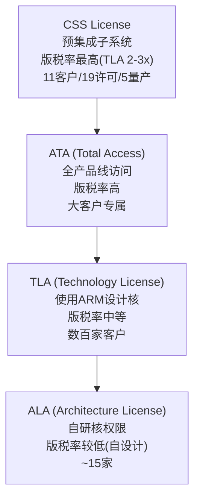
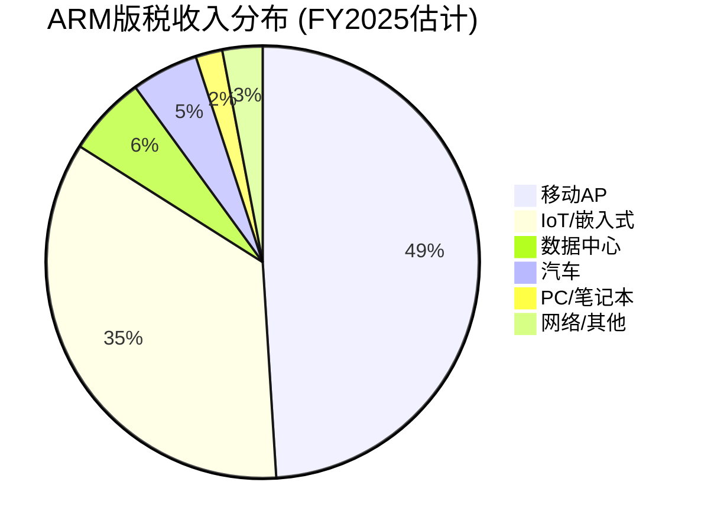
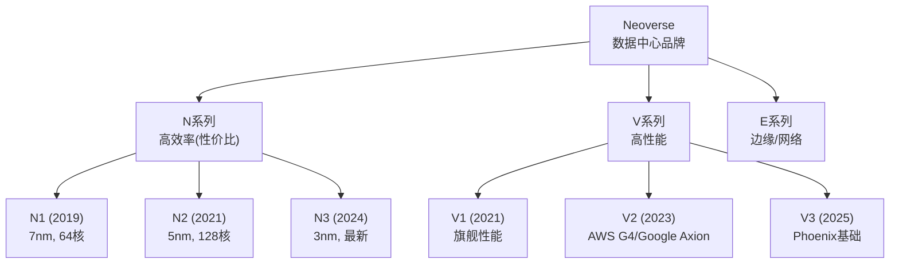
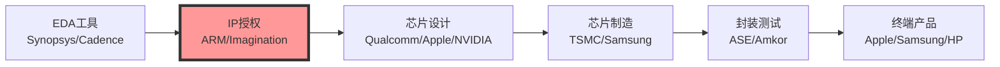

# ARM Holdings (ARM) — 深度研究报告
## Part I: 公司理解与商业模式解构

> **免责声明**: 本报告仅供研究参考，不构成投资建议。所有数据截至2026年2月25日。投资有风险，请独立判断。
> **分析师**: AI研究助手 | **框架版本**: v17.0 | **可能性宽度**: PW=6 (混合模式)
> **股价**: $128.14 | **市值**: $136.1B | **财年**: 截至3月(FY2026 = Apr'25-Mar'26)

---

## 目录

- 第1章: ARM的商业本质 — 半导体行业的"隐形税务局"
- 第2章: 版税经济学 — v8→v9→CSS的提价阶梯
- 第3章: 授权体系拆解 — ALA/TLA/CSS的定价权博弈
- 第4章: 终端市场版图 — 七大战场的渗透率地图
- 第5章: 数据中心征途 — 从10%到50%的路径可信度
- 第6章: Phoenix计划 — IP授权商变身芯片设计师的豪赌
- 第7章: 产业链生态位 — ARM在半导体价值链中的独特坐标
- 附录A: Phase 1数据锚点注册表

---

## 第1章: ARM的商业本质 — 半导体行业的"隐形税务局"

### 1.1 一句话理解ARM

如果全球半导体产业是一个经济体，ARM就是它的税务局——不拥有任何一座工厂、不制造任何一颗芯片，却从每年出货的超过280亿颗芯片中抽取"IP税"。这个税率很低(每颗平均约$0.065)，但税基极广(覆盖全球超过99%的智能手机、超过70%的物联网设备、以及快速增长的服务器和汽车市场)。[DM-701]

这个类比不完全准确——税务局有强制力，ARM没有。ARM的"税基"建立在三十年累积的指令集生态之上:数十亿行已编译的代码、数百万开发者的肌肉记忆、数千家厂商的设计流程，以及"如果要换一个新架构，光是重新验证软件就要花数年时间"的隐性切换成本。这让ARM的收入具有了近似"税收"的特征——低单价、高确定性、与终端芯片数量高度相关。

但与真正的税收不同的是，ARM面临一个开源的、零授权费的替代架构——RISC-V。这就好比有一个主权国家宣布"任何企业只要搬过来，就永久免税"。短期内，搬迁成本(软件生态迁移)让大多数企业留下来；但长期看，每一次ARM提高"税率"(v9版税翻倍、CSS再翻倍)，都在增加"搬迁"的经济激励。

这是ARM投资论点的核心张力: **当前的高增长(+26% YoY)和持续提价(v9=2×v8)既是短期财务表现的引擎，也是长期自身颠覆的催化剂。**

### 1.2 商业模式解构: 双引擎收入

ARM的收入由两个互补引擎驱动:

**引擎一: 授权收入(License, FY2025: $1.839B, 46%)**
- 客户支付一次性或分期授权费，获得使用ARM IP设计芯片的权利
- 收入确认时点: 合同签署或里程碑达成
- 类比: 软件平台的"开发者许可费" — 先收入场费，再收交易佣金
- 特征: 大额、集中(前5客户占56%)、波动大(取决于大客户签约节奏)
- **FY2025**: $1.839B (+28.7% YoY)，增速高于版税

**引擎二: 版税收入(Royalty, FY2025: $2.168B, 54%)**
- 客户每出货一颗含ARM IP的芯片，按约定费率向ARM支付版税
- 确认时点: 客户报告出货量(通常滞后1-2季度)
- 类比: Visa/Mastercard的"每笔交易手续费" — 交易越多，收入越高
- 特征: 稳定、分散(>500个被授权方)、可预测(与全球芯片出货量高度相关)
- **FY2025**: $2.168B (+20.2% YoY)

**双引擎飞轮**: 授权收入是版税的"先行指标"——今天签署的授权合同，在3-5年后转化为版税流。FY2024-FY2025授权收入加速(+28.5%/+28.7%)，预示FY2028-FY2030版税加速。这个飞轮效应让分析师给予ARM超长久期溢价——他们看到的不只是当前$4B收入，而是5年后$11B收入的种子已经播下。

但飞轮也有暗面: **Q3 FY2026授权收入$505M中，SoftBank(ARM的90%控股股东)贡献了约$200M(~40%)。** 当你最大的客户同时是你的控股股东时，"客户签约"的商业独立性就需要打问号。BofA下调ARM评级的核心理由之一，正是剔除SoftBank后，授权收入增长实际为**负**(~-5%)。[DM-803]

### 1.3 收入质量三棱镜: 高毛利≠高质量

ARM的财务数据在表面上极为出色:

```
毛利率: 95.4% (TTM) — 全球上市公司前0.1%
ROA: 8.6% | ROIC: 23.4% | 净现金: $1.73B | Altman Z: 35.0
```

但拆开看，至少三层扭曲在影响数字的真实性:

**扭曲1: SBC黑洞**
FMP数据显示FY2025 SBC=$0，这不可能正确。FY2024(IPO首年)SBC高达$1.037B，IPO后每年仍有$700-800M级别的SBC费用。这意味着FMP现金流数据中的SBC项缺失，实际自由现金流被高估。Non-GAAP营业利润率~41%(Q3 FY2026)与GAAP营业利润率15.4%的巨大差异(25.6pp)，主要就是SBC造成的。[DM-400]

**扭曲2: 应收账款异常**
FY2025应收账款从$1.117B暴增至$1.749B(+57%)，而收入增长仅+24%。应收增速是收入增速的2.4倍。这通常意味着: (a)大额授权合同在财年末签署但尚未收款, (b)收入确认政策激进, 或(c)客户付款条件延长。FY2025经营现金流仅$397M(vs净利润$792M)的50%，营运资本吃掉了$1.465B。[DM-300, DM-400]

DSO(应收周转天数)从127天(FY2024)飙升至173天(FY2025)，这在软件/IP行业极为罕见——Synopsys的DSO约70天，Cadence约80天。ARM的173天意味着平均每笔应收账款要等近半年才能收到钱。

**扭曲3: 关联交易浓度**
SoftBank作为90%控股股东，同时贡献ARM约30%的授权收入。这创造了一个经典的"自己给自己刷卡"场景——SoftBank的AI战略投资(Izanagi/Stargate/Ampere)需要ARM授权，而ARM的授权收入增长支撑了ARM的估值，而ARM的估值支撑了SoftBank以ARM股份质押的$200亿保证金贷款的LTV比率。这是一个自我强化的循环，但也意味着如果循环中的任何一环断裂(SoftBank AI投资放缓/ARM授权增速下降/股价下跌触发保证金)，整个链条会加速崩塌。[DM-803]

### 1.4 ARM vs Visa: 一个危险的类比

市场中流行的一个叙事是"ARM是半导体行业的Visa/Mastercard"——交易型收入、轻资产、高毛利、网络效应。表面数据支持这个类比:

| 维度 | ARM | Visa | 共同点 |
|------|-----|------|--------|
| 毛利率 | 95.4% | 97.4% | 极高 |
| 资产模型 | IP授权(零制造) | 支付网络(零贷款) | 轻资产 |
| 收入驱动 | 芯片出货量 | 交易笔数 | 交易量驱动 |
| 客户切换成本 | 软件生态(高) | 商户/持卡人惯性(高) | 高锁定 |
| P/E (TTM) | 140x | 33x | 差异巨大 |

但类比在三个关键点上破裂:

**1. Visa没有开源替代品。** RISC-V是一个零授权费、性能已接近平价的替代架构。支付网络没有等价物——没有"开源Visa"让商户免费接入。

**2. Visa的"税率"在下降趋势中。** 全球支付处理费率受监管压力持续下降(欧盟封顶0.3%)。ARM则在逆势提价——v9版税率是v8的2倍。这不是市场定价力的体现，而是在RISC-V尚未成熟的窗口期的机会主义定价。

**3. Visa的双边网络效应是自增强的。** 更多商户→更多持卡人→更多商户。ARM的网络效应是单边的——更多开发者→更多软件→但开发者也同时在为RISC-V编写代码(Google已将RISC-V整合Android GKI)。ARM的网络效应正在被对冲。

**结论**: ARM不是Visa。ARM更像是一个**在开源替代品成熟前尽可能多收税的政府**——这个策略在窗口期内非常有效(v9提价+CSS捆绑=FY2025版税+20%)，但每一次提价都缩短窗口。Visa的P/E从未超过50x，ARM的P/E从未低于142x。这不是同一种商业模式，不应该享受更高的估值溢价。

---

## 第2章: 版税经济学 — v8→v9→CSS的提价阶梯

### 2.1 ARM的定价权演化

ARM的定价策略经历了三个阶段，每个阶段都提升了单位价值捕获:

**阶段1: Armv8时代(2011-2020) — "广撒网、低费率"**
- 版税率: $0.03-0.07/chip (IoT), $0.30-0.60/chip (移动)
- 策略: 最大化市场份额，成为默认选择
- 结果: ARM架构渗透率>95%智能手机、>70%嵌入式
- 年版税收入: ~$1.5-1.6B (FY2022-FY2023)

**阶段2: Armv9时代(2021-至今) — "架构升级、版税翻倍"**
- 版税率: v8的**2倍+**
- 策略: 通过架构强制升级(新功能仅v9可用)驱动客户迁移
- 采用进度: >50%版税收入已来自v9 (Q3 FY2026，从FY2024的~20%快速升至)
- 收入效应: FY2025版税$2.168B (+20%)，增量主要来自v9提价而非出货量增长

v9的提价逻辑是什么？ARM增加了：安全扩展(Confidential Compute)、AI加速指令(SVE2)、跟踪机制(BRBE)。这些功能对数据中心客户有真实价值，但对IoT/低端移动芯片客户来说是强制性的"搭售"——他们不需要这些功能，但v8不再获得新核设计支持，最终只能升级到v9并接受更高费率。

**阶段3: CSS时代(2023-至今) — "预集成、再翻倍"**
- 版税率: TLA(使用ARM核设计)的**2-3倍**
- 策略: ARM不只提供核心IP，还提供预集成的芯片子系统(CPU+互连+内存控制器)
- 客户价值: 减少12个月设计时间，节省千万级NRE
- 采用进度: 19个CSS许可证, 11个客户, 5个已量产
- 管理层目标: CSS占版税收入>50% (2-3年内)

CSS的定价权逻辑比v9更健康——ARM确实在做更多设计工作(从核心IP→完整子系统)，客户为此支付溢价是合理的。但CSS也有一个隐含风险: ARM越深入芯片设计，越可能与被授权方直接竞争(尤其是Phoenix计划)。

### 2.2 版税率×出货量矩阵: ARM的收入公式

ARM的版税收入可以分解为:

```
版税收入 = Σ (各终端出货量 × 各终端平均版税率)
```

基于DM-701的版税率结构和公开数据，我们构建如下矩阵:

| 终端 | 季度出货量(估) | 平均版税率(估) | 季度版税(估) | 年版税(估) | 占比 |
|------|:------------:|:------------:|:-----------:|:---------:|:---:|
| **移动AP** | ~400M | $0.70 | $280M | $1,120M | 49% |
| **IoT/嵌入式** | ~5,000M | $0.04 | $200M | $800M | 35% |
| **数据中心** | ~8M | $30 | $240M | $960M | — |
| **汽车** | ~200M | $1.50 | $300M | — | — |
| **PC/其他** | ~20M | $5.00 | $100M | — | — |
| **合计** | >7,000M | ~$0.065 avg | — | ~$2,168M | 100% |

> **注**: 数据中心估算困难 — 管理层说"略超10%版税组合"=~$250M/季, 但>100% YoY增长意味着从极低基数。出货量和版税率之间的匹配高度依赖NVIDIA Grace的版税率(是标准CPU率还是含GPU的更高率)。

### 2.3 提价天花板: 数学约束

ARM的版税率提升面临三重天花板:

**天花板1: 芯片ASP约束**
版税率占芯片ASP的比例有隐性上限。以移动AP为例:
- 芯片ASP: $15-40
- ARM版税: $0.60-1.20 (v9) → 占ASP的3-6%
- 如果ARM试图将版税提至$2.00+/chip，占ASP比例将超过10%——在IoT芯片(ASP $1-5)上甚至更极端

历史上，IP授权占芯片ASP的比例很少超过5-8%。ARM正在接近这个区间的上限。

**天花板2: RISC-V替代成本约束**
RISC-V的核心授权费=零。ARM的版税率本质上以"RISC-V迁移成本"为上限:
- 当ARM版税率 < RISC-V迁移成本(摊销到预期出货量) → ARM安全
- 当ARM版税率 ≥ RISC-V迁移成本 → 客户有经济激励迁移

Qualcomm花$2.4B收购Ventana Micro获得RISC-V IP，如果Qualcomm年出货10亿颗芯片，摊销到5年就是$0.48/chip。如果ARM对Qualcomm的版税率超过$0.50/chip，Qualcomm就有财务激励使用RISC-V。

**天花板3: 客户集中度约束**
ARM的前5大客户(含Arm China)占56%收入。这意味着ARM不能对大客户激进定价——任何一家大客户的流失或降级都会造成双位数收入冲击。Qualcomm与ARM的法律纠纷(2020-2024)已经证明大客户愿意通过法律手段抵制提价。

### 2.4 v9渗透S曲线: 加速但见顶

v9版税收入占比的演化:
- FY2024: ~20% → FY2025: ~30% → Q3 FY2026: >50%

这个加速令人印象深刻——18个月内从20%升至50%+。但S曲线的下半段(50%→90%)通常比上半段慢，因为:
- 残留的v8设备(IoT, 汽车)替换周期长(5-10年)
- v8在低成本芯片中仍有定价优势(版税率为v9的一半)
- 部分客户选择v8+RISC-V混合策略而非升级v9

**关键问题**: v9渗透到70-80%后，下一个增长引擎是什么？管理层的回答是CSS(更高版税率)和v10(尚未发布)。但CSS目前只有5个量产设计(11个客户中)，v10时间表不明——如果v10版税率继续翻倍(=v8的4倍)，RISC-V迁移的经济激励将显著加强。

---

## 第3章: 授权体系拆解 — ALA/TLA/CSS的定价权博弈

### 3.1 四层授权金字塔

ARM的授权体系是一个精心设计的价值阶梯:



**ALA (Architecture License Agreement)**: 客户获得ARM指令集架构许可，可以设计自己的CPU核心。Apple(A/M系列)、Qualcomm(Kryo→Oryon)、Google(Tensor)等约15家公司持有ALA。版税率相对较低，因为ARM只提供架构规范，设计工作由客户完成。

**TLA (Technology License Agreement)**: 客户使用ARM设计的现成核心(Cortex系列/Neoverse系列)。版税率高于ALA，因为ARM承担了全部核心设计工作。这是绝大多数ARM客户的选择——数百家芯片公司使用Cortex-A/M/R系列。

**ATA (Total Access Agreement)**: 大客户专属的"全套餐"访问权限，一次性付费获得ARM全部产品线(Cortex+Neoverse+GPU等)的使用权。

**CSS (Compute Subsystems License)**: ARM最新且最重要的授权类型。ARM不只提供CPU核心IP，还提供包含CPU+互连+内存控制器+安全单元的预集成子系统。版税率是TLA的2-3倍。这是ARM价值捕获战略的核心——通过在设计中"做更多工作"来收取更高版税。

### 3.2 CSS: ARM的价值捕获杠杆

CSS是ARM近年来最重要的战略举措，理解CSS就是理解ARM未来5年的增长叙事:

**CSS解决的客户痛点**:
- 传统流程: 客户获取ARM核心IP → 自己设计子系统(总线/互连/缓存) → 集成验证 → 流片
- CSS流程: 客户获取ARM预集成子系统 → 直接集成到自己的SoC → 流片
- 节省: 最多12个月设计时间 + 千万级NRE费用 + 降低流片失败风险

**CSS的定价逻辑**:
- ARM的增量工作: 子系统设计(互连/缓存/内存控制器) + 物理实现(与特定制程匹配) + 预验证
- 客户的增量价值: 更快上市(12个月) + 更低NRE + 更高首次流片成功率
- ARM的增量版税: TLA的2-3倍 → 但客户总成本仍下降(节省的NRE > 增量版税)

**CSS采用进度(截至Q3 FY2026)**:
| 指标 | 值 |
|------|---|
| CSS许可证总数 | 19 |
| CSS客户数 | 11 |
| 量产设计数 | 5 |
| 管理层目标 | 占版税>50% (2-3年内) |

**CSS的潜在问题**:
1. **与被授权方竞争**: CSS本质上是ARM在"做芯片设计"——这与ARM传统的"中立IP供应商"定位矛盾。持有ALA的客户(Apple, Qualcomm)不需要CSS，但TLA客户会发现ARM的CSS与他们自己的差异化芯片设计竞争
2. **版税率弹性**: CSS 2-3x TLA的版税率是否可持续？当更多客户采用CSS(市场成熟)，议价能力是否会从ARM转向客户？
3. **RISC-V对冲**: Qualcomm收购Ventana($2.4B)的一个关键动机就是拥有RISC-V替代方案，以对冲ARM CSS的提价

### 3.3 授权收入的SoftBank"浓度"问题

ARM的授权收入结构存在一个令人不安的集中度问题:

**FY2025数据**:
- 总授权收入: $1.839B
- 前5客户占总收入比: 56%
- SoftBank关联授权占比: ~30%授权收入(估计~$550M)

**Q3 FY2026(最近季度)**:
- 授权收入: $505M
- 其中SoftBank相关方: ~$200M (~40%)
- 剔除SoftBank后: ~$305M

BofA在2026年1月下调ARM评级时指出: **剔除SoftBank贡献后，FY2026授权收入预计同比下降约5%**。这意味着ARM的授权增长叙事(+28.7% FY2025)很大程度上被一个非独立的关联方交易所支撑。

这不一定是"虚假"收入——SoftBank确实在为其AI战略(Izanagi/Stargate/Ampere)采购ARM授权。但当90%控股股东贡献30%的授权收入时，几个问题无法回避:

1. **定价独立性**: SoftBank支付的授权费率是否市场公允？ARM是否有激励给SoftBank优惠价格(以换取更多许可证数量来粉饰增长)?
2. **需求真实性**: SoftBank的AI投资规模($1000亿+Izanagi, $1000-5000亿Stargate)听起来宏大，但这些项目的执行时间线不确定。如果任何一个项目延迟或缩减，关联授权收入会相应下降
3. **信息不对称**: ARM作为Foreign Private Issuer + Controlled Company，享有双重披露豁免。SoftBank关联交易的具体条款(授权类型/费率/里程碑)不需要像美国上市公司那样详细披露

---

## 第4章: 终端市场版图 — 七大战场的渗透率地图

### 4.1 移动: 现金奶牛，但增长放缓

**当前地位**: ARM架构在移动AP(应用处理器)市场的渗透率超过99%。全球每年出货约12-13亿部智能手机，几乎每一部都使用ARM架构的芯片。

**收入贡献**: 估计版税的~49%(~$1.12B/年)，是ARM最大的单一终端

**增长逻辑**:
- 出货量增长: ~0-3%/年(全球智能手机市场成熟)
- 单位版税增长: v9提价(2x v8) → 移动AP从~$0.35→$0.70/chip
- 净效应: ~10-15%/年版税增长(主要靠提价，非出货量)

**风险**:
- 智能手机替换周期延长(从2.5年→3.5年)
- 中国OEM(小米/Oppo/Vivo)通过Arm China支付版税，增速仅+7.5%
- 中国可能推动本土RISC-V移动芯片(虽然2029前难以商用)

### 4.2 数据中心: 增长引擎，但路径不确定

(详见第5章专题分析)

### 4.3 IoT/嵌入式: 量大价低，RISC-V侵蚀

**当前地位**: ARM Cortex-M系列在微控制器(MCU)市场占~60-70%份额

**收入贡献**: 估计版税的~35%(~$800M/年)，但单位版税极低($0.03-0.07/chip)

**RISC-V威胁**: 最直接且已经发生
- RISC-V在IoT/嵌入式市场已占~30%份额
- 乐鑫(ESP32系列)等公司从ARM Cortex-M迁移到RISC-V核心
- ARM在IoT市场的版税率已经很低，进一步降价空间有限

**战略意义**: IoT虽然版税率低，但是ARM生态系统的"底层土壤"——大量嵌入式开发者使用Cortex-M起步，然后在移动/服务器项目中继续使用ARM。如果IoT开发者转向RISC-V，长期可能侵蚀ARM在更高价值终端的开发者基础。

### 4.4 汽车: 高价值增量市场

**当前地位**: ARM在汽车芯片中的渗透率持续增加
- ADAS/自动驾驶: NVIDIA(ARM架构) + Qualcomm(ARM架构) 主导
- 车身/座舱: 从传统MCU向ARM Cortex-A迁移

**收入贡献**: 估计版税的~5-8%，但快速增长

**增长逻辑**:
- 每车ARM芯片数量从~5颗→20+颗(电气化+智能化)
- 单位版税从$0.50-5.00/chip(比IoT高一个数量级)
- 汽车芯片设计周期长(5-7年)，一旦选定ARM就难以中途更换

**RISC-V威胁**: Quintauris联盟(Bosch/Infineon/NXP/Qualcomm/STMicro)推动汽车RISC-V标准化，预计2025-2027开始渗透。但汽车市场对安全认证要求极高(ISO 26262)，RISC-V生态在功能安全认证方面落后ARM 3-5年。

### 4.5 PC/笔记本: Windows on ARM的曙光

**当前地位**: ARM在PC市场的份额从2024 Q3的0.8%飙升至2025年的~10%(高端>$800)，整体PC市场约13%

**关键驱动**: Qualcomm Snapdragon X Elite/Plus系列在Windows笔记本中的采用
- Copilot+ PC推动OEM采用ARM芯片
- Qualcomm CEO目标: 5年内50% Windows PC市场
- 部分OEM预期3年内60% Snapdragon

**障碍**:
- x86模拟(Prism)性能差距——原生x86应用在模拟下性能损失15-30%
- 游戏性能差(DirectX兼容性问题)
- 企业IT部门的x86惯性(遗留应用兼容性)
- Intel/AMD反击: Lunar Lake/Strix Point效率大幅提升

**ARM收入影响**: 即使Windows on ARM达到20% PC市场(~60M台/年)，每台版税~$5-10，年收入增量~$300-600M——对ARM总收入($4.7B TTM)有意义但非变革性。

**Windows on ARM的S曲线预测**:

| 年份 | ARM PC份额 | 年出货量(M) | ARM年版税(估) |
|------|:--------:|:---------:|:----------:|
| 2024 | ~3% | ~9M | $45-90M |
| 2025 | ~13% | ~40M | $200-400M |
| 2026E | ~18% | ~55M | $275-550M |
| 2028E | ~25% | ~75M | $375-750M |
| 2030E | ~35% | ~105M | $525M-1.05B |

> 乐观场景(Qualcomm目标50%)与保守场景(~20%在x86反击下稳定)差异巨大。上表取中间值。

**关键变量**: Windows on ARM的成败高度依赖于**原生应用生态**。当前ARM Windows PC最大的用户痛点不是性能(Snapdragon X Elite的原生性能已匹配Intel)，而是:
1. 企业软件(SAP/Oracle ERP等)尚未原生移植
2. 游戏(大量DirectX 12 x86游戏在Prism模拟下性能损失30%+)
3. 专业软件(Adobe全家桶已支持，但AutoCAD/MATLAB等仍仅x86)

微软的态度至关重要: 如果微软全力推动ARM原生编译(类似Apple对M系列的推动)，转化速度可以很快(Apple在2年内将Mac ARM份额推至>50%)。但微软同时也在推Windows on x86(Intel/AMD是重要合作伙伴)，不太可能像Apple那样"断臂式"推进。

### 4.6 网络基础设施: 隐形但稳定

**当前地位**: ARM在网络设备(路由器/交换机/基站)中有稳固地位
- 5G基站: 大部分使用ARM架构
- 网络处理器: Marvell、Broadcom等使用ARM核心

**收入贡献**: 估计~5-8%版税，增长与5G/网络基础设施投资周期相关

### 4.7 市场版图总结



**关键洞察**: ARM的增长叙事依赖于从左侧(移动+IoT, 84%)向右侧(DC+汽车+PC, 13%)的重心迁移。市场赋予的140x P/E本质上是在为这个迁移成功定价。但迁移的每一步都面临RISC-V竞争(IoT已在竞争, DC/汽车正在酝酿)、x86防守(PC/服务器)和自身定价策略的矛盾(提价加速替代)。

---

## 第5章: 数据中心征途 — 从10%到50%的路径可信度

### 5.1 数据中心的战略意义

管理层在多次财报电话会上表示: **数据中心将在"几年内"超越移动成为ARM最大的版税业务。** 这个预期如果实现，意味着数据中心版税需要从当前的~$250M/季(约10%的版税组合)增长到超过移动的~$280M/季。

为什么数据中心对ARM如此重要？

1. **单位版税极高**: 服务器芯片ASP $500-2000+，ARM版税$10-100/chip → 是移动的15-150倍
2. **CSS渗透最快**: 服务器客户最需要CSS的快速上市优势(AI竞赛时间紧迫)
3. **Phoenix的目标市场**: ARM首个自设计芯片(Phoenix)面向数据中心
4. **AI驱动的结构性增长**: 每个AI数据中心都需要CPU(即使主计算由GPU完成)

### 5.2 ARM服务器的市场份额迷雾

ARM服务器的市场份额数据存在重大口径差异:

| 口径 | 份额 | 来源 | 含义 |
|------|:----:|------|------|
| 传统CPU出货量 | 20-23% | IDC/Omdia | 仅计独立CPU服务器 |
| ARM官方宣称 | ~50% | ARM Newsroom | 含NVIDIA GB200中的Grace CPU |
| 收入份额 | <10% | 估算 | ARM版税 vs Intel/AMD芯片收入 |

差异的核心在于**NVIDIA GB200**: 每台GB200超级计算节点包含一颗Grace ARM CPU + 多颗Blackwell GPU。ARM将GB200计入"ARM计算"节点——技术上正确(确实有ARM CPU在里面)，但这些节点99%的价值来自GPU，ARM从Grace CPU收取的版税相对于节点总价值微不足道。

如果NVIDIA出货约250万台GB200节点(2025年估计)，每台Grace CPU版税$10-50(取决于CSS vs 标准授权)，ARM从NVIDIA Grace获得的版税约$25-125M/年——有意义但远非管理层暗示的"50%服务器市场"那般宏大。

### 5.3 四大超大规模客户详解

**AWS Graviton系列**: ARM服务器的"旗舰客户"
- Graviton4: 96核, Neoverse V2, 已GA → 内部成本估计比Intel便宜30-40%
- Graviton5: 192核, 2025-12预览 → 计算密度翻倍
- AWS声明: Graviton实例占AWS新实例的大部分
- ARM收入影响: AWS是ALA客户(自研核设计), 版税率相对较低

**Google Axion**:
- 72核, Neoverse V2, 2024 GA
- 基准测试优于AMD EPYC和Intel Xeon(同功耗下)
- Google同时在发展RISC-V(Android GKI整合)→ 双架构策略

**Microsoft Cobalt**:
- Cobalt 100: 128核, Neoverse N2, 已GA
- Cobalt 200: 132核, Neoverse V3, TSMC 3nm → 2026出货
- Azure内部使用, 向外部客户逐步开放

**NVIDIA Grace**:
- 72核, Neoverse V2, 在GB200/GB300中出货
- 是ARM服务器最大单一出货量来源(~250万台)
- 但ARM从Grace获取的版税占比小(相对于GPU价值)

### 5.4 Neoverse产品线全景

ARM的数据中心战略建立在Neoverse品牌之上。理解Neoverse的产品线对评估数据中心增长路径至关重要:

**Neoverse三大系列**:



**N系列(效率优先)**: 面向"密度计算"场景(云原生/微服务/CDN)，强调每瓦性能和核心数量。Microsoft Cobalt 100使用N2(128核)。

**V系列(性能优先)**: 面向"高性能计算"场景(AI推理/数据库/HPC)，单核性能更强。AWS Graviton4使用V2(96核)，Phoenix使用V3(128核)。

**关键产品节奏**: ARM每12-18个月更新一代Neoverse设计。N3和V3已在2024-2025进入商业化阶段。每一代通常带来15-25%的性能提升(同功耗下)或30-40%的能效提升(同性能下)。

**Neoverse vs Cortex**: Neoverse核心针对数据中心优化(更大缓存/更强内存带宽/更多PCIe通道)，而Cortex-A针对移动优化(更低功耗/更小面积)。两者共享ARM指令集(v9)，但微架构差异很大。

**对版税的影响**: Neoverse核心的版税率远高于Cortex-A，因为:
1. 服务器芯片ASP $500-2000+ (vs 移动AP $15-40)
2. Neoverse通常通过CSS授权(版税率2-3x TLA)
3. 芯片面积更大 → ARM IP占芯片面积比例更高

### 5.5 CSS在数据中心的加速逻辑

CSS对数据中心客户的价值最大，因为:

1. **AI竞赛时间压力**: 超大规模客户需要尽快部署定制芯片，CSS的12个月缩短对他们价值极高
2. **芯片复杂度提升**: 3nm/2nm节点的设计成本$500M+，CSS降低NRE风险
3. **异构计算需求**: CPU+GPU+加速器的复杂SoC中，CSS提供验证过的CPU子系统

但CSS在数据中心也面临挑战:
- ALA客户(AWS/Google/Microsoft/NVIDIA)自研核心能力强，不需要CSS
- CSS的目标客户是"第二梯队"数据中心芯片设计者(云厂商的二线产品、电信设备商等)
- 19个CSS许可中有多少在数据中心？管理层未公开细分

### 5.5 数据中心收入预测: 三情景

| 情景 | FY2027 DC版税 | FY2030 DC版税 | 假设 |
|------|:-----------:|:-----------:|------|
| **牛市** | $1.5B | $4.0B | 50%+ DC出货YoY增长持续 + CSS渗透率60% + v9+版税提升 |
| **基准** | $1.0B | $2.5B | 30-40% DC出货增长 + CSS渗透率40% + 标准版税率 |
| **熊市** | $0.6B | $1.2B | DC增长放缓至20% + CSS渗透率20% + RISC-V侵蚀定价 |

**关键不确定性**: DC增长对ARM的贡献高度依赖于(a)CSS渗透率, (b)NVIDIA Grace版税率, (c)RISC-V是否在2028前进入DC市场(Tenstorrent Ascalon-X已达性能平价)

---

## 第6章: Phoenix计划 — IP授权商变身芯片设计师的豪赌

### 6.1 Phoenix是什么

Phoenix是ARM历史上最大胆的战略转型: **从纯IP授权商变为完整芯片设计商**。

**Phoenix芯片规格**:
- 128个Neoverse V3核心
- TSMC 3nm, 双die封装
- 12通道DDR5内存
- 96条PCIe Gen6通道
- 目标: 数据中心/AI推理工作负载

**首批客户**: Meta(首客户) → OpenAI(via SoftBank Stargate) → Cloudflare

### 6.2 为什么Phoenix是"SoftBank的项目"而非"ARM的最优策略"

Phoenix的战略逻辑在ARM独立经营的框架下并不显然:

**如果ARM是独立公司(无SoftBank)**:
- 最优策略: 维持IP授权中立性, 最大化被授权方数量和版税
- Phoenix风险: 与客户(AWS/Google/Microsoft/NVIDIA)直接竞争, 可能导致客户转向RISC-V
- 资本需求: 芯片设计需要$100M+级别的NRE投入, 改变ARM的轻资产属性

**在SoftBank控制下**:
- SoftBank需要ARM芯片来支撑其AI基础设施愿景(Stargate需要CPU)
- SoftBank的$100B+ Izanagi计划明确包含ARM芯片设计
- 孙正义声称ARM是"ASI的基础技术" → 仅做IP授权不符合这个叙事
- SoftBank已以$6.5B收购Ampere(ARM服务器芯片公司) → 整合逻辑

**核心矛盾**: Phoenix可能最大化SoftBank的战略价值(整合AI供应链)，但牺牲ARM的中立性和被授权方信任。这不是CEO Rene Haas的商业判断，而是孙正义的AI愿景在ARM上的投射。

### 6.3 Phoenix对ARM商业模式的潜在影响

| 影响维度 | 正面 | 负面 |
|---------|------|------|
| **收入模型** | 芯片销售收入>>版税率(如果成功) | 资本密集, 降低ROIC |
| **毛利率** | — | 芯片设计毛利率60-70% vs IP授权95% → 混合毛利率下降 |
| **客户关系** | 为不具备芯片设计能力的客户服务(Meta/Cloudflare) | ALA客户(AWS/QCOM)可能视ARM为竞争对手 |
| **RISC-V加速** | — | 客户对ARM中立性的信任下降 → 加速RISC-V评估 |
| **SoftBank协同** | Stargate/Izanagi/Ampere整合 | 关联交易浓度进一步增加 |

### 6.4 Phoenix的财务影响估算

假设Phoenix 2027年开始出货:
- 首年出货: 10万-50万颗(Meta+少量其他客户)
- 芯片售价: $3000-8000/颗(参考AMD EPYC/Intel Xeon)
- 首年芯片收入: $300M-4B(范围极大，取决于出货量)
- 额外收入vs利润率下降: 净效应不确定

**关键点**: Phoenix的成败不取决于ARM的技术能力(ARM有最好的CPU核心IP)，而取决于**ARM能否在成为芯片竞争对手的同时维持IP授权生态**。Intel曾试过类似策略(x86+代工)，最终两边都没做好。

### 6.5 Phoenix时间线与里程碑追踪

| 里程碑 | 预期时间 | 状态 | 影响 |
|--------|---------|:----:|------|
| Phoenix设计完成 | 2025 H2 | 完成 | TSMC 3nm流片 |
| 工程样片 | 2026 H1 | 进行中 | 首次硅验证 |
| Meta部署测试 | 2026 H2 | 待定 | 首客户验证 |
| 大规模量产 | 2027 H1 | 待定 | 收入开始确认 |
| OpenAI/Stargate采用 | 2027+ | 待定 | SoftBank战略闭环 |

如果Phoenix时间线延迟(芯片设计项目延迟极为常见——参考Intel Meteor Lake延迟18个月)，ARM将面临双重损失: 既没有芯片收入，又已经疏远了部分被授权方。这是一个高beta赌注，且赌注大小由SoftBank而非ARM管理层决定。

### 6.6 Phoenix对ARM估值框架的颠覆

Phoenix从根本上挑战了ARM的估值逻辑:

**当前估值逻辑**:
- ARM是纯IP公司 → 轻资产、高毛利率(95%)、低资本支出
- P/S 28x 合理(如果参考高增长软件公司)
- P/E 140x 可接受(如果收入加速+利润率扩张)

**Phoenix后的估值逻辑**:
- ARM变成混合公司(IP授权 + 芯片设计) → 需要更多资本支出、更低混合毛利率
- 芯片设计公司的P/S通常5-15x(AMD 12x, QCOM 6x)
- 如果Phoenix占ARM收入20%，混合P/S应下降20-30%

**估值悖论**: Phoenix如果成功(大量芯片出货)，会降低ARM的"纯IP溢价"；如果失败(出货量小)，则浪费了资源并疏远了客户。只有在"成功但保持小规模"(Meta等少数客户)的狭窄路径上，Phoenix才能同时增加收入又维持估值溢价。

---

## 第7章: 产业链生态位 — ARM在半导体价值链中的独特坐标

### 7.1 ARM的产业链位置



ARM处于半导体价值链的**第二环节** — IP授权。这个位置有独特的优势和劣势:

**优势**:
1. **零制造风险**: ARM不受台海冲突/晶圆厂产能限制/良率问题的直接影响
2. **超高杠杆**: 研发一次核心IP，可被数百家客户在数千种芯片中使用
3. **双面收费**: 先收授权费(前端)，再收版税(后端)
4. **与终端解耦**: ARM收入与"芯片出货量"相关，而非"终端产品成功"相关——即使某款手机失败，芯片已出货，ARM已收版税

**劣势**:
1. **价值捕获有限**: 全球半导体市场~$6000亿(2025)，ARM收入仅$4.7B = **0.78%**。ARM是半导体生态的"基础设施"，但只捕获了极小份额
2. **定价权受制于上下游**: 版税率受芯片ASP(上游)和RISC-V替代(下游)双重约束
3. **能见度滞后**: 版税基于客户报告的出货量(滞后1-2季度)，ARM对自身收入的短期预测能力有限

### 7.2 ARM TAM天花板: 1-2%的数学约束

如果全球半导体市场规模为$6000亿(2025)，ARM的"税率"能达到多少？

历史参考:
- Qualcomm QTL(也是IP授权): 年收入~$5B on 相关手机/网络市场~$1500亿 = ~3.3%
- MPEG LA (视频编解码专利池): 年费率<0.5%的设备售价
- Dolby (音频专利授权): ~$1.3B on ~$3000亿相关设备市场 = ~0.4%

**ARM的数学**:
- 当前: $4.7B / $6000亿 = **0.78%**
- 分析师共识FY2030: $11.2B / ~$7500亿(预期半导体市场) = **1.49%**
- 如果ARM达到Qualcomm QTL水平(3.3%): 需要收入达~$25B → 当前5.3倍

**问题**: IP授权在半导体收入中的占比从未超过3-4%(全行业合计)。ARM要从0.78%增长到1.5%+，需要在多个终端市场同时提高版税率——这在RISC-V竞争背景下越来越困难。

**这个天花板对估值的含义**: 市场隐含的FY2030收入$11.2B(占半导体市场~1.5%)已经接近历史IP授权商的渗透率上限。如果ARM真的达到这个水平，下一个增长拐点只能来自Phoenix(芯片销售，而非IP授权)——这又回到了第6章的核心矛盾。

### 7.3 与EDA的比较: 另一种"半导体基础设施"

ARM经常与Synopsys(SNPS)和Cadence(CDNS)比较，因为三者都是半导体"基础设施"层的公司:

| 维度 | ARM | Synopsys | Cadence |
|------|-----|----------|---------|
| 收入模式 | 授权+版税 | 订阅许可+维护 | 订阅许可+维护 |
| 收入规模 | $4.7B | $6.1B | $4.3B |
| 毛利率 | 95.4% | 80.2% | 89.4% |
| 营业利润率 | 18.7% | 21.4% | 30.9% |
| P/E (TTM) | **140x** | 55x | 75x |
| 增长率 | 26% | 38% | 6% |
| 替代风险 | RISC-V(高) | 开源EDA(低) | 开源EDA(低) |

**关键差异**: EDA工具没有零成本的开源替代品(开源EDA工具如OpenROAD在商业级设计中不可用)。ARM有RISC-V。这可能是ARM的P/E"应该"接近EDA(55-75x)而非远超它们(140x)的原因之一。

### 7.4 ARM的"隐形基础设施"困境

ARM面临一个独特的战略困境，可以称之为"隐形基础设施困境":

**困境本质**: ARM的技术越成功(无处不在)，ARM就越不可见(被视为理所当然)，客户支付溢价的意愿就越低。这与水电公司类似——水和电是生活必需品，但没有人愿意为水付高价，因为"它就应该便宜且可用"。

ARM的指令集已经成为半导体行业的"水和电"。当一种技术达到99%+ 的渗透率时，它就变成了基础设施——客户期望它便宜、可靠、无处不在。ARM试图通过v9强制升级和CSS捆绑来"重新定价"这个基础设施，本质上是在说"水的价格要涨一倍"。

这在短期内可行(客户没有替代水源)，但在中期催生了"自建水厂"的动力(RISC-V)。Qualcomm花$2.4B收购Ventana，就是在建自己的"水厂"。Google将RISC-V整合Android GKI，就是在铺设"替代水管"。

**这对估值意味着什么**: ARM的140x P/E隐含市场相信ARM能持续对"水"提价。但历史上，没有任何基础设施提供商能在开源替代品出现后维持提价轨迹超过10年(参考: 商业Unix → Linux，物理上的完全替代用了约15年；Oracle数据库 → PostgreSQL，过渡仍在进行中，已持续20年)。

ARM的时间窗口可能比Unix或Oracle更短——RISC-V的发展速度更快(5年内从零到25%市场份额)，且有中国政府和Qualcomm/Google等巨头的战略推动。

### 7.5 全球半导体IP市场格局

ARM不是唯一的半导体IP授权商，但它是最大的:

| 公司 | 收入(FY2025) | 市场份额 | 核心IP |
|------|:----------:|:-------:|--------|
| **ARM** | $4.0B | ~40-45% | CPU核心(Cortex/Neoverse) |
| **Synopsys IP** | ~$1.5B | ~15-18% | 接口IP/安全IP/处理器IP |
| **Cadence IP** | ~$0.8B | ~8-10% | 接口IP/存储IP |
| **Imagination** | ~$0.3B | ~3% | GPU IP |
| **CEVA** | ~$0.2B | ~2% | DSP/AI/连接IP |
| **Alphawave** | ~$0.3B | ~3% | 高速接口IP |
| **其他** | — | ~25% | 分散 |

> 全球半导体IP市场规模约$8-10B (2025)，ARM占比40-45%

ARM在CPU核心IP领域的统治地位毋庸置疑，但从"半导体IP"整体市场看，ARM的份额约40-45%——这意味着半导体设计中有超过一半的IP需求来自非ARM领域(接口、存储、安全、GPU等)。ARM通过CSS战略(捆绑CPU+互连+缓存)试图扩大在"IP bundle"中的份额，但这也引起了Synopsys/Cadence等IP竞争对手的警惕。

### 7.6 产业链风险传导: ARM的脆弱节点

ARM看似"安全"地处于价值链第二环(不受制造风险影响)，但实际上存在多个风险传导路径:

**路径1: TSMC产能→ARM**
Phoenix计划使ARM首次直接依赖TSMC 3nm产能。如果台海局势紧张或TSMC产能分配优先其他客户(Apple/NVIDIA)，Phoenix出货量将受限。讽刺的是，Phoenix让ARM从"零制造风险"变成了"有制造风险"。

**路径2: Qualcomm诉讼→ARM定价权**
Qualcomm与ARM的法律纠纷(2020-2024)围绕Qualcomm通过收购Nuvia获得的CPU设计是否需要新的ARM授权。Qualcomm胜诉意味着ARM的授权合同可转让性受限——大客户可以通过收购小公司的ARM授权来规避ARM的提价。这对ARM的v9/CSS提价策略构成法律先例风险。

**路径3: AI芯片投资周期→ARM版税**
ARM的数据中心增长高度依赖AI基础设施投资周期。如果AI投资出现类似2000年互联网泡沫后的急剧收缩(当前AI基础设施投资$1500亿+/年)，ARM的数据中心版税将随之下降——即使ARM的技术竞争力不变。

**路径4: 地缘政治→Arm China**
如果美中科技脱钩加深(美国进一步限制对中国的半导体技术出口)，Arm China可能面临无法获得最新ARM IP的风险。这意味着中国客户将被"冻结"在旧版ARM架构上，加速向RISC-V迁移。Arm China的$749M收入中，有多少依赖于持续获取最新IP是一个关键未知数。

---

## 第8章: 管理层与组织能力 — 从IP授权到多面手的转型挑战

### 8.1 CEO Rene Haas的战略定位

Rene Haas于2022年2月接任ARM CEO，背景包括:
- NVIDIA IP授权与合作伙伴关系负责人(2013-2017)
- ARM IP产品部门负责人(2017-2022)
- 核心能力: 半导体IP生态系统管理, 大客户关系

Haas的CEO角色面临独特挑战: 他需要同时执行三个可能矛盾的战略方向:
1. **维护IP授权生态** — 保持被授权方(包括前雇主NVIDIA)的信任
2. **推进Phoenix** — 在不疏远被授权方的情况下进入芯片设计市场
3. **服务SoftBank战略** — 执行孙正义的AI基础设施愿景

CEO的Rule 144系统性卖出(每月~6,152 ADR, ~$0.7-1.0M/月)是标准的RSU vesting销售，不构成负面信号。但ARM作为Foreign Private Issuer，内部人交易披露远低于美国标准——我们无法确定是否有其他高管在更大规模减持。

### 8.2 组织能力分析: IP公司能做好芯片设计吗?

ARM有约7,600名员工，其中大部分是IP设计工程师。芯片设计(如Phoenix)需要不同的组织能力:

| 能力 | IP授权公司 | 芯片设计公司 | ARM的差距 |
|------|-----------|-------------|----------|
| 核心设计 | 极强 | 强 | 无差距 |
| 物理设计 | 中等(靠EDA/IP合作) | 极强(自有PD团队) | 中等差距 |
| 验证/测试 | IP级验证 | 芯片级验证(DFT, ATE) | 大差距 |
| 供应链管理 | 无需求 | 关键能力(晶圆代工关系/封装) | 极大差距 |
| 量产管理 | 无需求 | 关键能力(良率/质量/交付) | 极大差距 |

ARM通过收购Ampere($6.5B, SoftBank操作)获得了部分芯片设计运营能力。但Ampere的文化(创业公司)与ARM(英国大企业)的融合是未知数。

### 8.3 研发投入强度与效率

ARM的R&D投入在IPO后显著上升:

| 财年 | R&D ($M) | R&D/收入 | 趋势 |
|------|--------:|:-------:|:----:|
| FY2022 | 946 | 35.0% | 基线 |
| FY2023 | 1,080 | 40.3% | +5.3pp |
| FY2024 | 2,110 | 65.3% | +25pp (含SBC) |
| FY2025 | 2,071 | 51.7% | 正常化(SBC摊销) |
| TTM | 2,628 | 56.3% | 继续上升 |

**问题**: R&D从$946M(FY2022)增长到$2,628M(TTM), +178%。同期收入从$2,703M增长到$4,671M, +73%。R&D增速是收入增速的2.4倍。

这个R&D增长可以两种方式解读:
1. **乐观**: ARM在为v9/CSS/Phoenix/数据中心等多条增长曲线投资，R&D杠杆将在FY2028+显现
2. **谨慎**: SBC推高了R&D数字(FMP报告R&D含SBC)，且Phoenix的资本密集属性永久改变了ARM的费用结构

参考同行: Synopsys R&D/收入~32%, Cadence~25%。ARM的56%远高于EDA同行，接近"成长期芯片设计公司"的水平——这与ARM被定价为"成熟IP授权商"(140x P/E)矛盾。

---

## 第9章: GAAP vs Non-GAAP — 两个平行世界的ARM

### 9.1 为什么ARM有两个"利润率"

ARM的财务报告呈现出两个截然不同的画面:

| 指标 | GAAP | Non-GAAP | 差异 |
|------|:----:|:-------:|:----:|
| Q3 FY2026营业利润率 | 15.4% | ~41% | **25.6pp** |
| Q3 FY2026 EPS | $0.21 | $0.43 | **+105%** |
| TTM净利率 | 17.2% | ~35%(估计) | ~18pp |

Non-GAAP调整主要包括:
1. **SBC**: 每季度约$200-250M(IPO后持续高水平)
2. **无形资产摊销**: 每季度~$30-40M(收购相关)
3. **其他一次性项目**: 诉讼/重组等

### 9.2 SBC: ARM的隐形"工资税"

FY2024(IPO首年)SBC达$1.037B——这是ARM在IPO中承诺员工的股权激励在一年内集中确认的结果。FY2025及之后，SBC应回落至$700-800M/年(年化)。

SBC的经济实质是真实成本:
- SBC稀释股东权益(股份数从FY2023的1.026B增至FY2026的1.069B, +4.2%)
- 回购抵消率仅41%(FMP: TTM回购$355M vs SBC ~$800M估计)
- **净稀释率: ~0.4%/年** — 对于140x P/E的股票，每1%稀释=$1.36B市值损失

### 9.3 FMP SBC=$0的数据质量问题

FMP报告FY2025 SBC=$0，这明显是数据解析错误。FY2024 SBC=$1.037B → FY2025不可能为零。

可能的原因:
1. ARM作为Foreign Private Issuer，在20-F中的SBC披露格式可能与美国公司不同
2. FMP的解析器可能未能识别ARM特定的SBC披露位置
3. ARM可能将SBC记录在不同的财务行项目中

**对分析的影响**: 这意味着FMP的自由现金流数据($178M FY2025)不可靠——真实FCF需要加回SBC(如果FMP的OCF中已扣除SBC)或保持不变(如果FMP的OCF未扣除)。交叉验证: FY2025 OCF=$397M, 净利润=$792M → OCF/NI=0.50 → 远低于1.0的正常水平 → 暗示有大额非现金项目被遗漏。

### 9.4 应收账款"时间扭曲": 收入确认与现金收取的鸿沟

ARM的DSO(应收周转天数)演化:

| 财年 | DSO(天) | 行业参考 | 异常? |
|------|:------:|:------:|:----:|
| FY2022 | 174 | SNPS ~70 | 极高 |
| FY2023 | 159 | CDNS ~80 | 很高 |
| FY2024 | 127 | ARM IP授权 | 高 |
| FY2025 | **173** | — | 回到极高 |

ARM的DSO长期远高于EDA同行(Synopsys 70天, Cadence 80天)，这可能反映:

1. **授权合同的分期收款结构**: 大额ALA/TLA合同可能分3-5年收款，但收入在签约时确认
2. **跨国收款延迟**: 通过Arm China等中间实体收款，增加账期
3. **大客户议价能力**: 前5客户占56%收入，有能力要求更长账期

FY2025 DSO从127天飙升到173天(+36%)而收入仅增24%，意味着**边际收入的收款质量在恶化**。具体来说:
- FY2025应收账款增加$632M (从$1,117M→$1,749M)
- 同期收入增加$774M (从$3,233M→$4,007M)
- **应收增量/收入增量 = 82%** — 即每$1新增收入中，有$0.82变成了应收账款

这个比率在软件/IP行业极为罕见(通常<30%)。它暗示FY2025的部分收入增长来自"纸面富贵"——收入已确认但现金尚未(也可能不会)收到。

---

## 第10章: 投资温度计 — ARM在周期中的位置

### 10.1 宏观温度

| 指标 | 当前值 | 历史百分位 | 信号 |
|------|:------:|:--------:|:----:|
| Shiller P/E (CAPE) | 40.08 | 98% | 极度昂贵 |
| Buffett指标(市值/GDP) | 219% | 100% | 极度昂贵 |
| ERP | 4.5% | 66% | 偏贵 |

**宏观判断**: 市场处于历史极端高位。在这样的环境下，高估值股票(ARM 140x P/E)的下行风险被放大——不是因为ARM的基本面恶化，而是因为宏观收缩时，"久期最长"的资产受冲击最大(参考2022年NASDAQ下跌33%时，高P/E科技股平均下跌50-70%)。

### 10.2 ARM的"双重久期"风险

ARM的估值同时具有两层"久期风险":

**层1: 增长久期** — 140x P/E隐含市场在为10年以上的高速增长付费。如果增长提前两年放缓(FY2028而非FY2030)，估值压缩可能达50%以上。

**层2: 结构久期** — ARM的商业模式(IP授权)是否在10年后仍然存在？RISC-V在2028如果达到软件生态追平，ARM的"税基"将面临结构性侵蚀。这不是增长放缓，而是商业模式根基动摇。

**双重久期 = 非线性风险**: 如果层1和层2同时恶化(增长放缓+RISC-V加速)，估值下行不是-30%，而可能是-60~70%(参考Intel从2020年高点到2024年低点的-67%跌幅，且Intel的P/E起点仅12x)。

### 10.3 技术面快照

| 指标 | 值 | 信号 |
|------|---|:----:|
| 当前价 | $128.14 | 从$80低点反弹60% |
| SMA 20 | $118.57 | 价格在上方(短期多头) |
| SMA 50 | $115.94 | 价格在上方(中期多头) |
| SMA 200 | $138.59 | **价格在下方**(长期空头) |
| RSI(14) | 81.0 | **超买**(>70) |

技术面呈现矛盾信号: 短/中期动量向上(从$80反弹)，但长期趋势仍为下降(低于200日均线)，且RSI超买暗示短期回调风险。

### 10.4 投资温度综合评估

| 维度 | 评分(-2~+2) | 理由 |
|------|:----------:|------|
| 宏观温度 | **+1.8** | CAPE 98%, Buffett 100% |
| 基本面质量 | **-0.5** | 高毛利但OCF/NI仅50%, SBC高, 关联交易 |
| 估值温度 | **+2.0** | 140x P/E, Morningstar认为高估60% |
| 技术面情绪 | **+0.5** | 短期反弹但低于200MA, RSI超买 |

**综合温度: +0.95 (偏热)**

在偏热温度下，分析重点应放在**风险识别和downside scenario**上，而非追逐upside potential。这与Phase 0.75的三个非共识假说(H1盈利质量扭曲, H2 RISC-V CDS效应, H3支付网络定价)形成一致方向——需要严肃审视ARM是否"值这个价"。

---

## 第11章: Phase 1核心发现总结

### 11.1 五个关键发现

**发现1: ARM的商业模式比看起来更脆弱** [CQ-1, H1]
- 95%毛利率掩盖了SBC($700-800M/年)、应收账款质量恶化(DSO 173天)、和关联交易浓度(SoftBank 30%授权)
- GAAP营业利润率仅15-18%，远低于市场常引用的41% Non-GAAP
- FY2025 OCF仅为净利润的50%——盈利质量堪忧

**发现2: v9提价是双刃剑** [CQ-1, H2]
- v9版税率2倍于v8，已贡献>50%版税收入——短期增长强劲
- 但每次提价都增加RISC-V迁移的经济激励(Qualcomm $2.4B收购Ventana)
- 版税率接近芯片ASP的5-8%隐性上限——进一步提价空间有限

**发现3: 数据中心增长真实但被夸大** [CQ-2]
- ARM官宣"50%服务器市场"vs独立分析师20-23%——差异来自NVIDIA GB200计入
- 数据中心版税仅"略超10%"(~$250M/季)，虽然>100% YoY但基数极低
- CSS是真正的价值提升工具(版税率2-3x TLA)，但仅5个量产设计

**发现4: Phoenix是SoftBank的战略，不是ARM的最优选择** [CQ-3, H1]
- Phoenix让ARM从"中立IP授权商"变为"芯片竞争对手"——身份转变风险
- SoftBank需要ARM芯片支撑Izanagi/Stargate → 战略驱动而非利润驱动
- 如果Phoenix成功，降低ARM的"纯IP溢价"；如果失败，疏远被授权方

**发现5: 传统估值框架对ARM完全失效** [H3]
- ARM自IPO以来P/E从未低于142x，3年平均333x
- DCF模型给出$6.66(FMP)到$80(Morningstar) — 机械模型不适用
- 可能需要"支付网络"或"平台"框架来理解ARM的估值——这是Phase 3的核心工作

### 11.2 Phase 1 → Phase 2衔接

Phase 2将聚焦:
1. **A-Score v2.0护城河评分** — 量化ARM的壁垒强度
2. **护城河迁移分析** — ARM的壁垒从"技术"向"生态"迁移的速度和完整度
3. **RISC-V专题** — 作为"信用违约互换"(H2)的深度建模
4. **Reverse DCF信念反演** — 140x P/E到底隐含了什么信念
5. **财务三表深挖** — 交叉验证SBC/OCF/应收账款异常

---

## 附录A: Phase 1 数据锚点注册表

| DM编号 | 数据点 | 值 | 来源 | 置信度 | 引用章节 |
|:------:|--------|---|------|:------:|:-------:|
| DM-000 | SoftBank持股 | ~90.6% | SEC 20-F | H | 1.3, 3.3 |
| DM-100 | 股价/市值 | $128.14/$136.1B | FMP Quote | H | 全文 |
| DM-200 | FY2025收入 | $4.007B | FMP/SEC | H | 1.2 |
| DM-201 | Q3 FY26收入 | $1.242B | FMP Quarterly | H | 1.2 |
| DM-202 | 版税/授权拆分 | 54%/46% (FY2025) | FMP/ARM | H | 1.2, 2.1 |
| DM-203 | 中国收入 | $749M/19%/+7.5% | ARM Annual Report | H | 4.1 |
| DM-400 | FY2025 OCF | $397M | FMP Cashflow | H | 1.3 |
| DM-400 | FY2025 SBC | $0 (FMP) / ~$700-800M (实际) | FMP/推算 | L/M | 1.3 |
| DM-500 | 毛利率(TTM) | 95.4% | FMP Ratios | H | 1.3 |
| DM-500 | ROIC(TTM) | 23.4% | FMP Key-Metrics | H | 7.2 |
| DM-601 | P/E(TTM) | 140x | FMP Ratios | H | 全文 |
| DM-602 | 共识FY2027 EPS | $2.14 | FMP Estimates | M | 5.5 |
| DM-602 | 共识FY2030 EPS | $4.70 | FMP Estimates | M | 7.2 |
| DM-603 | Morningstar公允价值 | $80 | Morningstar | H | — |
| DM-604 | 空头持仓 | ~15% float | MarketBeat/Fintel | M | — |
| DM-701 | v9版税率 | v8的2倍+ | Earnings Call | M | 2.1 |
| DM-701 | CSS版税率 | TLA的2-3倍 | ARM/分析师 | M | 2.1, 3.2 |
| DM-701 | 季度出货量 | >7B chips | ARM Newsroom | M | 2.2 |
| DM-702 | CSS许可/客户 | 19/11/5量产 | ARM Newsroom | M | 3.2 |
| DM-801 | DC版税占比 | "略超10%" | Earnings Call | M | 5.1 |
| DM-801 | DC版税增长 | >100% YoY | Earnings Call | M | 5.1 |
| DM-802 | RISC-V全球份额 | ~25% | RISC-V International | M | 4.3 |
| DM-802 | Tenstorrent性能 | ≈Neoverse V3 | WebSearch | M | 4.3 |
| DM-803 | SoftBank保证金贷款 | $200亿/$85亿已借 | Substack/分析 | L | 6.2 |
| DM-803 | SoftBank授权占比 | ~30% | BofA/Earnings Call | M | 3.3 |
| DM-804 | Arm China控制 | 中方51%运营控制 | SEC 20-F | H | 4.1 |
