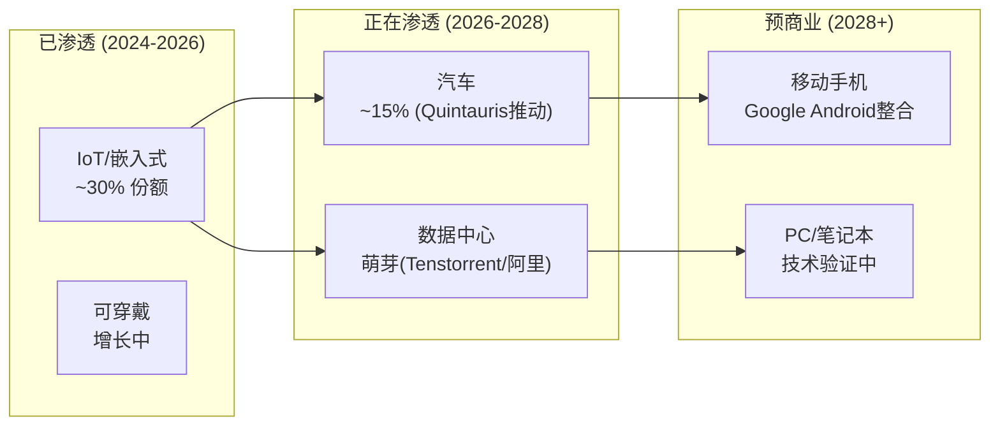
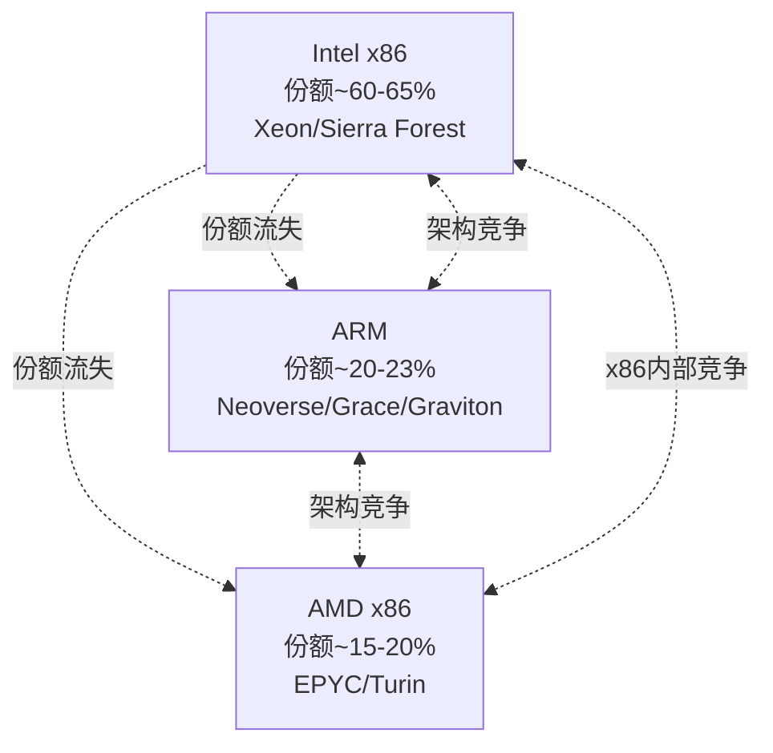

# ARM Holdings (ARM) — 深度研究报告
## Part II: 护城河评估 + 竞争格局 + Reverse DCF

> **免责声明**: 本报告仅供研究参考，不构成投资建议。
> **承接**: Phase 1 (52K chars, 11章) | **本Phase**: 护城河+竞争+信念反演
> **股价**: $128.14 | **市值**: $136.1B | **P/E(TTM)**: 140x

---

## 目录

- 第12章: A-Score v2.0护城河评分
- 第13章: 护城河迁移分析 — 从技术壁垒到生态壁垒
- 第14章: RISC-V专题 — 替代者还是信用违约互换?
- 第15章: x86竞争与custom silicon双向效应
- 第16章: Reverse DCF信念反演 — 140x P/E隐含什么?
- 第17章: 财务三表深挖与盈利质量审计
- 附录B: Phase 2数据锚点注册表

---

## 第12章: A-Score v2.0护城河评分

### 12.1 A-Score评分框架

A-Score v2.0评估公司在10个护城河维度上的壁垒强度(每项0-10分)，加权计算总分。ARM作为纯IP授权商，其护城河特征与制造型半导体公司截然不同。

### 12.2 ARM A-Score逐项评分

| # | 维度 | 评分 | 壁垒类型 | 理由 |
|---|------|:----:|:-------:|------|
| A1 | **品牌/标准** | **9** | N(网络) | ARM指令集是事实标准(>99%手机, >70%嵌入式), "ARM compatible"是产品卖点 |
| A2 | **知识产权** | **8** | T(技术) | 30年CPU设计积累, ~6000+专利, v9/v10持续创新; 但指令集本身可被RISC-V替代 |
| A3 | **切换成本** | **8** | N(网络) | 数十亿行ARM编译代码, 数百万开发者, 数千家OEM设计流程; 迁移RISC-V需3-5年 |
| A4 | **网络效应** | **7** | N(网络) | 开发者→软件→设备→开发者循环; 但单边(非双边)且RISC-V正建立平行生态 |
| A5 | **规模经济** | **6** | S(规模) | R&D摊销到>280亿芯片/年; 但RISC-V开源=零授权费+社区R&D |
| A6 | **进入壁垒** | **5** | T→I(制度) | 30年架构积累难以复制; 但RISC-V证明"另起炉灶"可行 |
| A7 | **定价权** | **7** | N→T | v9 2x v8, CSS 2-3x TLA 证明短期定价权强; 但RISC-V=长期天花板 |
| A8 | **客户锁定** | **7** | N(网络) | 大客户(Apple/QCOM)有ALA深度绑定; 但QCOM收购Ventana=双架构对冲 |
| A9 | **生态系统** | **8** | N(网络) | ARM Total Design生态(EDA/IP/代工)最完整; RISC-V生态尚在建设中 |
| A10 | **可持续性** | **5** | — | RISC-V从IoT向上渗透+中国政策推动 → 5-10年护城河持续性存疑 |

### 12.3 A-Score计算

```
A-Score = Σ(各维度评分 × 权重)

权重: A1(0.10) + A2(0.10) + A3(0.15) + A4(0.10) + A5(0.08)
     + A6(0.07) + A7(0.12) + A8(0.10) + A9(0.10) + A10(0.08)

A-Score = 9×0.10 + 8×0.10 + 8×0.15 + 7×0.10 + 6×0.08
        + 5×0.07 + 7×0.12 + 7×0.10 + 8×0.10 + 5×0.08
        = 0.90 + 0.80 + 1.20 + 0.70 + 0.48
        + 0.35 + 0.84 + 0.70 + 0.80 + 0.40
        = 7.17
```

**A-Score = 7.17/10** — 护城河"宽但在迁移中"

### 12.4 A-Score行业对标

| 公司 | A-Score | 壁垒主类型 | 护城河趋势 |
|------|:------:|:---------:|:--------:|
| **ARM** | **7.17** | **网络(N)** | **下降中** |
| TSMC | ~8.5 | 技术(T)+规模(S) | 稳定 |
| ASML | ~9.0 | 技术(T)+垄断 | 稳定/扩大 |
| NVIDIA | ~8.0 | 网络(N)+技术(T) | 扩大(CUDA) |
| Qualcomm | ~6.5 | 技术(T)+制度(I) | 下降(诉讼风险) |
| AMD | ~5.5 | 技术(T) | 扩大(追赶) |
| Intel | ~4.7 | 技术(T)+规模(S) | 显著下降 |

**ARM vs Intel比较**: 两者的A-Score差异(7.17 vs 4.74)看似很大，但趋势方向一致(都在下降)。Intel的护城河崩塌用了约15年(2005→2020)；ARM的护城河侵蚀可能更快(RISC-V发展速度超过ARM对x86的颠覆速度)，但也可能被ARM的主动防御(CSS/Total Design/Phoenix)延缓。

**关键洞察**: ARM的A-Score高于Intel但低于TSMC/ASML。市场赋予ARM 140x P/E(远高于TSMC的25x和ASML的38x)，意味着**市场不是在为ARM的护城河宽度付费，而是在为ARM的增长速度付费**。如果增长放缓(即使护城河不变)，估值压缩将非常剧烈。

---

## 第13章: 护城河迁移分析 — 从技术壁垒到生态壁垒

### 13.1 护城河迁移检测

A-Score v2.0新增的护城河迁移分析(EVO-INTC-001)检测ARM壁垒类型的变化:

**ARM壁垒类型演变表**:

| 时期 | 主壁垒 | 辅壁垒 | 壁垒代码 | 迁移信号 |
|------|:------:|:------:|:--------:|---------|
| **1990-2005** | 技术(T) | — | T | 低功耗RISC设计领先x86 |
| **2005-2015** | 技术(T) | 网络(N) | T+N | 移动生态建立, 开发者锁定开始 |
| **2015-2020** | 网络(N) | 技术(T) | **N+T** | 技术优势缩小(x86追赶功耗), 但生态锁定强化 |
| **2020-2026** | 网络(N) | 制度(I) | **N+I** | RISC-V技术平价达成, ARM壁垒转向生态+中国限制+安全认证 |
| **2026-2030?** | ? | ? | ? | RISC-V生态追平→ARM壁垒回归什么? |

**迁移检测结果**: ARM的壁垒主类型已从**技术(T)迁移到网络(N)**——这个迁移在A-Score的10个维度中有≥5个维度发生了类型变化(A1/A3/A4/A7/A8从T相关变为N相关)。触发迁移分析。

### 13.2 迁移速度与完整度评估

| 指标 | 值 | 含义 |
|------|---|------|
| 迁移率 | 5/10维度类型变化 | 50% — 中高速迁移 |
| 迁移完整度 | 70% | 旧壁垒(T)已弱化但未消失, 新壁垒(N)已建立但不完全 |
| 迁移方向 | T→N | 从"不可复制的技术"到"难以替代的生态" |
| 迁移健康度 | **中等** | N壁垒比T壁垒更持久(生态比技术更难复制), 但N壁垒面临开源瓦解风险 |

### 13.3 迁移中的脆弱窗口

ARM当前正处于"迁移中间态"——旧壁垒(技术领先)已被RISC-V性能平价侵蚀，新壁垒(生态锁定)尚未完全固化:

**旧壁垒(技术, T)状态**:
- 性能: Tenstorrent Ascalon-X ≈ ARM Neoverse V3 (SPECint ~22) → 技术平价已达成
- 效率: RISC-V在IoT/嵌入式中能效比已接近ARM Cortex-M
- 设计工具: RISC-V EDA支持从Synopsys/Cadence获得全面支持
- **结论**: 技术壁垒从8/10降至约5/10

**新壁垒(生态, N)状态**:
- 软件: 数百万ARM原生应用/驱动/固件 → RISC-V软件生态预计2027-2028追平
- 开发者: ARM开发者工具(DS-5/Keil)成熟 → RISC-V工具链快速改善
- 认证: ARM在安全认证(ISO 26262/IEC 61508)有5-10年领先
- 企业惯性: 大企业IT部门倾向"已验证方案"
- **结论**: 生态壁垒约7-8/10, 但在下降中

**脆弱窗口**: 2026-2028年是ARM护城河的最脆弱期——技术壁垒已被侵蚀，生态壁垒正在被RISC-V追赶。ARM在这个窗口内的战略(v9提价+CSS捆绑+Phoenix)将决定其长期护城河的深度。如果RISC-V在2028年实现软件生态追平，ARM的护城河可能从"宽(7.17)"快速收窄到"中等(5-6)"。

### 13.4 护城河迁移对估值的影响

| 护城河状态 | 合理P/E范围 | 当前P/E | 差距 |
|-----------|:---------:|:------:|:---:|
| 宽且稳定(8-9分, TSMC/ASML) | 25-40x | — | — |
| 宽但迁移中(7-8分, ARM当前) | 30-60x | **140x** | **2.3-4.7x过高** |
| 中等(5-6分, 如果RISC-V追平) | 15-30x | — | — |

即使在护城河"宽"的假设下，ARM的140x P/E也需要极强的增长预期来支撑(这就是为什么市场不是为护城河宽度付费，而是为增长速度付费)。如果护城河从7.17降至5-6(RISC-V追平情景)，合理P/E可能降至15-30x——即使收入增长持续，估值也可能大幅压缩。

---

## 第14章: RISC-V专题 — 替代者还是信用违约互换?

### 14.1 非共识框架: RISC-V不是替代者,是ARM的"CDS"

传统分析师将RISC-V定位为ARM的"长期替代威胁"——如果RISC-V赢了，ARM就输了。但这个二元框架忽略了更精妙的动态:

**H2假说: RISC-V是ARM的信用违约互换(CDS)**

在金融市场中，CDS的存在不需要违约发生——仅仅是CDS的存在和定价就改变了债券的风险溢价。类似地:

1. **RISC-V不需要替代ARM，它只需要存在** — 作为credible替代方案的存在就永久限制ARM的提价能力
2. **Qualcomm $2.4B收购Ventana = 购买"保险"** — 这不是赌RISC-V会赢，而是购买对ARM提价的谈判筹码
3. **Google整合RISC-V到Android = 铺设"逃生通道"** — 不是立即使用，而是确保未来可以使用
4. **中国推动RISC-V = 建设"平行供应链"** — 动机是地缘政治，但效果是技术替代

**CDS类比的精妙之处**:
- CDS价格(RISC-V投资额)反映了市场对"ARM违约"(定价过高)的担忧
- CDS存量越大(RISC-V投资越多)，被保护方(ARM客户)承受ARM提价的意愿越低
- CDS不需要被行使(RISC-V不需要被大规模采用)就能发挥效果——其存在本身就压低了ARM的定价权

### 14.2 RISC-V渗透曲线: 按终端市场



### 14.3 RISC-V关键参与者深度分析

**Tier 1: 战略投资者(买保险)**

**Qualcomm + Ventana Micro ($2.4B, 2025-12)**:
- Qualcomm是ARM最大的移动芯片客户之一
- 收购Ventana获得高性能RISC-V服务器核IP(Veyron V2)
- 战略意图: "如果ARM v10版税太高，我们有RISC-V后备"
- 时间线: Qualcomm RISC-V产品预计2027-2028首次出货
- 对ARM影响: **定价权天花板** — ARM对Qualcomm的版税谈判从此存在硬约束

**Google (Android GKI + 内部芯片)**:
- 2025年将RISC-V全面整合到Android Generic Kernel Image (GKI)
- Tensor芯片部分组件已使用RISC-V微控制器
- 战略意图: 确保Android生态不被ARM指令集锁定
- 时间线: RISC-V Android手机预计2027-2028(中国OEM首发)
- 对ARM影响: **生态壁垒侵蚀** — Android开发者将同时面向ARM和RISC-V

**Tier 2: 性能追赶者(证明可行性)**

**Tenstorrent (Ascalon-X)**:
- Jim Keller(前Apple/AMD/Intel/Tesla芯片架构师)领导
- SPECint ~21-22/GHz ≈ ARM Neoverse V3 ≈ AMD Zen 5
- 证明: RISC-V在通用计算性能上已不是ARM的劣势
- 但: Tenstorrent商业化出货量仍很小，软件生态不成熟

**阿里巴巴/平头哥 (C930)**:
- 服务器级RISC-V处理器, 512位向量单元 + 8 TOPS AI矩阵引擎
- 2025-03起商业交付, 阿里云已部署RISC-V服务器
- 意义: 中国首个大规模RISC-V服务器部署

**Tier 3: 生态构建者(铺设基础设施)**

**Quintauris (汽车RISC-V联盟)**:
- 成员: Bosch, Infineon, NXP, Qualcomm, STMicro
- 目标: 汽车领域RISC-V标准化
- 时间线: 2025-2027 首批汽车RISC-V芯片
- 对ARM影响: 汽车市场是ARM的高价值增量市场, Quintauris直接威胁这个增长

**RISC-V International (标准组织)**:
- 总部: 瑞士(刻意规避单边制裁风险)
- 会员: >4000家(vs ARM ~500+被授权方)
- 中国会员: 快速增长, 8个中国政府机构推动采用

### 14.4 RISC-V对ARM定价权的量化影响

假设RISC-V不替代ARM但限制提价能力:

| 情景 | ARM提价能力 | v10版税率预期 | 对收入影响(FY2030) |
|------|:--------:|:----------:|:---------------:|
| **无RISC-V** | 不受约束 | v9的1.5-2x | 基准 |
| **RISC-V存在(当前)** | 有约束 | v9的1.0-1.3x | **-15~25% vs 基准** |
| **RISC-V生态追平(2028)** | 严重约束 | v9的0.8-1.0x(无法提价) | **-25~40% vs 基准** |

**量化方法**:
- 基准情景(无RISC-V): FY2030版税$5.5B (含v10提价)
- CDS情景(RISC-V约束提价): FY2030版税$3.5-4.5B
- 差额: **$1.0-2.0B/年** 或 **当前市值的10-20%**

这就是H2("RISC-V是CDS")的估值影响: 不是ARM消失的风险(那需要RISC-V完全替代ARM，概率<10%)，而是ARM不能如市场预期般提价的风险(概率>50%)。

### 14.5 ARM的RISC-V防御策略评估

| 策略 | 有效性 | 持久性 | 副作用 |
|------|:-----:|:-----:|--------|
| **v9强制升级** | 高(短期) | 低(加速RISC-V采用) | 客户反感, Qualcomm诉讼 |
| **CSS捆绑** | 高(中期) | 中(增加切换成本) | 与被授权方竞争 |
| **DreamBig收购(chiplet)** | 中 | 中 | 技术差异化 |
| **Total Design生态** | 中 | 高 | 需要持续投资 |
| **Phoenix(自研芯片)** | 低(对RISC-V防御) | 低 | 疏远被授权方, 反而加速RISC-V |

**综合评估**: ARM的防御策略在短期(2-3年)有效，但中期(5年+)效果递减。CSS是最佳平衡策略(增加客户价值+提高切换成本)，但Phoenix反而可能加速RISC-V采用(被授权方担心ARM成为竞争对手→更积极评估RISC-V替代)。

---

## 第15章: x86竞争与custom silicon双向效应

### 15.1 ARM vs x86: 数据中心的三体博弈

数据中心CPU市场不是ARM vs x86的二元竞争，而是三方博弈:



**Intel的困境对ARM有利**: Intel在制程(10nm+延迟多年)、架构(单核性能落后AMD)和战略(IDM模式效率低)三方面陷入困境。Intel在服务器市场的份额从2019年的>95%降至2025年的~60-65%。ARM是这个份额流失的受益者之一(AMD是另一个)。

但ARM和AMD的利益并非完全对齐:
- AMD (x86): 从Intel抢份额, 同时防御ARM
- ARM: 同时从Intel和AMD抢份额

### 15.2 Custom Silicon: ARM的隐形盟友

超大规模客户(AWS/Google/Microsoft)的custom silicon趋势对ARM有复杂影响:

**短期正面(2024-2027)**:
- 每个custom silicon项目(Graviton/Axion/Cobalt)都需要ARM授权 → 版税增量
- Custom silicon替代Intel/AMD → ARM份额上升
- CSS加速: custom silicon客户是CSS的核心采用者

**长期风险(2028+)**:
- Custom silicon客户积累了足够的芯片设计能力后, 可能转向RISC-V
- AWS/Google已有数千名芯片工程师 → 迁移RISC-V的技术障碍比小公司低
- 如果一个超大规模客户成功推出RISC-V服务器芯片, 将是ARM的"黑天鹅"

**Meta的RISC-V先例**: Meta在其AI加速器MTIA v3中已使用RISC-V作为协处理器。虽然不是主CPU(Phoenix瞄准的正是Meta的主CPU需求)，但证明超大规模客户愿意并且有能力在关键芯片中采用RISC-V。

### 15.3 ARM在数据中心的竞争优势vs劣势

| 维度 | ARM优势 | ARM劣势 |
|------|---------|---------|
| **能效比** | ARM核心功耗更低 → TCO优势 | Intel/AMD在绝对性能上仍有优势(高频) |
| **定制灵活性** | ALA允许深度定制(Apple级) | x86仍有更大软件兼容性 |
| **价格** | 版税模型(无芯片采购) vs Intel/AMD芯片采购 | 但需客户自行设计+流片(NRE高) |
| **生态系统** | Linux/云原生对ARM支持完善 | 企业on-prem仍以x86为主 |
| **AI推理** | ARM CPU+NVIDIA GPU组合(GB200) | AMD MI300有x86 CPU+GPU单芯片方案 |

---

## 第16章: Reverse DCF信念反演 — 140x P/E隐含什么?

### 16.1 信念反演方法论

Reverse DCF不是"ARM值多少钱"的正向估值，而是回答: **"如果ARM值$136B(当前市值)，市场需要相信什么?"**

这个方法对ARM尤其重要，因为:
1. ARM从未有过"正常"P/E(IPO以来142x-1073x)，正向DCF缺乏锚点
2. 传统DCF给出$6.66-$80的范围太大——说明模型对假设极端敏感
3. Reverse DCF能将"价格"翻译为"信念集合"，更容易验证

### 16.2 Reverse DCF: 基础框架

**当前市值**: $136.1B
**终态假设**: 10年后ARM进入稳态增长，市场给予25-35x终态P/E

**情景A: 25x终态P/E (成熟软件公司)**
```
需要: $136.1B / 25 = $5.44B 稳态净利润
当前: $801M TTM净利润
隐含增长: 需要6.8x (净利润CAGR ~21% for 10年)
隐含收入: $5.44B / 25%净利率 = $21.8B (当前4.7x)
隐含收入CAGR: ~17% for 10年
```

**情景B: 30x终态P/E (高质量平台公司)**
```
需要: $136.1B / 30 = $4.54B 稳态净利润
当前: $801M TTM净利润
隐含增长: 需要5.7x (净利润CAGR ~19% for 10年)
隐含收入: $4.54B / 25%净利率 = $18.2B (当前3.9x)
隐含收入CAGR: ~14.5% for 10年
```

**情景C: 35x终态P/E (Visa/MC级别网络平台)**
```
需要: $136.1B / 35 = $3.89B 稳态净利润
当前: $801M TTM净利润
隐含增长: 需要4.9x (净利润CAGR ~17% for 10年)
隐含收入: $3.89B / 30%净利率 = $13.0B (当前2.8x)
隐含收入CAGR: ~10.7% for 10年
```

> **注**: 不同终态P/E假设导致隐含增长要求差异巨大——这是ARM估值不确定性的核心来源

### 16.3 隐含信念集合

将Reverse DCF的隐含假设分解为6个可独立验证的子信念:

| # | 子信念 | 隐含值(情景B) | 验证方法 | 脆弱度 |
|---|--------|:------------:|---------|:------:|
| B1 | 收入CAGR(10年) | ~14.5% | 历史IP授权商极少持续>15% | **高** |
| B2 | 净利率扩张 | 17%→25%+ | 需SBC/R&D占比下降 | **高** |
| B3 | ARM定价权不受RISC-V约束 | v10+可继续提价 | H2假说直接挑战 | **极高** |
| B4 | 数据中心占比从10%→40%+ | DC成为最大业务 | 依赖CSS渗透+Phoenix | **高** |
| B5 | Arm China收入持续增长 | 中国不减速 | 当前+7.5% vs 集团+24% | **中** |
| B6 | SoftBank不减持/不引发流动性危机 | 90%持股稳定 | $200亿保证金+多项投资承诺 | **中** |

### 16.4 信念脆弱度分析

**最脆弱信念: B3 (ARM定价权)**

这是H2("RISC-V=CDS")直接挑战的信念。如果RISC-V在2028年软件生态追平ARM:
- v10(如果发布)可能无法实现v9→v10的再次翻倍提价
- CSS版税率可能面临下行压力(客户以RISC-V替代相要挟)
- ARM的收入CAGR从14.5%降至10-12% → 10年后收入$12-14B(vs情景B的$18.2B)
- 净利率无法扩张至25%(需在R&D上加倍投入以对抗RISC-V)
- **估值影响**: 稳态净利润$2.5-3.0B × 25x P/E = $63-75B市值 → **当前$136B的46-55%**

**次脆弱信念: B2 (净利率扩张)**

ARM当前GAAP净利率仅17.2%(TTM)。要达到25%+:
- R&D/收入需从56%降至35-40% → 需要收入增长远快于R&D(难以在Phoenix投资期实现)
- SBC需降至收入的5-8%(当前估计~15-17%)
- 但如果ARM在Phoenix/AI方面持续投入，R&D率下降不太可能

**较强信念: B4 (数据中心增长)**

这是市场最有信心的信念——数据中心确实在高速增长(>100% YoY)。但需区分:
- **版税增长**: 确实强劲(出货量+版税率双升)
- **利润增长**: 不确定(Phoenix投资可能吃掉版税利润增量)

### 16.5 信念翻转分析

**问题**: 最少几个信念失败，就能改变ARM的评级(从中性→审慎)?

| 翻转场景 | 失败信念 | 市值影响 | 下行幅度 |
|---------|---------|:-------:|:-------:|
| **单信念翻转** | B3(定价权) | ~$75B | **-45%** |
| **双信念翻转** | B3+B2(定价权+利润率) | ~$50B | **-63%** |
| **三信念翻转** | B3+B2+B6(+SoftBank) | ~$30B | **-78%** |

**结论**: ARM的估值对B3(定价权/RISC-V)极度敏感。仅一个信念翻转就可能导致45%下行。这与A-Score的护城河迁移分析一致——ARM的护城河正在从技术迁移到生态，如果生态壁垒(B3依赖的基础)不能充分建立，整个估值框架将坍塌。

### 16.6 隐含信念vs分析师共识

| 信念 | Reverse DCF隐含 | 分析师共识(FMP Estimates) | 差异 |
|------|:-------------:|:--------------------:|:---:|
| FY2030收入 | $18.2B (情景B) | $11.2B | **+63%** |
| FY2030净利润 | $4.5B | $5.0B | -10% |
| FY2030净利率 | 25% | 45% | 隐含率较保守 |
| 4年rev CAGR | 14.5% (10年) | 22% (4年) | 共识更激进但更短 |

**关键发现**: 分析师共识的FY2030收入($11.2B)显著低于Reverse DCF的情景B隐含值($18.2B)。但分析师预期的净利率(45%!)远高于Reverse DCF假设(25%)。

这意味着市场的估值逻辑更接近: **"ARM不需要收入$18B，只需要$11B但利润率45%"**。但45%的净利率假设在ARM当前17%的基础上需要+28pp扩张——在R&D持续高投入(Phoenix/v10)和SBC持续(IPO后遗留)的背景下，这是一个极其激进的假设。

如果净利率无法达到45%而停留在25%:
- FY2030净利润: $11.2B × 25% = $2.8B (vs 共识$5.0B)
- 30x P/E: 市值$84B
- **当前$136B → -38%下行**

---

## 第17章: 财务三表深挖与盈利质量审计

### 17.1 损益表深度分析

**收入确认政策审计**:

ARM的收入确认涉及两类:
1. **版税收入**: 按客户报告的芯片出货量 × 约定费率确认。滞后1-2季度。确认政策相对直接。
2. **授权收入**: 复杂。可能在合同签署时一次性确认，也可能在达成里程碑时分期确认(IFRS 15多重履约义务)。

**FY2025收入质量红旗**:
- 应收增量/收入增量 = 82% → 收入"现金转化"极低
- 前5客户占56% → 收入集中度高
- SoftBank占授权~30% → 关联方收入浓度高
- Q4 FY2025收入$1,241M大幅跳升(vs Q3 $983M, +26% QoQ) → 可能存在年末集中确认

**Non-GAAP调整规模**:

| Q3 FY2026 | GAAP | Non-GAAP | 调整额 | 调整占比 |
|-----------|-----:|--------:|-------:|:-------:|
| 营业利润 | $191M | ~$505M | ~$314M | **62%** |
| EPS | $0.21 | $0.43 | $0.22 | **105%** |

Non-GAAP营业利润是GAAP的2.6倍。在所有半导体公司中，ARM的GAAP-to-Non-GAAP调整幅度是最大的之一(参考NVIDIA~30%, AMD~20%, QCOM~15%)。

### 17.2 资产负债表质量

**强项**:
- 净现金: $1.73B(FY2025) → 零杠杆
- 无长期债务(仅$316M资本租赁)
- Altman Z-Score: 29.95-35.0 → 零破产风险
- 流动比率: 5.2 → 极强短期流动性

**关注项**:
- 应收账款$1.749B (FY2025) → 占总资产20% → 异常高
- 商誉$1.620B (2002年SoftBank收购遗留) → 占总资产18%
- 无形资产$151M → 正在摊销
- Deferred Revenue $911M (流动$209M+非流动$702M) → 这是**未来收入的指示器**

**递延收入$911M的意义**:
递延收入代表已签约但未确认的授权收入。$911M = ARM当前约2.4个季度的授权收入(按Q3 FY26 $505M/季计)。这是"收入管道"的指标——说明ARM至少有2-3个季度的授权收入"已锁定"。但它也意味着授权收入的增长来源部分是存量合同确认，而非全部来自新签约。

### 17.3 现金流质量深挖

FY2025现金流出现了严重的警告信号:

| 指标 | FY2023 | FY2024 | FY2025 | TTM | 趋势 |
|------|:------:|:------:|:------:|:---:|:----:|
| OCF ($M) | 739 | 1,090 | 397 | 1,523 | 年度骤降但TTM回升 |
| FCF ($M) | 646 | 947 | 178 | 970 | 年度骤降 |
| OCF/NI | 1.41 | 3.56 | 0.50 | 1.90 | FY2025异常低 |
| FCF/NI | 1.23 | 3.09 | 0.22 | 1.21 | FY2025极低 |
| CapEx ($M) | 93 | 143 | 219 | 555 | 持续上升(Phoenix?) |
| DSO (天) | 159 | 127 | 173 | 128 | FY2025恶化 |

**FY2025 OCF=$397M的分解**:
- 净利润: $792M
- 折旧摊销: +$183M
- 递延税: -$218M (大额税收优惠逆转)
- SBC: +$0M (FMP数据问题, 实际应有$700-800M)
- 营运资本变动: **-$1,465M** (罪魁祸首)
  - 应收增加: -$743M
  - 其他营运资本: -$722M

**诊断**: FY2025的OCF骤降主要是营运资本恶化(应收暴增+其他项目)。如果这是一次性事件(大额年末授权合同尚未收款)，FY2026 OCF应强劲回升。但如果这是趋势性的(收入确认激进化)，盈利质量将持续承压。

TTM OCF=$1,523M(更接近正常水平)提供了一些安慰——Q1-Q3 FY2026的OCF($365M+其他)弥补了FY2025年度数据的弱势。但DSO未明显改善(TTM 128天 vs FY2025 173天)表明应收问题尚未完全解决。

### 17.4 SBC: 被低估的股东成本

FMP报告FY2025 SBC=$0是数据错误。交叉验证:

**方法1: GAAP/Non-GAAP差异推算**
- Q3 FY2026: GAAP营业利润$191M, Non-GAAP~$505M → 差异$314M
- 其中SBC估计占~$220-250M(其余为无形资产摊销等)
- **年化SBC估计: $880M-$1,000M**

**方法2: IPO后股份稀释**
- FY2024: 1,032M股 → FY2026 Q3: 1,062M股
- 增加~30M股(~2.9%), 按$128/股 = $3.8B市值稀释
- 但部分是IPO时的新股发行, 实际SBC稀释可能为$2-3B/3年 = $700-1000M/年

**方法3: 同行参考**
- FY2024 SBC = $1,037M (IPO首年, 含一次性)
- FY2025+正常化: 估计$700-900M/年(IPO授予的RSU持续摊销)

**综合估计: ARM年度SBC约$700-900M**, 占收入的15-19%。这意味着:
- 真实Non-GAAP净利率(调整SBC后)约30-35%, 而非GAAP的17%
- 但GAAP才是"真实成本"——SBC是员工薪酬的一部分
- FCF(加回SBC)约$900-1100M/年 → FCF收益率~0.7-0.8%(对$136B市值)

### 17.5 盈利质量综合评分

| 维度 | 评分(1-10) | 理由 |
|------|:---------:|------|
| 收入质量 | **5** | 关联交易30%+应收暴增+DSO极高 |
| 利润质量 | **4** | GAAP/Non-GAAP差距最大(2.6x)+SBC数据缺失 |
| 现金流质量 | **5** | FY2025 OCF/NI仅0.5+营运资本-$1.5B |
| 资产负债表质量 | **8** | 净现金+零杠杆+强流动性 |
| 综合盈利质量 | **5.5/10** | 偏低——与95%毛利率和140x P/E的外在形象不匹配 |

**H1假说验证进度**:
- "ARM的盈利质量比表面差50%" — Phase 2数据支持: GAAP营业利润仅为Non-GAAP的38%, OCF仅为NI的50%, 应收增量/收入增量=82%, SBC占收入15-19%
- **H1置信度**: 从Phase 0.75的初始40% → **升至60%**

---

## 附录B: Phase 2数据锚点注册表

| DM编号 | 数据点 | 值 | 来源 | 置信度 | 引用章节 |
|:------:|--------|---|------|:------:|:-------:|
| DM-A01 | A-Score | 7.17/10 | 计算 | M | 12.3 |
| DM-A02 | 护城河迁移率 | 50%(5/10维度) | 分析 | M | 13.2 |
| DM-A03 | 脆弱窗口期 | 2026-2028 | 分析 | M | 13.3 |
| DM-R01 | RISC-V全球份额 | ~25%/200亿核 | RISC-V International | M | 14.2 |
| DM-R02 | Qualcomm Ventana | $2.4B(2025-12) | WebSearch | H | 14.3 |
| DM-R03 | Tenstorrent性能 | SPECint~22/GHz | WebSearch | M | 14.3 |
| DM-R04 | RISC-V定价影响 | -15~25%版税(FY2030) | 估算 | L | 14.4 |
| DM-V01 | Reverse DCF情景B | 14.5% rev CAGR需求 | 计算 | M | 16.2 |
| DM-V02 | 最脆弱信念 | B3(定价权) | 分析 | M | 16.4 |
| DM-V03 | 单信念翻转下行 | -45% | 计算 | M | 16.5 |
| DM-V04 | 共识FY2030净利率 | 45% | FMP Estimates | M | 16.6 |
| DM-F01 | FY2025 DSO | 173天(vs 同行70-80) | FMP/计算 | H | 17.1 |
| DM-F02 | GAAP/Non-GAAP差距 | 2.6x(Q3 FY26) | FMP Quarterly | H | 17.1 |
| DM-F03 | 年度SBC估计 | $700-900M | 交叉验证 | M | 17.4 |
| DM-F04 | 盈利质量综合评分 | 5.5/10 | 分析 | M | 17.5 |
| DM-F05 | 递延收入 | $911M | FMP Balance | H | 17.2 |
| DM-F06 | FY2025营运资本变动 | -$1,465M | FMP Cashflow | H | 17.3 |
